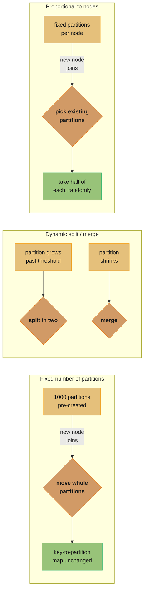
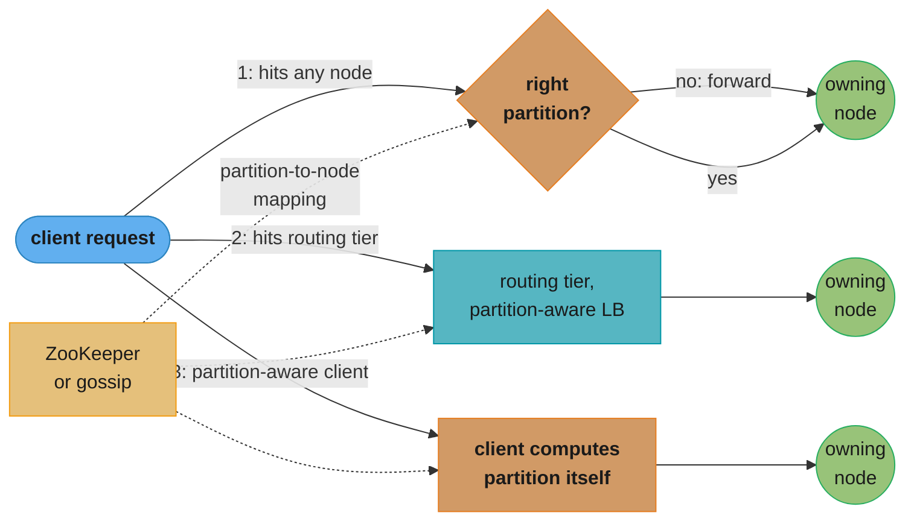
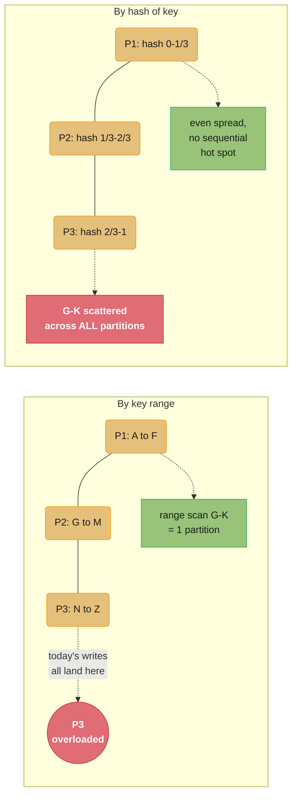
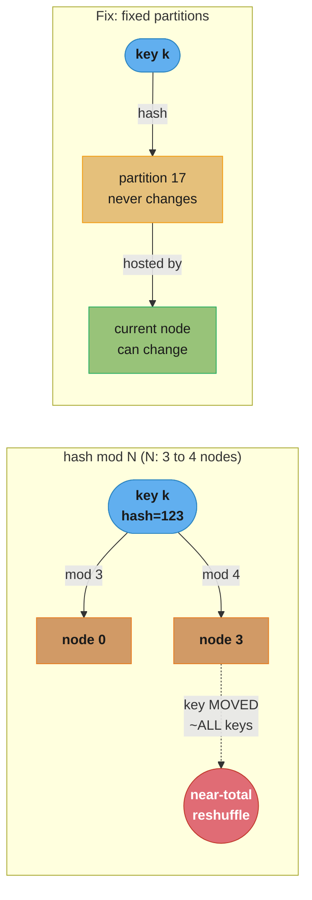
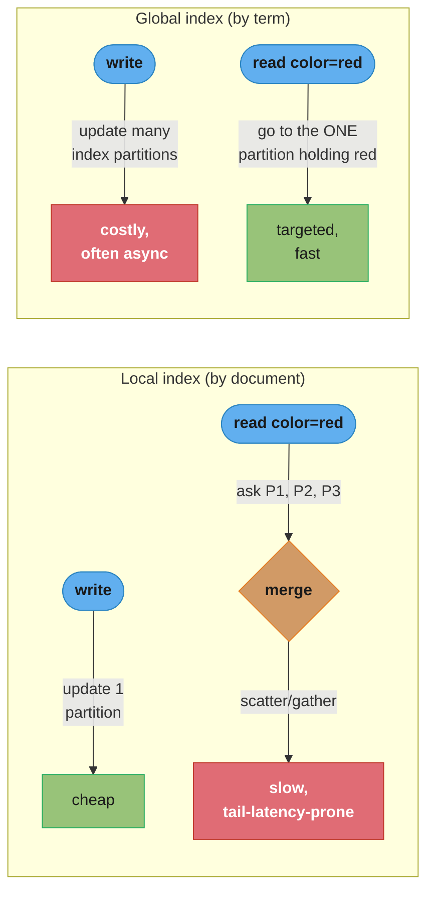

# Chapter 6: Partitioning

> Part II — Distributed Data · DDIA (Kleppmann) · builds on Ch 5, leads to Ch 7 (transactions)

## Chapter Map

Replication (Ch 5) copies the *whole* dataset to several nodes; **partitioning** (a.k.a.
**sharding**) splits the dataset into pieces so each piece lives on a different node, letting
you scale storage and throughput beyond one machine. In practice partitioning and replication
are combined: each partition is also replicated. This chapter covers how to *split* data
fairly, how to keep **secondary indexes** working across partitions, how to **rebalance** when
nodes are added/removed, and how requests find the right partition.

**TL;DR:**
- Partition by **key range** (good for range scans, prone to hot spots) or by **hash of key**
  (even spread, kills range scans) — both can suffer from **skew** and **hot spots**.
- Secondary indexes are partitioned two ways: **local (by document)** — scatter/gather reads;
  **global (by term)** — slower writes, fast reads.
- **Rebalancing** must move as little data as possible; avoid `hash mod N` (moves everything);
  use fixed partitions, dynamic partitioning, or partition-per-node.
- **Request routing** (which node has the key) is a service-discovery problem solved by a
  coordinator (ZooKeeper), gossip, or a routing tier.

## The Big Question

> "My data and traffic exceed one machine. How do I split them across many machines so the load
> is *even* — without creating a hot spot that overwhelms one node, and without secondary
> indexes and rebalancing becoming a nightmare?"

Analogy: partitioning is shelving a huge library across many rooms. Shelve by author surname
A–Z (range) and you can browse "all authors S" easily, but the popular-author room gets mobbed
(hot spot). Shelve by a hash of the title and the crowd spreads evenly, but "all S authors" now
means visiting every room (no range scan). The whole chapter is managing this tension.

---

## 6.1 Partitioning and Replication

Partitioning is almost always combined with replication: each record belongs to exactly one
partition, but copies of that partition are stored on several nodes for fault tolerance. A node
may store several partitions. With a single-leader model per partition, each node is leader for
some partitions and follower for others. The two concerns are largely independent, so the rest
of the chapter ignores replication and focuses on the partitioning scheme.

**The goal is even distribution.** If partitioning is unfair, some partitions hold more data or
get more queries — a **skewed** partition that's disproportionately loaded is a **hot spot**,
and it negates the benefit of partitioning (you're bottlenecked on one node again).

## 6.2 Partitioning of Key-Value Data

### Partitioning by key range

Assign a continuous **range of keys** to each partition (like volumes of an encyclopedia: A–B,
C–D…). Ranges needn't be evenly spaced — the boundaries adapt to the data. **Pro:** keys are
sorted within a partition, so **range scans are efficient** (e.g. fetch all readings for a
sensor over a time window). **Con:** certain access patterns create hot spots. The classic
example: a time-series database keyed by timestamp writes *all of today's* data to one
partition (the "today" range) while others sit idle. Fix by prefixing the key with something
else (e.g. sensor name) so writes spread, at the cost of needing a separate query per prefix for
a time-range scan. Used by HBase, Bigtable, RethinkDB, MongoDB (older).

### Partitioning by hash of key

Run each key through a **hash function** (which must distribute well; a cryptographic hash isn't
needed, but the language's built-in `hashCode` may be unsuitable — Java's hashes the same string
differently across processes) and assign hash ranges to partitions. This spreads keys **evenly**
and destroys hot spots from sequential keys — but you **lose efficient range queries** because
adjacent keys land on different partitions (a range scan must hit all partitions). Cassandra
offers a compromise: a **compound primary key** where only the *first* column is hashed (picking
the partition) and the rest are stored sorted, so you can do an efficient range scan on the
remaining columns *within* a single partition (e.g. partition by user ID, range-scan that user's
updates by timestamp).

### Skewed workloads and relieving hot spots

Even hashing doesn't help when *one key* is extremely hot — a celebrity's user ID receiving
millions of writes (everyone commenting on the same event). All those go to the same partition
because they share a key. Most systems can't auto-correct this; the application must, e.g. by
appending a random number (say 0–99) to the hot key, splitting its writes across 100 keys/
partitions. The cost: reads must now query all 100 variants and combine them, and you must track
which keys are hot. There's no automatic remedy.

### Decoding the hot-spot arithmetic

The chapter states the hot-spot problem qualitatively. Putting one number on it makes clear why
"add more partitions" is not the fix. The measure is the **skew factor**:

```
  skew factor = max_partition_load / mean_partition_load

  with P partitions and perfectly uniform keys, every partition holds 1/P of
  the load, so mean_partition_load = 1/P and skew factor = 1.0
```

**In plain terms.** "Compare the busiest partition against the average one. A skew factor of 1.0
means the work is spread perfectly; a skew factor of 30 means one node is doing thirty times its
share while the rest idle."

The reason this matters is that the skew factor, not the partition count, is what you are
bottlenecked on. Your cluster's throughput ceiling is set by its hottest partition.

| Symbol | What it is |
|--------|------------|
| `P` | Number of partitions in the cluster |
| `1/P` | The fair share — the fraction of load one partition carries if keys spread evenly |
| `max_partition_load` | The fraction of total load landing on the busiest partition |
| `skew factor` | How many times the average a hot partition works. `1.0` = perfect, higher = worse |

**Walk one example.** One celebrity key on a 100-partition cluster:

```
  Cluster: P = 100 partitions.  One celebrity key draws 30% of all traffic.

  uniform baseline    mean share = 1/P = 1/100                    =  1.00%
  non-hot traffic     the other 70%, spread over 100 partitions   =  0.70% each
  hot partition       its celebrity key + its ordinary share
                      0.30 + 0.0070                               = 30.70%

  skew factor = max / mean = 30.70% / 1.00%                       = 30.7x
```

That partition does 30.7 times the work of an average one, and **growing the cluster does not
help**: the key is indivisible, so 30% of the load sits on one partition whether you run 100
partitions or 10,000. This is precisely why the chapter says most systems cannot auto-correct it.

**Walk the fix.** The chapter's remedy — append a random number 0–99 to the hot key:

```
  hot key's 30% split across 100 sub-keys   0.30 / 100                =  0.30%
  plus that partition's ordinary share                               +  0.70%
  new max partition share                                             =  1.00%

  skew factor = 1.00% / 1.00%                                         =  1.0x
```

Perfectly flat again. The price is exactly what the chapter names: every read of that key now
fans out to all 100 variants and merges them, and the application must track which keys are hot
enough to deserve the treatment. Splitting a key that is *not* hot costs you the fan-out for
nothing.

## 6.3 Partitioning and Secondary Indexes

Secondary indexes (find all items with `color = red`) don't map neatly to partitions because
they don't identify a single key. Two approaches:

### Partitioning secondary indexes by document (local index)

Each partition maintains its *own* secondary index covering only the documents in that partition
— a **local index** / *document-partitioned* index. **Writes are cheap** (update only the local
index on the one partition holding the document). But a **read by secondary index must query
every partition** and combine results — **scatter/gather**, which is expensive and prone to tail
latency (you wait for the slowest partition). Used by MongoDB, Cassandra, Elasticsearch, Riak.

### Partitioning secondary indexes by term (global index)

Build a **global index** covering all partitions, but **partition the index itself** by the
indexed term (e.g. the index for `color=red` lives on one partition, `color=blue` on another) —
a *term-partitioned* index. **Reads are efficient** (go straight to the partition holding that
term, no scatter/gather). But **writes are slower and more complex**: a single document write
may touch *multiple* index partitions (one per indexed field value), so the index update is a
distributed operation, often done **asynchronously** (the index lags the write).

### Decoding the scatter/gather cost

The whole local-vs-global tradeoff reduces to one count — how many partitions a single read has
to touch:

```
  local (document-partitioned) index    partitions touched per read = P
  global (term-partitioned) index       partitions touched per read = 1

  probability a scatter/gather query is slow = 1 - (1 - p_slow)^P
```

**Stated plainly.** "A local index makes every secondary-index read ask *every* partition, so the
query is only as fast as the unluckiest partition it spoke to — and the more partitions you have,
the more likely at least one of them is having a bad moment."

| Symbol | What it is |
|--------|------------|
| `P` | Number of partitions the read must fan out to |
| `p_slow` | Chance one partition answers slower than your latency budget |
| `(1 - p_slow)^P` | Chance *every* partition came back in time — the query is fast only if all did |
| `1 - (1 - p_slow)^P` | Chance the query is slow because at least one partition lagged |

**Walk one example.** Each partition meets a 10 ms budget 99% of the time, so `p_slow = 0.01`:

```
                              partitions   P(all under 10 ms)     P(query is slow)
  global (term) index              1        0.99^1   = 0.9900          1.00%
  local (document) index          10        0.99^10  = 0.9044          9.56%
  local (document) index         100        0.99^100 = 0.3660         63.40%
```

At 100 partitions, **63% of scatter/gather queries hit at least one slow partition** even though
each individual partition is meeting its p99 budget. That is the precise meaning of "prone to
tail latency": the fan-out converts a rare per-partition hiccup into the common case. The global
index reads a single partition and stays at 1.00%, which is what buys it the "reads are
efficient" label — paid for by writes that must touch one index partition per indexed field
value, which is why they are pushed asynchronous.

## 6.4 Rebalancing Partitions

Over time you add nodes (more CPU/RAM/disk), nodes fail, datasets grow — so partitions must
**rebalance** across nodes. Requirements: distribute load fairly afterward; keep the database
serving reads/writes *during* rebalancing; move **no more data than necessary** (minimize
network/disk I/O).

### Strategies

- **DON'T use `hash mod N`.** If `partition = hash(key) mod N` and you change N (add a node),
  *almost every key* moves to a different partition — catastrophic rebalancing. This is the
  anti-pattern the chapter explicitly warns against.
- **Fixed number of partitions.** Create *many more* partitions than nodes up front (e.g. 1000
  partitions on 10 nodes ⇒ 100 each). To add a node, move *whole partitions* off existing nodes
  onto it — only the moved partitions transfer, the partition-to-key assignment never changes.
  Simple and widely used (Riak, Elasticsearch, Couchbase). Downside: you must guess the right
  partition count up front; too few limits scaling, too many adds overhead.
- **Dynamic partitioning.** Partitions **split** when they grow past a size threshold (and
  **merge** when they shrink), like a B-tree splitting pages. The number of partitions adapts to
  the data volume. Used by HBase and RethinkDB. Caveat: an empty database starts with one
  partition (one node) until the first split — some systems allow **pre-splitting**.
- **Partitioning proportional to nodes.** A *fixed number of partitions per node*; when a new
  node joins, it randomly picks existing partitions to split and takes half of each. Used by
  Cassandra and Ketama. Keeps partition size stable as the dataset and cluster grow together.

### Decoding the rebalance cost

"Move no more data than necessary" is a number you can compute. For a cluster growing from `N`
nodes to `N + 1`:

```
  hash mod N          fraction of keys that move = N / (N + 1)
  fixed partitions    fraction of keys that move = 1 / (N + 1)
```

**What the formula is telling you.** "Under `hash mod N`, adding one node reshuffles nearly the
whole dataset; with a fixed partition count, adding one node moves only the one-in-N-plus-one
slice the new node is supposed to own — which is the theoretical minimum."

| Symbol | What it is |
|--------|------------|
| `N` | Node count before the new node joins |
| `N + 1` | Node count after |
| `hash(key) mod N` | Maps a key straight onto a node. Changing `N` changes the answer for nearly every key |
| `1 / (N + 1)` | The fair share of one node after the join — the least data that *must* move |
| `N / (N + 1)` | What actually moves under `mod N`; approaches 100% as the cluster grows |

**Walk one example.** The chapter's own numbers — 1000 partitions, 10 nodes, adding an eleventh:

```
  hash mod N        a key stays put only when h mod 10 == h mod 11.
                    Over one full 110-value cycle that holds for h = 0..9 only.
                      stay  = 10/110 = 1/11 =  9.09%
                      moved = 1 - 1/11 = 10/11 = 90.91%

  fixed partitions  1000 partitions, created up front, never renumbered.
                      before  1000 / 10  = 100.0 partitions per node
                      after   1000 / 11  =  90.9 partitions per node
                      the new node is handed 90.9 whole partitions
                      moved = 90.9 / 1000 = 1/11 = 9.09%

  90.91% / 9.09% = 10x less data crosses the network for the same rebalance
```

The trap gets *worse* the bigger your cluster, which is the opposite of what you want:

```
  N -> N + 1        keys moved under hash mod N
    3 ->  4                  75.00%
    4 ->  5                  80.00%
   10 -> 11                  90.91%
  100 -> 101                 99.01%
```

**Why the partition count must stay fixed.** The reason fixed partitioning wins is that it
separates two mappings: `key -> partition` (computed by hash, frozen forever) and
`partition -> node` (a lookup table you are free to edit). `hash mod N` fuses them into one
expression, so touching `N` rewrites both. Only whole partitions move; no key is ever rehashed.

**Read it like this.** The proportional-to-nodes strategy adds a second knob — `V`, the number of
partitions (**vnodes**, Cassandra's tokens) each node owns. More vnodes per node means each node's
load is the sum of more independent random slices, so its relative spread shrinks like
`1 / sqrt(V)`:

```
  V vnodes per node        relative spread of node load = 1 / sqrt(V)

    V =   1                1 / sqrt(1)    = 100.00%    wildly uneven
    V =   4                1 / sqrt(4)    =  50.00%
    V =  16                1 / sqrt(16)   =  25.00%    Cassandra 4.0 default
    V = 100                1 / sqrt(100)  =  10.00%
    V = 256                1 / sqrt(256)  =   6.25%    Cassandra's pre-4.0 default
```

Diminishing returns are steep: going from 1 to 16 vnodes cuts the spread by 75 percentage points,
while going from 16 to 256 buys only another 18.75. That is why real defaults sit in the tens-to-
hundreds range rather than the thousands — past that point you are paying bookkeeping and repair
overhead per vnode for load-balancing gains you can no longer measure.



Caption: each strategy differs in what triggers a rebalance and what stays fixed — fixed partitions keep the key-to-partition map constant and move whole partitions; dynamic partitioning reacts to a size threshold; proportional-to-nodes keeps partition count per node stable as the cluster grows.

### Automatic versus manual rebalancing

Fully **automatic** rebalancing is convenient but dangerous: rebalancing is expensive
(reroutes requests, moves data) and, combined with **automatic failure detection**, can cascade
— a node appears overloaded, the system rebalances onto it, increasing its load, triggering more
rebalancing. Many systems therefore keep a **human in the loop** (rebalancing proposed
automatically but committed by an operator) to prevent surprises.

## 6.5 Request Routing

Once partitioned, a client's request must reach the node holding the relevant partition — and
partitions move during rebalancing. This is a **service discovery** problem with three common
shapes:

1. **Clients contact any node** (e.g. round-robin via a load balancer); if that node doesn't own
   the partition, it forwards the request to the right one and relays the reply. (Cassandra,
   Riak use a **gossip protocol** so any node knows the cluster's partition assignment.)
2. **A routing tier** sits in front; clients hit it, and it forwards to the right node (a
   partition-aware load balancer).
3. **Clients are partition-aware** and connect directly to the owning node.

The hard part is **keeping everyone's view of partition assignments current** as rebalancing
moves them. Many systems use a separate coordination service — **ZooKeeper** — that authoritatively
tracks the cluster's partition-to-node mapping; nodes register there and routing components
subscribe to changes (HBase, Kafka, SolrCloud). Cassandra/Riak instead gossip the mapping among
nodes. Routing decisions ultimately depend on a consensus/coordination layer (→ Ch 9).



Caption: all three routing shapes ultimately depend on the same partition-to-node mapping — ZooKeeper centralizes it (nodes register, routers subscribe) while Cassandra/Riak gossip it peer-to-peer instead.

**Parallel query execution.** Simple key-value access only needs to route to one partition. But
**massively parallel processing (MPP)** analytic databases break a complex query into stages
that run across many partitions in parallel and combine results — foreshadowing the batch/stream
processing of Part III.

---

## Visual Intuition







Caption: every partitioning decision is a read-vs-write and even-spread-vs-range-scan tradeoff;
the recurring failure mode is the hot spot, and the recurring trap is `hash mod N`.

---

## Key Concepts Glossary

- **Partitioning (sharding)** — splitting a dataset so different records live on different nodes.
- **Partition (shard, region, tablet, vnode)** — one piece of the dataset.
- **Skew** — uneven distribution of data or load across partitions.
- **Hot spot** — a partition (or key) receiving disproportionate load.
- **Key-range partitioning** — contiguous key ranges per partition; good for range scans.
- **Hash partitioning** — partition by hash of key; even spread, no range scans.
- **Compound primary key** — hash the first column (partition), sort the rest within it.
- **Local (document-partitioned) secondary index** — per-partition index; scatter/gather reads.
- **Global (term-partitioned) secondary index** — index partitioned by term; fast reads, costly
  writes (often async).
- **Scatter/gather** — querying all partitions and merging; tail-latency-prone.
- **Rebalancing** — moving partitions across nodes as the cluster changes.
- **`hash mod N` anti-pattern** — moves nearly all keys when N changes.
- **Fixed-number-of-partitions** — many small partitions, move whole partitions to rebalance.
- **Dynamic partitioning** — partitions split/merge by size (HBase, RethinkDB).
- **Partition-per-node (proportional)** — fixed partitions per node (Cassandra).
- **Pre-splitting** — creating partitions in advance to avoid a single-partition cold start.
- **Request routing** — directing a request to the node owning the partition (service discovery).
- **Gossip protocol** — nodes share cluster/partition state peer-to-peer.
- **ZooKeeper (coordination service)** — authoritative partition-to-node mapping.
- **Massively parallel processing (MPP)** — splitting a query across partitions in parallel.

---

## Tradeoffs & Decision Tables

| | Key-range | Hash |
|---|---|---|
| Range scans | Efficient | Inefficient (all partitions) |
| Even spread | Prone to hot spots | Even (except single hot key) |
| Sequential-key writes | Hot spot on "latest" range | Spread out |
| Example | HBase, Bigtable, RethinkDB | Cassandra, Voldemort, MongoDB hashed |

| | Local index (by document) | Global index (by term) |
|---|---|---|
| Write cost | Low (one partition) | High (many partitions, often async) |
| Read cost | High (scatter/gather all) | Low (targeted partition) |
| Index freshness | Synchronous | Often lags (async) |
| Example | MongoDB, Cassandra, ES, Riak | DynamoDB global secondary index |

| Rebalancing strategy | Partition count | When to use |
|----------------------|-----------------|-------------|
| `hash mod N` | — | NEVER (moves everything) |
| Fixed number | Chosen up front, many | Predictable dataset; simplest |
| Dynamic split/merge | Adapts to data size | Unknown/growing dataset (HBase) |
| Proportional to nodes | Fixed per node | Cluster and data grow together (Cassandra) |

---

## Common Pitfalls / War Stories

- **`hash mod N` rebalancing.** Defining `partition = hash(key) mod N` means adding or removing a
  node rehashes nearly every key, forcing a near-total data shuffle that saturates the network
  and disrupts service. Use fixed partitions or consistent-hashing-style schemes so changing the
  node count moves only a fraction of the data.
- **Timestamp-keyed range partitioning.** Keying a time-series store purely by timestamp sends
  *all* current writes to the single "now" partition while the rest idle — a self-inflicted hot
  spot. Prefix the key (sensor/user/region) to spread the write load, accepting that time-range
  scans now fan out per prefix.
- **The single hot key.** Hash partitioning spreads *different* keys evenly but cannot split a
  *single* extremely hot key (a celebrity, a viral post) — all its traffic shares one partition.
  No system auto-fixes this; the app must split the key (append a random suffix) and fan out
  reads, tracking which keys are hot.
- **Scatter/gather tail latency.** A local-index read queries every partition and waits for the
  slowest; as partition count grows, the probability of hitting a slow one rises, so secondary-
  index reads get a worsening p99. Consider a global index or denormalization for hot read paths.
- **Over-aggressive automatic rebalancing.** Coupling automatic rebalancing with automatic
  failure detection can cascade: a node looks overloaded, work is shifted onto it, it gets *more*
  overloaded, triggering more shifting. Keep a human in the loop for the commit step.
- **Guessing the fixed partition count wrong.** Too few partitions caps how far you can scale out
  (you can't have more nodes than partitions); too many wastes overhead per partition. Size it
  for your *maximum* anticipated cluster, since the count is hard to change later.

---

## Real-World Systems Referenced

HBase, Google Bigtable, RethinkDB, MongoDB (key-range and rebalancing); Cassandra, Voldemort,
Couchbase, Riak (hash, proportional rebalancing, gossip); Elasticsearch, Solr/SolrCloud (local
index, scatter/gather); Amazon DynamoDB (global secondary indexes); ZooKeeper (routing/coordination
for HBase, Kafka, SolrCloud); Ketama (consistent hashing); MPP databases (parallel query).

---

## Summary

Partitioning splits a large dataset across nodes to scale beyond one machine, and is combined
with replication (each partition is also replicated). The aim is **even load**; the enemy is the
**hot spot**. You partition either by **key range** (efficient range scans but prone to
sequential-write hot spots) or by **hash of key** (even spread but no range scans), with compound
keys as a middle ground. Secondary indexes are partitioned **by document** (local index, cheap
writes, scatter/gather reads) or **by term** (global index, fast reads, costly often-async
writes). **Rebalancing** must move minimal data — never use `hash mod N`; instead use a fixed
large number of partitions, dynamic split/merge, or a fixed count per node, and keep humans in
the loop to avoid cascading automatic rebalancing. Finally, **request routing** directs each
request to the partition's node via a coordinator like ZooKeeper, a gossip protocol, or a routing
tier — a service-discovery problem underpinned by the consensus machinery of Chapter 9.

---

## Interview Questions

**Q: What is the difference between key-range and hash partitioning, and what does each give up?**
Key-range partitioning assigns contiguous ranges of keys to partitions, which keeps keys sorted within a partition and makes range scans efficient, but it's prone to hot spots when access is sequential (all of today's timestamped writes hitting one partition). Hash partitioning assigns keys by the hash of the key, spreading them evenly and eliminating sequential hot spots, but it scatters adjacent keys across partitions so range scans become inefficient (you must query every partition). You trade range-scan ability for even distribution, or vice versa.

**Q: Why must you never define a partition as `hash(key) mod N`?**
Because the partition number then depends on N, the node count, so adding or removing a single node changes the modulus and reassigns *nearly every* key to a different partition — forcing an almost total data reshuffle that floods the network and disrupts the database during rebalancing. The fix is to decouple the key-to-partition mapping from the node count: assign keys to a fixed set of partitions (e.g. a large fixed number) and rebalance by moving whole partitions between nodes, so only a fraction of data moves.

**Q: What is a hot spot, and why doesn't hash partitioning solve every hot-spot problem?**
A hot spot is a partition or key that receives disproportionately more load than others, bottlenecking the system on one node and defeating the purpose of partitioning. Hash partitioning evens out load across *different* keys, but it can't help when a *single* key is extremely hot — a celebrity account or a viral post — because all requests for that one key hash to the same partition. No system auto-corrects this; the application must split the hot key (e.g. append a random suffix) and fan out reads across the resulting keys.

**Q: Compare document-partitioned (local) and term-partitioned (global) secondary indexes.**
A local (document-partitioned) index keeps each partition's own index of only its documents, so writes update just one partition (cheap), but a read by the indexed attribute must query every partition and merge results — scatter/gather, which is slow and tail-latency-prone. A global (term-partitioned) index partitions the index by the term value itself, so a read goes straight to the one partition holding that term (fast), but a single document write may update several index partitions, making writes slower and usually asynchronous, so the index can lag the data.

**Q: What is scatter/gather, and why does its latency get worse as you add partitions?**
Scatter/gather is the read pattern of a local secondary index: the query is sent to all partitions ("scatter"), each searches its local index, and the results are merged ("gather"). Its latency is governed by the *slowest* partition to respond, so as the number of partitions grows, the probability that at least one is slow (GC pause, hot, degraded) rises, pushing up the overall p99. This is why secondary-index reads on heavily partitioned local indexes can have surprisingly bad tail latency.

**Q: Describe the three main rebalancing strategies and when you'd use each.**
Fixed number of partitions: create many more partitions than nodes up front and rebalance by moving whole partitions to new nodes — simple and predictable, but you must guess the count and can't exceed it in node scale (Riak, Elasticsearch). Dynamic partitioning: partitions split when they grow too large and merge when they shrink, adapting to data volume — good for unknown/growing datasets (HBase). Proportional to nodes: a fixed number of partitions per node, with new nodes splitting and stealing partitions — keeps partition size stable as cluster and data grow together (Cassandra).

**Q: Why is fully automatic rebalancing risky, and what's the usual mitigation?**
Because rebalancing is expensive — it moves large amounts of data and reroutes requests — and when coupled with automatic failure detection it can trigger cascading failures: a node that looks slow gets work shifted onto it, becomes more overloaded, and triggers further rebalancing, spiraling the cluster into instability. The usual mitigation is to keep a human in the loop: the system can *propose* a rebalancing plan automatically, but an operator reviews and commits it, preventing surprise data movements during incidents.

**Q: How does request routing work, and what role does ZooKeeper play?**
Request routing directs a client's request to the node currently holding the relevant partition, which is a service-discovery problem because partitions move during rebalancing. The three shapes are: any node forwards to the right one, a routing tier forwards on the client's behalf, or partition-aware clients connect directly. ZooKeeper acts as the authoritative registry of the partition-to-node mapping — nodes register there and routing components subscribe to changes — so everyone shares a consistent, current view; Cassandra and Riak instead gossip this state peer-to-peer.

**Q: How is partitioning related to and combined with replication?**
They're largely independent techniques used together: partitioning decides which records go on which node, while replication keeps multiple copies of each partition for fault tolerance. A record belongs to exactly one partition, but that partition is replicated to several nodes; a node typically stores some partitions as leader and others as follower. Because the two concerns compose cleanly, you can reason about partitioning scheme and replication scheme separately, then combine them (e.g. hash-partitioned with a single leader per partition replicated three ways).

**Q: How does a compound primary key (as in Cassandra) get the best of both partitioning schemes?**
A compound primary key hashes only the first column to choose the partition, then stores the remaining columns *sorted* within that partition. This spreads different partition keys evenly across nodes (avoiding sequential hot spots) while still allowing efficient range scans on the sorted columns *within* a single partition. For example, partition by user ID but sort that user's updates by timestamp — so "give me this user's posts from last week" is a fast in-partition range scan, not a scatter/gather.

**Q: Why does keying a time-series database purely by timestamp cause problems, and how do you fix it?**
Because timestamps are monotonically increasing, all writes for the current time fall into the single partition owning the "now" range while every other partition sits idle — a write hot spot that bottlenecks ingestion on one node. The fix is to prefix the key with another value such as the sensor or device name, so concurrent writes from different sources spread across partitions. The tradeoff is that a query for a time range across all sensors must now issue a separate range scan per prefix and combine the results.

**Q: Why do global (term-partitioned) secondary index updates often have to be asynchronous?**
Because a single document can have several indexed attribute values, and in a term-partitioned index each of those values may live on a *different* index partition, so writing one document requires updating multiple index partitions — a distributed, multi-node operation. Doing that synchronously would require a distributed transaction across index partitions on every write, which is slow and reduces availability. So systems typically apply index updates asynchronously, accepting that the global index briefly lags the underlying data.

**Q: What is skew, and how does it undermine the benefits of partitioning?**
Skew is an uneven distribution of data or query load across partitions, where some partitions hold far more data or serve far more requests than others. It undermines partitioning because the whole point is to spread work across nodes for scalability; if one partition is a hot spot, that node becomes the bottleneck and the system performs no better than a single machine for that workload, while other nodes sit underused. Avoiding skew — through good key/hash choice and hot-key handling — is central to effective partitioning.

**Q: What is the cold-start problem in dynamic partitioning, and how is it addressed?**
With dynamic partitioning, a brand-new database begins as a single partition (since there's no data to split yet), so all initial writes and reads hit one node until enough data accumulates to trigger the first split — leaving the rest of the cluster idle during early load. It's addressed by pre-splitting: the operator configures an initial set of partitions up front (using knowledge of the expected key distribution) so the load is spread across nodes from the start rather than waiting for organic splits.

**Q: What is massively parallel processing (MPP), and how does it relate to request routing?**
MPP is a technique used by analytic databases where a single complex query is decomposed into stages executed in parallel across many partitions/nodes, with intermediate results combined — as opposed to simple key-value access that routes to just one partition. It relates to routing because, unlike a point lookup, an MPP query deliberately fans out across partitions, and the system must coordinate which nodes run which stage. It foreshadows the batch and stream processing frameworks of Part III, which generalize this distributed-execution idea.

**Q: How do gossip protocols differ from a ZooKeeper-based approach for tracking partition assignments?**
A ZooKeeper-based approach centralizes the partition-to-node mapping in a dedicated, consensus-backed coordination service that nodes register with and routing components subscribe to, giving a single authoritative source of truth (used by HBase, Kafka, SolrCloud). A gossip protocol instead has nodes share cluster-membership and partition-assignment state peer-to-peer, so every node eventually learns the full mapping without a central coordinator (used by Cassandra and Riak). Gossip avoids a dependency on a separate service at the cost of eventual (not instantaneous) convergence of the cluster view.

---

## Cross-links in this repo

- [database/sharding_and_partitioning/ — consistent hashing, shard-key selection, Vitess, resharding](../../../database/sharding_and_partitioning/README.md)
- [database/replication_and_high_availability/ — how partitions are also replicated](../../../database/replication_and_high_availability/README.md)
- [database/wide_column_databases/ — Cassandra partition keys, compound keys, vnodes](../../../database/wide_column_databases/README.md)
- [hld/ — sharding in the system-design interview framework](../../../hld/README.md)

## Further Reading

- Kleppmann, DDIA Ch 6 — original text and references.
- Karger et al., "Consistent Hashing and Random Trees," 1997 — the basis for minimal-movement
  rebalancing.
- DeCandia et al., "Dynamo," SOSP 2007 — partitioning + replication + gossip in one system.
