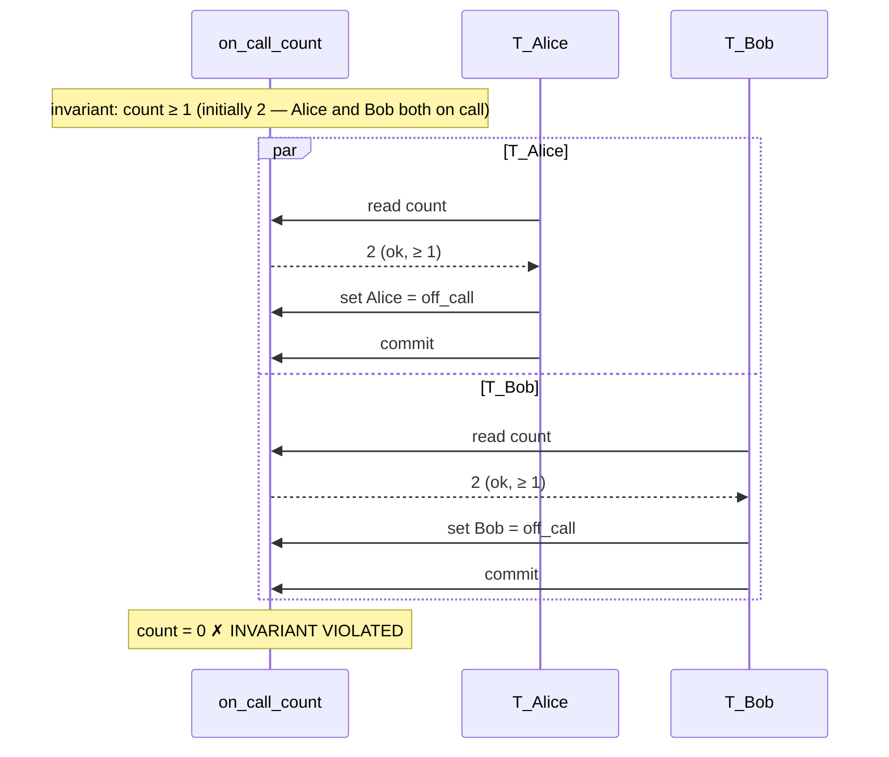
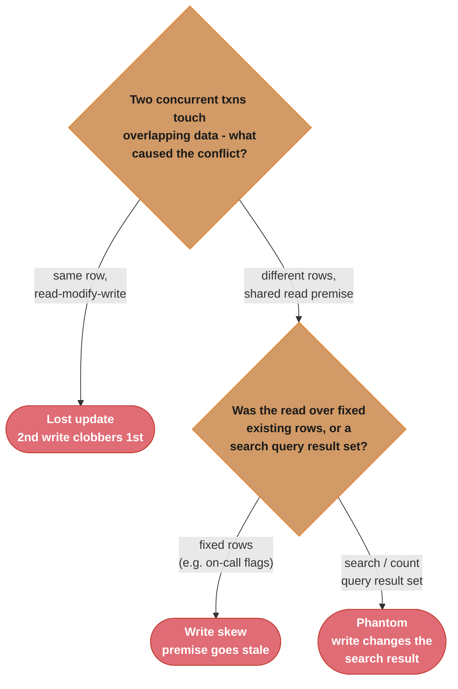
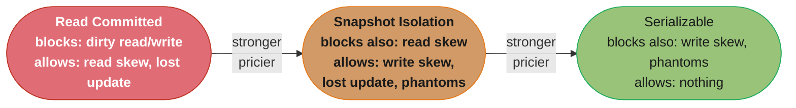
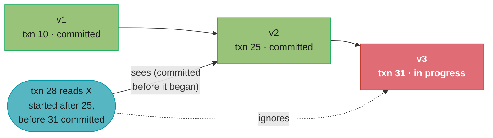
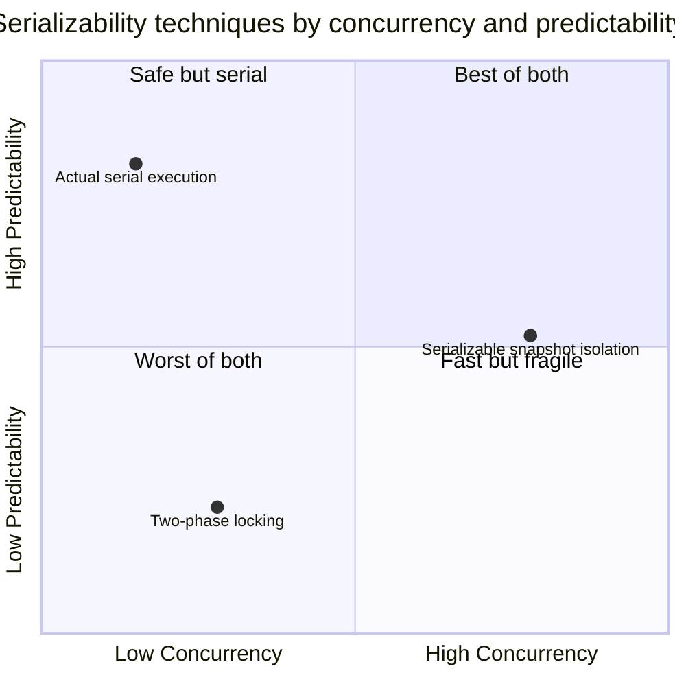

# Chapter 7: Transactions

> Part II — Distributed Data · DDIA (Kleppmann) · builds on Ch 5–6, leads to Ch 8 (the trouble with distributed systems)

## Chapter Map

A transaction groups several reads and writes into one logical unit that either fully succeeds
(**commit**) or fully fails (**abort/rollback**) — letting the application ignore a whole class
of concurrency and partial-failure problems. This chapter dissects what ACID *actually*
guarantees (and how much marketing hides behind the word), then walks the ladder of **isolation
levels** from weak (fast, anomaly-prone) to serializable (correct, costly), naming the precise
anomaly each level does and doesn't prevent.

**TL;DR:**
- **ACID** is precise for Atomicity, Isolation, Durability; "Consistency" is mostly the
  application's job. "BASE" just means "not ACID."
- Weak isolation levels trade correctness for performance and each permit specific anomalies:
  **read committed** (no dirty reads/writes), **snapshot isolation/MVCC** (no read skew, but
  allows write skew), and various lost-update protections.
- **Write skew** and **phantoms** are the subtle anomalies snapshot isolation does NOT prevent.
- **Serializability** — the only guarantee that rules out *all* race conditions — comes in three
  flavors: **actual serial execution**, **two-phase locking (2PL)**, and **serializable snapshot
  isolation (SSI)**.

## The Big Question

> "Concurrency and crashes create a combinatorial explosion of things that can go wrong
> mid-operation. Can I get one abstraction that lets me pretend none of that exists — and what
> exactly does it cost me when I weaken it for speed?"

Analogy: a transaction is a "all or nothing, and pretend you're alone" contract with the
database. The chapter's whole arc is: that contract is expensive to honor fully (serializable),
so databases sell you cheaper versions (weak isolation) that honor *most* of it — and you must
know precisely which promises the cheaper version quietly drops.

---

## 7.1 The Slippery Concept of a Transaction

### The meaning of ACID

ACID (Atomicity, Consistency, Isolation, Durability) sounds precise but is used loosely in
marketing; databases calling themselves "ACID" vary widely. Precisely:

- **Atomicity** — a transaction's writes are all-or-nothing. If anything fails partway, the
  whole transaction **aborts** and any writes so far are discarded — so it's safe to **retry**.
  (Atomicity here is about abortability, *not* concurrency.)
- **Consistency** — the database moves from one valid state to another, preserving application
  **invariants** (e.g. credits = debits). But these invariants are defined by the *application*,
  and it's the application's job to write transactions that preserve them — the database only
  enforces what you declare (constraints, foreign keys). Kleppmann notes the "C" was arguably
  shoehorned in to make the acronym work; it's the odd one out.
- **Isolation** — concurrently executing transactions are isolated from each other; the strongest
  form (serializability) means the result is *as if* they ran one at a time, serially.
- **Durability** — once committed, data survives crashes (written to non-volatile storage / WAL /
  replicated). Perfect durability doesn't exist (every disk and replica can fail), but the
  promise is "we won't forget a committed write" within the failure model.

**BASE** (Basically Available, Soft state, Eventual consistency) is defined mostly by what it
*isn't* (not ACID) and is even vaguer.

### Single-object and multi-object operations

- **Single-object writes** — atomicity and isolation even for one object matter: a 20 KB
  document write that's interrupted shouldn't leave half-written data (atomicity), and a
  concurrent read shouldn't see a half-updated value (isolation). Storage engines provide this
  per-object (e.g. via a log + atomic compare-and-set). This is *not* a transaction in the full
  sense.
- **Multi-object transactions** — the real need: keeping several objects in sync (an email's
  unread counter and its mailbox rows; foreign-key references; secondary indexes that must match
  the row). Many distributed/NoSQL stores dropped multi-object transactions because they're hard
  to implement across partitions and can hurt availability — but the need doesn't disappear; it
  just moves into error-prone application code.
- **Handling errors and aborts** — ACID databases abort-and-retry on error. Leaderless stores
  (Dynamo-style) often take "best effort" ("the database does what it can; on error it won't
  undo") — pushing recovery to the app. Retrying an aborted transaction is the right default but
  has caveats: the transaction may have actually succeeded before the network dropped the ack
  (need idempotence/dedup); retrying is pointless if the error is overload (add backoff); retry
  only transient errors not constraint violations; and side effects outside the database (sending
  an email) can't be rolled back by a retry.

## 7.2 Weak Isolation Levels

Serializable isolation is expensive, so databases ship weaker levels that prevent *some*
anomalies. The catch: these anomalies are subtle, hard to test for, and cause real
corruption/financial loss. You must know each level precisely.

### Read committed

The most basic useful level (often the default — PostgreSQL, Oracle, SQL Server). Two guarantees:

- **No dirty reads** — you only see data that has been *committed*; you never see another
  transaction's uncommitted, possibly-to-be-rolled-back writes. (Prevents seeing a value that
  later vanishes, and seeing partial multi-object updates.)
- **No dirty writes** — you only *overwrite* committed data; concurrent writes to the same object
  are serialized so one transaction's write doesn't clobber another's uncommitted write. (Prevents
  interleaved multi-object updates corrupting each other.)

Implemented by holding row locks for writes, and (to avoid readers blocking on a write lock)
remembering both the old committed value and the in-progress new value, serving readers the old
one until commit. Read committed does **not** prevent read skew.

### Snapshot isolation and repeatable read

Read committed still allows **read skew (non-repeatable read)**: within one transaction, two
reads of the database see different states because another transaction committed in between —
e.g. Alice checks two bank accounts totaling \$1000 mid-transfer and sees only \$900, as if money
vanished. Some cases (backups, long analytic queries) make this intolerable.

**Snapshot isolation** fixes it: each transaction reads from a **consistent snapshot** of the
database — the data as it was committed at the moment the transaction started. It sees a frozen,
self-consistent view regardless of concurrent commits. This is the standard for long-running
read-only queries and backups. Implemented with **MVCC (multi-version concurrency control)**: the
database keeps several committed versions of each object (tagged with transaction IDs); each
transaction sees the versions that were committed before it began and ignores later ones.
"Readers never block writers and writers never block readers" is MVCC's signature property.
Confusingly, vendors market snapshot isolation under names like "repeatable read" (PostgreSQL,
MySQL) and "serializable" — so the *name* tells you little; you must check the actual guarantees.

### Preventing lost updates

The **lost update** problem: two transactions do read-modify-write on the same object (increment
a counter, edit a JSON document, add to a list); they both read the old value, both compute a new
value, and the second write *clobbers* the first — one update is silently lost. Snapshot isolation
alone does not prevent this. Solutions:

- **Atomic write operations** — let the database do the read-modify-write atomically
  (`UPDATE counters SET value = value + 1`), avoiding the app-level race. Use these when you can;
  they're implemented with an exclusive lock on the object (**cursor stability**).
- **Explicit locking** — `SELECT ... FOR UPDATE` locks the rows the app will modify, forcing
  concurrent transactions to wait. The app must remember to do it correctly everywhere.
- **Automatic lost-update detection** — let transactions run in parallel; the database detects a
  lost update and forces the loser to abort and retry (PostgreSQL repeatable read, others). Nice
  because it works even if you forgot to lock.
- **Compare-and-set (CAS)** — `UPDATE ... WHERE value = <old value>`; the write only succeeds if
  the value hasn't changed since you read it (common in databases without transactions). Beware it
  must read from the current data, not a stale snapshot.
- (In replicated/multi-leader databases, locks and CAS don't suffice; you need conflict resolution
  / version vectors / commutative operations from Ch 5.)

### Write skew and phantoms

The hardest anomaly. **Write skew** generalizes lost update: two transactions read the *same set*
of objects, then each updates *different* objects based on what they read — and the combination
violates an invariant that each transaction individually preserved. Canonical example: a hospital
requires at least one doctor on call. Two doctors are on call; both feel sick; both transactions
check "are there ≥2 on call? yes" and both remove themselves — leaving zero on call, violating the
invariant. Neither did a lost update (they wrote different rows); snapshot isolation permits this
because each read a consistent snapshot showing two doctors.

Caption: neither transaction saw the other's write — both read the same consistent snapshot showing 2 doctors on call — so snapshot isolation permits this write skew even though each transaction individually preserved the invariant.

A **phantom** is the underlying cause: a write in one transaction changes the *result of a search
query* in another (a row appears or disappears). Write skew often follows the pattern: SELECT to
check a precondition, then INSERT/UPDATE/DELETE based on it — and the precondition no longer holds
because of a phantom. Locking existing rows (`FOR UPDATE`) doesn't help when the problem is rows
that don't exist *yet* (you can't lock a row that isn't there). Mitigations: **materializing
conflicts** (artificially create lockable rows for, e.g., every time slot/seat so there's something
to lock — ugly, last resort) or, properly, **serializable isolation**.

Caption: lost update, write skew, and phantom are the three anomalies snapshot isolation permits, and interviewers love to blur them together — the tell is whether the write lands on the *same* row (lost update), a *different pre-existing* row read under a shared premise (write skew, e.g. the on-call doctors), or a row that didn't exist yet when the read's search query ran (phantom).

## 7.3 Serializability

The only isolation level that prevents *all* race conditions (including write skew and phantoms),
by guaranteeing the result equals *some* serial (one-at-a-time) execution. Three implementations:

### Actual serial execution

Just run all transactions **one at a time, on a single thread**. Sounds absurd, but became viable
because RAM got cheap (whole dataset fits in memory ⇒ no disk-wait stalls) and OLTP transactions
are short and few. Used by **VoltDB/H-Store, Redis, Datomic**. Requirements/limits: transactions
must be small and fast (one slow transaction stalls everyone); the active dataset should fit in
memory; write throughput must be low enough for a single CPU core (or the data partitioned, with
cross-partition transactions far slower). Transactions are submitted as **stored procedures** (the
whole transaction logic sent at once) rather than interactive multi-statement transactions, so the
single thread never waits on network round-trips to the application.

### Two-phase locking (2PL)

The classic (~30 years) approach. Far stronger locking than read committed: **readers block
writers and writers block readers**. A transaction takes a **shared lock** to read and an
**exclusive lock** to write; you must hold a lock to access an object, and locks are held until the
transaction ends ("two-phase": acquire locks in a growing phase, release all at the end). To
prevent phantoms, 2PL uses **predicate locks** (lock all objects matching a search condition,
including ones that don't exist yet) — usually approximated by **index-range locks (next-key
locking)** for efficiency. Correct but with **poor performance**: low concurrency (lots of waiting),
and **deadlocks** are frequent (transactions waiting on each other's locks), forcing aborts and
retries — so latency is unpredictable and throughput suffers.

### Serializable snapshot isolation (SSI)

A 2008 breakthrough (now in PostgreSQL ≥9.1 "serializable", FoundationDB) that gives full
serializability with much better performance than 2PL. It's **optimistic** instead of pessimistic:
transactions run on a snapshot (as in snapshot isolation, no read locking — so no blocking), and at
**commit** time the database checks whether the transaction's reads are still valid — specifically
whether another committed transaction wrote to data this one *read* (a premise the transaction
relied on that has since changed). If so, this transaction is **aborted and retried**. SSI detects
"the basis of your decision is now outdated" and only aborts when a genuine serialization conflict
occurred. Pros: no read locking (reads don't block, writes don't block reads), good performance
when contention is low. Cons: abort rate rises under high contention (lots of retries), and it
needs transactions to be short (long transactions are more likely to hit a conflict).

---

## Visual Intuition

Caption: pick the lowest rung that prevents the anomalies your app can't tolerate; MVCC is how
snapshot isolation lets readers and writers proceed without blocking, and serializable is the only
rung with zero anomalies.

---

## Key Concepts Glossary

- **Transaction** — a group of reads/writes treated as one unit; commits or aborts.
- **Commit / abort (rollback)** — making changes permanent / discarding them.
- **ACID** — Atomicity, Consistency, Isolation, Durability.
- **Atomicity** — all-or-nothing (about abortability/retry, not concurrency).
- **Consistency (ACID)** — preserves application invariants; mostly the app's responsibility.
- **Isolation** — concurrent transactions don't interfere; serializable = as-if serial.
- **Durability** — committed data survives crashes.
- **BASE** — Basically Available, Soft state, Eventual consistency (i.e. not ACID).
- **Single-object vs multi-object** — atomicity/isolation for one object vs several.
- **Dirty read** — reading another transaction's uncommitted write.
- **Dirty write** — overwriting another transaction's uncommitted write.
- **Read committed** — prevents dirty reads and dirty writes.
- **Read skew (non-repeatable read)** — seeing different committed states within one transaction.
- **Snapshot isolation** — each transaction reads a consistent snapshot from its start time.
- **MVCC (multi-version concurrency control)** — keep multiple object versions per timestamp.
- **Repeatable read** — vendor name often (mis)applied to snapshot isolation.
- **Lost update** — concurrent read-modify-write where one update overwrites another.
- **Atomic write / `FOR UPDATE` / compare-and-set / auto-detect** — lost-update remedies.
- **Write skew** — disjoint writes on a shared read premise that breaks an invariant.
- **Phantom** — a write changing another transaction's search-query result.
- **Materializing conflicts** — adding lockable rows so phantoms can be locked (last resort).
- **Serializability** — result equals some serial execution; prevents all anomalies.
- **Actual serial execution** — run transactions one at a time on a single thread (VoltDB, Redis).
- **Stored procedure** — whole transaction logic sent at once (no app round-trips).
- **Two-phase locking (2PL)** — pessimistic shared/exclusive locking; readers block writers.
- **Predicate lock / index-range (next-key) lock** — locking matching rows to stop phantoms.
- **Deadlock** — transactions mutually waiting on each other's locks.
- **Serializable snapshot isolation (SSI)** — optimistic serializability; abort on commit-time
  conflict (PostgreSQL serializable, FoundationDB).

---

## Tradeoffs & Decision Tables

| Anomaly | Read committed | Snapshot isolation | Serializable |
|---------|:--:|:--:|:--:|
| Dirty read | prevented | prevented | prevented |
| Dirty write | prevented | prevented | prevented |
| Read skew (non-repeatable) | ALLOWED | prevented | prevented |
| Lost update | ALLOWED | ALLOWED* | prevented |
| Write skew | ALLOWED | ALLOWED | prevented |
| Phantom | ALLOWED | ALLOWED | prevented |

*Some snapshot-isolation implementations add automatic lost-update detection.

| Serializable technique | Strategy | Strength | Weakness |
|------------------------|----------|----------|----------|
| Actual serial execution | Single thread | Simple, no locking overhead | Needs in-RAM data, short txns, ~1 core write tput |
| Two-phase locking (2PL) | Pessimistic locking | Battle-tested | Low concurrency, deadlocks, slow tail |
| Serializable snapshot isolation (SSI) | Optimistic | No read locks, scales reads | Aborts under high contention; short txns only |

Caption: no technique wins on both axes — actual serial execution and SSI each trade away one axis to win the other, while 2PL's mandatory reader/writer blocking leaves it worst on both, consistent with the deadlock-and-poor-concurrency weakness in the row above.

---

## Common Pitfalls / War Stories

- **Trusting the isolation-level *name*.** "Repeatable read" means snapshot isolation in
  PostgreSQL/MySQL but something weaker in the SQL standard; "serializable" in some products is
  really snapshot isolation. The name tells you almost nothing — verify the actual guarantees and
  which anomalies are prevented.
- **Lost updates in read-modify-write code.** Reading a counter/JSON doc/list into the app,
  modifying it, and writing it back races with concurrent transactions and silently loses updates
  under snapshot isolation. Use an atomic write (`SET value = value + 1`), `FOR UPDATE`, CAS, or a
  database with lost-update detection.
- **Write skew that passes every test.** Booking systems (double-booking a room/seat), the
  on-call-doctor invariant, claiming a unique username, spending against a balance — all are write
  skew that snapshot isolation permits and that rarely shows up in low-concurrency testing, then
  corrupts data in production. The robust fix is serializable isolation; locking existing rows
  doesn't help against phantoms.
- **Assuming `SELECT ... FOR UPDATE` stops phantoms.** You can't lock a row that doesn't exist yet,
  so locking the rows you read won't prevent another transaction from *inserting* a conflicting
  row. You need predicate/index-range locks (2PL) or SSI, or the ugly materialize-conflicts hack.
- **Blindly retrying aborted transactions.** A transaction may have committed before the ack was
  lost (retry double-applies → need idempotence); retrying under overload worsens it (need
  backoff); retrying a constraint violation is futile; and side effects like sent emails can't be
  rolled back. Retry only transient errors, with care.
- **2PL deadlock storms.** Under contention, 2PL transactions wait on each other's locks and
  deadlock; the database aborts a victim and the app retries, producing unpredictable latency and
  reduced throughput. Keep transactions short and access objects in a consistent order, or prefer
  SSI.

---

## Real-World Systems Referenced

PostgreSQL, MySQL/InnoDB, Oracle, SQL Server, IBM DB2 (isolation levels, MVCC, 2PL); VoltDB/
H-Store, Redis, Datomic (actual serial execution); PostgreSQL serializable, FoundationDB (SSI);
Amazon Dynamo and leaderless stores (best-effort / no multi-object transactions); Oracle "serializable"
(actually snapshot isolation).

---

## Summary

A transaction bundles reads and writes so they commit or abort as one unit, sparing the
application a combinatorial mess of concurrency and crash scenarios. **ACID** precisely promises
atomicity (all-or-nothing, retryable), isolation, and durability; "consistency" is mostly the
application's responsibility, and "BASE" just means non-ACID. **Isolation levels** form a ladder
that trades correctness for speed: **read committed** stops dirty reads/writes; **snapshot
isolation (MVCC)** additionally stops read skew (readers never block writers) but still permits
**lost updates**, **write skew**, and **phantoms**. Lost updates need atomic writes, locking, CAS,
or detection; write skew and phantoms — the subtlest, real-money-losing anomalies — are only fully
prevented by **serializability**. Serializability is delivered three ways: **actual serial
execution** (single thread, in-RAM, stored procedures), **two-phase locking** (pessimistic,
correct, deadlock-prone and slow), and **serializable snapshot isolation** (optimistic, no read
locks, aborts on conflict — the modern sweet spot when contention is moderate).

---

## Interview Questions

**Q: What does each letter of ACID actually guarantee, and which one is the odd one out?**
Atomicity means all of a transaction's writes apply or none do, so a failed transaction aborts and is safely retryable (it's about abortability, not concurrency). Isolation means concurrent transactions don't see each other's intermediate state, with serializability being the strongest form. Durability means committed data survives crashes. Consistency is the odd one out: it means preserving application invariants, but those are defined and largely enforced by the *application*, not the database, and Kleppmann notes the "C" was somewhat shoehorned in to complete the acronym.

**Q: What is the difference between a dirty read and a dirty write, and which level prevents them?**
A dirty read is reading data another transaction has written but not yet committed — you might see a value that gets rolled back, or a partial multi-object update. A dirty write is overwriting data another transaction has written but not yet committed, letting concurrent writes interleave and corrupt each other. Both are prevented by the read committed isolation level, which guarantees you only read committed data and only overwrite committed data (typically via row locks for writes plus serving the old committed value to readers).

**Q: What is read skew (non-repeatable read), and how does snapshot isolation fix it?**
Read skew is when a transaction reads the database at two moments and sees different committed states because another transaction committed in between — e.g. summing two bank balances mid-transfer and seeing money apparently missing. Read committed allows it. Snapshot isolation fixes it by giving each transaction a consistent snapshot: it reads all data as of the instant it began, ignoring later commits, so every read within the transaction sees the same self-consistent view. It's implemented with MVCC, keeping multiple timestamped versions of each object.

**Q: How does MVCC let readers and writers avoid blocking each other?**
MVCC (multi-version concurrency control) keeps several committed versions of each object, each tagged with the transaction ID that created it. A reading transaction sees the version that was committed before it started and ignores any created later or still in progress, so it never has to wait for a writer — and a writer creates a new version without overwriting the old one a reader might be using, so it never has to wait for a reader. This "readers never block writers, writers never block readers" property is what makes snapshot isolation efficient.

**Q: What is a lost update, and what are the ways to prevent it?**
A lost update happens when two transactions concurrently do read-modify-write on the same object (incrementing a counter, editing a document), both read the old value, and the second write overwrites the first, silently losing one update. Snapshot isolation alone doesn't prevent it. Remedies: atomic write operations (`UPDATE ... SET value = value + 1`) that do the read-modify-write in the database under a lock; explicit `SELECT ... FOR UPDATE` locking; compare-and-set (`UPDATE ... WHERE value = old`); or databases that automatically detect the lost update and force the loser to retry.

**Q: What is write skew, and why is it harder to prevent than a lost update?**
Write skew is when two transactions read the same set of data, then each writes to *different* objects based on what they read, and the combined effect violates an invariant each transaction individually preserved — like two on-call doctors each checking "are there ≥2 on call?" and both going off call, leaving zero. It's harder than a lost update because the transactions don't write the same object, so locking a single row or detecting an overwrite doesn't catch it; the conflict is on a *premise* (the count) that spans rows, and only serializability reliably prevents it.

**Q: Walk through the on-call-doctor example of write skew.**
The invariant is that at least one doctor must remain on call. Two doctors are on call and both want to take sick leave. Under snapshot isolation, both transactions read "2 doctors on call, so it's safe for me to leave," then each updates its *own* row to off-call, and both commit — leaving zero doctors on call. Neither transaction did a lost update (they wrote different rows), and each saw a consistent snapshot showing two doctors, so snapshot isolation permits it. Only serializable isolation, which considers that both relied on a now-falsified premise, prevents it.

**Q: What is a phantom, and why doesn't `SELECT ... FOR UPDATE` prevent it?**
A phantom is when a write in one transaction changes the result set of a search query in another transaction — a row that matches a condition appears or disappears. `SELECT ... FOR UPDATE` locks the rows that *currently* match, but it can't lock rows that don't exist yet, so another transaction can still INSERT a new row that would have matched the condition (e.g. booking a meeting room for a time slot that "looked free"). Preventing phantoms needs predicate or index-range (next-key) locks, or serializable isolation, or the materialize-conflicts workaround.

**Q: What are the three ways to implement serializable isolation?**
Actual serial execution: run transactions literally one at a time on a single thread, viable now that datasets fit in RAM and OLTP transactions are short (VoltDB, Redis). Two-phase locking (2PL): pessimistic shared/exclusive locks held until commit, where readers block writers and writers block readers, with predicate/index-range locks for phantoms. Serializable snapshot isolation (SSI): optimistic — run on a snapshot with no read locks and, at commit, abort any transaction whose reads were invalidated by another committed write (PostgreSQL serializable, FoundationDB).

**Q: How can running everything on a single thread (actual serial execution) ever be a good idea?**
Because two trends made it viable: RAM is cheap enough that the active dataset often fits entirely in memory, eliminating the disk-wait stalls that single-threading would otherwise expose; and OLTP transactions are typically short and make few requests. Removing concurrency removes all locking overhead and all the anomaly problems at once. The constraints are that transactions must be small and fast (one slow one stalls everything), submitted as stored procedures to avoid app round-trips, and write throughput must fit a single CPU core (or the data is partitioned).

**Q: How does two-phase locking differ from the locking in read committed?**
Read committed uses short-lived write locks and lets reads proceed against the last committed value without locking, so readers don't block writers. Two-phase locking is far stricter: a transaction acquires a shared lock to read and an exclusive lock to write, holds *all* locks until it ends, and consequently readers block writers and writers block readers. This much stronger locking is what gives 2PL full serializability, but it sharply reduces concurrency and makes deadlocks common.

**Q: How does serializable snapshot isolation (SSI) achieve serializability without read locks?**
SSI is optimistic: transactions read from a consistent MVCC snapshot with no read locks, so nothing blocks during execution. The database tracks what each transaction read, and at commit time it checks whether another transaction has committed a write to data this transaction read — meaning the premise behind its decisions is now outdated. If so, it aborts this transaction, which then retries. Because it only aborts on a genuine serialization conflict and never takes read locks, it offers serializability with much better concurrency than 2PL when contention is moderate.

**Q: What are the trade-offs that make SSI better or worse than 2PL?**
SSI is better when contention is low to moderate: reads never block and writes never block reads, so it scales read-heavy workloads far better than 2PL, and it avoids 2PL's deadlock storms. SSI is worse when contention is high: many transactions read data that others then modify, so the commit-time conflict checks abort a large fraction of transactions, causing repeated retries and wasted work. SSI also depends on transactions being short, since long ones accumulate more reads and are more likely to be invalidated before they commit.

**Q: Why is retrying an aborted transaction the right default, but with caveats?**
Abort-and-retry is the clean recovery model for transient problems (deadlocks, serialization conflicts, brief network issues) because atomicity guarantees a failed transaction left no partial state. The caveats: the transaction may have actually committed before its acknowledgment was lost, so a blind retry double-applies it unless it's idempotent; retrying during overload makes the overload worse, so you need exponential backoff; retrying a permanent error like a constraint violation is pointless; and any side effects outside the database, such as a sent email, can't be undone by the retry.

**Q: Why does the book warn that isolation-level names are unreliable?**
Because vendors use the same names for different guarantees: "repeatable read" denotes snapshot isolation in PostgreSQL and MySQL but a weaker level in the SQL standard, and Oracle's "serializable" is actually snapshot isolation, not true serializability. So the label tells you little about which anomalies are actually prevented — you must consult the specific database's documentation and verify whether dirty reads, read skew, lost updates, write skew, and phantoms are each prevented, rather than trusting the marketing name.

**Q: What is the difference between single-object and multi-object transactions, and why do many distributed databases drop the latter?**
Single-object operations need atomicity and isolation too (a partially written 20 KB document or a half-updated value read concurrently is bad), and storage engines provide this per object via logs and atomic compare-and-set. Multi-object transactions keep *several* objects consistent — a denormalized counter and its rows, foreign keys, a row and its secondary index. Many distributed/NoSQL stores dropped multi-object transactions because they're hard to implement across partitions and can reduce availability — but the need doesn't vanish, it just becomes error-prone application code that must handle partial failures by hand.

---

## Cross-links in this repo

- [database/concurrency_control_and_locking/ — MVCC, deadlocks, gap locks, SELECT FOR UPDATE](../../../database/concurrency_control_and_locking/README.md)
- [database/database_fundamentals/ — ACID, isolation levels, anomalies overview](../../../database/database_fundamentals/README.md)
- [database/postgresql_internals/ — MVCC, VACUUM, serializable (SSI) in PostgreSQL](../../../database/postgresql_internals/README.md)
- [database/distributed_transactions/ — extending transactions across partitions (2PC, Saga)](../../../database/distributed_transactions/README.md)

## Further Reading

- Kleppmann, DDIA Ch 7 — original text and references.
- Berenson et al., "A Critique of ANSI SQL Isolation Levels," 1995 — the precise anomaly definitions.
- Cahill, Röhm & Fekete, "Serializable Isolation for Snapshot Databases," 2008 — the SSI paper.
