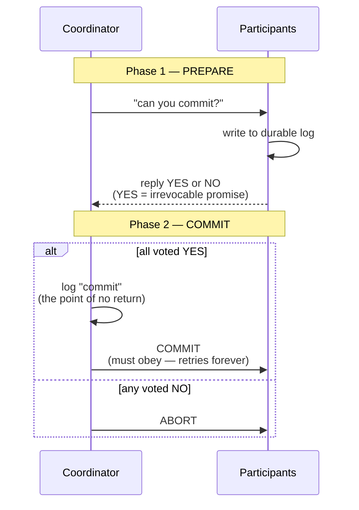
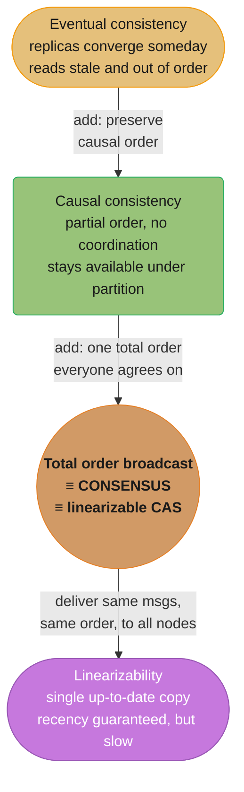
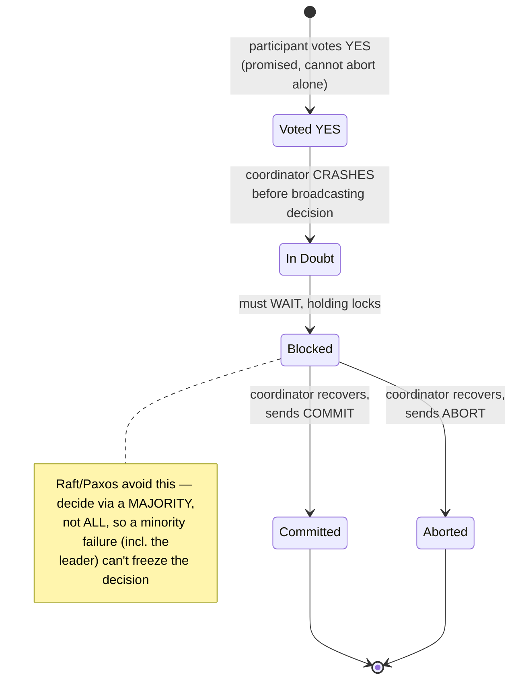
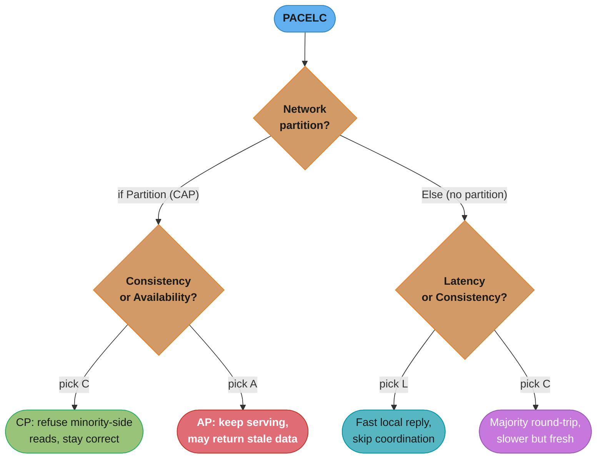
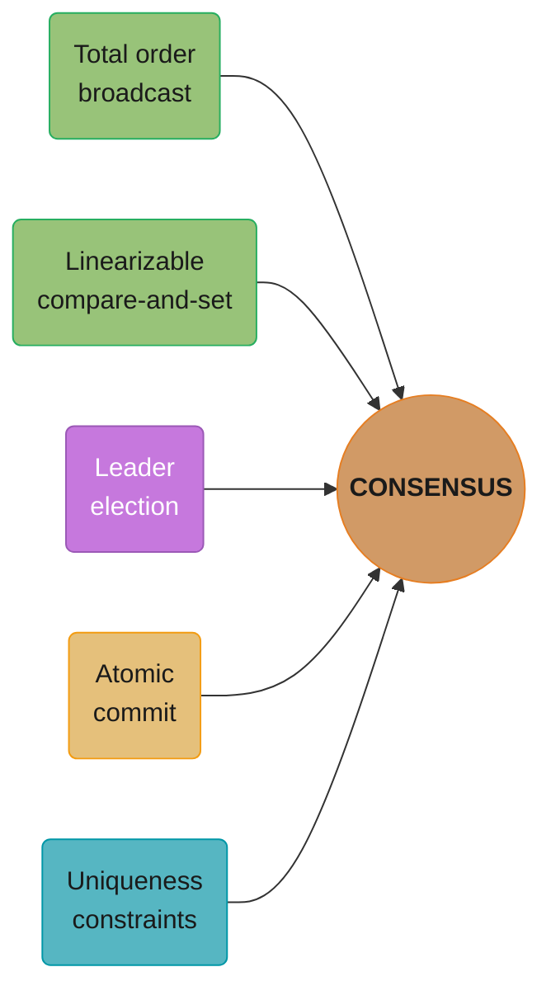

# Chapter 9: Consistency and Consensus

> Part II — Distributed Data · DDIA (Kleppmann) · the climax of Part II; builds on Ch 5–8, leads to Part III

## Chapter Map

Chapter 8 tore down every certainty; this chapter rebuilds. Given unreliable networks, clocks,
and processes, what *strong guarantees* can a system still provide, and how? It climbs from the
strongest single-object guarantee (**linearizability**), through **ordering and causality**, to
the deepest problem in distributed systems — **consensus**, getting nodes to agree on something
(a leader, a commit decision, a value) despite failures. The punchline: a surprising number of
problems (leader election, atomic commit, uniqueness constraints, lock services) are all
**equivalent to consensus**, and consensus is solvable, but only with a majority and at a cost.

**TL;DR:**
- **Linearizability** = behave as if there's a single, up-to-date copy of the data (one global
  order, every read sees the latest write). Strong but costly; CAP says it sacrifices availability
  under partitions.
- **Causality** (a weaker ordering) is often enough and *can* be preserved without the cost of
  total ordering, using logical clocks / Lamport timestamps.
- **Total order broadcast** (deliver the same messages to every node in the same order) is
  equivalent to consensus and to building a linearizable system.
- **Consensus** (Paxos/Raft/Zab) lets nodes agree despite faults; **2PC** is atomic commit but
  blocks on coordinator failure; **ZooKeeper/etcd** package consensus as a service.

## The Big Question

> "After Chapter 8 convinced me nothing is reliable — how can a group of flaky machines ever
> *agree* on a single fact, like who the leader is or whether a transaction committed, and what
> does that agreement cost me?"

Analogy: consensus is a committee trying to ratify one decision while members randomly fall
asleep, messages get lost, and nobody's watch agrees. The remarkable result is that they *can*
reliably agree — as long as a majority stays awake — and that "electing a chair," "ratifying a
vote," and "agreeing the meeting happened" turn out to be the *same* problem underneath.

---

## 9.1 Consistency Guarantees

Replicated systems offer a spectrum of consistency models, and it's vital not to confuse them.
**Eventual consistency** (Ch 5) is the weakest useful guarantee: stop writing, and *eventually*
all replicas converge — but it says nothing about *when*, and reads may return stale or
out-of-order data in the meantime, which is a constant source of subtle bugs. This chapter moves
up to **stronger** guarantees that are easier to use correctly but cost more in performance and
fault tolerance. (Note: distributed *consistency* models are about timing/ordering of replicas —
a different axis from the "C" in ACID, and different from the consistency of an isolation level.)

## 9.2 Linearizability

**Linearizability** (a.k.a. atomic consistency, strong consistency, immediate consistency,
external consistency) is the strongest single-object guarantee: make the system *behave as if
there were only one copy of the data*, and all operations on it are atomic. Once a write
completes (or any read sees the new value), **all** subsequent reads must see that value or a
later one — the data appears to flip from old to new at a single instant, and time never goes
backward. It's a **recency guarantee**: a read is guaranteed to return the *most recent* committed
value, not a stale one.

**Linearizability ≠ serializability.** Serializability (Ch 7) is an *isolation* property about
*transactions* (multiple objects) being equivalent to *some* serial order. Linearizability is a
*recency* property about *single-object* reads/writes seeing the latest value in *real-time*
order. A system can provide both (strict serializability, e.g. 2PL or actual serial execution),
but they're distinct.

### Relying on linearizability

Some things break without it:

- **Locking and leader election** — a lock service must be linearizable so all nodes agree on who
  holds the lock / who is leader (ZooKeeper, etcd use consensus to provide this).
- **Uniqueness constraints** — a unique username/email, no double-booking, no negative balance:
  enforcing "only one wins" needs linearizability (it's essentially a lock per value).
- **Cross-channel timing dependencies** — the classic bug: a service writes a file to storage and
  *then* enqueues a "resize this image" message; if the message-fetch races ahead of the
  not-yet-replicated file, the resizer reads stale/missing data. Two communication channels
  (queue + storage) create a recency requirement only linearizability satisfies.

### Implementing and the cost of linearizability (CAP)

- Single-leader replication *can* be linearizable (read from the leader); but async followers
  aren't, and a wrongly-promoted leader (split brain) breaks it. Consensus protocols *are*
  linearizable. Leaderless quorums (w+r>n) are surprisingly **not** linearizable in general
  (concurrent reads/writes, last-write-wins, network delays violate recency).
- **The CAP theorem, properly stated:** when a network **partition** occurs, you must choose
  between **consistency (linearizability)** and **availability**. A *linearizable* (CP) system
  refuses requests on the minority side (becomes unavailable) to avoid returning stale data; an
  *available* (AP) system keeps serving but may return stale/conflicting data. CAP is narrow
  (only about linearizability vs total availability, only during partitions) and is widely
  misused — but the core tradeoff is real.
- **The deeper cost — even without partitions:** linearizability is **slow**. Every read/write
  must coordinate (network round-trips to a majority), so latency is bounded below by network
  delay; this is unavoidable, which is why many systems deliberately give it up for speed (the
  PACELC framing: *if Partition then C-or-A, Else Latency-or-Consistency*). Most systems choose to
  drop linearizability for performance, not just for availability.

## 9.3 Ordering Guarantees

Ordering, linearizability, and consensus turn out to be deeply connected.

### Ordering and causality

**Causality** imposes a *partial* order: some events are causally related (the question must
precede the answer; the row must be created before it's updated) and must keep that order, while
others are **concurrent** (unrelated; order doesn't matter). A system that preserves causal order
is **causally consistent** — the strongest model that's still achievable *without* the
coordination cost of linearizability, and *without* becoming unavailable during partitions.
Linearizability *implies* causality (a total order trivially preserves the partial order), but
it's stronger than needed; causality is often the sweet spot.

### Sequence number ordering

To track causality cheaply, attach **sequence numbers** or **logical-clock timestamps** to
operations, defining a total order consistent with causality. A single-leader log gives this for
free (the leader's log position). Without a leader, use **Lamport timestamps**: each node keeps a
counter; every operation carries `(counter, node-id)`; nodes bump their counter to at least any
value they see, and ties break by node-id. Lamport timestamps produce a total order consistent
with causality — but they have a limitation: they only tell you the order **after the fact**, once
you've collected all operations. They can't tell you *in the moment* whether an operation is the
first to claim a username, because a higher-numbered operation might still arrive. For that you
need something stronger.

### Total order broadcast

**Total order broadcast** (atomic broadcast) is the protocol you actually need: deliver messages
to **all** nodes **reliably** (no loss) and in the **same total order** on every node. It's exactly
what you need to implement a replicated state machine (apply the same operations in the same order
on every replica ⇒ all replicas stay identical) — and the basis of consensus systems and
single-leader replication. Crucially, total order broadcast is **equivalent to consensus** (you
can build each from the other) and equivalent to a linearizable compare-and-set register. So
implementing total order broadcast = solving consensus.

## 9.4 Distributed Transactions and Consensus

**Consensus**: get several nodes to **agree on one value** (or decision), satisfying: *uniform
agreement* (no two nodes decide differently), *integrity* (no node decides twice), *validity* (the
decided value was proposed by some node), and *termination* (every non-crashed node eventually
decides — the liveness property, which requires a majority to be up). The **FLP result** proves
consensus is impossible in a *purely asynchronous* model with even one faulty node — but this is
circumvented in practice because real systems are *partially synchronous* and can use timeouts (and
randomness), so consensus *is* achievable.

### Atomic commit and two-phase commit (2PC)

The simplest "consensus-like" problem: a transaction spanning multiple nodes/partitions must
**commit on all or abort on all** (atomic commit) — you can't have it commit on one partition and
abort on another. **Two-phase commit (2PC)** solves this with a **coordinator**:

**Two-Phase Commit (2PC)**

Caption: the coordinator drives two synchronous rounds — a PREPARE vote that must be unanimous,
then an irrevocable COMMIT/ABORT broadcast; the crash failure mode this creates is diagrammed
separately below in Visual Intuition.

The fatal flaw: if the **coordinator crashes** after participants voted YES but before sending the
decision, participants are stuck **in doubt** — they promised to commit and may not abort, but they
don't know the decision, so they **block**, holding locks, until the coordinator recovers. 2PC is
therefore *blocking* and the coordinator is a single point of failure. **XA transactions** are the
standard 2PC implementation across heterogeneous systems (databases + message brokers), and they
inherit all these problems (in-doubt transactions, held locks, operational pain).

### Fault-tolerant consensus

Real consensus algorithms — **Paxos** (and Multi-Paxos), **Raft**, **Zab** (ZooKeeper), and
Viewstamped Replication — fix 2PC's blocking by using a **majority** instead of requiring *all*
nodes, so they tolerate the failure of a minority and don't block on a single coordinator. They
work by electing a leader for an **epoch / term / ballot number** (a monotonically increasing number,
like a fencing token), and a value is decided only if a **majority** votes for it within the leader's
epoch — overlapping quorums between epochs guarantee that a newer leader learns of any value an older
leader may have decided. This is essentially **two rounds of voting**: one to elect the leader, one
to vote on the proposal — and the epoch numbers prevent a stale leader from causing a split-brain
decision. Consensus has limits: it needs a majority alive to make progress (a partition that loses
the majority halts it — safety preserved, liveness lost); it's sensitive to network delays (frequent
leader elections under a flaky network can stall progress); and the number of nodes is usually fixed
(dynamic membership reconfiguration is complex).

### Membership and coordination services

You rarely implement consensus yourself; you use **ZooKeeper** or **etcd**, which package it as a
service exposing a small, linearizable, fault-tolerant key-value store. They provide the primitives
the whole chapter built toward: **linearizable atomic operations** (a compare-and-set for locks/
leader election, including **fencing tokens** via the monotonically increasing zxid/version),
**total ordering of operations**, **failure detection** (ephemeral nodes tied to client sessions —
when a client's session dies, its locks auto-release), and **change notifications** (watches).
Applications use them for **leader election**, **service discovery**, **membership** (which nodes are
alive), and **partition/work assignment** (which node owns which shard — recall Ch 6 routing). They
let ordinary applications outsource the hardest distributed-systems problems to a small, carefully
built consensus core.

---

## Visual Intuition

**The Consistency / Ordering / Consensus Ladder**

**Why 2PC Blocks** — the in-doubt window the coordinator owns

Caption: the chapter's arc made visible — climb only as high as you need (causal is often enough),
and recognize that total order broadcast, consensus, and a linearizable CAS register are the *same*
problem, packaged for you by ZooKeeper/etcd.

**CAP vs PACELC: the Nested Decision**

Caption: PACELC's full formula made visible — *if* a network Partition is happening, CAP's
tradeoff applies (Consistency vs Availability); *Else*, in normal operation, the same shape of
tradeoff persists as Latency vs Consistency, because linearizability's majority round-trip is
slow whether or not anything has failed.

**The Chapter's Climax: Five Problems, One Underlying Consensus**

Caption: the chapter's central insight — total order broadcast, a linearizable compare-and-set
register, leader election, atomic commit, and uniqueness constraints all reduce to the same
problem; solve consensus once (ZooKeeper/etcd) and every one of these comes for free.

---

## Key Concepts Glossary

- **Eventual consistency** — replicas converge if writes stop; no recency or ordering guarantee.
- **Linearizability (atomic/strong/immediate consistency)** — behave as one up-to-date copy;
  recency guarantee; real-time total order.
- **Recency guarantee** — a read returns the latest committed value, not a stale one.
- **Serializability vs linearizability** — transaction isolation (multi-object) vs single-object
  recency; distinct.
- **Cross-channel (timing) dependency** — two channels (e.g. queue + storage) create a recency
  requirement.
- **CAP theorem** — under a partition, choose linearizable-Consistency or Availability.
- **PACELC** — Partition→C/A, Else→Latency/Consistency (linearizability is slow even without
  partitions).
- **Causality** — partial order of causally related events; concurrent events unordered.
- **Causal consistency** — preserves causal order; strongest model achievable without coordination.
- **Sequence number / logical clock** — counter defining an order consistent with causality.
- **Lamport timestamp** — `(counter, node-id)`; total order consistent with causality; only orders
  after the fact.
- **Total order broadcast (atomic broadcast)** — reliable delivery to all nodes in identical order.
- **Replicated state machine** — same ops in same order on every replica ⇒ identical replicas.
- **Consensus** — nodes agree on one value (agreement, integrity, validity, termination).
- **FLP result** — consensus impossible in a purely asynchronous model with one faulty node
  (circumvented via partial synchrony/timeouts).
- **Atomic commit** — a transaction commits on all participants or aborts on all.
- **Two-phase commit (2PC)** — coordinator-based atomic commit; blocks if coordinator crashes.
- **In doubt / blocking** — participant has voted YES but doesn't know the decision; holds locks.
- **XA transactions** — standard 2PC across heterogeneous systems.
- **Paxos / Raft / Zab / VSR** — fault-tolerant consensus algorithms (majority-based).
- **Epoch / term / ballot number** — monotonically increasing leader generation; prevents
  split-brain.
- **ZooKeeper / etcd** — consensus packaged as a linearizable coordination service.
- **Ephemeral node / watch** — session-tied key (auto-release on death) / change notification.

---

## Tradeoffs & Decision Tables

| Model | Guarantee | Coordination cost | Under partition |
|-------|-----------|-------------------|-----------------|
| Eventual | Converges someday | None | Stays available, stale reads |
| Causal | Preserves cause→effect | Low (logical clocks) | Stays available |
| Linearizable | Single up-to-date copy | High (majority round-trips) | Unavailable on minority side (CP) |

| | 2PC | Fault-tolerant consensus (Raft/Paxos) |
|---|---|---|
| Needs to proceed | ALL participants | A MAJORITY |
| Coordinator failure | Blocks (in-doubt, locks held) | Tolerated (re-elect leader) |
| Use | Cross-system atomic commit (XA) | Leader election, linearizable store |

| ZooKeeper/etcd primitive | Used for |
|--------------------------|----------|
| Linearizable CAS + fencing token | Distributed locks, leader election |
| Total ordering | Replicated logs, sequence numbers |
| Ephemeral nodes + sessions | Failure detection, membership |
| Watches | Service discovery, config change notification |

---

## Common Pitfalls / War Stories

- **2PC in-doubt transactions freezing the system.** A coordinator crash (or a lost commit message)
  leaves participants holding locks indefinitely, blocking other transactions on those rows;
  recovering often requires manual operator intervention to heuristically commit/abort. Prefer
  consensus-backed designs or sagas (Part III) for long-lived cross-service workflows.
- **Assuming leaderless quorums (w+r>n) are linearizable.** They are not in general — concurrent
  operations, last-write-wins, and network delays violate recency. Building a lock or
  uniqueness constraint on a plain Dynamo-style quorum will silently allow two winners.
- **Using wall-clock timestamps to order events instead of logical clocks.** As Ch 8 showed, clock
  skew misorders causally related events and loses data; use Lamport timestamps / version vectors /
  a leader log to capture causality, not `currentTimeMillis`.
- **The cross-channel staleness bug.** Writing data to storage and then sending a message that
  references it, where the message arrives before the data has replicated — the consumer reads
  missing/stale data. Either make the storage read linearizable, or carry the data in the message,
  or wait for replication before publishing.
- **Expecting consensus to make progress without a majority.** A partition that isolates the
  majority halts the consensus group (by design — safety over liveness); systems that "work around"
  this by letting a minority proceed reintroduce split-brain. Size clusters (odd numbers: 3, 5) so a
  majority survives expected failures.
- **Frequent leader elections under a flaky network.** If timeouts are too tight, transient
  slowness triggers repeated re-elections, and the group spends its time electing leaders instead of
  doing work — a liveness collapse. Tune election timeouts above normal network jitter.
- **Reinventing consensus.** Hand-rolling leader election with timestamps and ad-hoc locking almost
  always produces a subtly broken protocol (split brain, lost decisions). Use ZooKeeper/etcd; this
  is the explicit recommendation.

---

## Real-World Systems Referenced

Google Spanner (linearizable via TrueTime), ZooKeeper (Zab) and etcd (Raft), Apache Kafka
(total-order log per partition), Paxos/Multi-Paxos (Google Chubby, Megastore), Raft (etcd,
CockroachDB, Consul), Viewstamped Replication, XA / JTA two-phase commit across databases and
message brokers, VoltDB and others using replicated state machines, HBase/Kafka/SolrCloud (ZooKeeper
for coordination).

---

## Summary

After Chapter 8's catalog of failures, this chapter shows what strong guarantees remain achievable.
**Linearizability** makes a replicated system behave as if it had a single, up-to-date copy — a
recency guarantee needed for locks, leader election, and uniqueness constraints — but it's distinct
from serializability, it's slow (every operation needs majority round-trips), and the **CAP theorem**
says it must sacrifice availability during a network partition (PACELC adds: it sacrifices latency
even without one). Often you don't need it: **causal consistency** preserves the cause→effect partial
order, is achievable cheaply with **Lamport timestamps**, and stays available under partitions.
**Total order broadcast** — delivering the same messages in the same order to every node — is what
powers replicated state machines, and it's **equivalent to consensus**. **Consensus** (nodes agreeing
on one value) underlies atomic commit, leader election, and uniqueness; **2PC** solves atomic commit
but *blocks* when its coordinator fails, whereas **fault-tolerant consensus** (Paxos, Raft, Zab) uses
a **majority** and epoch numbers to tolerate minority failures. In practice you don't build consensus
yourself — you delegate to **ZooKeeper/etcd**, which expose a small linearizable store providing
locks, fencing tokens, membership, and ordering for everyone else.

---

## Interview Questions

**Q: What is linearizability, in one precise sentence, and why is it called a recency guarantee?**
Linearizability means the system behaves as if there were a single copy of the data on which every operation is atomic and instantaneous, so once a write completes, every subsequent read returns that value or a later one. It's called a recency guarantee because it forbids stale reads: a read is guaranteed to see the most recent committed value in real-time order, with the data appearing to switch from old to new at one instant that all clients agree on.

**Q: How does linearizability differ from serializability?**
Serializability is an isolation property about *transactions* (which may touch multiple objects): it guarantees the outcome is equivalent to *some* serial execution of those transactions, but says nothing about real-time recency. Linearizability is a recency property about individual *single-object* reads and writes: it guarantees each sees the latest value in real-time order, but doesn't bundle multiple operations into a transaction. A system can provide both (strict serializability), but they answer different questions — "did transactions appear to run one at a time?" versus "did this read see the freshest value?".

**Q: State the CAP theorem precisely and explain why it's often misused.**
CAP states that when a network partition occurs, a system must choose between linearizable consistency and availability: a consistent (CP) system rejects requests on the minority side to avoid stale data, while an available (AP) system keeps serving but may return stale or conflicting data. It's misused because people read it as "pick two of three" all the time, but it only concerns linearizability versus *total* availability, and only *during* a partition — it says nothing about normal operation, other consistency models, or the latency cost, which is why PACELC extends it.

**Q: What does PACELC add to CAP?**
PACELC captures that the tradeoff isn't only about partitions: *if* there's a Partition, you trade Availability against Consistency (the CAP part), but *Else* (in normal operation) you still trade Latency against Consistency. The key insight is that linearizability is inherently slow even when nothing is broken, because every operation must coordinate with a majority of nodes over the network, so the round-trip latency is unavoidable. Many systems give up linearizability purely for speed, not just for partition-time availability.

**Q: Why are leaderless quorum reads/writes (w + r > n) not linearizable?**
Because the quorum overlap guarantees a read *intersects* a recent write's replicas, but it doesn't guarantee real-time recency: concurrent reads and writes can interleave so two reads happening at nearly the same time see different values (one new, one old), last-write-wins can discard the genuinely latest write due to clock skew, and variable network delays mean a read might reach replicas before a write has propagated to its quorum. So quorums give strong-ish freshness but violate the strict recency and single-order requirements of linearizability.

**Q: What is causality, and why is causal consistency often preferable to linearizability?**
Causality is a *partial* order: it requires that causally related events keep their order (the question before the answer, a row created before it's updated) while leaving truly concurrent, unrelated events unordered. Causal consistency is preferable when you don't need full recency because it's the strongest model achievable *without* the coordination cost of linearizability and *without* becoming unavailable during a network partition — you can preserve cause→effect using cheap logical clocks while still serving requests on both sides of a partition.

**Q: What are Lamport timestamps, and what is their key limitation?**
A Lamport timestamp is a pair (counter, node-id): each node keeps a counter it increments per operation and bumps to at least any larger value it observes, with the node-id breaking ties, producing a total order consistent with causality. Their key limitation is that they only establish the order *after the fact*, once all operations are collected — they can't tell you *in the moment* whether an operation is, say, the first to claim a username, because a smaller-numbered operation might still be in flight and arrive later. For real-time decisions you need total order broadcast.

**Q: What is total order broadcast, and why is it so important?**
Total order broadcast (atomic broadcast) is a protocol that delivers messages to all nodes reliably (none lost) and in exactly the same order on every node. It's important because it directly implements a replicated state machine — if every replica applies the same operations in the same order, they all stay identical — which is the foundation of consensus-based replication and single-leader logs. Critically, it's *equivalent* to consensus and to a linearizable compare-and-set register, so solving any one solves the others.

**Q: Define the consensus problem and its four properties.**
Consensus is getting several nodes to agree on a single value. Its properties are: uniform agreement (no two nodes decide differently), integrity (no node decides more than once), validity (the decided value was actually proposed by some node, ruling out trivial constant answers), and termination (every node that doesn't crash eventually decides — the liveness property). Termination is what makes consensus hard and is why it requires a majority of nodes to be available to make progress.

**Q: What is the FLP result, and why doesn't it stop us from building consensus systems?**
The FLP result proves that consensus is impossible to guarantee in a *purely asynchronous* system (no timing assumptions, no clocks) if even a single node may fail, because you can't distinguish a crashed node from an infinitely slow one. It doesn't stop real systems because real networks are *partially synchronous* — usually timely — so algorithms can use timeouts (and sometimes randomness) to make progress in practice, sidestepping the impossibility while still guaranteeing safety even when the timing assumptions are temporarily violated.

**Q: How does two-phase commit work, and what is its fatal flaw?**
In phase one (prepare), a coordinator asks all participants if they can commit; each writes the transaction durably and votes yes or no, where a "yes" is an irrevocable promise it can no longer abort on its own. In phase two, if all voted yes the coordinator logs and broadcasts "commit" (the point of no return); if any voted no it broadcasts "abort." The fatal flaw is that if the coordinator crashes after participants vote yes but before broadcasting the decision, those participants are stuck "in doubt" — they've promised to commit but don't know whether to — so they block, holding locks, until the coordinator recovers.

**Q: Why is two-phase commit called a blocking protocol, and how does fault-tolerant consensus avoid that?**
2PC blocks because it requires *all* participants to act and gives the coordinator sole authority over the decision: any single failure (especially the coordinator's) during the in-doubt window freezes participants indefinitely while they hold locks. Fault-tolerant consensus algorithms (Paxos, Raft, Zab) avoid this by deciding based on a *majority* rather than unanimity, and by being able to elect a new leader: a minority failure — including the current leader's — doesn't halt the group, because the surviving majority can continue and a new leader, identified by a higher epoch number, takes over safely.

**Q: What role do epoch/term/ballot numbers play in consensus algorithms?**
They are monotonically increasing numbers identifying each leadership generation, functioning like fencing tokens. Within a single epoch there's at most one leader, and a value is decided only if a majority votes for it in that epoch; when a leader is suspected dead, a new election produces a *higher* epoch number. Because quorums from different epochs overlap, a new leader is guaranteed to learn of any value an older leader might have committed, and proposals tagged with stale (lower) epoch numbers are rejected — preventing a deposed leader from causing a conflicting decision (split brain).

**Q: What problems are equivalent to consensus?**
Total order broadcast, a linearizable compare-and-set (or atomic increment) register, leader election, atomic commit, and uniqueness constraints all reduce to consensus — you can build each from the others. This equivalence is a central insight of the chapter: a wide range of seemingly different distributed-systems problems are the *same* underlying problem, which is why a single well-built consensus implementation (packaged as ZooKeeper or etcd) can serve so many use cases like locks, leader election, and membership.

**Q: What does ZooKeeper (or etcd) provide, and why use it instead of rolling your own?**
ZooKeeper/etcd expose a small, fault-tolerant, *linearizable* key-value store built on a consensus protocol, offering linearizable atomic operations (compare-and-set for locks and leader election, with monotonically increasing version numbers usable as fencing tokens), total ordering of operations, failure detection via ephemeral nodes tied to client sessions (locks auto-release when a client dies), and watches for change notifications. You use it instead of rolling your own because consensus is extremely easy to get subtly wrong — hand-built leader election and locking routinely produce split-brain or lost decisions — so you delegate the hardest part to a small, battle-tested core.

**Q: Give an example of a cross-channel timing dependency that requires linearizability.**
A media service writes an uploaded full-size image to blob storage and then enqueues a "generate thumbnail" message referencing it. If the message-processing worker fetches the image before the write has propagated to the replica it reads from, it sees a missing or stale image and produces a wrong or failed thumbnail. The two communication channels — the message queue and the storage system — together create a recency requirement that only a linearizable read of the storage (or carrying the image data in the message, or waiting for replication) can satisfy.

**Q: Why must a consensus system have a majority alive, and what happens during a partition that loses the majority?**
A majority is required because overlapping quorums are how the protocol guarantees that any two decisions are consistent and that a new leader learns prior commitments — without a majority, two disjoint groups could each "decide" and diverge. During a partition that isolates the majority, the consensus group deliberately *halts* progress on the minority side (and even the majority side may pause briefly during re-election), preserving safety at the cost of liveness; it will not let a minority proceed, because doing so would risk split-brain. This is why such clusters are sized as odd numbers (3, 5) so a majority survives expected failures.

---

## Cross-links in this repo

- [database/consistency_models_and_consensus/ — linearizability, Raft, Paxos, CRDTs, fencing tokens](../../../database/consistency_models_and_consensus/README.md)
- [database/distributed_transactions/ — 2PC, Saga, outbox, idempotency, XA](../../../database/distributed_transactions/README.md)
- [database/newsql_and_distributed_sql/ — Spanner TrueTime, CockroachDB Raft, global ACID](../../../database/newsql_and_distributed_sql/README.md)
- [hld/ — CAP/PACELC and coordination services in the interview framework](../../../hld/README.md)

## Further Reading

- Kleppmann, DDIA Ch 9 — original text and references.
- Lamport, "The Part-Time Parliament" (Paxos), 1998; Ongaro & Ousterhout, "In Search of an
  Understandable Consensus Algorithm" (Raft), 2014.
- Fischer, Lynch & Paterson, "Impossibility of Distributed Consensus with One Faulty Process"
  (FLP), 1985.
- Gilbert & Lynch, "Brewer's Conjecture and the Feasibility of Consistent, Available,
  Partition-Tolerant Web Services" (the CAP proof), 2002.
