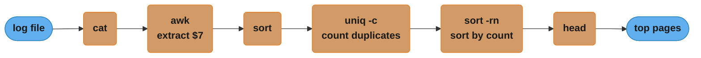
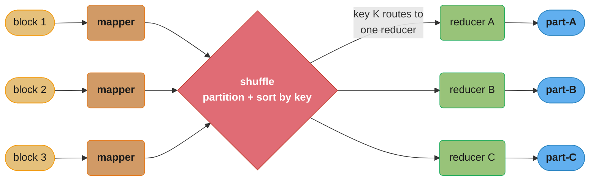
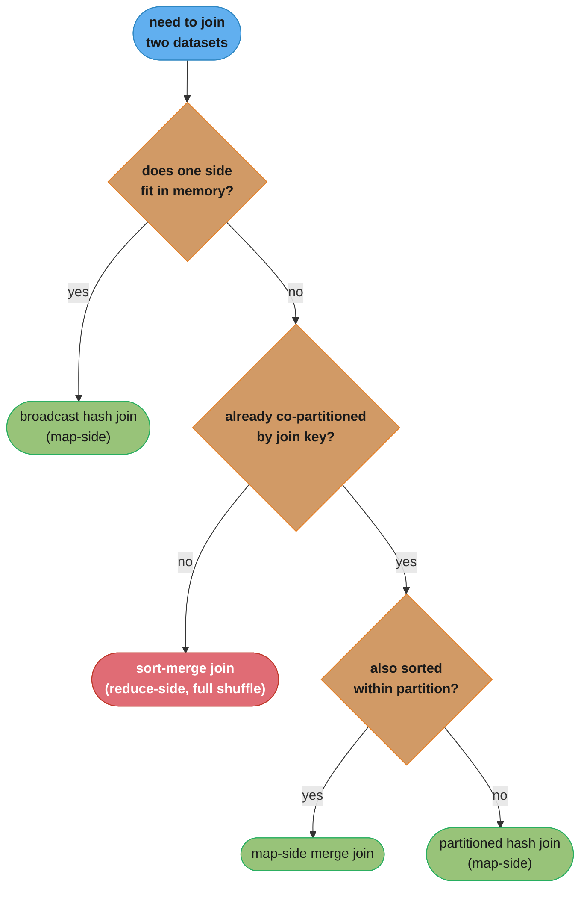
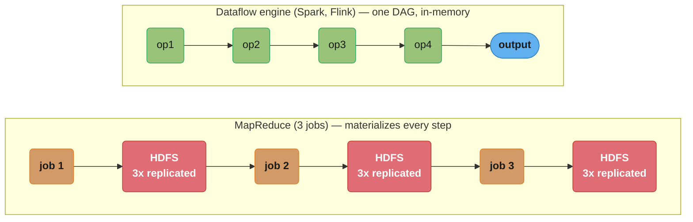
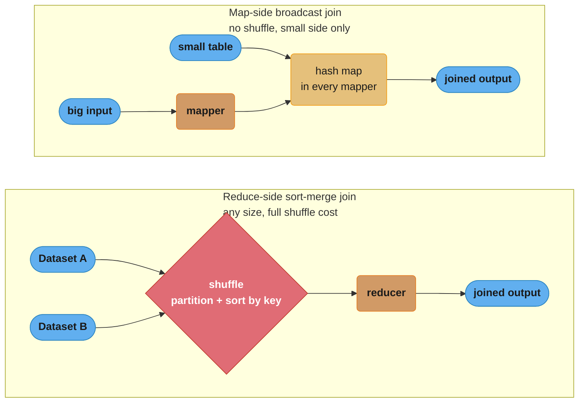

# Chapter 10: Batch Processing

> Part III — Derived Data · DDIA (Kleppmann) · opens Part III, leads to Ch 11 (stream processing)

## Chapter Map

Part III is about **derived data**: systems that take data from one place and transform it into
another (indexes, caches, recommendations, reports). Chapter 10 covers the **batch** style:
process a large, *bounded* dataset all at once and produce an output, with no response to a user
waiting — throughput, not latency, is the metric. Kleppmann starts with humble **Unix tools** to
extract the design philosophy, then scales that philosophy up to **MapReduce** and its successors
(**dataflow engines** like Spark and Flink).

**TL;DR:**
- Batch jobs read **bounded** input and write derived output; success is measured by
  **throughput** and the job is **deterministic and re-runnable** (retry on failure).
- The **Unix philosophy** — small tools, uniform interface (lines of text), composition via pipes,
  immutable inputs — is the intellectual blueprint for MapReduce.
- **MapReduce** runs map and reduce functions across a distributed filesystem (HDFS), bringing
  computation to the data and tolerating faults by retrying individual tasks.
- **Joins** in batch are done by sort-merge (reduce-side) or by broadcast/partitioned hash
  (map-side); **dataflow engines** (Spark, Tez, Flink) generalize MapReduce, keeping data in
  memory and avoiding materializing every intermediate step.

## The Big Question

> "I have an enormous pile of accumulated data — all of yesterday's logs, the whole user table —
> and I want to crunch it into something useful (a search index, a recommendation model, a report)
> reliably across hundreds of machines, where machines *will* fail mid-job. How?"

Analogy: batch processing is an industrial assembly line versus a barista. The barista (online
service) makes one coffee per waiting customer (low latency, one request). The assembly line
(batch job) runs overnight, transforming a warehouse of raw material into finished goods as fast as
possible (high throughput, no one waiting) — and if one station jams, you just re-run that station's
work, because the raw material is still there, untouched.

---

## 10.1 Batch Processing with Unix Tools

Kleppmann derives big-data principles from a simple task: find the most popular pages in a web
server log. A chain of standard tools — `cat log | awk '{print $7}' | sort | uniq -c | sort -rn |
head` — solves it. Two lessons emerge:


Caption: `cat log | awk '{print $7}' | sort | uniq -c | sort -rn | head` composes six single-purpose
tools purely through pipes — every stage reads lines of text on stdin and writes lines of text on
stdout, so no tool knows or cares what feeds it or what it feeds.

**The uniform interface.** Unix tools all speak the same data format: a **file = a sequence of
lines / bytes**. Because every tool reads lines from stdin and writes lines to stdout, *any* tool
can feed *any* other. This uniform interface is what makes arbitrary composition possible.

**Separation of logic and wiring.** A program reads stdin and writes stdout; it doesn't know or care
where the input comes from or where the output goes (`|` to another tool, `>` to a file, a terminal).
This **loose coupling** (the Unix philosophy: do one thing well, expect output to become another
program's input, compose small tools) lets you build pipelines from reusable pieces.

A crucial property: **immutable inputs**. A Unix pipeline doesn't modify its input file, so you can
re-run it as many times as you like with different flags — experiment freely, and recover from a
mistake by re-running. The downside of Unix tools: they run on a single machine, so they don't scale
to data that exceeds one machine — which is exactly what MapReduce fixes while keeping the philosophy.

## 10.2 MapReduce and Distributed Filesystems

**MapReduce** is "Unix tools at the scale of thousands of machines." Like a Unix tool, a MapReduce
job reads input and produces output without modifying the input and with no side effects. But instead
of stdin/stdout, it reads from and writes to a **distributed filesystem** — **HDFS** (Hadoop
Distributed File System), an open-source reimplementation of the Google File System. HDFS is
**shared-nothing**: files are split into blocks replicated across many machines' local disks, with a
central NameNode tracking block locations — giving cheap, scalable, fault-tolerant storage on
commodity hardware.

### MapReduce job execution

You provide two callbacks (echoing Unix `awk`):

- **Mapper:** called once per input record; extracts a key and value from it. It's stateless across
  records (independent), which is what allows parallelism.
- **Reducer:** the framework collects all values sharing the same key and calls the reducer once per
  key with that collection, producing the output.

The magic step between them is the framework's, not yours: **the shuffle**. After mapping, the
framework **partitions** mapper output by key and **sorts** each partition, then sends all values
for a given key to the same reducer (across the network) — so each reducer sees its keys' values
together and in sorted order. This sort is the heart of MapReduce.


Caption: the shuffle is the framework's own step — partition every mapper's output by key, sort
each partition, and route all of a key's values to one reducer; the scheduler also runs each mapper
on the node already holding its input block ("bring computation to the data") so only the smaller
mapper output crosses the network.

**Bringing computation to the data:** the scheduler tries to run each mapper on a machine that
already stores a replica of that input block, so the (large) input doesn't cross the network — only
the (smaller) mapper output does. Workflows of MapReduce jobs are chained (one job's output is the
next's input), commonly orchestrated by tools like Oozie, Airflow, Luigi.

### Decoding batch throughput: how long does a job actually take?

"Throughput, not latency" is a slogan until you attach the arithmetic to it. For a scan-bound
MapReduce job — the common case, since the map phase reads every input block exactly once — the
wall-clock time is governed by one division:

```
  job time  =  total input bytes / (machines x per-machine scan rate)
```

**In plain terms.** "A batch cluster is one enormous disk; its read speed is the sum of every
machine's read speed, and the job takes as long as it takes to read the pile once."

This is why batch scaling feels so unlike online-service scaling. There is no per-request overhead to
amortize and no queue to keep short — you are simply buying disk bandwidth, and doubling the machines
halves the clock.

| Symbol | What it is |
|--------|------------|
| total input bytes | The bounded dataset. Known before the job starts — that is what "bounded" buys you |
| machines | How many nodes hold a replica and can run a mapper locally |
| per-machine scan rate | Sustained local-disk sequential read, roughly 100 MB/s on commodity spinning disks |
| the product | Aggregate scan rate — the cluster's effective single-disk speed |
| job time | Wall clock, assuming the map phase dominates and nothing is skewed |

**Walk one example.** 100 TB of yesterday's logs on a 1000-machine HDFS cluster, 100 MB/s per disk:

```
  aggregate scan rate = 1000 machines x 100 MB/s
                      = 100,000 MB/s  =  100 GB/s

  job time = 100 TB / 100 GB/s
           = 100,000 GB / 100 GB/s
           = 1,000 s   =  16.7 minutes

  same 100 TB on ONE machine:
           = 100,000 GB / 0.1 GB/s
           = 1,000,000 s  =  11.6 days     <- the Unix-pipeline ceiling from 10.1
```

Sixteen minutes versus eleven and a half days is the entire argument for MapReduce over the shell
pipeline. And the scaling is linear in both directions: 500 machines gives 33.3 minutes, 2000
machines gives 8.3 minutes. Nothing about the job changes — only how many disks are spinning.

**Why "bring computation to the data" is in this formula and not beside it.** The `per-machine scan
rate` term is a *local disk* number only if the mapper runs on a node that already holds the block.
Schedule mappers randomly instead and every byte of the 100 TB crosses the network first; on a
12.5 GB/s (100 Gbit/s) cross-rack fabric that alone is 8,000 s = 2.2 hours, turning a 16.7-minute job
into a network-bound one an order of magnitude slower. Data locality is not an optimization here, it
is what keeps the division honest.

### Reduce-side joins and grouping

To **join** two datasets (e.g. user activity events with the user profile table) in MapReduce:

- **Sort-merge join (reduce-side):** mappers emit records from *both* datasets keyed by the join key
  (user ID); the shuffle brings all records for a given user — the profile *and* all their events —
  to the same reducer, in sorted order (arrange for the profile to arrive first), and the reducer
  joins them. Robust and general; works regardless of data size, but pays the full shuffle cost.
- **Handling skew (hot keys):** a celebrity user with millions of events sends them all to one
  reducer — a **hot-spot straggler** that delays the whole job. Mitigations (skewed/sharded joins)
  spread a hot key's records across multiple reducers.

### Map-side joins

When you can avoid the shuffle, joins get much faster — done entirely in the mapper:

- **Broadcast hash join:** if one dataset is small enough to fit in memory, load it into a hash table
  in *every* mapper and join each large-dataset record against it as it's read. No reducer, no
  shuffle.
- **Partitioned hash join:** if both datasets are already partitioned the same way by the join key
  (e.g. both into 100 partitions by user ID mod 100), a mapper only needs to join partition *i* of
  one against partition *i* of the other.
- **Map-side merge join:** if the inputs are also sorted within each partition, merge them directly.


Caption: the join strategy reduces to three questions — does a side fit in memory (broadcast hash),
are both sides already co-partitioned by key (partitioned hash), and are they also sorted within
partition (map-side merge) — falling back to the general but full-shuffle sort-merge (reduce-side)
join only when none of those hold.

### Decoding join cost: shuffle bytes versus broadcast bytes

The decision tree above hides a single comparison of two byte counts. Write `A` for the large side,
`B` for the small side, and `N` for the number of machines:

```
  sort-merge (reduce-side) network bytes  =  A + B          (both sides shuffled, once)
  broadcast hash (map-side) network bytes =  B x N          (small side copied to every node)
```

**What this actually says.** "Shuffling moves each row once no matter how big the cluster; broadcasting
moves the small table once *per machine*. Pick whichever side you'd rather pay for."

Notice what each formula does *not* depend on. Sort-merge cost is independent of `N` — adding machines
speeds the job up without moving more bytes. Broadcast cost is independent of `A` — the giant side
never crosses the network at all. That asymmetry is the whole reason both strategies exist.

| Symbol | What it is |
|--------|------------|
| `A` | Bytes in the large dataset (the activity events) |
| `B` | Bytes in the small dataset (the user profile table) |
| `N` | Number of machines, i.e. how many mapper hash tables you must fill |
| `A + B` | Sort-merge's bill: every record of both sides crosses the network exactly once |
| `B x N` | Broadcast's bill: one full copy of the small side per node, large side stays put |
| memory for `B` | The hard precondition — `B` must fit in a single mapper's heap, or broadcast is off the table |

**Walk one example.** Joining 10 TB of activity events against a 100 MB profile table, 1000 machines:

```
                            bytes over the network
  sort-merge   A + B  = 10 TB + 100 MB   = 10.0001 TB
  broadcast    B x N  = 100 MB x 1000    =    100 GB

  ratio = 10.0001 TB / 100 GB = 100x less data moved by broadcast

  at a 12.5 GB/s (100 Gbit/s) cross-rack fabric:
    sort-merge  10.0001 TB / 12.5 GB/s =  800 s   = 13.3 min of pure shuffle
    broadcast      100 GB / 12.5 GB/s  =    8 s
```

**Where the two curves cross.** Broadcast is not free — grow the small side and `B x N` climbs fast:

```
  B x N  <  A + B          broadcast wins
  B(N - 1) < A
  B < A / (N - 1)

  A = 10 TB, N = 1000  ->  B < 10 TB / 999  =  10.01 GB

  B =   100 MB  ->  broadcast   100 GB  vs shuffle 10.00 TB   broadcast wins by 100x
  B = 10.01 GB  ->  broadcast 10.01 TB  vs shuffle 10.01 TB   dead heat
  B =    20 GB  ->  broadcast 20.00 TB  vs shuffle 10.02 TB   shuffle wins, 2x cheaper
```

So on a 1000-node cluster a 20 GB "small" table is already the wrong choice for broadcast even though
20 GB fits comfortably in memory. "Does it fit in RAM?" is the *precondition*; `B < A/(N-1)` is the
actual decision — and it gets stricter as the cluster grows. This is exactly the calculation a query
optimizer (Hive, Spark SQL) is making for you when it picks a join strategy from table statistics.

### Decoding skew: why one hot key sets the whole job's clock

A reduce phase finishes when its *slowest* reducer finishes, so the job's time is set by the largest
partition, not the average one:

```
  job time  ~  max records on any reducer / reducer rate
  uniform case:  records / R          (R = number of reducers)
  skewed case:   f x records          (f = the hot key's share of all records)

  inflation factor = (f x records) / (records / R) = f x R
```

**Read it like this.** "Skew multiplies your job time by the hot key's share times the reducer count —
so on a 1000-reducer job, a key holding just 5% of the rows makes the job 50x longer."

| Symbol | What it is |
|--------|------------|
| `records` | Total rows flowing into the reduce phase |
| `R` | Number of reducers, i.e. how many ways the work was meant to split |
| `f` | Fraction of all records carrying the single hottest join key |
| `f x records` | What the unlucky reducer actually receives |
| `records / R` | What every reducer *should* have received |
| `f x R` | The inflation factor — note it grows with `R`, so adding reducers does not help |

**Walk one example.** 10 billion activity records, 1000 reducers, one celebrity at 5% of all events:

```
  uniform per reducer   = 10,000,000,000 / 1000        =  10,000,000 records
  celebrity's reducer   = 0.05 x 10,000,000,000        = 500,000,000 records
  the other 999 share   = 9,500,000,000 / 999          =   9,509,510 records

  inflation = 500,000,000 / 10,000,000 = 50x

  at 200,000 records/s per reducer:
    999 reducers finish in  9,509,510 / 200,000 =   47.5 s
    the hot reducer takes 500,000,000 / 200,000 = 2,500 s = 41.7 minutes

  999 machines sit idle for 41 minutes waiting on one.
```

Even a 1% hot key gives `0.01 x 1000 = 10x` inflation. The cruel term is `f x R`: throwing more
reducers at a skewed job raises the inflation factor, because the *uniform* baseline shrinks while the
hot key's load does not move at all. Only splitting the hot key itself (a skewed/sharded join that
scatters that one key across many reducers and replicates the other side to match) changes `f`.

### The output of batch workflows and comparison to MPP databases

Batch output is *derived data*: build a **search index** (Lucene segments built by a batch job, as
at early Google), build read-only **key-value stores** to bulk-load into a serving database
(building the files offline and loading them avoids hammering the live DB), or train ML models. The
guiding philosophy contrasts with parallel SQL (MPP) databases: MapReduce gives you **freedom**
(arbitrary code, any data format — good for messy, semi-structured data and ML) and **fault
tolerance at fine granularity** (retry one failed task, not the whole query) — MPP databases are
faster for the queries they support but abort the whole query on a node failure and require data to
be loaded into their schema first ("schema-on-read" vs the warehouse's "schema-on-write").

## 10.3 Beyond MapReduce

MapReduce is robust but has real inefficiencies, which spawned successors.

**MapReduce's problems.** Every job **materializes** its full output to the distributed filesystem
before the next job can start — so a workflow of N jobs writes and re-reads all intermediate data N
times (slow, and replicated 3× each time). Jobs run strictly sequentially (job N+1 can't start until
job N's output is fully written), and mappers are often redundant (just re-reading what a previous
reducer wrote). The repeated sort and disk I/O dominate.

### Decoding the two multiplications behind "MapReduce is slow"

Both of MapReduce's inefficiencies are multiplications that nobody writes down:

```
  shuffle fragments     =  M x R                       (M mappers, R reducers)
  workflow I/O bytes    =  N x S x (3 writes + 1 read) (N jobs, S bytes per step, 3x replication)
```

**What it means.** "Every mapper owes every reducer a piece, so the shuffle is a full M-by-R grid of
fragments; and every job in the chain writes its whole output to disk three times before the next job
is allowed to read it back once."

| Symbol | What it is |
|--------|------------|
| `M` | Number of mappers, roughly one per input block |
| `R` | Number of reducers, i.e. the partition count you chose |
| `M x R` | Shuffle fragments — each mapper partitions its output R ways, so every pair (m, r) is a transfer |
| `N` | Jobs in the chained workflow |
| `S` | Bytes of intermediate output a single job produces |
| `3 writes` | HDFS replication factor — materialized intermediate data is durably replicated like real data |
| `1 read` | The next job reading it straight back, often just to re-emit it |

**Walk one example.** A 1000-mapper, 1000-reducer job inside a 10-job workflow moving 10 TB a step:

```
  shuffle fragments = 1000 x 1000 = 1,000,000 open transfers/files for ONE job

  raise the partition count to 10,000 reducers to fight skew:
                    = 1000 x 10,000 = 10,000,000       <- 10x the fragments, same data

  workflow I/O, N = 10 jobs at S = 10 TB per step:
    written = 10 x 10 TB x 3 = 300 TB
    read    = 10 x 10 TB x 1 = 100 TB
    total   =                  400 TB of disk and network traffic

  the actual useful data in flight was 10 TB.  Amplification: 40x.
```

That `M x R` grid is why raising the partition count is never free — it is the cost side of the skew
fix above, and it is why shuffle-file counts, not CPU, are what usually falls over first. And that
40x amplification is precisely the term a dataflow engine deletes: keep the 10 TB in memory between
operators and the `N x S x 4` disappears, leaving one pass.

**Dataflow engines** (Spark, Tez, Flink) fix this by modeling the whole workflow as **one job** — a
**directed acyclic graph (DAG)** of **operators** — instead of independent map/reduce steps. They:
keep intermediate state **in memory or local disk** instead of always writing to HDFS (no forced
materialization between steps); avoid unnecessary sorts and redundant mappers; and schedule operators
flexibly. This makes them often much faster than MapReduce for the same workflow, especially
iterative ones.

**Fault tolerance in dataflow engines.** Since they don't materialize every intermediate result, they
can't just re-read it after a failure. Spark uses **RDDs (Resilient Distributed Datasets)** that
track **lineage** — the deterministic sequence of operations used to produce data — so a lost
partition is **recomputed** from its inputs by replaying the operations. This requires the operators
to be **deterministic** (same input ⇒ same output); nondeterminism (random numbers, wall-clock time,
iteration order) breaks recomputation and must be avoided or fixed (e.g. seed the RNG).

**Graphs and iterative processing.** Some algorithms (PageRank, shortest paths, ML training) iterate
until convergence — repeating the same computation, propagating values along graph edges, until they
stabilize. MapReduce is poor at this (each iteration is a separate job re-reading all data). The
**Pregel / bulk synchronous parallel (BSP)** model handles it: vertices send messages to each other
along edges across a series of supersteps, with state kept in memory between iterations (Apache Giraph,
Spark GraphX).

**High-level APIs.** Writing raw map/reduce code is tedious, so higher-level languages and libraries
emerged — **Pig, Hive, Cascading, Spark DataFrames/SQL** — that let you express joins and aggregations
declaratively and compile down to the underlying engine, often with a **query optimizer** choosing
join strategies (broadcast vs partitioned hash, etc.). This brings the declarative-vs-imperative
advantage (Ch 2) back to batch processing.

---

## Visual Intuition


Caption: MapReduce writes every job's full output to HDFS (replicated 3x) before the next job can
start, so a 3-job workflow pays three disk-and-network round-trips; a dataflow engine keeps
intermediate state in memory as one DAG and, on failure, recomputes a lost partition from recorded
lineage instead of re-reading disk (this requires deterministic operators).



Caption: the chapter's two engineering levers — eliminate forced materialization (dataflow engines)
and eliminate the shuffle when a join's small side fits in memory (map-side joins).

---

## Key Concepts Glossary

- **Batch processing** — transforming a large, *bounded* dataset all at once; optimizes throughput.
- **Bounded input** — input of known, finite size (contrast: unbounded streams, Ch 11).
- **Derived data** — data computed from a source (index, cache, model, report).
- **Unix philosophy** — small composable tools, uniform interface, immutable inputs, loose coupling.
- **Uniform interface** — every tool reads/writes the same format (lines of text / bytes).
- **MapReduce** — distributed batch model of map + reduce functions over a distributed filesystem.
- **HDFS / GFS** — shared-nothing distributed filesystem; blocks replicated across local disks.
- **Mapper** — extracts (key, value) from each input record; stateless, parallel.
- **Reducer** — receives all values for a key (sorted); produces output.
- **Shuffle** — the framework's partition-by-key + sort + transfer between map and reduce.
- **Bringing computation to the data** — run mappers where the input block already lives.
- **Sort-merge (reduce-side) join** — join via the shuffle bringing both sides' records together.
- **Broadcast hash join (map-side)** — load a small dataset into memory in every mapper.
- **Partitioned hash join / map-side merge join** — join co-partitioned (and sorted) inputs.
- **Skew / hot key straggler** — a heavy key overloading one reducer and delaying the job.
- **Materialization** — writing a step's full intermediate output to durable storage.
- **Dataflow engine** — Spark/Tez/Flink: a DAG of operators avoiding forced materialization.
- **RDD / lineage** — Spark's recompute-on-failure mechanism via recorded deterministic ops.
- **Determinism** — same input ⇒ same output; required for lineage recomputation.
- **Pregel / bulk synchronous parallel (BSP)** — iterative graph-processing model (Giraph, GraphX).
- **High-level API** — Pig, Hive, Cascading, Spark SQL/DataFrames; declarative over the engine.

---

## Tradeoffs & Decision Tables

| | Batch (Ch 10) | Online service | Stream (Ch 11) |
|---|---|---|---|
| Input | Bounded, known size | One request | Unbounded, never-ending |
| Metric | Throughput | Response time | Throughput + low latency |
| Output | Derived dataset | Response to user | Continuously updated derived data |

| | MapReduce | Dataflow engine (Spark/Flink) |
|---|---|---|
| Intermediate state | Materialized to HDFS each step | In memory / local disk |
| Speed | Slower (repeated disk I/O, sorts) | Faster, esp. iterative |
| Fault tolerance | Re-read materialized output | Recompute from lineage (needs determinism) |
| Model | Independent map/reduce jobs | One DAG of operators |

| Join strategy | Use when | Cost |
|---------------|----------|------|
| Sort-merge (reduce-side) | Any sizes; general | Full shuffle + sort |
| Broadcast hash (map-side) | One side fits in memory | No shuffle |
| Partitioned hash (map-side) | Both co-partitioned by key | No cross-partition shuffle |

| | MapReduce / dataflow | MPP SQL database |
|---|---|---|
| Code | Arbitrary (any language, ML) | SQL queries |
| Data | Any format (schema-on-read) | Loaded into schema (schema-on-write) |
| Fault tolerance | Per-task retry | Whole query aborts on node failure |

---

## Common Pitfalls / War Stories

- **Nondeterministic operators breaking dataflow fault tolerance.** Spark/Flink recompute lost data
  from lineage, which only works if operators are deterministic. Using `rand()`, wall-clock time, or
  relying on undefined ordering means a recomputed partition differs from the original — corrupting
  results or duplicating effects. Seed RNGs and avoid clock/order dependence.
- **Hot-key skew creating a straggler.** A single very common join key (a celebrity user) routes
  millions of records to one reducer, which runs long after all others finish, dragging out the whole
  job. Detect skew and use a skewed/sharded join that splits the hot key across reducers.
- **Forgetting batch input must be immutable.** The whole re-runnability guarantee — retry a failed
  task, re-run a whole job after a bug — depends on inputs not changing under you. Mutating the input
  store mid-job (or pointing at live, changing data) destroys determinism and makes retries unsafe.
- **Materialization overhead in long MapReduce chains.** A 10-job workflow writes and re-reads (and
  3×-replicates) all intermediate data ten times; the disk and network I/O dominate runtime. Collapse
  it into one dataflow-engine DAG to keep intermediates in memory.
- **Bulk-writing derived data straight into the live serving database.** Having a batch job do
  millions of individual writes/updates against the production database overloads it and can corrupt
  on partial failure. Instead build the read-only output files offline and atomically load/swap them
  into the serving store.
- **Using MapReduce for iterative algorithms.** Running PageRank or ML training as a chain of
  MapReduce jobs re-reads the entire dataset every iteration — crippling for hundreds of iterations.
  Use a BSP/graph engine (Giraph, GraphX) or an in-memory dataflow engine that keeps state across
  iterations.

---

## Real-World Systems Referenced

Unix and GNU coreutils (awk, sort, uniq), Google MapReduce and GFS, Apache Hadoop and HDFS, Apache
Spark (RDDs, DataFrames), Apache Tez, Apache Flink (batch mode), Apache Hive, Apache Pig, Cascading,
Apache Giraph and Spark GraphX (Pregel/BSP), workflow schedulers Oozie/Airflow/Luigi, and the
contrast class of MPP databases (Teradata, Vertica, Impala).

---

## Summary

Batch processing transforms a large, *bounded* input into derived output, optimizing throughput
rather than latency, and is designed to be deterministic and re-runnable so failures are handled by
retrying. The **Unix philosophy** — small tools with a uniform line-based interface, immutable
inputs, and composition through pipes — is the conceptual ancestor of big-data tooling.
**MapReduce** scales that philosophy across thousands of machines: stateless **mappers** extract
(key, value) pairs, the framework's **shuffle** partitions and sorts by key, and **reducers** process
each key's grouped values, all reading/writing a shared-nothing distributed filesystem (**HDFS**)
with computation brought to the data and fault tolerance via per-task retry. **Joins** are done by
sort-merge (reduce-side, general but shuffle-heavy) or by broadcast/partitioned hash (map-side, fast
when a side fits in memory or inputs are co-partitioned), with hot-key **skew** the main hazard.
MapReduce's forced **materialization** of every intermediate step makes it slow, so **dataflow
engines** (Spark, Tez, Flink) model the whole workflow as one in-memory DAG, recovering from failures
by **recomputing from lineage** (requiring determinism), handle **iterative/graph** workloads with the
Pregel/BSP model, and expose declarative **high-level APIs** (Hive, Pig, Spark SQL).

---

## Interview Questions

**Q: What distinguishes batch processing from online services and stream processing?**
Batch processing reads a large, *bounded* input of known size and produces derived output, with no user waiting, so success is measured by throughput (how much data per unit time) rather than response time. Online services handle one request at a time and are judged by latency. Stream processing (Chapter 11) is the middle ground: it consumes *unbounded*, never-ending input and produces continuously updated output with low latency. Batch's bounded, no-one-waiting nature is what lets it prioritize throughput and rely on re-running jobs to handle failures.

**Q: How does the Unix philosophy foreshadow MapReduce?**
The Unix philosophy builds complex behavior from small tools that each do one thing well, connected through a uniform interface (every tool reads and writes sequences of lines/bytes) and composed via pipes, treating inputs as immutable. MapReduce scales exactly these ideas: a job reads input and writes output without modifying the input or causing side effects, mappers and reducers are small composable functions, and jobs chain into workflows. The key inheritance is loose coupling and immutable inputs, which together make jobs re-runnable and fault-tolerant.

**Q: What is the shuffle in MapReduce, and why is it the heart of the model?**
The shuffle is the framework-managed step between map and reduce that partitions every mapper's output by key, sorts each partition, and transfers all values for a given key across the network to a single reducer. It's the heart of the model because it's what guarantees a reducer sees *all* values for its keys, grouped and sorted — which is what makes grouping, aggregation, and joins possible. The programmer writes only map and reduce; the shuffle (and its sort) is the expensive, defining machinery MapReduce provides.

**Q: What does "bringing computation to the data" mean and why does it matter?**
It means the scheduler tries to run each mapper task on a machine that already stores a replica of the input block that task will read, rather than shipping the input across the network to wherever there's a free CPU. It matters because the input data is large while the program is small, so moving the computation to the data avoids saturating the network with bulk data transfer — only the smaller mapper *output* needs to be shuffled. This locality optimization is central to MapReduce's scalability on commodity clusters.

**Q: Compare reduce-side and map-side joins.**
A reduce-side (sort-merge) join has mappers emit records from both datasets keyed by the join key; the shuffle brings all records for a key to one reducer in sorted order, which joins them — it works for any data sizes but pays the full shuffle and sort cost. A map-side join avoids the shuffle entirely: a broadcast hash join loads a small dataset into an in-memory hash table in every mapper and probes it per record, while a partitioned hash join exploits inputs already co-partitioned by the join key so each mapper joins matching partitions. Map-side is much faster but requires a small side or pre-partitioned inputs.

**Q: What is hot-key skew in a join, and how do you mitigate it?**
Hot-key skew is when one join key has vastly more records than others — a celebrity user with millions of events — so all of them are shuffled to a single reducer, which becomes a straggler running long after every other reducer has finished, dragging out the whole job's completion time. Mitigations (skewed or sharded joins) detect the hot key and split its records across multiple reducers, replicating the matching record from the other (small) side to each of those reducers so the work is parallelized rather than bottlenecked on one node.

**Q: Why is MapReduce's forced materialization a performance problem, and how do dataflow engines fix it?**
MapReduce writes each job's complete output to the distributed filesystem (replicated three times) before the next job can read it, so a workflow of N jobs passes all intermediate data through disk and network N times, and jobs must run strictly sequentially. Dataflow engines (Spark, Tez, Flink) model the entire workflow as one DAG of operators and keep intermediate state in memory or local disk instead of materializing to HDFS between steps, also skipping unnecessary sorts and redundant mappers — making them substantially faster, especially for iterative workloads.

**Q: How does Spark achieve fault tolerance without materializing every intermediate result?**
Spark represents data as RDDs (Resilient Distributed Datasets) that record their *lineage* — the exact, deterministic sequence of operations that produced them from their inputs. When a partition is lost to a machine failure, Spark doesn't need a saved copy; it recomputes that partition by replaying the recorded operations on the (still available or itself recomputable) input data. This trades recomputation cost for avoiding the heavy materialization MapReduce does, but it depends critically on the operators being deterministic.

**Q: Why must dataflow operators be deterministic, and what breaks determinism?**
Because fault recovery works by recomputing lost data from lineage, a recomputed partition must produce *exactly* the same result as the original — otherwise downstream results become inconsistent or effects get duplicated. Determinism is broken by anything that can differ between runs: random number generators without a fixed seed, reading the wall-clock time, relying on hash-map iteration order or the order in which records happen to arrive, or non-idempotent external side effects. Such sources must be eliminated or made reproducible (e.g. seeding the RNG) for lineage-based recovery to be correct.

**Q: Why is plain MapReduce poor for iterative algorithms like PageRank, and what's the alternative?**
Iterative algorithms repeat the same computation many times until convergence, but MapReduce treats each iteration as an independent job that must read the entire dataset from HDFS, recompute, and write it all back — so hundreds of iterations mean hundreds of full-dataset disk round-trips, which is crippling. The alternative is the Pregel / bulk synchronous parallel (BSP) model (Apache Giraph, Spark GraphX), where vertices keep state in memory across supersteps and send messages to each other along graph edges, so each iteration only propagates updates rather than re-reading and re-writing everything.

**Q: How do batch processing (MapReduce/dataflow) and MPP SQL databases differ in philosophy?**
MapReduce-style systems give you freedom and resilience: you can run arbitrary code in any language over data in any format (schema-on-read, good for messy semi-structured data and machine learning), and fault tolerance is fine-grained — a failed task is retried without restarting the whole job. MPP SQL databases require data to be loaded into a fixed schema first (schema-on-write) and only run SQL, and they typically abort an entire query if a node fails; in return they're often faster for the structured analytic queries they're designed for. It's a flexibility-and-fault-tolerance versus speed-and-structure tradeoff.

**Q: What kinds of output do batch workflows typically produce, and why build them offline?**
Batch jobs produce derived data: search indexes (e.g. Lucene segments), read-only key-value snapshots to bulk-load into serving databases, recommendation results, and trained machine-learning models. They're built offline because generating this derived data involves huge numbers of writes that would overload a live serving database and risk inconsistency on partial failure; instead the job writes immutable output files in one place and the serving layer atomically loads or swaps them in, keeping the production system stable and the operation re-runnable.

**Q: Why are immutable inputs so important to batch processing?**
Immutable inputs are what make batch jobs safely re-runnable, which is the foundation of batch fault tolerance and experimentation. Because a job never modifies its input, you can retry a failed task, re-run the entire job after fixing a bug, or run it again with different parameters, always getting a well-defined result from the same starting data. If inputs could change underneath a running job, retries would be non-deterministic and a partial failure could leave the system in an unrecoverable, inconsistent state — so immutability underpins the whole model's reliability.

**Q: What roles do high-level APIs like Hive, Pig, and Spark SQL play?**
They let engineers express batch computations — joins, filters, aggregations — declaratively instead of hand-writing low-level map and reduce functions, then compile that down to the underlying execution engine. Crucially, they include query optimizers that automatically choose execution strategies, such as whether to use a broadcast hash join or a partitioned join based on data sizes, bringing the declarative-versus-imperative advantages from Chapter 2 to batch processing: more concise code, and the engine — not the programmer — picking the efficient physical plan.

**Q: What is HDFS, and what design choices make it suitable for batch processing?**
HDFS (the Hadoop Distributed File System, modeled on Google's GFS) is a shared-nothing distributed filesystem that splits files into large blocks and replicates each block across the local disks of many commodity machines, with a central NameNode tracking block locations. These choices suit batch processing because they provide cheap, massively scalable, fault-tolerant storage (lost replicas are re-replicated automatically), and block placement enables "bringing computation to the data" by scheduling tasks where their input already resides. It favors high-throughput sequential scans of huge files over low-latency random access.

**Q: How is a workflow of multiple MapReduce jobs constructed and managed?**
Complex computations rarely fit in a single map-and-reduce pass, so they're built as a *workflow*: the output directory of one job on HDFS becomes the input of the next, chaining jobs together. Because there's no built-in notion of a multi-job pipeline in basic MapReduce, scheduling tools like Oozie, Airflow, and Luigi orchestrate the dependencies — deciding when each job can start (after its inputs are fully written), handling retries, and managing the overall DAG of jobs — which is one of the awkwardnesses that dataflow engines later eliminated by representing the whole workflow as a single job.

---

## Cross-links in this repo

- [devops/ — data pipelines, workflow orchestration, cluster scheduling](../../../devops/README.md)
- [database/time_series_databases/ — columnar analytics that batch jobs feed](../../../database/time_series_databases/README.md)
- [ml/ — batch feature pipelines and offline model training (derived data)](../../../ml/README.md)
- [book/.../03_storage_and_retrieval/ — column storage and the OLAP side batch feeds](../03_storage_and_retrieval/README.md)

## Further Reading

- Kleppmann, DDIA Ch 10 — original text and references.
- Dean & Ghemawat, "MapReduce: Simplified Data Processing on Large Clusters," OSDI 2004.
- Zaharia et al., "Resilient Distributed Datasets," NSDI 2012 — Spark's lineage-based fault tolerance.
- Malewicz et al., "Pregel: A System for Large-Scale Graph Processing," SIGMOD 2010.
