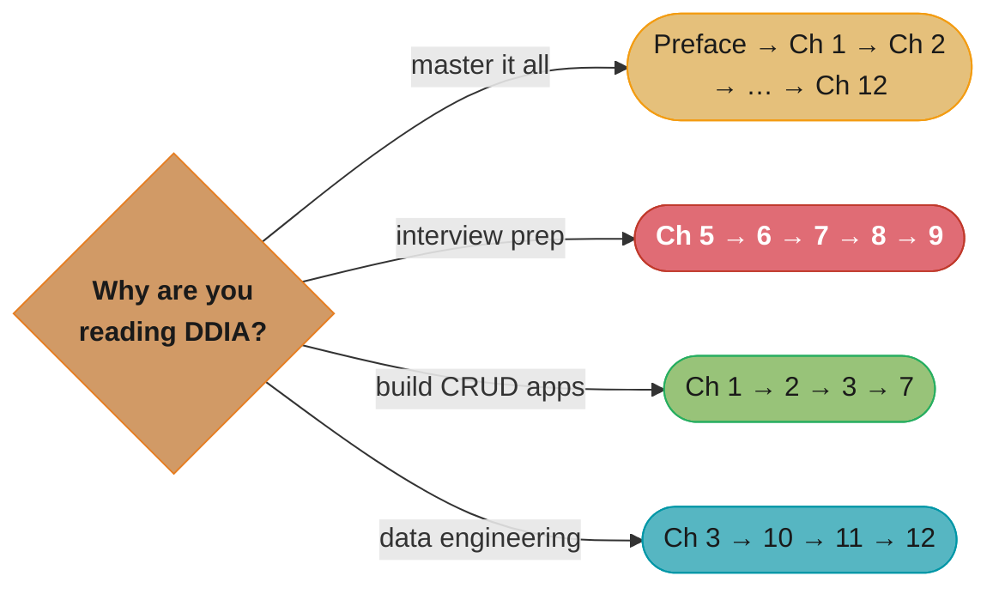

# Designing Data-Intensive Applications (DDIA)

> Martin Kleppmann · O'Reilly · "The big ideas behind reliable, scalable, and maintainable
> systems." A chapter-by-chapter, in-depth summary — read this folder in order and you have
> read the book.

---

## The Book's Thesis

Modern applications are **data-intensive** rather than compute-intensive: the hard part is
not raw CPU but the *amount* of data, its *complexity*, and the *speed at which it changes*.
No single tool does it all anymore — applications stitch together datastores, caches,
search indexes, stream processors, and batch pipelines. DDIA is about the **principles**
that let you reason about, combine, and trust those tools, organized around three concerns
that recur on every page:

- **Reliability** — works correctly even when things (hardware, software, humans) go wrong.
- **Scalability** — has strategies to keep performance acceptable as load grows.
- **Maintainability** — many different people can work on it productively over time.

The deeper through-line of Parts II and III: **everything is a question of guarantees**.
What does the system promise when a node dies, a network drops packets, or two writes race?
Most of the book is spent making those guarantees precise and showing what they cost.

---

## The Three Parts (ASCII Map)

```mermaid
flowchart TD
    classDef io      fill:#61afef,stroke:#2e86c1,color:#1a1a1a,font-weight:bold
    classDef frozen  fill:#c678dd,stroke:#9b59b6,color:#fff
    classDef train   fill:#98c379,stroke:#27ae60,color:#1a1a1a
    classDef mathOp  fill:#d19a66,stroke:#e67e22,color:#1a1a1a,font-weight:bold
    classDef lossN   fill:#e06c75,stroke:#c0392b,color:#fff,font-weight:bold
    classDef req     fill:#56b6c2,stroke:#0097a7,color:#1a1a1a
    classDef base    fill:#e5c07b,stroke:#f39c12,color:#1a1a1a

    root(["DDIA"]) --> P1
    root --> P2
    root --> P3

    subgraph P1["Part I — Foundations<br/>(single machine)"]
        C1["Ch 1<br/>Reliable, Scalable,<br/>Maintainable"] --> C2["Ch 2<br/>Data Models and<br/>Query Languages"] --> C3["Ch 3<br/>Storage and Retrieval"] --> C4["Ch 4<br/>Encoding and Evolution"]
    end

    subgraph P2["Part II — Distributed Data<br/>(many machines)"]
        C5["Ch 5<br/>Replication"] --> C6["Ch 6<br/>Partitioning"] --> C7["Ch 7<br/>Transactions"] --> C8["Ch 8<br/>Trouble with<br/>Distributed Systems"] --> C9["Ch 9<br/>Consistency and<br/>Consensus"]
    end

    subgraph P3["Part III — Derived Data<br/>(composing systems)"]
        C10["Ch 10<br/>Batch Processing"] --> C11["Ch 11<br/>Stream Processing"] --> C12["Ch 12<br/>The Future of<br/>Data Systems"]
    end

    class root io
    class C1,C2,C3 base
    class C4 mathOp
    class C5 frozen
    class C6 mathOp
    class C7 train
    class C8 lossN
    class C9 mathOp
    class C10 mathOp
    class C11 req
    class C12 train
```

*Color follows the content: storage foundations in gold (Ch 1–3), hashing/coordination
mechanics in orange (Ch 4, 6, 9, 10), replication in purple (Ch 5), committed/transactional
paths in green (Ch 7, 12), Ch 8's network-and-clock failures in red, and Ch 11's event
streams in teal.*

Part I reasons about a *single node*. Part II asks what changes when data lives on *many*
nodes (the answer: almost everything). Part III shows how to *compose* multiple systems —
batch and stream — into a correct, maintainable whole, then closes on ethics.

---

## Chapter Index

| # | Chapter | Folder | One-line summary | Repo deep-dive |
|---|---------|--------|------------------|----------------|
| — | Preface & Book Map | [00_preface_and_book_map/](00_preface_and_book_map/README.md) | What "data-intensive" means; how the book is structured | [hld/](../../hld/README.md) |
| 1 | Reliable, Scalable, Maintainable | [01_reliable_scalable_maintainable/](01_reliable_scalable_maintainable/README.md) | The three concerns; faults; load; percentiles | [hld/scalability/](../../hld/scalability/README.md) |
| 2 | Data Models & Query Languages | [02_data_models_and_query_languages/](02_data_models_and_query_languages/README.md) | Relational vs document vs graph; declarative queries | [database/schema_design_and_normalization/](../../database/schema_design_and_normalization/README.md) |
| 3 | Storage & Retrieval | [03_storage_and_retrieval/](03_storage_and_retrieval/README.md) | LSM-trees vs B-trees; OLTP vs OLAP; columnar | [database/storage_engines_internals/](../../database/storage_engines_internals/README.md) |
| 4 | Encoding & Evolution | [04_encoding_and_evolution/](04_encoding_and_evolution/README.md) | Avro/Protobuf/Thrift; backward/forward compat | [backend/](../../backend/CLAUDE.md) |
| 5 | Replication | [05_replication/](05_replication/README.md) | Leaders/followers; replication lag; quorums | [database/replication_and_high_availability/](../../database/replication_and_high_availability/README.md) |
| 6 | Partitioning | [06_partitioning/](06_partitioning/README.md) | Range vs hash; secondary indexes; rebalancing | [database/sharding_and_partitioning/](../../database/sharding_and_partitioning/README.md) |
| 7 | Transactions | [07_transactions/](07_transactions/README.md) | ACID; weak isolation; SSI; write skew | [database/concurrency_control_and_locking/](../../database/concurrency_control_and_locking/README.md) |
| 8 | Trouble with Distributed Systems | [08_trouble_with_distributed_systems/](08_trouble_with_distributed_systems/README.md) | Unreliable networks, clocks, process pauses | [hld/](../../hld/README.md) |
| 9 | Consistency & Consensus | [09_consistency_and_consensus/](09_consistency_and_consensus/README.md) | Linearizability; ordering; 2PC; consensus | [database/consistency_models_and_consensus/](../../database/consistency_models_and_consensus/README.md) |
| 10 | Batch Processing | [10_batch_processing/](10_batch_processing/README.md) | Unix tools; MapReduce; dataflow engines | [devops/](../../devops/README.md) |
| 11 | Stream Processing | [11_stream_processing/](11_stream_processing/README.md) | Logs; CDC; windowing; exactly-once | [backend/](../../backend/CLAUDE.md) |
| 12 | The Future of Data Systems | [12_future_of_data_systems/](12_future_of_data_systems/README.md) | Unbundling; correctness; ethics | [hld/](../../hld/README.md) |

---

## How to Read This (Reading Paths)

- **Cover to cover (recommended):** preface → Ch 1 → … → Ch 12, the book's intended order.
  Each part builds on the previous one.
- **Distributed-systems crash course:** Ch 5 → 6 → 7 → 8 → 9. The dense, interview-critical
  core. Read Ch 8 before Ch 9 — consensus only makes sense once you accept how badly
  networks and clocks behave.
- **"I build CRUD apps" path:** Ch 1 → 2 → 3 → 7. Data models, storage, and transactions
  cover most day-to-day backend work.
- **Data-engineering path:** Ch 3 (columnar) → 10 → 11 → 12. Batch and stream processing.

*Four goals, four subsets of the same twelve chapters — the interview-prep path (red)
concentrates on Ch 5–9, the chapters most heavily cross-linked to this repo's `database/`
deep dives (see the Cross-Reference Map below).*

---

## Build Manifest

Per-file build status for this book. Update the row to `done` the moment a chapter file is
completed and diagram-linted.

| # | File | Status |
|---|------|--------|
| — | `00_preface_and_book_map/README.md` | done |
| 1 | `01_reliable_scalable_maintainable/README.md` | done |
| 2 | `02_data_models_and_query_languages/README.md` | done |
| 3 | `03_storage_and_retrieval/README.md` | done |
| 4 | `04_encoding_and_evolution/README.md` | done |
| 5 | `05_replication/README.md` | done |
| 6 | `06_partitioning/README.md` | done |
| 7 | `07_transactions/README.md` | done |
| 8 | `08_trouble_with_distributed_systems/README.md` | done |
| 9 | `09_consistency_and_consensus/README.md` | done |
| 10 | `10_batch_processing/README.md` | done |
| 11 | `11_stream_processing/README.md` | done |
| 12 | `12_future_of_data_systems/README.md` | done |

---

## Cross-Reference Map (DDIA → repo deep dives)

| DDIA concept | Primary deep-dive module |
|--------------|--------------------------|
| Percentiles, tail latency, load | [hld/scalability/](../../hld/scalability/README.md) |
| LSM-tree vs B-tree internals | [database/storage_engines_internals/](../../database/storage_engines_internals/README.md) |
| Indexing structures | [database/indexing_deep_dive/](../../database/indexing_deep_dive/README.md) |
| Replication topologies & failover | [database/replication_and_high_availability/](../../database/replication_and_high_availability/README.md) |
| Consistent hashing, shard keys | [database/sharding_and_partitioning/](../../database/sharding_and_partitioning/README.md) |
| Isolation levels, MVCC, locks | [database/concurrency_control_and_locking/](../../database/concurrency_control_and_locking/README.md) |
| 2PC, Saga, outbox | [database/distributed_transactions/](../../database/distributed_transactions/README.md) |
| Linearizability, Raft, CRDTs | [database/consistency_models_and_consensus/](../../database/consistency_models_and_consensus/README.md) |
| Caching patterns | [database/database_caching_patterns/](../../database/database_caching_patterns/README.md) |
