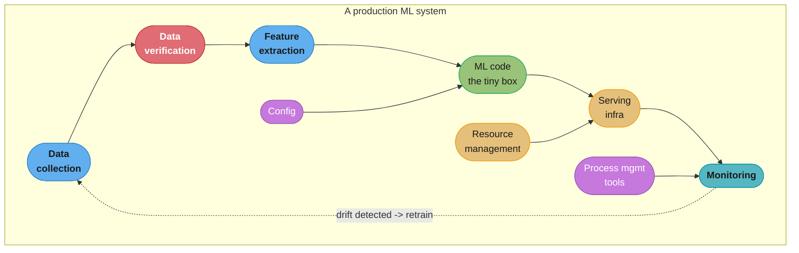
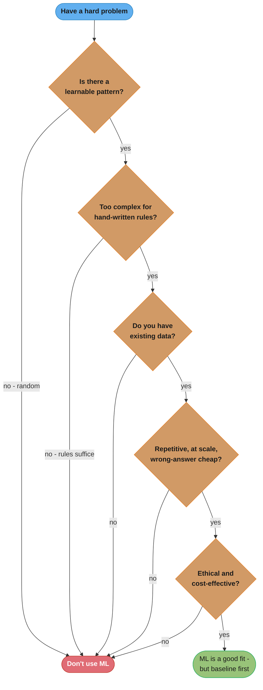
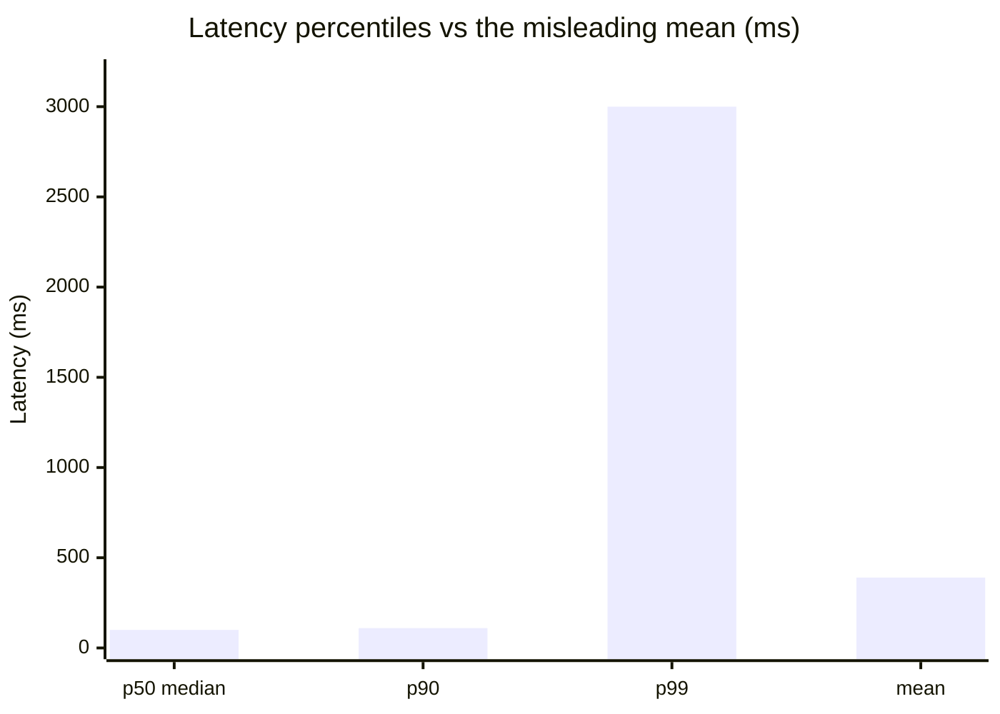

# Chapter 1: Overview of Machine Learning Systems

> Ch 1 of 11 · Designing Machine Learning Systems (Huyen) · the framing chapter — when ML is the right tool, and how production differs from research

## Chapter Map

This is the book's framing chapter. Before any modeling, feature engineering, or deployment,
it asks two questions that decide whether the rest of the book even applies to your problem:
**Is machine learning the right tool at all?** and **What actually changes when a model leaves
the notebook and starts serving real users?** Huyen's whole thesis is that a *production ML
system* is a different animal from the models you meet in courses and papers — the model is a
small piece of a large socio-technical system, and most of what makes ML systems succeed or
fail lives outside the model. The chapter defines ML precisely, surveys where it's used, then
draws the sharp research-vs-production contrast (objectives, computational priority, data,
fairness, interpretability) that the remaining ten chapters build on.

**TL;DR:**
- ML is worth using only when a system needs to **learn** **complex patterns** from **existing
  data** to make **predictions** on **unseen data** — and even then, only if the task is
  repetitive, at scale, with cheap wrong predictions and shifting patterns. Otherwise a simpler
  heuristic usually wins; try the simplest non-ML baseline first.
- The gap between ML *in research* and *in production* is the book's core idea: production has
  many stakeholders with **conflicting objectives**, prioritizes **inference latency** over
  training throughput, faces **messy, shifting, user-generated data**, and carries **fairness**
  and **interpretability** consequences that benchmarks never surface.
- A "stellar" offline model is not a business win — Booking.com and Netflix both learned that
  offline accuracy and business value diverge.
- ML systems differ from traditional software at the root: SWE keeps code and data separate; ML
  *fuses* them, so you now have to **test and version data**, not just code.

## The Big Question

> "I have a hard problem and a pile of data. Should I throw machine learning at it — and if I
> do, why does the thing that dazzled everyone in the notebook keep disappointing in
> production?"

The intuition to hold onto: **a model is to an ML system what an engine is to a car.** You can
build a spectacular engine on a test bench (research: chase the best number on a fixed
benchmark), but shipping a car means fuel delivery, cooling, transmission, brakes, a
dashboard, and a driver who has different goals than the engine designer (production: data
pipelines, serving, monitoring, and many teams pulling in different directions). This chapter
is about why the bench engine and the shipped car are judged by completely different criteria —
and why teams that optimize the engine while ignoring the car keep losing.

---

## 1.1 When to Use Machine Learning

The chapter opens by refusing to treat ML as a default. To decide whether ML fits, Huyen first
pins down a **working definition** and then unpacks it phrase by phrase.

> "Machine learning is an approach to **learn** **complex patterns** from **existing data** and
> use these patterns to make **predictions** on **unseen data**."

Every italicized phrase is a *requirement*. If your problem is missing any one of them, ML is
probably the wrong tool.

### Learn — the system has the capacity to learn

The word *learn* means the system must be able to learn something: there must be *something to
learn*, and it must be *learnable*. Contrast with a hardcoded rule. If you can specify the
answer exactly (compute a tax, sort a list, check a password), there is nothing to learn — write
the code. ML earns its place only when the mapping from input to output is too intricate to
write down by hand, so the system has to *infer* it from examples instead of being told it.

### Complex patterns — there are patterns, and they're complex

Two sub-requirements hide here:

- **There are patterns to learn.** ML learns patterns; if the data is genuinely random (stock
  price movements are the classic near-random example), there is no pattern to capture and ML
  will only overfit noise. You cannot learn what isn't there.
- **The patterns are complex.** If the pattern is simple — "if the email contains the exact word
  FREE, mark as spam" — a handful of hand-written rules beats a model. ML pays off when the
  pattern is too complex or high-dimensional for humans to enumerate: the pixels-to-object-label
  mapping in vision, the token-to-next-token mapping in language, the thousands of weak signals
  that add up to "this transaction is fraud." The book's framing: ML shines exactly in the gap
  between "too complex for hand rules" and "still has a real underlying pattern."

### Existing data — data is available, or can be collected

*Existing data* means the patterns have to be learned **from data that exists** (or that you can
collect). Without data, there is nothing to learn *from*. This is where many ML projects die:
the problem is learnable in principle, but no labeled data exists and collecting it is
prohibitively slow or expensive. The **cold-start** problem is a special case — a brand-new
system with no usage history yet has no data to learn from, so it needs a non-ML fallback until
data accumulates. Huyen's practical stance: if you don't have data and can't get it, ML is not
an option *yet*, regardless of how well it would fit otherwise.

### Predictions — the problem is (or can be framed as) predictive

*Predictions* means ML is fundamentally about **making predictions** — estimating a value or a
label for an input. A surprising range of problems become predictive once reframed:
recommendation is "predict how much a user will like this item"; machine translation is "predict
the most likely target-language sequence"; even generation is repeated prediction of the next
token. The book's phrase for this reframing is **predictive machine learning** — if you can turn
your task into "predict X given Y," ML applies; if you truly need a *single, exact, provably
correct* answer rather than a probabilistic best guess, prediction is the wrong frame.

### Unseen data — the patterns generalize to data you haven't seen

*Unseen data* is the payoff and the peril. The whole point is to make predictions on data the
model has **never seen during training** — new emails, new transactions, tomorrow's users. This
requires an assumption the book names explicitly: the **unseen data shares patterns with the
training data**. Formally, they're drawn from similar distributions. When that assumption breaks
— the world shifts, the input distribution moves — the model's predictions degrade even though
its training numbers were great. This is the seed of **data distribution shift**, the subject of
Chapter 8, and the single biggest reason production models decay.

### When ML shines — the checklist

Even when the definition fits, ML is *worth the cost* only when several practical conditions
hold. Huyen's "ML solutions will especially shine when" list:

| Condition | Why it matters | Example |
|-----------|----------------|---------|
| The task is **repetitive** | Repetition gives the model many examples of the same pattern to learn, and amortizes the build cost | Ranking the same feed for millions of sessions a day |
| Wrong predictions are **relatively cheap / tolerable** | ML is probabilistic — it *will* be wrong sometimes; you need the cost of a mistake to be low, or a human/fallback to catch it | A bad product recommendation just gets ignored; a mislabeled photo is a shrug |
| It's at **scale** | ML's upfront cost (data, training, infra) only pays back when spread over enormous prediction volume | A billion translations a day; not one translation a year |
| Patterns are **constantly changing** | Hand rules go stale and need manual rewriting; a retrained model adapts to new patterns automatically | Spam and fraud tactics evolve weekly; fashion/culture trends shift |

The last two are the ones people forget. *Scale* is what makes the fixed cost of ML worthwhile.
*Changing patterns* is what makes ML **better than hardcoded rules over time** — you don't
rewrite thousands of rules, you retrain on fresh data.

### When NOT to use ML

Huyen is equally explicit that plenty of problems should *not* use ML. Don't reach for ML when:

- **It's unethical.** If an ML solution would cause harm — discriminatory decisions, unsafe
  automation, privacy violation — the right answer may be "don't build it," not "build it
  carefully." Ethics is a first-class reason, not an afterthought.
- **Simpler solutions do the trick.** If a handful of heuristics gets you 90% of the way, ship
  the heuristics. Many "AI" problems are solved better and cheaper by a rule, a lookup table, or
  a `SQL` query. Complexity you don't need is a liability.
- **It's not cost-effective.** ML has real, ongoing costs: data collection and labeling,
  training compute, serving infrastructure, monitoring, and a team to keep it alive. If the
  payoff doesn't clear that bar, don't.
- **There's no data (or no patterns).** No data to learn from, or no learnable pattern in the
  data — either kills the project. Random targets and cold-start problems both fall here.
- **A single prediction matters enormously.** ML is statistical: it's good *on average* but
  gives no guarantee on any *individual* case. If one wrong answer is catastrophic and
  irreversible — the book's framing of high-stakes one-shot decisions — a probabilistic model
  that is "usually right" is unacceptable without heavy human oversight.

### The "simplest baseline first" stance

The chapter's practical closer on this topic: **start with the simplest non-ML solution and only
add ML when the simple thing is demonstrably not enough.** A non-ML baseline (a popularity
ranking, a keyword filter, a business rule) does three things at once: it may already be good
enough (saving you an entire ML project), it gives you a **baseline to beat** so you can prove ML
actually helps, and it acts as a **fallback** for cold-start and model-failure cases. This
mindset — earn the complexity — runs through the whole book.

---

## 1.2 Machine Learning Use Cases

Having defined *when* to use ML, the chapter surveys *where* it's actually used, split into two
worlds with very different economics: **consumer-facing** applications and **enterprise**
applications.

### Consumer applications

The ML most people interact with daily lives inside consumer products, often invisibly:

- **Recommendation systems** — the workhorse: what to watch (Netflix), buy (Amazon), listen to
  (Spotify), read (news feeds). Frames "predict how much this user will like this item," at
  enormous scale, tolerant of individual mistakes — a textbook ML fit.
- **Search / ranking** — ordering results by predicted relevance.
- **Predictive typing / autocomplete / smart reply** — predicting the next word or a likely
  full response as you type.
- **Photo tagging / face grouping** — vision models that recognize objects and people to
  organize a photo library.
- **Translation** — machine translation between languages, another "predict the likely target
  sequence" problem.
- **Voice assistants** — speech recognition plus intent understanding plus response generation.

The unifying property: **billions of low-stakes predictions**, where being wrong once is cheap
and the volume is astronomical — precisely the checklist conditions from 1.1.

### Enterprise applications

Businesses use ML to run and grow operations, often with a directly measurable dollar impact:

- **Fraud detection** — flagging fraudulent transactions or accounts in real time.
- **Price optimization** — dynamically setting prices (rides, flights, ads, hotel rooms) to
  maximize revenue given demand and inventory.
- **Churn prediction** — predicting which customers are about to leave so retention can act.
- **Customer-support ticket routing / classification** — sending each ticket to the right team
  or auto-suggesting responses.
- **Brand monitoring / sentiment** — tracking what's said about a brand across the web and
  scoring sentiment.
- **Demand forecasting, lead scoring, recommendation for B2B** — the enterprise analogues of the
  consumer patterns.

### The enterprise-vs-consumer adoption note

Huyen highlights that the *same* ML technique behaves differently across these two worlds, which
is why adoption patterns differ:

- **Accuracy bar differs.** Enterprise applications often tolerate — and even require — a
  different accuracy bar than consumer apps. A consumer recommendation that's slightly off is
  invisible; an enterprise fraud model that's slightly off can mean real money lost or real
  customers wrongly blocked, so the acceptable-error tolerance and the cost structure are
  different. Enterprises frequently need models that are *reliable and explainable* over models
  that are marginally more accurate.
- **Latency tolerance differs.** Many enterprise use cases run in the background (nightly churn
  scoring, batch demand forecasts) and tolerate high latency, whereas consumer apps often demand
  sub-second responses in the request path. This latency tolerance shapes the entire serving
  architecture — a theme the next section makes central.

The takeaway: **there is no single "ML application."** The right design depends heavily on
whether you're serving a consumer feed at massive scale and low latency, or an internal business
process that values reliability and explanation over raw speed.

---

## 1.3 Understanding Machine Learning Systems: ML in Research vs. in Production

This is the heart of the chapter. Huyen's central claim is that **most people learn ML in a
research/academic frame, then are blindsided by production**, because the two optimize for
almost opposite things. She lays out the differences across five dimensions. The comparison is
best read as a table, then dimension by dimension.

| Dimension | ML in research | ML in production |
|-----------|----------------|------------------|
| **Requirements / objective** | State-of-the-art (SOTA) on a benchmark | Many stakeholders with *conflicting* objectives; business value |
| **Computational priority** | Fast **training**, high **throughput** | Fast **inference**, low **latency** |
| **Data** | Static, clean, well-formatted benchmarks | Constantly shifting, messy, biased, user-generated |
| **Fairness** | Often an afterthought / not evaluated | Must be a first-class concern — real people are affected |
| **Interpretability** | Often optional (accuracy is king) | Frequently required (trust, debugging, regulation) |

### (a) Requirements — stakeholders and objectives

In **research**, there is usually a single, clean objective: **beat the state of the art on a
benchmark** — a higher accuracy, BLEU, or F1 on a fixed dataset like ImageNet. One number, one
leaderboard.

In **production**, a single ML feature has **many stakeholders, and their objectives conflict.**
Huyen's canonical example is a restaurant/item **recommendation ranking**:

- The **ML engineers** want the model that makes the **most accurate/relevant** recommendations.
- The **sales / ads team** wants to show items whose vendors **pay to be promoted** (or
  higher-margin items) — accuracy be damned.
- The **product team** notices that as latency grows, users leave, so they want the model that
  **returns results fastest**, even if slightly less accurate.
- The **platform / infra team** wants a model that's cheap to serve and easy to maintain.
- The **manager** wants to **maximize profit / margin**, which might mean demoting the most
  relevant results in favor of the most profitable ones.

These objectives genuinely fight each other: the *most accurate* ranking is not the *most
profitable* ranking is not the *fastest* ranking. Building the model is only part of the job;
the real work is **negotiating and balancing conflicting objectives** among teams that each
believe their metric is *the* metric. There is no single "correct" model — there's a chosen
tradeoff.

**Offline model quality ≠ business win.** The corollary, and one of the chapter's most-quoted
lessons: **a model that is stellar offline is not automatically a business win.** Two named
cases:

- **Booking.com** found that a *more accurate* model did not always translate into more
  bookings; improvements on the offline metric didn't reliably move the business metric.
- **Netflix's** famous **\$1M prize** produced a model that improved the offline accuracy target
  by 10%, but the winning solution was **never fully deployed** — the engineering complexity and
  serving cost weren't worth the marginal offline gain in production.

The lesson: **optimize for the business outcome, not the offline benchmark.** Offline metrics
are a *proxy*; production teams must validate that moving the proxy actually moves the thing the
business cares about (via online A/B tests), and often it doesn't.

### (b) Computational priority — training throughput vs inference latency

This is the dimension people trip over most. In **research** you mostly care about **training**:
you want high **throughput** — how fast you can push data through to finish an experiment and
try the next idea. You train once (well, many times, but offline), and inference on a static
test set is an afterthought.

In **production**, the priority flips to **inference latency**. The model is trained
occasionally but serves predictions **constantly, in the request path, to real users who are
waiting.** So the metric that matters is **how fast a single prediction comes back** — latency —
not how many examples per second you can train on.

**Throughput vs latency are not the same, and improving one can hurt the other.** *Latency* is
the time for a single request; *throughput* is how many requests you handle per unit time. A
classic tension: **batching** requests together raises throughput (the hardware, especially
GPUs, is far more efficient processing a batch) but *raises the latency* of each individual
request, because a request may have to **wait for a batch to fill** before it's processed. In
production, an individual user's latency often matters more than aggregate throughput, so you
can't just batch everything.

**What this actually says.** "Throughput counts requests finished per second across the whole
server; latency counts seconds endured by one waiting human — and batching buys the first by
spending the second." The two are not two views of the same number; they are measured from
opposite ends of the system, which is why an improvement in one can be a regression in the other.

| Symbol | What it is |
|--------|------------|
| `B` | Batch size — how many requests the server groups into one forward pass |
| `t_wait` | How long an arriving request sits waiting for the batch to fill before work starts |
| `t_proc` | Time to run the forward pass on the whole batch of `B` |
| `latency = t_wait + t_proc` | What one user experiences: their wait plus the batch's compute |
| `throughput = B / t_proc` | Requests finished per second once the pipeline is saturated |

**Walk one example.** Illustrative GPU numbers showing the shape of the trade (the book states the
tension; these are worked figures for it):

```
  B    t_wait   t_proc    latency = wait + proc     throughput = B / t_proc
  ---------------------------------------------------------------------------
   1     0 ms    20 ms      0 + 20  =  20 ms         1 / 0.020 =   50 req/s
   8    15 ms    32 ms     15 + 32  =  47 ms         8 / 0.032 =  250 req/s
  32    60 ms    60 ms     60 + 60  = 120 ms        32 / 0.060 =  533 req/s

  going from B = 1 to B = 32:  throughput 50 -> 533 req/s   = 10.7x better
                               latency    20 -> 120 ms      =  6.0x worse
```

Note where B = 32 lands: 120 ms, past the ~100 ms "feels instant" threshold below. The batch
size is not a tuning detail, it is the knob that decides whether you buy hardware or buy user
patience, and the latency SLA is what caps it. This is exactly why the research default (maximize
throughput, batch as large as memory allows) is the wrong default in the request path.

**Latency is a distribution, not a single number — use percentiles.** Huyen stresses that you
should **never report just the average latency.** Latency is a distribution with a long tail,
and one slow request can wreck the experience even if the mean looks fine. Report **percentiles**:

- **p50 (median)** — the "typical" request; half are faster, half slower. A better center than
  the mean because it's not dragged up by outliers.
- **p90 / p95 / p99** — the tail. p99 = "99% of requests are faster than this; the slowest 1% are
  worse." The tail matters enormously because the slowest requests often hit your **most active,
  most valuable users** (more data, more items to rank), and because a service that depends on
  many sub-services inherits the *worst* tail of all of them.

Worked intuition on why the average lies: given latencies `100ms, 102ms, 100ms, 100ms, 99ms,
104ms, 110ms, 90ms, 3000ms, 95ms`, the **mean ≈ 390ms** — but that number describes *no actual
request*. The median (~100ms) describes the typical experience, and the p90/p100 (3000ms)
exposes the real problem: one pathological request. Optimize the tail (p90/p95/p99), not the
average.

**Put simply.** "The mean adds every request together and divides, so one 3-second outlier gets
spread across all ten and contaminates the summary; a percentile *sorts* and *points*, so no
request can distort any other." That is the whole reason percentiles survive outliers and means
do not.

| Symbol | What it is |
|--------|------------|
| `mean` | Sum of all latencies divided by the count. Every value influences it |
| `p50` (median) | The middle value of the sorted list. Half of requests are faster |
| `pN` | The value at rank `ceil(N/100 x count)` in the sorted list — a position, not an average |
| `p99` | The threshold 99% of requests beat. The 1% above it are your worst experiences |
| `p100` | The maximum — the single worst request observed |

**Walk one example.** The book's own ten latencies, sorted first (sorting is the whole trick):

```
  raw:     100, 102, 100, 100, 99, 104, 110, 90, 3000, 95
  sorted:   90,  95,  99, 100, 100, 100, 102, 104, 110, 3000
             1    2    3    4    5    6    7    8    9    10   <- rank

  mean = 3900 / 10                       = 390 ms   <- describes no request in the list
  mean with the 3000 ms removed          = 100 ms   <- one sample moved the mean by 290 ms

  p50  -> rank ceil(0.50 x 10) =  5      = 100 ms   <- the typical experience
  p90  -> rank ceil(0.90 x 10) =  9      = 110 ms
  p95  -> rank ceil(0.95 x 10) = 10      = 3000 ms  <- the tail appears here
  p100 -> rank 10                        = 3000 ms
```

The second line is the punchline: deleting one of ten samples moves the mean from 390 ms to
100 ms, but moves the median not at all. A summary statistic that a single request can swing by
290 ms cannot be used to run a service. Note also that with only ten samples the tail is coarse —
p95 and p100 are the same request — which is why tail percentiles need thousands of samples per
window to mean anything.

**The concrete latency numbers the book cites.** Production latency isn't a nicety — small
delays cost real money and users, which is why latency, not throughput, is the production
priority:

- **The 100ms rule of thumb.** Huyen invokes the widely used guideline that latency in the
  **~100ms** range is where responses feel instant; beyond that, users start to perceive lag.
- **Google, 2009:** an experiment that added just **500ms (half a second)** of latency to search
  results caused traffic (searches) to drop by up to **~20% (a fifth)** — a direct,
  large-magnitude revenue signal from half a second of delay. (The book's point: latency
  translates almost linearly into lost engagement.)
- **Mobile abandonment:** studies the book cites report that **~53% of mobile users abandon a
  site that takes longer than 3 seconds to load** — more than half your traffic gone from a
  3-second wait.

These numbers are why production ML obsesses over inference latency and the tail: half a second
of extra model-serving latency is not a rounding error, it's a fifth of your traffic.

### (c) Data — clean static benchmarks vs messy shifting reality

In **research**, data is a fixed, clean gift: **static, well-formatted, already-labeled
benchmark datasets** (ImageNet, GLUE, etc.). Everyone competes on the *same* frozen data, which
is what makes leaderboards meaningful — but it also means research rarely deals with the data
being *wrong* or *moving*.

In **production**, data is the hard part and it never holds still:

- **Messy and unstructured** — real user data is dirty: missing fields, wrong types,
  inconsistent formats, malformed inputs, duplicates. A large fraction of production ML work is
  cleaning and validating data, not modeling.
- **User-generated (and sometimes adversarial)** — real users produce inputs you never
  anticipated, including malicious ones (people who deliberately try to fool or break the model —
  spammers, fraudsters).
- **Biased** — production data reflects historical and societal biases; a model trained on it
  inherits and can amplify those biases (see fairness below).
- **Constantly shifting** — this is the big one. The data distribution the model sees in
  production **drifts constantly** as the world changes: user behavior evolves, new products
  launch, trends move, seasons turn. A model trained on last month's distribution is being asked
  to predict on this month's, and the assumption from 1.1 ("unseen data shares patterns with
  training data") slowly breaks. **This is a preview of Chapter 8 (data distribution shift &
  monitoring):** production ML isn't "train once, done" — the data moves out from under you, so
  models must be **monitored and retrained**, continuously.

The research-vs-production data gap is also why **a model that scored well on a benchmark can
disappoint on your data**: your production distribution is not the benchmark distribution, and it
won't stay put.

### (d) Fairness

In **research**, fairness is often not evaluated at all — the leaderboard rewards accuracy, and a
fairness metric is at best optional.

In **production**, ML decisions **affect real people's lives at scale**, so fairness is a
first-class concern and the consequences of getting it wrong are severe:

- A biased **loan/credit** model can systematically deny credit to a protected group.
- A biased **résumé-screening / hiring** model can filter out qualified candidates by gender or
  ethnicity (Huyen references real cases of hiring models learning to prefer résumés associated
  with one gender).
- A biased **bail / recidivism / criminal-risk** model can recommend harsher treatment for
  certain groups (the COMPAS-style example).

The chapter's sharp phrasing: **ML systems don't just have biases — they operationalize biases at
scale and at speed.** A biased human decision affects the people that human meets; a biased model
makes the *same* biased decision millions of times, instantly, and often invisibly (the affected
person never knows an algorithm decided). Worse, models can **amplify** bias present in the
training data. This is why fairness must be designed in and measured — it does not show up on the
accuracy metric that research optimizes.

### (e) Interpretability

In **research**, interpretability is frequently sacrificed for accuracy — a black-box model that
scores higher wins the leaderboard, and *why* it works is a secondary question.

In **production**, being able to explain a prediction is often a hard requirement:

- **Trust and adoption.** Huyen cites a **2020 survey** finding that a large share of people
  would **not trust — or would be reluctant to adopt — an AI system they can't understand**, even
  if it's accurate. If users (or doctors, or loan officers) won't trust it, the accuracy doesn't
  matter because the system won't be used.
- **High-stakes domains need explanations.** In **medical diagnosis**, a doctor won't (and
  shouldn't) act on a model that says "cancer" with no reason; they need to know *why* to
  validate it and to be accountable for the decision. Same for credit, hiring, and justice.
- **Regulatory pressure.** Regulations (e.g. "right to explanation"-style rules) increasingly
  **require** that automated decisions affecting people be explainable. You may be *legally*
  obligated to explain a denial.
- **Debugging.** Even setting users aside, interpretability helps *you* find why the model is
  wrong — an opaque model that fails is much harder to fix.

So production frequently faces an **accuracy-vs-interpretability tradeoff** that research can
usually ignore: the most accurate model may be a black box you're not allowed to deploy.

---

## 1.4 Machine Learning Systems Versus Traditional Software

The final section steps up a level: how does building an ML system differ from traditional
software engineering (SWE), fundamentally?

### The core difference: SWE separates code and data; ML fuses them

In **traditional software**, there's a clean separation: **code** is the thing you write, test,
and version; **data** is what flows through the code at runtime. The two are kept apart, and SWE
practice (version control, unit tests, CI/CD) is built entirely around **code**.

In an **ML system**, that separation collapses. The behavior of the system is determined **not
just by code, but by code *and* data together** — the model is a *product of both*. Change the
training data and you get a different model even with identical code. Huyen's formulation of the
artifact:

> The ML system's deliverable is **code + data + model**, and the model is a function of both the
> code and the data — so you cannot reason about, test, or reproduce the system by looking at the
> code alone.

### The new hard part: testing and versioning DATA

Because behavior depends on data, the disciplines SWE built for *code* now must extend to
*data*, and that's genuinely hard:

- **Versioning data.** You must be able to say *which data produced this model* and reproduce it.
  But versioning data is far harder than versioning code: datasets are huge (versioning a
  multi-terabyte dataset is not `git commit`), and there's no clean line-by-line diff for "the
  distribution shifted slightly." Tools exist (DVC and friends) but the problem is fundamentally
  messier than code versioning.
- **Testing data.** In SWE you test code. In ML you *also* have to test **data** — is it valid,
  in the expected range, the expected schema, the expected distribution? A model can be perfect
  and still produce garbage because the incoming data quietly changed. Data validation becomes a
  first-class test surface with no exact SWE analogue.
- **Reproducibility is harder.** Same code + different data = different system; add randomness
  (initialization, shuffling, non-deterministic GPU ops) and reproducing an exact model becomes a
  real engineering effort, not a given.

### Model size and edge serving

Huyen also previews a practical wrinkle that traditional software rarely faces: **model size**.
Modern models can be enormous (hundreds of millions to billions of parameters), which creates
problems traditional apps don't have:

- Large models are **slow to load and slow to run inference**, straining the latency budgets
  from 1.3(b).
- **Edge / on-device serving** — running the model on a phone, browser, or IoT device instead of
  a server — is increasingly desired (for latency, privacy, offline use), but the device has
  tight memory and compute limits, so the model must be **compressed** to fit. Getting a
  gigabyte-scale model onto a phone is an ML-specific engineering problem with no SWE precedent.

**Stated plainly.** "A model's disk and memory footprint is just parameter count times bytes per
parameter, so the only two levers you have are fewer parameters or smaller numbers." Knowing this
one product is why 'compress the model' is a concrete engineering task rather than a wish.

| Symbol | What it is |
|--------|------------|
| `P` | Parameter count — hundreds of millions to billions for modern models |
| `bytes/param` | 4 for fp32, 2 for fp16, 1 for int8 — the numeric precision the weights are stored in |
| `P x bytes/param` | Weight memory. This is the floor; activations and the runtime sit on top |
| quantization | Cutting bytes/param (fp32 -> int8), which shrinks the model 4x without dropping any weight |

**Walk one example.** The chapter's stated size range, priced in memory:

```
  P               fp32 (4 B)    fp16 (2 B)    int8 (1 B)
  ---------------------------------------------------------
  300,000,000       1.2 GB        0.6 GB        0.3 GB
  1,000,000,000     4.0 GB        2.0 GB        1.0 GB
  7,000,000,000    28.0 GB       14.0 GB        7.0 GB

  A 1B-parameter model at fp32 is 4.0 GB -- larger than the entire RAM budget of many
  phones, before the OS, the app, and activations. Quantized to int8 it is 1.0 GB:
  the same 1,000,000,000 weights, stored in a quarter of the space.
```

That 4x from quantization is free of any architecture change — you did not remove a single weight,
you only stopped spending 32 bits to describe each one. Pruning and distillation attack the other
factor (`P` itself) and compose with it, which is how a server-scale model ends up running on a
handset at all.

### The monitoring implication

The final consequence ties the chapter together: because an ML system's behavior depends on
**data that shifts** (1.3c), **monitoring an ML system is different from monitoring
traditional software.** A traditional service is monitored for *operational* health — is it up,
is it fast, is it throwing errors? An ML system needs all of that **plus** monitoring for
*model/data* health that has no SWE equivalent: is the **input distribution drifting**? Is
**prediction quality decaying** even though no code changed and no exceptions were thrown? An ML
system can be **silently failing** — serving confidently wrong predictions on drifted data — while
every traditional health check is green. This is why ML monitoring is a distinct discipline (and
a later chapter): you're watching the *data and the model*, not just the *code*.

---

## Visual Intuition

### An ML system is much more than the model



Caption: the famous "hidden technical debt" shape — the actual **ML code** (green) is a tiny box
surrounded by a much larger system of data collection, verification, feature extraction, serving,
config, resource and process management, and monitoring. Most of the effort and most of the
failures live *outside* the model, which is exactly why production ML differs from research.

### Should you use ML at all?



Caption: the when-to-use-ML gate from 1.1 as a decision tree — a *no* at any gate (no pattern,
rules suffice, no data, not repetitive/at-scale/cheap-to-be-wrong, or unethical/too-costly) sends
you to a non-ML solution. Even a full *yes* ends at "baseline first," never "skip straight to ML."

### Why the average latency lies



Caption: from the sample `[100,102,100,100,99,104,110,90,3000,95]`, the mean (~390ms) describes
no real request — it's dragged up by one 3000ms outlier — while the median (~100ms) shows the
typical experience and p99 (3000ms) exposes the tail you must actually fix. This is why the book
insists on percentiles (p50/p90/p99), never the average.

---

## Key Concepts Glossary

- **Machine learning (working definition)** — learning complex patterns from existing data to
  make predictions on unseen data.
- **Learnable pattern** — a non-random relationship in the data the model can capture; ML fails
  if the target is random.
- **Complex pattern** — a mapping too intricate for hand-written rules but not random; ML's sweet
  spot.
- **Unseen data** — data not seen during training, on which the model must generalize; assumes it
  shares the training distribution.
- **Cold-start problem** — a new user/item/system with no historical data yet, so ML has nothing
  to learn from.
- **Predictive machine learning** — framing a task as "predict X given Y"; the reframing that
  lets ML apply to recommendation, translation, generation, etc.
- **When ML shines** — task is repetitive, wrong predictions are cheap, at scale, patterns
  constantly change.
- **Simplest-baseline-first** — start with a non-ML heuristic; use it as good-enough solution,
  baseline to beat, and fallback.
- **Stakeholder objectives** — the multiple, conflicting goals (accuracy, revenue, latency, cost)
  a production model must balance.
- **Offline metric vs business metric** — offline accuracy is a proxy; a stellar offline model
  can fail to move the business (Booking.com, Netflix prize).
- **Latency** — time to serve a single request/prediction; the production priority.
- **Throughput** — number of requests/examples processed per unit time; the research/training
  priority.
- **Batching tradeoff** — batching raises throughput but raises per-request latency (requests wait
  for the batch).
- **Percentile latency (p50/p90/p95/p99)** — the latency distribution, not the mean; the tail
  (p99) is what matters.
- **The 100ms rule** — responses in the ~100ms range feel instant; beyond that users perceive lag.
- **Data distribution shift (drift)** — the production data distribution changes over time,
  degrading the model (Ch 8).
- **Fairness / bias at scale** — ML operationalizes and amplifies biases across millions of
  decisions (loans, résumés, bail).
- **Interpretability** — the ability to explain a prediction; often required for trust,
  high-stakes domains, and regulation.
- **Accuracy-vs-interpretability tradeoff** — the most accurate model is often the least
  explainable.
- **Code + data + model** — the ML system's true artifact; behavior depends on data, not code
  alone.
- **Data versioning / data testing** — extending version control and testing from code to data;
  ML's new hard problem.
- **Edge / on-device serving** — running a (compressed) model on a phone/browser/IoT device
  rather than a server.
- **ML monitoring** — watching input distribution and prediction quality (not just uptime/errors)
  because ML can silently fail.

---

## Tradeoffs & Decision Tables

**When to use ML — the checklist as a table:**

| Use ML when… | Do NOT use ML when… |
|--------------|---------------------|
| There's a learnable, complex pattern | The target is random / no pattern |
| Existing data is available | No data and can't collect it (cold start) |
| The task is repetitive | It's a one-off / single-prediction decision |
| Wrong predictions are cheap/tolerable | A single wrong prediction is catastrophic |
| It's at scale | Volume is too low to amortize ML's cost |
| Patterns constantly change | Simple heuristics suffice and stay valid |
| It's ethical and cost-effective | It's unethical or not cost-effective |

**Research vs production — the five dimensions:**

| Dimension | Research optimizes | Production optimizes |
|-----------|--------------------|----------------------|
| Objective | SOTA on one benchmark metric | Business value across conflicting stakeholders |
| Compute | Training throughput | Inference latency (tail percentiles) |
| Data | Static, clean, labeled | Messy, shifting, biased, user-generated |
| Fairness | Often unmeasured | First-class; consequences at scale |
| Interpretability | Optional | Often required (trust, regulation, debugging) |

**Latency vs throughput:**

| | Latency | Throughput |
|--|---------|------------|
| Measures | Time for one request | Requests per unit time |
| Priority in | Production (users wait) | Research/training |
| Batching effect | Increases (bad) | Increases (good) |
| Report as | Percentiles p50/p90/p99 | Aggregate rate |

**Traditional software vs ML systems:**

| | Traditional software | ML system |
|--|----------------------|-----------|
| Behavior determined by | Code | Code + data + model |
| Version | Code | Code *and* data (harder) |
| Test | Code | Code *and* data (distribution) |
| Reproduce | Rerun the code | Same code + same data + control randomness |
| Monitor for | Uptime, errors, latency | Above *plus* data drift, quality decay |
| Fails | Loudly (crash/error) | Can fail *silently* (confidently wrong) |

---

## Common Pitfalls / War Stories

- **Reaching for ML when a rule would do.** Teams build a model for a problem three `if`
  statements solve, paying the full data/training/serving/monitoring cost for no benefit. Try the
  simplest non-ML baseline first; make ML *prove* it beats it.
- **Shipping the offline winner.** Optimizing a benchmark metric and assuming business value
  follows. Booking.com saw more-accurate models not increase bookings; Netflix never deployed its
  \$1M-prize model because the offline gain didn't justify the production complexity. Validate with
  online A/B tests against a *business* metric, not the proxy.
- **Reporting average latency.** A mean latency hides a brutal tail; one 3000ms request among
  fast ones produces a mean that describes no real request. Track p50/p90/p95/p99 and optimize the
  tail — the slow requests hit your most valuable users.
- **Batching everything for throughput.** Maximizing GPU throughput by batching aggressively can
  blow the per-request latency budget as requests wait for the batch to fill; half a second of
  added latency cost Google ~20% of searches. Balance batch size against the latency SLA.
- **Assuming train-once-done.** Deploying a model and walking away. Production data drifts
  constantly, so an untouched model silently decays while every uptime check stays green. You need
  drift/quality monitoring and a retraining loop.
- **Treating fairness as optional.** A model trained on biased historical data (hiring, lending,
  bail) operationalizes and *amplifies* that bias across millions of automated decisions, invisibly
  and fast. Fairness must be measured and designed in — it never appears on the accuracy metric.
- **Versioning only the code.** Committing the training script but not the data means you can't
  reproduce or explain the model that's live. The artifact is code + data + model; version and test
  the data too.
- **Building an unexplainable model for a domain that requires explanations.** The most accurate
  model may be a black box you're legally or practically barred from deploying (medicine, credit).
  Factor interpretability requirements in *before* choosing the model.

---

## Real-World Systems Referenced

- **Netflix** — recommendation systems; the \$1M prize whose winning model was never fully deployed
  (offline gain ≠ deployment worth).
- **Booking.com** — found more-accurate models didn't always increase bookings (offline metric ≠
  business metric).
- **Google** — the 2009 experiment where +500ms latency dropped search traffic ~20%.
- **Amazon / Spotify** — recommendation systems at consumer scale.
- **ImageNet / benchmark leaderboards** — the static, clean, labeled datasets that define the
  research frame.
- **Fraud / credit / hiring / bail (COMPAS-style) systems** — the fairness-at-scale examples.
- **DVC and similar** — data-versioning tooling that the code-vs-data section motivates.

---

## Summary

Machine learning is not a default tool; it's the right tool only when a system must **learn
complex patterns from existing data to make predictions on unseen data** — and, practically,
only when the task is **repetitive, at scale, tolerant of cheap wrong answers, and driven by
constantly-changing patterns.** When simpler heuristics suffice, data or patterns are missing, a
single prediction is catastrophic, or the use is unethical or not cost-effective, don't use ML —
and even when you do, **start with the simplest non-ML baseline** as your good-enough option,
your baseline to beat, and your fallback.

The chapter's central lesson is that **ML in production is a different discipline from ML in
research.** Research optimizes a single benchmark metric; production balances **many
conflicting stakeholder objectives** and must move a *business* metric — which is why a stellar
offline model (Netflix's prize, Booking.com's accuracy gains) can fail to deliver value.
Production prioritizes **inference latency over training throughput**, measured in **percentiles**
(p50/p90/p99, not the misleading mean) because half a second of delay costs real traffic
(Google's ~20% drop, 53% mobile abandonment past 3s). Production **data** is messy, biased,
user-generated, and **constantly shifting** — the drift that Chapter 8 addresses — so models decay
and must be monitored and retrained. **Fairness** and **interpretability**, afterthoughts in
research, are first-class in production because ML decisions affect real people at scale and are
increasingly regulated.

Finally, ML systems differ from traditional software at the root: SWE **separates code and
data**, but ML **fuses** them, so the real artifact is **code + data + model.** That makes
**versioning and testing data** — not just code — the new hard problem, adds model-size and
edge-serving constraints SWE never faced, and means **monitoring** must watch the *data and the
model* for silent failure, not just the *code* for crashes. Everything in the rest of the book
follows from this research-to-production shift.

---

## Interview Questions

**Q: Why can a model with state-of-the-art offline accuracy still fail to deliver business value?**
Because offline accuracy is only a proxy for the business outcome, and the two often diverge. Booking.com found more-accurate models didn't always increase bookings, and Netflix never fully deployed its \$1M-prize model because the offline improvement didn't justify the production complexity and serving cost. Production has many stakeholders whose objectives (revenue, latency, cost) conflict with pure accuracy, so you must validate with online A/B tests against a business metric rather than trusting the offline benchmark.

**Q: Why should you never report average (mean) latency, and what should you report instead?**
Because latency is a long-tailed distribution and the mean is dragged up by outliers, describing no real request. For `[100,102,100,100,99,104,110,90,3000,95]` the mean is ~390ms but the typical request is ~100ms; the mean hides both the typical experience and the real problem. Report percentiles — p50 (median) for the typical case and p90/p95/p99 for the tail — and optimize the tail, because the slowest requests often hit your most active, most valuable users.

**Q: In the recommendation-ranking example, whose objectives conflict, and why does that matter?**
The ML engineers want the most accurate ranking, sales wants to promote paying vendors, product wants the fastest response (users leave as latency grows), and the manager wants to maximize profit — all at once, and they genuinely conflict. The most accurate ranking is not the most profitable is not the fastest, so there's no single "correct" model, only a negotiated tradeoff. This is why production ML is as much about balancing stakeholder objectives as it is about building the model.

**Q: How is an ML system's artifact different from a traditional software system's, and why does it matter?**
An ML system's behavior depends on code *and* data together, so the real artifact is code + data + model, whereas traditional software behavior is determined by code alone. Changing the training data yields a different model even with identical code, so you can't reason about, reproduce, or test the system by inspecting the code. This is why ML forces you to version and test *data*, not just code — the chapter's core code-vs-data insight.

**Q: What is the difference between latency and throughput, and why does batching create tension between them?**
Latency is the time to serve a single request; throughput is how many requests you handle per unit time. Batching requests together raises throughput because hardware (especially GPUs) processes a batch more efficiently, but it raises each request's latency because a request may wait for the batch to fill before processing. Research prioritizes throughput (training), production prioritizes latency (users wait), so you can't simply batch everything.

**Q: Why is fairness a bigger concern in production ML than in research?**
Because production ML decisions affect real people at scale, and ML operationalizes and amplifies biases rather than merely having them. A biased loan, résumé-screening, or bail model makes the same biased decision millions of times, instantly and often invisibly, so the harm is far larger than a single biased human. Research typically optimizes only accuracy and never measures fairness, which is why bias must be explicitly designed in and monitored in production.

**Q: Give the working definition of machine learning and explain what "unseen data" requires.**
Machine learning learns complex patterns from existing data to make predictions on unseen data. "Unseen data" means the model must generalize to data it never saw during training, which requires the assumption that the unseen data shares patterns (comes from a similar distribution) with the training data. When that assumption breaks — the world shifts — predictions degrade, which is the seed of data distribution shift covered in Chapter 8.

**Q: When does ML "shine" — what four conditions make it worth using?**
ML shines when the task is repetitive, wrong predictions are relatively cheap, it operates at scale, and the underlying patterns are constantly changing. Repetition gives many examples to learn from, cheap errors accommodate ML's probabilistic nature, scale amortizes the high fixed cost of data and infrastructure, and changing patterns make a retrained model beat hand-written rules that would otherwise need constant manual rewriting. Missing any condition weakens the case for ML.

**Q: When should you NOT use machine learning?**
Don't use ML when it's unethical, when simpler heuristics already solve the problem, when it's not cost-effective, when there's no data or no learnable pattern, or when a single prediction matters enormously. ML is statistical — good on average but with no guarantee on any individual case — so a catastrophic, irreversible one-shot decision is a poor fit. And even when ML fits, start with the simplest non-ML baseline first.

**Q: Why does the book insist on trying the simplest non-ML baseline first?**
Because a simple baseline does three things at once: it may already be good enough (saving an entire ML project), it gives you a baseline to prove ML actually beats, and it serves as a fallback for cold-start and model-failure cases. It forces ML to earn its complexity rather than being the default. This "earn the complexity" mindset runs through the whole book.

**Q: How is monitoring an ML system different from monitoring traditional software?**
Traditional monitoring checks operational health — uptime, errors, latency — but an ML system needs that *plus* monitoring for data drift and prediction-quality decay that have no SWE equivalent. An ML system can fail silently: it serves confidently wrong predictions on drifted data while every traditional health check stays green. Because behavior depends on constantly-shifting data, you must watch the data and the model, not just the code.

**Q: What concrete numbers does the book cite to show latency has real business cost?**
Google's 2009 experiment found that adding just 500ms of latency to search dropped traffic by up to ~20%, and studies show ~53% of mobile users abandon a site that takes more than 3 seconds to load. The rule of thumb is that responses in the ~100ms range feel instant, and beyond that users perceive lag. These numbers are why production ML prioritizes inference latency and the tail, not training throughput.

**Q: How does production data differ from research data?**
Research data is static, clean, well-formatted, and already labeled (benchmarks like ImageNet), which is what makes leaderboards meaningful. Production data is messy, unstructured, user-generated (sometimes adversarial), biased, and — most importantly — constantly shifting as the world changes. A model trained on last month's distribution is asked to predict on this month's, so the "unseen data shares training patterns" assumption slowly breaks and the model decays.

**Q: Why is versioning data harder than versioning code?**
Because datasets are huge — versioning a multi-terabyte dataset is nothing like a `git commit` — and there's no clean line-by-line diff for "the distribution shifted slightly." Code has a natural, compact, diffable representation; data doesn't, and the meaningful changes are statistical rather than textual. Tools like DVC help, but the problem is fundamentally messier than code versioning, which is why reproducibility is a real engineering effort in ML.

**Q: Why is interpretability often required in production but optional in research?**
Because production decisions affect people, and research only optimizes a leaderboard metric. A 2020 survey found many people won't trust or adopt an AI system they can't understand; high-stakes domains like medical diagnosis need explanations to be actionable and accountable; regulation increasingly mandates explainability for automated decisions; and explanations help debug wrong predictions. This creates an accuracy-vs-interpretability tradeoff production faces and research can usually ignore.

**Q: What does "complex patterns" require, and when does ML fail this test?**
It requires both that patterns exist and that they're complex enough to justify ML. If the data is essentially random — like near-random stock-price movements — there is no pattern to learn and ML only overfits noise. If the pattern is simple enough for a few hand-written rules — "if the email contains FREE, mark as spam" — the rules beat a model. ML pays off in the gap between "too complex for hand rules" and "still has a real underlying pattern."

**Q: What is the cold-start problem, and why does it argue for a non-ML fallback?**
The cold-start problem is a brand-new user, item, or system with no historical data yet, so ML has nothing to learn from and can't make good predictions. Since ML requires existing data, a system needs a non-ML fallback (popularity ranking, a business rule) to serve those cases until enough data accumulates. This is one concrete reason the simplest-baseline-first approach doubles as a fallback strategy.

**Q: Why can model size be an ML-specific engineering problem with no SWE precedent?**
Because modern models can have hundreds of millions to billions of parameters, making them slow to load and slow to run inference, which strains production latency budgets. Edge or on-device serving — running the model on a phone, browser, or IoT device for latency, privacy, or offline use — is increasingly wanted, but the device has tight memory and compute limits, so the model must be compressed to fit. Getting a gigabyte-scale model onto a phone is a problem traditional software never faced.

**Q: Why does the book say a production ML system is "much more than the model"?**
Because the actual ML code is a tiny box surrounded by a much larger system: data collection, data verification, feature extraction, serving infrastructure, configuration, resource and process management, and monitoring. Most of the engineering effort and most of the failures live outside the model itself. This "hidden technical debt" shape is why succeeding in production is mostly about the system around the model, not the model.

---

## Cross-links in this repo

- [Ch 2: Introduction to ML Systems Design — the design process this overview motivates](../02_introduction_to_machine_learning_systems_design/README.md)
- [ml/ — the repository's Machine Learning guide (overview and index)](../../../ml/README.md)
- [ml/ml_system_design/ — designing end-to-end ML systems (the system around the model)](../../../ml/ml_system_design/README.md)
- [ml/ml_interview_patterns/ — ML system-design interview patterns (framing, stakeholders, metrics)](../../../ml/ml_interview_patterns/README.md)
- [ml/model_serving_and_inference/ — inference latency, batching, percentiles, edge serving](../../../ml/model_serving_and_inference/README.md)
- [ml/monitoring_and_drift_detection/ — data distribution shift and monitoring (Ch 8 preview)](../../../ml/monitoring_and_drift_detection/README.md)
- [ml/fairness_and_responsible_ai/ — bias at scale, fairness metrics, responsible ML](../../../ml/fairness_and_responsible_ai/README.md)
- [ml/interpretability_and_explainability/ — explainability, trust, and regulation](../../../ml/interpretability_and_explainability/README.md)
- [book/DDIA Ch 8 — the trouble with distributed systems (the messy-reality analogue for data)](../../designing_data_intensive_applications/08_trouble_with_distributed_systems/README.md)

## Further Reading

- Huyen, *Designing Machine Learning Systems*, Ch 1 — original text and references.
- Sculley et al., "Hidden Technical Debt in Machine Learning Systems," NeurIPS 2015 — the "ML code
  is a tiny box" diagram this chapter draws on.
- "The Netflix Prize" — the \$1M recommendation contest whose winning model was never fully
  deployed.
- Bernardi et al. (Booking.com), "150 Successful Machine Learning Models: 6 Lessons Learned" — the
  offline-metric-vs-business-value evidence.
- Google research on latency and user engagement (the +500ms / ~20% traffic-drop experiment).
