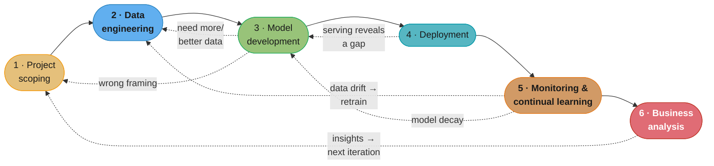
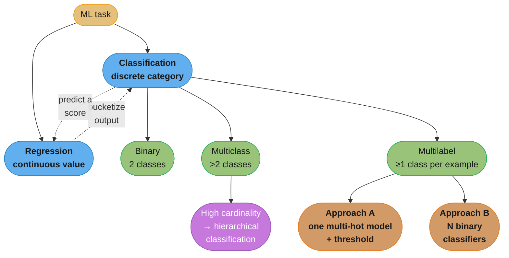
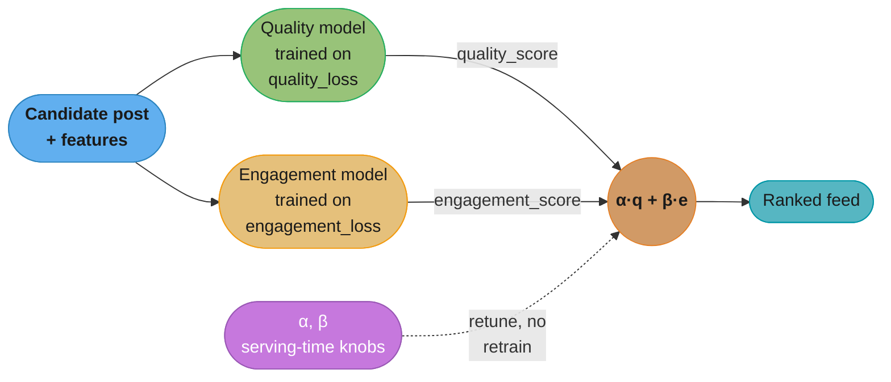
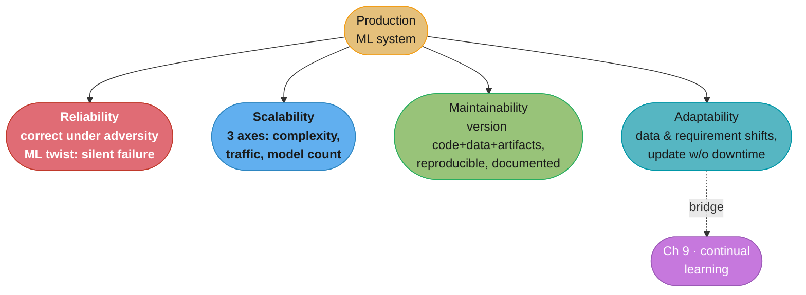

# Chapter 2: Introduction to Machine Learning Systems Design

> Ch 2 of 11 · Designing Machine Learning Systems (Huyen) · builds on Ch 1 — business objectives, the four system requirements, the iterative loop, and problem framing

## Chapter Map

Chapter 1 argued *when* to use ML and what makes production ML different from research ML.
Chapter 2 is where "systems design" actually begins: before you touch a model, you decide
**what the system is for, what it must guarantee, how you'll build it, and how to phrase the
problem so a model can learn it.** The chapter is deliberately model-agnostic — not one line of
architecture — because Huyen's thesis is that most ML project failures are decided here, in the
framing, not in the choice of XGBoost versus a transformer. It closes with the oldest argument in
the field: does progress come from smarter models or more data?

**TL;DR:**
- An ML project only survives if it moves a **business** metric (revenue, engagement, churn), not
  just an **ML** metric (accuracy, F1) — and the mapping between the two is loose, delayed, and
  gameable.
- Every production ML system must satisfy four requirements: **reliability, scalability,
  maintainability, adaptability** — and ML bends each one (reliability means silent failures;
  scalability means hundreds of models, not just more traffic).
- Building ML is an **iterative loop** of six steps with back-edges everywhere, not a straight
  pipeline; you will revisit data and scoping repeatedly.
- **Framing** is half the battle: pick the right task type (classification vs regression, and their
  subtleties), and — the chapter's sharpest idea — **decouple objectives** into separate models with
  a tunable weighted score instead of one model with a fused loss.

---

## The Big Question

> "I have a business problem and a pile of data. What, precisely, am I asking a model to predict —
> and how will I know, six months from now, whether the whole thing was worth building?"

The naive path is: pick a fashionable model, train it to high accuracy, ship it, celebrate. Huyen's
whole point is that this path routinely produces a technically excellent model that *nobody uses and
that moves no business metric*. Systems design is the discipline of answering the hard questions
**up front**: what does success mean in dollars, what must the system guarantee under load and over
time, and how do I translate a fuzzy business ask ("customer support is too slow") into a crisp,
learnable prediction target. Get the framing wrong and no amount of modeling rescues you.

---

## 2.1 Business and ML Objectives

### ML metrics are not the point; business metrics are

Data scientists are trained to optimize **ML metrics** — accuracy, F1, log loss, precision/recall,
inference latency. A business does not care about any of them directly. A business cares about
**business metrics** — revenue, profit margin, daily active users, engagement time, customer
retention, cost saved. Huyen's blunt argument: **an ML project that does not move a business metric
will, sooner or later, be killed** — its budget cut, its team reassigned — no matter how beautiful
its ROC curve. The first job of ML systems design is therefore to state which business metric the
project must move, and by how much.

Some data scientists resist this ("I care about the model, not the P&L"). Huyen's response is
practical, not moralistic: caring about the business metric is how your project *survives* long
enough for the modeling work to matter.

### The mapping from ML metric to business metric is real but loose

For some problems the link is almost direct:

| Domain | ML task (ML metric) | Business metric | How they connect |
|--------|---------------------|-----------------|------------------|
| Online ads | Predict click-through rate (CTR / conversion) | Ad revenue | Higher predicted CTR → better ad placement → more clicks → more revenue, almost linearly |
| Fraud detection | Classify transaction as fraud | Money not lost to fraud | Each fraudulent transaction blocked is a quantifiable dollar saving |
| Churn prediction | Predict which users will cancel | Retained subscription revenue | Flag at-risk users, intervene, keep the subscription |

But the relationship is rarely a clean line. Improving model accuracy by 1% might raise revenue a
lot, a little, or not at all, depending on where the model sits in the product. **You must measure
the effect on the business metric directly** (usually via an A/B test / online experiment), because
you cannot reliably infer the business impact from the offline ML metric alone.

### The Netflix take-rate example — a proxy business metric

Some business metrics are so far downstream (annual retention, lifetime value) that you cannot wait
for them to evaluate a model. Netflix's answer, as Huyen recounts it, is **take-rate**:

```
                 number of quality plays
   take-rate  =  -------------------------
                 number of recommendations shown
```

A "quality play" is a recommendation the user actually watched (for a meaningful duration), not just
one they were shown. Take-rate is a **proxy business metric**: it is measurable immediately (unlike
year-end churn), and Netflix found that a **higher take-rate correlates with higher total streaming
hours and lower subscription cancellation rates** — i.e. it stands in for the true business goal
(retention) while being observable in days rather than months. The lesson: when the real business
metric is too slow, engineer a fast, well-correlated proxy — but keep verifying the correlation
still holds.

### The caution: metrics gaming (engagement → extreme content)

Optimizing a proxy is dangerous because **the proxy can be gamed by the model itself.** The classic
failure: rank a newsfeed purely by predicted **engagement** (clicks, watch time, comments). Engagement
is a valid business metric — until the model discovers that **outrageous, extreme, misinforming, or
polarizing content maximizes engagement.** The system dutifully optimizes the number you gave it and,
in doing so, degrades the product and the information ecosystem. This is Goodhart's Law in ML clothes:
*when a measure becomes a target, it ceases to be a good measure.* The fix is not to abandon
engagement but to **also** optimize a competing objective (quality) — which is exactly the *decoupling
objectives* technique in §2.4.

### ML returns are slow and compounding — companies overpromise

Huyen warns against the industry habit of **overpromising ML timelines.** Executives, sold on hype,
expect an ML initiative to pay off in a quarter. In reality ML returns are **compounding and slow**:
the first model is expensive and modest; the *infrastructure, data pipelines, and organizational
know-how* built along the way make every subsequent model faster and cheaper. Huyen cites survey data
(Algorithmia's *State of Enterprise ML*) showing that **returns depend heavily on the maturity stage
of adoption**: companies that have run models in production for years deploy new models dramatically
faster than newcomers — a large share of the most mature companies ship a model in under 30 days,
while less-experienced companies routinely take far longer, some more than 90 days for a single
model. The strategic implication: budget for a **compounding investment**, not a one-quarter win, and
measure ML maturity as a first-class business asset.

---

## 2.2 Requirements for ML Systems

A usable ML system, Huyen argues, must satisfy four requirements. These borrow from classic software
engineering (they echo the reliability/scalability/maintainability triad in DDIA Ch 1) but each is
**bent** by the presence of data and learned behavior.

### Reliability

**Reliability** = the system continues to perform the **correct function at the desired level of
performance even in the face of adversity** — hardware faults, software faults, and human error
(bad inputs, misuse).

The ML twist that makes this hard: **ML systems can fail silently.** In traditional software, a fault
usually announces itself — an exception, a crash, a 500, a stack trace. An ML system that has "failed"
often keeps running and **returns a prediction that is confidently wrong.** There is no exception. The
model that has silently gone stale still emits a probability of 0.98; the mistranslation still reads as
fluent text; the recommender still returns ten items. Worse, **you frequently have no ground truth at
serving time** to tell you the prediction is wrong — the true label (did the user actually churn? was
the transaction actually fraud?) may arrive days or weeks later, or never. So "correctness" itself is
slippery: the system can be operationally healthy (low latency, no errors, 100% uptime) and yet
**functionally broken**, and you may not find out until a business metric quietly sags. Reliability for
ML therefore extends beyond uptime to include *detecting wrong-but-confident predictions* — which is
why monitoring (Ch 8) and continual learning (Ch 9) exist.

### Scalability

**Scalability** = the system's ability to grow, and to grow *cost-effectively*. Huyen stresses that ML
systems grow along **three distinct axes**, not just the "more traffic" axis software engineers expect:

1. **Model complexity / size.** A model that fit and served fine on one machine grows — more
   parameters, bigger feature sets, a larger embedding table — until it no longer fits, needs a GPU,
   or needs to be sharded. Growth in the *model itself*, not the workload.
2. **Traffic volume.** More users and more queries per second — the familiar horizontal-scaling axis.
   Handled with the usual toolkit: load balancing, replicas, autoscaling.
3. **Model count.** The axis unique to ML organizations, and the one people underestimate: a company
   rarely runs *one* model. As ML adoption spreads, it runs **tens, hundreds, or thousands of models
   in production** — one per use case, per market, per customer segment, per experiment. Huyen notes it
   is not unusual for a large company to have hundreds or thousands of models live at once. This is the
   **enterprise reality**: the scaling problem is no longer "serve this model to a million users," it's
   "serve a thousand models, each to its own audience, and keep them all trained, versioned, and
   monitored."

Scalability therefore demands **autoscaling** (spin resources up under load, down when idle, to control
cost) and **artifact management at scale** — a disciplined way to store, name, and retrieve the model
binaries, features, and metadata for hundreds of models so a human isn't manually tracking `model_v3_final_FINAL.pkl`.
Automating training, evaluation, and monitoring across the whole fleet becomes mandatory, not optional.

### Maintainability

**Maintainability** = many people, with different skills, will work on the system over time, so
structure it so they can. An ML system is worked on by ML engineers, DevOps/platform engineers, data
engineers, and subject-matter experts — each comfortable with different tools. Maintainability means:

- **Version everything — code, data, and artifacts.** Unlike pure software, an ML system's behavior is
  determined by *both* code and data, so versioning code alone is not enough; you must be able to say
  "this prediction came from model M trained on dataset D with code C."
- **Reproducibility.** Someone other than the original author must be able to re-run the training and
  get the same model — otherwise a departing engineer takes the system's knowledge with them.
- **Documentation.** So a new contributor can pick the system up without reverse-engineering it.
- **Collaboration over blame.** When something breaks, the different contributors should be able to work
  together to locate the problem (was it the data? the feature pipeline? the model? the serving code?)
  rather than pointing fingers across team boundaries.

### Adaptability

**Adaptability** = the capacity to keep up with **shifting data distributions and shifting business
requirements**, and to do so **without a full rebuild or a service interruption.** Two forces make ML
systems need to change constantly:

- **Data shifts.** The world moves; the data distribution the model was trained on drifts away from the
  data it now sees (a pandemic changes buying behavior; a new competitor changes the market). The model
  silently degrades unless it can be updated.
- **Business requirements shift.** The metric you're optimizing, the constraints, the definition of a
  good prediction — all change as the business changes.

Because an ML system is *part code and part data* and data can change fast, adaptability means the
system must support **discovering opportunities to improve** and **applying updates without taking the
service down.** This requirement is the direct bridge to **Ch 9 (continual learning)** — the whole
apparatus of scheduled retraining, online updates, and test-in-production exists to satisfy
adaptability.

---

## 2.3 Iterative Process

Newcomers imagine ML development as a straight pipeline: get data → train model → deploy → done. Huyen
insists the reality is an **iterative loop that is mostly never finished** — a process with back-edges
from almost every step to almost every earlier step. The canonical picture in the book is a "squiggly"
arrow that keeps doubling back. The six steps:

### Step 1 — Project scoping

Lay out the **goals, objectives, and constraints.** Identify and involve **stakeholders**. Estimate and
allocate **resources** (people, compute, budget, time). This is where §2.1 (business objective) and §2.4
(problem framing) are pinned down. Skipping or rushing scoping is the most expensive mistake because it
propagates through everything downstream.

### Step 2 — Data engineering

Handle data from **different sources and formats**: ingest it, and process it — clean, sample, generate
labels, build features. Modern ML systems are dominated by data work; this step (and its many return
visits) usually consumes the majority of the effort. Data quality problems discovered later send you
right back here.

### Step 3 — ML model development

The step people think of as "the ML": **extract features**, and **develop, train, and evaluate models**.
This is where the most ML-specific knowledge is used. Crucially, model *evaluation* here frequently
sends you **backward** — a disappointing metric means "get more/better data" (back to Step 2) or even
"we framed the problem wrong" (back to Step 1).

### Step 4 — Deployment

Make the trained model **accessible to users** — as a batch job, a real-time service, or on-device.
Deployment is not the finish line; it is where the model first meets real inputs and real load, and it
routinely surfaces problems that push you back to earlier steps.

### Step 5 — Monitoring and continual learning

Once live, the model **decays** as data shifts, so you **monitor** it for performance degradation and
failures, and set up **continual learning** to update it. Monitoring detecting a drift is the most
common back-edge of all — it kicks you back to data engineering and model development to retrain.

### Step 6 — Business analysis

Evaluate the deployed model's performance **against the original business goals** (§2.1), generate
insights, and feed those insights into the **next iteration** — which may refine this project or launch a
new one. This closes the loop back to Step 1.

The essential point is the **loop with back-edges everywhere.** You do not march through the six steps
once; you circle them, often revisiting scoping and data many times before the system is healthy.



Caption: solid arrows are the happy-path forward flow; the dotted back-edges are the reality — evaluation
sends you back for data, serving sends you back to modeling, monitoring sends you back to retrain, and
business analysis restarts scoping. ML development is a loop, not a line.

---

## 2.4 Framing ML Problems

### A business problem is rarely an ML problem out of the box

The starting point is a **business** complaint, not an ML task. Huyen's example: your manager says *"our
customer support is too slow."* That is not a prediction target. Before reaching for a model you must
diagnose the actual bottleneck. Maybe support is slow because requests are **routed to the wrong
department** and bounce around. If so, the fix might be pure engineering (better routing rules), no ML at
all. Or you might **reframe it as an ML problem**: predict which of the four departments a request should
go to — a **classification** task. The point: translating "the business is unhappy about X" into "predict
Y from features Z" is a design decision with several valid options and several traps, and it dominates the
project's fate.

### Types of ML tasks

The first framing choice is the **task type.** The top split is **classification** (predict a discrete
category) vs **regression** (predict a continuous value).



Caption: the task taxonomy — classification splits into binary / multiclass / multilabel; high-cardinality
multiclass is tamed with hierarchical classification; multilabel has two implementation routes; and the
dotted edges show regression and classification are interconvertible (bucketize a regression output, or
predict a score for a classification).

#### Binary classification

Two mutually exclusive classes — spam / not-spam, fraud / legit, churn / stay. The simplest case.

#### Multiclass classification (and the high-cardinality problem)

More than two mutually exclusive classes. This gets hard when the number of classes is **high (high
cardinality)** — hundreds or thousands of classes (e.g. classify a product into one of 10,000 categories).
High cardinality is difficult because you need **enough training examples per class**, and with thousands
of classes many will be **rare / imbalanced** — some classes may have only a handful of examples.

The tool for high cardinality is **hierarchical classification**: instead of one flat model choosing among
10,000 leaves, build a **tree of classifiers** — a first model picks the broad top-level category (e.g.
"electronics" vs "clothing" vs "home"), then a second model, specialized to that branch, picks the
sub-category. Each model faces far fewer classes, so it needs less data per decision and the imbalance is
more manageable.

#### Multilabel classification (and why it is genuinely hard)

An example can belong to **more than one class at once** — a news article can be *both* "tech" *and*
"finance"; an image can contain a dog *and* a car. There are two standard ways to implement it:

- **Approach A — one multi-hot model.** A single model outputs a vector of independent probabilities, one
  per class, and you **threshold** each (e.g. include every class scoring > 0.5). The ground-truth label
  is a **multi-hot vector** (a 1 for every class present).
- **Approach B — N binary classifiers.** Turn the problem into *N* independent binary "is-this-class-or-not"
  problems, one classifier per class.

Multilabel is harder than plain multiclass for concrete reasons:

- **The number of labels per example varies.** One article has 2 tags, the next has 4. So you cannot just
  "take the top class" — you must decide *how many* to emit, which forces a **threshold choice**, and the
  right threshold trades precision against recall and differs by class.
- **Label ambiguity for annotators.** Human labelers disagree about which subset of classes applies (is
  this article "tech" only, or "tech" + "business"?), producing noisier training labels than the clean
  one-of-N of multiclass.

#### Regression — and the "regression ⇄ classification" reframing

Regression predicts a **continuous** value — a house price, a delivery ETA, a credit score. The
under-appreciated point is that **regression and classification are interconvertible**, and choosing which
frame to use is a design lever:

- **Regression → classification:** bucketize the continuous target. House-price regression becomes
  classification if you only care about "low / medium / high" price bands.
- **Classification → regression:** predict a score and threshold it.

**The app-prediction example** (the chapter's worked case for why the frame matters):

You want to predict **which app a phone user will open next**, to pre-load it.

- *Framing 1 — multiclass classification.* The model takes user + context features and outputs a
  probability distribution over **all** apps; pick the argmax. Problem: the output layer has **one node per
  app**, so **every time a new app is added you must change the model's architecture and retrain** — brittle
  and expensive as the app catalog grows.
- *Framing 2 — regression.* The model takes user + context features **plus features of a candidate app** and
  outputs a **single score** (how likely this user opens *this* app). You run it once per candidate app and
  pick the highest score. Now adding a new app requires **no retraining** — you just include the new app's
  features at inference time. Same underlying prediction, but the regression framing is **adaptable** (ties
  right back to §2.2's adaptability requirement) where the classification framing is not.

The lesson: the task type is not dictated by the problem; it is a **choice**, and the right choice can
eliminate a maintenance nightmare.

### Objective functions

To learn, a model needs an **objective function** (a.k.a. loss function) that tells it how wrong a
prediction is, so optimization can drive the error down. Common choices:

| Task | Typical objective function |
|------|----------------------------|
| Regression | RMSE (root mean squared error), MAE (mean absolute error) |
| Binary classification | Log loss (binary cross-entropy) |
| Multiclass classification | Cross-entropy |

Choosing the loss is usually routine. The **non-routine, high-leverage idea** in this section is what to do
when you have **more than one thing you care about.**

#### Decoupling objectives — the newsfeed example

Return to the newsfeed. You want to rank posts to maximize **engagement** *and* to promote **quality** (and
suppress the extreme/misinforming content that pure-engagement ranking rewards, per §2.1). You have two
objectives that pull in different directions. Two ways to build it:

**Approach 1 — one model, one fused loss.** Train a single model to minimize a combined loss:

```
loss = α · quality_loss + β · engagement_loss
```

This works, but it welds the two objectives together. **The moment you want to re-weight them** — say,
after an incident you decide quality should matter more, so you want to raise α and lower β — **you must
retrain the entire model**, because α and β are baked into its training. Tuning the trade-off is expensive,
and the two concerns (predicting quality, predicting engagement) may need different data volumes and
different retraining cadences, but the fused model forces them onto one schedule.

**Approach 2 — two models, a tunable combiner (decoupling objectives).** Train **two separate models**:

- a **quality model** that minimizes `quality_loss` and outputs a quality score, and
- an **engagement model** that minimizes `engagement_loss` and outputs an engagement score.

Then at **ranking time**, combine their outputs with a weighted score:

```
rank_score = α · quality_score + β · engagement_score
```

Now α and β are **serving-time knobs, not training-time constants.** You can **retune the trade-off freely
without retraining anything** — just re-rank. You **retrain a model only when its own objective changes**
(e.g. you redefine what "quality" means → retrain only the quality model; the engagement model is
untouched). Each model can be retrained on its own schedule with its own data.



Caption: decoupling objectives — two independent models each own one objective, and a serving-time weighted
combiner mixes their scores. Because α and β live at ranking time, you retune the trade-off without
retraining, and you retrain a model only when *its own* objective changes.

**Huyen's argument in one line:** two models with a tunable weighted score beat one model with a fused loss,
because you separate the concern "predict each thing well" (needs a model, retrained only when its target
changes) from the concern "how much do I value each thing" (needs a knob, changed freely).

---

## 2.5 Mind Versus Data

The chapter closes with the field's oldest debate: does ML progress come from **better models/algorithms
("mind")** or from **more data ("data")**?

**The data camp — "more data beats clever algorithms."** The influential position, associated with the 2009
paper *"The Unreasonable Effectiveness of Data"* (Halevy, Norvig, Pereira, Google), is that once you have
enough data, a simple model on lots of data beats a clever model on little data — invest in data, not
algorithmic cleverness. Rich **Sutton's "The Bitter Lesson" (2019)** sharpens it: over 70 years of AI, the
methods that win are the **general ones that scale with computation and data** (search and learning), not the
ones where humans hand-engineer domain knowledge; every time researchers bolt in clever human priors, brute
scale eventually overtakes them. Both point the same way: **bet on data and scale.**

**The mind / data-quality counterpoint.** The other camp argues **data alone is not enough** — you need
better ways to *leverage* data (architecture, inductive bias, structure), and that **more data has
diminishing returns** and can even hurt if it is biased or low-quality. Voices like François Chollet stress
that raw quantity is not intelligence; Judea Pearl's causality work argues "data is profoundly dumb" — it can
tell you *what* correlates but not *why*, so no volume of observational data yields causal understanding on
its own. The counterpoint is not "ignore data" but **"quantity is not a substitute for quality and
structure."**

**Huyen's stance:** in **production**, given today's models and today's realities, **data usually wins** — the
biggest, most reliable gains in real systems tend to come from **more and better data**, not from swapping in
a cleverer architecture. *But* — and this is the load-bearing qualifier — it must be the **right, curated**
data. "More data" is not a mandate to hoard everything; biased, mislabeled, or irrelevant data at scale makes
the system worse and harder to debug. The practical takeaway for a systems designer: **invest heavily in data
(collection, labeling, cleaning, and pipelines), and curate it deliberately** — but do not treat "just add
data" as a thought-terminating slogan. Data wins in production; careless data does not.

---

## Visual Intuition

### The four requirements, at a glance



Caption: the four requirements every ML system must meet — reliability is bent by silent failure, scalability
by the model-count axis, maintainability by data+artifact versioning, and adaptability leads straight into
continual learning (Ch 9).

### Silent failure — why ML reliability is different

```
Traditional software fault           ML "fault" (silent)
---------------------------           -------------------
input -> [ bug ] -> CRASH / 500       input -> [ stale model ] -> "0.98 fraud"
         ^ you get a stack trace                 ^ confident, wrong, no error
         ^ alarm fires immediately               ^ ground truth (real label)
                                                    arrives days later, or never
   detection latency: seconds            detection latency: days / weeks / never
```

Caption: the reliability gap in one picture — traditional faults announce themselves; a broken ML model keeps
emitting confident, wrong predictions with no signal, and the true label needed to catch it may be far in the
future. This is why monitoring and continual learning are requirements, not extras.

---

## Key Concepts Glossary

- **Business metric** — a metric the business is measured by (revenue, engagement, retention, cost saved).
- **ML metric** — a metric of model quality (accuracy, F1, log loss, latency).
- **Proxy business metric** — a fast, measurable stand-in for a slow true business metric (e.g. take-rate).
- **Take-rate** — Netflix's proxy: quality plays ÷ recommendations shown; correlates with streaming hours and
  retention.
- **Metrics gaming** — a model over-optimizing a proxy in a harmful way (engagement → extreme content);
  Goodhart's Law.
- **Compounding returns** — ML pays off slowly at first; infrastructure and know-how make later models cheaper.
- **Reliability** — correct function at the desired performance under adversity; for ML, includes catching
  silent failures.
- **Silent failure** — an ML system returning a confidently wrong prediction with no error signal.
- **Scalability** — cost-effective growth along three axes: model complexity, traffic volume, model count.
- **Model count axis** — the enterprise reality of running hundreds/thousands of models at once.
- **Autoscaling** — automatically adding/removing serving resources with load to control cost.
- **Artifact management** — disciplined storage/versioning/retrieval of model binaries, features, metadata at
  scale.
- **Maintainability** — structuring the system so many contributors can work on it; versioning, reproducibility,
  documentation.
- **Reproducibility** — the ability to re-run training and obtain the same model.
- **Adaptability** — updating for data/requirement shifts without a full rebuild or downtime.
- **Iterative process** — the six-step development loop with back-edges everywhere (not a linear pipeline).
- **Project scoping** — Step 1: goals, objectives, constraints, stakeholders, resources.
- **Data engineering** — Step 2: ingest and process data from many sources/formats.
- **Model development** — Step 3: feature extraction, training, evaluation.
- **Deployment** — Step 4: make the model accessible to users.
- **Monitoring & continual learning** — Step 5: detect decay, retrain/update.
- **Business analysis** — Step 6: evaluate against business goals, feed the next iteration.
- **Problem framing** — translating a business problem into a concrete, learnable prediction target.
- **Classification** — predicting a discrete category.
- **Regression** — predicting a continuous value.
- **Binary classification** — two mutually exclusive classes.
- **Multiclass classification** — more than two mutually exclusive classes.
- **High cardinality** — many classes (hundreds/thousands); hard due to data-per-class and imbalance.
- **Hierarchical classification** — a tree of classifiers for high-cardinality multiclass.
- **Multilabel classification** — an example may belong to multiple classes at once.
- **Multi-hot vector** — a label vector with a 1 for every class present (multilabel ground truth).
- **N-binary-classifiers approach** — implementing multilabel as N independent binary problems.
- **Threshold choice** — deciding which/how many classes to emit in multilabel, trading precision vs recall.
- **Objective (loss) function** — the function the model minimizes during training.
- **Decoupling objectives** — splitting multiple objectives into separate models combined by a tunable
  serving-time weighted score.
- **Mind vs data** — the debate over whether progress comes from better models or more data.
- **The Bitter Lesson** — Sutton's thesis that general, compute-scaling methods beat hand-engineered
  knowledge.

---

## Tradeoffs & Decision Tables

| Framing choice | Option A | Option B | Deciding factor |
|----------------|----------|----------|-----------------|
| App prediction | Multiclass classification (one output per app) | Regression (score per candidate app) | New apps added often? → regression avoids retraining |
| Two objectives | One model, fused loss `α·L1+β·L2` | Two models + tunable `α·s1+β·s2` combiner | Need to retune trade-off cheaply? → decouple |
| High-cardinality classes | One flat multiclass model | Hierarchical classifier tree | Thousands of imbalanced classes? → hierarchical |
| Multilabel implementation | One multi-hot model + threshold | N binary classifiers | Shared features/scale? → multi-hot; independent tuning? → N binary |

| Requirement | Traditional-software meaning | ML-specific twist |
|-------------|------------------------------|-------------------|
| Reliability | No crashes; correct output under faults | Silent failures — confidently wrong, no error, delayed ground truth |
| Scalability | Handle more traffic | Also: bigger models AND hundreds/thousands of models |
| Maintainability | Version and document code | Also version data + artifacts; reproducibility |
| Adaptability | Ship new features | Adapt to data drift + requirement shifts without downtime |

| Metric type | Example | Speed to observe | Risk |
|-------------|---------|------------------|------|
| ML metric | Accuracy, F1 | Immediate (offline) | May not move the business |
| True business metric | Annual retention, LTV | Very slow (months) | Too slow to guide iteration |
| Proxy business metric | Netflix take-rate | Fast (days) | Gameable; correlation can decay |

---

## Common Pitfalls / War Stories

- **Optimizing an ML metric nobody paid for.** A team pushes F1 from 0.90 to 0.94, ships it, and no
  business metric moves — the model wasn't the bottleneck. Fix: pin the target business metric in scoping
  (Step 1) and measure the model's effect on it directly via A/B test, not by inference from the offline
  metric.
- **Engagement-only ranking breeds extreme content.** Ranking a feed purely by predicted engagement teaches
  the model that outrage maximizes clicks; the product and information quality degrade. Fix: decouple
  objectives — add a quality model and a tunable combiner so engagement isn't the sole target.
- **Promising ML ROI next quarter.** Executives, sold on hype, expect a payoff in one quarter; the first
  model is expensive and modest and the project gets cut before the compounding returns arrive. Fix: budget
  ML as a compounding, multi-year investment and track maturity as an asset.
- **Assuming reliability = uptime.** The dashboard is green — 100% uptime, low latency — while the model
  quietly emits confidently wrong predictions because the data drifted; nobody notices until a business
  metric sags weeks later. Fix: monitor prediction quality and drift, not just service health, because ML
  fails silently.
- **Designing for one model, waking up with a thousand.** The serving stack was built to run *the* model;
  two years later the org has 300 models and no artifact management, versioning, or automated retraining, so
  humans are manually tracking `model_final_v7.pkl`. Fix: treat the model-count axis as a first-class
  scalability concern from the start.
- **Baking the trade-off into training.** A single fused-loss ranking model means every request to re-weight
  quality-vs-engagement triggers a multi-day retrain, so the trade-off is never tuned in practice. Fix:
  decouple objectives so α/β are serving-time knobs.
- **The retrain-on-every-new-class trap.** Framing next-app-prediction as multiclass means the output layer
  (and a retrain) changes whenever the catalog grows; the model is perpetually stale. Fix: reframe as a
  regression that scores each candidate app from its features — no retraining to add an app.
- **"Just add more data" as a slogan.** A team pours in more data of the same biased, mislabeled kind and the
  model gets worse and harder to debug. Fix: data usually wins in production, but only *curated* data —
  quality and relevance, not raw volume.

---

## Real-World Systems Referenced

Netflix (take-rate as a proxy business metric; recommendation quality → streaming hours and retention);
online advertising systems (CTR/conversion prediction tied directly to ad revenue); fraud-detection systems
(classification tied to money saved); social-media newsfeed ranking (engagement vs quality, the decoupling
example); Algorithmia *State of Enterprise ML* survey (ML maturity vs deployment speed and ROI); large
enterprises running hundreds-to-thousands of production models (the model-count scalability axis).

---

## Summary

ML systems design begins before any modeling. First, tie the project to a **business objective**: an ML
project survives only if it moves a business metric, and the map from ML metric (accuracy, F1) to business
metric (revenue, engagement, retention) is loose, often mediated by a **proxy** like Netflix's take-rate,
and dangerously **gameable** (engagement → extreme content). ML returns are slow and compounding, so beware
overpromised timelines. Second, every production ML system must satisfy four **requirements** — **reliability**
(bent by silent, confidently-wrong failures and delayed ground truth), **scalability** (three axes: model
complexity, traffic, and the enterprise-defining **model count**), **maintainability** (version code *and* data
*and* artifacts; reproducibility; documentation), and **adaptability** (survive data and requirement shifts
without downtime — the bridge to continual learning). Third, building ML is an **iterative six-step loop** —
scoping → data engineering → model development → deployment → monitoring & continual learning → business
analysis — with **back-edges everywhere**, not a straight pipeline. Fourth, **framing** the problem is decisive:
a business problem is rarely an ML problem out of the box; you must pick the right **task type** (binary /
multiclass — with hierarchical classification for high cardinality — / multilabel — with its multi-hot vs
N-binary and threshold headaches — vs regression, and the two are interconvertible, as the app-prediction
example shows), and you should **decouple objectives** — two models plus a tunable serving-time weighted score
beat one model with a fused loss, because you retune the trade-off freely and retrain a model only when its own
objective changes. Finally, on **mind vs data**: in production, curated **data usually wins**, but "more data"
is not a license to skip curation.

---

## Interview Questions

**Q: Why can an ML project with excellent accuracy still get cancelled?**
Because it doesn't move a business metric — accuracy is an ML metric, and businesses fund projects that move revenue, engagement, or retention. Huyen's argument is that an ML project's survival depends on contributing to a business objective; a model that improves F1 but leaves revenue flat is, from the business's view, not worth its cost. The fix is to pin the target business metric during project scoping and measure the model's effect on it directly, usually with an A/B test.

**Q: What is the difference between an ML metric and a business metric, and how tight is the mapping?**
An ML metric measures model quality (accuracy, F1, log loss, latency) while a business metric measures business success (revenue, engagement, churn, cost saved). The mapping between them is real but loose and non-linear: a 1% accuracy gain might raise revenue a lot, a little, or not at all depending on where the model sits in the product. Because you cannot reliably infer business impact from the offline ML metric, you must measure the effect on the business metric directly through online experiments.

**Q: What is Netflix's take-rate and why is it a proxy business metric?**
Take-rate is the number of quality plays divided by the number of recommendations a user was shown. It is a proxy because the true business goal (retention/LTV) is too slow to observe, whereas take-rate is measurable in days and correlates with higher total streaming hours and lower cancellation. It lets Netflix evaluate a recommender quickly, as long as they keep verifying that the correlation with the real goal still holds.

**Q: How does ranking a newsfeed purely by engagement cause harm, and what is the fix?**
Optimizing engagement alone teaches the model that extreme, outrageous, or misinforming content maximizes clicks, so it promotes exactly that, degrading the product — a case of Goodhart's Law where a measure that becomes a target stops being a good measure. The fix isn't to abandon engagement but to also optimize a competing quality objective, ideally by decoupling objectives into separate quality and engagement models combined with a tunable score.

**Q: Why do ML systems "fail silently," and why does that make reliability different?**
Because a broken ML model keeps returning predictions — confidently wrong ones — with no exception, crash, or error, unlike traditional software that announces a fault with a stack trace. Worse, the ground truth needed to catch the error (did the user actually churn?) often arrives days later or never, so the system can be operationally healthy yet functionally broken. This is why ML reliability must include detecting wrong-but-confident predictions, motivating dedicated monitoring and continual learning.

**Q: What are the three axes of scalability for an ML system?**
Model complexity/size (the model itself grows until it no longer fits one machine), traffic volume (more users and queries per second), and model count (an organization runs tens, hundreds, or thousands of models at once). The third axis is the one people underestimate and the one unique to mature ML organizations. It forces autoscaling for cost control and disciplined artifact management so a fleet of models stays trained, versioned, and monitored.

**Q: Why is framing the app-prediction problem as regression better than as classification?**
Because the classification framing puts one output node per app, so adding a new app changes the model architecture and forces a retrain, whereas the regression framing scores each candidate app from its own features and needs no retraining when apps are added. In regression, the model takes user + context + candidate-app features and outputs a single likelihood score, run once per app and ranked. Same prediction, but the regression frame is adaptable where the classification frame is brittle.

**Q: What does "decoupling objectives" mean and why is it better than a single fused loss?**
Decoupling objectives means training a separate model per objective and combining their outputs with a tunable weighted score at serving time, instead of training one model on a fused loss like α·quality + β·engagement. It's better because α and β become serving-time knobs you can retune freely without retraining, and you retrain a model only when its own objective changes. It also lets each model use its own data and retraining cadence.

**Q: Why is multilabel classification harder than multiclass classification?**
Because the number of labels per example varies, so you can't just take the top class — you must choose a threshold for how many classes to emit, trading precision against recall, and the right threshold differs per class. Multiclass has exactly one correct class, so argmax suffices. Multilabel also suffers more annotator disagreement about which subset of classes applies, producing noisier labels.

**Q: What are the two ways to implement multilabel classification?**
One model producing a multi-hot probability vector that you threshold per class, or N independent binary classifiers, one per class. The multi-hot approach shares features and a single model across classes; the N-binary approach lets each class be tuned independently but multiplies the number of models to maintain. Both require a per-class threshold decision because an example may match zero, one, or many classes.

**Q: How do you handle multiclass classification when there are thousands of classes?**
Use hierarchical classification: build a tree of classifiers where a first model picks the broad top-level category and a specialized second model picks the sub-category within that branch. High cardinality is hard because you need enough examples per class and many classes are rare or imbalanced. Splitting the decision into levels means each model faces far fewer classes and needs less data per decision.

**Q: Why does Huyen call ML development an iterative loop rather than a pipeline?**
Because almost every step has back-edges to earlier steps: model evaluation sends you back for more data or a re-framing, deployment reveals gaps that send you back to modeling, and monitoring detecting drift sends you back to retrain. The six steps — scoping, data engineering, model development, deployment, monitoring and continual learning, business analysis — are circled repeatedly, not marched through once. Treating it as a straight line is the classic newcomer mistake.

**Q: What are the six steps of the iterative ML process, in order?**
Project scoping, data engineering, model development, deployment, monitoring and continual learning, and business analysis. Scoping sets goals and resources; data engineering ingests and processes data; model development extracts features and trains and evaluates; deployment makes the model accessible; monitoring detects decay and drives continual learning; business analysis evaluates against business goals and feeds the next iteration. The whole thing loops, with business analysis restarting scoping.

**Q: Why is a business problem rarely an ML problem out of the box?**
Because the business states a symptom ("customer support is too slow"), not a prediction target, and the real bottleneck might be non-ML — like requests being routed to the wrong department, fixable with better routing rules. To make it an ML problem you must reframe it into a concrete learnable target, such as classifying which department a request belongs to. Diagnosing whether ML even applies, and how to phrase the target, is a design decision that dominates the project's outcome.

**Q: What are the four requirements every production ML system must satisfy?**
Reliability, scalability, maintainability, and adaptability. Reliability is correct function under adversity, twisted by ML's silent failures; scalability is cost-effective growth along model complexity, traffic, and model count; maintainability is versioning code, data, and artifacts plus reproducibility and documentation; adaptability is updating for data and requirement shifts without downtime. Each mirrors a classic software requirement but is bent by the presence of data and learned behavior.

**Q: What does maintainability require specifically for ML that plain software doesn't?**
Versioning data and artifacts, not just code, because an ML system's behavior depends on both code and data, so you must be able to trace a prediction to a specific model, dataset, and code version. It also requires reproducibility so another engineer can re-run training and get the same model, plus documentation and a collaboration culture where contributors jointly locate a problem rather than blaming across team lines. Versioning code alone is insufficient.

**Q: How does adaptability connect to continual learning (Ch 9)?**
Adaptability is the requirement that the system keep up with shifting data distributions and business requirements without a full rebuild or downtime, and continual learning is the machinery that satisfies it. Because an ML system is part code and part data, and data drifts fast, the model silently degrades unless it can be updated in place. Scheduled retraining, online updates, and test-in-production — all of Ch 9 — exist to deliver adaptability.

**Q: In the "mind versus data" debate, where does Huyen land and with what caveat?**
In production, data usually wins — the biggest reliable gains come from more and better data, not a cleverer architecture — but the data must be curated, not merely abundant. The data camp cites "The Unreasonable Effectiveness of Data" and Sutton's Bitter Lesson that compute-and-data-scaling methods beat hand-engineered knowledge; the counterpoint warns that quantity has diminishing returns and biased data hurts. Huyen's practical stance: invest heavily in data and pipelines, but treat "just add data" as false if the data isn't curated.

**Q: Why are ML returns described as slow and compounding, and what mistake does that expose?**
Because the first model is expensive and modest, but the data pipelines, infrastructure, and organizational know-how it builds make every later model faster and cheaper — returns compound over years. The mistake it exposes is overpromising a payoff next quarter, which gets projects cut before the compounding kicks in. Survey data shows mature ML organizations deploy new models far faster than newcomers, so ML maturity itself is a business asset to budget for.

**Q: When would you choose N binary classifiers over a single multi-hot multilabel model?**
When you need to tune, retrain, or scale each class independently — separate classifiers let each class have its own threshold, data, and retraining cadence. The trade-off is that you now maintain N models instead of one, multiplying the operational burden along the model-count scalability axis. A single multi-hot model is preferable when the classes share features and you want one artifact to manage.

**Q: Can a regression problem be turned into a classification problem, and when is that useful?**
Yes — you bucketize the continuous target into ranges, turning house-price regression into low/medium/high classification, and conversely a classification can be reframed as predicting and thresholding a score. It is useful when the business only cares about coarse bands rather than an exact value, or when the classification framing has better data or calibration properties. The choice of frame is a design lever, not dictated by the problem.

---

## Cross-links in this repo

- [ml/ml_system_design/ — the full ML-system-design workflow (requirements, framing, metrics) expanded](../../../ml/ml_system_design/README.md)
- [ml/model_evaluation_and_selection/ — ML metrics (accuracy, F1, RMSE, log loss) and how to choose them](../../../ml/model_evaluation_and_selection/README.md)
- [ml/case_studies/ — worked ML system designs applying this framing end-to-end](../../../ml/case_studies/README.md)
- [Ch 1 — Overview of Machine Learning Systems (when to use ML, research vs production)](../01_overview_of_machine_learning_systems/README.md)
- [Ch 9 — Continual Learning and Test in Production (the adaptability requirement, realized)](../09_continual_learning_and_test_in_production/README.md)

## Further Reading

- Huyen, *Designing Machine Learning Systems*, Ch 2 — the original text and its references.
- Halevy, Norvig & Pereira, "The Unreasonable Effectiveness of Data," IEEE Intelligent Systems, 2009 — the data-camp argument.
- Rich Sutton, "The Bitter Lesson," 2019 — general compute/data-scaling methods beat hand-engineered knowledge.
- Algorithmia, *2020 State of Enterprise Machine Learning* — the survey on ML maturity, deployment speed, and ROI.
- Amershi et al., "Software Engineering for Machine Learning: A Case Study," ICSE 2019 — the ML workflow and its feedback loops.
