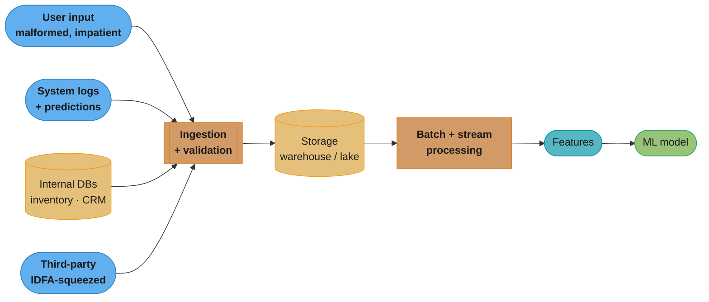
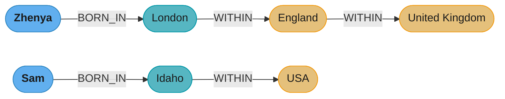
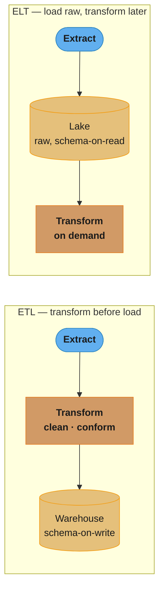
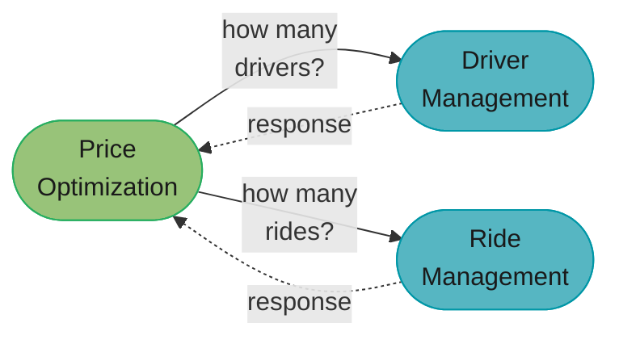
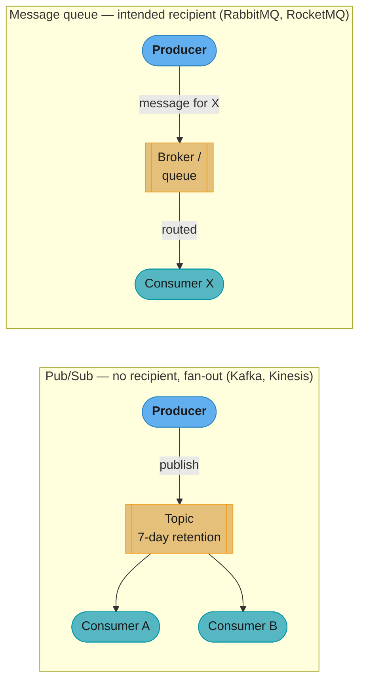
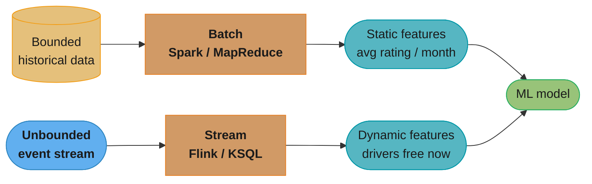
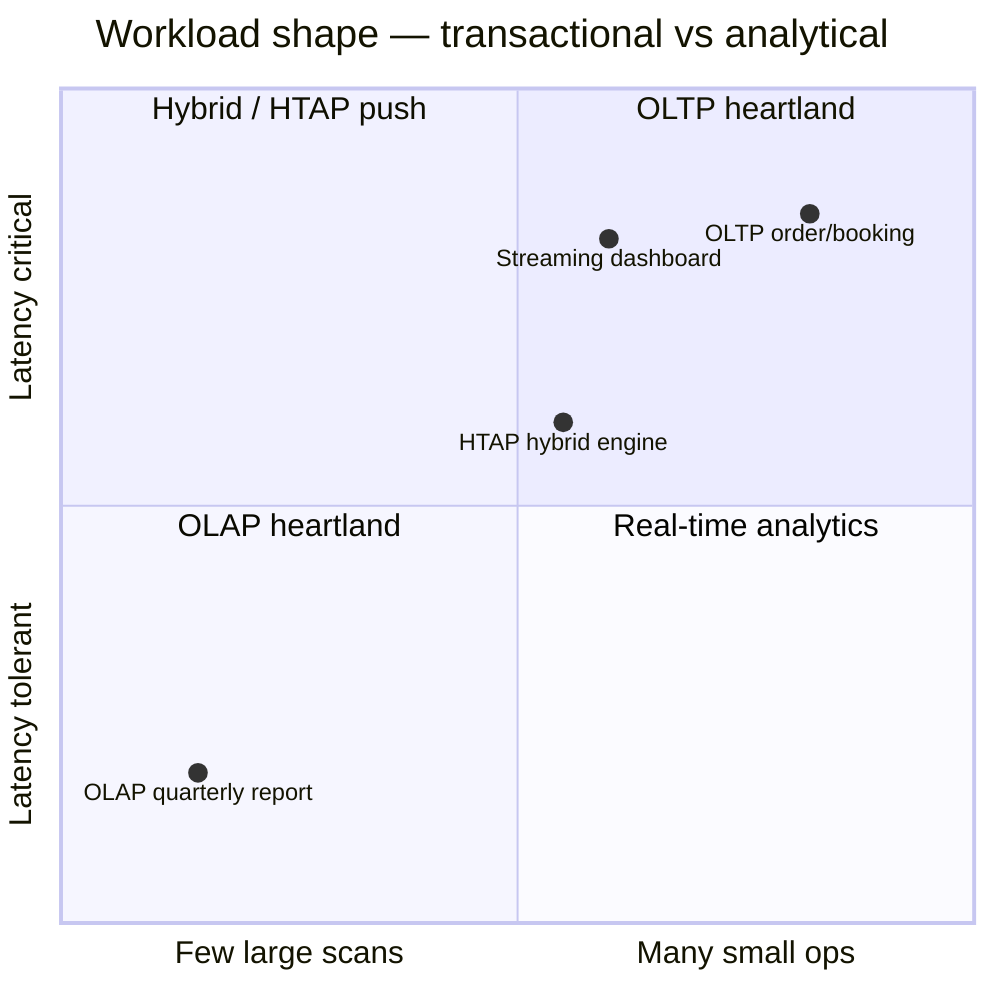
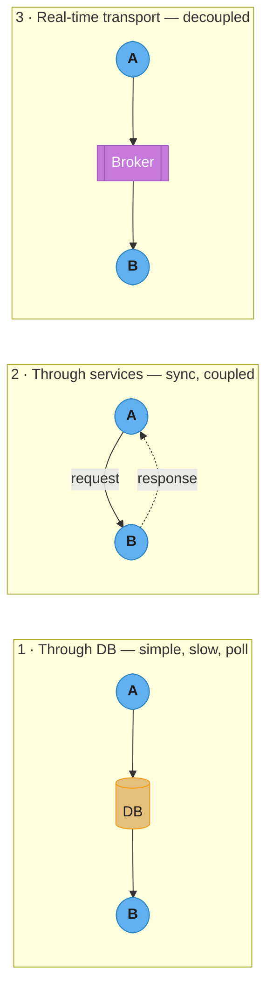

# Chapter 3: Data Engineering Fundamentals

> Ch 3 of 11 · Designing Machine Learning Systems (Huyen) · the data-plumbing chapter — formats, models, OLTP/OLAP, and the three modes of dataflow

## Chapter Map

Before you can train a model you must **get data, store it, and move it around** — and those
three verbs turn out to hide most of the operational pain in an ML system. This chapter is the
plumbing chapter: it names where data comes from, how bytes are laid out on disk (the row-vs-column
decision that quietly doubles or halves your analytics bill), how data is *modeled* (relational,
document, graph) and *stored* (warehouse vs lake, transactional vs analytical), and — the section
interviewers care about most — the **three modes of dataflow** by which one process hands data to
another. It closes on the batch-vs-stream split that decides whether a feature is computed once an
hour or recomputed on every request.

**TL;DR:**
- **Data sources** differ in trust and shape: user input is malformed by default; system-generated
  logs are cheap to produce but expensive to keep; internal databases feed features; third-party
  data got squeezed by the IDFA privacy changes.
- **Formats** encode a real tradeoff: **row-major** (CSV) is fast for writes and whole-example
  reads; **column-major** (Parquet) is fast for feature-subset analytics — AWS measured Parquet at
  *2x faster to unload and up to 6x less storage* than text.
- **Data models & storage:** relational/document/graph each optimize a different query shape;
  warehouse (schema-on-write) vs lake (schema-on-read); **OLTP vs OLAP is a legacy lens** now that
  storage and compute are decoupled and hybrids exist; **ETL** (transform then load) vs **ELT**
  (load raw, transform later).
- **Three modes of dataflow:** through **databases** (simple, slow, needs shared access), through
  **services** (request-driven REST/RPC, synchronous, failure-amplifying), and through **real-time
  transport** (event-driven pub/sub or message queues, a broker decouples producers from consumers).
  Request-driven suits *logic-heavy* systems; event-driven suits *data-heavy* ones.
- **Batch → static features; stream → dynamic features.** Streaming is harder (joins, late events)
  but stateful stream computation can beat repeated batch — and production ML usually needs both.

## The Big Question

> "My model is only as good as the data reaching it. Where does that data come from, how do I lay
> it out so reading it is cheap, and — when process A has data that process B needs — how does B
> actually get it without the whole system becoming slow, tangled, or fragile?"

Analogy: think of your ML system as a restaurant. Data **sources** are your suppliers (some
reliable, some send you spoiled produce). **Formats and storage** are the pantry and walk-in — how
you shelve ingredients decides how fast the line cooks can grab them. And **modes of dataflow** are
how orders move between the front of house and the kitchen: shout across the pass (services), pin
tickets to a rail everyone reads (real-time transport), or leave notes in a shared binder
(databases). Huyen's argument is that most ML-system scaling pain is not the model — it is this
plumbing.

---

## 3.1 Data Sources

An ML system works with data from many sources, and each source has different characteristics,
different failure modes, and different levels of trust. Knowing *where* data comes from tells you
how much to validate it and how to process it.

### User input data

Data explicitly entered by users: text a user types, images/videos/files they upload, the form
fields they fill. Two properties dominate:

- **It is malformed by default.** Users put data in the wrong format constantly — text where you
  expect a number, `07/16/2026` where you expect `2026-07-16`, an image where you asked for a PDF,
  emojis in a name field, a phone number with dashes. If your system assumes clean input it *will*
  break in production. The practical consequence: **user input needs heavy, defensive validation
  and formatting checks** — far more than data your own systems generate.
- **Users have no patience.** People expect input to be processed quickly — often instantly. If a
  request takes more than a few seconds, many users refuse to wait, retry, or leave. That latency
  intolerance forces user-input paths toward **fast, often real-time** processing, which constrains
  the whole downstream architecture (you cannot hide a slow batch job behind a text box).

The combination — dirty data that must nonetheless be checked *and* returned fast — is why
user-input handling is disproportionately buggy.

### System-generated data

Data generated by the systems themselves: **logs** and **model predictions**, primarily.

- **Logs** record events and the state of the system: which service was called, memory usage,
  timestamps, errors, what a component was doing when it crashed. Their point is **debuggability** —
  when something goes wrong at 3 a.m., logs are the trail you follow. Because you cannot know in
  advance which detail will matter, the instinct is to **"log everything."**
- That instinct creates a real tension. Logs are **cheap to generate but expensive to store and
  hard to extract signal from** — the volume grows enormous, and finding the one relevant line in a
  flood of noise is its own problem. The industry compromise: log liberally, then **discard logs
  after a retention period** (or once you're confident you no longer need them), and invest in tools
  to search/aggregate them. Because log volume is huge, processing is often done **periodically in
  batch**; but you can also process logs in near-real-time when you need to detect anomalies as they
  happen.
- **Model predictions are themselves system-generated data.** A model's outputs are logged and
  become data — used to monitor the model, debug it, and (crucially) as *training data* for future
  models. This closes a loop: today's predictions can label tomorrow's training set.

### Internal databases

Databases managed by the various services inside the company — **inventory, customer relationship
management (CRM), user accounts, catalogs**. These are generated and maintained by internal systems
and are a primary feature source for ML.

An ML model can query these directly or use them to build features. Example: a recommender system
ranking products may query the **inventory database** to filter out out-of-stock items before
ranking, and pull user history from the user database to build features. Because these are *your*
databases, the data is comparatively clean and trusted — the opposite of user input — but you still
depend on those services' availability and schemas.

### Third-party data

Huyen draws three distinctions by *whose* customers the data describes:

- **First-party data** — data your company collects about your *own* users and customers (their
  activity on your product). The most trusted and most directly useful.
- **Second-party data** — data another company collects about *their* customers, which they make
  available to you (often through a partnership or purchase). It's someone else's first-party data.
- **Third-party data** — data collected by companies (data aggregators/brokers) about the general
  public who are **not** their direct customers. Aggregators buy, collect, and combine data from
  many sources and sell it, often keyed on a device's **advertiser ID**.

**The IDFA-era privacy squeeze.** For years, third-party data on mobile relied on a per-device
advertiser identifier — Apple's **IDFA** (Identifier for Advertisers) and Android's equivalent —
that let aggregators stitch a user's behavior across many different apps into one profile. In 2021,
Apple's **App Tracking Transparency** made IDFA **opt-in**: apps must now ask permission to track,
and the vast majority of users decline. This gutted the reliability and coverage of third-party
data almost overnight — a reminder that a data source you don't own can be regulated or deprecated
out from under you, and that first-party data is the durable asset.



Caption: the four data sources funnel into ingestion/validation, then storage, then processing —
this end-to-end spine is the skeleton the rest of the chapter fills in, and the reason user input
gets the heaviest validation is that it is the only source that is malformed by default.

---

## 3.2 Data Formats

Once you have data, you must **store it** — and storing means **serialization**: converting a data
structure or object into a byte format that can be written to disk or sent over the network. The
format you pick answers questions like: human-readable or compact? optimized for whole-row access
or column access? one big file or many? These choices have large, measurable cost consequences.

### JSON

**JSON (JavaScript Object Notation)** is everywhere — it is human-readable, language-agnostic, and
maps naturally to key-value pairs and nested objects, so it fits both structured and unstructured
data. Its ubiquity is its strength.

Its weakness is the flip side of being schemaless and text: **JSON is schema-on-read**. Once you've
committed data to JSON, the *structure* is baked into the bytes but there's no enforced schema, so
consumers must know (or guess) the shape, and any later schema change is painful to reconcile across
all the JSON already written. JSON is also **text**, so it is **verbose**: field names are repeated
in every record and everything is stored as characters, making files large.

### Row-major vs column-major

This is the format tradeoff worth memorizing. **Row-major** means consecutive elements in a row are
stored next to each other in memory/on disk; **column-major** means consecutive elements in a
*column* are stored next to each other.

- **CSV is row-major.** **Parquet is column-major.**
- The choice is dictated by **access pattern**:
  - If you mostly **read or write whole examples (rows)** — append a new record, load one user's
    full row — **row-major wins**, because the whole example is contiguous (one seek, one read).
  - If you mostly **read a subset of features (columns) across many examples** — "average the price
    column over 1M rows," typical of analytics and feature engineering — **column-major wins**,
    because that column is contiguous and you never touch the columns you don't need. Column layout
    also **compresses far better** (adjacent values in a column are the same type and often similar,
    so run-length/dictionary encoding is very effective).

**The AWS numbers.** AWS reports that using **Parquet** (columnar) instead of a text format made
data **2x faster to unload and consume up to 6x less storage in Amazon S3** compared to text. That
is a 2x speed and 6x cost swing purely from the on-disk layout — which is why analytical/ML data
lakes standardize on Parquet.

**The NumPy vs pandas gotcha the book demonstrates.** This is a classic trap:

- **NumPy** defaults to **row-major** (C-order): iterating over rows is contiguous and fast.
- **pandas** is built on top of NumPy, but a pandas `DataFrame` is **column-major** — each column is
  stored as a contiguous block. So accessing data **by column is fast; accessing by row is slow**,
  the opposite of the intuition many people carry over from NumPy.

The practical bug: people write `for i, row in df.iterrows(): ...` (row-wise iteration over a
column-major structure) and it is *dramatically* slower than the equivalent column-wise operation —
Huyen's demonstration shows accessing a DataFrame by row can be **an order of magnitude slower**
than accessing it by column, and that converting a DataFrame to a NumPy array and iterating there
(or vectorizing over columns) fixes it. The lesson: **know whether your structure is row- or
column-major and access it along its fast axis.**

```
Logical table (3 examples x 3 features):
          f1    f2    f3
  ex1     a1    b1    c1
  ex2     a2    b2    c2
  ex3     a3    b3    c3

Row-major on disk  (CSV, NumPy default C-order): contiguous bytes = one ROW
  [ a1 b1 c1 | a2 b2 c2 | a3 b3 c3 ]
   \__ex1__/   \__ex2__/   \__ex3__/
  fast : read/append a whole example        slow : scan one feature across all rows

Column-major on disk  (Parquet, pandas DataFrame): contiguous bytes = one COLUMN
  [ a1 a2 a3 | b1 b2 b3 | c1 c2 c3 ]
   \__f1___/   \__f2___/   \__f3___/
  fast : scan/aggregate one feature         slow : read/append a whole example
  bonus: same-type neighbors -> compresses far better (dict / run-length)
```

Caption: the same table, two byte layouts — the access you do most should run along the contiguous
axis, which is exactly why row-major CSV is good for writes/whole-example reads and column-major
Parquet is good for feature-subset analytics (and compresses better).

### Text vs binary

Orthogonal to row/column is **text vs binary**:

- **Text formats** (JSON, CSV) are **human-readable** — you can open them in any editor and inspect
  them — at the cost of **size**: everything is stored as characters.
- **Binary formats** (Parquet, Avro, Protobuf, Pickle) are **compact and not human-readable** — they
  store raw bytes, so numbers take their natural width instead of a string of digits, and they can
  pack/compress aggressively.

Huyen's concrete example: take a dataset that is **14 MB as a text (CSV) file**; stored as
**Parquet (binary, columnar)** the same data can shrink to roughly **6 MB** — less than half —
while also being faster to query. Multiply that across a petabyte-scale lake and the storage and
transfer savings are enormous. **Rule of thumb:** use text (CSV/JSON) for small data you need to eyeball
or interchange with humans; use binary (Parquet) for the volume you feed models.

| Format | Text/Binary | Row/Column | Typical home |
|--------|-------------|------------|--------------|
| **JSON** | Text | (nested) | APIs, configs, everywhere |
| **CSV** | Text | Row-major | spreadsheets, quick exports |
| **Parquet** | Binary | Column-major | Hadoop, Redshift, data lakes |
| **Avro** | Binary | Row-major | Hadoop, Kafka messages |
| **Protobuf** | Binary | (schema'd) | Google, gRPC, TFRecord |
| **Pickle** | Binary | (Python objects) | Python/PyTorch serialization |

---

## 3.3 Data Models

Data models describe how data is **represented and related** — a more abstract choice than file
format, and one that shapes which queries are easy and which are painful. The same real-world facts
can be modeled relationally, as documents, or as a graph, and each makes a *different* query shape
cheap.

### Relational model

The dominant model for decades (Codd, 1970). Data lives in **relations (tables)**; a relation is an
unordered set of **tuples (rows)**. Its power comes from a few ideas:

- **Normalization.** You avoid duplicating data by splitting it into multiple related tables so each
  fact lives in exactly one place. A quick sketch of the normal forms:
  - **1NF (first normal form):** every cell holds a single atomic value — no lists or repeating
    groups inside one field.
  - **2NF (second normal form):** 1NF, plus every non-key column depends on the *whole* primary key
    (no partial dependency on part of a composite key).
  - Higher forms continue removing redundancy. Normalization saves space and prevents update
    anomalies (change a fact once, not in 50 rows) — at the cost of needing **joins** to reassemble
    data at read time.
- **Declarative querying (SQL).** You state *what* you want, not *how* to get it. `SELECT ... WHERE
  ... JOIN ...` describes the result; the database's **query optimizer** decides the actual
  execution plan (which index, which join order, which algorithm). This separation is why the same
  SQL keeps working as data grows and the optimizer picks better plans. (SQL is technically
  Turing-complete-ish — recursive CTEs make it computationally powerful — but it is fundamentally a
  *declarative* language: you describe the goal, the engine chooses the path.)

### NoSQL

NoSQL began as a hashtag and hardened into "**Not Only SQL**" / non-relational. Its motivation is
**schema pain**: the relational model forces you to define a rigid schema up front, and evolving
that schema (adding columns, restructuring) across a large table is costly and slow. NoSQL relaxes
this. The chapter highlights two families:

**Document model.** Data is stored as **self-contained documents** (JSON/BSON), grouped into
collections — think one document per user, holding that user's whole profile nested inside it
(MongoDB is the canonical store).

- **Locality:** because all of a document's data is in one place, reading the *whole* object is one
  fetch — no joins to reassemble it. Great when your access pattern is "load the entire thing at
  once."
- **Schema flexibility:** documents in a collection need not share a schema — schema-on-read.
- **Weakness — joins and many-to-many.** The document model makes **relationships across documents
  awkward**: joins are weak or must be done in application code, and many-to-many relationships
  (which relational handles naturally) become painful. Locality also hurts if you only need one
  field but must read the whole document.

**Graph model.** Data is **nodes (entities)** connected by **edges (relationships)** — and, crucially,
**relationships are first-class**, stored directly rather than inferred by matching foreign keys at
query time (Neo4j is the canonical store).

- Worked contrast — "find everyone born in the USA":
  - **Relational:** you store people with a `city_id`, cities with a `country_id`, then **join**
    `person → city → country` and filter `country = 'USA'`. The relationship is reconstructed by
    matching keys across tables at query time; deep or variable-length relationships (friends of
    friends of friends) mean many joins and get slow.
  - **Graph:** you store a `BORN_IN` edge from each person to a place and `WITHIN` edges between
    places, then simply **traverse edges** outward from "USA." Following relationships is the native
    operation, so relationship-heavy and variable-depth queries are cheap.
- Rule: **pick the model whose native operation matches your dominant query.** Relationship traversal
  → graph; whole-object reads → document; ad-hoc joins and strong consistency across entities →
  relational.



Caption: in the graph model, "who was born in the USA?" is a traversal outward from the USA node
along `WITHIN`/`BORN_IN` edges — the same question in the relational model needs a chain of joins
across person, city, and country tables, which is why relationship-heavy queries favor graphs.

### Structured vs unstructured — warehouse vs lake

A cross-cutting distinction that decides *where* data lands:

- **Structured data** follows a predefined **schema** (columns with types). You must **define the
  schema before writing** — **schema-on-write**. The classic home is a **data warehouse**: a store
  built for structured, cleaned, query-ready data. Because the schema is enforced on write, bad or
  mismatched data is rejected at ingestion, and queries are fast and predictable. The cost:
  ingestion is slower and less flexible, and anything that doesn't fit the schema (images, raw logs)
  doesn't belong.
- **Unstructured data** has no predefined schema — raw text, images, audio, logs, arbitrary files.
  Its home is a **data lake**: a store for raw, unprocessed data in its native format. The schema is
  imposed **when you read** the data — **schema-on-read**. This is flexible (dump anything now,
  figure out structure later) and cheap to ingest, but pushes the parsing/validation burden to every
  reader and makes governance harder.

| | Data warehouse | Data lake |
|---|----------------|-----------|
| Data | Structured, processed | Raw, any format |
| Schema | **On write** (enforced up front) | **On read** (imposed later) |
| Ingestion | Slower, validated | Fast, dump-and-go |
| Query | Fast, predictable | Flexible, reader parses |
| Fits | BI, reporting, curated features | Logs, images, exploratory ML |

The modern convergence is the **lakehouse** (Databricks and others): a lake's cheap raw storage plus
a warehouse's schema/transaction/management layer on top — an attempt to stop copying data back and
forth between the two.

---

## 3.4 Data Storage Engines and Processing

Storage engines are the databases that actually hold the bits; how you *process* what's in them
splits historically into transactional and analytical worlds — a split that is now eroding.

### OLTP vs OLAP

- **OLTP — Online Transaction Processing.** Handles the **transactions** of running a business:
  place an order, book a ride, update a balance. Characteristics: many small reads/writes touching
  **a few rows each**, tight **low-latency** requirements (a user is waiting), and a hard need for
  **high availability** (the business stops if it's down). Row-oriented storage suits it — you touch
  whole records.
- **OLAP — Online Analytical Processing.** Handles **analytical** queries: aggregate over huge
  numbers of rows to answer "what was average revenue per region last quarter?" Characteristics:
  **few, large, read-heavy** queries that **scan many rows but only some columns** and tolerate
  higher latency. Column-oriented storage (Parquet, columnar warehouses) suits it — scan one column,
  skip the rest.

### ACID vs BASE

The transactional world leans on **ACID**; the "web-scale" world coined **BASE** as its relaxation.
Define both honestly:

- **ACID:**
  - **Atomicity** — a transaction's steps all succeed or all roll back; no partial application.
  - **Consistency** — a transaction moves the database from one valid state to another, preserving
    declared invariants (constraints, foreign keys).
  - **Isolation** — concurrent transactions don't see each other's half-finished work; the strongest
    form behaves as if they ran one at a time.
  - **Durability** — once committed, data survives crashes.
  ACID is the guarantee OLTP systems want: correctness under concurrency and failure.
- **BASE:**
  - **Basically Available** — the system stays available (responds) even under partial failure,
    rather than refusing to serve.
  - **Soft state** — the state may change over time even without new input (because of eventual
    reconciliation), so you can't assume it's fixed between reads.
  - **Eventual consistency** — replicas converge to the same value *eventually* if writes stop, but
    at any instant different replicas may disagree.
  BASE trades strict consistency for availability and scale — the tradeoff a globally distributed,
  partition-prone system makes. As Huyen notes, BASE is loosely defined and is really characterized
  by what it *gives up* (ACID) more than by a crisp specification of its own.

### The separation is eroding (IMPORTANT)

Huyen flags this explicitly: **OLTP vs OLAP is increasingly a legacy lens.** Three reasons:

1. **Transactional + analytical hybrids exist.** Modern systems (e.g. **CockroachDB**, and
   "HTAP"/hybrid engines) serve both transactional and analytical workloads on the same data, so you
   don't have to pick one engine per workload.
2. **Storage and compute are decoupled.** In classic databases, storage and the query engine were
   fused. Cloud warehouses like **Google BigQuery** and **Snowflake** separate them: data sits in
   cheap object storage, and you spin compute up and down independently to query it. That breaks the
   old "an OLAP system is a monolithic box" assumption.
3. **"Online" changed meaning.** OLTP/OLAP's "online" once contrasted with offline/batch. Today
   "online" typically means **in production, low-latency** — so the term no longer cleanly labels a
   *kind* of database.

The upshot: use OLTP/OLAP as rough intuition for **workload shape** (many-small-writes vs
few-large-scans), not as a claim about which product you must buy.

### ETL vs ELT

Once data lands, it must be moved and shaped. Two disciplines:

- **ETL — Extract, Transform, Load.** **Extract** data from sources, **transform** it (clean, join,
  aggregate, conform to a schema) in a staging area, then **load** the cleaned result into the
  destination (classically a **data warehouse**). Transform-before-load means only structured,
  validated data reaches the store — the warehouse discipline. Cost: you must decide the transforms
  up front, and re-processing means re-extracting.
- **ELT — Extract, Load, Transform.** **Extract**, then **load the raw data first** (into a **data
  lake**), and **transform later**, on demand, when a consumer needs it. Load-raw-then-transform
  means you keep everything and defer the schema — the lake discipline. Cost: querying raw data is
  slower and messier, and every consumer re-does transformation work.

The tension mirrors warehouse-vs-lake exactly: **ETL/warehouse** buys query speed and cleanliness at
the price of up-front rigidity; **ELT/lake** buys flexibility and cheap ingestion at the price of
slow, repeated downstream processing. The **lakehouse** is again the attempted reconciliation — load
raw *and* have a managed transform/schema layer so you get lake flexibility with warehouse
query performance.



Caption: ETL transforms *before* loading (only clean data enters the warehouse), while ELT loads raw
*first* and transforms on demand from the lake — the same up-front-rigidity vs deferred-flexibility
tradeoff as warehouse vs lake.

---

## 3.5 Modes of Dataflow

The chapter's most interview-relevant section. When data must pass **from one process to another**
that don't share memory, there are exactly **three modes**. Knowing all three — and their failure
characteristics — is the point.

### Data passing through databases

The simplest mode: **process A writes to a database, process B reads from it.** No direct connection
between A and B; the database is the hand-off point.

- **Simplest to reason about**, and durable (the data is persisted).
- **Problem 1 — shared access.** Both processes need access to the *same* database. Often impossible
  across organizational or company boundaries (you won't hand an external partner credentials to your
  production DB), and even internally it couples the two processes to one store.
- **Problem 2 — it's slow.** Reading and writing from a database is **slow relative to memory or
  network messaging**, and worse, B usually has to **poll** — repeatedly query "is there new data
  yet?" — which adds latency and load and is a poor fit for anything low-latency. Databases are for
  data at rest, not for moving fresh data between fast processes.

### Data passing through services

The **request-driven** mode. Process B is exposed as a **service** — a process reachable over the
network — and A **sends it a request and waits for a response**. This is the foundation of
**microservices**: an application split into many services that call one another.

- A **service** is a process that can be accessed remotely, e.g. through a network. When A needs
  data or work from B, A sends a request; B does the work and returns a response. It is
  **synchronous**: A typically **blocks** waiting for B.
- **The two request styles the book compares:**
  - **REST (REpresentational State Transfer)** — an architectural style (Roy Fielding) for
    networked services, built around HTTP verbs and resources. Loosely coupled, cache-friendly, the
    default for public web APIs and cross-org communication.
  - **RPC (Remote Procedure Call)** — makes a call to a remote service **look like calling a local
    function**. Tighter coupling and typically better performance/typing; common *inside* a company
    between its own services (gRPC is the modern example).
- **Microservices coupling — the ride-sharing worked example.** A ride-sharing app (Lyft-style) is
  built from services such as **Driver Management**, **Ride Management**, and **Price Optimization**.
  To predict surge pricing, the Price Optimization service must know **how many drivers are available**
  (ask Driver Management) and **how many rides are being requested** (ask Ride Management). So Price
  Optimization sends requests to the other two services and waits for their responses to compute a
  price. Multiply this across many services and you get a **dense web of inter-service requests.**



Caption: request-driven services form a web of synchronous calls — Price Optimization must query
both Driver and Ride Management and wait for both before it can price a ride; this coupling is the
seed of the failure-amplification problem below.

- **Synchronous failure amplification.** Because A blocks on B, **B's latency and failures propagate
  to A.** If B is slow, A is slow; if B is down, A's request fails (or A must handle the timeout). In
  a deep call graph, one slow leaf service can stall a whole chain, and a spike in requests can
  cascade. This tight coupling is the core downside of request-driven architecture.

### Data passing through real-time transport

The **event-driven** mode, built to decouple services. Instead of services requesting data directly
from one another, they **broadcast events to a broker** (a real-time transport), and any interested
service **reads from the broker**. The broker sits in the middle and **decouples producers from
consumers** — a producer doesn't know or care who consumes its events.

Two flavors:

- **Publish-subscribe (pub/sub)** — e.g. **Apache Kafka, Amazon Kinesis.** Any service can
  **publish** to a **topic**; any service can **subscribe** to that topic to read from it. The
  producer does **not** specify a recipient — it just publishes; **many** consumers can independently
  read the same events. Because there's no intended recipient, pub/sub is naturally **fan-out**.
  Events sit in the broker for a **retention period** (e.g. Kafka retains messages for a configurable
  window — commonly on the order of **7 days**), during which any consumer can read them, replay
  them, or catch up after being offline.
- **Message queue** — e.g. **Apache RocketMQ, RabbitMQ.** Here an event (message) usually has an
  **intended consumer** (a recipient); the broker routes the message to that consumer. This is the
  key distinction Huyen draws: **pub/sub = no specified recipient (broadcast to any subscriber);
  message queue = a message often has a specific intended recipient.**

**Why in-memory speed matters.** Real-time transports keep events in memory (backed by disk for
durability) and are engineered for **low-latency** message passing — far faster than passing data
through a database. That speed is what makes them usable on the hot path where the through-a-database
mode was too slow.



Caption: a broker decouples producers from consumers — in pub/sub the producer names a *topic* and
any number of consumers fan out from it, whereas a message queue routes a message to its *intended
recipient*; both beat the through-a-database mode on latency.

**The book's framing — logic-heavy vs data-heavy.** Huyen's summary line is worth memorizing:
**request-driven (services) architecture works well for systems that rely more on logic than on
data; event-driven (real-time transport) architecture works better for systems that are
data-heavy.** As the number of services and the volume of data flowing between them grows, the
synchronous request web becomes brittle, and moving to a broker-mediated event stream decouples the
services and scales the dataflow.

---

## 3.6 Batch Processing vs Stream Processing

The final split concerns *when* data is processed, which directly determines the kind of **features**
your model can use.

- **Batch processing** operates on **bounded, historical data** — a fixed, finite dataset sitting in
  storage. You run a job periodically (hourly, daily) over all of it. Tools: **MapReduce**, **Apache
  Spark**. Batch computation produces **static features** (a.k.a. **batch features**) — features that
  change slowly and are computed on a schedule, e.g. **a driver's average rating over the last
  month**, or a restaurant's overall popularity. They're computed once and stored (often in a
  **feature store**) until the next run.
- **Stream processing** operates on **unbounded data** — an endless, continuously arriving stream of
  events (from a real-time transport like Kafka). Tools: **Apache Flink**, **KSQL**, **Spark
  Streaming**. Stream computation produces **dynamic features** (a.k.a. **streaming features**) —
  features that must reflect *what just happened*, e.g. **how many drivers are available right now**,
  the **median price of the last 10 rides**, or how many times an item was viewed in the last minute.

**Why streaming is hard — and why it can still win.** Streaming introduces genuinely harder problems:

- **Joins on streams** are hard — joining two unbounded streams means deciding *how long* to wait for
  a matching event that may never arrive, and buffering state to do it.
- **Late and out-of-order events** — events arrive delayed or out of sequence (a phone was offline),
  so "the count in the last minute" depends on how long you wait, and a late event can change an
  already-emitted result.

Yet **stateful stream computation can be *more efficient* than repeated batch.** A batch job that
recomputes "views in the last hour" from scratch every run redoes work over data it already
processed. A stateful stream processor keeps a running state and **only processes each new event
once**, updating the aggregate incrementally — so for continuously-updated features, streaming does
strictly less work than re-running batch over the whole window.

**You almost always need both.** Static features (batch) and dynamic features (stream) feed the same
models; a production ML system typically maintains a batch pipeline for slow-changing features and a
stream pipeline for fresh ones, and must keep their definitions consistent. This is the bridge into
**online prediction** (Ch 7 of the book): the moment your model must react to *what a user is doing
right now*, it needs streaming features, and the batch-vs-stream choice becomes an architectural
fork rather than an implementation detail.



Caption: batch over bounded historical data yields slow-changing static features; stream over
unbounded events yields fresh dynamic features — the same model consumes both, which is why
production ML runs two pipelines and must keep their feature definitions in sync.

---

## Visual Intuition

**OLTP vs OLAP positioning.** The two workload shapes sit at opposite corners of a
transactions-vs-analytics / latency space — and the modern hybrids/decoupled engines are trying to
fill the middle.



Caption: OLTP lives in many-small-low-latency (top-right), OLAP in few-large-latency-tolerant
(bottom-left); HTAP hybrids and decoupled storage/compute push into the middle, which is exactly why
Huyen calls the strict OLTP/OLAP split a legacy lens.

**The three modes at a glance.** All three answer "how does process A hand data to process B?" — they
differ in coupling, latency, and who knows about whom.



Caption: through-a-database is simplest but slow and needs shared access; through-services is fast
but synchronously couples A to B's failures; through-a-broker decouples producers from consumers at
in-memory speed — the reason data-heavy systems migrate from mode 2 to mode 3.

---

## Key Concepts Glossary

- **User input data** — data users type/upload; malformed by default, needs heavy validation, users
  are latency-intolerant.
- **System-generated data** — logs and model predictions produced by the system itself.
- **Logs** — records of events/state for debuggability; cheap to generate, expensive to store.
- **Internal databases** — org-owned stores (inventory, CRM, users) that feed features.
- **First-party data** — data you collect about your own users.
- **Second-party data** — another company's first-party data, shared with you.
- **Third-party data** — data brokers collect on the public who aren't their customers.
- **IDFA / App Tracking Transparency** — advertiser ID and the 2021 opt-in change that squeezed
  third-party data.
- **Serialization** — converting a data structure to bytes for storage/transmission.
- **JSON** — ubiquitous, human-readable text format; schema-on-read, verbose.
- **Row-major** — consecutive row elements stored together (CSV, NumPy C-order); fast for
  whole-example access.
- **Column-major** — consecutive column elements stored together (Parquet, pandas); fast for
  feature-subset scans and compresses well.
- **Parquet** — binary columnar format; AWS: 2x faster unload, up to 6x less storage than text.
- **Text vs binary format** — human-readable but large vs compact but opaque (14 MB CSV -> ~6 MB
  Parquet).
- **Relational model** — data in tables; normalization; declarative SQL; query optimizer.
- **Normalization / 1NF / 2NF** — removing redundancy so each fact lives once; atomic cells (1NF),
  full-key dependence (2NF).
- **Declarative query** — state *what* you want (SQL), engine decides *how*.
- **NoSQL** — "Not Only SQL"; relaxes rigid schema to avoid schema pain.
- **Document model** — self-contained documents (MongoDB); good locality, weak joins/many-to-many.
- **Graph model** — nodes + first-class edges (Neo4j); relationship traversal is native.
- **Structured vs unstructured data** — predefined schema vs raw/native format.
- **Data warehouse** — store for structured data; **schema-on-write**.
- **Data lake** — store for raw data; **schema-on-read**.
- **Lakehouse** — lake storage plus warehouse-style schema/management (Databricks).
- **OLTP** — Online Transaction Processing; many small low-latency reads/writes.
- **OLAP** — Online Analytical Processing; few large column-scanning aggregations.
- **ACID** — Atomicity, Consistency, Isolation, Durability.
- **BASE** — Basically Available, Soft state, Eventual consistency (i.e. not ACID).
- **HTAP / decoupled storage-compute** — hybrids (CockroachDB) and cloud engines (BigQuery,
  Snowflake) that erode the OLTP/OLAP split.
- **ETL** — Extract, Transform, Load (transform before loading into a warehouse).
- **ELT** — Extract, Load, Transform (load raw into a lake, transform later).
- **Modes of dataflow** — the three ways a process passes data to another.
- **Through a database** — A writes, B reads/polls; simple, slow, needs shared access.
- **Through services** — request-driven REST/RPC; synchronous, coupled, failure-amplifying.
- **REST** — HTTP resource/verb architectural style; loose coupling, web/cross-org default.
- **RPC** — remote call that looks like a local function; tighter coupling, common intra-company.
- **Real-time transport / broker** — event-driven middle layer decoupling producers from consumers.
- **Pub/sub** — publish to a topic, any subscriber reads; no named recipient (Kafka, Kinesis);
  retention window.
- **Message queue** — message has an intended recipient; broker routes it (RabbitMQ, RocketMQ).
- **Batch processing** — bounded/historical data (Spark, MapReduce) -> static features.
- **Stream processing** — unbounded event data (Flink, KSQL) -> dynamic features.
- **Static / batch features** — slow-changing, computed on a schedule (avg rating/month).
- **Dynamic / streaming features** — fresh, computed from the live stream (drivers free now).

---

## Tradeoffs & Decision Tables

| Format axis | Pick when… | Winner |
|-------------|-----------|--------|
| Whole-example reads/writes | ingest records, load one user's row | Row-major (CSV) |
| Feature-subset analytics | aggregate a few columns over many rows | Column-major (Parquet) |
| Human inspection / interchange | small data you must eyeball | Text (JSON/CSV) |
| Volume fed to models | petabyte lakes, cost-sensitive | Binary (Parquet): 2x faster, 6x smaller |

| Data model | Native operation | Weak at |
|------------|------------------|---------|
| Relational | ad-hoc joins, constraints | deep/variable-depth relationships |
| Document | whole-object read (locality) | joins, many-to-many |
| Graph | relationship traversal | column-wide aggregations |

| Store | Schema | Ingest | Query | Home for |
|-------|--------|--------|-------|----------|
| Warehouse (ETL) | on write | slow, validated | fast | curated BI/features |
| Lake (ELT) | on read | fast, raw | slow, reader parses | logs, images, exploration |

| Dataflow mode | Coupling | Latency | Failure behavior | Best for |
|---------------|----------|---------|------------------|----------|
| Through database | shared DB | slow (poll) | durable, decoupled in time | simple, non-hot-path |
| Through services | tight (sync) | fast | B's failure propagates to A | logic-heavy systems |
| Real-time transport | loose (broker) | fast (in-memory) | broker buffers, decoupled | data-heavy systems |

| Processing | Data | Tools | Produces |
|------------|------|-------|----------|
| Batch | bounded/historical | Spark, MapReduce | static features |
| Stream | unbounded/live | Flink, KSQL, Spark Streaming | dynamic features |

---

## Common Pitfalls / War Stories

- **Trusting user input.** Assuming form fields arrive clean — right type, right date format, right
  file — is the fastest path to a production crash. User input is malformed by default; validate and
  normalize *everything* at the boundary, and do it fast enough that impatient users don't bounce.
- **Row-wise iteration over a column-major DataFrame.** `df.iterrows()` over a pandas DataFrame walks
  *against* its column-major layout and can run an order of magnitude slower than the vectorized,
  column-wise equivalent. Know your structure's fast axis; vectorize over columns or drop to a NumPy
  array.
- **Storing analytical data as CSV/text.** Keeping a large ML dataset in CSV instead of Parquet
  leaves a 2x query-speed and up-to-6x storage cost on the table (AWS's own numbers), and forgoes
  columnar compression — a silent, recurring cloud bill.
- **Using the database as a message bus.** Making process B *poll* a table for new rows that A writes
  is slow and load-heavy and doesn't scale to low-latency dataflow; that's what real-time transports
  (Kafka/Kinesis) exist for.
- **Synchronous microservice call chains that amplify failure.** In a deep request-driven graph, one
  slow leaf service stalls the whole chain and a request spike cascades — because each caller blocks
  on its callee. Data-heavy systems should move to broker-mediated events to decouple.
- **Confusing pub/sub with a message queue.** Assuming an event has one intended consumer (queue
  semantics) when you're on a fan-out pub/sub topic — or vice versa — leads to messages processed by
  the wrong number of consumers. Pub/sub = any subscriber reads a topic; queue = routed to an
  intended recipient.
- **Forgetting the retention window.** Pub/sub systems hold events only for a retention period (e.g.
  ~7 days on Kafka); a consumer that's offline longer, or a replay attempted after expiry, silently
  loses data. Size retention to your worst-case consumer downtime.
- **Treating OLTP/OLAP as a hard product choice.** Deciding you must run two separate database
  products because "transactional and analytical are different worlds" ignores HTAP hybrids and
  decoupled storage/compute (BigQuery, Snowflake) — you may not need to copy data between two stores
  at all.
- **Recomputing streaming features with repeated batch.** Re-running a batch job every few minutes to
  approximate a "last-minute" feature redoes work over already-processed data and adds staleness; a
  stateful stream processor updates the aggregate incrementally and is both fresher and cheaper.
- **Static/dynamic feature skew.** Defining "average rating" one way in the batch pipeline and
  another way in the stream pipeline produces training/serving skew that silently degrades the model;
  keep the two feature definitions consistent.

---

## Real-World Systems Referenced

- **Formats:** JSON, CSV, Apache Parquet, Avro, Protobuf, Pickle; Amazon S3 (Parquet cost/speed
  numbers).
- **Data models / stores:** relational databases, MongoDB (document), Neo4j (graph), data warehouses,
  data lakes, the lakehouse (Databricks).
- **Storage engines:** Google BigQuery and Snowflake (decoupled storage/compute), CockroachDB and
  HTAP engines (transactional + analytical hybrids).
- **Dataflow / transport:** REST and RPC (gRPC); Apache Kafka and Amazon Kinesis (pub/sub); Apache
  RocketMQ and RabbitMQ (message queues).
- **Processing:** MapReduce and Apache Spark (batch); Apache Flink, KSQL, Spark Streaming (stream).
- **Privacy:** Apple IDFA / App Tracking Transparency (third-party data squeeze).

---

## Summary

Data engineering is the plumbing every ML system rests on. Data arrives from **user input** (dirty,
latency-sensitive — validate hard), **system-generated logs and predictions** (cheap to make,
expensive to keep — log much, retain briefly), **internal databases** (trusted feature sources), and
**third-party data** (increasingly squeezed by IDFA-era privacy rules). You **serialize** it into
formats that embody a real tradeoff: **row-major (CSV)** for whole-example writes/reads vs
**column-major (Parquet)** for feature-subset analytics — the layout that made AWS's data *2x faster
and up to 6x cheaper* — and **text vs binary** trading readability for size (14 MB CSV vs ~6 MB
Parquet). You **model** it relationally (normalized tables, declarative SQL), as **documents**
(locality, weak joins), or as a **graph** (relationships first-class), and store it in a
**warehouse** (schema-on-write) or a **lake** (schema-on-read), moving it via **ETL** or **ELT**. The
old **OLTP/OLAP** split — ACID transactions vs BASE-scale analytics — is now a **legacy lens** as
hybrids and decoupled storage/compute blur it. Data moves between processes in exactly **three
modes**: through a **database** (simple, slow, shared-access), through **services** (request-driven
REST/RPC, synchronous, failure-amplifying), or through **real-time transport** (event-driven pub/sub
or message queues, a broker decoupling producers from consumers at in-memory speed) — request-driven
for logic-heavy systems, event-driven for data-heavy ones. Finally, **batch** processing of bounded
data yields **static features** while **stream** processing of unbounded data yields **dynamic
features**; streaming is harder (joins, late events) but stateful stream computation can beat
repeated batch, and real ML systems run both — the on-ramp to online prediction in Ch 7.

---

## Interview Questions

**Q: Why is Parquet often better than CSV for analytical/ML data, and by how much?**
Parquet stores data column-major, so a query touching a few columns over many rows reads only those columns and skips the rest, and columns compress far better because neighboring values share a type. AWS measured Parquet as 2x faster to unload and up to 6x less storage in Amazon S3 versus a text format. CSV is row-major, so it's better only when you read/write whole examples. Use Parquet for feature-subset analytics and cost-sensitive lakes.

**Q: What is the difference between row-major and column-major storage, and which access pattern suits each?**
Row-major stores consecutive elements of a row together, so reading or appending a whole example is one contiguous access (CSV, NumPy's C-order default). Column-major stores consecutive elements of a column together, so scanning or aggregating one feature across many rows is contiguous (Parquet, pandas DataFrames). Match the layout to your dominant access: whole-example reads/writes favor row-major, feature-subset scans favor column-major.

**Q: Why can iterating a pandas DataFrame row by row be an order of magnitude slower than expected?**
Because a pandas DataFrame is column-major, so accessing data by column is fast but accessing by row (like `df.iterrows()`) fights the layout. People carry over NumPy's row-major intuition and assume row iteration is cheap, but on a column-major structure it isn't. The fix is to vectorize over columns or convert to a NumPy array and iterate along its fast axis.

**Q: What is the difference between REST and RPC?**
REST is an HTTP-based architectural style built around resources and verbs, loosely coupled and the default for public web and cross-organization APIs. RPC makes calling a remote service look like calling a local function, giving tighter coupling and typically better performance and typing, common between a company's own internal services (gRPC). Both are request-driven and synchronous; REST leans toward interoperability, RPC toward intra-company efficiency.

**Q: What is the difference between pub/sub and a message queue?**
In pub/sub, a producer publishes to a topic without naming any recipient, and any number of consumers can subscribe and independently read those events (fan-out). In a message queue, a message usually has an intended recipient, and the broker routes it to that specific consumer. The core distinction is the recipient: pub/sub broadcasts to whoever subscribes; a queue targets an intended consumer. Kafka/Kinesis are pub/sub; RabbitMQ/RocketMQ are message queues.

**Q: What is the difference between a data warehouse and a data lake?**
A data warehouse stores structured, processed data with schema-on-write — the schema is defined and enforced before data is loaded, so queries are fast and predictable. A data lake stores raw data in its native format with schema-on-read — structure is imposed only when the data is read, so ingestion is cheap and flexible. Warehouses suit curated BI and features; lakes suit logs, images, and exploratory ML; the lakehouse tries to combine both.

**Q: What do ACID and BASE each stand for, and how do they differ?**
ACID is Atomicity (all-or-nothing), Consistency (preserves invariants), Isolation (concurrent transactions don't interfere), and Durability (committed data survives crashes) — the correctness guarantees OLTP systems want. BASE is Basically Available, Soft state, and Eventual consistency — replicas stay available and converge over time rather than being strongly consistent at every instant. BASE trades strict consistency for availability and scale; it's really defined by giving up ACID.

**Q: Why does the book say the OLTP-vs-OLAP distinction is becoming a legacy lens?**
Because three shifts blur it: transactional-and-analytical hybrids (HTAP engines, CockroachDB) serve both on one system; storage and compute are decoupled in cloud warehouses like BigQuery and Snowflake, breaking the monolithic-database assumption; and "online" now means "in production, low-latency" rather than "not batch." The workload-shape intuition (many small ops vs few large scans) still helps, but it no longer dictates which product you buy.

**Q: What is the difference between ETL and ELT, and how does it map to warehouse vs lake?**
ETL extracts data, transforms it (cleans and conforms to a schema) before loading, so only structured data enters the destination — the data-warehouse discipline. ELT extracts and loads the raw data first, then transforms later on demand — the data-lake discipline. ETL buys clean, fast queries at the price of up-front rigidity; ELT buys cheap flexible ingestion at the price of slow, repeated downstream transformation. The lakehouse reconciles them.

**Q: What are the three modes of dataflow between processes?**
Passing through a database (process A writes, B reads or polls), passing through services (A sends a request and B responds — request-driven REST/RPC), and passing through real-time transport (A publishes events to a broker that B reads — event-driven pub/sub or message queues). They differ in coupling, latency, and who knows about whom: the database mode is simple but slow, services are fast but tightly coupled, and a broker is fast and decoupled.

**Q: Why is request-driven architecture said to amplify failures, while event-driven decouples?**
Because request-driven services are synchronous — a caller blocks on its callee, so the callee's latency and failures propagate up the chain, and in a deep graph one slow leaf can stall everything. Event-driven architecture puts a broker between producers and consumers, so a producer doesn't wait on or even know its consumers; the broker buffers events, decoupling the two sides. That's why data-heavy systems migrate from synchronous service webs to brokered event streams.

**Q: When does the book prefer request-driven vs event-driven architecture?**
Request-driven (services) works well for systems that rely more on logic than on data, where a bounded set of synchronous calls computes a result. Event-driven (real-time transport) works better for data-heavy systems, where many services must react to a high volume of continuously flowing events. As the number of services and the data between them grows, the synchronous request web becomes brittle and a broker-mediated stream scales better.

**Q: What are the drawbacks of passing data between processes through a database?**
Both processes must have access to the same database, which is often impossible across company boundaries and couples them internally, and reading/writing a database is slow relative to memory or network messaging. Worse, the consumer usually has to poll — repeatedly ask "is there new data?" — adding latency and load. It's fine for simple, non-latency-critical hand-offs but wrong for the hot path, which is what real-time transports solve.

**Q: How do batch and stream processing map to different kinds of features?**
Batch processing runs over bounded, historical data on a schedule (Spark, MapReduce) and produces static features that change slowly, like a driver's average rating over the last month. Stream processing runs over unbounded, continuously arriving events (Flink, KSQL, Spark Streaming) and produces dynamic features that reflect the present, like how many drivers are available right now. Production ML systems run both pipelines and must keep the feature definitions consistent.

**Q: Why is stream processing hard, yet sometimes more efficient than repeated batch?**
Streaming is hard because joining unbounded streams requires deciding how long to wait and buffering state, and late or out-of-order events can change results you've already emitted. It can still be more efficient because a stateful stream processor keeps a running aggregate and processes each event exactly once, whereas a batch job that recomputes a windowed feature every run redoes work over data it already saw. For continuously updated features, streaming does strictly less work.

**Q: Why is user input data considered malformed by default, and what does that imply?**
Because users routinely enter data in the wrong format — text where a number is expected, wrong date formats, wrong file types — so any system that assumes clean input breaks in production. It implies user-input paths need heavy, defensive validation and normalization at the boundary. And because users are latency-intolerant, that validation must also be fast, which pushes user-facing paths toward real-time rather than batch processing.

**Q: What is the difference between first-party, second-party, and third-party data?**
First-party data is data your own company collects about your users; second-party data is another company's first-party data made available to you (often via partnership or purchase); third-party data is collected by data aggregators about the general public who aren't their direct customers. Trust and directness decrease from first to third. First-party is the durable asset because third-party data can be regulated away.

**Q: How did the IDFA change squeeze third-party data?**
Third-party mobile data relied on a per-device advertiser ID (Apple's IDFA) to stitch a user's behavior across many apps into one profile. Apple's 2021 App Tracking Transparency made IDFA opt-in, and most users declined, so aggregators lost the identifier that linked cross-app behavior. Coverage and reliability of third-party data collapsed almost overnight — a reminder that data you don't own can be deprecated out from under you.

**Q: Why does the document model have good locality but weak joins?**
Because a document stores all of an entity's data together as one self-contained object, so reading the whole entity is a single fetch with no joins — excellent locality. But relationships *across* documents aren't first-class, so joins are weak or must be done in application code, and many-to-many relationships (which relational handles naturally) become painful. Locality also backfires when you need just one field but must read the whole document.

**Q: When should you choose a graph model over a relational model?**
Choose a graph model when your dominant queries traverse relationships, especially variable-depth ones like "friends of friends" or "everyone born in the USA." A graph stores edges as first-class objects, so following relationships is the native, cheap operation, whereas the relational model reconstructs relationships by joining across tables at query time, which gets slow as the traversal deepens. Relational still wins for ad-hoc joins, constraints, and column-wide aggregations.

**Q: What does normalization buy you, and what does it cost at read time?**
Normalization splits data across related tables so each fact is stored exactly once (1NF requires atomic cells, 2NF requires non-key columns to depend on the whole key), which saves space and prevents update anomalies — change a fact in one place instead of many. The cost is that reassembling data spread across tables requires joins at read time, so heavily normalized schemas trade cheaper, safer writes for more expensive reads.

**Q: What is the tension behind "log everything," and how is it resolved in practice?**
Logs are invaluable for debuggability and you can't know in advance which detail will matter, so teams tend to log everything — but logs are cheap to generate and expensive to store, and finding signal in the flood is hard. The practical resolution is to log liberally but set retention windows (discard logs after a period), invest in search/aggregation tooling, and process the high volume in batch, with near-real-time processing reserved for anomaly detection.

---

## Cross-links in this repo

- [ml/data_pipelines_and_processing/ — batch vs stream pipelines, feature stores, ETL/ELT in ML](../../../ml/data_pipelines_and_processing/README.md)
- [database/storage_engines_internals/ — row vs column stores, LSM/B-tree, on-disk layout](../../../database/storage_engines_internals/README.md)
- [DDIA Ch 2 — Data Models and Query Languages (relational vs document vs graph, declarative SQL)](../../designing_data_intensive_applications/02_data_models_and_query_languages/README.md)
- [DDIA Ch 3 — Storage and Retrieval (row vs column stores, OLTP vs OLAP engines)](../../designing_data_intensive_applications/03_storage_and_retrieval/README.md)
- [DDIA Ch 10 — Batch Processing (MapReduce, Spark, bounded data)](../../designing_data_intensive_applications/10_batch_processing/README.md)
- [DDIA Ch 11 — Stream Processing (unbounded data, brokers, stateful streaming)](../../designing_data_intensive_applications/11_stream_processing/README.md)
- [SDI Vol 2 Ch 4 — Distributed Message Queue (pub/sub vs queue, retention, brokers)](../../system_design_interview_vol_2/04_distributed_message_queue/README.md)

## Further Reading

- Huyen, *Designing Machine Learning Systems*, Ch 3 — original text and references.
- Codd, "A Relational Model of Data for Large Shared Data Banks," 1970 — the relational model.
- Fielding, "Architectural Styles and the Design of Network-based Software Architectures," 2000 — the
  REST dissertation.
- Kleppmann, *Designing Data-Intensive Applications*, Ch 2, 3, 10, 11 — the deep treatment of data
  models, storage engines, and batch/stream processing this chapter summarizes.
- AWS documentation on Amazon Redshift / S3 and Apache Parquet — the columnar cost/speed numbers.
- Apache Kafka, Apache Flink, and Apache Spark documentation — pub/sub transport and batch/stream
  processing engines.
