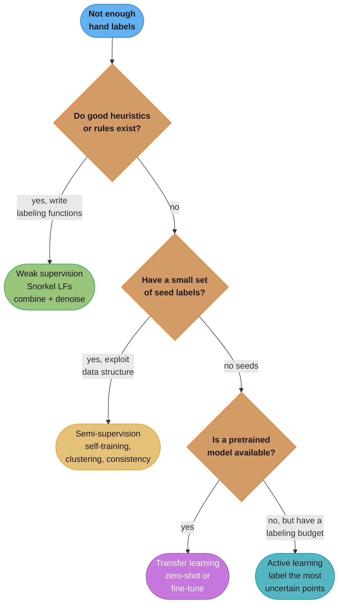
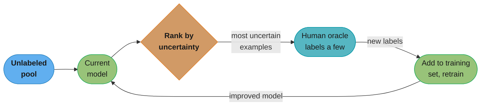
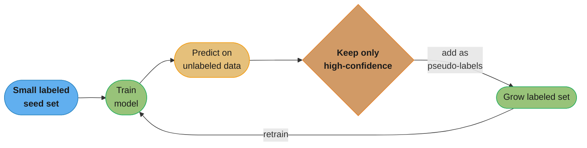
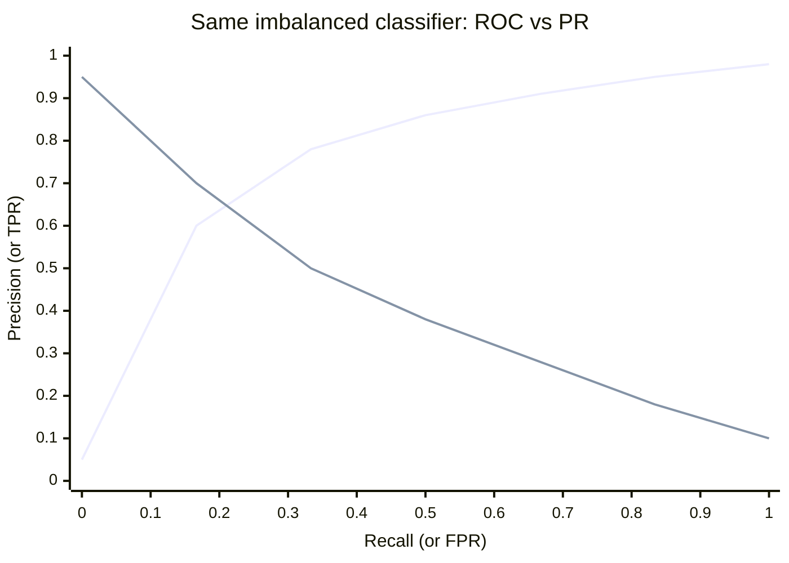

# Chapter 4: Training Data

> Ch 4 of 11 · Designing Machine Learning Systems (Huyen) · the book's data-trumps-models thesis in practice — sampling, labels, imbalance, augmentation

## Chapter Map

Training data is where most ML projects live or die, yet it gets a fraction of the attention that model architecture does. This chapter is Huyen's practical answer to "how do I actually *get* good training data" — and the argument underneath every section is that **data usually matters more than the model**: the same architecture trained on cleaner, better-sampled, better-labeled data will beat a fancier architecture trained on the data you happened to have. The chapter is deliberately titled "training data," not "training dataset," to stress that data is a living, shifting stream you curate — not a frozen, static blob you download once.

The four movements: (1) **sampling** — every dataset is already the result of sampling choices, most of them invisible and biased; (2) **labeling** — the expensive, slow, disagreement-ridden reality of getting labels, plus the four escape hatches when you can't hand-label enough; (3) **class imbalance** — why rare classes wreck accuracy-based training and the metric-, data-, and algorithm-level fixes; (4) **data augmentation** — squeezing more (and more robust) training signal out of the data you have.

**TL;DR:**
- **Sampling is unavoidable and rarely neutral.** Nonprobability sampling (convenience, snowball, judgment, quota) bakes selection bias straight into the model; probability methods (simple random, stratified, weighted, reservoir, importance) each trade off simplicity against faithful representation of rare groups.
- **Labels are the bottleneck.** Hand labels are expensive, slow, privacy-constrained, and inconsistent (annotators disagree). When they run out, reach for **weak supervision**, **semi-supervision**, **transfer learning**, or **active learning** — often in combination.
- **Class imbalance breaks accuracy-driven learning.** Fix it at three levels: right *metrics* (F1/precision-recall, not accuracy), *data-level* resampling (SMOTE, Tomek links — but never evaluate on resampled data), and *algorithm-level* reweighting (cost-sensitive, class-balanced, focal loss).
- **Data augmentation** — label-preserving transforms, perturbation, and synthesis — is standard in vision and growing fast in NLP; it both enlarges and toughens the training set.

## The Big Question

> "I can pick any model I want, but the model only ever sees the data I feed it. How do I *select*, *label*, and *shape* that data so the model learns the real world instead of my collection accidents — especially when labels are scarce, expensive, and the interesting classes are rare?"

Analogy: training data is the diet, the model is the athlete. A world-class athlete on a junk diet loses to a decent athlete on a great one. Most of this chapter is nutrition science — where the food comes from (sampling), whether it's labeled correctly (labeling), whether the rare-but-vital nutrients are present at all (class imbalance), and how to stretch a limited pantry (augmentation). Huyen's repeated warning: your data reflects *how it was collected*, and every collection choice is a thumb on the scale that the model will faithfully learn.

---

## 4.1 Sampling

Sampling happens at every stage of an ML project, usually without anyone calling it that. You sample from all real-world data to create *training* data; you sample from that to create *train/validation/test* splits; you sample events to log, users to survey, candidates to send to a ranking model. **Understanding sampling is understanding your data's biases** — because the sample you took, not the population you imagined, is what the model actually learned.

Sampling exists for two reasons: you often *can't* access the full population (all possible English sentences, all future users), and even when you can, sampling is *faster and cheaper* than processing everything. But the fact that data selection **is** sampling means the biases of your sampling method become the biases of your model.

The two families:

- **Nonprobability sampling** — selection is not based on any probability criterion; you take what's convenient.
- **Probability-based (random) sampling** — every item has a known, defined probability of being selected.

### Nonprobability sampling

Selection criteria have nothing to do with random chance. Four common flavors:

- **Convenience sampling** — take whatever data is easiest to get. (You use the data you happen to have logs for.)
- **Snowball sampling** — existing samples recruit future ones. E.g. to build a dataset of Twitter accounts of a certain type, start with a seed set and follow the accounts they follow.
- **Judgment sampling** — experts hand-pick which samples to include based on domain knowledge.
- **Quota sampling** — select fixed quotas per group without randomization (e.g. survey exactly 100 people from each of three age brackets, taking the first 100 you reach in each).

These are riddled with **selection bias** because the samples are *not representative* of the real-world data — yet they're extremely common because they're cheap and fast. Huyen's flagship cautionary example: **language models are often trained on data that can be easily collected — Reddit posts, Wikipedia, news articles — not on data representative of how people actually use language.** A model trained on Reddit learns Reddit's demographics, tone, and topic distribution, then gets deployed to serve a very different population. The bias was baked in at the collection step, invisibly. Another example: sentiment analysis of a stock trained only on tweets that mention it — because those tweets are the convenient data — skewing toward the loud, opinionated minority who tweet about stocks.

The trap is that nonprobability samples *work fine in the lab* (train and test come from the same biased source, so metrics look good) and fail in production (real users don't match the biased source). This is the data-collection root cause of many train/serving skew stories later in the book.

### Simple random sampling

Give every item in the population an **equal probability** of selection — e.g. select 1% of all data uniformly at random. It's the easiest method and preserves the *overall* distribution: if a class is 10% of the population, it'll be ~10% of the sample.

The failure mode is **rare-class erasure**: a class that is 0.01% of the population will be ~0.01% of a uniform 1% sample — which for a modest sample size may be **zero examples**. If you uniformly sample 1,000 rows and a fraud class is 1-in-100,000, you'll very likely draw *none* of it, and the model can never learn it. Simple random sampling silently deletes the rare, often most-important, classes.

**In plain terms.** "A uniform sample faithfully preserves each class's *share* of the population — which is precisely the disaster when the share you care about is already near zero." The number that decides whether a class survives is not its expected count but the probability of drawing **zero** of it.

| Symbol | What it is |
|--------|------------|
| `r` | The rare class's share of the population (1-in-100,000 = 0.00001) |
| `m` | How many rows you draw uniformly at random |
| `r x m` | Expected number of rare rows in the draw |
| `(1 - r)^m` | Probability the draw contains *none* of the rare class |

**Walk one example.** The same fair sampler, applied to a 10% class and to a 1-in-100,000 class:

```
  common class   r = 0.10 (a "10% class"),  draw m = 100 rows
    expected rare rows  = 0.10 x 100                 = 10.0
    spread              = sqrt(100 x 0.10 x 0.90)    =  3.0    -> roughly 7 to 13, never absent
    P(draw contains 0)  = 0.90^100                   =  0.0000266

  fraud class    r = 0.00001 (1 in 100,000), draw m = 1,000 rows
    expected rare rows  = 0.00001 x 1,000            =  0.01   -> one row per 100 such draws
    P(draw contains 0)  = (1 - 0.00001)^1000         =  0.99005

  Same sampler, same fairness. The 10% class is always there.
  The 1-in-100,000 class is missing from 99 draws out of 100.
```

Stratified sampling changes the question being asked: instead of "what fraction of the *population* is fraud" it asks "how many rows do I want *from the fraud stratum*," and the answer can be 500 even when fraud is 0.001% of the whole. That decoupling of sample size from population share is the entire point of the method.

### Stratified sampling

Fix the rare-class erasure by first **dividing the population into groups (strata)** — one per class — and sampling from *each group separately*, so every group is guaranteed representation. You might sample 1% within the common class and 1% within the rare class independently, or deliberately over-sample the rare stratum, but either way no group can vanish. It preserves (or intentionally reshapes) the ratio between groups.

**Where it fails: when groups can't be cleanly divided.** The canonical case is **multilabel** data — one example belongs to multiple classes at once (an image tagged both "cat" and "dog," a document in categories "sports" and "politics"). There's no unambiguous stratum to put it in, so the "divide into disjoint groups" premise breaks. Stratified sampling assumes each sample fits into exactly one bucket; multilabel violates that.

### Weighted sampling

Assign each sample a **weight** determined by domain knowledge, and sample proportionally to weight. If you know recent data is more valuable than old data, weight recent samples higher so they're drawn more often. If you know your available data over-represents one subpopulation but the real world is balanced, weight the under-represented subpopulation up to correct the skew.

Huyen carefully distinguishes this from a **similarly named but different** idea: **sample weights in the loss function**. Weighted *sampling* changes the *probability an example enters the training set*; **sample weights** keep every example in the set but change *how much each contributes to the loss* (a high-weight example moves the gradient more). They achieve related effects — emphasizing certain examples — but at different stages: one at data selection, one at optimization. Confusing them is a common interview trip-up.

### Reservoir sampling

The classic **streaming** sampling algorithm, and a perennial algorithm-interview favorite. The problem: you're consuming a stream of items (e.g. tweets from a firehose) of **unknown, possibly infinite length**, you can't fit them all in memory, and you want a sample of exactly **k** items such that **every item seen so far has an equal k/n probability** of being in the sample at any moment — without knowing n in advance.

Naive approaches fail: you can't "sample 1%" because you don't know the total; you can't store everything and sample at the end because the stream may never end or won't fit in memory. Reservoir sampling solves it with O(k) memory and one pass:

```
reservoir_sampling(stream, k):
    reservoir = first k items of stream          # fill the reservoir
    n = k
    for each subsequent item x in stream:
        n = n + 1
        j = random integer in [1, n]             # inclusive
        if j <= k:
            reservoir[j] = x                      # x replaces a random slot
    return reservoir
```

**Why every item has probability k/n** (the proof sketch interviewers want):

- The first k items go straight in, so before any replacement each is present with probability 1.
- When the n-th item arrives, it is *accepted* into the reservoir with probability **k/n** (because j is uniform in [1, n], and j ≤ k happens k out of n times). So the newest item satisfies the invariant by construction.
- For an item already in the reservoir to *survive* the n-th step, one of two things must happen: the n-th item is rejected (prob 1 − k/n), OR it's accepted but replaces one of the *other* k−1 slots. The probability the n-th item is accepted **and** evicts our specific item is (k/n)·(1/k) = 1/n, so the probability our item is *not* evicted is 1 − 1/n.
- By induction, if item i had probability k/(n−1) of being in the reservoir before step n, after step n it has k/(n−1) · (1 − 1/n) = k/(n−1) · (n−1)/n = **k/n**. The invariant holds for every item at every step. ∎

A tiny worked instance (k = 1, so we keep a single item — this is "pick a uniformly random item from a stream"): item 1 is kept with prob 1; item 2 replaces it with prob 1/2 (so each is now 1/2); item 3 replaces the survivor with prob 1/3 (so each of the three ends at 1/3). Every item ends equally likely — exactly what the induction guarantees.

**What this actually says.** "Each new arrival shrinks an incumbent's survival odds by exactly the fraction needed to keep every item's probability equal to the reservoir's share of the stream so far." The recurrence `k/(n-1) x (1 - 1/n) = k/n` is a telescoping cancellation: the `(n-1)` you divided by is the same `(n-1)` the survival term hands back.

| Symbol | What it is |
|--------|------------|
| `k` | Reservoir size — how many items you keep at any moment |
| `n` | How many items the stream has produced so far (unknown in advance) |
| `k/n` | The invariant: every item seen so far is in the reservoir with this probability |
| `1/k` | Chance a *specific* incumbent slot is the one overwritten, given the newcomer was accepted |
| `(k/n) x (1/k) = 1/n` | Probability the n-th item both enters AND evicts one specific incumbent |
| `1 - 1/n` | Probability an incumbent survives step n |

**Walk one example.** The k = 1 case beside a k = 3 case, step by step:

```
  k = 1  (keep a single item)              k = 3  (keep three)
  -------------------------------------    ------------------------------------------
  n=1: item1 present with prob 1.000       n=3: items 1-3 present with 3/3 = 1.000
  n=2: survive 1 - 1/2 = 0.500             n=4: 1.000 x (1 - 1/4) = 0.750 = 3/4
       item1 = 1.000 x 0.500 = 0.500       n=5: 0.750 x (1 - 1/5) = 0.600 = 3/5
       item2 accepted with   = 0.500       n=6: 0.600 x (1 - 1/6) = 0.500 = 3/6
  n=3: survive 1 - 1/3 = 0.667
       item1 = 0.500 x 0.667 = 0.333       and the newcomer at n=6 is accepted
       item2 = 0.500 x 0.667 = 0.333       with k/n = 3/6 = 0.500 -- identical
       item3 accepted with   = 0.333
```

Every item, no matter when it arrived, sits at exactly `k/n` — 0.333 for all three at n=3, 0.500 for all six at n=6. The invariant is exact at every step, not approximate in the limit, which is why the algorithm can be stopped at any moment and still hand you a uniform sample.

### Importance sampling

Lets you **sample from a distribution q (the proposal) when you actually want expectations under a different distribution p (the target)** — because sampling from p is impossible or expensive, but sampling from q is easy. You draw from q and **reweight each sample by the ratio p(x)/q(x)** (the *importance weight*), and the reweighted average is an unbiased estimate of the expectation under p:

```
E_p[f(x)]  =  Σ  p(x)·f(x)  =  Σ  q(x)·[ p(x)/q(x) ]·f(x)  =  E_q[ (p(x)/q(x))·f(x) ]
```

**Read it like this.** "Draw from the distribution you can actually afford, then pay each sample back by the ratio of how often the target would have produced it to how often the proposal did." The identity is pure bookkeeping — multiply and divide by q(x) — but it converts an impossible expectation into an affordable one.

| Symbol | What it is |
|--------|------------|
| `p(x)` | Target distribution — the one you want the expectation under, but can't sample |
| `q(x)` | Proposal distribution — the one you can actually draw from cheaply |
| `p(x)/q(x)` | The importance weight; > 1 means q under-draws this outcome, < 1 means it over-draws |
| `f(x)` | The quantity you're averaging (a reward, a loss, any function of the sample) |
| `E_q[...]` | A plain average over samples drawn from q, of the reweighted values |

**Walk one example.** Three outcomes, a proposal that badly mismatches the target:

```
  outcome    p(x)    q(x)    w = p/q    f(x)     q(x) x w x f(x)
  --------------------------------------------------------------
  A          0.1     0.5       0.2        10     0.5 x 0.2 x 10 =  1.0
  B          0.3     0.3       1.0        20     0.3 x 1.0 x 20 =  6.0
  C          0.6     0.2       3.0        30     0.2 x 3.0 x 30 = 18.0
  --------------------------------------------------------------
  reweighted estimate under q                                   = 25.0
  direct expectation under p: 0.1x10 + 0.3x20 + 0.6x30          = 25.0
```

The two agree exactly. Read the weights as a correction ledger: q draws outcome A five times too often, so each A is discounted to 0.2 of its face value; q draws C three times too rarely, so each C counts triple. Outcome B is drawn at the right rate and passes through at weight 1.0.

The only requirement is that q(x) > 0 wherever p(x) > 0 (the proposal must cover the target's support). **Reinforcement learning** is the flagship use case Huyen cites: in **policy-based methods**, the policy that generated the trajectories (the behavior/old policy, q) differs from the updated policy you want to evaluate (the new policy, p); rather than re-collecting fresh trajectories after every tiny policy update — which is enormously expensive — you reuse the old samples and reweight them by the ratio of the new policy's action probabilities to the old policy's. That's importance sampling, and it's why off-policy RL and algorithms like PPO can learn from data a slightly different policy generated.

---

## 4.2 Labeling

Despite the excitement around unsupervised/self-supervised learning, **most ML models in production are still supervised** and therefore need labeled data. The quality and quantity of labels usually determine model performance more than anything else — so labeling deserves serious engineering attention, not an afterthought outsourced and forgotten.

### Hand labels

Getting humans to annotate data is the default, and it has three chronic problems:

- **Expensive.** Especially when annotation requires domain expertise. You can't crowdsource labeling chest X-rays on Mechanical Turk — you need **board-certified radiologists**, whose time costs orders of magnitude more than a generic crowdworker's. Expert labeling can dominate a project's budget.
- **A privacy/security threat.** Hand labeling means *someone* has to look at the data. If the data is sensitive (medical records, private messages, proprietary documents), you often **can't ship it out** to an external labeling vendor or even a cloud crowd platform — legally or contractually — which forces slow, expensive in-house labeling under strict access controls.
- **Slow.** Huyen's concrete example: getting labels for a study of **lymph node metastases** took experts **months** to produce enough accurate labels. Slow labeling makes the whole model **inflexible** — when the task or schema changes, or the world shifts, you can't re-label fast enough to adapt, so the model calcifies.

#### Label multiplicity

When you use multiple annotators to scale up labeling, you hit **annotator disagreement**: different (equally qualified) people label the *same* example differently, producing conflicting labels for one data point. Huyen's worked **entity-extraction** example: given the sentence *"Darth Sidious, known simply as the Emperor, was a Sith Lord who ruled the Galactic Empire,"* and asked to annotate entities, **three annotators produce three different answers** — one finds 3 entities, another 4, another 6 — differing on whether "the Emperor," "Sith Lord," and "Galactic Empire" are entities and on span boundaries. Which is correct? There's no ground truth; it depends on definitions the annotators didn't share.

A compressed view of that disagreement — same sentence, three annotators, three different entity sets:

| Span | Annotator A | Annotator B | Annotator C |
|------|:--:|:--:|:--:|
| "Darth Sidious" | entity (PERSON) | entity (PERSON) | entity (PERSON) |
| "the Emperor" | — | entity (TITLE) | entity (PERSON alias) |
| "Sith Lord" | — | — | entity (ROLE) |
| "Galactic Empire" | entity (ORG) | entity (ORG) | entity (ORG) |
| **Total entities** | **2** | **3** | **4+** |

No annotator is "wrong" — they applied different implicit definitions of what counts as an entity and where spans begin and end. That's exactly why the fix is a shared, explicit spec.

Disagreement rises sharply with required expertise (experts disagree on hard cases precisely *because* they're hard). The fixes are process, not tooling:

- **A clear, unambiguous problem definition.** Vague instructions ("label the entities") invite divergence; a precise spec ("annotate proper nouns referring to named characters, organizations, and places; include titles only when part of a proper name; span = maximal noun phrase") collapses much of the disagreement.
- **Annotator training.** Train annotators against the spec, adjudicate examples together, and measure inter-annotator agreement so you catch drift.

#### Data lineage

Because data is indiscriminately combined from many sources and labelers of varying quality, you should **track the lineage of every data point — where it came from and who/what labeled it.** Lineage lets you attribute problems to their source. Huyen's war story: a team obtained more data from a new source to improve the model, and after retraining, **model accuracy *dropped*.** Because they had kept data lineage, they could **isolate the new data and discover it was mislabeled** — the new source's labels were systematically wrong. Without lineage, they'd have been stuck debugging a healthy model against a poisoned dataset, unable to tell good data from bad. Lineage turns "our metrics got worse and we don't know why" into "the batch from vendor X on date Y is bad — drop it."

### Natural labels

Some tasks have **natural ground-truth labels** — the world (or the system) automatically produces the label without any human annotation, usually because the model's prediction can be verified against a subsequent real event. These are the tasks you *want* if you can get them, because labeling is free and continuous. Examples:

- **ETA prediction** (ride-share/maps) — you predict a trip takes 20 minutes; the trip completes; the actual duration is the label.
- **Stock price prediction** — predict tomorrow's price; tomorrow arrives; the real price is the label.
- **Recommendation systems** — recommend items; whether the user **clicks/purchases/engages** is the label. A click is treated as a positive; the recommendation system is the poster child for natural labels because every impression generates feedback.
- **Ad click-through**, **search ranking** (did the user click the result), **content moderation** (was a post later reported/removed).

Natural labels aren't always *natively* natural — sometimes you engineer the system so behavior implies a label (**behavioral labels**). A task can be *reframed* to manufacture natural labels: a recommender doesn't have to ask "will the user like this?" (needing an explicit rating); it can log every recommendation and treat a click/purchase within a window as a positive and a no-action as a negative, converting a hard-to-label preference problem into a continuously self-labeling one. Huyen's point is that many companies *choose* problem framings that yield natural labels precisely to escape the labeling bottleneck — the availability of natural labels is itself a design consideration, not just a property of the task.

#### Explicit vs implicit labels

- **Explicit labels** — the user directly states the label (a thumbs-up/down, a star rating, a "not interested" button).
- **Implicit labels** — the label is *inferred from behavior*, most often from the **absence** of an expected action. If a recommended item is shown but *not* clicked, that's an implicit negative.

#### Feedback loop length

The **feedback loop length** is the time from serving a prediction to receiving its natural label — and it varies by orders of magnitude, which drives how quickly you can detect and react to model degradation:

| Task | Feedback loop length | Consequence |
|------|----------------------|-------------|
| Recommendation / short-video / news feed | **Minutes** (was it clicked in this session?) | Fast retraining, quick drift detection |
| Product recommendation → purchase | Hours to days (buying decisions take time) | Medium |
| Fraud detection via **chargebacks** | **Months** (a fraudulent charge may only be disputed weeks or months later) | Slow labels; can't quickly confirm the model is still accurate |

Short loops (minutes, like recommendations) let you retrain and catch drift almost immediately; long loops (months, like fraud chargebacks) mean you're flying partly blind — you won't *know* today's model is failing until the labels trickle in much later.

#### The window problem: "shown but not clicked = negative?"

Implicit negatives are tricky because of *timing*. If a recommendation is shown and not clicked, is it a negative? **Not immediately** — the user might click it later in the session, or come back tomorrow. So you must pick a **window length** (e.g. "no click within 10 minutes → negative"). The window is a tradeoff: **too short** and you mislabel slow-but-genuine positives as negatives (a user who clicks after 15 minutes gets recorded as "didn't like it"); **too long** and your labels arrive late, lengthening the feedback loop and delaying retraining. There's no free lunch — you're trading label *accuracy* against label *latency*.

### Handling the lack of labels

When hand labels are too expensive, too slow, or too few, four families of methods let you train with fewer (or zero) hand labels. Huyen tabulates them:

| Method | How it works | What ground truths it needs |
|--------|--------------|-----------------------------|
| **Weak supervision** | Leverages (often noisy) heuristics to programmatically generate labels | No hand labels needed, but a *few* to sanity-check the heuristics is nice |
| **Semi-supervision** | Leverages structural assumptions to generate more labels from a *small* set of initial labels | A small number of initial hand labels as seeds |
| **Transfer learning** | Reuse a model pretrained on another task; apply to your task (zero-shot) or fine-tune | Zero-shot needs none; fine-tuning needs some hand labels (far fewer than from scratch) |
| **Active learning** | Label the samples that are *most useful* to your model, chosen by the model | Same hand labels as normal, but far fewer of them needed |

#### Weak supervision

The core idea: **encode human heuristics as programmatic labeling functions (LFs)** that generate noisy labels at scale, then **combine and denoise** them. The flagship system is **Snorkel** (from Stanford). Instead of labeling examples one by one, a domain expert writes functions that express *rules of thumb*:

- **Keyword / regex heuristics** — "if a clinical note contains the phrase 'no evidence of pneumonia,' label NEGATIVE."
- **Pattern matching** — regexes over text structure.
- **Database lookups** — "if this entity appears in our known-fraud list, label FRAUD."
- **Outputs of other models / existing classifiers.**

Each LF is **noisy** (imperfect, may be wrong on some examples) and may have **limited coverage** (only fires on some examples) and LFs may **conflict** or **overlap** with each other. The magic of weak supervision is the algorithm that **combines and denoises** these many noisy signals — learning, from their agreements and disagreements, how reliable each LF is and producing a single **probabilistic label** per example, all *without ground truth*.

The pitch Huyen loves: in a case study, **subject-matter experts wrote LFs in roughly one hour** and achieved results comparable to labels that would otherwise have taken **months** of hand labeling — "one pathologist-hour instead of months." Other advantages: LFs are **reusable** and **maintainable** (adapt to new data by editing a function rather than relabeling), and privacy-friendly (an expert writes a rule instead of every record leaving the building).

**When LFs suffice vs. when you still need hand labels:** weak supervision shines when good heuristics exist and label volume is the bottleneck. But if the heuristics are *too noisy or too sparse* to cover the label space, or the task is subtle enough that no rule captures it, you'll still need *some* hand labels — typically a small held-out set to *evaluate* and *calibrate* the LFs, and sometimes hand labels to fill the gaps LFs can't cover.

#### Semi-supervision

Start from a **small set of initial labels** and use **structural assumptions about the data** to generate more labels. Three mechanisms:

- **Self-training** — train a model on the few labeled examples, use it to predict labels for the unlabeled data, add the predictions the model is **most confident** about (highest-probability outputs) to the training set as new labels, and retrain. Repeat, growing the labeled set each round. It bootstraps labels from the model's own confident guesses.
- **The clustering / smoothness assumption** — data points that are *close together* (in the same cluster, or connected in a similarity graph) likely share a label. Label one point in a cluster and propagate to its neighbors. (E.g. label a few tweets with a hashtag and assume other tweets sharing that hashtag carry the same sentiment.)
- **Perturbation-based (consistency) methods** — assume small perturbations to an input should **not** change its label (a slightly noised image of a cat is still a cat). Train the model to produce *consistent* outputs on an example and its perturbed version, letting unlabeled data contribute a training signal (the model must agree with itself) even without a label. This is closely related to data augmentation (§4.4).

Semi-supervision is most valuable when the number of hand labels is small — it stretches a handful of seeds across a large unlabeled pool.

#### Transfer learning

Take a model **pretrained on a base task** (usually one with abundant, cheap, or self-supervised data) and **reuse it for your downstream task**, which has scarce labels. Two modes:

- **Zero-shot** — apply the pretrained model to your task with **no additional training** and no task labels at all. (A large language model answering a classification prompt it was never explicitly trained for.)
- **Fine-tuning** — continue training the pretrained model on your (small) labeled dataset, adapting its learned representations to your task. Fine-tuning needs far fewer labels than training from scratch because the model already knows general features.

Transfer learning slashes label requirements because the expensive representation learning was already done on the base task. **Huyen's "BERT era" note:** the rise of large pretrained language models (BERT and successors) made transfer learning the **default** for NLP — you almost never train a text model from scratch anymore; you fine-tune a pretrained one, and the same pattern took over computer vision (ImageNet pretraining) before that. This is arguably the single biggest reason modern teams can ship NLP models with modest labeled datasets.

#### Active learning

Instead of labeling random examples, **let the model choose which examples would be most useful to label next**, so a fixed labeling budget buys the most improvement. Query strategies:

- **Uncertainty sampling** — label the examples the model is **least confident** about (prediction probability closest to the decision boundary, e.g. nearest 0.5 in binary classification). These are the examples the model is confused by, so labeling them teaches it the most.
- **Query-by-committee** — train an **ensemble** of models and label the examples they **disagree** most about. Disagreement flags the examples that would most reduce the models' collective uncertainty.
- **Margin sampling** — label examples with the **smallest margin** between the top two predicted class probabilities (a variant of uncertainty for multiclass).

Active learning **shines under a label budget constraint** (you can only afford N labels; spend them where they matter most) and in **streaming settings**, where data flows past and you must decide *on the fly* whether each incoming example is worth the cost of labeling. It can dramatically cut the number of labels needed for a target accuracy.

---

## 4.3 Class Imbalance

Class imbalance is when the classes in a classification task are **very unevenly distributed** — one class (the majority) hugely outnumbers another (the minority). It's endemic in the highest-stakes tasks: fraud (few frauds among many legit transactions), disease screening (few sick among many healthy), churn, spam, defects, security intrusions. Imbalance can also appear in **regression** (predicting rare extreme values, like the 0.001%-frequent huge hospital bill).

### Why class imbalance is hard

Three compounding reasons:

- **Insufficient signal for the rare class.** With too few minority examples, the task becomes closer to **few-shot learning** — the model simply doesn't see enough of the rare class to learn its patterns, and in the extreme (zero examples in a training batch or split, as simple random sampling can cause) it can't learn it at all.
- **Trivial majority solutions dominate.** A model can get **stuck in a useless local optimum** by exploiting a simple heuristic: **always predict the majority class.** The canonical example — a **cancer-screening classifier where 99.99% of cases are non-cancerous can be "99.99% accurate" by predicting "no cancer" for everyone**, catching *zero* actual cancers. High accuracy, zero value. The imbalance lets a degenerate model hide behind a great-looking number.
- **Asymmetric costs of error.** The errors are usually *not* equally bad. **Missing a cancer (false negative) is far worse than a false alarm (false positive)** that triggers a follow-up test. Yet standard training treats both errors identically, optimizing the wrong thing. The rare class is rare *and* the expensive one to get wrong — a brutal combination.

The fixes operate at three levels.

### Using the right evaluation metrics

The first and most important fix isn't to the data or model — it's to **stop measuring with accuracy**, which lies under imbalance (the 99.99% cancer classifier proves it). Use metrics that focus on the minority class:

- **Precision** — of the examples the model *flagged positive*, what fraction really were? (Penalizes false positives.)
- **Recall (sensitivity, true-positive rate)** — of the *actual positives*, what fraction did the model catch? (Penalizes false negatives — the cancers you missed.)
- **F1** — the harmonic mean of precision and recall, a single balanced score. Crucially, F1 (and precision/recall) are **asymmetric metrics**: their value changes depending on which class you designate positive, so you point them at the *minority* class you care about.

**PR curves vs. ROC-AUC under imbalance** — the chapter's key measurement argument: the **ROC curve** (true-positive rate vs. false-positive rate) can look **deceptively good** on imbalanced data because the false-positive rate has a **huge** denominator (all the majority-class negatives), so even a large *absolute* number of false positives barely moves it. The **precision-recall (PR) curve** plots precision vs. recall, and precision's denominator is *predicted positives* — so PR **stays sensitive to how the model does on the rare positive class** and exposes weaknesses ROC-AUC hides. For rare-positive problems, **PR is the more informative curve.**

**Threshold selection** — most classifiers output a probability, and you choose a decision **threshold** to convert it to a label. The default 0.5 is arbitrary; under imbalance and asymmetric costs you deliberately move it (e.g. lower the threshold to catch more cancers, accepting more false alarms — a recall-favoring choice). The PR curve is the tool for picking the operating point that best trades precision against recall for your cost structure.

**Stated plainly.** "Recall and the false-positive rate divide by the *true* class sizes, so under imbalance the FPR denominator is astronomically large and hides the damage; precision divides by what the model *flagged*, so it cannot hide anything." The three metrics differ only in their denominator, and the denominator is the whole argument.

| Symbol | What it is |
|--------|------------|
| `TP` | True positives — real positives the model flagged |
| `FN` | False negatives — real positives the model missed |
| `FP` | False positives — negatives the model wrongly flagged (the alerts that waste a human's time) |
| `TN` | True negatives — negatives correctly left alone; under imbalance this number is enormous |
| `recall = TP/(TP+FN)` | Of the actual positives, the fraction caught. Denominator = all real positives |
| `FPR = FP/(FP+TN)` | The ROC x-axis. Denominator = all real negatives — the huge one |
| `precision = TP/(TP+FP)` | Of what you flagged, the fraction that was real. Denominator = predicted positives |

**Walk one example.** A million transactions, 100 of them fraud (0.01% positive):

```
  1,000,000 transactions;  100 fraud (positives),  999,900 legitimate (negatives)

  operating point A:  TP = 80   FN = 20   FP = 8,000   TN = 991,900
    recall (TPR) = 80 / 100                = 0.800
    FPR          = 8,000 / 999,900         = 0.0080   <- ROC point (0.008, 0.800): top-left
    precision    = 80 / (80 + 8,000)       = 0.0099   <- 1 real fraud per 101 alerts
    F1           = 2 x 0.0099 x 0.800 / (0.0099 + 0.800)  = 0.0196
    accuracy     = (80 + 991,900) / 1,000,000          = 0.99198

  operating point B (threshold lowered to chase recall): TP = 95   FP = 50,000
    recall = 0.950     FPR = 50,000 / 999,900 = 0.0500   <- ROC still looks fine
    precision = 95 / 50,095                   = 0.0019   <- 1 real fraud per 527 alerts
```

One model, one confusion matrix, two stories. Accuracy says 99.198% and the ROC point sits in the flattering top-left corner, while precision says 99 of every 100 alerts are noise. Moving from A to B buys 15 extra caught frauds at the cost of 42,000 extra false alarms — a trade the PR curve makes visible and the ROC curve does not, because the FPR only crept from 0.008 to 0.050.

The 0.5 default threshold has no special status here: it is simply the point where the model's own probability crosses one half, which has nothing to do with your cost of a missed fraud versus a wasted investigator-hour. Pick the operating point from the PR curve using those costs, then read off the threshold that produces it.

### Data-level methods: resampling

Rebalance the training distribution by changing *how many* of each class the model sees.

- **Random oversampling** — duplicate (randomly copy) minority examples until the classes are balanced. Simple; risks **overfitting** to the duplicated points.
- **Random undersampling** — randomly drop majority examples until balanced. Simple; risks **throwing away useful information** from the majority class.
- **SMOTE (Synthetic Minority Oversampling TEchnique)** — instead of duplicating minority points, **synthesize new ones by interpolating between existing minority examples and their nearest minority neighbors.** For a minority point, pick one of its k nearest minority neighbors and create a new point somewhere on the line segment between them. This adds *plausible* new minority examples rather than exact copies. **Its limitation: SMOTE works well in low dimensions but degrades in high-dimensional spaces** — linear interpolation between neighbors becomes less meaningful when points are sparse and far apart (the curse of dimensionality), so it's mainly effective on **low-dimensional tabular data**, not images or text embeddings.
- **Tomek links** — an **undersampling / cleaning** technique: find pairs of *very close* points from *opposite* classes (a "Tomek link" is a pair that are each other's nearest neighbor but have different labels) and **remove the majority-class member** of each pair. This cleans up the decision boundary by deleting borderline/overlapping majority points, making the class separation clearer.
- **Two-phase training / dynamic sampling** — a hybrid: **train first on a resampled (balanced) dataset**, then **fine-tune on the original (imbalanced) distribution** so the model both learns the rare class *and* calibrates to the real class frequencies. **Dynamic sampling** varies the sampling rate over training — e.g. show more of the low-performing classes as training progresses.

**The non-negotiable rule: never evaluate on resampled data.** Resampling is a *training-set* intervention only. Your **validation and test sets must keep the original, real-world class distribution**, because that's what production looks like. If you resample the test set, your metrics measure a fantasy balanced world and will be wildly optimistic — the model looks great on a 50/50 test set and collapses on the real 99.99/0.01 stream. Resample train; never touch the evaluation distribution.

### Algorithm-level methods

Leave the data alone; change the **loss function** so the model *pays more* for mistakes on the rare class.

- **Cost-sensitive learning** — define a **cost matrix** C where C[i, j] is the cost of predicting class j when the truth is class i, and weight the loss by these costs. You encode "a false negative (missed cancer) costs 100× a false positive," and the model optimizes to minimize *total cost* rather than error count. The catch is you must *know* the costs.
- **Class-balanced loss** — automatically **weight each class inversely to its frequency**, so the rare class contributes proportionally more to the loss. The naive version weights by 1/(class frequency); a refined version weights by the **"effective number" of samples** (Cui et al.), which accounts for the fact that adding more samples of a class gives diminishing new information (overlap), so you don't over-weight simply by raw inverse count.
- **Focal loss** — reshapes the loss to **down-weight easy, well-classified examples** so training focuses on the **hard** ones (which, under imbalance, are disproportionately the rare-class and boundary cases). Standard cross-entropy is `−log(p_t)` where p_t is the predicted probability of the true class; focal loss multiplies it by a **modulating factor `(1 − p_t)^γ`**:

  ```
  Focal Loss = −(1 − p_t)^γ · log(p_t)
  ```

  When an example is **easy** (the model is confident and correct, p_t → 1), `(1 − p_t)^γ → 0`, so its loss is **crushed toward zero** and it stops dominating the gradient. When an example is **hard** (p_t small), `(1 − p_t)^γ → 1`, so it keeps (nearly) its full loss. The tunable **focusing parameter γ ≥ 0** controls the strength: γ = 0 recovers plain cross-entropy; larger γ (e.g. 2) down-weights easy examples more aggressively. Focal loss came from dense object detection (RetinaNet), where the background:object imbalance is extreme, and it's now a go-to for imbalanced classification.

  A concrete numeric feel with γ = 2, comparing the focal factor for an easy vs. a hard example:

  | Example | p_t | cross-entropy `−log(p_t)` | factor `(1−p_t)²` | focal loss | relative weight |
  |---------|:---:|:---:|:---:|:---:|:---:|
  | Easy (confident, correct) | 0.90 | 0.105 | 0.01 | 0.00105 | ~1× |
  | Hard (near boundary) | 0.50 | 0.693 | 0.25 | 0.173 | **~165×** |

  Under plain cross-entropy the hard example's loss is only ~6.6× the easy one's; focal loss with γ = 2 stretches that gap to ~165×, so a flood of easy majority-class examples no longer drowns out the few hard rare-class ones in the gradient.

  **What the formula is telling you.** "Keep the usual cross-entropy penalty, but scale it down by how confident-and-correct the model already was, so examples it has already mastered stop consuming gradient." The per-example ratio above is only half the story; what matters in practice is the share of the *batch* loss the rare class commands.

  | Symbol | What it is |
  |--------|------------|
  | `p_t` | The probability the model assigned to the *true* class. Near 1 = easy, near 0 = hard |
  | `-log(p_t)` | Plain cross-entropy. 0 when perfectly confident and right, unbounded when confidently wrong |
  | `γ` | The focusing parameter. 0 = plain cross-entropy; 2 is the common setting |
  | `(1 - p_t)^γ` | The modulating factor. Multiplies the loss down toward 0 as the model gets confident |
  | `(1 - p_t)^γ · log(p_t)` | The product: full penalty on hard examples, near-zero penalty on easy ones |

  **Walk one example.** A single realistic batch — 1,000 easy majority examples and 10 hard rare ones:

  ```
    batch: 1,000 easy examples (p_t = 0.90) + 10 hard examples (p_t = 0.50), gamma = 2

    plain cross-entropy
      easy total = 1,000 x 0.10536              = 105.361
      hard total =    10 x 0.69315              =   6.931
      hard share of batch loss = 6.931 / 112.292          = 6.2%

    focal loss, gamma = 2
      easy total = 1,000 x 0.01 x 0.10536       =   1.054
      hard total =    10 x 0.25 x 0.69315       =   1.733
      hard share of batch loss = 1.733 / 2.787            = 62.2%
  ```

  The 10 examples that actually need learning go from commanding 6.2% of the gradient to 62.2% — a roughly 10x reallocation of the model's attention, achieved without touching a single row of data or duplicating a single minority example. That is why focal loss is an *algorithm-level* fix: the training distribution is untouched, so the model still sees (and stays calibrated to) the real class frequencies.

  Setting γ = 0 collapses `(1 - p_t)^γ` to 1 for every example and you are back to plain cross-entropy — the term exists purely to make "already solved" examples cheap. Without it, the 1,000 easy examples above contribute 105 of the batch's 112 loss units, and the gradient spends almost all its budget re-confirming what the model already knows.

---

## 4.4 Data Augmentation

Data augmentation is a family of techniques to **increase the amount and diversity of training data** — originally to combat overfitting with limited data, now a **standard step even when data is plentiful** because it makes models **more robust** (to noise and adversarial inputs) and improves generalization. Three categories.

### Simple label-preserving transformations

Modify existing examples with transformations that **do not change the label**, cheaply multiplying the dataset:

- **Images** — randomly **crop, flip (horizontal), rotate, scale, erase (cutout), or shift colors/brightness/contrast.** A flipped cat is still a cat; a slightly rotated, brighter cat is still a cat. This is ubiquitous and near-free in computer vision, and often multiplies effective dataset size several-fold.
- **NLP** — **synonym replacement**: swap words for synonyms (chosen so meaning/label is preserved). "This is a *great* movie" → "This is a *fantastic* movie." Text is far more fragile than images — a wrong synonym can flip the label or produce nonsense — so label-preserving NLP transforms are subtler and riskier than image ones.

### Perturbation

**Perturbation is also label-preserving, but its purpose is robustness, not just volume** — deliberately adding difficulty so the model learns to be stable:

- **Noise injection** — add small random noise to inputs so the model doesn't over-rely on exact pixel/feature values.
- **Adversarial examples** — add **carefully crafted, often imperceptible** perturbations designed to *fool* the model, then train on them so the model resists such attacks. Huyen names **BIM (Basic Iterative Method)** — an iterative gradient-based technique for generating adversarial perturbations (an iterative extension of FGSM) — as a way to produce these hard examples. Training on adversarial/perturbed examples is called **adversarial training** and hardens the model against both malicious inputs and natural distribution noise.
- **NLP's harder story** — perturbation is trickier for text because it's discrete: you can't add a tiny continuous nudge to a word the way you can to a pixel; changing a token is a large, discrete, possibly label-changing move. So perturbation-based augmentation is well developed in vision and still comparatively **immature in NLP**.

### Data synthesis

Generate **entirely new** synthetic examples rather than transforming existing ones:

- **Templates (NLP)** — write templates with slots and fill them to generate many labeled examples. Huyen's example: a template like *"How much is a `DISH`?"* filled with a list of dishes generates a batch of labeled queries for an intent classifier without hand-writing each one. (Bracketed slot names in templates are placeholders you substitute.)
- **Mixup** — create a synthetic example by **linearly interpolating two real examples AND their labels together.** For two examples (x1, y1) and (x2, y2) and a mixing weight λ, the new example is `x̃ = λ·x1 + (1−λ)·x2` with soft label `ỹ = λ·y1 + (1−λ)·y2`. A 60/40 blend of a cat image and a dog image gets the soft label "60% cat, 40% dog." Mixup regularizes the model toward simpler, smoother decision boundaries and improves generalization and robustness.
- **GAN-based synthesis** — use **generative adversarial networks** to synthesize realistic new training examples (e.g. generating additional medical images to enrich a scarce dataset). Powerful but heavier to set up, and quality/label-fidelity must be validated.

**The summary framing:** data augmentation is **standard practice in computer vision** (few vision pipelines ship without it) and is **growing in NLP**, where discreteness makes it harder but templates, back-translation, and synonym methods are increasingly common.

---

## Visual Intuition

The four label-scarcity escape hatches, as a decision flow — which method to reach for depends on what you *do* have (heuristics, a few seeds, a pretrained model, or a labeling budget):



Caption: the four methods aren't mutually exclusive — teams routinely stack them (fine-tune a pretrained model, weakly-supervise the rest, and use active learning to spend a small hand-label budget) — but this is the "which one first" triage by what you already possess.

The **active-learning loop** — the model itself picks what to label, so a fixed budget buys maximum improvement:



Caption: unlike random labeling, the loop always spends the next label on the example the model is most confused about (uncertainty/margin/committee-disagreement), reaching a target accuracy with far fewer labels.

The **self-training loop** (semi-supervision) — bootstrap labels from the model's own most-confident predictions:



Caption: self-training's risk is confirmation bias — confident-but-wrong pseudo-labels get reinforced each round — so it depends on the confidence threshold and the clustering/smoothness assumption actually holding.

The **PR-vs-ROC intuition** under heavy imbalance — same model, but ROC looks great while PR reveals the truth, because the false-positive rate has a giant negative-class denominator that hides a poor rare-positive precision:



Caption: the upper line is the ROC curve (TPR vs FPR) hugging the top-left — looks excellent; the lower line is the PR curve (precision vs recall) collapsing as recall rises — the honest picture for a rare positive. When positives are rare, trust PR, not ROC-AUC.

The **SMOTE neighbor-interpolation geometry** (ASCII — vector geometry Mermaid can't draw): a synthetic minority point is placed on the segment between a minority example and one of its k nearest minority neighbors.

```
minority examples: o      majority examples: .      synthetic (SMOTE): *

        .   .   .   .   .   .   .   .
        .   o---*---o   .   .   .   .      new point * = x_i + λ·(x_neighbor − x_i),
        .   .    \      .   .   .   .      λ ~ Uniform(0,1), placed ON the segment
        .   .     *     o   .   .   .      between a minority point and a
        .   .    /      |   .   .   .      randomly chosen nearest minority neighbor
        .   o---*-------o   .   .   .
        .   .   .   .   .   .   .   .

  low-dim: neighbors are close, the segment lies inside the true minority region -> plausible
  high-dim: points are sparse and far apart, the segment cuts through empty/majority space
            -> interpolation is meaningless (curse of dimensionality) -> SMOTE degrades
```

Caption: SMOTE fills in the minority region by interpolating between near neighbors, which is faithful in low dimensions but breaks down in high-dimensional spaces where "between two neighbors" no longer lies inside the class.

---

## Key Concepts Glossary

- **Sampling** — selecting a subset of data from a population; happens at every ML stage and encodes bias.
- **Nonprobability sampling** — selection not based on probability (convenience, snowball, judgment, quota); introduces selection bias.
- **Convenience sampling** — take whatever data is easiest to obtain.
- **Snowball sampling** — existing samples recruit/lead to future samples.
- **Judgment sampling** — experts hand-pick which samples to include.
- **Quota sampling** — fill fixed per-group quotas without randomization.
- **Selection bias** — the sample is not representative of the real-world population.
- **Simple random sampling** — every item has equal selection probability; can erase rare classes.
- **Stratified sampling** — split into groups (strata) and sample each separately; fails on multilabel (no clean groups).
- **Weighted sampling** — sample proportionally to domain-knowledge weights.
- **Sample weights (in loss)** — per-example weights on the loss contribution (distinct from weighted sampling).
- **Reservoir sampling** — one-pass streaming algorithm to keep k items each with equal k/n probability, n unknown.
- **Importance sampling** — sample from proxy q, reweight by p(x)/q(x) to estimate expectations under p; used in RL.
- **Hand labels** — human-annotated labels; expensive, slow, privacy-constrained.
- **Label multiplicity** — different annotators produce conflicting labels for the same example.
- **Inter-annotator agreement** — measure of how consistently annotators label the same data.
- **Data lineage** — tracking where each data point and its label came from.
- **Natural labels** — labels the system/world produces automatically (ETA, clicks, prices).
- **Explicit label** — user directly states the label (rating, thumbs-up).
- **Implicit label** — label inferred from behavior, often from the absence of an action.
- **Feedback loop length** — time from prediction to receiving its natural label (minutes to months).
- **Window (label window)** — time allowed before a no-action is recorded as a negative.
- **Weak supervision** — programmatically generate noisy labels from labeling functions, then denoise (Snorkel).
- **Labeling function (LF)** — a heuristic/regex/lookup that produces noisy labels at scale.
- **Semi-supervision** — expand a small labeled set using structural assumptions.
- **Self-training** — retrain on the model's own high-confidence pseudo-labels iteratively.
- **Clustering/smoothness assumption** — nearby points likely share a label.
- **Perturbation-based (consistency) method** — enforce stable predictions under small input changes.
- **Transfer learning** — reuse a pretrained model for a new task (zero-shot or fine-tune).
- **Zero-shot** — apply a pretrained model with no additional training.
- **Fine-tuning** — continue training a pretrained model on a small task dataset.
- **Active learning** — the model selects the most useful examples to label next.
- **Uncertainty sampling** — label the examples the model is least confident about.
- **Query-by-committee** — label examples an ensemble disagrees most about.
- **Margin sampling** — label examples with the smallest gap between top two class probabilities.
- **Class imbalance** — very uneven class distribution; wrecks accuracy-based learning.
- **Precision** — fraction of predicted positives that are truly positive.
- **Recall (sensitivity)** — fraction of actual positives correctly identified.
- **F1** — harmonic mean of precision and recall.
- **ROC curve** — TPR vs FPR; can look deceptively good under imbalance.
- **PR curve** — precision vs recall; more informative for rare positives.
- **Threshold** — probability cutoff turning scores into labels; tuned for cost asymmetry.
- **Resampling** — rebalancing training data by over/undersampling.
- **SMOTE** — synthesize minority points by interpolating between near neighbors; degrades in high dims.
- **Tomek links** — remove majority points that are nearest neighbors to opposite-class points, cleaning the boundary.
- **Two-phase training / dynamic sampling** — train on resampled data, then fine-tune on the real distribution; vary sampling rate over training.
- **Cost-sensitive learning** — weight the loss by a cost matrix of error costs.
- **Class-balanced loss** — weight classes by inverse frequency / effective number of samples.
- **Focal loss** — `−(1−p_t)^γ·log(p_t)`; down-weights easy examples to focus on hard ones.
- **Data augmentation** — increase data amount/diversity to fight overfitting and improve robustness.
- **Label-preserving transformation** — augmentation that doesn't change the label (crop, flip, synonym).
- **Adversarial example** — a crafted perturbation designed to fool the model (BIM generates them).
- **Mixup** — interpolate two examples and their labels to make a synthetic soft-labeled example.
- **Data synthesis** — generate wholly new examples (templates, GANs).

---

## Tradeoffs & Decision Tables

**Sampling methods:**

| Method | Guarantees | Main risk | Use when |
|--------|-----------|-----------|----------|
| Nonprobability (convenience/snowball/judgment/quota) | None (biased) | Selection bias baked into model | Only when nothing better is feasible |
| Simple random | Preserves overall distribution | Rare classes erased | Population roughly balanced |
| Stratified | Every group represented | Breaks on multilabel | Distinct, disjoint classes |
| Weighted | Emphasize chosen samples | Wrong weights skew data | Domain knowledge on sample value |
| Reservoir | Equal k/n prob, one pass, O(k) memory | — | Streaming / unknown-length data |
| Importance | Unbiased estimate under target p | High variance if q ≠ p | Can't sample p directly (RL) |

**Label-scarcity methods:**

| Method | Hand labels needed | Best when | Key risk |
|--------|-------------------|-----------|----------|
| Weak supervision | ~none (a few to validate) | Good heuristics exist, need scale | LFs too noisy/sparse |
| Semi-supervision | Small seed set | Structure (clusters/smoothness) holds | Confirmation bias from bad pseudo-labels |
| Transfer learning | Zero (zero-shot) to few (fine-tune) | A relevant pretrained model exists | Base/target task mismatch |
| Active learning | Fewer, chosen by model | Tight label budget, streaming | Cost of the human-in-the-loop |

**Class-imbalance fixes by level:**

| Level | Technique | What it changes | Watch out for |
|-------|-----------|-----------------|---------------|
| Metric | Precision/Recall/F1, PR curve, threshold | How you *measure* | Accuracy lies; ROC-AUC flatters |
| Data | Over/undersampling, SMOTE, Tomek links | Training distribution | Never resample eval set; SMOTE fails high-dim |
| Algorithm | Cost-sensitive, class-balanced, focal loss | The loss function | Need to know costs; tune γ |

**Weighted sampling vs. sample weights (the classic mix-up):**

| | Weighted sampling | Sample weights (in loss) |
|---|---|---|
| Stage | Data selection | Optimization |
| Effect | Changes *probability of inclusion* | Changes *loss contribution* of included example |
| Every example present? | No (some drawn more/less often) | Yes (all present, weighted) |

---

## Common Pitfalls / War Stories

- **The Reddit-trained language model.** Training on easily-collected data (Reddit, Wikipedia, news) because it's convenient, then deploying to a population that writes nothing like Reddit. The nonprobability sample's bias becomes the model's bias, invisible in the lab because train and test share the same skew, and only surfacing as poor real-world performance.
- **Rare-class erasure by uniform sampling.** Uniformly sampling 1% of data where the positive class is 1-in-100,000 draws essentially zero positives, so the model can never learn the class you built it for. Use stratified/weighted sampling and preserve the rare stratum.
- **"99.99% accurate" cancer classifier.** A model that predicts "no cancer" for everyone scores 99.99% accuracy and catches zero cancers. Accuracy is the wrong metric under imbalance — measure precision/recall/F1 on the minority class and read the PR curve.
- **Evaluating on resampled data.** Balancing the *test* set to 50/50 makes every model look wonderful, then it collapses on the real 99.99/0.01 production stream. Resample training data only; keep validation/test at the true distribution.
- **Trusting ROC-AUC on rare positives.** A near-perfect ROC-AUC can coexist with useless precision because the FPR denominator (all negatives) is enormous. On rare-positive tasks, PR-AUC is the honest metric.
- **The new-data-that-dropped-accuracy incident.** A team added data from a new source, retrained, and accuracy *fell*. Because they tracked **data lineage**, they isolated the new source and found its labels were systematically mislabeled. Without lineage they'd have been debugging a healthy model against poisoned data indefinitely.
- **Ambiguous annotation instructions.** Three annotators labeling "Darth Sidious… ruled the Galactic Empire" find 3, 4, and 6 entities. Disagreement is a *spec* problem — fix it with a precise problem definition and annotator training, not by silently averaging conflicting labels.
- **Mislabeling slow positives as negatives.** Recording "recommended but not clicked within 1 minute → negative" mislabels users who genuinely engage 15 minutes later. Choose the label window to trade off label accuracy vs. feedback latency deliberately.
- **SMOTE on high-dimensional data.** Applying SMOTE to image or text-embedding vectors, where "interpolate between nearest neighbors" cuts through empty/majority space. SMOTE is for low-dimensional tabular data; it degrades badly in high dimensions.
- **Self-training confirmation bias.** Feeding the model's confident-but-wrong pseudo-labels back into training reinforces its errors. Keep a strict confidence threshold, and validate that the smoothness assumption actually holds for your data.

---

## Real-World Systems Referenced

- **Snorkel** (Stanford) — weak supervision via labeling functions; the "one pathologist-hour vs months" case.
- **BERT** and large pretrained language models — made transfer learning the default in NLP.
- **ImageNet** — pretraining source that made transfer learning standard in computer vision.
- **Reddit / Wikipedia / news corpora** — the convenient-but-biased data language models are commonly trained on.
- **Ride-share ETA, stock prediction, recommendation/ad-click, fraud chargebacks** — natural-label tasks with feedback loops from minutes to months.
- **RetinaNet / dense object detection** — origin of focal loss.
- **SMOTE, Tomek links** — classic imbalanced-learning resampling methods.
- **BIM (Basic Iterative Method)** — adversarial-example generation for perturbation/adversarial training.
- **GANs** — generative synthesis of new training examples.
- **Cui et al. "class-balanced loss / effective number of samples"** — inverse-frequency reweighting refinement.

---

## Summary

Training data, not model architecture, is where most ML performance is won or lost — and getting it right means mastering four things. **Sampling** is everywhere and rarely neutral: nonprobability methods (convenience, snowball, judgment, quota) are cheap but bake selection bias into the model, while probability methods trade off simplicity against faithful representation — simple random erases rare classes, stratified preserves group ratios but breaks on multilabel, weighted encodes domain knowledge, reservoir samples a stream in one pass with equal k/n probability, and importance sampling reweights a proxy distribution (the trick behind off-policy RL). **Labeling** is the bottleneck: hand labels are expensive, slow, privacy-constrained, and inconsistent (annotators disagree — fix with clear definitions, training, and lineage tracking); natural labels come free from the world (clicks, ETAs, prices) but with feedback loops from minutes to months; and when labels run short, four methods rescue you — weak supervision (Snorkel labeling functions, combined and denoised), semi-supervision (self-training, clustering, consistency), transfer learning (the BERT-era default), and active learning (label the most uncertain points). **Class imbalance** breaks accuracy-driven learning — the 99.99% cancer classifier that catches nothing — so fix it at three levels: right metrics (precision/recall/F1 and PR curves, not accuracy or flattering ROC-AUC), data-level resampling (over/undersampling, SMOTE, Tomek links — but never evaluate on resampled data), and algorithm-level loss reweighting (cost-sensitive, class-balanced, and focal loss's `(1−p_t)^γ` down-weighting of easy examples). Finally, **data augmentation** — label-preserving transforms, perturbation for robustness (adversarial examples via BIM), and synthesis (templates, mixup, GANs) — enlarges and toughens the dataset; it's standard in vision and growing in NLP.

---

## Interview Questions

**Q: Explain reservoir sampling and why every item ends up with equal k/n probability.**
Reservoir sampling keeps a sample of k items from a stream of unknown length n in one pass using O(k) memory: fill the reservoir with the first k items, then for the n-th item accept it with probability k/n and, if accepted, have it replace a uniformly random reservoir slot. The newest item is in with probability k/n by construction. An existing item stays in if the n-th item is either rejected or accepted-but-replacing-a-different-slot, giving survival probability 1 − 1/n; by induction k/(n−1) · (1 − 1/n) = k/n, so every item satisfies the invariant at every step. It's the go-to when you can't know or store the full stream.

**Q: Under heavy class imbalance, why prefer PR curves over ROC-AUC?**
Because ROC-AUC can look deceptively good on rare-positive data while PR curves stay honest. The ROC's false-positive-rate axis has a huge denominator (all the majority-class negatives), so even many false positives barely move it, hiding poor performance on the rare class. Precision's denominator is predicted positives, so the PR curve remains sensitive to how well the model handles the scarce positives you actually care about. For rare-positive problems, read PR-AUC and pick your threshold from the PR curve.

**Q: What is the single most important rule about resampling for class imbalance?**
Never evaluate on resampled data — validation and test sets must keep the real, imbalanced distribution. Resampling (oversampling, undersampling, SMOTE) is strictly a training-set intervention to help the model learn the rare class. If you rebalance the test set to 50/50, your metrics measure a fantasy world and will be wildly optimistic, and the model will collapse on the true production stream. Resample train; leave evaluation at the natural distribution.

**Q: What are SMOTE's limits — when does it stop working?**
SMOTE degrades in high-dimensional spaces because interpolating between nearest neighbors stops being meaningful. It synthesizes new minority points on the line segment between a minority example and one of its k nearest minority neighbors, which lies inside the true minority region only when points are dense and close. In high dimensions (images, text embeddings) points are sparse and far apart, so the segment cuts through empty or majority space, producing implausible points. SMOTE is best on low-dimensional tabular data.

**Q: How does weak supervision denoise many noisy labeling functions without ground truth?**
It models the agreements and disagreements among the labeling functions to estimate each one's reliability, then combines them into a single probabilistic label per example. Each LF (a keyword rule, regex, or DB lookup) is noisy and may conflict or overlap with others; a system like Snorkel learns which LFs to trust from their correlation structure — all without hand labels, though a small held-out set helps validate. The payoff is experts writing LFs in about an hour to replace months of hand labeling.

**Q: Why do feedback-loop lengths matter, and how do recommendations and fraud differ?**
Feedback-loop length — the time from prediction to natural label — controls how fast you can detect and fix model degradation. Recommendations have loops of minutes (a click or non-click arrives this session), so you can retrain and catch drift almost immediately. Fraud detection via chargebacks has loops of months (a fraudulent charge may only be disputed weeks later), so labels arrive slowly and you can't quickly confirm the model is still accurate. Short loops enable fast iteration; long loops force you to operate partly blind.

**Q: What is label multiplicity and how do you fix it?**
Label multiplicity is when different annotators produce conflicting labels for the same example, like three annotators finding 3, 4, and 6 entities in one sentence. It grows with the expertise the task requires, because hard cases are genuinely ambiguous. The fix is process, not tooling: write a clear, unambiguous problem definition that resolves the ambiguities, train annotators against it, adjudicate disagreements together, and measure inter-annotator agreement to catch drift. Don't just average conflicting labels — fix the spec.

**Q: What's the difference between weighted sampling and sample weights in the loss?**
Weighted sampling changes the probability an example enters the training set, while sample weights keep every example in the set but change how much each contributes to the loss. Weighted sampling operates at data selection — high-weight examples are drawn more often. Sample weights operate at optimization — a high-weight example moves the gradient more but every example is still present. They produce related emphasis effects at different stages, and confusing them is a common interview trap.

**Q: How does focal loss handle class imbalance, mechanically?**
Focal loss multiplies cross-entropy by a modulating factor `(1 − p_t)^γ` to down-weight easy examples so training focuses on hard ones. When an example is easy (p_t → 1, confident and correct), `(1 − p_t)^γ` → 0 and its loss is crushed toward zero, so the abundant easy majority examples stop dominating the gradient; when it's hard (p_t small), the factor stays near 1 and the example keeps its loss. The focusing parameter γ tunes the strength (γ = 0 is plain cross-entropy, γ = 2 is common). It came from dense object detection's extreme background-to-object imbalance.

**Q: Why does simple random sampling fail for rare classes, and what fixes it?**
Simple random sampling gives every item equal probability, so a class that is 0.01% of the population is ~0.01% of the sample — often zero examples at modest sample sizes, meaning the model can never learn it. It preserves the overall distribution, which is exactly the problem when the interesting class is rare. Stratified sampling fixes it by splitting the population into per-class strata and sampling each separately so no group vanishes; weighted sampling can also over-draw the rare class deliberately.

**Q: When does stratified sampling break down?**
Stratified sampling breaks when the data can't be cleanly divided into disjoint groups, most notably multilabel problems. It assumes each example belongs to exactly one stratum (class) so you can sample within each; but a multilabel example — an image tagged both "cat" and "dog," a document in "sports" and "politics" — has no single bucket. With overlapping labels the "divide into groups" premise fails, so you fall back to weighted sampling or other schemes.

**Q: What is importance sampling and where does it show up in RL?**
Importance sampling lets you estimate expectations under a target distribution p while actually sampling from an easier proxy q, by reweighting each sample by the ratio p(x)/q(x). The requirement is that q covers p's support (q > 0 wherever p > 0). In reinforcement learning's policy-based methods, the trajectories were generated by an old/behavior policy (q) but you want to evaluate an updated policy (p); rather than re-collecting fresh data after every tiny update, you reuse the old samples reweighted by the policy ratio — the basis of off-policy methods and PPO.

**Q: Why is accuracy the wrong metric for a cancer classifier, and what's the deeper cost issue?**
Because a model predicting "no cancer" for everyone can score 99.99% accuracy on 99.99%-negative data while catching zero cancers — the imbalance lets a degenerate majority-predictor hide behind a great number. The deeper issue is asymmetric error costs: missing a cancer (false negative) is far worse than a false alarm (false positive) that triggers a follow-up test, yet accuracy treats both errors identically. Use precision/recall/F1 and cost-sensitive learning that encodes the real cost matrix.

**Q: What is data lineage and why does it matter?**
Data lineage is tracking where each data point and its label came from — which source and which labeler produced it. It matters because data is combined from many sources of varying quality, and when metrics degrade you need to attribute the problem. Huyen's example: a team added a new data source, accuracy dropped, and because they tracked lineage they isolated the new source and found it was mislabeled. Without lineage they'd have been debugging a healthy model against poisoned data with no way to tell good data from bad.

**Q: Compare the four methods for handling a lack of labels.**
Weak supervision generates noisy labels programmatically from labeling functions and needs essentially no hand labels; semi-supervision expands a small seed set using structural assumptions (self-training, clustering, consistency); transfer learning reuses a pretrained model either zero-shot (no labels) or fine-tuned (a few labels); active learning has the model choose the most useful examples so a small labeling budget goes furthest. They're not exclusive — teams stack them, e.g. fine-tune a pretrained model, weakly-supervise the bulk, and spend a small hand-label budget via active learning.

**Q: How does active learning decide what to label, and when does it shine?**
Active learning has the model pick the examples most useful to label next, most commonly by uncertainty sampling (label the examples nearest the decision boundary), query-by-committee (label what an ensemble disagrees most about), or margin sampling (smallest gap between the top two class probabilities). It shines under a tight label budget — spend each label where it improves the model most — and in streaming settings where you must decide on the fly whether each incoming example is worth labeling. It can reach a target accuracy with far fewer labels than random labeling.

**Q: Why did transfer learning become the default in NLP, and what are its two modes?**
Because large pretrained language models like BERT learned rich general language representations from abundant self-supervised data, so downstream tasks with scarce labels could reuse them instead of training from scratch. The two modes are zero-shot — apply the pretrained model to your task with no additional training or labels — and fine-tuning — continue training it on a small labeled dataset, needing far fewer labels than from scratch. The "BERT era" made fine-tuning a pretrained model the standard NLP workflow, mirroring ImageNet pretraining in vision.

**Q: What's the risk in treating "recommended but not clicked" as a negative label?**
The risk is mislabeling genuine slow positives as negatives because of timing. A user might click later in the session or come back tomorrow, so an immediate "not clicked = negative" is wrong; you must choose a window (e.g. no click within 10 minutes → negative). Too short a window mislabels users who engage late as dislikes; too long a window delays your labels and lengthens the feedback loop, slowing retraining. It's an explicit trade-off between label accuracy and label latency.

**Q: What distinguishes perturbation and mixup from simple label-preserving augmentation?**
Simple label-preserving augmentation (crop, flip, rotate, synonym replacement) just multiplies data with transforms that keep the label. Perturbation deliberately adds difficulty — noise injection or crafted adversarial examples (generated with methods like BIM) — to make the model robust rather than merely larger; training on them is adversarial training. Mixup goes further and synthesizes new examples by linearly interpolating two examples and their labels together, so a 60/40 blend of a cat and dog image gets the soft label "60% cat, 40% dog," which smooths decision boundaries and improves generalization.

**Q: Why is data augmentation standard in computer vision but harder in NLP?**
Because images are continuous — you can crop, flip, rotate, add noise, or nudge pixels slightly and the label reliably survives — whereas text is discrete, so changing a token is a large, discrete move that can flip the label or produce nonsense. A wrong synonym can invert sentiment; you can't add an imperceptible continuous perturbation to a word the way you can to a pixel. So vision has cheap, reliable augmentation (near-universal in pipelines) while NLP relies on subtler techniques — synonym replacement, back-translation, templates — and augmentation there is growing but still comparatively immature.

**Q: Give an example of nonprobability sampling and the bias it introduces.**
Language models are commonly trained on data that's easy to collect — Reddit posts, Wikipedia, news articles — which is convenience sampling, not data representative of how the target population actually uses language. The bias is invisible in the lab because train and test share the same skewed source, so metrics look fine, then the model underperforms in production on real users who write nothing like Reddit. Other nonprobability methods (snowball, judgment, quota) similarly bake selection bias into the model, which is why they're a known trap despite being cheap and common.

---

## Cross-links in this repo

- [ml/active_learning_and_weak_supervision/ — Snorkel labeling functions, uncertainty sampling, semi-supervision in depth](../../../ml/active_learning_and_weak_supervision/README.md)
- [ml/imbalanced_data_and_leakage_traps/ — resampling, SMOTE, focal loss, and the leakage traps that inflate imbalanced metrics](../../../ml/imbalanced_data_and_leakage_traps/README.md)
- [ml/supervised_learning/ — the supervised-learning setting these labels feed](../../../ml/supervised_learning/README.md)
- [ml/model_evaluation_and_selection/ — precision/recall/F1, PR vs ROC, threshold selection](../../../ml/model_evaluation_and_selection/README.md)
- [Ch 5: Feature Engineering — turning this training data into model features (and data leakage)](../05_feature_engineering/README.md)

## Further Reading

- Huyen, "Designing Machine Learning Systems," Ch 4 — original text and references.
- Ratner et al., "Snorkel: Rapid Training Data Creation with Weak Supervision," 2017 — the weak-supervision system.
- Chawla et al., "SMOTE: Synthetic Minority Over-sampling Technique," 2002 — the original SMOTE paper.
- Lin et al., "Focal Loss for Dense Object Detection" (RetinaNet), 2017 — the focal-loss formulation.
- Cui et al., "Class-Balanced Loss Based on Effective Number of Samples," 2019 — inverse-frequency reweighting refinement.
- Zhang et al., "mixup: Beyond Empirical Risk Minimization," 2018 — the mixup augmentation method.
- Kurakin et al., "Adversarial Examples in the Physical World," 2016 — the Basic Iterative Method (BIM).
- Devlin et al., "BERT: Pre-training of Deep Bidirectional Transformers," 2018 — the transfer-learning workhorse.
