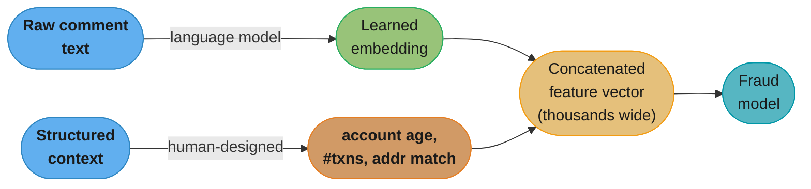
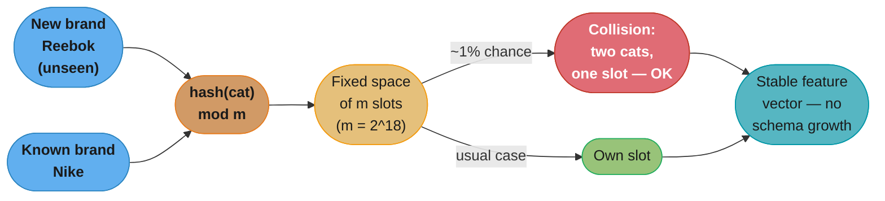
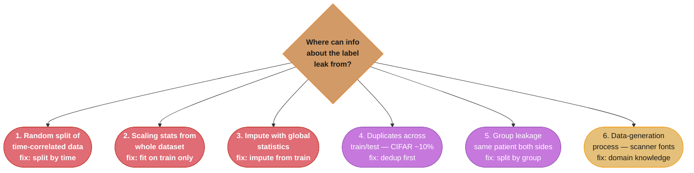
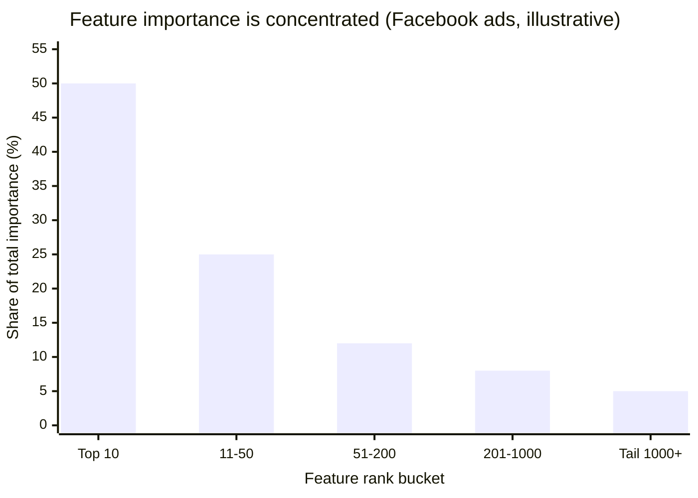
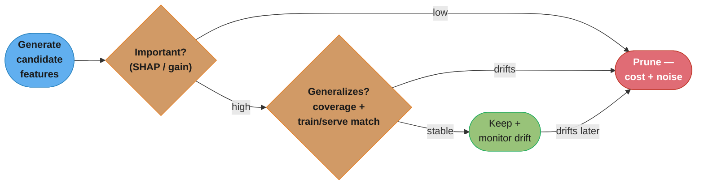
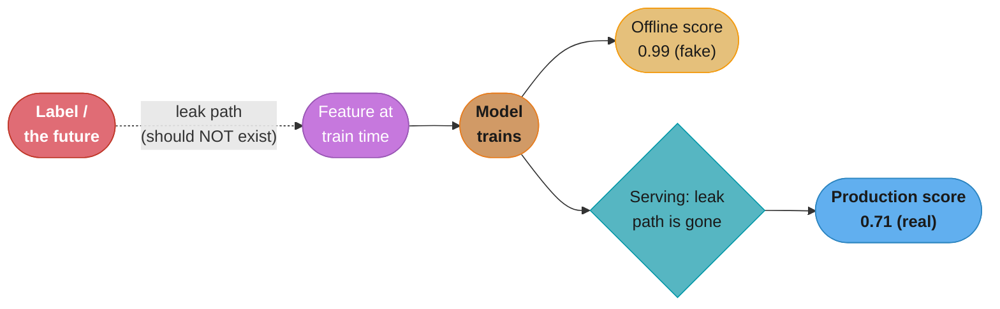

# Chapter 5: Feature Engineering

> Ch 5 of 11 · Designing Machine Learning Systems (Huyen) · builds on Ch 4 — the highest-ROI chapter: good features beat clever models, and leakage is the silent killer

## Chapter Map

If Chapter 4 was about *which examples* to train on, Chapter 5 is about *what to feed the
model about each example*. The chapter's founding claim is blunt: in industry, teams that
win rarely have a better model architecture — they have better features. Huyen quotes the
practitioner consensus that "the algorithms we use are largely the same; what differs is the
features," and notes that a mature ML system's features "routinely number in the thousands."
The chapter then does three things: catalogs the standard feature operations (missing
values, scaling, discretization, categorical encoding, crossing, positional embeddings),
devotes its longest and most important section to **data leakage** (the single most
expensive silent bug in ML), and closes with how to judge whether a feature is actually
*good* — its importance and its generalization.

**TL;DR:**
- **Features are still mostly engineered, not learned.** Deep learning automates feature
  extraction for *unstructured* data (images, text, audio), but the tabular majority of
  production systems still hand-craft features — and even DL models get a boost from good
  engineered features.
- **Data leakage is the silent killer.** Information from the label or the future sneaks
  into features, the model looks brilliant offline, then collapses in production. The
  chapter enumerates six concrete causes and how to hunt them.
- **A good feature is important *and* generalizes.** Measure importance (SHAP, built-in
  gain) to prune noise, and check generalization (coverage + train/serve distribution
  match) so a feature that helps offline still helps in production.

## The Big Question

> "I have a fixed dataset and a fixed model. Almost all of the accuracy I can still buy is
> hiding in how I represent each example as features — so which representations help, and
> how do I keep the process from quietly poisoning itself with information the model won't
> have at serving time?"

The intuition: a model is only ever as smart as the numbers you hand it. Feature
engineering is the craft of turning raw, messy, partially-missing, differently-scaled,
categorical, time-correlated data into a clean numeric matrix that exposes the signal and
hides the noise — **without accidentally exposing the answer**. That last clause is the
whole drama of the chapter. It is embarrassingly easy to build a feature that "works"
offline because it secretly encodes the target, and embarrassingly hard to notice before it
ships.

---

## 5.1 Learned Features Versus Engineered Features

The deep-learning revolution came with a seductive promise: **stop hand-crafting features —
the network learns them for you.** For a decade of computer-vision and NLP progress, this
was largely true. Before deep learning, a vision pipeline meant hand-designed feature
extractors (SIFT, HOG, edge and corner detectors, bag-of-visual-words); a text pipeline
meant hand-built n-grams, stemming, stop-word lists, part-of-speech tags, and lexicons.
Deep models collapsed those pipelines: a convolutional network learns its own edge, texture,
and object detectors from pixels, and a transformer learns its own token representations
(embeddings) from raw text. This is **representation learning** — the features are *learned*
parameters, not human artifacts.

But Huyen's warning is that this promise is **true for unstructured data and false for the
tabular majority.** Most production ML systems — fraud detection, credit scoring, ranking,
recommendation, demand forecasting, churn — run on *structured* data: user attributes,
transaction histories, counts, timestamps, categorical IDs. For that data, "features learn
themselves" simply does not hold; you still design them by hand. And even when part of the
input is unstructured, the useful systems are *hybrids*.

### The fraud-detection example

The chapter's anchoring example is a fraud/abuse model for a service where users can post
comments. The comment **text is a learned feature**: you run it through a language model
and use the resulting embedding — no human decides which words matter. But the most
predictive signals are *engineered from structured context*:

- **account age** — a two-hour-old account behaves very differently from a two-year-old one;
- **purchase history / number of prior transactions** — a first-time buyer is riskier;
- how many messages the user sent in the last hour, whether the shipping and billing
  addresses match, the ratio of upvotes to flags, and so on.

None of those "learn themselves." A human who understands the fraud domain has to decide
that "account age in hours" and "transactions in the last 24h" are the numbers worth
computing. The result is a hybrid: a handful of learned embeddings sitting next to dozens
or hundreds of engineered numeric and categorical features.

### Features number in the thousands

Huyen's operational observation: **a mature ML system's features routinely number in the
thousands.** A production model is not the tidy 4-feature toy from a tutorial; it is a wide
sparse vector assembled from many sources, many of them engineered, many of them
categorical and one-hot- or hash-encoded into thousands of columns. This is why feature
engineering is not a preliminary chore you finish once — it is a *continuous* activity that
consumes more of a working ML team's time than modeling does, and it is where most of the
remaining accuracy lives once the model choice is settled.



Caption: the fraud model is a hybrid — the comment's embedding is *learned* (green), but the
high-signal context features (account age, transaction count, address match) are
*engineered* by a human (orange); real systems concatenate both into a vector that is
routinely thousands of columns wide.

---

## 5.2 Common Feature Engineering Operations

These are the standard transformations every practitioner applies. The theme running through
all of them is that each is a small decision with a large downside if done wrong — and
several of them are *leakage sources* if applied before the train/test split (foreshadowing
5.3).

### Handling missing values

Not all missing values are missing for the same reason, and the reason dictates the fix.
This is the single most important taxonomy in the section, because a naive "just fill it
with the mean" can *destroy signal* or *inject bias*. There are three types.

- **MNAR — Missing Not At Random.** The value is missing *because of the value itself*. A
  respondent who declines to state income is disproportionately a *high* earner; the
  missingness is *informative*. Deleting these rows removes exactly the signal you care
  about, and imputing a mean erases the fact that "declined to answer" was itself
  predictive.
- **MAR — Missing At Random.** The value is missing because of *another observed variable*,
  not the value itself. In Huyen's example, respondents of a particular gender (gender A)
  tend to not disclose their age — so *age* is missing, but the cause is *gender*, a
  different, observed column. The missingness is explainable by data you have.
- **MCAR — Missing Completely At Random.** No pattern at all — the value is missing for
  reasons unrelated to any variable, observed or not (a form glitch dropped random fields).
  This is the rarest and the most benign, and also the hardest to prove; assuming MCAR
  without evidence is dangerous.

The book's buyer-example table makes the three concrete. Consider a table of home buyers
with columns for gender, age, annual income, and marital status, and some cells blank:

```
Row  Gender   Age   Income     Married   Why is a cell missing?
---  ------   ---   --------   -------   -------------------------------------------
 1    A        —     150,000    yes       age missing -> tied to Gender = A          (MAR)
 2    B        45    —          yes       income missing -> this buyer earns a lot   (MNAR)
 3    A        33    50,000     —          married missing -> random form glitch      (MCAR)
 4    B        —     80,000     no        age missing -> Gender = B usually reports  (not MAR here)

  MAR   : age blank BECAUSE of Gender (another observed column)
  MNAR  : income blank BECAUSE income is high (the value itself drives the blank)
  MCAR  : married blank for no reason related to any column
```

Caption: the type is defined by the *cause* of the blank, not the blank itself — MAR is
explained by another column (Gender), MNAR by the hidden value (high income hides itself),
and MCAR by nothing; getting the type wrong is what makes the fix wrong.

There are two families of fixes, and both have traps.

**Deletion** — remove the missing data.

- **Column deletion** — drop the whole feature if too many of its values are missing (e.g.
  a "marital status" column that's 90% empty). Simple, but you throw away the signal the
  column *did* carry for the rows that had it.
- **Row deletion** — drop examples that have a missing value. Fine *only if* the values are
  MCAR and the deleted rows are a small fraction. It is dangerous when missingness is MNAR:
  **deleting the MNAR rows biases the data**, because you are systematically removing a
  particular kind of example (the high earners who hid income), and the model learns from a
  skewed remainder. Row deletion can also silently reduce a class you're already short on.

**Imputation** — fill the missing value with something.

- Fill with a **default** (empty string, `"unknown"`), or with the **mean / median / mode**
  of the column. Median is safer than mean for skewed columns; mode is the fallback for
  categoricals.
- **The cardinal rule: never impute with a value that could be a real, valid value.** Huyen's
  example is filling a missing "number of children" with `0`. The problem: `0` is a *real*
  count — a family that genuinely has zero children is now indistinguishable from a family
  whose count is *unknown*, and the model conflates "known childless" with "we don't know."
  If you must fill, use a value the column can never legitimately take (or add a separate
  boolean "was_missing" flag so the model can learn that missingness itself is a signal).

Huyen's honest stance: **there is no perfect way to handle missing values.** Deletion loses
information and can bias; imputation injects information that may be wrong. Every choice is a
tradeoff you make with domain knowledge, and you should track which choice you made because
it becomes part of the serving contract (the same imputation must run at inference).

### Scaling

Models are sensitive to the *magnitude* of features. If "age" ranges 0–100 and "annual
income" ranges 0–1,000,000, a model that treats raw magnitudes (linear/logistic regression,
neural nets, distance-based methods like k-NN and SVM) will let income dominate purely
because its numbers are bigger — not because it's more predictive. **Feature scaling** puts
features on a comparable range. Three common forms:

- **Min-max scaling** to `[0, 1]`: `x' = (x − min) / (max − min)`. Or to an arbitrary range
  `[a, b]`; Huyen notes empirically that scaling to `[-1, 1]` often works better than
  `[0, 1]` for many models.
- **Standardization** (z-score): `x' = (x − mean) / std`, giving the feature zero mean and
  unit variance. Preferred when the feature is roughly normally distributed.
- **Log transform** for skew: many real features (income, counts, prices, view counts) have
  a long right tail. Replacing `x` with `log(x)` (or `log(1+x)`) pulls the tail in, makes
  the distribution more symmetric, and frequently improves model performance noticeably.
  Huyen flags it as one of the highest-leverage, most under-used transforms — but warns it
  is not a silver bullet and should be validated, not applied blindly.

**In plain terms.** "Min-max asks *where does this value sit between the smallest and largest
I ever saw*; standardization asks *how many standard deviations is this from typical*."

That difference decides which one survives an outlier. Min-max pins its whole output range to
two single observations (the min and the max), so one freak value compresses everything else;
standardization uses the mean and spread of *all* the data, so a freak value moves the scale
only a little.

| Symbol | What it is |
|--------|------------|
| `x` | The raw feature value for one example (one person's income) |
| `min`, `max` | Smallest and largest value of that feature **in the training split only** |
| `mean` | Average of the feature over the training split |
| `std` | Standard deviation — the typical distance of a value from the mean |
| `x'` | The rescaled value the model actually receives |
| `[a, b]` | The target range for min-max; `[0,1]` by default, `[-1,1]` often better |

**Walk one example.** Six training incomes, one of them a `1,000,000` outlier:

```
  income      min-max: (x - 30,000) / 970,000     z-score: (x - 229,166.7) / 346,896.0
  ---------   -------------------------------     ---------------------------------
     30,000            0.0000                             -0.574
     45,000            0.0155                             -0.531
     60,000            0.0309                             -0.488
     90,000            0.0619                             -0.401
    150,000            0.1237                             -0.228
  1,000,000            1.0000                             +2.222

  min-max range used by the bottom five values : 0.0000 -> 0.1237  (12.4% of the range)
  z-score   range used by the bottom five values: -0.574 -> -0.228 (a real, readable spread)
```

The single millionaire eats 87.6% of the min-max range, so the five ordinary incomes are
squeezed into a sliver the model can barely distinguish. Standardization keeps them separated
and simply marks the outlier as "+2.2 sigma." That is why min-max is for bounded, outlier-free
features and standardization is for anything with a tail.

**What this actually says.** "Take the logarithm and you turn *how many times bigger* into
*how much further along* — multiplication becomes addition, so a long right tail folds up."

Income, view counts, and prices are multiplicative quantities: the interesting step is 10x,
not +10,000. A log transform hands the model the axis the data actually lives on.

| Symbol | What it is |
|--------|------------|
| `log(x)` | Logarithm of the value; here base 10, so each `+1.0` means "10x bigger" |
| `log(1 + x)` | The variant used when `x` can be `0` — `log(0)` is undefined, `log(1+0) = 0` |
| Right skew | A distribution with a long tail of rare huge values dragging the mean up |

**Walk one example.** The same six incomes, logged and *then* min-max scaled:

```
  income      log10(x)    min-max AFTER log      min-max on RAW x (from above)
  ---------   --------    -----------------      -----------------------------
     30,000    4.4771           0.0000                    0.0000
     45,000    4.6532           0.1156                    0.0155
     60,000    4.7782           0.1977                    0.0309
     90,000    4.9542           0.3133                    0.0619
    150,000    5.1761           0.4590                    0.1237
  1,000,000    6.0000           1.0000                    1.0000

  gap between the 30k and the 150k earner:  0.4590 logged   vs   0.1237 raw
```

Logging first spreads the five ordinary earners across 46% of the range instead of 12%. The
model can now see the difference between a 30k and a 150k earner, which is the difference that
carries the signal — the millionaire is still the maximum, just no longer the whole axis.

For a count feature that can be zero, `log(x)` blows up and `log(1+x)` does not: counts
`0, 1, 5, 20, 100, 5000` become `0.0000, 0.6931, 1.7918, 3.0445, 4.6151, 8.5174` under
natural `log(1+x)` — finite everywhere, still monotone, tail still folded. That `+1` is the
whole reason the `log1p` form exists.

**Two warnings the chapter stresses:**

1. **Scaling is a leakage source.** The min, max, mean, and std you use MUST be computed on
   the **training set only**, then reused to transform validation, test, and production data.
   If you compute them over the whole dataset before splitting, statistics from the test set
   (and thus information about it) leak into training — this is leakage cause #2 in 5.3.
2. **Scaling needs retraining as distributions shift.** The training min/max/mean/std are a
   snapshot. In production, feature distributions drift (incomes rise, view counts grow),
   and yesterday's scaling parameters slowly stop matching today's data — a new value can
   fall far outside the training `[min, max]`. This is a reason models need periodic
   retraining (Ch 8–9), and a reason to store scaling statistics as versioned artifacts.

### Discretization (bucketing / binning)

**Discretization** turns a *continuous* feature into a *categorical* one by grouping values
into buckets. Annual income becomes three buckets: low (`< 35,000`), medium
(`35,000–100,000`), high (`> 100,000`). The model then sees a category, not a raw number.

When it helps:
- **Limited data.** With few examples, the model can't reliably learn a smooth function of a
  continuous variable; collapsing it into a few buckets reduces the number of distinct
  values it must reason about and can improve generalization.
- **Interpretability, especially for trees.** Buckets map cleanly onto human categories
  ("low / medium / high income") and onto tree splits, making the model easier to explain.

The cost — **boundary discontinuity.** Bucketing introduces artificial cliffs at the
category edges. With a boundary at 35,000, an income of **\$34,999 is "low"** and **\$35,000
is "medium"** — two nearly identical people land in different buckets and are treated as
categorically different, while a \$35,000 earner and a \$99,000 earner (both "medium") are
treated as identical. The model loses the smooth ordering information that the raw number
carried, and the boundary placement (why 35,000 and not 34,000?) is somewhat arbitrary.
Discretization is a bet that the interpretability/data-efficiency gain outweighs this loss.

```
income (continuous)   0 ......... 34,999 | 35,000 ......... 99,999 | 100,000 .......
bucket (discretized)  [------ low ------]|[------ medium ------]|[------ high ------]
                                          ^                        ^
                        $34,999 vs $35,000:                 $35,000 and $99,999
                        near-identical, but                 land in the SAME bucket
                        split into low vs medium            despite being far apart
```

Caption: discretization trades the raw number's smooth ordering for a few clean categories —
the price is a hard cliff at each boundary (\$34,999 vs \$35,000) and blindness to distance
*within* a bucket.

### Encoding categorical features

The naive view is that categorical features are static and small: "brand" is one of a fixed
list, "country" is one of ~200. **The production twist Huyen hammers is that categories are
NOT static** — in a real system, **new categories appear constantly.** New brands are
onboarded to a marketplace every day; new users, new products, new accounts, new URLs stream
in continuously. A model trained yesterday will, at serving time today, encounter categories
it has never seen.

**One-hot encoding fails on unseen categories.** One-hot assigns each known category its own
column. If training saw brands `{Nike, Adidas, Puma}` you get three columns; a request for a
brand-new `Reebok` matches none of them — the encoder either errors or produces an all-zeros
vector, and the model has no representation for it. You cannot enumerate a set that keeps
growing.

**The UNKNOWN-bucket problem.** The common patch is to reserve a catch-all `UNKNOWN` bucket
and map every unseen category into it. But now **every genuinely new brand is lumped together
with everything else that was unseen** — including the fraudulent, spammy, or junk
categories that also fall into `UNKNOWN`. A legitimate hot new brand gets the same encoding
as spam, so the model treats a promising new product like garbage. And the more categories
you have, the more of your serving traffic falls into this undifferentiated bucket.

**The hashing trick** is the chapter's recommended solution. Instead of a growing lookup
table, you pick a **fixed output space of size `m`** (say `m = 2^18 = 262,144` slots) and
run each category through a hash function, using `hash(category) mod m` as its index:

```
index = hash(category_string) mod m
```

Properties that make this beloved in production:
- **The output space is fixed in advance**, so a brand-new category that never appeared in
  training still maps to *some* valid slot — no UNKNOWN bucket, no all-zeros, no retraining
  the encoder. New categories are handled for free.
- **Collisions are tolerable and bounded.** Two different categories can hash to the same
  slot (a collision). This sounds bad but is usually harmless and, crucially, *bounded*: with
  a well-chosen `m`, collision rates are small — Huyen cites that with an `18`-bit space
  (`2^18` slots), even a large categorical space collides only around **1% of the time**,
  and you can trade memory for a lower rate by increasing `m`. A 1% collision that
  occasionally makes two rare brands share a slot costs far less accuracy than lumping every
  new brand into one UNKNOWN bin.
- **Locality-sensitive hashing (LSH).** If you want *similar* categories to collide
  preferentially (so a collision is between genuinely related items), you can use an LSH
  function that hashes similar inputs to nearby/same slots — turning the collision from noise
  into a mild, useful generalization.
- **Hashing is beloved in continual learning.** Because the feature space never has to grow
  or be re-fit when new categories arrive, models that retrain continuously on a stream of
  fresh data (Ch 9) can keep a *stable* feature schema. This stability is why teams doing
  online/continual learning reach for the hashing trick specifically.

**Read it like this.** "Throw every category name into a fixed row of `m` numbered boxes and
let it land wherever the hash sends it — you never add a box, so the schema can never grow."

The whole design is a trade: you give up the guarantee that each category owns a private
column, and in exchange you get a feature vector whose width is a constant you chose, not a
number the world gets to increase behind your back.

| Symbol | What it is |
|--------|------------|
| `category_string` | The raw category text, e.g. `"Reebok"` — known or brand-new, it makes no difference |
| `hash(...)` | A function turning that string into a large integer, spread evenly over its output |
| `m` | Size of the fixed output space; here `2^18 = 262,144` slots, chosen in advance |
| `mod m` | Remainder after dividing by `m` — folds any integer into `0 .. m-1` |
| `index` | The slot this category occupies in the feature vector |
| Collision | Two different categories landing on the same `index` |

**Walk one example.** Where does the "~1% collision" number come from? Hash `n = 5,000`
distinct brands into `m = 2^18 = 262,144` slots. Each brand picks a slot uniformly, so this is
the birthday problem: the expected number of *occupied* slots is `m x (1 - (1 - 1/m)^n)`, and
every brand beyond that count had to share.

```
  m = 2^18 = 262,144 slots          n = 5,000 distinct brands

  expected occupied slots = 262,144 x (1 - (1 - 1/262,144)^5000) =  4,952.6
  brands that had to share = 5,000 - 4,952.6                     =     47.4
  collision rate           = 47.4 / 5,000                        =    0.947%   <- the "~1%"

  Now vary only the number of bits (same 5,000 brands):

     bits    m           colliding brands    rate
     ----    ---------   ----------------    -------
      16        65,536         185.9          3.719%
      17       131,072          94.1          1.883%
      18       262,144          47.4          0.947%   <- Huyen's 18-bit choice
      19       524,288          23.8          0.475%
      20     1,048,576          11.9          0.238%

  Each extra bit doubles m and halves the collision rate. That is the memory-for-accuracy dial.
```

47 of 5,000 brands share a slot with someone. Those 47 get a slightly muddied representation;
the other 4,953 are unaffected — versus the UNKNOWN bucket, where *every* unseen brand shares
one slot with spam. Note what the trade actually is: 262,144 columns is far *more* than the
5,000 a one-hot encoder would use today. You are not buying a smaller vector, you are buying a
vector that is **262,144 columns tomorrow too**, no matter how many brands onboard overnight.

The `mod m` is the term doing all the work. Without it the hash output is a 64-bit integer and
you would need `2^64` columns; `mod m` is what collapses an unbounded name space onto a
bounded index space, and it is exactly the step that creates collisions. Collisions are not a
bug in the trick — they are the price of the boundedness, and the bit count is how you set it.



Caption: the hashing trick maps every category — known or brand-new — into a *fixed* space
of `m` slots, so unseen categories get a real representation instead of an UNKNOWN dump; the
price is a bounded (~1% at `2^18`) collision rate, which is cheap next to the stability it
buys continual-learning systems.

### Feature crossing

**Feature crossing** creates a new feature by *combining two or more existing features* to
capture their **interaction** — the effect that depends on the *combination* rather than
either feature alone. Huyen's example crosses **marital status** with **number of children**:
the target (say, propensity to buy a minivan) isn't a simple function of "married" plus "has
kids" — it's the *joint* state "married AND has 2 kids" that matters. `marital × children`
turns the two columns into a single categorical feature whose values are the combinations
(`single-0`, `single-1`, `married-0`, `married-2`, ...).

- **Why it helps.** It lets models that can't natively express interactions learn them.
  **Linear models** (logistic regression) are additive — they cannot represent "the effect of
  children *depends on* marital status" unless you hand them the cross. Crossing is how you
  give a linear model non-linear power. **Tree models** can find some interactions on their
  own but often learn them faster and better when the cross is provided.
- **The deep-learning note.** Modern architectures were built to learn crosses automatically:
  **DeepFM** and **xDeepFM** explicitly combine a factorization-machine component (which
  models pairwise feature interactions) with a deep network, so they capture crosses without
  the human enumerating them. This is the recommendation/CTR-prediction lineage.
- **The costs — blowup and sparsity.** Crossing multiplies cardinalities. Crossing a
  feature with 100 possible values by another with 100 values yields up to **10,000**
  possible combinations; cross three such features and you get millions of columns. This
  **feature-space blowup** brings **sparsity**: most of those combinations appear in few or
  zero training examples, so the model has almost no data to learn each cross's weight, which
  invites overfitting and demands far more data and regularization. Cross deliberately, not
  exhaustively.

### Discrete and continuous positional embeddings

This subsection addresses a subtler need that arose with transformers. A **transformer**
processes all tokens of a sequence *in parallel* through self-attention; unlike an RNN, it
has **no inherent notion of order** — "dog bites man" and "man bites dog" would look
identical to the raw attention mechanism. So position must be *added as a feature*. Two
approaches:

- **Learned positional embeddings.** Treat each position index (0, 1, 2, ...) as a
  categorical value and learn an embedding vector for each, exactly like word embeddings.
  Position 5 gets its own trainable vector. Flexible, but limited to the maximum length seen
  in training and costs parameters.
- **Fixed positional embeddings — sinusoidal / Fourier features.** Instead of learning them,
  *compute* position vectors with fixed functions — the original transformer's sinusoidal
  encoding uses sines and cosines of the position at geometrically varying frequencies, so
  each position gets a unique, smooth, deterministic vector. These **Fourier features**
  require no training, extend naturally to positions longer than those seen in training, and
  encode relative distance in a way attention can exploit.
- **The coordinate-based-input use case.** The same fixed-Fourier-feature idea generalizes
  beyond text order to any **continuous coordinate input** — e.g. representing a point's
  `(x, y)` position or a pixel/voxel coordinate. Feeding raw coordinates to a network makes
  it struggle to learn high-frequency detail; mapping the coordinate through sinusoidal
  Fourier features first lets the network represent fine spatial variation. This is why
  positional/Fourier encodings show up in vision, implicit-neural-representation, and
  coordinate-based models, not just language.

---

## 5.3 Data Leakage

This is the chapter's centerpiece and, per Huyen, the most dangerous class of bug in applied
ML. **Data leakage** is when a feature contains information about the *label* (the target)
that will **not be available at prediction time** — information "from the future" or from the
label-generation process leaks into training. The signature symptom: the model performs
*suspiciously well* on your held-out test set, everyone celebrates, it ships, and it
**fails on real production data** because in production the leaked signal is gone. Leakage is
insidious precisely because your offline metrics *reward* it — the better the leak, the
better your test score, so nothing in a standard evaluation flags the problem.

### War stories

**The COVID chest-scan study.** During the pandemic, dozens of published studies claimed to
detect COVID-19 from chest CT/X-ray images with near-perfect accuracy. When audited, almost
none generalized — the models had learned **leaked artifacts, not pathology**:
- Some keyed on the **scan position / the patient's posture**: sicker patients were more
  often scanned **lying down**, so the model learned "lying down = COVID" rather than reading
  the lungs.
- Others keyed on **which hospital/scanner produced the image** — visible as differences in
  **fonts, corner text annotations, and image borders** burned into the scan by different
  machines. Because COVID-positive and COVID-negative images came from *different sources*,
  the source markers perfectly predicted the label in the dataset — and told you nothing
  about a new patient.

The model achieved high test accuracy by cheating on cues that had nothing to do with the
disease and would not transfer to a new hospital.

**The Kaggle cancer / patient-ID leak.** In a Kaggle competition to detect cancer from
scans, teams discovered that the **patient ID** (or a proxy for it) was predictive of the
label, because the way the dataset was assembled correlated IDs with outcomes. Worse, a
single patient often had **multiple scans**, and those scans were split *across* train and
test — so the model could effectively memorize a patient in training and recognize them in
test (this is *group leakage*, cause #5 below). The leaderboard rewarded the leak; the "best"
models were the ones best at exploiting it.

### Common causes of data leakage

Huyen enumerates six concrete causes. Memorize these — they are the most-asked ML interview
material in the whole book, and each maps to a specific prevention.

**1. Splitting time-correlated data randomly instead of by time.** When data has a temporal
structure — and much of it does — a *random* train/test split lets the model see the future.
Huyen's example is stock prices: prices of different stocks on the *same day* are correlated
(the whole market moves together), so if Monday's data is split randomly, some of Monday's
examples land in train and some in test. A model trained on the train half has effectively
seen "what the market did Monday" and predicts the test half of Monday trivially — but at
real prediction time you're forecasting *tomorrow*, which no training example has seen. The
fix: **always split time-correlated data by time**, not randomly — train on days 1–N,
validate/test on days N+1 onward, so the split mirrors how the model is actually used
(predict the future from the past).

**2. Scaling / computing statistics before the split.** If you compute the mean, std, min,
or max used for scaling (or for normalization, PCA, feature selection) over the **whole
dataset** and *then* split, the training data has been transformed using statistics that
include the test set — global information about the test distribution has leaked into
training. The fix: **split first, compute all statistics on the training set only**, then
apply those frozen statistics to validation, test, and production.

**3. Imputing missing values with whole-dataset statistics.** A special, very common case of
#2. Filling missing values with the *global* mean/median/mode computed across train + test
leaks the test distribution into the imputed training values (and vice-versa). The fix:
compute imputation statistics on **training data only** and reuse them everywhere else.

**4. Duplicates that span train and test.** If the same (or near-identical) example exists in
both the training and test sets, the model can memorize it in training and "predict" it
perfectly in test — inflating the score without any real generalization. This is rampant in
public datasets: Huyen notes that **CIFAR-10 and CIFAR-100 contain roughly 10% duplicate or
near-duplicate images**, and other widely-used benchmarks have similar contamination. The
fix: **de-duplicate before splitting**, and check for near-duplicates (not just exact
matches) when data was oversampled or augmented.

**5. Group leakage.** Strongly-correlated examples that belong to the *same group* end up on
*both* sides of the split. The medical example: a single patient has **two CT scans taken
minutes apart** (or a scan plus a labeled follow-up); if one lands in train and the other in
test, the model recognizes the *patient*, not the disease. The scans aren't literal
duplicates (cause #4), but they share so much group-level information that splitting them
apart leaks. The fix: **split by group** — put *all* of a patient's (or user's, or
session's) records on the same side of the split (group-aware / grouped cross-validation).

**6. Leakage from the data-generation process.** The most insidious, because it's invisible
in the numbers — the *way the data was collected* encodes the label. This is the CT-scanner
example generalized: if COVID-positive scans came from one hospital's machine and negatives
from another's, then **machine-specific artifacts (fonts, resolution, border text) perfectly
predict the label** even though they're clinically meaningless. You **cannot detect this by
looking at the feature values alone** — it takes **domain knowledge** about how the data was
generated to realize that "which scanner" is confounded with "which diagnosis." The fix:
understand the collection pipeline, normalize away source-specific artifacts, and keep the
data-generation process (source, device, time, collection protocol) in mind when a feature
seems too good.



Caption: the six causes of leakage and their one-line fixes — the first three are
*process-order* mistakes (split before you compute anything from the data), the middle two
are *split-boundary* mistakes (duplicates and groups straddling the split), and the last is a
*collection* mistake only domain knowledge can catch.

### Detecting data leakage

Because standard metrics *reward* leakage, you need active hunting:

- **Feature-target correlation audits.** Measure each feature's correlation (or mutual
  information) with the label. A feature that is *unusually* highly correlated with the target
  deserves suspicion — ask *why* it's so predictive before trusting it. A too-good feature is
  a red flag, not a trophy.
- **Per-feature ablation studies.** Remove one feature (or a small group) and retrain; if a
  single feature's removal *collapses* performance, investigate whether it's leaking. Also
  the inverse — a feature that adds nothing is a candidate for removal (see 5.4).
- **Watch every new feature.** Whenever a new feature dramatically improves the model, treat
  the improvement as *guilty until proven innocent*: verify the feature would truly be
  available, with the same value, at real prediction time. Many leaks enter exactly here — an
  eager engineer adds a feature computed from data that only exists *after* the label is
  known.
- **Don't peek at the test set.** Keep the test set locked away; use it only for the final
  evaluation, never during feature selection, imputation, scaling, or hyperparameter tuning.
  Every time you make a modeling decision by looking at test performance, a little information
  leaks and your test score stops being an honest estimate of production performance.

### A broken-to-fixed walkthrough

```python
# BROKEN: leakage on three axes at once
from sklearn.preprocessing import StandardScaler

# (a) scale the WHOLE dataset before splitting -> test stats leak (cause #2)
X_scaled = StandardScaler().fit_transform(X)              # fit sees test rows
# (b) impute with the global median (cause #3)
X_scaled = X_scaled.fillna(X_scaled.median())             # median over train+test
# (c) random split of time-ordered data (cause #1)
X_tr, X_te, y_tr, y_te = train_test_split(X_scaled, y, shuffle=True)
#  -> test AUC = 0.99, everyone celebrates, production AUC = 0.71
```

```python
# FIXED: split first, fit every statistic on train only, split by time
# (1) split by TIME, not randomly (cause #1)
cutoff = "2026-06-01"
train = df[df.date <  cutoff]
test  = df[df.date >= cutoff]

# (2) fit imputation + scaling on TRAIN ONLY, then apply to test (causes #2, #3)
median = train[num_cols].median()          # statistics from train alone
train[num_cols] = train[num_cols].fillna(median)
test[num_cols]  = test[num_cols].fillna(median)          # reuse train's median

scaler = StandardScaler().fit(train[num_cols])           # fit on train only
train[num_cols] = scaler.transform(train[num_cols])
test[num_cols]  = scaler.transform(test[num_cols])       # reuse train's stats

# (3) dedup + group-aware split guard (causes #4, #5) done BEFORE the above
#     drop_duplicates(); GroupShuffleSplit(groups=df.patient_id)
#  -> test AUC now honestly ~0.83 and holds up in production
```

Caption: the fix is a single discipline applied everywhere — **split before you compute
anything from the data, and fit every statistic on the training partition alone** — plus
de-duplicating and group-splitting *before* the split so no example or group straddles the
boundary.

**What it means.** "AUC is the probability the model ranks a random positive above a random
negative — so `0.5` is a coin flip, and only the distance *above* `0.5` is skill."

That reframing is what makes the `0.99 -> 0.71` collapse legible. Reading it as "we lost 28
points out of 99" badly understates it; the honest denominator is the skill above chance, not
the raw score.

| Symbol | What it is |
|--------|------------|
| AUC | P(model scores a random positive higher than a random negative) |
| `0.50` | The floor — a model that ranks at random |
| `1.00` | The ceiling — every positive ranked above every negative |
| `AUC - 0.5` | The part that is actual discriminating skill |
| Test AUC `0.99` | The leaky offline score, measured with the leak intact |
| Production AUC `0.71` | The same model measured after the leak vanished at serving time |

**Walk one example.** Split each score into "chance" and "skill":

```
                         AUC     skill above chance (AUC - 0.50)
  leaky offline test     0.99            0.49
  real production        0.71            0.21
  honestly-built model   0.83            0.33

  fraction of the offline skill that was REAL  : 0.21 / 0.49 = 42.9%
  fraction that was the LEAK talking           : 0.28 / 0.49 = 57.1%

  Ranking errors (share of positive/negative pairs put in the wrong order):
      at AUC 0.99  ->   1% of pairs wrong
      at AUC 0.71  ->  29% of pairs wrong        29x more wrong orderings
```

More than half the model's apparent ability was the leak, not the model — and in production it
misorders 29x as many pairs as the test set promised. Note the last row of the comparison: the
*honestly built* model (0.83, skill 0.33) is meaningfully **better in production** than the
leaky one (0.21), which is the practical punchline. The leak did not merely inflate a number;
it caused the team to ship the weaker model, because the leaky candidate looked unbeatable
offline.

---

## 5.4 Engineering Good Features

More features are not always better. Every feature adds cost (compute, storage, latency, a
serving dependency that can break), risk (a new leakage or drift surface), and — past a point
— *hurts* the model by adding noise the model can overfit to and by slowing training. So
after generating candidate features, you *prune*. Two questions decide whether a feature
earns its place: **is it important?** and **does it generalize?**

### Feature importance

Feature importance measures how much each feature contributes to the model's predictions —
so you can drop the ones that contribute nothing and understand the ones that drive
decisions. Two main approaches:

- **Built-in importance (e.g. XGBoost "gain").** Tree ensembles expose importance directly:
  **gain** measures the total improvement in the loss (impurity reduction) contributed by
  splits on each feature across all trees. Fast and free — it comes with the trained model —
  but it is **model-specific** (only works for tree models), can be **biased** toward
  high-cardinality features, and gives you only a *global* ranking, not per-prediction
  reasoning.
- **Model-agnostic importance — SHAP (SHapley Additive exPlanations).** SHAP borrows the
  Shapley value from cooperative game theory to fairly attribute a prediction among its
  features. Its two decisive advantages: it is **model-agnostic** (works for any model —
  trees, neural nets, ensembles), and it gives importance at **two granularities** — the
  **global** contribution of each feature *across the whole dataset* AND the **local**
  contribution of each feature *to a single prediction* ("for *this* applicant, income pushed
  the score up by 0.3 and age pulled it down by 0.1"). That per-prediction attribution is
  what makes SHAP a workhorse for both feature pruning and *interpretability*.

**The Facebook-ads concentration curve.** Huyen cites Facebook's ads model: when features are
ranked by importance, **the top 10 features account for about half of the model's total
feature importance, while the bottom ~90% together contribute less than 10%.** Importance is
extremely *concentrated* — a small head of features does most of the work, and a long tail of
features contributes almost nothing. The practical lesson: measure importance, keep the
high-impact head, and aggressively prune the low-impact tail (it's mostly cost and noise).

**Put simply.** "Rank your features by importance and the curve is a cliff, not a slope —
almost all the predictive work is done by a handful, and the rest is payroll."

The reason this matters is that cost scales with the *count* of features (storage, pipelines,
latency, drift surface) while accuracy scales with their *importance share*. Those two things
are wildly out of proportion, which is exactly what makes pruning nearly free.

| Symbol | What it is |
|--------|------------|
| Feature rank | Position after sorting all features by importance, highest first |
| Importance share | This feature's contribution as a percentage of the total across all features |
| Head | The top-ranked few features that carry most of the share |
| Tail | The long run of low-rank features each contributing near zero |
| Cumulative share | Importance retained if you keep everything down to a given rank |

**Walk one example.** Take the chart's buckets and a model with 2,000 features:

```
  rank bucket   features   % of all features   importance %   cumulative features   cumulative
  -----------   --------   -----------------   ------------   -------------------   ----------
  Top 10             10          0.5%               50              10  (0.5%)          50%
  11-50              40          2.0%               25              50  (2.5%)          75%
  51-200            150          7.5%               12             200 (10.0%)          87%
  201-1000          800         40.0%                8           1,000 (50.0%)          95%
  Tail 1000+      1,000         50.0%                5           2,000 (100%)          100%

  Prune the bottom 1,000 features -> keep 95% of the importance, run 50% of the pipelines.
  Prune the bottom 1,800 features -> keep 87% of the importance, run 10% of the pipelines.
```

Ten features out of two thousand — **0.5% of the schema** — do half the work. Deleting the
entire bottom half of the feature list costs 5 points of importance share and halves everything
you have to compute, store, monitor, and keep from drifting. That asymmetry is the whole
argument for pruning, and it is why "we might need it later" is an expensive instinct.

One honest note on the chart below: its bars are labeled *illustrative*, and on those bars the
bottom 90% of features (1,800 of 2,000) sum to `8 + 5 = 13%`, slightly above the "less than
10%" the surrounding text quotes for Facebook's real curve. The shape — a steep head, a
near-flat tail — is the point; treat the bar heights as a sketch of that shape, not as
Facebook's measured numbers.



Caption: importance follows a steep head-and-long-tail curve — the top 10 features carry
~half the total, and everything past a few hundred contributes single-digit percentages, so
pruning the tail costs almost no accuracy while removing most of the cost and noise.

Beyond pruning, importance *is* interpretability: a stakeholder or regulator asking "why did
the model reject this loan?" is answered with per-prediction SHAP attributions, and a
surprising importance ranking (a feature that *shouldn't* matter dominating) is often the
first sign of leakage — closing the loop back to 5.3.

### Feature generalization

A feature can be important on your training data and still be *useless or harmful* in
production if it doesn't **generalize** — if its behavior on unseen data differs from its
behavior on training data. Huyen breaks generalization into two measurable aspects.

**1. Coverage** — the percentage of examples that *have a value* for the feature (i.e. are
not missing it). A feature present in only 1% of examples is *low coverage*. Two nuances:
- **Low coverage doesn't automatically disqualify a feature.** A feature present in just 1%
  of examples can still be *gold* if, for that 1%, it is strongly predictive — Huyen's point
  is that you weigh coverage *against* predictive power, not use coverage as a hard cutoff.
  (A rare "prior chargeback" flag might be present for 1% of users but nearly *decide* the
  fraud label for them.)
- **Coverage that *differs* across splits is a warning sign.** If a feature has 90% coverage
  in training but 20% coverage in the test/serving data, something has changed — a data
  source degraded, the population shifted, or (worse) the training coverage was inflated by a
  process that won't exist in production. **Coverage drift between train and serve is a red
  flag** that the feature won't generalize and may signal an upstream data problem.

**2. Distribution match between train and serve.** Even at full coverage, a feature
generalizes only if the *distribution of its values* is similar in training and at serving
time. Huyen's example is a **delivery-time (ETA) model that uses day-of-week** as a feature,
trained on data collected **Monday through Saturday** and then deployed to serve predictions
on **Sunday**. The model has *never seen* the "Sunday" value of the feature — Sunday traffic,
staffing, and demand patterns are outside its training distribution — so its Sunday
predictions are extrapolations it has no basis for. A feature whose train and serve value
distributions diverge won't generalize, and this is deeply tied to distribution shift
(Ch 8).

**The specificity-versus-generalization tradeoff.** More *specific* features carry more
signal but generalize worse; more *general* features carry less signal but transfer better.
Huyen's example contrasts a raw **HOUR** feature (0–23, very specific) with an engineered
**IS_RUSH_HOUR** boolean (general — true for, say, 7–9am and 4–6pm):
- `HOUR` is highly specific and can capture fine patterns, but the model must learn a
  behavior for each of the 24 values and may overfit to hour-specific quirks in the training
  window.
- `IS_RUSH_HOUR` throws away resolution but generalizes better — it captures the *robust*
  pattern ("traffic is bad during rush hour") that transfers across days and cities, and it's
  easier to learn from limited data.

The engineering choice is to pick the level of specificity that maximizes *generalizable*
signal — sometimes you keep both the raw and the derived feature and let importance/pruning
decide, sometimes you deliberately generalize a feature (bucketing, `IS_RUSH_HOUR`) to trade
peak signal for robustness.



Caption: the feature lifecycle is a two-gate filter — a feature must be *important* (survives
SHAP/gain) AND *generalize* (stable coverage and matching train/serve distribution); features
also get re-evaluated over time, because a feature that generalized at launch can drift into
uselessness and should then be removed.

---

## Visual Intuition

The hardest ideas in this chapter are (1) the anomaly of leakage — how a model can score 0.99
offline and 0.71 in production — and (2) why the hashing trick beats one-hot for open-ended
categories. Both are captured in the flowcharts within 5.2 and 5.3. The one remaining mental
model worth isolating is the **information-flow view of leakage**: leakage is any path by
which label information reaches a feature that will be *absent* at serving time.



Caption: leakage is a *phantom information channel* (dotted red) from the label into a
training feature that vanishes at serving time — the model leans on it, posts a fake-high
offline score, and then face-plants in production when the channel is gone; the whole of 5.3
is about finding and cutting that dotted edge before you ship.

---

## Key Concepts Glossary

- **Learned feature** — a representation the model extracts on its own (e.g. an image/text
  embedding); automates feature extraction for unstructured data.
- **Engineered feature** — a feature a human designs from raw/structured data (account age,
  transaction count); still dominant for tabular data.
- **Representation learning** — deep models learning their own features from raw input.
- **MNAR (Missing Not At Random)** — value missing *because of the value itself* (high
  earners hide income); missingness is informative.
- **MAR (Missing At Random)** — value missing because of *another observed variable* (gender
  A hides age); explainable by data you have.
- **MCAR (Missing Completely At Random)** — missing for no systematic reason; rarest, most
  benign.
- **Deletion (column / row)** — dropping a feature or an example to handle missing values;
  row-deleting MNAR data biases the dataset.
- **Imputation** — filling a missing value (mean/median/mode/default); never fill with a
  possibly-real value (the 0-children trap).
- **Feature scaling** — putting features on a comparable range so magnitude doesn't dominate.
- **Min-max scaling** — rescale to `[0,1]` (or `[-1,1]`, often better).
- **Standardization (z-score)** — zero mean, unit variance.
- **Log transform** — `log(x)` to tame right-skewed features.
- **Discretization (bucketing/binning)** — turning a continuous feature into categorical
  buckets; introduces boundary discontinuity (\$34,999 vs \$35,000).
- **One-hot encoding** — one binary column per known category; fails on unseen categories.
- **UNKNOWN bucket** — catch-all for unseen categories; lumps new brands with spam.
- **Hashing trick** — `hash(category) mod m` into a fixed space of `m` slots; handles new
  categories, bounded ~1% collisions at `2^18`, beloved in continual learning.
- **Locality-sensitive hashing (LSH)** — hash that maps *similar* inputs to the same slot.
- **Feature crossing** — combining features to capture interactions (marital × children);
  helps linear/tree models; DeepFM/xDeepFM learn crosses automatically; risks blowup +
  sparsity.
- **Positional embedding** — feature encoding token order for transformers (which are
  order-blind).
- **Sinusoidal / Fourier features** — fixed (non-learned) positional encodings; extend beyond
  trained length; used for coordinate-based inputs.
- **Data leakage** — a feature carrying label/future information absent at serving time;
  inflates offline scores, collapses in production.
- **Group leakage** — correlated records of the same group (patient) split across train/test.
- **Feature importance** — how much each feature contributes to predictions.
- **Gain (XGBoost)** — built-in, tree-specific importance from split impurity reduction.
- **SHAP** — model-agnostic importance giving both global and per-prediction attributions.
- **Coverage** — the fraction of examples that have a value for a feature; drift across
  splits is a warning sign.
- **Distribution match** — similarity of a feature's value distribution between train and
  serve (day-of-week Mon–Sat vs Sunday).
- **Specificity-vs-generalization tradeoff** — specific features (raw HOUR) carry more signal
  but generalize worse than general ones (IS_RUSH_HOUR).

---

## Tradeoffs & Decision Tables

| Missing-value handling | What it does | When it's right | Danger |
|------------------------|--------------|-----------------|--------|
| Column deletion | Drop the whole feature | Feature mostly empty / low value | Loses signal it carried |
| Row deletion | Drop examples with a blank | MCAR + small fraction | Biases data if MNAR; shrinks minority class |
| Mean/median/mode imputation | Fill with a summary stat | Roughly random missingness | Distorts distribution; median safer for skew |
| Default/flag imputation | Fill with sentinel + `was_missing` flag | Missingness itself is signal | Extra column; must run identically at serving |

| Categorical encoding | Handles new categories? | Space | Best for |
|----------------------|:----------------------:|-------|----------|
| One-hot | No — errors / all-zeros | Grows with cardinality | Small, fixed category sets |
| UNKNOWN bucket | Yes, but lumps all unseen together | Fixed + 1 | Rare unseen categories |
| Hashing trick | Yes, into a fixed space | Fixed `m` (e.g. `2^18`) | Open-ended, growing categories; continual learning |

| Feature-importance method | Model-agnostic? | Granularity | Cost |
|---------------------------|:---------------:|-------------|------|
| Built-in gain (XGBoost) | No (trees only) | Global ranking | Free with the model |
| SHAP | Yes (any model) | Global AND per-prediction | Higher compute |

| Generalization axis | What to check | Red flag |
|---------------------|---------------|----------|
| Coverage | % of examples with a value | Coverage differs a lot between train and serve |
| Distribution match | Value distribution train vs serve | Serve sees values train never did (Sunday) |
| Specificity | Signal vs transferability | Feature overfits train window (raw HOUR quirks) |

---

## Common Pitfalls / War Stories

- **Imputing "0" for a missing count.** Filling missing `number_of_children` with `0` makes
  a genuinely childless family indistinguishable from an unknown one — never impute with a
  value the column can legitimately take; use a sentinel or a `was_missing` flag.
- **Row-deleting MNAR data.** Dropping every row where income is blank quietly deletes the
  high earners (who hid it), biasing the model toward low earners — the missingness *was* the
  signal.
- **Scaling before the split.** Computing mean/std over train+test and then splitting leaks
  test statistics into training; the model's honest error is worse than it looks. Split
  first, fit scalers on train only.
- **Random-splitting time series.** A random split of stock/market data lets the model see
  same-day correlated examples in both halves and score near-perfectly offline, then fail
  when forecasting the genuinely-unseen future. Split by time.
- **Duplicates across splits.** Benchmarks like CIFAR-10 carry ~10% duplicates; if they land
  on both sides the model memorizes rather than generalizes — dedup (including near-dups)
  before splitting.
- **Group leakage.** Two scans of the same patient split across train/test let the model
  recognize the patient, not the disease — split by group (patient/user/session).
- **Trusting a too-good feature.** A new feature that jumps the metric is guilty until proven
  innocent — verify it will exist, with the same value, at serving time before celebrating.
  Half of leaks enter here.
- **Data-generation leakage you can't see in the numbers.** COVID models that read scanner
  fonts and patient posture instead of lungs — only domain knowledge of how the data was
  collected reveals that the source is confounded with the label.
- **Hoarding features.** Keeping hundreds of near-zero-importance features adds cost, latency,
  and drift surface while barely moving accuracy — prune to the high-importance head
  (Facebook: top 10 ≈ half the importance).
- **Forgetting features go stale.** A feature that generalized at launch drifts as
  distributions move; without re-checking importance/coverage over time, stale features
  silently drag the model down (ties to Ch 8–9).

---

## Real-World Systems Referenced

- **Deep learning / representation learning** — CNNs and transformers replacing hand-built
  vision (SIFT, HOG) and NLP (n-grams, stemming) feature pipelines.
- **Language-model embeddings** — the "learned feature" for the comment text in the fraud
  example.
- **XGBoost** — built-in "gain" feature importance for tree ensembles.
- **SHAP** — model-agnostic, global-plus-local feature attribution.
- **DeepFM / xDeepFM** — architectures that learn feature crosses automatically (CTR /
  recommendation).
- **Transformer positional encodings** — learned vs fixed sinusoidal (Fourier) features.
- **CIFAR-10 / CIFAR-100** — public benchmarks with ~10% duplicate images (leakage cause #4).
- **COVID chest-scan studies / Kaggle cancer competition** — the leakage war stories
  (scanner artifacts, patient posture, patient-ID and cross-split scans).
- **Facebook ads model** — the "top 10 features ≈ half of total importance" concentration
  observation.

---

## Summary

Feature engineering is where most production ML accuracy is won or lost, because teams share
roughly the same models but differ in their features — and a mature system's features number
in the **thousands**. Deep learning learns features for **unstructured** data (image and text
embeddings), but the **structured/tabular majority** of systems still hand-engineer their
best signals, and the strongest systems are hybrids (the fraud model pairs a learned comment
embedding with engineered account-age and transaction features).

The standard operations each carry a specific trap. **Missing values** must be handled by
their *type* — MNAR (the value hides itself), MAR (another column explains it), MCAR (no
pattern) — because row-deleting MNAR data biases the set and imputing with a real value (0
children) destroys information; there is no perfect answer. **Scaling** (min-max,
standardization, log-for-skew) is a *leakage source* and must be fit on train only.
**Discretization** buys interpretability and data-efficiency at the cost of boundary
discontinuities (\$34,999 vs \$35,000). **Categorical encoding** must cope with categories
that are *never static* — one-hot breaks on unseen values and the UNKNOWN bucket lumps new
brands with spam, so the **hashing trick** (fixed space, bounded ~1% collisions, beloved in
continual learning) wins. **Feature crossing** gives linear/tree models interactions
(marital × children) at the risk of blowup and sparsity, while DeepFM/xDeepFM learn crosses
automatically. **Positional/Fourier features** hand transformers the order they lack.

The chapter's centerpiece is **data leakage** — label information sneaking into features that
won't exist at serving time, which inflates offline scores and collapses in production. The
six causes: random-splitting time-correlated data, computing scaling statistics before the
split, imputing with whole-dataset statistics, duplicates across splits (CIFAR ~10%), group
leakage (same patient both sides), and leakage baked into the data-generation process
(scanner fonts). You detect it with correlation audits, ablation, suspicion of any too-good
new feature, and never peeking at the test set. Finally, a **good feature** must be
**important** (measure with SHAP or built-in gain; importance is concentrated — Facebook's
top 10 ≈ half the total, so prune the tail) and must **generalize** — adequate coverage
(without coverage drift between train and serve) and a matching train/serve distribution (the
Mon–Sat model that fails on Sunday) — trading specificity for generalization where robustness
matters (IS_RUSH_HOUR vs raw HOUR).

**The book's best-practice checklist for feature engineering:**
- **Split your data by time** into train/valid/test whenever the data is time-correlated —
  don't split randomly.
- If you **oversample**, do it **after** splitting (never before — it leaks copies across the
  split).
- **Scale and normalize after** splitting, fitting the statistics on the **training split
  only**, to avoid leakage.
- **Impute** missing values using **training-split statistics only**, and never with a value
  the column could legitimately hold.
- Use **domain knowledge** to reason about how data was generated and to hunt for leakage the
  numbers can't reveal.
- **Dedup and split by group** so no example or group straddles train and test.
- **Remove features that are no longer useful** (low importance) or that no longer generalize
  (coverage/distribution drift) — features go stale as the world moves.
- **Measure feature importance and generalization** continuously, and keep the process
  running: feature engineering is iterative, not one-and-done.

---

## Interview Questions

**Q: What is data leakage, and why does it make a model look great offline but fail in production?**
Data leakage is when a feature carries information about the label that won't be available at prediction time, so the model relies on a signal that vanishes in production. Offline it scores suspiciously high because the leaked feature effectively encodes the answer; in production the leak is gone and accuracy collapses. It's insidious because standard evaluation *rewards* the leak — the better the leak, the better your test score — so nothing flags it. You hunt it with correlation audits, ablation, and skepticism toward any too-good new feature.

**Q: What are the six common causes of data leakage in Huyen's chapter?**
They are: (1) splitting time-correlated data randomly instead of by time, (2) computing scaling/statistics over the whole dataset before splitting, (3) imputing missing values with whole-dataset statistics, (4) duplicates spanning train and test, (5) group leakage where the same group's records straddle the split, and (6) leakage from the data-generation process. The first three are process-order mistakes (split before computing anything), the middle two are split-boundary mistakes, and the last needs domain knowledge to catch.

**Q: Why must you split time-correlated data by time instead of randomly?**
Because a random split lets the model see the future, since same-time examples are correlated and land on both sides. Huyen's example is stock prices: prices across stocks on the same day move together, so a random split puts some of Monday in train and some in test, and the model trivially "predicts" the test half from the train half — yet in production it must forecast a genuinely unseen future day. Splitting by time (train on days 1–N, test on N+1 onward) mirrors real use and removes the leak.

**Q: What is the difference between MNAR, MAR, and MCAR missing values?**
MNAR (Missing Not At Random) means the value is missing because of the value itself — high earners decline to state income, so the blank is informative. MAR (Missing At Random) means it's missing due to another observed variable — one gender tends not to report age, so age is blank because of gender. MCAR (Missing Completely At Random) means no systematic reason at all — a random form glitch. The type matters because it dictates whether deletion biases the data and whether imputation destroys signal.

**Q: Why is deleting rows with missing values dangerous when the data is MNAR?**
Because deleting MNAR rows systematically removes a specific kind of example and biases the dataset. If income is missing precisely because the earner is high-income (MNAR), row-deletion strips out the high earners, and the model learns from a skewed low-income remainder — the missingness *was* the signal you just threw away. Row deletion is only safe for MCAR data and a small fraction of rows; otherwise it distorts the distribution the model learns.

**Q: Why should you never impute a missing value with a value the column could really take, like 0 children?**
Because it makes a genuinely-valid case indistinguishable from an unknown one. Filling a missing "number of children" with 0 means a family that truly has zero children looks identical to a family whose count you simply don't know, and the model conflates "known childless" with "missing." If you must fill, use a value the column can never legitimately hold, or add a separate `was_missing` boolean so the model can learn that missingness itself is predictive.

**Q: Why is scaling a source of data leakage, and how do you prevent it?**
Because the min, max, mean, and std used to scale must be computed on the training set only; computing them over the whole dataset before splitting leaks test-set information into training. The fix is to split first, fit the scaling statistics on the training partition alone, then apply those frozen statistics to validation, test, and production. The same rule covers imputation, normalization, PCA, and feature selection — any statistic learned from the data must come from train only.

**Q: What is group leakage, and how do you prevent it?**
Group leakage is when strongly-correlated records of the same group end up on both sides of the split. Huyen's example is two CT scans of the same patient taken minutes apart landing one in train and one in test — the model recognizes the patient, not the disease, so it looks accurate but doesn't generalize. The scans aren't literal duplicates; they just share group-level information. The fix is a group-aware split that keeps all of a patient's (or user's) records on the same side.

**Q: Why does one-hot encoding fail in production, and what problem does the UNKNOWN bucket introduce?**
One-hot fails because categories aren't static — new brands, users, and products appear daily, and a category unseen in training matches no column, producing an all-zeros vector the model can't represent. The common patch, an UNKNOWN catch-all bucket, then lumps every genuinely-new category together with all other unseen junk, including spam and fraud — so a promising new brand gets the same encoding as garbage. The more categories you have, the more serving traffic drowns in that undifferentiated bucket.

**Q: How does the hashing trick work, and why is it beloved in continual learning?**
The hashing trick maps each category through a hash function into a fixed space of `m` slots via `hash(category) mod m`, so the feature schema never grows. It's beloved in continual learning because a brand-new category still lands in a valid slot without re-fitting the encoder or growing the vector, letting a continuously-retraining model keep a stable feature schema. Collisions (two categories sharing a slot) are tolerable and bounded — roughly 1% at an 18-bit (`2^18`) space — far cheaper than dumping all new categories into one UNKNOWN bin.

**Q: What is feature crossing, when does it help, and what does it cost?**
Feature crossing combines two or more features to capture their interaction — like crossing marital status with number of children, where the joint state predicts behavior neither column captures alone. It especially helps linear models, which are additive and can't otherwise express interactions, and it speeds trees; DeepFM and xDeepFM learn crosses automatically. The cost is a feature-space blowup — crossing two 100-value features yields up to 10,000 combinations — and resulting sparsity, since most combinations have few examples, inviting overfitting.

**Q: What is the difference between XGBoost's built-in gain importance and SHAP?**
Built-in gain measures the total loss/impurity reduction from splits on each feature; it's free with a tree model but model-specific, can be biased toward high-cardinality features, and only gives a global ranking. SHAP is model-agnostic (works for any model) and provides importance at two granularities — the global contribution across the dataset AND the local contribution to each individual prediction. That per-prediction attribution is what makes SHAP a workhorse for both pruning features and explaining single decisions.

**Q: What does the Facebook-ads importance curve teach about pruning features?**
It shows that feature importance is highly concentrated — the top 10 features account for about half of the model's total importance, while the long tail of features contributes single-digit percentages. The lesson is to measure importance and aggressively prune the low-impact tail, which costs almost no accuracy while removing compute, storage, latency, and drift surface. More features are not better past the high-impact head; the tail is mostly cost and noise.

**Q: What are the two aspects of feature generalization?**
Coverage — the fraction of examples that actually have a value for the feature — and distribution match between train and serve. Low coverage doesn't disqualify a feature (a 1%-coverage feature can be gold if strongly predictive for that 1%), but coverage that *differs* between train and serve is a red flag. Distribution match means the feature's value distribution must be similar at training and serving time; a feature the serving data pushes outside its trained range won't generalize.

**Q: Explain the day-of-week ETA example of a distribution mismatch.**
A delivery-time model uses day-of-week as a feature but is trained only on Monday-through-Saturday data, then deployed to serve predictions on Sunday. The model has never seen the "Sunday" value, so its Sunday predictions are extrapolations with no training basis — Sunday's traffic, staffing, and demand patterns lie outside the training distribution. It illustrates that even a full-coverage feature fails to generalize when its serve-time value distribution diverges from what training saw, which ties directly to distribution shift in Chapter 8.

**Q: What is the specificity-versus-generalization tradeoff, with the IS_RUSH_HOUR example?**
More specific features carry more signal but generalize worse, while more general features carry less signal but transfer better. A raw HOUR feature (0–23) is specific and can capture fine patterns but forces the model to learn 24 behaviors and may overfit hour-specific quirks in the training window. An engineered IS_RUSH_HOUR boolean throws away resolution but captures the robust, transferable pattern ("traffic is bad at rush hour") that generalizes across days and cities and is easier to learn from limited data.

**Q: Are features learned or engineered — and why does the fraud example matter?**
Deep learning learns features for unstructured data (image and text embeddings), but the structured/tabular majority of production systems still engineer their best features by hand. The fraud example is the proof: the comment text is a *learned* embedding, but the highest-signal features — account age, number of prior transactions, address match — are *engineered* by a human who understands the domain. Real systems are hybrids that concatenate learned and engineered features into a vector routinely thousands of columns wide.

**Q: When is discretization worth its boundary-discontinuity cost?**
It's worth it with limited data or when interpretability (especially for trees) matters more than the raw number's precision. Bucketing a continuous value into a few categories reduces distinct values the model must reason about, improving generalization when data is scarce, and maps cleanly onto human categories and tree splits. The cost is a hard cliff at each boundary — \$34,999 is "low" and \$35,000 is "medium" though nearly identical, while \$35,000 and \$99,999 share the "medium" bucket — losing the smooth ordering the raw number carried.

**Q: Why do transformers need positional embeddings, and what's the difference between learned and sinusoidal ones?**
Transformers process all tokens in parallel through self-attention and have no inherent notion of order, so "dog bites man" and "man bites dog" look identical without position added as a feature. Learned positional embeddings treat each position index as a category with its own trainable vector — flexible but capped at the trained length. Fixed sinusoidal (Fourier) features compute position vectors from sines and cosines at varying frequencies, need no training, extend beyond the trained length, and generalize to continuous coordinate inputs like spatial positions.

**Q: What log transform and scaling options exist, and which distributions suit each?**
Min-max scaling rescales to a fixed range like [0,1] (Huyen notes [-1,1] often works better); standardization gives zero mean and unit variance and suits roughly normal features; and a log transform (`log(x)` or `log(1+x)`) tames right-skewed features like income, counts, and prices by pulling in the long tail. Log transform is a high-leverage, under-used move but not a silver bullet — validate it. All scaling statistics must be fit on the training set only and re-derived periodically as distributions drift.

**Q: How do you detect data leakage before it ships?**
Audit each feature's correlation or mutual information with the label and treat an unusually high value as suspicious rather than a trophy; run per-feature ablation to see if one feature's removal collapses performance; scrutinize every new feature that dramatically improves the model, verifying it will truly exist with the same value at serving time; and never peek at the test set — lock it away for final evaluation only. Any modeling decision made by looking at test performance leaks information and corrupts your honest estimate.

**Q: Should you oversample before or after splitting the data, and why?**
After splitting — always. Oversampling before the split copies minority examples that can then land in both train and test, so the model memorizes examples it will also be tested on, inflating the score. Doing it after the split (on the training partition only) keeps the test set clean and honest. This is a specific case of the general leakage discipline: split first, then apply any transformation, imputation, scaling, or resampling using training data alone.

---

## Cross-links in this repo

- [ml/feature_engineering/ — the repo's deep dive on feature operations, encoding, and stores](../../../ml/feature_engineering/README.md)
- [ml/imbalanced_data_and_leakage_traps/ — leakage causes, group splits, and class imbalance](../../../ml/imbalanced_data_and_leakage_traps/README.md)
- [ml/interpretability_and_explainability/ — SHAP, feature importance, and per-prediction attribution](../../../ml/interpretability_and_explainability/README.md)
- [Ch 4: Training Data — sampling, labeling, class imbalance (this chapter's predecessor)](../04_training_data/README.md)
- [Ch 10: Infrastructure and Tooling for MLOps — feature stores that serve engineered features](../10_infrastructure_and_tooling_for_mlops/README.md)

## Further Reading

- Huyen, *Designing Machine Learning Systems*, Ch 5 — original text and references.
- Lundberg & Lee, "A Unified Approach to Interpreting Model Predictions," 2017 — the SHAP paper.
- Guo et al., "DeepFM: A Factorization-Machine based Neural Network for CTR Prediction," 2017.
- Lian et al., "xDeepFM: Combining Explicit and Implicit Feature Interactions for Recommender Systems," 2018.
- Vaswani et al., "Attention Is All You Need," 2017 — sinusoidal positional encodings.
- Roberts et al., "Common pitfalls and recommendations for using machine learning to detect and prognosticate for COVID-19 using chest radiographs and CT scans," 2021 — the chest-scan leakage audit.
