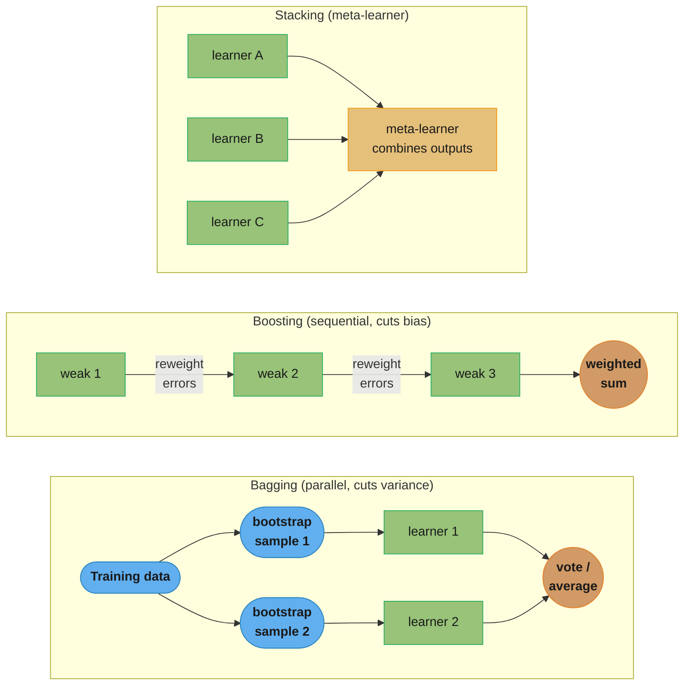
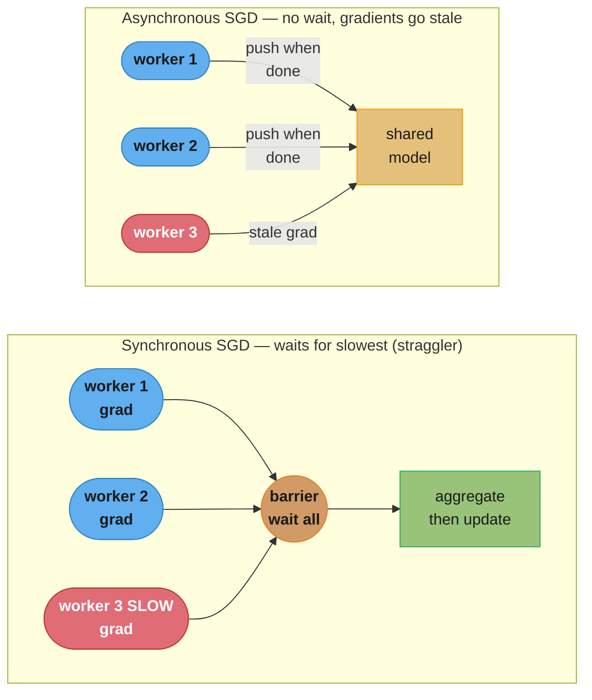
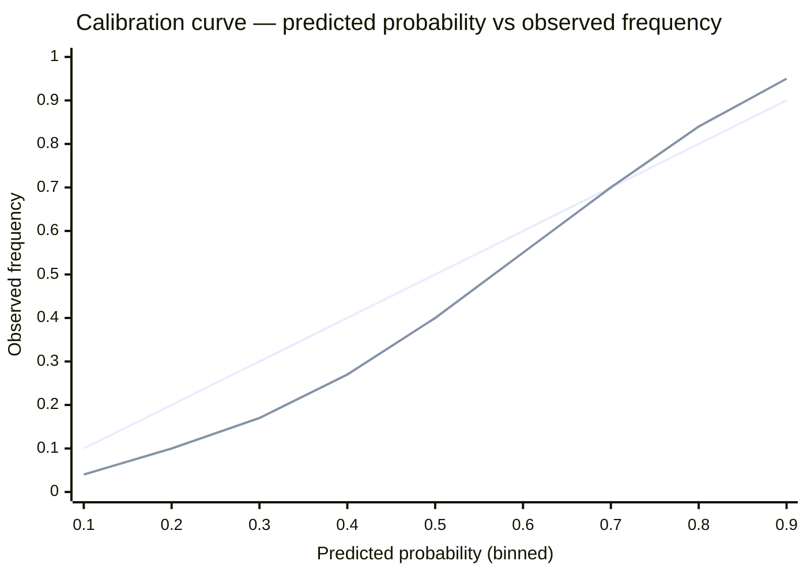

# Chapter 6: Model Development and Offline Evaluation

> Ch 6 of 11 · Designing Machine Learning Systems (Huyen) · builds on Ch 4–5 — picking, training, tracking, and honestly evaluating models before they ship

## Chapter Map

Chapters 4–5 produced the raw material: sampled and labeled **training data** (Ch 4) and
engineered **features** (Ch 5). Chapter 6 is where you finally reach for the part everyone
thinks ML is about — the model — and Huyen's whole point is to talk you *down* from that
excitement. Model development is not "grab the state-of-the-art architecture and tune it." It
is a disciplined loop of picking a model appropriate to your data, latency budget, and team;
training it (possibly across many machines); tracking every experiment so results are
reproducible; and then evaluating it **offline** with methods far more searching than a single
accuracy number — before it is ever exposed to a live user in Ch 7.

**TL;DR:**
- **Pick the simplest model that works, not the flashiest.** The state-of-the-art trap, human
  bias in comparisons, and complexity creep (a one-way door) all push toward humbler baselines
  first; SOTA on a public benchmark rarely means best on *your* data under *your* latency budget.
- **Ensembles** genuinely improve accuracy — three uncorrelated 70%-accurate classifiers vote to
  78.4% — but their production cost (latency, complexity, maintenance) is why only tree ensembles
  routinely ship. Bagging reduces variance, boosting reduces bias, stacking learns a meta-model.
- **Track everything and version everything.** Reproducibility is the goal but full determinism is
  elusive (hardware, nondeterministic ops); data versioning is genuinely *harder* than code
  versioning (diffs are meaningless, data dwarfs code, GDPR fights immutability).
- **Offline evaluation is more than accuracy.** A model needs **baselines** to be interpretable at
  all (90% accuracy can be *worse* than always-predict-majority), and it needs perturbation,
  invariance, directional-expectation, calibration, confidence, and **slice-based** tests —
  because overall metrics hide subgroup failures and **Simpson's paradox** can flip the winner.

## The Big Question

> "I finally get to build the model. Which one do I pick, how do I train it at scale, and — the
> part everyone skips — how do I know it's actually *good* before real users find out for me?"

Analogy: choosing and shipping a model is like hiring. The résumé (a benchmark leaderboard score)
tells you how someone did on *someone else's* problem under *someone else's* conditions. It is a
weak predictor of how they'll do on *your* team, with *your* data, under *your* deadlines. So you
run your own trials (offline evaluation), you check them on the specific hard cases you care about
(slice-based evaluation), and you never confuse "impressive on paper" with "the right fit here."
The chapter's arc: resist the shiny thing, measure honestly, and distrust any single number.

---

## 6.1 Model Development and Training

Two sub-topics: how to **evaluate candidate models** to choose one (six selection tips), and how
**ensembles** combine models — with the arithmetic that explains why they work and the production
cost that explains why they usually don't ship.

### Evaluating ML models — the six selection tips

There is no algorithm for "pick the best model." The space of models is enormous and constantly
churning, and the right choice depends on your data, task, constraints (latency, compute,
interpretability), and even your team's familiarity. Huyen offers six tips to guide the choice —
each a correction to a common instinct.

**Tip 1 — Avoid the state-of-the-art trap.**
Researchers evaluate SOTA on *specific, static, academic benchmarks* (ImageNet, GLUE, SQuAD).
"State-of-the-art on benchmark X" means "best on that benchmark's data under that benchmark's
metric" — it does **not** mean best on *your* data, best under *your* latency budget, or even
cheap enough to run. A newer, more complex model that edges out the leaderboard is often slower,
larger, harder to deploy, and no better (or worse) on your distribution. The right question is
never "is this the newest, best-performing model?" but "does this model **solve my problem** —
accurately enough, cheaply enough, fast enough, maintainably enough?" Sometimes the answer to your
problem isn't ML at all.

**Tip 2 — Start with the simplest models.**
Occam's razor for ML: the simplest model that does the job is usually the best first choice, for
three reasons.
- **Deploy-ability first.** A simple model is easier to deploy, and deploying early lets you
  validate that your *whole pipeline* (data → feature → predict → serve) works end-to-end before
  you sink time into a fancier model. Deploying is itself the hard part; do it with something
  simple.
- **Baseline value.** A simple model is a baseline to compare more complex models against. Without
  it, you can't tell whether the complex model's extra accuracy is worth its extra cost.
- **Complexity creep is a one-way door.** Simple-to-complex is a natural, incremental path; the
  reverse — ripping out complexity you added — rarely happens, so added complexity tends to stay
  forever. Adding it later, deliberately, is far cheaper than removing it.

Crucial subtlety: **"simplest" ≠ "least effort."** BERT is a *complex* model, but calling it from a
pretrained library is *low effort*. Low effort to build is not the same as simple to reason about,
deploy, debug, and maintain. When two options are comparably easy to stand up, prefer the one that
is genuinely simpler in its moving parts — you'll pay the complexity tax every day it's in
production, not just on the day you build it.

**Tip 3 — Avoid human biases in selecting models.**
An engineer excited about a particular architecture will (often unconsciously) spend more time
tuning it, run more experiments on it, and give it a fairer shake than the architectures they're
less attached to. When you then compare, you're comparing a *well-tuned favorite* against
*under-tuned alternatives* — not the architectures themselves. To compare fairly, evaluate each
candidate under an **equal tuning budget** (equal experiments, equal search, equal effort). The
comparison is only meaningful when every model got the same chance to shine.

**Tip 4 — Evaluate good performance now versus good performance later.**
The best model *today* isn't always the best model in two months. A model that's slightly worse now
but improves faster as data grows can overtake a model that's better now but plateaus. **Learning
curves** — a plot of a performance metric against the amount of training data — make this visible:
they show whether more data would still help, and let you extrapolate which model wins once you
have the data you *expect to* accumulate. A simple model that's already near its ceiling may lose to
a neural net that's still climbing. Account for the trajectory, not just the current point.

**Tip 5 — Evaluate tradeoffs.**
Every model choice is a set of tradeoffs, and you must know which axis matters for *your* problem.
- **False positives vs false negatives.** Their costs are rarely symmetric. **Fingerprint unlock:**
  a false positive (unlock for the wrong person) is a security breach — you tune to minimize false
  positives even at the cost of more false negatives (occasionally rejecting the right person, who
  just tries again). **COVID screening:** a false negative (miss a real case) lets an infected
  person spread the disease — you tune to minimize false negatives even at the cost of more false
  positives (flag healthy people, who get a follow-up test). Same confusion matrix, opposite tuning.
- **Accuracy vs latency / compute.** A 1% accuracy gain that triples inference cost or latency is
  usually a bad trade for an online service; for an offline batch job it might be fine.
- **Accuracy vs interpretability.** A gradient-boosted forest may beat a logistic regression on
  accuracy, but in regulated domains (credit, healthcare) you may *need* to explain each decision —
  and a slightly-less-accurate interpretable model wins.

**Tip 6 — Understand your model's assumptions.**
Every model encodes assumptions about the data; the model is only as good as how well its
assumptions match reality. Know them:
- **IID** — most supervised learners assume examples are **independent and identically
  distributed**, drawn from the same distribution. Time series and networked data violate
  independence.
- **Smoothness** — the assumption that a small change in input produces a small change in output
  (the function is smooth); it underlies most supervised learning.
- **Tractability** — generative models assume computing the probability P(Z|X) (latent from input)
  is tractable.
- **Boundary shape** — a linear classifier assumes the classes are separable by a **linear**
  boundary; a nonlinear model doesn't. If your true decision boundary is curved, a linear model
  can never fit it no matter how much you tune. Match the model family's expressible boundaries to
  the geometry of your problem.

### Ensembles

An **ensemble** combines multiple models (the "base learners") into one prediction. Ensembles
consistently top ML competitions (the winning Netflix Prize and most Kaggle winners are ensembles)
because combining several decent models usually beats any single one. Yet ensembles are **less
favored in production** — they're harder to deploy, harder to maintain, and multiply inference
latency and cost — with the notable exception of **tree-based ensembles** (random forests,
gradient-boosted trees), which are compact and fast enough to ship routinely.

**Why ensembles work — the correctness arithmetic.**
Imagine three classifiers, each **70% accurate** and — this is the load-bearing assumption —
making **uncorrelated** errors. Take the **majority vote** of the three. The ensemble is correct
whenever at least two of the three are correct:

```
P(all 3 correct)       = 0.7 × 0.7 × 0.7                     = 0.343
P(exactly 2 correct)   = C(3,2) × 0.7² × 0.3 = 3 × 0.49 × 0.3 = 0.441
P(majority correct)    = 0.343 + 0.441                        = 0.784   → 78.4%
```

Three 70%-accurate models vote to **78.4%** — an 8.4-point lift for free. But the whole effect
hinges on the errors being **uncorrelated**: if all three make the *same* mistakes, the majority
vote just reproduces those mistakes and you gain nothing. This is why ensembles work best with
**diverse** base learners (different algorithms, different features, different data subsets) —
diversity is what decorrelates the errors.

| # correct (of 3) | Majority vote | Probability | Ensemble right? |
|:--:|:--:|:--:|:--:|
| 3 | correct | 0.343 | ✓ |
| 2 | correct | 0.441 | ✓ |
| 1 | wrong | 0.189 | ✗ |
| 0 | wrong | 0.027 | ✗ |
| **Total right** | | **0.784** | **78.4% vs 70% single** |

(0.189 = C(3,1)×0.7×0.3² = 3×0.7×0.09; 0.027 = 0.3³; the four rows sum to 1.0.)

There are **three flavors** of ensemble, differing in how base learners are created and combined:

**Bagging (bootstrap aggregating) — reduces variance.**
Sample the training data *with replacement* (bootstrap) to create many different training sets,
train one base learner on each **in parallel**, then aggregate: **majority vote** for
classification, **average** for regression. Because each learner sees a slightly different sample,
their errors decorrelate, and averaging cancels the variance. Bagging shines with **high-variance,
low-bias** learners (deep decision trees). The **random forest** is bagging over decision trees,
with the extra twist that each split considers only a random subset of features (further
decorrelating the trees).

**Boosting — reduces bias.**
Train base learners **sequentially**, each one focusing on the examples the previous learners got
**wrong**: after each round, misclassified examples are **reweighted** (given more weight) so the
next weak learner concentrates on the hard cases. The final prediction is a weighted combination of
all learners. Boosting converts a family of **weak** learners (each barely better than chance) into
a **strong** one, reducing bias. **AdaBoost** was the classic; **gradient boosting machines
(GBM)** — and their fast implementations **XGBoost** and **LightGBM** — are the workhorses that win
most tabular-data competitions.

**Stacking — a meta-learner over base outputs.**
Train several **different** base learners on the training data, then train a **meta-learner** (the
"stacker" / blender) that takes the base learners' *outputs* as its input features and learns how
to best combine them. Instead of a fixed rule (vote/average), stacking *learns* the combination —
e.g. "trust the neural net when it's confident, fall back to the gradient-boosted tree otherwise."
The meta-learner is usually simple (logistic regression) to avoid overfitting the base outputs.



Caption: bagging trains diverse learners in parallel and averages away their variance; boosting
chains weak learners that each fix the last one's mistakes to cut bias; stacking learns — rather
than hard-codes — how to combine base outputs. Tree ensembles (random forest = bagging, XGBoost =
boosting) are the only flavors compact and fast enough to ship in most production systems.

---

## 6.2 Experiment Tracking and Versioning

During training you run many experiments, tweaking architecture, hyperparameters, features, and
data. Two disciplines keep this from becoming an untraceable mess: **experiment tracking** (the
process of tracking the progress and results of each experiment) and **versioning** (recording all
the details — code and data — that produced a model so it can be **reproduced**). Many tools do
both (**MLflow**, **Weights & Biases**); the pragmatic stance is **"track everything you can"** —
storage is cheap, and you never know which detail you'll need to explain a result six weeks later.

**What to track.** Huyen's list of things worth logging for each experiment:
- **Loss curve** — training loss and (crucially) validation/eval loss over time; the shape reveals
  underfitting, overfitting, and whether training has converged.
- **Model performance metrics** on all non-training splits — accuracy, F1, perplexity, etc.
- **Speed / throughput** — steps per second, tokens per second — because a model's *speed* is a
  first-class deployment concern, not an afterthought.
- **System performance** — memory usage, CPU/GPU utilization — to catch resource problems early.
- **Values that change during training** — the **norm of the gradients** (spikes signal
  instability / exploding gradients) and the **norm of the weights/parameters** (drift signals
  problems), plus the learning rate.
- **A sample of predictions vs ground truth** — actual outputs on a fixed set of examples, so you
  can *eyeball* what the model is getting wrong, not just read a scalar metric.
- **The full configuration** — hyperparameters, the exact code, the data used.

Aggressive tracking directly serves **reproducibility** — but Huyen is honest that **full
determinism is elusive.** Even with the same code, data, and config, results can differ run to run
because of different hardware, nondeterministic operations (some GPU kernels, e.g. certain
`atomicAdd`-based reductions, are nondeterministic for speed), unseeded randomness, and framework
version drift. You track everything you can *and* accept that perfect bit-for-bit reproducibility
may be out of reach; the goal is *enough* reproducibility to explain and defend a result.

### Versioning — and why data versioning is hard

You must version both **code** and **data**. Code versioning is a solved problem (Git). **Data
versioning is genuinely harder**, for reasons that break the Git model:

- **Data dwarfs code.** A codebase is megabytes; a dataset can be terabytes. You can't just check a
  10 TB dataset into Git and clone it onto every developer's laptop, so data versioning tools have
  to store data separately and version *pointers/checksums* to it.
- **Diffs are meaningless.** A `git diff` of source code is human-readable and reviewable. A diff of
  two binary dataset versions (or a shuffled CSV) is noise — line-by-line diffing doesn't tell you
  what *meaningfully* changed. There's no agreed way to show "what changed" between data versions.
- **Checksum granularity is unresolved.** Do you compute a checksum over the *entire* dataset, over
  each *file*, or over each *example/row*? Coarse checksums miss small changes; fine-grained
  checksums explode in number and cost. There's no consensus on the right granularity.
- **Privacy and regulation fight immutability.** Version control wants **immutable** history — once
  a version exists, it never changes. **GDPR (and similar laws) grant a right to deletion**: a user
  can demand their data be erased. That directly contradicts "keep every version forever, immutable"
  — you may be legally required to *mutate* history and expunge a person's records from all versions.
  This tension has no clean technical answer yet.

**DVC (Data Version Control)** is the tool Huyen names for data versioning: it works alongside Git,
storing large data in external storage and versioning lightweight metadata/checksums in the repo,
so you can tie a model version to the exact data version that produced it.

---

## 6.3 Distributed Training

Models and datasets have outgrown a single machine, so you often must train across many
accelerators. There are three parallelism strategies — and real large-scale training combines all
three.

### Data parallelism

The most common strategy: **replicate the whole model on every machine, split the data across
them**, and each machine computes gradients on its shard of the batch. The gradients are then
**aggregated** (summed/averaged) to update the model, and the updated weights are broadcast back.
The central question is *how* you synchronize the gradient aggregation, and there are two answers.

**Synchronous SGD (SSGD).** All workers finish their batch, then their gradients are aggregated in
lockstep before the next step begins. The result is mathematically clean (equivalent to one big
batch), but it suffers from the **straggler problem**: the whole step waits for the *slowest*
worker on every iteration, so one slow or preempted machine throttles the entire cluster. As you
add more machines, the chance that *some* machine is slow rises, so stragglers get worse with scale.

**Asynchronous SGD (ASGD).** Each worker sends its gradient to update the shared model *whenever it
finishes*, without waiting for the others, and pulls the latest weights to continue. No stragglers —
but it introduces **gradient staleness**: by the time a worker's gradient is applied, other workers
have already updated the model, so the gradient was computed against *stale* weights and points in
a slightly wrong direction. In theory staleness should hurt convergence; **in practice async
converges to similar quality** as sync, because when the number of weights is large, gradient
updates are **sparse** — different workers tend to touch different parameters, so most updates
don't actually conflict, and the staleness rarely matters.



Caption: synchronous SGD is exact but the barrier makes every step wait for the slowest worker
(the red straggler); asynchronous SGD removes the barrier but applies gradients computed against
outdated weights (the red stale gradient) — which, because large-model updates are sparse, converges
to similar quality anyway.

**The effective-batch-size caveat.** Data parallelism increases the **effective batch size** — with
N machines each processing a batch, the aggregated batch is N× larger. Bigger batches let you use a
bigger learning rate, but only up to a point: past some size, increasing the batch and learning rate
gives **diminishing returns** and can *hurt* convergence (large-batch training generalizes worse
without careful learning-rate warmup and scaling). So you can't scale data parallelism arbitrarily —
there's a batch size beyond which throwing more machines at it stops helping the model learn.

### Model parallelism

When the **model itself** is too big to fit on one device, **model parallelism** shards the
*model's parameters* across machines — e.g. layers 1–10 on GPU 0, layers 11–20 on GPU 1. Note the
**naming irony**: naïve model parallelism isn't actually *parallel*. GPU 1 can't start on layers
11–20 until GPU 0 has finished layers 1–10 and passed the activations forward, so at any instant
only one GPU is working and the rest sit idle. It splits the model to fit memory, but without extra
machinery it doesn't speed anything up — it's parallel in placement, serial in execution.

### Pipeline parallelism

Pipeline parallelism is the trick that makes model parallelism actually parallel. Split the batch
into **micro-batches** and feed them through the stage-partitioned layers in a **pipeline**: while
GPU 1 processes micro-batch 1's second stage, GPU 0 already starts micro-batch 2's first stage —
like an assembly line, every stage stays busy on a different micro-batch. This keeps all devices
working simultaneously, dramatically improving utilization over naïve model parallelism.

It isn't free: there's a **"bubble"** — the startup and drain phases where the pipeline is filling
up or emptying out, during which some GPUs are idle. On a 4-GPU pipeline the first micro-batches
only reach GPU 4 after passing through GPUs 1–3 (fill), and the last micro-batches leave GPUs 1–3
idle as they drain. Smaller micro-batches shrink the bubble (finer-grained pipelining) but add
overhead. The bubble is the tax you pay for turning a serial model split into a parallel one.

```
Pipeline parallelism across 4 GPUs — time flows left to right, F = forward on a micro-batch
Empty cells are the "bubble" (idle GPUs during fill and drain).

           t1   t2   t3   t4   t5   t6   t7
   GPU1 [  F1   F2   F3   F4                  ]
   GPU2 [       F1   F2   F3   F4             ]
   GPU3 [            F1   F2   F3   F4        ]
   GPU4 [                 F1   F2   F3   F4   ]
          ^^^^ fill (bubble)      drain ^^^^^
```

Caption: each GPU owns a contiguous slice of the model's layers; staggering micro-batches keeps
every GPU busy in steady state, but the triangular fill/drain regions (the "bubble") are unavoidable
idle time — the price of parallelizing a serially-dependent model split.

---

## 6.4 AutoML

**AutoML** automates parts of the ML workflow that traditionally require expert human judgment. It
ranges from cheap-and-common (**soft AutoML**: automated hyperparameter tuning) to
expensive-and-exotic (**hard AutoML**: searching for the architecture and even the optimizer
themselves).

### Soft AutoML — hyperparameter tuning

The most common and highest-ROI form of AutoML: automatically searching for good
**hyperparameters** (learning rate, batch size, number of layers, dropout rate, regularization
strength). Different hyperparameters can make the *same* model go from mediocre to excellent — so
much so that **a weaker model with well-tuned hyperparameters can beat a stronger model with badly
tuned ones.** Tuning isn't optional polish; it can be the deciding factor.

The search methods, in increasing sophistication:
- **Grid search** — try every combination on a predefined grid. Exhaustive but explodes
  combinatorially with the number of hyperparameters.
- **Random search** — sample combinations at random. Surprisingly, it often *beats* grid search for
  the same budget, because only a few hyperparameters usually matter and random sampling explores
  those dimensions more finely.
- **Bayesian optimization** — build a probabilistic model of "hyperparameters → performance" and use
  it to choose the next, most-promising configuration to try. Sample-efficient: it spends its budget
  where improvement is likely.

Two rules Huyen stresses:
- **Tune on the validation set, never the test set.** Hyperparameter tuning is a form of learning;
  if you tune against the test set you leak it and your test performance becomes optimistically
  biased — you've overfit your hyperparameters to the very data meant to give an honest final
  estimate.
- Beware **"graduate student descent"** — the (joking) name for manual hyperparameter tuning by a
  grad student babysitting experiments and tweaking by hand. It's labor-intensive, unreproducible,
  and exactly what soft AutoML is meant to replace.

### Hard AutoML — architecture search and learned optimizers

When AutoML goes beyond hyperparameters to search over the *model's structure* or its *training
algorithm*, it becomes very expensive — realistically **Google-scale only**.

**Neural Architecture Search (NAS)** searches for the best network architecture itself. It has three
components:
- **A search space** — the set of building blocks (operations: which layer types, connections,
  filter sizes) the search is allowed to assemble into architectures. Defining it well is most of
  the art.
- **A performance-estimation strategy** — a cheap way to estimate how good a candidate architecture
  is *without* fully training it (full training every candidate would be astronomically expensive):
  e.g. train briefly, use a proxy task, or predict performance.
- **A search strategy** — how to explore the space. Common choices are **reinforcement learning**
  (a controller network is rewarded for proposing good architectures) and **evolution** (mutate and
  select architectures like a genetic algorithm).
NAS's cost is the story: the famous searches consumed thousands of GPU-days, which is why it's
practical only for organizations with enormous compute.

**Learned optimizers.** The frontier of hard AutoML: instead of using a hand-designed optimizer
(SGD, Adam — themselves human-designed update rules), *learn* the optimizer. The optimizer is
itself a neural network, trained across many tasks to produce good weight updates. Google's
**Evolved Transformer** (an architecture found by NAS) and learned optimizers are examples. The
honest framing: **you probably won't run NAS or train a learned optimizer yourself** — the cost is
prohibitive. But the *artifacts* trickle down: the architectures NAS discovers (EfficientNet, the
Evolved Transformer) and the pretrained AutoML results become models everyone else can just *use*,
so you benefit from hard AutoML without paying for the search.

---

## 6.5 Model Offline Evaluation

You have a trained model. Before it touches a user (online evaluation is Ch 7), you evaluate it
**offline** — and Huyen's message is that a single accuracy number is dangerously insufficient. You
need **baselines** to make any metric interpretable, and a battery of **evaluation methods beyond
accuracy** to trust the model in production.

### Baselines

**Metrics are meaningless in isolation.** "90% accuracy" is neither good nor bad until you know what
a trivial approach achieves. If 90% of your emails are not-spam, a model that *always predicts
not-spam* scores 90% while being useless — so a 90%-accurate classifier can be **worse than a
trivial baseline**. You must compare against baselines. Huyen lists five:

- **Random baseline.** Predict at random. Two variants: draw predictions from a **uniform**
  distribution (each class equally likely) or from the **actual label distribution** (predict each
  class with its real base rate). This tells you the floor you must clear just to beat guessing.
- **Simple heuristic.** A rule with no ML — e.g. rank a news feed by **recency** (most recent first).
  Often shockingly hard to beat; if your ML model can't beat "show newest first," it isn't earning
  its complexity.
- **Zero-rule baseline.** **Always predict the most common (majority) class.** This is the baseline
  that exposes the spam-classifier trap above — it's the "90% by always saying not-spam" number your
  model must beat.
- **Human baseline.** How well do *humans* do this task? For many tasks (medical diagnosis,
  translation) the goal is to match or approach human performance, and the human error rate is the
  bar. It also tells you the task's irreducible difficulty.
- **Existing solutions.** If there's already a system in production (an old model, a rules engine, a
  third-party API), *that* is the baseline your new model must beat to justify replacing it — even if
  it's not the theoretical best.

The point of all five: a metric only becomes information *relative to* a baseline. Always report your
model's number **next to** the relevant baselines.

### Evaluation methods beyond accuracy

Six families of evaluation that go past aggregate metrics to test whether a model is actually
trustworthy in production.

**1. Perturbation tests — robustness to noisy input.**
Production input is never as clean as your test set: sensors drift, users mistype, audio has
background noise. So evaluate the model on **deliberately perturbed** inputs — add noise, drop
features, jitter values — and see how much performance degrades. Huyen's example: a **cough-based
COVID diagnosis** model tested with background noise added to the cough recordings. If small,
realistic perturbations tank performance, the model is fragile and will fail in the real world even
though it aced the clean test set. Choose the model that degrades gracefully.

**2. Invariance tests — outputs must NOT change when they shouldn't.**
Certain input changes should leave the prediction **unchanged**. Changing a loan applicant's **race**
should not change the mortgage-approval prediction — if it does, the model is discriminatory. The
test: hold everything constant, vary a **protected/sensitive attribute**, and confirm the output is
invariant. The robust fix is to **exclude the sensitive features (and their proxies) from the model
entirely** so it *can't* base decisions on them. Invariance tests catch fairness violations before
they reach production and a regulator.

**3. Directional expectation tests — outputs must move the RIGHT way.**
Some input changes should move the output in a **known direction**. Increasing a house's **lot
area** should not *decrease* the predicted price; increasing distance from a good school should not
*raise* it. The test: change one feature in a direction with a known-correct effect and confirm the
prediction moves the expected way (monotonicity sanity check). A violation signals a bug, a
data-leakage artifact, or a spurious correlation the model latched onto.

**4. Model calibration — predicted probabilities must match reality.**
A subtle but critical property: if a model predicts an event with probability **70%, then across all
such predictions the event should actually happen about 70% of the time.** A model can be accurate
(argmax is right) yet badly **calibrated** (its confidence numbers are nonsense) — and that breaks
any system that *consumes the probability*, not just the top class:
- **Recommendation / CTR bidding.** An ad system that predicts click-through rate and **bids** the
  predicted probability loses real money if a "predicted 2% CTR" actually clicks 1% of the time — it
  systematically overbids. The probability *is* the product.
- **Composed systems (Google's argument).** When one model's probability output feeds into another
  system's decision, only a **well-calibrated** probability composes correctly; miscalibrated inputs
  corrupt everything downstream.

You measure calibration with a **calibration curve** (reliability diagram): bucket predictions by
their predicted probability, and plot predicted probability (x) against the observed frequency (y).
A perfectly calibrated model lies on the **diagonal**. Above the diagonal = underconfident; below =
overconfident. To *fix* miscalibration, apply a post-hoc method like **Platt scaling** (fit a
logistic regression that maps the model's raw scores to calibrated probabilities) or isotonic
regression.



Caption: the straight diagonal is perfect calibration (predicted 70% actually happens 70% of the
time); the curved line is an **overconfident** model — at a predicted 0.3 the event only occurs 0.17
of the time, so it over-states low-mid probabilities. Platt scaling bends the curved line back onto
the diagonal.

**5. Confidence measurement — a per-prediction usability threshold.**
Calibration is about the model's probabilities in aggregate; **confidence measurement** is about
*each individual prediction*. Below what confidence is a prediction not worth showing to a user? A
useful production pattern: **only surface predictions the model is confident about**, and suppress
(or route to a human) the low-confidence ones — better to show fewer, reliable predictions than to
flood users with uncertain ones. This is a per-sample threshold decision, distinct from the
population-level calibration property.

**6. Slice-based evaluation — overall metrics hide subgroup failure.**
The most important idea in offline evaluation. **Overall (coarse-grained) metrics average over
subgroups and can hide that your model fails badly on a specific, important slice.** A model with
great overall accuracy might be terrible on mobile users, on a minority language, on a key customer
segment — and the aggregate number conceals it. You must **slice** the data (by device, region,
gender, subscription tier, etc.) and evaluate each slice separately.

Why it matters two ways: **fairness** (a model that underperforms on a protected subgroup is
discriminatory even if overall accuracy is high) and **performance** (the majority slice might be
where the money is — improving it beats improving a metric averaged over everyone). Find critical
slices via **domain knowledge** (which subgroups matter to the business), **error analysis**
(cluster the model's mistakes and see what they share), and slice-discovery tools.

**Simpson's paradox** is the alarming reason coarse metrics can outright *lie*: a model can perform
better on **every** slice and yet perform **worse overall** than another model. Huyen's worked
example — Model A beats Model B on both Group A and Group B, but loses overall:

| Model | Group A | Group B | Overall |
|-------|:--:|:--:|:--:|
| **Model A** | **93%** (81/87) | **73%** (192/263) | 78% (273/350) |
| **Model B** | 87% (234/270) | 69% (55/80) | **83%** (289/350) |

Read it carefully: **Model A wins Group A** (93% vs 87%) **and wins Group B** (73% vs 69%) — it is
better in *every* subgroup — yet **Model B wins overall** (83% vs 78%). The trick is the *sizes* of
the slices differ between the two models: Model A was mostly evaluated on the *hard* Group B (263 of
350), while Model B was mostly evaluated on the *easy* Group A (270 of 350). The aggregation weights
each model toward a different-difficulty population, and the weighting reverses the ranking. If you'd
only looked at the "Overall" column you'd have picked the model that is worse on every slice you
actually care about. This is precisely why slice-based evaluation is mandatory, not optional.

```mermaid
flowchart LR
    classDef io      fill:#61afef,stroke:#2e86c1,color:#1a1a1a,font-weight:bold
    classDef frozen  fill:#c678dd,stroke:#9b59b6,color:#fff
    classDef train   fill:#98c379,stroke:#27ae60,color:#1a1a1a
    classDef mathOp  fill:#d19a66,stroke:#e67e22,color:#1a1a1a,font-weight:bold
    classDef lossN   fill:#e06c75,stroke:#c0392b,color:#fff,font-weight:bold
    classDef req     fill:#56b6c2,stroke:#0097a7,color:#1a1a1a
    classDef base    fill:#e5c07b,stroke:#f39c12,color:#1a1a1a

    M(["Trained<br/>model"]) --> B(["vs baselines<br/>random / zero-rule /<br/>heuristic / human"])
    B --> P(["Perturbation<br/>noise robustness"])
    P --> I(["Invariance<br/>protected attrs<br/>don't flip"])
    I --> DE(["Directional<br/>right-way moves"])
    DE --> C(["Calibration<br/>70% means 70%"])
    C --> CF(["Confidence<br/>per-prediction<br/>threshold"])
    CF --> S(["Slice-based<br/>per-subgroup<br/>+ Simpson check"])
    S --> SHIP(["Ready for<br/>online eval Ch 7"])

    class M io
    class B base
    class P,I,DE mathOp
    class C,CF frozen
    class S lossN
    class SHIP train
```



Caption: offline evaluation is a checklist, not a single number — a model must clear its baselines
and then survive perturbation, invariance, directional-expectation, calibration, confidence, and
slice-based tests (including the Simpson's-paradox check) before it earns an online trial in Ch 7.

---

## Visual Intuition

**A broken evaluation → the fix (Simpson's paradox in practice).**

```
BROKEN: pick the model by the single "Overall accuracy" number.

   Model A  Overall 78%   ┐
   Model B  Overall 83%   ┘ ->  "Ship Model B, it's higher."   ✗ WRONG

   ...but per slice:
                 Group A (easy)     Group B (hard)
   Model A         93%  ✓ wins        73%  ✓ wins
   Model B         87%                69%
                 Model A is BETTER on every slice you serve.

FIX: evaluate per slice, weight by the slice mix you actually serve in production.
   If your live traffic is mostly the hard Group B, Model A (73% > 69%) is the
   right choice — the opposite of what the aggregate said.
```

Caption: the aggregate reversed the ranking only because each model was scored on a different mix of
easy/hard examples; always evaluate on slices and re-weight by your *real* traffic distribution
before choosing a model.

**The ensemble diversity requirement, visualized as error overlap.**

```
Three 70%-accurate classifiers, majority vote of 3:

  UNCORRELATED errors (they miss different examples)
    C1 misses:  ####------------------
    C2 misses:  --------####----------      majority is right whenever
    C3 misses:  ----------------####--      >= 2 agree  ->  78.4%  ✓ lift

  CORRELATED errors (they miss the SAME examples)
    C1 misses:  ####------------------
    C2 misses:  ####------------------      all three wrong together
    C3 misses:  ####------------------      ->  still ~70%  ✗ no lift
```

Caption: the 70% → 78.4% ensemble lift comes entirely from *decorrelated* errors — if the base
learners make the same mistakes, the majority vote reproduces those mistakes and the ensemble buys
you nothing, which is why diversity (different algorithms/features/data) is the whole game.

---

## Key Concepts Glossary

- **State-of-the-art (SOTA) trap** — assuming the newest/best-on-a-benchmark model is best for your
  problem; benchmark performance ≠ your data, latency, or maintainability.
- **Simplest-model-first** — prefer the simplest model that works, for deploy-ability, as a
  baseline, and because complexity creep is a one-way door.
- **Simplest ≠ least effort** — a complex model (BERT) can be low-effort via a library; simplicity is
  about moving parts to maintain, not lines of code to write.
- **Human bias in model selection** — over-tuning a favored architecture; fix by comparing under
  equal tuning budgets.
- **Learning curve** — performance metric vs amount of training data; reveals which model wins as
  data grows (good-now vs good-later).
- **False positive / false negative tradeoff** — asymmetric costs; fingerprint-unlock minimizes FP,
  COVID-screening minimizes FN.
- **Model assumptions** — IID, smoothness, tractability, decision-boundary shape (linear vs
  nonlinear); a model is only as good as its assumptions match reality.
- **Ensemble** — combining multiple base learners into one prediction; wins competitions, costly in
  production (except tree ensembles).
- **Uncorrelated-error assumption** — the ensemble lift (70% → 78.4%) requires base learners to make
  independent errors; correlated errors give no lift.
- **Bagging (bootstrap aggregating)** — parallel learners on bootstrap samples, vote/average; reduces
  variance; random forest.
- **Boosting** — sequential learners reweighting hard examples; reduces bias; GBM/XGBoost/LightGBM.
- **Stacking** — a meta-learner trained on base learners' outputs; learns the combination rule.
- **Experiment tracking** — logging progress/results of each experiment (loss curves, speed, gradient
  and weight norms, prediction samples, config).
- **Versioning** — recording code + data that produced a model, for reproducibility.
- **Reproducibility limits** — full determinism is elusive (hardware, nondeterministic ops, framework
  drift).
- **Data versioning** — versioning datasets; hard because data ≫ code, diffs are meaningless,
  checksum granularity is unresolved, and GDPR deletion fights immutability.
- **DVC (Data Version Control)** — Git-adjacent tool that versions data via external storage +
  checksums.
- **Data parallelism** — replicate model, shard data, aggregate gradients.
- **Synchronous SGD** — aggregate all gradients in lockstep; exact but suffers stragglers.
- **Asynchronous SGD** — update whenever a worker finishes; no stragglers but gradient staleness;
  converges similarly because large-model updates are sparse.
- **Effective batch size** — N machines → N× batch; larger batch allows larger LR but with
  diminishing returns past a point.
- **Model parallelism** — shard the model's parameters across devices (naïvely serial, not truly
  parallel — the naming irony).
- **Pipeline parallelism** — micro-batches streamed through stage-partitioned layers; keeps devices
  busy; the fill/drain "bubble" is idle overhead.
- **AutoML** — automating parts of the ML workflow (soft = hyperparameter tuning; hard = NAS +
  learned optimizers).
- **Hyperparameter tuning** — grid / random / Bayesian search; tune on validation not test; weak
  model tuned well can beat strong model tuned badly.
- **Graduate student descent** — jokey name for manual, labor-intensive hyperparameter tuning.
- **Neural Architecture Search (NAS)** — search space + performance-estimation strategy + search
  strategy (RL / evolution); Google-scale cost.
- **Learned optimizer** — an optimizer that is itself a trained neural network (Evolved Transformer);
  you consume the artifacts, you don't run the search.
- **Baseline** — a reference to make a metric interpretable: random, simple heuristic, zero-rule
  (majority), human, existing solution.
- **Zero-rule baseline** — always predict the most common class; exposes the "90% by always saying
  not-spam" trap.
- **Perturbation test** — evaluate on noisy/perturbed inputs; measure graceful degradation.
- **Invariance test** — output must not change when a protected attribute changes; exclude sensitive
  features.
- **Directional expectation test** — output must move the known-correct direction (e.g. more lot area
  ⇒ not-lower price).
- **Model calibration** — predicted p% events happen p% of the time; measured by a calibration curve;
  fixed by Platt scaling.
- **Platt scaling** — post-hoc logistic-regression mapping of raw scores to calibrated probabilities.
- **Confidence measurement** — per-prediction usability threshold; show only confident predictions.
- **Slice-based evaluation** — evaluate per subgroup; overall metrics hide subgroup failure.
- **Simpson's paradox** — a model can be better on every slice yet worse overall (different slice
  mixes reverse the aggregate).

---

## Tradeoffs & Decision Tables

**The three ensemble methods.**

| Method | Base learners | Trained | Combined by | Chiefly reduces | Canonical tools |
|--------|---------------|---------|-------------|-----------------|-----------------|
| Bagging | same type, bootstrap samples | in parallel | vote / average | **variance** | Random Forest |
| Boosting | weak, sequential | sequentially, reweighting errors | weighted sum | **bias** | AdaBoost, XGBoost, LightGBM |
| Stacking | different types | in parallel | a learned meta-model | both (learns the mix) | any + logistic-regression stacker |

**Synchronous vs asynchronous SGD.**

| | Synchronous SGD | Asynchronous SGD |
|--|-----------------|------------------|
| Gradient aggregation | lockstep, all workers per step | whenever a worker finishes |
| Main weakness | **straggler** — waits for slowest worker | **gradient staleness** — stale weights |
| Worsens with | scale (more machines ⇒ more stragglers) | contention on the same parameters |
| Convergence quality | exact (like one big batch) | similar in practice (updates are sparse) |

**The three parallelism strategies.**

| Strategy | What it splits | Solves | Cost / caveat |
|----------|----------------|--------|---------------|
| Data parallelism | the **data** (model replicated) | throughput / large datasets | effective batch size grows; LR scaling has limits |
| Model parallelism | the **model's parameters** | model too big for one device | naïvely **serial** — not truly parallel |
| Pipeline parallelism | model + micro-batched data | makes model parallelism parallel | the fill/drain **bubble** (idle GPUs) |

**Hyperparameter search methods.**

| Method | Idea | Strength | Weakness |
|--------|------|----------|----------|
| Grid search | try every grid point | exhaustive, simple | explodes combinatorially |
| Random search | sample at random | often beats grid per budget | no learning from past trials |
| Bayesian optimization | model perf, pick promising next | sample-efficient | more complex to set up |

**Baselines and evaluation methods — what each catches.**

| Check | Catches |
|-------|---------|
| Zero-rule baseline | "high accuracy" that's just the majority-class base rate |
| Perturbation test | brittleness to real-world input noise |
| Invariance test | fairness violations (protected-attribute leakage) |
| Directional expectation | spurious correlations / monotonicity bugs |
| Calibration | probabilities that don't mean what they say (breaks bidding/composed systems) |
| Slice-based + Simpson's | subgroup failures the aggregate metric hides or inverts |

---

## Common Pitfalls / War Stories

- **Chasing SOTA into a wall.** A team swaps a solid, fast production model for the current
  leaderboard champion; accuracy nudges up 0.5% on the benchmark, but the new model triples inference
  latency, blows the memory budget, and is no better on the company's actual traffic. The benchmark
  was not the company's problem. Ask "does it solve *my* problem?" before "is it the newest?"
- **Complexity you can never remove.** A "temporary" hand-crafted feature-engineering step and a
  bespoke ensemble get added to ship a launch; two years later nobody dares touch them and every new
  hire spends a week understanding them. Complexity creep is a one-way door — the cost is paid every
  day, not once.
- **The favorite-architecture illusion.** An engineer runs 40 experiments tuning their pet
  transformer and 3 experiments on the boring gradient-boosted baseline, then reports the transformer
  wins. The comparison is invalid: equal tuning budgets, or the "win" is just effort asymmetry.
- **The 90% classifier that's worse than nothing.** A fraud model reports 90% accuracy and is
  celebrated — until someone computes the zero-rule baseline: 90% of transactions aren't fraud, so
  "always predict legit" also scores 90% while catching zero fraud. Always report the baseline next
  to the metric.
- **Miscalibration that silently loses money.** An ad-bidding model bids its predicted CTR; it's
  accurate on argmax but overconfident, so "predicted 2%" clicks at 1%. The company overbids on every
  impression and bleeds budget — a failure invisible to accuracy, caught only by a calibration curve.
  Fix with Platt scaling.
- **Simpson's-paradox model selection.** A team picks Model B because its overall accuracy (83%) beats
  Model A's (78%), then watches production performance sink — because Model A was actually better on
  *every* slice, and their real traffic is the hard slice. Never choose on the aggregate alone.
- **Async training blamed for a bug that wasn't there.** A team switches from sync to async SGD, sees
  a transient loss wobble, and reverts, assuming staleness broke convergence — when async converges to
  the same quality in practice (sparse updates), and the real fix was a learning-rate warmup for the
  larger effective batch.
- **Invariance never tested until the lawsuit.** A lending model is never checked for invariance to
  race/gender; a proxy feature (zip code) encodes it, and the model discriminates. An invariance test
  (flip the protected attribute, confirm the output doesn't move) plus excluding sensitive features
  and proxies would have caught it pre-launch.

---

## Real-World Systems Referenced

- **Ensembles winning competitions** — Netflix Prize winner, most Kaggle winners (ensembles);
  **random forest** (bagging), **AdaBoost / gradient boosting / XGBoost / LightGBM** (boosting).
- **Experiment tracking & versioning tools** — **MLflow**, **Weights & Biases (W&B)** (tracking);
  **DVC (Data Version Control)** (data versioning).
- **Pretrained/complex-but-low-effort models** — **BERT** (complex model, low effort via a library).
- **AutoML artifacts** — Google's **NAS**-discovered architectures, **EfficientNet**, the **Evolved
  Transformer**, and **learned optimizers**.
- **Evaluation domains** — **cough-based COVID diagnosis** (perturbation), **mortgage/lending**
  (invariance), **house-price prediction** (directional expectation), **CTR/ad-bidding &
  recommendation** (calibration).

---

## Summary

Chapter 6 is a corrective to the belief that ML is mostly about the model. **Model development**
starts with *choosing* a model, and the six selection tips all pull toward humility: don't chase the
**state-of-the-art** (benchmark ≠ your problem), **start simple** (deploy-ability, baseline value,
one-way complexity creep — while remembering "simple ≠ least effort"), **compare fairly** under equal
tuning budgets, weigh **good-now vs good-later** with learning curves, **evaluate tradeoffs**
(FP/FN asymmetry, accuracy/latency, accuracy/interpretability), and **know your model's assumptions**
(IID, smoothness, tractability, boundary shape). **Ensembles** genuinely help — three uncorrelated
70%-accurate classifiers vote to **78.4%** — via **bagging** (parallel, variance ↓), **boosting**
(sequential reweighting, bias ↓), or **stacking** (learned meta-model); but production cost keeps all
but tree ensembles out of most systems.

**Experiment tracking** ("track everything you can" — loss curves, speed, gradient/weight norms,
prediction samples, config) and **versioning** serve reproducibility, though full determinism is
elusive and **data versioning** is genuinely hard (data ≫ code, meaningless diffs, checksum
granularity, GDPR-vs-immutability). **Distributed training** comes in three flavors: **data
parallelism** (sync SGD's stragglers vs async SGD's staleness — which converges similarly thanks to
sparse updates, subject to the effective-batch-size/LR-scaling limit), **model parallelism** (splits
the model but is naïvely serial), and **pipeline parallelism** (micro-batches make it parallel,
minus the fill/drain bubble). **AutoML** spans cheap **soft** (hyperparameter tuning — grid/random/
Bayesian, tuned on validation not test, where a well-tuned weak model beats a badly-tuned strong one)
to expensive **hard** (**NAS** = search space + estimation + strategy; **learned optimizers** —
Google-scale to build, but the artifacts trickle down to everyone).

Finally, **offline evaluation** must be more than accuracy. **Baselines** (random, heuristic,
zero-rule, human, existing) make metrics interpretable — a 90% model can be worse than
always-majority. And six **methods beyond accuracy** — **perturbation** (robustness),
**invariance** (fairness), **directional expectation** (monotonicity), **calibration** (70% means
70%, fixed by Platt scaling), **confidence** (per-prediction threshold), and **slice-based**
(subgroup failures, and **Simpson's paradox** — better on every slice yet worse overall) — are what
separate a model that *looks* good from one you can *trust* to ship in Ch 7.

---

## Interview Questions

**Q: Why can a model with 90% accuracy be worse than a trivial baseline?**
Because a metric is meaningless without a baseline: if 90% of examples belong to one class, a
zero-rule model that always predicts the majority class also scores 90% while providing zero value.
Accuracy only becomes informative *relative to* baselines — random, simple heuristic, zero-rule
(majority), human, and any existing solution. Always report a model's number next to the baseline it
must beat.

**Q: What is Simpson's paradox in model evaluation and why does it make slice-based evaluation mandatory?**
Simpson's paradox is when one model performs better on *every* slice yet performs worse *overall*
than another model. In Huyen's example, Model A beats Model B on both Group A (93% vs 87%) and Group
B (73% vs 69%), but Model B wins overall (83% vs 78%) because each model was evaluated on a different
mix of easy and hard examples. If you chose on the aggregate you'd pick the model that is worse on
every subgroup you actually serve, which is exactly why you must evaluate per slice.

**Q: Why does an ensemble of three 70%-accurate classifiers reach 78.4%, and what assumption is load-bearing?**
Because with a majority vote the ensemble is right whenever at least two of three are right: P(all 3)
= 0.7³ = 0.343 plus P(exactly 2) = 3 × 0.7² × 0.3 = 0.441, totaling 0.784. The load-bearing
assumption is that the classifiers make *uncorrelated* errors — if they miss the same examples, the
majority vote reproduces those mistakes and you get no lift, which is why ensemble base learners must
be diverse.

**Q: What is model calibration and why does it matter even when accuracy is high?**
Calibration means that among all predictions the model assigns probability p, the event actually
occurs about p of the time — predicted 70% should happen 70% of the time. A model can be accurate on
argmax yet badly calibrated, which breaks any system that *consumes the probability*: an ad system
that bids its predicted CTR overbids and loses money if "predicted 2%" clicks at 1%, and composed
systems that feed one model's probability into another corrupt downstream. Measure it with a
calibration curve and fix it with Platt scaling.

**Q: What is the difference between synchronous and asynchronous SGD, and why does async converge similarly despite staleness?**
Synchronous SGD aggregates all workers' gradients in lockstep each step (exact, but the whole step
waits for the slowest worker — the straggler problem), while asynchronous SGD lets each worker update
the shared model whenever it finishes (no stragglers, but gradients are computed against stale
weights). In theory staleness should hurt convergence, but in practice async converges to similar
quality because with many parameters the gradient updates are *sparse* — different workers touch
different weights, so most updates don't conflict.

**Q: What is the "state-of-the-art trap"?**
It's the mistake of assuming the newest, best-on-a-benchmark model is the best choice for your
problem. SOTA means best on a specific academic benchmark under its metric — not necessarily best on
your data, within your latency budget, or maintainable enough to deploy. The right question is "does
this model solve *my* problem accurately, cheaply, and fast enough?" — sometimes the answer isn't
even ML.

**Q: What does "start with the simplest model" mean, given that 'simplest' is not 'least effort'?**
It means prefer the model with the fewest moving parts to reason about, deploy, and maintain — because
simple models deploy first (validating the whole pipeline), serve as baselines, and avoid one-way
complexity creep. The subtlety is that low *effort* is not the same as *simple*: calling pretrained
BERT from a library is low effort but BERT is a complex model. Judge simplicity by what you'll
maintain in production, not by lines of code to write today.

**Q: How do bagging, boosting, and stacking differ?**
Bagging trains the same learner in parallel on bootstrap-resampled datasets and votes/averages,
reducing variance (random forest). Boosting trains weak learners sequentially, each reweighting the
examples the previous ones got wrong, and combines them by weighted sum, reducing bias (AdaBoost,
XGBoost). Stacking trains several different learners and then a meta-learner that takes their outputs
as features and *learns* how to combine them, rather than using a fixed vote or average.

**Q: Why is data versioning harder than code versioning?**
Because data breaks the assumptions Git relies on: datasets are far larger than code (terabytes vs
megabytes, so they can't just live in the repo), diffs between data versions are meaningless (a binary
or shuffled-CSV diff tells you nothing human-readable), the right checksum granularity (whole dataset
vs file vs example) is unresolved, and privacy law (GDPR's right to deletion) directly conflicts with
version control's demand for immutable history. Tools like DVC store data externally and version
checksums to cope.

**Q: How should you avoid human bias when comparing candidate models?**
Compare every candidate under an *equal tuning budget*. An engineer excited about a particular
architecture unconsciously spends more time tuning it and running experiments on it, so a naive
comparison pits a well-tuned favorite against under-tuned alternatives — a difference in effort, not
in the models. Only equal experiments and equal search effort make the comparison about the
architectures themselves.

**Q: When would you tune a model to minimize false negatives versus false positives?**
It depends on which error is costlier, and the costs are usually asymmetric. Fingerprint unlock
minimizes false positives, since unlocking for the wrong person is a security breach and a rejected
legitimate user simply retries. COVID screening minimizes false negatives, since missing a real case
lets an infected person spread the disease while a false positive just triggers a follow-up test.
Same confusion matrix, opposite tuning.

**Q: What is a perturbation test and what does it catch?**
A perturbation test evaluates the model on deliberately noised or perturbed inputs — adding
background noise, dropping features, jittering values — to measure how gracefully performance
degrades. It catches brittleness that a clean test set hides: Huyen's example is a cough-based COVID
model tested with background noise added, since real-world audio is never clean. A model that
collapses under small realistic perturbations will fail in production despite acing the test set.

**Q: What are invariance tests and directional expectation tests?**
Invariance tests verify the output does *not* change when it shouldn't: changing a protected
attribute like race must not change a loan decision, so you hold everything else fixed, vary the
attribute, and confirm invariance (the robust fix is to exclude sensitive features and proxies).
Directional expectation tests verify the output moves the *right* way: increasing a house's lot area
should not lower its predicted price, so a violation flags a bug, leakage, or a spurious correlation.

**Q: What is the naming irony of model parallelism, and how does pipeline parallelism fix it?**
Model parallelism splits the model's parameters across devices (e.g. early layers on GPU 0, later
layers on GPU 1) to fit a model too big for one device — but naïvely it isn't parallel at all, because
GPU 1 must wait for GPU 0's output before it can start, so only one device works at a time. Pipeline
parallelism fixes this by splitting the batch into micro-batches and streaming them through the
stages like an assembly line, keeping every device busy — at the cost of a fill/drain "bubble" of idle
time.

**Q: What are the components of Neural Architecture Search (NAS), and why is it Google-scale only?**
NAS has three components: a search space (the building blocks and operations that architectures can be
assembled from), a performance-estimation strategy (a cheap way to estimate a candidate's quality
without fully training it), and a search strategy (how to explore — commonly reinforcement learning or
evolution). It's Google-scale only because evaluating architectures is astronomically expensive
(thousands of GPU-days); most teams never run NAS themselves but reuse its discovered artifacts like
EfficientNet.

**Q: Why must hyperparameters be tuned on the validation set and never the test set?**
Because tuning is a form of learning, and tuning against the test set leaks it — your final test
metric becomes optimistically biased since you've effectively fit your hyperparameters to the very
data meant to give an honest estimate of generalization. Tune on validation, then report on a test set
the tuning never touched. Note too that a weaker model tuned well can beat a stronger model tuned
badly, so tuning is decisive, not cosmetic.

**Q: What is a learning curve and what decision does it inform?**
A learning curve plots a performance metric against the amount of training data, revealing whether
more data would still help and letting you extrapolate performance at the data volume you expect to
accumulate. It informs the "good now versus good later" tradeoff: a simple model near its ceiling may
be best today but lose to a neural net that's still climbing once more data arrives. You choose based
on trajectory, not just the current point.

**Q: What should you track during training, and why is full reproducibility still elusive?**
Track everything you can: loss curves (train and validation), performance metrics on all non-training
splits, speed and system-resource usage, gradient and weight norms, a sample of predictions vs ground
truth, and the full hyperparameter/code/data configuration. Aggressive tracking serves
reproducibility, but full bit-for-bit determinism is elusive because of different hardware,
nondeterministic operations (some GPU kernels), unseeded randomness, and framework version drift — the
goal is enough reproducibility to explain and defend a result.

**Q: What model assumptions should you check, and give a concrete failure of one?**
Check IID (examples independent and identically distributed), smoothness (small input change → small
output change), tractability (for generative models, that P(latent|input) is computable), and the
shape of the decision boundary. A concrete failure: a linear classifier assumes classes are separable
by a linear boundary, so if the true boundary is curved the model can never fit it no matter how much
you tune — the model is only as good as its assumptions match reality.

**Q: What does the effective-batch-size caveat mean for scaling data parallelism?**
Data parallelism with N machines multiplies the effective batch size by N, and while a bigger batch
lets you use a bigger learning rate, this only helps up to a point — past some batch size, increasing
it (and the learning rate) gives diminishing returns and can hurt convergence and generalization
without careful learning-rate warmup and scaling. So you can't scale data parallelism arbitrarily;
there's a batch size beyond which adding machines stops improving the model.

**Q: What is confidence measurement and how does it differ from calibration?**
Confidence measurement is a per-prediction usability decision — below what confidence is an individual
prediction not worth showing, so you surface only confident predictions and suppress or escalate the
rest. It differs from calibration, which is a population-level property about whether the model's
probabilities are accurate in aggregate (predicted p% happens p% of the time). Calibration judges the
probabilities' honesty; confidence measurement decides what to do with each one.

---

## Cross-links in this repo

- [ml/model_evaluation_and_selection/ — offline eval, baselines, slice-based evaluation, calibration](../../../ml/model_evaluation_and_selection/README.md)
- [ml/model_selection_and_algorithm_choice/ — the six selection tips, assumptions, tradeoffs](../../../ml/model_selection_and_algorithm_choice/README.md)
- [ml/ensemble_methods/ — bagging, boosting, stacking, random forests, gradient boosting](../../../ml/ensemble_methods/README.md)
- [ml/distributed_training/ — data/model/pipeline parallelism, sync vs async SGD](../../../ml/distributed_training/README.md)
- [ml/experiment_tracking_and_versioning/ — MLflow/W&B, DVC, reproducibility](../../../ml/experiment_tracking_and_versioning/README.md)
- [ml/uncertainty_quantification_and_conformal_prediction/ — calibration, confidence, Platt scaling](../../../ml/uncertainty_quantification_and_conformal_prediction/README.md)
- Sibling chapters: [Ch 5 — Feature Engineering](../05_feature_engineering/README.md) (the features this chapter's models consume) · [Ch 7 — Model Deployment and Prediction Service](../07_model_deployment_and_prediction_service/README.md) (online evaluation, batch vs online, model compression)
- DDIA parallel: [DDIA Ch 7 — Transactions](../../designing_data_intensive_applications/07_transactions/README.md) (the reproducibility/determinism and versioning discipline mirrors data-consistency guarantees)

## Further Reading

- Chip Huyen, *Designing Machine Learning Systems*, Ch 6 — original text and references.
- Bergstra & Bengio, "Random Search for Hyper-Parameter Optimization," 2012 — why random beats grid search.
- Zoph & Le, "Neural Architecture Search with Reinforcement Learning," 2017 — the RL-based NAS paper.
- So, Liang & Le, "The Evolved Transformer," 2019 — architecture found by evolutionary NAS.
- Guo et al., "On Calibration of Modern Neural Networks," 2017 — modern nets are miscalibrated; temperature/Platt scaling.
- Platt, "Probabilistic Outputs for Support Vector Machines," 1999 — Platt scaling.
- Breiman, "Bagging Predictors," 1996 and "Random Forests," 2001 — the bagging foundations.
- Chen & Guestrin, "XGBoost: A Scalable Tree Boosting System," 2016 — the boosting workhorse.
