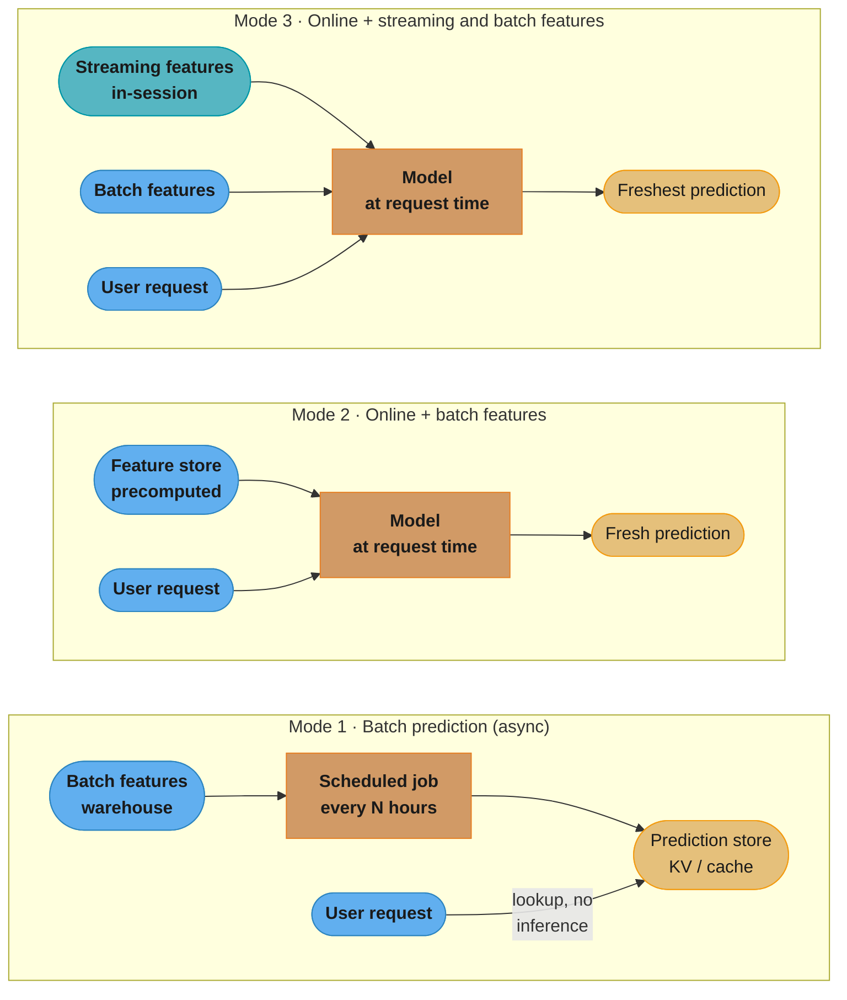
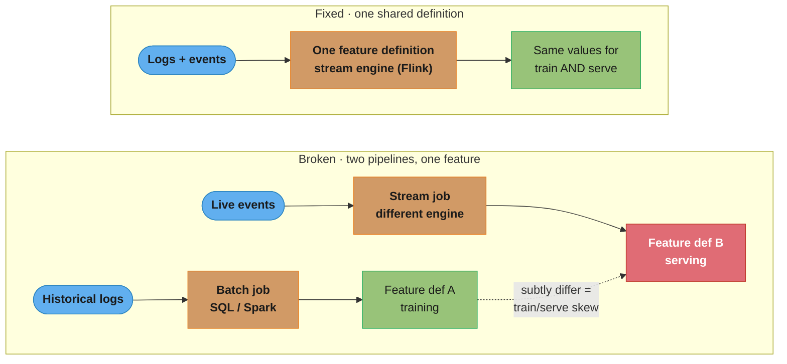
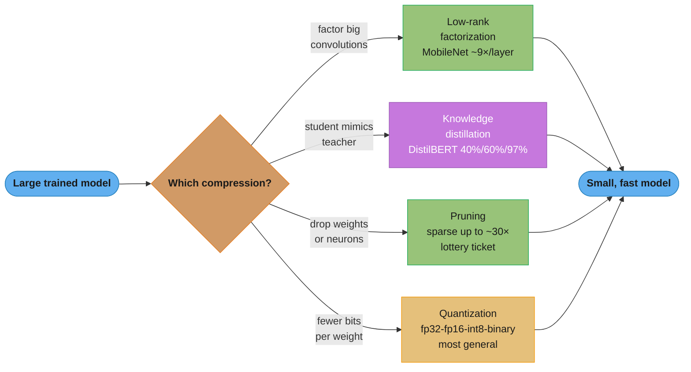
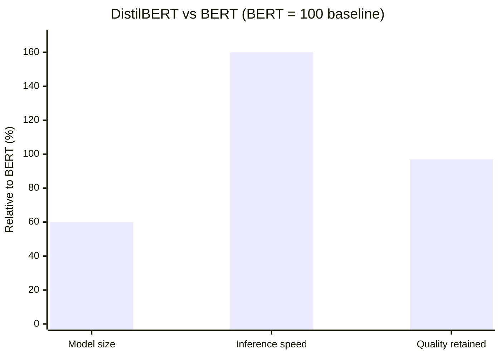
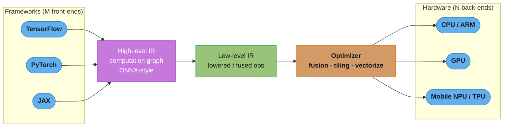

# Chapter 7: Model Deployment and Prediction Service

> Ch 7 of 11 · Designing Machine Learning Systems (Huyen) · the notebook-to-production chapter — batch vs online serving, compression, cloud vs edge

## Chapter Map

After a model exists (Ch 6) the hard part starts: turning a trained artifact into a
**prediction service** that real requests hit. Deployment sounds like a one-line
`model.predict()` wrapped in a web handler, and for a demo it is — but the chapter's whole
argument is that the *shape* of that service (when predictions are computed, how features
reach the model, where the model runs, how big it is) is a set of consequential engineering
decisions, not an afterthought. The chapter first punctures four myths that make engineers
underestimate deployment, then works through the two axes that define every prediction
service — **batch vs online** (when you compute) and **cloud vs edge** (where you compute) —
with **model compression** as the bridge that makes the harder choices (online, edge) feasible.

**TL;DR:**
- **Batch prediction** precomputes on a schedule and serves from a store (cheap, high
  throughput, but stale and wasteful); **online prediction** computes per request (fresh,
  but needs fast inference and real-time data). Online with *streaming* features is the
  general form, and batch prediction is best understood as a workaround that fades as online
  infra matures.
- The top production bug in serving is **train/serve skew** from two separate feature
  pipelines computing the "same" feature differently — the fix is one shared feature
  definition / one pipeline.
- **Model compression** (low-rank factorization, knowledge distillation, pruning,
  quantization) shrinks and speeds up models; **quantization is the most general and widely
  used**, and distillation's DistilBERT is the poster child (40% smaller, 60% faster, 97% of
  the quality).
- **Edge** wins on latency, offline availability, privacy, and cost — but edge hardware is
  compute/memory/energy-starved, so you must **compile and optimize** models through an
  intermediate representation to bridge the framework×hardware matrix.

## The Big Question

> "I have a trained model in a notebook. What does it actually take to put it in front of
> users — and why is `model.predict()` the easy 10% of the problem?"

The chapter reframes deployment from a deploy button into two orthogonal design questions.
**When do I compute the prediction** — ahead of time in a batch job, or on demand when the
request arrives? **Where does the model live** — in a data center I rent by the hour, or on
the user's phone/car/sensor? Every serving architecture is a point in that 2×2, and the
right point depends on latency tolerance, how fresh the input data must be, cost, and the
compute budget of the target hardware. Compression is what lets you move toward the
expensive-but-better corners (online, on-device) without the latency and size making them
impossible.

---

## 7.1 Machine Learning Deployment Myths

Deployment is where many ML projects die, largely because four comforting myths make teams
under-budget for it. The chapter names and rebuts each.

### Myth 1 — "You only deploy one or two models at a time"

Reality: mature ML organizations run **hundreds** of models in production simultaneously.
The count explodes along orthogonal dimensions — **one model per task, per region, per user
segment**. Ride-hailing (Uber) has separate models for ride demand, driver supply, ETAs,
fraud, dynamic pricing, and more — and then a *separate* model of each per city or market,
because rider behavior in one metro doesn't transfer to another. Streaming and e-commerce
(Netflix, Booking.com-style catalogs) similarly train per-market, per-language, per-cohort
models. The book's number: Uber-scale companies operate **thousands** of models in
production, and even mid-size companies (Booking.com's "150+ models" is a commonly cited
figure in this space) are well past "one or two." A serving platform that assumes a single
model is the wrong abstraction from day one.

### Myth 2 — "If we don't do anything, model performance stays the same"

Reality: **software rots and, worse, the data distribution shifts** — so a deployed model's
accuracy **degrades the moment training ends**. Two decay sources:

- **Software rot / bit rot** — dependencies, OS, libraries, and hardware drift underneath
  a frozen artifact, the classic reason any un-touched software breaks over time.
- **Data distribution shift** (the ML-specific killer) — the world the model was trained on
  stops matching the world it now serves. User behavior changes, competitors change the
  market, a pandemic changes everything overnight. Because the *input distribution* moves
  away from the training distribution, a model that was accurate on launch day silently gets
  worse with no code change and no error in the logs. (This is the whole subject of Ch 8.)

The mental model to internalize: model performance is a **decaying asset from the instant
you stop training**, not a fixed property you ship once.

### Myth 3 — "You won't need to update your models as much"

Reality: the right question is not "how *often should* we update" but **"how often *can* we"** —
and the best teams push that cadence astonishingly high. The chapter uses the DevOps-cadence
comparison: traditional software teams deploy constantly (Etsy famously deployed **50+ times
a day**; Netflix, Amazon, and Google deploy **thousands of times a day**), and ML teams
should aspire to the same. The extreme cited is **Weibo's ~10-minute model iteration cycle**
— retraining and redeploying on fresh data many times an hour. If retraining is expensive
and manual, teams retrain rarely and lose to drift (Myth 2); if the pipeline is automated,
frequent retraining is the natural defense. So "you won't need to update much" is backwards:
you'll want to update as fast as your infrastructure allows, which makes **iteration speed a
first-class design goal**.

### Myth 4 — "Most ML engineers don't need to worry about scale"

Reality: **most ML engineers work at companies where scale matters.** The distribution of
ML jobs is heavily concentrated at large-user-base companies (the Googles, Metas, Ubers,
banks, and enterprises), so the *typical* ML engineer is in fact building for hundreds of
thousands to millions of users, tight latency SLAs, and high QPS. "Scale is someone else's
problem" describes a small minority of ML roles; for the majority, throughput, latency, and
cost constraints are part of the job on day one.

| Myth | The comforting belief | The reality | Consequence if believed |
|------|----------------------|-------------|-------------------------|
| 1 | One or two models | Hundreds (task × region × segment); Uber ~thousands | Serving platform designed for a single model |
| 2 | Performance is stable | Decays from training's end (software rot + distribution shift) | No monitoring, silent accuracy loss |
| 3 | Rarely need updates | Ask "how often *can* we" — Etsy 50/day, Weibo ~10 min | Slow, manual retraining; drift wins |
| 4 | Scale is niche | Most ML jobs are at scale-relevant companies | Prototype-grade infra hits a wall |

---

## 7.2 Batch Prediction vs Online Prediction

This is the chapter's core. The first axis of every prediction service is **when** the
prediction is computed relative to when it's needed. There are three modes, and the naming
is a common source of confusion, so the chapter defines them precisely.

- **Online prediction** (a.k.a. **on-demand**, **synchronous**) — predictions are generated
  and returned **as requests arrive**. A request comes in, the model runs, the answer goes
  back in the response. Classic REST/RPC prediction service.
- **Batch prediction** (a.k.a. **asynchronous**) — predictions are **precomputed
  periodically** (on a schedule or trigger) and **stored**; when a request needs one, it's
  fetched from the store, not computed live.

Do not conflate "online" with "streaming features" — online prediction can run on
precomputed *batch* features. That distinction produces the three modes below.

### Mode 1 — Batch prediction

Predictions are computed **ahead of time in bulk**, on a schedule (e.g. every few hours or
nightly), and written to a **data warehouse / key-value store / cache**. At serving time you
do a **lookup**, not an inference. This is high-throughput and lets you use the cheapest
possible compute (a big offline job on spot instances), and it hides model latency entirely
from the user because the answer is already sitting in a table.

**Canonical example: Netflix-style recommendations.** Recommendations for every user are
batch-computed periodically and stored; when you open the app, the home screen is populated
from the precomputed table — no model runs during your session. That's why the rows feel
"the same" until the next refresh cycle.

**The two downsides of batch prediction:**

1. **Stale predictions.** Between refresh cycles the prediction is frozen. If a user's intent
   changes mid-session (they just watched three horror films), a batch-computed rec table
   from this morning can't react until the next run. The system is **less responsive to
   changing user preferences**.
2. **Wasted compute (and the cold-user problem).** You precompute predictions for *every*
   user/item, including the vast majority who never show up before the next refresh — so most
   of that compute is thrown away. And a **brand-new user with no precomputed row** ("cold
   user") has nothing to serve until a batch job includes them, which may be hours away.



Caption: the three serving modes differ only in *when* the model runs and *what data* it
sees — batch precomputes everything and serves a lookup; online-with-batch-features runs the
model per request on precomputed features; online-with-streaming-features adds in-session
signals for the freshest possible answer.

### Mode 2 — Online prediction with batch features

The model runs **at request time**, but the features it consumes were **precomputed in
batch** and read from a **feature store**. Example: a recommender that, on each request,
runs the model live (so it can react to the current context — the item you're looking at
right now) but pulls the user's embedding and long-term preference features from a store
where they were computed by a nightly job. This buys freshness in the *decision* (the model
runs now) while keeping the expensive-to-compute features precomputed. It removes batch
prediction's staleness for the model output, but the *features* can still lag reality by up
to a batch cycle.

### Mode 3 — Online prediction with streaming (+ batch) features

The fully general form, also called **streaming prediction**. The model runs at request time
on a mix of **batch features** (slow-changing, precomputed: a restaurant's historical mean
prep time) **and streaming features** computed **in-stream from the live session/event
flow** (fast-changing: how busy the kitchen is *right now*).

**The DoorDash / food-delivery worked example.** To estimate delivery time, the model needs:

- **Batch features** (from the warehouse): the restaurant's average historical prep time,
  the mean travel time for this route, the customer's typical patterns.
- **Streaming features** (computed live from the event stream): how many orders this
  restaurant has received in the **last 10 minutes**, how many **drivers are available**
  nearby right now, current traffic. These are aggregations over a sliding window of recent
  events, computed by a stream processor and handed to the model at request time.

Only streaming features can capture "the kitchen just got slammed" or "there are no drivers
free" — signals that are *minutes* old and would be invisible to any batch pipeline. That's
why accurate ETAs need streaming prediction.

### Unifying batch and streaming pipelines

Here is the chapter's most important production warning. When you have *both* a batch
pipeline (for training and batch features) and a streaming pipeline (for serving features),
you very easily end up computing the **same feature two different ways** — and that
mismatch, **train/serve skew**, is a **top source of production bugs** in ML systems.

The failure pattern:

- During **training** you compute a feature (say, "restaurant's avg orders in last 30 min")
  in a **batch job over historical logs** — written in SQL/Spark, one implementation.
- During **serving** you compute the "same" feature in a **stream processor** over live
  events — written in a different language/engine, a *second* implementation.
- The two implementations disagree on some subtle edge (timezone handling, window boundary,
  null handling, a rounding rule, how late-arriving events are treated). The model was
  trained on the batch definition but served the streaming definition, so its inputs at
  serving time are **subtly different from what it learned on** — and accuracy quietly
  drops with no error anywhere.



Caption: the same feature computed by two separate pipelines drifts apart on edge cases and
silently poisons serving inputs (train/serve skew); the fix is a single shared feature
definition — one pipeline (Flink-style stream processing that can also replay history)
producing identical values for both training and serving.

**The fix:** define each feature **once**, in a way that serves both training and inference.
In practice this means a **shared feature definition** and, increasingly, **one stream
processing engine** (Flink-style) that can both process live events for serving and *replay
historical events in the same code path* to generate training data — so training and serving
are guaranteed to compute the feature identically. A **feature store** helps enforce this by
being the single registry/definition of each feature.

### Batch as a fading workaround; from batch to online

The chapter's stance is pointed: **batch prediction is a workaround for models and infra
that aren't yet fast enough for online, and it fades as online infrastructure matures.**
Batch exists because (a) inference used to be too slow to do per-request, and (b) real-time
data pipelines were hard. As both improve, the reasons to precompute evaporate, and online
(especially streaming) prediction becomes the default because it's fresher and doesn't waste
compute on users who never show up.

**To move from batch to online you need three things** (the requirements list):

1. **Fast inference** — the model must return a prediction within the request's latency
   budget (this is exactly what §7.3 model compression buys you).
2. **Real-time transport / pipeline** — a low-latency way to move data as it's produced
   (Kafka/Kinesis-style streaming transport) so live signals reach the model quickly.
3. **Streaming computation** — a stream processing engine to compute streaming features from
   that transport in real time.

Miss any one and you fall back to batch. That's why teams often ship batch first and migrate
to online as the fast-inference and streaming pieces come online.

---

## 7.3 Model Compression

To make online and edge prediction feasible you often need a **smaller and/or faster** model
than what you trained. There are four families of model compression; the chapter presents
them in this order.

### Low-rank factorization

**Idea:** replace big, dense tensors/convolutions with **factored, lower-rank** ones that
approximate them with far fewer parameters and multiplications. The headline application is
**compact convolutions** in mobile vision networks.

**The SqueezeNet / MobileNet story.** A standard convolution over an input with `C`
channels using `K×K` filters producing `C'` output channels costs on the order of
`K × K × C × C'` multiply-adds per spatial location — the `C × C'` cross-channel term
dominates. **MobileNets** replace it with a **depthwise-separable convolution**: split the
one big convolution into two cheap ones —

- a **depthwise** step: one `K×K` filter *per input channel* (no cross-channel mixing),
  costing `K × K × C`, plus
- a **pointwise** step: a `1×1` convolution that mixes channels, costing `C × C'`.

So `K × K × C × C'` becomes `K × K × C + C × C'`. The reduction factor is roughly

```
cost_standard      K·K·C·C'          1        1
--------------  =  ---------- ≈ ------------ ≈ ---  (for large C')
cost_separable   K·K·C + C·C'    1/C' + 1/K²    K²
```

For a `3×3` filter that's about a **9× reduction** in compute and parameters for that layer,
with little accuracy loss. **SqueezeNet** pushed the same "use small/factored building
blocks" idea to reach AlexNet-level ImageNet accuracy with **~50× fewer parameters** and a
model small enough to fit in **under 0.5 MB**. Low-rank factorization is powerful but is
mostly hand-designed per architecture — it doesn't generalize automatically to any model.

### Knowledge distillation

**Idea:** train a **small "student" model to mimic a large "teacher" model** (or ensemble).
The student learns from the teacher's outputs — the **soft probabilities/logits**, which
carry more information ("this looks 70% cat, 20% dog") than hard labels — so a compact
student can approach the teacher's quality.

**DistilBERT** is the canonical result: a distilled BERT that is **~40% smaller**, **~60%
faster** at inference, while retaining **~97% of BERT's language-understanding performance**
(on GLUE-style benchmarks). That's the numbers to remember.

Key properties:

- **Architecture independence** — the student and teacher can be **entirely different
  architectures** (e.g. distill a big Transformer's knowledge into a smaller Transformer, or
  even a different model family). Distillation constrains outputs, not internal structure.
- **You still need data** — training the student requires a dataset to run through the
  teacher (to get soft targets); if you can't access good training/transfer data, distillation
  is hard to apply. It's also an extra training stage, not a post-hoc transform.

Distillation is attractive when you have a strong-but-huge teacher and want a deployable
student, but its dependence on the teacher and training data limits how broadly it's used.

### Pruning

**Idea:** **remove parts of the network** that contribute little — set small-magnitude
weights to zero, or delete whole neurons/channels/filters. Two flavors:

- **Unstructured pruning (sparsity)** — zero out individual weights, producing a **sparse**
  weight matrix. This can dramatically cut the number of *nonzero* parameters — reported
  reductions on the order of **~10× and, in aggressive regimes, up to ~30× fewer nonzeros** —
  but the *dense tensor shape is unchanged*, so you only get real speed/memory wins with
  hardware/kernels that exploit sparsity (otherwise you store and multiply a lot of zeros).
- **Structured / architectural pruning** — remove whole units (filters, channels, layers) so
  the resulting network is **genuinely smaller and dense**, giving speedups on ordinary
  hardware without special sparse kernels.

**The Lottery Ticket Hypothesis** (Frankle & Carbin) is the theoretical companion: a large
randomly-initialized network contains a small **sub-network ("winning ticket")** that, if
trained in isolation *from the same initialization*, can match the full network's accuracy.
It suggests the huge original network was largely over-parameterized scaffolding.

**Accuracy caveat:** pruning can be lossless up to a point, but push it too far and accuracy
falls; and the aggressive "30× nonzero reduction" numbers usually assume a **retrain/fine-tune
after pruning** to recover the accuracy the pruning cost, and real inference speedup depends
on whether your runtime can exploit the induced sparsity. Prune → fine-tune → measure, don't
assume the parameter-count reduction is free speed.

### Quantization

**Idea:** use **fewer bits per weight (and activation)**. Neural nets are usually trained in
**32-bit float (fp32)**; you can often serve in **16-bit float (fp16)**, **8-bit integer
(int8)**, or in the extreme **binary (1-bit)** — trading numeric precision for size and speed.

**Two wins at once:**

- **Memory** — fewer bits = a smaller model. fp32 → int8 is a **4× memory reduction**; fp32
  → fp16 is 2×; binary is 32×. A smaller model also fits in cache and moves less data, which
  itself speeds things up.
- **Compute** — low-precision integer math is faster and more energy-efficient than float
  math, and lets you fit more operations per clock (more ops in the same register width), so
  quantization speeds up *computation*, not just storage.

**Two regimes:**

| Regime | When quantization happens | Pros | Cons |
|--------|--------------------------|------|------|
| **Post-training quantization (PTQ)** | After training, on the finished fp32 model | Fast, no retraining, no training data needed | Larger accuracy drop, esp. at int8/binary |
| **Quantization-aware training (QAT) / training-aware** | Simulate low precision **during training** so the model learns to be robust to it | Recovers most/all accuracy | Requires retraining and the training pipeline |

**The precision tradeoffs — range and rounding.** Fewer bits means both a narrower
**representable range** (risk of **overflow/saturation** when a value exceeds the max) and
coarser **granularity** (**rounding error** when values fall between representable steps). You
choose a scale/zero-point to map floats into the integer range; too tight a range clips large
values (overflow), too loose wastes precision on the common small values (rounding). This is
why naive int8 can hurt accuracy and why QAT or careful per-channel scaling is used.

**Edge standardization on fixed-point.** Many edge accelerators standardize on **fixed-point
(integer) arithmetic** because it's cheaper in silicon, power, and area than floating point —
so quantizing to int8/fixed-point isn't just an optimization on edge hardware, it's often
what the hardware *natively supports*.

**The verdict:** **quantization is the most general and most widely used** compression
method. Unlike low-rank factorization (architecture-specific) and distillation (needs a
teacher and data), quantization applies to essentially **any model**, is simple to reason
about, gives both memory and compute wins, and is directly supported by hardware and runtimes
— which is why it's the default first reach for shrinking a model.



Caption: the four compression families all map a large model to a small fast one, but differ
in generality — factorization is architecture-specific, distillation needs a teacher and
data, pruning needs sparsity-aware hardware to pay off, and quantization applies to almost
anything, which is why it's the most widely used.



Caption: distillation's headline tradeoff in one view — DistilBERT keeps ~97% of BERT's
quality while cutting size to ~60% (40% smaller) and running ~160% of the speed (60% faster);
a large quality-per-cost win, not a free lunch.

---

## 7.4 ML on the Cloud and on the Edge

The second axis of a prediction service is **where the model runs**: in the **cloud** (a
rented data center, the default because it's easy) or on the **edge** (the user's phone, car,
browser, IoT sensor, or an on-prem box near the data).

### Why move off the cloud — the cost motivation and edge benefits

**The cost reality.** Cloud is convenient but the **bill grows with usage** and can dominate
a company's expenses — the book cites the reality of large **AWS bills** as a primary driver:
compute you rent per-hour/per-request adds up, and at scale it's often cheaper to push
inference onto hardware the user already owns. Companies routinely report cloud spend as one
of their largest cost lines, which motivates offloading inference to the edge.

**Edge benefits:**

- **Works without a network connection.** On-device inference runs even offline / with
  spotty connectivity — essential for cars, cameras, and phones in dead zones. The cloud
  model is dead the moment the connection drops.
- **No network round-trip latency.** No request needs to travel to a data center and back;
  the prediction is computed locally, cutting the round-trip out of the latency budget — the
  difference between real-time and not for interactive/AR/safety applications.
- **Privacy / GDPR-friendliness.** Data never leaves the device, so you avoid sending
  sensitive user data over the network and store it centrally — easier compliance with
  privacy regulations (GDPR and similar) and less breach surface.
- **Cheaper at scale.** Inference runs on hardware the user already paid for, so you don't
  pay per-prediction cloud compute; the marginal cost of another prediction is ~zero to you.

**The constraint that makes edge hard.** Edge hardware has a **tight compute, memory, and
energy budget** — a phone or microcontroller has a fraction of a data-center GPU's FLOPs and
RAM, and runs on a battery. So a model that's fine in the cloud may be **too big or too slow**
to run on the target device at all. This is exactly why §7.3 compression exists, and why the
next problem — compiling and optimizing models for specific edge hardware — becomes central.

### Compiling and optimizing models for edge devices

**The framework × hardware compatibility matrix problem.** You have many **ML frameworks**
(TensorFlow, PyTorch, JAX, …) and many **hardware backends** (Intel/ARM CPUs, NVIDIA GPUs,
mobile NPUs, TPUs, DSPs, custom edge accelerators). Making every framework run efficiently on
every backend is an **M×N matrix** of hand-tuned integrations — an intractable amount of work
if done pairwise. Getting a PyTorch model to run fast on a specific phone's NPU is not
automatic.

#### Intermediate representations (IRs) / computation graphs

**Compilers bridge frameworks and hardware.** The fix for the M×N matrix is the same trick
compilers use: insert an **intermediate representation** in the middle so you build M
front-ends (framework → IR) and N back-ends (IR → hardware) instead of M×N direct paths. A
trained model is expressed as a **computation graph** (nodes = operations, edges = tensors),
lowered into a **high-level IR** (framework-agnostic graph), then **progressively lowered**
into lower-level IRs closer to the hardware, and finally to machine code for the target. This
is exactly what **ONNX**-style IRs and ML compiler stacks do — turn "PyTorch model" into a
neutral graph that any hardware back-end can consume.



Caption: an intermediate representation turns the M×N framework-hardware matrix into M+N — every
framework lowers to one neutral computation graph, which the compiler progressively lowers and
optimizes down to each hardware back-end.

#### Model optimization

Once the model is a graph, the compiler **optimizes** it. The chapter splits optimizations
into **local** (rewrite a single operation or a small neighborhood) and **global** (reorder
and restructure across the whole graph). Key techniques:

- **Vectorization** — execute one operation over many data elements at once (SIMD), instead
  of element-by-element loops.
- **Parallelization** — split independent work across cores/threads/lanes.
- **Loop tiling** — reorder loop iterations to reuse data that's already in cache (blocking),
  hugely improving memory locality for matmul/convolution.
- **Operator fusion** — merge adjacent ops (e.g. a convolution + bias + ReLU) into **one
  kernel** so you read/write memory once instead of after every op — one of the biggest wins
  because it removes intermediate memory traffic.

**Hand-tuned vendor kernels vs ML-driven autotuning.** Historically, hardware vendors ship
**hand-tuned kernel libraries** (e.g. cuDNN) written by experts for their chips — excellent
but expensive to produce and limited to the ops/shapes the vendor optimized. The alternative
is **ML-driven autotuning (autoTVM-style)**: instead of a human picking the loop order, tile
sizes, and fusion, a **cost model *learns* the target hardware** and searches the space of
possible schedules, using measured or predicted runtimes to pick the fastest one for *your*
specific model and device. The tradeoff: autotuning can **beat hand-tuned kernels** and
generalizes to new ops/hardware, but the **search takes hours** (it tries many candidate
schedules and benchmarks them) — a one-time compile-time cost you pay to get a faster deployed
model.

### ML in browsers

Running the model in the **web browser** is an attractive edge target — it reaches any device
with a browser, no install. But **JavaScript is slow** for the heavy numeric work of neural
nets, so pure-JS inference (early TensorFlow.js) is limited.

**WebAssembly (WASM)** is the answer: a **compiled bytecode format** browsers run at
near-native speed, so you can **compile a model (or its runtime) to WASM** and run inference
**client-side** far faster than JavaScript. The precise positioning to remember: **WASM is
faster than JavaScript but slower than running natively** on the device — it's the best
portable option in the browser sandbox, not a replacement for a native NPU kernel. WASM (often
alongside WebGL/WebGPU for GPU access) is how in-browser ML gets acceptable performance while
keeping the deploy-anywhere reach of the web.

---

## Visual Intuition

The 2×2 that organizes the whole chapter — *when* you compute (batch vs online) against
*where* you compute (cloud vs edge):

```mermaid
quadrantChart
    title Prediction service design space
    x-axis Cloud --> Edge
    y-axis Batch precompute --> Online per-request
    quadrant-1 Online on-device (fresh, offline, private)
    quadrant-2 Online in cloud (fresh, elastic, costly)
    quadrant-3 Batch in cloud (cheap, stale)
    quadrant-4 Batch on-device (rare)
    Netflix recs: [0.18, 0.15]
    Fraud scoring API: [0.30, 0.82]
    DoorDash ETA streaming: [0.35, 0.90]
    Phone face unlock: [0.85, 0.88]
    On-device autocomplete: [0.82, 0.70]
```

Caption: every prediction service is a point in when-you-compute × where-you-compute; batch
in the cloud is cheapest but stalest (Netflix recs), online-on-edge is freshest, most private,
and works offline but is hardest to fit (face unlock), and streaming online (DoorDash ETA)
lives in the fresh-but-cloud corner.

The precision ladder of quantization — each step down halves (or more) the bits, trading range
and rounding accuracy for size and speed:

```
bits per weight    representable values        memory vs fp32     typical use
---------------    ---------------------        --------------     -----------
fp32  (32-bit) ->  ~4.3e9 gradations            1x  (baseline)     training
fp16  (16-bit) ->  ~65,504 max, fine steps      1/2 (2x smaller)   GPU serving
int8  ( 8-bit) ->  256 integer levels           1/4 (4x smaller)   edge / mobile
binary( 1-bit) ->  2 values {-1, +1}            1/32 (32x smaller)  extreme edge

overflow  <-- narrower range as bits shrink -->  rounding error grows
```

Caption: dropping bits shrinks the model geometrically (fp32→int8 = 4×, →binary = 32×) but
narrows the representable range (overflow risk) and coarsens the steps (rounding error) —
which is why int8 is the common sweet spot and QAT is used to recover the lost accuracy.

---

## Key Concepts Glossary

- **Prediction service** — the deployed system that turns model + features into predictions for requests.
- **Online prediction (on-demand / synchronous)** — predictions generated at request time and returned in the response.
- **Batch prediction (asynchronous)** — predictions precomputed on a schedule and stored; served by lookup.
- **Streaming prediction** — online prediction that uses streaming (in-session) features plus batch features.
- **Batch features** — slow-changing features precomputed in bulk (e.g. a restaurant's historical mean prep time).
- **Streaming features** — fast-changing features computed in real time from the live event stream (e.g. orders in the last 10 min).
- **Feature store** — the single registry/definition and serving layer for features, used by training and serving.
- **Train/serve skew** — a feature computed differently in training vs serving, silently degrading accuracy.
- **Stale prediction** — a batch-precomputed prediction that no longer reflects the user's current state.
- **Cold user** — a new user with no precomputed prediction, unserved until the next batch run.
- **Real-time transport** — low-latency data movement (Kafka/Kinesis-style) that feeds online/streaming prediction.
- **Data distribution shift** — the serving input distribution drifting away from the training distribution.
- **Model compression** — techniques to make a model smaller and/or faster for deployment.
- **Low-rank factorization** — approximating dense tensors/convolutions with factored, lower-rank ones.
- **Depthwise-separable convolution** — factoring a conv into per-channel depthwise + 1×1 pointwise (MobileNet).
- **Knowledge distillation** — training a small student model to mimic a large teacher's soft outputs.
- **DistilBERT** — distilled BERT: ~40% smaller, ~60% faster, ~97% of the quality.
- **Pruning** — removing low-importance weights (unstructured/sparse) or neurons (structured).
- **Lottery Ticket Hypothesis** — a large net contains a small sub-network that trains to full accuracy.
- **Quantization** — using fewer bits per weight/activation (fp32 → fp16 → int8 → binary).
- **Post-training quantization (PTQ)** — quantizing after training, no retraining needed.
- **Quantization-aware training (QAT)** — simulating low precision during training to preserve accuracy.
- **Fixed-point arithmetic** — integer-based math that edge accelerators natively support.
- **Cloud vs edge** — running inference in a rented data center vs on the user's device.
- **Intermediate representation (IR) / computation graph** — a neutral graph bridging frameworks and hardware.
- **Lowering** — progressively translating a high-level IR toward hardware-specific low-level code.
- **ONNX** — an open IR/exchange format for models across frameworks.
- **Operator fusion** — merging adjacent ops into one kernel to cut intermediate memory traffic.
- **Loop tiling** — reordering loops to reuse cached data (memory-locality optimization).
- **Vectorization / parallelization** — SIMD over many elements / spreading work across cores.
- **autoTVM-style autotuning** — an ML cost model learns the hardware and searches for the fastest schedule.
- **WebAssembly (WASM)** — compiled browser bytecode; faster than JS, slower than native, for client-side ML.

---

## Tradeoffs & Decision Tables

**Batch vs online prediction:**

| Dimension | Batch prediction | Online (batch features) | Online (streaming features) |
|-----------|------------------|-------------------------|-----------------------------|
| When computed | Periodically, ahead of time | Per request | Per request |
| Data freshness | Stale (up to a cycle) | Fresh decision, laggy features | Freshest (live signals) |
| Latency to user | ~0 (lookup) | Model latency | Model + stream latency |
| Compute efficiency | Wastes work on no-show users | Only what's requested | Only what's requested |
| Cold-user handling | Fails (no row) | Works | Works |
| Infra needed | Warehouse + scheduler | Fast inference + feature store | Fast inference + transport + stream engine |
| Example | Netflix recs | Context-aware recommender | DoorDash ETA |

**Compression families:**

| Family | Mechanism | Generality | Headline number |
|--------|-----------|-----------|-----------------|
| Low-rank factorization | Factored/compact convolutions | Architecture-specific | MobileNet ~9×/layer; SqueezeNet ~50× params, <0.5 MB |
| Knowledge distillation | Student mimics teacher | Needs teacher + data | DistilBERT 40% smaller / 60% faster / 97% quality |
| Pruning | Remove weights (sparse) or neurons (structured) | Sparse needs HW support | Up to ~30× fewer nonzeros (with retrain) |
| Quantization | Fewer bits per weight | **Most general, most used** | int8 = 4× smaller + faster |

**Cloud vs edge:**

| Dimension | Cloud | Edge |
|-----------|-------|------|
| Setup ease | Easy (default) | Hard (compile/optimize per device) |
| Cost at scale | Grows with usage (AWS bill) | ~Free marginal (user's hardware) |
| Latency | Network round-trip | Local, no round-trip |
| Offline | No | Yes |
| Privacy | Data leaves device | Data stays on device (GDPR-friendly) |
| Compute budget | Large (elastic) | Tight (CPU/memory/energy limited) |

---

## Common Pitfalls / War Stories

- **Train/serve skew from two feature pipelines.** The batch pipeline (training) and stream
  pipeline (serving) compute "the same" feature with two different implementations that
  disagree on a window boundary, timezone, or null rule. The model is served inputs subtly
  different from training and accuracy silently drops — no error, no crash. Fix: one shared
  feature definition (feature store / single stream engine that also replays history).
- **Assuming performance is stable after launch.** Teams deploy and move on, then discover
  months later that distribution shift quietly eroded accuracy (Myth 2). Without monitoring,
  the first sign is a business metric dropping, not an alert.
- **Batch prediction can't serve new users or intent changes.** Cold users have no
  precomputed row, and a user whose behavior changes mid-session gets stale recs until the
  next batch cycle — precisely the situations where a fresh prediction matters most.
- **Precomputing for everyone wastes most of the compute.** Batch jobs generate predictions
  for all users/items, but only a fraction ever request one before the next refresh — the
  rest is thrown away. At scale this is a large, invisible cloud cost.
- **Naive int8 quantization tanks accuracy.** Post-training int8 without care overflows on
  large activations and rounds away small ones, dropping accuracy. Fix: quantization-aware
  training or careful per-channel scaling — measure, don't assume.
- **Trusting the parameter-count reduction from pruning as free speedup.** Unstructured
  pruning cuts nonzeros but leaves dense tensor shapes; without sparsity-aware kernels you
  still multiply the zeros, so there's no real speedup. And aggressive pruning needs a
  retrain to recover accuracy.
- **Under-budgeting deployment as a single model.** Planning for "one model" and hitting the
  reality of hundreds (per task × region × segment) means the serving/monitoring/retraining
  platform has to be rebuilt (Myth 1).
- **Expecting autotuning to be instant.** ML-based autotuning (autoTVM) searches thousands of
  schedules and can take **hours** per model/target — budget the compile time; it's a
  one-time cost, but it's not free.

---

## Real-World Systems Referenced

Uber and Netflix (hundreds/thousands of models per task/region/segment; batch-precomputed
recommendations); Etsy, Amazon, Google (thousands of deploys a day — the DevOps cadence
comparison); Weibo (~10-minute model iteration cycle); DoorDash / food-delivery (streaming
features for delivery-time estimation); AWS (the cloud-bill cost driver); MobileNets and
SqueezeNet (compact-convolution / low-rank factorization); BERT and DistilBERT (knowledge
distillation, 40%/60%/97%); the Lottery Ticket Hypothesis (pruning); cuDNN (hand-tuned vendor
kernels); TVM / autoTVM (ML-driven autotuning); ONNX (intermediate representation);
TensorFlow.js and WebAssembly (in-browser ML); Kafka/Kinesis-style transport and Flink-style
stream processing (real-time transport and streaming feature computation).

---

## Summary

Deployment is where ML projects stall, and the chapter first clears away four myths that make
teams under-invest: you run **hundreds** of models not one or two (per task × region ×
segment); performance **decays from the moment training ends** because of software rot and
data distribution shift; you should update models **as often as your infra allows** (Etsy
50/day, Weibo ~10 min), not rarely; and **most ML engineers do work at scale**. The core of
the chapter is two design axes. **When** you compute splits into **batch prediction**
(precompute on a schedule, serve a lookup — cheap and high-throughput but stale and wasteful,
and blind to cold users), **online prediction with batch features** (run the model per request
on precomputed features), and **online prediction with streaming features** (add live
in-session signals — the DoorDash-ETA general form). The recurring production trap is
**train/serve skew** from computing the same feature two different ways; the fix is one shared
feature definition / a single stream engine. Batch is a fading workaround, and moving to
online needs fast inference, real-time transport, and stream computation. **Model
compression** — **low-rank factorization** (MobileNet's factored convolutions), **knowledge
distillation** (DistilBERT: 40% smaller, 60% faster, 97% quality), **pruning** (sparse or
structured; lottery ticket), and **quantization** (fewer bits; the most general and widely
used) — is what makes fast online and small on-device models possible. **Where** you compute
splits into **cloud** (easy but the bill grows) and **edge** (offline-capable, no round-trip,
privacy-friendly, cheaper at scale, but compute/memory/energy-starved). Running on edge
requires **compiling and optimizing** models through an **intermediate representation** that
bridges the framework×hardware matrix, applying **operator fusion / tiling / vectorization**
(hand-tuned vendor kernels or autoTVM-style learned autotuning), and, for browsers,
**WebAssembly** — faster than JS, slower than native.

---

## Interview Questions

**Q: What is the difference between batch prediction and online prediction, and what are the two downsides of batch?**
Batch prediction precomputes predictions on a schedule and stores them, serving a lookup, while online prediction computes the prediction at request time. Batch is high-throughput and hides model latency, but its two downsides are staleness (predictions freeze between refresh cycles, so they can't react to changing user intent) and wasted compute (it precomputes for every user/item, most of whom never show up, and can't serve brand-new cold users with no precomputed row). Online prediction is fresher and only computes what's requested, at the cost of needing fast inference and real-time data.

**Q: What is train/serve skew and why is it a top source of production ML bugs?**
Train/serve skew is when a feature is computed one way during training and a different way during serving, so the model receives inputs subtly different from what it learned on. It happens when a batch pipeline computes a feature over historical logs while a separate stream pipeline computes the "same" feature over live events, and the two implementations disagree on a window boundary, timezone, null handling, or rounding. Accuracy quietly drops with no error anywhere, which is why it's so dangerous; the fix is a single shared feature definition, ideally one stream engine that can also replay history so training and serving compute the feature identically.

**Q: What are the three modes of prediction, and how do they differ?**
The three modes are batch prediction, online prediction with batch features, and online prediction with streaming plus batch features. Batch precomputes everything and serves a stored lookup; online-with-batch-features runs the model at request time but on precomputed features from a feature store; online-with-streaming-features (streaming prediction) adds features computed live from the event stream, like DoorDash's orders-in-the-last-10-minutes. They differ in when the model runs and how fresh the input data is, trading infrastructure complexity for freshness.

**Q: Why does DoorDash-style delivery-time estimation need streaming features?**
Because accurate ETAs depend on signals that are only minutes old, like how many orders a kitchen just received and how many drivers are free right now. Batch features (the restaurant's historical mean prep time) can't capture "the kitchen just got slammed" or "no drivers are available." Streaming features are aggregations over a sliding window of recent events computed by a stream processor and handed to the model at request time, which is the only way to reflect real-time conditions in the prediction.

**Q: Give the DistilBERT compression numbers and say what technique produced them.**
DistilBERT is about 40% smaller, about 60% faster at inference, and retains about 97% of BERT's language-understanding quality, produced by knowledge distillation. Distillation trains a small student model to mimic a large teacher's soft output probabilities, which carry more information than hard labels. It's a strong quality-per-cost win, but it requires a training dataset to push through the teacher and an extra training stage.

**Q: Why is quantization considered the most general and widely used compression method?**
Because it applies to essentially any model, gives both memory and compute wins, and is directly supported by hardware and runtimes. Unlike low-rank factorization, which is architecture-specific, and distillation, which needs a teacher and training data, quantization just uses fewer bits per weight (fp32 to fp16 to int8 to binary) and works on almost anything. Int8 gives a 4x memory reduction over fp32 plus faster integer math, which is why it's the default first reach for shrinking a model.

**Q: What is the difference between post-training quantization and quantization-aware training?**
Post-training quantization (PTQ) quantizes the finished fp32 model after training with no retraining, which is fast and needs no data but causes a larger accuracy drop, especially at int8 or binary. Quantization-aware training (QAT) simulates low precision during training so the model learns to be robust to it, recovering most or all of the accuracy at the cost of retraining. QAT is used when PTQ's accuracy loss is unacceptable.

**Q: What are the four myths about ML deployment, in one line each?**
That you only deploy one or two models (reality: hundreds, per task, region, and segment — Uber runs thousands); that performance stays stable if untouched (reality: it decays from training's end due to software rot and data distribution shift); that you won't need to update models much (reality: update as often as infra allows — Etsy 50/day, Weibo ~10 min); and that most ML engineers don't worry about scale (reality: most work at scale-relevant companies). Each myth leads teams to under-invest in the serving, monitoring, and retraining platform.

**Q: Why does a deployed model's accuracy degrade even if nobody changes the code?**
Because the data distribution shifts: the world the model serves drifts away from the world it was trained on, so its inputs increasingly differ from the training distribution and predictions get worse. On top of that, ordinary software rot (dependency, OS, and hardware drift) degrades any untouched system. The key mental model is that model performance is a decaying asset from the moment training ends, not a fixed property, which is why monitoring and frequent retraining are mandatory.

**Q: How does low-rank factorization shrink a convolution, using MobileNet as the example?**
It replaces a standard convolution with a depthwise-separable convolution, splitting one big K×K×C×C' operation into a cheap depthwise step (one K×K filter per channel, costing K×K×C) plus a pointwise 1×1 step that mixes channels (costing C×C'). This changes the cost from K×K×C×C' to K×K×C + C×C', roughly a 1/K² reduction — about 9x for a 3×3 filter — with little accuracy loss. SqueezeNet pushed the same compact-building-block idea to AlexNet accuracy with ~50x fewer parameters in under 0.5 MB.

**Q: What is the difference between unstructured (sparse) and structured pruning, and why does it matter for speed?**
Unstructured pruning zeros out individual weights, producing a sparse matrix that can cut nonzero parameters by ~10x to ~30x, but the dense tensor shape is unchanged, so you only get real speedups on hardware or kernels that exploit sparsity. Structured pruning removes whole neurons, channels, or filters, so the network becomes genuinely smaller and dense and speeds up on ordinary hardware. This is why a big parameter-count reduction from unstructured pruning is not automatically a speedup.

**Q: What is the Lottery Ticket Hypothesis?**
It's the claim that a large randomly-initialized network contains a small sub-network (a "winning ticket") that, if trained in isolation from the same initialization, can match the full network's accuracy. It suggests large networks are heavily over-parameterized and that most of the network is scaffolding for finding a good sparse sub-network. It gives theoretical motivation for pruning, though finding the ticket in practice is nontrivial.

**Q: What are the main benefits of running a model on the edge instead of the cloud?**
Edge inference works offline without a network connection, removes the network round-trip from latency, keeps data on the device for privacy and GDPR compliance, and is cheaper at scale because it runs on hardware the user already owns. The primary motivation is often cost — cloud bills grow with usage and can dominate expenses. The tradeoff is that edge hardware is compute-, memory-, and energy-constrained, so the model may be too big or slow to run without compression and optimization.

**Q: What is the framework-by-hardware compatibility problem, and how do intermediate representations solve it?**
It's the M×N problem of making many ML frameworks (TensorFlow, PyTorch, JAX) each run efficiently on many hardware backends (CPU, GPU, mobile NPU, TPU) — an intractable number of pairwise hand-tuned integrations. Intermediate representations solve it the way compilers do: express the model as a neutral computation graph in the middle, so you build M front-ends (framework to IR) and N back-ends (IR to hardware) instead of M×N direct paths. ONNX-style IRs and ML compiler stacks then progressively lower and optimize the graph down to each target.

**Q: What is operator fusion and why is it one of the biggest optimization wins?**
Operator fusion merges adjacent operations, such as a convolution followed by a bias add and a ReLU, into a single kernel so intermediate results stay in registers instead of being written to and read from memory after each op. Memory traffic, not arithmetic, is often the bottleneck, so eliminating the intermediate reads and writes gives a large speedup. It's a global graph optimization the compiler applies after the model is lowered to an IR.

**Q: What is autoTVM-style autotuning, and what is its tradeoff versus hand-tuned kernels?**
AutoTVM-style autotuning uses an ML cost model that learns the target hardware and searches the space of possible schedules (loop orders, tile sizes, fusion choices), using measured or predicted runtimes to pick the fastest one for your specific model and device. The advantage is it can beat hand-tuned vendor kernels like cuDNN and generalizes to new ops and hardware, rather than being limited to what a human optimized. The tradeoff is that the search takes hours, a one-time compile-time cost you pay for a faster deployed model.

**Q: What is WebAssembly's role in in-browser ML, and how does its performance compare?**
WebAssembly (WASM) is a compiled bytecode format browsers run at near-native speed, letting you compile a model or its runtime and run inference client-side much faster than JavaScript. The precise positioning is that WASM is faster than JavaScript but slower than running natively on the device, so it's the best portable option inside the browser sandbox but not a replacement for a native NPU kernel. It's how in-browser ML gets acceptable performance while keeping the deploy-anywhere reach of the web.

**Q: What three things do you need to move from batch prediction to online prediction?**
You need fast inference so the model returns within the request's latency budget, real-time transport to move data as it's produced (Kafka/Kinesis-style), and a stream computation engine to compute streaming features from that transport. Miss any one and you fall back to batch. This is why teams often ship batch first and migrate to online as the fast-inference and streaming pieces come online.

**Q: Why does the book call batch prediction a "workaround" rather than a permanent design?**
Because batch exists mainly to compensate for inference that used to be too slow to do per request and real-time pipelines that were hard to build. As inference gets faster (via compression) and streaming infrastructure matures, those reasons disappear, and online prediction becomes the default because it's fresher and doesn't waste compute on users who never show up. So batch prediction fades as online infrastructure matures, rather than being an end state.

**Q: What are the range and precision tradeoffs when quantizing to fewer bits?**
Fewer bits narrow the representable range, risking overflow or saturation when a value exceeds the maximum, and coarsen the granularity, causing rounding error when values fall between representable steps. You pick a scale and zero-point to map floats into the integer range: too tight a range clips large values (overflow), too loose wastes precision on common small values (rounding). This is why naive int8 can hurt accuracy and why quantization-aware training or per-channel scaling is used, and why edge accelerators standardize on fixed-point arithmetic.

**Q: Why is "how often can we update our models?" the right question instead of "how often should we?"**
Because model performance decays continually from distribution shift, so the faster you can retrain and redeploy, the better you defend against drift — making iteration speed a first-class design goal. The best teams push cadence very high (Etsy deployed 50+ times a day, Weibo iterates models roughly every 10 minutes), which is only possible with automated pipelines. If retraining is manual and expensive, you update rarely and lose to drift, so the real constraint is your infrastructure, not a schedule.

---

## Cross-links in this repo

- [Ch 3: Data Engineering Fundamentals — the batch/stream dataflow modes behind the three serving designs](../03_data_engineering_fundamentals/README.md)
- [ml/model_serving_and_inference/ — batch vs online serving, feature stores, latency budgets in depth](../../../ml/model_serving_and_inference/README.md)
- [ml/model_compression_and_efficiency/ — distillation, pruning, quantization mechanics](../../../ml/model_compression_and_efficiency/README.md)
- [ml/gpu_and_hardware_optimization/ — kernels, fusion, autotuning, hardware backends](../../../ml/gpu_and_hardware_optimization/README.md)
- [llm/ — LLM serving is the modern extreme of this chapter (KV-cache, quantization, on-device)](../../../llm/CLAUDE.md)
- [cuda/ — kernel-level optimization: tiling, fusion, vendor vs learned kernels](../../../cuda/CLAUDE.md)
- [DMLS Ch 5 — Feature Engineering (the features these pipelines compute)](../05_feature_engineering/README.md)
- [DMLS Ch 6 — Model Development and Offline Evaluation (the model you deploy here)](../06_model_development_and_offline_evaluation/README.md)
- [DMLS Ch 8 — Data Distribution Shifts and Monitoring (why performance decays — Myth 2)](../08_data_distribution_shifts_and_monitoring/README.md)
- [DDIA Ch 10 — Batch Processing (the batch pipeline underpinning batch prediction)](../../designing_data_intensive_applications/10_batch_processing/README.md)
- [DDIA Ch 11 — Stream Processing (real-time transport and streaming feature computation)](../../designing_data_intensive_applications/11_stream_processing/README.md)

## Further Reading

- Huyen, Chip. *Designing Machine Learning Systems*, Ch 7 — original text and references.
- Howard et al., "MobileNets: Efficient Convolutional Neural Networks for Mobile Vision Applications," 2017 (depthwise-separable convolutions).
- Iandola et al., "SqueezeNet: AlexNet-level accuracy with 50x fewer parameters and <0.5MB model size," 2016.
- Sanh et al., "DistilBERT, a distilled version of BERT," 2019 (40% smaller, 60% faster, 97% quality).
- Hinton, Vinyals & Dean, "Distilling the Knowledge in a Neural Network," 2015.
- Frankle & Carbin, "The Lottery Ticket Hypothesis," 2019.
- Han, Mao & Dally, "Deep Compression: pruning, trained quantization and Huffman coding," 2016.
- Chen et al., "TVM: An Automated End-to-End Optimizing Compiler for Deep Learning," 2018 (and AutoTVM).
- ONNX — Open Neural Network Exchange (open IR / model exchange format).
