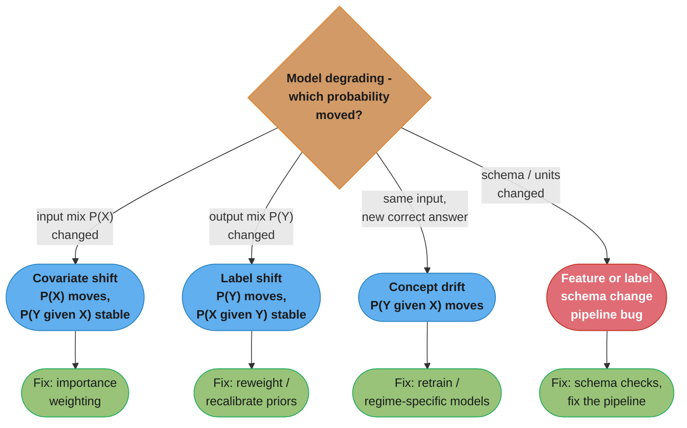
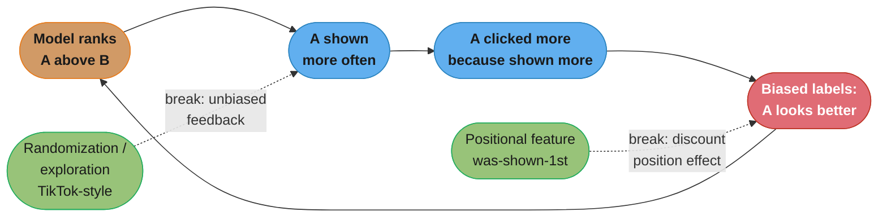
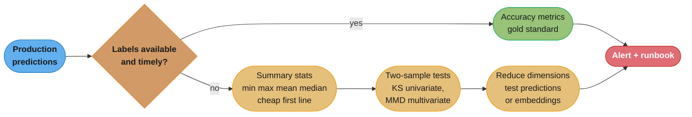
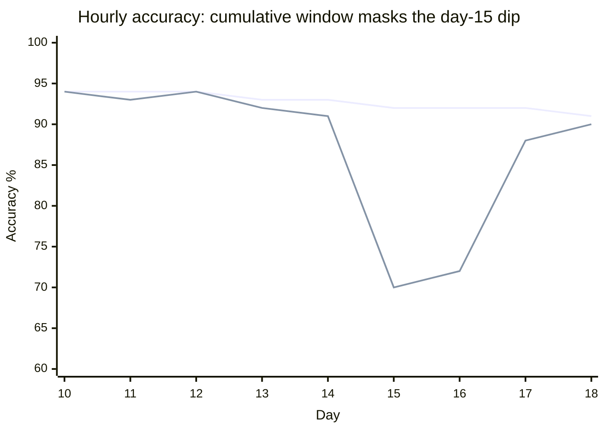

# Chapter 8: Data Distribution Shifts and Monitoring

> Ch 8 of 11 · Designing Machine Learning Systems (Huyen) · why healthy services serve garbage — the shift taxonomy, detection math, and the monitoring toolbox

## Chapter Map

A model that passes every offline test still rots in production, because the world it predicts on drifts away from the world it was trained on — silently, with no crash and no 500 error. This chapter is the failure-modes chapter: it first enumerates *what can go wrong* with a deployed ML system (splitting failures into plain software-engineering failures and genuinely ML-specific ones), then drills into the most important ML-specific failure — **data distribution shifts** — giving the precise probabilistic taxonomy (covariate, label, concept), the statistics used to *detect* shift when labels are slow or absent, and finally the **monitoring and observability** stack that makes any of this visible before customers do.

**TL;DR:**
- ML failures split two ways: **operational-expectation** violations (latency spikes, crashes — visible, tooling exists) and **ML-performance-expectation** violations (accuracy quietly decays — SILENT, no alarm fires). The silent kind is the dangerous kind.
- Many "ML failures" are ordinary software failures — a Google study found **60 of 96** pipeline outages were NOT ML problems (dependency, deployment, data-join bugs). Fix your engineering before blaming the model.
- The three data shifts, defined by which probability changes: **covariate shift** (P(X) changes, P(Y|X) stable), **label shift** (P(Y) changes, P(X|Y) stable), **concept drift** (P(Y|X) changes — same input, different truth).
- **Detect** with accuracy metrics when labels arrive; otherwise fall back to statistics (summary stats → two-sample tests like KS/MMD), always mindful of **time-window** effects. **Address** mostly by retraining. **Monitor** four layers — accuracy, predictions, features, raw inputs — and fight **alert fatigue**, the #1 monitoring killer.

## The Big Question

> "My service returns 200 OK in 50 ms every time, my dashboards are green, and yet my model's predictions are getting worse and worse. Nothing is *broken*. How do I even *know* this is happening, let alone find the cause and fix it?"

Analogy: a smoke detector tells you a specific, known failure — fire. But ML degradation is more like slow food spoilage in a fridge whose light still turns on: the appliance works perfectly, the failure is in the *contents*, and by the time you smell it the damage is done. Monitoring known failure modes (the smoke detector) is necessary but insufficient; you also need **observability** — enough instrumented internal state to interrogate failures you never anticipated. This chapter builds both the taxonomy of what spoils (distribution shifts) and the toolbox that smells it early.

---

## 8.1 Causes of ML System Failures

A **failure** happens when one or more *expectations* of the system are violated. For traditional software, expectations are almost entirely **operational** — the system should return the right result, within a latency budget, and stay up. For an ML system there is a second, distinct class of expectation.

- **Operational expectation violations** — the system is down, too slow, returns a 500, times out. These are **visible**: a crash throws, a timeout logs, latency shows on a dashboard. Decades of software tooling (health checks, alerting, tracing) already catch them.
- **ML-performance expectation violations** — the system runs perfectly but its **predictions get worse**: accuracy, click-through, conversion silently decay. This is the failure mode unique to ML, and it is **SILENT**. There is no exception, no error code, no red dashboard tile — the model happily returns confident, wrong answers. You often learn about it from a business metric weeks later, or from an angry customer.

The whole rest of the chapter exists because of that second bullet: the silent failure needs its own taxonomy (shifts) and its own tooling (ML-specific monitoring), because the operational toolbox is blind to it.

Huyen then splits the *causes* of failure into two buckets: software system failures (ordinary engineering) and ML-specific failures.

### Software system failures

A huge fraction of "ML system" outages have nothing to do with ML. They are the same failures that plague any distributed system:

- **Dependency failures** — a package, third-party API, or upstream service your system relies on breaks or changes behavior.
- **Deployment failures** — a bad deploy: you push the wrong binary, deploy an older model artifact by accident, or a config points at the wrong feature store.
- **Hardware failures** — the CPU/GPU node the model runs on overheats or dies.
- **Downtime / crashes** — a component restarts, a queue backs up, a network partition drops requests.

The humbling statistic Huyen cites: a **2020 Google study of 96 real pipeline outages** found that **60 of the 96 (about two-thirds) were caused by problems NOT specific to ML** — dependency issues, deployment mistakes, and especially **data-join failures** (a join in the feature pipeline silently producing wrong or empty rows). The lesson is a dose of humility: before you reach for exotic drift theory, check whether your "model problem" is really a plain engineering bug. These failures dominate partly *because* they are more visible and more studied for non-ML software, but also because ML pipelines are long chains of data plumbing where any link can quietly corrupt the input. Good software-engineering practice — versioning, testing, staged rollout, monitoring of the plumbing — prevents most production ML incidents.

### ML-specific failures

These are failures that *do* originate in the ML nature of the system. Huyen calls out several; each gets its own sub-heading below.

#### Production data differing from training data (train–serving skew)

The model learned the distribution of a curated training set; production data is drawn from a different, messier, live distribution — and the two diverge. Huyen flags this as "**common yet oddly under-addressed**": everyone knows training data should resemble production, yet in practice teams collect a convenient training set, ship, and never systematically verify that live inputs still look like it. The divergence can be static (the training set was never representative — a sampling bias) or dynamic (it *was* representative and the world moved — a distribution shift). The rest of 8.2 formalizes the dynamic case.

#### Edge cases

Framed with self-driving cars: a car that drives safely 99.99% of the time but occasionally accelerates into oncoming traffic is worse than useless, because the rare **edge case** is catastrophic. An edge case is a data sample so extreme it causes the model to make a **catastrophic** mistake — and the acceptability of a system is often gated by its edge-case behavior, not its average behavior.

**Edge cases vs outliers** — an important distinction:
- An **outlier** is about the *input*: a data point that differs significantly from the others. It may or may not cause a wrong prediction.
- An **edge case** is about the *output/performance*: a point where the model performs catastrophically worse. It is often *caused* by an outlier, but not every outlier is an edge case (the model may handle some unusual inputs fine), and you care about edge cases specifically because of their consequence. During training you might drop outliers to help the model fit; in production you cannot drop inputs, so you must handle them.

#### Degenerate feedback loops

The most insidious ML-specific failure. A **degenerate feedback loop** arises when a model's **predictions influence the feedback (labels) that the model is then trained on**, so the system reinforces its own biases over time with no outside correction. Because the output feeds the next input, small initial biases compound.

Two canonical examples:
- **Recommendation popularity bias** — a recsys ranks song A slightly above song B, so A is shown more, so A gets more clicks *because it was shown more*, so the next model ranks A even higher. Popularity becomes self-fulfilling; genuinely better long-tail items never get a chance to be seen, and the system converges to recommending a shrinking set of already-popular items. The measured "A is better" was an artifact of exposure, not quality.
- **Resume-screening self-fulfilling loops** — a hiring model favors candidates from University X; those candidates get hired; their on-the-job performance becomes the future training label ("good hire"); the model concludes University X predicts success — while equally good candidates from University Y were never hired, so never generated a positive label. The loop launders the model's own prior into "ground truth."

**Detecting degenerate feedback loops.** When only one model is in production (no A/B split to compare against), you can still detect the loop offline by measuring how *concentrated* the outputs are:
- **Aggregate diversity** and **average coverage of long-tail items** — measure what fraction of the whole catalog ever gets recommended, and how well the long tail is covered. A healthy system spreads exposure; a degenerate loop collapses onto a few popular items, so aggregate diversity falls and long-tail coverage drops over time.
- **Popularity-bucket accuracy / Average Recommendation Popularity (ARP)** — bucket items by popularity (e.g. quintiles) and measure prediction accuracy per bucket. If accuracy is high only for popular buckets and the model rarely surfaces low-popularity items, the loop is feeding on its own popularity signal. Rising ARP over successive model versions is a tell.

**Correcting degenerate feedback loops.** Two techniques:
- **Randomization** — deliberately show some random (or exploratory) items to a fraction of traffic so the system gathers *unbiased* feedback on items it would never have surfaced. **TikTok-style exploration** is the archetype: new videos are pushed to a small random audience to measure true engagement before the ranker commits. The cost is real — Huyen cites the **Haight** result that randomization can *reduce* user experience/short-term engagement because you are showing people things they did not ask for. The fix is contextual/targeted exploration (bandit-style) so the randomization budget is spent where it teaches the most, not uniformly.
- **Positional features** — encode *where* an item was shown (e.g. "this was displayed in slot 1") as a feature. The model can then **discount** the position: it learns that slot-1 items get more clicks partly *because* they are in slot 1, and separates the position effect from genuine relevance. At serving time you set the positional feature to a fixed value (e.g. "shown first") for all candidates so the ranking reflects intrinsic quality, not the click boost of position. Positional features can be as simple as a boolean "was this shown first?" or a full learned position-bias model.

## 8.2 Data Distribution Shifts

A **data distribution shift** is the phenomenon where the data a model encounters in production differs from the data it was trained on — and, crucially, this difference can change over time. Frame it with **source** and **target** distributions:
- **Source distribution** — the distribution the model was **trained** on.
- **Target distribution** — the distribution the model **serves** on in production.

Statistically, the model learns a joint distribution P(X, Y) of inputs X and labels Y. That joint can be decomposed two ways, and each decomposition names a different kind of shift:
- P(X, Y) = P(Y|X) · P(X)
- P(X, Y) = P(X|Y) · P(Y)

The three named shifts each freeze one factor and change the other. Keeping the decomposition straight is the entire game — and the single most common interview question.

| Shift type | What changes | What stays stable | One-line intuition |
|-----------|--------------|-------------------|--------------------|
| **Covariate shift** | P(X) — input distribution | P(Y\|X) — the input→label mapping | The *kinds of inputs* change; the rule stays the same |
| **Label shift** | P(Y) — output distribution | P(X\|Y) — inputs given a label | The *mix of outcomes* changes; each outcome still looks the same |
| **Concept drift** | P(Y\|X) — the input→label mapping | P(X) — input distribution (often) | Same input, *different correct answer* now |

### Covariate shift

**P(X) changes but P(Y|X) stays the same.** The distribution of inputs shifts, but the relationship mapping an input to its label is unchanged — a given input still deserves the same prediction, you just now see a different *mix* of inputs.

**Worked example — breast-cancer detection by age.** Suppose age is a feature and the true rule "for a woman of age A, probability of breast cancer is p(A)" is fixed (P(Y|X) stable). Your **training** data comes from a clinic study that happened to enroll many older women, so the training set **skews old**. In **production** the model serves a general app population that **skews young**. P(X) (the age distribution) has shifted from old-heavy to young-heavy, but the underlying age→risk relationship P(Y|X) never changed. Because older women have higher base rates, the model — tuned on an old-skewed set — will systematically mis-estimate risk on the young-skewed serving population even though the biology is identical.

**Causes of covariate shift in the wild:**
- **Selection / sampling bias** — the training data was gathered by a process that over- or under-represents certain inputs (the clinic enrolling older women).
- **Active learning** — the very act of choosing "informative" samples to label biases the training input distribution away from the natural one; you deliberately create covariate shift as a side effect of efficient labeling.
- **Changing real-world population** — a **new marketing campaign** brings in a younger (or otherwise different) demographic, so the live input mix moves even though nothing about the input→label rule changed.

**The fix when the target P(X) is known — importance weighting.** If you can estimate the production (target) input distribution, reweight training examples by the ratio `P_target(x) / P_source(x)` so that training effectively over-weights the input regions that are common in production and under-weights the ones that are over-represented in training. This corrects covariate shift *without needing new labels* — the label rule P(Y|X) is assumed intact, so re-balancing the input mix is enough. The catch is you must be able to estimate the target P(X), which is not always possible.

### Label shift

**P(Y) changes but P(X|Y) stays the same.** Also called *prior probability shift* or *target shift*. The distribution of *outcomes* changes, but for a given outcome, the inputs that produce it look the same.

**Relationship to covariate shift — they often co-occur.** Because the two decompositions of P(X,Y) share terms, changing P(X) with P(Y|X) fixed frequently *also* changes P(Y). In the breast-cancer example: shifting to a younger population (covariate shift, P(X) moves) means fewer positive cases overall, so P(Y) drops too — covariate shift *caused* label shift as a byproduct.

**When they do NOT co-occur — label shift without covariate shift.** Imagine a **preventive drug** given to everyone that halves breast-cancer incidence across all ages. Now P(Y) (fraction of positives) has dropped — that is label shift. But for a woman *who does* have cancer, her features (age, symptoms, scans) look exactly as they did before — P(X|Y) is unchanged — and the *overall* age distribution P(X) may also be unchanged because everyone still shows up. So P(Y) moved while P(X) and P(X|Y) held: pure label shift, no covariate shift. The takeaway: covariate shift and label shift often travel together but are genuinely distinct, and a shift that moves outcomes without moving the input–output *appearance* is label shift.

### Concept drift

**P(Y|X) changes** — the mapping from input to label itself changes. Also called *posterior shift*. This is the scary one: the **same input now has a different correct answer**. The model isn't seeing new kinds of inputs; the *truth* about familiar inputs moved.

**Worked example — SF housing post-COVID.** A model predicts house prices from features (bedrooms, square footage, neighborhood). Before COVID, a 3-bed house in a given SF neighborhood was worth \$X. After COVID (remote work, urban flight), the *exact same house* — identical features, identical P(X) — is now worth a very different price. P(X) did not change (the houses are the same), but P(price | features) did. The learned rule is now wrong for inputs it has always seen.

**Cyclic and seasonal concept drift.** Concept drift is often not a one-time event but **cyclic or seasonal** — the correct mapping oscillates on a known period:
- **Rideshare weekday vs weekend pricing** — the relationship between demand features and the right price differs systematically between weekdays and weekends; a single model averaging both is wrong for both. Many teams train **separate models per regime** (weekday model, weekend model) precisely because the concept drifts predictably by day-of-week.
- Other seasonal drift: holiday shopping behavior, summer vs winter demand, time-of-day patterns.

The practical response to cyclic drift is to make time/season a feature, or to route to regime-specific models, rather than fighting a moving target with one static model.

### The other shifts — mundane but deadly

Beyond the three probabilistic shifts, Huyen stresses shifts that are *not* about the world changing at all but about your own pipeline changing — and these are often the **most common and most abrupt**:

- **Feature change** — the *schema or semantics* of a feature changes. Classic: a logging change makes a feature that was recorded in **months** suddenly get recorded in **years** (or a distance switches from miles to km, a currency changes, a new possible value appears, a feature is added/removed/renamed). The model keeps consuming the number, now off by 12×, and predictions silently corrupt. This is a data/engineering bug wearing the costume of a distribution shift.
- **Label schema change** — the set or meaning of labels changes. Examples: a classification task adds **new classes** (or merges/removes existing ones); a **credit-score range changes** (e.g. the provider migrates from a 300–850 range to a 250–900 range) so the same underlying creditworthiness now maps to different numbers; for regression, the target **range shifts**. The model's output space no longer matches reality.

**The key reminder:** "**shifts are often abrupt, and caused by internal errors — pipeline bugs — not by the world changing slowly.**" When accuracy falls off a cliff overnight, the culprit is far more often a bad deploy, a schema change, or a broken data join than a genuine gradual concept drift. Check your own pipeline *first*. (This dovetails with the Google 60/96 statistic in 8.1.)

## 8.3 Detecting Data Distribution Shifts

Once you know shifts exist, the question is *how do you notice one in production?* Detection methods form a ladder from best (but slow/unavailable) to fast-but-noisy.

### Accuracy-based detection (the gold standard)

If you can get **ground-truth labels** for production predictions, just monitor accuracy-related metrics (accuracy, F1, AUC, recall, or a business proxy) over time. A drop *is* the failure — you do not have to infer it from input statistics. This is the most direct and trustworthy signal, because it measures the thing you actually care about.

The problem is **labels are often slow or absent** in production. Where **natural labels** exist and arrive quickly (did the user click the recommended item? did the ETA match the actual arrival?), accuracy-based detection is cheap and fast — this ties directly to the natural-label feedback loops discussed in **Ch 9**. But many tasks have long feedback delays (did this loan default? — you find out in months) or no labels at all without expensive human annotation. When labels lag or never come, you cannot use accuracy, so you fall back to statistical methods on the *inputs and predictions*.

### Statistical methods

When labels are unavailable, detect shift by comparing the **distribution of a recent window of data against a reference (source) distribution**.

**Summary statistics — the cheap first line.** Compare simple stats of the feature/prediction distributions between source and target: **min, max, mean, median, variance, and selected quantiles** (e.g. 5th/95th percentile). Cheap to compute, easy to alert on, and catches gross shifts and pipeline bugs (a feature whose max jumped 12× screams "months→years"). But summary stats are **not sufficient**: two very different distributions can share the same mean and variance, so matching summary stats does not prove no shift. Use them as a fast screen, not a proof.

**Two-sample hypothesis tests.** These formally test whether two samples (source vs target) come from the same underlying distribution.

- **Kolmogorov–Smirnov (KS) test** — the workhorse two-sample test. It is **non-parametric** (assumes no particular distribution shape) but has two serious limitations:
  - **Univariate only** — KS works on one dimension at a time. For high-dimensional feature vectors you must run it per-feature (missing multivariate shifts where each marginal looks fine but the joint moved) or reduce dimensionality first.
  - **False-alarm sensitivity at scale** — with large samples, KS becomes so statistically powerful that it flags *tiny, practically meaningless* differences as "significant." At production data volumes it fires constantly, so a raw KS p-value is a poor alerting signal — you drown in false alarms. You must threshold on *effect size*, not just significance.
- **Maximum Mean Discrepancy (MMD)** — a kernel-based test that *can* handle high-dimensional / multivariate data, measuring the distance between distributions in a reproducing-kernel space. More capable than KS for multivariate shift but more expensive.
- **Least-Squares Density Difference** — another density-difference-based test Huyen mentions as an alternative in the same family.
- **The dimensionality advice: reduce dimensions first.** Because per-feature KS misses joint shifts and full multivariate tests are costly, a standard practice is to **reduce dimensionality** (e.g. PCA, or run tests on model predictions / embeddings rather than raw high-dim features) and then run a two-sample test on the lower-dimensional representation. Testing the *prediction distribution* (a 1-D or low-dim output) is often the most practical shift detector of all.

### Time-window considerations

Shifts have **timescales**, and how you window the data dramatically changes what you can detect and how many false alarms you get.

- **Spatial vs temporal** — a shift can be a sudden **jump** (a bad deploy) or a slow **temporal drift** (population changing over months). Detection strategy must match the timescale you care about.
- **Cumulative vs sliding windows.** This is the central trap:
  - A **cumulative window** aggregates statistics from a fixed start point onward, accumulating all data. Because early "good" data keeps diluting the average, a cumulative metric **masks a recent dip** — a bad day gets averaged away by weeks of prior good data.
  - A **sliding window** (e.g. last 24 h, last N samples) discards old data, so it reflects *current* behavior and reveals the dip immediately.
  - Huyen's figure: an **hourly-accuracy** time series where a real drop on **day 15** is clearly visible in the sliding-window view but is **completely hidden** in the cumulative-window view, which keeps trending flat because the accumulated history swamps one bad day. The lesson: **use sliding windows to detect recent shifts; cumulative windows lag and hide dips.**
- **Short vs long windows — the fundamental trade-off.** Shorter windows detect shifts **faster** (less data to dilute the signal) but produce **more false alarms** (small windows are noisier, so normal fluctuation looks like a shift). Longer windows are more stable but slower to react. There is no free lunch; you tune window length to the shift timescale you must catch.
- **Granularity and seasonality traps** — the window must respect the data's natural periodicity. Comparing a Monday window against a Sunday reference will "detect a shift" that is just the weekly cycle. Choosing the wrong granularity (per-minute when the signal is daily, or per-week when you need per-hour) either buries real shifts or invents fake ones. Always window in a way that controls for known seasonality.

## 8.4 Addressing Data Distribution Shifts

There are three broad industry approaches to handling shift.

1. **Train on massive, diverse datasets** — the "hope it covers everything" strategy. If your training data is large and varied enough to include the kinds of inputs production will throw at you, shift matters less because the model has already seen those regions. This is the large-language-model / foundation-model bet: cover so much of the input space up front that future inputs are rarely out-of-distribution. It reduces but never eliminates shift, and it is expensive.
2. **Retrain the model periodically** — **the dominant approach in practice.** Keep retraining on fresh data so the model tracks the moving distribution. This opens a design space with two orthogonal decisions:
   - **Stateless retraining (train from scratch) vs stateful training (fine-tune)** — do you retrain from random init on a fresh dataset, or continue-train (fine-tune) the existing model on new data? Fine-tuning is cheaper and faster; training from scratch avoids accumulating stale bias but costs more.
   - **On which window of data** — retrain on the last day? week? month? all history? The window is a hyperparameter that trades recency (adapt fast) against stability (don't overfit a blip).
   - **How often** — daily? hourly? on-drift-trigger? This whole space of *how, on what, and how often to retrain* is the **bridge to Ch 9 (Continual Learning)**, which treats retraining cadence as a first-class design problem.
3. **Adapt the model to new distribution *without* new labels** — the research-stage approach. Techniques like **importance weighting** (reweight training data toward the target P(X), from 8.2) and other domain-adaptation / test-time-adaptation methods try to correct for shift without collecting fresh labels. Promising but not yet a mainstream production default.

**Two additional levers Huyen notes:**
- **Design features to be more robust to shift.** Prefer features that are stable under the shifts you expect. Example: instead of a raw `account_age_in_days` feature (which drifts continuously and finely), **bucket it** (`0–7 days`, `1–4 weeks`, `1–6 months`, `6mo+`). Coarser, bucketed features are less sensitive to small distribution moves, at some cost in resolution. There is a trade-off — more robust features are often less powerful — but robustness buys you longer before retraining is forced.
- **Market-specific models.** Rather than one global model that must span very different sub-populations (which guarantees per-market "shift"), train **separate models per market/segment** so each sees a more stationary distribution. This is the same idea as the weekday/weekend rideshare split, generalized to any segment where the input→label relationship differs.

## 8.5 Monitoring and Observability

Detecting shift is one instance of a broader discipline: **monitoring** the deployed system for *any* failure. Huyen separates two families of metrics.

**Operational metrics** — the classic software-ops signals: **latency, throughput, requests-per-second, uptime, availability, CPU/GPU/memory utilization, error rate.** These are what SRE tooling already measures. The SLA example: you might promise **99% uptime**, and negotiate that **up to 30 minutes of downtime is acceptable** in some window — operational metrics are how you track that promise. Necessary, but blind to the silent ML failure.

**ML-specific metrics** — the signals that catch degrading *predictions*. Huyen organizes them into a **four-layer stack**, ordered from closest-to-the-business (best signal, hardest to get) down to closest-to-the-source (easiest to get, furthest from the outcome). Monitor as many layers as you can afford; lower layers give earlier, cheaper warning while higher layers give the truest signal.

```
Layer 1  Accuracy-related metrics  <- truest signal, needs labels/feedback (slow)
Layer 2  Predictions               <- monitor output distribution (fast, cheap)
Layer 3  Features                  <- schema + stat checks on inputs (rich, noisy)
Layer 4  Raw inputs                <- upstream data, often owned by data platform
```

Caption: the four monitoring layers of an ML system. Higher layers (accuracy) are the truest measure of "is the model good?" but arrive slowly; lower layers (predictions, features, raw inputs) are cheap and immediate but further from the business outcome — monitor down the stack for early warning and up the stack for ground truth.

### Accuracy-related metrics (Layer 1)

The most direct measure of model health — when you can get any form of **user feedback**. Feedback comes in many shapes: **clicks, hides, purchases, upvotes/downvotes, completions, ratings, dwell time, task success.** Even partial or noisy feedback is valuable for trend detection. The key engineering point: **feedback collection must be designed into the product.** If you want to know whether a translation was good, add a "was this helpful?" affordance; if you want to know whether a recommendation landed, log the click *and* the skip. You cannot monitor accuracy you never instrumented — treat feedback capture as a product requirement, not an afterthought.

### Predictions (Layer 2)

Monitor the **distribution of the model's outputs** — this is often the single most practical shift detector. Predictions are low-dimensional (a class or a number), so two-sample tests are cheap and statistically well-behaved on them. **Prediction two-sample tests** compare the recent prediction distribution against a baseline; a shift in outputs is a strong hint of a shift in inputs or concept.

The killer advantage: **degenerate outputs are catchable even when accuracy is not.** If the model starts predicting **all-False for 10 minutes** (or all one class, or a stuck constant), the prediction distribution collapses — instantly visible — long before any label arrives to reveal the accuracy hit. Monitoring predictions catches "the model is stuck / broke" failures in real time with zero labels.

### Features (Layer 3)

Monitor the **input features** the model actually consumes. Two kinds of checks:
- **Schema validation** — assert each feature obeys its expected schema: value **ranges** (age in [0,150]), allowed **sets** (categorical values must be from a known set), **regex** patterns (a well-formed ID), type, and non-null constraints. This is the **Great Expectations-style** approach — declarative "expectations" that data must satisfy, checked continuously.
- **Distribution / statistical checks** — min/max/mean/median/**quantile** checks on each feature, comparing against the training reference (the summary-stats method from 8.3, applied continuously per feature).

**Four caveats of feature monitoring** (why it is powerful but treacherous):
1. **Compute cost** — a model can have hundreds or thousands of features; computing stats and running tests on *every* feature *every* window is expensive at scale. You must budget or sample.
2. **Alert fatigue** — most schema violations are **benign**. A feature drifts a little every day for reasons that do not hurt the model; if you alert on every violation you drown in noise and start ignoring alerts. Huyen's explicit note: **the vast majority of feature-schema alerts do not correspond to a real model problem.** Alert selectively.
3. **Lag to cause (it tells you *what*, not *why*)** — a feature-drift alert tells you a feature moved, but not *why* it moved or whether it actually hurt predictions. There is a gap between "feature X drifted" and "here is the root cause and impact"; feature monitoring rarely closes that gap by itself.
4. **Cross-pipeline feature drift** — the notorious **train/serve skew** where a feature is computed one way in the training pipeline and a *different* way in the serving pipeline (different code, different data source, different point-in-time). The feature "drifts" not over time but *between pipelines*, and it is a top cause of the "great offline, bad online" mystery. Detecting it requires comparing the two pipelines' computed features on the same inputs, not just watching one over time.

### Raw inputs (Layer 4)

The rawest signal — the **upstream data** before your feature pipeline transforms it (the source tables, event streams, third-party feeds). This layer is usually **owned by a separate data-platform team**, not the ML engineers, which makes it organizationally hard to monitor from the model side. But problems here (a source table that started emitting nulls, an upstream schema change) propagate down and cause the "internal pipeline bug" shifts from 8.2. Monitor it if you can reach it; otherwise negotiate contracts/SLAs with the data platform team.

### The monitoring toolbox

Three families of tools implement all the above:

- **Logs** — record events with enough context to reconstruct what happened. At scale, logs explode into billions of events, so raw logging is not enough:
  - **Distributed tracing** — tag every event with the ID of the request/job it belongs to (and its parent) so you can reconstruct the full path of a single request across many microservices. Essential for finding *where* in a long ML pipeline a failure originated.
  - **The ML-analyzing-logs recursion** — logs are now so voluminous that teams use **ML to analyze the logs** (anomaly detection over log streams, log clustering). Monitoring an ML system increasingly requires ML — a nice recursion, and a reminder that the monitoring system itself is software that can fail.
- **Dashboards** — visualize metrics over time to make trends human-legible. The caveat Huyen stresses: **"a graph is not understanding."** Plotting a metric makes it visible but does not explain it; over-plotting can create false confidence ("the dashboard is green so we're fine") or bury the real signal among dozens of charts. Dashboards support investigation; they are not the investigation.
- **Alerts** — proactively notify humans when something crosses a threshold. A good alert has three parts:
  1. **Alert policy** — the condition/threshold that triggers (e.g. "accuracy < 90% for 2 consecutive windows").
  2. **Notification channels** — where it goes (PagerDuty, Slack, email) and to whom (on-call rotation).
  3. **Description / runbook** — a clear message plus a **runbook**: the step-by-step "when this fires, do X, check Y, escalate to Z." An alert without a runbook just creates panic.
  - **Alert fatigue is the #1 monitoring killer.** If alerts fire too often — especially on benign feature-schema violations (caveat 2 above) — the on-call learns to ignore them, and the one real alert gets missed. Tuning thresholds to minimize false alarms is not a nicety; it is the difference between a monitoring system that works and one that everyone has muted. Every noisy alert erodes trust in the whole system.

### Observability vs monitoring

A crucial conceptual distinction Huyen draws at the end:
- **Monitoring** = tracking **external outputs** to detect *known* failure modes. You decide in advance what to measure (latency, accuracy, this feature's range) and watch those. Monitoring **assumes you know what can go wrong** and instruments for it.
- **Observability** = instrumenting the system with enough **internal state (telemetry)** that you can **interrogate** it after the fact to understand failures you **never anticipated**. Observability is a property of the system's design — did you emit enough context (traces, structured logs, feature values, intermediate outputs) that when a novel failure appears, you can ask new questions of the already-collected data *without shipping new code*?

The one-liner to remember: **monitoring assumes known failure modes; observability lets you interrogate unknown ones.** Because ML systems fail in silent, novel ways (that is the whole thesis of this chapter), observability matters more for ML than for traditional software — you cannot pre-enumerate every way a distribution can shift, so you must instrument richly enough to investigate the shift you did not see coming.

---

## Visual Intuition

The shift taxonomy — which probability moves decides which shift you have:



Caption: the interview staple — start from "which probability moved?" P(X) → covariate, P(Y) → label, P(Y|X) → concept drift; a units/schema change is a pipeline bug masquerading as a shift and is checked first because it is the most common and most abrupt.

The degenerate feedback loop and where the two correction taps break it:



Caption: predictions become the next training labels, so any initial bias reinforces itself. The two correction taps break the loop at different points — randomization injects unbiased exposure before the click, positional features let the model discount the exposure bias when learning from the click.

The detection ladder — labels first, statistics as fallback:



Caption: accuracy is the truest detector but needs labels; when labels lag or are absent, drop to statistics — summary stats as a cheap screen, then two-sample tests, reducing dimensionality (or testing the low-dim prediction distribution) because KS is univariate and false-alarm-prone at scale.

Cumulative vs sliding window — why cumulative hides the day-15 dip:



Caption: the sliding-window line crashes to 70% on day 15 — an obvious, alertable dip — while the cumulative line barely wobbles because weeks of accumulated good data dilute one bad day. Use sliding windows to catch recent shifts; cumulative windows lag and hide dips.

---

## Key Concepts Glossary

- **Failure (ML system)** — a violation of one or more system expectations (operational or ML-performance).
- **Operational expectation** — the system is up, fast, and returns without error; violations are visible.
- **ML-performance expectation** — the model's predictions stay good; violations are SILENT (no crash).
- **Software system failure** — a failure not specific to ML (dependency, deployment, hardware, data-join). ~60/96 in the Google study.
- **Data-join failure** — a feature-pipeline join silently producing wrong/empty rows; a top software-failure cause.
- **Train–serving skew (production≠training data)** — production input distribution diverges from training's; "common yet under-addressed."
- **Edge case** — an input causing a *catastrophic* model error; acceptability is gated by edge-case behavior.
- **Outlier** — an input far from the others; may or may not be an edge case (edge case = about output, outlier = about input).
- **Degenerate feedback loop** — model predictions influence the labels it is later trained on, reinforcing its own bias.
- **Popularity bias** — a degenerate loop where shown-more → clicked-more → ranked-higher, collapsing onto popular items.
- **Aggregate diversity / long-tail coverage** — metrics of how spread recommendations are; falling values detect a degenerate loop.
- **ARP (Average Recommendation Popularity) / popularity-bucket accuracy** — per-popularity-bucket accuracy method to detect popularity bias.
- **Randomization (exploration)** — showing random/exploratory items for unbiased feedback (TikTok-style); costs short-term UX (Haight).
- **Positional feature** — encoding "was shown in slot k" so the model discounts position when learning relevance.
- **Data distribution shift** — production data differs from training data, and can change over time.
- **Source / target distribution** — the distribution trained on / served on.
- **Covariate shift** — P(X) changes, P(Y|X) stable (input mix moves; fix: importance weighting).
- **Label shift (prior shift)** — P(Y) changes, P(X|Y) stable (outcome mix moves).
- **Concept drift (posterior shift)** — P(Y|X) changes (same input, new correct answer; e.g. SF housing post-COVID).
- **Cyclic / seasonal drift** — concept drift that oscillates on a known period (weekday vs weekend rideshare pricing).
- **Feature change** — a feature's schema/semantics change (months→years logging change); a pipeline bug, not the world.
- **Label schema change** — the label set/range changes (new classes, credit-score range shift, regression range shift).
- **Importance weighting** — reweight training samples by P_target(x)/P_source(x) to correct covariate shift without new labels.
- **Accuracy-based detection** — monitor accuracy when labels arrive (gold standard; ties to Ch 9 natural labels).
- **Summary statistics** — min/max/mean/median/quantile comparison; cheap first line, not sufficient alone.
- **Two-sample hypothesis test** — tests whether two samples share a distribution (source vs target).
- **KS (Kolmogorov–Smirnov) test** — non-parametric two-sample test; univariate only, false-alarm-prone at scale.
- **MMD (Maximum Mean Discrepancy)** — kernel two-sample test that handles multivariate data.
- **Least-Squares Density Difference** — another density-difference two-sample test.
- **Cumulative vs sliding window** — accumulating-from-start (masks recent dips) vs recent-only (reveals them fast, more false alarms).
- **Monitoring** — tracking external outputs to detect *known* failure modes.
- **Observability** — instrumenting internal state (telemetry) to interrogate *unknown* failure modes.
- **Four-layer ML metric stack** — accuracy → predictions → features → raw inputs.
- **Schema validation** — asserting features obey ranges/sets/regex (Great Expectations-style).
- **Distributed tracing** — tagging events with request IDs to reconstruct a request's path across services.
- **Alert policy / channel / description(runbook)** — the three parts of a good alert.
- **Alert fatigue** — too many (often benign) alerts → on-call ignores them → real alert missed; #1 monitoring killer.

---

## Tradeoffs & Decision Tables

The three shifts side by side:

| | Covariate shift | Label shift | Concept drift |
|---|---|---|---|
| What moves | P(X) | P(Y) | P(Y\|X) |
| What is stable | P(Y\|X) | P(X\|Y) | P(X) (often) |
| Intuition | new mix of inputs | new mix of outcomes | same input, new truth |
| Example | train old / serve young (breast cancer) | preventive drug halves incidence | SF housing post-COVID |
| Fix without labels | importance weighting | prior recalibration | usually needs new labels (retrain) |

Detection method trade-offs:

| Method | Needs labels? | Cost | Multivariate? | Weakness |
|--------|:---:|---|:---:|---|
| Accuracy metrics | yes | low (if labels free) | n/a | labels often slow/absent |
| Summary statistics | no | very low | per-feature | same stats ≠ same distribution |
| KS test | no | low | no (univariate) | false alarms at scale |
| MMD | no | high | yes | expensive |
| Prediction distribution test | no | low | low-dim (easy) | infers input shift indirectly |

Monitoring vs observability:

| | Monitoring | Observability |
|---|---|---|
| Watches | external outputs | internal state (telemetry) |
| Failure modes | known, pre-decided | unknown, novel |
| Question | "did metric X cross threshold?" | "why did this new thing happen?" |
| Needs new code to answer new Q? | often yes | no — data already emitted |

Window length trade-off:

| Window | Detection speed | False alarms | Hides recent dip? |
|--------|:---:|:---:|:---:|
| Short sliding | fast | many | no |
| Long sliding | slow | few | somewhat |
| Cumulative | slowest | fewest | YES (masks it) |

---

## Common Pitfalls / War Stories

- **Blaming the model for a pipeline bug.** Two-thirds of real pipeline outages (60/96 in Google's study) are *not* ML problems — a broken data join, a bad deploy, a dependency change. When accuracy drops abruptly, check the pipeline before theorizing about concept drift. Abrupt shifts are almost always internal.
- **The months→years logging change.** A team changes how a duration feature is logged from months to years. Nothing errors; the model just silently divides its effective input by 12 and predictions rot. Schema validation (range/unit checks) catches this in one check; without it, the "shift" is invisible for weeks.
- **Great offline, terrible online (train/serve skew).** A feature is computed one way in the training pipeline and a subtly different way in serving — different code, different point-in-time, different source. Offline metrics are pristine; online they collapse. The fix is comparing the two pipelines' features on identical inputs, not watching one over time.
- **Cumulative dashboards that never move.** A team plots cumulative accuracy since launch; it stays flat at 93% while the model has actually been failing for a week, because months of good history dilute the recent crash. Sliding-window views (and the day-15 example) expose the dip immediately.
- **KS-test alert storm.** Someone alerts on the raw KS p-value across hundreds of features at production scale; because KS is over-powered on large samples, it flags tiny meaningless differences constantly. The on-call mutes the channel — and misses the one real shift. Threshold on effect size, and monitor the low-dim prediction distribution instead.
- **Alert fatigue muting the one real alert.** The classic outcome of over-alerting on benign feature-schema violations: humans learn the alerts are noise and ignore all of them. When the genuine incident finally fires, nobody looks. Tune thresholds and attach runbooks — a monitoring system everyone has muted is worse than none.
- **The self-fulfilling recommender.** A recsys with a mild popularity bias and no exploration converges over months to recommending a shrinking set of hits; engagement looks fine short-term (people click the hits) while the catalog's long tail dies and the model's world narrows. Aggregate-diversity and ARP monitoring catch the collapse; randomization and positional features fix it.

---

## Real-World Systems Referenced

- **Google** — the 2020 study of 96 pipeline outages (60 not ML-specific); source of the "most ML failures are engineering failures" humility.
- **TikTok** — exploration/randomization to gather unbiased feedback on new videos and break popularity feedback loops.
- **Great Expectations** — declarative data-validation ("expectations") for schema/range/set/regex feature checks.
- **Self-driving cars** — the framing example for why edge-case (catastrophic) behavior gates system acceptability.
- **Recommendation / ad-ranking systems** — the canonical home of degenerate feedback loops, popularity bias, and positional features.
- **Ride-sharing (e.g. Uber/Lyft-style)** — weekday-vs-weekend pricing as cyclic concept drift and the case for regime-specific models.
- **Standard SRE/observability tooling** — logs, distributed tracing, dashboards, and alerting (PagerDuty/Slack-style channels) as the monitoring toolbox.

---

## Summary

A deployed ML system can fail two ways: **operationally** (down, slow, erroring — visible, and traditional tooling catches it) and, uniquely, by **degrading predictions while running perfectly** — the SILENT failure that this chapter exists to make visible. Many apparent ML failures are ordinary **software failures** (a Google study found 60 of 96 outages were non-ML — dependency, deployment, and data-join bugs), so engineering discipline comes first. The genuinely ML-specific failures include **train–serving data mismatch**, **edge cases** (catastrophic outputs, distinct from mere outliers), and **degenerate feedback loops** where predictions bias future labels (popularity bias, resume-screening loops) — detected via **aggregate diversity / ARP** and corrected via **randomization** (TikTok-style, at a UX cost) and **positional features**.

The central failure is **data distribution shift**, named by which probability moves: **covariate shift** (P(X) changes, P(Y|X) stable — train-old/serve-young; fix with importance weighting), **label shift** (P(Y) changes, P(X|Y) stable — a preventive drug), and **concept drift** (P(Y|X) changes — SF housing post-COVID, and cyclic weekday/weekend patterns). Mundane but deadly are **feature-schema changes** (months→years) and **label-schema changes** — usually abrupt internal pipeline bugs, not the world moving. **Detect** shift with accuracy when labels arrive (gold standard, ties to Ch 9's natural labels), else with **summary statistics** then **two-sample tests** (KS — univariate, false-alarm-prone at scale; MMD for multivariate; reduce dimensions or test the prediction distribution), always watching **time windows** (sliding reveals recent dips that cumulative masks — the day-15 figure). **Address** shift mostly by **periodic retraining** (the bridge to Ch 9), plus robust bucketed features and market-specific models. Finally, **monitor** the four-layer stack — accuracy, predictions, features, raw inputs — with logs (distributed tracing), dashboards ("a graph is not understanding"), and alerts (policy + channel + runbook), fighting **alert fatigue**, the #1 monitoring killer. And distinguish **monitoring** (known failure modes) from **observability** (instrument enough internal state to interrogate the failures you never anticipated) — the latter matters more for ML precisely because its failures are silent and novel.

---

## Interview Questions

**Q: What are the three types of data distribution shift and which probability changes in each?**
Covariate shift changes P(X) while P(Y|X) stays stable, label shift changes P(Y) while P(X|Y) stays stable, and concept drift changes P(Y|X). Covariate = the input mix moves (train on older patients, serve younger ones); label = the outcome mix moves (a preventive drug halves disease incidence); concept drift = the same input now has a different correct answer (SF housing prices post-COVID with identical house features). Naming which of the three factors of the joint P(X,Y) moved is the fastest way to classify a shift and pick a fix.

**Q: What is covariate shift, with a concrete example?**
Covariate shift is when the input distribution P(X) changes but the input-to-label mapping P(Y|X) stays the same. Example: a breast-cancer model trained on clinic data skewed toward older women, then served to an app population skewed young — the age distribution moved but the true age→risk relationship did not. Causes include selection bias, active learning, and new marketing bringing a different demographic; the fix, when the target P(X) is known, is importance weighting.

**Q: What is concept drift and why is it especially dangerous?**
Concept drift is when P(Y|X) changes — the same input now maps to a different correct label. It is dangerous because the model isn't seeing unfamiliar inputs (which you might catch with input statistics); it sees familiar inputs and gives the old, now-wrong answer. The canonical example is SF house prices after COVID: identical house features (P(X) unchanged) but a very different correct price (P(Y|X) changed). Concept drift is often cyclic/seasonal too, like rideshare weekday-vs-weekend pricing.

**Q: What is a degenerate feedback loop and how do you detect one?**
A degenerate feedback loop is when a model's predictions influence the labels it is later trained on, so its biases reinforce themselves. A recommender shows item A slightly more, A gets more clicks *because* it was shown more, so the next model ranks A even higher — popularity becomes self-fulfilling. Detect it by measuring aggregate diversity / long-tail coverage (do they shrink over time?) or with popularity-bucket accuracy / Average Recommendation Popularity (ARP), which reveals the system collapsing onto already-popular items.

**Q: How do you correct a degenerate feedback loop?**
Two techniques: randomization (exploration) and positional features. Randomization shows some random or exploratory items — TikTok-style pushing of new videos to a small random audience — to gather unbiased feedback on items the ranker would never surface, at the cost of some short-term user experience (the Haight result). Positional features encode where an item was shown (e.g. "shown in slot 1") so the model can discount the click boost that position gives and learn intrinsic relevance instead.

**Q: What is the difference between an edge case and an outlier?**
An outlier is about the input — a data point far from the rest of the distribution — while an edge case is about the output — an input where the model performs catastrophically worse. An outlier may or may not be an edge case (the model can handle some unusual inputs fine), and an edge case is often caused by an outlier but matters because of its consequence. You can drop outliers during training, but in production you cannot drop inputs, so edge-case behavior (framed with self-driving cars) often gates whether the system is acceptable at all.

**Q: Why does the Google 60-of-96 statistic matter for ML monitoring?**
Because it shows most production ML outages are ordinary software failures, not ML-specific ones. In a Google study of 96 pipeline failures, 60 came from non-ML causes — dependency issues, deployment mistakes, and data-join failures — so before blaming concept drift you should check whether your "model problem" is a plain engineering bug. It also explains why abrupt accuracy drops are almost always internal pipeline problems rather than the world changing.

**Q: What are the limitations of the KS (Kolmogorov–Smirnov) test for shift detection?**
KS is univariate-only and produces excessive false alarms at scale. Being univariate, it tests one feature dimension at a time, so it misses multivariate shifts where each marginal looks fine but the joint distribution moved. Being a significance test on large samples, it becomes so powerful that it flags tiny, practically meaningless differences as significant, firing constantly on production data volumes. The fixes are to reduce dimensionality first, test the low-dimensional prediction distribution, and threshold on effect size rather than raw p-value.

**Q: Why can a cumulative window hide a distribution shift that a sliding window reveals?**
A cumulative window accumulates all data from a fixed start, so weeks of prior good data dilute one recent bad day and the metric barely moves. Huyen's figure shows hourly accuracy dropping sharply on day 15 — obvious in a sliding-window view but nearly invisible in the cumulative view, which keeps trending flat. The lesson is to use sliding windows to detect recent shifts; cumulative windows lag and mask dips.

**Q: What is the trade-off between short and long detection windows?**
Short windows detect shifts faster but generate more false alarms, while long windows are more stable but slower to react. A short window has less data diluting the signal, so a real change shows up quickly, but it is also noisier, so normal fluctuation can look like a shift. You tune window length to the timescale of the shift you must catch, and you must respect seasonality — comparing a Monday window to a Sunday reference "detects" a shift that is just the weekly cycle.

**Q: Why is alert fatigue called the number-one monitoring killer?**
Because when alerts fire too often — especially on benign feature-schema violations — the on-call learns to ignore them, and the one real alert gets missed. Most schema violations do not correspond to a real model problem, so alerting on all of them trains humans to mute the channel, defeating the entire monitoring system. Tuning thresholds to minimize false alarms and attaching runbooks is what separates a monitoring system that works from one everyone has muted.

**Q: What is the difference between monitoring and observability?**
Monitoring tracks external outputs to detect known failure modes you decided to measure in advance; observability instruments enough internal state (telemetry) that you can interrogate failures you never anticipated. Monitoring answers "did metric X cross its threshold?"; observability answers "why did this new thing happen?" without shipping new code, because the data was already emitted. Observability matters more for ML because its failures are silent and novel — you cannot pre-enumerate every way a distribution can shift.

**Q: What are the four layers of ML-specific monitoring metrics?**
Accuracy-related metrics, predictions, features, and raw inputs — ordered from truest-but-slowest to cheapest-but-furthest-from-the-outcome. Accuracy needs labels/feedback and is the best signal but arrives slowly; prediction-distribution monitoring is cheap and immediate and catches degenerate outputs even without labels; feature monitoring checks schema and statistics on inputs; raw-input monitoring watches upstream data usually owned by a data-platform team. Monitor down the stack for early warning and up the stack for ground truth.

**Q: Why is monitoring the prediction distribution so useful even without labels?**
Because predictions are low-dimensional, so two-sample tests are cheap and well-behaved on them, and degenerate outputs are catchable in real time. If the model starts returning all-False for 10 minutes, or all one class, the prediction distribution collapses and is instantly visible — long before any label arrives to reveal the accuracy hit. A shift in the output distribution is also a strong, immediate hint that inputs or the concept have shifted.

**Q: What are the four caveats of feature monitoring?**
Compute cost, alert fatigue, lag-to-cause, and cross-pipeline drift. Compute cost: models can have thousands of features, so per-feature stats every window are expensive. Alert fatigue: most schema violations are benign, so alerting on all of them drowns real signals. Lag-to-cause: a feature-drift alert tells you what moved, not why or whether it hurt predictions. Cross-pipeline drift: a feature computed differently in training versus serving (train/serve skew) drifts between pipelines, a top cause of great-offline-bad-online.

**Q: How can you address data distribution shifts once detected?**
The three industry approaches are training on massive diverse datasets (hope it covers everything), retraining periodically (the dominant one), and adapting without new labels (research-stage, e.g. importance weighting). Periodic retraining opens the design space of fine-tune vs train-from-scratch, which window of data, and how often — the bridge to Ch 9's continual learning. You can also design more robust features (bucket account-age so small drifts don't matter) and train market-specific models so each sees a more stationary distribution.

**Q: What is the difference between operational and ML-performance expectation violations?**
Operational violations are the system being down, slow, or returning errors — they are visible because a crash throws and latency shows on a dashboard. ML-performance violations are the model running perfectly while its predictions silently get worse — no exception, no error code, no red tile, so you often learn about it weeks later from a business metric. This silent second class is unique to ML and is the reason ML needs its own shift taxonomy and monitoring stack.

**Q: How does importance weighting correct covariate shift without new labels?**
It reweights each training example by the ratio P_target(x) / P_source(x), so training over-weights input regions common in production and under-weights regions over-represented in training. Because covariate shift assumes P(Y|X) — the label rule — is unchanged, re-balancing only the input mix is enough to correct the model, no new labels required. The catch is you must be able to estimate the target (production) input distribution P(X), which is not always possible.

**Q: What is a feature-schema change and why is it a pipeline bug rather than a real shift?**
A feature-schema change is when the schema or semantics of a feature changes — the classic being a logging change that switches a duration from months to years, so the model's input is silently off by 12×. It is a pipeline bug, not the world shifting, because nothing about the real input-to-label relationship moved; your own data plumbing corrupted the feature. Huyen stresses that such internal, abrupt changes (also label-schema changes like a credit-score range moving) are among the most common causes of sudden accuracy drops, which is why you check the pipeline first.

**Q: When does label shift occur without covariate shift?**
When P(Y) changes but both P(X) and P(X|Y) stay the same — the example is a preventive drug given to everyone that halves disease incidence. The fraction of positive cases drops (label shift), but a person who does have the disease still presents the same features (P(X|Y) unchanged) and the overall input population is unchanged (P(X) unchanged). This shows label shift and covariate shift are genuinely distinct even though they often co-occur, since changing P(X) with P(Y|X) fixed usually drags P(Y) along too.

**Q: What are the three components of a well-designed alert?**
An alert policy, notification channels, and a description with a runbook. The policy is the condition and threshold that triggers the alert (e.g. accuracy below 90% for two windows); the channels define where it goes and to whom (PagerDuty, Slack, on-call rotation); the description is a clear message plus a runbook giving the step-by-step response and escalation path. An alert without a runbook just creates panic, and poorly-tuned policies create the alert fatigue that gets the whole system muted.

**Q: Why do teams increasingly use ML to analyze their monitoring logs, and what is the risk?**
Because at scale logs explode into billions of events that no human can read, so teams apply ML — anomaly detection and log clustering — to surface problems, a recursion where monitoring an ML system needs ML. Distributed tracing (tagging events with request IDs) makes the logs reconstructable per-request, but the volume still forces automated analysis. The risk is that the monitoring system is itself software that can fail, and a graph or a model output is not understanding — dashboards and log-ML support investigation but do not replace it.

---

## Cross-links in this repo

- [ml/monitoring_and_drift_detection/ — drift math, detectors, and production monitoring in depth](../../../ml/monitoring_and_drift_detection/README.md)
- [book Ch 9 — Continual Learning and Test in Production (retraining cadence, the bridge from 8.4)](../09_continual_learning_and_test_in_production/README.md)
- [hld/observability/ — logs, metrics, distributed tracing, dashboards, alerting at system scale](../../../hld/observability/README.md)
- [book SDI Vol 2 Ch 5 — Metrics, Monitoring and Alerting (the ops-monitoring pipeline)](../../system_design_interview_vol_2/05_metrics_monitoring_and_alerting/README.md)
- [ml/recommender_systems/ — popularity bias, exploration, and positional features (feedback loops)](../../../ml/recommender_systems/README.md)

## Further Reading

- Huyen, *Designing Machine Learning Systems*, Ch 8 — original text and references.
- Google, "Data Cascades in High-Stakes AI" / large-scale ML pipeline reliability studies — source of the 60/96 non-ML-failure finding.
- Chandola, Banerjee & Kumar, "Anomaly Detection: A Survey" — statistical foundations for shift/anomaly detection.
- Rabanser, Günnemann & Lipton, "Failing Loudly: An Empirical Study of Methods for Detecting Dataset Shift," 2019 — dimensionality reduction + two-sample tests (KS, MMD) for shift.
- "Great Expectations" (open-source) documentation — declarative data validation / feature schema expectations.
- Chaney, Stewart & Engelhardt, "How Algorithmic Confounding in Recommendation Systems Increases Homogeneity and Decreases Utility," 2018 — degenerate feedback loops and popularity bias.
