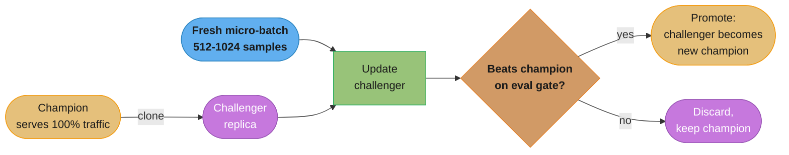
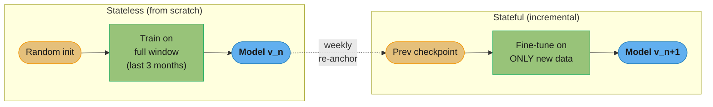
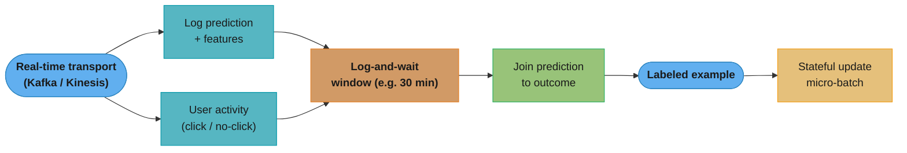
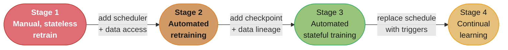
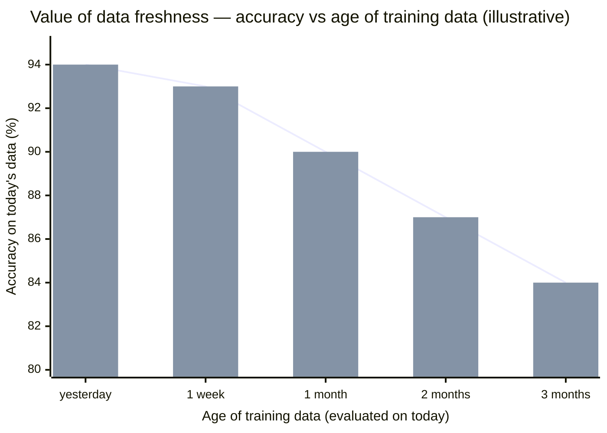
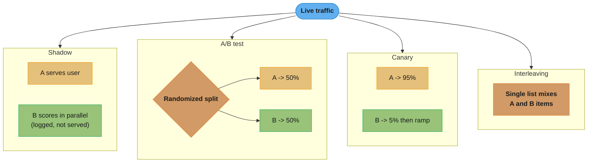
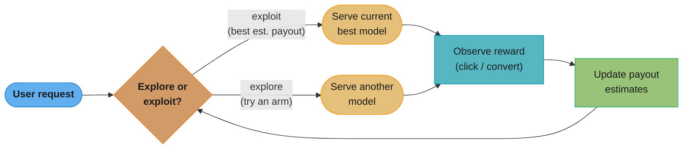
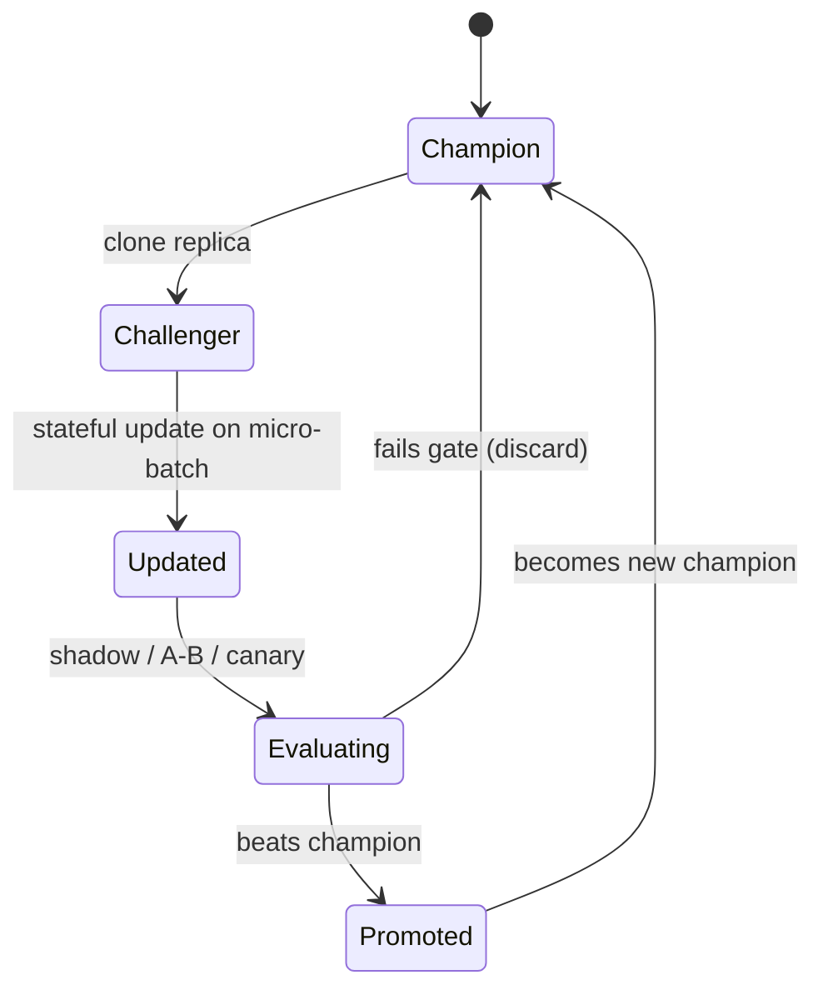

# Chapter 9: Continual Learning and Test in Production

> Ch 9 of 11 · Designing Machine Learning Systems (Huyen) · builds on Ch 8 — closing the loop: retraining as a first-class system, and proving updates in production

## Chapter Map

Chapter 8 diagnosed the disease: production data drifts away from training data, so every deployed model decays. This chapter prescribes the cure — **continual learning**: treating model updates as a routine, automated system rather than a heroic quarterly project — and then insists you **prove each update in production** before trusting it. The two halves are inseparable: updating a model more often only helps if you can also *evaluate* the fresh model safely on real traffic, so the chapter pairs "how to retrain" with "how to test in production without burning users."

**TL;DR:**
- **Continual learning is not per-sample online updating.** It means updating a model on **micro-batches** with an **evaluation gate**, on a **replica** (champion/challenger), and only promoting it if it beats the current model. The right mental model is "retraining, made frequent and automatic," not "SGD on every click."
- **Stateless retraining** (from scratch on a data window) vs **stateful training** (fine-tune the last checkpoint on *only new* data). Stateful cuts compute and data cost dramatically — Grubhub reported a **45x compute-cost reduction and +20% purchase-through** — but you still need occasional stateless runs when features or architecture change.
- **The real bottleneck is not training — it's fresh data and evaluation.** You need labels with **short natural feedback loops**, a **log-and-wait** window tuned to the task, and enough evaluation time to trust each update (fraud can take ~2 weeks to mature). Evaluation, not compute, caps your update frequency.
- **Test in production is mandatory** because offline evaluation only proves the past. The toolkit: **shadow deployment**, **A/B testing**, **canary release**, **interleaving experiments** (Netflix: finds the winner with **>100x fewer samples**), and **bandits** (explore-exploit; far more data-efficient than fixed-split A/B).

## The Big Question

> "My model starts decaying the moment I ship it (Ch 8). How do I keep it fresh *as a system* — automatically, cheaply, and safely — and how do I know a fresher model is actually *better* before I let it touch real users?"

Analogy: a deployed model is a perishable good, and Chapter 8 was the "milk goes sour" warning. Continual learning is the automated restocking system — but you don't want to ship spoiled milk *faster*, so every new batch passes a taste test (evaluation gate) on a side shelf (a challenger replica) before it replaces what's on the main shelf (the champion). "Test in production" is that taste test, run on real customers in a way that can't poison the whole store.

---

## 9.1 Continual Learning

### What continual learning actually means

The phrase conjures an image of a model that updates itself with **every incoming sample** the instant it arrives — true online, per-sample gradient descent. **That image is wrong, and pursuing it is a trap** for two reasons:

1. **Catastrophic forgetting / instability.** Updating on one sample at a time makes the model lurch toward whatever the last few examples said; it forgets older patterns and is trivially perturbed by noise or a burst of anomalous traffic.
2. **Cost.** A hardware update per sample is wasteful; modern accelerators are efficient on batches, not on singletons.

What practitioners actually mean by continual learning is: **update the model in micro-batches** — accumulate a small batch (e.g., 512 or 1,024 examples, or "the last hour of data") and run one update step — and **only after the updated model passes an evaluation gate** does it get promoted to serve traffic. Concretely:

- You **never** mutate the model currently serving users in place.
- You take a **replica** of the production model — the **challenger** — update *it* on the fresh micro-batch, evaluate it, and only if it beats the current **champion** do you replace the champion with it.
- Update *frequency* is a dial (hourly, every N examples, on a trigger) — decoupled from the fantasy of "instantly per sample."



Caption: continual learning updates a *replica* on micro-batches and only promotes it past an evaluation gate — the champion serving users is never mutated in place, which is what keeps a bad update from reaching production.

### Stateless retraining vs stateful training

There are two fundamentally different things you can do when it is time to "update the model," and conflating them is the single most common confusion in this area:

| | **Stateless retraining** (from scratch) | **Stateful training** (incremental / fine-tune) |
|---|---|---|
| Starting point | Randomly initialized weights | The previous model's **checkpoint** |
| Data used | A **window** of data (e.g., last 3 months), reprocessed every run | **Only the new** data since the last update |
| Also called | "Train from scratch" | "Fine-tuning," "incremental learning" |
| Typical cadence | Weekly / occasional | Hourly / continual |

**Stateless retraining** is what most companies do today: throw away the old model, initialize fresh, and train on a fixed window of recent data. It's simple and robust but reprocesses the *same* data over and over.

**Stateful training** continues training the *existing* model on *only the data it hasn't seen yet*. The wins are large and well documented:

- **Less compute.** You process each data point roughly once instead of re-training on the whole window every cycle. Huyen cites **Grubhub**: moving from daily stateless retraining to stateful training gave a **45x reduction in compute cost** and a **20% increase in purchase-through rate** (fresher models converted better *and* cost far less to train).
- **Less data-storage need.** You only need to keep the *new* data since the last checkpoint, not a long window you must re-read each run. (You can, in principle, avoid storing historical data at all — though most keep some for the occasional stateless run.)
- **Faster convergence.** Starting from a good checkpoint, the model needs far fewer steps to absorb the new data than starting from random weights.

**The crucial caveat — data iteration still needs stateless runs.** Stateful training only works when the model's *inputs and structure are unchanged* and you are merely feeding it **fresher data of the same shape** (this is "data iteration"). The moment you **add a new feature, change a feature's encoding, or change the model architecture** (this is "model iteration"), the old checkpoint's weights no longer line up with the new input/parameter space — you **must** run a stateless retrain from scratch.

**So companies do BOTH.** The mature pattern is: stateful updates frequently (e.g., hourly), plus an **occasional stateless recalibration from scratch** (e.g., weekly) to (a) reset any drift/error that has accumulated across many incremental steps, and (b) incorporate any feature or architecture changes. Think of the stateless run as periodically re-anchoring the model to the full data distribution.



Caption: stateless reprocesses the whole window from random weights; stateful continues the last checkpoint on only the new data — and companies run stateless periodically to re-anchor the incrementally-updated model (and to absorb feature/architecture changes stateful can't).

### A note on terminology: "continual" vs "online"

The literature uses **online learning**, **incremental learning**, **continual learning**, and **lifelong learning** almost interchangeably, but Huyen deliberately prefers **"continual learning."** "Online learning" strongly connotes the per-sample update that we just argued *nobody actually does*, so it invites the "catastrophic forgetting" objection and misleads readers into thinking continual learning is exotic and dangerous. "Continual learning" keeps the focus where it belongs: on **update cadence** (keep the model current) rather than on **update granularity** (one sample at a time). The point is *frequency*, not *singleton updates*.

### Why continual learning — the motivations

Four forces make keeping models current worth the engineering:

1. **The value of fresh data.** Some tasks reward recency enormously. Huyen's canonical example is **TikTok's recommender**, which adapts *within a single session* — as you watch and skip, the model rapidly re-tunes to your revealed interests, which is a large part of why the feed feels "addictive." In-session freshness would be impossible with a model retrained monthly.
2. **Combating distribution shift (the Ch 8 problem).** Continual learning is the *operational answer* to the data-distribution-shift problem diagnosed in Chapter 8. If production data drifts continuously, a continuously-updated model tracks it instead of decaying between quarterly retrains.
3. **Cold start and user churn.** You constantly serve users the model has little or no history on: **brand-new users** (never seen before), **returning users** whose behavior changed while they were away, and **privacy-limited users** (logged out, cookies cleared, opted out of tracking). Continual learning lets the system adapt to such a user *within their current session* from the little signal they generate, rather than serving a stale generic model until the next batch retrain.
4. **The superset argument.** Continual learning is a *strict capability superset* of scheduled batch retraining: anything you can do by retraining on a fixed schedule, you can do by continual learning — you simply choose the frequency, and you can make it higher when the payoff justifies it. Framed this way, "should we do continual learning?" becomes "at what frequency does re-training pay for itself?" — and the answer is rarely "never." If a task works batched, make updates **more frequent wherever the freshness value exceeds the update cost.**

---

## 9.2 Continual Learning Challenges

If continual learning is so beneficial, why isn't it universal? Three concrete challenges — data, evaluation, and algorithms — stand in the way.

### Challenge 1: Fresh data access

To update a model on fresh data, you must be able to **get the fresh data fast** — and this is harder than it sounds.

- **The data-warehouse lag.** Most companies pull training data from a data warehouse, which is populated by **ETL jobs** that gather, clean, and deposit data from many sources on a schedule. That pipeline introduces **hours of lag** — the freshest data in the warehouse might already be a day old. If your update cadence is hourly, warehouse latency alone defeats it.
- **Pull from real-time transport instead.** The workaround is to read data **directly from the real-time transport** (a message broker such as **Kafka** or **Kinesis**) *before it lands* in the warehouse. The events you need are already flowing through the broker to feed online serving; continual learning taps that same stream.

**The labeling bottleneck.** Fresh *features* are necessary but not sufficient — you also need fresh **labels**, and labels are usually the harder half:

- **Best tasks have natural labels with short feedback loops.** Continual learning shines where the label is generated by the user's own subsequent behavior, quickly: **recommendations** (did they click/watch?), **ads** (did they click/convert?), **ETA prediction** (what was the actual arrival time?), **stock/demand forecasting** (what actually sold?). In these tasks the label arrives seconds-to-minutes after the prediction, so labeled data is available almost as fast as the raw events.
- **Label computation is itself a stream-processing problem.** The label doesn't arrive pre-attached; you must **compute it from user-activity logs** — join a logged *prediction* to the *subsequent user action* (a click, a purchase, a "no action" after a timeout). Doing this on a live stream is a genuine stream-processing job (windowed joins over Kafka), not a nightly SQL query.
- **Log-and-wait for click labels.** To label "did the user click this recommendation?" you must **log the prediction and then wait** a window to see whether a click arrives. The **window length is a real tuning problem**:
  - **Too short** → you mislabel slow clickers. If your window is 5 minutes and a user clicks at minute 10, you've already recorded a negative ("no click") label — a **false negative** baked into your training data.
  - **Too long** → the label is **stale** by the time it's usable, and you're holding a huge amount of in-flight prediction state waiting for windows to close, delaying every update.

  The right window is task-dependent and set empirically from the observed click-time distribution (e.g., "95% of clicks happen within X minutes").

**Broken → fix: the too-short window that manufactures false negatives.** A recommender labels each shown item by joining the logged prediction to clicks that arrive within a 5-minute window, then emits the label immediately:

```python
# BROKEN: emit a label as soon as the window nominally "closes",
# but 5 min is shorter than the real click-time tail.
WINDOW = timedelta(minutes=5)

def label(prediction):
    clicks = clickstream.query(
        item=prediction.item,
        user=prediction.user,
        since=prediction.ts,
        until=prediction.ts + WINDOW)      # <-- window too short
    return 1 if clicks else 0              # user who clicks at min 10 -> labeled 0

# Result: slow clickers become "no click" (false negatives). The model learns
# that genuinely-good recommendations get no clicks, and quality DROPS after
# each continual update -- a self-inflicted feedback poison.
```

The fix has two parts: size the window from the *measured* click-time distribution (cover ~95% of clicks, say 30 minutes), and treat "no click yet" as **unknown**, not negative, until the window truly closes — so an in-flight prediction is never emitted as a negative prematurely:

```python
# FIXED: window sized from the click-time histogram; label only emitted
# once the full window has elapsed, so a pending item is never a false 0.
WINDOW = timedelta(minutes=30)            # covers ~95% of observed clicks

def try_label(prediction, now):
    clicks = clickstream.query(
        item=prediction.item, user=prediction.user,
        since=prediction.ts, until=now)
    if clicks:
        return 1                          # positive as soon as a click lands
    if now - prediction.ts >= WINDOW:
        return 0                          # negative ONLY after the window closes
    return None                           # still pending -> hold, don't train on it
```

The tradeoff didn't vanish — a 30-minute window means labels lag 30 minutes and you hold that much in-flight prediction state — but it removes the systematic false negatives that were corrupting every update.



Caption: labels are *computed* by a windowed stream join of each logged prediction to the user's later action — the wait window trades false-negative mislabeling (too short) against label staleness and in-flight state (too long).

### Challenge 2: Evaluation

The scariest challenge, because **more frequent updates multiply the chances to fail catastrophically.**

- **More updates = more failure opportunities.** Every model update is a chance to ship a broken model. A quarterly retrain gives you four chances a year to break production; an hourly update gives you ~8,760. Continual learning *increases* the rate at which bad models can reach users, so it demands *more* rigorous, automated evaluation, not less.
- **Adversarial poisoning risk — the Tay lesson.** A continually-learning model that trains on live user input is a target for **coordinated data poisoning**. Microsoft's **Tay** chatbot (2016) learned from Twitter interactions and, within **under 24 hours**, was manipulated by coordinated trolls into producing offensive content — forcing Microsoft to pull it. The faster and more automatically a model absorbs user data, the more exposed it is to being deliberately steered by malicious input.
- **Evaluation takes TIME.** You cannot always know quickly whether an update is good. Huyen's example: a **fraud-detection** model's true quality can take about **two weeks** to reveal itself, because fraud is rare and confirmations (chargebacks, investigations) arrive slowly — you must accumulate enough fraudulent events under the new model to trust its precision/recall. Consequently, **evaluation — not training — becomes the bottleneck on update frequency.** Even if you *could* retrain hourly, if it takes two weeks to trust an update, your *effective* safe cadence is measured in weeks. Speeding up training buys you nothing until you speed up trustworthy evaluation.

### Challenge 3: Algorithm

Not all model families update incrementally with equal ease.

- **Neural networks fine-tune naturally.** A neural net can absorb a fresh micro-batch with a few gradient-descent steps from its current weights — stateful training is native to it.
- **Matrix-based and tree-based models resist incremental updates.** **Collaborative filtering** builds a large **user-item matrix** and factorizes it; adding new interactions generally requires **recomputing the whole matrix factorization**, not a cheap local update. **Tree-based models** (a fitted decision tree / gradient-boosted forest) don't accept a "few more gradient steps" — the tree structure was chosen globally over the training set, so incorporating new data usually means re-fitting. **Exceptions exist**: algorithms designed for streaming, such as **Hoeffding trees / Very Fast Decision Trees (VFDT)**, *can* grow incrementally from a stream — but they are special-purpose, not the default.
- **Feature-pipeline statefulness.** Even with a neural net, continual learning forces your **feature computation to be stateful**. Standardization needs running statistics — mean, variance, min, max — computed over the data. In batch training you compute these once over the whole training set; in continual learning you must **maintain and update these running statistics online** as new data arrives, or your normalization drifts out of sync with the model. This turns feature engineering into a stateful streaming job too.

---

## 9.3 Four Stages of Continual Learning

Companies don't jump to continual learning; they climb a ladder. Huyen frames the progression as four stages, each unlocked by having built the infrastructure the previous stage lacked. The value of the framing is diagnostic: it tells you *what you must build next* to level up.



Caption: the four stages are a maturity ladder — each arrow is the *specific infrastructure* you must build to advance (scheduler, then lineage tracking, then trigger machinery), and most companies plateau at Stage 2.

### Stage 1 — Manual, stateless retraining

The starting point for nearly every pre-ML-maturity company. Models are retrained **only when someone remembers to** — typically after a stakeholder notices performance has visibly degraded and an engineer happens to have time. Retraining is **stateless** (from scratch) and **manual** (a human runs a notebook or script by hand). It is ad hoc: the same model might go months without an update, then get retrained twice in a week during a fire drill. Most companies that have only a handful of models in production live here.

**How you know you're ready for Stage 2:** the manual process becomes painful — you have enough models, or updates are needed often enough, that "when someone remembers" is unacceptable, and you find yourself wishing the retrain just ran on a schedule.

### Stage 2 — Automated retraining

You write a **script** and put it on a **scheduler** so retraining runs automatically at a fixed cadence (nightly, weekly). This is where **most companies with mature ML infrastructure actually sit.** The retrain is usually still **stateless** (from scratch each run). The real work of reaching Stage 2 is not the script — it's the supporting infrastructure the script *requires*:

- **A scheduler** (Airflow, Argo, or similar) to trigger the retrain reliably on a cadence.
- **Data availability and versioning** — the retrain script must be able to *find and pull* the right, freshest data automatically, with the data version recorded so runs are reproducible.
- **A model store / artifact lineage** — somewhere to version and store the produced model artifacts (weights, plus the features, hyperparameters, and metrics that produced them) so you know exactly what shipped.
- **Feature reuse (the log-and-wait note).** To avoid recomputing features that were already computed at prediction time, you **log the features used at serving** and reuse them for training — this is the same log-and-wait mechanism from 9.2, now doubling as a way to make retraining cheaper and keep train/serve features consistent.

**Where the frequency comes from at Stage 2:** honestly, from **gut feeling.** Most companies pick "retrain nightly" or "retrain weekly" by intuition, not by measuring the value of data freshness. (Section 9.4 is about replacing that gut number with a measurement.)

**How you know you're ready for Stage 3:** stateless retraining's compute/data cost becomes the pain point — reprocessing the full window every night is expensive and slow — and you want the Grubhub-style savings of updating on only the new data.

### Stage 3 — Automated, stateful training

You reconfigure the automated script to do **stateful training**: pull only the **delta** (new data since the last checkpoint) and fine-tune the previous model rather than retraining from scratch. This is mostly a **reconfiguration** of the Stage 2 pipeline, but it requires two additional bookkeeping capabilities:

- **Model-checkpoint lineage** — you must reliably track *which* checkpoint each update continued from, so you can reconstruct the chain of incremental updates and roll back to a known-good checkpoint if an update goes bad.
- **Data-version bookkeeping** — you must track exactly which data has already been consumed, so each stateful update pulls *only* the new data and nothing is trained on twice or skipped.

**How you know you're ready for Stage 4:** a fixed schedule no longer fits — you want to update *when it matters* (a sudden drift, a traffic surge) rather than waiting for the next scheduled slot, or you want to update far more often than any fixed schedule sensibly allows.

### Stage 4 — Continual learning

The top of the ladder replaces the **fixed schedule** with **triggers**: the model updates automatically **whenever a condition is met**, not when the clock says so. Trigger types:

- **Time-based** — "it's been an hour" (still time, but as a trigger among others).
- **Performance-based** — model accuracy dropped below a threshold on live evaluation → retrain now.
- **Volume-based** — enough new labeled data has accumulated (e.g., "5% more data") → retrain now.
- **Drift-based** — a data-distribution-shift detector (Chapter 8) fires → retrain now.

Very few companies reach true trigger-based Stage 4. The **edge/on-device dream** lives here: models updating **on the user's device** from that user's own fresh data, adapting continuously and privately without a server round-trip. It is aspirational for most, but it is the logical endpoint of the "adapt within the session" motivation from 9.1.

---

## 9.4 How Often to Update Your Models

Before asking "how do I update continually?" you should answer a prior question: **how often is updating even worth it?** Updating more frequently costs compute and operational risk, so the frequency should be justified, not guessed.

### The value of data freshness — measure it

Huyen's method: **quantify how much fresher data actually improves the model**, and let that decide the cadence. The experiment:

1. Train the *same* model on data from **different, equal-length time windows** ending at different points in the past — e.g., a model trained on data from *3 months ago*, one from *2 months ago*, one from *1 month ago*, one from *last week*, one from *yesterday*.
2. **Evaluate all of them on today's data** (the current distribution).
3. **Read the decay curve.** The gap between "trained on yesterday's data" and "trained on 3-month-old data" *is* the value of data freshness.

The decision rule:

- If the model trained on **3-month-old data performs almost as well** as the one trained on yesterday's data → fresh data has **low value**; you can **relax** and retrain infrequently. Frequent updates would spend compute for negligible accuracy.
- If performance **drops sharply** as the training data ages → fresh data has **high value**; frequent (or continual) updates pay for themselves.



Caption: train the same model on equal windows ending at different past points, evaluate all on *today's* data — a steep decay (like this) means fresh data is valuable and you should update often; a flat line means you can relax the cadence.

### Model iteration vs data iteration — where compute buys more

Two distinct ways to "improve the model," and they compete for the same compute budget:

- **Model iteration** — change the **model itself**: a new architecture, a new feature, a different algorithm. This generally requires a **stateless retrain from scratch** (the old checkpoint doesn't transfer).
- **Data iteration** — keep the **same model** and feed it **fresher data** (stateful training). No architecture or feature change.

The question is: **where does your next unit of compute buy more accuracy** — building a fancier model, or feeding the current one fresher data? Early in a model's life, model iteration usually dominates (a better architecture is a step-change). But Huyen's observation is that **at some point the returns to model iteration flatten, and data iteration dominates** — you get more improvement from feeding the existing model fresher data (i.e., from continual learning) than from another architecture tweak. Recognizing when you've crossed that point is what tells you to invest engineering in the *freshness pipeline* rather than in yet another model redesign. And crucially: the value-of-data-freshness experiment above only measures the *data iteration* axis — if you've just changed the architecture, you can't reuse an old checkpoint, so you're back to stateless retraining regardless of the freshness curve.

---

## 9.5 Test in Production

You've decided to update often. But **how do you know a freshly updated model is actually better before you trust it with users?** Offline evaluation isn't enough, so you must evaluate on real production traffic — carefully.

### Why offline evaluation is insufficient

- **Static test sets prove the past, not the present.** A fixed held-out test set measures performance on a *frozen snapshot* of history. But Chapter 8 established that production data drifts, so good numbers on last quarter's test set say little about today's traffic.
- **Backtests are still stale.** A smarter offline approach is a **backtest**: evaluate the new model on the *most recent* labeled data it hasn't seen. Better — but by the time data is labeled and available it's already somewhat old, and a backtest still can't observe how *users react* to the new model's outputs (a recommender changes what users see, which changes what they click — a feedback the static data can't capture). You have to go live.

The five techniques below are the "test in production" toolkit. The first three are about **routing traffic to a candidate model safely**; the last two are about **finding the winner efficiently.**



Caption: the four routing strategies differ in who sees the candidate model B — shadow shows B to nobody (log-only), A/B splits users into disjoint groups, canary ramps B from a tiny slice, and interleaving mixes A's and B's outputs into one list per user.

### Shadow deployment

Deploy the challenger **alongside** the champion. Every incoming request goes to **both** models: the **champion's prediction is served** to the user, and the **challenger's prediction is logged but never shown.** You then compare the two prediction streams offline.

- **Zero user risk.** Because the challenger's output never reaches a user, a broken challenger can't hurt anyone — this is the **safest** way to test a new model.
- **Cost: ~2x serving compute.** You're running two models on every request, roughly doubling inference cost for the duration.
- **The blind spot: no user-interaction signal.** Shadow tells you *whether the two models agree* and whether the challenger errors out, but for tasks like **recommendations** it **cannot tell you whether users would have engaged** with the challenger's picks — because those picks were never shown, so there are no clicks to measure. Shadow validates correctness and stability, not user response.

### A/B testing

Split live traffic: route some users to model **A** (champion) and some to model **B** (challenger), serve each group its model's real predictions, and compare a business metric (clicks, conversions, revenue) between groups. Getting it *right* has two non-negotiable requirements:

1. **Assignment must be RANDOMIZED.** Each user must be assigned to A or B by a random draw, independent of anything else. The classic **confound to avoid**: running **A on Monday and B on Tuesday.** That isn't an A/B test — it's a day-of-week experiment. Any difference could be caused by the day (Monday vs Tuesday shopping behavior) rather than the model. Randomize *per user across the same time period* so the two groups differ only in the model.
2. **Enough samples for statistical significance.** You need a large enough sample that the observed difference is unlikely to be noise. You compare the groups with a **statistical hypothesis test** (a two-sample test) that yields a **p-value** — the probability of seeing a difference this large if the two models were actually equal.

**Caveats on the statistics:**
- **Statistical significance is not everything.** A "significant" result at the 5% level still carries a ~5% chance of being a false positive; and statistical significance is not the same as **practical significance** — a difference can be statistically real yet too small to matter for the business. Conversely, an important effect can be missed if the sample is too small.
- **More than two variants.** You aren't limited to two models — you can run **A/B/C/D testing** with several challengers at once, splitting traffic among them (with the multiple-comparison caveat that testing many variants inflates the chance of a spurious "winner").

### Canary release

Deploy the new model to a **small slice** of traffic (the **canary** — named for the canary in a coal mine), watch its metrics, and **gradually ramp** the traffic share while continuing to monitor; if anything looks wrong, **roll back** immediately by routing all traffic back to the old model.

- **Canary as an A/B carrier.** If the split between canary and non-canary traffic is **randomized**, a canary release *is* effectively an A/B test with a ramping allocation — you can run proper statistics on it.
- **The honesty caveat:** if the split is **not** randomized (e.g., the canary gets one data center's traffic, or a self-selected beta cohort), then a canary is **just eyeballing metrics** — you can watch dashboards and roll back on obvious breakage, but you cannot make a rigorous "B beats A" claim, because the two groups aren't comparable. Canary without randomization is a safety mechanism, not a measurement.

### Interleaving experiments

A cleverer way to compare two **rankers** (recommenders/search), popularized by **Netflix.** Instead of showing group 1 model A's list and group 2 model B's list, **interleave both models' recommendations into a SINGLE list** shown to **each** user, then **attribute each click to whichever model produced the clicked item.**

- **The drafting metaphor.** Think of two team captains (models A and B) **drafting players (items)** into one shared lineup. The final list contains items chosen by both models; when the user clicks an item, the model that "drafted" it gets credit.
- **Position-bias fix (team-drafting).** Users click higher-positioned items more regardless of quality, so if model A always got the top slot it would win unfairly. **Team-drafting** alternates which model picks first (and randomizes the lead), giving both models **equal odds of the favorable positions**, so position bias cancels out.
- **The headline Netflix result: >100x smaller samples.** Netflix found interleaving reliably identifies the **better ranking algorithm with sample sizes over 100x smaller** than a traditional A/B test needs — because every user contributes a *direct A-vs-B comparison* within their own list, rather than the noisy across-group comparison A/B relies on.
- **The caveat: preference ≠ core-metric proof.** Interleaving measures **which ranker users prefer**, click-for-click — it does **not** directly prove the winner improves the **core business metric** (retention, revenue, watch-time). So the standard practice is to use interleaving to **cheaply narrow the field** to the top candidate(s), then run a **traditional A/B test** on the winner to confirm the business-metric lift. Interleaving is a fast filter, not the final word.

### Bandits

A/B testing is **static**: it commits a fixed fraction of traffic (say 50%) to each variant for the whole experiment, *regardless of how badly one variant is doing.* If B is clearly worse, A/B testing keeps sending 50% of users to B until the experiment ends — that wasted exposure is **regret** (the cost of showing users the worse option). **Bandits** fix this.

- **The casino framing (multi-armed bandit).** Imagine a row of slot machines ("one-armed bandits") with unknown payout rates. You want to maximize winnings, which means balancing **exploration** (try each machine enough to estimate its payout) against **exploitation** (keep pulling the machine that's paying best so far). Model selection is the same problem: each model is an "arm," the reward is user engagement, and a bandit **dynamically routes more traffic to the model that is winning** as evidence accumulates — minimizing regret instead of paying a fixed 50% tax on the loser.



Caption: a bandit loops choose-serve-observe-update, shifting traffic toward the higher-payout model as estimates sharpen — unlike A/B's fixed split, it stops paying full price to keep exposing users to the losing arm.

- **Data efficiency — the book's comparison.** Because bandits stop wasting traffic on the loser, they reach a confident decision with **far fewer "loss" samples** (users exposed to the worse model) than A/B testing. Huyen cites an illustrative comparison: to conclude at 95% confidence that one variant beats another, a classic **A/B test can need on the order of ~630,000 samples**, while an **epsilon-greedy bandit reaches the same conclusion with a fraction of that** (roughly on the order of ~100,000 samples spent on the worse arm). The exact numbers depend on the effect size, but the order-of-magnitude message holds: **bandits converge with far fewer regret-samples than A/B.**
- **Algorithms:**
  - **Epsilon-greedy** — with probability ε explore (pick a random arm), with probability 1−ε exploit (pick the current best). Simple; ε controls the explore/exploit balance.
  - **Thompson sampling** — maintain a *probability distribution* over each arm's payout; each round, **sample** from those distributions and play the arm with the highest sampled value. Naturally explores arms it's uncertain about.
  - **Upper Confidence Bound (UCB)** — "**optimism under uncertainty**": pick the arm with the highest *upper confidence bound* on its payout, so a rarely-tried arm (wide uncertainty → high upper bound) gets explored until its estimate tightens.
- **Why bandits are rarer in practice — the requirements.** Bandits are more powerful but **harder to deploy**, because they demand:
  1. **Online prediction** — the system must serve predictions in real time (bandits are meaningless for batch prediction).
  2. **Short feedback loops** — you need the reward (click/convert) quickly to update the payout estimates; if feedback takes two weeks, the bandit can't adapt fast enough to be worth it.
  3. **A payout-tracking mechanism** — infrastructure to attribute each reward back to the model/arm that produced it and continuously update per-arm estimates. Most stacks don't have this, so teams default to the simpler A/B test.

- **Contextual bandits — exploration WITHIN a model's recommendations.** The bandits above choose between *whole models*. **Contextual bandits** apply the explore/exploit idea **at the item level, inside a single recommender**: for each request (the "context"), decide which items to show, balancing exploiting items the model is confident about against exploring items it's uncertain about. They directly attack the **partial-feedback problem** (a.k.a. bandit feedback): you only learn the outcome for items you actually *show* — you never observe what would have happened for the items you didn't show, so a purely-exploiting recommender never discovers that a rarely-shown item might be great. Contextual bandits deliberately explore to gather that missing feedback. Huyen's honest bottom line: **contextual bandits improve model performance but are hard to implement** — the implementation is **dependent on the specific learning algorithm** (unlike model-level bandits or A/B tests, which treat the model as a black box), so they're far less general-purpose and adopted by relatively few teams.

---

## Visual Intuition

### The log-and-wait window is a false-negative / staleness tradeoff

```
click-time distribution for shown recommendations
(each x = clicks landing in that minute)

min:  0    5    10   15   20   25   30   35   40
      |----|----|----|----|----|----|----|----|
clicks xxxx xxxxxxxx xxxxx xxx  xx   x    .    .
      ^^^^^^^^^^^^^^^^^^^^^^^^^^^^^^^^^
      window = 30 min  ->  captures ~95% of clicks

  window = 5 min:   labels a minute-10 clicker as "no click"  (FALSE NEGATIVE)
  window = 30 min:  captures the tail, but 30 min of state held per prediction
  window = 4 hours: near-perfect labels, but labels arrive too stale to update on
```

Caption: the window must be long enough to catch the bulk of the click-time distribution (avoiding false-negative "no-click" labels on slow clickers) yet short enough that labels aren't stale and in-flight prediction state stays bounded — tune it from the observed click-time histogram (e.g., "cover 95% of clicks").

### Champion / challenger promotion gate



Caption: every continual update walks this cycle — a bad update lands in "fails gate → discard" and never reaches the serving champion, which is exactly how continual learning survives its own increased failure rate (9.2's evaluation challenge).

---

## Key Concepts Glossary

- **Continual learning** — keeping a model current by frequent, automated micro-batch updates behind an evaluation gate (not per-sample online SGD).
- **Micro-batch update** — updating on a small accumulated batch (e.g., 512–1,024 samples) rather than one sample at a time.
- **Champion / challenger** — the model currently serving traffic (champion) vs a replica being updated and evaluated (challenger); promote only if it wins.
- **Stateless retraining** — retraining from randomly initialized weights on a full data window each run.
- **Stateful training (incremental / fine-tuning)** — continuing the previous checkpoint on only the new data since the last update.
- **Data iteration** — improving the model by feeding the same architecture fresher data (stateful-friendly).
- **Model iteration** — improving the model by changing architecture/features/algorithm (requires stateless retrain).
- **Catastrophic forgetting** — an over-eager update erasing previously learned patterns.
- **Online learning** — per-sample updating; the term Huyen avoids because it misleads (continual learning is not per-sample).
- **Natural label** — a label produced automatically by subsequent user behavior (click, conversion, actual ETA).
- **Feedback loop length** — time from prediction to label availability; short loops enable frequent updates.
- **Log-and-wait** — logging a prediction and waiting a window to observe the outcome before assigning a label.
- **Label computation** — deriving labels by (stream-)joining logged predictions to later user activity.
- **Data-warehouse lag** — the ETL delay that makes warehouse data too stale for high-frequency updates.
- **Real-time transport** — a message broker (Kafka, Kinesis) tapped for fresh data before it lands in the warehouse.
- **Feature reuse** — logging serving-time features and reusing them for training (cheaper, train/serve consistency).
- **Hoeffding tree / VFDT** — a decision-tree algorithm designed to grow incrementally from a stream (exception to tree models' resistance to updates).
- **Four stages** — manual stateless → automated retraining → automated stateful → trigger-based continual learning.
- **Update trigger** — a condition (time, performance drop, data volume, drift) that fires a continual update instead of a fixed schedule.
- **Value of data freshness** — measured by training on equal windows of differently-aged data and evaluating on today's data.
- **Backtest** — offline evaluation on the most recent unseen labeled data (still stale; no user-reaction signal).
- **Shadow deployment** — running the challenger in parallel, logging its predictions without serving them (zero risk, ~2x cost).
- **A/B testing** — randomized split of live traffic between models, compared with a two-sample statistical test.
- **p-value** — probability of the observed difference if the two models were actually equal.
- **Statistical vs practical significance** — a real effect vs one big enough to matter for the business.
- **Canary release** — ramping a new model from a small traffic slice with rollback; an A/B test only if the split is randomized.
- **Interleaving** — mixing two rankers' items into one list per user and attributing clicks per model; team-drafting removes position bias.
- **Team-drafting** — alternating/randomizing which ranker picks first so both get equal position odds.
- **Multi-armed bandit** — explore-exploit routing that shifts traffic to the winning arm to minimize regret.
- **Regret** — the cost of exposing users to a worse variant during an experiment.
- **Epsilon-greedy / Thompson sampling / UCB** — bandit algorithms (random-explore / sample-from-posterior / optimism-under-uncertainty).
- **Contextual bandit** — item-level explore-exploit inside one recommender, addressing partial (bandit) feedback.
- **Partial (bandit) feedback** — observing outcomes only for items actually shown, never for the ones withheld.

---

## Tradeoffs & Decision Tables

**Stateless retraining vs stateful training**

| Dimension | Stateless (from scratch) | Stateful (incremental) |
|---|---|---|
| Compute per update | High (reprocess full window) | Low (only new data) — Grubhub 45x less |
| Data storage need | Full window kept | Only the delta |
| Convergence | Slow (from random init) | Fast (from checkpoint) |
| Handles new feature/architecture | Yes | No — must go stateless |
| Accumulated-error risk | None (fresh each run) | Yes — needs periodic re-anchor |
| Typical cadence | Weekly / occasional | Hourly / continual |

**Test-in-production techniques**

| Technique | User risk | Measures user reaction? | Cost | Best for |
|---|---|---|---|---|
| Shadow deployment | None (log only) | No | ~2x serving | Correctness / stability before exposure |
| A/B testing | Medium (B serves real users) | Yes | Baseline | Rigorous business-metric comparison |
| Canary release | Low → rising | Only if randomized | Baseline | Safe gradual rollout with rollback |
| Interleaving | Low (mixed list) | Yes (preference) | Low | Cheaply picking the best *ranker* (>100x fewer samples) |
| Bandits | Low (traffic shifts off loser) | Yes | Higher infra | Minimizing regret when feedback is fast |

**A/B testing vs bandits**

| | A/B testing | Bandits |
|---|---|---|
| Traffic allocation | Fixed (e.g. 50/50) throughout | Dynamic — shifts to the winner |
| Regret (exposure to loser) | High (fixed loser tax) | Low (minimized) |
| Data efficiency | Lower (~630K samples in book's example) | Higher (~a fraction of that) |
| Implementation | Simple, model-agnostic | Harder: needs online serving + short feedback + payout tracking |
| Statistical rigor | Well-established tests | Requires care |

---

## Common Pitfalls / War Stories

- **Chasing per-sample "online learning."** Teams hear "continual learning" and try to SGD on every event, then hit instability and catastrophic forgetting and conclude continual learning "doesn't work." The fix is micro-batches plus an evaluation gate on a challenger replica — frequency, not singleton granularity.
- **Stateful-training a model whose features just changed.** Fine-tuning the old checkpoint after adding a feature or changing an encoding silently corrupts the model, because the weights no longer align with the input space. Any model/feature change forces a stateless retrain from scratch — reserve stateful updates for data iteration only.
- **Log-and-wait window too short.** A recommender's label pipeline uses a 5-minute click window; slow clickers (who click at minute 10) are recorded as negatives, poisoning training data with false negatives and teaching the model that good recommendations get no clicks. Set the window from the actual click-time distribution.
- **Reading training data from the warehouse for a fast cadence.** The team wants hourly updates but pulls from a warehouse whose ETL runs every few hours, so "hourly" updates train on hours-old data. Tap the real-time transport (Kafka/Kinesis) directly for fresh data.
- **The Tay poisoning failure.** A model that learns from live user input with weak guardrails is a target: Microsoft's Tay was steered into offensive output by coordinated trolls in under a day. Continual learning increases the *rate* of bad-model exposure, so it demands stronger automated evaluation and abuse defenses, not less.
- **"A on Monday, B on Tuesday" is not an A/B test.** Splitting variants by *time* instead of randomizing per user confounds the model difference with day-of-week effects; the result is meaningless. Randomize assignment across the same time period.
- **Trusting a non-randomized canary as a measurement.** Ramping B on one data center's traffic and eyeballing dashboards can catch a crash but cannot prove "B is better" — the groups aren't comparable. For a real claim you need randomized assignment (i.e., canary-as-A/B).
- **Declaring interleaving's winner the business winner.** Interleaving proves users *prefer* a ranker click-for-click, not that it lifts retention or revenue; shipping on interleaving alone skips the business-metric check. Use interleaving to shortlist, then A/B test the finalist.
- **Speeding up training while evaluation stays slow.** If a fraud model takes two weeks to evaluate, making training instant doesn't let you update safely every hour — evaluation is the bottleneck. Invest in faster, automated, trustworthy evaluation before cranking update frequency.

---

## Real-World Systems Referenced

- **TikTok** — in-session continual adaptation of the recommender (the "addictive" fresh-data example).
- **Grubhub** — stateful training gave a **45x compute-cost reduction** and **+20% purchase-through** vs daily stateless retraining.
- **Weibo, Alibaba, and other large-scale recommenders** — production continual-learning practitioners.
- **Microsoft Tay** — the 2016 chatbot poisoned by coordinated user input within 24 hours (evaluation/abuse cautionary tale).
- **Netflix** — interleaving experiments; found the best ranker with **>100x smaller sample sizes** than A/B testing.
- **Kafka / Amazon Kinesis** — real-time transports tapped for fresh training data ahead of the warehouse.
- **Airflow / Argo** — schedulers underpinning Stage 2 automated retraining.
- **Hoeffding trees / VFDT** — streaming decision-tree algorithms that update incrementally.

---

## Summary

Chapter 8 showed that every deployed model decays as production data drifts; this chapter makes **keeping models fresh a first-class, automated system** and then insists you **prove each update in production.** **Continual learning is not per-sample online SGD** — it is frequent **micro-batch** updates run on a **challenger replica** behind an **evaluation gate**, promoted to **champion** only if they win. The core distinction is **stateless retraining** (from scratch on a window) vs **stateful training** (fine-tune the last checkpoint on only new data); stateful slashes compute and data cost — **Grubhub's 45x / +20%** — but only for **data iteration**, so any feature or architecture change (**model iteration**) forces a stateless run, and companies do both (frequent stateful, periodic stateless re-anchor). The obstacles are less about training than about **fresh data** (tap Kafka, not the warehouse; compute labels via **log-and-wait** stream joins with a carefully-tuned window), **evaluation** (more updates = more failure and poisoning risk — remember **Tay** — and evaluation *time* is the true frequency bottleneck, e.g. fraud's two-week maturity), and **algorithms** (neural nets fine-tune naturally; matrix- and tree-based models resist incremental updates). Maturity climbs the **four stages** — manual stateless → automated retraining → automated stateful → trigger-based continual learning — and you should set cadence by **measuring the value of data freshness** (train on differently-aged windows, evaluate on today), spending compute where **data iteration** now beats **model iteration**. Finally, since offline tests and even backtests are stale, you **test in production**: **shadow** (safe, ~2x cost, no user-reaction signal), **A/B** (randomized split, statistical test, mind practical vs statistical significance), **canary** (gradual ramp with rollback; only a measurement if randomized), **interleaving** (Netflix's one-list drafting — the winner with **>100x fewer samples**, but preference not core-metric proof), and **bandits** (explore-exploit that minimizes regret and is far more data-efficient than fixed-split A/B — epsilon-greedy, **Thompson sampling**, **UCB** — with **contextual bandits** doing item-level exploration inside a recommender, powerful but hard and learning-algorithm-dependent).

---

## Interview Questions

**Q: What is the difference between stateless retraining and stateful training, and what did Grubhub gain by switching?**
Stateless retraining trains a model from scratch (random init) on a full data window every run, while stateful training continues the previous checkpoint on only the new data since the last update. Stateful cuts compute and data-storage cost and converges faster because it reprocesses each data point roughly once instead of re-reading the whole window. Grubhub reported a 45x reduction in compute cost and a 20% increase in purchase-through rate after moving from daily stateless retraining to stateful training. The catch is that stateful only works for data iteration; a new feature or architecture forces a stateless retrain.

**Q: Does continual learning mean updating the model on every incoming sample?**
No — continual learning means frequent micro-batch updates behind an evaluation gate, not per-sample online SGD. Per-sample updating causes catastrophic forgetting and instability (the model lurches toward the last few examples) and is computationally wasteful. Instead you accumulate a small batch (e.g., 512–1,024 samples), update a challenger replica, evaluate it, and promote it to champion only if it beats the current model. The dial you turn is update frequency, not update granularity.

**Q: Why is interleaving able to find the better ranker with far fewer samples than A/B testing?**
Because each user gives a direct within-list A-versus-B comparison instead of a noisy across-group comparison. Netflix interleaves both models' recommendations into one list per user and attributes each click to the model that produced the clicked item, so every user contributes evidence about which ranker is better. Netflix found this identifies the winner with over 100x smaller sample sizes than a traditional A/B test. The caveat: interleaving measures user preference among rankers, not the core business metric, so you confirm the winner with a follow-up A/B test.

**Q: What three requirements make bandits harder to deploy than A/B testing?**
Bandits need online prediction, short feedback loops, and a payout-tracking mechanism. They must serve predictions in real time (bandits are meaningless in batch), they need the reward signal (click/convert) quickly to update per-arm estimates, and they need infrastructure to attribute each reward to the arm that produced it and continuously update the estimates. Most stacks lack the payout-tracking piece and have slow feedback, so teams default to the simpler, model-agnostic A/B test even though bandits are more data-efficient.

**Q: How do you choose the log-and-wait window length for click labels?**
You tune it from the observed click-time distribution, trading false negatives against staleness. Too short a window (e.g., 5 minutes) labels slow clickers who click at minute 10 as "no click," baking false negatives into training data; too long a window makes labels stale and forces you to hold large amounts of in-flight prediction state. A common rule is to set the window to cover the bulk of clicks (e.g., 95% of the click-time histogram). The window exists because labels are computed by joining a logged prediction to the user's later action.

**Q: Why does evaluation, not training speed, usually cap how often you can update a model?**
Because trusting an update can take far longer than producing it, so evaluation is the real bottleneck. A fraud-detection model can take about two weeks to reveal its true quality since fraud is rare and confirmations (chargebacks, investigations) arrive slowly. Making training instant does nothing if you still need two weeks to know an update is safe. More frequent updates also multiply the chances to ship a broken or poisoned model, so continual learning demands more rigorous, automated evaluation, not less.

**Q: What are the four stages of continual learning?**
Stage 1 is manual, stateless retraining (someone retrains from scratch when they remember). Stage 2 is automated retraining (a script on a scheduler, usually still stateless) — where most mature ML companies actually sit. Stage 3 is automated stateful training (fine-tune from checkpoint on only the delta, with checkpoint and data-version lineage). Stage 4 is true continual learning, where updates fire on triggers (time, performance drop, data volume, drift) instead of a fixed schedule, plus the on-device/edge dream. Each stage is unlocked by building specific infrastructure the previous one lacked.

**Q: Why can't you always do stateful training, and when must you retrain from scratch?**
Stateful training only works for data iteration — same architecture and features, fresher data — because it continues the previous checkpoint's weights. The moment you do model iteration (add or re-encode a feature, or change the architecture or algorithm), the old weights no longer align with the new input/parameter space, so you must retrain statelessly from scratch. That's why mature setups do both: frequent stateful updates plus a periodic stateless retrain to absorb feature/architecture changes and re-anchor against accumulated incremental drift.

**Q: What is shadow deployment and what can't it tell you?**
Shadow deployment runs the challenger in parallel with the champion, serving the champion's predictions to users while logging the challenger's predictions without ever showing them. It's the safest test because a broken challenger can't affect any user, at the cost of roughly doubling serving compute. Its blind spot is user reaction: because the challenger's outputs are never shown, for recommendation-style tasks it can't tell you whether users would have engaged with them — it validates correctness and stability, not user response.

**Q: What is the most common way to run an A/B test incorrectly?**
Splitting variants by time instead of randomizing per user — for example running model A on Monday and model B on Tuesday. That confounds the model difference with day-of-week effects, so any observed difference could be caused by the day rather than the model. A correct A/B test randomizes each user's assignment to A or B across the same time period, so the two groups differ only in which model they get, and then compares them with a two-sample statistical test on enough samples.

**Q: Why does the book say statistical significance is not everything?**
Because a statistically significant result can still be a false positive or too small to matter in practice. At the 5% level there's roughly a 5% chance of a spurious "winner," and statistical significance is distinct from practical significance — an effect can be statistically real yet too tiny to be worth shipping, and an important effect can be missed with too few samples. You interpret the p-value as the probability of the observed difference if the models were actually equal, but you still judge whether the effect is large enough to matter.

**Q: How does a canary release differ from an A/B test, and when is it just eyeballing?**
A canary release ramps a new model from a small traffic slice while monitoring, rolling back on problems, whereas A/B testing splits a fixed fraction to each model for statistical comparison. If the canary's split is randomized, it effectively is an A/B test and you can run proper statistics. If the split is not randomized (e.g., one data center or a self-selected beta cohort), the groups aren't comparable, so a canary is just eyeballing metrics — a safety mechanism to catch obvious breakage, not a rigorous "B beats A" measurement.

**Q: Why do matrix-based and tree-based models resist incremental updates?**
Because their structure is fit globally over the whole dataset, so new data can't be absorbed with a cheap local step like a neural net's gradient update. Collaborative filtering factorizes a user-item matrix, and incorporating new interactions generally requires recomputing the whole factorization; a fitted decision tree chose its splits over the entire training set, so new data usually means re-fitting. Exceptions exist — Hoeffding trees (VFDT) are designed to grow incrementally from a stream — but they're special-purpose, unlike neural nets which fine-tune naturally.

**Q: How do you decide how often to update a model?**
Measure the value of data freshness: train the same model on equal-length data windows ending at different past points (3 months ago, 1 month ago, yesterday) and evaluate all of them on today's data. If the model trained on 3-month-old data performs almost as well as the one trained on yesterday's, fresh data has low value and you can relax the cadence; if performance drops sharply with data age, fresh data is valuable and frequent updates pay off. This replaces the common practice of picking a retrain cadence by gut feeling.

**Q: What is the difference between model iteration and data iteration, and why does it matter for continual learning?**
Model iteration changes the model itself (architecture, features, algorithm) and requires a stateless retrain, while data iteration keeps the same model and feeds it fresher data via stateful training. It matters because continual learning is essentially aggressive data iteration, and the value-of-data-freshness experiment only measures that axis. Early on, model iteration often gives bigger gains, but at some point returns to model iteration flatten and data iteration dominates — signaling you should invest engineering in the freshness pipeline rather than another model redesign.

**Q: Why should you tap a real-time transport like Kafka instead of the data warehouse for continual learning?**
Because the data warehouse is populated by scheduled ETL jobs that add hours of lag, so its freshest data may already be a day old — fatal for an hourly update cadence. Reading directly from the real-time transport (Kafka or Kinesis) lets you consume events before they land in the warehouse, giving you genuinely fresh data. The same broker already carries these events to online serving, so continual learning simply taps that existing stream.

**Q: Name the main bandit algorithms and the idea behind each.**
Epsilon-greedy explores a random arm with probability epsilon and exploits the current best otherwise; Thompson sampling maintains a probability distribution over each arm's payout, samples from them each round, and plays the arm with the highest sampled value; and Upper Confidence Bound (UCB) applies optimism under uncertainty, choosing the arm with the highest upper confidence bound so rarely-tried arms get explored until their estimates tighten. All three balance exploration against exploitation to minimize regret, shifting traffic toward the better-performing arm as evidence accumulates — unlike A/B testing's fixed split.

**Q: What is a contextual bandit and what problem does it address?**
A contextual bandit applies explore-exploit at the item level inside a single recommender, using the request as context to decide which items to show, balancing confident items against uncertain ones. It addresses the partial-feedback (bandit-feedback) problem: you only observe outcomes for items you actually show, so a purely exploiting recommender never learns that a rarely-shown item might be great. Contextual bandits deliberately explore to gather that missing feedback and improve the model — but they're hard to implement because the implementation depends on the specific learning algorithm, unlike model-level bandits or A/B tests that treat the model as a black box.

**Q: Why is continual learning described as a superset of scheduled batch retraining?**
Because anything you can achieve by retraining on a fixed schedule you can also achieve with continual learning by choosing that same frequency, so continual learning strictly dominates batch retraining in capability. This reframes the decision from "should we do continual learning?" to "at what frequency does retraining pay for itself?" — and the answer is rarely "never." If a task works batched, the guidance is to make updates more frequent wherever the value of fresh data exceeds the update cost.

**Q: What is the champion/challenger pattern and why is it central to continual learning?**
The champion is the model currently serving all traffic; the challenger is a replica you update on a fresh micro-batch and evaluate, promoting it to champion only if it beats the current one. It's central because you never mutate the serving model in place, so a bad update lands in the challenger and is discarded before it can reach users. This is what lets continual learning survive its own increased failure rate — every update passes an evaluation gate on a side replica before promotion.

**Q: What lesson does Microsoft's Tay teach about continual learning?**
Tay shows that a model learning from live user input is a target for coordinated data poisoning and can be corrupted fast. Microsoft's Tay chatbot learned from Twitter interactions and was manipulated by trolls into offensive output within under 24 hours, forcing its shutdown. The lesson is that faster, more automated absorption of user data increases exposure to adversarial manipulation, so continual learning needs stronger automated evaluation, input validation, and abuse defenses — the increased update rate raises the stakes on every safeguard.

---

## Cross-links in this repo

- [ml/mlops_and_ci_cd/ — automated retraining pipelines, model registry, CI/CD for models (Stages 2–4 infra)](../../../ml/mlops_and_ci_cd/README.md)
- [ml/monitoring_and_drift_detection/ — drift detectors that fire Stage-4 update triggers](../../../ml/monitoring_and_drift_detection/README.md)
- [ml/recommender_systems/ — collaborative filtering (why matrix models resist incremental updates) and interleaving](../../../ml/recommender_systems/README.md)
- [ml/reinforcement_learning/ — multi-armed and contextual bandits, explore-exploit, Thompson sampling / UCB](../../../ml/reinforcement_learning/README.md)
- [DMLS Ch 8 — Data Distribution Shifts and Monitoring (the decay this chapter cures)](../08_data_distribution_shifts_and_monitoring/README.md)
- [DMLS Ch 10 — Infrastructure and Tooling for MLOps (schedulers, feature stores, model stores)](../10_infrastructure_and_tooling_for_mlops/README.md)
- [DDIA Ch 11 — Stream Processing (windowed joins behind log-and-wait label computation)](../../designing_data_intensive_applications/11_stream_processing/README.md)

## Further Reading

- Huyen, *Designing Machine Learning Systems*, Ch 9 — original text and references.
- Grubhub, "Learnings from Migrating to Continual Learning" — the 45x compute / +20% purchase-through case.
- Netflix Technology Blog, "Innovating Faster on Personalization Algorithms at Netflix Using Interleaving" — the >100x-fewer-samples result and team-drafting method.
- Domingos & Hulten, "Mining High-Speed Data Streams," 2000 — Hoeffding trees / VFDT (incremental decision trees).
- Chapelle & Li, "An Empirical Evaluation of Thompson Sampling," 2011 — bandits for online decisions.
- Agarwal et al., "Making Contextual Decisions with Low Technical Debt" — contextual bandits in production.
