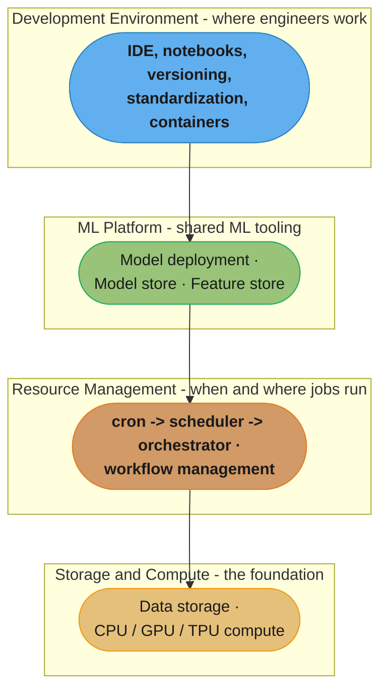
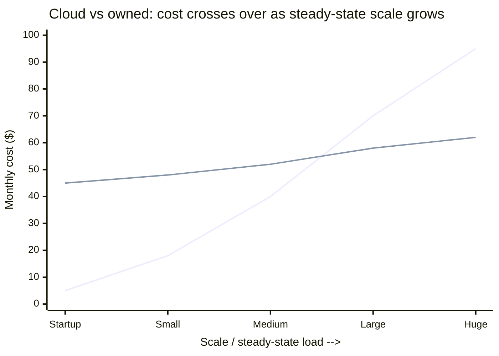
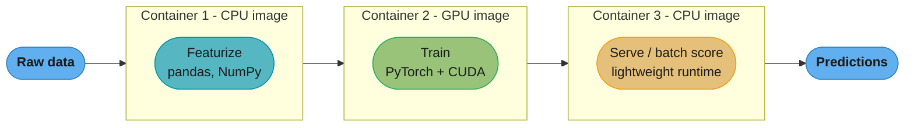
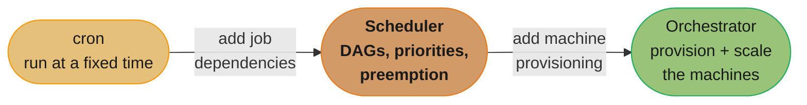
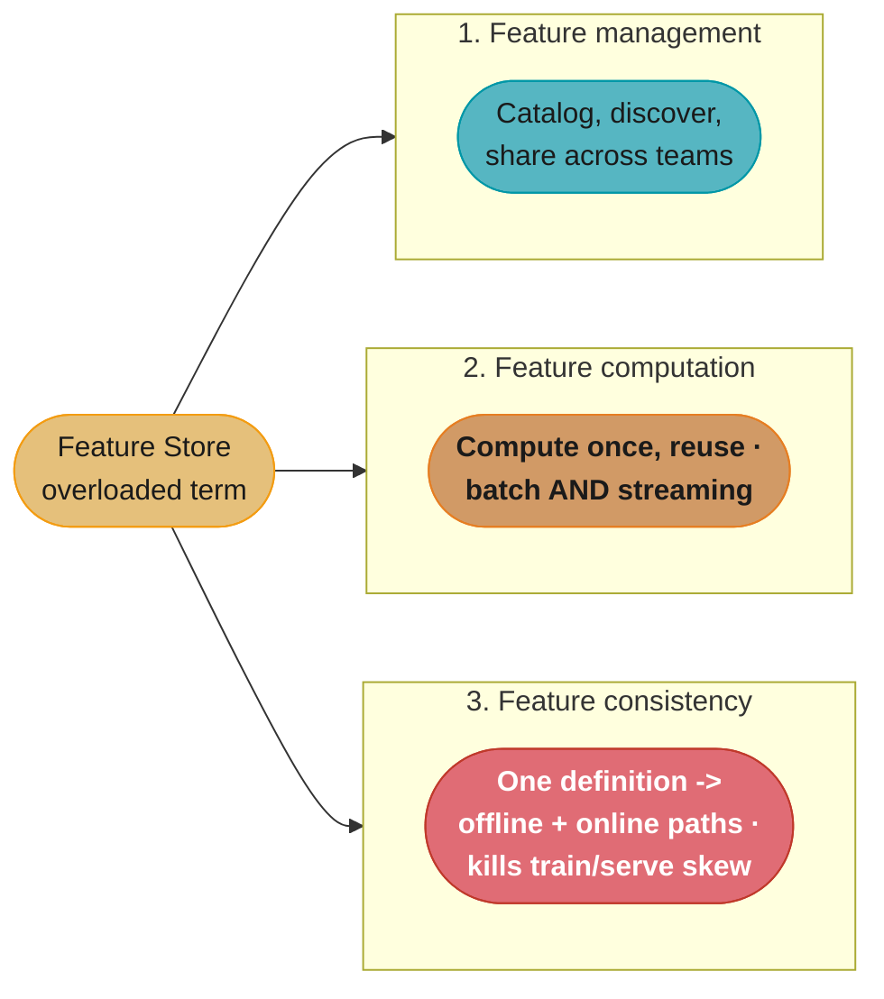
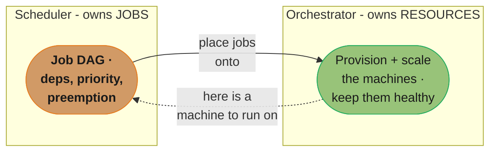
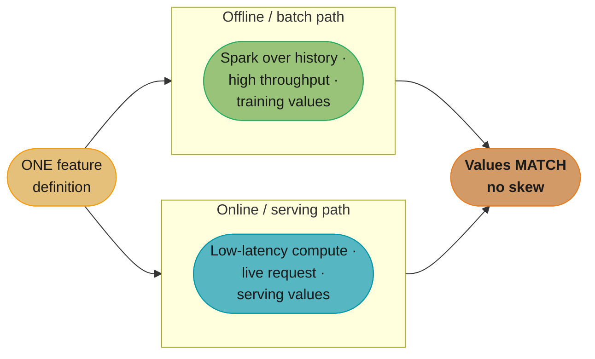

# Chapter 10: Infrastructure and Tooling for MLOps

> Ch 10 of 11 · Designing Machine Learning Systems (Huyen) · the platform chapter — the four infrastructure layers that make every previous chapter's loop cheap

## Chapter Map

Every previous chapter described *work*: engineering features (Ch 5), developing and
evaluating models (Ch 6), deploying prediction services (Ch 7), monitoring for drift
(Ch 8), continual learning and testing in production (Ch 9). This chapter is about the
**foundations that make all of that work repeatable and cheap** — the infrastructure. Huyen
defines infrastructure as *the set of fundamental facilities that support the development and
maintenance of ML systems*: a good electrical grid you never think about, versus rewiring the
building every time you plug something in. The chapter's spine is a **four-layer stack** —
storage & compute at the bottom, resource management above it, an ML platform above that, and
the development environment at the top — plus a closing **build-vs-buy** framework.

**TL;DR:**
- **Infrastructure needs differ wildly by company scale.** Three regimes: one-model shops (barely
  need infra), the *reasonable-scale majority* (tens of models, terabytes/day — the sweet spot for
  standard tooling), and the Google/Tesla extreme (specialized, self-built). Most of the book's
  advice targets the reasonable-scale middle.
- **The four layers.** (1) *Storage & compute* — storage is a commoditized, cheap, largely solved
  problem; compute is the interesting axis, measured on memory and FLOPS, and the cloud-vs-on-prem
  decision flips as you scale. (2) *Resource management* — the cron → scheduler → orchestrator ladder;
  schedulers manage **jobs**, orchestrators manage **resources**. (3) *ML platform* — the shared team
  that builds model deployment, model store, and feature store once for everyone. (4) *Development
  environment* — the most underrated, highest-ROI lever; standardize it and containerize dev-to-prod.
- **The feature store** is the star artifact: it solves up to **three** distinct problems — feature
  *management*, feature *computation*, and feature *consistency* (killing train/serve skew) — and
  conflating them is the classic interview trap.
- **Build vs buy** is a moving target: what's core to your business you build, commodity you buy, and
  the decision is reversible but expensive — so bias toward buy early and revisit as you scale.

## The Big Question

> "I have a working model and a loop that trains, deploys, monitors, and retrains it. Every one of
> those steps needs compute, storage, scheduling, and a place to run. How do I build the *plumbing*
> once so that shipping the *next* model — and the twentieth — is a config change, not a
> re-engineering project?"

Infrastructure is what separates a team that ships one heroic model from a team that ships models
*routinely*. Huyen's framing analogy: infrastructure is like the electrical and plumbing systems of
a house — invisible when done right, and the difference between a house you can live in and a
construction site. The reason this chapter comes near the end is deliberate: you only feel the pain
infrastructure solves *after* you've lived through Ch 5–9 without it.

---

## 10.1 The infrastructure question — why every company's needs differ

The single most important idea in the chapter's opening: **there is no universal ML infrastructure.**
What a three-person startup needs and what Tesla's Autopilot fleet needs share almost no components.
Huyen sorts companies into **three scale regimes**:

| Regime | Who | Infrastructure reality |
|--------|-----|------------------------|
| **One-model / few-model shops** | Startups, companies where ML is a side feature | Barely need specialized infra. A notebook, a cloud VM, and a managed database suffice. Investing in a platform here is premature. |
| **Reasonable scale** (the majority) | Companies like Shopify: tens to hundreds of models in production, hundreds of ML engineers, terabytes to petabytes of new data per day, revenue in the millions to billions | The book's target audience. Standard, off-the-shelf tooling (cloud, Airflow/Prefect, SageMaker/Vertex, a feature store) pays off enormously. |
| **Google / Facebook / Tesla extreme** | The handful of companies at the absolute frontier | Needs are so specialized (self-driving cars, planet-scale recommendation) that they build custom, highly optimized infrastructure in-house. Their blog posts are aspirational, not a template. |

The trap is **cargo-culting the extreme**: reading a FAANG engineering blog and building a Kubernetes-
native, multi-region feature platform for a company that has three models. Match the infrastructure
investment to the regime. Most readers are at *reasonable scale*, where the standard four-layer stack
is exactly right.

**Definition to remember:** infrastructure is *the foundational systems that make application
development repeatable*. Good infrastructure makes launching a new ML application easy; bad (or
absent) infrastructure makes every launch a from-scratch engineering project.

The chapter organizes infrastructure into **four layers**, from the physical foundation up to where
engineers actually work:



Caption: the orienting map of the chapter. Read it bottom-up — storage & compute is the physical
foundation everything rests on; resource management decides when/where jobs run; the ML platform is
the shared tooling built once for all models; and the development environment (top) is where engineers
spend their day and, per Huyen, the highest-ROI layer to invest in.

---

## 10.2 Storage and Compute Layer

Every ML system needs two physical resources: a place to keep data (**storage**) and the horsepower
to crunch it (**compute**). Huyen's key move is to say one of these is basically solved and boring,
and the other is where all the interesting decisions live.

### Storage: a largely solved, cheap problem

The storage layer is where data is collected and kept — from a single hard drive up to S3, Redshift,
Snowflake, BigQuery, or a data lake. Huyen's assessment is blunt: **data storage has become so cheap
and so commoditized that most companies simply pay for managed storage and stop thinking about it.**
The genuinely hard parts of data — *how to structure it, which formats to use, which data model fits
the access pattern* — were covered back in Chapter 3 (data engineering fundamentals). At the
infrastructure layer, storage is a solved problem: pick a managed store, pay per gigabyte, move on.
The hard problems moved *up* the stack, into compute and into the ML platform.

### Compute: the interesting axis

The **compute layer** is all the compute resources a company can access *plus the mechanism that
decides how those resources are used*. This is the interesting part.

**The unit abstractions.** Compute is sliced into units. The book uses two:
- **Instance** — a whole machine you rent or own (e.g. an AWS EC2 instance with 8 CPU cores and 16 GB
  of memory, possibly with attached GPUs). A large compute resource can be sliced into smaller units
  used at different times by different jobs.
- **Job** — a unit of *work* that consumes compute for a bounded time (a training run, a batch scoring
  pass). Some frameworks (Spark, Ray, K8s) let you request compute per job without thinking about the
  underlying instance at all.

**The flavors: CPU / GPU / TPU.** CPUs are general-purpose and great for data wrangling and small
models. **GPUs** (and Google's **TPUs**) are specialized for the dense linear algebra of deep learning
— thousands of parallel cores that make matrix multiplication orders of magnitude faster. The compute
layer must let you request the right flavor for each step (see container-per-step in 10.3).

**The two resource axes.** Huyen reduces "how good is this compute unit" to two numbers:
1. **Memory** — how much data it can hold at once (bytes / GB). A model plus its activations plus a
   batch of data must fit; run out and the job crashes or you shrink the batch.
2. **Speed — FLOPS** (floating-point operations per second) — how fast it runs the operations. A GPU
   might advertise a *peak* of, say, tens of teraFLOPS.

**The utilization caveat — the most important compute gotcha.** Peak FLOPS is a marketing number you
almost never hit. **Utilization** = actual FLOPS achieved ÷ peak FLOPS, and it is *routinely far below
peak* — a utilization of **0.3 (30%) is not uncommon** and is often considered acceptable. The reason
is that FLOPS measures how fast you can *compute*, but a job also has to *move data into the compute
unit's memory* — and if memory bandwidth can't feed the cores fast enough, the expensive GPU sits idle
waiting for data. The practical lever: **increase batch size** so more work happens per data-load,
raising utilization (up to the point you run out of memory). The takeaway: never budget capacity from
peak FLOPS — budget from *realized* FLOPS at your actual utilization.

**In plain terms.** "Utilization is the fraction of the hardware you paid for that your job is actually using, and because it multiplies straight into every capacity estimate, planning at peak does not make you slightly optimistic — it makes you wrong by a fixed factor of `1/utilization`." That framing matters because the error is silent: nothing crashes, the job simply takes three times longer than the plan said and the GPU bill arrives three times larger.

| Symbol | What it is |
|--------|------------|
| peak FLOPS | The spec-sheet number — floating-point ops/sec if nothing ever stalls |
| actual FLOPS | What your job really achieves, limited by feeding data to the cores |
| utilization | `actual FLOPS / peak FLOPS`; 0.3 is common and often acceptable |
| work | Total floating-point operations the job must perform |
| 1 / utilization | The factor by which a peak-based estimate understates time and cost |
| batch size | The main lever: more work per data-load raises utilization |

**Walk one example.** A training run of 3.6 x 10^18 FLOPs on an accelerator advertising 100 teraFLOPS, at the chapter's typical 0.3 utilization.

```
  peak                 = 100 TFLOPS       = 1.0e14 FLOP/s
  utilization          = 0.30
  realized             = 1.0e14 x 0.30    = 3.0e13 FLOP/s   = 30 TFLOPS
  work                 = 3.6e18 FLOPs

  PLANNED AT PEAK  (the mistake)
    time = 3.6e18 / 1.0e14 = 36,000 s = 10.0 hours
    "one GPU, overnight, done by morning"

  REALITY AT 0.3 UTILIZATION
    time = 3.6e18 / 3.0e13 = 120,000 s = 33.3 hours
    the overnight job finishes on the evening of the following day

  error factor = 1 / 0.30 = 3.33x     (and 33.3 / 10.0 = 3.33 -- same number)

Same mistake stated as a capacity purchase. To hit a 10-hour deadline:
    budgeted from peak      : 3.6e18 / (1.0e14 x 36,000) = 1.0  -> buy 1 GPU
    budgeted from realized  : 3.6e18 / (3.0e13 x 36,000) = 3.33 -> need 4 GPUs

You do not under-provision by "a bit." You under-provision by 70% of the fleet,
and you discover it the night before the deadline.

Why 0.3 and not 1.0: the cores finish their arithmetic and then wait for the
next tile of data to arrive from memory. Raising batch size means more compute
per data-load, so a batch increase that lifts utilization 0.30 -> 0.45 cuts the
same job from 33.3 h to 3.6e18/(1.0e14 x 0.45)/3600 = 22.2 h -- a 33% saving
from a one-line config change, with no new hardware at all.
```

This is also the reason the chapter reaches for MLPerf rather than spec sheets. Peak FLOPS is a property of the chip alone; realized FLOPS is a property of the chip *plus your model, your batch size, and your data pipeline*. Two accelerators with identical peak numbers can differ by more than 2x on real work, so the only honest comparison is a benchmark that runs the whole pipeline — which is precisely what MLPerf standardizes.

**Benchmarking is hard — MLPerf.** Because a compute unit's real speed depends on the operation, the
model, and the data pipeline, comparing hardware from spec sheets is unreliable. The industry's answer
is **MLPerf** (from MLCommons), a benchmark suite that measures hardware on standardized real ML tasks
(training ImageNet, BERT, etc.) so you can compare an A100 against a TPU against a consumer GPU on a
level field.

### Public cloud vs private data centers

The biggest compute decision: run on **public cloud** (AWS, GCP, Azure) or your own **private data
center** (on-prem machines you buy and rack)?

**The case for cloud — elasticity and burst.** Cloud's superpower is that compute is *elastic*: you
pay only for what you use, and you can scale up during a burst (a big training run, a traffic spike)
and scale back down after, with **zero upfront capital**. You never buy a machine that sits idle 90%
of the time. For a startup or a spiky workload, this is transformative — the burst-scaling argument is
why almost everyone *starts* on cloud.

**The counterargument — the eye-watering bill.** Cloud is convenient and cheap *at small and medium
scale*, but the pay-per-use model that saved you money when small becomes brutal at scale. Huyen cites
the datapoints:
- A survey found companies spend **over 50% of their cost of revenue on cloud infrastructure** —
  cloud is often the single largest line item after headcount.
- Andreessen Horowitz's essay **"The Cost of Cloud, a Trillion-Dollar Paradox"** argues that for
  large, scaled companies, cloud spend is so high that **repatriating** workloads to owned hardware can
  recover enormous margin — the a16z *cloud-repatriation* argument. At scale, the cloud premium you pay
  for elasticity you no longer need becomes pure waste.
- The canonical example: **Dropbox saved roughly \$75 million over two years** by moving the majority
  of its workloads off AWS onto its own infrastructure (documented around its IPO / S-1). When your
  load is steady and huge, owning the metal is far cheaper than renting it.

**The "multicloud is often accidental" note.** Teams talk about *multicloud* (using AWS + GCP + Azure)
as a deliberate strategy to avoid vendor lock-in and negotiate better prices. Huyen's realistic
observation: **multicloud is usually accidental, not designed** — it accrues from mergers, from
different teams picking different providers, from a data-heavy workload on one cloud and an ML tool on
another. And once you're multicloud, moving data and workloads *between* clouds is painful and
expensive (egress fees, incompatible services), so the theoretical leverage rarely materializes.

**The middle path.** The pragmatic answer for reasonable-scale companies: **cloud for burst, owned
hardware for steady-state.** Run your predictable base load on cheaper owned/reserved capacity, and
burst into the cloud's elastic capacity for spikes and one-off large jobs. You get the cost of
ownership on the steady 80% and the elasticity of cloud on the volatile 20%.



Caption: cloud wins at small scale (no upfront cost, pay only for the little you use), but its
pay-per-use curve climbs steeply with steady-state load while owned hardware's mostly-fixed cost stays
flat — the two curves cross, which is exactly the Dropbox repatriation story. The right answer is
scale-dependent, not absolute.

**What this actually says.** "Cloud sells you a cost that is mostly *variable* and owned hardware sells you a cost that is mostly *fixed*, so the comparison is never 'which is cheaper' but 'at what steady-state load does a rising line pass a flat one'." That framing matters because it explains why both camps are sincerely right: they are standing on opposite sides of a crossover point and each is reporting their side accurately.

| Symbol | What it is |
|--------|------------|
| cloud cost | Mostly variable — scales roughly with the load you actually run |
| owned cost | Mostly fixed — hardware, power, and staff you pay for whether busy or idle |
| delta | `cloud - owned`; negative means cloud wins, positive means owned wins |
| crossover | The load at which delta = 0 and the decision flips |
| repatriation | Moving workloads off cloud onto owned hardware past the crossover |
| steady-state load | The predictable base load, as opposed to spiky burst load |

**Walk one example.** Read the crossover directly off the chart above, then check it against the Dropbox figure.

```
  scale point   cloud   owned   delta = cloud - owned    who wins
  -----------   -----   -----   ---------------------    --------
  Startup           5      45          -40               cloud, by 9x
  Small            18      48          -30               cloud
  Medium           40      52          -12               cloud, narrowing
  Large            70      58          +12               owned
  Huge             95      62          +33               owned

  The delta walks -40, -30, -12, +12, +33: it crosses zero between Medium and
  Large. Interpolating linearly across that segment:
      crossover = -(-12) / (12 - (-12)) = 12 / 24 = 0.50
  -> exactly halfway between the Medium and Large scale points.

  Cloud premium at the top of the curve:
      33 / 62 = 53.2% more expensive than owning the same capacity.

Sanity-check against the real number the chapter cites. Dropbox saved roughly
$75M over two years by repatriating:
      $75M / 2 years   = $37.5M per year
      $37.5M / 12      = $3.125M per month of pure margin recovered

For that saving to exist at all, Dropbox had to be operating far to the RIGHT of
its crossover -- huge, steady, predictable storage load, which is the workload
shape that owning serves best. Note also what the numbers do NOT say: at the
Startup row, owning costs 9x more than renting. The identical decision that
recovered $37.5M/year for Dropbox would have been close to fatal for a seed-stage
company, because the fixed cost lands before the load does.

The middle path in the same arithmetic. Split an 80/20 steady/burst load:
  all-cloud at Large            :  70
  all-owned at Large            :  58
  owned for the steady 80%, cloud for the volatile 20%: you pay the flat owned
  cost only for capacity you keep busy, and rent the spikes instead of buying
  peak-sized hardware that idles the rest of the month.
```

The trap in this table is treating the crossover as a fact about *companies* rather than about *workloads*. A single company usually sits on both sides at once: its steady serving tier is past the crossover while its bursty experimentation and one-off large training runs are nowhere near it. Which is exactly why the chapter's answer is the split, not a side — and why "reversing this decision is expensive" (10.5) is the constraint that actually matters, since you will cross the point long before you finish migrating.

---

## 10.3 Development Environment

Huyen calls the development environment **the most underrated infrastructure lever** — and says
outright that if she could give a company *one* piece of advice on infrastructure, it would be to
**invest in improving the development environment.** It's where ML engineers spend the majority of
their working hours — writing code, running experiments, poking at production — yet it's the layer
companies chronically underinvest in. The payoff of a good dev env is compounding: every engineer,
every day, moves faster.

### Dev environment setup

**IDEs and notebooks.** The dev environment is where you write and run code. Two families:
- **IDEs** (VS Code, PyCharm, Vim) — for writing production code, refactoring, debugging.
- **Notebooks** (Jupyter, Colab) — the workhorse of exploratory ML. Their **superpower is nonlinear,
  stateful execution**: you can run cells out of order and keep intermediate state (a loaded dataset,
  a half-trained model) live in memory, so you iterate without re-running everything from scratch. That
  same statefulness is also their **curse** — hidden out-of-order state makes notebooks hard to
  reproduce and hard to move to production.
- Notebooks need *infrastructure* of their own to be production-grade, and the canonical example is
  **Netflix**, which built an entire notebook ecosystem around them: **papermill** (parametrize and
  execute notebooks programmatically — run the same notebook with different inputs), **commuter** (a
  read-only notebook viewer/dashboard), and **nteract** (a desktop notebook UI). At Netflix, the
  notebook became the *unit of work* — schedulable, parametrizable, and shareable.

**Versioning — and the data/model gap.** A good dev environment must be *versioned* so you can
reproduce any result. This is a partially-solved problem:
- **Code** — solved. Git versions your code cleanly.
- **Data and models** — the **unsolved gap.** Git chokes on large binary data and model weights.
  **DVC** (Data Version Control) exists to version data and models on top of Git, but the tooling is
  immature and no approach is as clean as Git-for-code. This *data/model-versioning gap* is one of the
  hard, still-open problems of MLOps.
- **Experiment tracking as versioning** — a callback to Chapter 6. Tools like **Weights & Biases,
  MLflow, and Comet** track every experiment's config, hyperparameters, metrics, and artifacts, which
  *is* a form of versioning: it lets you reconstruct which code + data + config produced a given model.
  Experiment tracking and versioning are two sides of the same reproducibility coin.

### Standardization

A dev environment should be **standardized across the whole team** — the same tools, the same library
versions, the same configs on every engineer's setup. The disease standardization cures is the
infamous **"works on my machine"**: a pipeline that runs for the author and mysteriously breaks for
everyone else because of a different pandas version or a missing system library.

- **How to standardize:** enforce it via IT policy (everyone gets the same base image and dependency
  set), or — better — move development into **cloud development environments**. GitHub Codespaces-style
  setups (also AWS Cloud9) put the dev environment *in the cloud*, accessed from a browser or SSH.
- **Benefits of cloud dev environments:** they're standardized by construction (everyone gets the same
  container), more secure (source code never lives on a laptop that can be lost or stolen), and — the
  strongest argument — they enable **dev-to-prod parity**: you can develop on the *same instance type*
  your model will run on in production. Developing on the same hardware kills a whole class of "worked
  in dev, broke in prod" bugs, because dev *is* prod, minus the traffic.

### From dev to prod: containers

Here's the problem containers solve. In production your code runs on a cluster where machines are spun
up and torn down on demand. Every time you get a fresh instance, its environment is *empty* — you must
recreate everything: install the right Python version, the right libraries at the right versions, the
right system dependencies. Do that by hand and you're back in works-on-my-machine hell, at cluster
scale.

**Docker as the reproducibility unit.** Container technology (Docker) packages *the instructions to
recreate an environment* into an artifact you can run anywhere identically. The key vocabulary:
- **Dockerfile** — a step-by-step recipe: start from a base image, install these OS packages, copy this
  code, install these Python requirements, run this command.
- **Image** — the built, frozen package produced from the Dockerfile.
- **Container** — a running instance of an image. Ten machines can each run a container from the same
  image and get byte-identical environments.

A minimal Dockerfile:

```dockerfile
FROM python:3.10-slim                 # base image: pinned Python version
WORKDIR /app
COPY requirements.txt .
RUN pip install --no-cache-dir -r requirements.txt   # pinned dependency versions
COPY . .
CMD ["python", "train.py"]            # what to run when the container starts
```

**The multiple-container reality.** Here's the wrinkle the book stresses: **a real ML pipeline usually
needs more than one image.** Different steps have *conflicting dependencies*:
- A **featurizing / data-prep step** runs on CPU and needs pandas, NumPy, and connectors to your data
  stores — but no CUDA, no GPU drivers.
- A **training step** needs a GPU-enabled image with PyTorch/TensorFlow compiled against a specific
  CUDA version — a heavy image you don't want anywhere near the CPU step.

Forcing both into one image gives you the classic **dependency-hell** story: the CUDA-pinned training
library conflicts with a pandas version the featurizer needs, and you spend a day untangling it. The
solution is **container-per-step pipelines**: each step gets its own purpose-built image with exactly
the dependencies it needs and nothing more. The cost is that you now manage several Dockerfiles and
need something to run the multi-container pipeline — Docker Compose on one machine, and **Kubernetes**
for a cluster (which is exactly what the next layer, resource management, provides).



Caption: container-per-step. Each stage carries only the dependencies it needs — the featurizer's CPU
image never pulls CUDA, the trainer's GPU image never worries about the serving runtime — so a
version conflict in one step can't poison the others. This is the concrete reason a single pipeline
ends up with multiple Dockerfiles.

---

## 10.4 Resource Management

Resource management answers "*when and where do jobs run, and where does the compute come from?*"
Huyen frames a mindset shift: in the **pre-cloud era**, resources were finite and precious, so
maximizing *utilization* (squeezing every cycle) was the whole game. In the **cloud era**, resources
are effectively infinite and elastic — you can always rent more — so the question flips from
*availability* ("do I have enough machines?") to **cost-effectiveness** ("am I using what I rent
efficiently?"). ML workflows are also **repetitive** (the same train→evaluate→deploy loop, on a
schedule) and **interdependent** (evaluate can't start until train finishes), which is exactly what
this layer must handle.

The evolution ladder goes cron → schedulers → orchestrators, each adding capability:



Caption: the resource-management ladder. cron only knows *time*; a scheduler adds knowledge of *jobs*
and their dependencies; an orchestrator adds knowledge of *the machines themselves*. Each rung
subsumes the one below.

### cron — fixed-time, no dependencies

**cron** is the simplest scheduler: run this script at this time (every hour, every night at 2 a.m.).
That's it. cron knows *when* to start a job and can report whether it succeeded or failed — but it has
**no concept of dependencies.** It cannot express "run job B only after job A succeeds." If your
workflow is a single independent script on a timer, cron is perfect. The moment jobs depend on each
other, you've outgrown it.

### Schedulers — job queues with dependencies, priorities, preemption

A **scheduler** is cron that understands **dependencies**. Schedulers take a **DAG** (directed acyclic
graph) of jobs — "B and C depend on A; D depends on B and C" — and handle the whole graph: queue jobs,
run them in dependency order, retry failures, and fire on triggers (time-based *or* event-based, e.g.
"run when new data lands"). Beyond dependencies, a real scheduler manages:
- **Priorities** — run the urgent job before the routine one.
- **Preemption** — kill or pause a low-priority job to free resources for a high-priority one.
- **Resource-aware placement** — the scheduler knows each job's resource requirements (this job needs
  4 GPUs, that one needs 32 GB RAM) and the resources available, and places jobs to maximize
  utilization. This *utilization-aware placement* is the scheduler's core value.

The classic HPC scheduler is **SLURM**, which for decades has scheduled batch jobs onto supercomputer
clusters; Google's internal **Borg** is the industrial-scale ancestor of much of this thinking. The
crucial limitation: **a scheduler assumes the resources already exist.** It allocates jobs *onto* a
fixed pool of machines. It does not create machines. That's the orchestrator's job.

### Orchestrators — provision and scale the machines themselves

An **orchestrator** answers the question the scheduler punts on: *where do the machines come from?* An
orchestrator **provisions and manages the actual instances** — it spins up new machines when the job
queue grows, tears them down when it shrinks, keeps them healthy, and pools them into a cluster the
scheduler can then place jobs onto. The dominant orchestrator is **Kubernetes (K8s)**, which manages
containers across a fleet of machines, autoscales the pool, and reschedules work off failed nodes.

**The scheduler-vs-orchestrator distinction (the book's key line).** This is the distinction Huyen
draws sharply and interviewers love: **schedulers are concerned with *jobs*; orchestrators are
concerned with *resources*.** A scheduler takes jobs-with-dependencies and decides *when/where to run
them on existing resources*. An orchestrator takes *the resources themselves* and provisions/scales
them. They're complementary and usually used **together**: an orchestrator like Kubernetes provisions
and maintains the cluster, and a scheduler (or workflow tool) places the actual ML jobs onto it. Put
simply — the scheduler decides *what runs next*; the orchestrator makes sure *there's a machine for it
to run on.*

### Workflow management for data science

Above raw schedulers/orchestrators sit **workflow management tools** built for data science pipelines
— they let you define an ML workflow as a DAG of steps and handle scheduling, retries, and data
passing. Huyen walks the major tools, each with a *signature tradeoff*:

#### Airflow

The **config-as-code pioneer** (born at Airbnb). Airflow's big idea: define your workflow as **Python
code** rather than static config, which makes workflows programmable and version-controllable. It ships
a **rich library of operators** — run Bash, run Python, talk to Spark, to databases, to cloud services
— so it can schedule almost anything. Its **signature weaknesses**: workflows are **monolithic** (the
whole DAG tends to live in one place / run in one environment), DAGs are **not parametrized natively**
(you can't cleanly pass runtime parameters into a workflow), and DAGs are **static** — the shape of the
graph is fixed at definition time, so you can't create a workflow whose number of steps depends on the
input at runtime. It also has no first-class mechanism for passing data between tasks.

#### Prefect

Prefect's pitch is a direct answer to Airflow's limits: **parametrized and dynamic workflows.**
Workflows are Python functions you can parametrize and construct *dynamically at runtime* (the graph
can depend on the input). Its marketing slogan is **"negative engineering"** — the observation that
data engineers spend most of their time not on the happy-path logic but on *guarding against failure*
(retries, timeouts, error handling, restarts), and Prefect's job is to make all that negative
engineering disappear so you write only the positive logic. Signature tradeoff: solves Airflow's
parametrization/dynamism problems but is a newer, less battle-tested ecosystem.

#### Argo

**Kubernetes-native.** Argo runs each workflow step in **its own container** (container-per-step,
exactly the pattern from 10.3), which makes it a natural fit for containerized ML. Workflows are
defined in **YAML**. Signature tradeoffs: the YAML gets verbose and unwieldy for complex DAGs, and
Argo is **K8s-only** — you can't run it without a Kubernetes cluster, which also makes local testing
painful (you need something like minikube).

#### Kubeflow and Metaflow

These are **full ML-workflow frameworks** that aim higher than the schedulers above: they provide
**infrastructure abstraction** — the promise that you write your workflow *once* and run it in both dev
and prod without rewriting it for the infrastructure.
- **Kubeflow** — the "ML toolkit for Kubernetes"; runs ML pipelines on top of K8s and bundles
  components for training, serving, and pipelines.
- **Metaflow** — a Python library (from Netflix) built around **decorators** that abstract the
  infrastructure away. You write plain `@step` functions, then annotate them: **`@conda`** specifies
  that step's dependencies (so different steps can have different, isolated environments — the
  container-per-step idea, expressed as a decorator), and **`@batch`** says "run this step on AWS
  Batch in the cloud" instead of locally. The magic: **the same code runs locally during development
  and in the cloud in production** — you flip a decorator, not rewrite the pipeline. Metaflow is also
  **notebook-friendly**, fitting the exploratory dev style. Its positioning is exactly *infrastructure
  abstraction*: the data scientist thinks about the *workflow*, not about where it runs.

---

## 10.5 ML Platform

The ML platform layer is a *team* as much as a set of tools. Huyen tells the convergence story:
as a company builds its second, third, and tenth ML application, each team keeps rebuilding the same
supporting infrastructure — a way to deploy models, a place to store them, a way to manage features.
At some point it's obviously wasteful, and the company **spins up a dedicated ML platform team** to
build these shared tools *once* for everyone. The three components Huyen focuses on: **model
deployment, model store, feature store.**

### Model deployment

Once a model is trained, something has to push it — plus its dependencies — into production and expose
it as a usable service. **Deployment services** do this: they take a model artifact and stand it up as
an endpoint (**online prediction**, request/response) or a scheduled job (**batch prediction**, score a
big table). The vendors: **AWS SageMaker, GCP Vertex AI, Azure ML**, plus **MLflow, Seldon, Cortex,
Ray Serve**, and others.

**The batch-vs-online question to ask vendors.** The single most important capability question when
evaluating a deployment tool: **does it support both online *and* batch prediction?** Many tools do one
well and the other poorly, and most real systems need both (online for user-facing requests, batch for
precomputing recommendations overnight). A vendor can demo an impressive online endpoint in five
minutes while quietly having no batch story at all.

**The "don't roll your own serving" lean.** Huyen's practical guidance: **deployment is one of the most
commoditized, mature parts of the stack, so don't build your own serving infrastructure unless you
genuinely have to.** It's easy to build a serving demo and very hard to build one that's reliable,
observable, autoscaling, and handles both prediction modes. Buy it.

### Model store

Here's the argument that catches people out: **a model store is much more than blob storage.** The naive
version — dump the trained weights into S3 — is nearly useless the moment something goes wrong in
production and you need to *debug* why the model is misbehaving. To actually debug a production model
you need a whole bundle of artifacts stored *with* it. Huyen's **artifact checklist** — the things a
proper model store must track:

1. **Model definition** — the architecture: the layers, the shape, the loss function used.
2. **Model parameters** — the actual trained weights/values.
3. **Featurize and predict functions** — the *code* that turns a raw input into a prediction: how to
   featurize the input and how to run inference on it. Without this, the weights are unusable.
4. **Dependencies** — the libraries and *versions* (Python, framework, CUDA) needed to run the model;
   often captured as a container or requirements file.
5. **Data** — a pointer to (and version of) the exact data the model was trained on — its lineage.
6. **Model generation code / experiment config** — how the model was created: framework, features
   used, hyperparameters, train/validation split, number of runs — the full experiment configuration.
7. **Experiment artifacts** — the graphs, metrics, and outputs generated during the experiment.
8. **Tags and owners** — who owns it, what task it serves, for discovery and governance.

**The reality gap.** Most companies store only items **1 and 2** (definition + parameters) — and that is
*not enough to debug a production model*, because you can't reproduce a prediction without the
featurize/predict code (3), the exact dependencies (4), and the training data (5). Huyen's assessment
of the tooling: **MLflow is the closest thing the open-source world has to a general model store, and
it still has gaps** — even the best available tool doesn't cleanly track all eight artifact types. The
model store is one of the least-solved parts of the ML platform.

### Feature store

The **feature store** is the chapter's marquee concept, and its most important teaching point is that
"feature store" is an **overloaded term** covering up to **three distinct problems**. Conflating them
is the classic mistake; a given product may solve one, two, or all three.

1. **Feature management** — a **catalog** for discovering, cataloging, and *sharing features across
   teams and models*. Features are expensive to build, and without a catalog, five teams independently
   build the same "user's 30-day purchase count" feature. A feature store as a management layer lets
   teams *find and reuse* existing features (governance, discovery, sharing), so a feature is built
   once and reused everywhere.

2. **Feature computation / materialization** — actually *computing* features (or storing precomputed
   ones) so they're **computed once and reused**, not recomputed per model. A feature store here handles
   the heavy lifting of the computation and stores the results, and — crucially — supports **both batch
   materialization** (compute over a big historical table for training) **and streaming
   materialization** (compute over a live event stream for fresh serving features).

3. **Feature consistency** — the **train/serve skew killer**, and the problem that most justifies a
   feature store's existence. In training, features are typically computed in **batch** (Python/Spark
   over historical data). In serving, the *same* features must be computed **online** with low latency,
   often in a different language or system. If the two implementations drift even slightly, the model
   sees different feature values in production than it did in training — **train/serve skew** — and
   quietly degrades. A feature store solves this by holding **one feature definition** that is
   **compiled for both the offline (batch, high-throughput) path and the online (low-latency) path**,
   guaranteeing the training and serving values match. Write the feature once; the store makes both
   paths agree.

The landscape: **Feast** (open source, from Gojek — strong on management and consistency, lighter on
computation) and **Tecton** (fully managed, aims to do all three, but wants deep integration), plus the
feature stores bundled into SageMaker and Databricks.



Caption: the three problems a feature store *may* solve. A product might do one, two, or all three, so
when someone says "feature store" the first question is *which of these do you mean?* Consistency (3)
is the one that most uniquely requires a feature store — it's the only clean fix for train/serve skew.

---

## 10.6 Build Versus Buy

The chapter closes with the decision that hangs over every layer above: for each piece of
infrastructure, do you **build** it in-house or **buy** it from a vendor? Huyen offers a framework
rather than a rule, built on a few factors:

- **How core is it to your competitive advantage?** If a capability is *core to your business* — the
  thing that differentiates you — **build** it, because you want full control and it's where your edge
  lives. If it's a *commodity* everyone needs and no one wins on (storage, Kubernetes, generic
  serving), **buy** it — building it just reinvents a solved wheel.
- **Maturity of the vendor offerings.** If mature, reliable managed solutions exist, buy — you inherit
  years of hardening for a subscription fee. If the space is immature and every vendor product is
  half-baked, building might genuinely be the better option (or wait).
- **Integration cost of gluing bought pieces together.** Buying isn't free of engineering: assembling
  several best-of-breed point solutions into a coherent stack has real *integration cost* — the glue
  code, the impedance mismatches, the auth and data-format plumbing between tools. Sometimes one
  integrated platform beats five best-of-breed tools you have to wire together yourself. Also weigh the
  team you'd need to *maintain* whatever you build.
- **Your needs evolve — decisions are reversible but expensive.** The pragmatic close: your
  infrastructure needs change as you scale (recall the three regimes from 10.1 and the cloud-cost
  crossover from 10.2), so no build/buy decision is permanent — but **reversing one is expensive**
  (migrations, rewrites, retraining the team). The sensible bias for reasonable-scale companies is to
  **buy / use managed services early** (get to market fast, defer capital), and revisit toward building
  only as scale, cost, and a clear core advantage justify it — the same logic that eventually sent
  Dropbox off AWS.

---

## Visual Intuition

The scheduler-vs-orchestrator distinction is the mechanic most people get muddled, so it earns its own
picture — who owns *jobs* and who owns *machines*:



Caption: the one-line mnemonic made visual — *schedulers are concerned with jobs, orchestrators with
resources.* The scheduler decides what runs next and hands the job down; the orchestrator guarantees
there's a healthy machine underneath. In practice a workflow tool (e.g. Airflow) plays the scheduler
role and Kubernetes plays the orchestrator role, together.

The train/serve skew that the feature store's *consistency* role exists to kill:



Caption: the consistency guarantee. Without a feature store, the batch (training) and online (serving)
feature code are written twice and drift apart — the model trains on one distribution and serves on
another. A feature store compiles *one* definition into *both* paths so the values provably match.

---

## Key Concepts Glossary

- **Infrastructure** — the foundational facilities/systems that make ML application development
  repeatable and cheap.
- **Reasonable scale** — the majority regime (tens of models, TB–PB/day, hundreds of engineers) that
  standard off-the-shelf tooling targets; between one-model shops and the Google/Tesla extreme.
- **Four-layer stack** — storage & compute, resource management, ML platform, development environment.
- **Storage layer** — where data is kept (S3, Snowflake, BigQuery…); commoditized and cheap.
- **Compute layer** — all compute resources plus the mechanism deciding how they're used.
- **Instance** — a whole machine (a unit of compute you rent/own); can be sliced into smaller units.
- **Job** — a bounded unit of work that consumes compute (a training run, a batch score).
- **FLOPS** — floating-point operations per second; a compute unit's speed metric.
- **Utilization** — actual FLOPS ÷ peak FLOPS; often ~0.3, limited by memory bandwidth feeding the
  cores; raised by larger batch sizes.
- **MLPerf** — MLCommons benchmark suite that compares hardware on standardized real ML tasks.
- **Public cloud vs private data center** — rent elastic compute (AWS/GCP/Azure) vs own the metal.
- **Cloud repatriation** — moving workloads off cloud back to owned hardware to cut cost at scale
  (a16z's "Trillion-Dollar Paradox"; Dropbox's ~\$75M/2-year saving).
- **Multicloud** — using several cloud providers; usually *accidental*, and hard to exploit.
- **Development environment** — where engineers write code, run experiments, interact with prod; the
  most underrated / highest-ROI layer.
- **Notebook (stateful execution)** — nonlinear, in-memory-state coding (Jupyter/Colab); superpower for
  iteration, curse for reproducibility. Netflix's ecosystem: papermill, commuter, nteract.
- **Data/model-versioning gap** — Git versions code cleanly but not large data/models; DVC exists but
  is immature — a still-open MLOps problem.
- **Experiment tracking** — recording config/hyperparameters/metrics/artifacts (W&B, MLflow, Comet); a
  form of versioning (Ch 6 callback).
- **Standardization** — same tools/versions/configs across the team; cures "works on my machine."
- **Cloud development environment** — dev env hosted in the cloud (GitHub Codespaces, Cloud9);
  standardized, secure, enables **dev-to-prod parity** (develop on the prod instance type).
- **Container / Docker** — packaged instructions to recreate an environment identically anywhere.
- **Dockerfile / image / container** — recipe / built package / running instance of the package.
- **Container-per-step** — different pipeline steps use different images (CPU featurizer vs GPU
  trainer) to avoid dependency conflicts.
- **cron** — run a script at a fixed time; no dependency handling.
- **Scheduler** — cron that understands job DAGs, dependencies, priorities, preemption,
  utilization-aware placement (SLURM, Borg). *Concerned with jobs.*
- **Orchestrator** — provisions/scales/heals the actual machines (Kubernetes). *Concerned with
  resources.*
- **Scheduler vs orchestrator** — jobs-on-existing-resources vs the resources themselves; used together.
- **Workflow management tool** — defines an ML pipeline as a DAG and runs it (Airflow, Prefect, Argo,
  Kubeflow, Metaflow).
- **Airflow** — config-as-code pioneer, rich operators; monolithic, not natively parametrized, static
  DAGs.
- **Prefect** — parametrized + dynamic workflows; "negative engineering" pitch.
- **Argo** — K8s-native, container-per-step; YAML-defined, K8s-only.
- **Kubeflow / Metaflow** — full ML-workflow frameworks offering *infrastructure abstraction*;
  Metaflow's `@conda`/`@batch` decorators run the same code in dev and prod.
- **ML platform** — shared team/tooling for model deployment, model store, feature store.
- **Model deployment service** — pushes a model + deps to prod as an online endpoint or batch job
  (SageMaker, Vertex, Seldon, Ray Serve).
- **Model store** — stores a model *with* its debugging artifacts (definition, params, featurize/predict
  code, dependencies, data lineage, experiment config, artifacts, tags) — not just a blob; MLflow is
  the closest OSS tool and still has gaps.
- **Feature store** — overloaded term for a tool solving up to three problems below.
- **Feature management** — catalog/discover/share features across teams (feature-store problem 1).
- **Feature computation / materialization** — compute once, reuse; batch AND streaming (problem 2).
- **Feature consistency** — one definition compiled for offline + online paths; kills train/serve skew
  (problem 3).
- **Train/serve skew** — training and serving feature values differ because they're computed by
  different code paths, silently degrading the model.
- **Build vs buy** — the closing framework: build what's core, buy commodities; weigh vendor maturity
  and integration cost; decisions are reversible but expensive.

---

## Tradeoffs & Decision Tables

**Resource-management ladder**

| Tool | Knows about | Handles dependencies? | Provisions machines? | Example |
|------|-------------|:--:|:--:|---------|
| **cron** | Time only | No | No | Unix cron |
| **Scheduler** | Jobs (DAGs) | Yes (+ priority, preemption) | No (assumes resources exist) | SLURM, Borg |
| **Orchestrator** | Resources (machines) | Via a scheduler on top | Yes (spin up/down, heal) | Kubernetes |

**Workflow-management tools** (the comparison the book walks — pipe table, per the brief)

| Tool | Origin / model | Strength | Signature tradeoff |
|------|----------------|----------|--------------------|
| **Airflow** | Airbnb; config-as-code | Rich operators; schedule anything; Python-defined | Monolithic; not natively parametrized; **static** DAGs (no runtime-dynamic graphs) |
| **Prefect** | Config-as-code, function-first | Parametrized + **dynamic** workflows; "negative engineering" handled | Newer, less battle-tested ecosystem |
| **Argo** | Kubernetes-native | **Container-per-step**; clean isolation per step | **YAML** verbosity; **K8s-only**; hard to test locally |
| **Kubeflow** | ML toolkit for K8s | Full ML pipeline framework on Kubernetes | Ties you to K8s; heavier to operate |
| **Metaflow** | Netflix; Python + decorators | **Infrastructure abstraction** — same code dev↔prod via `@conda`/`@batch`; notebook-friendly | Opinionated; deepest value on AWS |

**Cloud vs private data center**

| Dimension | Public cloud | Private data center |
|-----------|--------------|---------------------|
| Upfront cost | ~Zero | High (capital) |
| Elasticity / burst | Excellent (pay per use) | Poor (fixed capacity) |
| Cost at steady-state scale | High (the eye-watering bill) | Low (Dropbox: ~\$75M/2yr saved) |
| Best for | Startups, spiky/bursty loads | Large, steady, predictable loads |
| Middle path | — | Cloud for burst + owned for steady-state |

**Feature store — the three problems**

| Problem | What it solves | Why it needs a feature store |
|---------|----------------|------------------------------|
| **Management** | Catalog, discover, share features across teams | Stops N teams rebuilding the same feature |
| **Computation** | Compute once, reuse; batch + streaming materialization | Avoids recomputing features per model |
| **Consistency** | One definition → offline + online paths | Only clean fix for **train/serve skew** |

**Build vs buy**

| Factor | Lean build | Lean buy |
|--------|-----------|----------|
| Core to competitive advantage? | Yes — control matters | No — it's a commodity |
| Vendor maturity | Immature offerings | Mature, hardened managed solutions |
| Integration cost | You'd glue many tools anyway | An integrated platform exists |
| Scale / stage | Large scale, cost-driven | Early stage, speed-to-market |

---

## Common Pitfalls / War Stories

- **Cargo-culting the FAANG extreme.** Building a Kubernetes-native, multi-region, self-built feature
  platform for a company with three models — copying Google's blog posts. Match investment to your
  scale regime; reasonable-scale companies should use standard off-the-shelf tooling.
- **Budgeting capacity from peak FLOPS.** Peak is a marketing number; real **utilization is often ~30%**
  because memory bandwidth can't feed the cores. Size clusters and cost from *realized* FLOPS, and raise
  utilization with larger batch sizes — or you'll under-provision by 3×.
- **Staying all-in on cloud at scale.** Cloud is cheap when small and brutal when huge — companies spend
  **>50% of cost of revenue** on cloud. Not revisiting the decision as you scale leaves Dropbox-sized
  savings (~\$75M/2yr) on the table. Move steady-state load to owned hardware, keep cloud for burst.
- **"Works on my machine" from an unstandardized dev env.** Different pandas versions and missing system
  libs across engineers' laptops make pipelines that pass for the author fail for everyone else.
  Standardize (cloud dev environments) and containerize; develop on the prod instance type for
  dev-to-prod parity.
- **One giant container for the whole pipeline.** Cramming CPU featurizing and GPU training into one
  image triggers dependency hell (a CUDA-pinned library conflicts with a pandas version). Use
  container-per-step so each stage carries only what it needs.
- **Confusing schedulers with orchestrators.** Expecting cron/Airflow to *provision* machines, or
  expecting raw Kubernetes to be a good *data-science scheduler*. Schedulers own jobs; orchestrators own
  resources; you need both, layered.
- **Storing only weights in the "model store."** Saving just definition + parameters and calling it a
  model store — then being unable to debug a production model because the featurize/predict code, exact
  dependencies, and training-data lineage are gone. Track all eight artifacts.
- **Train/serve skew from duplicated feature code.** Writing feature logic once in batch Python for
  training and again in an online service for serving; they drift, and the model silently degrades in
  prod on data it never really saw. Use a feature store's single-definition consistency path.
- **Rolling your own serving.** Building a bespoke prediction service and discovering that reliable,
  autoscaling, observable serving with *both* online and batch modes is far harder than the demo. Buy a
  mature deployment service unless serving is genuinely your differentiator.
- **Accidental multicloud.** Ending up on AWS + GCP + Azure through mergers and team choices, then
  finding the promised leverage is unusable because moving data between clouds is painful and expensive.

---

## Real-World Systems Referenced

- **Storage:** S3, Redshift, Snowflake, BigQuery.
- **Cloud providers:** AWS, GCP, Azure. **Cloud-repatriation example:** Dropbox (~\$75M/2yr off AWS);
  a16z "The Cost of Cloud, a Trillion-Dollar Paradox."
- **Benchmarking:** MLPerf (MLCommons).
- **Notebooks / dev env:** Jupyter, Colab, VS Code, PyCharm; Netflix's papermill, commuter, nteract;
  GitHub Codespaces, AWS Cloud9.
- **Versioning / experiment tracking:** Git, DVC; Weights & Biases, MLflow, Comet.
- **Containers:** Docker, Docker Compose.
- **Schedulers / orchestrators:** cron, SLURM, Google Borg, Kubernetes.
- **Workflow tools:** Airflow (Airbnb), Prefect, Argo, Kubeflow, Metaflow (Netflix).
- **Deployment services:** AWS SageMaker, GCP Vertex AI, Azure ML, MLflow, Seldon, Cortex, Ray Serve.
- **Model store:** MLflow (closest OSS, still has gaps).
- **Feature stores:** Feast (Gojek), Tecton, SageMaker Feature Store, Databricks Feature Store.

---

## Summary

Infrastructure is the foundation that turns shipping ML models from heroics into routine, and the right
amount of it depends entirely on your **scale regime** — one-model shops need almost none, the
**reasonable-scale majority** (Shopify-like: tens of models, terabytes a day) is where standard tooling
pays off enormously, and only the Google/Tesla extreme should build everything custom. The chapter maps
infrastructure into **four layers**. **Storage & compute:** storage is a commoditized, cheap, solved
problem, so all the interesting decisions live in compute — measured on **memory and FLOPS**, with the
crucial caveat that real **utilization runs ~30%** of peak, and with a **cloud-vs-owned** tradeoff that
flips as you scale (cloud for burst, owned for steady-state; Dropbox saved ~\$75M repatriating).
**Resource management:** the **cron → scheduler → orchestrator** ladder, where the load-bearing
distinction is that **schedulers manage jobs** (dependencies, priorities, preemption — SLURM) and
**orchestrators manage resources** (provision and scale the machines — Kubernetes), used together;
above them sit workflow tools (**Airflow**'s static DAGs, **Prefect**'s dynamic ones, **Argo**'s
K8s-native container-per-step, **Metaflow/Kubeflow**'s infrastructure abstraction). **ML platform:** the
shared team that builds **model deployment** (buy it; ask about batch *and* online), the **model store**
(far more than blob storage — eight artifacts to debug production), and the **feature store** (three
problems: management, computation, and the killer, **consistency** that ends train/serve skew). The
**development environment** — the most underrated, highest-ROI layer — deserves standardization,
containers, and dev-to-prod parity. And every piece is a **build-vs-buy** call: build what's core, buy
commodities, and remember the decision is reversible but expensive, so bias toward buy until scale and a
clear advantage justify building.

---

## Interview Questions

**Q: What are the three problems a feature store may solve, and which one most requires a feature store?**
A feature store solves up to three distinct problems: feature management (a catalog to discover and share features across teams), feature computation/materialization (compute once and reuse, in both batch and streaming), and feature consistency (one definition compiled for both offline and online paths). Consistency is the one that most requires a feature store, because it's the only clean fix for train/serve skew — where training and serving compute the same feature with different code and drift apart, silently degrading the model. "Feature store" is an overloaded term, so the first question to ask is which of these three a given product actually does.

**Q: What is the difference between a scheduler and an orchestrator?**
A scheduler is concerned with jobs and an orchestrator is concerned with resources. A scheduler (SLURM, Borg, or a workflow tool like Airflow) takes a DAG of jobs with dependencies, priorities, and preemption, and decides when and where to run them on *existing* machines. An orchestrator (Kubernetes) provisions, scales, and heals the machines themselves. They're complementary and used together: the orchestrator maintains the cluster, and the scheduler places jobs onto it — the scheduler decides what runs next, the orchestrator guarantees there's a machine for it.

**Q: What is train/serve skew and how does a feature store prevent it?**
Train/serve skew is when the feature values a model sees in production differ from those it saw in training, because the features were computed by two different code paths — batch Python/Spark for training, a low-latency online service for serving — that drift apart. The model then serves on a distribution it never really trained on and silently degrades. A feature store prevents it by holding one feature definition and compiling it for both the offline (batch, high-throughput) and online (low-latency) paths, guaranteeing the values match.

**Q: Why is real GPU utilization often only about 30% of peak FLOPS?**
Because FLOPS measures how fast the cores can compute, but a job also has to move data into the compute unit's memory, and memory bandwidth often can't feed the cores fast enough — so the expensive GPU sits idle waiting for data. A utilization of 0.3 (actual FLOPS ÷ peak FLOPS) is not uncommon and often acceptable. The practical lever is to increase batch size so more computation happens per data-load, raising utilization until you run out of memory. Never budget capacity from peak FLOPS — always from realized FLOPS.

**Q: When does cloud stop being cheaper than owning your own data center?**
Cloud is cheaper at small and medium scale but becomes more expensive than owned hardware once your load is large and steady, because pay-per-use pricing scales with usage while owned hardware's cost is mostly fixed. Surveys show companies spend over 50% of cost of revenue on cloud, and a16z's "Trillion-Dollar Paradox" argues large companies can recover huge margin by repatriating. The canonical example is Dropbox saving roughly $75 million over two years by moving most workloads off AWS. The middle path: cloud for burst, owned hardware for steady-state.

**Q: What are Airflow's main weaknesses, and how do Prefect and Argo address them?**
Airflow pioneered config-as-code with rich operators, but its DAGs are monolithic, not natively parametrized, and static — the graph shape is fixed at definition time, so you can't build workflows whose steps depend on runtime input. Prefect addresses this with parametrized and dynamic workflows (the graph can depend on the input) and pitches "negative engineering" — handling retries and failure-guarding for you. Argo takes a different angle: it's Kubernetes-native with container-per-step isolation, though its workflows are verbose YAML and it only runs on K8s.

**Q: A model store should track more than the model weights — what artifacts does it need to store?**
To debug a production model you need eight artifacts, not just the weights: the model definition (architecture, loss), the parameters (weights), the featurize and predict functions (the code that turns raw input into a prediction), the dependencies (libraries and versions), the training data (lineage), the model-generation code and experiment config (hyperparameters, splits, features), the experiment artifacts (graphs, metrics), and tags/owners. Most companies store only the definition and parameters, which is not enough to reproduce or debug a prediction. MLflow is the closest OSS model store and still has gaps.

**Q: What are the four layers of ML infrastructure?**
The four layers, bottom-up, are storage and compute (the physical foundation — data storage plus CPU/GPU/TPU), resource management (deciding when and where jobs run — cron, schedulers, orchestrators, workflow tools), the ML platform (shared tooling built once for all models — model deployment, model store, feature store), and the development environment (where engineers actually work — IDEs, notebooks, versioning, containers). Storage & compute is the foundation everything rests on; the development environment is the top layer and, per Huyen, the highest-ROI one to invest in.

**Q: Why does a single ML pipeline often need multiple containers?**
Because different pipeline steps have conflicting dependencies. A featurizing step runs on CPU and needs pandas and NumPy but no CUDA, while a training step needs a GPU image with a specific CUDA version — forcing both into one image triggers dependency hell where the CUDA-pinned library conflicts with a pandas version. Container-per-step gives each stage its own purpose-built image with exactly the dependencies it needs, so a conflict in one step can't poison the others. The cost is managing several Dockerfiles and needing an orchestrator to run the multi-container pipeline.

**Q: Why does Huyen call the development environment the most underrated infrastructure lever?**
Because it's where ML engineers spend the majority of their time — writing code, running experiments, interacting with production — yet companies chronically underinvest in it. Huyen says if she could give one infrastructure piece of advice, it would be to improve the dev environment, because the payoff compounds: every engineer moves faster every day. Concrete investments are standardization (same tools/versions/configs to kill "works on my machine"), cloud dev environments for dev-to-prod parity, and containers for reproducible dev-to-prod transitions.

**Q: What is dev-to-prod parity and how do cloud development environments provide it?**
Dev-to-prod parity means developing on the same environment — ideally the same instance type — that your model will run on in production, which eliminates a whole class of "worked in dev, broke in prod" bugs. Cloud development environments (GitHub Codespaces-style, AWS Cloud9) host the dev environment in the cloud, accessed from a browser or SSH, so every engineer gets the same standardized container and can be placed on the same hardware as production. They're also more secure, since source code never lives on a laptop that can be lost or stolen.

**Q: What does the scale of a company imply about its ML infrastructure needs?**
Infrastructure needs differ wildly by scale, and Huyen sorts companies into three regimes: one-model shops barely need specialized infra (a notebook and a cloud VM suffice), the reasonable-scale majority (tens to hundreds of models, terabytes a day, like Shopify) is where standard off-the-shelf tooling pays off enormously, and the Google/Tesla extreme has needs so specialized it builds custom infra. The trap is cargo-culting the extreme — building FAANG-scale infrastructure for a company with three models. Match investment to your regime.

**Q: How does cron differ from a scheduler?**
cron only knows time — it runs a script at a fixed schedule and reports success or failure, with no concept of dependencies, so it can't express "run B only after A succeeds." A scheduler understands job DAGs: it queues jobs, runs them in dependency order, retries failures, fires on time- or event-based triggers, and handles priorities and preemption. A scheduler is also resource-aware, placing jobs to maximize utilization. Once your jobs depend on each other, you've outgrown cron.

**Q: What is Metaflow's "infrastructure abstraction" and how do its decorators work?**
Infrastructure abstraction means writing a workflow once and running it in both dev and prod without rewriting it for the infrastructure — the data scientist thinks about the workflow, not where it runs. Metaflow (from Netflix) achieves this with decorators on plain `@step` functions: `@conda` specifies that step's isolated dependencies (container-per-step expressed as a decorator), and `@batch` says "run this step on AWS Batch in the cloud" instead of locally. The same code runs locally during development and in the cloud in production — you flip a decorator, not rewrite the pipeline.

**Q: What is "negative engineering" and which tool uses it as a pitch?**
Negative engineering is the observation that data engineers spend most of their time not on happy-path business logic but on guarding against failure — retries, timeouts, error handling, restarts. Prefect uses this as its marketing pitch: its job is to make negative engineering disappear so you write only the positive logic. It pairs this with parametrized and dynamic workflows that address Airflow's static-DAG limitation.

**Q: Why is storage considered a largely solved problem while compute is not?**
Because data storage has become so cheap and commoditized that most companies just pay for managed storage (S3, Snowflake, BigQuery) and stop thinking about it — the genuinely hard data problems (formats, data models, structure) were covered in Chapter 3 and moved up the stack. Compute is the interesting layer: it involves choosing CPU/GPU/TPU flavors, reasoning about memory and FLOPS, dealing with utilization far below peak, and making the cloud-vs-owned decision that flips as you scale.

**Q: What questions should you ask a model-deployment vendor, and should you build your own serving?**
The most important capability question is whether the tool supports both online (request/response) and batch (scheduled bulk scoring) prediction, since most real systems need both and many tools do one well and the other poorly. Huyen's lean is: don't build your own serving unless you genuinely have to, because deployment is a mature, commoditized part of the stack, and it's easy to build a serving demo but very hard to build one that's reliable, observable, autoscaling, and handles both modes. Buy it (SageMaker, Vertex, Seldon, Ray Serve).

**Q: What is the build-vs-buy framework for ML infrastructure?**
Build what's core to your competitive advantage (you want control where your edge lives) and buy commodities everyone needs and no one wins on (storage, Kubernetes, generic serving). Also weigh the maturity of vendor offerings (buy if mature, maybe build if the space is immature) and the integration cost of gluing bought point solutions together (sometimes one integrated platform beats five best-of-breed tools). The decisions are reversible but expensive to reverse, and your needs evolve with scale — so bias toward buying/managed services early and revisit building only as scale and a clear core advantage justify it.

**Q: Why is the data and model versioning gap still an open MLOps problem?**
Because Git versions code cleanly but chokes on large binary data and model weights, and while DVC exists to version data and models on top of Git, the tooling is immature and no approach is as clean as Git-for-code. Experiment-tracking tools (Weights & Biases, MLflow, Comet) partly compensate by recording the config, hyperparameters, metrics, and artifacts that produced each model — a form of versioning — but full reproducibility of data plus model plus code remains one of the hard, unsolved problems of the field.

**Q: Why do companies eventually build a dedicated ML platform team?**
Because as a company builds its second, third, and tenth ML application, each team keeps rebuilding the same supporting infrastructure — a way to deploy models, a place to store them, a way to manage features — which is obviously wasteful. At some point they consolidate by spinning up a shared ML platform team that builds these components once for everyone: model deployment, model store, and feature store. This is the same convergence that motivates buying mature platforms rather than every team rolling its own.

**Q: What is the "multicloud is often accidental" observation?**
Teams describe multicloud (using AWS, GCP, and Azure together) as a deliberate strategy to avoid vendor lock-in and negotiate better prices, but in reality it usually accrues accidentally — from mergers, from different teams picking different providers, from a data-heavy workload on one cloud and an ML tool on another. And once you're multicloud, the theoretical leverage rarely materializes because moving data and workloads between clouds is painful and expensive (egress fees, incompatible services).

**Q: How do you benchmark compute hardware given that FLOPS is unreliable?**
You can't compare hardware from spec-sheet peak FLOPS alone, because a compute unit's real speed depends on the operation, the model, and the data pipeline, and real utilization is often only ~30% of peak. The industry answer is MLPerf, a benchmark suite from MLCommons that measures hardware on standardized real ML tasks (training ImageNet, BERT, and others), so you can compare, say, an A100 against a TPU against a consumer GPU on a level, workload-representative field rather than on marketing numbers.

---

## Cross-links in this repo

- [Ch 7: Model Deployment and Prediction Service — the serving workloads this platform layer hosts](../07_model_deployment_and_prediction_service/README.md)
- [ml/mlops_and_ci_cd/ — the MLOps pipeline, CI/CD for models, this chapter's operational counterpart](../../../ml/mlops_and_ci_cd/README.md)
- [ml/experiment_tracking_and_versioning/ — experiment tracking as versioning, the Ch 6 callback](../../../ml/experiment_tracking_and_versioning/README.md)
- [ml/model_serving_and_inference/ — deployment services, online vs batch, the model-deployment component](../../../ml/model_serving_and_inference/README.md)
- [devops/ — the platform/cloud engineering section, the whole resource-management + cloud picture](../../../devops/README.md)
- [devops/containers_and_docker/ — Dockerfiles, images, container-per-step, dependency isolation](../../../devops/containers_and_docker/README.md)
- [devops/kubernetes_architecture/ — Kubernetes as the orchestrator that provisions machines](../../../devops/kubernetes_architecture/README.md)
- [devops/kubernetes_scheduling_and_autoscaling/ — scheduling and autoscaling, the scheduler-on-K8s layer](../../../devops/kubernetes_scheduling_and_autoscaling/README.md)
- [technologies/apache_airflow/ — the full Airflow deep dive (operators, DAGs, static-DAG limits)](../../../technologies/apache_airflow/README.md)
- [technologies/nvidia_triton_inference_server/ — a production model-serving runtime in depth](../../../technologies/nvidia_triton_inference_server/README.md)
- [Ch 5 — Feature Engineering (the features a feature store manages/computes/keeps consistent)](../05_feature_engineering/README.md)
- [Ch 6 — Model Development and Offline Evaluation (experiment tracking, model generation)](../06_model_development_and_offline_evaluation/README.md)
- [Ch 8 — Data Distribution Shifts and Monitoring (what the platform's monitoring watches for)](../08_data_distribution_shifts_and_monitoring/README.md)

## Further Reading

- Huyen, *Designing Machine Learning Systems*, Ch 10 — original text and references.
- Andreessen Horowitz (Sarah Wang, Martin Casado), "The Cost of Cloud, a Trillion-Dollar Paradox," 2021
  — the cloud-repatriation argument and the >50%-of-cost-of-revenue datapoint.
- Dropbox S-1 / infrastructure-optimization write-ups — the ~\$75M two-year saving from moving off AWS.
- MLCommons, MLPerf benchmark suite — standardized ML hardware benchmarks.
- Netflix Tech Blog, "Notebook Innovation" — papermill, commuter, and nteract as notebook infrastructure.
- Feast and Tecton documentation — the feature-store landscape (management, computation, consistency).
- Metaflow documentation (Netflix / Outerbounds) — `@step`/`@conda`/`@batch` and infrastructure abstraction.
