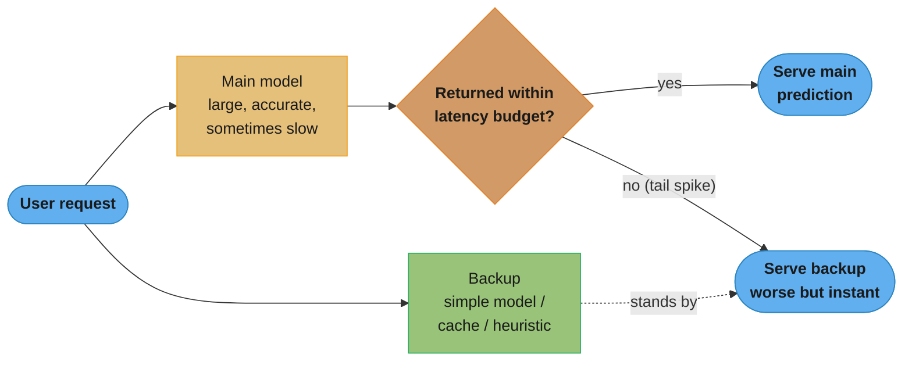
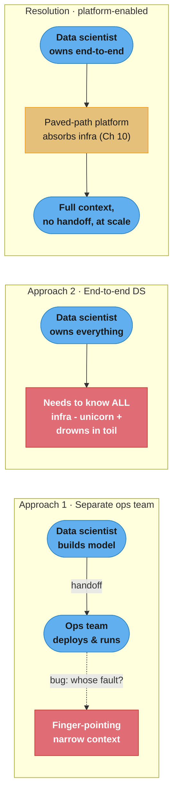
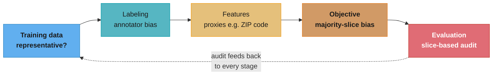
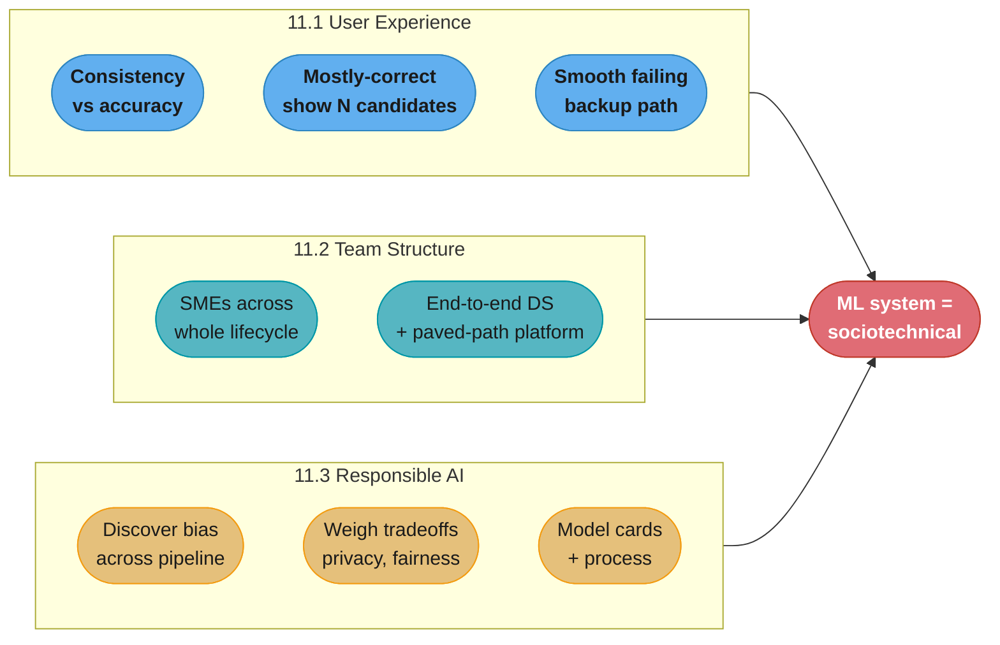
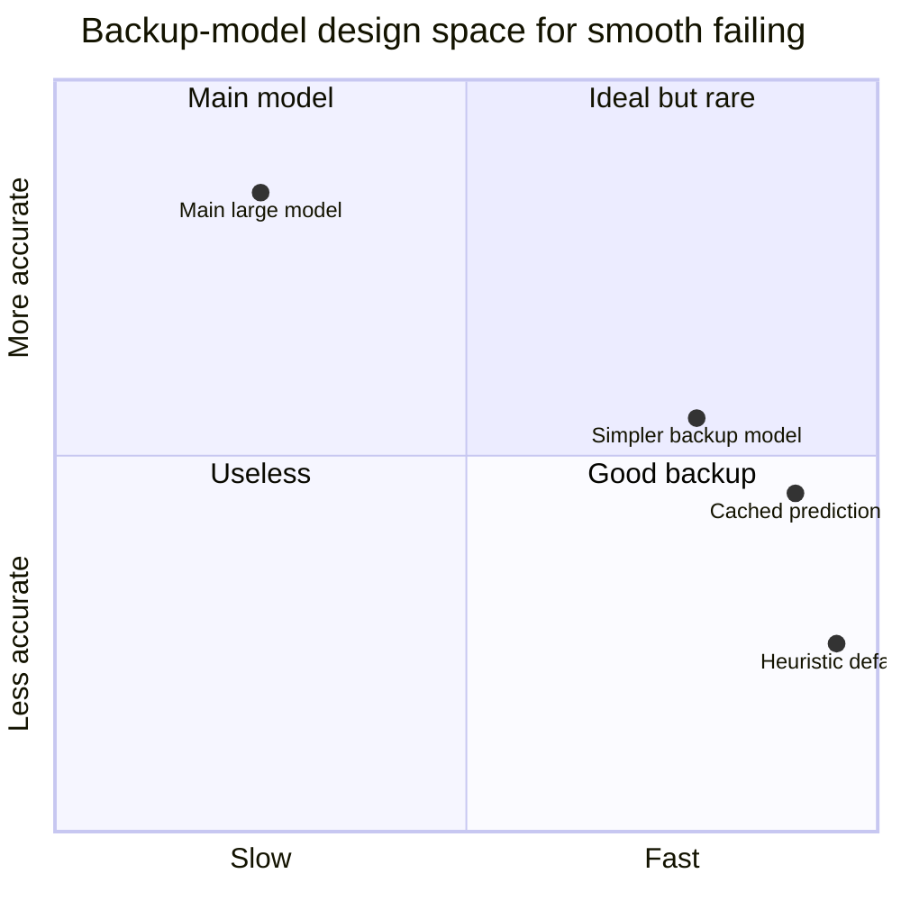

# Chapter 11: The Human Side of Machine Learning

> Ch 11 of 11 · Designing Machine Learning Systems (Huyen) · closes the book — probabilistic predictions meet real users, real teams, and real harm

## Chapter Map

The previous ten chapters treated ML systems as machines: data pipelines, feature stores,
training loops, deployment topologies, monitoring dashboards. This closing chapter turns to the
**humans on all three sides** of those machines — the *users* who consume probabilistic
predictions and behave in ways the metrics never captured, the *team* that builds and operates
the system and must decide who owns what, and the *people affected* by decisions the model makes,
including the ones who are silently harmed. Huyen's argument is that an ML system is not a
technical artifact but a **sociotechnical** one: its success or failure is decided as much by UX,
org structure, and ethics as by AUC. This chapter is the book's send-off, and it is deliberately
humble — the author states outright that the responsible-AI section is "nowhere near enough."

**TL;DR:**
- **User experience**: ML outputs are probabilistic, so the *same* user with the *same* input can
  get *different* results — you must design for consistency, for the danger of predictions that are
  "mostly correct," and for graceful (not catastrophic) failure when a big model misses its latency
  budget.
- **Team structure**: subject-matter experts (SMEs) belong across the *whole* lifecycle, not just
  labeling. The chapter's famous debate — a **separate ops/platform team** vs **end-to-end data
  scientists** who own the whole stack — resolves not to a side but to a condition: end-to-end
  ownership works *only* when the right abstractions and infrastructure exist to make it possible.
- **Responsible AI**: two dissected disasters (Ofqual's 2020 A-level grading, Strava's 2018
  heatmap) motivate a concrete framework — discover bias sources across the pipeline, understand the
  limits of the data-driven approach, weigh tradeoffs (privacy vs accuracy, compactness vs
  fairness), act early, publish model cards, and establish process.

## The Big Question

> "My model has good offline metrics. But real people use it, real engineers maintain it, and
> real people are affected by it. What breaks when I take a probabilistic system out of the
> notebook and put it in front of humans — and whose job is it to prevent the harm?"

A deterministic system gives the same output for the same input, always. An ML system does not:
its output is a *sample* from a distribution, its behavior shifts as data drifts, and the very
users it serves are changed by its predictions in ways that feed back into the next training set.
The technical excellence of the first ten chapters is necessary but not sufficient — a model that
is accurate on average can still confuse a user, mislead a non-expert, stall on a slow request,
overwhelm one engineer with infra toil, or systematically disadvantage a group of people who
never consented to being scored. This chapter is about all five.

---

## 11.1 User Experience

ML predictions are probabilistic, mostly correct, and often slow on the tail — three properties
that classical software does not have, and each one forces a UX decision that the modeling team
alone cannot make.

### Ensuring User Experience Consistency

A deterministic app gives a user the same experience every time; an ML app may not. The tension
is between **prediction quality** (which improves as the model personalizes and adapts to each
user) and **experience consistency** (which users expect from software — familiar layouts,
predictable behavior, "the same thing I saw yesterday").

**The booking-site case study.** Huyen tells the story of Booking.com's ML-powered filter
suggestions. The system learns which filters a traveler is likely to want (free WiFi, pet-friendly,
pool) and surfaces them. From a pure-accuracy standpoint, the *best* filter set changes as the
model learns more about the user and as its parameters update — so the suggestions the user sees
would keep shifting. But users hated this: a returning user who had learned where the "free
cancellation" filter lived would come back and find it *moved* or *gone*, because the model now
predicted a different set was more relevant. The personalization was technically better and
experientially worse.

The insight: **the "best" prediction for a metric is not always the best experience.** People
build muscle memory around UI. When the model's fresh-and-optimal output contradicts what the user
saw last time, you have a **consistency-accuracy tradeoff**. Booking's resolution was to *pin*
suggestions the user had already engaged with — accept a slightly less "optimal" filter set in
exchange for a stable, learnable interface. The same input should look roughly the same across
visits, even if a purely metric-driven model would nudge it every time.

This is a genuine design decision, not a bug: sometimes you deliberately *hold the model back*
from showing its freshest prediction because consistency is worth more to the user than a marginal
relevance gain.

### Combating "Mostly Correct" Predictions

Large models — GPT-style language models are the canonical example — produce outputs that are
**usually right, occasionally subtly wrong**, and the wrong ones look exactly as fluent and
confident as the right ones. For a domain *expert* this is fine: they can spot the wrong 10% and
fix it. For a **non-expert**, "mostly correct" is dangerous precisely because they *cannot tell
which part is wrong* — a plausible, well-formatted, confident answer that is 90% right can be worse
than an obvious failure, because the user trusts it and ships the broken 10%.

The problem is asymmetric: a fluent wrong answer costs *more* than a blank one, because it
manufactures false confidence. A translation that is grammatically perfect but reverses a negation,
a generated SQL query that runs but joins the wrong table, a code snippet that compiles but has an
off-by-one — all "mostly correct," all dangerous to someone who can't verify.

**The fix is a UX pattern, not a modeling fix: make verification cheap and show multiple
candidates.** Instead of presenting one authoritative answer, present *several* and let the human
choose. Huyen's canonical example is **code generation that renders three options**: the model
generates three candidate completions, the developer glances at all three, and picks the one that
looks right (or edits it). This does two things:

- It reframes the model as a *suggestion engine with a human in the loop*, not an oracle. The
  human stays the decision-maker; the model accelerates them.
- Showing multiple candidates raises the odds that *at least one* is fully correct, and the act of
  choosing forces a moment of verification the user would otherwise skip.

The general principle: **design for human-in-the-loop correction.** Surface confidence or
alternatives, make the wrong-answer cheap to reject, and never present a probabilistic output as if
it were a deterministic fact. The more your users are non-experts, the more this matters.

### Smooth Failing

Bigger models are more accurate and *slower*, and their latency has a **long tail** — most
requests are fast, but some spike well past the budget (a long input, a cache miss, a GC pause, a
cold model). If your product has a hard latency SLA — say 100 ms — a request that would take the
big model 300 ms is, from the user's perspective, a **failure**, even though the model would
eventually return a great answer.

The naive response is to **time out** and show an error. Huyen argues the better response is
**graceful degradation via a backup system**: when the main (large, accurate, sometimes-slow)
model misses its latency budget, fall back to a **simpler, faster model** or a **cached / heuristic
answer** that is worse-but-instant. The user gets *something useful now* instead of *nothing after
a spinner*.

**"Graceful degradation beats timeouts."** A slightly-less-accurate answer delivered inside the
budget is almost always a better experience than a perfect answer that arrives too late or an error
page. The backup can be:

- a **smaller/simpler model** (the same task, cheaper architecture, lower accuracy);
- a **cached** prior prediction for this or a similar input;
- a **heuristic / non-ML default** (popularity ranking, rule-based fallback).

The pattern is a **speed-accuracy race with a deadline**: fire the main model, and if it hasn't
returned by the budget, serve the backup. This is the ML analog of the resilience patterns from
distributed systems — a fallback path so a single slow component never becomes a user-visible
outage.

**Read it like this.** "Once you accept a hard latency budget, the model's accuracy stops being the quantity users experience — what they experience is accuracy *conditioned on arriving in time*, and a great answer that misses the deadline scores zero." That reframing is the whole argument for a backup: it moves the design question from "how accurate is the model?" to "what is served during the tail?", and the honest answer for a timeout policy is *nothing*.

| Symbol | What it is |
|--------|------------|
| budget | The hard latency SLA (100 ms in the chapter's example) |
| t_main | The main model's response time, with a long tail |
| tail rate | Fraction of requests where t_main exceeds the budget |
| t_backup | The fallback's response time — simpler model, cache, or heuristic |
| effective accuracy | Accuracy over all requests, counting a miss as a failure |
| graceful degradation | Serving the backup on a tail miss instead of an error |

**Walk one example.** Use the chapter's own numbers: a 100 ms budget, a main model whose tail requests take 300 ms. Assume the tail is 5% of traffic, the main model is 92% accurate, and the backup is 80% accurate but always returns in 20 ms.

```
  budget   = 100 ms      t_main (tail) = 300 ms      overrun = 300 - 100 = 200 ms
  the tail request is 300 / 100 = 3.0x over budget -- not marginal, a hard miss

  Over 1,000,000 requests, 5% of them (50,000) land in the tail.

  POLICY A -- TIME OUT AND ERROR
    950,000 served by main   : 0.95 x 0.92 = 0.8740 correct-and-on-time
     50,000 served nothing   : 0.05 x 0.00 = 0.0000
    effective accuracy       =              87.40%
    users shown an error page: 50,000

  POLICY B -- GRACEFUL DEGRADATION TO THE BACKUP
    950,000 served by main   : 0.95 x 0.92 = 0.8740
     50,000 served by backup : 0.05 x 0.80 = 0.0400
    effective accuracy       =              91.40%
    users shown an error page: 0

  delta = 91.40 - 87.40 = 4.00 percentage points of effective accuracy,
  bought without touching the model at all -- and 50,000 error pages removed.

Now the point the arithmetic makes that prose does not. The backup is 12 points
WORSE than the main model (80% vs 92%), and adding it still raised the number
users actually experience. That is because on those 50,000 requests the real
comparison was never 80% vs 92% -- the main model had already lost. It was
80% vs 0%.

Latency of what users actually receive, under Policy B:
    0.95 x (main, within budget) + 0.05 x 20 ms backup
  -- every single request answered inside the 100 ms budget, none dropped.
```

The reason this belongs in a chapter about *humans* rather than a chapter about serving is the asymmetry in the last block. Engineers instinctively protect the 92% number, because that is the number on the model card and the one the team is evaluated on. Users never see it. They see whether an answer appeared, and a 12-point-worse answer delivered on time beats a perfect one that never arrives — which is only obvious once the zero in `0.05 x 0.00` is written down.



Caption: the main model and a fast backup run against the same request; if the main model misses
the deadline, the system serves the backup's worse-but-instant answer rather than timing out —
graceful degradation instead of a user-visible error.

---

## 11.2 Team Structure

Two org questions dominate ML teams: how to involve people who understand the *domain* but not the
*math*, and whether data scientists should own their systems end-to-end or hand off to a
specialized ops team.

### Cross-functional Teams Collaboration

Most interesting ML problems need **subject-matter experts (SMEs)** — doctors for a diagnosis
model, lawyers for contract analysis, farmers for a crop model. The common failure is to treat
SMEs as *labelers only*: bring them in at the end to annotate data, ignore them everywhere else.

Huyen's guidance is that SMEs belong across the **whole lifecycle**:

- **Problem formulation** — is this even the right problem, framed the right way? An SME catches a
  misframed objective before any data is collected (the doctor who says "you're predicting the
  wrong thing").
- **Feature engineering** — SMEs know which signals actually matter and which are spurious. A
  farmer knows soil-moisture-at-dawn matters; the data scientist doesn't.
- **Error analysis** — when the model is wrong, the SME explains *why* in domain terms, turning an
  opaque error into an actionable one.
- **Evaluation** — SMEs define what "good" means for the real task, not just the proxy metric.

Two obstacles the chapter names:

1. **Explaining ML limits to SMEs.** SMEs may over-trust or under-trust the model; part of the job
   is teaching them what ML can and cannot do, and **involving them early** so they shape the
   system rather than merely rubber-stamp it.
2. **The no-code/low-code tooling gap.** SMEs usually can't (and shouldn't have to) write the
   pipeline code needed to contribute — to relabel, to adjust a feature, to inspect errors. The
   friction of "file a ticket, wait for an engineer" kills iteration. Better tooling that lets an
   SME contribute *directly* (no-code/low-code interfaces) is an under-built but high-leverage
   investment.

### End-to-End Data Scientists

This is the chapter's most-cited debate. Who owns the full ML system — from data through training,
deployment, monitoring, and infra?

**Approach 1 — a separate ops/platform team.** Data scientists build the model and hand it to a
dedicated team (ML engineers, MLOps, platform) that productionizes, deploys, and operates it.

- *For:* **specialization.** Each group does what it's best at; data scientists model, ops
  engineers run infra. On paper it's efficient.
- *Against:* **communication overhead** and **finger-pointing.** The model lives across a team
  boundary, so debugging a production problem means round-tripping between two teams who each have
  only *half* the context. When something breaks, it's "the model is bad" vs "the infra is bad" —
  nobody owns the whole failure. The data scientist has **narrow context**: they never see how
  their model behaves in production, so they can't improve it where it actually matters. Handoffs
  are where knowledge and accountability leak out.

**Approach 2 — end-to-end data scientists.** One person (or one tight team) owns the *whole thing*:
data, features, model, deployment, monitoring, the works. This is the **"full-stack data
scientist"** argument, associated with **Eric Colson at Stitch Fix**, whose framing is that
**engineers should own goals, not functions** — you organize people around *outcomes* they're
accountable for, not around narrow technical specialties they hand off between.

- *For:* whoever owns the goal has *full context* and *no handoff*. They see their model in
  production, debug the whole path, and iterate fast. Accountability is undivided.
- *The crushing counterpoint:* an end-to-end data scientist would need to know **everything** —
  modeling *and* data engineering *and* Kubernetes *and* CI/CD *and* monitoring. That's the
  **"unicorn" hiring problem**: such people barely exist, and asking every data scientist to be one
  means most of their time **drowns in infra toil** (fighting containers, pipelines, and cloud
  config) instead of doing the ML work they were hired for. Demanding full-stack breadth of
  everyone doesn't scale.

**The resolution the book lands on.** The debate is a false binary. End-to-end ownership *works* —
but **only with the right abstractions and platform** underneath it. If the infrastructure exposes
clean, self-serve abstractions — the **Netflix-style "paved paths"** from Chapter 10, where a data
scientist can deploy, monitor, and roll back without touching raw infra — then one person *can* own
the whole lifecycle **without being a DevOps expert**. The tooling absorbs the infra complexity so
the human keeps the context.

So the answer is not "which team structure" but "invest in the platform that makes end-to-end
ownership feasible." **Success = tooling that lets a data scientist own end-to-end without needing
to be an infra expert.** Without that tooling, forcing end-to-end ownership just recreates the
unicorn problem; with it, you get the full-context, no-handoff benefits at scale.



Caption: the separate-ops split creates finger-pointing and narrow context; naive end-to-end
ownership demands a unicorn and buries the scientist in infra toil; the book's resolution is that
a paved-path platform (Chapter 10) absorbs the infra so one owner keeps full context without being
a DevOps expert.

---

## 11.3 Responsible AI

**Responsible AI** is the practice of designing, developing, and deploying ML systems with good
intentions and sufficient awareness to empower users, engender trust, and ensure fairness — while
actively identifying and mitigating potential harms. Huyen is explicit that **this section is
nowhere near enough**: responsible AI is a vast field, the chapter is an introduction, and any
serious practitioner must go far beyond it. The honesty is the point — ethics is not a checkbox you
tick once.

The section leads with two real disasters, dissected properly, then generalizes into a framework.

### Case Study I — The Ofqual A-Level Grading Fiasco (2020)

When COVID-19 cancelled the UK's 2020 A-level exams, the regulator **Ofqual** deployed an algorithm
to assign grades automatically, since grades gate university admission. The algorithm combined each
student's *teacher-predicted* grade with the **historical performance of their school**. It was a
public catastrophe: roughly **40% of grades were downgraded** from teacher predictions, an outcry
followed, and the government executed a full **U-turn**, scrapping the algorithmic grades. Huyen
dissects **three distinct failures**:

1. **The wrong objective.** Ofqual optimized for *maintaining historical grade distributions across
   schools* — institutional/statistical fairness — rather than for the *accuracy of each
   individual student's grade*. Optimizing the aggregate at the expense of the individual is a
   values choice baked into the loss function, and it was the wrong one for a system that decides a
   single person's future.
2. **Insufficient fine-grained evaluation.** The model behaved very differently across cohort sizes.
   Students in **small cohorts** — disproportionately **small private schools** — were essentially
   given their teacher-predicted grades (too little history to "correct"), while students in **large
   cohorts** — disproportionately state schools — were pushed toward the school's historical
   distribution and downgraded. The result was **systematic bias favoring the already-privileged**.
   Aggregate metrics looked acceptable; the model was never evaluated finely enough *per slice* to
   surface this (the slice-based-evaluation lesson from Chapter 6).
3. **Lack of transparency and appeal.** The algorithm's workings and its failure modes were not
   made transparent, and there was no meaningful appeal process **until it was too late** — after
   grades were issued and lives disrupted. Opacity plus no recourse turned a technical bias into a
   **collapse of public trust**.

The lesson: a model can be statistically defensible in aggregate and still be *unjust* to
individuals and *illegitimate* to the public — because the objective was wrong, the evaluation was
too coarse to catch the disparate impact, and there was no transparency or appeal.

### Case Study II — The Strava Heatmap Incident (2018)

**Strava**, a fitness-tracking app, published a global **heatmap** of aggregated user activity —
billions of anonymized, aggregated GPS routes, meant as a beautiful data-art visualization. But in
sparsely populated regions, the *only* people generating activity were often soldiers, and the
aggregated routes **traced the perimeters and internal paths of secret military bases** — including
locations in conflict zones — effectively **exposing their layout and staffing patterns**.

The dissected lessons:

- **"Anonymized aggregate data still leaks."** Removing individual identities and aggregating does
  *not* guarantee privacy. In low-density contexts, the aggregate itself is a signature — the
  pattern reveals what no single de-identified point would. Aggregation is not anonymization.
- **Opt-out-by-default vs opt-in.** Users were included in the heatmap **by default** (opt-out); few
  changed the setting, and many did not understand the implication of their routes being pooled. An
  **opt-in** default — you're excluded unless you consciously agree — would have prevented the leak.
  Default settings are ethical decisions, because most users never change them.
- **Third-party data reuse.** Data collected for one purpose (personal fitness tracking) was reused
  for another (a public global visualization) whose risks the original consent never contemplated.
  Reuse widens the risk surface far beyond what users signed up for.

### A Framework for Responsible AI

The two case studies motivate a concrete, reusable checklist. Huyen frames responsible AI not as a
philosophy but as a set of engineering practices.

#### Discover sources for model biases across the whole workflow

Bias can enter at **every stage** of the ML pipeline, not just "bad training data." Audit each:

- **Training data** — is it *representative* of the population the model will serve? Under-sampled
  groups get worse predictions. (Ofqual's history reflected past inequities.)
- **Labeling** — human annotators bring their own biases; different annotators disagree, and
  systematic annotator bias propagates straight into the labels the model learns.
- **Feature engineering** — features can be **proxies for protected attributes**. **ZIP code** is
  the textbook example: it correlates strongly with race and income, so a model using ZIP code can
  discriminate on race *without ever seeing race as a feature*. Auditing features for proxy effects
  is essential.
- **Objective function** — optimizing average/aggregate performance quietly favors the **majority
  slice** at the expense of minorities (the loss is dominated by the common case). This is the
  slice-eval callback from Chapter 6: an objective that maximizes overall accuracy can be maximized
  by *ignoring* a rare, important subgroup. (Ofqual optimized the institutional aggregate.)
- **Evaluation** — if you only look at aggregate metrics you will miss disparate impact. **Slice-
  based audits** — measuring performance *per subgroup* — are how you catch the bias the aggregate
  hides.



Caption: bias is not a single defect in the data — it can enter at data, labeling, features,
objective, and evaluation, so a responsible-AI audit must inspect the *whole* pipeline and feed
slice-based findings back to every upstream stage.

#### Understand the limitations of the data-driven approach

Data is a *proxy* for reality, never reality itself. **Data is not lived experience** — a dataset
cannot capture the full context of the people it describes, and a purely data-driven optimization
can be blind to harms that never appear in the numbers. The corrective is to **involve the affected
communities**: the people who will be scored, graded, ranked, or policed by the system have
knowledge the data lacks, and bringing them into design surfaces harms that no metric would.

#### Understand the tradeoffs between different desiderata

Responsible-AI goals conflict with each other and with accuracy; you cannot maximize everything at
once. Huyen details **two tradeoffs** with their supporting findings:

- **Privacy vs accuracy.** Privacy techniques — chiefly **differential privacy**, which injects
  calibrated noise so no individual's data can be reverse-engineered — reduce model accuracy,
  because the noise degrades the signal. The critical, non-obvious finding: **the accuracy cost
  falls hardest on underrepresented groups.** Because those groups have less data, the added noise
  swamps their (already thin) signal disproportionately — so a privacy mechanism intended to protect
  everyone equally in fact *degrades the model most for the people already least well-served.*
- **Compactness vs fairness.** Model-compression techniques — **pruning** and **quantization** —
  shrink models for cheaper, faster inference, and their *aggregate* accuracy barely drops. But
  compression has a **disparate impact**: the finding is that **compression amplifies bias on rare
  classes and underrepresented groups** — the small drop in average accuracy is concentrated on the
  long tail, so a pruned model is markedly *less fair* even though its headline metric looks fine.
  You cannot judge a compressed model on aggregate accuracy alone.

Both tradeoffs share a pattern: a technique that looks neutral in aggregate concentrates its cost
on the groups that can least afford it — which is exactly why slice-based evaluation is
non-negotiable.

#### Act early

**It is far cheaper to address bias and harm at design time than to bolt it on later.** The
**"bolted-on ethics" failure mode** is treating responsibility as a compliance step after the
system is built — by then the wrong objective, the proxy features, and the unrepresentative data
are baked into a system that is expensive and painful to unwind. Building responsibility in from
problem-formulation onward is both cheaper and far more effective than retrofitting it.

#### Create model cards

**Model cards** are short documents that accompany a trained model and report how it was built, how
it performs, and where it should and should not be used — a standardized transparency artifact.
Huyen reproduces the model-card section list:

| Model-card section | What it documents |
|--------------------|-------------------|
| **Model details** | Who built it, when, version, architecture, training approach |
| **Intended use** | Primary use cases and intended users — *and* out-of-scope uses |
| **Factors** | Relevant groups, instrumentation, environments the model touches |
| **Metrics** | Which performance measures are reported and why (and thresholds) |
| **Evaluation data** | The datasets used to evaluate, and why they were chosen |
| **Training data** | The data the model learned from (as far as it can be disclosed) |
| **Ethical considerations** | Risks, sensitive use cases, potential harms |
| **Caveats and recommendations** | Known limitations, warnings, remaining open questions |

The point of a model card is that a model's *limits and intended scope travel with it*, so a
downstream team can't unknowingly use it out of context (the Ofqual and Strava failures were partly
context-misuse). Cards can and should be auto-generated as part of the pipeline so they stay current.

#### Establish processes for mitigating biases

Individual good intentions don't scale — you need **organizational process**:

- **Internal review boards** that evaluate high-stakes models before launch.
- **Third-party audits** — independent external review, because teams are blind to their own biases.
- **Incident reporting** — a channel and process for surfacing, tracking, and remediating harms
  after deployment, the way security teams handle vulnerabilities.

And, as an ongoing duty, **stay up-to-date on responsible AI** — the field, its techniques, and its
regulations move quickly, so responsibility is a continuous practice, not a one-time sign-off.

---

## Conclusion — ML Systems Are Sociotechnical (the book's send-off)

The book closes on its central claim: **an ML system is a sociotechnical system, not a technical
one.** The model is only a small part; its success is decided by the users who consume its
probabilistic outputs, the team and organization that build and operate it, and the people affected
by its decisions. All ten prior chapters — data, features, training, evaluation, deployment,
monitoring, infrastructure — are in service of putting a system in front of *humans*, and the
humans are where the system ultimately succeeds or fails. Design for consistency and for the danger
of "mostly correct." Fail smoothly. Structure teams — and build the platform — so ownership carries
context instead of leaking it. And treat responsibility as a first-class, ongoing engineering
concern, because the harm an ML system can do is as real as the value it can create. That is the
human side of machine learning, and it is where the book ends.

---

## Visual Intuition



Caption: the chapter's three concerns — the user in front of the system, the team behind it, and
the people affected by it — all reduce to one thesis: an ML system succeeds or fails as a
sociotechnical system, not a purely technical one.



Caption: the main model is accurate but tail-slow (upper left); a good backup lives lower-right —
fast enough to hit the budget, accurate enough to be useful — so serving it on a latency miss beats
both a timeout and waiting for the main model.

---

## Key Concepts Glossary

- **Sociotechnical system** — a system whose outcomes depend on people (users, team, affected
  parties) as much as on the technology; the book's closing thesis about ML.
- **User experience consistency** — giving a user the same, learnable experience across sessions
  despite the model's probabilistic, shifting outputs.
- **Consistency-accuracy tradeoff** — deliberately holding back the model's freshest/optimal
  prediction to keep the interface stable and familiar.
- **Booking-site filter case** — Booking.com's ML filter suggestions; pinned to stay consistent
  rather than re-optimized every visit.
- **"Mostly correct" prediction** — a fluent, confident output that is right most of the time but
  subtly wrong occasionally; dangerous for non-experts who can't spot the wrong part.
- **Human-in-the-loop correction** — UX design that keeps a human as the decision-maker, making
  wrong answers cheap to reject (e.g. render three code candidates).
- **Smooth failing / graceful degradation** — serving a worse-but-instant backup answer when the
  main model misses its latency budget, instead of timing out.
- **Backup system** — a simpler/faster model, cached answer, or heuristic that stands in when the
  main model is too slow.
- **Subject-matter expert (SME)** — a domain expert (doctor, lawyer, farmer) who should be involved
  across the whole ML lifecycle, not just labeling.
- **No-code/low-code SME tooling** — interfaces that let SMEs contribute directly without writing
  pipeline code; an under-built, high-leverage gap.
- **Separate ops team (Approach 1)** — data scientists hand off to a dedicated productionization
  team; gains specialization, suffers communication overhead, finger-pointing, and narrow context.
- **End-to-end data scientist (Approach 2)** — one owner for the whole ML lifecycle; full context,
  no handoff, but risks the unicorn-hiring problem and infra toil.
- **Full-stack data scientist / "own goals, not functions"** — Eric Colson's (Stitch Fix) argument
  for organizing around outcomes rather than narrow specialties.
- **Unicorn hiring problem** — needing one person who knows modeling *and* all of infra/ops; rare
  and unscalable.
- **Paved paths (Ch 10 callback)** — Netflix-style self-serve platform abstractions that let a data
  scientist own end-to-end without being a DevOps expert; the resolution to the team-structure debate.
- **Responsible AI** — designing/building/deploying ML with awareness of and active mitigation of
  potential harms; ensuring fairness and trust.
- **Ofqual grading fiasco (2020)** — UK auto-grading disaster; failures of wrong objective, coarse
  evaluation, and no transparency/appeal, favoring the privileged.
- **Strava heatmap incident (2018)** — anonymized aggregate fitness routes exposed military bases;
  lessons on opt-out defaults and aggregation not being anonymization.
- **Opt-out vs opt-in** — default inclusion vs default exclusion; a default is an ethical decision
  because most users never change it.
- **Proxy for a protected attribute** — a feature (e.g. ZIP code) that correlates with race/income,
  letting a model discriminate without the protected attribute as an input.
- **Majority-slice bias** — an objective that maximizes aggregate accuracy is dominated by the
  common case and neglects rare, important subgroups.
- **Slice-based audit** — measuring performance per subgroup to catch disparate impact the aggregate
  hides (Chapter 6 callback).
- **Differential privacy** — adding calibrated noise so individual data can't be reconstructed;
  costs accuracy, hardest on underrepresented groups.
- **Privacy vs accuracy tradeoff** — privacy noise degrades accuracy, disproportionately for groups
  with little data.
- **Compactness vs fairness tradeoff** — compression (pruning/quantization) barely lowers aggregate
  accuracy but amplifies bias on rare classes.
- **Model card** — a document shipped with a model reporting its details, intended use, factors,
  metrics, evaluation/training data, ethical considerations, and caveats.
- **Act early / bolted-on ethics** — addressing harm at design time is cheaper and more effective
  than retrofitting responsibility after the system is built.
- **Review boards / third-party audits / incident reporting** — organizational processes for
  catching and remediating bias before and after launch.

---

## Tradeoffs & Decision Tables

| Team structure | For | Against |
|----------------|-----|---------|
| Separate ops team (Approach 1) | Specialization; each group does what it's best at | Communication overhead, cross-boundary debugging, finger-pointing, narrow context |
| End-to-end data scientist (Approach 2) | Full context, no handoff, fast iteration, undivided ownership | Unicorn hiring problem; drowning in infra toil |
| End-to-end + paved-path platform | Full-context ownership *at scale*, no DevOps expertise required | Requires up-front investment in the platform/abstractions |

| UX property of ML | Naive response | Better design |
|-------------------|----------------|---------------|
| Probabilistic (same input, different output) | Show freshest prediction always | Pin for consistency (consistency-accuracy tradeoff) |
| Mostly correct | Present one authoritative answer | Show multiple candidates; human-in-the-loop verification |
| Long-tail latency | Time out / show error | Serve a fast backup (graceful degradation) |

| Responsible-AI tradeoff | Technique | Aggregate cost | Who pays most |
|-------------------------|-----------|----------------|---------------|
| Privacy vs accuracy | Differential privacy (noise) | Small accuracy drop | Underrepresented groups (thin signal swamped by noise) |
| Compactness vs fairness | Pruning / quantization | Small accuracy drop | Rare classes / minority groups (bias amplified) |

| Bias source (pipeline stage) | Example | Mitigation |
|------------------------------|---------|------------|
| Training data | Unrepresentative history (Ofqual) | Check representativeness; resample |
| Labeling | Annotator bias | Multiple annotators, agreement checks |
| Features | ZIP code as race proxy | Audit features for proxy effects |
| Objective | Majority-slice optimization | Fairness-aware objective; per-slice goals |
| Evaluation | Aggregate-only metrics | Slice-based audits (Ch 6) |

---

## Common Pitfalls / War Stories

- **Re-optimizing the UI on every prediction.** Showing the model's freshest "optimal" output each
  visit destroys the user's muscle memory (the Booking.com filter problem). Pin what the user has
  learned; accept a small metric loss for a stable experience.
- **Presenting a "mostly correct" output as an oracle.** A single confident, fluent answer to a
  non-expert who can't verify it ships the wrong 10% straight into production. Render multiple
  candidates and make rejection cheap.
- **Timing out on tail latency.** A perfect answer that arrives after the deadline, or an error
  page, is worse than a fast worse-answer. Wire a backup model/cache/heuristic.
- **Treating SMEs as labelers only.** Bringing domain experts in only at annotation time wastes
  their most valuable input — problem formulation, feature ideas, and error analysis. Involve them
  across the lifecycle and give them no-code tooling.
- **Forcing end-to-end ownership without a platform.** Demanding every data scientist run their own
  infra recreates the unicorn problem and buries them in toil. Build paved paths first, then
  ownership scales.
- **Splitting model and ops across teams and then debugging a production incident.** Neither team has
  full context; you get finger-pointing while the incident continues. This is the cost the paved-path
  resolution is meant to avoid.
- **Optimizing the aggregate at the expense of the individual (Ofqual).** A statistically defensible
  objective downgraded ~40% of students and systematically favored small private schools; the wrong
  objective plus no per-slice evaluation plus no appeal collapsed public trust and forced a U-turn.
- **Assuming aggregation = anonymization (Strava).** Anonymized, aggregated GPS routes traced secret
  military bases. In low-density contexts the aggregate itself is identifying; opt-out defaults meant
  most users never realized they were included.
- **Judging a compressed or privacy-protected model on aggregate accuracy alone.** The small headline
  drop hides a large, concentrated cost on rare classes and underrepresented groups. Always evaluate
  per slice.
- **Bolting ethics on at the end.** Retrofitting responsibility onto a built system is expensive and
  weak; the wrong objective and proxy features are already baked in. Act at design time.

---

## Real-World Systems Referenced

Booking.com (ML filter-suggestion consistency); GPT-style large language models and code-generation
assistants (the "mostly correct" / render-multiple-candidates pattern); Stitch Fix and Eric Colson
(the full-stack "own goals, not functions" data-scientist argument); Netflix (paved-path platform
abstractions, from Chapter 10); Ofqual, the UK exam regulator (2020 A-level auto-grading fiasco);
Strava (2018 anonymized-heatmap military-base exposure); model cards (Google's "Model Cards for
Model Reporting" framework).

---

## Summary

The final chapter argues that a machine learning system is **sociotechnical**: its fate rests on
humans as much as on models. On **user experience**, ML's probabilistic nature creates three design
problems — **consistency** (the same user should get a stable, learnable experience, so you accept a
consistency-accuracy tradeoff, as Booking.com did by pinning filter suggestions); **"mostly
correct" outputs** (fluent-but-subtly-wrong predictions are dangerous for non-experts, so you show
multiple candidates and design for human-in-the-loop correction, like rendering three code options);
and **smooth failing** (when a big model misses its latency budget, serve a simpler/cached/heuristic
backup — graceful degradation beats timeouts). On **team structure**, subject-matter experts belong
across the whole lifecycle, and the separate-ops-team vs end-to-end-data-scientist debate resolves
not to a winner but to a condition: end-to-end ownership works only when a paved-path platform
(Chapter 10) absorbs the infra so one owner keeps full context without being a DevOps unicorn. On
**responsible AI** — a section the author flags as far from sufficient — two dissected disasters
(Ofqual's wrong-objective, coarsely-evaluated, un-appealable grading; Strava's anonymized-aggregate
leak) motivate a concrete framework: discover bias sources at every pipeline stage (data, labels,
proxy features like ZIP code, majority-slice objectives, evaluation), understand that data is not
lived experience, weigh tradeoffs (privacy vs accuracy and compactness vs fairness both concentrate
their cost on underrepresented groups), act early rather than bolt ethics on, publish model cards,
and establish review boards, third-party audits, and incident reporting. The book ends where it
began in spirit — the model is the small part; the humans are the system.

---

## Interview Questions

**Q: What is the consistency-accuracy tradeoff in ML user experience?**
It is the tension between showing the model's freshest, most accurate prediction and keeping the user's experience stable and learnable across sessions. Because ML is probabilistic and the model keeps updating, a purely accuracy-driven system would shift its outputs every visit, breaking the user's muscle memory. Booking.com hit this with ML filter suggestions that kept moving, so it pinned suggestions the user had engaged with — accepting slightly less "optimal" filters for a consistent interface. The practical guidance: sometimes deliberately hold the model back from its freshest output because consistency is worth more than a marginal relevance gain.

**Q: Why are "mostly correct" predictions dangerous, and how do you design around them?**
They are dangerous because a fluent, confident output that is right 90% of the time looks identical to a fully correct one, so a non-expert who cannot spot the wrong 10% trusts and ships it. This is worse than an obvious failure because it manufactures false confidence — a translation that reverses a negation or SQL that joins the wrong table but runs. The fix is a UX pattern, not a modeling one: show multiple candidate outputs (like rendering three code completions), make wrong answers cheap to reject, and keep a human in the loop as the decision-maker. The more non-expert your users, the more this matters.

**Q: What is smooth failing, and why is it better than timing out?**
Smooth failing is serving a worse-but-instant backup answer when the main model misses its latency budget, instead of returning an error. Big models are more accurate but have long-tail latency, so some requests blow past a hard SLA; a naive timeout gives the user nothing after a spinner. Graceful degradation beats timeouts: fire the main model and, if it hasn't returned by the deadline, serve a simpler model, a cached prediction, or a heuristic default. A slightly-less-accurate answer inside the budget is almost always a better experience than a perfect answer that arrives too late.

**Q: Compare the separate-ops-team and end-to-end-data-scientist approaches to team structure.**
A separate ops team gives specialization — data scientists model, a dedicated team productionizes — but creates communication overhead, cross-boundary debugging, finger-pointing when something breaks, and narrow context because the scientist never sees the model in production. End-to-end data scientists own the whole lifecycle, giving full context and no handoff, but demand a person who knows modeling and all of infra (the unicorn problem) and risk drowning in infra toil. The book resolves the debate not by picking a side but by adding a condition: a paved-path platform makes end-to-end ownership feasible without DevOps expertise.

**Q: What resolution does the book reach on the end-to-end data scientist debate?**
End-to-end ownership works, but only with the right abstractions and platform underneath it. Without tooling, forcing every data scientist to own infra recreates the unicorn-hiring problem and buries them in toil; the separate-team alternative leaks context and creates finger-pointing. The resolution is Netflix-style paved paths (from Chapter 10): self-serve platform abstractions that absorb the infra complexity so a data scientist can deploy, monitor, and roll back without being a DevOps expert. Success equals tooling that lets one owner keep full context at scale.

**Q: What three failures does the book identify in the Ofqual 2020 grading fiasco?**
Wrong objective, insufficient fine-grained evaluation, and lack of transparency and appeal. Ofqual optimized for maintaining schools' historical grade distributions rather than individual-student accuracy, which is the wrong values choice for a life-altering decision. It never evaluated finely enough per slice to catch that small cohorts (private schools) kept teacher grades while large cohorts (state schools) were downgraded — systematic bias favoring the privileged. And the algorithm's workings and failure modes were opaque with no meaningful appeal until too late, collapsing public trust and forcing a government U-turn after ~40% of grades were downgraded.

**Q: What are the lessons from the Strava heatmap incident?**
That anonymized aggregate data still leaks, that defaults are ethical decisions, and that third-party data reuse widens risk. Strava published a heatmap of billions of anonymized, aggregated GPS routes, but in sparsely populated regions the only activity came from soldiers, so the aggregate traced the perimeters of secret military bases. Aggregation is not anonymization — in low-density contexts the pattern itself is identifying. Users were included opt-out by default and most never changed the setting, and data collected for fitness tracking was reused for a public visualization whose risks the original consent never contemplated.

**Q: Where can bias enter an ML pipeline, beyond the training data?**
At every stage: training data, labeling, feature engineering, the objective function, and evaluation. Training data may be unrepresentative; annotators inject labeling bias; features can be proxies for protected attributes; the objective can favor the majority slice; and aggregate-only evaluation hides disparate impact. A responsible-AI audit must inspect the whole workflow, not just the data, because a bias introduced at any one stage propagates into the model. Slice-based audits at the evaluation stage feed findings back to fix the upstream stages.

**Q: Why is ZIP code a problematic feature even when race is not an input?**
Because ZIP code is a proxy for protected attributes — it correlates strongly with race and income, so a model using it can discriminate on race without ever seeing race as a feature. This is the textbook example of proxy bias: removing the protected attribute from the inputs does not remove the model's ability to discriminate, because a correlated feature carries the same information. The mitigation is to audit features for proxy effects, not just to drop the obviously protected columns.

**Q: Explain the privacy-versus-accuracy tradeoff and who bears its cost.**
Privacy techniques like differential privacy inject calibrated noise so no individual's data can be reconstructed, and that noise reduces model accuracy. The critical finding is that the accuracy cost falls hardest on underrepresented groups: because they have less data, the added noise swamps their already-thin signal disproportionately. So a privacy mechanism meant to protect everyone equally in fact degrades the model most for the people already least well-served, which is why you must evaluate its impact per slice rather than trusting the aggregate.

**Q: What is the compactness-versus-fairness tradeoff in model compression?**
Compression techniques like pruning and quantization shrink models with barely any drop in aggregate accuracy, but that small drop is concentrated on rare classes and underrepresented groups — compression amplifies bias on the long tail. So a compressed model can look fine on headline metrics while being markedly less fair. The guidance is that you cannot judge a pruned or quantized model on aggregate accuracy alone; you must run slice-based evaluation to see the disparate impact before shipping it.

**Q: What is a model card and what does it contain?**
A model card is a short document shipped with a trained model that reports how it was built and where it should and should not be used. Its sections are model details (who, when, architecture), intended use (primary and out-of-scope uses), factors (relevant groups and environments), metrics (which measures and why), evaluation data, training data, ethical considerations (risks and sensitive uses), and caveats and recommendations (known limitations). The point is that a model's limits and intended scope travel with it, so downstream teams can't unknowingly misuse it out of context.

**Q: What does "act early" mean in responsible AI, and what is the failure mode it avoids?**
Act early means addressing bias and potential harm at design time rather than retrofitting responsibility after the system is built. The failure mode it avoids is "bolted-on ethics" — treating responsibility as a compliance step at the end, by which point the wrong objective, proxy features, and unrepresentative data are already baked into a system that is expensive and painful to unwind. Building responsibility in from problem formulation onward is both cheaper and far more effective than fixing it later.

**Q: Why should subject-matter experts be involved beyond labeling?**
Because SMEs contribute their most valuable knowledge in problem formulation, feature engineering, and error analysis, not just annotation. A doctor can catch a misframed objective before data collection; a farmer knows which signals actually matter as features; and an SME explains model errors in domain terms that make them actionable. Treating SMEs as labelers only wastes this, and the friction of file-a-ticket-and-wait kills iteration — so involve them across the lifecycle and give them no-code/low-code tooling to contribute directly.

**Q: What organizational processes does the book recommend for mitigating bias?**
Internal review boards, third-party audits, and incident reporting. Review boards evaluate high-stakes models before launch; third-party audits provide independent external review because teams are blind to their own biases; and incident reporting gives a channel to surface, track, and remediate harms after deployment, the way security teams handle vulnerabilities. The book also stresses staying up-to-date on responsible AI, since the field, its techniques, and its regulations move quickly — responsibility is a continuous practice, not a one-time sign-off.

**Q: Why does the book call an ML system "sociotechnical," and why does that matter?**
Because an ML system's success or failure is decided by humans — the users consuming probabilistic outputs, the team building and operating it, and the people affected by its decisions — as much as by the model itself. The model is the small part; the same technically excellent system can confuse users, mislead non-experts, stall on slow requests, overwhelm one engineer, or systematically harm a group. Recognizing it as sociotechnical means UX, team structure, and ethics are first-class engineering concerns, not afterthoughts — which is the book's closing thesis.

**Q: Why is showing multiple candidate outputs a better pattern than showing the single best one for large models?**
Because it keeps the human as the verifier and raises the odds that at least one candidate is fully correct. A single output invites the user to trust it blindly, which is dangerous when the model is "mostly correct" and the user can't spot the wrong part. Rendering several (like three code completions) reframes the model as a suggestion engine with a human in the loop, and the act of choosing forces a verification step the user would otherwise skip. It is a UX fix for a problem no amount of extra accuracy fully removes.

**Q: Why is an opt-out default an ethical decision, using Strava as the example?**
Because most users never change default settings, so the default effectively decides what happens to nearly everyone's data. Strava included users in its public heatmap by default (opt-out), and few changed it or understood the implication, so billions of routes were pooled into a visualization that exposed military bases. An opt-in default — excluded unless you consciously agree — would have prevented the leak. The lesson is that choosing opt-out versus opt-in is not a neutral engineering knob; it is a consequential ethical choice about consent.

**Q: How does the majority-slice problem connect the objective function to fairness?**
An objective that maximizes average or aggregate accuracy is dominated by the common case, so it can be maximized while neglecting a rare but important subgroup — the loss barely moves if a minority is served poorly. This is how the objective function becomes a bias source: optimizing the aggregate quietly trades away minority performance. Ofqual's choice to optimize institutional grade distributions over individual accuracy is an instance of this. The corrective is fairness-aware objectives and per-slice goals, verified with slice-based evaluation (Chapter 6).

---

## Cross-links in this repo

- [ml/fairness_and_responsible_ai/ — bias sources, fairness metrics, mitigation, model cards in depth](../../../ml/fairness_and_responsible_ai/README.md)
- [ml/privacy_preserving_ml/ — differential privacy, the privacy-accuracy tradeoff, federated learning](../../../ml/privacy_preserving_ml/README.md)
- [ml/interpretability_and_explainability/ — transparency, per-decision explanations, and appeal](../../../ml/interpretability_and_explainability/README.md)
- [ml/model_compression_and_efficiency/ — pruning/quantization and the compactness-fairness tradeoff](../../../ml/model_compression_and_efficiency/README.md)
- [Ch 6 — Model Development and Offline Evaluation (slice-based evaluation)](../06_model_development_and_offline_evaluation/README.md)
- [Ch 10 — Infrastructure and Tooling for MLOps (paved paths, self-serve platform)](../10_infrastructure_and_tooling_for_mlops/README.md)

## Further Reading

- Huyen, *Designing Machine Learning Systems*, Ch 11 — original text and references.
- Mitchell et al., "Model Cards for Model Reporting," 2019 — the model-card framework reproduced above.
- Bagdasaryan, Poursaeed & Shmatikov, "Differential Privacy Has Disparate Impact on Model Accuracy," 2019 — the privacy-vs-accuracy finding.
- Hooker et al., "What Do Compressed Deep Neural Networks Forget?" 2019 — the compression-amplifies-bias finding.
- Colson, "Beware the Data Science Pin Factory" (Stitch Fix / MultiThreaded blog) — the full-stack "own goals, not functions" argument.
- Ofqual, UK 2020 A-level algorithmic grading — public reporting on the objective, cohort-size bias, and U-turn.
- Strava Global Heatmap, 2018 — public reporting on the military-base exposure from anonymized aggregate data.
