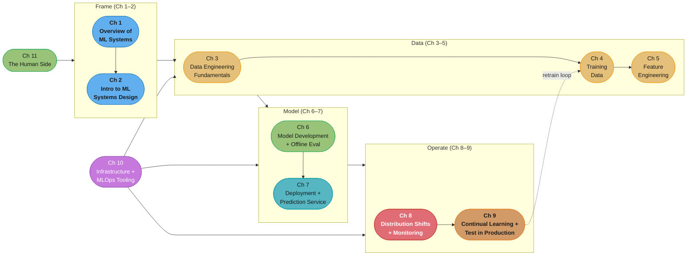
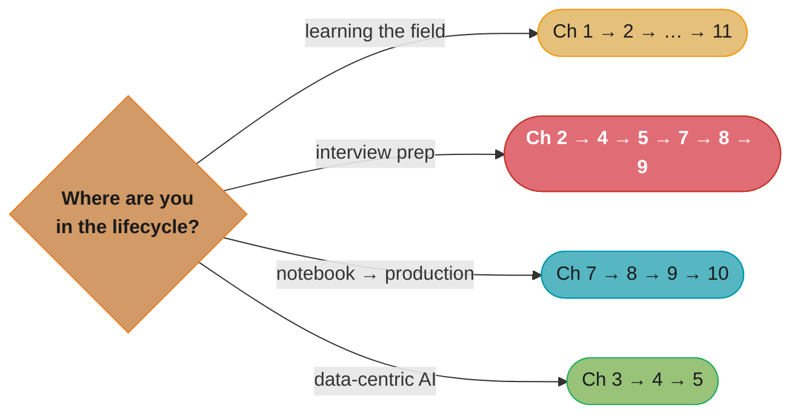

# Designing Machine Learning Systems (DMLS)

> Chip Huyen · O'Reilly · "An iterative process for production-ready applications." A
> chapter-by-chapter, in-depth summary — read this folder in order and you have read the
> book.

---

## The Book's Thesis

ML in production is nothing like ML in a Jupyter notebook. The model is a small piece of a
much larger system, and the book's central claim is that **ML systems design must be
holistic**: business framing, data engineering, feature pipelines, deployment, monitoring,
infrastructure, and the humans in the loop all shape whether the system works — usually
more than the choice of algorithm does. Three through-lines recur on every page:

- **Data trumps models.** Most production wins come from better training data, features,
  and labels — not fancier architectures (Ch 3–5 get as many pages as modeling itself).
- **ML systems fail silently and drift constantly.** Unlike traditional software, a
  perfectly "healthy" service can serve garbage predictions; distribution shift is the
  default, not the exception (Ch 8–9).
- **Iteration speed is the real metric.** The system that can retrain, evaluate, ship,
  and roll back fastest wins — which makes infrastructure (Ch 10) and process (Ch 11)
  first-class design concerns.

The chapters follow the lifecycle of a real project, and so do the summaries in this
folder: frame the problem, engineer the data, develop the model, deploy it, watch it
drift, retrain continually, and build the platform and team that make the loop cheap.

---

## The Book Map (the ML system lifecycle)

*The book is a loop, not a line: Ch 9's continual learning feeds back into Ch 4's training
data (dotted edge), while infrastructure (purple, Ch 10) and humans (Ch 11) support every
stage. Red marks Ch 8 — the failure-modes chapter that motivates the whole "Operate"
phase.*

---

## Chapter Index

| # | Chapter | Folder | One-line summary | Repo deep-dive |
|---|---------|--------|------------------|----------------|
| 1 | Overview of Machine Learning Systems | [01_overview_of_machine_learning_systems/](01_overview_of_machine_learning_systems/README.md) | When (not) to use ML; ML in research vs production; vs traditional software | [ml/](../../ml/README.md) |
| 2 | Introduction to ML Systems Design | [02_introduction_to_machine_learning_systems_design/](02_introduction_to_machine_learning_systems_design/README.md) | Business vs ML objectives; the four requirements; iterative process; framing | [ml/ml_system_design/](../../ml/ml_system_design/README.md) |
| 3 | Data Engineering Fundamentals | [03_data_engineering_fundamentals/](03_data_engineering_fundamentals/README.md) | Sources, formats, models, storage engines, dataflow modes (batch/stream) | [ml/data_pipelines_and_processing/](../../ml/data_pipelines_and_processing/README.md) |
| 4 | Training Data | [04_training_data/](04_training_data/README.md) | Sampling, labeling, class imbalance, data augmentation | [ml/active_learning_and_weak_supervision/](../../ml/active_learning_and_weak_supervision/README.md) |
| 5 | Feature Engineering | [05_feature_engineering/](05_feature_engineering/README.md) | Feature operations, leakage, importance, generalization, feature stores | [ml/feature_engineering/](../../ml/feature_engineering/README.md) |
| 6 | Model Development and Offline Evaluation | [06_model_development_and_offline_evaluation/](06_model_development_and_offline_evaluation/README.md) | Model selection, ensembles, experiment tracking, AutoML, offline eval methods | [ml/model_evaluation_and_selection/](../../ml/model_evaluation_and_selection/README.md) |
| 7 | Model Deployment and Prediction Service | [07_model_deployment_and_prediction_service/](07_model_deployment_and_prediction_service/README.md) | Batch vs online prediction, model compression, cloud vs edge | [ml/model_serving_and_inference/](../../ml/model_serving_and_inference/README.md) |
| 8 | Data Distribution Shifts and Monitoring | [08_data_distribution_shifts_and_monitoring/](08_data_distribution_shifts_and_monitoring/README.md) | Covariate/label/concept shift; detection; monitoring and observability | [ml/monitoring_and_drift_detection/](../../ml/monitoring_and_drift_detection/README.md) |
| 9 | Continual Learning and Test in Production | [09_continual_learning_and_test_in_production/](09_continual_learning_and_test_in_production/README.md) | Retraining stages; shadow, A/B, canary, interleaving, bandits | [ml/mlops_and_ci_cd/](../../ml/mlops_and_ci_cd/README.md) |
| 10 | Infrastructure and Tooling for MLOps | [10_infrastructure_and_tooling_for_mlops/](10_infrastructure_and_tooling_for_mlops/README.md) | Storage/compute layers, dev environments, resource management, ML platform | [devops/](../../devops/README.md) |
| 11 | The Human Side of Machine Learning | [11_the_human_side_of_machine_learning/](11_the_human_side_of_machine_learning/README.md) | UX under probabilistic predictions, team structure, responsible AI | [ml/fairness_and_responsible_ai/](../../ml/fairness_and_responsible_ai/README.md) |

---

## How to Read This (Reading Paths)

- **Cover to cover (recommended):** the chapters mirror a real project's lifecycle; each
  builds vocabulary the next assumes.
- **ML-system-design interview:** Ch 2 → 4 → 5 → 7 → 8 → 9 — framing, data, serving, and
  the production loop are where interviews live; pair with
  [ml/ml_system_design/](../../ml/ml_system_design/README.md).
- **"My model works in the notebook" path:** Ch 7 → 8 → 9 → 10. Everything that happens
  after `model.fit()`.
- **Data-centric path:** Ch 3 → 4 → 5. The chapters the book itself argues matter most.

*Four entry points into the same lifecycle — the interview path (red) matches the six
chapters that map 1:1 onto the questions asked in ML system design rounds.*

---

## Build Manifest

Per-file build status for this book. Update the row to `done` the moment a chapter file is
completed and diagram-linted.

| # | File | Status |
|---|------|--------|
| 1 | `01_overview_of_machine_learning_systems/README.md` | done |
| 2 | `02_introduction_to_machine_learning_systems_design/README.md` | done |
| 3 | `03_data_engineering_fundamentals/README.md` | done |
| 4 | `04_training_data/README.md` | done |
| 5 | `05_feature_engineering/README.md` | done |
| 6 | `06_model_development_and_offline_evaluation/README.md` | done |
| 7 | `07_model_deployment_and_prediction_service/README.md` | done |
| 8 | `08_data_distribution_shifts_and_monitoring/README.md` | done |
| 9 | `09_continual_learning_and_test_in_production/README.md` | done |
| 10 | `10_infrastructure_and_tooling_for_mlops/README.md` | done |
| 11 | `11_the_human_side_of_machine_learning/README.md` | done |

---

## Cross-Reference Map (DMLS → repo deep dives)

| DMLS concept | Primary deep-dive module |
|--------------|--------------------------|
| ML system design end-to-end | [ml/ml_system_design/](../../ml/ml_system_design/README.md), [ml/case_studies/](../../ml/case_studies/README.md) |
| Data pipelines, batch vs stream | [ml/data_pipelines_and_processing/](../../ml/data_pipelines_and_processing/README.md) |
| Labeling, weak supervision, active learning | [ml/active_learning_and_weak_supervision/](../../ml/active_learning_and_weak_supervision/README.md) |
| Class imbalance & leakage | [ml/imbalanced_data_and_leakage_traps/](../../ml/imbalanced_data_and_leakage_traps/README.md) |
| Feature engineering & stores | [ml/feature_engineering/](../../ml/feature_engineering/README.md) |
| Model evaluation & selection | [ml/model_evaluation_and_selection/](../../ml/model_evaluation_and_selection/README.md) |
| Experiment tracking & versioning | [ml/experiment_tracking_and_versioning/](../../ml/experiment_tracking_and_versioning/README.md) |
| Serving, compression, edge | [ml/model_serving_and_inference/](../../ml/model_serving_and_inference/README.md), [ml/model_compression_and_efficiency/](../../ml/model_compression_and_efficiency/README.md) |
| Drift detection & monitoring | [ml/monitoring_and_drift_detection/](../../ml/monitoring_and_drift_detection/README.md) |
| MLOps, CI/CD, retraining | [ml/mlops_and_ci_cd/](../../ml/mlops_and_ci_cd/README.md) |
| Fairness & responsible AI | [ml/fairness_and_responsible_ai/](../../ml/fairness_and_responsible_ai/README.md) |
| LLM-era serving platforms | [llm/](../../llm/CLAUDE.md) |
