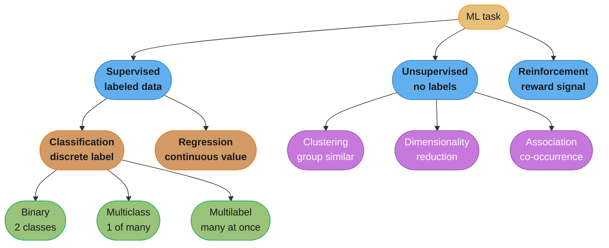
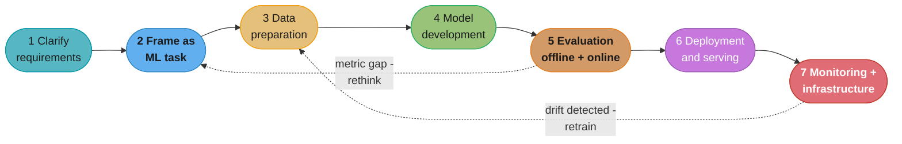
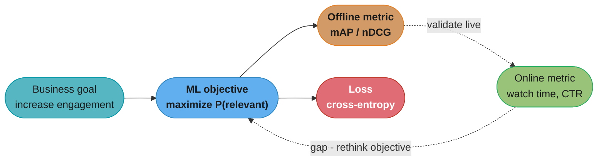
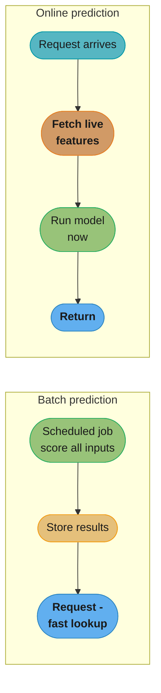

# Chapter 1: Introduction and Overview

> Ch 1 of 11 · ML System Design Interview (Aminian & Xu) · the 7-step framework every design chapter (Ch 2–11) instantiates

## Chapter Map

An ML system design interview is open-ended by design: the interviewer hands you a
one-line prompt ("design the YouTube video recommendation system") and watches *how you
structure the ambiguity*, not whether you memorized an architecture. This chapter gives
you the structure — a **7-step framework** that turns any vague prompt into an ordered
walk from business goal to a monitored production system. Every later chapter (Ch 2–11)
is that same framework instantiated on a specific product, so learning it well here pays
off nine more times.

**TL;DR:**
- The framework is seven steps: **Clarifying Requirements → Frame the Problem as an ML
  Task → Data Preparation → Model Development → Evaluation → Deployment & Serving →
  Monitoring & Infrastructure.** It is a *checklist and a talking order*, not a rigid
  pipeline — you loop back constantly.
- The single most-tested skill is **translating a fuzzy business objective ("increase
  engagement") into a precise, measurable ML objective ("maximize predicted watch
  time")** — get this wrong and every downstream choice is wrong.
- Two gaps decide real systems: the **offline/online metric gap** (a model that wins on
  F1 offline can lose on revenue online) and the **batch-vs-online serving choice**
  (precompute cheaply vs predict fresh on request).
- Production failure is dominated by **data distribution shift**, so *monitoring +
  retraining* is part of the design, not an afterthought.

## The Big Question

> "The interviewer gave me one sentence. Where do I even start, and in what order do I
> talk, so that in 45 minutes I demonstrate senior-level breadth without drowning in any
> one detail?"

Analogy: the framework is the **flight checklist** a pilot runs before takeoff. A veteran
pilot could fly without reading it, but the checklist guarantees nothing critical is
skipped under pressure — and the interview *is* pressure. You run the same seven items
every time; the aircraft (the product) changes, the checklist does not. The art is
knowing which items to dwell on for *this* aircraft: a visual-search system spends its
time on step 4 (representation learning) and step 6 (nearest-neighbor serving); an
ad-click system spends its time on step 5 (feature crossing) and step 7 (continual
learning). The framework tells you *what* to cover; clarifying requirements tells you
*where to spend the minutes*.

---

## 1.1 Clarifying Requirements

The interview prompt is deliberately underspecified. The first few minutes are for
**asking questions** until you and the interviewer share a scoped problem. Never start
designing before this; jumping straight to a model is the most common junior mistake. The
book groups the questions into a small number of themes — memorize the themes, not a
script, because the interviewer will only answer some and expect you to state reasonable
assumptions for the rest.

### Business objective

Start here, always. Ask *what business outcome the system exists to move*. "Design video
recommendations" could mean maximize watch time, maximize ad revenue, maximize retention,
or maximize creator payouts — each leads to a different ML objective and a different
metric. You cannot design until you know which. This question is the hinge the whole
framework swings on (§1.2 turns its answer into the ML objective).

### Features / what the system supports

What can a user actually *do*? For a recommender: is it a personalized homepage feed, a
"more like this" carousel, a search box, or a notifications digest? Does the result need
to be personalized per user or is one global ranking acceptable? Can the user give
explicit feedback (like/dislike) or only implicit (click, dwell)? Each supported feature
adds inputs and constraints.

### Data — sources, size, labeled?

Ask: **what data exists, who collected it, is it clean and trusted, and is it labeled?**
Distinguish **user-generated** data (posts, uploads — the user is aware they are creating
it) from **system-generated** data (logs, impressions, model predictions — a byproduct).
Ask the **volume** (thousands vs billions of rows) because it decides which model families
are even feasible, and whether labels exist or must be created (hand labeling vs natural
labeling — see §1.4).

### Constraints — compute, on-device vs cloud

What is the compute budget for training and for serving? Must inference run **on-device**
(phone, camera, car — privacy and offline needs, but tiny compute) or in the **cloud**
(big models, but a network round-trip)? This constraint reaches all the way forward to
§1.6's serving decision, so raise it early.

### Scale — users, items, growth

Ask the **number of users, number of items, and growth rate**. "1 billion users, 10
billion items, growing 20% a year" is a different system than "10,000 users." Scale
decides sharding, whether you can afford an exact nearest-neighbor search, how big the
candidate set is, and how the system must degrade gracefully.

### Performance — latency, throughput, accuracy tradeoff

What is the **latency budget** end to end (a feed must return in ~200 ms; an offline
batch job blurring Street View imagery has no user-facing latency at all)? What
**throughput** (queries per second) at peak? And crucially, the **accuracy-vs-latency
tradeoff**: a heavier model is more accurate but slower, so ask how the product values one
against the other. This tension recurs in every serving section.

### Privacy and ethics

Does the data include personal or sensitive attributes? Are there fairness requirements
across demographic groups? Are there regulatory constraints (GDPR, CCPA)? Raising this
unprompted signals seniority; it also feeds real design decisions (on-device inference for
privacy, de-biasing training data, fairness metrics in evaluation).

> **The output of §1.1** is a short written list of assumptions and scoped requirements on
> the whiteboard. State them out loud ("I'll assume 1B users, cloud serving, a 200 ms
> budget, implicit feedback only") so the interviewer can correct you before you build on
> a wrong premise.

---

## 1.2 Framing the Problem as an ML Task

Now convert the scoped product into a well-posed machine-learning problem. This is the
step interviewers probe hardest, because it separates people who *reach for a model* from
people who *reason about whether a model is even the right tool and, if so, exactly what
it predicts.*

### Is ML the right tool at all?

ML is appropriate when there is a **pattern to learn**, that pattern is **hard to specify
with explicit rules**, **data exists** to learn it from, and the problem is **repetitive /
at scale** enough to justify the cost. If a handful of business rules solve the problem,
say so — proposing ML for a problem a `WHERE` clause solves is a red flag, not a strength.

### Defining the ML objective — the core translation

The **business objective** ("increase user engagement") is not something a model can
optimize; it is not a number a loss function can descend. The job is to translate it into
a **measurable ML objective** — a target the model can be trained to predict. This
translation is the highest-leverage decision in the whole design, because a
*wrongly-chosen* ML objective optimizes the wrong thing perfectly.

| Application | Business objective | Possible ML objective |
|-------------|--------------------|-----------------------|
| Ad click prediction | Increase revenue | Predict P(user clicks the ad) — maximize CTR |
| Video recommendation | Increase engagement | Maximize number of *relevant* videos shown |
| Event recommendation | Increase ticket sales | Predict P(user registers for the event) |
| Harmful-content detection | Improve platform safety | Predict P(a post is harmful) |
| Friend recommendation | Grow the social network | Predict P(a connection forms between two users) |
| Google Photos search | Help users find photos | Classify / retrieve images by content |

The subtlety: several ML objectives can serve the same business objective, and they are
**not equivalent**. For video engagement you could maximize *clicks* (invites clickbait),
*completed videos* (favors short clips), *total watch time* (favors long videos), or
*number of relevant videos* (the book's usual choice, because it resists the failure modes
of the others). Always name the candidate objectives and defend the one you pick — that
discussion is worth more than the model that follows.

### Specifying input and output

State precisely what goes in and what comes out. "Input = a text query string; output = a
ranked list of video IDs." "Input = an uploaded image; output = a set of bounding boxes,
each with a class label." Nailing input/output early prevents a whole class of confusion
later and forces you to notice multi-output situations.

### One model vs multiple models (multi-model decompositions)

When the system needs several outputs, you choose between:
- **One model per output** — e.g. a separate classifier for each harmful-content category.
  Flexible (per-output thresholds, independent retraining) but expensive (N models, N
  training sets, redundant computation).
- **One multi-output model** — a single network with multiple heads (multi-task learning).
  Shares a representation, needs less labeled data per task, no redundant computation, but
  is less flexible and couples the tasks.

This tradeoff returns in almost every later chapter (harmful content, news feed), so
recognize the pattern here.

### Choosing the ML category — the taxonomy

Place the problem in the ML taxonomy; the category dictates the data you need and the
metrics you'll use.



Caption: the ML-task taxonomy the book walks in §1.2 — choosing the leaf pins down the
label format you must build in §1.3 and the metric family you'll report in §1.5.

- **Supervised** — learn from labeled examples.
  - **Classification** — output is a discrete class.
    - *Binary* — two classes (spam / not spam; harmful / benign).
    - *Multiclass* — exactly one of many classes (which of 1,000 object types).
    - *Multilabel* — several classes can apply at once (a post that is both "violence"
      and "hate speech").
  - **Regression** — output is a continuous number (predicted watch-time in seconds,
    house price, dwell time).
- **Unsupervised** — find structure with no labels.
  - *Clustering* — group similar items (user segments, near-duplicate images).
  - *Dimensionality reduction* — compress features while keeping structure (PCA, embeddings).
  - *Association* — discover co-occurrence rules ("bought X also bought Y").
- **Reinforcement learning** — an agent learns a **policy** by taking actions in an
  environment and receiving **rewards** (game playing, robotics, some ranking/exploration
  problems). Applies when the system acts sequentially and learns from delayed feedback.

Most interview problems in this book resolve to **supervised classification or ranking**;
the discipline is to *say why* the problem is supervised and *which* sub-type, not to jump
straight to "a neural network."

---

## 1.3 Data Preparation

Data preparation has two halves the book keeps distinct: **data engineering** (getting the
raw data organized and available) and **feature engineering** (turning it into model
inputs). Real systems spend far more time here than on modeling.

### Data engineering — sources

Ask of every data source: **who collected it, how, is it clean, and is it trusted?**
- **User-generated** data (uploads, posts, reviews, explicit ratings) — the user knowingly
  produced it; typically higher intent, lower volume.
- **System-generated** data (logs, impressions, clicks, model outputs) — a byproduct of the
  system running; huge volume, noisy, and biased by what the system chose to show
  (selection/position bias, which resurfaces in later chapters).

### Data engineering — storage

Match the store to the data shape. The book runs the standard SQL-vs-NoSQL split:

| Family | Sub-type | Model / example | Fits |
|--------|----------|-----------------|------|
| **Relational (SQL)** | — | MySQL, PostgreSQL | Structured, well-defined schema, joins, transactions |
| **NoSQL** | Key-value | Redis, DynamoDB | Fast lookups by key; caches, feature stores |
| | Document | MongoDB, CouchDB | Semi-structured JSON-like documents, flexible schema |
| | Column (wide-column) | Cassandra, HBase | Huge write volume, columns per row vary, time-series |
| | Graph | Neo4j, Neptune | Highly connected data (social graph, PYMK) |

The point is not to recite databases but to justify a choice: a social graph wants a graph
store; a low-latency feature lookup at serving time wants a key-value store.

### Data engineering — ETL and data types

**ETL (Extract, Transform, Load)**: extract from sources, transform (clean, join,
aggregate, reshape) into the target schema, load into the analytics/serving store. Also
classify the data by structure:
- **Structured** — schema-defined, tabular (rows/columns) — easy to query and feature-ize.
- **Unstructured** — images, audio, video, free text — needs an encoder (CNN, transformer)
  to become numeric features.

### Feature engineering — handling missing values

Two families:
- **Deletion** — drop rows (listwise) or drop a whole column when too many values are
  missing. Simple but throws away data; risky if missingness correlates with the label.
- **Imputation** — fill the gap. Options: a fixed **default**, or the column's **mean /
  median / mode** (mean for roughly symmetric numeric data, median when skewed or with
  outliers, mode for categoricals). Imputation keeps the row but injects an assumption; a
  common refinement is to add a "was-missing" indicator feature.

### Feature engineering — feature scaling

Models that use distances or gradients (kNN, SVM, neural nets, logistic regression) are
sensitive to feature magnitudes, so put features on a comparable scale:

- **Min-max normalization** — rescale to `[0, 1]`:
  `x' = (x − x_min) / (x_max − x_min)`. Preserves shape; sensitive to outliers (one huge
  value squashes everything else toward 0).
- **Z-score standardization** — center to mean 0, unit variance:
  `x' = (x − μ) / σ`. Robust default; unbounded range but not distorted by outliers as
  much as min-max.
- **Log scaling** — `x' = log(x)` — for heavily **right-skewed** features (counts,
  prices, view counts) where a few enormous values dominate; compresses the long tail so
  the model can see structure in the bulk.

### Feature engineering — discretization / bucketing

Turn a continuous feature into discrete buckets (age → `{child, teen, adult, senior}`;
distance → distance bands). Bucketing lets a linear model capture non-linear effects, tames
outliers, and pairs well with embeddings for the resulting categorical bins. It is the
default treatment for features like user-to-event distance in the event-recommendation
chapter.

### Feature engineering — encoding categorical features

Models eat numbers, so categoricals must be encoded:
- **Integer / label encoding** — map each category to an integer. Compact, but imposes a
  false ordinal order (category 3 is not "more than" category 1); fine for tree models,
  dangerous for linear/NN models.
- **One-hot encoding** — one binary column per category. No false order, but the vector
  width equals the cardinality — unusable for high-cardinality features (millions of video
  IDs) and it produces sparse, memory-heavy inputs.
- **Embedding learning** — map each category to a dense learned vector of fixed size
  (e.g. 32 or 64 dims). The **only** scalable option for **huge-cardinality** features
  (user IDs, item IDs, words); the embedding table is learned jointly with the model and
  places similar categories near each other. This is the workhorse encoding for every
  large-scale chapter in the book.

### Privacy and bias in the data

Collected data can carry bias (over-representing some groups, encoding historical
discrimination) and privacy risk (personal attributes). Note it here: de-bias or reweight
training data, minimize/anonymize sensitive fields, and prefer on-device processing when
raw data should never leave the user's device. Fairness surfaces again in evaluation
(§1.5) and in almost every "Other Talking Points" section later.

---

## 1.4 Model Development

Two sub-steps: **model selection** (which family) and **model training** (how to build the
dataset and optimize).

### Model selection — start simple

The book's governing rule: **establish a simple baseline first, then increase complexity
only as justified.** A logistic-regression or a single decision tree baseline is fast to
build, easy to debug, gives you a metric floor, and is often surprisingly hard to beat.
Reaching for a deep network before you have a baseline is a classic anti-pattern —
interviewers reward "I'd start with logistic regression and only move to a DNN if the data
volume and the metric gap justify it."

### Model selection — candidate families

Have a mental menu and know when each fits:
- **Logistic regression** — linear, fast, interpretable, great baseline; misses feature
  interactions unless you cross features by hand.
- **Decision trees** — non-linear, interpretable, no scaling needed; high variance alone.
- **Gradient-boosted decision trees (GBDT — XGBoost/LightGBM)** — the strongest classical
  model for **tabular** data; excellent accuracy, but weak at **continual/online learning**
  and at very high-cardinality sparse IDs.
- **Support vector machines (SVM)** — strong on smaller, high-dimensional datasets; scales
  poorly to millions of rows.
- **k-nearest neighbors (kNN)** — simple, non-parametric; expensive at inference and
  suffers in high dimensions.
- **Neural networks** — flexible, learn representations from unstructured data (images,
  text, audio), support **embeddings** and **continual fine-tuning**; need more data and
  compute, are less interpretable, and are heavier to serve.

### Model selection — the decision criteria

Choose by weighing, explicitly, these factors:

| Criterion | Question it answers |
|-----------|---------------------|
| Amount of data | Do we have enough to train a DNN, or only enough for a linear model? |
| Training speed | How long/expensive is one training run? How often must we retrain? |
| Hyperparameters | How many knobs, how sensitive, how costly to tune? |
| Compute | Training and serving hardware budget (CPU/GPU/TPU)? |
| Latency | Can the model return within the serving budget (§1.1)? |
| Interpretability | Do we need to explain predictions (regulated, safety, debugging)? |
| Model size / on-device | Must it fit on a phone or edge device? |

Naming these criteria out loud — and picking a model because of them, not because it's
fashionable — is exactly the senior signal the interview is looking for.

### Model training — constructing the dataset

The model is only as good as the `(features, label)` dataset. Steps:

- **Features and labels** — decide what the label is and where it comes from:
  - **Hand labeling** — humans annotate examples. Accurate and clean, but slow, expensive,
    and hard to scale; used for evaluation sets and safety-critical training.
  - **Natural labeling** — the label falls out of user behavior (a click = positive, an
    ignored impression = negative; a booked listing = positive). Free and abundant, but
    **noisy** and **biased** by what the system showed. Most large systems train on natural
    labels and evaluate on a cleaner hand-labeled set.
- **Sampling** — how to draw training examples (random, stratified, importance-weighted)
  so the sample reflects the serving distribution.
- **Splits** — partition into **train / validation / test**; keep the test set untouched
  until the end; for time-dependent data split **by time** (train on past, test on future)
  to avoid leakage.
- **Class imbalance** — when positives are rare (fraud, harmful content, clicks at ~1%),
  a naive model predicting "always negative" scores high accuracy but is useless. Fixes:
  **resampling** (oversample the minority — e.g. SMOTE — or undersample the majority) and
  **class-weighted loss** (penalize errors on the rare class more heavily). Accuracy is the
  wrong metric here (see §1.5).

### Model training — choosing the loss function

Match the loss to the task:

| Task | Loss | Note |
|------|------|------|
| Classification | **Cross-entropy (log loss)** | Penalizes confident wrong predictions; the default for classification |
| Regression | **MSE** (mean squared error) | Squares errors — punishes large errors hard, sensitive to outliers |
| Regression | **MAE** (mean absolute error) | Linear in error — robust to outliers, less sensitive |
| Regression | **Huber** | Quadratic near zero, linear in the tail — a compromise between MSE and MAE |

Task-specific losses (contrastive loss for representation learning, ranking losses for
learning-to-rank) appear in the relevant later chapters.

### Model training — from scratch vs fine-tuning

- **From scratch** — random init, train on your data. Needs lots of data and compute.
- **Fine-tuning** — start from a model **pretrained** on a large corpus (ImageNet CNN, a
  BERT/transformer, CLIP), then adapt on your task. Needs far less data and converges
  faster; the default for unstructured-data tasks in modern systems.

### Model training — distributed training

When data or model won't fit one machine:
- **Data parallelism** — replicate the model on each worker, split the **data** across
  workers, average gradients each step. The common case; scales with dataset size.
- **Model parallelism** — split the **model** itself across devices (when a single model is
  too large for one GPU's memory). Needed for very large models.

---

## 1.5 Evaluation

Evaluation splits into **offline** (on a held-out dataset, before/without shipping) and
**online** (on live traffic, measuring the business). You need both, and the gap between
them is one of the chapter's central lessons.

### Offline metrics — classification

Built on the **confusion matrix** (TP, FP, TN, FN):

| Metric | Formula | Reads as |
|--------|---------|----------|
| **Accuracy** | (TP + TN) / (TP + TN + FP + FN) | Fraction correct — *misleading under class imbalance* |
| **Precision** | TP / (TP + FP) | Of predicted-positive, how many are truly positive |
| **Recall (TPR)** | TP / (TP + FN) | Of truly positive, how many we caught |
| **F1 score** | 2 · P · R / (P + R) | Harmonic mean of precision and recall — one number balancing both |
| **ROC-AUC** | area under TPR-vs-FPR curve | Ranking quality across all thresholds; 0.5 = random, 1.0 = perfect |
| **PR-AUC** | area under precision-vs-recall curve | Better than ROC-AUC under heavy class imbalance |

The precision/recall tradeoff is set by the decision threshold; the **F1** collapses the
tradeoff into a single comparable number, and the **PR curve** is the honest picture when
positives are rare.

### Offline metrics — regression

| Metric | Formula | Note |
|--------|---------|------|
| **MSE** | mean of (ŷ − y)² | Penalizes big errors heavily; same units² |
| **RMSE** | √MSE | Same units as the target — more interpretable |
| **MAE** | mean of \|ŷ − y\| | Robust to outliers; every error weighted equally |

### Offline metrics — ranking / recommendation

For a **ranked list** of results (search, recsys), position matters:

| Metric | What it measures |
|--------|------------------|
| **Precision@k** | Fraction of the top-k results that are relevant |
| **Recall@k** | Fraction of all relevant items that appear in the top-k |
| **MRR** (Mean Reciprocal Rank) | Average of `1/rank` of the **first** relevant item — great when there is one right answer per query |
| **mAP** (mean Average Precision) | Mean over queries of Average Precision — fits **binary** relevance well |
| **nDCG** (normalized Discounted Cumulative Gain) | Position-discounted gain, normalized by the ideal ordering — needs **graded** relevance; awkward with binary labels |

Two formulas the book leans on:
- `DCG = Σ_i  rel_i / log2(i + 1)`, and `nDCG = DCG / IDCG` (IDCG = DCG of the perfect
  ordering) — so nDCG ∈ [0, 1], with 1 = ideal ranking.
- `MRR = (1/Q) · Σ_q 1/rank_q`, where `rank_q` is the position of the first relevant
  result for query q.

The choice among these is a recurring interview micro-decision: MRR when there's one
relevant item, mAP when relevance is binary but there can be several, nDCG when relevance
is graded.

### Offline metrics — image generation

- **FID (Fréchet Inception Distance)** — distance between the feature distributions of
  real and generated images (lower is better; the modern standard).
- **Inception score** — measures generated-image quality and diversity via an Inception
  classifier (higher is better; older, has known flaws).

### Offline metrics — NLP / text generation

- **BLEU** — n-gram precision overlap with reference text (machine translation).
- **METEOR** — like BLEU but adds recall, stemming, and synonym matching.
- **ROUGE** — recall-oriented n-gram overlap (summarization).
- **CIDEr** — consensus-based, TF-IDF-weighted n-gram match (image captioning).
- **SPICE** — scene-graph / semantic-proposition overlap (image captioning).

### Online metrics — tied to the business

Offline metrics are proxies; **online metrics** measure the business objective on real
users. Examples the book uses: **click-through rate (CTR)**, **watch time / time spent**,
**revenue lift**, **conversion rate**, **prevalence** (fraction of harmful impressions),
**daily/monthly active users**, **retention**. Which one you report ties straight back to
the business objective you named in §1.2.

### The offline/online gap — why you need both

Offline metrics are **cheap, fast, and repeatable** but measure a *proxy* on *logged past
data*; online metrics measure the *true goal* on *live users* but are *slow, expensive, and
risky*. They routinely disagree: a model with higher offline F1 can lower revenue online
(e.g. it surfaces relevant-but-boring items), and a recommender's offline precision can
mislead because of **feedback loops** (you only logged labels for what the old model chose
to show). The discipline: iterate quickly with offline metrics, then **validate the winner
online with an A/B test** before trusting it. This gap is the reason §1.6 devotes a whole
sub-step to testing in production.

---

## 1.6 Deployment and Serving

Getting a good model to users involves three decisions: **where it runs**, **how you shrink
it**, and **how you test it live** — plus the batch-vs-online prediction choice.

### Cloud vs on-device

| Dimension | Cloud serving | On-device serving |
|-----------|---------------|-------------------|
| Latency | Adds a network round-trip | No network hop — can be lower |
| Network dependency | Requires connectivity | Works offline |
| Privacy | Raw data leaves the device | Data stays on device — privacy-friendly |
| Compute available | Large (GPU clusters, big models) | Tiny (phone/edge CPU) — small models only |
| Model updates | Instant (update server) | Must push updates to devices |
| Cost | Ongoing server cost per request | Shifts compute to the user's device |

The choice follows directly from the §1.1 constraints: a camera that must blur faces with
no connectivity leans on-device; a billion-user recommender with a heavy model leans cloud.

### Model compression — fitting a big model into a tight budget

Three techniques, often combined, to cut size/latency (essential for on-device and for
tight cloud latency budgets):
- **Knowledge distillation** — train a small **student** model to mimic a large **teacher**
  (student learns from the teacher's soft outputs); keeps much of the accuracy at a
  fraction of the size.
- **Pruning** — remove weights/neurons/connections that contribute little; yields a sparser,
  smaller model.
- **Quantization** — store and compute weights in lower precision (fp32 → fp16 or int8);
  shrinks the model ~2–4× and speeds inference, with a small accuracy cost.

### Testing in production

Because of the offline/online gap, you must validate on live traffic — carefully:
- **Shadow deployment** — run the new model alongside the old one on real requests but
  **serve only the old model's output**; log the new model's predictions to compare. Zero
  user risk; can't measure user *reaction*.
- **A/B testing** — split traffic (e.g. 90% control / 10% treatment), serve different models
  to each group, and compare the online metric with a **statistical significance** test
  (enough sample size and duration to rule out noise). The standard way to prove a model
  improves the business metric.
- **Canary release** — roll the new model to a small fraction of traffic first, watch for
  errors/regressions, then gradually ramp to 100%.
- **Interleaving** — for ranking, mix results from model A and model B into one list and see
  which model's items the user prefers; more sensitive than A/B for ranking with less
  traffic.
- **Bandits (multi-armed / contextual)** — adaptively route more traffic to the
  better-performing model as evidence accumulates, balancing exploration and exploitation;
  reaches a decision faster than a fixed-split A/B test.

### Batch vs online prediction

A pivotal serving choice:

| | **Batch prediction** | **Online (on-demand) prediction** |
|-|----------------------|-----------------------------------|
| When computed | Precomputed on a schedule, stored | Computed live at request time |
| Latency to user | Instant (just a lookup) | Model runs per request — must fit the budget |
| Freshness | Stale between batch runs | Always fresh, uses request-time features |
| Compute pattern | Efficient bulk jobs, cheap per prediction | Pay per request, needs low-latency infra |
| Fits when | Inputs known ahead, few possible inputs, freshness not critical | Inputs unknown until request, huge input space, freshness matters |

Rule of thumb: if you can enumerate the inputs ahead of time and staleness is tolerable
(recompute "similar listings" nightly, precompute People-You-May-Know lists), **batch** and
serve from a lookup. If the input arrives at request time and can't be pre-enumerated (a
search query, an ad auction that needs request-context features), **online**. Many real
systems are **hybrid**: batch-precompute candidates, then score/re-rank online.

---

## 1.7 Monitoring and Infrastructure

The system is not done when it ships — it decays. This step is about *why* it decays and
*how you catch it*.

### Why ML systems fail in production — data distribution shift

The dominant failure mode is **data distribution shift**: the data the model sees in
production drifts away from the data it was trained on, so accuracy silently degrades. Two
causes:
- **Train/serve skew** — the training distribution never matched production in the first
  place (features computed differently offline vs online, a biased training sample).
- **The world changes** — user behavior, content, seasonality, and adversaries evolve
  after training (a new slang term, a holiday spike, spammers adapting), so a once-accurate
  model goes stale.

### Solutions to distribution shift

- **Train on large, representative datasets** so the model has seen a wide slice of the
  input space and is more robust to shift.
- **Periodic (or continual) retraining** on fresh data so the model tracks the moving
  distribution. How often depends on how fast the domain drifts — ad-click models retrain
  hourly-to-daily; a face detector can go weeks. Retraining cadence is itself a design
  decision (developed fully in the ad-click and continual-learning chapters).

### What to monitor

Two buckets:

| Bucket | Signals |
|--------|---------|
| **Operational metrics** (system health) | Latency (p50/p99), throughput (QPS), CPU/GPU utilization, memory, error rates, uptime |
| **ML-specific metrics** (model health) | Input feature drift, output/prediction drift, accuracy vs a fresh labeled set, prediction distribution, model version in production, data-pipeline freshness |

Operational monitoring is standard SRE; ML monitoring is the part juniors forget. The tell
of a senior answer is watching the **inputs and outputs for drift** *before* accuracy
visibly drops, because ground-truth labels often arrive late (you learn whether an ad was
clicked minutes later, whether a loan defaults months later).

### The 7-step framework as your interview checklist

Close the loop: the whole chapter is one reusable diagram. Walk it top to bottom in every
design interview, dwelling where *this* problem is hardest and moving fast where it's
routine.



Caption: the reusable 7-step checklist — the solid path is the forward design walk you
narrate in the interview; the dotted arrows are the two loops that make it a *system* (drift
sends you back to data/retraining, an offline/online metric gap sends you back to reframe
the objective).

---

## Visual Intuition

### Business objective → ML objective → metric — the translation chain

The single most-tested skill, drawn as the chain it is: a fuzzy goal becomes a measurable
prediction target becomes an offline proxy metric becomes the online metric that actually
grades you.



Caption: pick the wrong ML objective (say, "maximize clicks") and the whole chain optimizes
clickbait perfectly; the dotted feedback arrow is the offline/online gap forcing you back to
the objective when live metrics disagree with offline wins.

### Batch vs online prediction — where the model runs



Caption: batch trades freshness for a cheap instant lookup (precompute nightly, serve from a
table); online trades cost-per-request for always-fresh predictions using request-time
features — hybrids batch the candidates and score online.

### Precision vs recall — the confusion-matrix quadrants (ASCII)

Character-aligned grid: precision reads *down* the predicted-positive column, recall reads
*across* the actual-positive row — the geometry both formulas share.

```
                    │  Actual POSITIVE   │  Actual NEGATIVE
  ──────────────────┼────────────────────┼──────────────────
  Predicted POS     │   TP  (correct hit)│   FP  (false alarm)
  Predicted NEG     │   FN  (missed)     │   TN  (correct pass)
  ──────────────────┴────────────────────┴──────────────────

  Precision = TP / (TP + FP)   -> down "Predicted POS": of what I flagged, how much was right
  Recall    = TP / (TP + FN)   -> across "Actual POS": of what was real, how much I caught
  F1        = 2PR / (P + R)    -> one number when you must balance both
```

Caption: the same TP cell is the numerator of both precision and recall; you move the
decision threshold to trade one for the other, and under heavy class imbalance accuracy
`(TP+TN)/all` looks great while both precision and recall are quietly terrible.

---

## Key Concepts Glossary

- **ML system design framework** — the 7-step order: clarify → frame → data → model →
  evaluate → deploy → monitor.
- **Business objective** — the product/revenue outcome the system must move (fuzzy).
- **ML objective** — the measurable prediction target a model is trained to optimize.
- **Objective translation** — converting a business objective into an ML objective.
- **Multi-model decomposition** — one model per output vs a single multi-output model.
- **Supervised learning** — learning from labeled `(x, y)` examples.
- **Classification** — supervised task with a discrete label (binary / multiclass / multilabel).
- **Regression** — supervised task with a continuous output.
- **Unsupervised learning** — finding structure without labels (clustering, dim. reduction, association).
- **Reinforcement learning** — an agent learns a policy from environment rewards.
- **User-generated vs system-generated data** — knowingly produced vs byproduct-of-operation.
- **ETL** — Extract, Transform, Load: the data-integration pipeline.
- **Structured vs unstructured data** — tabular/schema'd vs images/audio/text.
- **SQL vs NoSQL** — relational vs key-value / document / column / graph stores.
- **Missing-value handling** — deletion vs imputation (default, mean/median/mode).
- **Min-max normalization** — rescale to [0, 1].
- **Z-score standardization** — center to mean 0, unit variance.
- **Log scaling** — log-transform a right-skewed feature.
- **Discretization / bucketing** — bin a continuous feature into categories.
- **One-hot encoding** — one binary column per category.
- **Embedding** — dense learned vector for a (possibly huge-cardinality) category.
- **Baseline** — the simplest model that establishes a metric floor.
- **GBDT** — gradient-boosted decision trees; strong tabular model.
- **Hand vs natural labeling** — human annotation vs labels derived from user behavior.
- **Class imbalance** — rare positive class; fixed by resampling or class-weighted loss.
- **Cross-entropy / MSE / MAE / Huber** — losses for classification / regression.
- **Fine-tuning** — adapting a pretrained model rather than training from scratch.
- **Data vs model parallelism** — split the data vs split the model across devices.
- **Confusion matrix** — TP / FP / TN / FN table.
- **Accuracy / precision / recall / F1** — classification metrics.
- **ROC-AUC / PR-AUC** — threshold-independent classification quality.
- **RMSE / MSE / MAE** — regression metrics.
- **Precision@k / recall@k / MRR / mAP / nDCG** — ranking metrics.
- **FID / Inception score** — image-generation metrics.
- **BLEU / METEOR / ROUGE / CIDEr / SPICE** — text/caption-generation metrics.
- **Offline vs online metric** — held-out proxy vs live business metric.
- **Offline/online gap** — the two disagree; validate offline winners online.
- **Cloud vs on-device serving** — server-side vs on the user's device.
- **Knowledge distillation / pruning / quantization** — model-compression techniques.
- **Shadow deployment** — run the new model silently, serve the old, compare logs.
- **A/B testing** — split-traffic experiment with a significance test.
- **Canary release** — ramp a new model on a small traffic slice first.
- **Interleaving** — mix two rankers' results, see which the user prefers.
- **Multi-armed / contextual bandit** — adaptively route traffic to the better model.
- **Batch vs online prediction** — precompute-and-lookup vs predict-per-request.
- **Data distribution shift** — production data drifts from training data.
- **Operational vs ML-specific monitoring** — system health vs model health.
- **Continual / periodic retraining** — refresh the model on fresh data.

---

## Tradeoffs & Decision Tables

### Which ML objective for the same business goal?

| Candidate ML objective | Pulls the system toward | Failure mode |
|------------------------|-------------------------|--------------|
| Maximize clicks | High CTR | Clickbait, low-quality engagement |
| Maximize completed items | Finishing content | Favors very short items |
| Maximize total watch time | Time on platform | Favors long items, can harm satisfaction |
| Maximize # relevant items | Genuine relevance | Needs a good relevance signal; book's usual pick |

### One model vs multiple models

| | One model per output | Single multi-output model |
|-|----------------------|---------------------------|
| Flexibility | High (per-output thresholds, independent retrain) | Low (tasks coupled) |
| Compute | High (N models, redundant work) | Low (shared representation) |
| Labeled data | More (per-model datasets) | Less (shared bottom) |
| When | Outputs unrelated, need independence | Outputs related, share signal |

### Categorical encoding

| Encoding | Cardinality it handles | Pitfall |
|----------|------------------------|---------|
| Integer/label | Any (but implies false order) | Fake ordinal relation for linear/NN models |
| One-hot | Low (tens) | Explodes width; sparse; unusable for millions of IDs |
| Embedding | Very high (millions) | Needs training data; a learned table to store/serve |

### Offline vs online evaluation

| | Offline | Online |
|-|---------|--------|
| Measures | A proxy metric on logged data | The real business metric on live users |
| Speed / cost | Fast, cheap, repeatable | Slow, expensive, risky |
| Risk to users | None | Real (a bad model reaches users) |
| Use for | Rapid iteration, model selection | Final validation of the winner (A/B) |

### Batch vs online prediction

| | Batch | Online |
|-|-------|--------|
| Latency to user | Instant lookup | Model runs per request |
| Freshness | Stale between runs | Always fresh |
| Cost profile | Cheap bulk compute | Pay per request |
| Fits when | Inputs enumerable, staleness OK | Inputs unknown until request, freshness matters |

### Cloud vs on-device serving

| | Cloud | On-device |
|-|-------|-----------|
| Compute / model size | Large | Tiny |
| Latency | +network hop | No hop |
| Privacy | Data leaves device | Data stays local |
| Offline | No | Yes |
| Update speed | Instant | Must push to devices |

---

## Common Pitfalls / War Stories

- **Designing before clarifying.** Jumping to "I'll use a transformer" before asking the
  business objective, scale, and latency budget. You then optimize the wrong thing and
  can't recover. Always spend the first minutes on §1.1 and write the assumptions down.
- **Mistranslating the objective.** Optimizing *clicks* when the business wants
  *satisfaction* breeds clickbait; optimizing *watch time* can bury short but valuable
  content. Name the candidate ML objectives and defend the choice; this is where interviews
  are won or lost.
- **Accuracy under class imbalance.** With 1% positives, a model that always predicts
  "negative" scores 99% accuracy and catches nothing. Use precision/recall/F1 and PR-AUC,
  and fix the data with resampling or class-weighted loss.
- **Trusting offline metrics alone.** A higher offline F1 or AUC can *lower* the online
  business metric (feedback loops, proxy mismatch). Ship behind a shadow test, then an
  A/B test with significance, before believing an offline win.
- **Skipping the baseline.** Reaching straight for a deep network with no simple baseline
  means you can't tell whether the complexity bought anything — and often it didn't. Start
  with logistic regression / GBDT.
- **Serving-time train/skew and staleness.** Features computed one way offline and another
  way online silently corrupt predictions; batch-precomputed outputs go stale as the world
  moves. Monitor input/output drift and retrain on a cadence matched to the domain's speed.
- **Forgetting ML-specific monitoring.** Watching only latency/CPU (operational) misses a
  model rotting from distribution shift. Watch input and output drift *before* accuracy
  visibly drops, since ground-truth labels often arrive late.
- **One-hot encoding a million-cardinality ID.** Produces an unusable sparse blowup; use
  embeddings for high-cardinality categoricals.

---

## Real-World Systems Referenced

The chapter frames the framework generically, but its running examples (developed fully in
Ch 2–11) are industry systems: **Pinterest/Google** visual and image search, **Google
Street View** face/plate blurring, **YouTube** video search and recommendation, **Facebook/
Instagram** harmful-content detection and news feed, **Eventbrite/Meetup** event
recommendation, social-platform **ad click prediction**, **Airbnb/Vrbo** similar-listings,
and **LinkedIn/Facebook** People-You-May-Know. Storage examples name **MySQL/PostgreSQL**
(relational), **Redis/DynamoDB** (key-value), **MongoDB** (document), **Cassandra/HBase**
(column), and **Neo4j** (graph). Modeling references include **XGBoost/LightGBM** (GBDT),
**BERT/transformers** and **CLIP** (pretrained encoders), and **ResNet** (vision).

---

## Summary

An ML system design interview tests whether you can impose *structure* on an open-ended
prompt. This chapter's structure is a **7-step framework** run as a checklist in every
design: (1) **Clarify requirements** — business objective, features, data, constraints,
scale, performance, privacy; (2) **Frame as an ML task** — decide if ML fits, translate the
business objective into a measurable ML objective, fix input/output, choose one-vs-many
models, and place the problem in the supervised/unsupervised/RL taxonomy; (3) **Prepare
data** — engineer the sources/storage/ETL, then engineer features (missing values, scaling,
bucketing, encoding, with embeddings for high cardinality); (4) **Develop the model** —
start with a simple baseline, choose a family against explicit criteria, build the
`(features, label)` dataset (hand vs natural labels, splits, imbalance), pick a loss, and
train (from scratch vs fine-tune, data vs model parallelism); (5) **Evaluate** — offline
metrics by task (classification, regression, ranking, generation) plus online business
metrics, minding the offline/online gap; (6) **Deploy and serve** — cloud vs on-device,
compress (distill/prune/quantize), test in production (shadow, A/B, canary, interleaving,
bandits), and choose batch vs online prediction; (7) **Monitor** — expect data distribution
shift, watch operational *and* ML-specific signals, and retrain on a cadence matched to how
fast the domain drifts. The two highest-leverage judgment calls are the **objective
translation** in step 2 and the **serving choices** (batch-vs-online, offline-vs-online
validation) in steps 5–6. Chapters 2–11 are this framework instantiated nine times over.

---

## Interview Questions

**Q: How do you translate a vague business objective like "increase engagement" into an ML objective?**
Pick a measurable prediction target that, when optimized, moves the business goal — e.g. "maximize the predicted number of relevant videos shown" rather than the fuzzy "engagement." The translation is the highest-leverage decision in the design because a wrongly chosen ML objective optimizes the wrong thing perfectly; name several candidates (clicks, completed items, watch time, relevance) and defend one. For engagement, "maximize relevance" usually beats "maximize clicks," which breeds clickbait.

**Q: Why can a model that wins on offline metrics still lose in production, and what do you do about it?**
Offline metrics are a proxy measured on logged past data, while the business runs on live user behavior, so the two routinely disagree — a higher offline F1 can lower revenue via feedback loops or a proxy mismatch. Offline metrics are for fast, cheap iteration and model selection; the real goal is measured online. The fix is to validate the offline winner with a shadow deployment and then an A/B test with a significance check before trusting it.

**Q: How do you decide between batch and online prediction?**
Use batch when the inputs can be enumerated ahead of time and some staleness is tolerable, so you precompute results on a schedule and serve them as a fast lookup; use online when the input arrives at request time and can't be pre-enumerated or freshness is critical, so the model runs per request. Batch is cheap per prediction but stale; online is always fresh but pays per request and needs low-latency infra. Many real systems are hybrid: batch-precompute candidates, then score/re-rank online.

**Q: Why is accuracy a misleading metric, and what should you use instead?**
Accuracy is misleading under class imbalance: with 1% positives, a model that always predicts "negative" scores 99% accuracy while catching nothing useful. Use precision (of flagged items, how many were right), recall (of real positives, how many you caught), F1 (their harmonic mean), and PR-AUC, which stays honest when positives are rare. Also fix the data itself with resampling or a class-weighted loss.

**Q: What are the seven steps of the ML system design framework, in order?**
Clarify requirements, frame the problem as an ML task, prepare the data, develop the model, evaluate, deploy and serve, then monitor and maintain infrastructure. It is a talking order and completeness checklist, not a rigid one-pass pipeline — you loop back constantly, e.g. from monitoring to retraining or from an offline/online metric gap back to reframing the objective. Every later chapter in the book instantiates these same seven steps.

**Q: Why should you always start with a simple baseline model?**
A simple baseline (logistic regression, a single decision tree, or GBDT) is fast to build, easy to debug, and establishes a metric floor you must beat before added complexity is justified. Reaching straight for a deep network means you can't tell whether the complexity actually bought anything — and often it doesn't. Increase complexity only when the data volume and the metric gap justify it.

**Q: What is data distribution shift and why is it the dominant production failure mode?**
Data distribution shift is when the data a model sees in production drifts away from its training data, silently degrading accuracy. It comes from train/serve skew (training never matched production) or the world changing after training (new behavior, seasonality, adversaries adapting). It dominates because a model is frozen at training time while its environment keeps moving; the defenses are large representative training data and periodic or continual retraining.

**Q: Which questions should you ask when clarifying requirements?**
Ask about the business objective, the features the system must support, the data (sources, size, whether it's labeled and trusted), constraints (compute budget, on-device vs cloud), scale (users, items, growth), performance (latency, throughput, and the accuracy-vs-latency tradeoff), and privacy/ethics. Then write the resulting assumptions on the board and state them aloud so the interviewer can correct a wrong premise before you build on it. The business objective is the hinge everything else swings on.

**Q: When is machine learning the wrong tool for a problem?**
ML is wrong when a handful of explicit business rules already solve the problem, when there's no learnable pattern, or when there's no data to learn from and the task isn't repetitive enough to justify the cost. ML fits when there is a pattern that is hard to specify by hand, data exists to learn it, and the problem recurs at scale. Proposing ML for something a `WHERE` clause handles is a red flag, not a strength.

**Q: What is the difference between operational and ML-specific monitoring?**
Operational monitoring tracks system health — latency (p50/p99), throughput, CPU/GPU utilization, memory, error rates, uptime — and is standard SRE. ML-specific monitoring tracks model health — input feature drift, output/prediction drift, accuracy against a fresh labeled set, prediction distribution, and the deployed model version. Juniors watch only the operational signals; the senior tell is watching input/output drift to catch a rotting model *before* accuracy visibly drops, since ground-truth labels often arrive late.

**Q: What is the difference between hand labeling and natural labeling?**
Hand labeling has humans annotate examples: accurate and clean but slow, expensive, and hard to scale, so it's used for evaluation sets and safety-critical training. Natural labeling derives the label from user behavior — a click is a positive, an ignored impression a negative, a booking a positive: free and abundant but noisy and biased by what the system chose to show. Most large systems train on natural labels and evaluate on a smaller hand-labeled set.

**Q: Why use embeddings instead of one-hot encoding for categorical features?**
One-hot encoding creates one binary column per category, so its width equals the cardinality — unusable for high-cardinality features like millions of user or item IDs, and it produces sparse, memory-heavy inputs. Embeddings map each category to a dense learned vector of fixed size (say 32–64 dims) regardless of cardinality, and place similar categories near each other. Embeddings are the only scalable encoding for huge-cardinality features and are the workhorse for every large-scale system in the book.

**Q: Which ranking metric fits which situation — MRR vs mAP vs nDCG?**
Use MRR (mean reciprocal rank of the first relevant result) when there is essentially one right answer per query. Use mAP (mean average precision) when relevance is binary but several items can be relevant. Use nDCG (normalized discounted cumulative gain) when relevance is graded, since it weights higher grades and discounts by position — nDCG is awkward with purely binary labels. Precision@k and recall@k are simpler top-k summaries usable alongside any of them.

**Q: What are the ways to handle class imbalance?**
Resample the data — oversample the minority class (e.g. SMOTE) or undersample the majority — and/or use a class-weighted loss that penalizes errors on the rare class more heavily. Crucially, also switch metrics: accuracy is meaningless under imbalance, so evaluate with precision, recall, F1, and PR-AUC. Imbalance is common in fraud, harmful-content, and click prediction where positives can be around 1%.

**Q: What model-compression techniques let a large model serve within a tight budget?**
Knowledge distillation trains a small student model to mimic a large teacher's soft outputs, keeping much of the accuracy at a fraction of the size; pruning removes low-contribution weights or neurons for a smaller, sparser model; quantization stores and computes weights in lower precision (fp32 to fp16 or int8) to shrink the model ~2–4× and speed inference. They're often combined and are essential for on-device serving and tight cloud latency budgets. Each trades a little accuracy for size and speed.

**Q: What is shadow deployment and how does it differ from A/B testing?**
Shadow deployment runs the new model alongside the old one on real requests but serves only the old model's output, logging the new model's predictions to compare offline — zero user risk, but it can't measure user *reaction*. A/B testing actually serves the new model to a slice of live traffic and compares an online business metric against the control with a statistical significance test. Use shadow to catch prediction/latency problems safely, then A/B to prove the model moves the business metric.

**Q: What is the difference between data parallelism and model parallelism in distributed training?**
Data parallelism replicates the whole model on each worker, splits the training *data* across workers, and averages gradients each step — the common case, scaling with dataset size. Model parallelism splits the *model itself* across devices, used when a single model is too large to fit in one accelerator's memory. In short: data parallelism handles too-much-data; model parallelism handles too-big-a-model, and very large systems combine both.

**Q: When would you serve a model on-device instead of in the cloud?**
Serve on-device when you need to work offline, keep raw data private (it never leaves the device), or avoid a network round-trip's latency — for example a camera blurring faces without connectivity. The cost is tiny compute, so only small (often compressed) models fit, and updates must be pushed to devices. Cloud serving wins when you need large models, big compute, and instant server-side updates, accepting a network hop and per-request cost.

**Q: How do you choose a loss function for a task?**
Match the loss to the task: cross-entropy (log loss) for classification because it heavily penalizes confident wrong predictions; MSE for regression when large errors should be punished hard (but it's outlier-sensitive); MAE for regression when you want robustness to outliers; and Huber as a compromise that's quadratic near zero and linear in the tail. Representation-learning and ranking problems use task-specific losses (contrastive, ranking) covered in later chapters.

**Q: What are the differences among min-max normalization, z-score standardization, and log scaling?**
Min-max rescales a feature to [0, 1] via `(x − x_min)/(x_max − x_min)`, preserving shape but sensitive to outliers; z-score standardizes to mean 0 and unit variance via `(x − μ)/σ`, a robust unbounded default; log scaling applies `log(x)` to heavily right-skewed features (counts, prices) to compress the long tail. You scale features so distance- and gradient-based models (kNN, SVM, NNs, logistic regression) aren't dominated by large-magnitude features. Tree models don't need scaling.

**Q: How do interleaving and bandits improve on a fixed-split A/B test for ranking?**
Interleaving mixes results from two rankers into a single list and sees which model's items the user prefers, making it far more sensitive than A/B for ranking, so it reaches a conclusion with less traffic. Multi-armed and contextual bandits adaptively route more traffic to the better-performing model as evidence accumulates, balancing exploration and exploitation to decide faster than a fixed 50/50 split. Both cut the time and traffic cost of finding the better model.

**Q: Why keep the test set untouched, and how do you split time-dependent data?**
Keep the test set untouched until the very end so it gives an honest, unbiased estimate of generalization — tuning on it leaks information and inflates your reported metric. For time-dependent data, split by time (train on the past, validate/test on the future) rather than randomly, because a random split lets the model peek at future information and produces optimistic, leaky metrics that collapse in production. The train/validation/test discipline is what makes offline numbers trustworthy.

---

## Cross-links in this repo

- [ml/ml_system_design/design_framework.md — the repo's own ML design framework](../../../ml/ml_system_design/design_framework.md)
- [ml/ml_interview_patterns/README.md — recurring ML interview patterns and answer structures](../../../ml/ml_interview_patterns/README.md)
- [ml/model_evaluation_and_selection/README.md — deep dive on offline metrics, baselines, model choice](../../../ml/model_evaluation_and_selection/README.md)
- [ml/case_studies/cross_cutting/experimentation_and_online_evaluation.md — A/B testing, shadow, interleaving, bandits in production depth](../../../ml/case_studies/cross_cutting/experimentation_and_online_evaluation.md)
- [ml/case_studies/cross_cutting/drift_monitoring_and_retraining.md — distribution shift, drift detection, retraining cadence](../../../ml/case_studies/cross_cutting/drift_monitoring_and_retraining.md)
- [ml/feature_engineering/README.md — scaling, encoding, bucketing, missing values in depth](../../../ml/feature_engineering/README.md)
- Sibling book — [Designing ML Systems, Ch 2 — ML systems design intro](../../designing_machine_learning_systems/02_introduction_to_machine_learning_systems_design/README.md) (Huyen's framing of the same lifecycle)
- Sibling book — [SDI Vol 1, Ch 3 — a framework for system design interviews](../../system_design_interview_vol_1/03_a_framework_for_system_design_interviews/README.md) (the general, non-ML interview framework this parallels)
- For the repo's production-depth treatments of the chapters this framework anchors, see
  [ml/case_studies/design_video_recommendation.md](../../../ml/case_studies/design_video_recommendation.md),
  [ml/case_studies/design_ads_click_prediction.md](../../../ml/case_studies/design_ads_click_prediction.md), and
  [ml/case_studies/design_harmful_content_detection.md](../../../ml/case_studies/design_harmful_content_detection.md) — this chapter summarizes the *book's* framing; do not duplicate those case studies.

## Further Reading

- Aminian & Xu, *Machine Learning System Design Interview* (ByteByteGo, 2023) — Ch 1, the original framework text.
- Chip Huyen, *Designing Machine Learning Systems* (O'Reilly, 2022) — the ML production lifecycle in book length; summarized in this repo's `designing_machine_learning_systems/` book folder.
- Alex Xu, *System Design Interview* Vol 1 — the general system-design interview framework this ML framework parallels.
- Sculley et al., "Hidden Technical Debt in Machine Learning Systems," NeurIPS 2015 — why the code is the small part and data/monitoring dominate.
- D. Sculley et al. and Google's "Rules of Machine Learning" (Martin Zinkevich) — practical rules echoing "start simple, watch the metrics, expect drift."
