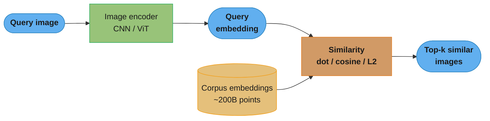
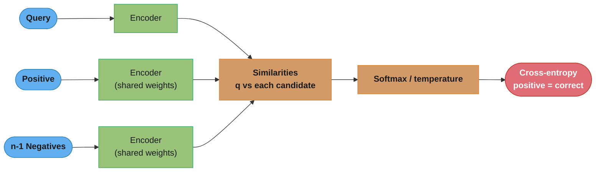
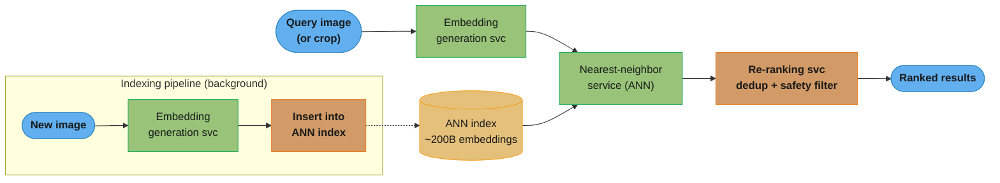
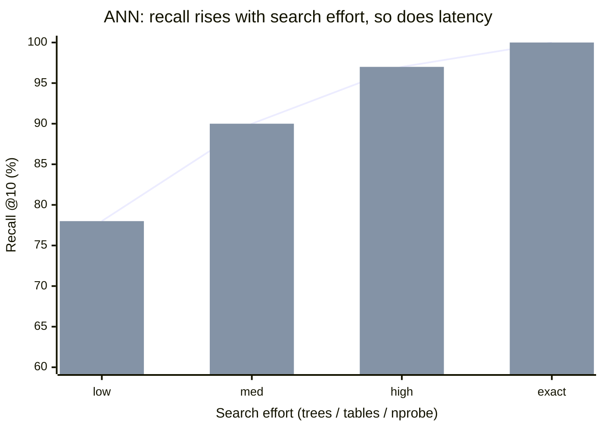
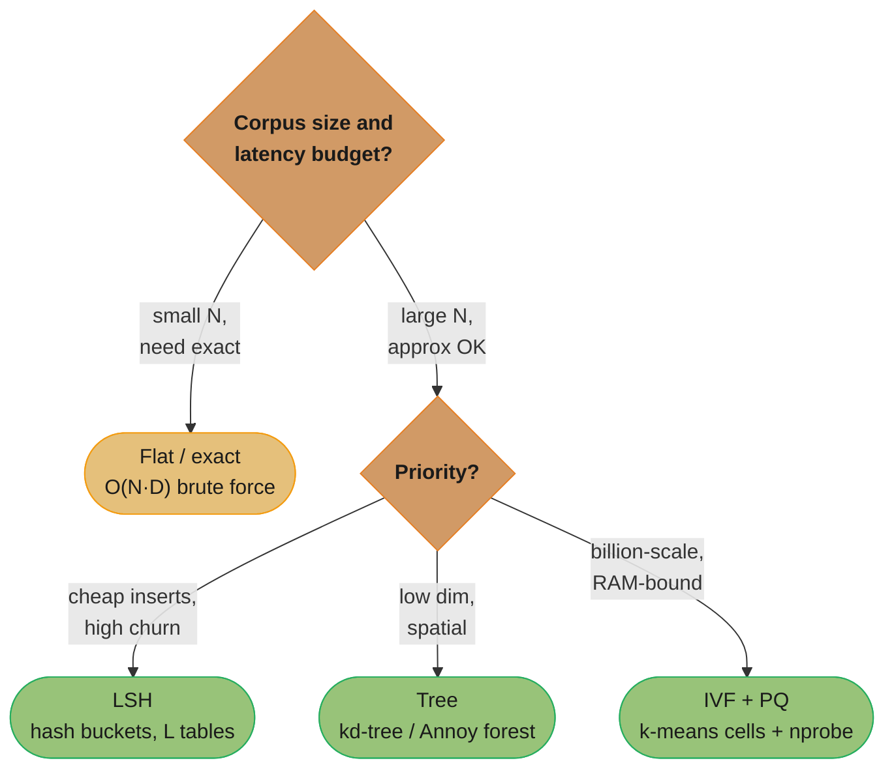

# Chapter 2: Visual Search System

> Ch 2 of 11 · ML System Design Interview (Aminian & Xu) · builds on Ch 1 — representation learning, contrastive training, and the ANN search deep dive

## Chapter Map

The first design chapter of the book instantiates the 7-step framework from Ch 1 on a
**Pinterest-style visual search system**: the user gives an image (optionally a cropped region
of one), and the system returns a ranked list of *visually similar* images. There is no text
query and no personalization — the entire problem reduces to "how do I put images near each
other in some space and then find the nearest ones fast." That single sentence is the whole
chapter: the model half is **representation learning** (train an encoder so that visually similar
images land close together), and the serving half is **approximate nearest-neighbor (ANN) search**
(find the closest embeddings among 100–200 billion images in a few milliseconds). The ANN deep
dive — trees, LSH, and inverted-file/clustering indexes — is the chapter's signature and the part
interviewers dig into.

**TL;DR:**
- Frame image-to-image search as **representation learning**: an encoder maps each image to an
  embedding, and *similarity = distance* (dot product, cosine, or Euclidean) in that space —
  turning "find similar images" into "find nearest neighbors."
- Train the encoder with **contrastive learning**: pull a query and its positive together, push
  the query and n−1 negatives apart. The hard question is where positives come from — human labels
  (accurate, expensive), interaction data (free, noisy), or self-supervised augmentation
  (SimCLR/MoCo-style; the book's starting point).
- Serving is two pipelines: an **indexing pipeline** that embeds new images and inserts them into
  an ANN index, and a **prediction pipeline** (embedding service → nearest-neighbor service →
  re-ranking service).
- **ANN is the crux.** Exact search is O(N·D) and hopeless at 200B images; approximate search
  trades a little recall for orders-of-magnitude speed via **tree indexes**, **LSH**, or
  **clustering/inverted-file (IVF)** structures — the tradeoff every candidate must be able to draw.

## The Big Question

> "A user drops in a photo of a red plaid couch. Somewhere in a catalog of ~200,000,000,000 images
> are the couches that *look* like it. I have a few tens of milliseconds. How do I teach a model
> what 'looks like' means, and how do I search two hundred billion things fast enough to feel
> instant?"

Analogy: think of every image as a point in a very high-dimensional room. Training the encoder is
the act of *arranging the furniture* so that things that look alike sit near each other; search is
the act of *walking straight to the nearest point* without visiting every point in the room. The
encoder decides the geometry; the ANN index decides how fast you can move through it. The chapter's
arc is: **first learn a good geometry (representation learning + contrastive training), then build
an index that exploits that geometry (ANN).** Get either half wrong and the product fails — a great
encoder with brute-force search is too slow, and a fast index over garbage embeddings returns
garbage.

---

## 2.1 Clarifying Requirements

Before proposing anything, the book pins down scope with the interviewer. The answers below are the
ones the chapter commits to; each is a design fork worth surfacing out loud.

- **What is the input and output?** Input is an **image** (the query). Output is a **ranked list of
  images visually similar** to the query. No text, no multi-modal query — that variant is deferred
  to Ch 4 (YouTube video search).
- **Is it personalized?** **No.** Two different users who submit the same query image should get the
  same results. This is a deliberate simplification: it removes the user tower, user features, and
  the whole personalization apparatus, keeping the focus on image representation. (The interviewer
  may relax this later — "now personalize it" — which is exactly the Ch 6/Ch 9 recommendation
  machinery.)
- **Does "similar" mean visually similar or semantically similar?** **Visually similar** — same
  colors, textures, shapes, composition. The system is not trying to retrieve "other photos of the
  same landmark" via metadata; it is matching pixels-turned-embeddings.
- **Can the user search a *cropped region* of an image?** **Yes** — crop-to-search is in scope. The
  user selects a bounding box (e.g. just the couch, not the whole living room) and the system
  searches on that crop. Mechanically the crop is just another image fed to the same encoder; the
  interesting downstream extension is *object detection to suggest crops* (see §2.7).
- **How many images are on the platform?** **~100–200 billion** images. This number drives
  everything on the serving side — it is why exact nearest-neighbor is off the table and why the
  ANN deep dive exists.
- **What is the latency budget?** Search must feel **instant** — tens to low-hundreds of
  milliseconds end to end. Combined with 200B images, this is the constraint that forces approximate
  (not exact) search.
- **Do we need to support video / GIFs?** Out of scope for this chapter — images only.

**Functional summary:** given a query image (or crop), retrieve and rank the top-k most visually
similar images from a ~200B-image corpus, non-personalized, in tens of milliseconds.
**Non-functional:** low latency, high availability, freshness (newly uploaded images should become
searchable), and the ability to scale the index horizontally.

---

## 2.2 Frame the Problem as an ML Task

### Defining the ML objective

The business objective — "help users discover visually similar images" — translates to the ML
objective: **accurately retrieve images that are visually similar to a query image.** The system
succeeds when the returned images genuinely look like the query.

### Choosing the ML category — representation learning

The pivotal modeling decision: rather than a classifier or a regressor, the book frames this as
**representation learning (a.k.a. embedding learning)**. The idea is to learn a function — an
**encoder** — that maps each image into a fixed-length vector (an **embedding**) in a
D-dimensional space, arranged so that **visually similar images have embeddings that are close
together** and dissimilar images are far apart.

Once every image is a point in embedding space, "find similar images" becomes "find the nearest
points to the query's point." Similarity is measured by a **distance/similarity function** on the
embeddings:

- **Dot product** — `sim(u, v) = u · v = Σ uᵢvᵢ`. Sensitive to vector magnitude as well as
  direction.
- **Cosine similarity** — `cos(u, v) = (u · v) / (‖u‖ ‖v‖)`. Dot product normalized by magnitudes;
  measures the *angle* only, ignoring length. Ranges [−1, 1].
- **Euclidean (L2) distance** — `‖u − v‖ = √(Σ (uᵢ − vᵢ)²)`. Straight-line distance; smaller =
  more similar.

If embeddings are **L2-normalized** (unit length), cosine similarity, dot product, and Euclidean
distance all induce the *same ranking* — maximizing dot product equals maximizing cosine equals
minimizing Euclidean distance. Many systems normalize precisely so they can use fast dot-product
kernels while reasoning in cosine terms.

### Input and output

- **Input:** one image (the query, possibly a crop).
- **Output:** a ranked list of the top-k most similar images from the corpus.
- **Model's job:** produce the query embedding. Everything after that (find nearest neighbors,
  re-rank) is retrieval infrastructure, not the model.

This framing is the reusable pattern behind Ch 4 (text→video), Ch 9 (session→listing), and the
repo's own semantic-search case study — learn embeddings, then do nearest-neighbor retrieval.



Caption: representation learning turns "find similar images" into "find nearest embeddings" — the
encoder fixes the geometry of the space and the similarity function reads distances off it, which
is why the same architecture generalizes to text, video, and session inputs in later chapters.

---

## 2.3 Data Preparation

### Data engineering

The chapter inventories the data the platform already has:

- **Images** — the raw media plus **metadata** (owner/uploader ID, upload timestamp, tags, textual
  description, dimensions). For pure *visual* search the pixels dominate, but metadata is useful for
  filtering (e.g. remove unsafe content) and for constructing weak labels.
- **Users** — account attributes. Not used for the model directly (non-personalized) but part of the
  broader data model.
- **User–image interactions** — the engagement log: **impressions** (image was shown),
  **clicks**, and **saves/likes** (on Pinterest, "pins"/"repins"). These interactions are the raw
  material for *free but noisy* training labels (see §2.4).

The interaction table conceptually looks like:

| user_id | query_image_id | result_image_id | action     | timestamp |
|---------|----------------|-----------------|------------|-----------|
| u_17    | img_A          | img_B           | impression | t0        |
| u_17    | img_A          | img_B           | click      | t0+2s     |
| u_42    | img_A          | img_C           | save       | t1        |

### Feature engineering — image preprocessing

Because the "features" are the raw pixels fed to a CNN/ViT, feature engineering here is **image
preprocessing** to make inputs uniform and training stable:

1. **Resize** every image to a fixed resolution — the book uses **224 × 224**, the standard ImageNet
   input size that ResNet/ViT backbones expect.
2. **Scale pixel values** from the raw `[0, 255]` integer range to `[0, 1]` (divide by 255).
3. **Z-score normalize** each channel — subtract the dataset mean and divide by the standard
   deviation, per RGB channel (the familiar ImageNet means/stds, e.g. mean ≈ [0.485, 0.456, 0.406],
   std ≈ [0.229, 0.224, 0.225]). Normalization keeps activations well-conditioned and speeds
   convergence.
4. **Consistent color mode** — convert everything to **RGB** (3 channels). Grayscale images are
   expanded to 3 channels; RGBA images drop the alpha channel; CMYK is converted. A mixed color mode
   silently corrupts the encoder's input.

These four steps run identically at **training time and serving time** — any mismatch between how
training images and query images are preprocessed is a classic train/serve skew bug that quietly
tanks retrieval quality.

---

## 2.4 Model Development

### Model selection — the encoder

The encoder must turn a 224×224×3 image into a fixed-length embedding (e.g. 256-D). Two families:

- **Convolutional neural networks (CNNs)** — **ResNet** is the book's default. A ResNet backbone
  processes the image through convolutional blocks; the final classification head is removed and the
  penultimate feature vector (or a projection of it) becomes the embedding. CNNs are battle-tested,
  efficient, and strong on visual texture/shape.
- **Vision Transformers (ViT)** — split the image into patches, embed each patch, and run
  transformer self-attention over the patch sequence. More data-hungry but can outperform CNNs at
  scale.

Either way the output is a single embedding vector per image. The book proceeds with a CNN (ResNet)
encoder for concreteness.

### Model training — contrastive learning

The encoder is trained with **contrastive learning**: teach the model *by comparison*. Each training
example is built from:

- **1 query image** (the anchor),
- **1 positive image** — one that should be considered similar to the query,
- **n − 1 negative images** — ones that should be considered dissimilar.

The model computes embeddings for all n images, measures the similarity of the query to each of the
n candidates (1 positive + n−1 negatives), and is trained so the **query–positive similarity is
highest**. Concretely, the n similarities are passed through a **softmax** to produce a probability
distribution over the candidates, and **cross-entropy loss** is applied with the positive as the
"correct class." Minimizing this loss pulls the positive's embedding toward the query and pushes the
negatives' embeddings away.



Caption: the three encoders share one set of weights — contrastive training is one encoder applied
to query, positive, and negatives, with softmax-over-similarities plus cross-entropy pulling the
positive up and the negatives down.

#### Where do positives come from? (the chapter's key discussion)

The single hardest design question in contrastive learning is **how to obtain the positive** for
each query. The book gives three approaches, in increasing scalability and decreasing label quality:

1. **Human labeling (annotators).** Ask people to mark which images are similar to a query.
   - ✓ Highest-quality, cleanest positives — humans understand visual similarity well.
   - ✗ **Expensive and slow**; does not scale to the volume of training data a 200B-image system
     needs. Practical only for evaluation sets or a small seed set.

2. **Using interactions as labels (natural labeling).** Treat user engagement as an implicit
   similarity signal: if a user searched with query image A and then **clicked/saved** result image
   B, treat B as a positive for A.
   - ✓ **Free and abundant** — the interaction log generates positives at massive scale
     automatically.
   - ✗ **Noisy.** Clicks are influenced by position bias (top results get clicked regardless of
     relevance), clickbait thumbnails, and accidental clicks; a click is a weak proxy for "visually
     similar." The label quality is much lower than human labels.

3. **Self-supervision via data augmentation (the book's starting point).** Manufacture a positive
   for *any* image with **zero human effort**: take an image, apply a random **augmentation**
   (random crop, rotation, color jitter, blur, horizontal flip), and treat the augmented version as
   the positive for the original. The two views are the *same image* under distortion, so they are
   guaranteed genuinely similar. Every other image in the batch acts as a negative.
   - ✓ **No labeling cost at all**; unlimited positives; this is the **SimCLR / MoCo** paradigm.
   - ✗ The learned notion of "similar" is "augmentation-invariant," which may not perfectly match
     the product's notion of visual similarity, so systems often *start* self-supervised and later
     fine-tune with interaction or human labels.

The book **starts** with self-supervision (augmentation) because it needs no labels, then notes the
system can be improved by folding in interaction and human labels.

```
Self-supervised positive construction (SimCLR/MoCo framing)

   original image  x
        |
        +--- augment (random crop + flip)   -->  view  x1   (the "query")
        +--- augment (color jitter + blur)  -->  view  x2   (the "positive")

   In a batch of B originals, x1 pairs with x2 as the positive;
   the 2(B-1) other views in the batch are the negatives.

   query x1  --------- pull together ---------  positive x2   (same image)
     |
     +-- push apart -->  every other image's views  (negatives)
```

Caption: augmentation makes a guaranteed-positive pair out of a single unlabeled image — two random
distortions of the same picture — which is why self-supervised contrastive learning needs no
annotations at all; the negatives come free from the rest of the batch.

#### The loss, formally, and temperature

Let the query embedding be `q` and the candidate embeddings be `c₀ … c_{n-1}` (with `c₀` the
positive). Compute similarities `sᵢ = sim(q, cᵢ)`. The contrastive (InfoNCE-style) loss is:

```
              exp(s_positive / τ)
L = − log  ───────────────────────────
            Σ_i  exp(s_i / τ)
```

- **τ (temperature)** is a scalar hyperparameter that scales the similarities before softmax. A
  **small τ** sharpens the distribution — the model is pushed hard to separate the positive from the
  *hardest* negatives (high penalty for a close negative). A **large τ** softens it, treating all
  negatives more uniformly. Typical values are small (e.g. 0.05–0.1). Temperature is the knob that
  controls how much the model focuses on hard negatives.

The book mentions temperature briefly; the practical takeaway is that it materially affects the
geometry of the learned space and is worth tuning.

#### The role of negatives

More negatives per query generally make training signal richer (the positive must beat a bigger
crowd), which is why methods like MoCo maintain a large queue of negatives and SimCLR uses large
batch sizes — in-batch negatives are essentially free. **Hard negatives** (visually plausible but
wrong) teach the most; random negatives are often trivially easy (a couch vs. a mountain), a theme
that returns in Ch 9's Airbnb same-market hard negatives.

---

## 2.5 Evaluation

### Offline metrics

Retrieval quality is judged with ranking metrics computed on an evaluation set of `(query, relevant
images)` pairs — the relevant set typically mined from interactions (images users clicked/saved for
that query) or hand-labeled. The book walks the standard family:

- **Precision@k** — of the top-k returned, what fraction are relevant. `precision@k = (relevant in
  top-k) / k`. Simple, but ignores how many relevant images exist total and ignores ordering within
  the top-k.
- **Recall@k** — of all relevant images, what fraction appear in the top-k. `recall@k = (relevant in
  top-k) / (total relevant)`. The natural retrieval metric — did we surface the good stuff at all —
  but it needs a known, complete relevant set, which is hard when there are many valid similar
  images.
- **Mean Reciprocal Rank (MRR)** — `MRR = (1/Q) Σ 1/rankᵢ`, where `rankᵢ` is the position of the
  **first** relevant result for query i. Rewards putting *a* good result near the top; only looks at
  the first relevant hit, so it is best when there is essentially one right answer per query.
- **mean Average Precision (mAP)** — average precision (area under the precision–recall curve per
  query) averaged across queries. Handles **binary** relevance (relevant / not) well and accounts
  for the ordering of *all* relevant results, not just the first. Because visual-search relevance is
  naturally binary (an image either is or isn't similar), **mAP is a strong fit** here.
- **normalized Discounted Cumulative Gain (nDCG)** — `DCG = Σ relᵢ / log₂(i+1)`, normalized by the
  ideal DCG. Designed for **graded** relevance (relevance scores like 0/1/2/3). The book flags that
  **nDCG is awkward for visual search** because relevance is binary — with only {0,1} labels nDCG
  degenerates and offers little over mAP, and manufacturing graded labels for image similarity is
  expensive and subjective. So nDCG's headline advantage (graded relevance) doesn't apply, making
  mAP/recall@k the more honest choices.

**The book's practical picks:** mAP and recall@k (with precision@k and MRR as secondary), and it
explicitly notes nDCG is a poor fit given binary relevance.

### Building the evaluation dataset

The eval set is constructed **from interactions**: for a set of query images, treat the images
users clicked/saved as the ground-truth relevant set. This inherits the same noise as interaction
labels (position bias, clickbait), so a smaller human-labeled eval set is valuable as a cleaner
yardstick.

### Online metrics

Offline metrics are proxies; the real question is whether users engage. Online (A/B test) metrics:

- **Click-through rate (CTR)** on the returned images — `clicks / impressions`.
- **Time spent** on the suggested/searched images — longer engagement suggests better matches.
- **Saves / shares** of results — a strong intent signal (the user found something worth keeping).

The offline↔online gap (from Ch 1) applies: a model can win on mAP offline yet lose on CTR online
(e.g. it retrieves *identical* images the user has already seen), which is why the re-ranking stage
filters near-duplicates before results reach the user.

---

## 2.6 Serving

Serving splits into two pipelines that run at different cadences: the **prediction pipeline** (per
query, online, latency-critical) and the **indexing pipeline** (per new image, background, throughput
oriented).

### Prediction pipeline

Three services chained together:

1. **Embedding generation service.** Preprocesses the incoming query image (resize 224×224, scale,
   z-score, RGB) and runs the encoder to produce the query embedding. This is the only model
   inference on the query path, so it must be fast (the encoder may be quantized/distilled for
   latency).
2. **Nearest-neighbor service.** Takes the query embedding and searches the ANN index for the top-k
   nearest image embeddings. This is where the 200B-image scale lives, and where the ANN deep dive
   applies.
3. **Re-ranking service.** Applies business logic on top of the raw nearest neighbors:
   - **Filter near-duplicates** — drop results that are almost identical to the query or to each
     other (users want *variety*, not ten copies of the same image).
   - **Filter private / unsafe / policy-violating content** — remove images the user shouldn't see
     (private boards, NSFW, blocked accounts).
   - Optionally apply lightweight freshness or diversity adjustments.



Caption: the query path (top) is latency-critical and read-only against the index, while the
indexing path (bottom) writes new embeddings in the background — decoupling them lets search stay
fast while the corpus grows.

### Indexing pipeline

- **Embed and insert.** When a new image is uploaded, the indexing pipeline preprocesses it, runs the
  **same encoder** to get its embedding, and inserts that embedding into the ANN index so the image
  becomes searchable.
- **Update cost.** Different ANN index types have very different insert costs (below). Tree and IVF
  indexes may need periodic rebuilds or cluster reassignment to stay balanced as the distribution
  drifts; LSH tables insert cheaply. A 200B-corpus with a steady upload stream must budget for
  incremental inserts *and* periodic full rebuilds. The embedding model itself is versioned — when
  the encoder is retrained, **the entire index must be re-embedded and rebuilt**, because old and new
  embeddings live in incompatible spaces.

### Nearest-neighbor search — the deep dive (signature section)

This is the heart of the chapter. The nearest-neighbor service must answer: *given the query
embedding, which of ~200B corpus embeddings are closest?*

#### Exact nearest neighbor

Compare the query to **every** point and keep the k smallest distances.

- **Cost:** `O(N · D)` per query — N points, D dimensions each. With N = 2×10¹¹ and D = 256, that
  is ~5×10¹³ multiply-adds *per query*. At even a billion ops/second that is ~14 hours per query —
  utterly infeasible for interactive search.
- **When it's fine:** small corpora (thousands to low millions), or when perfect recall is mandatory
  and latency doesn't matter (offline batch). Exact search is the correctness baseline ANN is
  measured against.

The only way to hit tens-of-milliseconds at 200B is to **not look at most of the points** — i.e.
**approximate nearest neighbor (ANN)**, which trades a small amount of recall (you might miss a few
true neighbors) for a massive speedup. The three ANN families the book covers:

#### Family 1 — Tree-based indexes

Partition the space recursively and store the partitions as a tree; at query time, descend the tree
to the relevant leaf/leaves and only scan the points there.

- **kd-trees.** Recursively split the point set with **axis-aligned hyperplanes**, alternating
  dimensions (split on x, then y, then z, …), each split at the median so the tree is balanced.
  Search descends to the leaf containing the query, then backtracks to check nearby branches that
  could hold a closer point. **Fatal weakness: the curse of dimensionality.** kd-trees work well for
  low D (≲ 10–20) but at D = 100+ the backtracking must explore almost every branch (nearly all
  cells are "close" in high-D), degrading to near-linear scan. Embeddings are high-dimensional, so
  raw kd-trees don't cut it.
- **R-trees.** Group nearby points into **bounding boxes (minimum bounding rectangles)** nested
  hierarchically — designed for spatial/geographic data (2D/3D). Same high-dimensional degradation
  as kd-trees; not a fit for 256-D embeddings, but the book names them as the tree-index archetype.
- **Annoy (Approximate Nearest Neighbors Oh Yeah, Spotify).** The practical high-dimensional tree
  method: build a **forest of random-projection trees**. Each tree repeatedly splits the point set
  with a **random hyperplane** (pick two random points, split by the perpendicular bisector),
  recursing until leaves hold a few points. At query time, descend **many trees**, collect the union
  of candidate leaves, and exact-rank that candidate set. Using *many* random trees compensates for
  any single tree's bad splits — more trees = higher recall, slower search. Annoy also memory-maps
  the index so it can be shared across processes.

**Tradeoff:** trees give sublinear search and are easy to reason about, but classic axis-aligned
trees collapse in high dimensions; randomized forests (Annoy) fix this at the cost of building/storing
many trees. Build cost and memory grow with the number of trees.

#### Family 2 — Locality-Sensitive Hashing (LSH)

Use hash functions that are **locality-sensitive**: unlike a normal hash (which scatters similar
inputs), an LSH function is designed so that **nearby points collide (hash to the same bucket) with
high probability** and far points collide rarely.

- **Mechanism.** Choose a family of hash functions matched to the similarity metric. For **cosine
  similarity**, the classic choice is **random-hyperplane (SimHash)**: draw a random hyperplane
  through the origin and hash a point to **1 if it's on the positive side, 0 otherwise** (`h(v) =
  sign(r · v)` for random vector r). Two points on the same side of the hyperplane share that bit;
  the closer their angle, the more hyperplanes they agree on. Concatenate **m** such bits to form an
  m-bit bucket code, so nearby points land in the same bucket with high probability.
- **Amplification.** One hash table gives noisy buckets, so LSH uses **L independent tables**, each
  with its own m random hyperplanes. Query = hash the query into all L tables, take the **union** of
  the L buckets as the candidate set, then exact-rank the candidates. More tables (**L**) ↑ recall
  (more chances to co-hash with a true neighbor) at the cost of memory and query time; more bits per
  bucket (**m**) ↓ candidate-set size (more selective buckets) but ↑ the chance of missing a
  neighbor. Tuning `(m, L)` trades recall against speed.
- **Strengths / weaknesses.** ✓ Cheap inserts (just hash and append — great for high-churn corpora),
  sublinear query, strong theory. ✗ Often needs many tables (memory heavy) to reach high recall, and
  tends to be beaten on the recall-per-byte and recall-per-millisecond frontier by IVF and graph
  methods (HNSW) on real embedding data.

```
Random-hyperplane LSH for cosine similarity (2-D sketch, m = 3 bits)

              h1 /        Each random hyperplane h_j through the origin
                /         splits the plane; bit_j = which side a point is on.
        q  *   /  a *
             \ /          q and a agree on all 3 -> bucket 111  (co-hash: candidates)
   ---------- X ----------   h2         q and b differ on h2   -> b in a different bucket
             / \          Similar angle  => more shared bits => same bucket w.h.p.
      b *   /   \ h3      Far angle       => bits disagree     => different bucket
           /

   bucket(v) = ( sign(h1.v), sign(h2.v), sign(h3.v) )   e.g. (1,1,1)
   L tables, each m bits: query hashes into all L, union the buckets, exact-rank.
```

Caption: LSH deliberately *wants* collisions — the closer two embeddings' angle, the more random
hyperplanes they fall on the same side of, so they share a bucket and become each other's candidates;
this is the exact opposite of an ordinary hash function's goal.

#### Family 3 — Clustering / inverted-file index (IVF)

Pre-cluster the corpus, then at query time only search the few clusters nearest the query. This is
the **inverted-file (IVF)** approach and the workhorse behind FAISS/ScaNN at billion+ scale.

- **Build.** Run **k-means** on the corpus embeddings to find **k centroids** (the "coarse
  quantizer"). Assign every image embedding to its nearest centroid, building an **inverted list**
  per centroid (centroid → the list of embeddings in that cell). Typical k might be √N-ish (e.g.
  tens of thousands to millions of centroids for a huge corpus).
- **Query.** Compare the query to the **k centroids only** (cheap — k ≪ N), pick the **nprobe**
  closest centroids, then exhaustively scan just the inverted lists of those clusters and exact-rank
  their members. You've replaced "scan 200B points" with "scan k centroids + the points in nprobe
  clusters."
- **The nprobe knob.** `nprobe = 1` is fastest but risks the true neighbor sitting just across a cell
  boundary in an unsearched cluster (the **boundary problem** — the main source of ANN recall loss).
  Increasing nprobe searches more neighboring clusters, raising recall toward exact at higher cost.
  `nprobe` is the single dial trading recall for latency in IVF.
- **Product Quantization (PQ) companion.** To fit 200B vectors in RAM, IVF is usually paired with
  **PQ**: split each D-dim vector into sub-vectors, quantize each sub-vector to the nearest of 256
  learned codewords (1 byte each), and store the **compressed code** instead of the raw floats. A
  256-D float32 vector (1024 bytes) compresses to, say, 32–64 bytes — a 16–32× memory reduction —
  and distances are computed approximately from precomputed lookup tables. **IVF-PQ** is how
  billion-scale indexes fit in memory at all; it adds a second layer of approximation (quantization
  error) on top of the cluster pruning.
- **Cost.** Roughly `O(k + (N/k)·nprobe)` distance computations per query instead of `O(N)` — with
  k ≈ √N and small nprobe, that's ~O(√N), the big win. Downside: building requires training k-means
  (expensive), and inserts can unbalance clusters, so the index needs **periodic retraining/rebuild**
  as the distribution drifts.

```
IVF search: k-means cells + nprobe

   corpus embeddings clustered into k Voronoi cells (centroids c1..ck):

        c1 . . .        c2 . . . .        c3 . .
        . . . .         . . q . .         . . . .      <- query q lands near c2
        . . . .         . . . . .         . . . .
        ----------------+----------------+---------
        c4 . . .        c5 . . . .        c6 . . .
        . . . .         . . . . .         . . . .

   Step 1: compare q to c1..c6 (k centroids)          -> cheap
   Step 2: nprobe = 2 -> pick c2 (nearest) and c5     -> scan only those lists
   Step 3: exact-rank the points inside c2 + c5, return top-k

   Risk: a true neighbor sitting in c1 just across the c1/c2 border is missed
         unless nprobe is raised to include c1  (the boundary problem).
```

Caption: IVF turns a 200B-point scan into "rank k centroids, then scan the points in nprobe cells" —
the nprobe dial buys back the recall lost at cell boundaries, and pairing IVF with product
quantization is what lets the compressed vectors fit in RAM at billion scale.

#### Libraries and the recall–speed tradeoff

- **FAISS (Facebook AI Similarity Search)** — the standard library; implements flat (exact), IVF,
  IVF-PQ, HNSW, and GPU-accelerated variants.
- **ScaNN (Google)** — anisotropic-quantization-based ANN, strong on the recall-per-latency frontier.
- **Annoy (Spotify)** — the random-projection-forest library above.
- **HNSW** (graph-based, in FAISS/nmslib) — not a headline in this chapter's three-family taxonomy
  but the modern state of the art on many benchmarks; a navigable small-world graph you greedily walk
  toward the query.

**Every ANN method exposes the same fundamental knob: recall vs. speed/memory.** More trees, more LSH
tables, higher nprobe → higher recall, slower/heavier. The right operating point is chosen by A/B
testing search quality against latency and cost. The interviewer's favorite question is "how would you
tune it" — the answer is always "sweep the method's knob and pick the point on the recall–latency
curve that meets the product's latency SLA."



Caption: every ANN family rides the same curve — spend more effort (more trees, more LSH tables,
higher nprobe) and recall climbs toward the exact 100% at the cost of latency, so the design task is
choosing the effort level that clears the latency SLA, not chasing perfect recall.

---

## 2.7 Other Talking Points

The chapter closes with extensions an interviewer may probe:

- **Content moderation on results.** Filter unsafe/policy-violating images out of the returned set
  (partly in the re-ranking service, partly upstream) — visual search can surface disturbing content
  from a benign query.
- **Positional and interaction bias.** Interaction-derived labels inherit **position bias** (top-ranked
  results get clicked because they're on top, not because they're best), which contaminates both
  training positives and offline eval. Debiasing (e.g. inverse-propensity weighting) or randomized
  exploration helps.
- **Smart crop with object detection.** Rather than making the user draw the crop box, run an
  **object detector** to propose interesting regions (the couch, the lamp) and offer per-object
  visual search — links directly to Ch 3's object-detection machinery.
- **Graph neural networks (GNNs) for representations.** Beyond pixels, images live in an interaction
  graph (users, boards, co-saves); a GNN could learn embeddings that incorporate this relational
  structure for richer similarity — foreshadows Ch 11.
- **Textual queries.** Supporting "red plaid couch" as a *text* query requires a **shared image–text
  embedding space** (CLIP-style) so text and image embeddings are comparable — this is exactly the
  Ch 4 (YouTube video search) problem.
- **Active learning / human-in-the-loop labeling.** Prioritize the most informative images/queries for
  human annotation to improve the encoder efficiently, rather than labeling at random.

---

## Visual Intuition

The two hardest mechanics to picture are (1) how contrastive training shapes the space and (2) how
the three ANN families each avoid the full scan. The training-flow and ANN diagrams above cover
these; the decision tree below is the one every candidate should be able to reproduce on a whiteboard
when asked "which ANN index would you use?"



Caption: exact search is the fallback only for small corpora; above that, the choice among LSH, trees,
and IVF comes down to insert churn, dimensionality, and memory — and at 200B RAM-bound images the
book's problem lands squarely on IVF+PQ.

### Why kd-trees die in high dimensions (the intuition)

```
Curse of dimensionality — fraction of the space within "distance r" of a query

   In 2-D:   a small radius covers a small disk         -> few cells to check
   In 100-D: almost ALL points are ~equidistant from    -> nearly EVERY branch
             the query; volume concentrates in the             is "close",
             thin shell near the max distance                  backtracking
                                                                explores all of it
   result:  kd-tree search degrades from O(log N)  ->  O(N)   at high D
```

Caption: in high dimensions distances concentrate — the nearest and farthest points become nearly
equidistant — so an axis-aligned tree can't prune branches and collapses to a linear scan, which is
exactly why embedding search uses randomized forests, LSH, or IVF instead of plain kd-trees.

---

## Key Concepts Glossary

- **Visual search** — image-to-image retrieval: query is an image, output is ranked visually similar
  images.
- **Representation learning (embedding learning)** — learning an encoder that maps inputs to vectors
  so similar inputs are close.
- **Encoder** — the model (CNN/ResNet or ViT) that produces an image's embedding.
- **Embedding** — a fixed-length vector representing an image in a similarity space.
- **Dot product / cosine similarity / Euclidean distance** — the similarity/distance functions on
  embeddings; identical ranking when vectors are L2-normalized.
- **Contrastive learning** — training by comparison: pull query↔positive together, push query↔negatives
  apart.
- **Anchor / positive / negative** — the query, a similar image, and dissimilar images in a contrastive
  triplet/batch.
- **Human labeling** — annotators mark similar images; accurate, expensive, non-scalable.
- **Interactions as labels (natural labeling)** — using clicks/saves as implicit positives; free but
  noisy.
- **Self-supervision / data augmentation** — making a positive by augmenting an image (SimCLR/MoCo);
  no labels needed.
- **SimCLR / MoCo** — self-supervised contrastive frameworks (large-batch in-batch negatives / momentum
  queue of negatives).
- **Softmax + cross-entropy loss** — turning similarities into a distribution and penalizing when the
  positive isn't the max.
- **Temperature (τ)** — scalar dividing similarities before softmax; small τ sharpens focus on hard
  negatives.
- **Hard negative** — a dissimilar image that looks plausibly similar; the most informative negative.
- **Image preprocessing** — resize (224×224), scale to [0,1], z-score normalize per channel, force RGB.
- **Precision@k / Recall@k** — fraction of top-k that's relevant / fraction of relevant found in top-k.
- **MRR** — mean reciprocal rank of the first relevant result; best when one right answer per query.
- **mAP** — mean average precision; strong for binary relevance and full-ranking quality.
- **nDCG** — discounted cumulative gain for graded relevance; awkward here because relevance is binary.
- **Prediction pipeline** — embedding generation → nearest-neighbor → re-ranking (per query, online).
- **Indexing pipeline** — embed new images and insert into the ANN index (background).
- **Re-ranking service** — filters near-duplicates and private/unsafe content from raw neighbors.
- **Exact nearest neighbor** — O(N·D) brute-force scan; correctness baseline, infeasible at scale.
- **Approximate nearest neighbor (ANN)** — trade a little recall for large speedup by not scanning all
  points.
- **Curse of dimensionality** — high-D distances concentrate, breaking axis-aligned trees.
- **kd-tree / R-tree** — axis-aligned / bounding-box space-partition trees; degrade in high D.
- **Annoy** — random-projection-forest ANN (Spotify); many random-hyperplane trees.
- **LSH (locality-sensitive hashing)** — hash functions where near points collide with high probability.
- **Random-hyperplane hash (SimHash)** — LSH for cosine: bit = sign of dot with a random vector.
- **IVF (inverted-file index)** — k-means cells + per-centroid inverted lists; search only nprobe
  nearest cells.
- **nprobe** — number of clusters searched in IVF; the recall-vs-latency dial.
- **Product Quantization (PQ)** — compress vectors into sub-vector codebook codes to fit RAM (IVF-PQ).
- **FAISS / ScaNN / HNSW** — the standard ANN libraries/algorithms (Meta / Google / graph-based).
- **Recall–speed tradeoff** — every ANN method's core knob: more effort → higher recall, more
  latency/memory.

---

## Tradeoffs & Decision Tables

### How to source contrastive positives

| Approach | Cost | Label quality | Scale | When the book uses it |
|----------|------|---------------|-------|-----------------------|
| Human labeling | High (annotators) | Highest | Poor | Eval set / small seed |
| Interactions as labels | ~Free | Noisy (position/click bias) | Excellent | Improve after bootstrap |
| Self-supervision (augmentation) | Zero labels | Guaranteed-similar pair, but "augmentation-invariant" | Unlimited | **Starting point** |

### Offline ranking metrics

| Metric | Relevance type | Best when | Weakness here |
|--------|----------------|-----------|---------------|
| Precision@k | binary | quick top-k quality | ignores total relevant + within-k order |
| Recall@k | binary | "did we surface it at all" | needs complete relevant set |
| MRR | binary | one right answer per query | ignores all but the first hit |
| mAP | binary | full-ranking quality (**book's pick**) | needs labeled relevant set |
| nDCG | graded | graded relevance | **awkward** — visual relevance is binary |

### ANN family comparison

| Family | Mechanism | Insert cost | High-D behavior | Memory | Recall knob |
|--------|-----------|-------------|-----------------|--------|-------------|
| Exact (flat) | scan all N | trivial (append) | perfect recall, O(N·D) | raw vectors | none (always exact) |
| Tree (kd/R-tree) | axis-aligned partition | cheap | **degrades to O(N)** | moderate | backtrack width |
| Tree (Annoy forest) | random-hyperplane trees | rebuild-ish | good with many trees | many trees | # trees searched |
| LSH | locality-sensitive buckets | **very cheap** | good, memory-heavy | L tables | # tables L, bits m |
| IVF (+PQ) | k-means cells + inverted lists | needs retrain | **best at billion-scale** | PQ-compressed, tiny | **nprobe** |

### Distance functions

| Function | Formula | Notes |
|----------|---------|-------|
| Dot product | `u · v` | magnitude-sensitive; fast kernels |
| Cosine | `(u·v)/(‖u‖‖v‖)` | angle only; range [−1,1] |
| Euclidean (L2) | `‖u−v‖` | straight-line; smaller = closer |

When embeddings are L2-normalized, all three give the **same ranking**.

---

## Common Pitfalls / War Stories

- **Train/serve preprocessing skew.** The encoder was trained on images normalized with one set of
  channel means/stds (or resized with one interpolation), but the serving path uses a different
  resize/normalize. Query embeddings land in a slightly shifted space and recall silently collapses.
  Fix: share one preprocessing implementation across training and serving; assert on input shape,
  range, and color mode.
- **Trusting clicks as clean positives.** Using every click as a positive bakes **position bias** into
  the encoder — the model learns "images that appear at the top are similar," which is circular.
  Symptom: offline mAP looks fine (same biased labels in eval) but online engagement doesn't improve.
  Fix: debias (inverse-propensity weighting), add exploration, and keep a small unbiased human-labeled
  eval set.
- **Too-easy negatives.** Random negatives (a couch vs. a mountain) are trivially separated, so the
  encoder learns coarse categories but not fine visual similarity. The model looks good on toy metrics
  and fails on "find couches that look like *this* couch." Fix: mine **hard negatives** (same coarse
  category, different instance) — the Ch 9 same-market lesson.
- **nprobe = 1 in production.** Shipping IVF with `nprobe = 1` to hit the latency SLA quietly drops
  recall for any query near a cell boundary — the true best match sits one cell over and never gets
  scanned. Symptom: intermittently "obviously wrong" top results. Fix: sweep nprobe against the
  recall–latency curve and pick the smallest nprobe that meets a recall floor.
- **Forgetting to rebuild the index after retraining the encoder.** A new encoder produces embeddings
  in an **incompatible geometry**; querying the new query embedding against an index built from the
  old encoder returns nonsense. Fix: version the encoder, and re-embed + rebuild the entire index as
  part of every model rollout (a costly but mandatory step at 200B scale).
- **kd-tree on 256-D embeddings.** A well-meaning engineer reaches for a kd-tree because it's O(log N)
  in textbooks — and discovers it scans nearly the whole corpus at high D. Fix: use randomized forests
  (Annoy), LSH, or IVF, which are built for high-dimensional data.
- **Near-duplicate spam in results.** Without a dedup step in re-ranking, a query returns ten
  near-identical copies of the best match (same image reposted). Users perceive this as broken. Fix:
  the re-ranking service filters near-duplicates before returning results.

---

## Real-World Systems Referenced

- **Pinterest** — the canonical visual-search product this chapter is modeled on (image-to-image, "shop
  the look," visual crop search).
- **ResNet / Vision Transformer (ViT)** — the image encoder architectures.
- **SimCLR / MoCo** — self-supervised contrastive learning frameworks.
- **FAISS (Meta)** — the standard ANN library (flat, IVF, IVF-PQ, HNSW, GPU).
- **ScaNN (Google)** — anisotropic-quantization ANN library.
- **Annoy (Spotify)** — random-projection-forest ANN library.
- **HNSW / nmslib** — graph-based ANN (state of the art on many benchmarks).

---

## Summary

The visual search chapter is the book's first full instantiation of the 7-step framework and the
template for every embedding-and-retrieval system that follows. The problem — return images visually
similar to a query image, non-personalized, over ~200 billion images, in tens of milliseconds — is
solved in two halves. The **model half** is **representation learning**: an image encoder (ResNet or
ViT) maps each image to an embedding, and similarity becomes distance (dot product, cosine, or
Euclidean) in that space. The encoder is trained by **contrastive learning** — pull a query and a
positive together, push n−1 negatives apart, via softmax-over-similarities and cross-entropy with a
temperature knob — and the make-or-break question is **where positives come from**: human labels
(accurate, unscalable), interactions (free, noisy), or **self-supervised augmentation**
(SimCLR/MoCo, the book's starting point). Evaluation uses ranking metrics — **mAP and recall@k** fit
the binary relevance, while **nDCG is a poor fit** because relevance isn't graded — backed by online
CTR / time-spent / saves. The **serving half** is two pipelines: an indexing pipeline that embeds and
inserts new images, and a prediction pipeline of **embedding generation → nearest-neighbor →
re-ranking**. The chapter's signature is the **ANN deep dive**: exact search is O(N·D) and hopeless,
so approximate search trades a little recall for orders of magnitude speed via **trees** (kd/R-trees
that die in high dimensions, Annoy's random-projection forests that don't), **LSH** (random-hyperplane
buckets amplified across L tables, cheap inserts), or **clustering/IVF** (k-means cells searched
nprobe-at-a-time, paired with product quantization to fit RAM — the billion-scale workhorse behind
FAISS/ScaNN). Every family exposes the same knob — **recall vs. speed/memory** — and the design task
is picking the operating point that meets the latency SLA.

---

## Interview Questions

**Q: Why frame visual search as representation learning instead of classification?**
Because the goal is open-ended similarity retrieval, not assigning one of a fixed label set. Representation learning trains an encoder to map each image to an embedding so that visually similar images are close in vector space, turning "find similar images" into "find nearest neighbors" — which scales to an unbounded, ever-growing catalog where new images appear constantly. A classifier would need predefined classes and couldn't rank arbitrary image-to-image similarity.

**Q: Where do the positive pairs for contrastive training come from, and what are the tradeoffs?**
There are three sources: human labeling (annotators mark similar images — most accurate but expensive and unscalable), interactions as labels (treat clicked/saved results as positives — free and abundant but noisy from position and click bias), and self-supervised augmentation (augment an image and treat the augmented view as its positive — zero labeling cost, guaranteed-similar pair, the SimCLR/MoCo approach the book starts with). Systems typically bootstrap self-supervised, then fine-tune with interaction and human labels.

**Q: How does self-supervised augmentation manufacture a positive without any labels?**
It takes a single image, applies two random augmentations (crop, flip, color jitter, blur), and treats the two distorted views as a positive pair. Because both views come from the same source image, they are genuinely similar by construction, so no human annotation is needed. Every other image in the batch supplies negatives for free, which is why SimCLR uses large batches and MoCo maintains a queue of negatives.

**Q: Compare the three ANN families — trees, LSH, and IVF — on how they avoid a full scan.**
Trees recursively partition space and descend to the relevant leaf, scanning only nearby points (kd/R-trees axis-aligned, Annoy random-hyperplane forests). LSH hashes points so near ones collide in the same bucket, then scans only the query's buckets across L tables. IVF clusters the corpus with k-means and, at query time, searches only the nprobe clusters nearest the query. All three replace O(N) with a sublinear scan of a candidate subset, trading a little recall for large speedups.

**Q: Why do plain kd-trees fail on high-dimensional embeddings?**
The curse of dimensionality: in high dimensions almost all points become nearly equidistant from the query, so the tree's pruning breaks down and backtracking must explore nearly every branch, degrading search from O(log N) toward O(N). kd-trees work well only for low dimensions (roughly ≤10–20). For 256-D embeddings you need randomized forests (Annoy), LSH, or IVF, which are designed for high-dimensional data.

**Q: What does the nprobe parameter control in an IVF index, and what happens if it's too low?**
nprobe is the number of nearest clusters (Voronoi cells) IVF searches per query, and it's the direct recall-vs-latency dial: higher nprobe searches more cells for higher recall at more cost. If nprobe is too low (e.g. 1), a true nearest neighbor sitting just across a cell boundary in an unsearched cluster is missed — the boundary problem — causing intermittently wrong top results. You tune nprobe by sweeping the recall–latency curve and picking the smallest value that meets a recall floor.

**Q: How does locality-sensitive hashing differ from an ordinary hash function?**
An ordinary hash scatters similar inputs to unrelated buckets; LSH is deliberately designed so that near points collide (land in the same bucket) with high probability and far points rarely do. For cosine similarity the classic LSH is a random hyperplane: the hash bit is the sign of the dot product with a random vector, so points at a small angle agree on more hyperplanes and share a bucket. Concatenating m bits and using L independent tables tunes the recall–speed tradeoff.

**Q: Why is exact nearest-neighbor search infeasible at 200 billion images?**
Exact search is O(N·D) per query — it compares the query to every point. With N ≈ 2×10¹¹ and D ≈ 256 that's ~5×10¹³ operations per query, far beyond a tens-of-milliseconds budget (hours per query even at a billion ops/second). That cost is precisely why the system uses approximate nearest-neighbor search, which trades a small amount of recall for orders-of-magnitude speedup by not scanning most points.

**Q: Why is nDCG a poor evaluation metric for this system, and what's better?**
nDCG is designed for graded relevance (relevance scores like 0/1/2/3), but visual-search relevance is essentially binary — an image either is or isn't visually similar — so nDCG degenerates and adds little over simpler metrics, while manufacturing graded labels is expensive and subjective. mAP (mean average precision) and recall@k fit binary relevance well and capture full-ranking quality, which is why the book prefers them, with precision@k and MRR as secondary.

**Q: What does the temperature parameter do in the contrastive loss?**
Temperature (τ) is a scalar that divides the similarities before the softmax, controlling how sharply the model separates the positive from the negatives. A small τ sharpens the distribution, forcing the model to focus hard on the hardest negatives (heavy penalty for a close negative); a large τ softens it, treating negatives more uniformly. Typical values are small (≈0.05–0.1), and τ materially shapes the geometry of the learned embedding space.

**Q: What are the three services in the prediction pipeline, and what does each do?**
Embedding generation service preprocesses the query image and runs the encoder to produce the query embedding; nearest-neighbor service searches the ANN index for the top-k closest corpus embeddings; and re-ranking service applies business logic — filtering near-duplicates so results are varied and removing private/unsafe/policy-violating content — before returning the ranked list. The first is model inference, the second is retrieval infrastructure, and the third is post-processing.

**Q: What preprocessing is applied to images before the encoder, and why must it be identical at serving time?**
Resize to a fixed size (224×224), scale pixel values from [0,255] to [0,1], z-score normalize per RGB channel, and force a consistent RGB color mode. It must be byte-for-byte identical at training and serving because any mismatch (different resize interpolation, different normalization stats, or a grayscale/RGBA input) shifts query embeddings into a slightly different space than the corpus, silently collapsing recall — a classic train/serve skew bug.

**Q: How does product quantization let a billion-scale index fit in memory?**
PQ splits each embedding into sub-vectors and quantizes each sub-vector to the nearest of 256 learned codewords, storing a compact byte code instead of the raw floats — compressing, say, a 1024-byte 256-D float32 vector to 32–64 bytes (16–32× smaller). Distances are computed approximately from precomputed lookup tables. Paired with IVF (IVF-PQ), it adds quantization error on top of cluster pruning but is what makes 200B vectors fit in RAM at all.

**Q: Why must the entire ANN index be rebuilt when you retrain the encoder?**
Because a retrained encoder produces embeddings in a different, incompatible geometry — the new query embeddings and the old indexed embeddings live in different spaces, so nearest-neighbor search across them returns nonsense. Every encoder rollout therefore requires re-embedding the whole corpus and rebuilding the index, a costly but mandatory step at 200B scale, which is why encoders and indexes are versioned together.

**Q: Why are hard negatives important, and what goes wrong with only random negatives?**
Hard negatives — dissimilar images that look plausibly similar — force the encoder to learn fine-grained visual distinctions, whereas random negatives (a couch vs. a mountain) are trivially separated and only teach coarse categories. With only easy negatives the model scores well on toy metrics but fails at "find couches that look like this couch." Mining hard negatives (same coarse category, different instance) sharpens the embedding space; this is the same lesson as Ch 9's same-market negatives.

**Q: How does the contrastive loss actually turn similarities into a training signal?**
The encoder embeds the query and all n candidates (1 positive + n−1 negatives), computes the query-to-candidate similarities, passes them through a softmax to form a probability distribution, and applies cross-entropy with the positive as the correct class. Minimizing this loss maximizes the query–positive similarity relative to the query–negative similarities, pulling the positive's embedding toward the query and pushing negatives away — the InfoNCE objective.

**Q: When do dot product, cosine similarity, and Euclidean distance give the same ranking?**
When the embeddings are L2-normalized to unit length. In that case maximizing dot product equals maximizing cosine similarity equals minimizing Euclidean distance, so all three induce the same nearest-neighbor ordering. Systems often normalize embeddings precisely so they can use fast dot-product kernels while reasoning in cosine terms; without normalization, dot product is magnitude-sensitive and can rank differently from cosine.

**Q: How does the indexing pipeline differ from the prediction pipeline, and why decouple them?**
The prediction pipeline is per-query, online, latency-critical, and read-only against the index (embed query → search → re-rank). The indexing pipeline is background and throughput-oriented: it embeds newly uploaded images with the same encoder and inserts them into the ANN index so they become searchable. Decoupling them lets search stay fast and available while the corpus grows, and lets index inserts/rebuilds run on their own schedule.

**Q: What is the recall–speed tradeoff, and how do you choose an ANN operating point?**
Every ANN method exposes one knob — more trees (Annoy), more tables (LSH), or higher nprobe (IVF) — where more search effort buys higher recall at the cost of latency and memory, approaching exact recall only at exact-search cost. You choose the operating point by sweeping the method's knob to trace the recall–latency curve, then picking the setting that meets the product's latency SLA at an acceptable recall (validated with A/B tests), rather than chasing 100% recall.

**Q: How would you add support for text queries (e.g. "red plaid couch") to this image system?**
Train a shared image–text embedding space (CLIP-style) so that a text encoder and the image encoder map into the same space and their embeddings are directly comparable by dot product. Then a text query is embedded by the text encoder and run through the same ANN index of image embeddings. This is exactly the multimodal retrieval problem the book develops in Ch 4 (YouTube video search).

**Q: Why does interaction-derived labeling introduce position bias, and how do you mitigate it?**
Users click results that appear near the top partly because of their position, not their relevance, so treating clicks as positives teaches the model "top-ranked equals similar" — a self-reinforcing bias that also contaminates offline eval built from the same clicks. Symptom: offline mAP looks fine but online engagement doesn't move. Mitigations: inverse-propensity weighting to debias clicks, randomized exploration in the results, and a small unbiased human-labeled evaluation set.

---

## Cross-links in this repo

- For the repo's own production-depth treatment of embedding-based retrieval, see
  [ml/case_studies/design_semantic_search_engine.md](../../../ml/case_studies/design_semantic_search_engine.md)
  — do not treat this summary as a substitute; the case study goes deeper on serving and scale.
- [ml/case_studies/design_image_classification_pipeline.md](../../../ml/case_studies/design_image_classification_pipeline.md) — the CV-pipeline sibling (preprocessing, CNN backbones, evaluation).
- [ml/self_supervised_and_contrastive_learning/README.md](../../../ml/self_supervised_and_contrastive_learning/README.md) — SimCLR/MoCo, InfoNCE, temperature, and negative mining in depth.
- [ml/computer_vision/README.md](../../../ml/computer_vision/README.md) — ResNet/ViT encoders and image feature extraction.
- [ml/information_retrieval_and_search/README.md](../../../ml/information_retrieval_and_search/README.md) — retrieval metrics (mAP, recall@k, MRR, nDCG) and ANN indexing.
- [ml/convolutional_neural_networks/README.md](../../../ml/convolutional_neural_networks/README.md) — the CNN mechanics behind the image encoder.
- Sibling chapters: [Ch 1 — Introduction and Overview](../01_introduction_and_overview/README.md) (the 7-step framework this chapter instantiates) and [Ch 4 — YouTube Video Search](../04_youtube_video_search/README.md) (multimodal text→video retrieval that reuses this chapter's contrastive-embedding + ANN machinery).

## Further Reading

- Aminian & Xu, *Machine Learning System Design Interview* (ByteByteGo, 2023), Ch 2 — original text.
- Chen et al., "A Simple Framework for Contrastive Learning of Visual Representations" (SimCLR), 2020.
- He et al., "Momentum Contrast for Unsupervised Visual Representation Learning" (MoCo), 2020.
- Johnson, Douze & Jégou, "Billion-scale similarity search with GPUs" (FAISS), 2017.
- Guo et al., "Accelerating Large-Scale Inference with Anisotropic Vector Quantization" (ScaNN), 2020.
- Malkov & Yashunin, "Efficient and robust approximate nearest neighbor search using HNSW graphs," 2018.
- Jégou, Douze & Schmid, "Product Quantization for Nearest Neighbor Search," 2011.
- Indyk & Motwani, "Approximate Nearest Neighbors: Towards Removing the Curse of Dimensionality" (LSH), 1998.
