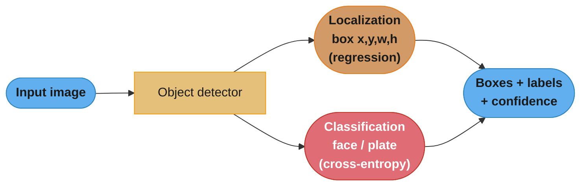
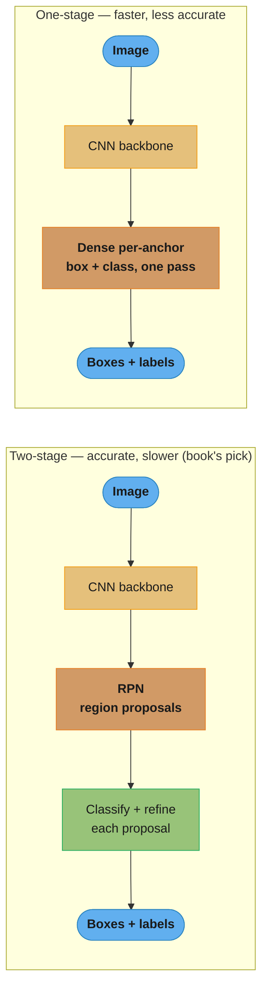
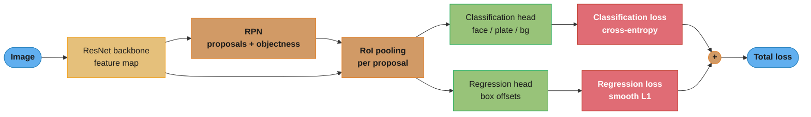
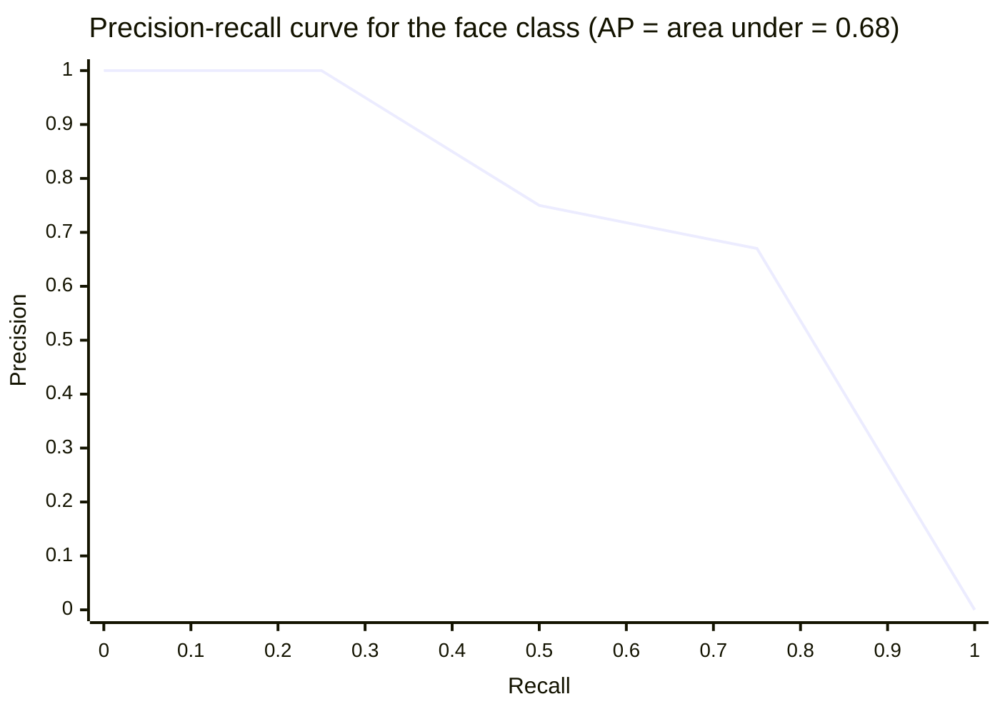
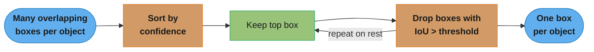
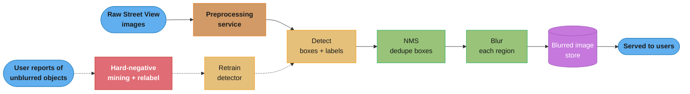
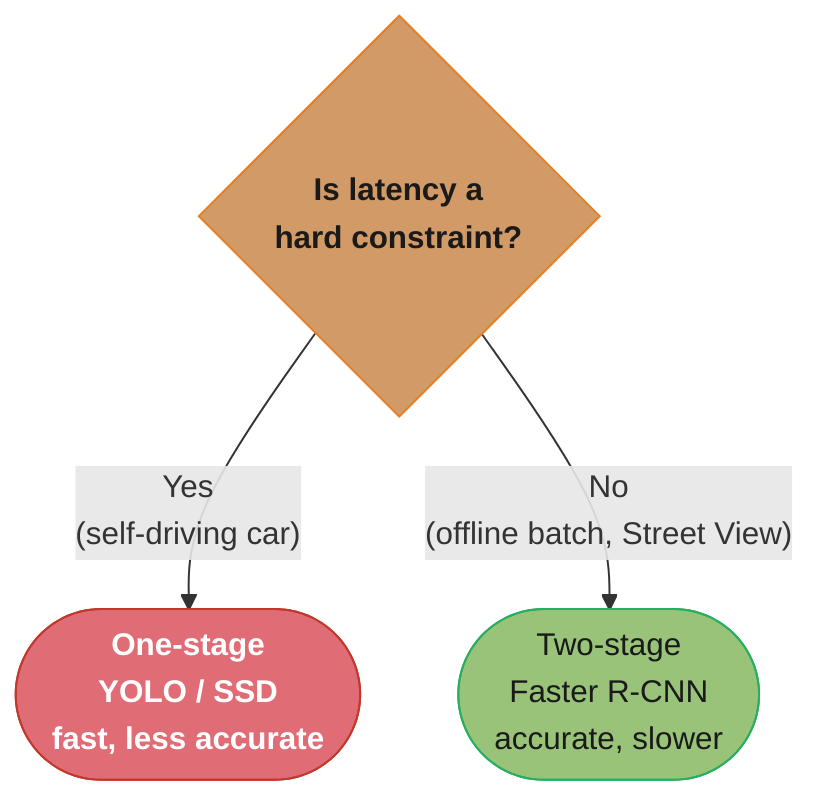

# Chapter 3: Google Street View Blurring System

> Ch 3 of 11 · ML System Design Interview (Aminian & Xu) · builds on Ch 2 — object detection, IoU/AP/mAP, NMS, and batch serving

## Chapter Map

Street View publishes billions of panoramic photos captured by camera cars driving public
roads. Those photos incidentally contain **faces and license plates** — personally identifiable
information the system is legally and ethically required to hide before serving. The chapter
designs the ML pipeline that finds every face and plate in an image and blurs it. Unlike the
retrieval systems of Chapters 2 and 4, this is a **detection** problem: the model must both
*locate* each object (a bounding box) and *classify* it (face vs plate). Because the imagery is
processed once, offline, and served from a precomputed store, **accuracy dominates and latency
is nearly free** — the opposite of an interactive recommender. That single constraint reshapes
every decision, most importantly the choice of a slower-but-more-accurate **two-stage detector**.

**TL;DR:**
- The task is **object detection** = localization (box regression) + classification, trained with
  a **two-term loss** (regression loss for the box + classification loss for the label).
- Offline batch serving means accuracy trumps latency, so the book picks a **two-stage** detector
  (Faster R-CNN family: RPN + classifier) over a faster one-stage detector (YOLO/SSD).
- Detection quality is measured with **IoU → precision at a threshold → AP (area under the
  precision-recall curve) → mAP** (mean AP across classes), COCO-style averaged over IoU 0.5:0.95.
- Serving is a **batch pipeline**: detect → **non-maximum suppression** to collapse overlapping
  boxes → blur → store; user reports of missed faces feed **hard-negative mining** and continual
  retraining.

## The Big Question

> "I have billions of street photos that legally must not expose anyone's face or plate. How do I
> build a model that reliably *finds* every such object — not just says 'a face is somewhere in
> here' — and how do I even measure 'reliably' when a detection can be right about *what* but wrong
> about *where*?"

Analogy: image classification asks "is there a cat in this photo?"; object detection asks "draw a
box around every cat and tell me it's a cat." The added burden is *localization*, and localization
is why detection needs its own geometry-based metric (**IoU**) and its own de-duplication step
(**NMS**) that classification never requires. Because a missed face is a privacy violation with
regulatory consequences (GDPR/CCPA), the whole design is tuned to **maximize recall of the objects
of interest** even at the cost of over-blurring — a false blur annoys; a false miss can be illegal.

---

## 3.1 Step 1 — Clarifying Requirements

The book opens, as every design chapter does, by pinning down scope before proposing anything.

### Business objective and what "blurring" means

The goal is to **protect user privacy by blurring faces and license plates** in Street View
imagery before it is served to the public. Crucially, **blurring is post-processing, not the ML
problem**: the model's job is to *detect* the objects; a deterministic image operation (Gaussian
blur / pixelation over the detected region) does the actual obscuring. Framing it this way keeps
the ML task clean — the model outputs boxes, the pipeline blurs them.

### Clarifying questions and their answers

| Question | Answer assumed by the book | Why it matters |
|----------|----------------------------|----------------|
| Which objects must be blurred? | Human **faces** and **license plates** (two classes) | Fixes it as a 2-class detection task |
| Is accuracy or latency the priority? | **Accuracy is critical**; latency is **not** | Privacy misses are costly; images are processed offline |
| Online (per-request) or offline? | **Offline batch** — process images once, serve precomputed blurred imagery | Enables slow, heavy, high-accuracy models |
| Is there a labeled dataset? | Yes — a **hand-annotated set of images with bounding boxes** exists, and it grows over time | Supervised detection is feasible |
| What scale? | **Billions** of images; growing continuously as cars re-drive routes | Distributed training + batch throughput, not tail latency |
| Is human review available? | Yes — **user reports** of unblurred faces/plates feed a review + relabel loop | Enables hard-negative mining and continual learning |
| Any fairness/legal constraints? | Must comply with **GDPR/CCPA**; must not systematically miss certain demographics | Drives demographic evaluation slices |

### The requirement that reshapes everything

**Latency does not matter; accuracy does.** Street View images are captured, processed once in an
offline pipeline, and the *blurred* results are stored and served. No user waits on the model.
This inverts the usual serving constraint and is the single most consequential clarification in the
chapter: it is the justification for choosing a **two-stage detector**, which is more accurate but
too slow for real-time use. Contrast with an autonomous vehicle, which needs the *same* detection
but under a hard millisecond budget and therefore leans one-stage — see
[design_autonomous_driving_perception.md](../../../ml/case_studies/design_autonomous_driving_perception.md).

---

## 3.2 Step 2 — Frame the Problem as an ML Task

### ML objective

Translate the business objective ("protect privacy") into a measurable ML objective:
**accurately detect objects of interest (faces, license plates) in an image.** The blur is a
downstream deterministic step; the model is scored purely on detection quality.

### Input and output

- **Input:** an image (one Street View frame / panorama tile).
- **Output:** a list of **bounding boxes**, each with a **class label** (face / license plate) and
  a **confidence score**. A box is typically `(x, y, w, h)` or `(x1, y1, x2, y2)`.

### Object detection = localization + classification

Object detection is two problems fused:

1. **Localization** — *where* is the object? Predict box coordinates. This is a **regression**
   sub-problem (continuous outputs).
2. **Classification** — *what* is the object? Predict the class of the boxed region. This is a
   **classification** sub-problem.

That duality is why detection needs a **two-term loss** (Section 3.4) and a geometry metric
(Section 3.5) — neither pure classification nor pure regression pipelines carry both.



Caption: every detection output carries a box (a regression result) and a label (a classification
result), which is why the model trains against two loss terms and is scored with a geometry-aware
metric — this dual nature is the whole difference from Chapter 2's image *classification*.

### Architecture families: two-stage vs one-stage

The book lays out the two dominant detector architectures and explicitly chooses one.

**Two-stage detectors (R-CNN → Fast R-CNN → Faster R-CNN):**
- Stage 1 — a **Region Proposal Network (RPN)** scans the image and proposes candidate regions
  ("there might be an object here") — a small set of class-agnostic boxes.
- Stage 2 — a **classifier + box refiner** takes each proposal, classifies it (face/plate/
  background) and tightens the box.
- **More accurate, slower.** The RPN filters the search space so the classifier sees good
  candidates, but running two networks per image is expensive.

**One-stage detectors (YOLO, SSD):**
- A single network predicts boxes *and* classes directly over a dense grid of anchor locations in
  one pass — no separate proposal stage.
- **Faster, less accurate** (historically weaker on small/overlapping objects, though the gap has
  narrowed with modern variants).



Caption: the two-stage detector inserts a region-proposal stage that narrows the search before
classifying, buying accuracy at the cost of a second network pass; the one-stage detector predicts
everything in a single sweep and wins on speed — the offline, accuracy-first Street View setting
makes the two-stage trade the right one.

**The book chooses a two-stage (Faster R-CNN-style) detector** precisely because latency is a
non-constraint and accuracy is paramount. In an interview, stating this tradeoff — and tying it to
the *offline batch* requirement — is the expected reasoning, not the architecture name itself.

---

## 3.3 Step 3a — Data Preparation

### Data engineering: what is stored

| Data | Contents | Use |
|------|----------|-----|
| **Images** | Raw Street View captures (panoramas / tiles) | Model input |
| **Annotations** | Per-image bounding boxes with class labels (face / plate) | Supervised labels |
| **Capture metadata** | Timestamp, camera/car ID, GPS location, road segment | Slicing, debugging, prioritizing recapture |

The labeled set is created by **human annotators** drawing boxes — the accurate but expensive
labeling path introduced in Chapter 2. Detection labels are costlier than classification labels
because each object needs a *box*, not just an image-level tag.

### Feature preparation (image preprocessing)

Standard CV preprocessing, mirroring Chapter 2's visual-search pipeline:
- **Resize / rescale** images to the detector's expected input dimensions.
- **Normalize** pixel values (scale to `[0,1]` then z-score with dataset mean/std per channel).
- **Consistent color mode** (RGB).

### Data augmentation (deep dive)

Because labeled detection data is scarce and expensive, **augmentation** multiplies the training
set by synthetically transforming images. The book walks the common transforms:

| Transform | What it does |
|-----------|--------------|
| **Random crop** | Cut a sub-region, forcing the model to detect partially framed objects |
| **Rotation** | Rotate the image by an angle |
| **Horizontal / vertical flip** | Mirror the image |
| **Saturation / brightness / contrast jitter** | Simulate lighting and camera variation |
| **Translation** | Shift the image contents |
| **Affine / scale** | General linear warps (shear, zoom) |

Augmentation can be applied **offline** (precompute augmented copies before training — faster
training, more storage, fixed variety) or **online** (augment on-the-fly per batch during training
— no extra storage, endless variety, more CPU per step). Detection pipelines usually favor **online**
augmentation so every epoch sees fresh variants.

#### The box-coordinate trap (broken → fix)

**This is the classic detection augmentation bug and the interview's favorite gotcha.** When you
geometrically transform the *image*, you must apply the **same transform to every bounding box's
coordinates** — otherwise the box no longer wraps the object and the label is now *wrong*, silently
teaching the model garbage.

**Broken — flip the image, keep the boxes:**

```python
# WRONG: image flipped, box coordinates untouched
img = horizontal_flip(img)          # pixels mirrored left<->right
boxes = original_boxes              # BUG: box still points to the OLD side
# The face is now on the right of the frame, but the box still says "left".
# Every flipped sample trains the model to associate a box with empty background.
```

**Fixed — transform the boxes with the image:**

```python
# RIGHT: apply the SAME geometric transform to the boxes
W = img.width
img = horizontal_flip(img)
# For a horizontal flip, x mirrors about the image center; y is unchanged:
#   x1' = W - x2 ,  x2' = W - x1 ,  y1' = y1 ,  y2' = y2
boxes = [(W - x2, y1, W - x1, y2) for (x1, y1, x2, y2) in original_boxes]
```

The same rule holds for rotation (rotate the four corners, then take the enclosing axis-aligned
box), translation (shift `x` and `y` by the same offset), and scaling (multiply coordinates by the
scale factor). **Photometric** transforms (brightness, saturation, contrast) change pixel *values*
only and leave boxes alone — the trap is exclusively for **geometric** transforms.

```
Horizontal flip of a 200-wide frame; face box originally at x = [30, 70]

  before:  0        30====70                              200
           |........[ FACE ]..............................|

  after :  0                             130====170        200
           |.............................[ FACE ]..........|   pixels mirrored

  correct box:  x1' = 200 - 70 = 130 ,  x2' = 200 - 30 = 170   -> [130, 170]  ✓
  buggy   box:  left as [30, 70]  -> now boxes EMPTY background  ✗
```

Caption: after a horizontal flip the object physically moves to the mirrored x-position, so the
box's x-coordinates must mirror too (`x' = W - x`); leaving them unchanged points the label at empty
background and corrupts training — an error that lint never catches and that quietly caps model
accuracy.

---

## 3.4 Step 3b — Model Development

### Architecture: backbone + RPN + heads

The two-stage detector composes three parts:

1. **CNN backbone** — a convolutional feature extractor (e.g. **ResNet**), often pretrained on
   ImageNet, turns the image into a feature map. This is the transferable representation layer,
   the same idea as Chapter 2's image encoder.
2. **Region Proposal Network (RPN)** — slides over the feature map and, for a grid of **anchors**
   (reference boxes of assorted scales/aspect ratios), predicts (a) an objectness score and (b) box
   offsets, emitting a shortlist of candidate regions.
3. **Detection heads** — for each proposal, an **RoI-pooled** feature vector feeds two heads: a
   **classification head** (face / plate / background) and a **box-regression head** (refine the
   proposal's coordinates).



Caption: the backbone produces one shared feature map; the RPN proposes regions; RoI pooling crops
each proposal to a fixed size for the two heads; and the two head losses sum into a single objective
that is optimized jointly end to end.

### The two-term loss

Detection optimizes a **sum of two losses**, one per sub-problem:

```
L_total = L_classification  +  λ · L_regression
```

- **Classification loss** — **cross-entropy** over the class of each proposal (face / plate /
  background). Background is a class so the model learns to reject non-objects.
- **Regression loss** — a **smooth L1 (Huber)** or MSE loss on the predicted box offsets, computed
  **only for positive (object) proposals** — there is no meaningful box to regress for a background
  region. Smooth L1 is preferred over plain MSE because it is less sensitive to outlier coordinate
  errors (quadratic near zero, linear in the tails), so a few badly-placed proposals don't dominate
  the gradient.
- **λ** balances the two terms so neither the box error nor the class error swamps the other.

The two heads are trained **jointly** — one backward pass updates the backbone, RPN, and both heads
together — so the shared features serve localization and classification simultaneously.

### Model selection reasoning

Following the book's "simple first, then justify complexity" ethos, one *could* start from a
one-stage detector as a fast baseline, but the accuracy-critical, latency-free setting justifies
going straight to a **two-stage** model. The backbone is chosen for accuracy (a deep ResNet) rather
than for on-device size, since there is no on-device or real-time constraint.

---

## 3.5 Step 3c — Evaluation

Detection evaluation is the chapter's most mechanically detailed section. Because a prediction can
be right about the class but wrong about the location, you need a metric that scores *where*, not
just *what*. That starts with **IoU**.

### IoU — Intersection over Union

IoU measures how well a predicted box overlaps the ground-truth box:

```
IoU = area(prediction ∩ ground truth) / area(prediction ∪ ground truth)
```

IoU = 1.0 means a perfect box; IoU = 0 means no overlap. A prediction counts as a **true positive**
only if its IoU with a ground-truth box of the same class meets a **threshold** (commonly 0.5).

#### Worked IoU example

Ground-truth face box `GT = (50, 50, 150, 150)` — a 100×100 box, area **10 000** px².
Predicted box `P = (70, 70, 170, 170)` — also 100×100, area **10 000** px².

```
Intersection:
  x overlap = min(150, 170) - max(50, 70) = 150 - 70 = 80
  y overlap = min(150, 170) - max(50, 70) = 150 - 70 = 80
  area(∩) = 80 x 80 = 6 400

Union:
  area(∪) = 10 000 + 10 000 - 6 400 = 13 600

IoU = 6 400 / 13 600 = 0.47
```

At threshold 0.5 this prediction is a **false positive** (0.47 < 0.5) — close, but not tight enough.
Shift the prediction to `(60, 60, 160, 160)` and the intersection becomes 90×90 = 8 100, union =
11 900, **IoU = 0.68**, now a **true positive**. This sensitivity is exactly why the threshold
matters and why COCO averages over *many* thresholds (below).

```
       50            150 170                   The two 100x100 boxes overlap in
   50  +--------------+                         an 80x80 square. Intersection is
       |  GT          |                         the doubly-covered region; union
       |     +--------|-----+  70               is everything either box covers.
       |     | ∩ 80x80|     |
  150  +-----|--------+     |                   IoU = 6400 / 13600 = 0.47  (< 0.5)
             |    P         |
         170 +--------------+
```

Caption: IoU divides the overlap area by the combined area, so a box that is close but offset
(0.47 here) still fails a 0.5 threshold — localization error is penalized geometrically, which pure
classification accuracy could never capture.

### Precision at an IoU threshold

Once each detection is labeled TP or FP (via IoU + class match), and each ground-truth object is
matched to at most one detection (extra detections of the same object are FPs), you compute
**precision** and **recall** as detections are considered in **descending confidence** order:

```
precision = TP / (TP + FP)          recall = TP / (all ground-truth objects)
```

### AP — Average Precision (worked example)

**AP is the area under the precision-recall curve** for one class at one IoU threshold. Sweeping the
confidence threshold from high to low traces out the curve; AP summarizes it as a single number in
`[0, 1]`.

Worked example — **5 ground-truth faces** in the eval set; the model emits 7 detections, ranked by
confidence. At IoU 0.5 each is TP or FP:

| Rank | Conf | TP/FP | cumTP | cumFP | Precision = TP/(TP+FP) | Recall = TP/5 |
|-----:|-----:|:-----:|------:|------:|:----------------------:|:-------------:|
| 1 | 0.95 | TP | 1 | 0 | 1/1 = 1.00 | 0.20 |
| 2 | 0.90 | TP | 2 | 0 | 2/2 = 1.00 | 0.40 |
| 3 | 0.85 | FP | 2 | 1 | 2/3 = 0.67 | 0.40 |
| 4 | 0.80 | TP | 3 | 1 | 3/4 = 0.75 | 0.60 |
| 5 | 0.70 | FP | 3 | 2 | 3/5 = 0.60 | 0.60 |
| 6 | 0.65 | TP | 4 | 2 | 4/6 = 0.67 | 0.80 |
| 7 | 0.50 | FP | 4 | 3 | 4/7 = 0.57 | 0.80 |

The model found 4 of the 5 faces (one was missed, so recall tops out at 0.80). Using **all-points
interpolation** (VOC2010+/COCO), interpolated precision at recall `r` = the maximum precision at any
recall ≥ `r`:

```
recall 0.20 -> max precision at recall >= 0.20 = 1.00
recall 0.40 -> 1.00
recall 0.60 -> max(0.75, 0.67) = 0.75
recall 0.80 -> 0.67
recall 1.00 -> 0     (never reached; 5th face missed)

AP = sum over recall bands of (Δrecall x interpolated precision):
   [0.0 -> 0.2]  0.2 x 1.00 = 0.200
   [0.2 -> 0.4]  0.2 x 1.00 = 0.200
   [0.4 -> 0.6]  0.2 x 0.75 = 0.150
   [0.6 -> 0.8]  0.2 x 0.67 = 0.134
   [0.8 -> 1.0]  0.2 x 0.00 = 0.000
AP(face) = 0.200 + 0.200 + 0.150 + 0.134 = 0.68
```



Caption: AP is literally the area under this precision-recall curve — the interpolated staircase
integrated over recall (0.68 here); the drop to zero past recall 0.8 encodes the one face the model
never found, so a missed detection directly shrinks AP.

### mAP — mean Average Precision

**mAP is the mean of AP across all classes.** With two classes:

```
AP(face) = 0.68 ,  AP(license plate) = 0.80
mAP = (0.68 + 0.80) / 2 = 0.74
```

### COCO-style mAP (IoU 0.5:0.95)

A single IoU threshold (0.5) rewards loose boxes. The **COCO** protocol averages AP over **ten IoU
thresholds** — 0.50, 0.55, 0.60, …, 0.95 (step 0.05) — and then across classes:

```
mAP@[0.5:0.95] = mean over IoU in {0.50, 0.55, ..., 0.95}  of  mAP at that IoU
```

This rewards **tight** localization: a detector that overlaps at 0.5 but not 0.9 scores lower than
one whose boxes hug the object. Street View benefits from tight boxes so the blur covers the face
without smearing the whole neighborhood.

### Offline vs online metrics

- **Offline** (during development): IoU, AP per class, mAP — computed on the held-out annotated set.
- **Online** (in production): **user reports of unblurred faces/plates** (privacy misses that
  slipped through) and the **percentage of objects correctly blurred**. Because a miss is a legal
  event, the online signal that matters most is *false-negative reports*, which also feed retraining.

---

## 3.6 Step 4 — Serving

### Non-Maximum Suppression (NMS)

A detector emits **many overlapping boxes** for the same object — the RPN proposes several nearby
regions, all firing on the same face. Serving raw boxes would blur the same face three times and
inflate the FP count. **Non-Maximum Suppression** collapses each cluster of overlapping boxes to the
single highest-confidence one.

```
NMS(boxes, iou_threshold):
    sort boxes by confidence, descending
    keep = []
    while boxes not empty:
        best = boxes.pop(0)              # highest remaining confidence
        keep.append(best)
        # drop every remaining box that overlaps 'best' too much
        boxes = [b for b in boxes if IoU(best, b) < iou_threshold]
    return keep
```

Per class, NMS keeps the most confident box and discards any other box overlapping it beyond
`iou_threshold` (e.g. 0.5), then repeats on what remains. The result is one box per object.



Caption: NMS repeatedly takes the highest-confidence box and suppresses everything overlapping it,
turning a noisy cluster of near-duplicate detections into exactly one box per real object before the
blur is applied.

### The batch prediction pipeline

Because serving is offline, everything is precomputed and stored:



Caption: the online path is a one-way batch pipeline that ends in a store of already-blurred images
(no model in the request path), while the dotted feedback loop turns user reports of missed objects
into hard negatives that retrain the detector — the two halves of a continually-improving offline
system.

- **Preprocessing service** — resize / normalize / color-normalize incoming images.
- **Blurring service** — run the detector, apply **NMS**, blur every surviving box (Gaussian /
  pixelation), and write the blurred image to the store.
- **Serving** — users are served the **precomputed blurred imagery** directly; the model never runs
  at request time.

### The data / retraining pipeline

- **Hard-negative mining** — the objects the model *misses* (reported by users, or high-loss
  examples) are the most valuable training data. Feeding these **hard negatives** back concentrates
  learning on the failure cases rather than the easy, already-solved ones.
- **Continual retraining** — as reports accumulate and new imagery arrives, the annotated set grows
  and the detector is retrained periodically, closing the loop and steadily lifting recall on the
  privacy-critical tail.

---

## 3.7 Step 4 (cont.) — Other Talking Points

The book closes with extensions an interviewer may probe:

- **Transformer-based detection (DETR)** — DEtection TRansformer reframes detection as **set
  prediction**: it predicts a fixed set of boxes end to end and **eliminates NMS** (a learned
  bipartite matching replaces the hand-tuned suppression), removing an anchor/heuristic-heavy stage.
- **Distributed training** — billions of images and a heavy two-stage model demand **data
  parallelism** (and possibly model parallelism) across many GPUs.
- **Privacy by design (GDPR / CCPA)** — blurring is a *regulatory* requirement; the system should be
  auditable, default to over-blurring, and support takedown/report requests as first-class flows.
- **Evaluation bias across demographics** — the detector must be checked for **fairness**: does it
  miss faces of certain skin tones, ages, or in certain geographies/lighting more often? A missed
  face for one group is a discriminatory privacy failure, so evaluation must **slice mAP by
  demographic and region**, not just report a single global number.
- **Active learning / human-in-the-loop** — with limited annotator budget, prioritize labeling the
  images the model is **most uncertain** about (or where users reported misses), maximizing accuracy
  gain per label — see
  [active_learning_and_weak_supervision](../../../ml/active_learning_and_weak_supervision/README.md).

---

## Visual Intuition

### The metric ladder: IoU → precision → AP → mAP

```mermaid
flowchart LR
    classDef io      fill:#61afef,stroke:#2e86c1,color:#1a1a1a,font-weight:bold
    classDef frozen  fill:#c678dd,stroke:#9b59b6,color:#fff
    classDef train   fill:#98c379,stroke:#27ae60,color:#1a1a1a
    classDef mathOp  fill:#d19a66,stroke:#e67e22,color:#1a1a1a,font-weight:bold
    classDef lossN   fill:#e06c75,stroke:#c0392b,color:#fff,font-weight:bold
    classDef req     fill:#56b6c2,stroke:#0097a7,color:#1a1a1a
    classDef base    fill:#e5c07b,stroke:#f39c12,color:#1a1a1a

    IOU(["IoU per box<br/>overlap / union"]) --> THR["Threshold<br/>e.g. 0.5"]
    THR --> PR["TP / FP<br/>-> precision, recall"]
    PR --> AP(["AP<br/>area under PR curve<br/>(one class)"])
    AP --> MAP(["mAP<br/>mean AP<br/>across classes"])
    MAP --> COCO(["mAP@0.5:0.95<br/>avg over 10 IoU thresholds"])

    class IOU,AP,MAP,COCO io
    class THR mathOp
    class PR train
```



Caption: each rung builds on the one before — IoU scores one box, a threshold turns scores into
TP/FP, the precision-recall curve's area is AP for one class, averaging over classes gives mAP, and
averaging that over ten IoU thresholds gives the COCO metric that rewards tight boxes.

### Why two-stage here — the decision



Caption: the architecture choice reduces to one question — is there a latency budget? Street View's
offline batch pipeline answers "no", so the accuracy-first two-stage detector wins; flip the answer
and you get the autonomous-driving choice.

---

## Key Concepts Glossary

- **Object detection** — locating (bounding box) and classifying every object of interest in an image.
- **Localization** — predicting an object's bounding box; a regression sub-problem.
- **Bounding box** — a rectangle `(x, y, w, h)` or `(x1, y1, x2, y2)` enclosing an object.
- **Two-stage detector** — RPN proposes regions, then a classifier refines/labels them (R-CNN,
  Fast R-CNN, Faster R-CNN); accurate, slower.
- **One-stage detector** — predicts boxes and classes densely in a single pass (YOLO, SSD); faster,
  less accurate.
- **CNN backbone** — convolutional feature extractor (e.g. ResNet) shared by all detection heads.
- **Region Proposal Network (RPN)** — network that proposes candidate object regions from anchors.
- **Anchor** — a reference box of fixed scale/aspect ratio the RPN adjusts into a proposal.
- **RoI pooling** — cropping each proposal's features to a fixed size for the heads.
- **Two-term loss** — classification loss (cross-entropy) + regression loss (smooth L1), summed.
- **Smooth L1 (Huber) loss** — box-regression loss; quadratic near zero, linear in tails (outlier-robust).
- **Data augmentation** — synthetic image transforms (crop, rotate, flip, jitter) to expand training data.
- **Box-coordinate transform** — the rule that geometric augmentations must transform boxes too.
- **Offline vs online augmentation** — precomputed augmented copies vs on-the-fly per-batch augmentation.
- **IoU (Intersection over Union)** — overlap area ÷ union area of two boxes; the localization metric.
- **True positive (detection)** — a predicted box whose IoU with a same-class ground-truth box ≥ threshold.
- **Precision / recall (detection)** — TP/(TP+FP) and TP/(all ground truth) over confidence-ranked boxes.
- **Average Precision (AP)** — area under the precision-recall curve for one class at one IoU threshold.
- **mAP (mean Average Precision)** — mean of AP across classes.
- **mAP@[0.5:0.95]** — COCO metric: AP averaged over IoU thresholds 0.5 to 0.95 (step 0.05) and classes.
- **Non-Maximum Suppression (NMS)** — collapse overlapping boxes to the single highest-confidence one.
- **Hard-negative mining** — feeding the model's missed/hard examples back into training.
- **Continual retraining** — periodic retraining on freshly annotated data (from reports + new imagery).
- **Batch prediction** — precompute and store results offline; serve precomputed output.
- **DETR** — transformer detector that predicts a box set end to end, removing NMS.

---

## Tradeoffs & Decision Tables

**Two-stage vs one-stage detectors**

| Dimension | Two-stage (Faster R-CNN) | One-stage (YOLO, SSD) |
|-----------|--------------------------|-----------------------|
| Accuracy | Higher | Lower (historically) |
| Speed / latency | Slower (two passes) | Faster (single pass) |
| Small / overlapping objects | Better | Weaker |
| Compute cost | Higher | Lower |
| Best when | Accuracy-critical, offline | Real-time, latency-bound |
| Street View fit | ✓ chosen | ✗ |

**Offline vs online augmentation**

| | Offline | Online |
|--|---------|--------|
| When applied | Before training, precomputed | On-the-fly per batch |
| Storage cost | High (stored copies) | None |
| Compute during training | Lower | Higher (CPU per step) |
| Variety | Fixed set | Fresh every epoch |

**Cloud/offline batch vs on-device/real-time serving (why Street View is batch)**

| | Batch (Street View) | Real-time (self-driving) |
|--|--------------------|--------------------------|
| Latency budget | None (offline) | Hard milliseconds |
| Model choice | Heavy, two-stage | Light, one-stage |
| Serving | Precompute + store blurred imagery | Run model per frame |
| Priority | Accuracy / recall | Speed within accuracy floor |

**IoU threshold effect (from the worked example)**

| Predicted box | area(∩) | area(∪) | IoU | TP at 0.5? |
|---------------|--------:|--------:|----:|:----------:|
| (70,70,170,170) | 6 400 | 13 600 | 0.47 | ✗ |
| (60,60,160,160) | 8 100 | 11 900 | 0.68 | ✓ |

---

## Common Pitfalls / War Stories

- **Forgetting to transform box coordinates during augmentation.** Flip/rotate/translate the image
  but leave the boxes — every augmented sample now labels empty background, and the model's accuracy
  silently plateaus with no error message. The fix is to apply the identical geometric transform to
  the boxes (`x' = W - x` for a horizontal flip); photometric transforms need no box change.
- **Serving raw detections without NMS.** The detector emits several overlapping boxes per face;
  without suppression the same face is blurred multiple times and the FP count balloons, tanking
  precision. Always run per-class NMS before scoring or blurring.
- **Reporting mAP at IoU 0.5 only.** A single loose threshold rewards sloppy boxes that overlap but
  don't hug the object — fine for "is it there?" but bad when the blur must cover the face precisely.
  Use COCO mAP@[0.5:0.95] to reward tight localization.
- **Optimizing precision over recall for a privacy system.** A false blur (blurring a poster) is a
  minor annoyance; a false *miss* (an unblurred face) is a legal/ethical failure. Tune the operating
  point (confidence threshold) toward **high recall of faces/plates**, and monitor **user-reported
  misses** as the primary online metric.
- **Ignoring demographic evaluation slices.** A globally high mAP can hide that the detector misses
  darker-skinned faces or certain plate formats more often. Slice mAP by demographic/geography;
  otherwise the privacy protection is applied unequally.
- **Interactive multi-statement training data leakage between augmentation and eval.** Augmenting
  before the train/val split can leak transformed copies of the same image across the split,
  inflating validation mAP. Split first, augment the training partition only.

---

## Real-World Systems Referenced

- **Google Street View** — the blurring system this chapter designs.
- **R-CNN, Fast R-CNN, Faster R-CNN** — the two-stage detector lineage (RPN + classifier).
- **YOLO, SSD** — one-stage detectors (real-time, single pass).
- **ResNet** — the CNN backbone / feature extractor.
- **COCO** — the benchmark whose IoU 0.5:0.95 averaging defines the standard mAP metric.
- **DETR (DEtection TRansformer)** — transformer-based set-prediction detector that removes NMS.

---

## Summary

Street View blurring is an **object detection** problem — find and box every face and license plate,
then blur it — where **blurring is deterministic post-processing** and the model is scored purely on
detection quality. The defining clarification is that the pipeline runs **offline in batch**, so
**accuracy matters and latency does not**, which justifies a **two-stage detector** (Faster R-CNN:
CNN backbone → RPN → classification + box-regression heads) over a faster one-stage model. The model
trains against a **two-term loss** — cross-entropy for the class plus smooth L1 for the box,
optimized jointly. Training data is expensive hand-annotated boxes, expanded with **augmentation**,
whose signature trap is that **geometric transforms must be applied to the box coordinates too**.
Evaluation climbs a ladder: **IoU** scores box overlap; a threshold turns scores into TP/FP;
**AP** is the area under the precision-recall curve for one class; **mAP** averages AP across classes;
and **COCO mAP@[0.5:0.95]** averages over ten IoU thresholds to reward tight boxes. At serving,
**non-maximum suppression** collapses overlapping detections to one box per object, the pipeline
blurs and stores the image, and users are served **precomputed** imagery. **User reports of misses**
feed **hard-negative mining** and **continual retraining**, steadily lifting recall on the
privacy-critical tail — with fairness across demographics and DETR-style NMS-free detection as the
forward-looking extensions.

---

## Interview Questions

**Q: For Street View blurring, would you choose a one-stage or two-stage detector, and why?**
A two-stage detector (Faster R-CNN family), because the pipeline is offline batch so latency is not a constraint and accuracy is paramount. Two-stage detectors add a region-proposal stage before classification, making them more accurate (especially on small/overlapping objects) at the cost of a second network pass and higher latency. That latency cost is irrelevant here since images are processed once and served precomputed, and a missed face is a privacy/legal failure — so the accuracy-first choice dominates. Flip the latency constraint (a self-driving car) and you would instead pick a faster one-stage detector.

**Q: What exactly is mAP, and how does it build up from IoU?**
mAP is the mean, across classes, of Average Precision, where AP is the area under the precision-recall curve for one class at one IoU threshold. IoU scores each predicted box's overlap with ground truth; a threshold (e.g. 0.5) converts IoU + class match into true/false positives; ranking detections by confidence traces a precision-recall curve whose area is AP; averaging AP over classes gives mAP. COCO further averages mAP over IoU thresholds 0.5 to 0.95 to reward tight localization.

**Q: Compute the IoU of ground-truth box (50,50,150,150) and predicted box (70,70,170,170).**
IoU = 0.47, so at a 0.5 threshold this prediction is a false positive. The intersection is min(150,170)−max(50,70)=80 wide and 80 tall = 6 400 px²; each box is 100×100 = 10 000 px², so the union is 10 000 + 10 000 − 6 400 = 13 600 px²; IoU = 6 400 / 13 600 = 0.47. It is a near-miss — nudging the box to (60,60,160,160) raises IoU to 0.68 and makes it a true positive.

**Q: What is the box-coordinate augmentation trap, and how do you fix it?**
When you geometrically transform an image (flip, rotate, translate, scale) you must apply the same transform to every bounding box, or the box no longer wraps the object and the label becomes wrong. For a horizontal flip of a width-W image, the box x-coordinates mirror as x1' = W − x2, x2' = W − x1 (y unchanged). Forgetting this silently trains the model on boxes pointing at empty background, capping accuracy with no error thrown. Photometric transforms (brightness, saturation) change only pixel values and leave boxes untouched — the trap is specific to geometric transforms.

**Q: Why is non-maximum suppression needed, and how does it work?**
NMS collapses the many overlapping boxes a detector emits for a single object down to one box per object. It sorts detections by confidence, keeps the highest-confidence box, discards every remaining box whose IoU with it exceeds a threshold (e.g. 0.5), and repeats on what is left. Without NMS the same face is blurred multiple times and false positives inflate, tanking precision. It is applied per class before scoring or blurring.

**Q: Why does object detection use a two-term loss, and what are the two terms?**
Because detection is simultaneously localization (regression) and classification, so the loss sums a box-regression term and a classification term. The classification term is cross-entropy over the class (face / plate / background); the regression term is smooth L1 (Huber) on the box offsets, computed only for positive proposals since background regions have no meaningful box. A weight λ balances them, and the two heads are trained jointly through the shared backbone.

**Q: Why average mAP over IoU 0.5 to 0.95 (COCO-style) instead of just at 0.5?**
Because a single loose threshold like 0.5 rewards boxes that overlap the object but don't tightly enclose it. Averaging AP over ten thresholds (0.50, 0.55, …, 0.95) penalizes loose boxes and rewards tight localization — a detector that matches at 0.5 but not 0.9 scores lower than one whose boxes hug the object. For Street View this matters because the blur should cover the face precisely, not smear surrounding pixels.

**Q: Why is smooth L1 preferred over MSE for the box-regression loss?**
Smooth L1 (Huber) is quadratic for small errors but linear for large ones, so outlier coordinate errors do not dominate the gradient the way squared error would. A few badly placed proposals under MSE would produce huge squared penalties and destabilize training; smooth L1 caps their influence to a linear growth. It keeps regression stable while still being smooth and differentiable near zero.

**Q: How is a detection counted as a true positive versus a false positive?**
A detection is a true positive if its IoU with a same-class ground-truth box meets the threshold and that ground-truth object has not already been matched; otherwise it is a false positive. Each ground-truth object can be matched by at most one detection — extra overlapping detections of the same object count as false positives (which is why NMS matters). Missed ground-truth objects are false negatives that cap recall.

**Q: Why does the offline batch requirement change the whole design?**
Because with no per-request latency budget, you are free to use the heaviest, most accurate model and precompute all results. There is no user waiting on the model, so a slow two-stage detector, a deep backbone, and expensive post-processing are all acceptable. The system serves precomputed blurred imagery from a store rather than running the model at request time, which is the opposite of an interactive recommender's constraints.

**Q: What is the difference between offline and online data augmentation?**
Offline augmentation precomputes and stores transformed copies before training; online augmentation generates transforms on the fly per batch during training. Offline costs storage but reduces per-step compute and gives a fixed variety; online costs no storage, adds CPU per step, and gives fresh variants every epoch. Detection pipelines usually favor online augmentation so the model never sees the same augmented image twice.

**Q: How do user reports feed back into the model?**
Reports of unblurred faces or plates are false negatives — the model's misses — and become hard negatives for retraining. These hard-negative examples are the most valuable training data because they target the failure cases rather than the easy, already-solved ones. Combined with new imagery, the annotated set grows and the detector is retrained periodically (continual learning), steadily lifting recall on the privacy-critical tail.

**Q: For a privacy system, should you optimize for precision or recall, and why?**
Recall of faces and plates, because a missed object is an unblurred face — a legal/ethical failure — while an over-blur is only a minor annoyance. You tune the confidence threshold toward high recall on the objects of interest, accepting more false blurs, and you monitor user-reported misses as the primary online metric. The asymmetry of costs (illegal miss vs annoying over-blur) drives the operating point.

**Q: Walk through computing AP from a ranked list of detections.**
Rank detections by confidence, label each TP or FP via IoU + class match, then accumulate precision = TP/(TP+FP) and recall = TP/(all ground truth) down the list. Plot precision against recall, interpolate (all-points: precision at recall r = max precision at any recall ≥ r), and integrate the area under that curve. For 5 ground-truth faces with detections TP,TP,FP,TP,FP,TP,FP the interpolated precisions 1.0/1.0/0.75/0.67 over recall bands of 0.2 give AP = 0.20+0.20+0.15+0.134 ≈ 0.68.

**Q: What is the RPN's role in a two-stage detector?**
The Region Proposal Network scans the backbone's feature map and proposes a shortlist of candidate object regions (class-agnostic boxes with objectness scores) from a grid of anchors. This narrows the search space so the second-stage classifier only examines promising regions instead of the whole image densely. It is the extra stage that makes two-stage detectors more accurate but slower than one-stage detectors.

**Q: What are anchors and why are they used?**
Anchors are predefined reference boxes of various scales and aspect ratios tiled across the feature map, which the RPN adjusts (via predicted offsets) into region proposals. They let the network handle objects of different sizes and shapes without regressing boxes from scratch — it only learns deltas from the nearest anchor. This makes localization easier and training more stable.

**Q: How does DETR change object detection, and what does it remove?**
DETR (DEtection TRansformer) treats detection as end-to-end set prediction, outputting a fixed set of boxes with a transformer and a bipartite matching loss, which eliminates non-maximum suppression. Because the learned matching already assigns one prediction per object, there are no duplicate overlapping boxes to suppress, removing NMS and the anchor machinery. It trades hand-tuned heuristics for a fully learned, though data-hungry, pipeline.

**Q: Why must you evaluate detection accuracy across demographic slices?**
Because a single global mAP can hide that the detector misses faces of certain skin tones, ages, or in certain geographies more often, applying privacy protection unequally. A missed face for one group is a discriminatory privacy failure with fairness and legal implications. The fix is to slice mAP by demographic and region and hold each slice to the recall bar, not just the aggregate.

**Q: Why is blurring treated as post-processing rather than part of the ML model?**
Because separating them keeps the ML task clean — the model only detects boxes, and a deterministic image operation (Gaussian blur / pixelation) obscures the boxed regions. This lets you train and evaluate the detector with standard detection metrics (IoU, mAP) independent of the blur, and swap the blur implementation without retraining. The model's output is boxes + labels; the pipeline applies the blur.

**Q: What data do you store beyond images and annotations, and why?**
Capture metadata such as timestamp, camera/car ID, GPS location, and road segment, used for slicing evaluation, debugging failures, and prioritizing which routes to recapture or relabel. Annotations are per-image bounding boxes with class labels drawn by human annotators. The metadata is what lets you find, for example, that misses cluster in a particular lighting condition or geography.

---

## Cross-links in this repo

For the repo's own production-depth treatment of the underlying techniques, see the ML section
rather than duplicating it here:

- [ml/computer_vision/](../../../ml/computer_vision/README.md) — CNN backbones, object detection
  architectures, augmentation in depth.
- [ml/case_studies/design_autonomous_driving_perception.md](../../../ml/case_studies/design_autonomous_driving_perception.md)
  — the same detection task under a hard real-time budget (why self-driving leans one-stage).
- [ml/case_studies/design_image_classification_pipeline.md](../../../ml/case_studies/design_image_classification_pipeline.md)
  — the classification-only sibling task (no localization), plus the CV data pipeline.
- [ml/privacy_preserving_ml/](../../../ml/privacy_preserving_ml/README.md) — GDPR/CCPA, privacy by
  design, and handling PII in ML systems.
- [ml/active_learning_and_weak_supervision/](../../../ml/active_learning_and_weak_supervision/README.md)
  — prioritizing which images to annotate to maximize accuracy per label.
- [ml/model_evaluation_and_selection/](../../../ml/model_evaluation_and_selection/README.md) —
  precision/recall, ROC/PR curves, and metric selection more broadly.
- Sibling chapter [Ch 2: Visual Search System](../02_visual_search_system/README.md) — the CNN
  encoder / representation-learning foundation this chapter's backbone reuses.
- Sibling chapter [Ch 4: YouTube Video Search](../04_youtube_video_search/README.md) — the next
  CV-plus-retrieval design in the book.
- [Designing ML Systems — Ch 9: Continual Learning and Test in Production](../../designing_machine_learning_systems/09_continual_learning_and_test_in_production/README.md)
  — the retraining-from-feedback loop this chapter's report pipeline instantiates.

## Further Reading

- Aminian & Xu, *Machine Learning System Design Interview*, Ch 3 — original text and references.
- Girshick et al., "Rich feature hierarchies for accurate object detection" (R-CNN), 2014.
- Girshick, "Fast R-CNN," 2015.
- Ren, He, Girshick & Sun, "Faster R-CNN: Towards Real-Time Object Detection with Region Proposal
  Networks," 2015 — the RPN + two-stage detector.
- Redmon et al., "You Only Look Once (YOLO): Unified, Real-Time Object Detection," 2016 — the
  one-stage baseline.
- Liu et al., "SSD: Single Shot MultiBox Detector," 2016.
- Lin et al., "Microsoft COCO: Common Objects in Context," 2014 — the dataset and mAP@[0.5:0.95]
  evaluation protocol.
- Carion et al., "End-to-End Object Detection with Transformers (DETR)," 2020 — NMS-free detection.
