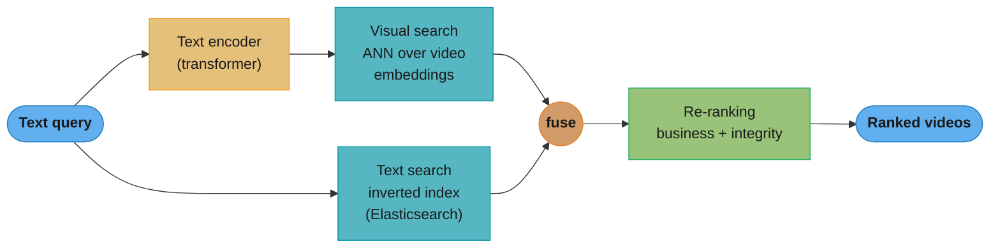
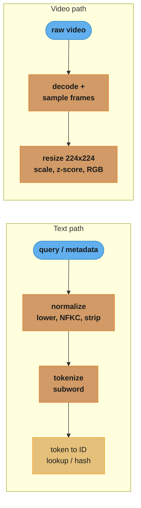
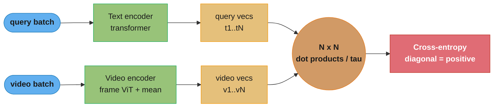
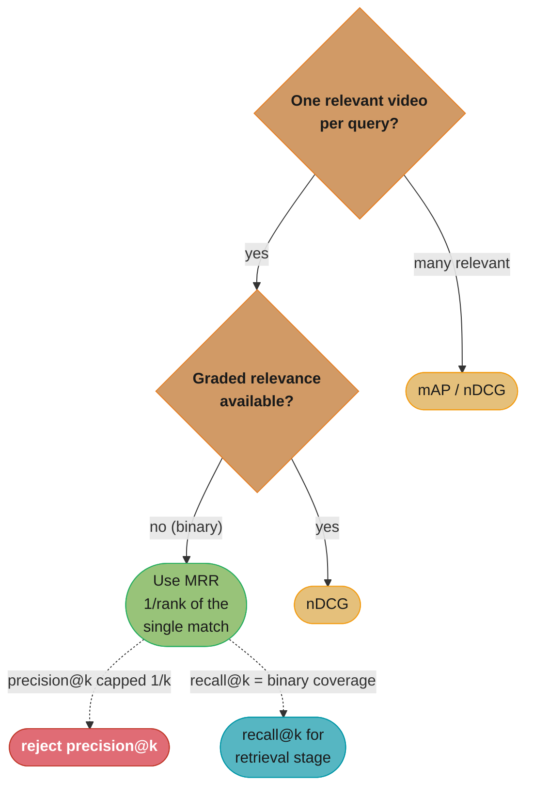
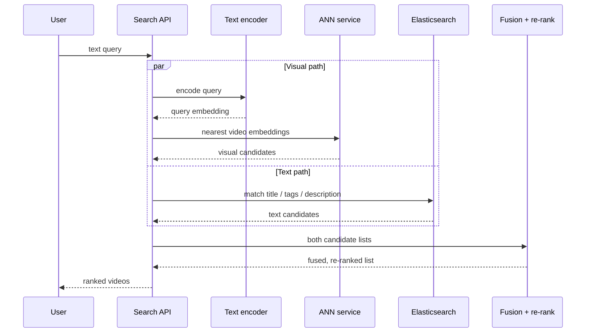
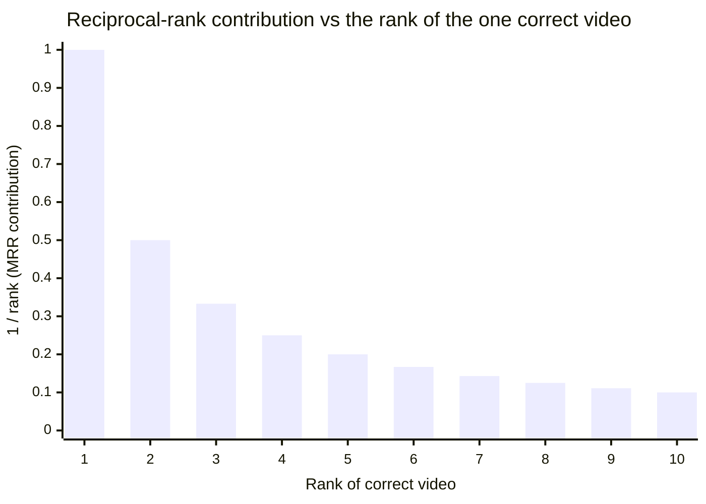
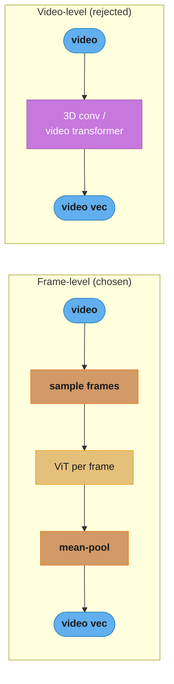
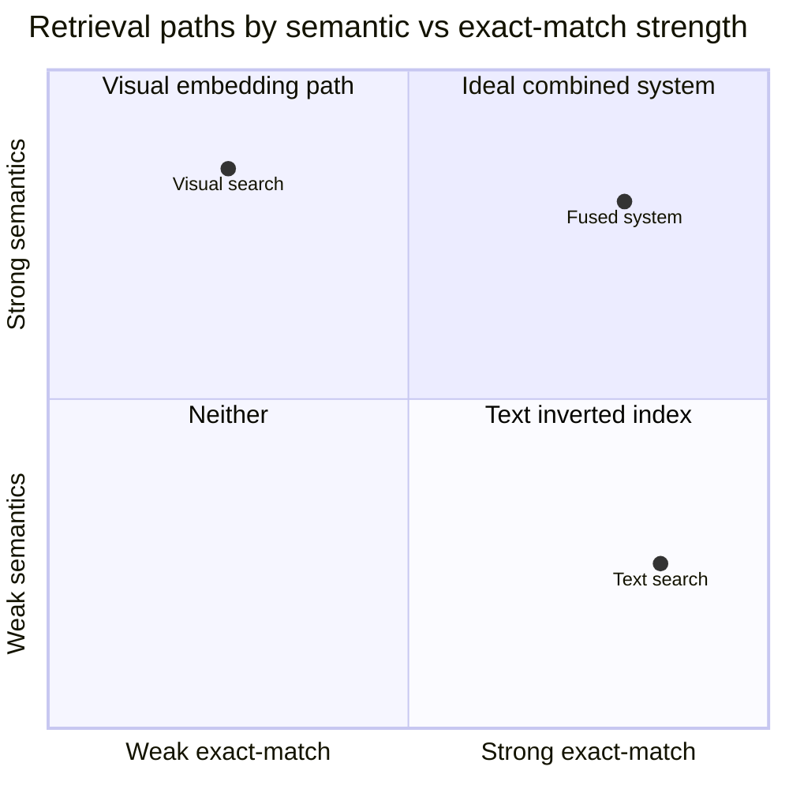

# Chapter 4: YouTube Video Search

> Ch 4 of 11 · ML System Design Interview (Aminian & Xu) · builds on Ch 2's ANN — video–text retrieval in a shared embedding space, fused with inverted-index text search

## Chapter Map

The user types a text query; the system returns a ranked list of videos that match by **both**
their **visual content** and their **textual metadata** (title, description, tags). Chapter 2
taught embedding retrieval for *image→image* search; this chapter generalizes it to a **multimodal**
setting where the query and the item live in *different* modalities — text on one side, video on the
other — and must still be compared with a single dot product. The trick is **representation
learning across modalities** (a CLIP-style dual encoder trained contrastively) so a query embedding
and a video embedding land in the *same* vector space. But embeddings alone quietly fail on rare
tokens, exact names, and keyword matches, so the design runs a **second, non-ML search path** — an
inverted index (Elasticsearch) — in parallel and **fuses** the two. The chapter closes on why
**MRR** is the right offline metric when every query has exactly one ground-truth video.

**TL;DR:**
- Two retrieval paths run in parallel: **visual search** (text-encoder → ANN over a video-embedding
  index) and **text search** (inverted index over metadata). A **fusion** layer merges them, then a
  **re-ranker** applies business and integrity logic.
- The visual path is a **dual encoder** (text encoder + video encoder) trained **contrastively** —
  annotated `<video, query>` positives, **in-batch negatives**, cross-entropy over the similarity
  matrix. This is the CLIP recipe.
- The video encoder is **frame-level** (sample frames → ViT per frame → aggregate), not video-level
  (3D conv / video transformer) — far cheaper, at the cost of temporal understanding.
- With **exactly one relevant video per query**, precision@k is capped at `1/k` and nDCG needs
  graded relevance we don't have — so **MRR** (reciprocal rank of the single correct video) is the
  book's primary offline metric.

## The Big Question

> "The user gives me *words*; the thing I want to retrieve is *pixels and motion*. How do I compare a
> sentence to a video with a single number — and how do I not lose the rare exact matches that a
> dumb keyword index would have nailed?"

Analogy: imagine two librarians. One is a **semantics librarian** who has watched every video and
files them by *what they are about* — hand her "puppies frolicking in snow" and she walks straight to
a clip titled "Winter 2019" because she *saw* the puppies. The other is a **card-catalog librarian**
who only reads the titles and tags but never forgets an exact word — ask for "RTX 4090 teardown" and
she finds the one video whose title contains that exact model number, which the semantics librarian
blurred into "some graphics card." Neither is enough alone. YouTube video search is the reading room
where you ask **both** and combine their answers.

---

## 4.1 Clarifying Requirements

The interview opens by nailing down scope. The book settles on:

- **Input / output** — input is a **text query only** (no image, no voice in scope). Output is a
  **ranked list of videos** relevant to the query.
- **Relevance is two-sided** — a video is relevant if it matches the query by its **visual content**
  *or* its **textual metadata** (title, description, tags, channel). Both must be searchable; a
  visually perfect match with a bad title must still surface, and vice versa.
- **Scale** — the platform hosts on the order of **1 billion videos**. Retrieval must be sub-second
  over that corpus, which rules out any exact O(N) scan and mandates approximate nearest neighbor
  (ANN) on the embedding side and an inverted index on the text side.
- **Training data** — assume a labeled dataset of **`<video, text query>` pairs** is available
  (e.g. human-annotated query→best-video judgments), typically **one relevant video per query**.
  This single fact drives the entire evaluation section (MRR).
- **Personalization** — out of scope. Results depend on the query and the video, not on the user's
  history. (Personalized ranking is the subject of Ch 6.)
- **Latency / freshness** — search must feel instant (interactive latency), and newly uploaded
  videos should become searchable quickly, so the indexing pipeline runs continuously.

These answers frame the problem as **information retrieval / ranking**, not classification or
regression: score every candidate video by relevance to the query and return the top ones.

---

## 4.2 Frame the Problem as an ML Task

**ML objective.** Given a text query, **rank videos by relevance** to that query. Business objective
(help users find videos they want to watch, driving watch time) maps to the ML objective (rank the
truly-relevant video as high as possible).

The design uses **two complementary components**, run in parallel and then merged:

### 4.2.1 Visual search — representation learning in a shared space

Encode the **query** and each **video** into vectors in the **same embedding space**, so that a
matching query and video have a **high dot product**. This is *representation learning*: we don't
classify, we learn an encoder for each modality such that semantic similarity becomes geometric
proximity. At serve time the query is embedded once and we find its nearest video embeddings with
**ANN** (Chapter 2's machinery). "Visual" here means the video encoder sees the *pixels*, so a video
can match a query even if its title says nothing useful.

### 4.2.2 Text search — inverted index over metadata

Match the query's terms against each video's **title, description, and tags** using a classic
**inverted index** (Elasticsearch). This is **not ML**: it is exact/lexical matching with TF-IDF or
BM25 scoring. It shines exactly where embeddings are weak — **rare tokens, named entities, model
numbers, exact phrases** — because an inverted index never blurs a token into a neighbor.

### 4.2.3 Why both, not one

- **Visual only** misses exact lexical matches: query "RTX 4090 teardown" needs the *literal* token,
  but a learned encoder compresses rare tokens into nearby regions and loses the precise identity.
- **Text only** misses semantic/visual matches: a clip of puppies in snow titled "Winter 2019" with
  no useful tags is invisible to a keyword index, yet the visual encoder retrieves it instantly.

So the two paths are **fused** downstream. This is the chapter's core architectural claim: multimodal
retrieval is a *dual-path* system, not a single model.



Caption: the query fans out to two independent retrievers — a learned embedding path (visual) and a
lexical inverted-index path (text) — whose candidate lists are fused and then re-ranked; each path
covers the other's blind spot (semantics vs exact tokens).

---

## 4.3 Data Preparation

Two very different modalities must be turned into model inputs. The book treats feature engineering
as part of data preparation here.

### 4.3.1 Data engineering

The available data is the annotated **`<video, query>` dataset** plus the raw video files and their
**metadata** (title, description, tags, channel, upload time, view counts). Interaction logs (which
result a user clicked) are noted as an *alternative* label source (see 4.7).

### 4.3.2 Text preparation (the query and the metadata)

Text goes through a fixed pipeline before it reaches the encoder or the index:

1. **Normalization** — put text in a canonical form so trivially-different strings match:
   - **Lowercasing** ("Dog" → "dog").
   - **Punctuation and accent stripping / folding** ("café" → "cafe").
   - **Whitespace trimming** (collapse runs, strip leading/trailing).
   - **Unicode NFKC normalization** — collapse compatibility variants (full-width "Ａ" → "A",
     ligatures, non-breaking spaces) so visually-identical characters have one byte form.
2. **Tokenization** — split the normalized string into tokens. Three granularities:
   - **Word-level** — split on whitespace/punctuation. Simple, but huge vocabulary and **out-of-
     vocabulary (OOV)** words (misspellings, new slang) map to `<UNK>`.
   - **Subword-level** (BPE, WordPiece, SentencePiece) — split into frequent sub-word units, so
     unseen words decompose into known pieces (no OOV) with a bounded vocabulary (~30k–50k). This is
     what transformers use; it is the book's implicit default with a BERT-style encoder.
   - **Character-level** — smallest vocabulary, no OOV ever, but very long sequences and weak
     semantics per token.
3. **Token → ID** — map each token to an integer index:
   - **Lookup table (vocabulary)** — deterministic, human-readable, but must be built and stored, and
     it grows with the corpus.
   - **Feature hashing (the hashing trick)** — hash the token to a fixed range `[0, B)`, no
     vocabulary to store and constant memory, but **collisions** merge unrelated tokens and it is not
     reversible. Good when the token space is enormous or streaming.

### 4.3.3 Video preparation

Raw video is decoded and turned into a small set of standardized frames:

1. **Decode** the container/codec into a sequence of frames.
2. **Sample frames** — a video is far too many frames to encode all of them, so sample (e.g. **1
   frame per second**, or a fixed **N frames** evenly spaced). Sampling rate is a cost/coverage knob:
   more frames = better temporal coverage but linearly more compute.
3. **Resize** each frame to the encoder's input, typically **224×224** for a ViT.
4. **Scale pixel values** to `[0, 1]` (divide by 255).
5. **Normalize** — subtract the per-channel mean and divide by the per-channel std (z-score) using
   the encoder's pretraining statistics.
6. **Color mode** — force a consistent mode (RGB), converting grayscale/RGBA as needed.

The identical preprocessing must run **offline (indexing)** and **online (any live re-encode)** —
a train/serve preprocessing mismatch (e.g. different normalization constants) silently degrades
recall.

**Read it like this.** The sampling rule `frames_per_video = rate x duration` says: *"your entire
indexing bill is one multiplication you choose, and then you pay it a billion times."* Frame
sampling looks like a preprocessing detail; it is actually the single biggest cost lever in the
chapter, because the ViT runs once per sampled frame and the corpus is ~1B videos.

| Symbol | What it is |
|--------|------------|
| `rate` | Frames extracted per second of video (the book's example: **1 fps**) |
| `duration` | Length of the video in seconds |
| `frames_per_video` | `rate x duration` — how many ViT forward passes one video costs |
| `V` | Corpus size, **1e9 videos** |
| `total_frames` | `frames_per_video x V` — total ViT passes to build the index |
| fixed-`N` | The alternative: **N evenly-spaced frames**, independent of duration |

**Walk one example.** Assume a ViT encoder sustaining 1,000 frames/sec on one GPU (an assumption
for scale, not a book figure); only the ratios are the point:

```
  strategy                frames/video   total frames    GPU-seconds     GPU-hours   GPU-years
  1 fps, 1-min video           60          6.0e+10        6.000e+07        16,667       1.90
  1 fps, 10-min video         600          6.0e+11        6.000e+08       166,667      19.03
  fixed N = 8 frames            8          8.0e+09        8.000e+06         2,222       0.25

  600 / 8 = 75x   <- a 10-min video at 1 fps costs 75 ViT passes for every 1 that
                     fixed-8 sampling costs, for the same one video embedding
```

Two things fall out. First, 1 fps makes the bill **proportional to duration**, so a corpus that
skews long (lectures, streams, VODs) is punished quadratically in practice: more videos *and*
more frames each. Second, fixed-`N` sampling turns the cost into a **constant per video** — 0.25
GPU-years versus 19 — which is why production video indexers overwhelmingly sample a fixed small
`N` rather than a fixed rate. The price is coverage: 8 frames from a 10-minute video is one frame
every 75 seconds, so a short but decisive visual moment can be missed entirely.



Caption: text and video are reduced to model-ready form by parallel pipelines — normalization →
tokenization → token IDs for text, and decode → frame-sample → resize/normalize for video; both must
be byte-identical between indexing and serving.

---

## 4.4 Model Development

Two encoders to build (text and video) and one training recipe (contrastive) to align them.

### 4.4.1 Text encoder — from statistical to contextual

The book walks the ladder from no-semantics to context-aware:

| Approach | How it represents text | Verdict |
|----------|------------------------|---------|
| **Bag of Words (BoW)** | sparse vector of word counts | no order, no semantics, huge sparse vector |
| **TF-IDF** | BoW weighted by inverse document frequency | still no semantics, no OOV handling |
| **Embedding (lookup) layer** | learned dense vector per word, averaged | dense + trainable, but no context |
| **word2vec (CBOW / skip-gram)** | predict word↔context to learn static embeddings | captures analogy, but one vector per word regardless of context |
| **Transformer (BERT-style)** | self-attention → context-dependent token vectors | **book's choice** — "bank" in *river bank* vs *bank account* differ |

- **Statistical methods (BoW, TF-IDF)** are fine for the *inverted-index* text path but useless for
  the *embedding* path — they carry no semantics, so "puppy" and "dog" are as far apart as "puppy"
  and "invoice."
- **word2vec** learns semantics: **CBOW** predicts the center word from surrounding context;
  **skip-gram** predicts context words from the center word. Both yield a *static* vector per word.
- **Transformer / BERT** produces **context-aware** embeddings via self-attention; the same word gets
  different vectors in different sentences. The book selects a transformer text encoder and pools its
  output (e.g. the `[CLS]` token or mean-pooling) into one query vector.

### 4.4.2 Video encoder — video-level vs frame-level

| Encoder | Mechanism | Temporal info | Cost | Book |
|---------|-----------|---------------|------|------|
| **Video-level** | 3D convolutions / video transformer (ViViT) over the whole clip | **captures motion/temporal** | **expensive** (3D ops, long sequences) | rejected |
| **Frame-level** | sample frames → **ViT per frame** → aggregate (mean-pool) frame embeddings | loses fine temporal order | **much cheaper** | **chosen** |

- **Video-level models** ingest the temporal dimension directly (3D conv kernels or spatio-temporal
  attention) and understand motion — but they are heavy, and at **1B videos** the indexing bill is
  prohibitive.
- **Frame-level models** sample a handful of frames, embed each with a 2D image model (ViT), and
  **aggregate** (typically average) the per-frame vectors into one video embedding. Cheaper by a
  large factor and reuses a pretrained image encoder. The cost: it treats the video as a *bag of
  frames* and **misses temporal dynamics** (it can't tell "sitting down" from "standing up").
- The book chooses **frame-level** because search relevance is mostly about *what appears* in the
  video, and the efficiency gain at billion-scale dominates the modest loss of temporal signal.

### 4.4.3 Contrastive training (the CLIP recipe)

Both encoders are trained **jointly** so that a query and its matching video align. For each
annotated pair `<video_i, query_i>` in a training **batch of N**:

1. Encode all N queries → query vectors `t_1 … t_N`; encode all N videos → video vectors `v_1 … v_N`.
2. Compute the **N×N similarity matrix** `S`, where `S[i][j] = t_i · v_j` (dot product), scaled by a
   **temperature** `τ`.
3. The **diagonal** entries `S[i][i]` are the **positives** (the annotated matches); every **off-
   diagonal** entry is a **negative** — these are the **in-batch negatives**, free negative pairs
   that come for nothing from the other examples in the batch.
4. Apply **softmax** across each row (query→videos) and each column (video→queries), and minimize
   **cross-entropy** so the diagonal probability → 1. This is symmetric contrastive loss.

Effect: matching query/video pairs are pulled together, mismatched pairs pushed apart, in one shared
space where dot product = relevance. A larger batch N gives more negatives per step and stronger
training (CLIP used batches of ~32k over 400M pairs). At serve time only the **query encoder** runs
live; all video embeddings are precomputed and indexed.

The loss the four steps describe, written out:

```
  S[i][j] = (t_i . v_j) / tau                     N x N scaled similarity matrix

  L_row = -(1/N) * sum_i log( exp(S[i][i]) / sum_j exp(S[i][j]) )     query -> video
  L_col = -(1/N) * sum_j log( exp(S[j][j]) / sum_i exp(S[i][j]) )     video -> query

  L = (L_row + L_col) / 2                         symmetric contrastive loss
```

**What this actually says.** *"For every query, make its own video the most likely of the N videos
in the batch — and for every video, make its own query the most likely of the N queries — then
average the two directions."* The framing matters because it recasts retrieval as an
**N-way classification problem whose label is always the diagonal**: there is no separate negative
mining step, the batch itself supplies the class set.

| Symbol | What it is |
|--------|------------|
| `t_i` | Embedding of the i-th query, from the text encoder |
| `v_j` | Embedding of the j-th video, from the frame-level video encoder |
| `t_i . v_j` | Dot product — the single number that must mean "relevance" |
| `tau` | Temperature; divides every similarity before softmax, sharpening the distribution |
| `S[i][i]` | A diagonal cell — the annotated positive pair |
| `S[i][j]`, `i != j` | An off-diagonal cell — a free in-batch negative |
| `L_row` | Cross-entropy over each row: pick the right **video** for a query |
| `L_col` | Cross-entropy over each column: pick the right **query** for a video |
| `L` | The average of both directions — why it is called *symmetric* |

**Walk one example.** Take the `N = 4` matrix from the Visual Intuition section verbatim, and push
row 1 (`0.91, 0.12, 0.05, 0.20`) through the softmax at three temperatures:

```
  tau      p(diagonal) for row 1     L_row      L_col        L = (L_row+L_col)/2
  1.00           0.4222              0.8579     0.8580            0.8579
  0.20           0.9420              0.0575     0.0581            0.0578
  0.07           0.9999              0.0001     0.0001            0.0001

  random-guess baseline for N = 4:  -log(1/4) = ln 4 = 1.3863
```

At `tau = 1` the model is already better than chance (0.8579 < 1.3863) but the softmax is so flat
that a 0.91 positive only earns 42% of the probability mass — the gradient stays large and diffuse.
Dividing by `tau = 0.07` (CLIP's learned value) stretches those same similarities to
`0.91/0.07 = 13.0` versus `0.20/0.07 = 2.86`, and the positive takes essentially all the mass.

**Why the temperature has to be there at all.** Dot products of unit-norm embeddings live in
`[-1, 1]`, so without `tau` the largest gap softmax can ever see is 2.0 — far too compressed to
produce a confident distribution, and the loss floors out well above zero no matter how good the
encoders get. `tau` is the knob that converts a bounded geometric quantity into logits with usable
dynamic range. Set it too high and nothing separates; too low and one confusable negative produces
an enormous gradient and training destabilizes.



Caption: the dual encoder is trained contrastively — the diagonal of the batch's similarity matrix is
the set of true `<query, video>` matches (positives) and every off-diagonal cell is a free in-batch
negative; cross-entropy drives the diagonal probability toward 1.

---

## 4.5 Evaluation

### 4.5.1 Offline metrics — why MRR wins here

The labeled dataset has **exactly one relevant video per query**. That single fact decides the
metric. Walk the candidates:

- **Precision@k** — fraction of the top-k that are relevant. With one relevant video, the best
  possible precision@k is `1/k`: a *perfect* system that ranks the correct video #1 still scores
  **precision@10 = 0.1**. The metric is capped and misleading — it looks like the system is 90% wrong
  when it is 100% right.
- **Recall@k** — fraction of relevant items retrieved in top-k. With one relevant item, recall@k is
  **binary per query**: 1 if the video is in the top-k, else 0. Useful as a coverage check ("is the
  right video in the top 100 candidates at all?"), especially for the *retrieval* stage, but it
  ignores *where* in the top-k the video landed.
- **mAP (mean average precision)** — averages precision over the positions of relevant items. It is
  built for **binary relevance with possibly many relevant items**. With a *single* relevant item,
  average precision collapses to `1/rank` of that item — i.e. mAP **degenerates to MRR** in this
  special case, so mAP adds nothing but conceptual overhead.
- **nDCG** — rewards ranking *highly-relevant* items above *mildly-relevant* ones using **graded
  relevance** scores. Our labels are **binary** (one right, all others wrong), so nDCG's graded
  machinery is wasted and reduces to a reciprocal-rank-like quantity — overkill without graded
  judgments.
- **MRR (mean reciprocal rank)** — for each query, take `1/rank` of the (single) correct video, then
  average over queries. It **precisely** answers "how high did we rank the one right video?", handles
  the one-relevant-item case natively, and is bounded in `(0, 1]` with a clear meaning (MRR = 0.5 ⇒
  the right video is at rank 2 on average). **This is the book's primary offline metric.**

So the priority order the interview wants: **MRR fits the one-relevant-item labels; mAP degenerates
to it; nDCG needs graded relevance we don't have; precision@k is capped at 1/k; recall@k is a
coarse binary coverage check.**

**Put simply.** `precision@k = (relevant items in top k) / k` says *"of the k things I showed you,
what fraction were right"* — and when the ground truth contains exactly one right thing, the
numerator can never exceed 1, so the whole metric can never exceed `1/k`. The framing matters
because the cap is a property of the *labels*, not of the model: no amount of model improvement can
move it.

| Symbol | What it is |
|--------|------------|
| `k` | Size of the result window being scored (top-1, top-5, top-10) |
| numerator | Count of relevant items inside the top k — **at most 1 here**, since only one exists |
| `precision@k` | `numerator / k` — capped at `1/k` |
| `recall@k` | `(relevant items in top k) / (total relevant)` = `1/1` or `0/1` — **binary per query** |
| `rank` | Position of the single correct video in the returned list (1-indexed) |

**Walk one example.** A *perfect* system that puts the one correct video at rank 1, scored at three
window sizes:

```
  k     best possible numerator   precision@k = 1/k   reads as
   1              1                     1.000          "100% right"    correct
   5              1                     0.200          "80% wrong"     misleading
  10              1                     0.100          "90% wrong"     absurd

  Same system. Same perfect ranking. Three different verdicts, none of them the model's fault.
```

The trap this sets in practice is worse than a bad number: a team optimizing precision@10 can raise
it only by getting **more than one** relevant item into the window — and with one ground-truth
video the only way to do that is to return near-duplicates of it, which is exactly the degenerate
behavior the Pitfalls section describes.

**Stated plainly.** `MRR = (1/Q) * sum_q (1 / rank_q)` says *"score each query by how far down the
list the user had to look, then average"* — and because it uses `1/rank` rather than `rank`, the
distance from rank 1 to rank 2 counts far more than the distance from rank 9 to rank 10. That
matches real search behavior, where rank 2 is a real cost and rank 10 versus rank 9 is noise.

| Symbol | What it is |
|--------|------------|
| `Q` | Number of evaluation queries |
| `rank_q` | Rank of the one correct video for query `q`; infinite (contributes 0) if not returned |
| `1 / rank_q` | The **reciprocal rank** — this query's contribution, in `(0, 1]` |
| `MRR` | Mean of those contributions across all `Q` queries |

**Walk one example.** Five evaluation queries, with the rank at which each one's single correct
video actually landed:

```
  query   rank of correct video   1/rank    recall@5   recall@10
    q1            1                1.0000       1          1
    q2            3                0.3333       1          1
    q3            2                0.5000       1          1
    q4           10                0.1000       0          1
    q5            5                0.2000       1          1
                                  -------      ---        ---
                          sum =    2.1333       4/5       5/5

  MRR       = 2.1333 / 5 = 0.4267
  recall@5  = 4 / 5      = 0.800
  recall@10 = 5 / 5      = 1.000

  1 / MRR = 1 / 0.4267 = 2.344   <- "the right video sits around rank 2.3 on average"
```

Read the three numbers together and the division of labour is obvious. **recall@10 = 1.000** says
the retrieval stage never lost the correct video — a clean pass/fail on *coverage*, and exactly
what you want to monitor for the ANN layer. But it is blind: q1 at rank 1 and q4 at rank 10 both
score 1. **MRR = 0.4267** is the metric that separates them, because only it knows the difference
between "found it" and "found it first." Note also that q4 alone drags MRR down by contributing
0.1000 where q1 contributes 1.0000 — a 10x swing from a video that recall@10 scored as a success.



Caption: the decision hinges on two questions — how many relevant items and whether relevance is
graded; the one-relevant-binary case (this chapter) lands squarely on MRR, with recall@k kept only as
a retrieval-stage coverage check and precision@k rejected outright.

### 4.5.2 Online metrics

Offline MRR is measured against static judgments; production success is measured on user behavior:

- **Click-through rate (CTR)** on search results — did users click the returned videos?
- **Video completion rate** / total **watch time** of search-originated sessions — did the clicked
  video actually satisfy the query (not clickbait)?
- **Successful sessions** — fraction of searches that led to a satisfying watch (a reformulation or
  immediate bounce signals a bad result).

The offline/online gap is real: a model can improve MRR on stale labels yet hurt watch time (e.g. by
surfacing technically-relevant but low-quality videos), which is why the fusion weights and re-ranker
are tuned via **A/B tests** on online metrics.

---

## 4.6 Serving

### 4.6.1 Prediction pipeline

At query time, two retrievers run **in parallel**, then merge:

1. **Visual search service** — the **query** goes through the trained **text encoder** to a query
   embedding, then an **ANN service** (FAISS / ScaNN, IVF or HNSW index) finds the nearest video
   embeddings among ~1B. Chapter 2's ANN tradeoffs apply directly: exact NN is O(N·D) and infeasible;
   ANN trades a little recall for orders-of-magnitude speed.
2. **Text search service** — the query hits **Elasticsearch**, whose inverted index over title,
   description, and tags returns lexically-matching videos (BM25-scored).
3. **Fusion layer** — merge the two candidate lists into one. Scores from the two paths are on
   **different scales** (cosine/dot-product similarity vs BM25), so fusion normalizes and combines
   them — e.g. a **weighted sum** `score = α·visual + (1−α)·text`, or **reciprocal rank fusion**
   (RRF) which combines by rank position and sidesteps the scale-mismatch problem. The weight `α` is
   tuned on online metrics.

**What it means.** `score = α·visual + (1−α)·text` promises *"blend the two paths in the proportion
α"* — but that promise only holds if both terms are measured in the same units, and they are not.
The framing matters because the failure is silent: the weighted sum still runs, still returns a
ranking, and still looks tuned, while `α` has quietly stopped controlling anything.

| Symbol | What it is |
|--------|------------|
| `visual` | The ANN path's score — a cosine/dot product, roughly bounded in `[-1, 1]` |
| `text` | The inverted index's score — BM25, unbounded positive, commonly in the tens |
| `α` | The intended blend weight, `α = 0.5` meaning "count both paths equally" |
| RRF `1/(k + rank)` | The alternative: score by **rank position only**; `k` (typically 60) damps the top |

**Walk one example.** One candidate video, scored by both paths, fused with `α = 0.5`:

```
  path      raw score   weighted term        share of the total
  visual      0.82      0.5 x 0.82 = 0.410          3.2%
  text       24.50      0.5 x 24.50 = 12.250       96.8%
                        -------------------
                        total       = 12.660

  "Equal weighting" gave the text path 96.8% of the decision.
```

Min-max normalizing BM25 onto `[0, 1]` first — say the candidate pool ranges 2.0 to 30.0, so
`(24.5 - 2.0) / (30.0 - 2.0) = 0.8036` — restores the intent: `0.5 x 0.82 + 0.5 x 0.8036 = 0.8118`,
with the two paths now contributing 0.410 and 0.402, near-equally, as `α = 0.5` was meant to.

**Walk it the other way with RRF.** Now ignore scores entirely and fuse by rank, `k = 60`:

```
  video    visual rank   text rank   1/(60+rv)   1/(60+rt)     RRF score
    A            1           40       0.016393    0.010000      0.026393
    B           35            2       0.010526    0.016129      0.026655
    C            5           6        0.015385    0.015152      0.030536   <- winner

  Final order: C, B, A
```

C wins despite topping neither list. That is the whole point of RRF: `1/(k + rank)` is a
**concave, saturating** function of rank, so being #1 instead of #5 buys only `0.016393 - 0.015385
= 0.001008`, while being #40 instead of #6 costs `0.015152 - 0.010000 = 0.005152` — five times
more. Agreement across both retrievers therefore beats a single spectacular hit, which is exactly
the behavior you want when one path is systematically blind (visual to model numbers, text to
untitled clips). The constant `k` is what creates the saturation; with `k = 0` the top rank would
dominate everything and RRF would collapse back toward "whoever ranked it #1 wins."
4. **Re-ranking service** — apply business and integrity logic over the fused candidates: boost by
   **popularity/freshness**, apply **region restrictions**, filter **policy-violating / unsafe**
   content, remove **near-duplicates**, and (in richer systems) run a heavier cross-attention
   re-ranker over the top few hundred. Returns the final ranked page.



Caption: the two retrieval paths execute concurrently — encoder→ANN for visual, inverted index for
text — and only converge at the fusion/re-rank stage, so neither path is on the other's critical path.

### 4.6.2 Indexing pipeline

New videos must become searchable continuously:

- On upload, the **video encoder** computes the video embedding (offline, batch) → added to the
  **ANN index**; the **metadata** (title/description/tags) → added to the **Elasticsearch inverted
  index**.
- Because the *video* embedding is precomputed and stored, a **brand-new video with zero interactions
  is still immediately retrievable** — the embedding path has **no cold-start problem** for content
  (unlike interaction-based recommenders). Only re-training the encoders (to absorb new vocabulary or
  visual concepts) is periodic; indexing a new video is not.

---

## 4.7 Other Talking Points

The book lists extensions an interviewer may probe:

- **More metadata / modalities** — use the video's **audio** and **ASR transcript** (speech-to-text)
  as another text signal; captions, on-screen OCR text, and thumbnails all add signal.
- **Query understanding** — **spell correction**, **query-intent classification**, and **named-entity
  recognition (NER)** upstream of both retrievers improve recall (e.g. recognizing "Taylor Swift" as
  an entity, fixing "puppys" → "puppies").
- **Multi-stage ranking** — a **light retrieval** stage (ANN + inverted index) fetches thousands of
  candidates cheaply, then a **heavy re-ranker** (cross-attention over query+video features) scores
  only the top few hundred — the standard retrieve-then-rerank pattern that trades a big cheap net
  for a small expensive one.
- **Popularity and freshness signals** — incorporate view counts, recency, and engagement into
  ranking so a relevant-but-obscure result doesn't always beat a relevant-and-loved one.
- **Interactions as labels** — instead of expensive human annotation, mine **clicks/watches** as
  positive `<query, video>` signals; free and abundant, but **noisy** (position bias, clickbait) and
  needs de-biasing.
- **Better ANN** — tune the recall/latency tradeoff (IVF nlist/nprobe, HNSW efSearch), quantize
  (PQ/OPQ) embeddings to shrink the 1B-vector index.
- **Continual training** — retrain encoders periodically on fresh pairs to track new topics, slang,
  and visual trends (data distribution shift).

---

## Visual Intuition

### The in-batch similarity matrix (the heart of contrastive training)

Mermaid can't draw a value grid, so here is the CLIP-style N×N batch matrix for `N = 4`. Rows are
query embeddings, columns are video embeddings, each cell is a dot product. The **diagonal** holds
the true annotated matches (positives); everything **off-diagonal** is a free in-batch negative.
Softmax is applied along each row and each column and cross-entropy pushes the diagonal to 1.

```
                 v1      v2      v3      v4
              (match) (match) (match) (match)
   q1 ......  [ 0.91 ]  0.12    0.05    0.20     <- row softmax target = v1
   q2 ......    0.08  [ 0.88 ]  0.14    0.03     <- row softmax target = v2
   q3 ......    0.11    0.19  [ 0.94 ]  0.07     <- row softmax target = v3
   q4 ......    0.22    0.06    0.09  [ 0.90 ]   <- row softmax target = v4
                 ^                        ^
             column softmax targets: the matching query per video
   [ ] = positive (diagonal);  bare numbers = in-batch negatives
```

Caption: every query in the batch gets N−1 negatives for free from the other examples, so a batch of
size N yields N positives and N·(N−1) negatives at no extra encoding cost — which is why large
batches make contrastive training stronger.

### Reciprocal rank — why one right video makes MRR the natural metric

Each query contributes `1/rank` of its single correct video. The curve is steep: being off by one
rank near the top costs far more than near the bottom, which matches how users actually behave (they
rarely scroll).



Caption: MRR's `1/rank` weighting drops sharply after rank 1, so it rewards getting the single correct
video to the very top — exactly the behavior a search box needs, and something precision@k (capped at
1/k) can never express.

### Frame-level vs video-level video encoding



Caption: frame-level encoding reuses a cheap 2D image model per sampled frame and averages — orders
of magnitude cheaper at 1B videos — while the video-level path captures true temporal dynamics that
the bag-of-frames approach discards.

---

## Key Concepts Glossary

- **Multimodal retrieval** — searching items of one modality (video) with a query of another (text).
- **Representation learning** — learning encoders so semantic similarity becomes vector proximity.
- **Shared embedding space** — one space where query and video vectors are directly comparable by dot
  product.
- **Dual encoder (two-tower)** — separate query encoder and item encoder, compared by dot product.
- **Contrastive learning** — train so matched pairs have high similarity and mismatched pairs low.
- **In-batch negatives** — using the other examples in a training batch as negative pairs for free.
- **Temperature (τ)** — scalar dividing similarities before softmax; sharpens/softens the
  distribution.
- **CLIP** — Contrastive Language–Image Pretraining; the image-text dual-encoder recipe generalized
  here to video-text.
- **Text encoder** — model mapping a query/metadata string to a vector (transformer/BERT chosen).
- **BoW / TF-IDF** — statistical text representations (counts / IDF-weighted counts); no semantics.
- **word2vec (CBOW / skip-gram)** — static word embeddings from predicting word↔context.
- **Video encoder** — model mapping a video to a vector.
- **Video-level encoder** — 3D conv / video transformer over the whole clip (temporal, expensive).
- **Frame-level encoder** — sample frames, embed each with a ViT, aggregate (cheap, no temporal).
- **Frame sampling** — selecting a subset of frames (e.g. 1 fps) to bound encoding cost.
- **Normalization (text)** — lowercasing, punctuation/accent folding, whitespace trim, Unicode NFKC.
- **Tokenization** — splitting text into word / subword / character units.
- **Subword tokenization** — BPE/WordPiece; bounded vocabulary, no OOV.
- **Token-to-ID** — mapping tokens to integers via a lookup table or the hashing trick.
- **Hashing trick** — hash tokens to a fixed range; no vocabulary, but collisions.
- **Inverted index** — term → list of documents; the text-search data structure (Elasticsearch).
- **BM25** — the standard lexical relevance score for inverted-index search.
- **ANN (approximate nearest neighbor)** — sub-linear vector search (FAISS/ScaNN; IVF, HNSW).
- **Fusion layer** — merges visual and text candidate lists (weighted sum or reciprocal rank fusion).
- **Reciprocal rank fusion (RRF)** — combine result lists by rank, avoiding score-scale mismatch.
- **Re-ranking** — final business/integrity ordering (freshness, region, safety, dedup).
- **MRR (mean reciprocal rank)** — mean of `1/rank` of the single relevant item; the book's metric.
- **Precision@k / recall@k** — top-k relevance fraction / retrieved-relevant fraction.
- **mAP / nDCG** — mean average precision / normalized DCG (needs many-relevant / graded relevance).
- **Query understanding** — spell-check, intent classification, NER upstream of retrieval.
- **Multi-stage ranking** — cheap retrieval then heavy re-ranker over top candidates.

---

## Tradeoffs & Decision Tables

**Text encoder choices**

| Method | Semantics | Context-aware | OOV handling | Chosen |
|--------|:--:|:--:|:--:|:--:|
| BoW / TF-IDF | none | no | no (sparse) | text-index path only |
| Embedding layer | some | no | no | no |
| word2vec | yes | no | no | no |
| Transformer (BERT) | yes | **yes** | subword → yes | **yes** |

**Video encoder choices**

| Method | Temporal info | Cost at 1B videos | Reuses image model | Chosen |
|--------|:--:|:--:|:--:|:--:|
| Video-level (3D conv / video transformer) | **yes** | very high | no | no |
| Frame-level (ViT + aggregate) | no (bag of frames) | **low** | yes | **yes** |

**Retrieval paths**

| Path | Strong at | Weak at | Structure |
|------|-----------|---------|-----------|
| Visual (embedding + ANN) | semantics, visual match, synonyms | rare tokens, exact names/numbers | learned encoder |
| Text (inverted index) | exact terms, named entities, phrases | semantics, visual-only relevance | Elasticsearch / BM25 |

**Offline ranking metrics (one relevant video per query)**

| Metric | Fits one-relevant | Needs graded relevance | Issue here |
|--------|:--:|:--:|-----------|
| Precision@k | poorly | no | capped at 1/k |
| Recall@k | partly | no | binary per query; coverage only |
| mAP | yes | no | degenerates to MRR |
| nDCG | overkill | **yes** | no graded labels |
| **MRR** | **yes** | no | **book's choice** |



Caption: the two paths sit in opposite corners — visual is strong on semantics and weak on exact
tokens, text the reverse — so only their fusion reaches the top-right "ideal" quadrant, which is the
whole justification for the dual-path design.

---

## Common Pitfalls / War Stories

- **Shipping visual search alone and losing exact matches.** An embedding-only system blurs rare
  tokens; queries with model numbers, brand names, or specific person names ("iPhone 15 Pro Max
  teardown") retrieve semantically-near but wrong videos. The inverted-index path exists precisely to
  catch these — dropping it to "simplify" quietly tanks tail-query quality.
- **Shipping text search alone and missing visual relevance.** A clip that visually nails the query
  but has a lazy title ("My Trip") and no tags is invisible to a keyword index. The embedding path is
  what surfaces it; a metadata-only system has a huge recall hole on under-tagged content.
- **Picking precision@k as the offline metric.** With one relevant video, a perfect system scores
  precision@10 = 0.1 and looks broken; teams have "improved" the metric by returning near-duplicates
  of the right video. Use MRR, which measures the rank of the single correct video directly.
- **Fusing raw scores of different scales.** Cosine similarity (roughly `[−1, 1]`) and BM25 (unbounded
  positive) are not comparable; a naive `visual + text` sum lets whichever path has the larger raw
  range dominate. Normalize per path, or use reciprocal rank fusion which only uses rank position.
- **Train/serve preprocessing skew.** Indexing videos with one normalization constant (or frame
  sampling rate, or color mode) and encoding live queries with slightly different text normalization
  drifts embeddings apart and silently drops recall — the model is fine, the pipeline is broken.
- **Assuming frame-level captures actions.** Frame-level encoding is a bag of frames; queries about
  *motion* ("how to parallel park," "backflip tutorial") are weaker because temporal order is gone.
  If action queries dominate, that is the signal to pay for a video-level (or hybrid) encoder.
- **Treating click logs as clean labels.** Mining clicks for `<query, video>` positives is cheap but
  loaded with position bias and clickbait; using them un-debiased teaches the model to rank
  thumbnails, not relevance.

### Broken → fix walkthrough

**Broken.** V1 ships a **metadata-only** search: rank videos by BM25 over title + tags. It scores
well on the head queries whose uploaders wrote good titles, but two failures appear in production:
(1) a viral clip of "puppies playing in snow" titled "Winter 2019 ❄" with no tags never appears for
the query "puppies in snow" — **zero visual understanding**; and (2) the team measures offline quality
with **precision@10**, sees 0.09, and concludes the model is terrible even though the correct video,
when it does surface, is usually rank 1.

**Fix.** V2 makes two changes. First, add the **visual path**: train a CLIP-style dual encoder
(transformer text encoder + frame-level ViT video encoder) contrastively on `<video, query>` pairs,
embed every video offline into an ANN index, and **fuse** its results with the existing inverted-index
path via reciprocal rank fusion. The "Winter 2019" clip now surfaces because its *frames* match the
query. Second, switch the offline metric to **MRR** — the perfect-rank-1 behavior now reads as MRR ≈
1.0 instead of a misleading precision@10 = 0.1, and the metric finally tracks what users experience.
Online A/B confirms higher CTR and watch time on tail queries.

---

## Real-World Systems Referenced

- **CLIP** (OpenAI) — the contrastive language–image dual-encoder this chapter generalizes to video.
- **Elasticsearch / Lucene** — inverted-index text search for the metadata path (BM25).
- **FAISS, ScaNN** — ANN libraries for billion-scale embedding retrieval (IVF, HNSW, PQ).
- **BERT / transformers** — the context-aware text encoder family.
- **ViT (Vision Transformer)** — the per-frame image encoder in the frame-level video encoder.
- **word2vec** — the static-embedding baseline the text-encoder discussion climbs past.
- **YouTube** — the motivating product (search over ~1B videos by visual content and metadata).

---

## Summary

YouTube video search is a **multimodal retrieval** problem: a *text* query must retrieve *videos* by
both their visual content and their metadata. The design runs **two retrievers in parallel**. The
**visual path** is a **dual encoder** — a transformer **text encoder** and a **frame-level video
encoder** (sample frames → ViT → mean-pool, chosen over expensive video-level 3D models) — trained
**contrastively** with **in-batch negatives** and cross-entropy over the batch similarity matrix (the
CLIP recipe), so query and video embeddings share one space and relevance becomes a dot product served
by **ANN** over ~1B video vectors. The **text path** is a plain **inverted index** (Elasticsearch)
that nails the exact tokens and named entities embeddings blur. Their candidate lists meet at a
**fusion** layer (weighted sum or reciprocal rank fusion, mind the score-scale mismatch) and a
**re-ranker** applies freshness, region, safety, and dedup logic. Because the labeled data has
**exactly one relevant video per query**, the offline metric is **MRR** — precision@k is capped at
`1/k`, mAP degenerates to MRR, and nDCG needs graded relevance we don't have — while online success is
CTR, completion rate, and watch time. Extensions: ASR/audio metadata, query understanding
(spell-check, NER), multi-stage retrieve-then-rerank, popularity/freshness signals, and mining clicks
as (noisy) labels.

---

## Interview Questions

**Q: Why is MRR the preferred offline metric for this system rather than mAP, nDCG, or precision@k?**
Because the labeled data has exactly one relevant video per query, and MRR (mean of `1/rank` of that single video) measures exactly what matters — how high the one correct video is ranked. Precision@k is capped at `1/k` (a perfect system scores precision@10 = 0.1, which looks broken); nDCG needs graded relevance scores we don't have (labels are binary); and mAP with a single relevant item mathematically degenerates to the reciprocal rank anyway, so it reduces to MRR while adding conceptual overhead. MRR is bounded in (0, 1], native to the one-relevant-item setting, and its steep `1/rank` weighting rewards getting the right video to the very top.

**Q: Why choose a frame-level video encoder over a video-level one, and what do you give up?**
Frame-level encoding samples a few frames, embeds each with a cheap 2D ViT, and aggregates (mean-pool) — far cheaper than a video-level 3D conv or video transformer, which is decisive at 1 billion videos. The tradeoff is that frame-level treats the video as a bag of frames and loses temporal dynamics, so it can't distinguish "sitting down" from "standing up" or handle motion-centric queries as well. The book accepts this because search relevance is mostly about what visually appears in the video, and the indexing-cost savings dominate the modest loss of temporal signal.

**Q: Why run both an embedding-based visual search and an inverted-index text search instead of just one?**
Because each covers the other's blind spot: the visual embedding path captures semantics and visual content (finding a "puppies in snow" clip titled "Winter 2019"), while the inverted index nails exact tokens, named entities, and model numbers that embeddings blur into nearby regions. An embedding-only system misses rare exact matches; a text-only system misses visually-relevant but poorly-titled videos. Fusing the two candidate lists reaches the quality neither achieves alone, which is the chapter's central architectural claim.

**Q: How does contrastive training with in-batch negatives actually work?**
For a batch of N annotated `<video, query>` pairs, you encode all N queries and all N videos, compute the N×N matrix of dot products (scaled by temperature), and treat the diagonal as positives and every off-diagonal cell as a negative. Softmax is applied along each row and column and cross-entropy pushes the diagonal probabilities toward 1, pulling matched pairs together and pushing mismatched pairs apart. The key efficiency: each example's N−1 other batch members serve as free negatives, so a batch of N yields N positives and N·(N−1) negatives at no extra encoding cost — which is why large batches (CLIP used ~32k) make contrastive training stronger.

**Q: Why not use BoW or TF-IDF as the text encoder for the visual-search path?**
Because BoW and TF-IDF carry no semantics — "puppy" and "dog" are as far apart as "puppy" and "invoice" — so they cannot align a query with a semantically-matching video in a shared space. They also produce huge sparse vectors, ignore word order, and handle out-of-vocabulary words poorly. Statistical methods are fine for the inverted-index *text* path (exact lexical matching), but the embedding path needs a semantic, ideally context-aware, encoder like a transformer.

**Q: Why pick a transformer over word2vec or a plain embedding layer for the text encoder?**
Because a transformer produces context-aware embeddings via self-attention, so "bank" in "river bank" and "bank account" get different vectors — whereas word2vec and a lookup embedding layer give one static vector per word regardless of context. word2vec (CBOW/skip-gram) already captures semantics and analogies, and an embedding layer is trainable, but neither disambiguates by context. For search queries where meaning depends on word combinations, the transformer's contextual representation is worth the extra cost.

**Q: How can a text query and a video be compared with a single dot product when they are different modalities?**
Because both encoders are trained to map their inputs into the same shared embedding space, so a matching query and video end up geometrically close and their dot product is high. Contrastive training is what enforces this alignment: it explicitly pushes up the similarity of true pairs and pushes down false ones, so after training the dot product between a query embedding and a video embedding is a meaningful relevance score. The two encoders can have completely different architectures; only their output space must coincide.

**Q: What steps make up text normalization, and why does Unicode NFKC matter?**
Text normalization lowercases, strips or folds punctuation and accents, and trims/collapses whitespace so trivially-different strings match. Unicode NFKC normalization additionally collapses compatibility variants — full-width characters, ligatures, non-breaking spaces — into a single canonical byte form, so visually-identical characters aren't treated as distinct tokens. Without it, "Ａ" (full-width) and "A" become different vocabulary entries, fragmenting the index and the embeddings; NFKC guarantees one representation per visible character.

**Q: What are the tradeoffs between word, subword, and character tokenization?**
Word-level tokenization is simple but has a huge vocabulary and maps unseen words to `<UNK>` (OOV problem); character-level has a tiny vocabulary and never hits OOV but produces very long sequences with weak per-token semantics. Subword tokenization (BPE/WordPiece/SentencePiece) is the middle ground transformers use: a bounded ~30k–50k vocabulary where unseen words decompose into known pieces, so there is no OOV and sequences stay short. It is the default for the transformer text encoder chosen here.

**Q: When would you map tokens to IDs with a hashing trick instead of a lookup table?**
Use the hashing trick when the token space is enormous or streaming and you can't afford to build and store a growing vocabulary — hashing maps any token to a fixed range in constant memory with no vocabulary file. The cost is collisions (unrelated tokens share an ID) and irreversibility (you can't recover the token from the ID). A lookup table is deterministic, collision-free, and reversible but must be maintained and grows with the corpus, so it's preferred when the vocabulary is bounded and stable.

**Q: Why keep a non-ML inverted index in an otherwise learned system?**
Because an inverted index gives exact lexical matching that embeddings fundamentally can't: it never blurs a rare token, named entity, model number, or exact phrase into a neighbor, and it needs no training. Learned encoders compress rare tokens into shared regions and lose their precise identity, so tail queries with specific terms fail on the embedding path. The inverted index is cheap, interpretable, and immediately covers new metadata, making it the perfect complement to the semantic path.

**Q: How do you fuse the visual and text candidate lists given their scores are on different scales?**
You either normalize each path's scores before combining (e.g. min-max or z-score per path, then a weighted sum `α·visual + (1−α)·text`) or use reciprocal rank fusion (RRF), which combines results by rank position and ignores raw scores entirely. RRF sidesteps the core problem that cosine/dot-product similarity and BM25 live on incomparable scales, so a naive sum would let whichever path has the larger numeric range dominate. The fusion weight α is tuned on online metrics via A/B testing.

**Q: What does the re-ranking service do after fusion?**
It applies business and integrity logic that pure relevance retrieval ignores: boosting for popularity and freshness, enforcing region restrictions, filtering policy-violating or unsafe content, removing near-duplicates, and optionally running a heavier cross-attention re-ranker over the top few hundred candidates. Retrieval optimizes relevance; re-ranking makes the final list safe, fresh, diverse, and compliant. Separating the stages keeps the expensive re-ranker off the billion-scale retrieval path.

**Q: How does the indexing pipeline handle a newly uploaded video, and is there a cold-start problem?**
On upload, the video encoder computes the video's embedding offline and adds it to the ANN index, and the metadata (title, description, tags) is added to the Elasticsearch inverted index. There is no content cold-start problem: because the embedding is derived from the video's own pixels, a brand-new video with zero interactions is immediately retrievable — unlike interaction-based recommenders that need engagement history. Only periodic encoder retraining is batch; indexing a single new video is continuous and cheap.

**Q: Why is exact nearest-neighbor search infeasible at this scale, and what replaces it?**
Exact nearest neighbor is O(N·D) per query — scanning all ~1B D-dimensional video embeddings — which is far too slow for interactive search. It is replaced by approximate nearest neighbor (ANN) using structures like IVF (inverted file / clustering) or HNSW (graph-based), often with product quantization to shrink the index. ANN trades a small, tunable amount of recall for orders-of-magnitude lower latency, which is the same recall-vs-speed tradeoff Chapter 2 established for visual search.

**Q: What role does the temperature parameter play in the contrastive loss?**
Temperature is a scalar that divides the similarities before the softmax, controlling how sharp or soft the resulting distribution is. A low temperature sharpens the softmax so the loss focuses hard on the most-confusable negatives (strong gradients, but can be unstable), while a high temperature softens it and spreads the signal across many negatives. It is a key hyperparameter of CLIP-style training and is often learned jointly with the encoders.

**Q: What are the online metrics for this search system, and why not rely on offline MRR alone?**
Online metrics are click-through rate on results, video completion rate / watch time of search-originated sessions, and the fraction of successful (non-reformulated, non-bounced) sessions. Offline MRR is measured against static human judgments that go stale and can't capture quality signals like clickbait or freshness, so a model can raise MRR yet hurt watch time. The fusion weights and re-ranker are therefore tuned by A/B testing on these online metrics, not by offline MRR alone.

**Q: Why use frame sampling instead of encoding every frame, and how do you set the rate?**
Because a video has far too many frames to encode all of them — cost scales linearly with frame count across 1B videos — so you sample (e.g. 1 frame per second or a fixed N evenly-spaced frames). The rate is a coverage-vs-cost knob: more frames give better temporal and content coverage but proportionally more compute and a larger index. You pick the lowest rate that still captures the video's visual content well enough for retrieval, accepting that motion-heavy content may need a higher rate.

**Q: Could you use user interactions instead of human-annotated pairs to train the encoders, and what's the catch?**
Yes — mining clicks and watches gives abundant, free `<query, video>` positive pairs without paying annotators, which is attractive at scale. The catch is noise: click logs carry position bias (users click what's shown high), clickbait, and presentation effects, so unless you de-bias them the model learns to rank thumbnails and titles rather than true relevance. A common practice is to train on interactions but keep a clean human-labeled set for evaluation.

**Q: How would query understanding (spell-check, NER, intent) improve retrieval?**
Query understanding sits upstream of both retrievers and fixes the query before it hits them: spell correction turns "puppys" into "puppies" so the inverted index matches, named-entity recognition identifies "Taylor Swift" as one entity to match precisely, and intent classification routes navigational vs informational queries. These steps raise recall and precision on both paths without touching the encoders, and are especially valuable for the exact-match text path where a single wrong token means zero results.

**Q: What is multi-stage ranking and why adopt it here?**
Multi-stage ranking uses a cheap light retrieval stage (ANN plus the inverted index) to fetch thousands of candidates fast, then a heavy re-ranker (e.g. cross-attention scoring query and video features jointly) that runs only on the top few hundred. It's the retrieve-then-rerank pattern: a big cheap net for coverage, a small expensive model for precision, so you get high-quality final ordering without paying the heavy model's cost across the whole corpus. It's the standard way to scale quality at billion-item retrieval.

---

## Cross-links in this repo

- The repo's production-depth treatments of the underlying problems — read these for the deep dives
  this book chapter summarizes:
  - [ml/case_studies/design_search_ranking.md — retrieve-then-rank, learning-to-rank, fusion](../../../ml/case_studies/design_search_ranking.md)
  - [ml/case_studies/design_semantic_search_engine.md — dual-encoder embedding retrieval, ANN serving](../../../ml/case_studies/design_semantic_search_engine.md)
- [ml/information_retrieval_and_search/README.md — inverted index, BM25, ANN, ranking metrics](../../../ml/information_retrieval_and_search/README.md)
- [ml/natural_language_processing/README.md — tokenization, embeddings, transformers, BERT](../../../ml/natural_language_processing/README.md)
- [ml/self_supervised_and_contrastive_learning/README.md — contrastive loss, in-batch negatives, CLIP](../../../ml/self_supervised_and_contrastive_learning/README.md)
- [ml/computer_vision/README.md — ViT, image encoders, frame-level video modeling](../../../ml/computer_vision/README.md)
- Sibling chapters of this book:
  - [Ch 2: Visual Search System — the image→image ANN retrieval this chapter generalizes](../02_visual_search_system/README.md)
  - [Ch 6: Video Recommendation System — personalized ranking, the complement to query search](../06_video_recommendation_system/README.md)
- [SDI Vol 1 Ch 14: Design YouTube — the systems-side storage/streaming counterpart](../../system_design_interview_vol_1/14_design_youtube/README.md)

## Further Reading

- Aminian & Xu, *Machine Learning System Design Interview*, Ch 4 — original text and references.
- Radford et al., "Learning Transferable Visual Models From Natural Language Supervision" (CLIP), 2021
  — the contrastive dual-encoder recipe this chapter follows.
- Devlin et al., "BERT: Pre-training of Deep Bidirectional Transformers for Language Understanding,"
  2019 — the context-aware text encoder.
- Dosovitskiy et al., "An Image is Worth 16x16 Words" (ViT), 2021 — the per-frame image encoder.
- Johnson, Douze & Jégou, "Billion-scale similarity search with GPUs" (FAISS), 2017 — ANN at scale.
- Cormack, Clarke & Büttcher, "Reciprocal Rank Fusion Outperforms Condorcet and Individual Rank
  Learning Methods," 2009 — the fusion technique for combining result lists.
