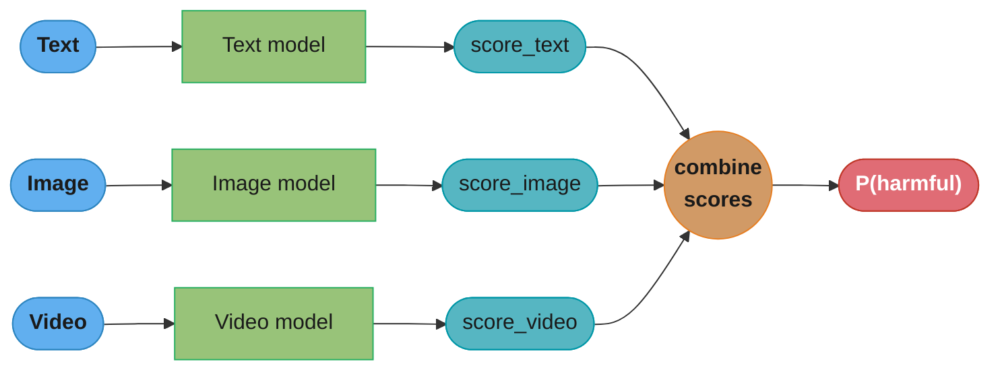
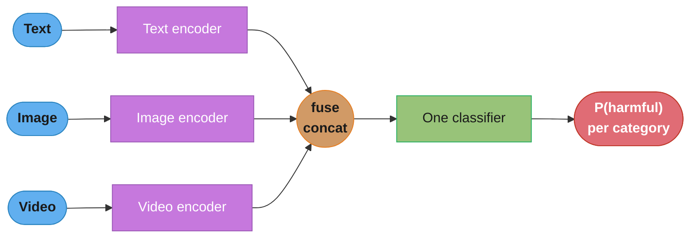
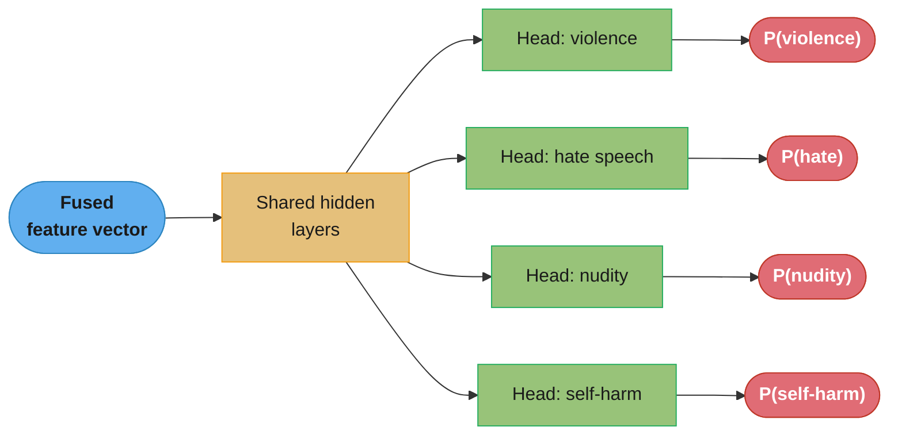
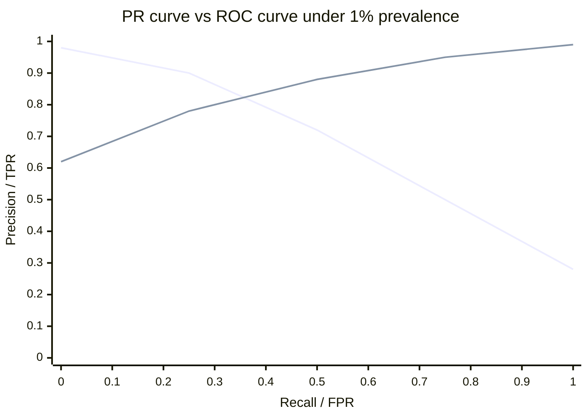
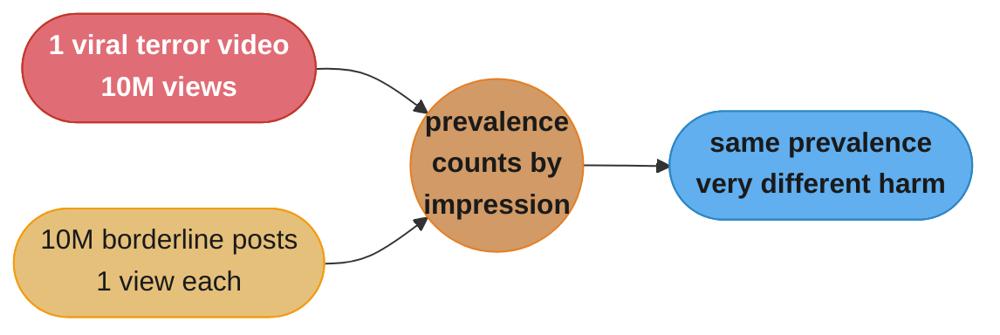
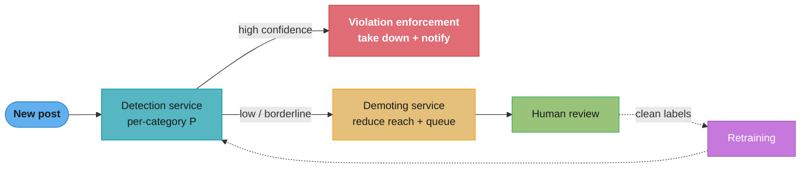
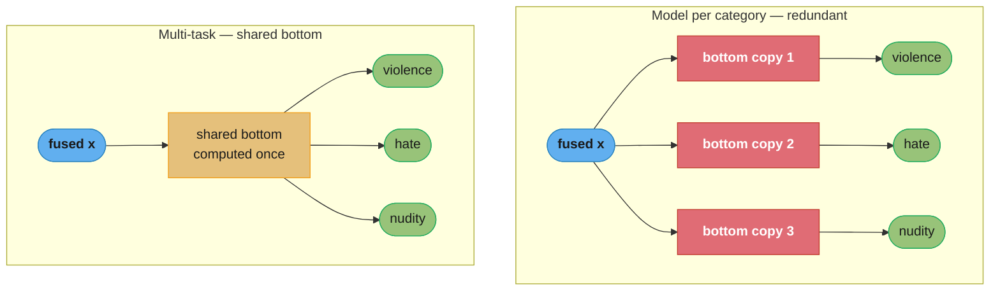

# Chapter 5: Harmful Content Detection

> Ch 5 of 11 · ML System Design Interview (Aminian & Xu) · the integrity chapter — early-vs-late multimodal fusion and multi-task heads

## Chapter Map

This is the book's **integrity** chapter: given a social post that mixes text, images, video,
and links, decide whether it violates policy — and if so, *which* policy. The chapter is built
around two design decisions that every interviewer probes. First, **how do you combine the
modalities?** The book argues for **early fusion** (fuse the per-modality embeddings into one
vector, then classify once) over **late fusion** (one model per modality, combine their scores)
because only early fusion can catch a **harmful meme** — a benign image plus benign text whose
*combination* is harmful. Second, **how do you produce a per-category verdict?** The book rejects
a single binary classifier, N per-category models, and a shared multi-label head in favor of a
**multi-task classifier**: shared bottom layers feeding one task-specific head per harm category.

The rest of the chapter instantiates the standard 7-step framework: encode each modality with a
pretrained model (DistilmBERT for text, CLIP/SimCLR for images, VideoMoCo for video), train on
**noisy user reports** but evaluate on **clean human labels**, measure quality with **PR-AUC per
category** offline and **prevalence / proactive rate / valid-appeals** online, and serve through a
detection service that fans out to a **demoting** path (borderline → reduce reach + human review)
and a **violation-enforcement** path (high confidence → take down + notify).

**TL;DR:**
- **Early fusion beats late fusion here** because harm is often cross-modal (the meme argument);
  late fusion also needs expensive per-modality labels.
- **Multi-task** (shared bottom + per-category heads) beats a single binary classifier
  (no category), model-per-category (redundant, data-hungry), and multi-label (inflexible
  thresholds) — it shares computation, needs less labeled data per task, and allows per-category
  thresholds.
- **Train on noisy natural labels (reports), evaluate on clean hand labels.** Accuracy is useless
  under <1% prevalence; use **PR-AUC per category**.
- **Prevalence** (harmful impressions / total impressions) is the headline online metric, but its
  **blind spot** is severity and reach — one viral terror video and one low-reach borderline post
  count the same per impression.

## The Big Question

> "A single post can carry meaning across text, image, and video at once — and harm can live in
> the *combination* no single modality reveals. How do I fuse the modalities so I don't miss the
> harmful meme, produce a verdict per policy category without training N separate models, and do
> it at billions-of-posts-a-day scale where truly harmful content is under 1% of everything?"

Analogy: a human moderator does not read the caption, then look at the photo, then watch the clip
in three sealed rooms and mail three verdicts to a fourth person who averages them. They take the
whole post in at once, because "kitchen knife" + "photo of a person" + "you're next tomorrow"
means something none of the three parts mean alone. **Early fusion is the machine version of
looking at the whole post at once; late fusion is the three-sealed-rooms version.** The chapter is
mostly an argument for looking at the whole post — then a careful accounting of what it costs to
label, evaluate, and enforce at scale.

---

## 5.1 Clarifying Requirements

The book opens, as every design chapter does, by narrowing an impossibly broad prompt ("detect
harmful content") into a scoped ML problem.

### Harmful content vs bad actors — the scope cut

Integrity work splits into two very different problems:

- **Harmful content** — a *piece of content* violates policy: a violent image, a hate-speech
  caption, a self-harm video, misinformation. The unit of decision is the **post**.
- **Harmful acts / bad actors** — an *account or actor* behaves maliciously: fake accounts, spam
  rings, coordinated inauthentic behavior, account takeover, bot farms. The unit of decision is
  the **account or the pattern of behavior across many posts**.

The book **scopes this chapter to harmful content** and treats bad actors as a separate system
(revisited in Other Talking Points). This matters: a content classifier that scores one post in
isolation is architecturally different from a graph/behavioral model that scores an actor over
time.

### The categories of harm

Harmful content is not one label — the platform enforces many policies:

- Violence and incitement
- Nudity and sexual content
- Hate speech
- Bullying and harassment
- Self-harm and suicide
- Misinformation
- Spam
- Terrorism / dangerous organizations

The design must decide whether to emit a single "harmful/not" bit or a **per-category** verdict.
The book requires **per-category** output — driving the multi-task architecture in 5.2.

### Posts are multimodal

A post is not a string. It can contain **text, an image, a video, an external link, and a stream
of comments and reactions**. Any subset may be present. Harm can live in any one modality *or in
the combination* — the single most important requirement in the chapter, because it forces the
fusion decision.

### Additional clarifications the candidate should raise

| Question to ask | Book's answer / assumption |
|-----------------|----------------------------|
| Do we explain *which* category to the user? | Yes — needed for transparency (notify the author why), for appeals, and for routing to the right enforcement policy. |
| Multilingual? | Yes — a global platform. Text encoders must be multilingual (drives DistilmBERT). |
| Latency budget? | Near-real-time is desirable so harmful content is caught before it spreads, but the system tolerates some delay (unlike an ad auction); batch + streaming both exist. |
| Scale? | Billions of posts per day; harmful content is a tiny fraction (<1%) → severe class imbalance. |
| Human review capacity? | Finite and expensive — the ML must **prioritize** what humans see, not replace them. |
| Do we act automatically? | Yes for high-confidence; low-confidence is demoted and queued for humans. |

**Functional requirement (crisp):** given a multimodal post, output a probability per harm
category, then automatically enforce (take down / demote) and explain the decision to the user,
while feeding uncertain cases to human reviewers.

---

## 5.2 Frame the Problem as an ML Task

### ML objective

Translate the business objective ("keep the platform safe / reduce harmful content people see")
into a measurable ML objective: **predict the probability that a post is harmful, per category.**

- **Input:** a multimodal post (text + image + video + links + author metadata + comments).
- **Output:** a probability for each harm category, e.g. `P(violence)=0.03, P(hate)=0.81,
  P(nudity)=0.01, …`.

This is a **classification** problem. The two hard sub-decisions are (a) how to fuse the
modalities and (b) how to structure the classifier to produce per-category output.

### Multimodal fusion — early vs late (the chapter's first signature argument)

The system must turn several modality-specific representations into one decision. Two schools:

#### Late fusion

Train a **separate model per modality** — a text model, an image model, a video model — each
producing its own harmfulness score, then **combine the scores** (average, weighted sum, or a
small meta-model) into the final decision.



Caption: late fusion decides each modality in isolation and only merges the *numbers* at the end —
so it never sees the pixels and the words together, which is exactly where a harmful meme hides.

**Pros of late fusion:** each modality model is independent — trained, versioned, and served
separately; you can swap the image model without retraining the rest.

**Cons (why the book rejects it):**
1. **Misses cross-modal harm.** The final combiner sees only three scores, not the raw
   interaction. A **benign image** ("a photo of a doorway") plus **benign text** ("we know where
   you live") is a **harmful meme** — a threat — that each unimodal model scores as safe, so any
   average of safe scores is safe. Late fusion is structurally blind to this.
2. **Needs per-modality labels.** To train the text model you need labels for whether the *text
   alone* is harmful; likewise per image and video. That is far more expensive than one label per
   post — a human would have to attribute harm to a specific modality, which is often impossible
   for combination-harm.

#### Early fusion

Encode each modality into an embedding, **concatenate/fuse the embeddings into one unified
representation first**, then run **one classifier** over the fused vector.



Caption: early fusion joins the modality embeddings *before* the classifier, so a single model can
learn that "this image + this caption together = threat" even when each part is individually
benign — the cross-modal interaction the meme depends on.

**Pros (why the book chooses early fusion):**
1. **Captures cross-modal interactions** — the classifier sees all modalities jointly and can
   learn combination-harm (the harmful meme).
2. **One training set, one label per post** — you label whether the *post* is harmful, not each
   modality; dramatically cheaper labeling.
3. **One model to train, tune, and serve** for the fusion+classification stage.

**Cons (acknowledged):** if a modality is missing you must handle a gap in the fused vector
(zero-fill / learned "missing" embedding); a single strongly-harmful modality can be diluted by
benign others in the fused representation; and the encoders are large, so the fused input is
high-dimensional.

**Book's choice: early fusion**, primarily for the cross-modal-harm and cheaper-labeling reasons.

### Architecture options for producing a per-category verdict (the second signature argument)

Given early-fused features, how do we emit a probability *per category*? Four options:

| Option | How it works | Verdict |
|--------|--------------|---------|
| **1. Single binary classifier** | One sigmoid: harmful vs not. | Simplest, but **cannot say which category** — fails the transparency requirement and can't route to the right enforcement policy. |
| **2. One binary classifier per category** | N independent models, one per harm type. | Explains category, but **redundant computation** (N forward passes, N copies of the shared feature work), and **each needs its own labeled dataset** — data-hungry and expensive. |
| **3. Single multi-label classifier** | Shared network, one output layer with N sigmoids, trained with one combined loss. | One model, shares computation — but **inflexible**: all categories share the exact same representation and are entangled in one loss/threshold structure; hard to tune or add a category independently. |
| **4. Multi-task classifier** | Shared bottom layers + one **task-specific head** per category, each head its own sub-network and its own loss (summed). | **Book's choice.** |

#### Why multi-task wins

- **No redundant computation** — the expensive shared bottom (fusion + shared hidden layers) runs
  **once**; only the small per-category heads are separate. Contrast with model-per-category, which
  recomputes everything N times.
- **Less labeled data per task** — the shared bottom is trained jointly across all categories, so
  a task with little data (e.g. self-harm) borrows representation learned from data-rich tasks
  (e.g. nudity). This transfer is the core benefit of multi-task learning.
- **Per-category thresholds and tuning** — because each category has its own head and its own loss,
  you can set a **different decision threshold per category** (nudity might act at 0.5, terrorism
  at a very low 0.1 because the cost of a miss is catastrophic) and even give a category more
  head-layers without disturbing the others.
- **Extensible** — add a new category by adding a head and fine-tuning, rather than retraining a
  monolithic multi-label output.

**Multi-task vs multi-label — the precise distinction interviewers want:** a multi-label
classifier is a *single* output layer with multiple outputs sharing one representation and one loss;
a multi-task classifier is *multiple separate heads* (each potentially several layers), each with
its **own loss**, summed into the total. Multi-task keeps the tasks structurally decoupled at the
top — separate gradients, separate thresholds, separate extensibility — while still sharing the
expensive bottom.



Caption: the multi-task shape — one expensive shared bottom computed once, then cheap per-category
heads each with its own loss and its own threshold, so a rare category rides on the shared
representation while keeping an independent decision boundary.

---

## 5.3 Data Preparation

### Data sources

Three logical entities, as in every recsys/integrity chapter:

- **Users** — user ID, demographics (age, gender, location), account age, and crucially the
  author's **violation history** (how many prior takedowns).
- **Posts** — post ID, author ID, the multimodal payload (text, image, video, links), timestamp,
  and language.
- **User–post interactions** — likes, shares, comments, and **reports/flags** (the source of
  natural labels, see 5.4).

### Feature engineering — one encoder per modality, then fuse

The book uses **pretrained encoders** per modality (not trained from scratch) and fuses their
outputs. Concrete choices:

| Modality | Preprocessing | Encoder (book's pick) | Why |
|----------|---------------|-----------------------|-----|
| **Text** | Normalize (lowercase, strip, Unicode NFKC), tokenize | **DistilmBERT** (distilled multilingual BERT) | Multilingual (global platform) and **distilled** → smaller and faster, important given latency and billions of posts. |
| **Image** | Resize, scale pixels, z-score normalize, RGB | **CLIP visual encoder** or **SimCLR** | Strong general visual representations from contrastive pretraining; no need for labeled harm data to get the embedding. |
| **Video** | Decode + sample frames, resize, normalize | **VideoMoCo** | Self-supervised video representation; captures motion/temporal cues a frame model misses. |
| **Post metadata** | — | Numeric/categorical features | Author violation count, account age (older / clean accounts less likely harmful). |
| **Context** | — | Numeric/categorical | Time of day, device, post language. |
| **Comments** | Encode each, **aggregate (average) embeddings** | Same text encoder | Comments often reveal harm the post text hides (pile-ons, coded language). |
| **Reactions** | — | Numeric | Counts of likes/shares/reports as scalar features; a spike in reports is signal. |

All of these are concatenated into **one fused feature vector** — this *is* the early fusion of
5.2. The vector is what the shared hidden layers consume.

**Why pretrained + frozen (or lightly fine-tuned) encoders:** harmful examples are rare, so
training a text/image/video encoder from scratch on in-domain harm data is infeasible; leveraging
encoders pretrained on huge unlabeled corpora (CLIP, SimCLR, VideoMoCo — all self-supervised) gives
strong representations, and only the fusion + shared layers + heads need to be trained on the
scarce labels.

---

## 5.4 Model Development

### The model

Fused feature vector → **shared hidden layers** → **N per-category heads**, each a small classifier
emitting a probability. This is the multi-task network from 5.2 realized on the 5.3 features.

### Constructing the training dataset — natural vs hand labeling

Where do labels come from? Two sources with opposite trade-offs:

| Labeling method | Speed / volume | Accuracy | Use |
|-----------------|----------------|----------|-----|
| **Natural labeling** (user reports as labels) | Fast, huge volume, free | **Noisy** — users misreport, report-bomb rivals, disagree on policy, miss real harm | **Training** (volume matters more than per-label purity) |
| **Hand labeling** (trained reviewers) | Slow, expensive, low volume | **Accurate** — reviewers apply the actual policy | **Evaluation** (a trustworthy test set must be clean) |

The book's strategy: **train on the noisy natural labels** (you need volume to learn a
billions-of-posts distribution) and **evaluate on the clean hand labels** (you need an accurate
yardstick). Using reports for the test set would let label noise flatter or unfairly punish the
model; using hand labels for all training would starve it of data.

**A subtlety:** report-derived labels are also **biased** — content that is reported is content
that was *seen and objected to*, so proactively-caught harm (removed before anyone could report it)
is under-represented, and popular harmful content is over-represented. This is a selection bias the
candidate should name.

### Loss function

Each head outputs a probability; each uses **binary cross-entropy** against its category label. The
**total loss is the sum of the per-task losses**:

```
L_total = Σ_c  BCE( head_c(x), y_c )      for each category c
```

**The training challenge the book highlights:** the per-task datasets are **imbalanced and of very
different sizes**. Overall, harmful content is <1% of posts, and *within* harm, nudity may have
orders of magnitude more examples than self-harm. Naively summing losses lets data-rich, easy tasks
dominate the gradient and starve the rare, high-stakes tasks. Remedies:

- **Class weighting / focal loss** inside each head to up-weight the rare positive class.
- **Resampling** — oversample positives (or undersample the flood of negatives) per task.
- **Loss weighting across tasks** — scale each task's loss so a small-but-critical task isn't
  drowned out.

### A broken → fixed walkthrough

**Broken:** a team trains a single **multi-label** classifier on **report labels only**, evaluates
with **accuracy**, and ships. In production it "achieves 99.4% accuracy" but misses almost all real
harm.

Why it's broken, three compounding faults:
1. **Accuracy under <1% prevalence** — predicting "not harmful" for everything already scores
   ~99%+, so 99.4% means almost nothing about catching harm.
2. **Report labels for evaluation** — the test set is as noisy and biased as the training set, so
   the metric doesn't reflect true policy compliance.
3. **Multi-label with one shared threshold** — terrorism (catastrophic if missed) and spam (mild)
   are forced to share a decision boundary, so tuning terrorism recall tanks spam precision.

**Fixed:** switch to **multi-task** (per-category heads → per-category thresholds), **evaluate on
hand-labeled data with PR-AUC per category** (not accuracy), and set terrorism's threshold far
lower than spam's. Now the metric reflects reality and each category is tuned to its own
miss-cost — the same features and encoders, a correct head/metric/threshold structure.

---

## 5.5 Evaluation

### Offline metrics

- **Why accuracy misleads:** with harmful content under 1%, a trivial "always safe" classifier
  scores >99% accuracy while catching nothing. Accuracy is dominated by the majority (safe) class.
- **Precision-Recall (PR) curve + PR-AUC, per category** — PR focuses entirely on the positive
  (harmful, minority) class, so it is the right offline metric under heavy imbalance. Computed
  **per category** because each has a different base rate and cost.
- **ROC curve + ROC-AUC** — reported too, but ROC-AUC can look deceptively good under extreme
  imbalance (the huge true-negative count inflates it), which is why PR-AUC is the primary offline
  metric here.



Caption: the falling line is a per-category **PR** curve (precision drops sharply as you push
recall — the honest picture under imbalance); the rising line is the same model's **ROC** curve,
which looks near-perfect because the massive true-negative pool inflates it — why the book leans on
PR-AUC.

### Online metrics

The offline/online gap is real (a model can improve PR-AUC yet not reduce real-world harm), so the
book tracks business-tied online metrics:

- **Prevalence** — the headline integrity metric: **harmful impressions / total impressions**, i.e.
  the fraction of *content views* that were of harmful content that slipped through. Lower is
  better; this is what platforms like Meta publish.
- **Harmful impressions (absolute count)** — the raw number of harmful views, complementing the
  ratio.
- **Valid appeals rate** — of the posts we took down, how many appeals were **upheld** (we were
  wrong). Measures **over-enforcement / false positives** — a rising valid-appeals rate means the
  model is too aggressive.
- **Proactive rate** — fraction of harmful content the system caught **before any user reported
  it** (proactive vs reactive detection). A high proactive rate means harm is removed before it
  spreads; this is a key public integrity KPI.
- **User reports per category** — volume and trend of reports per harm type, a leading indicator of
  emerging harm the model isn't catching.

#### Prevalence's blind spot

Prevalence counts every harmful impression **equally**. It therefore ignores:

- **Severity** — a beheading video and a mildly misleading caption both count as "one harmful
  impression" per view; prevalence treats them the same.
- **Reach concentration** — one viral terror video seen by 10 million people and 10 million
  low-reach borderline posts each seen once produce the *same prevalence*, yet the former is
  vastly more damaging.

So prevalence must be **paired with severity-weighting and the absolute harmful-impression count**
(and category breakdowns) to be meaningful. Optimizing prevalence alone can push a team to clean up
lots of trivial low-reach content while a few catastrophic viral items dominate real harm.



Caption: prevalence's blind spot in one picture — two worlds with identical harmful-impression
ratios but wildly different real damage, which is why the book pairs prevalence with severity and
absolute counts.

---

## 5.6 Serving

### The prediction pipeline

At serving time a post flows through the encoders → early fusion → shared layers → per-category
heads → per-category probabilities. Those probabilities are consumed by **two downstream services**,
chosen by **confidence**:

- **Demoting service** (low / borderline confidence) — the model is unsure. Rather than remove,
  **reduce the post's distribution** (downrank it, show it to fewer people) and **add it to a queue
  for human review**. This limits potential harm while avoiding wrongful takedowns of ambiguous
  content.
- **Violation-enforcement service** (high confidence) — the model is confident it violates policy.
  **Take the post down immediately and notify the author**, telling them which category and policy
  was violated (the transparency requirement from 5.1).

Human reviewers process the demoted queue; their verdicts become **fresh, clean labels** that feed
back into training (active learning / human-in-the-loop). This closes the loop: uncertain content
is exactly the content most valuable to label, so routing it to humans both protects users now and
improves the model later.



Caption: the two-consumer enforcement fan-out — confident violations are removed automatically,
borderline posts are demoted and sent to humans, and the humans' clean verdicts loop back as
training labels, so uncertainty is turned into both immediate safety and future accuracy.

### Batch vs online

Detection runs as content is created (near-real-time for the enforcement path) but also as **batch
sweeps** over already-published content when policies or models update (re-scoring the backlog).
Encoder embeddings can be precomputed and cached so the same media isn't re-encoded on every pass.

---

## 5.7 Other Talking Points

The chapter closes with extensions an interviewer may push on:

- **Humans-in-the-loop / active learning** — prioritize *which* uncertain posts humans label
  (highest expected information or highest potential harm) rather than a random queue.
- **Borderline content policy** — for content that is distasteful but not clearly violating, the
  right action is often **reduce distribution, not remove** — the demoting path is policy, not just
  a confidence fallback.
- **Temporal context** — a single post may look benign; a **sequence** of a user's posts, or
  coordinated posting across accounts, reveals harm. Modeling post history / behavioral sequences
  catches campaigns a per-post model misses (and bridges toward the bad-actor system).
- **Efficient transformers for latency** — the encoders are heavy; **linear / efficient attention**
  variants cut inference cost so detection can run closer to real time at scale.
- **Per-category threshold calibration** — because miss-costs differ enormously across categories,
  each head's threshold is tuned separately (terrorism far more sensitive than spam); calibration
  ensures the probabilities are comparable.
- **Fairness across languages and groups** — the model must not over- or under-enforce for
  particular languages, dialects, or demographic groups; multilingual encoders help but fairness
  must be measured per slice.
- **Bad actors / fake accounts** — explicitly a **separate system** (account/graph/behavioral
  models), out of scope here but architecturally adjacent.

---

## Visual Intuition

### The harmful meme — why fusion order matters

```
                     IMAGE
                 benign        harmful
              +-----------+-----------+
       benign |   SAFE    |  harmful  |
  TEXT        |           | (image)   |
              +-----------+-----------+
      harmful |  harmful  |  harmful  |
              | (text)    |           |
              +-----------+-----------+

  Late fusion sees only the row-max and column-max scores, so it fires
  only in the shaded cells where a SINGLE modality is already harmful.

                     IMAGE
                 benign        harmful
              +-----------+-----------+
       benign |  harmful  |  harmful  |   <-- top-left flips to harmful:
  TEXT        | (MEME!)   |           |       benign photo + benign caption
              +-----------+-----------+       whose COMBINATION is a threat
      harmful |  harmful  |  harmful  |
              +-----------+-----------+

  Early fusion sees the joint (text, image) cell, so it can learn that the
  benign-benign corner is actually harmful — the meme. Late fusion cannot:
  averaging two "safe" scores is always "safe".
```

Caption: the only cell where the two approaches disagree is the benign-text × benign-image corner —
the harmful meme. Late fusion, which only ever combines per-modality *scores*, can never light that
corner up; early fusion, which sees the *joint* input, can. This one cell is the whole argument for
early fusion.

### Multi-task vs the alternatives — computation shape



Caption: model-per-category recomputes the whole expensive bottom N times (red), while multi-task
computes the shared bottom once (gold) and branches into cheap heads — the same reason multi-task
also needs less labeled data per task, since the shared bottom learns from all categories at once.

---

## Key Concepts Glossary

- **Harmful content vs bad actors** — content that violates policy (unit = post) vs malicious
  accounts/behavior (unit = account); this chapter scopes to harmful content.
- **Harm category** — a specific policy type (violence, hate speech, nudity, self-harm,
  misinformation, spam, terrorism…); the system emits a probability per category.
- **Multimodal post** — a post combining text, image, video, links, comments, and reactions.
- **Early fusion** — fuse per-modality embeddings into one vector *before* classifying; captures
  cross-modal harm; the book's choice.
- **Late fusion** — one model per modality, combine their scores; misses cross-modal harm and needs
  per-modality labels.
- **Harmful meme** — benign text + benign image whose combination is harmful; the canonical case
  early fusion catches and late fusion cannot.
- **Single binary classifier** — harmful/not; can't name the category.
- **Model per category** — N binary classifiers; explains category but redundant and data-hungry.
- **Multi-label classifier** — one shared network, one output layer with N sigmoids, one loss;
  inflexible thresholds.
- **Multi-task classifier** — shared bottom + per-category heads, each with its own loss and
  threshold; the book's choice.
- **Multi-task vs multi-label** — separate heads with separate losses (multi-task) vs one output
  layer with one loss (multi-label).
- **DistilmBERT** — distilled multilingual BERT; the text encoder (fast + multilingual).
- **CLIP / SimCLR** — contrastive-pretrained image encoders.
- **VideoMoCo** — self-supervised video encoder.
- **Natural labeling** — using user reports as labels; fast, high-volume, noisy → training.
- **Hand labeling** — trained reviewers label; accurate, slow → evaluation.
- **Per-task binary cross-entropy (summed)** — the multi-task loss; one BCE per head, summed.
- **Class imbalance (across and within tasks)** — harm <1% overall, and categories differ in size;
  handled by weighting/resampling/focal loss.
- **PR curve / PR-AUC** — precision-recall metric focused on the minority class; primary offline
  metric under imbalance.
- **ROC / ROC-AUC** — secondary; inflated by huge true-negative counts under imbalance.
- **Prevalence** — harmful impressions / total impressions; headline online integrity metric.
- **Prevalence blind spot** — ignores severity and reach; must be paired with severity-weighting
  and absolute counts.
- **Proactive rate** — fraction of harmful content caught before any user report.
- **Valid appeals rate** — share of takedowns overturned on appeal; measures over-enforcement.
- **Demoting service** — low-confidence path: reduce reach + queue for human review.
- **Violation-enforcement service** — high-confidence path: take down + notify author.
- **Human-in-the-loop** — reviewers' clean verdicts feed back as training labels.

---

## Tradeoffs & Decision Tables

### Fusion strategy

| | Late fusion | Early fusion (book's choice) |
|---|---|---|
| Cross-modal harm (meme) | ✗ missed | ✓ captured |
| Labeling cost | High (per-modality labels) | Low (one label per post) |
| Model independence | ✓ swap one modality freely | ✗ coupled |
| Missing modality | Natural (drop a score) | Must impute/zero-fill |
| Single strong-harm modality | Preserved in its own score | May be diluted in fused vector |

### Classifier architecture

| Option | Category output | Compute | Labeled data need | Threshold flexibility |
|--------|:---:|:---:|:---:|:---:|
| Single binary | ✗ | Low | Low | n/a |
| Model per category | ✓ | High (Nx bottom) | High (per category) | ✓ |
| Multi-label | ✓ | Low (shared) | Medium | ✗ (entangled) |
| **Multi-task** | ✓ | **Low (shared bottom)** | **Low (shared transfer)** | ✓ (per head) |

### Labeling

| | Natural (reports) | Hand (reviewers) |
|---|---|---|
| Volume | Huge | Small |
| Cost | Free | Expensive |
| Accuracy | Noisy + biased | Clean |
| Used for | **Training** | **Evaluation** |

### Metrics

| Metric | Type | Watch out for |
|--------|------|---------------|
| Accuracy | offline | Useless under <1% prevalence |
| PR-AUC (per category) | offline | Primary; per-category base rates differ |
| ROC-AUC | offline | Inflated by true negatives under imbalance |
| Prevalence | online | Blind to severity + reach |
| Proactive rate | online | High = harm removed before it spreads |
| Valid appeals rate | online | Rising = over-enforcement |

---

## Common Pitfalls / War Stories

- **Late fusion silently misses harmful memes.** Because the combiner sees only per-modality
  scores, a benign image + benign caption threat scores "safe + safe = safe." Teams that pick late
  fusion for engineering convenience discover this only when a coordinated meme campaign spreads.
  The fix is early fusion, which sees the joint input.
- **Reporting accuracy as the headline number.** With harmful content under 1%, "99.4% accuracy"
  is what an always-safe classifier gets. Use **PR-AUC per category**; accuracy hides total failure
  to catch harm.
- **Evaluating on report labels.** User reports are noisy and biased (report-bombing, missed harm,
  over-representation of popular content), so a test set built from them doesn't measure real policy
  compliance. Keep a **hand-labeled** eval set even though it's expensive.
- **One shared threshold for all categories (multi-label trap).** Terrorism (catastrophic miss)
  and spam (mild) cannot share a decision boundary. Multi-task heads let each category have its own
  threshold; a single multi-label output forces a bad compromise.
- **Optimizing prevalence alone.** Prevalence weights every harmful view equally, so a team can
  drive it down by cleaning up low-reach trivia while a handful of viral, high-severity items do
  most of the real damage. Pair prevalence with **severity-weighting and absolute harmful-impression
  counts**.
- **Auto-removing borderline content.** Taking down uncertain posts spikes the valid-appeals rate
  and erodes user trust. Route low-confidence to the **demoting** path (reduce reach + human review),
  not straight to removal.
- **Ignoring per-task imbalance in the summed loss.** If a data-rich task (nudity) dominates the
  gradient, rare high-stakes tasks (self-harm) never learn. Weight/resample per task so the summed
  loss doesn't drown small tasks.
- **Training encoders from scratch on scarce harm data.** Harmful examples are rare; use
  **pretrained** DistilmBERT/CLIP/VideoMoCo encoders and train only fusion + heads.

---

## Real-World Systems Referenced

Facebook / Meta (content-integrity systems, prevalence as a published metric, proactive-rate
reporting); multimodal encoders — **DistilmBERT** (distilled multilingual BERT) for text, **CLIP**
and **SimCLR** for images, **VideoMoCo** for video; the general integrity split between harmful
content and coordinated bad actors that large social platforms operate as separate systems.

---

## Summary

Harmful content detection is a **multimodal, multi-category classification** problem at
billions-of-posts scale where truly harmful content is under 1%. The chapter's two load-bearing
decisions are **fusion** and **classifier structure**. For fusion, the book chooses **early fusion**
— fuse the per-modality embeddings into one vector before classifying — over **late fusion** (one
model per modality, combine scores), because only early fusion can catch a **harmful meme** (benign
image + benign text whose combination is harmful) and because it needs only one label per post
instead of per-modality labels. For structure, it chooses a **multi-task classifier** — a shared
bottom feeding one per-category head — over a single binary classifier (no category), N per-category
models (redundant compute, data-hungry), and a multi-label head (inflexible thresholds); multi-task
shares computation, transfers representation to data-poor tasks, and gives each category its own
threshold.

The features are per-modality pretrained encoders — **DistilmBERT** (text, multilingual + fast),
**CLIP/SimCLR** (image), **VideoMoCo** (video) — plus author history, context, comments, and
reaction counts, all concatenated. The model **trains on noisy user reports** (volume) and
**evaluates on clean hand labels** (accuracy), with a **summed per-task binary cross-entropy** loss
that must be balanced across differently-sized tasks. Offline, **accuracy is useless under
imbalance**, so quality is measured by **PR-AUC per category** (ROC-AUC secondary). Online, the
headline metric is **prevalence** (harmful impressions / total), complemented by **proactive rate**,
**valid-appeals rate**, and absolute harmful-impression counts — because prevalence's **blind spot**
is severity and reach. Serving fans the detection score into a **demoting** path (borderline →
reduce reach + human review) and a **violation-enforcement** path (confident → take down + notify),
with human verdicts looping back as training labels.

---

## Interview Questions

**Q: Why does the book choose early fusion over late fusion for harmful content detection?**
Because only early fusion can catch cross-modal harm like a harmful meme, and it needs just one label per post. Late fusion runs a separate model per modality and combines their scores, so it sees only per-modality numbers and can never learn that a benign image plus a benign caption together form a threat. Early fusion concatenates the modality embeddings before the classifier, letting one model learn the joint interaction — and you only have to label whether the whole post is harmful, not each modality separately.

**Q: Explain the harmful meme argument concretely.**
A harmful meme is a benign image plus benign text whose combination is harmful, such as a photo of a doorway with a caption implying a threat. Each unimodal model scores its part as safe, so late fusion, which averages per-modality scores, outputs safe. Early fusion sees the joint (image, text) input and can learn that this specific benign-benign combination is a threat. This single case — the corner where both modalities are individually benign — is the whole reason the book prefers early fusion.

**Q: What is the difference between a multi-task classifier and a multi-label classifier?**
A multi-label classifier has one shared output layer of N sigmoids under one loss, while a multi-task classifier has separate per-category heads, each with its own loss, summed together. Multi-task keeps the categories structurally decoupled at the top — separate gradients, separate thresholds, independent extensibility — while sharing the expensive bottom layers. Multi-label entangles all categories in one representation and threshold structure, making per-category tuning hard.

**Q: Why is a multi-task classifier better than training one binary model per category?**
Because multi-task computes the expensive shared bottom once and only branches into cheap per-category heads, whereas model-per-category recomputes the whole network N times. Multi-task also needs less labeled data per task: the shared bottom learns from all categories jointly, so a data-poor task like self-harm borrows representation from data-rich tasks like nudity. And each head still gets its own threshold. Model-per-category gives per-category output too but at N times the compute and N separate datasets.

**Q: Why can't the system just use a single binary harmful-vs-not classifier?**
Because a single binary classifier can't say which category was violated, which the design requires. Per-category output is needed to notify the author of the specific policy broken (transparency), to route to the correct enforcement rule, and to set different thresholds per category. A single harmful/not bit collapses terrorism and spam into one decision, so it can neither explain nor tune per policy.

**Q: What is prevalence and what is its blind spot?**
Prevalence is harmful impressions divided by total impressions — the fraction of content views that were of harmful content that slipped through. Its blind spot is that it weights every harmful view equally, ignoring severity and reach: one viral terror video seen by ten million people and ten million low-reach borderline posts seen once each produce the same prevalence despite hugely different real harm. So prevalence must be paired with severity-weighting and absolute harmful-impression counts.

**Q: Why does accuracy mislead here, and what offline metric replaces it?**
Because harmful content is under 1% of posts, a trivial always-safe classifier scores over 99% accuracy while catching nothing. The replacement is the precision-recall curve and PR-AUC computed per category, which focus entirely on the minority harmful class. ROC-AUC is reported too but is inflated by the enormous true-negative count under this imbalance, so PR-AUC is the primary offline metric.

**Q: Why train on user reports but evaluate on human-labeled data?**
Because reports give huge, free, but noisy volume ideal for training, while a trustworthy test set must be clean, which only trained reviewers provide. User reports are noisy and biased — report-bombing, disagreement on policy, missed harm, over-representation of popular content — so using them for evaluation would give an untrustworthy metric. Hand labeling is too expensive to train on at scale but is exactly what you want for the yardstick.

**Q: What is the proactive rate and why does it matter?**
The proactive rate is the fraction of harmful content the system catches before any user reports it. It matters because content removed proactively is removed before it spreads and does damage, whereas reactive removal happens only after users have already seen and objected to it. A high proactive rate is a key public integrity KPI; it measures how much harm the ML prevents versus how much it merely cleans up after.

**Q: What are the two consumers of the detection service at serving time?**
A demoting service for low-confidence predictions and a violation-enforcement service for high-confidence predictions. The demoting service reduces the post's distribution and queues it for human review rather than removing ambiguous content. The enforcement service takes confident violations down immediately and notifies the author of the category. Human reviewers' verdicts on the demoted queue feed back as clean training labels, closing the loop.

**Q: What is the valid-appeals rate and what does it measure?**
The valid-appeals rate is the share of takedowns that are overturned on appeal, meaning the model was wrong to remove them. It measures over-enforcement, or false positives: a rising valid-appeals rate signals the model is too aggressive and is removing legitimate content. It complements prevalence, which measures under-enforcement (harm that slipped through), so together they bound both error directions.

**Q: Why is scoping to harmful content, not bad actors, a meaningful decision?**
Because a content classifier that scores one post in isolation is architecturally different from a system that scores an account's behavior over time. Harmful content's unit of decision is the post; bad actors (fake accounts, coordinated inauthentic behavior, spam rings) are detected by account-level graph and behavioral models across many posts. The book scopes to content and treats bad actors as a separate system, so the whole design is per-post multimodal classification.

**Q: Which encoders does the book use per modality, and why DistilmBERT for text?**
Text uses DistilmBERT, images use CLIP or SimCLR, and video uses VideoMoCo. DistilmBERT is chosen because it is multilingual — required for a global platform — and distilled, so it is smaller and faster, which matters given the latency budget and billions of posts. All three are pretrained (largely self-supervised), so they give strong representations without needing scarce in-domain harm labels; only the fusion and heads are trained on the labeled data.

**Q: What loss does the multi-task model use, and what is the main training challenge?**
Each head uses binary cross-entropy against its category label, and the total loss is the sum of the per-task losses. The main challenge is that the per-task datasets are severely imbalanced and of very different sizes — harm is under 1% overall, and nudity may have far more examples than self-harm. Naively summing lets data-rich easy tasks dominate the gradient, so you apply class weighting, focal loss, resampling, or per-task loss weights to keep rare high-stakes tasks learning.

**Q: Why does late fusion need per-modality labels, and why is that expensive?**
Because each modality has its own model, you need labels for whether the text alone, the image alone, and the video alone are harmful to train each one. That is far costlier than one label per post: a human must attribute harm to a specific modality, which is often impossible for combination-harm where no single modality is harmful. Early fusion sidesteps this entirely by needing only a single post-level label.

**Q: How does the multi-task design enable per-category thresholds, and why is that important?**
Because each category has its own head with its own loss and output, you can set a different decision threshold per head. This matters because miss-costs differ enormously: terrorism, where a miss is catastrophic, warrants a very low threshold to maximize recall, while spam, where a miss is mild, can use a higher threshold to protect precision. A multi-label classifier with one shared output forces all categories onto one threshold, an unavoidable bad compromise.

**Q: Why does the design explain the harm category to the user?**
Because per-category output is needed for transparency, appeals, and correct enforcement routing. Notifying the author which specific policy they violated is required for a fair, auditable process and lets them appeal meaningfully. It also routes the post to the right enforcement rule, since different categories have different actions. This transparency requirement is a key reason a single binary classifier is insufficient.

**Q: How is multilingual content handled?**
By using a multilingual text encoder, DistilmBERT, so the same model represents text across languages without a separate model per language. This is essential for a global platform. Fairness must then be measured per language slice, since a multilingual encoder can still over- or under-enforce for particular languages or dialects — a point the book raises under fairness.

**Q: How does the human-in-the-loop feedback loop improve the model over time?**
Human reviewers process the demoted (low-confidence) queue, and their clean verdicts become fresh, accurate training labels. This is a form of active learning: uncertain content is exactly the most informative to label, so routing it to humans both protects users now and steadily improves the model. Over time the model's boundary sharpens on the borderline cases it was previously unsure about.

**Q: Why does the book pair the PR curve rather than the ROC curve for evaluation under imbalance?**
Because the PR curve focuses on the positive minority class, while ROC-AUC is inflated by the enormous true-negative pool under extreme imbalance. With harmful content under 1%, a model can look near-perfect on ROC because it trivially classifies the vast safe majority, yet still have poor precision at useful recall. The PR curve exposes that precision drop honestly, so PR-AUC per category is the primary offline metric.

**Q: What is the right action for borderline content that is distasteful but not clearly violating?**
Reduce its distribution rather than remove it — the demoting path is a deliberate policy, not just a confidence fallback. Auto-removing ambiguous content spikes the valid-appeals rate and erodes trust, while leaving it fully distributed spreads potential harm. Demoting downranks it and can queue it for human review, limiting reach without a wrongful takedown. This is why the serving design has a demoting service distinct from enforcement.

---

## Cross-links in this repo

- For the repo's own production-depth treatment of this exact problem, see
  [ml/case_studies/design_harmful_content_detection.md](../../../ml/case_studies/design_harmful_content_detection.md)
  — this chapter summarizes the *book's* framing (early-vs-late fusion, multi-task heads,
  prevalence); the case study is the repo's independent, deeper engineering write-up. Do not treat
  them as duplicates.
- [ml/multi_task_and_multi_objective_learning/README.md](../../../ml/multi_task_and_multi_objective_learning/README.md)
  — shared-bottom multi-task learning, per-task losses, and loss balancing (the 5.2/5.4 core).
- [ml/imbalanced_data_and_leakage_traps/README.md](../../../ml/imbalanced_data_and_leakage_traps/README.md)
  — why accuracy fails under <1% prevalence, PR-AUC, resampling, and class weighting (the 5.5 core).
- [ml/case_studies/cross_cutting/model_calibration_and_thresholding.md](../../../ml/case_studies/cross_cutting/model_calibration_and_thresholding.md)
  — per-category thresholds and probability calibration (5.2 heads + 5.7 threshold tuning).
- [ml/natural_language_processing/README.md](../../../ml/natural_language_processing/README.md)
  — text encoders, multilingual BERT-family models, tokenization (the text modality in 5.3).
- [ml/fairness_and_responsible_ai/README.md](../../../ml/fairness_and_responsible_ai/README.md)
  — measuring and mitigating over/under-enforcement across languages and groups (5.7 fairness).

## Further Reading

- Aminian & Xu, *Machine Learning System Design Interview*, Ch 5 — original text and references.
- Radford et al., "Learning Transferable Visual Models From Natural Language Supervision" (CLIP), 2021.
- Chen et al., "A Simple Framework for Contrastive Learning of Visual Representations" (SimCLR), 2020.
- Sanh et al., "DistilBERT, a distilled version of BERT," 2019 (multilingual variant = DistilmBERT).
- Pan et al., "VideoMoCo: Contrastive Video Representation Learning," 2021.
- Meta / Facebook, Community Standards Enforcement Reports — prevalence and proactive-rate methodology.
