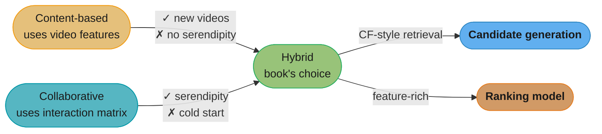
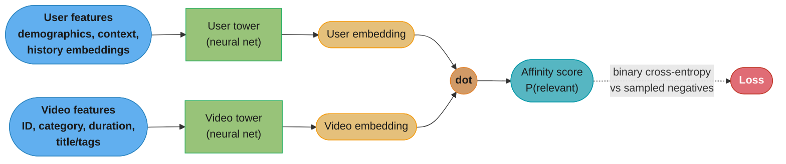
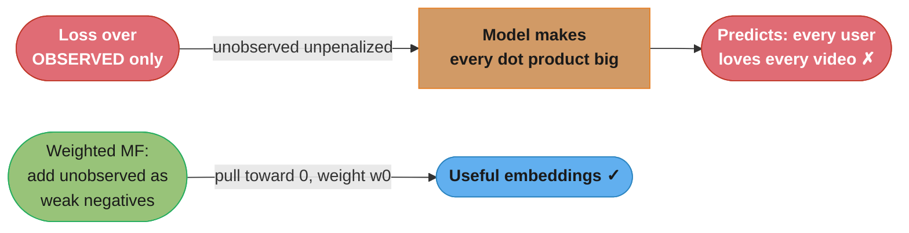
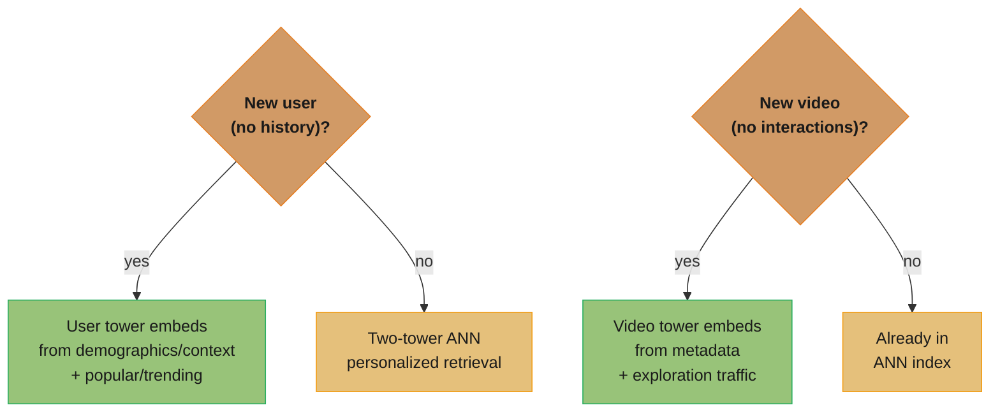

# Chapter 6: Video Recommendation System

> Ch 6 of 11 · ML System Design Interview (Aminian & Xu) · the canonical two-stage recsys — matrix factorization vs two-tower, then ranking and re-ranking

## Chapter Map

This is the book's canonical recommendation chapter and the one interviewers quote most: it builds a
YouTube-style homepage recommender for ~1 billion users and billions of videos under a sub-200 ms
latency budget. The whole design turns on one architectural idea — you **cannot** score billions of
videos per request, so you split the work into a cheap **candidate generation** stage that narrows
billions to a few thousand and an expensive **ranking** stage that scores those few thousand with a
heavy model, then a **re-ranking** stage that applies business rules. The chapter's technical spine
is the head-to-head between two candidate-generation retrievers: **matrix factorization** (classic
collaborative filtering, no features, cold-start-blind) and the **two-tower neural network** (feature-
rich, cold-start-friendly, the book's pick).

**TL;DR:**
- **Framing the ML objective is the highest-leverage decision.** Maximizing clicks invites clickbait,
  completed videos favors short clips, watch time favors long ones — the book optimizes **number of
  relevant videos**, inferred from implicit signals plus explicit likes.
- **Two-stage retrieval is non-negotiable at scale.** Candidate generation (lightweight, high recall,
  ANN over embeddings) → ranking (heavy, high precision, full interaction features) → re-ranking
  (region/freshness/diversity/integrity filters).
- **Matrix factorization vs two-tower is the load-bearing comparison.** MF factorizes the
  user×video feedback matrix into embeddings; **weighted MF** trained with **WALS** is fast and
  parallelizable but uses *no features* and cannot embed a brand-new user or video. The **two-tower**
  network ingests features, so it handles cold start — at higher training and serving cost.
- **Offline recommender metrics systematically mislead** because logged clicks are a biased sample of
  what the *current* system already showed — you can only truly measure a recommender with an online
  A/B test.

## The Big Question

> "I have a billion users, billions of videos, and 200 milliseconds. A model good enough to rank the
> whole catalog is far too slow to run on the whole catalog. How do I recommend well *and* fast — and
> what exactly am I optimizing for, given that every obvious target (clicks, watch time) quietly
> corrupts the product?"

Analogy: recommendation at this scale is a **funnel**, not a single sieve. A fine sieve (the heavy
ranking model) gives you the best ordering but is far too slow to pour a billion videos through. So
you pour the billion through a coarse, fast sieve first (candidate generation) that keeps roughly the
right few thousand, then run only those through the fine sieve. The art is making the coarse sieve
cheap enough to run on everything yet good enough that the video the user would have loved survives
to the fine sieve. Everything in this chapter — MF, two-tower, ANN indexes, cold-start handling — is
about building the two sieves and keeping the funnel honest.

---

## 6.1 Clarifying Requirements

The book opens, as every design chapter does, by pinning down scope before proposing anything. The
interviewer's "design YouTube's video recommendation" is deliberately underspecified; the candidate
must extract the constraints that determine the architecture.

- **Which surface?** The **homepage recommendations** — the personalized grid a user sees on opening
  the app — *not* the "related videos" rail beside a currently-playing video (that is a different,
  item-to-item problem closer to Chapter 9's similar-listings). Homepage recs are personalized to the
  *user*, so the model needs a user representation.
- **Business objective → what does "good" mean?** The stated business goal is **increasing user
  engagement**. This is intentionally vague; §6.2 is where it gets translated into a measurable ML
  objective, and the choice materially changes the product.
- **Personalization.** Yes — recommendations must be personalized. This rules out a purely popularity-
  based ranker as the *whole* answer (though popularity remains a useful candidate source).
- **Scale.** Roughly **1 billion users** and **billions of videos** (tens of billions in the largest
  real systems). Both counts grow continuously and new videos arrive by the hundreds of thousands per
  day, which is precisely why cold start is a first-class concern, not an afterthought.
- **Latency.** End-to-end recommendation must return in well under **200 ms** so the homepage feels
  instant. This budget is the reason a single monolithic model over the full catalog is impossible and
  the two-stage funnel is mandatory.
- **Feedback available.** Both **explicit** feedback (likes/dislikes, "not interested," survey ratings —
  accurate but sparse; most users never click a thumb) and **implicit** feedback (clicks, watch time,
  impressions, shares, searches — abundant but noisy and biased). A production system leans mostly on
  implicit signals because explicit feedback is far too sparse to train on alone.
- **Freshness / continual training.** Interests shift, videos trend and die; the model and its indexes
  must be retrained and rebuilt frequently (the chapter revisits cadence in §6.7).

With scope fixed, the design targets: a personalized homepage recommender, optimizing engagement
(operationalized as "relevant videos watched"), serving 1 B users over billions of videos within
~200 ms, using implicit-heavy feedback, robust to constant cold-start churn.

---

## 6.2 Frame the Problem as an ML Task

### Defining the ML objective — the chapter's most-quoted decision

"Increase engagement" is a *business* objective; a model needs a *measurable* ML objective. The book
lays out four candidate objectives and reasons through the failure mode of each — this is the passage
interviewers most often probe, because the choice silently shapes the whole product.

| Candidate ML objective | What it optimizes | Failure mode |
|------------------------|-------------------|--------------|
| Maximize **clicks** | P(user clicks the thumbnail) | **Clickbait** — sensational thumbnails/titles win; users click, feel cheated, trust erodes |
| Maximize **completed videos** | P(user watches to the end) | Biases hard toward **short videos**; a great 40-minute video looks worse than a mediocre 30-second one |
| Maximize **total watch time** | Sum of minutes watched | Biases toward **long videos** and can encourage doom-scrolling / autoplay rabbit holes |
| Maximize **number of relevant videos** | Count of videos the user finds genuinely relevant | **Book's choice** — aligns best with long-term engagement; needs a definition of "relevant" |

The book picks **maximize the number of relevant videos**. "Relevant" is defined operationally: a
video is relevant if the user shows a positive implicit signal (watched a large fraction, e.g.
watched past a threshold) **or** an explicit positive signal (liked/shared). This objective avoids the
degenerate behaviors of the other three: it does not reward a click the user immediately regrets
(clickbait), does not punish long videos (completion), and does not chase raw minutes (watch time). It
does demand a labeling rule for "relevant," which §6.3 supplies.

The lesson generalizes far beyond video: **the business metric and the ML label are different things,
and the translation between them is a design decision with product consequences.** An interviewer who
hears "I'll just predict clicks" without the clickbait caveat has learned the candidate skipped this
reasoning.

### Input and output

- **Input:** a user (with their profile, context, and interaction history).
- **Output:** a **ranked list of videos** most likely to be relevant to that user right now.

### Choosing the recommender-system type

The book surveys the three classic families and their tradeoffs, then commits to a hybrid.

**Content-based filtering.** Recommend videos *similar to ones the user already engaged with*, using
video features (category, tags, description, uploader). 
- ✓ **Handles new videos** — a brand-new video has features immediately, so it can be recommended
  the moment it is uploaded (no interaction history required).
- ✓ Captures **niche** interests; recommendations are explainable ("because you watched cooking
  videos").
- ✗ **No serendipity** — it can only recommend things similar to the user's past, trapping them in a
  narrow bubble; it never surfaces a delightfully unexpected video.
- ✗ Needs good, hand-engineered video features and a way to build a user profile from them.

**Collaborative filtering (CF).** Recommend based on *similar users' behavior* — "users who watched
what you watched also watched X" — using only the user×video interaction matrix, **no content
features**.
- ✓ **Serendipity** — surfaces videos outside the user's obvious interests because it learns from the
  crowd's co-engagement patterns, not from content similarity.
- ✓ **No feature engineering** — needs only the interaction matrix, so it is domain-agnostic.
- ✗ **Cold-start weakness** — a new user (no interactions) or new video (no interactions) has no row/
  column signal, so CF cannot place it.
- ✗ Cannot use content features even when they are available and informative.

**Hybrid.** Combine both to get each one's strengths and cover each one's weakness. The book's design
is a hybrid: **collaborative-filtering-style candidate generation** (the two-tower / MF retriever)
feeding a **content-aware ranking model** that uses full user and video features. This is the
industry-standard shape — retrieval learns from behavior, ranking learns from rich features.



Caption: content-based and collaborative filtering have complementary blind spots — the hybrid uses
collaborative-style retrieval for serendipity and a feature-rich ranker for precision and cold-start
coverage, which is the two-stage architecture the rest of the chapter builds.

---

## 6.3 Data Preparation

### Data engineering — the entities

The system stores and joins several sources:

- **Videos** — video ID, length/duration, language, category/topic, title, tags, description, upload
  time, uploader/channel, thumbnail; aggregate stats (view count, like ratio).
- **Users** — user ID, demographics (age band, gender, language, country/region — with the usual
  privacy caveats), account age.
- **User–video interactions** — the behavioral log: impressions (video was shown), clicks, watch time
  / percent-watched, likes/dislikes, shares, saves, "not interested," searches, and the context of
  each event (timestamp, device, session). This log is the raw material for both labels and features.

### Feature engineering

**Video features.**
- **Video ID** → learned **embedding** (the catalog is huge, so one-hot is impossible; the model
  learns a dense vector per video, or per video the network re-derives it from content features for
  cold start).
- **Duration, language, category** → numeric / low-cardinality categorical (one-hot or small
  embedding).
- **Title, tags, description** → text embedded with a lightweight encoder. The book notes you do **not**
  need a heavy BERT here for latency reasons — a bag-of-words / **CBOW-style** averaged word embedding,
  or a distilled/light transformer, is enough to capture topical meaning cheaply.

**User features.**
- **User ID** → learned embedding (for the ranking model and MF; the two-tower can also derive the
  user vector from features so new users still get a representation).
- **Demographics** — age, gender, language, country/city; encode categoricals via embeddings.
- **Contextual features** — time of day, day of week, device type, whether on Wi-Fi vs cellular; these
  matter because what a user wants at 8 a.m. on a phone differs from 9 p.m. on a TV.
- **Historical interaction features** — the most predictive group: the user's search history, the list
  of videos they liked / watched / shared, and their recent impressions. Because these are variable-
  length lists of IDs, they are turned into **fixed-length aggregated embeddings** — e.g. average (or
  attention-weighted) the embeddings of the last N watched videos to get a "user taste" vector. This is
  how a variable-length history becomes a fixed-size model input.

**Labeling for the "relevant videos" objective.** From the interaction log, a `<user, video>` pair is
labeled **positive (relevant)** if the user watched beyond a relevance threshold (a large fraction of
the video) or gave an explicit positive signal (like/share), and **negative** otherwise (e.g. shown
but not clicked, or clicked but abandoned quickly). This is **natural labeling** — labels fall out of
behavior, so no human annotators are needed, at the cost of the noise and bias implicit signals carry
(a video the user never *saw* is not a true negative — it was simply never shown).

---

## 6.4 Model Development

This is the chapter's core and the reason it is the most-quoted recsys chapter: it develops
**matrix factorization** and the **two-tower neural network** as two ways to build the candidate-
generation retriever, compares them head to head, and then adds the **ranking model** on top.

### 6.4.1 Matrix factorization

**The feedback matrix.** Arrange all interactions as a matrix `A` with one row per user and one column
per video; entry `A[i][j]` encodes user *i*'s feedback on video *j*. Three ways to fill it:

- **Explicit feedback matrix** — `A[i][j]` = the rating/like the user gave. Very sparse (most users
  rate almost nothing), so most entries are *unknown*, not zero.
- **Implicit feedback matrix** — `A[i][j]` = 1 if the user engaged (watched/clicked), else unknown. Far
  denser in positives than explicit, but a "0/unknown" is ambiguous: did the user dislike it or just
  never see it?
- **Weighted (combined) feedback matrix** — attach a **confidence weight** to each entry: a fully-
  watched video gets high weight, a briefly-sampled one low weight; observed positives get high
  confidence, unobserved entries a small baseline confidence. This is what feeds **weighted MF** below.

The matrix is enormous and >99% empty — a billion users × billions of videos with only a handful of
interactions each.

```
                         VIDEOS  (billions of columns, >99% empty)
             v1    v2    v3    v4    v5    v6   ...
          +-----+-----+-----+-----+-----+-----+
    u1    |  1  |  .  |  .  |  1  |  .  |  .  |   .  = unobserved (unknown, NOT a hard 0)
    u2    |  .  |  1  |  .  |  .  |  .  |  1  |   1  = observed positive (engaged)
U   u3    |  .  |  .  |  1  |  .  |  1  |  .  |
S   u4    |  1  |  .  |  .  |  .  |  .  |  .  |   goal: fill every blank with a predicted
E   u5    |  .  |  .  |  .  |  1  |  .  |  1  |         score  U[i] · V[j]  so we can rank
R   u6    |  .  |  1  |  .  |  .  |  .  |  .  |         the blanks a user would engage with
S    ...  |     |     |     |     |     |     |
          +-----+-----+-----+-----+-----+-----+
```

Caption: the feedback matrix is huge and >99% blank; matrix factorization learns a low-dimensional
user vector and video vector whose dot product reconstructs the observed 1s and *predicts* the blanks
— but a blank is "unknown," not a confirmed dislike, which is exactly what the loss choice below must
handle.

**The factorization.** MF approximates `A ≈ U · Vᵀ`, where `U` is `(#users × d)` and `V` is
`(#videos × d)` with a small **embedding dimension** `d` (e.g. 64–256). Row `U[i]` is user *i*'s
embedding; row `V[j]` is video *j*'s embedding. The predicted affinity of user *i* for video *j* is the
**dot product** `U[i] · V[j]`. Learn `U` and `V` so the dot products reconstruct the observed
feedback; then the *unobserved* entries' dot products become the predicted scores used to rank.

**Loss over observed pairs only — and why it is degenerate.** The naive objective sums squared error
over just the observed (positive) entries:

```
L_observed = Σ over (i,j) in OBSERVED   ( A[i][j] − U[i]·V[j] )²
```

This is broken. Because the loss ignores every unobserved entry, the model is free to make the dot
product large *everywhere* — including for pairs the user never engaged with — with no penalty. The
trivial solution that makes every `U[i]·V[j]` large drives the observed error to zero while predicting
that every user loves every video. The unobserved entries carry real (if weak) negative information —
"the user probably wasn't interested" — and throwing them away collapses the model.

**Weighted matrix factorization — the fix.** Include the unobserved entries as weak negatives with a
low weight, and keep the observed entries at high weight:

```
L_WMF =   Σ (i,j) OBSERVED    w_ij ( A[i][j] − U[i]·V[j] )²   ( high weight, target ≈ 1 )
        + Σ (i,j) UNOBSERVED  w0   ( 0       − U[i]·V[j] )²   ( low weight w0, target 0 )
        + λ ( ||U||²_F + ||V||²_F )                           ( L2 regularization )
```

- The **observed** term pulls the dot product of engaged pairs toward the positive target, with a
  per-pair confidence weight `w_ij` (a fully-watched video weighs more than a 5-second sample).
- The **unobserved** term pulls every not-engaged pair's dot product toward **0**, but with a small
  global weight `w0` (typically `w0 ≪ w_ij`) because an unobserved entry is only *weak* evidence of
  disinterest — the user may simply never have been shown that video.
- The **regularization** term `λ(||U||² + ||V||²)` keeps embeddings from exploding and combats
  overfitting on the sparse observed entries.

Choosing `w0` is the key knob: too high and the model over-trusts "never watched = disliked" and
suppresses good recommendations; too low and you are back near the degenerate observed-only loss. It
is tuned on a validation set.

### 6.4.2 Optimizing weighted MF — SGD vs WALS

The book contrasts two optimizers for this loss, and the comparison is exactly what the task asks to
make concrete.

**Stochastic Gradient Descent (SGD).** Treat `U` and `V` as parameters and descend the loss by
sampling entries (observed positives plus sampled unobserved negatives), computing gradients, and
stepping. 
- ✓ **General** — works for *any* differentiable loss, so if you later swap squared error for a
  logistic or ranking loss, SGD still applies.
- ✓ Handles the unobserved term via **negative sampling** (you cannot afford all billions of
  unobserved entries, so you sample a few negatives per positive).
- ✗ **Slower convergence** and sensitive to learning-rate / regularization tuning.
- ✗ **Harder to parallelize** cleanly and can be inefficient on the massive number of unobserved
  entries.

**Weighted Alternating Least Squares (WALS).** Exploit a special structure of the squared loss: if you
**fix `V`, the loss is quadratic (convex) in `U`**, with a closed-form least-squares solution — and
vice versa. WALS alternates:
1. **Fix `V`, solve for `U`** in closed form (each user row solved independently by least squares).
2. **Fix `U`, solve for `V`** in closed form (each video row solved independently).
3. Repeat until convergence.
- ✓ **Parallelizable** — with `V` fixed, every user's row solves independently, so all user rows solve
  in parallel (and symmetrically for videos); this maps beautifully onto distributed compute.
- ✓ **Fast, guaranteed convergence** — each alternating step is convex and *reduces or holds* the loss,
  so it converges in a handful of iterations, far faster than SGD's many epochs.
- ✗ **Specialized** — it only works for the **squared loss** (the least-squares structure is what makes
  the closed form exist); you cannot use WALS with an arbitrary loss. That specialization is precisely
  why it is so fast for weighted MF.

| Optimizer | Loss it supports | Convergence | Parallelism | Unobserved entries |
|-----------|------------------|-------------|-------------|--------------------|
| **SGD** | Any differentiable loss | Slower, many epochs; LR-sensitive | Harder to parallelize | Via negative sampling |
| **WALS** | Squared loss only | Fast, few iterations, guaranteed to converge | Embarrassingly parallel (rows independent) | Handles full unobserved set with weights efficiently |

The book's takeaway: because weighted MF uses squared loss, **WALS is the preferred optimizer** — it is
faster and parallelizes across the billion-user matrix, which SGD struggles to do.

### 6.4.3 The limits of matrix factorization

MF is elegant and fast, but has two structural weaknesses that motivate the two-tower model:

- **No features.** MF learns purely from the interaction matrix — it cannot use video category, user
  demographics, context, or any content signal. Informative side information is simply unavailable to
  it.
- **Cold start on both sides.** A **new user** has no row of interactions, so MF has no embedding for
  them (the model literally never learned `U[i]`); a **new video** has no column, so no `V[j]`. Because
  MF's only input is the ID's position in the matrix, an ID it never saw during training has no vector.
  MF must fall back to non-personalized recommendations (popular/trending) for anyone or anything new —
  a serious problem when hundreds of thousands of videos arrive daily.

### 6.4.4 The two-tower neural network — the book's candidate-generation choice

The two-tower architecture removes both MF limitations by making the embeddings **functions of
features** rather than lookups keyed on an ID.

**Architecture.** Two separate neural networks ("towers"):
- The **user tower** takes user features (demographics, context, aggregated history embeddings) and
  outputs a **user embedding**.
- The **video tower** takes video features (ID, category, duration, title/tags embedding) and outputs a
  **video embedding** in the *same vector space*.
- The **affinity** of a `<user, video>` pair is the **dot product** of the two embeddings (same scoring
  primitive as MF — the difference is *how the embeddings are produced*).



Caption: each tower maps its side's *features* into a shared embedding space, so the affinity is a dot
product just like MF — but because the embeddings come from features, a brand-new user or video with
no interaction history still gets a real embedding, which is exactly MF's cold-start failure fixed.

**Training as binary classification with negative sampling.** Frame retrieval as: given a `<user,
video>` pair, predict P(relevant). Positives are the relevant pairs from the log; **negatives are
sampled** — random videos (or in-batch negatives: other users' positives in the same minibatch serve
as this user's negatives). Train with **binary cross-entropy** on the dot-product score (often passed
through a sigmoid). Negative sampling is essential because you cannot enumerate the billions of true
negatives per user.

**Why it solves cold start.** Because the user embedding is *computed from user features* by the
tower, a **brand-new user** with zero interaction history still has demographics and context, so the
user tower produces a usable embedding (imperfect, but far better than nothing). Symmetrically, a
**new video** has category, title, and duration, so the video tower embeds it and it becomes
retrievable the moment it is indexed — no interactions required. MF cannot do either.

**Serving.** Precompute and index **all video embeddings** in an approximate-nearest-neighbor (ANN)
index (see §6.6). At request time, run the *user tower once* to get the user embedding, then ANN-query
for the top-K nearest video embeddings — that is candidate generation. The video tower runs offline
during indexing; only the tiny user tower runs online, which is why this is cheap enough to serve.

### 6.4.5 Matrix factorization vs two-tower — the comparison table

This side-by-side is the passage interviewers most often ask candidates to reproduce.

| Dimension | Matrix factorization (weighted MF + WALS) | Two-tower neural network |
|-----------|-------------------------------------------|--------------------------|
| **Uses features?** | ✗ No — interaction matrix only | ✓ Yes — full user & video features |
| **Cold start (new user)** | ✗ No embedding (never in matrix) → fall back to popular | ✓ User tower embeds from features |
| **Cold start (new video)** | ✗ No embedding → fall back to popular/exploration | ✓ Video tower embeds from features |
| **Training speed** | ✓ Very fast (WALS, closed-form, parallel) | ✗ Slower (SGD/backprop over a deep net) |
| **Serving cost** | ✓ Cheap (dot product over lookup vectors) | Moderate (run user tower online; video embeddings precomputed) — still ANN retrieval |
| **Expressiveness** | Linear latent factors; captures co-engagement | ✓ Nonlinear; captures feature interactions & content |
| **Serendipity (collaborative signal)** | ✓ Strong (pure collaborative filtering) | ✓ Learns collaborative + content signal |

**The book's verdict:** use the **two-tower network for candidate generation**. Its ability to use
features and to handle both sides of cold start outweighs MF's training-speed advantage, and at 1 B
users with hundreds of thousands of new videos a day, cold start is not an edge case — it is the daily
reality. MF remains a valid, faster baseline and a useful mental model, and its embeddings can still
feed the system as one candidate source.

### 6.4.6 The ranking model

Candidate generation returns a few thousand plausible videos; the **ranking model** scores each with
far more precision. Unlike the two towers — which are kept separate so embeddings can be precomputed
and ANN-searched — the ranking model takes the **`<user, video>` pair together** and can use rich
**cross features** (interactions between user and video attributes: does the video's language match
the user's? has the user watched this channel before? is the video's category in the user's top-3
watched categories?).

- **Model:** a neural network (a deep network scoring the concatenated user + video + cross features),
  trained as **binary classification** to predict P(relevant) — or a multi-objective variant predicting
  several engagement signals. It is far heavier than a dot product, which is affordable only because it
  runs on a few thousand candidates, not billions.
- **Why not use the ranking model for retrieval too?** Because it scores a pair *jointly*, you cannot
  precompute video embeddings independent of the user, so you would have to run it for every
  `<user, video>` pair — billions per request. The two-tower's separation of towers is exactly what
  makes ANN retrieval possible; the ranking model trades that scalability for accuracy on a small
  candidate set. This division of labor — cheap dot-product retrieval, expensive joint ranking — is the
  heart of two-stage recsys.

---

## 6.5 Evaluation

### Offline metrics

Computed on held-out logged interactions before any deployment:

- **Precision@k** — of the top-k recommended videos, what fraction were relevant. Directly reflects the
  "don't waste the user's top slots" goal.
- **mAP (mean Average Precision)** — precision averaged across ranks and users; rewards putting relevant
  videos *high* in the list, not merely somewhere in it.
- **Diversity** — measured as the **average pairwise dissimilarity** among the recommended videos (e.g.
  1 − average cosine similarity of their embeddings). A recommender that returns ten near-identical
  videos scores well on relevance but is a poor user experience; diversity guards against that. It is a
  *complementary* metric — high diversity with low relevance is useless, so it is read alongside
  precision/mAP, not instead of it.

### Why offline recommender metrics systematically mislead

The chapter is emphatic that **offline metrics for recommenders are unusually untrustworthy**, more so
than for most ML tasks, for structural reasons:

- **The logged data is a biased sample of what the current system already showed.** You only observe
  clicks on videos the *existing* recommender surfaced. A great video the current system never showed
  has no positive label in the log, so a new model that *would have* recommended it gets no credit
  offline — it looks worse than it is. Offline metrics reward agreeing with the *incumbent* model, not
  with the user's true preferences.
- **Feedback loops.** The recommender shapes the very behavior it is later evaluated on. Users engage
  with what they are shown; that engagement becomes training data; the next model learns to show more
  of the same. Offline replay cannot see the counterfactual — what the user would have done given
  *different* recommendations.
- **Implicit-label bias.** A non-click is not a true negative (the user may never have looked at that
  slot — **position/selection bias**), so both training and offline evaluation are computed on
  systematically skewed labels.

The consequence: a model can win on offline precision@k yet lose in production, or vice versa.
**Online A/B testing is the only trustworthy verdict** — deploy to a small traffic slice and compare
real engagement against the control. Offline metrics are for *filtering out clearly-worse candidates
cheaply*, not for declaring a winner.

### Online metrics

Measured in an A/B test on live traffic:

- **Click-through rate (CTR)** — clicks per recommendation shown. Useful but **carries the clickbait
  caveat** from §6.2: rising CTR with falling watch time can signal clickbait, so CTR is never read
  alone.
- **Number of completed videos** and **total watch time** — engagement depth signals.
- **Explicit feedback rate** — likes, shares, and (negatively) "not interested" / dislikes.
- The North-Star tie-back is the business objective: does the treatment increase genuine, sustained
  engagement without inflating regretted clicks?

---

## 6.6 Serving

The serving path is the two-stage funnel made concrete: **candidate generation → ranking → re-ranking**.


Caption: candidate generation unions several cheap high-recall sources (personalized two-tower ANN
plus popular and trending) to narrow billions to thousands; the heavy ranking model precisely orders
those; re-ranking applies business rules — the funnel is what makes 200 ms achievable over billions of
videos.

### Candidate generation — multiple sources, unioned

A single retriever is not enough; the system unions several **complementary candidate sources** and
deduplicates:
- **Two-tower ANN** — the personalized retriever (§6.4.4): user tower → user embedding → ANN over the
  video-embedding index → top-K.
- **Popular videos** — globally or regionally most-watched; a strong fallback, especially for cold-start
  users.
- **Trending / fresh videos** — recently surging or newly uploaded content, to keep the feed timely and
  give new videos exposure.

Each source contributes candidates; their union (typically a few thousand) goes to ranking. Using
multiple sources improves recall and provides graceful cold-start behavior.

### Ranking / scoring

The heavy ranking model (§6.4.6) scores each candidate `<user, video>` pair with full cross features
and sorts by predicted relevance, narrowing thousands to the few hundred best. This is where most of
the precision comes from.

### Re-ranking — business logic on top of the model score

The final stage adjusts the model's ordering for constraints the model should not or cannot learn
directly:
- **Region / legal restrictions** — remove videos not licensed or allowed in the user's country.
- **Freshness** — boost recent uploads so the feed does not feel stale.
- **Diversity** — spread across topics/creators so the user does not see ten cooking videos in a row
  (enforce a cap per channel/topic in the visible window).
- **Integrity / safety filters** — demote or remove misinformation, clickbait, borderline, or unsafe
  content.
- **Dedup & already-watched removal** — drop videos the user already saw or already watched.

### Challenges answered by this architecture

- **Serving speed** — the two-stage funnel plus ANN retrieval keeps the whole path under ~200 ms; only
  the tiny user tower and the ranking model on a few thousand candidates run online.
- **Precision** — the heavy ranking model on a small candidate set delivers accuracy the cheap
  retriever cannot.
- **Diversity** — handled explicitly in re-ranking rather than hoped for from the model.
- **Cold start (new user)** — the two-tower's user tower embeds from demographics/context, and popular/
  trending sources fill the feed until the user has history.
- **Cold start (new video)** — the video tower embeds from metadata so the video is retrievable
  immediately, and **exploration traffic** deliberately shows new videos to some users to gather the
  first interactions.

---

## 6.7 Other Talking Points

The book closes with the extensions a strong candidate raises unprompted:

- **Exploration vs exploitation.** Always recommending the current best (exploitation) starves new and
  niche videos of the impressions they need to prove themselves, reinforcing a rich-get-richer loop.
  Deliberate **exploration** — via multi-armed bandits / ε-greedy / exploration traffic — trades a little
  short-term engagement for long-term catalog coverage and better cold-start data.
- **Bias in implicit labels.** **Position bias** (higher-placed videos get more clicks regardless of
  relevance) and **selection bias** (you only observe feedback on what was shown) corrupt both training
  labels and offline metrics; mitigations include position-aware training, inverse-propensity
  weighting, and randomized exploration logging.
- **Retraining frequency and seasonality.** Interests and the catalog shift constantly, so embeddings
  and indexes are rebuilt frequently (often daily); **seasonality** (holidays, events, time-of-day)
  should be modeled via features and cadence rather than ignored.
- **Ethics of engagement optimization.** Optimizing raw engagement can push users into **rabbit holes**
  (increasingly extreme or addictive content) and amplify sensationalism. This is why the book chose
  "relevant videos" over "watch time" as the objective, and why integrity filters live in re-ranking —
  but the tension between engagement and user well-being is real and worth naming in an interview.

---

## Visual Intuition

### The two-stage funnel — why one model cannot do it all


Caption: cost per item falls and precision per item rises as you move right; the funnel spends a tiny
per-item budget on billions and a large per-item budget on the few thousand survivors, which is the
only way to get both quality and 200 ms.

### Why observed-only MF loss is degenerate



Caption: ignoring unobserved entries lets the model cheat by scoring everything high with zero
penalty; weighted MF re-introduces the unobserved pairs as low-weight "probably not interested"
targets, which is the single fix that makes MF usable.

### Cold-start decision path at serving time



Caption: the two-tower's feature-derived embeddings are what let both a brand-new user and a brand-new
video get real vectors — MF has no answer here and must fall back to non-personalized popularity.

---

## Key Concepts Glossary

- **Homepage recommendation** — personalized grid of videos shown on app open (this chapter's surface).
- **Business objective vs ML objective** — "increase engagement" (business) translated into a measurable
  target like "maximize relevant videos" (ML); the translation is a design decision.
- **Relevant video (objective)** — the book's chosen label: watched past a threshold or explicitly
  liked/shared.
- **Explicit feedback** — likes, dislikes, ratings, "not interested"; accurate but sparse.
- **Implicit feedback** — clicks, watch time, impressions, shares; abundant but noisy and biased.
- **Content-based filtering** — recommend by video-feature similarity to the user's past; handles new
  videos, no serendipity.
- **Collaborative filtering (CF)** — recommend by similar users' behavior; serendipitous, cold-start-
  weak, feature-free.
- **Hybrid recommender** — CF-style retrieval + content-aware ranking (the book's design).
- **Feedback matrix** — user×video matrix of engagement (explicit / implicit / weighted forms).
- **Matrix factorization (MF)** — approximate `A ≈ U·Vᵀ`; affinity = dot product of user & video
  embeddings.
- **Embedding dimension (d)** — small latent size (e.g. 64–256) of the user/video vectors.
- **Observed-only loss (degenerate)** — squared error over engaged pairs only; lets the model score
  everything high.
- **Weighted matrix factorization (WMF)** — adds unobserved entries as low-weight negatives (target 0),
  fixing the degeneracy.
- **Confidence weight (w_ij, w0)** — high weight on observed engagement, small `w0` on unobserved
  entries.
- **SGD (for MF)** — general optimizer, any loss, negative sampling; slower, harder to parallelize.
- **WALS (Weighted Alternating Least Squares)** — fix one factor, closed-form least-squares solve the
  other, alternate; squared-loss-only, fast, parallel.
- **MF limits** — no features; cold start on new users and new videos.
- **Two-tower network** — separate user & video towers → embeddings in a shared space → dot-product
  affinity; feature-driven, cold-start-friendly.
- **Negative sampling** — sample non-engaged (or in-batch) pairs as negatives instead of enumerating
  all.
- **Candidate generation (retrieval)** — cheap high-recall stage narrowing billions to thousands (ANN +
  popular + trending).
- **Ranking model** — heavy net scoring `<user, video>` jointly with cross features; thousands →
  hundreds.
- **Cross features** — features from user×video interaction (language match, prior channel watches).
- **Re-ranking** — business-rule stage: region, freshness, diversity, integrity, dedup, already-watched.
- **ANN (approximate nearest neighbor)** — sub-linear top-K retrieval over the video-embedding index.
- **Precision@k / mAP** — offline ranking metrics: relevance in the top-k / precision averaged over
  ranks.
- **Diversity metric** — average pairwise dissimilarity of recommended videos.
- **Offline/online gap** — offline metrics reward agreeing with the incumbent model; only A/B tests
  measure true impact.
- **Feedback loop** — recommender shapes behavior that becomes its own future training data.
- **Position / selection bias** — higher slots get more clicks; feedback only on shown items — both skew
  labels.
- **Exploration vs exploitation** — showing new/uncertain items to learn vs showing known-best items.
- **Cold start** — new user (no history) or new video (no interactions) with no learned signal.

---

## Tradeoffs & Decision Tables

### ML objective choice

| Objective | Optimizes | Product risk | Verdict |
|-----------|-----------|--------------|---------|
| Clicks | P(click) | Clickbait | Rejected |
| Completed videos | P(finish) | Favors short | Rejected |
| Total watch time | Minutes | Favors long, rabbit holes | Rejected |
| **Relevant videos** | Relevance (implicit+explicit) | Needs relevance definition | **Chosen** |

### Retriever: MF vs two-tower (decision summary)

| Question | If yes → | 
|----------|----------|
| Need cold-start coverage for new users/videos? | Two-tower |
| Have informative content/context features? | Two-tower |
| Need fastest possible training on a pure interaction matrix? | MF + WALS |
| Want a simple, strong CF baseline / mental model? | MF |

### Stage responsibilities

| Stage | Items in → out | Model | Optimizes for |
|-------|----------------|-------|---------------|
| Candidate generation | billions → thousands | Two-tower ANN + popular + trending | Recall, speed |
| Ranking | thousands → hundreds | Heavy net, cross features | Precision |
| Re-ranking | hundreds → tens shown | Rules/heuristics | Diversity, freshness, integrity, legality |

### WALS vs SGD (optimizer for weighted MF)

| | WALS | SGD |
|---|------|-----|
| Loss supported | Squared only | Any differentiable |
| Convergence | Fast, few iterations, guaranteed | Slower, many epochs, LR-sensitive |
| Parallelism | Rows independent → embarrassingly parallel | Harder |
| Chosen for weighted MF | ✓ | Fallback / general case |

---

## Common Pitfalls / War Stories

- **Optimizing clicks and shipping a clickbait engine.** Predicting P(click) makes sensational
  thumbnails win; CTR rises while watch time and trust fall. The fix is choosing a relevance-based
  objective and monitoring watch time alongside CTR — a CTR gain with a watch-time drop is a red flag,
  not a win.
- **Training MF on observed pairs only.** The observed-only squared loss is degenerate: with no penalty
  on unobserved entries, the model scores every video high for every user and recommendations become
  meaningless. Always use weighted MF with unobserved entries as low-weight negatives.
- **Setting the unobserved weight `w0` wrong.** Too high and the model treats "never watched" as
  "disliked," suppressing good recommendations; too low and you drift back toward the degenerate loss.
  Tune `w0` on validation, not by intuition.
- **Trying to use one model for retrieval and ranking.** A joint `<user, video>` scorer cannot
  precompute video embeddings, so retrieval would require scoring billions of pairs per request —
  impossible in 200 ms. Keep the towers separate for ANN retrieval; use the joint model only on the
  thousands of candidates.
- **Trusting offline precision@k as the verdict.** Offline metrics reward agreeing with the current
  system's choices (you only have labels on what it showed) and are blind to feedback loops, so an
  offline winner can lose in production. Gate launches on an online A/B test; use offline metrics only
  to cheaply cut clearly-worse candidates.
- **Ignoring cold start until it is a fire.** With hundreds of thousands of new videos daily and a
  constant stream of new users, an MF-only design leaves a large fraction of traffic on non-personalized
  fallbacks. Design cold start in from the start: feature-based towers plus popular/trending sources
  plus exploration traffic for new videos.
- **No diversity control.** A pure relevance ranker can fill the feed with ten near-identical videos,
  which tanks the experience despite high precision. Enforce diversity explicitly in re-ranking (cap per
  channel/topic in the visible window).
- **Letting exploitation starve new content.** Always showing the current best creates a rich-get-richer
  loop; new and niche videos never get the impressions to prove themselves, and cold-start data never
  arrives. Reserve exploration traffic.

---

## Real-World Systems Referenced

YouTube (the modeled system; the classic candidate-generation + ranking deep-neural-network
architecture); collaborative filtering and matrix factorization as popularized by the Netflix Prize
era; two-tower / dual-encoder retrieval as used across large-scale recommendation and ads systems;
approximate-nearest-neighbor libraries (FAISS / ScaNN-style) for embedding retrieval; A/B testing
platforms for online evaluation.

---

## Summary

The chapter designs a personalized homepage video recommender for ~1 B users and billions of videos
under ~200 ms. The first and most consequential decision is the **ML objective**: "increase
engagement" is translated not into clicks (clickbait), completed videos (favors short), or watch time
(favors long, rabbit holes), but into **number of relevant videos**, where relevance is inferred from
implicit engagement plus explicit likes. Because scoring the whole catalog per request is impossible,
the architecture is a **two-stage funnel**: **candidate generation** narrows billions to thousands with
cheap high-recall retrieval, and a heavy **ranking model** precisely orders the survivors, followed by
a **re-ranking** stage for region, freshness, diversity, and integrity rules.

The technical core is the choice of retriever. **Matrix factorization** decomposes the user×video
feedback matrix into user and video embeddings whose dot product predicts affinity; the naive
observed-only loss is **degenerate** (it scores everything high), so **weighted MF** adds unobserved
pairs as low-weight negatives, and the squared-loss structure lets **WALS** — fix one factor, solve the
other in closed form, alternate — train it fast and in parallel, where **SGD** is more general but
slower. MF's fatal limits are that it **uses no features** and **cannot embed a new user or video**
(cold start). The **two-tower network** fixes both by making the user and video embeddings *functions
of features*, trained as binary classification with negative sampling; it costs more to train and serve
but handles cold start on both sides — so the book picks **two-tower for candidate generation** and a
feature-rich neural **ranking model** on top. Finally, **offline recommender metrics systematically
mislead** because logged clicks only reflect what the incumbent system showed and are corrupted by
feedback loops and position bias — so precision@k and mAP filter out clearly-worse models, but only an
**online A/B test** decides the winner.

---

## Interview Questions

**Q: Why not just optimize for clicks in a video recommender, and what does the book optimize instead?**
Optimizing clicks rewards clickbait — sensational thumbnails and titles that get the click but leave the user feeling cheated, eroding long-term trust. The book instead maximizes the **number of relevant videos**, where relevance is inferred from strong implicit signals (watched past a threshold) plus explicit likes/shares. Completed-videos and total-watch-time objectives are also rejected because they bias toward short and long videos respectively; "relevant videos" aligns best with sustained engagement.

**Q: What is the single biggest structural reason a recommender uses two stages instead of one model?**
You cannot run a heavy, accurate model over billions of videos per request within a ~200 ms budget. So candidate generation uses a cheap, high-recall retriever (dot-product ANN) to narrow billions to a few thousand, and only then does a heavy ranking model score those thousands with high precision. The funnel spends a tiny per-item budget on everything and a large per-item budget on the few survivors, which is the only way to get both quality and latency.

**Q: Compare matrix factorization and the two-tower network for candidate generation.**
Matrix factorization learns user and video embeddings purely from the interaction matrix with no features, so it is fast to train (WALS) but cannot embed a new user or new video (cold start) and cannot use content signals. The two-tower network computes each embedding from features via a neural net, so it handles cold start on both sides and uses rich features, at higher training and serving cost. The book picks two-tower for candidate generation because at 1 B users with hundreds of thousands of new videos daily, cold start is the daily reality, not an edge case.

**Q: Why is the observed-only matrix-factorization loss degenerate, and how does weighted MF fix it?**
With the loss summed over only the engaged (observed) pairs, unobserved entries carry no penalty, so the model can make the dot product large everywhere — predicting every user loves every video — while driving observed error to zero. Weighted MF fixes this by adding the unobserved entries as **weak negatives** pulled toward 0 with a small weight `w0`, while observed positives keep a high confidence weight. The unobserved pairs carry real (if weak) "probably not interested" signal that the naive loss threw away.

**Q: Why is WALS preferred over SGD for training weighted matrix factorization?**
WALS exploits the squared loss's structure: with the video factor fixed, the loss is convex in the user factor with a closed-form least-squares solution, and vice versa, so it alternates and converges in a few iterations. Crucially, with one factor fixed every row solves independently, making it **embarrassingly parallel** across a billion-user matrix. SGD is more general (any differentiable loss) but converges slower, is learning-rate-sensitive, and is harder to parallelize; WALS wins precisely because weighted MF uses squared loss.

**Q: How does the two-tower network solve cold start when matrix factorization cannot?**
MF keys embeddings on an ID's position in the interaction matrix, so an ID it never saw during training has no vector — a new user or new video is invisible. The two-tower computes embeddings from **features** (a new user still has demographics and context; a new video still has category, title, duration), so both get usable embeddings immediately. The new video becomes retrievable the moment it is indexed, and the new user gets a feature-based embedding instead of a popularity-only fallback.

**Q: Why do offline recommender metrics like precision@k systematically mislead?**
Because the logged data only contains feedback on videos the *current* system already showed, offline metrics reward a new model for agreeing with the incumbent, not for matching the user's true preferences — a great video the current system never surfaced has no positive label. Feedback loops and position/selection bias further skew the labels. So offline metrics can crown a model that loses in production; only an online A/B test measures true impact, with offline metrics used to cheaply cut clearly-worse candidates.

**Q: What scoring primitive do both matrix factorization and the two-tower use, and what differs?**
Both score a `<user, video>` pair by the **dot product** of a user embedding and a video embedding in a shared space. The difference is how the embeddings are produced: MF looks them up from factored matrices learned on the interaction data (no features), while each two-tower embedding is computed by a neural network from that side's features. Keeping the towers separate is what lets video embeddings be precomputed and ANN-searched at serving time.

**Q: Why can't you use the ranking model for retrieval too?**
The ranking model scores a `<user, video>` pair *jointly* using cross features, so its output cannot be factored into an independent user vector and video vector — you would have to run it for every user-video pair, billions per request, which is impossible in 200 ms. The two-tower's separation of towers lets you precompute all video embeddings once and retrieve via ANN with only the user tower online. Retrieval trades joint accuracy for scalability; ranking trades scalability for accuracy on a small candidate set.

**Q: What are cross features and why does the ranking model use them but the two-tower doesn't?**
Cross features capture interactions between user and video attributes — does the video's language match the user's, has the user watched this channel before, is the category in the user's top-watched list. The ranking model scores the pair jointly, so it can compute these; the two-tower must keep user and video encodings separate (to precompute and ANN-search video embeddings), so it cannot form pairwise cross features. This is exactly why ranking is more precise but cannot scale to the full catalog.

**Q: How does the design handle a brand-new video with zero interactions?**
The video tower embeds it from metadata (category, title, tags, duration), so it enters the ANN index and is retrievable immediately — no interactions required. On top of that, **exploration traffic** deliberately shows the new video to some users to gather its first real engagement signals. This is the two-tower's structural advantage over MF, which has no column for an unseen video and can only fall back to popular/trending.

**Q: What are the three families of recommender, and what is each one's key weakness?**
Content-based filtering recommends by video-feature similarity to the user's past — it handles new videos but gives no serendipity (traps users in a bubble). Collaborative filtering recommends from similar users' behavior — it is serendipitous and feature-free but weak on cold start. The hybrid (the book's choice) combines them: collaborative-style retrieval for serendipity plus a content-aware ranker for precision and cold-start coverage.

**Q: What does the re-ranking stage do that the ranking model does not?**
Re-ranking applies business and policy rules the model should not or cannot learn directly: removing region- or legally-restricted videos, boosting freshness, enforcing diversity (not ten cooking videos in a row), demoting misinformation/clickbait via integrity filters, deduping, and removing already-watched videos. It adjusts the model's relevance ordering for constraints that are rules, not learned preferences.

**Q: Why does candidate generation union multiple sources instead of relying on one retriever?**
A single retriever misses cases; unioning the personalized two-tower ANN with popular and trending sources raises recall and provides graceful fallbacks. Popular/trending especially cover cold-start users who have no history for the personalized retriever, and trending keeps the feed timely and gives new videos exposure. The union is deduplicated before ranking.

**Q: How is the training label for the "relevant videos" objective actually created?**
It is **natural labeling** from the interaction log: a `<user, video>` pair is positive if the user watched beyond a relevance threshold (a large fraction of the video) or gave an explicit positive signal like a like or share, and negative otherwise. No human annotation is needed, but the labels inherit implicit-feedback noise and bias — notably, a video the user never saw is not a true negative, just never shown.

**Q: What is diversity as an offline metric and why measure it alongside precision?**
Diversity is the average pairwise dissimilarity among the recommended videos (e.g. one minus average embedding cosine similarity). A recommender can score high on precision by returning ten near-identical videos, which is a poor experience, so diversity guards against redundancy. It is complementary, not a substitute — high diversity with low relevance is useless, so it is read together with precision@k and mAP.

**Q: Why is CTR an imperfect online metric, and how is it used safely?**
CTR (clicks per recommendation) is easy to measure but carries the clickbait caveat — a model can inflate CTR with sensational thumbnails while actual watch time and satisfaction fall. So CTR is never read alone; it is paired with watch time, completed videos, and explicit feedback. A CTR gain accompanied by a watch-time drop signals clickbait rather than a genuine improvement.

**Q: How do position and selection bias corrupt a recommender, and what mitigates them?**
Position bias means higher-placed videos get more clicks regardless of true relevance, and selection bias means you only observe feedback on videos that were shown — so both training labels and offline metrics are computed on a skewed sample. Mitigations include position-aware training (modeling the slot as a feature), inverse-propensity weighting, and randomized exploration logging that shows some items independently of the model to collect unbiased data.

**Q: What is the exploration-exploitation tradeoff in this system and why does it matter?**
Exploitation always shows the current best-scoring videos, which maximizes short-term engagement but starves new and niche videos of the impressions they need to prove themselves, creating a rich-get-richer loop and no cold-start data. Exploration deliberately shows uncertain or new items (via bandits, ε-greedy, or exploration traffic) to gather signal, trading a little short-term engagement for long-term catalog coverage and better new-item handling.

**Q: Why is user watch history turned into an aggregated embedding rather than fed as raw IDs?**
A user's watch history is a variable-length list of video IDs, but neural networks need fixed-size inputs, so the embeddings of the last N watched (or liked/searched) videos are aggregated — averaged or attention-weighted — into a single fixed-length "user taste" vector. This both fixes the input shape and summarizes the user's interests in the same embedding space as the videos, so it composes naturally with the towers.

---

## Cross-links in this repo

- For the repo's own production-depth treatment of this exact system, see
  [../../../ml/case_studies/design_video_recommendation.md](../../../ml/case_studies/design_video_recommendation.md)
  — do not treat this chapter as a substitute; it summarizes the book's framing, the case study goes
  deeper on production ops.
- [../../../ml/recommender_systems/retrieval_and_ranking.md](../../../ml/recommender_systems/retrieval_and_ranking.md) — two-stage retrieval + ranking, ANN retrieval, the funnel in depth.
- [../../../ml/recommender_systems/collaborative_filtering.md](../../../ml/recommender_systems/collaborative_filtering.md) — matrix factorization, weighted MF, WALS vs SGD in the repo's ML treatment.
- [../../../ml/recommender_systems/deep_learning_recommenders.md](../../../ml/recommender_systems/deep_learning_recommenders.md) — two-tower / dual-encoder retrieval and neural ranking models.
- [../../../ml/recommender_systems/content_and_hybrid.md](../../../ml/recommender_systems/content_and_hybrid.md) — content-based and hybrid recommenders (the three families of §6.2).
- [../../../ml/recommender_systems/online_learning_and_bandits.md](../../../ml/recommender_systems/online_learning_and_bandits.md) — exploration/exploitation and bandits for cold start (§6.7).
- [../../../ml/case_studies/design_recommendation_engine.md](../../../ml/case_studies/design_recommendation_engine.md) — a general recommendation-engine case study.
- [../../../ml/case_studies/design_real_time_personalization.md](../../../ml/case_studies/design_real_time_personalization.md) — real-time personalization serving path.
- [../../../ml/case_studies/cross_cutting/experimentation_and_online_evaluation.md](../../../ml/case_studies/cross_cutting/experimentation_and_online_evaluation.md) — A/B testing and the offline/online gap (§6.5).
- [../../../ml/information_retrieval_and_search/README.md](../../../ml/information_retrieval_and_search/README.md) — ANN indexes (FAISS/ScaNN) used for embedding retrieval.
- [../../system_design_interview_vol_1/14_design_youtube/README.md](../../system_design_interview_vol_1/14_design_youtube/README.md) — the systems (non-ML) side of building YouTube.
- [../../designing_machine_learning_systems/09_continual_learning_and_test_in_production/README.md](../../designing_machine_learning_systems/09_continual_learning_and_test_in_production/README.md) — retraining cadence, exploration, and testing in production (§6.5, §6.7).

Sibling MLSDI chapters (same book): Chapter 4 (YouTube Video Search) shares the two-tower / embedding-
retrieval machinery for text→video search; Chapter 7 (Event Recommendation) reuses the ranking framing
with heavy feature engineering and permanent cold start; Chapter 8 (Ad Click Prediction) extends the
ranking model into calibrated CTR prediction.

## Further Reading

- Aminian & Xu, *Machine Learning System Design Interview*, Ch 6 — the source chapter.
- Covington, Adams & Sargin, "Deep Neural Networks for YouTube Recommendations," RecSys 2016 — the
  canonical candidate-generation-plus-ranking two-stage architecture this chapter mirrors.
- Hu, Koren & Volinsky, "Collaborative Filtering for Implicit Feedback Datasets," ICDM 2008 — the
  weighted matrix factorization and ALS (WALS) formulation.
- Yi et al., "Sampling-Bias-Corrected Neural Modeling for Large Corpus Item Recommendations," RecSys
  2019 — two-tower retrieval with in-batch negatives and sampling-bias correction.
- Koren, Bell & Volinsky, "Matrix Factorization Techniques for Recommender Systems," IEEE Computer 2009
  — the Netflix-Prize-era MF reference.
