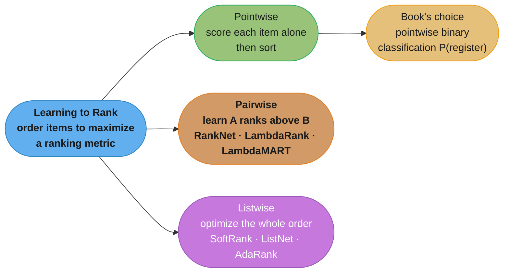
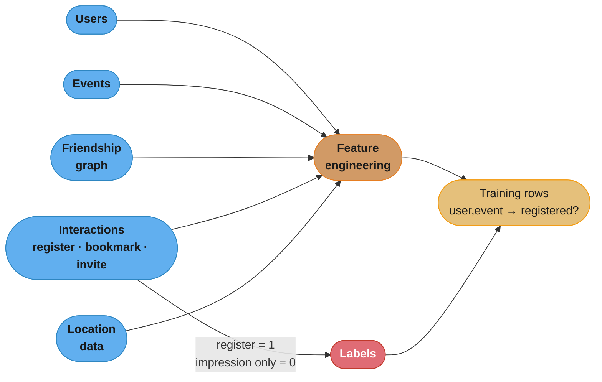
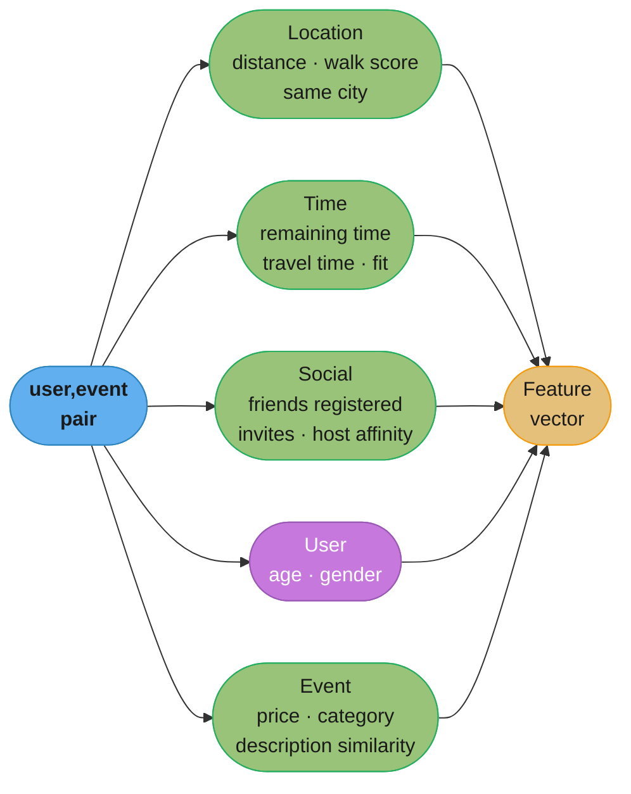
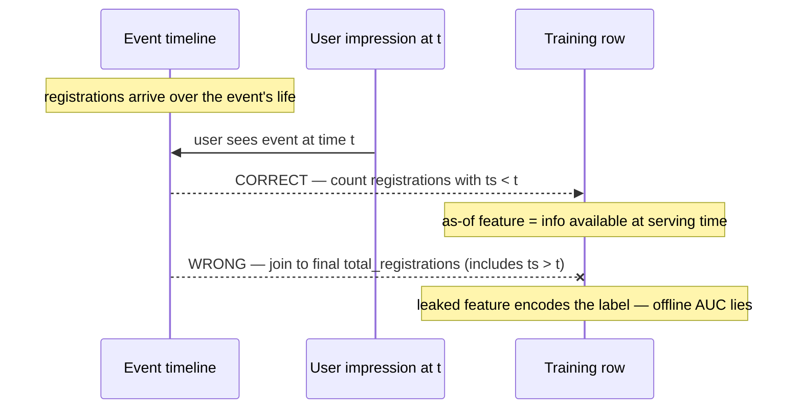
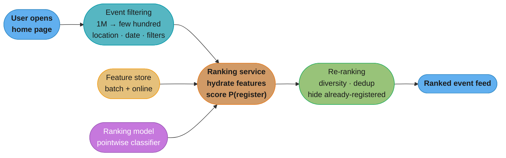
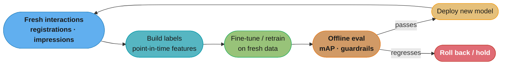

# Chapter 7: Event Recommendation System

> Ch 7 of 11 · ML System Design Interview (Aminian & Xu) · builds on Ch 6 — pointwise/pairwise/listwise LTR and the book's heaviest feature-engineering pass, under permanent cold start

## Chapter Map

Design the ranked list of events an Eventbrite-style app shows on its home page, personalized so
the user is most likely to **register**. The twist that reorganizes the whole chapter: events are
**ephemeral** — an event exists only until its start date, then it is gone forever. A concert next
Friday might collect a few thousand interactions across its short life and then vanish, so the
system lives in **permanent cold start**: it can never accumulate the years of interaction history a
video or a product enjoys. That single property forces three chapter-defining choices — a **pointwise
learning-to-rank** framing (simplest, fastest to retrain), the book's **most exhaustive
feature-engineering pass** (when items have no history, hand-built location/time/social features
carry the model), and a **continual-learning** serving pipeline that retrains constantly on fresh
interactions.

**TL;DR:**
- **Learning to rank** has three families — **pointwise** (score each item alone), **pairwise**
  (learn A > B: RankNet, LambdaRank, LambdaMART), **listwise** (optimize the whole ordering:
  SoftRank, ListNet, AdaRank). The book picks **pointwise binary classification** — predict
  `P(register)` per `<user, event>` and sort — because it is simple, cheap to serve, and trivial
  to retrain often.
- **Feature engineering is the model.** With no per-event history, prediction quality comes from
  five feature families — **location, time, social, user, event** — bucketized, crossed, and
  embedded. The chapter's signature trap is **point-in-time correctness**: every feature in a
  training row must reflect the world *as it was when the user saw the event*, not today.
- **Cold start is intrinsic, not an edge case.** Every event is new, so the system leans on
  content/metadata features and exploration traffic and retrains frequently.
- **GBDT vs neural net** is decided by the retraining need: GBDT is the stronger tabular learner
  but retrains from scratch; a neural net **fine-tunes incrementally** on each fresh batch, which
  is why continual learning tilts the long-run choice toward it.

## The Big Question

> "My items die. Each event lives a few weeks, gathers a handful of interactions, then disappears —
> so I can never learn 'this event is good' from its own history the way YouTube learns a video is
> good. How do I rank things that are always brand new?"

Analogy: recommending videos is like recommending restaurants that have been open for years — you
have reviews, repeat visits, a track record. Recommending events is like recommending
**pop-up dinners that exist for one night only**. You can never review the pop-up itself; you can
only reason from *where* it is, *when* it is, *who else* is going, *what* it costs, and whether it
looks like the pop-ups this diner has loved before. That shift — from item identity to item
**attributes and context** — is the entire chapter. It is why feature engineering swells to fill
most of the page count and why the model must relearn the world every day.

---

## 7.1 Clarifying Requirements

The interview opens by pinning down scope, signals, and the constraints that make events special.

**Business objective.** Increase attendance / ticket sales. The concrete, personalized surface is a
**ranked list of events on the app home page**, and the ML objective the whole system optimizes is
**maximize event registrations** (a user tapping "register"/"RSVP"). Registration — not a click, not
a bookmark — is the conversion the business is paid for.

**What the system does.** Given a user opening the app, return a ranked list of upcoming events the
user is most likely to register for. Personalized. Only **future** events (a past event is useless).

**Signals available.** The interviewer confirms four data families:
- **User data** — profile (age, gender, city), settings.
- **Event data** — host, category, price, location (latitude/longitude), start time, textual
  description.
- **Friendship data** — the social graph; who is friends with whom.
- **Interaction data** — registrations, bookmarks (saved for later), invitations sent between
  users, impressions/clicks, each with a timestamp and often a location.

**The defining constraints — why events are not videos.**
- **Ephemerality.** An event has a hard expiry: its start date. After that it leaves the catalog.
- **Short life → sparse interactions.** Because an event lives only days to weeks, it accumulates
  **very few interactions before it expires**. Popular videos gather millions of views over years;
  a typical event might see hundreds to a few thousand interactions, total, ever. So the system
  operates in **intrinsic, permanent cold start** — it can almost never rely on an event's own
  behavioral history.
- **Location dominates.** Users attend events near them; a great event 2,000 km away is irrelevant.
  Distance and travel time are first-class signals.
- **Time dominates.** An event is a point in time; remaining-time-until-start and day-of-week/
  time-of-day fit strongly shape registration.
- **The social graph matters more than usual.** People go to events their friends go to; "3 of your
  friends registered" is one of the strongest signals in the chapter.

**Scale (the numbers we will carry).** The interviewer gives us a mid-large platform:
- ~**100 million** registered users; ~**10 million** daily active users (DAU).
- ~**1 million** active (future, not-yet-expired) events at any moment.
- Average user has a few hundred friends; the friendship graph has on the order of **10^10** edges.
- Interactions accumulate to roughly **10 billion** rows of history.

**Latency.** The home-page ranking must return within a human-tolerable budget — on the order of
**100–200 ms** end to end — so heavy per-candidate work has to fit a tight loop.

**Non-goals / simplifications.** No need to *find* events for the user by keyword (that is search,
Ch 4); we rank a candidate set. Free and paid events both in scope. Privacy of social and
demographic features is flagged for the deep dive, not solved at requirements time.

### Back-of-envelope scale estimation

Worked step by step, book-style, to size the serving path and storage.

**Request rate.** 10M DAU, each opening the app ~5 times/day → 50M ranking requests/day.
`50,000,000 / 86,400 s ≈ 580 requests/sec` average. Assume a peak of ~3× average → **~1,700 QPS**
at peak. Each request must rank a candidate set and return the top ~100 events for the feed.

**Candidate set size.** We do **not** score all 1M events per request. A cheap event-filtering step
(location within, say, 100 km + date within the next few weeks + basic user filters) cuts 1M events
down to a **few hundred candidates** per user. So the ranking model scores ~**hundreds** of
`<user, event>` pairs per request, not a million.

**Ranking budget.** With ~1,700 QPS and ~300 candidates each, that is `1,700 × 300 ≈ 510,000`
model scorings/sec across the fleet — comfortably a horizontally-sharded, feature-store-backed
ranking tier, provided per-candidate feature lookup is cheap (hence the batch-vs-streaming feature
split in §7.4).

**In plain terms.** "Every step of that chain is one multiplication or one division, and the last
number — 510,000 model scorings per second — is the one that decides whether the design is
buildable." Each arrow either spreads a daily total across a day's seconds or fans a single request
out over its candidate set, so the entire capacity story is four operations long.

| Symbol | What it is |
|--------|------------|
| DAU | Daily active users — 10M here; the users who open the app on a given day |
| opens/day | How many times one active user opens the home page — 5 |
| 86,400 | Seconds in a day (`60 x 60 x 24`); converts a per-day total into a per-second rate |
| peak factor | Multiplier from average to busiest-hour traffic — 3x, the standard planning assumption |
| candidates | Events surviving the cheap geo + date filter and reaching the model — ~300 |
| scorings/sec | Per-candidate model evaluations the fleet must sustain = peak QPS x candidates |

**Walk one example.**

```
requests/day  = 10,000,000 DAU  x 5 opens       =  50,000,000 requests/day
average QPS   = 50,000,000      / 86,400 s      =       578.7 req/s   (the book's ~580)
peak QPS      = 578.7           x 3             =     1,736.1 req/s   (the book's ~1,700)
scorings/sec  = 1,700 req/s     x 300 candidates =    510,000 scorings/s

What 510,000/s implies for ONE candidate:
  end-to-end budget                 150 ms      (mid-point of the 100-200 ms target)
  slice handed to ranking            50 ms
  candidates inside that slice          300
  serial time per candidate  =  50 ms / 300  =  166.7 microseconds

Fleet sizing at a nominal 10,000 scorings/s per core:
  510,000 / 10,000 = 51 cores of pure scoring
```

That 166.7-microsecond figure is the sentence the whole chain exists to produce. It is far too
small for a per-candidate network round trip or a one-at-a-time deep forward pass, which is exactly
why §7.7 batches the candidate set into a single scoring call and why every feature must already be
sitting in a store rather than being computed inline.

**Storage.**
- Events: `1,000,000 × ~1 KB ≈ 1 GB` (tiny — events are small and few).
- Interactions: `~10^10 rows × ~100 bytes ≈ 1 TB` of history (the training-data goldmine).
- Friendship: `~10^10 edges × ~16 bytes ≈ 160 GB` adjacency.

**Read it like this.** "Every store is just rows times bytes-per-row; the only interesting question
is which of the three dominates the bill." Doing all three side by side is what makes the chapter's
punchline visible — the catalog is a rounding error next to the behavioral log.

| Symbol | What it is |
|--------|------------|
| rows | Number of records in the store (events, interaction rows, friendship edges) |
| bytes/row | Average serialized size of one record |
| 1 KB | Size of one event record — title, description, venue, times, price |
| 100 bytes | Size of one interaction row — two IDs, a type, a timestamp, a location |
| 16 bytes | Size of one friendship edge — two 8-byte user IDs |

**Walk one example.**

```
events        1,000,000 rows      x  1 KB       =      1.0 GB
interactions  10,000,000,000 rows x  100 bytes  =      1.0 TB       (1e12 bytes)
friendship    10,000,000,000 edges x 16 bytes   =    160.0 GB       (1.6e11 bytes = 149 GiB)
                                                   -----------
total                                                ~1.16 TB

interactions / events = 1.0 TB / 1.0 GB = 1,000x
```

The 1,000x ratio is the number to carry into the interview: the item catalog fits in RAM on one
machine, while the interaction log — the only thing that can train the model — is three orders of
magnitude larger. That asymmetry is why the engineering cost lands on features and retraining
rather than on serving the catalog.

The takeaway the numbers make concrete: **events are cheap to store and few in number; the cost is
in features and retraining, not in catalog size.** The engineering problem is freshness and cold
start, not scale of items.

---

## 7.2 Frame the Problem as an ML Task

**ML objective.** Translate the business goal ("more registrations") into a measurable ML target:
predict, for a `<user, event>` pair, the probability the user will **register** for the event, then
rank events by that probability. This is a **learning-to-rank (LTR)** problem — the task of ordering
a list of items to maximize a ranking quality metric.

### Learning-to-rank taxonomy (the chapter's framing core)

LTR methods fall into three families by **what the loss looks at** — one item, a pair, or the whole
list.



Caption: the three LTR families differ only in loss granularity — one item, a pair, or a full list;
the book picks the leftmost, cheapest branch and turns ranking into ordinary binary classification.

**Pointwise.** The model scores each item **independently** — here, `P(register | user, event)` — and
the final ranking is just a sort by score. Reduces LTR to standard **binary classification** (label
= did the user register, yes/no). Cheapest to train, serve, and retrain; the loss ignores the
relative ordering of items and never sees two candidates together.

**Pairwise.** The model looks at **pairs** of items and learns which one should rank higher, i.e. it
models `P(A ranks above B)`. Directly optimizes relative order, which is what ranking quality
actually cares about. Classic methods: **RankNet** (a neural net over pair preferences with a
cross-entropy pairwise loss), **LambdaRank** (weight each pair's gradient by how much swapping them
changes a ranking metric like nDCG), **LambdaMART** (LambdaRank's gradients on gradient-boosted
trees — a long-time competition winner). More accurate ordering than pointwise, more expensive.

**Listwise.** The loss looks at the **entire ranked list** at once and optimizes a list-level metric
directly. Methods: **SoftRank**, **ListNet**, **AdaRank**. Highest ceiling on ranking quality,
highest complexity and training cost.

| LTR family | Loss granularity | Optimizes | Cost | Examples |
|------------|------------------|-----------|------|----------|
| Pointwise | One item | Per-item relevance score | Lowest | Logistic regression, GBDT, NN classifier |
| Pairwise | A pair | Relative order of two items | Medium | RankNet, LambdaRank, LambdaMART |
| Listwise | Whole list | List-level ranking metric | Highest | SoftRank, ListNet, AdaRank |

**The book's decision: pointwise binary classification.** Predict `P(register)` for each candidate
event and sort. The justification is exactly the chapter's theme — with events dying constantly, the
system must **retrain very often**, and pointwise classification is the simplest, fastest-to-refresh
option. It also serves cleanly: each candidate is scored independently, which parallelizes trivially
across a candidate set. Ordering quality is slightly below pairwise/listwise in theory, but the
operational simplicity under permanent cold start wins.

**Input / output.** Input = a `<user, event>` feature vector (built in §7.4). Output = a scalar
probability of registration in `[0, 1]`. Serving sorts a user's candidate events by this scalar.

---

## 7.3 Data Preparation

Before features, lay out the raw data. Five logical stores feed the pipeline.

**Users** — `user_id`, age, gender, city / home location (lat, long), account creation time,
settings. Relatively static.

**Events** — `event_id`, `host_id`, category (music, tech, sports…), price, location (lat, long,
venue), start time, end time, textual description/title, free-vs-paid flag. Small and numerous; each
row is short-lived.

**Friendship** — `user_id`, `friend_id`, `created_at`. The social graph; undirected. Powers the
social feature family.

**Interactions** — the behavioral log and the source of labels: `user_id`, `event_id`,
`interaction_type` (impression, click, **register**, bookmark, **invite**), `timestamp`, and often
`location`. Registrations are the positive label; impressions without registration are negatives.

**Location data** — user home locations, event venues, and derived geospatial facts (city/country
boundaries, walk scores, travel-time estimates).



Caption: five raw stores fan into one feature-engineering stage; the interaction log does double
duty — it is both a feature source and the origin of the binary registration label.

**Label construction.** A training example is a `<user, event, registered?>` triple. Positives:
impressions the user registered for. Negatives: events the user was shown (impression) but did not
register for. This is **natural labeling** from behavior — free and plentiful but noisy (a non-
registration is not necessarily a dislike; the user may have missed it, or registered elsewhere).
Because most impressions do not convert, the dataset is heavily **imbalanced** toward negatives —
handled in §7.5.

---

## 7.4 Feature Engineering

This is the chapter. With no per-event behavioral history to lean on, **the features are the
model**. The book organizes them into five families — **location, time, social, user, event** — then
covers the mechanics that apply across all of them (bucketization, embeddings, crosses, batch-vs-
streaming, and the point-in-time-correctness trap). Be exhaustive: every family below is a signal an
interviewer expects you to enumerate.



Caption: five feature families collapse into one vector per `<user, event>` pair; location, time,
and social carry most of the predictive weight because event identity itself carries almost none.

### 7.4.1 Location-related features

Users attend events near them, so distance and accessibility are top signals.

- **Walk score / accessibility of the venue.** How reachable is the venue — walkability, public-
  transit access, parking availability. An easy-to-reach venue converts better. Encoded as a
  numeric score (e.g. 0–100).
- **User-to-event distance, bucketized.** The great-circle (haversine) distance between the user's
  home location and the event venue. Raw distance is continuous; **bucketize** it (e.g.
  `<1 km, 1–5, 5–20, 20–50, 50–100, >100 km`) so the model can learn a nonlinear "sweet spot" —
  registration probability is high nearby, drops off, then flattens.
- **Distance similarity to the user's historical registrations.** Does this user usually stay local
  or travel far? Compare this event's distance to the distribution of distances of events the user
  has previously registered for. A 40 km event is unremarkable for a user who routinely travels 50
  km but a red flag for a homebody. Encoded as a similarity/deviation score.
- **Same country / same city as the user.** Simple binary flags. Crossing an international boundary
  is a strong negative; same-city is a strong positive.

### 7.4.2 Time-related features

An event is a moment in time, and timing drives whether a user can and will go.

- **Remaining time until the event.** How far in the future the event starts (bucketized: today,
  this week, this month, later). Registration behavior differs sharply — some users book far ahead,
  others day-of. This is a **dynamic** feature: it changes every hour, so it must be computed at
  request time (streaming feature, §7.4.6), never precomputed and cached.
- **Estimated travel time from user to event.** Not the same as distance — 20 km across a congested
  city can be an hour, while 20 km on a highway is 15 minutes. Uses a routing/traffic estimate.
  Captures the real friction of attending.
- **Day-of-week and time-of-day fit.** Compare the event's day-of-week and hour to the user's
  historical registration times. A user who only attends weekend events is unlikely to register for
  a Tuesday 10 a.m. workshop. Encoded as a similarity between the event's `(day, hour)` and the
  user's historical `(day, hour)` distribution.

### 7.4.3 Social features (often the strongest)

The social graph is unusually predictive for events — people go where their friends go.

- **Number of users registered for the event.** Overall popularity / social proof. A dynamic count.
- **Ratio of the user's friends who registered.** Of this user's friends, what fraction registered
  for this event. Far more personal than raw popularity — 5 of my 20 close friends going is a much
  stronger pull than 5,000 strangers.
- **Number of friends who invited this user.** Direct invitations from friends are a very strong
  registration signal.
- **Is the event hosted by a friend?** Binary. People show up for their friends' events.
- **Host popularity.** How well-known/followed the host is; the host's past events' attendance. A
  popular host lends credibility to a brand-new event — exactly the kind of **attribute** signal
  that substitutes for the missing per-event history.
- **User-host affinity (history with this host).** Has the user attended this host's events before?
  A user who has been to three of a host's meetups is very likely to return.

### 7.4.4 User features

- **Age** and **gender** — demographic signals that correlate with event preferences (e.g. certain
  categories skew by age). Bucketize age. **Privacy caveat:** gender and other sensitive attributes
  raise fairness and privacy concerns; the book flags that they may be excluded or handled carefully,
  and that using them risks encoding bias.

### 7.4.5 Event features

- **Price, bucketized.** Free vs cheap vs expensive; bucketize the ticket price. Also useful: is the
  price within the user's typical spending range (cross with the user's historical event prices)?
- **Description similarity to previously-registered events.** Embed the event's textual description
  (title + body) with a text encoder, and compute similarity to the embeddings of events the user
  previously registered for. This is the content-based backbone: since the event itself has no
  behavioral history, its **content** stands in — "this looks like the jazz nights you always go
  to." Captures topical fit without any interactions on the target event.
- **Category / event type.** Music, tech, sports, food, etc. A high-cardinality categorical — encode
  via an **embedding** rather than one-hot when the vocabulary is large.

### 7.4.6 Cross-cutting mechanics

These techniques apply across all five families and are where interviewers probe for depth.

**Bucketize continuous features.** Distance, price, remaining time, age are all bucketized so linear
and tree models can capture nonlinear thresholds (the "registration is high < 5 km, then falls off a
cliff" shape a raw linear term cannot express).

**Embed high-cardinality sparse IDs.** `event_id`, `host_id`, `category`, `city` can have huge
vocabularies. One-hot encoding explodes dimensionality; instead learn a dense **embedding** per ID
(a lookup table trained jointly with the model). Note the tension with cold start: a brand-new
`event_id` has an untrained embedding, so the model must fall back on the event's *attribute*
features — one more reason attributes carry the load.

**Cross / derived features.** Combine raw features into interaction features the model can't easily
learn on its own: `distance × user's-historical-distance`, `event-category × user-age-bucket`,
`price-bucket × user-price-history`. Linear models especially need these hand-built crosses to
capture interactions; tree/NN models learn some crosses automatically (this tension drives §7.5).

**Batch (static) vs streaming (dynamic) features.** A first-class distinction in this chapter:

| Feature type | Changes | Examples | Computed |
|--------------|---------|----------|----------|
| **Batch / static** | Slowly | user age, gender, event category, price, host, description embedding, venue walk score | Precomputed offline, stored, cheap to read |
| **Streaming / dynamic** | Fast (minutes to hours) | # registered so far, ratio of friends registered, remaining time to event, live travel time | Computed at request time from an online store |

Batch features are precomputed nightly and read cheaply; streaming features must be recomputed at
serving time because they are stale the moment they are cached. The serving design in §7.7 splits the
feature store along exactly this line.

### 7.4.7 Point-in-time correctness — the leakage trap

The chapter's single most important warning. When you build a **training row** for
`<user, event, registered?>`, every feature must reflect the state of the world **at the moment the
user saw the event**, not the state today. Getting this wrong leaks the future into training and
produces a model that looks brilliant offline and collapses in production.

**The broken version.** Suppose the feature "**number of users registered for the event**" is
computed by joining to the events table *now*:

```sql
-- BROKEN: leaks the future
SELECT i.user_id, i.event_id, i.registered,
       e.total_registrations AS num_registered   -- current, final count
FROM impressions i
JOIN events e ON e.event_id = i.event_id;
```

The event has since finished; `e.total_registrations` is its **final** count — every registration
that ever happened, including ones that occurred *after* this user's impression, and including this
user's own registration. The feature now effectively encodes the label. The model learns "high
final registration count → this user registered," which is circular and unavailable at serving time
(when the event is in the future and its final count does not exist yet). Offline AUC looks near-
perfect; online performance is garbage.

**What this actually says.** "A feature computed after the fact can quietly contain the answer, and
a metric that only measures ordering will happily hand it a perfect score." The reason this trap is
so dangerous is that nothing in the offline pipeline complains — the numbers get *better*, which is
the last thing an engineer is trained to distrust.

| Symbol | What it is |
|--------|------------|
| `t` | The impression timestamp — the moment the user actually saw the event |
| `num_registered_at_impression` | The as-of feature: registrations with `ts < t`, the honest count |
| `total_registrations` | The event's final count, known only after the event is over |
| AUC | Probability a random positive scores above a random negative; 0.5 = coin flip, 1.0 = perfect |

**Walk one example.** Six impressions across six events, each scored by one feature at a time:

```
impression   as-of count   final count   registered?
    A             12            40           yes
    B             26            35            no
    C             28            38           yes
    D             14            33            no
    E             22            41           yes
    F             22            31            no

Rank by FINAL count (the leaked feature):
    41   40   38  |  35   33   31
   yes  yes  yes  |   no   no   no      every positive sits above every negative
   AUC = 9 winning pairs / 9 pairs = 1.00

Rank by AS-OF count (the honest feature the server will actually have):
    28   26   22   22   14   12
   yes   no  yes   no   no  yes         positives scattered through the order
   AUC = (0 + 3 + 1.5) / 9 = 4.5 / 9 = 0.50
```

Read the two AUCs together and the mechanism is exact: the leaked feature scores a flawless 1.00
because every positive's final count was itself incremented by that user's own registration, so the
feature *is* the label wearing a different name. The honest feature scores 0.50 — a coin flip — and
0.50 is the number the production model will actually deliver, because at serving time the event is
still in the future and `total_registrations` does not exist yet. A jump from 0.50 to 1.00 on an
offline dashboard should therefore read as an alarm, not a win.

**The fix — an as-of join.** Compute each time-dependent feature as of the impression timestamp:

```sql
-- CORRECT: point-in-time / as-of feature
SELECT i.user_id, i.event_id, i.registered,
       (SELECT COUNT(*)
        FROM registrations r
        WHERE r.event_id = i.event_id
          AND r.ts < i.impression_ts)  AS num_registered_at_impression
FROM impressions i;
```

The count now includes only registrations that had already happened **before** the impression — the
information the serving system will actually have. Every dynamic feature (friends-registered ratio,
remaining time, live popularity) needs the same as-of treatment. In production, a **feature store**
with point-in-time-correct joins (log the feature values at serving time, or reconstruct them from an
event-time log) is the standard defense; see
[ml/case_studies/cross_cutting/feature_store_and_point_in_time_correctness.md](../../../ml/case_studies/cross_cutting/feature_store_and_point_in_time_correctness.md).



Caption: the impression happens at time t, but the event keeps collecting registrations afterward —
joining to the final total pulls post-t information into a training row, leaking the future; the
as-of count with `ts < t` is the only version the live system can reproduce.

---

## 7.5 Model Development

The book climbs the usual ladder — simple, interpretable baseline first, then more powerful models —
and weighs the choice specifically against the **continual-learning** requirement that ephemerality
forces.

### Logistic regression

A linear model over the engineered features, output `P(register)` via the sigmoid. Fast to train,
cheap to serve, interpretable (coefficients say which features matter). Two weaknesses: it is
**linear**, so it captures interactions only through **manually crossed** features (§7.4.6), and it
handles high-cardinality sparse IDs poorly without embeddings. A fine first baseline to prove the
pipeline works.

### Decision tree → gradient-boosted decision trees (GBDT)

A single decision tree learns nonlinear splits and feature interactions automatically but overfits
and is unstable. **Gradient-boosted decision trees** (XGBoost, LightGBM) fix this by fitting an
ensemble of shallow trees sequentially, each correcting the previous ensemble's residuals. GBDT is
the **strongest off-the-shelf learner for tabular / numeric features** — exactly the shape of most
event features (distances, counts, prices, ratios) — and needs far less feature engineering than
logistic regression because it discovers crosses on its own.

**GBDT's weakness here is continual learning.** A boosted ensemble is trained as a fixed sequence of
trees on a fixed dataset; there is no clean, cheap way to *incrementally update* it as fresh
interactions stream in. To incorporate today's data you generally **retrain from scratch** (or bolt
on extra trees, which drifts and bloats the model). GBDT also handles very high-cardinality sparse
features (learned embeddings) less naturally than neural nets. In a world where events die daily and
the model must refresh constantly, "retrain the whole thing every time" is a real operational cost.

### Neural network

A feed-forward network with **embedding layers** for the sparse IDs (event, host, category, city)
and dense layers over the concatenated features, output `P(register)`. Two advantages that matter
under ephemerality:
- **Continual / incremental learning.** A neural net can be **fine-tuned** on each fresh batch of
  interactions with a few gradient steps — no full retrain — which fits the constant-refresh
  requirement far better than GBDT. (Caveat: naive fine-tuning risks **catastrophic forgetting**;
  mitigate by mixing in older data or replaying.)
- **Native embeddings** for sparse features, so it represents huge-vocabulary IDs cleanly.

The cost: neural nets generally need **more data** and more tuning than GBDT to reach the same
accuracy on tabular features, and they are less interpretable.

### The GBDT-vs-NN decision

| Criterion | GBDT (XGBoost) | Neural network |
|-----------|----------------|----------------|
| Tabular/numeric accuracy | Excellent, strong default | Good, needs more data |
| Feature engineering needed | Low (learns crosses) | Medium (needs embeddings, tuning) |
| Sparse high-cardinality IDs | Weaker | Native via embeddings |
| **Continual learning** | **Poor — retrain from scratch** | **Good — fine-tune incrementally** |
| Interpretability | Good (feature importance) | Poor |
| Training/serving cost | Low | Higher |

The book's read: **GBDT is the stronger model on this feature set and a great starting point, but the
continual-learning need created by ephemeral events tilts the long-run choice toward a neural
network**, because being able to fine-tune on fresh interactions — rather than rebuild nightly — is
what keeps the model in step with a catalog that turns over constantly. Both are defensible in the
interview; the discriminating argument is *how you will keep the model fresh*, and that is where NN
pulls ahead.

### Training details

- **Loss.** Binary cross-entropy over `<user, event, registered?>` examples (pointwise
  classification).
- **Dataset.** Positives = registered impressions; negatives = non-registered impressions. Enforce
  **point-in-time correctness** (§7.4.7) on every dynamic feature.
- **Class imbalance.** Most impressions do not convert, so positives are a small minority. Remedies:
  **downsample the negatives** (and recalibrate the output probability afterward if calibrated
  probabilities matter), or use a **class-weighted loss** that up-weights the rare positives. See
  [ml/imbalanced_data_and_leakage_traps/README.md](../../../ml/imbalanced_data_and_leakage_traps/README.md).

---

## 7.6 Evaluation

Offline metric choice hinges on one fact: our relevance labels are **binary** (registered / not).
The book walks the ranking metrics and eliminates them one at a time.

**MRR (Mean Reciprocal Rank).** Averages `1 / rank` of the *first* relevant item. Natural when there
is essentially **one** relevant item per list (e.g. a single search answer). But a user may register
for **several** events shown in one session, so MRR — which only credits the first hit — throws away
information about the rest. Biased toward the one-relevant-item case; not ideal here.

**nDCG (normalized Discounted Cumulative Gain).** The gold standard when relevance is **graded**
(relevance = 0, 1, 2, 3…), because DCG weights items by graded relevance and discounts by position.
But our labels are **binary** — registered or not — so the "graded" machinery adds nothing over
simpler metrics; nDCG with binary relevance degenerates and is awkward to justify.

**What it means.** "Give each result a gain based on how relevant it is, shrink that gain by how far
down the list it sits, add them up, and divide by the best total this same set of results could
possibly have scored." The division by the ideal is what makes nDCG comparable across lists of
different length and different relevance mixes.

| Symbol | What it is |
|--------|------------|
| `rel_i` | Graded relevance of the item at position `i` — 0 irrelevant, 3 perfect |
| `2^rel_i - 1` | The gain; makes a grade-3 hit worth 7 while a grade-1 hit is worth 1 |
| `log2(i + 1)` | The positional discount; position 1 divides by 1.000, position 5 by 2.585 |
| DCG | Sum of discounted gains over the ranking we actually produced |
| IDCG | The same sum over the ideal ranking (same grades, sorted best-first) |
| nDCG | `DCG / IDCG`, always in `[0, 1]`; 1.0 means we produced the ideal order |

**Walk one example.** Two rankings of the same five results, then the same two collapsed to binary:

```
Ranking A (graded)                     Ranking B (same items, top two swapped)
pos  rel  gain   disc    contrib       pos  rel  gain   disc    contrib
 1    3     7    1.000    7.0000        1    1     1    1.000    1.0000
 2    1     1    1.585    0.6309        2    3     7    1.585    4.4164
 3    2     3    2.000    1.5000        3    2     3    2.000    1.5000
 4    0     0    2.322    0.0000        4    0     0    2.322    0.0000
 5    1     1    2.585    0.3869        5    1     1    2.585    0.3869
                 DCG_A =  9.5178                        DCG_B =  7.3034

ideal order 3, 2, 1, 1, 0  ->  IDCG = 9.8235   (identical for both: same grade multiset)
nDCG_A = 9.5178 / 9.8235 = 0.9689
nDCG_B = 7.3034 / 9.8235 = 0.7435        graded nDCG separates them by 0.2254

Now replace the grades with our ACTUAL labels -- registered / not -- so both become 1,1,1,0,1:
nDCG_A = 0.9829
nDCG_B = 0.9829                          identical: the metric can no longer tell them apart
```

That last pair of lines is the whole argument for rejecting nDCG here. With graded labels the metric
punishes ranking B by 0.2254 for burying the best result; with the binary registered/not labels this
chapter actually has, the two rankings are indistinguishable, so all of nDCG's discriminating power
comes from grades we do not possess.

**mAP (mean Average Precision).** Designed for **binary** relevance and multiple relevant items per
list — it averages precision at each rank where a relevant item appears, across all queries. This
matches our setup exactly (binary registered/not, possibly several registrations per session), so it
is the **book's pick** for the primary offline metric. Precision@k and recall@k are reported
alongside as intuitive sanity checks.

**Put simply.** "For one session, measure precision only at the ranks where a registration actually
sits and average those; then average that number across sessions." Only sampling precision at the
hit positions is the trick — it rewards pushing every registration higher without needing grades.

| Symbol | What it is |
|--------|------------|
| `P@k` | Precision at rank `k` = registered events in the top `k`, divided by `k` |
| AP | Average precision for one session = mean of `P@k` over the ranks `k` that hold a registration |
| mAP | Mean of AP across all sessions — the reported number |

**Walk one example.** Two sessions, each showing eight ranked events:

```
Session 1 -- user registered for the events at ranks 1, 3, 7
  P@1 = 1 / 1 = 1.0000
  P@3 = 2 / 3 = 0.6667
  P@7 = 3 / 7 = 0.4286
  AP1 = (1.0000 + 0.6667 + 0.4286) / 3 = 0.6984

Session 2 -- user registered for the events at ranks 2, 5
  P@2 = 1 / 2 = 0.5000
  P@5 = 2 / 5 = 0.4000
  AP2 = (0.5000 + 0.4000) / 2 = 0.4500

mAP = (0.6984 + 0.4500) / 2 = 0.5742

Same two sessions under MRR, which only credits the FIRST hit:
  1/1 = 1.0000 and 1/2 = 0.5000  ->  MRR = 0.7500
  The registrations at ranks 3, 7 and 5 contributed nothing at all.
```

The contrast is the reason for the choice. MRR scores session 1 a perfect 1.0000 while ignoring that
two more registrations were buried at ranks 3 and 7; mAP's 0.6984 says plainly that two thirds of the
user's registrations were badly placed. When a session can convert several times, only mAP prices
the misses.

| Metric | Assumes | Fits event recsys? |
|--------|---------|--------------------|
| MRR | One relevant item per list | No — users register for several events |
| nDCG | Graded relevance scores | No — labels are binary |
| **mAP** | **Binary relevance, multiple relevant** | **Yes — book's choice** |

**Online metrics.** Offline metrics are proxies; the business is judged live via A/B test:
- **Click-through rate (CTR)** on recommended events.
- **Conversion rate** — registrations / impressions — the metric closest to the ML objective.
- **Bookmark / share rate** — softer positive engagement.
- **Revenue lift** — ticket sales attributable to the recommendations (the ultimate business metric).

As always, offline and online can diverge (feedback loops, position bias); the offline metric guides
model selection, the online A/B test decides what ships.

---

## 7.7 Serving

The serving path is a three-stage funnel — **filter, rank, re-rank** — wrapped by a **continual-
learning** retraining loop. The funnel is what makes it feasible to serve ~1,700 QPS against 1M
events in ~150 ms.



Caption: the funnel spends its cheapest filter first (geo + date cut 1M to hundreds) so the
expensive per-candidate feature hydration and model scoring run on a small set; the feature store
feeds both slow batch features and fast online features into the ranking stage.

**1. Event filtering service.** The candidate generator. From ~1M active events, cheaply select the
few hundred worth ranking for this user using **filters, not a model**: within a distance radius,
starting within a date window (future only), matching coarse user preferences (category opt-ins,
language, age restrictions). This is the step that keeps the model's workload at hundreds, not
millions, of candidates.

**2. Ranking service.** For each candidate, **hydrate features** and run the pointwise classifier to
get `P(register)`. Feature hydration splits along the batch/streaming line of §7.4.6:
- **Batch features** (user age, event category, price, description embedding, host popularity) are
  read cheaply from a precomputed **feature store**.
- **Streaming / dynamic features** (# registered so far, friends-registered ratio, remaining time,
  live travel time) are computed from an **online feature store** at request time, because they are
  stale the instant they are cached.
Sort candidates by predicted probability.

**3. Re-ranking / business logic.** Adjust the pure-model order for business rules: **remove events
the user already registered for**, enforce **diversity** (don't fill the feed with one category or
one host), apply freshness boosts, filter disallowed content, respect region restrictions. The
output is the final ranked feed.

### Continual-learning pipeline

The serving loop is only half the system; the other half is keeping the model **fresh**. Because
events expire and new ones appear continuously, yesterday's model has never seen most of tomorrow's
candidates. So the system **retrains frequently** — daily or more often — on the freshest
interaction data, using incremental fine-tuning where the model allows it (the NN advantage from
§7.5). This is the operational payoff of the whole cold-start theme: you cannot rely on item history,
so you rely on **constant relearning** of the world. See
[book/designing_machine_learning_systems/09_continual_learning_and_test_in_production/README.md](../../designing_machine_learning_systems/09_continual_learning_and_test_in_production/README.md).



Caption: the retraining loop closes constantly — fresh interactions become point-in-time-correct
training rows, the model fine-tunes, an offline gate (mAP + guardrails) decides deploy vs rollback,
and the newly deployed model generates the next batch of interactions.

---

## 7.8 Other Talking Points

The book closes with the extensions an interviewer probes for.

- **Cold start for new users and new events.** New **users** have no history → fall back on
  demographic and location features and popular/nearby events. New **events** have no interactions →
  this is the permanent condition; rely on content/metadata features (category, description
  embedding, host popularity) and give new events **exploration traffic** so they can gather signal.
- **Leakage in time-dependent features.** Re-emphasized: every dynamic feature must be point-in-time
  correct (§7.4.7). Time-dependent features are the most leak-prone class in the whole system.
- **Position bias in labels.** Users register more for events shown at the top, independent of
  quality; the impression logs therefore over-credit high positions. Mitigate by logging position
  and de-biasing (e.g. position as a feature at train time, dropped at serve time).
- **Delayed feedback.** A user may register **days after** the impression, so at training time some
  "negatives" are actually not-yet-converted positives. Use a maturation window before finalizing
  labels.
- **Privacy around social and demographic features.** Friend registrations, invitations, and gender/
  age are sensitive; using them raises consent, fairness, and regulatory concerns — handle with care
  or exclude.
- **Exploration for new events (bandits).** To avoid a rich-get-richer loop where only already-
  popular events ever get shown, use exploration (epsilon-greedy or contextual bandits) to surface
  new events and learn their appeal. See
  [ml/recommender_systems/online_learning_and_bandits.md](../../../ml/recommender_systems/online_learning_and_bandits.md).

---

## Visual Intuition

**Cold start: video vs event.** Why the whole chapter is different from Ch 6.

```
Interactions accumulated over an item's life (log scale, schematic)

Video (YouTube)   ████████████████████████████████  millions, over YEARS
                  |----------------- history to learn from -----------|

Event (Eventbrite) ███                                few hundred to few thousand,
                   |-- days to weeks --| then GONE     then the item disappears

Insight: a video earns a rich behavioral track record; an event never does.
So event ranking must reason from ATTRIBUTES (location, time, social, content),
not from the item's own history — this is permanent cold start.
```

Caption: the bar length is the behavioral history a model can exploit; events end before they ever
build one, which is exactly why §7.4's attribute features do the heavy lifting.

**The three-stage funnel, by candidate count.**

```
1,000,000 events
   │  event filtering  (geo radius + date window + user filters — cheap, no model)
   ▼
   ~300 candidates
   │  ranking service  (hydrate features, score P(register), sort — the model runs here)
   ▼
   ~100 ranked
   │  re-ranking       (diversity, dedup, remove already-registered — business logic)
   ▼
   final feed
```

Caption: each stage is more expensive per item than the last, so the pipeline spends its cheap filter
first — the model only ever scores hundreds of candidates even though the catalog holds a million.

The LTR taxonomy, feature-family fan-out, point-in-time leakage sequence, serving funnel, and
continual-learning loop are diagrammed inline in §7.2, §7.4, §7.4.7, and §7.7.

---

## Key Concepts Glossary

- **Event recommendation** — ranking upcoming events for a user to maximize registrations.
- **Ephemeral item** — an item that expires (an event after its date); source of permanent cold start.
- **Permanent / intrinsic cold start** — items never accumulate enough history to learn from.
- **Learning to rank (LTR)** — ordering a list to maximize a ranking metric.
- **Pointwise LTR** — score each item independently, then sort (book's choice; binary classification).
- **Pairwise LTR** — learn which of two items ranks higher (RankNet, LambdaRank, LambdaMART).
- **Listwise LTR** — optimize the entire ordering directly (SoftRank, ListNet, AdaRank).
- **RankNet / LambdaRank / LambdaMART** — pairwise methods; LambdaMART = LambdaRank on boosted trees.
- **P(register)** — the pointwise model's output: probability a user registers for an event.
- **Registration** — the conversion event; the positive label.
- **Natural labeling** — labels derived from user behavior (registered vs not) rather than annotation.
- **Location features** — distance (bucketized), walk score, same-city/country, distance-to-history.
- **Time features** — remaining time, estimated travel time, day-of-week/time-of-day fit.
- **Social features** — friends registered (count/ratio), invites, hosted-by-friend, host popularity, user-host affinity.
- **User features** — age, gender (privacy-sensitive).
- **Event features** — price (bucketized), category (embedded), description-similarity to history.
- **Bucketization** — binning a continuous feature so models capture nonlinear thresholds.
- **Embedding** — dense learned vector for a high-cardinality sparse ID (event, host, category).
- **Cross feature** — a hand-built interaction of two raw features.
- **Batch (static) feature** — slowly-changing, precomputed offline.
- **Streaming (dynamic) feature** — fast-changing, computed at request time (e.g. # registered).
- **Point-in-time correctness** — a feature reflects the world as of the interaction time, not now.
- **Data leakage** — training features encode information unavailable at serving time (e.g. final counts).
- **As-of join** — join computing feature values as of a timestamp, the fix for time-leakage.
- **Feature store** — system serving batch + online features with point-in-time-correct joins.
- **GBDT** — gradient-boosted decision trees; strong tabular learner, weak at incremental refresh.
- **Continual learning** — frequently retraining/fine-tuning on fresh data.
- **Catastrophic forgetting** — a fine-tuned model losing older knowledge.
- **MRR / nDCG / mAP** — ranking metrics; mAP fits binary-relevance multi-hit ranking (book's pick).
- **Conversion rate** — registrations / impressions; the closest online proxy to the ML objective.
- **Event filtering service** — cheap candidate generation (geo + date + filters) from 1M events.
- **Re-ranking** — business-logic reorder (diversity, dedup, remove already-registered).
- **Position bias** — top-shown items get more clicks/registrations regardless of quality.
- **Delayed feedback** — registration happening well after the impression, complicating labels.

---

## Tradeoffs & Decision Tables

**LTR family choice.**

| Family | Ranking quality | Cost to train/serve/retrain | Verdict for events |
|--------|-----------------|-----------------------------|--------------------|
| Pointwise | Good | Lowest | ✓ chosen — simple, fast to retrain often |
| Pairwise | Better | Medium | Overkill given retrain frequency |
| Listwise | Best | Highest | Too costly for constant refresh |

**Model choice.**

| Model | Tabular accuracy | Sparse IDs | Continual learning | Verdict |
|-------|------------------|-----------|--------------------|---------|
| Logistic regression | Weak (needs manual crosses) | Poor | Easy to refit | Baseline only |
| GBDT (XGBoost) | Excellent | Weaker | Poor (retrain from scratch) | Strong start |
| Neural network | Good (more data) | Native embeddings | Good (fine-tune) | ✓ long-run under ephemerality |

**Offline metric choice.**

| Metric | Relevance type | Multiple relevant? | Fit |
|--------|----------------|--------------------|-----|
| MRR | Binary | Credits only first | Poor |
| nDCG | Graded | Yes | Poor (labels are binary) |
| mAP | Binary | Yes | ✓ chosen |

**Feature timing.**

| Feature class | Freshness need | Where computed |
|---------------|----------------|----------------|
| Batch/static | Low | Precomputed feature store |
| Streaming/dynamic | High (per request) | Online feature store at serve time |

---

## Common Pitfalls / War Stories

- **The point-in-time leakage that fakes a perfect model.** Computing a time-dependent feature
  (# registered, friends-registered ratio) from the *current/final* event state joins the future
  into training rows. Offline AUC/mAP look spectacular; the online model is useless because at serve
  time the event is in the future and those final counts do not exist. Always compute dynamic
  features **as of the impression timestamp**.
- **Treating cold start as an edge case.** In most recsys, cold start is a small new-item problem; in
  event recsys it is the **default state of every item**. A design that quietly assumes rich per-
  event history (e.g. relying on an event's learned ID embedding) fails, because that embedding is
  almost always untrained. Lean on attribute/content features and exploration.
- **Caching dynamic features.** Precomputing "# registered" or "remaining time" nightly and serving
  it all day is stale within minutes and silently degrades ranking. Dynamic features must be computed
  at request time from an online store — that is the whole point of the batch/streaming split.
- **Picking GBDT and then struggling to keep it fresh.** GBDT is the best model on the feature set,
  but its inability to fine-tune means daily refresh = full retrain. Teams that ship GBDT without
  planning the retrain pipeline find the model drifting behind the ever-changing catalog; either
  budget for frequent full retrains or use a fine-tunable NN.
- **Choosing nDCG with binary labels.** nDCG needs graded relevance; with registered/not-registered
  labels it degenerates and misleads model selection. Use mAP for binary, multi-hit relevance.
- **Ignoring delayed feedback.** Labeling an impression "negative" immediately mislabels users who
  register two days later. Use a maturation window before finalizing negatives, or the model learns
  to under-predict registration.
- **Position bias baked into labels.** Because top-shown events get disproportionate registrations,
  training on raw impression logs teaches the model that "position 1 is good." Log position and
  de-bias, or the feedback loop entrenches whatever the current ranker already surfaces.

---

## Real-World Systems Referenced

Eventbrite / Meetup-style event platforms (the design target); XGBoost and LightGBM (GBDT);
RankNet, LambdaRank, LambdaMART (pairwise LTR, from Microsoft Research); SoftRank, ListNet, AdaRank
(listwise LTR); feature stores (batch + online serving with point-in-time joins); contextual bandits
for new-event exploration.

---

## Summary

Designing an event recommender is a lesson in building an ML system when your items have **no
history**. Events are **ephemeral** — they expire on their start date and gather only a handful of
interactions before they vanish — so the system lives in **permanent cold start**, and that single
fact reorganizes every stage. The problem is framed as **learning to rank**, and among the three LTR
families — pointwise, pairwise, listwise — the book chooses **pointwise binary classification**
(`P(register)`, then sort) precisely because it is the cheapest to serve and, crucially, the fastest
to retrain in a world that demands constant refresh. With item identity carrying almost no signal,
**feature engineering becomes the model**: five families — location (distance, walk score, same-
city, distance-to-history), time (remaining time, travel time, day/hour fit), social (friends
registered, invites, host affinity), user (age, gender), and event (price, category, description
similarity) — are bucketized, embedded, and crossed, and split into slow **batch** features and
fast **streaming** features. The chapter's defining trap is **point-in-time correctness**: every
dynamic feature in a training row must reflect the world as of the impression, not today, or the
future leaks in and the model that looks perfect offline dies online. Model selection weighs
**GBDT** (the stronger tabular learner but a poor continual learner, retraining from scratch) against
a **neural network** (weaker per-datum but able to **fine-tune incrementally**), and the constant-
refresh requirement tilts the long-run choice toward the NN. Offline, **mAP** is chosen over MRR and
nDCG because labels are binary and users register for several events. Serving is a three-stage funnel
— **event filtering** (geo + date cut 1M to hundreds), **ranking** (hydrate batch + online features,
score, sort), **re-ranking** (diversity, dedup, remove already-registered) — wrapped by a
**continual-learning** retraining loop that keeps the model in step with an ever-turning catalog. The
recurring lesson: when you cannot learn from an item's past, you learn from its **attributes and
context**, and you relearn the world **constantly**.

---

## Interview Questions

**Q: What are the three learning-to-rank families and which does this chapter choose?**
Pointwise (score each item independently then sort), pairwise (learn which of two items ranks higher), and listwise (optimize the whole ordering directly). Pointwise methods reduce ranking to binary classification (logistic regression, GBDT, NN); pairwise methods include RankNet, LambdaRank, and LambdaMART; listwise methods include SoftRank, ListNet, and AdaRank. The book chooses pointwise binary classification — predict P(register) and sort — because it is simplest to serve and fastest to retrain, which matters when events expire constantly and the model must refresh often.

**Q: Why do ephemeral events create permanent cold start, and why does that reshape the design?**
Because an event expires on its start date after gathering only a few hundred to a few thousand interactions, it never builds the behavioral history a video or product enjoys. So the model can almost never rely on an item's own past, unlike normal recsys where cold start is a small new-item corner case. This forces the design to lean on attribute/content features (location, time, social, description) and to retrain continually rather than learn per-item embeddings that would never get enough signal.

**Q: What is the point-in-time-correctness trap and how does it silently break a model?**
Every dynamic feature in a training row must reflect the world as of the impression time, not the current/final state, or the future leaks into training. For example, computing "# users registered" from the event's final total includes registrations that happened after the user's impression (and the user's own), so the feature effectively encodes the label. Offline AUC/mAP look near-perfect, but the model fails in production because at serving time the event is still in the future and those final counts do not exist. The fix is an as-of join counting only registrations with timestamp earlier than the impression.

**Q: GBDT or a neural network for this problem, and what decides it?**
The continual-learning requirement decides it: GBDT is the stronger tabular learner but can only retrain from scratch, while a neural network can fine-tune incrementally on fresh data. Because events expire and appear constantly, the model must refresh very often, and being able to fine-tune rather than rebuild nightly tilts the long-run choice toward the NN. GBDT remains an excellent starting point and is more accurate per datum on the tabular features, so both are defensible — the discriminating argument is how you keep the model fresh.

**Q: Why is mAP chosen over MRR and nDCG as the offline metric?**
Because the relevance labels are binary (registered or not) and a user may register for several events per session. MRR only credits the first relevant item, so it is biased toward one-relevant-item cases and wastes the other registrations. nDCG needs graded relevance to be meaningful and degenerates with binary labels. mAP is designed for binary relevance with multiple relevant items, averaging precision at each relevant rank, which matches the setup exactly.

**Q: What is the difference between batch (static) and streaming (dynamic) features here?**
Batch features change slowly and are precomputed offline (user age, event category, price, description embedding, host popularity), while streaming features change fast and must be computed at request time (# registered so far, friends-registered ratio, remaining time, live travel time). Caching a dynamic feature makes it stale within minutes and silently degrades ranking. The serving design reads batch features cheaply from a feature store and computes streaming features from an online store per request.

**Q: Name the five feature families and one example from each.**
Location (user-to-event distance, bucketized), time (remaining time until the event), social (ratio of the user's friends who registered), user (age), and event (price, bucketized). Location, time, and social carry most of the predictive weight because event identity has almost no history to exploit. Event features like description-similarity-to-history provide the content-based backbone that stands in for missing behavioral signal.

**Q: Why are social features unusually strong for event recommendation?**
Because people attend events their friends attend, so friend signals are more predictive here than in most recsys. The ratio of a user's friends who registered, the number of friends who invited them, whether a friend is hosting, and the user's history with a host all strongly predict registration. Five close friends going pulls far harder than five thousand strangers, so personal social proof outperforms raw popularity.

**Q: How does the serving funnel keep latency low against a million events?**
It filters before it ranks: a cheap event-filtering service uses geo radius, date window, and user filters (no model) to cut ~1M events to a few hundred candidates, then the model only scores those hundreds. Each stage is more expensive per item than the last, so the pipeline spends its cheapest filter first. This is why ~1,700 QPS over a 1M-event catalog can return in ~150 ms.

**Q: What are the three stages of the serving pipeline?**
Event filtering (candidate generation by location, date, and user filters), ranking (hydrate batch and online features, score P(register), sort), and re-ranking (business logic — diversity, dedup, remove already-registered events). The filter cuts a million events to hundreds, the ranker applies the model, and the re-ranker enforces rules the pure model ignores. The output is the final ranked feed.

**Q: Why does the system need continual learning, and how is it structured?**
Because events expire and new ones appear continuously, yesterday's model has never seen most of tomorrow's candidates, so it must retrain frequently — daily or more — on fresh interactions. The loop turns fresh interactions into point-in-time-correct training rows, fine-tunes or retrains, gates on offline metrics (mAP plus guardrails), and deploys or rolls back. This constant relearning is the operational payoff of not being able to rely on item history.

**Q: How is the training dataset labeled and what imbalance problem arises?**
Positives are impressions the user registered for; negatives are impressions without registration — natural labeling from behavior, which is free but noisy. Because most impressions do not convert, the data is heavily imbalanced toward negatives. Remedies are downsampling the negatives (recalibrating the output if calibrated probabilities matter) or using a class-weighted loss that up-weights the rare positive registrations.

**Q: Why bucketize continuous features like distance and price instead of using them raw?**
Because registration probability is nonlinear in these features — high nearby, dropping off past a threshold, then flattening — and a raw linear term cannot express that shape. Bucketizing (e.g. distance into <1, 1–5, 5–20, 20–50, >50 km) lets linear and tree models learn a separate weight per bin, capturing the sweet spot. It also tames outliers and skewed distributions.

**Q: Why embed high-cardinality IDs like event_id, and what is the cold-start catch?**
Because one-hot encoding huge vocabularies explodes dimensionality, so a learned dense embedding per ID is more efficient and captures similarity. The catch for events is that a brand-new event_id has an untrained embedding, which is almost always the case given ephemerality, so the model must fall back on the event's attribute features (category, description, host, location). This is another reason attribute features carry the load rather than item identity.

**Q: What is delayed feedback and how does it corrupt labels if ignored?**
Delayed feedback is a user registering days after the impression, so labeling that impression "negative" immediately is wrong — it is a not-yet-converted positive. Training on premature labels teaches the model to under-predict registration. The fix is a maturation window: wait long enough before finalizing negatives so late registrations are captured as positives.

**Q: How does position bias distort training, and how is it handled?**
Users register more for events shown near the top regardless of quality, so raw impression logs over-credit high positions and teach the model that "position 1 is good," entrenching whatever the current ranker surfaces. The mitigation is to log the display position and de-bias — for example, include position as a feature during training and drop it at serving time — so the model learns event quality rather than display luck.

**Q: How should new users and new events be handled at serving time?**
New users have no history, so fall back on demographic and location features and show popular or nearby events; new events have no interactions — the permanent condition — so rely on content/metadata features (category, description embedding, host popularity) and give them exploration traffic. Exploration, via epsilon-greedy or contextual bandits, prevents a rich-get-richer loop where only already-popular events are ever shown. This lets brand-new events gather the signal they need.

**Q: What distinguishes pointwise from pairwise LTR in what the loss actually sees?**
Pointwise loss looks at one item at a time and predicts an absolute relevance score, never comparing two candidates, so it reduces to standard classification. Pairwise loss looks at a pair and predicts which should rank higher, directly optimizing relative order, which is closer to what ranking quality measures. Pairwise (RankNet, LambdaRank, LambdaMART) generally orders better but costs more to train and serve, which is why the frequent-retrain requirement favors pointwise here.

**Q: Why is a great event 2,000 km away irrelevant, and how do features encode that?**
Because users overwhelmingly attend events near them, so distance and travel time are first-class negative signals when large. Features encode this via bucketized user-to-event distance, same-city/same-country binary flags, estimated travel time (which differs from raw distance in traffic), and a comparison of this event's distance to the user's historical registration distances. A homebody and a frequent traveler get different predictions for the same 40 km event.

**Q: Why can offline and online metrics diverge, and which decides what ships?**
They diverge because offline metrics like mAP are computed on logged data affected by feedback loops, position bias, and the fact that the log only contains events the old ranker chose to show. Online metrics — CTR, conversion rate (registrations/impressions), revenue lift — measure real user behavior under the new model. The offline metric guides model selection cheaply, but the online A/B test is what decides what ships.

---

## Cross-links in this repo

- [ml/case_studies/design_recommendation_engine.md](../../../ml/case_studies/design_recommendation_engine.md) — the repo's own production-depth recommendation-engine treatment (candidate generation, ranking, cold start); go here for engineering depth beyond the book's framing.
- [ml/feature_engineering/README.md](../../../ml/feature_engineering/README.md) — bucketization, embeddings, crosses, batch-vs-streaming features in depth.
- [ml/case_studies/cross_cutting/feature_store_and_point_in_time_correctness.md](../../../ml/case_studies/cross_cutting/feature_store_and_point_in_time_correctness.md) — the canonical treatment of point-in-time joins and the leakage trap in §7.4.7.
- [ml/imbalanced_data_and_leakage_traps/README.md](../../../ml/imbalanced_data_and_leakage_traps/README.md) — class imbalance remedies and leakage patterns.
- [ml/ml_system_design/feature_store_design.md](../../../ml/ml_system_design/feature_store_design.md) — online vs offline feature stores that back §7.7's serving path.
- [ml/case_studies/design_search_ranking.md](../../../ml/case_studies/design_search_ranking.md) — a fuller learning-to-rank / ranking-model deep dive.
- [ml/recommender_systems/retrieval_and_ranking.md](../../../ml/recommender_systems/retrieval_and_ranking.md) — the two-stage retrieval-then-ranking pattern generalized.
- [ml/ml_system_design/training_pipeline_design.md](../../../ml/ml_system_design/training_pipeline_design.md) — building the retraining pipeline the continual-learning loop needs.
- [book/machine_learning_system_design_interview/06_video_recommendation_system/README.md](../06_video_recommendation_system/README.md) — the sibling chapter this builds on; contrast video's rich item history with events' permanent cold start.
- [book/machine_learning_system_design_interview/08_ad_click_prediction_on_social_platforms/README.md](../08_ad_click_prediction_on_social_platforms/README.md) — the next chapter; same pointwise/continual-learning spine, plus calibration and feature crossing.
- [book/designing_machine_learning_systems/05_feature_engineering/README.md](../../designing_machine_learning_systems/05_feature_engineering/README.md) — Huyen's feature-engineering chapter, complementary depth.
- [book/designing_machine_learning_systems/09_continual_learning_and_test_in_production/README.md](../../designing_machine_learning_systems/09_continual_learning_and_test_in_production/README.md) — the continual-learning and test-in-production practices behind §7.7's retraining loop.

## Further Reading

- Aminian & Xu, *Machine Learning System Design Interview*, Ch 7 — original text and references.
- Burges et al., "Learning to Rank using Gradient Descent" (RankNet), 2005 — the pairwise foundation.
- Burges, "From RankNet to LambdaRank to LambdaMART: An Overview," 2010 — the pairwise-LTR lineage.
- Cao et al., "Learning to Rank: From Pairwise Approach to Listwise Approach" (ListNet), 2007.
- Chen & Guestrin, "XGBoost: A Scalable Tree Boosting System," 2016 — the GBDT workhorse.
- "Feature stores for ML" — point-in-time-correct feature serving (Feast, Tecton documentation).
