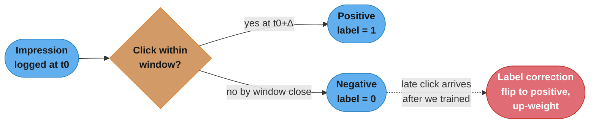
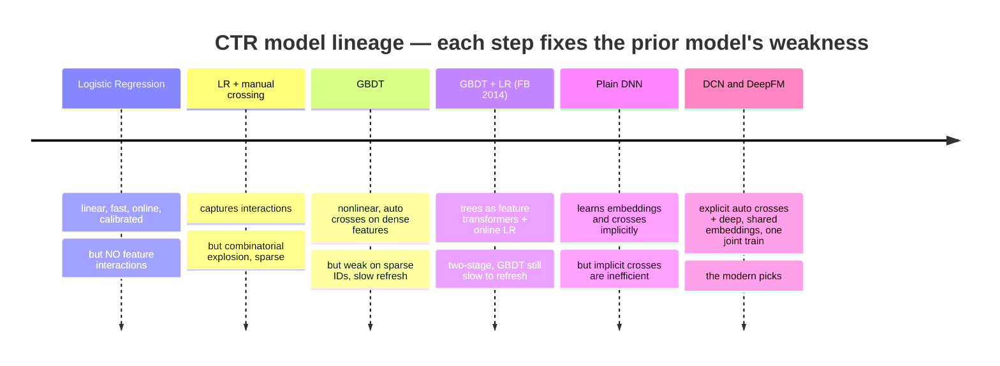
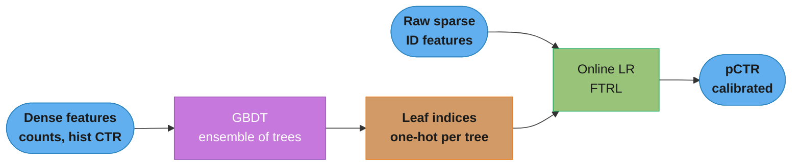
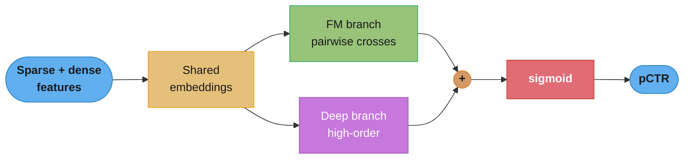
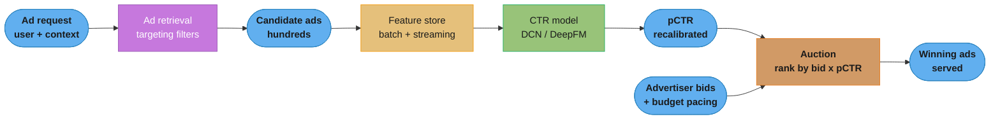
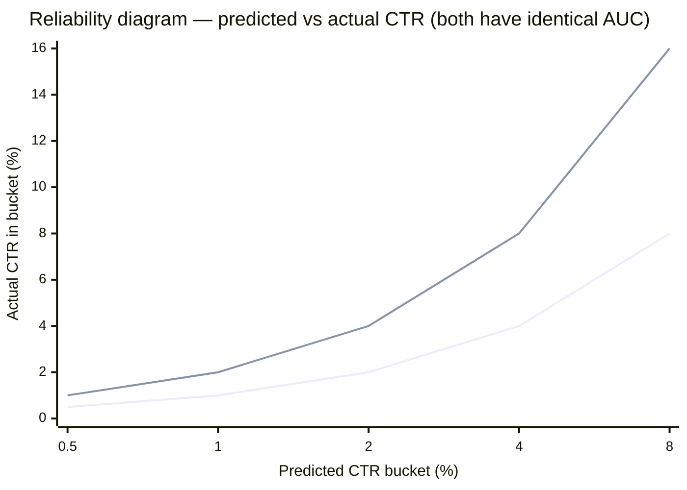

# Chapter 8: Ad Click Prediction on Social Platforms

> Ch 8 of 11 · ML System Design Interview (Aminian & Xu) · builds on Ch 6–7 — the CTR model lineage (LR → GBDT+LR → DCN/DeepFM), calibration for the auction, continual learning

## Chapter Map

This is the CTR (click-through-rate) chapter — design the model that, for every ad a social
platform could show you, predicts **P(click)**. The twist that separates it from Chapters 6–7 is
what the prediction is *for*: the number does not just rank a feed, it feeds an **ad auction** that
ranks candidate ads by **bid × pCTR** and charges advertisers real money. That makes the output a
*probability that must be right in an absolute sense*, not just a score that ranks correctly — so
this chapter spends as much effort on **calibration** and the **model lineage that made CTR
prediction tractable** (logistic regression → GBDT+LR → deep cross-feature networks) as it does on
architecture. It is also the chapter where **continual learning stops being a nice-to-have and
becomes a hard serving requirement**: ad performance drifts hourly, so a model that is a day stale
is already losing money.

**TL;DR:**
- CTR prediction is **binary classification** (`<user, ad, context> → P(click)`), but the pCTR
  feeds an auction (`rank by bid × pCTR`), so it must be **calibrated**, not merely well-ranked —
  which is why **log loss / normalized cross-entropy / calibration** beat accuracy and even AUC.
- CTR data is brutally **imbalanced** (~0.1–2% positive) and labels arrive **late** (delayed
  clicks). The fixes — **negative downsampling** and its **recalibration formula**, plus a
  **label-attribution window** — are the chapter's signature arithmetic.
- The **feature-crossing lineage** is the intellectual core: linear LR misses interactions; manual
  crosses explode combinatorially; **GBDT+LR** (Facebook 2014) uses trees as feature transformers;
  **DCN** and **DeepFM** learn crosses automatically with shared embeddings — present both, they
  are the two defensible modern picks.
- **Continual learning** (fine-tune every few hours, evaluate, deploy, rollback-guard) is a serving
  component here, not an afterthought.

---

## The Big Question

> "I have to price and rank billions of ad opportunities a day. Ranking them isn't enough — I bill
> advertisers by expected clicks, so my predicted click probability has to be *numerically honest*.
> How do I learn a probability that is both accurate *and* well-calibrated, from data that is 99%
> negatives and whose labels show up hours late, on a world that changes by the hour?"

Analogy: a recommender only has to seat guests in the right order; an **ad system runs a betting
market**. The auctioneer multiplies each advertiser's bid by your predicted click probability to
decide who wins and what they pay. If your probability is systematically 2× too high, the ranking
among similar bids may survive, but **every price, every budget-pacing decision, and every
cross-campaign comparison is wrong**. The whole chapter is the tension between *predicting well* and
*predicting honestly*, under imbalance, delay, and drift.

---

## 8.1 Clarifying Requirements

The interviewer poses: *design a system that predicts whether a user will click an ad shown on a
social feed.* The clarifying questions and the book's answers:

- **What is the business objective?** Maximize the platform's **revenue** — but the ML proxy is
  *accurate click prediction*, because revenue in a cost-per-click model is driven by showing ads
  the user is likely to click at a price the auction sets.
- **What does the output feed?** An **ad auction / ranking**. Candidate ads are ranked by
  **expected value = bid × pCTR** (an eCPM — effective cost per mille). This single fact drives the
  whole design: the model must output a **calibrated probability**, not just a monotonic score.
- **Is it personalized?** Yes — `<user, ad, context>` inputs; different users get different pCTR
  for the same ad.
- **What ad formats?** Feed ads: image and video creatives with text; treat creative content as a
  feature source.
- **What is the scale?** Social-platform scale: on the order of **billions of active users** and
  **tens of billions of ad impressions per day**. Worked estimate below.
- **What is the latency budget?** Ads are scored in the request path alongside organic ranking, so
  the model must score a candidate set within **tens of milliseconds** (a slice of the ~sub-second
  page budget).
- **How fresh must the model be?** Ad performance shifts **hourly** (new campaigns launch, creatives
  fatigue, events spike). The system needs **continual learning** — retrain/fine-tune every few
  hours, not weekly.
- **Do we have negative feedback?** Yes — users can **hide/report** ads; this is a second label
  worth modeling (multi-objective).
- **Any fairness/policy constraints?** Ad targeting is legally sensitive (housing, employment,
  credit) — flagged as an "other talking point," not the core model.

### Back-of-envelope scale

Take 1B daily active users, each seeing ~100 ad impressions/day:

```
impressions/day  = 1e9 users × 100 ads      = 1e11  impressions/day
avg QPS          = 1e11 / 86,400 s          ≈ 1.16e6 requests/s  (~1.2M QPS)
peak QPS (≈3×)   ≈ 3.5e6 requests/s
positives/day    = 1e11 × 1% CTR            = 1e9   clicks/day
training rows/day = 1e11 (before downsampling)
```

**In plain terms.** "Multiply users by ads to get a daily impression count, divide by a day's
seconds to get a rate, multiply by the click rate to get labels — and every awkward design decision
in this chapter falls out of the size of those three numbers." The chain is short on purpose: it
exists to prove that downsampling and a feature store are forced, not chosen.

| Symbol | What it is |
|--------|------------|
| DAU | Daily active users — 1e9, social-platform scale |
| ads/user/day | Ad impressions one active user sees in a day — ~100 |
| 86,400 | Seconds in a day; turns a per-day total into a per-second request rate |
| peak factor | Average-to-busiest-hour multiplier — 3x |
| CTR | Click-through rate, ~1% here; converts impressions into positive labels |

**Walk one example.**

```
impressions/day = 1,000,000,000 users x 100 ads   =  1e11    impressions/day
average QPS     = 1e11 / 86,400 s                 =  1,157,407 req/s   (the book's ~1.16e6)
peak QPS        = 1,157,407 x 3                   =  3,472,222 req/s   (the book's ~3.5e6)
clicks/day      = 1e11 x 0.01                     =  1e9     clicks/day
clicks/sec      = 1e9 / 86,400 s                  =  11,574  clicks/s

Two forced consequences, read straight off the numbers:
  1e11 rows/day cannot be stored or trained on raw   ->  downsample the negatives
  3.5e6 QPS inside a tens-of-ms budget               ->  precompute features, keep the model cheap
```

The 1e9-vs-1e11 gap is worth pausing on: even the *positives* alone number a billion a day, which is
already a large training set. Keeping all of them while discarding most of the 99e9 negatives is
therefore not a compromise at all — it throws away almost nothing the model needed.

Two consequences fall straight out of the arithmetic: (1) **1e11 rows/day is unlabelable and
untrainable raw** → we must **downsample negatives**; (2) **1M+ QPS with a tens-of-ms budget** →
the scoring model must be cheap per candidate, and heavy features must be **precomputed in a feature
store**, not computed inline.

---

## 8.2 Frame the Problem as an ML Task

### Defining the ML objective

Translate the business objective ("maximize revenue") into a measurable ML objective: **predict the
probability that a given user clicks a given ad in a given context, as accurately and as
calibratedly as possible.** Revenue is downstream (it depends on bids and the auction); the model
owns the probability.

### Specifying input and output

- **Input:** a triple `<user, ad, context>` — user features, ad/creative features, and request
  context (device, time, placement).
- **Output:** a single scalar **pCTR ∈ [0, 1]** = P(click | user, ad, context).

### Choosing the right ML category — pointwise binary classification

CTR prediction is framed as **pointwise learning-to-rank = binary classification**: each impression
is scored **independently**, label ∈ {clicked, not-clicked}, trained with binary cross-entropy.
Why pointwise rather than pairwise/listwise ranking losses (RankNet, LambdaMART, ListNet)?

- The **auction needs an absolute, calibrated probability** (`bid × pCTR`), and pairwise/listwise
  losses optimize *relative order within a request* — they are free to shift and rescale scores as
  long as the order is right, which **destroys calibration**. Pointwise log loss is a **proper
  scoring rule**: it is minimized only by the true probability, so it yields calibrated outputs.
- Pointwise scoring is trivially **parallelizable** across the candidate set and easy to serve at
  1M+ QPS.

This is the key divergence from the recommendation chapters (6–7), which could tolerate ranking
losses because nothing downstream *billed on the probability*.

---

## 8.3 Data Preparation

### Data engineering — the sources

| Entity | Key fields |
|--------|-----------|
| **Ads** | ad ID, advertiser ID, campaign ID, category/subcategory, creative (image/video/text), bid, targeting criteria |
| **Users** | user ID, demographics (age, gender, location, language), account age |
| **Impressions** | impression ID, user ID, ad ID, timestamp, placement/position, device, context |
| **Clicks** | impression ID, click timestamp (join key back to the impression) |
| **Conversions** | click ID, conversion timestamp, value (downstream advertiser goal) |

Labels are formed by **joining impressions to clicks**: an impression with a matching click is a
**positive**; an impression with no click (within a window — see delayed clicks) is a **negative**.

### Constructing the training dataset — imbalance

Real CTR is roughly **0.1–2%**. So negatives outnumber positives on the order of **50:1 to
1000:1**. Training on the raw 1e11 rows/day is wasteful and the extreme imbalance drowns the signal.

**Read it like this.** "The imbalance ratio is nothing more than the odds form of the CTR — the
share that did not click divided by the share that did." Seeing it as odds is what makes the book's
`50:1 to 1000:1` band verifiable rather than a quoted rule of thumb.

| Symbol | What it is |
|--------|------------|
| CTR | Fraction of impressions that get clicked — the positive class rate |
| `1 - CTR` | Fraction that do not get clicked — the negative class rate |
| imbalance | `(1 - CTR) / CTR`, negatives per positive |
| `w` | Negative-keep rate used later by downsampling — the fraction of negatives retained |

**Walk one example.** Both ends of the stated 0.1%-to-2% CTR range:

```
CTR = 0.1%  ->  imbalance = 0.999 / 0.001 =  999 : 1   (the book's "1000:1")
CTR = 2.0%  ->  imbalance = 0.980 / 0.020 =   49 : 1   (the book's "50:1")

So "50:1 to 1000:1" is exactly the 2%-to-0.1% CTR band restated as odds -- both endpoints check out.

What downsampling with w = 0.01 does to the harder end:
  before   1 positive : 999 negatives
  keep 1% of the negatives:  999 x 0.01 = 9.99 negatives
  after    1 positive : 9.99 negatives   ~=  10 : 1   (the book's "~10:1 training set")
```

The last three lines are worth memorizing as a pair with the recalibration formula below: `w = 0.01`
is not an arbitrary knob, it is the value that turns a 1000:1 problem into a roughly 10:1 one, and
that same `w` is the number the recalibration step needs to undo the damage.

**Negative downsampling** — keep all positives, keep only a random fraction `w` of negatives (e.g.
`w = 0.1` keeps 10% of negatives, `w = 0.01` keeps 1%). This shrinks the dataset ~10–100× and
rebalances the classes so the model spends its capacity on the positives. **But it biases the
predicted probability upward** — the training distribution now has far more positives than reality —
so predictions **must be recalibrated back**.

### The negative-downsampling recalibration formula (signature arithmetic)

If `p` is the probability the model predicts *after training on downsampled data* and `w` is the
negative-keep rate, the **calibrated** probability is (Facebook, He et al. 2014):

```
        p
q = -----------
    p + (1 - p)/w
```

Sanity checks and a worked example:

- `w = 1` (no downsampling): `q = p / (p + (1-p)) = p`. ✓ No correction.
- `w < 1` (negatives downsampled): `(1-p)/w > (1-p)`, so the denominator grows and `q < p` — we
  **scale the inflated prediction back down**, exactly as expected.

Worked example — true CTR near 0.1%, negatives ~1000:1 over positives. Downsample negatives to
`w = 0.01` (keep 1%), giving a ~10:1 negatives:positives training set. Suppose the trained model
outputs `p = 0.10` for some impression:

```
q = 0.10 / (0.10 + (1 - 0.10)/0.01)
  = 0.10 / (0.10 + 0.90/0.01)
  = 0.10 / (0.10 + 90)
  = 0.10 / 90.10
  ≈ 0.00111   (≈ 0.11% — a sane calibrated CTR, not the inflated 10%)
```

Without this recalibration step, **every pCTR entering the auction would be ~90× too high**, and
the auction's `bid × pCTR` comparisons and billing would be nonsense. The step is one line of code
and easy to forget — a classic interview gotcha.

**What the formula is telling you.** "Take the model's odds, stretch the losing side back out by the
same factor you shrank it with, and turn the restored odds back into a probability." Every symbol in
it is doing exactly one of those three jobs, which is why the correction is a single line.

| Symbol | What it is |
|--------|------------|
| `p` | The probability the model predicts after training on the downsampled data — inflated |
| `w` | Negative-keep rate; `w = 0.01` means 1% of negatives were kept |
| `1 - p` | The model's negative mass — the side that was artificially thinned |
| `(1 - p) / w` | That negative mass restored to its true size (divide by `w` = multiply by `1/w`) |
| `q` | The calibrated probability that is safe to hand the auction |

**Walk one example.** The chapter's own case, `p = 0.10` and `w = 0.01`, carried to the ratio:

```
q = p / ( p + (1 - p) / w )

    p          =  0.10
    1 - p      =  0.90
    (1-p)/w    =  0.90 / 0.01     =  90.00       negatives restored to 100x their kept size
    denominator=  0.10 + 90.00    =  90.10
    q          =  0.10 / 90.10    =  0.00110988  =  0.110988%

How wrong was the raw prediction?
    p / q      =  0.10 / 0.00110988  =  90.10x    -- the chapter's "~90x too high" is exact

Sanity check at w = 1 (no downsampling):
    (1-p)/1    =  0.90
    q          =  0.10 / (0.10 + 0.90) = 0.10 / 1.00 = 0.10 = p        no correction, as required
```

Note the inflation factor is `90.10`, not `1/w = 100`. The difference is the surviving `p` term in
the denominator: the model's own positive mass was never thinned, so it sits alongside the restored
negatives instead of being scaled with them. That is precisely why the fix is this formula and not a
flat multiply by `w` — a flat `p x w = 0.001` would land 9.9% low.

### The delayed-click (delayed-feedback) problem

A click does **not** arrive at impression time — the user may click **seconds, minutes, or even
days later**. This breaks naive labeling:

- If you **label immediately** ("no click yet → negative"), you **mislabel eventual positives as
  negatives**, biasing CTR *down* and corrupting training — worst for continual learning, which
  wants the freshest data.
- If you **wait for a long attribution window** (say 24h) before labeling, your labels are
  *accurate* but **stale by a day**, defeating the hourly-freshness requirement.

This is a direct **freshness ↔ label-maturity tradeoff**. Options the book/field use:

1. **Attribution window** — fix a window (e.g. 1h or 24h); an impression with no click by window
   close is a confirmed negative. Simple; trades freshness for correctness.
2. **Delayed-feedback model** (Chapelle 2014) — model the click-delay distribution (e.g.
   exponential) jointly with the click probability, so a "not-clicked-yet" impression is treated as
   *possibly-still-going-to-click* rather than a hard negative, correcting the loss. Lets you train
   on fresh data without waiting for the full window.
3. **Label correction / importance weighting** — start with the immediate (biased) label and
   **re-ingest a positive correction** when a delayed click lands, up-weighting to fix the bias.



Caption: the impression is logged before its label exists; wait too long and the data is stale,
label too soon and eventual clickers are mislabeled negatives — the delayed-feedback problem is why
CTR labeling needs an attribution window or a delay model plus late-click corrections.

---

## 8.4 Feature Engineering

### Ad features
- **Ad ID / advertiser ID / campaign ID** — very high cardinality → **embeddings** (see hashing
  below).
- **Category / subcategory** — one-hot or embedding.
- **Creative content** — image/video via a **pretrained visual encoder** (CNN/CLIP embedding);
  text via a **pretrained text encoder** (BERT-style embedding).
- **Historical engagement counts** — ad/campaign/advertiser **historical CTR**, total impressions,
  total clicks (strong signals, but a leakage trap — see point-in-time correctness).

### User features
- **Demographics** — age (bucketized), gender, location, language.
- **Context** — device, OS, time-of-day, day-of-week, placement/position.
- **Historical behavior** — categories the user clicked before, click frequency, aggregated
  embeddings of previously clicked ads.

### User–ad interaction features
- Affinity between this user and this ad's category/advertiser; whether the user previously engaged
  with the advertiser; distance between the user's interest embedding and the ad embedding.

### Feature crossing — the reason the model lineage exists

A **feature cross** is a synthetic feature combining two (or more) raw features, e.g.
`(age_bucket = 18-24) AND (ad_category = mobile_gaming)`. Cross features carry signal that neither
feature carries alone: young users may click gaming ads at 5× the base rate even though "young" and
"gaming ad" are each only mildly predictive.

- **Why linear models miss interactions:** logistic regression is `σ(w·x)` — the contribution of
  each feature is **additive and independent**. It literally cannot represent "young *times*
  gaming" unless you **hand-build the crossed feature** and add it as a new column.
- **Manual crossing explodes combinatorially:** with hundreds of categorical features of high
  cardinality, the number of pairwise (let alone higher-order) crosses is astronomical; you can't
  enumerate them, and most crossed columns are empty (sparse) with almost no data.
- **The lineage answer:** models that **learn** useful crosses automatically — GBDT (via tree
  paths), FM (via latent-vector inner products), DCN's cross network, DeepFM's FM branch.

### Sparse high-cardinality categoricals — embeddings and the hashing trick

Ad IDs and user IDs number in the **hundreds of millions to billions**. A one-hot column of a
billion categories is impossible; the fix is an **embedding table** mapping each ID to a dense
vector (e.g. 16–64 dims). But a billion-row embedding table is huge, and new IDs appear constantly.

**The hashing trick (feature hashing):** hash each ID into a fixed number of buckets `B` (e.g.
`B = 10^6`) and embed the bucket, so the table size is bounded regardless of cardinality and new
IDs get a bucket for free. Cost: **collisions** — two distinct IDs sharing a bucket share an
embedding, adding noise. Tune `B` to trade **memory vs collision rate**; hot IDs can be given
dedicated (unhashed) slots.

---

## 8.5 Model Development — the CTR lineage

This is the heart of the chapter: a **guided tour of CTR models from simplest to modern**, each step
motivated by a specific weakness of the previous one. Start simple, add complexity only where it
earns its keep.



Caption: read left to right as a chain of "yes, but" — every model is adopted to cure a named defect
of its predecessor, ending at the two modern architectures (DCN, DeepFM) that learn explicit feature
crosses *and* deep interactions in a single jointly-trained network.

### 1. Logistic regression (LR)

`pCTR = σ(w·x + b)`. **Pros:** extremely fast to train and serve, trivially **online-trainable**
(SGD/FTRL on a stream), naturally outputs a **calibrated probability**, interpretable, scales to
billions of sparse features. **Con:** **linear** — no feature interactions unless you hand-craft
them. It is the right *baseline* and, historically (Google/Facebook), a strong production model with
FTRL online learning — but it leaves interaction signal on the table.

### 2. LR + manual feature crossing

Add hand-built cross columns to LR. **Pro:** now captures the interactions you thought of. **Cons:**
**combinatorial explosion** (can't enumerate all useful crosses), requires **manual feature
engineering expertise**, and the crossed columns are **extremely sparse** (few examples per cross),
so many are unlearnable. This motivates *learning* crosses instead of hand-coding them.

### 3. Gradient-boosted decision trees (GBDT)

An ensemble of trees (XGBoost/LightGBM). **Pros:** captures **nonlinearities and feature
interactions automatically** — each root-to-leaf path is effectively a learned conjunction (a
cross) of feature thresholds; strong on **dense/continuous tabular features** (counts, historical
CTRs). **Cons:** weak on **high-cardinality sparse categorical IDs** (trees split poorly on
millions of one-hot columns); does **not update online** well (retraining the ensemble is slow),
which clashes with the hourly-freshness requirement; can be memory-heavy at serving.

### 4. GBDT + LR — the Facebook 2014 classic

Combine the strengths: use **GBDT as an automatic feature transformer**, then feed its output to an
**online LR**.

- Train a GBDT on the dense features. For each input, record **which leaf it lands in, in each
  tree** — the vector of leaf indices is a **learned, nonlinear, crossed feature representation**.
- One-hot-encode those leaf indices (a very sparse binary vector) and feed them, alongside the raw
  sparse features, into a **logistic regression trained online**.

This gets **GBDT's automatic feature crossing** *and* **LR's cheap, calibrated, online updating** —
you refresh the LR continuously on fresh data while the (slower) GBDT is rebuilt less often.



Caption: the trees are frozen feature transformers whose leaf memberships are a learned cross
representation; the cheap online LR on top of those leaves plus the raw IDs is what updates
continuously — GBDT+LR is the bridge from hand-crafted crosses to fully learned deep crosses.

### 5. Plain neural network (DNN)

Embed sparse features, concatenate, pass through fully-connected layers. **Pro:** learns embeddings
for sparse IDs and can model interactions. **Con:** a plain DNN learns feature crosses only
**implicitly and inefficiently** — it must burn many parameters and much data to approximate even
low-order crosses that an explicit mechanism gets for near-free. This motivates hybrid architectures
with an **explicit cross component** bolted onto a deep component.

### 6. Deep & Cross Network (DCN)

DCN runs **two towers in parallel over shared input embeddings** and combines them:

- **Cross network** — a stack of *cross layers* that compute **explicit, bounded-degree feature
  crosses**. Each cross layer:

  ```
  x_{l+1} = x_0 · (x_l^T · w_l) + b_l + x_l
  ```

  where `x_0` is the original input vector. Each additional layer raises the **polynomial degree of
  feature interaction by one** (layer 1 = pairwise, layer 2 = 3-way, ...), so an `L`-layer cross
  network captures crosses up to degree `L+1` — **explicitly and parameter-efficiently** (v1's cross
  weights are vectors, `O(d)` params per layer). The residual `+ x_l` keeps lower-order terms.
- **Deep network** — a standard DNN capturing **high-order, implicit** interactions.
- The two outputs are **concatenated → sigmoid** for pCTR, and the whole thing is **trained jointly**
  end to end. (DCN-v2 upgrades the cross weight from a vector to a matrix for more expressive
  crosses at higher cost.)

**Strength:** explicit crosses **beyond 2nd order** without manual engineering; the cross network is
cheap. **Cost:** slightly more machinery than a pure DNN.

### 7. Factorization Machines (FM)

FM models **all pairwise interactions** using a **latent vector `v_i` per feature**:

```
ŷ = w_0 + Σ_i w_i x_i + Σ_{i<j} <v_i, v_j> x_i x_j
```

The pairwise weight for features `i,j` is the **inner product of their latent vectors**, not a free
parameter. **Why this matters for sparse CTR data:** a full pairwise-weight matrix would have a
parameter per pair (unlearnable when most pairs never co-occur); FM instead **shares statistics
through the latent vectors**, so it can estimate an interaction for a pair it has *never seen
together* as long as each feature appeared with *others*. Computation is `O(k·n)` (not `O(n²)`)
after algebraic simplification. **Limit:** FM captures only **2nd-order** interactions.

### 8. DeepFM

DeepFM fuses FM and a DNN over **shared embeddings**:

- **FM component** — explicit **low-order (pairwise)** interactions via the latent vectors above.
- **Deep component** — implicit **high-order** interactions via a DNN.
- **Shared embedding layer** — both components read the *same* feature embeddings, and the whole
  network is **trained jointly** with **no manual feature engineering** and **no separate
  pretraining stage** (its advantage over Wide&Deep, whose "wide" side still needs hand-crafted
  crosses, and over GBDT+LR's two-stage pipeline).



Caption: DeepFM's FM branch and deep branch read one shared embedding table and are summed before
the sigmoid — a single joint training pass yields both explicit pairwise and implicit high-order
crosses, which is why it needs no hand-crafted wide features or GBDT pretraining stage.

### DCN vs DeepFM — an honest comparison (the book's converged options)

The book advances the lineage to these **two modern deep-CTR architectures and presents both**;
either is a defensible final answer, and a strong interview candidate names *both* and states the
tradeoff rather than picking dogmatically.

| Dimension | DeepFM | DCN (v1 / v2) |
|-----------|--------|---------------|
| Explicit cross mechanism | **FM** — pairwise (2nd-order) inner products | **Cross network** — bounded degree up to `L+1` |
| Cross order | 2nd-order explicit; higher-order only implicitly (deep branch) | **Explicit high-order** (grows with cross depth) |
| Parameter efficiency of cross part | Very efficient for pairwise on sparse features | v1 cross layer `O(d)`; v2 `O(d²)`, more expressive |
| Manual feature engineering | None | None |
| Training | Single joint pass, shared embeddings | Single joint pass, shared embeddings |
| Best when | Pairwise interactions dominate; extreme sparsity | Higher-order crosses matter; richer interaction structure |
| Interpretability of crosses | FM latent vectors are inspectable | Cross-layer contributions less transparent |

**Bottom line:** DeepFM makes explicit **pairwise** crosses very cheap and robust on ultra-sparse
data; DCN captures **explicit higher-order** crosses that DeepFM only reaches implicitly. Both share
embeddings, both train jointly, both beat GBDT+LR on sparse-ID-heavy CTR data. Choose DeepFM when
2nd-order interactions carry most signal and sparsity is extreme; choose DCN (v2) when you have
evidence that higher-order crosses pay off. The book uses this pair as the destination of the
lineage rather than crowning a single universal winner.

### Model training

- **Loss:** **binary cross-entropy (log loss)** — `-[y log p + (1-y) log(1-p)]` — the proper scoring
  rule that yields calibrated probabilities.
- **Sparse features:** learned **embeddings** (with hashing for cardinality).
- **Imbalance:** **negative downsampling** (then **recalibrate**, §8.3) and/or class-weighted loss.
- **Optimizer:** SGD variants; **FTRL** for the LR-style online components (sparse, per-coordinate
  learning rates).
- **Continual/online:** train incrementally on the stream (see §8.7).

---

## 8.6 Evaluation

### Offline metrics — why the obvious ones fail

- **Accuracy is a trap.** At ~1% CTR, a model that predicts "no click" for *everything* scores
  **~99% accuracy** while being useless. Accuracy is meaningless under this imbalance.
- **AUC / ROC-AUC is *necessary but not sufficient*.** AUC measures **ranking/discrimination** — the
  probability a random positive outranks a random negative. Crucially, **AUC is invariant to any
  monotonic rescaling of scores**: a model that outputs `2 × true_pCTR` everywhere has a *perfect*
  ranking and *identical* AUC, yet is **wildly miscalibrated** and would wreck the auction. AUC
  cannot see calibration, so it cannot be the only metric here.
- **Log loss / cross-entropy** is the primary offline metric — a **proper scoring rule** minimized
  only by the true probability, so it **rewards calibration**, not just ordering.

### Normalized cross-entropy (NE)

Facebook's headline offline metric. Divide the model's average cross-entropy by the cross-entropy of
the trivial baseline that always predicts the **background (average empirical) CTR** `p̄`:

```
         -(1/N) Σ_i [ y_i log p_i + (1 - y_i) log(1 - p_i) ]
NE = ----------------------------------------------------------
              -( p̄ log p̄ + (1 - p̄) log(1 - p̄) )
```

- **`NE < 1`** ⇒ the model beats "always predict the average CTR"; **lower is better**.
- The denominator normalizes away the **background CTR level**, so NE is **comparable across
  datasets/time periods with different base rates** — raw log loss is not (a period with 0.5% CTR
  has structurally lower log loss than a 2% period regardless of model quality). This comparability
  is exactly why Facebook reports NE.

**Stated plainly.** "Score the model by how surprised it was by what actually happened, then divide
that surprise by how surprised a model that knows nothing but the average CTR would have been." The
division is the entire contribution of NE — it turns an absolute penalty into a fraction of a fixed
reference, so two periods with different base rates become comparable.

| Symbol | What it is |
|--------|------------|
| `y_i` | The true label of impression `i` — 1 if clicked, 0 if not |
| `p_i` | The model's predicted click probability for impression `i` |
| `-[y log p + (1-y) log(1-p)]` | Log loss for one impression — the surprise, in nats |
| `p̄` | The background CTR: the empirical average click rate over the same set |
| numerator | Mean log loss of the model across `N` impressions |
| denominator | Log loss of always predicting `p̄` — the do-nothing baseline |
| NE | Their ratio; `< 1` beats the baseline, `= 1` matches it, `> 1` is worse than useless |

**Walk one example.** Four impressions, one of which was clicked:

```
  i   y_i    p_i     term = -log(p_i) if y=1 else -log(1 - p_i)
  1    1    0.60     -ln(0.60)  =  0.5108
  2    0    0.20     -ln(0.80)  =  0.2231
  3    0    0.10     -ln(0.90)  =  0.1054
  4    0    0.30     -ln(0.70)  =  0.3567
                                   ------
  mean log loss (numerator) = 1.1960 / 4 = 0.2990

  background CTR  p̄ = 1 clicked / 4 impressions = 0.25
  denominator = -( 0.25 x ln 0.25 + 0.75 x ln 0.75 )
              = -( 0.25 x -1.3863 + 0.75 x -0.2877 )
              = 0.3466 + 0.2158 = 0.5623

  NE = 0.2990 / 0.5623 = 0.5317
```

NE = 0.5317 means the model carries roughly 53% of the uncertainty that a constant "everyone clicks
at 25%" predictor carries — a clear win. Note what would happen to the *numerator alone* if the same
model quality were evaluated on a 1%-CTR day: nearly every term becomes `-ln(1 - small)`, which is
tiny, so raw log loss would collapse toward zero and look like an improvement. The denominator
collapses by the same mechanism, so NE stays put. That invariance is the whole reason to report it.

### Calibration — the metric the auction cares about

- **Calibration plot / reliability diagram:** bucket predictions by predicted pCTR, and in each
  bucket plot **mean predicted** vs **mean actual** click rate. A perfectly calibrated model lies on
  the **`y = x` diagonal**.
- **Calibration ratio:** `Σ predicted pCTR / Σ actual clicks` over a set of impressions — should be
  **≈ 1.0**. `> 1` = the model over-predicts (auction bids too aggressively); `< 1` = under-predicts.
- **Expected Calibration Error (ECE):** the average `|predicted − actual|` across buckets, weighted
  by bucket size — a single scalar summarizing miscalibration.

**Why this is the point:** the pCTR feeds `bid × pCTR`. A model can have great AUC and still be
systematically 2× high; the *ranking* among equal-bid ads survives, but **prices, budget pacing, and
cross-campaign/cross-auction comparisons all break**. Calibration is not a nicety here — it is the
correctness condition for the auction.

**The idea behind it.** "The auction does not rank on pCTR, it ranks on `bid × pCTR × 1000` — an
expected revenue per thousand impressions — so a wrong pCTR is a wrong dollar figure, and dollar
figures get compared against things that were never scaled by your error." The moment a CPM bid or a
price floor enters the same auction, uniform miscalibration stops cancelling and starts flipping
outcomes.

| Symbol | What it is |
|--------|------------|
| bid | What the advertiser pays per click (CPC) — a real number, never miscalibrated |
| pCTR | The model's predicted click probability — the only estimated term |
| eCPM | `bid × pCTR × 1000`: expected revenue per thousand impressions; the auction's ranking score |
| CPM bid | A competing advertiser's direct bid per thousand impressions — no pCTR involved |

**Walk one example.** One CPC ad against one CPM ad, first with honest pCTR, then 2x-inflated:

```
Ad A (CPC):  bid $2.00 per click,  TRUE pCTR 1.0%
Ad D (CPM):  bid $25.00 per thousand impressions  -- a fixed price, no pCTR term

Honest pCTR:
  eCPM(A) = 2.00 x 0.010 x 1000 = $20.00
  eCPM(D) =                       $25.00
  D wins. Correct: the slot really is worth more to D.

Model is 2x miscalibrated high (pCTR reported as 2.0%):
  eCPM(A) = 2.00 x 0.020 x 1000 = $40.00
  eCPM(D) =                       $25.00
  A wins -- but A only ever delivers 1.0% x $2.00 x 1000 = $20.00 of real revenue.

Damage per thousand impressions:  $25.00 - $20.00 = $5.00 forgone
As a share of what was on the table:  5.00 / 25.00 = 20% revenue haircut on every affected slot
```

This is the case AUC structurally cannot see. AUC only asks whether positives outrank negatives
inside the model's own score list; ad D never passes through the model at all, so no amount of
ranking skill protects the auction. The 20% haircut is invisible on every offline dashboard that
does not measure calibration.

### Online metrics

- **CTR** on served ads (the direct online proxy).
- **Conversion rate** and **revenue lift** (eCPM) — the business outcome.
- **Negative feedback rate** — ad **hide/report** rates (a rising hide rate means we are optimizing
  clicks at the cost of user experience — a multi-objective signal).
- **User retention / session length** as guardrail metrics against over-monetization.

---

## 8.7 Serving

Three cooperating pipelines: data preparation, continual learning, and prediction.

### Data preparation pipeline
- **Batch features** — historical aggregates (ad/advertiser historical CTR, user long-term interest
  embeddings) computed offline on a schedule and written to the **feature store**.
- **Streaming features** — near-real-time counters (last-hour CTR of an ad, this-session behavior)
  computed on a stream and written to the online store with low latency.
- **Point-in-time correctness** — features must be materialized *as of the impression timestamp* to
  avoid leaking the future (see pitfalls).

### Continual learning pipeline (the serving requirement, not an afterthought)
Ad performance drifts **hourly**, so the model is **continually retrained**:

1. **Ingest** the freshest labeled impressions (subject to the delayed-feedback window/correction).
2. **Fine-tune** the deployed model incrementally (cheaper than full retrain) — or periodically
   **retrain from scratch** to avoid drift accumulation.
3. **Evaluate** the candidate on a **held-out fresh slice** (NE, calibration).
4. **Deploy** behind a **rollback guard** — auto-revert if online CTR/calibration/NE regresses.

**Catastrophic-forgetting caveat:** naive incremental fine-tuning can let the model **forget older
but still-valid patterns** (seasonal, long-tail advertisers) as it chases the latest data. Mitigate
by mixing a **replay buffer** of older data into each fine-tune, or by **periodic full retrains**;
this is the classic **fine-tune-cadence vs stability** tradeoff.

### Prediction pipeline



Caption: candidate ads from targeting are hydrated with precomputed features, scored to a
recalibrated pCTR, and handed to the auction that ranks by `bid × pCTR` — the model owns only the
probability; bids and budget pacing are separate (non-ML) inputs to the auctioneer.

---

## 8.8 Other Talking Points

- **Data leakage / point-in-time correctness.** Historical-CTR and count features are the strongest
  signals *and* the easiest leaks: if you join the feature "as computed today" onto an old
  impression, you leak the future. Materialize every feature **as of the impression timestamp**
  (offline training must reconstruct the feature store's state at that time).
- **Calibration techniques.** Beyond the downsampling recalibration formula: **Platt scaling** (fit
  a logistic `σ(a·s + b)` on a held-out set to map raw scores to probabilities), **isotonic
  regression** (non-parametric monotonic mapping, more flexible but data-hungry), and **temperature
  scaling**. Apply after training as a post-hoc calibration layer.
- **Retraining vs fine-tuning cadence.** Fine-tune hourly for freshness; full-retrain periodically to
  purge drift and catastrophic forgetting — pick the cadence from online calibration/NE regressions.
- **Multi-objective.** Real systems predict **click *and* conversion *and* hide/report** and combine
  them (e.g. `score = pCTR × value − λ·p(hide)`), because pure click-maximization invites clickbait
  and user harm. This mirrors the multi-task feed-ranking pattern.
- **Position/selection bias.** An ad's position affects its click rate independent of relevance;
  include **position as a training feature** and **neutralize it at serving** (e.g. set to a fixed
  top position), so the model learns relevance, not "was it on top."
- **Cold start / exploration.** New ads and advertisers have no history; reserve **exploration
  traffic** (bandit/epsilon-greedy) to gather clicks, and lean on content features (creative
  embeddings) until historical CTR matures.
- **Fairness and ad-targeting policy.** Targeting for **housing, employment, and credit** ads is
  legally restricted; the model and targeting must comply — a policy layer, not just an ML concern.
- **Budget pacing (the non-ML neighbor).** Deciding how fast to spend an advertiser's daily budget
  is a **control/optimization** problem that sits *beside* the CTR model in the auction, not inside
  it — worth naming so the interviewer sees you know where the ML boundary is.

---

## Visual Intuition

### The DCN cross layer — how one layer adds one degree of crossing

```
cross layer:   x_{l+1} = x_0 · (x_l^T · w_l) + b_l + x_l
                          \_______________/          \__/
                       explicit cross with x_0     residual
                                                  (keep lower orders)

    x_0        (degree-1 terms: a, b, c, ...)
     |
   layer 1 ->  x_1 contains degree-2 terms:  a*b, a*c, b*c, ...
     |
   layer 2 ->  x_2 contains degree-3 terms:  a*b*c, ...
     |
   layer L ->  x_L contains crosses up to degree (L+1)
```

Caption: each cross layer multiplies the running vector by the *original* input `x_0`, so stacking
`L` layers reaches explicit feature crosses of degree `L+1` — this is why DCN gets high-order
crosses that FM/DeepFM's single pairwise layer only reaches implicitly through its deep branch.

### Calibration — why AUC can't see it (reliability diagram)



Caption: both curves rank impressions identically (same AUC), but the upper line predicts 2× the
true click rate in every bucket — the auction would over-bid on all of them. AUC is blind to this
vertical gap; only log loss, NE, and calibration metrics catch it, which is why they are the primary
offline metrics for a model whose output is billed on.

### The imbalance-and-recalibration pipeline

```mermaid
flowchart LR
    classDef io      fill:#61afef,stroke:#2e86c1,color:#1a1a1a,font-weight:bold
    classDef frozen  fill:#c678dd,stroke:#9b59b6,color:#fff
    classDef train   fill:#98c379,stroke:#27ae60,color:#1a1a1a
    classDef mathOp  fill:#d19a66,stroke:#e67e22,color:#1a1a1a,font-weight:bold
    classDef lossN   fill:#e06c75,stroke:#c0392b,color:#fff,font-weight:bold
    classDef req      fill:#56b6c2,stroke:#0097a7,color:#1a1a1a
    classDef base    fill:#e5c07b,stroke:#f39c12,color:#1a1a1a

    RAW(["Raw impressions<br/>~1% CTR, 1000:1"]) --> DS["Downsample negs<br/>keep fraction w"]
    DS --> TRAIN["Train model<br/>on ~10:1 data"]
    TRAIN --> P(["Biased p<br/>too high"])
    P --> RECAL["Recalibrate<br/>q = p / (p + (1-p)/w)"]
    RECAL --> Q(["Calibrated q<br/>for the auction"])

    class RAW,P,Q io
    class DS mathOp
    class TRAIN train
    class RECAL lossN
```



Caption: downsampling negatives is what makes 1e11 rows/day trainable and rebalances the classes,
but it inflates every prediction — the one-line recalibration `q = p/(p+(1-p)/w)` undoes exactly that
inflation before the pCTR reaches the auction.

---

## Key Concepts Glossary

- **pCTR** — predicted click-through rate, `P(click | user, ad, context) ∈ [0,1]`; the model's output.
- **Ad auction** — mechanism that ranks candidate ads by expected value and sets prices.
- **eCPM / `bid × pCTR`** — effective cost per mille; the auction's ranking score.
- **Calibration** — property that predicted probabilities match observed frequencies (avg predicted ≈ avg actual).
- **Reliability diagram / calibration plot** — predicted vs actual CTR per bucket; diagonal = perfect.
- **Expected Calibration Error (ECE)** — size-weighted average `|predicted − actual|` across buckets.
- **Log loss / cross-entropy** — proper scoring rule; primary offline CTR metric.
- **Normalized cross-entropy (NE)** — cross-entropy ÷ background-CTR baseline cross-entropy; `<1` beats baseline; comparable across base rates.
- **AUC / ROC-AUC** — ranking/discrimination metric; invariant to monotonic rescaling, hence blind to calibration.
- **Negative downsampling** — keep all positives, keep only fraction `w` of negatives to shrink and rebalance data.
- **Recalibration formula** — `q = p / (p + (1-p)/w)`; undoes downsampling's upward bias.
- **Delayed feedback / delayed click** — clicks arrive long after impression, so immediate labels mislabel eventual positives.
- **Attribution window** — fixed time after impression within which a click counts as a positive.
- **Delayed-feedback model** — models click-delay distribution to train on fresh data without a full wait.
- **Feature cross** — synthetic feature combining two+ raw features (e.g. age × ad-category).
- **Hashing trick (feature hashing)** — hash high-cardinality IDs into `B` buckets; bounds table size, causes collisions.
- **Logistic regression (LR)** — linear `σ(w·x)`; fast, online, calibrated, no interactions.
- **GBDT** — gradient-boosted trees; auto crosses on dense features, weak on sparse IDs, slow to refresh.
- **GBDT + LR (Facebook 2014)** — trees as feature transformers (leaf indices) feeding an online LR.
- **Factorization Machine (FM)** — pairwise interactions via inner products of per-feature latent vectors; robust on sparse data.
- **Deep & Cross Network (DCN)** — deep tower + cross network learning explicit bounded-degree crosses; DCN-v2 uses matrix cross weights.
- **Cross layer** — `x_{l+1} = x_0·(x_l^T·w_l) + b_l + x_l`; each layer adds one interaction degree.
- **DeepFM** — FM branch (pairwise) + deep branch (high-order) over shared embeddings, jointly trained, no manual features.
- **Wide & Deep** — predecessor whose "wide" side still needs hand-crafted cross features.
- **Continual learning** — retrain/fine-tune on fresh data on a short cadence; a serving requirement here.
- **Catastrophic forgetting** — incremental fine-tuning erasing older still-valid patterns; mitigated by replay/periodic retrain.
- **Point-in-time correctness** — materializing each feature as of the event timestamp to prevent leakage.
- **Platt scaling / isotonic regression** — post-hoc calibration mappings from scores to probabilities.
- **Position bias** — position affects click rate independent of relevance; modeled as a feature, neutralized at serving.
- **Budget pacing** — non-ML control problem spending an advertiser's budget over time, beside the CTR model.

---

## Tradeoffs & Decision Tables

### The model lineage at a glance

| Model | Feature interactions | Sparse IDs | Online / fresh | Calibrated | Verdict |
|-------|---------------------|-----------|----------------|-----------|---------|
| Logistic regression | None (linear) | Good | Excellent (FTRL) | Yes | Strong baseline |
| LR + manual crossing | Only hand-built | Sparse crosses | Good | Yes | Doesn't scale (manual) |
| GBDT | Auto (dense only) | Weak | Poor (slow refresh) | Reasonable | Great tabular, weak IDs |
| GBDT + LR | Auto (trees) + linear | Good (via LR) | LR part online | Yes | 2014 production classic |
| Plain DNN | Implicit only | Good (embeddings) | Yes | Yes | Inefficient crosses |
| **DCN** | **Explicit high-order + deep** | Good | Yes | Yes | Modern pick |
| **DeepFM** | **Explicit pairwise + deep** | Excellent | Yes | Yes | Modern pick |

### Metric selection

| Metric | Measures | Use / trap |
|--------|----------|-----------|
| Accuracy | Correct class rate | TRAP under 1% CTR (99% by predicting all-negative) |
| AUC / ROC-AUC | Ranking / discrimination | Necessary, but **blind to calibration** |
| Log loss | Probability quality | Primary — proper scoring rule, rewards calibration |
| Normalized cross-entropy | Log loss vs background CTR | Comparable across base rates; `<1` beats baseline |
| Calibration (ratio, ECE) | Predicted ≈ actual | **The auction's correctness condition** |
| Online CTR / revenue / hide rate | Business outcome | Ground truth; hide rate is the guardrail |

### Delayed-feedback handling

| Approach | Freshness | Label correctness | Complexity |
|----------|-----------|-------------------|-----------|
| Immediate labeling | Highest | Worst (mislabels late clickers) | Lowest |
| Long attribution window | Low (stale) | High | Low |
| Delayed-feedback model | High | High | High (models delay) |
| Immediate + late correction | High | High after correction | Medium |

---

## Common Pitfalls / War Stories

- **Forgetting to recalibrate after downsampling.** The single most common CTR bug: you downsample
  negatives to make training tractable, ship the model, and every pCTR is inflated ~1/w. The auction
  over-bids and mis-bills across the board. Always apply `q = p/(p+(1-p)/w)` (or a post-hoc
  calibrator) before the auction.
- **Optimizing AUC and shipping a miscalibrated model.** AUC looks great, offline ranking is fine,
  but predictions are systematically 2× high — the auction's prices and budget pacing break even
  though nobody notices in an AUC dashboard. Track **calibration and NE**, not just AUC.
- **Labeling too early and poisoning continual training.** Marking every impression negative at
  impression time (because the click hasn't arrived yet) feeds a stream of mislabeled negatives into
  the hourly retrain, dragging predicted CTR down and compounding drift. Use an attribution window
  or delayed-feedback correction.
- **Leaking historical-CTR features.** Joining "the ad's CTR as of now" onto a week-old impression
  leaks the future; offline metrics look magical, online performance collapses. Reconstruct features
  **as of the impression timestamp**.
- **Catastrophic forgetting from aggressive fine-tuning.** Hourly fine-tunes that only see the last
  hour chase transient spikes and forget seasonal/long-tail advertiser patterns; a Monday-morning
  model forgets weekend behavior. Mix a replay buffer or schedule periodic full retrains.
- **GBDT on raw high-cardinality IDs.** Trees split poorly on millions of one-hot ID columns and the
  model bloats; either embed the IDs (DNN family) or feed GBDT only dense features and let an
  LR/embedding component handle the IDs.
- **Clickbait from single-objective click maximization.** Optimizing pCTR alone surfaces
  outrage/clickbait creatives, spiking hide/report rates and hurting retention. Add hide/conversion
  objectives and watch the negative-feedback guardrail.

---

## Real-World Systems Referenced

Facebook (the GBDT+LR pipeline and normalized-cross-entropy / calibration methodology from He et al.
2014, "Practical Lessons from Predicting Clicks on Ads at Facebook"); Google (Wide & Deep, and FTRL
online logistic regression for CTR); Deep & Cross Network / DCN-v2 (Google); DeepFM (Huawei);
Factorization Machines (Rendle); gradient-boosting libraries XGBoost and LightGBM; the delayed-
feedback model (Chapelle 2014).

---

## Summary

Ad click prediction is **binary classification** — `<user, ad, context> → pCTR` — but its output
feeds an **auction that ranks by `bid × pCTR` and bills real money**, so the prediction must be
**calibrated**, not merely well-ordered. That single requirement reshapes every later choice: it
picks **pointwise log loss** over ranking losses, it makes **log loss / normalized cross-entropy /
calibration** the primary metrics over accuracy (useless at 1% CTR) and AUC (blind to calibration),
and it turns **negative downsampling** into a two-step move — downsample to make 1e11 rows/day
trainable, then **recalibrate** with `q = p/(p+(1-p)/w)`. Labels arrive late, so the **delayed-click
problem** forces an attribution window or a delayed-feedback model. The **model lineage** is the
chapter's spine: LR is linear and misses interactions; manual crosses explode; **GBDT** auto-crosses
dense features but stumbles on sparse IDs and can't refresh fast; **GBDT+LR** (Facebook) uses trees
as feature transformers feeding an online LR; and the modern destinations, **DCN** (explicit
high-order crosses via cross layers) and **DeepFM** (explicit pairwise FM + deep, shared embeddings,
one joint train), learn crosses automatically — present both, they are the two defensible picks.
Finally, because ad performance drifts hourly, **continual learning** (fine-tune, evaluate,
deploy, rollback-guard, guard against catastrophic forgetting) is a **serving component**, and the
pCTR is recalibrated before it ever reaches the auction that pairs it with a bid.

---

## Interview Questions

**Q: Why does calibration matter for an ad system when a recommender can get away with just good ranking?**
Because the pCTR feeds an auction that ranks by `bid × pCTR` and bills advertisers, so the probability must be numerically honest, not just correctly ordered. A recommender only needs relative order to seat a feed, but an ad system multiplies pCTR by a bid to set prices, pace budgets, and compare across campaigns and auctions. If pCTR is systematically 2× too high, ranking among equal bids may survive but every price and budget decision is wrong. That is why log loss and calibration, not AUC alone, are the primary metrics.

**Q: You downsample negatives from 1000:1 to 10:1 to train; what breaks and how do you fix it?**
Downsampling inflates every predicted probability upward, so you must recalibrate with `q = p / (p + (1-p)/w)`, where `w` is the negative-keep rate. The training set now has far more positives than reality, so the model over-predicts CTR by roughly `1/w`. The one-line formula scales it back: with `w = 0.01` and a predicted `p = 0.1`, `q = 0.1/(0.1 + 0.9/0.01) = 0.1/90.1 ≈ 0.0011`. Skipping this makes every pCTR entering the auction about 90× too high.

**Q: What is the delayed-click (delayed-feedback) problem and how do you handle it?**
A click can arrive minutes to days after the impression, so labeling an impression negative immediately mislabels eventual clickers as negatives. This biases CTR downward and is worst for continual learning, which wants the freshest data but gets the least-mature labels. Fixes: a fixed attribution window (accurate but stale), a delayed-feedback model that models the click-delay distribution so unlabeled impressions aren't hard negatives, or immediate labeling plus a late-click correction that up-weights positives when they arrive.

**Q: Why is accuracy a useless offline metric for CTR, and why isn't AUC enough either?**
Accuracy is useless because at ~1% CTR a model predicting "no click" for everything scores ~99% accuracy while being worthless. AUC is better since it measures ranking, but it is invariant to monotonic rescaling, so a model outputting `2 × true_pCTR` everywhere has identical AUC yet is wildly miscalibrated. Since the auction bills on the absolute probability, AUC's blindness to calibration disqualifies it as the sole metric. Log loss and calibration metrics catch what AUC cannot.

**Q: Why does plain logistic regression underperform on CTR, and what's the first thing you add?**
Logistic regression is linear — each feature contributes additively and independently — so it cannot represent feature interactions like "young users click gaming ads at 5× the rate." The first fix is feature crossing, but hand-building crosses explodes combinatorially and yields extremely sparse columns. That combinatorial pain is exactly what motivates models that learn crosses automatically — GBDT paths, FM latent vectors, DCN cross layers, DeepFM's FM branch.

**Q: Explain the GBDT+LR architecture and why Facebook combined the two.**
GBDT acts as an automatic feature transformer whose leaf indices are a learned cross representation, and those one-hot leaf indices feed an online logistic regression. GBDT captures nonlinear interactions on dense features but can't update online, while LR is cheap, calibrated, and online-trainable but linear. Combining them gets GBDT's automatic crossing plus LR's continuous freshness: refresh the LR on the stream while rebuilding the slower GBDT less often. It was Facebook's 2014 production design and the bridge from hand-crafted to fully learned crosses.

**Q: Compare DCN and DeepFM honestly — when would you pick each?**
Both learn feature crosses automatically over shared embeddings in a single joint training pass, but DeepFM's explicit crosses are pairwise (2nd-order via FM inner products) while DCN's cross network captures explicit higher-order crosses up to its depth. Pick DeepFM when pairwise interactions dominate and sparsity is extreme, since FM shares statistics through latent vectors and is very parameter-efficient for pairs. Pick DCN (v2) when higher-order crosses demonstrably pay off. Both beat GBDT+LR on sparse-ID-heavy data; a strong answer names both and states the tradeoff.

**Q: What is normalized cross-entropy and why use it instead of raw log loss?**
Normalized cross-entropy (NE) is the model's average cross-entropy divided by the cross-entropy of always predicting the background (average) CTR, so `NE < 1` means the model beats that trivial baseline. Raw log loss is not comparable across periods with different base rates — a 0.5% CTR day has structurally lower log loss than a 2% day regardless of model quality. NE normalizes away the background level, making model quality comparable across datasets and time. It was Facebook's headline offline metric.

**Q: How does a Factorization Machine estimate an interaction for a feature pair it never saw together?**
FM parameterizes each pairwise interaction as the inner product of two per-feature latent vectors rather than a free per-pair weight, so it shares statistics across pairs. A full pairwise-weight matrix needs a parameter per pair, which is unlearnable when most pairs never co-occur in sparse CTR data. Because each feature's latent vector is trained from all pairs it appears in, FM can estimate `<v_i, v_j>` for an unseen pair as long as `i` and `j` each co-occurred with others. Computation is `O(k·n)`, not `O(n²)`.

**Q: Why frame CTR as pointwise binary classification rather than a pairwise or listwise ranking loss?**
Because the auction needs an absolute, calibrated probability, and pairwise/listwise losses optimize only relative order within a request, which destroys calibration. Those losses are free to shift and rescale scores as long as ordering is preserved, so they can't guarantee that `pCTR` means an actual probability. Pointwise log loss is a proper scoring rule minimized only by the true probability, yielding calibrated outputs. It is also trivially parallelizable across candidates for high-QPS serving.

**Q: Why is continual learning a hard serving requirement here rather than a nice-to-have?**
Because ad performance drifts hourly — new campaigns launch, creatives fatigue, events spike — so a day-stale model is already losing money. The system must ingest fresh labeled impressions, fine-tune (or periodically retrain), evaluate on a held-out fresh slice, and deploy behind a rollback guard, all on a few-hour cadence. This is why the model architecture favors components that update online (LR/embeddings) over ones that don't (GBDT rebuilds). Continual learning is a pipeline in the serving diagram, not an afterthought.

**Q: What is the DCN cross layer and how does depth relate to interaction order?**
The cross layer computes `x_{l+1} = x_0 · (x_l^T · w_l) + b_l + x_l`, multiplying the running vector by the original input `x_0` and adding a residual. Because each layer re-multiplies by `x_0`, stacking `L` cross layers produces explicit feature crosses up to degree `L+1` — layer 1 gives pairwise, layer 2 gives 3-way, and so on. The residual keeps lower-order terms. This is how DCN gets explicit high-order crosses that FM/DeepFM only reach implicitly through their deep branch, and v1 does it with only `O(d)` parameters per layer.

**Q: How do you handle the billions of high-cardinality ad and user IDs as features?**
Map each ID to a dense embedding vector rather than a one-hot column, and use the hashing trick to bound the table size. A one-hot of a billion IDs is impossible and new IDs appear constantly, so hashing each ID into a fixed number of buckets `B` (e.g. 1e6) and embedding the bucket keeps memory bounded and handles unseen IDs for free. The cost is collisions — distinct IDs sharing a bucket share an embedding — so tune `B` to trade memory against collision noise, and give hot IDs dedicated slots.

**Q: Name the post-hoc calibration techniques besides the downsampling recalibration.**
Platt scaling fits a logistic `σ(a·s + b)` on a held-out set to map raw scores to probabilities; isotonic regression fits a non-parametric monotonic mapping that is more flexible but data-hungry; temperature scaling divides logits by a learned scalar. These are applied after training as a calibration layer, separate from the `q = p/(p+(1-p)/w)` correction that specifically undoes negative downsampling. They matter because the auction needs probabilistically meaningful pCTR.

**Q: What is catastrophic forgetting in this system and how do you mitigate it?**
Catastrophic forgetting is when aggressive incremental fine-tuning makes the model forget older but still-valid patterns as it chases the latest data — a model fine-tuned only on the last hour forgets seasonal or long-tail-advertiser behavior. Mitigate by mixing a replay buffer of older data into each fine-tune, or by scheduling periodic full retrains from scratch to purge accumulated drift. It is the core fine-tune-cadence-versus-stability tradeoff of the continual-learning pipeline.

**Q: What is point-in-time correctness and why does it bite CTR models hard?**
Point-in-time correctness means materializing every feature as of the event's timestamp so training never sees the future. CTR models rely heavily on historical-CTR and count features, which are the easiest to leak — joining "the ad's CTR as computed today" onto a week-old impression leaks future clicks. Offline metrics then look magical and online performance collapses. Offline training must reconstruct the feature store's state at each impression's time, typically via a time-travel feature store.

**Q: How does GBDT compare to logistic regression on CTR features, and where does it fail?**
GBDT captures nonlinearities and feature interactions automatically — each root-to-leaf path is a learned conjunction of thresholds — and is strong on dense, continuous features like historical CTRs and counts. It fails on high-cardinality sparse categorical IDs, where trees split poorly across millions of one-hot columns, and it can't update online, so retraining the ensemble clashes with the hourly-freshness requirement. That combination of strengths and weaknesses is exactly why GBDT+LR pairs it with an online LR.

**Q: How do you handle position bias in click labels?**
Include ad position as a training feature so the model attributes position's effect to position rather than to relevance, then neutralize it at serving by fixing it to a constant (e.g. the top slot) for every candidate. An ad's position affects its click rate independent of how relevant it is, so if you don't model it the model learns "being on top" instead of relevance. Feeding position in during training and holding it fixed at inference lets the learned relevance signal drive the auction cleanly.

**Q: Why use multiple objectives (click, conversion, hide) instead of maximizing pCTR alone?**
Because pure click maximization surfaces clickbait and outrage creatives that spike hide/report rates and hurt retention, so real systems predict click, conversion, and negative feedback and combine them, e.g. `score = pCTR × value − λ·p(hide)`. Click alone ignores whether the click converts or whether the user is harmed. A multi-objective score lets the auction favor ads that are both likely to be clicked and valuable while penalizing ones users hide, protecting long-term engagement.

**Q: What is budget pacing and why is it deliberately outside the CTR model?**
Budget pacing is a control/optimization problem that decides how fast to spend an advertiser's daily budget over time, and it sits beside the CTR model as an input to the auction, not inside the model. The CTR model owns only the probability; the auctioneer combines pCTR with the bid and pacing state to decide winners and prices. Naming it shows you know the ML boundary — pacing is a non-ML neighbor that would muddy the model if folded in, and it belongs in the auction/control layer.

**Q: Do the scale numbers force any design decision, or are they just context?**
They force two decisions directly: with ~1e11 impressions/day, raw training data is untrainable, so negatives must be downsampled and then recalibrated; and with ~1M+ QPS under a tens-of-milliseconds budget, heavy features must be precomputed in a feature store and the per-candidate model must be cheap. So the back-of-envelope estimate isn't decoration — it is why downsampling and a feature store appear in the design at all.

---

## Cross-links in this repo

- For the repo's own production-depth treatment of this exact system, see
  [ml/case_studies/design_ads_click_prediction.md](../../../ml/case_studies/design_ads_click_prediction.md)
  — do not treat this chapter as a substitute; it summarizes the book's framing and lineage, while
  the case study carries the full principal-template depth.
- [ml/case_studies/cross_cutting/model_calibration_and_thresholding.md](../../../ml/case_studies/cross_cutting/model_calibration_and_thresholding.md)
  — Platt scaling, isotonic regression, ECE, and calibration for downstream decisions.
- [ml/case_studies/cross_cutting/drift_monitoring_and_retraining.md](../../../ml/case_studies/cross_cutting/drift_monitoring_and_retraining.md)
  — drift detection and the retraining cadence behind continual learning.
- [ml/recommender_systems/deep_learning_recommenders.md](../../../ml/recommender_systems/deep_learning_recommenders.md)
  — DeepFM, DCN, Wide & Deep, and embedding-based CTR architectures in depth.
- [ml/feature_engineering/README.md](../../../ml/feature_engineering/README.md)
  — feature crossing, hashing trick, and categorical encoding.
- [ml/imbalanced_data_and_leakage_traps/README.md](../../../ml/imbalanced_data_and_leakage_traps/README.md)
  — negative downsampling, recalibration, and point-in-time-correctness leakage.
- [book/system_design_interview_vol_2 · Ch 6 — Ad Click Event Aggregation](../../system_design_interview_vol_2/06_ad_click_event_aggregation/README.md)
  — the data-engineering neighbor: how the click stream that produces these labels is aggregated.
- [book/designing_machine_learning_systems · Ch 9 — Continual Learning and Test in Production](../../designing_machine_learning_systems/09_continual_learning_and_test_in_production/README.md)
  — the general theory behind this chapter's continual-learning serving requirement.

## Further Reading

- Aminian & Xu, *Machine Learning System Design Interview*, Ch 8 — the source chapter.
- He et al., "Practical Lessons from Predicting Clicks on Ads at Facebook," 2014 — GBDT+LR,
  normalized cross-entropy, calibration, and the negative-downsampling recalibration formula.
- Cheng et al., "Wide & Deep Learning for Recommender Systems," 2016 — the predecessor to DeepFM/DCN.
- Guo et al., "DeepFM: A Factorization-Machine based Neural Network for CTR Prediction," 2017.
- Wang et al., "Deep & Cross Network for Ad Click Predictions," 2017; and "DCN V2," 2020.
- Rendle, "Factorization Machines," 2010.
- Chapelle, "Modeling Delayed Feedback in Display Advertising," 2014.
- McMahan et al., "Ad Click Prediction: a View from the Trenches," 2013 — Google's FTRL online logistic regression.
