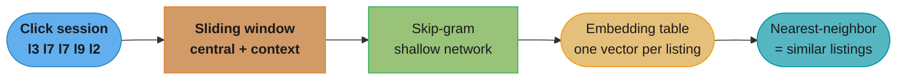
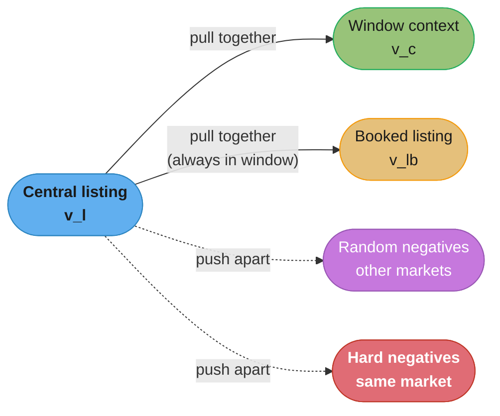
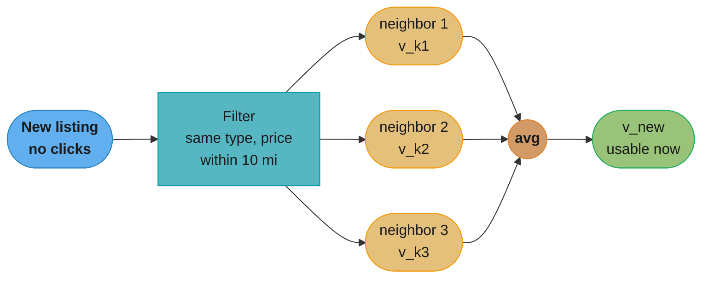
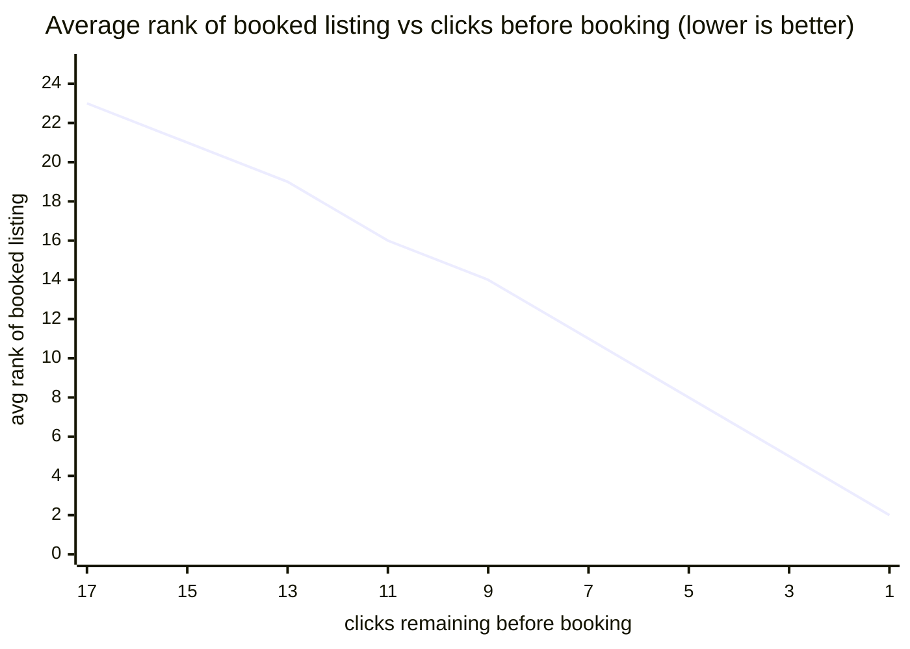
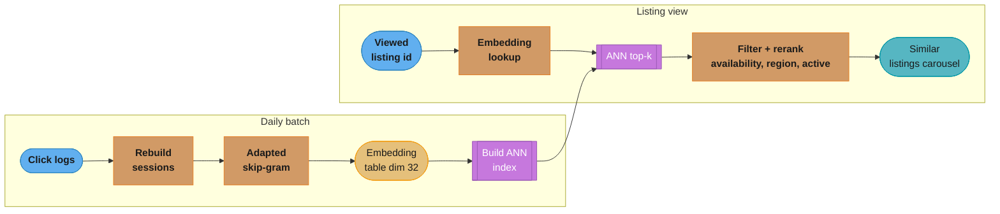
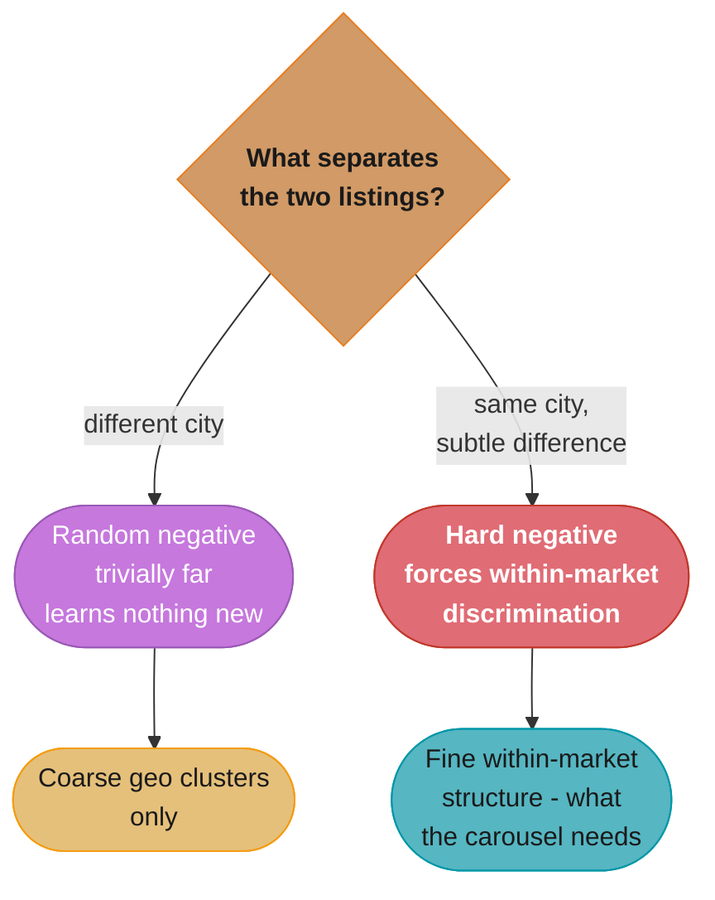
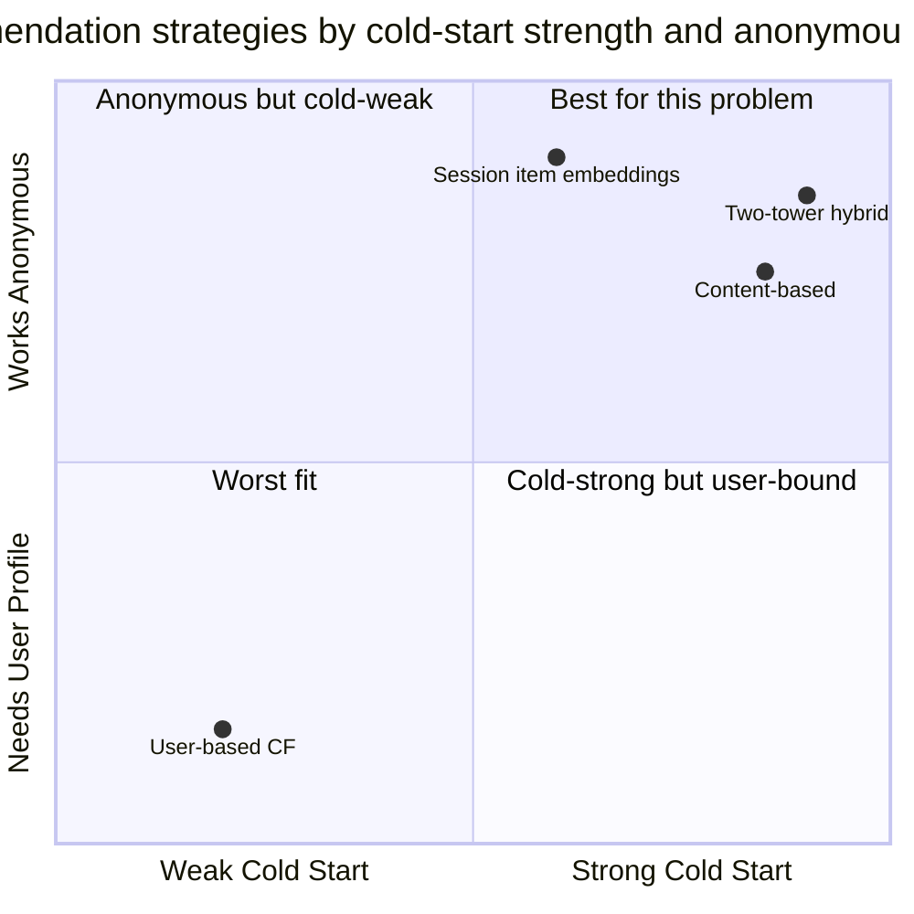

# Chapter 9: Similar Listings on Vacation Rental Platforms

> Ch 9 of 11 · ML System Design Interview (Aminian & Xu) · recommendation WITHOUT user profiles — skip-gram listing embeddings from click sessions, with the Airbnb training tricks

## Chapter Map

Every prior recommendation chapter leaned on a *user*: video recommendation (Ch 6) needs a user
embedding, event recommendation (Ch 7) is drenched in user-to-event features, ad click (Ch 8)
scores `<user, ad, context>`. This chapter removes that crutch. On a vacation-rental listing page,
the person browsing is very often **anonymous** — logged out, first visit, no history — yet the
platform still has to fill a "Similar listings" carousel. The trick, lifted almost verbatim from
Airbnb's KDD 2018 paper *Real-time Personalization using Embeddings for Search Ranking at Airbnb*,
is to learn an **embedding per listing** purely from **co-click sessions**: treat a browsing
session as a sentence and each clicked listing as a word, then run **word2vec skip-gram** over
millions of sessions. Two listings that keep getting clicked in the same session end up with nearby
embeddings, and "similar" becomes a nearest-neighbor lookup.

**TL;DR:**
- **Session-based, not user-based.** A session is a sequence of clicked listing IDs; skip-gram
  learns a `d≈32`-dimensional embedding per listing so that co-clicked listings sit close. No user
  profile is required at inference — you embed the *listing* being viewed, not the viewer.
- **Two famous Airbnb training tricks.** (1) **Booked listing as global context** — the listing a
  session eventually booked is treated as a positive for *every* sliding window in that booked
  session, injecting the real objective (bookings) into an otherwise click-only signal. (2)
  **Hard negatives from the same market** — random negatives are almost always from a different
  city and trivially far, so add negatives drawn from the *same* market to teach within-market
  discrimination.
- **Cold start by composition.** A brand-new listing with no clicks gets an embedding by
  **averaging the embeddings of nearby, same-type, similar-price listings** — no retrain needed.
- **Offline metric = average rank of the eventually-booked listing** replayed over held-out
  sessions; online metric = carousel CTR and book-through rate.

## The Big Question

> "I have to recommend listings to someone I know nothing about — they might be logged out and it
> might be their first click. What signal is left when the user profile is gone?"

The signal that survives is **co-browsing behavior aggregated across everyone**. You may not know
*this* user, but you have hundreds of millions of past sessions in which people who looked at
listing A also looked at listing B. That collective pattern — "these two listings are
substitutes for each other" — is exactly what word2vec captured for words ("king" and "queen"
appear in similar contexts). Airbnb's insight was that a **click session is a sentence** and a
**listing is a word**: run the same shallow skip-gram network over sessions and the geometry of
the embedding space encodes listing similarity. Recommendation without a user model becomes a
distance query in that space.

---

## 9.1 Clarifying Requirements

The interviewer's prompt is deliberately terse: *"Design a system that shows a carousel of
listings similar to the one a user is currently viewing on a vacation-rental site (Airbnb, Vrbo)."*
Pin down scope before proposing anything.

- **Where does it appear / what is the surface?** The **"Similar listings" carousel** on a listing
  detail page — a horizontal strip of ~10–20 listings shown below the listing the user is viewing.
  It is triggered by *viewing a listing*, not by a search query, so the input is a **listing**, not
  free text.
- **Is it personalized to the user?** Largely **no**. A huge fraction of listing-page traffic is
  **anonymous or logged-out**, and even logged-in users on their first session have no history. The
  book scopes this to the **non-personalized, session-based** case: similarity is a property of the
  *listing pair*, not the viewer. (Logged-in long-term personalization via user-type embeddings is
  the second half of the Airbnb paper — see §9.7.)
- **What does "similar" mean?** Not attribute similarity ("same 2-bedroom price band") but
  **behavioral substitutability** — listings that users **co-click within the same session** while
  shopping. Two beach condos a mile apart that people repeatedly compare are "similar" even if their
  amenity lists differ.
- **What is the ultimate objective?** **Bookings**, not clicks. Clicks are the abundant training
  signal, but the business cares about the carousel *converting* to a reservation. This tension —
  train on clicks, optimize for bookings — motivates the "booked listing as global context" trick.
- **Latency & freshness.** The carousel must render with the page (tens of ms budget for the
  recommendation call), so serving is a **nearest-neighbor lookup**, not an online model forward
  pass. Embeddings can be **retrained daily** (behavior drifts slowly); they do not need to be
  real-time.
- **Scale.** Airbnb-scale: order **4.5M active listings**, **800M+ training click sessions**,
  hundreds of markets. Listing inventory churns — new listings appear daily (**cold start**) and old
  ones deactivate.
- **Constraints on new listings.** New hosts add listings with zero interaction history every day;
  the system must recommend and be recommendable for them from day one.

**Functional requirement:** given a listing ID being viewed, return an ordered list of the most
similar *available* listings.
**Non-functional:** anonymous-friendly (no user features required), low-latency lookup, daily
refresh, graceful cold start, filtered for availability/region/active status.

---

## 9.2 Frame the Problem as an ML Task

**ML objective.** Learn a **listing embedding** `v_l ∈ R^d` for every listing such that listings
that are behaviorally similar (co-clicked in sessions) have high embedding similarity (dot product
/ cosine). "Recommend similar listings" then reduces to: embed the viewed listing, retrieve its
**nearest neighbors** in embedding space.

This is **representation learning + session-based recommendation**, and it deliberately avoids the
user-embedding half of collaborative filtering:

- **Content-based** (recommend by shared attributes: price, room type, location) handles new
  listings but ignores the crowd's judgment of what is actually substitutable, and gives no
  serendipity.
- **User-based collaborative filtering / matrix factorization** (Ch 6) needs a **user** dimension —
  useless for anonymous traffic and cold on new users. It also can't answer "given *this listing*,
  what's similar" without a user in the loop.
- **Session-based item embeddings** (this chapter): learn only an **item (listing) space** from
  **sequences of clicks**. No user vector required at inference. This is the collaborative signal
  ("wisdom of the crowd") captured in a form that works for logged-out users.

**The word2vec analogy (the crux).** In word2vec, the training data is sentences — sequences of
words — and the model learns word vectors where words appearing in similar contexts are close.
Map the vocabulary:

| word2vec (NLP) | This system |
|----------------|-------------|
| Corpus of sentences | Set of click sessions |
| A sentence | One click session (ordered listing IDs) |
| A word | A listing ID |
| Word appears in a context window | Listing co-clicked within a window in a session |
| Learned word vector | Learned listing embedding `v_l` |
| Similar words (king/queen) | Substitutable listings (two comparable beach condos) |

Because sessions are ordered and locally coherent (people compare like-for-like within a shopping
session), a shallow **skip-gram** network — predict the surrounding listings from a central
listing — is enough to bake substitutability into the geometry.



Caption: the whole model is the embedding table; skip-gram is just the training procedure that
positions each listing vector so that co-clicked listings become nearest neighbors.

---

## 9.3 Data Preparation

**Data sources.**
- **Listings** — id, location (market/city), price, room type, capacity, amenities, host, active
  flag, calendar/availability.
- **Search / click sessions** — the core signal: per user (or per anonymous session cookie), the
  **time-ordered sequence of listing IDs the user clicked** while browsing. This is what becomes
  the "sentences."
- **Bookings** — which listing (if any) a session ended by booking. Used both as the global-context
  positive during training and to build the offline evaluation set.

**Session construction and segmentation.** Raw click logs are one long stream per user; they must be
cut into **sessions**. The standard rule is an **inactivity gap** — start a new session when the gap
between consecutive clicks exceeds a threshold (Airbnb used **30 minutes**). A session is then the
ordered list of listing IDs clicked before the gap.

**Booked vs exploratory sessions.** Airbnb distinguished two session types, and the distinction
drives the training tricks:
- **Booked sessions** — sessions that ended in a booking. These carry the strongest signal (the
  user's revealed final choice) and are the ones that get the **booked-listing-as-global-context**
  treatment.
- **Exploratory sessions** — clicked around, never booked. Still useful (they teach substitutability
  from co-clicks) but have no booking to use as global context.

**Cleaning rules that matter:**
- **Drop very short sessions.** A session of length 1 (single click) has no context pairs — nothing
  to learn. Keep sessions with at least ~2 clicks.
- **Filter accidental / bounce clicks.** Clicks where the user spent < a few seconds on the listing
  page are noise; some pipelines require a dwell threshold before a click counts.
- **Collapse consecutive duplicates.** A user re-clicking the same listing back-to-back adds no
  co-click information.

There is **no separate hand-labeling step and no explicit feature-engineering matrix** — the labels
are *natural* (a co-click within a window is a positive), which is the whole appeal of the
approach. The only "features" are the raw listing IDs; everything else is learned into the
embedding. (Attribute features re-enter only for cold start and for the two-tower alternative in
§9.7.)

---

## 9.4 Model Development

### The base skip-gram model

The model is a **shallow (single hidden layer) skip-gram network**; the hidden layer *is* the
embedding table. For a click session `s = (l_1, l_2, …, l_n)` and a sliding window of size `m`, the
central listing `l` is used to **predict its context listings** `c` (the `m` listings on each side).
Training nudges the central vector toward its context vectors.

With a full softmax the per-window objective would be `P(c | l) = softmax(v_c · v_l)` over the
entire vocabulary of ~4.5M listings — a normalization sum that is far too expensive to compute per
step. So skip-gram uses **negative sampling**.

### Negative sampling

Instead of normalizing over all listings, turn each `(central l, context c)` pair into a set of
**binary** logistic problems: push `v_l` and the *true* context `v_c` together, and push `v_l` away
from a handful of **random** listings `d` sampled from the vocabulary (the "negatives"). The
objective to **maximize** for one positive pair, with random-negative set `D_n`, is:

```
log σ(v_c · v_l)  +  Σ_{d ∈ D_n} log σ(−v_d · v_l)
```

where `σ(x) = 1 / (1 + e^{−x})` is the sigmoid. The first term rewards a high dot product with the
true context; each negative term rewards a low dot product with a random listing. A few (e.g. 5–20)
negatives per positive is enough, turning an O(vocabulary) softmax into O(k) work.

**In plain terms.** "Reward the model whenever the true co-clicked listing's vector points the same
way as the central listing's, and reward it again whenever a random listing's vector points a
different way." Framing it as a handful of independent yes/no bets — rather than one giant
probability that must sum to 1 across 4.5M listings — is the whole cost saving.

| Symbol | What it is |
|--------|------------|
| `v_l` | The central listing's embedding — the vector being nudged |
| `v_c` | A true context listing's embedding — co-clicked inside the window |
| `v_d` | A random negative listing's embedding, drawn from the vocabulary |
| `v_c · v_l` | Dot product: large positive = the two vectors already agree |
| `σ(x)` | `1 / (1 + e^{-x})`, squashing a dot product into a `(0, 1)` "is this a real pair?" score |
| `log σ(...)` | The per-term reward; 0 is perfect, large negative means the model is badly wrong |

**Walk one example.** One central listing against a true context and one random negative:

```
term            dot product   sigmoid argument   sigma    log sigma
true context       +2.0            +2.0         0.8808     -0.1269
random negative    -0.5            +0.5         0.6225     -0.4741
                                                           --------
                                              partial objective  -0.6010

Reading the two rows:
  the true context already scores 0.8808 -- the model mostly believes this pair, small penalty
  the random negative scores 0.6225 -- the model is only mildly sure it is fake, bigger penalty
```

The sign flip on the negative term is the piece worth staring at: the negative's dot product is
`-0.5`, and the objective feeds `-v_d · v_l = +0.5` into the sigmoid. So a negative whose vector
already points *away* from the central listing produces a positive sigmoid argument and a small
penalty — the model is not asked to push it any further. All the gradient goes to negatives that are
still sitting too close, which is exactly the property Trick 2 below exploits.

### Trick 1 — Booked listing as global context

Skip-gram as-is only knows about **clicks within a window**; it has no notion that a session
eventually **booked** a specific listing. But the booked listing is the ground-truth "best" listing
of that session — exactly what the carousel should surface. Airbnb's fix: for every **booked
session**, add the eventually-booked listing `l_b` as a **positive context for every central
listing in the session, regardless of window position**. It is a "global" context — always in the
window, no matter how far the central listing is from the end.

Concretely, one extra positive term is added to the objective for every central `l` in a booked
session:

```
+ log σ(v_{l_b} · v_l)
```

Effect: every listing clicked on the path to a booking is pulled toward the booked listing, so the
embedding space encodes not just "co-clicked" but "co-clicked *on the way to booking this*." This is
how the click-trained model is bent toward the booking objective without changing the loss family.



Caption: the four forces on a central listing's vector — pulled toward window context and the
booked listing, pushed away from random and same-market hard negatives. The booked listing is a
global context: present in *every* window of a booked session.

### Trick 2 — Hard negatives from the same market

Users almost always shop **within one market** (a trip to Barcelona means clicking Barcelona
listings). But **random** negatives, drawn uniformly from 4.5M global listings, are overwhelmingly
from *other* markets — a Barcelona listing versus a random Tokyo listing is trivially
distinguishable, so the model learns nothing about the *within-Barcelona* differences that actually
matter for the carousel. The embeddings end up clustering by geography but staying mushy inside a
market.

The fix: add a set `D_{m_n}` of **hard negatives sampled from the same market** as the central
listing. These are "hard" because they are geographically close and superficially similar, forcing
the model to learn the finer behavioral distinctions between listings a user would realistically
compare. The extra term:

```
+ Σ_{m ∈ D_{m_n}} log σ(−v_m · v_l)
```

### The full adapted objective

Stacking all four terms, the per-central-listing objective Airbnb maximized is:

```
argmax_θ   Σ_{(l,c) ∈ D_p} log σ( v_c · v_l )        ← window co-clicks (positives)
         + Σ_{(l,d) ∈ D_n} log σ(−v_d · v_l )        ← random negatives
         +                 log σ( v_{l_b} · v_l )     ← booked listing, global context
         + Σ_{(l,m)∈D_{m_n}} log σ(−v_m · v_l )       ← same-market hard negatives
```

`D_p` = positive (central, in-window context) pairs; `D_n` = random negatives; `l_b` = the session's
booked listing; `D_{m_n}` = same-market hard negatives. For **exploratory** (non-booked) sessions
the `l_b` term is simply dropped.

**What this actually says.** "Four forces act on one listing's vector: pull it toward what people
clicked next to it, pull it toward what they eventually booked, push it away from random listings,
and push it away from listings in its own market." Every term is the same `log σ` shape; only the
sign of the dot product and the source of the other vector change.

| Symbol | What it is |
|--------|------------|
| `D_p` | Positive pairs — central listing with each in-window co-clicked context listing |
| `D_n` | Random negatives, drawn from the whole 4.5M vocabulary (almost always another city) |
| `l_b` | The listing this session eventually booked; a positive for every window in the session |
| `D_{m_n}` | Hard negatives sampled from the central listing's own market |
| `argmax_θ` | We *maximize* this; `θ` is the embedding table, the only parameters that exist |

**Walk one example.** One central listing in a booked session, one term of each kind:

```
term                        dot with v_l   sigmoid arg    sigma     log sigma
window context   v_c            +2.0          +2.0        0.8808     -0.1269
booked listing   v_lb           +1.2          +1.2        0.7685     -0.2633
random negative  v_d            -0.5          +0.5        0.6225     -0.4741
hard negative    v_m            +1.5          -1.5        0.1824     -1.7014
                                                                     --------
                                              objective for this central listing  -2.5657

Where the learning signal is going:
  hard negative     -1.7014  =  66% of the total penalty   <- dominates
  random negative   -0.4741  =  18%
  booked listing    -0.2633  =  10%
  window context    -0.1269  =   5%
```

The distribution in that second block is the numerical case for Trick 2. The hard negative sits at
`+1.5` — it points nearly the same way as the central listing, because it is a comparable property
in the same city — so it produces two thirds of the gradient by itself. The random negative, already
at `-0.5`, contributes almost nothing. Drop the hard negatives and you delete most of the learning
signal, which is exactly the "mushy inside a market" failure the chapter warns about.

**Hyperparameters (Airbnb).** Embedding dimension **`d = 32`** (small, cheap to store and to run
ANN over 4.5M vectors), window size **`m = 5`**, trained over **800M+ sessions**, **retrained
daily** on a sliding window of recent sessions. `d = 32` is a deliberate choice: high enough to
separate markets and within-market clusters, low enough that a 4.5M × 32 float table is a few
hundred MB and ANN latency stays in the low-ms range.

**Read it like this.** "The embedding table costs listings times dimensions times bytes-per-number,
and the training set costs sessions times the number of (central, context) pairs a window of size
`m` carves out of each one." Both hyperparameters — `d` and `m` — are chosen by what those two
products come to, so it is worth doing the multiplication rather than accepting the adjectives.

| Symbol | What it is |
|--------|------------|
| 4.5M | Active listings — the embedding table's row count |
| `d = 32` | Embedding dimension; numbers stored per listing |
| 4 bytes | Size of one fp32 float (fp16 would be 2) |
| `m = 5` | Window half-width; a central listing pairs with up to `m` listings on each side |
| `2m` | Maximum context listings per central listing — 10 for an interior position |
| `n` | Number of clicks in a session |

**Walk one example.** The table first, then the pair count for one 12-click session:

```
Embedding table
  4,500,000 listings x 32 dims x 4 bytes  =  576,000,000 bytes
                                          =  576 MB   (549 MiB)
  same table in fp16:  4,500,000 x 32 x 2 =  288 MB

Window arithmetic, n = 12 clicks, m = 5
  an interior central listing pairs with 2m = 10 context listings
  edge positions are truncated: click 1 has only 5 neighbours to its right, none to its left
  summing the true window width over all 12 positions:      90 positive pairs
  plus the booked listing as global context, one per central listing:  + 12
                                                            ------------
                                            total positives    102 pairs from ONE session

  scaled to the corpus:  800,000,000 sessions x 90 window pairs = 7.2e10 positive pairs
```

Two things fall out. First, the booked-listing trick adds 12 pairs against the window's 90 — roughly
12% more positives — yet it is the term carrying the entire booking objective, which shows how much
leverage a well-chosen positive has relative to its cost. Second, 7.2e10 positive pairs is why the
full softmax over 4.5M listings was never an option and negative sampling is structural, not an
optimization.

**Book-vs-arithmetic note.** The text above describes the fp32 table as "a few hundred MB", but the
multiplication gives **576 MB** — more than half a gigabyte, and above what "a few hundred MB"
normally suggests. The claim holds comfortably at fp16 (288 MB), which is how such tables are
usually stored in serving; at fp32 the honest number is 576 MB.

### Trick 3 — Cold start by embedding composition

A **new listing** has zero clicks, so skip-gram never saw it — it has no learned vector, and daily
retraining won't help until it accrues sessions (which it can't, because it isn't recommended…).
This is a permanent, structural cold-start problem in item-embedding systems.

Airbnb's fix requires **no retraining**: **compose** the new listing's embedding as the **average of
the embeddings of its nearest existing listings** that are geographically close and comparable.
Specifically, take the **3 geographically closest listings** (within ~10 miles) that share the
**same listing type** (entire home / private room) and fall in the **same price bucket**, and
average their (already-learned) embeddings:

```
v_new = (1/3) · Σ_{k ∈ nearest-3 same-type same-price within 10 mi} v_k
```

The new listing is instantly placed in a sensible neighborhood of the embedding space and can be
both recommended and used as a query the moment it goes live; once it accumulates its own clicks,
the next daily retrain gives it a genuine learned vector.

**Put simply.** "Stand the new listing at the centre of gravity of the three most comparable
listings that already have a position." The averaging is coordinate-by-coordinate and nothing else —
no training, no gradient, one pass over three vectors.

| Symbol | What it is |
|--------|------------|
| `v_new` | The composed embedding for the listing that has no clicks |
| `v_k` | An already-learned embedding of one qualifying neighbour |
| nearest-3 | The 3 geographically closest listings within ~10 miles that also match on type and price |
| `(1/3) · Σ` | Plain arithmetic mean, applied independently to each of the 32 dimensions |

**Walk one example.** Shown at `d = 4` so the arithmetic is visible; the real table is `d = 32`:

```
                  dim0     dim1     dim2     dim3
  v_k1           0.42    -0.11     0.35     0.08
  v_k2           0.38    -0.05     0.29     0.12
  v_k3           0.46    -0.14     0.33     0.04
                 ----    -----     ----     ----
  sum            1.26    -0.30     0.97     0.24
  / 3          0.4200  -0.1000   0.3233   0.0800   =  v_new

Cosine similarity of v_new to each neighbour it was built from:
  cos(v_new, v_k1) = 0.9992
  cos(v_new, v_k2) = 0.9920
  cos(v_new, v_k3) = 0.9948
```

All three cosines land above 0.99, which is the point: the composed vector is a near-neighbour of
every listing it was built from, so an ANN query for the new listing immediately returns those three
and their neighbourhoods. Note also what the mean does to disagreement — `dim1` ranges from `-0.05`
to `-0.14` across the three sources and the average lands at `-0.10`, so any dimension the
neighbours disagree on gets damped toward the middle. A composed embedding is therefore always
*blander* than a learned one, which is why it is a placeholder until the next daily retrain rather
than a permanent answer.



Caption: cold start is solved by geometry, not by retraining — a new listing borrows the average
position of its 3 nearest comparable neighbors so it is immediately recommendable.

---

## 9.5 Evaluation

### Offline — average rank of the eventually-booked listing

The clever, book-highlighted offline metric sidesteps the fact that "similarity" has no labels. Use
**held-out booked sessions** as ground truth and ask: *as the user clicked through the session, how
highly does our embedding rank the listing they eventually booked?*

Procedure (replayed over many held-out booked sessions):
1. Take a booked session and the listing `l_b` it ended up booking.
2. At each click in the session, treat the currently-viewed listing as the query, and rank a
   candidate pool (the market's listings) by embedding similarity to it.
3. Record the **rank position of the booked listing `l_b`** in that ranked list.
4. Average that rank across clicks and across all held-out sessions → **average rank of the booked
   listing**. **Lower is better.**

**What it means.** "Pretend you did not know how the session ended, ask the embedding to rank the
market at every click along the way, and write down where the answer was hiding each time." Because
the ranking is produced without ever seeing the booking, a low average is evidence the geometry
anticipated the outcome rather than memorized it.

| Symbol | What it is |
|--------|------------|
| `l_b` | The listing this held-out session eventually booked — the single ground-truth item |
| query | The listing being viewed at some click in the session; the ANN query vector |
| candidate pool | The market's listings, ranked by embedding similarity to the query |
| rank | 1-indexed position of `l_b` in that ranked list; 1 is best |
| average rank | Mean of those ranks over the session's clicks, then over all held-out sessions |

**Walk one example.** One held-out session, 4 clicks, a 20-listing market pool, booked `l8`:

```
click   query listing   rank of l8 in the ranked pool
  1          l3                    14
  2          l7                     9
  3          l1                     5
  4          l9                     2
                                  ----
  average rank for this session = (14 + 9 + 5 + 2) / 4 = 7.5

Baseline: a random ranking of a 20-listing pool puts l8 at an expected rank of (20 + 1) / 2 = 10.5

  7.5 vs 10.5  ->  the embedding beats chance, and the per-click trend 14, 9, 5, 2 is monotonic
```

The trend matters more than the average. A model that memorized popular listings would score the
same rank at every click; the fact that the rank falls 14 → 9 → 5 → 2 as the session progresses means
each newly-clicked listing pulls the query vector closer to the one the user was converging on. That
descending shape is what the chapter's chart plots, and it is the actual evidence that the space
encodes booking intent rather than mere popularity.

The intuition: a good embedding should place the listing the user will actually book near the top
of the similar-listings ranking *even before they book it* — and, as the session progresses toward
the booking, the average rank should steadily **decrease**. Airbnb plotted exactly this: average
booked-listing rank dropping as the user gets closer to booking, which validated that the geometry
encodes booking intent.



Caption: as the session nears the booking, the embedding ranks the eventually-booked listing higher
(lower average rank) — evidence that the learned space captures booking intent, not just clicks.

The book also weighs the usual ranking metrics — **recall@k**, **MRR** — but notes their limits
here: with essentially one relevant listing per session (the booked one), precision@k is dominated
by that single item and average-rank is the more informative summary.

### Online — carousel CTR and book-through

Offline geometry can look great and still not move the business, so validate with an **A/B test**:
- **Carousel CTR** — click-through rate on the similar-listings strip.
- **Session book-through / conversion rate** — fraction of sessions touching the carousel that end
  in a booking, and bookings attributable to the carousel.

Airbnb reported the embedding-based similar-listings carousel lifted **carousel CTR by ~21%** over
the prior heuristic and that the carousel drove **~4.9% of all bookings** — the numbers that
justified shipping it.

---

## 9.6 Serving

Three cooperating pipelines: a periodic **training/embedding** pipeline, an **indexing** pipeline,
and the online **prediction** pipeline that renders the carousel.

- **Training / embedding pipeline (daily, offline batch).** Rebuild sessions from the last window of
  click logs, run adapted skip-gram, produce a fresh `listing_id → v_l (dim 32)` table. Compose
  cold-start embeddings for listings still lacking clicks. Because it is a daily batch job,
  there is no online-training latency concern.
- **Indexing pipeline.** Load the embedding table into an **approximate nearest-neighbor (ANN)**
  index (FAISS / ScaNN / HNSW) so top-k similarity queries over 4.5M vectors return in low
  milliseconds. Rebuilt/refreshed when new embeddings land. (See Ch 2's ANN deep dive for the
  exact-vs-approximate and IVF/LSH/tree tradeoffs.)
- **Prediction pipeline (online, per listing view).** When a listing page loads:
  1. **Embedding lookup** for the viewed listing (or its composed cold-start vector).
  2. **ANN query** for the top candidates by embedding similarity (dot product / cosine).
  3. **Re-ranking & filtering** by business rules: keep only listings that are **available for the
     viewed dates**, in the **same region/market**, **active**, and not the listing itself; optional
     light re-rank by price proximity, freshness, or quality. Dedup.
  4. Return the filtered, ordered list to fill the carousel.



Caption: embeddings and the ANN index are rebuilt in a daily offline pass; the online path is just a
lookup, a k-NN query, and business-rule filtering — cheap enough to render inside the page.

---

## 9.7 Other Talking Points

- **Positional & selection bias in click sessions.** Clicks are biased toward whatever the search
  ranker showed near the top — the model can learn "what got shown together" rather than "what is
  genuinely similar." Mitigate with position-debiasing or by weighting rarer co-clicks more.
- **Seasonality.** Substitutability shifts with season (ski chalets in winter, beach houses in
  summer). Daily retraining on a recent window naturally tracks this; a fixed old model would drift.
- **Richer cold start via a two-tower / content model.** Instead of averaging neighbors, learn a
  **content tower** mapping listing *attributes* (price, type, amenities, location) into the same
  embedding space, so any new listing gets a real learned vector from its features — a hybrid of
  content and behavioral signal, and a natural follow-up to "what if composition isn't good enough?"
- **User-type embeddings for logged-in personalization.** The second half of the Airbnb paper learns
  **user-type** and **listing-type** embeddings *in the same space* from long-term booking sessions,
  enabling cross-session personalization (query-listing to user-type similarity). That is the
  logged-in extension of this anonymous, session-only design.
- **Online-vs-offline metric mismatch.** A better average-rank offline doesn't guarantee a CTR win;
  feedback loops (recommending similar listings makes them get co-clicked more, reinforcing the
  embedding) can inflate offline metrics. Always gate launches on the A/B test.
- **Congregated search / listing eviction.** Deactivated or booked-out listings must be filtered at
  serve time; stale embeddings for gone listings should be dropped from the index.

---

## Visual Intuition

### Sliding window over a session (why co-clicks become nearest neighbors)

The skip-gram window slides across a session; at each step the **central** listing is paired with
every listing inside the window (`±m`) as a positive, plus the booked listing as a global positive.
Repeated across 800M sessions, listings that keep landing in each other's windows are pulled
together in embedding space.

```
Session:      l3   l7   l1   l9   l2   l5   l8   l4      (booked: l8, global)
window m=2 →       [<-- w -->]                            central = l1
                    l3  l7 (l1) l9  l2                    positives: l3,l7,l9,l2  + l8 (booked)
slide 1 step →          [<-- w -->]                       central = l9
                        l7  l1 (l9) l2  l5                positives: l7,l1,l2,l5  + l8 (booked)
slide 1 step →              [<-- w -->]                   central = l2
                            l1  l9 (l2) l5  l8            positives: l1,l9,l5,l8  + l8 (booked)

  each ( central , context )  ->  pull vectors together   (log sigma(+ dot))
  each ( central , random  )  ->  push vectors apart       (log sigma(- dot))  [other markets]
  each ( central , same-mkt)  ->  push vectors apart       (log sigma(- dot))  [hard negative]
  ( central , l8 = booked  )  ->  pull together ALWAYS     global context, every window
```

Caption: the window is local, but the booked listing `l8` is a positive for *every* central listing
in the session — that global term is what steers the click-trained geometry toward bookings.

### Where the tricks bite (market clustering)

Random negatives only teach the coarse split between cities; same-market hard negatives are what
resolve listings *inside* a city — the distinctions the carousel actually needs.



Caption: random negatives give you city-level clusters for free; only same-market hard negatives
sharpen the geometry *within* a market, which is exactly where similar-listing recommendations live.

---

## Key Concepts Glossary

- **Similar-listings carousel** — the strip of listings shown as substitutes on a listing page; the
  system's output surface.
- **Session-based recommendation** — recommending from sequences of item interactions (a session)
  rather than from a user profile.
- **Click session** — the time-ordered sequence of listing IDs a user clicked, cut by an inactivity
  gap (30 min).
- **Booked vs exploratory session** — a session that ended in a booking vs one that did not.
- **Listing embedding** — a learned `d≈32`-dim vector per listing; distance encodes behavioral
  similarity.
- **Skip-gram** — word2vec variant that predicts context items from a central item; the training
  procedure here.
- **Sliding window (`m`)** — the ±`m` neighbors around a central listing counted as positive
  context; Airbnb used `m = 5`.
- **Negative sampling** — replacing the full softmax with a few binary sigmoid terms against random
  negatives.
- **Booked listing as global context** — adding the session's booked listing as a positive for
  every window (Airbnb Trick 1).
- **Hard negatives (same market)** — negatives sampled from the central listing's own market to
  force within-market discrimination (Trick 2).
- **Cold-start embedding composition** — giving a new listing the average embedding of 3 nearby,
  same-type, similar-price listings (Trick 3).
- **Average rank of the booked listing** — offline metric: mean rank the embedding assigns to the
  eventually-booked listing over held-out sessions (lower = better).
- **ANN (approximate nearest neighbor)** — FAISS/ScaNN/HNSW index for fast top-k similarity over
  millions of embeddings.
- **Two-tower / content tower** — an alternative that embeds listing *attributes* for a stronger
  cold start.
- **User-type / listing-type embeddings** — the paper's long-term, logged-in personalization
  extension sharing one embedding space.

---

## Tradeoffs & Decision Tables

| Approach | Handles anonymous users | New-listing cold start | Captures "wisdom of crowd" | Serving cost |
|----------|:--:|:--:|:--:|:--:|
| Content-based (attribute similarity) | yes | strong | no | cheap |
| User-based CF / matrix factorization | no (needs user) | weak | yes | medium |
| **Session-based item embeddings** | **yes** | via composition | **yes** | cheap (ANN) |

| Negative type | Where sampled | What it teaches | Failure if omitted |
|---------------|---------------|-----------------|--------------------|
| Random negatives | Whole vocabulary | Coarse market separation | Nothing separates listings at all |
| **Same-market hard negatives** | Central listing's market | Within-market fine structure | Embeddings mushy inside a city |

| Metric | Type | Reads on | Caveat |
|--------|------|----------|--------|
| Average rank of booked listing | Offline | Booking intent captured by geometry | One relevant item per session |
| Recall@k / MRR | Offline | Ranking quality | Weak with a single relevant listing |
| Carousel CTR | Online (A/B) | Engagement with the strip | Clickbait / bias risk |
| Book-through rate | Online (A/B) | Actual conversions | The metric that ships it |



Caption: session item embeddings and a two-tower hybrid occupy the top-right (anonymous-friendly);
pure CF fails both axes for this problem, and content-based trades away the crowd signal for a
strong cold start.

---

## Common Pitfalls / War Stories

- **Using only random negatives.** The single most common mistake: with global-random negatives the
  embeddings cluster by city and stay indistinguishable *within* a city — the carousel then shows
  "listings in the same town" rather than "genuinely comparable listings." Same-market hard
  negatives are non-optional.
- **Ignoring the booking objective and training on clicks alone.** A click-only model optimizes for
  what gets *browsed*, which over-weights flashy but low-converting listings. The booked-listing
  global-context term is what aligns the geometry with the objective that pays the bills.
- **Forgetting cold start until launch.** New listings appear every day; without composition they
  are invisible in the carousel *and* return empty carousels when viewed, which is worst for exactly
  the hosts who most need exposure. Compose their embeddings at index build time.
- **Trusting offline average-rank as a launch gate.** Feedback loops mean recommending similar
  listings makes them co-clicked more, which inflates the offline metric without a real user win.
  Always require an A/B lift in carousel CTR / book-through before shipping.
- **Not filtering unavailable / inactive listings at serve time.** The ANN index returns nearest
  vectors regardless of whether the listing is booked out, deactivated, or out of the viewed dates —
  surfacing an unbookable listing wastes a carousel slot and frustrates users. Filter in the
  re-ranking step.
- **Sessions too short or unsegmented.** Failing to cut on the 30-minute gap merges unrelated
  browsing into one "session," creating spurious co-clicks; single-click sessions contribute no
  training signal and just add noise if kept.

---

## Real-World Systems Referenced

Airbnb (the source design and KDD 2018 paper *Real-time Personalization using Embeddings for Search
Ranking at Airbnb*, Grbovic & Cheng — similar-listings carousel, booked-listing global context,
same-market hard negatives, cold-start composition, user-type/listing-type embeddings); Vrbo /
Booking.com (comparable vacation-rental similar-listings surfaces); **word2vec** (Mikolov et al. —
the skip-gram + negative-sampling method being repurposed); **FAISS / ScaNN / HNSW** (ANN indices
for serving); Google/Yahoo prod2vec and related item-embedding lines that generalized the idea to
e-commerce.

---

## Summary

Recommending similar listings to **anonymous** users removes the user profile that every other
recommendation chapter relied on, so the signal shifts to **collective co-browsing**: treat a
**click session as a sentence** and each **listing as a word**, and run **word2vec skip-gram with
negative sampling** over hundreds of millions of sessions to learn a small (`d ≈ 32`) **embedding
per listing** whose geometry encodes behavioral substitutability. "Similar listings" is then a
**nearest-neighbor query** in that space. Two Airbnb training tricks make it work in production:
**booked listing as global context** (add the session's eventually-booked listing as a positive for
*every* window, steering a click-trained model toward the booking objective) and **same-market hard
negatives** (random negatives only teach coarse city separation; same-market negatives force the
within-market discrimination the carousel needs). New listings get an embedding by **composition** —
averaging the 3 nearest comparable listings — so cold start needs no retrain. The model is
evaluated offline by the **average rank of the eventually-booked listing** over held-out sessions
(and it should drop as the session nears booking) and online by **carousel CTR and book-through**
(Airbnb saw ~21% CTR lift, ~4.9% of bookings). Serving is a **daily embedding retrain**, an **ANN
index**, and an online path of **lookup → k-NN → filter for availability/region/active** — cheap
enough to render inside the listing page.

---

## Interview Questions

**Q: Why add the eventually-booked listing as a global context to every window in a session?**
Because clicks are the training signal but bookings are the real objective, so injecting the booked listing as a positive for every central listing steers the click-trained geometry toward what converts. In a booked session, the eventually-booked listing `l_b` is treated as an in-window positive for every central listing regardless of position, adding a `log σ(v_{l_b} · v_l)` term. This pulls every listing on the path to booking toward the booked one, so the embedding encodes "co-clicked on the way to booking this," not just "co-clicked." Exploratory (non-booked) sessions simply omit the term.

**Q: Why are random negatives insufficient, and what do same-market hard negatives fix?**
Random negatives are almost always from a different city, so they are trivially far and teach only coarse geographic separation, leaving listings within a market indistinguishable. Users shop within one market, so the carousel needs *within-market* discrimination, which random negatives never exercise. Adding hard negatives sampled from the central listing's own market forces the model to separate superficially-similar, geographically-close listings — the fine structure the similar-listings carousel actually depends on. Omitting them yields embeddings that cluster by city but are mushy inside each city.

**Q: How do you produce an embedding for a brand-new listing with zero clicks?**
Compose it as the average of the embeddings of its 3 nearest comparable listings — same listing type, same price bucket, within about 10 miles — with no retraining required. Skip-gram never saw the new listing, and it can't earn clicks until it is recommended, a structural cold-start deadlock. Averaging nearby comparable vectors places it in a sensible neighborhood so it is immediately both recommendable and usable as a query; the next daily retrain later replaces it with a genuinely learned vector once it has clicks.

**Q: What is the offline metric, and why "average rank of the booked listing"?**
It is the mean rank the embedding assigns to the eventually-booked listing over held-out booked sessions, and lower is better. Similarity has no labels, so booked sessions act as ground truth: at each click you rank candidates by embedding similarity to the viewed listing and record where the eventually-booked listing lands, then average. A good embedding ranks the booked listing near the top even before booking, and the average rank should *drop* as the session nears the booking — direct evidence the space captures booking intent. Recall@k and MRR are weak here because there is essentially one relevant listing per session.

**Q: Why frame this as session-based item embeddings instead of collaborative filtering?**
Because most listing-page traffic is anonymous or first-visit, and collaborative filtering / matrix factorization need a user dimension that does not exist. Item embeddings learn only a listing space from click sequences, so at inference you embed the *listing* being viewed, not the viewer — no user vector required. This still captures the wisdom-of-the-crowd signal (people who viewed A viewed B) but in a form that works for logged-out users and answers "given this listing, what's similar" directly.

**Q: What is the word2vec analogy that makes this work?**
A click session is a sentence and each clicked listing is a word, so skip-gram learns listing vectors exactly as it learns word vectors. Words in similar contexts (king/queen) get nearby vectors; listings co-clicked in similar sessions get nearby vectors. Because sessions are locally coherent — people compare like-for-like within a shopping session — the shallow skip-gram network bakes behavioral substitutability into the embedding geometry, and "similar" becomes a distance query.

**Q: How does negative sampling avoid the full-softmax cost?**
It replaces the O(vocabulary) softmax normalization with a few O(k) binary sigmoid terms per positive pair. Instead of normalizing `P(context | central)` over 4.5M listings, it maximizes `log σ(v_c · v_l)` for the true context and `log σ(−v_d · v_l)` for a handful of random negatives `d`. Each term is a cheap logistic decision — pull the true context closer, push random listings away — so training scales to hundreds of millions of sessions.

**Q: How are click sessions constructed and segmented from raw logs?**
Raw per-user click streams are cut into sessions on an inactivity gap — start a new session when consecutive clicks are more than about 30 minutes apart. Each session is the time-ordered list of clicked listing IDs. Sessions are further split into booked (ended in a booking) and exploratory (no booking), which drives the global-context trick. Very short (length-1) sessions and bounce clicks are dropped since they carry no co-click signal.

**Q: What is the difference between booked and exploratory sessions in training?**
Booked sessions end in a reservation and receive the booked-listing-as-global-context positive term; exploratory sessions never booked and omit it. Both contribute the standard window co-click positives and negatives, so exploratory sessions still teach substitutability. But only booked sessions carry the revealed final choice, so only they can pull listings toward the booking objective via the global `l_b` term.

**Q: Why choose a small embedding dimension like 32?**
Because 32 dimensions are enough to separate markets and resolve within-market structure while keeping storage and ANN latency cheap. A 4.5M × 32 float table is only a few hundred MB, and approximate nearest-neighbor queries over it stay in the low-millisecond range needed to render inside a listing page. Larger dimensions add cost and overfitting risk without proportional gains for this behavioral-similarity task.

**Q: Walk through the four terms of the adapted skip-gram objective.**
The objective maximizes four sums: window co-click positives `log σ(v_c · v_l)`, random negatives `log σ(−v_d · v_l)`, the booked-listing global positive `log σ(v_{l_b} · v_l)`, and same-market hard negatives `log σ(−v_m · v_l)`. The first two are vanilla skip-gram with negative sampling; the third injects the booking objective; the fourth sharpens within-market discrimination. For exploratory sessions the third (booked) term is dropped.

**Q: How is the similar-listings carousel served at request time?**
It is a lookup, a k-NN query, and a filter — no online model forward pass. On a listing view, fetch the viewed listing's embedding, query an ANN index (FAISS/ScaNN/HNSW) for the top candidates by similarity, then re-rank and filter for availability on the viewed dates, same region, active status, and dedup. This keeps the online path within the page's tens-of-milliseconds budget while the heavy training runs offline.

**Q: How often are embeddings retrained, and why not real-time?**
Embeddings are retrained daily in an offline batch on a recent window of sessions. Behavioral substitutability drifts slowly and with seasonality, so daily granularity tracks it well while avoiding the cost and instability of continuous training. The online path only reads a precomputed table and ANN index, so freshness comes from the batch cadence, not from live updates.

**Q: Why must you filter the ANN results, and what do you filter on?**
Because the ANN index returns nearest vectors regardless of whether the listing is bookable, so serving them unfiltered surfaces unavailable listings. Re-ranking filters out listings that are booked out for the viewed dates, deactivated, outside the viewed region, or the viewed listing itself, and dedups. This turns raw geometric similarity into a list of genuinely bookable, relevant options.

**Q: Why can offline average-rank improve while online CTR does not, and how do you guard against it?**
Because feedback loops inflate offline metrics: recommending similar listings makes them co-clicked more, which reinforces their embedding proximity without any real user benefit. So a lower average rank can partly reflect the system rewarding its own past recommendations. Guard against it by gating every launch on an A/B test measuring carousel CTR and book-through, not on offline geometry alone.

**Q: What is the two-tower alternative and when would you reach for it?**
A two-tower / content model learns a tower mapping listing *attributes* (price, type, amenities, location) into the same embedding space, so any listing — including brand-new ones — gets a real learned vector from its features. You reach for it when cold-start composition (averaging neighbors) is not accurate enough, or when you want a hybrid of behavioral and content signal. It is the natural upgrade path from the pure session-embedding design.

**Q: How would you extend this to personalize for logged-in users?**
Learn user-type and listing-type embeddings in the same space from long-term booking sessions, as in the second half of the Airbnb paper. Short-term listing embeddings capture in-session, anonymous similarity; user-type embeddings capture cross-session, long-term preference, and you rank by similarity between the user-type vector and candidate listings. This layers logged-in personalization on top of the anonymous session-embedding base without discarding it.

**Q: What biases live in click-session training data, and how do you handle them?**
Position and selection bias dominate: clicks favor whatever the search ranker showed near the top, so the model can learn "shown together" instead of "genuinely similar." Handle it with position-debiasing, up-weighting rarer co-clicks, or logging exposure to correct for what the user actually saw. Seasonality is a second effect, mitigated by retraining daily on a recent window so the embeddings track shifting substitutability.

**Q: Why does the model learn geographic clustering "for free," and is that enough?**
Because users shop within a market, co-clicks overwhelmingly occur among same-city listings, so listings from the same market naturally end up close and random negatives (other cities) sit far — geography falls out of the click structure automatically. But it is not enough: the carousel needs to rank listings *within* a city, and coarse geo clusters leave those indistinguishable. Same-market hard negatives are added precisely to resolve the within-market structure that free clustering misses.

**Q: What happens to a listing that is deactivated or permanently booked out?**
Its stale embedding should be dropped from the ANN index and it must be filtered from any carousel at serve time, since a nearest-neighbor query would otherwise still return it. Serving an unbookable listing wastes a carousel slot and frustrates users. Index maintenance during the daily rebuild plus the online availability/active filter together keep gone listings out of results.

---

## Cross-links in this repo

For the repo's own production-depth treatment of these building blocks, see the ML section (this
chapter summarizes the *book's* framing and cross-links rather than duplicating):

- [ml/case_studies/design_real_time_personalization.md — Airbnb-style embedding personalization, end to end](../../../ml/case_studies/design_real_time_personalization.md)
- [ml/case_studies/design_marketplace_matching.md — two-sided marketplace ranking and matching](../../../ml/case_studies/design_marketplace_matching.md)
- [ml/recommender_systems/content_and_hybrid.md — content towers and hybrid cold-start strategies](../../../ml/recommender_systems/content_and_hybrid.md)
- [ml/recommender_systems/retrieval_and_ranking.md — candidate retrieval + ranking stages](../../../ml/recommender_systems/retrieval_and_ranking.md)
- [ml/recommender_systems/collaborative_filtering.md — why CF needs a user dimension (the contrast)](../../../ml/recommender_systems/collaborative_filtering.md)
- [ml/recommender_systems/deep_learning_recommenders.md — two-tower and neural recommenders](../../../ml/recommender_systems/deep_learning_recommenders.md)
- [ml/information_retrieval_and_search/README.md — ANN, FAISS/ScaNN, nearest-neighbor serving](../../../ml/information_retrieval_and_search/README.md)
- [ml/natural_language_processing/README.md — word2vec, skip-gram, negative sampling origins](../../../ml/natural_language_processing/README.md)
- [ml/self_supervised_and_contrastive_learning/README.md — pulling positives together, pushing negatives apart](../../../ml/self_supervised_and_contrastive_learning/README.md)
- [ml/case_studies/design_recommendation_engine.md — general recommender architecture reference](../../../ml/case_studies/design_recommendation_engine.md)

## Further Reading

- Aminian & Xu, *Machine Learning System Design Interview*, Ch 9 — the source chapter.
- Grbovic & Cheng, "Real-time Personalization using Embeddings for Search Ranking at Airbnb," KDD
  2018 — the origin of booked-listing global context, same-market hard negatives, and cold-start
  composition; Best Paper award.
- Mikolov et al., "Distributed Representations of Words and Phrases and their Compositionality,"
  2013 — skip-gram with negative sampling (word2vec).
- Grbovic et al., "E-commerce in Your Inbox: Product Recommendations at Scale" (prod2vec), 2015 —
  the item-embedding precursor generalizing word2vec to purchase/click sequences.
