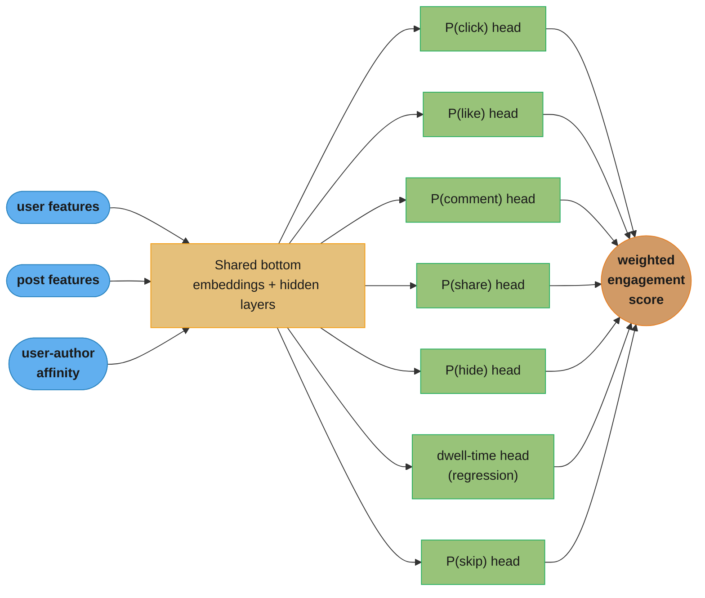
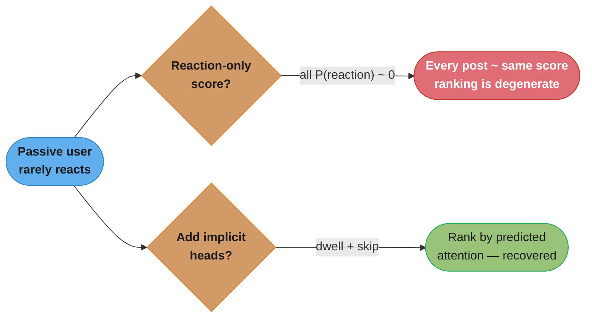

# Chapter 10: Personalized News Feed

> Ch 10 of 11 · ML System Design Interview (Aminian & Xu) · builds on Ch 5's multi-task heads and SDI-1 Ch 11's feed plumbing — engagement scoring with dwell/skip heads for passive users

## Chapter Map

A personalized news feed ranks the posts a user's connections produced so the most *engaging*
ones surface first. The interview twist is that "engaging" is not a single label — a user can
click, like, comment, share, hide, or block, and those actions matter very differently. So the
chapter's model is a **multi-task network**: one shared body that feeds several per-action heads,
each predicting the probability of one reaction, whose outputs are combined into a single
**engagement score** by a set of hand-chosen **weights**. The chapter's signature problem is the
**passive user** — someone who reads the feed but almost never reacts — whose engagement score
collapses to near zero under a reaction-only model, so the book adds **implicit** heads that
predict **dwell time** (regression) and **P(skip)** (classification) to recover signal from
silent readers.

**TL;DR:**
- Frame the feed as **ranking by a weighted engagement score**; the per-reaction probabilities
  come from a single multi-task neural net (shared bottom + one head per reaction), and the
  weights (click=1, like=5, comment=10, share=20, hide=−20) are a **business decision** tuned by
  A/B test, not something the model learns.
- The **passive-user problem** breaks reaction-only scoring; fix it with **dwell-time** and
  **skip** heads that read implicit behavior, so silent readers still produce a usable ranking.
- **User–author affinity** (how much this user has historically engaged with this author) is the
  single most predictive feature family — it dominates raw post content.
- Evaluate **per head** (ROC-AUC per reaction, MAE for dwell) because there is no single clean
  offline metric for a multi-objective ranker; online, watch total time spent and per-impression
  reaction rates, and beware the engagement feedback loop (viral posts, rabbit holes).

## The Big Question

> "Every post could trigger a dozen different reactions that are worth wildly different amounts to
> the business, and half my users never react at all. How do I turn one <user, post> pair into a
> single number that ranks the feed — and how do I rank for the users who stay silent?"

Analogy: a feed ranker is a *sports scout* scoring players on many attributes (speed, passing,
defense) and folding them into one draft ranking. The per-attribute scores come from observation
(the model's heads); the *weights* that fold them into a single ranking come from the team's
strategy (the business). And the hardest players to scout are the quiet ones who never show off in
a highlight reel — you have to read subtler signals (how long they hold position, whether they
drift out of a play) to rank them at all. That quiet-player problem is the passive user, and dwell
time and skip are the subtle signals.

---

## 10.1 Clarifying Requirements

Before framing anything, pin down what "news feed" means here and what the constraints are. The
book's clarifying exchange establishes:

- **What it is** — a Facebook/Twitter-style feed: a vertically scrollable list of **posts
  produced by the user's connections** (friends, followed accounts, groups, pages). This is *not*
  a recommendation of arbitrary items from a global catalog (that was Ch 6, video recs); the
  candidate pool is scoped to the user's network plus a little non-network content.
- **Business objective** — maximize **user engagement**, and specifically *meaningful*
  engagement, not raw clicks. This distinction matters later: the reaction weights and the online
  metrics are chosen so the system does not simply chase clickbait.
- **What reactions exist** — the feed surfaces posts and the user can **click, like, share,
  comment, hide, or block/report**. Positive reactions (click, like, comment, share) signal the
  post was good; negative reactions (hide, block, report) signal it was bad and should be
  suppressed. The model must predict all of them.
- **What posts are eligible** — both **fresh** posts (recently created by connections) and
  **unseen older** posts the user has not yet been shown. The feed is not strictly reverse-
  chronological; a good older post the user missed can outrank a mediocre new one.
- **Passive vs active users** — the interviewer surfaces that some users engage heavily (many
  reactions) while others are **passive** (they read but rarely react). The system must serve both,
  which foreshadows the implicit-signal heads.
- **Scale** — platform scale: on the order of **billions of users**, each with hundreds to
  thousands of connections, producing a firehose of posts. A user opening the app must get a
  ranked feed in roughly **200 ms** end to end, so ranking every eligible post with a heavy model
  is off the table — retrieval must cut the candidate set first.
- **Personalization** — the feed is fully personalized per user; there is no single global
  ranking.

| Clarifying question | Book's answer / assumption |
|---|---|
| What is the system's goal? | Maximize meaningful user engagement |
| Where do candidate posts come from? | The user's own network (connections/follows) plus limited non-network |
| Which reactions matter? | click, like, share, comment (positive); hide, block/report (negative) |
| Fresh-only or older posts too? | Both fresh and unseen older posts are eligible |
| Latency budget? | ~200 ms end to end for the ranked feed |
| Scale? | ~billions of users, hundreds–thousands of connections each |
| Passive users? | Yes — many users read without reacting; must still be ranked well |

---

## 10.2 Frame the Problem as an ML Task

### The ML objective: rank by an engagement score

Translate "maximize engagement" into something a model can optimize. The chapter's move: for each
`<user, post>` pair, **predict the probability of every reaction**, then combine those
probabilities into a single **engagement score**, and **rank the feed by that score** descending.

```
engagement_score(user, post) =
      w_click   · P(click)
    + w_like    · P(like)
    + w_comment · P(comment)
    + w_share   · P(share)
    + w_hide    · P(hide)          # w_hide is negative
```

The book's illustrative weights make the philosophy concrete: a comment is worth far more than a
click because it takes far more effort and signals deeper engagement, a share more still, and a
hide is *negative* so predicted-likely-to-be-hidden posts are pushed down.

| Reaction | Example weight | Rationale |
|---|---:|---|
| click | 1 | low-effort, weak signal, clickbait-prone |
| like | 5 | one tap, mild positive intent |
| comment | 10 | high effort, strong positive engagement |
| share | 20 | strongest positive — user vouches to their own network |
| hide | −20 | explicit negative — user does not want this |

**What this actually says.** "Ask the model how likely each reaction is, multiply each probability
by how much the business says that reaction is worth, and add it all up — that sum is the post's
rank." The framing matters because it cleanly separates two jobs: the model only has to answer
*how likely*, and the product only has to answer *how valuable*. Nothing in the formula requires
the two to be tuned together, which is exactly why the weights can change without retraining.

| Symbol | What it is |
|---|---|
| `engagement_score(user, post)` | the single number the feed sorts by, descending |
| `P(click)`, `P(like)`, `P(comment)`, `P(share)` | per-reaction probabilities from the multi-task heads for this `<user, post>` pair |
| `P(hide)` | probability the user actively suppresses the post; the one negative term |
| `w_click`, `w_like`, `w_comment`, `w_share` | business-chosen value of each positive reaction (1, 5, 10, 20) |
| `w_hide` | business-chosen penalty for a negative reaction (−20) |

**Walk one example.** Two candidate posts for the same active user, using the book's weights.

```
Post A: a friend's photo — modest click rate, but people talk about it
  reaction   weight   P(reaction)   contribution = weight x P
  click        1        0.300          0.300
  like         5        0.120          0.600
  comment     10        0.020          0.200
  share       20        0.005          0.100
  hide       -20        0.001         -0.020
                                   ---------
  engagement_score(A)                   1.180

Post B: a clickbait headline — nearly 2x the click rate, but hollow
  reaction   weight   P(reaction)   contribution = weight x P
  click        1        0.5500         0.550
  like         5        0.0600         0.300
  comment     10        0.0030         0.030
  share       20        0.0005         0.010
  hide       -20        0.0200        -0.400
                                   ---------
  engagement_score(B)                   0.490

Post B wins on clicks (0.550 vs 0.300) and loses the feed (0.490 vs 1.180).
```

The result means the weights, not the model, are what refuse the clickbait: B's click term is the
largest single positive contribution anywhere in the table, yet a comment probability 6.7x lower
and a hide probability 20x higher sink it. Delete the `w_hide` term and B rises to 0.890, still
behind A but close; set `w_click` to 10 instead of 1 and B jumps to 5.44 and wins outright. That
is the whole "chase clicks and you ship clickbait" pitfall visible as arithmetic.

### The weights are a business decision, not a learned parameter

This is the single most important framing point in the chapter, and a favorite interview trap.
The reaction weights are **hyperparameters chosen by the business (product/policy), then tuned via
online A/B testing** — they are *not* learned by gradient descent alongside the model. Why not
learn them?

- There is **no ground-truth label for "engagement value."** The model can learn `P(share)` from
  observed shares, but "a share is worth 4× a like" is a *value judgment* about what the product
  wants to encourage, and no dataset contains that judgment.
- The weights encode **strategy, and strategy changes.** When Facebook pivoted from raw clicks
  toward "Meaningful Social Interactions" in 2018, it *reweighted* the score to favor comments and
  shares between people over passive video watching — a business decision applied by changing the
  weights, without retraining the reaction heads.
- Keeping the weights outside the model means product can **retune ranking behavior in an A/B test
  overnight** by editing a config, rather than gathering new labels and retraining.

So the model's job is to produce **well-calibrated per-reaction probabilities**; the business's
job is to decide how much each probability is worth.

### Architecture options for producing the probabilities

You need `P(click), P(like), P(comment), P(share), P(hide), ...` for each `<user, post>` pair.
Three ways to get them:

1. **N independent binary classifiers** — one separate model per reaction. Each is a clean binary
   classifier, and thresholds/weights are fully independent. But it is **expensive**: N models to
   train, serve, and maintain, N times the feature computation and forward passes at request time,
   and no sharing of the representation that all reactions have in common (they all depend on
   roughly the same "is this a good post for this user" signal). For 6+ reactions at feed latency
   and scale, N forward passes per candidate is a non-starter.

2. **A single multi-label classifier** — one model, one shared body, one output layer emitting all
   reaction probabilities at once with a per-reaction sigmoid. Cheaper than N models. But it forces
   **one shared loss and one shared training regime** across reactions that have very different
   base rates (clicks are common; shares and especially hides are rare), and it is inflexible if you
   later want a per-reaction-specific head architecture or loss.

3. **Multi-task neural network (shared bottom + per-task heads)** — the book's choice. A **shared
   bottom** (embedding lookups + shared hidden layers) learns the common representation once; then
   a small **task-specific head** branches off for each reaction, each with its own final layer and
   its own loss. One forward pass through the shared bottom feeds all heads, so it is nearly as
   cheap as one model, while each head can be tuned (its own loss weight, its own threshold) and the
   heads *regularize each other* — the abundant click signal helps the shared body learn a
   representation that also benefits the data-starved share and hide heads (**positive transfer**).

The multi-task design is the same pattern Ch 5 (Harmful Content Detection) uses for per-category
integrity heads; here the heads are per-*reaction* instead of per-*violation-category*. See the
repo's own treatment in
[ml/multi_task_and_multi_objective_learning](../../../ml/multi_task_and_multi_objective_learning/README.md).



Caption: one shared bottom feeds many lightweight per-reaction heads; a single forward pass yields
all probabilities, which the business-chosen weights fold into one engagement score. The dwell and
skip heads (right) are the passive-user fix from §10.2.

### The passive-user problem and the implicit heads

Here is the chapter's defining insight. A model whose heads are all **explicit reactions** (click,
like, comment, share, hide) works great for active users but **degenerates for passive users** —
people who scroll and read but rarely tap anything. For a passive user, *every* reaction
probability is near zero, so **every post gets essentially the same near-zero engagement score**,
and the ranking becomes meaningless (effectively random, or falls back to recency). Yet passive
users are a large fraction of the user base, and they *are* getting value from good posts — they
just express it silently.

The fix: add **implicit-signal heads** that read behavior the user emits without deciding to react:

- **Dwell time** — how long the post stayed on screen / how long the user lingered on it. Modeled
  as a **regression** head (predict seconds of dwell), trained with MAE or MSE. A passive user who
  reads a post for 15 seconds is telling you it was engaging even though they never liked it.
- **Skip probability** — `P(user scrolls past this post quickly without engaging)`, i.e. a very
  short dwell / immediate scroll-past. Modeled as a **binary classification** head. A high skip
  probability means "this passive user will bounce off this post," which is exactly the negative
  signal you need to *rank down* content for silent readers.

With dwell and skip in the score, a passive user's feed is ranked by *predicted attention* rather
than by predicted (near-zero) reactions, so the ranking recovers. These implicit signals are
lower-precision than explicit reactions (a long dwell can mean "engrossed" or "confused/distracted")
but they are **dense** — available on essentially every impression — which is exactly what the
sparse-reaction problem needs.



Caption: reaction-only scoring collapses to a flat, meaningless ranking for silent readers; the
dwell-time and skip heads supply the dense implicit signal that restores a usable ranking.

### Learning-to-rank framing note

Strictly, ranking a feed is a learning-to-rank problem (pointwise / pairwise / listwise, as Ch 7
develops). This chapter uses the **pointwise** framing: score each `<user, post>` independently
with the multi-task heads, then sort. Pointwise is chosen for the same reasons as Ch 7/8 — it
trains as simple per-head classification/regression, scales trivially, and composes cleanly with
the weighted-sum score. Pairwise/listwise objectives (optimizing ordering directly) are noted as a
refinement in Other Talking Points.

---

## 10.3 Data Preparation

The data engineering side inventories the entities and the interaction log the model learns from.

**Entities and tables:**

| Entity | Key attributes |
|---|---|
| **Users** | user_id, demographics (age, gender, location, language), account age |
| **Posts** | post_id, author_id, created_at, text, media (image/video), hashtags, link |
| **Connections** | friendships / follows (who is connected to whom, direction, since when) |
| **Interactions** | (user_id, post_id, action, timestamp) — impressions + every reaction |

The **interactions log** is the heart of it. Every time a post is *shown* to a user, that
**impression** is logged (with dwell time and whether it was skipped), and every reaction the user
makes (click, like, comment, share, hide, block) is logged with a timestamp. Impressions are what
make labels possible: an impression with no positive reaction is a *negative* example for the
reaction heads, and the recorded dwell/skip on that impression is the label for the implicit heads.

**Friendships/follows** give the candidate scope (a post is eligible for a user roughly if its
author is connected to the user) and feed the affinity features in §10.4.

A subtle logging requirement: to compute **user–author affinity** and **freshness** features
honestly at training time, every interaction must carry a **timestamp**, and features must be
computed **as of the impression time** (point-in-time correctness) — using a user's *future*
engagement with an author to predict a *past* impression is leakage. This is the same
point-in-time discipline Ch 7 (Event Recommendation) hammers on.

---

## 10.4 Feature Engineering

The book groups features into **post features**, **user features**, and — the family it calls out
as most predictive — **user–author affinity features**.

### Post features

- **Textual content** — the post's text encoded by a **pretrained language model** (a transformer
  such as BERT; multilingual for a global platform) into a dense embedding. Captures topic and tone
  without hand-engineering.
- **Image / video content** — media encoded by a **pretrained vision encoder** (e.g. a CNN/ViT or
  CLIP-style image encoder) into an embedding. A post with a photo vs a video vs text-only behaves
  differently.
- **Hashtags** — tokenized (splitting camelCase/joined tags), then represented via **TF-IDF** or a
  learned **embedding**; hashtags are a cheap topical signal.
- **Reaction counts so far** — how many likes/comments/shares the post has already accrued (its
  early popularity). Predictive, but a **feedback-loop hazard**: ranking by current popularity
  makes popular posts more popular (rich-get-richer), so use with care.
- **Post age / freshness** — how old the post is, **bucketized** into freshness bands (e.g. <1h,
  1–6h, 6–24h, 1–7d). Freshness matters for a feed, but recency alone must not dominate — the whole
  point of ranking is to beat reverse-chronological.

### User features

- **Demographics** — age, gender, location, language (with the usual privacy caveats; some
  jurisdictions restrict using protected attributes for ranking).
- **Contextual** — device (mobile/desktop), time of day, day of week. Engagement patterns differ by
  context (commute-time scrolling vs evening).
- **User–post historical interaction** — the user's aggregated history: topics/authors they engage
  with, their overall reaction rates, session length.
- **Mentions of the user** — whether the post @-mentions or tags the user. A post that names you is
  far more likely to draw a reaction.

### User–author affinity features (the most predictive family)

The book highlights **user–author affinity** as the strongest predictor of whether a user will
engage with a post: *who wrote it, and how does this particular user feel about that author,*
matters more than the raw content of the post. Concretely:

- **Historical engagement rate with this author** — how often this user has clicked/liked/
  commented/shared *this author's* past posts. If you comment on your sister's posts every time,
  the model should learn that.
- **Friendship / connection age and strength** — how long the two have been connected, and how
  strong the tie is (frequency of interaction, two-way vs one-way).
- **Close-friends / family signals** — explicit "close friend" designations or inferred
  strong-tie status; a post from a spouse or best friend should rank far above a post from a
  barely-known acquaintance, even on identical content.
- **Recency of last interaction with the author** — when the user last engaged with this author.

Affinity is what makes the feed feel *personal*: the same viral post ranks high for a user whose
friend posted it and low for a user who barely knows the author. It also explains why two-tower or
content-only models underperform here — the interaction between *this user* and *this author* is
the signal, and it lives in the cross features, not in either entity alone.

### Feature engineering mechanics

- **Categorical IDs** (author_id, hashtag, location) are high-cardinality → **embedding tables**
  (with hashing for the very long tail).
- **Numeric features** (counts, age, affinity rates) are **bucketized** and/or scaled
  (log-scaling for heavy-tailed counts).
- **Batch vs streaming features** — static features (demographics, friendship age) are batch;
  dynamic features (reaction-counts-so-far, minutes-since-posted, affinity updated by today's
  interactions) must be computed from a **streaming/online feature store** at request time.
- **Point-in-time correctness** — every feature must reflect state *as of the impression*, or the
  affinity and freshness features leak the future into training. See
  [ml/feature_engineering](../../../ml/feature_engineering/README.md).

| Feature family | Examples | Representation |
|---|---|---|
| Post content | text, image/video | pretrained transformer / vision embeddings |
| Post meta | hashtags, reaction counts, age | TF-IDF/embed, numeric (bucketized), freshness bands |
| User | demographics, device, time, history, mentions | embeddings + numeric + contextual |
| **User–author affinity** | engagement rate w/ author, tie age, close-friend, recency | numeric (bucketized) + strong-tie flags |

---

## 10.5 Model Development

### Shared-bottom multi-task network

The model is a **shared-bottom multi-task neural network**. Concretely:

1. **Input layer** — concatenate the feature vector: post-content embeddings, user embeddings, and
   the user–author affinity features (plus numeric/contextual features).
2. **Shared bottom** — a stack of fully-connected hidden layers learns a shared representation of
   "how relevant is this post to this user."
3. **Per-task heads** — from the shared representation, one small head branches off per objective:
   `click, like, comment, share, hide` (binary classification, sigmoid) plus `dwell_time`
   (regression) and `skip` (binary classification).

At serving time a single forward pass through the shared bottom feeds all heads, so the cost is
close to one model even though you get seven predictions.

### Losses — one per head, summed

Each head has its own loss appropriate to its output:

- **Reaction heads** (click, like, comment, share, hide, skip) — **binary cross-entropy**
  (log loss) per head.
- **Dwell-time head** — **regression** loss, **MAE** (robust to the heavy right tail of dwell
  times) or MSE.

**Put simply.** "MAE charges you the number of seconds you were off by; MSE charges you the square
of it." The framing matters because dwell time is heavy-right-tailed — most impressions are a few
seconds, a few are minutes — and squaring turns those rare long dwells into the only examples the
head really trains on.

| Symbol | What it is |
|---|---|
| `n` | number of impressions in the batch |
| `y_i` | logged dwell time on impression `i`, in seconds |
| `ŷ_i` | the dwell head's predicted seconds for that impression |
| `MAE` | `(1/n) · Σ abs(ŷ_i − y_i)` — average absolute error, reported in seconds |
| `MSE` | `(1/n) · Σ (ŷ_i − y_i)²` — average squared error, in seconds-squared |

**Walk one example.** Five impressions from one passive user's session.

```
  post   predicted  actual   |error|   error^2
  A         18        15        3          9
  B          6         9        3          9
  C         40        31        9         81     <- the long-dwell outlier
  D          3         4        1          1
  E         12        20        8         64
                            --------   -------
  sum                            24        164
  MAE = 24 / 5 = 4.8 seconds        MSE = 164 / 5 = 32.8 seconds^2

  the C outlier is 9/24  = 37.5% of MAE
                   81/164 = 49.4% of MSE
```

The result means the head is off by about 4.8 seconds per impression — directly readable, in the
same unit as the label, which is why MAE is what you report. The last two lines are why the book
prefers it as the *loss* too: one nine-second miss on a single long-dwell post supplies roughly
half of MSE's gradient but only about a third of MAE's, so MSE would bend the whole head toward
the rare marathon readers and away from the short-dwell bulk that actually separates a passive
user's posts.

The **total loss** is a **weighted sum of the per-task losses**:

```
L_total = Σ_tasks  λ_task · L_task
        = λ_click·BCE_click + λ_like·BCE_like + λ_comment·BCE_comment
        + λ_share·BCE_share + λ_hide·BCE_hide + λ_skip·BCE_skip
        + λ_dwell·MAE_dwell
```

**Read it like this.** "Every head computes its own error on its own labels, and the shared bottom
is trained on a blend of those errors, mixed in proportions the ML engineer picks." The framing
matters because gradients flowing into the shared bottom are the *sum* of the per-head gradients,
so whichever term is numerically largest quietly decides what the shared representation learns —
regardless of which reaction the product actually cares about.

| Symbol | What it is |
|---|---|
| `L_total` | the single scalar backprop minimizes; the only thing the shared bottom ever sees |
| `Σ_tasks` | sum over all seven heads (five reactions + skip + dwell) |
| `λ_task` | training-time loss weight for one head; a hyperparameter, not learned |
| `L_task` | that head's own loss value on the current batch |
| `BCE_<reaction>` | binary cross-entropy for a classification head, in nats — typically 0.0–1.0 |
| `MAE_dwell` | mean absolute error of the dwell regressor, in **seconds** — unbounded |

**Walk one example.** Per-head losses on one batch, mixed two ways.

```
head      L_task    lambda=1 (naive)                 tuned lambdas
                    contrib    share of L_total      lambda  contrib  share
click      0.52      0.520        6.4%                1.00    0.520   24.4%
like       0.28      0.280        3.5%                1.00    0.280   13.1%
comment    0.11      0.110        1.4%                1.00    0.110    5.2%
share      0.04      0.040        0.5%                5.00    0.200    9.4%
hide       0.02      0.020        0.2%                5.00    0.100    4.7%
skip       0.60      0.600        7.4%                1.00    0.600   28.1%
dwell      6.50      6.500       80.5%                0.05    0.325   15.2%
                   --------                                 -------
L_total               8.070                                   2.135

Naive: 80.5% of the gradient signal is the dwell head. Tuned: dwell drops to
15.2% and the rare share + hide heads rise from 0.7% combined to 14.1%.
```

The result means that with `λ = 1` everywhere the network is effectively a dwell-time regressor
that happens to have six classification heads bolted on — not because dwell matters most, but
because its loss is measured in seconds while the others are measured in nats. The `λ` term exists
precisely to undo that unit mismatch and the base-rate mismatch on top of it. Without it, the
share head contributes 0.5% of the gradient and the hide head 0.2%, so the shared bottom never
learns a representation that distinguishes a share-worthy post from a hide-worthy one — the two
reactions the business weights most heavily at serving time.

Note the **two different weight sets** — a classic point of confusion:

| Weights | Where they live | What they do | Who sets them |
|---|---|---|---|
| **Loss weights** `λ_task` | training objective | balance how much each head influences shared-bottom gradients | ML engineer (training-time tuning) |
| **Score weights** `w_reaction` | serving-time score | fold the predicted probabilities into one ranking number | business/product (A/B tuned) |

They are *not* the same numbers and serve different purposes: `λ` stops the abundant-click head
from dominating training and starving the rare-share head; `w` encodes how much a share is worth to
the product. Mixing them up is a common interview stumble.

### Training data construction

- **Unit of training data** = one **impression**: a `<user, post>` that was shown, labeled with
  *each* reaction the user did or didn't make, plus the recorded dwell time and skip flag.
- **Labels are naturally logged** — no hand labeling; the interaction log supplies them. A shown
  post that got a like is a positive for the like head and a negative for the others.
- **Per-task class imbalance** — base rates differ by orders of magnitude: clicks are relatively
  common, comments rarer, shares rare, hides very rare. Each head faces its own imbalance, handled
  per head with **class-weighted loss** or **negative downsampling** (with recalibration if the
  probabilities must stay meaningful). This per-task imbalance is exactly why the multi-task design
  beats a single multi-label loss: each head can be balanced independently.
- **Splits** — split by **time** (train on older impressions, validate/test on newer) to mimic the
  serving distribution and avoid leaking future engagement; a random split leaks.

### A broken design and its fix

**Broken:** train a single binary "did the user engage at all?" classifier — label = 1 if *any*
positive reaction happened, else 0 — and rank by its probability. It seems simpler than seven
heads.

**Why it breaks:**
- It **collapses reactions of very different value** into one label, so a post likely to earn a
  *share* is indistinguishable from one likely to earn a low-value *click* — you lose the ability to
  weight comments and shares above clicks, defeating the "meaningful engagement" goal.
- It **has no negative-reaction signal** — hides and blocks are ignored, so harmful/annoying posts
  are not pushed down.
- It **still degenerates for passive users** — "engaged at all" is ~0 for silent readers, so their
  feed is still unranked.

**Fix:** the multi-task network with per-reaction heads (so each reaction is predicted and weighted
separately), an explicit **hide** head with a negative score weight (so bad posts sink), and
**dwell + skip** heads (so passive users get a meaningful ranking). Same shared-bottom cost, but
the score now expresses value, penalizes negatives, and works for silent readers.

### Model family choice

The shared bottom is a **neural network** (not GBDT) because: the inputs are dominated by
**dense embeddings** (text, image, ID embeddings) that trees handle poorly; **multi-task sharing**
is natural in a NN and awkward in GBDT; and the platform needs **continual/incremental** updates as
engagement drifts, which fine-tuning a NN supports better than retraining a forest. (This mirrors
the GBDT-vs-NN reasoning in Ch 7/8, resolved toward NN here by the embedding-heavy, multi-task,
continual-learning requirements.)

---

## 10.6 Evaluation

### Offline: evaluate per head

There is **no single clean offline metric** for a multi-objective ranker — the whole point is that
you are optimizing several different things at once, and the weighted score is only meaningful
*after* the business weights are chosen (and those are validated online, not offline). So the book
evaluates **each head on its own**:

- **Per-reaction heads** → **ROC-AUC** (and PR-AUC for the rare, imbalanced heads like share/hide,
  where AUC-ROC is optimistic under imbalance). Each head is a binary classifier; measure its
  ranking quality independently.
- **Dwell-time head** → **MAE / MSE** (regression error in seconds).

**The idea behind it.** "ROC-AUC asks how often you rank a real reactor above a random
non-reactor; PR-AUC asks, of the posts you actually flagged, how many were right." The framing
matters because the two questions diverge violently once positives are rare: ROC's denominator is
the enormous negative pool, so a huge absolute number of false positives is still a tiny false-
positive *rate*, and the curve looks healthy while the predictions are mostly wrong.

| Symbol | What it is |
|---|---|
| TP / FN | shares correctly predicted / real shares the head missed |
| FP / TN | non-shares wrongly flagged / non-shares correctly passed over |
| TPR (recall) | `TP / (TP + FN)` — the fraction of real shares caught; the y-axis of both curves |
| FPR | `FP / (FP + TN)` — the ROC x-axis; denominator is the whole negative pool |
| Precision | `TP / (TP + FP)` — the PR y-axis; denominator is only what you flagged |
| Base rate | fraction of impressions that are positive; 0.2% for share, far lower for hide |

**Walk one example.** The share head at one threshold, on 100,000 held-out impressions.

```
share base rate = 200 positives / 100,000 impressions = 0.2%

                     predicted share    predicted no-share
  actually shared          TP =   120        FN =    80        200 positives
  did not share            FP = 4,880        TN = 94,920     99,800 negatives

  ROC view                              PR view
    TPR = 120 / 200        = 0.600        precision = 120 / 5,000 = 0.024
    FPR = 4,880 / 99,800   = 0.0489       recall    = 120 /   200 = 0.600
    "60% recall at 4.9% FPR"              "2.4% of flagged posts were shared"
```

The result means the same threshold reads as a strong classifier on ROC and a weak one on PR. The
4,880 false positives barely move FPR because they are diluted by 99,800 negatives, but they
dominate precision because only 5,000 posts were flagged in total. Precision of 2.4% is still a
**12x lift** over the 0.2% base rate, which is genuinely useful for ranking — but PR-AUC is the
metric that reports the 2.4%, which is why the book pairs it with ROC-AUC on the rare share and
hide heads and not on the abundant click head.

Why per-head rather than one number? Because a single offline aggregate would need the business
weights baked in, and (a) those are exactly what you tune online, and (b) an offline aggregate can't
capture the *ranking* effect the way an online experiment can. Per-head metrics tell you which part
of the model regressed when something moves — if the share head's AUC drops, you know where to look.

### Online: engagement and satisfaction metrics

Online is where the real objective lives, validated by **A/B test**:

- **Total time spent** — the headline engagement metric for a feed.
- **Per-impression reaction rates** — likes/comments/shares/clicks per impression; watch that
  clicks don't rise while comments/shares fall (that's clickbait creeping in).
- **Hide / block / report rates** — negative reactions; should go *down* with a better ranker.
- **Satisfaction surveys / retention proxies** — direct "was this a good post?" surveys and
  **DAU/retention** as a proxy that engagement is *meaningful*, not addictive-but-regretted. This
  guards against optimizing a short-term metric that erodes long-term retention (the rabbit-hole
  problem).

The **offline/online gap** is especially wide for feed ranking because of the **feedback loop**:
the model was trained on data the *previous* model's ranking generated, so offline replay flatters
whatever policy created the logs. Only an online experiment measures the new ranker on the traffic
it actually shapes. See
[ml/case_studies/cross_cutting/experimentation_and_online_evaluation](../../../ml/case_studies/cross_cutting/experimentation_and_online_evaluation.md).

| Layer | Metric | Purpose |
|---|---|---|
| Offline (per head) | ROC-AUC / PR-AUC per reaction | rank quality of each reaction head |
| Offline (dwell) | MAE / MSE | dwell-time regression error |
| Online | total time spent | headline engagement |
| Online | per-impression reaction rates | positive engagement, watch clickbait shift |
| Online | hide/block/report rate | negative engagement (should drop) |
| Online | satisfaction survey, DAU/retention | *meaningful* engagement, guard rabbit holes |

---

## 10.7 Serving

The serving path is the canonical multi-stage feed pipeline: **retrieval → ranking → re-ranking**,
under the ~200 ms budget.

### Retrieval service

Gather the **candidate posts** for this user: unseen fresh posts and unseen older-but-good posts
from the user's network (and a little non-network content). This step is **cheap and high-recall** —
it uses simple filters (author is connected, post is recent enough, not already seen, not deleted)
to cut the firehose down to a few hundred–thousand candidates. It does *not* run the heavy model.
This is the same retrieval/ranking split as Ch 6 and the repo's
[retrieval and ranking](../../../ml/recommender_systems/retrieval_and_ranking.md) treatment.

### Ranking service

For each candidate, **hydrate features** (batch features from the offline store, dynamic features
like current reaction counts and freshly-updated affinity from the online/streaming store), run the
**multi-task model** once per candidate, get all head probabilities, and compute the **weighted
engagement score**. Sort candidates by score. This is the expensive stage, which is why retrieval
must have already reduced the candidate count.

### Re-ranking service

The top-scored list is not the final feed. Re-ranking applies business and quality rules on top of
the raw scores:

- **Diversity** — don't stack many posts from the **same author** or the **same topic**
  back-to-back; interleave so the feed feels varied (a top-scoring author shouldn't monopolize the
  first screen).
- **Integrity / policy filters** — remove or demote content flagged by the harmful-content system
  (Ch 5), misinformation, clickbait; enforce region restrictions.
- **Ad adjacency / insertion** — slot ads and sponsored content per the product's ad policy, and
  avoid placing organic posts awkwardly next to ads.
- **Freshness / dedup** — ensure a reasonable mix of fresh vs older content and drop near-duplicate
  posts.

```mermaid
flowchart LR
    classDef io      fill:#61afef,stroke:#2e86c1,color:#1a1a1a,font-weight:bold
    classDef frozen  fill:#c678dd,stroke:#9b59b6,color:#fff
    classDef train   fill:#98c379,stroke:#27ae60,color:#1a1a1a
    classDef mathOp  fill:#d19a66,stroke:#e67e22,color:#1a1a1a,font-weight:bold
    classDef lossN   fill:#e06c75,stroke:#c0392b,color:#fff,font-weight:bold
    classDef req     fill:#56b6c2,stroke:#0097a7,color:#1a1a1a
    classDef base    fill:#e5c07b,stroke:#f39c12,color:#1a1a1a

    U(["User opens feed"]) --> RET["Retrieval<br/>unseen posts from network<br/>cheap filters"]
    RET --> FS[["Feature store<br/>batch + streaming"]]
    FS --> RANK["Ranking<br/>multi-task model<br/>weighted score"]
    RANK --> RR["Re-ranking<br/>diversity, integrity,<br/>ad adjacency, dedup"]
    RR --> FEED(["Ranked feed<br/>~200 ms"])

    class U,FEED io
    class RET,RANK,RR train
    class FS base
```



Caption: retrieval cuts the firehose to a few hundred candidates so the heavy multi-task ranker fits
the latency budget; re-ranking then layers diversity and integrity rules the raw score alone can't
express.

### Continual retraining

Engagement patterns drift (news cycles, trends, seasonality), so the model is **retrained
frequently** on fresh interaction data. The affinity and freshness features especially need current
data. See [drift monitoring and retraining](../../../ml/case_studies/cross_cutting/drift_monitoring_and_retraining.md).

---

## 10.8 Other Talking Points

- **Choosing and tuning reaction weights** — the weights are the product's steering wheel;
  tune them via **A/B tests** measuring meaningful-engagement and retention, and be explicit that
  raising the click weight tends to invite clickbait while raising comment/share weights favors
  discussion. This is the mechanism behind Facebook's 2018 **Meaningful Social Interactions**
  pivot.
- **Viral posts and feedback loops** — ranking on "reaction counts so far" makes popular posts
  more popular (rich-get-richer); add exploration and cap the popularity feature's influence.
- **New-user cold start** — a brand-new user has no interaction history and thin affinity signals;
  fall back to demographics, popular/trending posts among similar users, and exploration until
  history accrues.
- **Position bias and logging policy** — a post shown at the top gets more engagement *because* it
  was at the top, not because it's better; the reaction labels are biased by the previous ranking.
  Log the serving position and correct for it (inverse-propensity weighting) or the model learns to
  rank whatever the old model already ranked highly.
- **Calibration across heads** — if the score mixes probabilities from heads that are miscalibrated
  by different amounts, the weighted sum is distorted; calibrate each head (Platt/isotonic) so the
  probabilities are comparable. See
  [model calibration and thresholding](../../../ml/case_studies/cross_cutting/model_calibration_and_thresholding.md).
- **Retraining frequency** — balance freshness against cost; feeds usually retrain often (daily or
  faster) because engagement drifts quickly.
- **Ethics of engagement ranking** — pure engagement optimization can amplify outrage, misinfo, and
  rabbit-hole behavior; the "meaningful" qualifier, the negative hide weight, integrity filters, and
  retention-not-just-time metrics are the guardrails. See
  [fairness and responsible AI](../../../ml/fairness_and_responsible_ai/README.md).

---

## Visual Intuition

### The two weight sets (do not confuse them)

```
                 TRAINING TIME                         SERVING TIME
          (loss weights  lambda_task)          (score weights  w_reaction)
          set by ML engineer                   set by BUSINESS, A/B tuned
          balance gradient influence           express value of each reaction
    ┌───────────────────────────────┐    ┌───────────────────────────────────┐
    │ L = l_click ·BCE_click         │    │ score = w_click  ·P(click)   =  1  │
    │   + l_like  ·BCE_like          │    │       + w_like   ·P(like)    =  5  │
    │   + l_share ·BCE_share  ...    │    │       + w_comment·P(comment) = 10  │
    │   + l_dwell ·MAE_dwell         │    │       + w_share  ·P(share)   = 20  │
    │                                │    │       + w_hide   ·P(hide)    = -20 │
    └───────────────────────────────┘    └───────────────────────────────────┘
       tunes how the model LEARNS            tunes how the feed is ORDERED
```

Caption: two different weighted sums live in this system. The lambdas shape training so no head
dominates the shared bottom; the w's shape ranking so the product's value judgments order the feed.
They are set by different people, for different reasons, and are not interchangeable.

### Passive user: reaction-only vs implicit-augmented score

```
Passive user, 4 candidate posts — predicted probabilities are all tiny

  REACTION-ONLY SCORE (degenerate)          WITH DWELL + SKIP HEADS (recovered)
  post  P(like) P(cmt) score                post  dwell(s) P(skip) score
  A     0.004   0.001  0.021                A     22       0.15    HIGH   ^ rank 1
  B     0.003   0.001  0.017                B      4       0.80    low
  C     0.005   0.002  0.027                C     18       0.22    HIGH   ^ rank 2
  D     0.002   0.001  0.013                D      3       0.85    low
        all ~0.02 -> tie -> random               dwell/skip separate them cleanly
```

Caption: with only reaction heads, a passive user's four posts score within a hair of each other and
the ranking is effectively random; the dense dwell-time and skip signals spread the scores apart and
recover a meaningful order.

### User–author affinity dominates identical content

```
Same viral post, two different viewers

  Viewer 1: author is a CLOSE FRIEND        Viewer 2: author is a STRANGER
  affinity engagement rate = 0.62           affinity engagement rate = 0.01
  tie age = 8 yrs, close-friend = yes        tie age = n/a, close-friend = no
        |                                          |
        v                                          v
  engagement_score = HIGH  -> top of feed   engagement_score = LOW -> buried
```

Caption: the post's own content embedding is identical for both viewers; the affinity features are
what split the ranking, which is why the book calls user–author affinity the most predictive family.

**Stated plainly.** "Feed the same post through the same score formula twice, changing only the
affinity features, and watch the number move." The framing matters because it shows the affinity
family is not a small additive nudge on top of a content score — it is the term that decides the
sign of the result.

| Symbol | What it is |
|---|---|
| Affinity engagement rate | fraction of this author's past posts this viewer reacted to (0.62 vs 0.01 above) |
| Close-friend flag | explicit or inferred strong-tie designation feeding the shared bottom |
| `P(reaction)` per viewer | the multi-task heads' output for the *same* post, different viewer |
| `engagement_score` | the weighted sum from §10.2, unchanged — only its inputs differ |

**Walk one example.** One viral post, the two viewers above, the book's weights.

```
                      Viewer 1 (close friend)        Viewer 2 (stranger)
                      affinity rate 0.62             affinity rate 0.01
  reaction  weight    P        contribution          P         contribution
  click        1      0.450        0.450             0.060         0.060
  like         5      0.380        1.900             0.020         0.100
  comment     10      0.120        1.200             0.002         0.020
  share       20      0.050        1.000             0.001         0.020
  hide       -20      0.002       -0.040             0.030        -0.600
                              ---------                       ---------
  engagement_score                  4.510                        -0.400

  Identical post. Identical content embedding. Score swing: +4.51 vs -0.40.
```

The result means Viewer 2's score is *negative* — the hide term alone (−0.600) outweighs every
positive term combined (0.200), so the post does not merely rank low, it ranks below a post with
no predicted engagement at all. That sign flip is what "buried" means mechanically, and no content
feature produced it: the two columns share every post feature and differ only in affinity.

---

## Key Concepts Glossary

- **Personalized news feed** — a per-user ranked list of posts from the user's connections.
- **Meaningful engagement** — the business objective; quality engagement (comments, shares between
  people), not raw clicks/time.
- **Engagement score** — the weighted sum of predicted per-reaction probabilities used to rank.
- **Reaction (score) weights** — business-chosen `w` per reaction (click=1, like=5, comment=10,
  share=20, hide=−20); tuned by A/B test, not learned.
- **Loss weights (λ)** — training-time per-head loss coefficients that balance gradient influence
  across heads; distinct from score weights.
- **Multi-task neural network** — shared bottom + one head per task; book's architecture.
- **Shared bottom** — the shared embedding + hidden layers feeding all heads.
- **Per-task head** — a small branch predicting one reaction / dwell / skip, with its own loss.
- **Passive user** — a user who reads but rarely reacts; breaks reaction-only scoring.
- **Dwell time** — how long a post held the user's attention; implicit signal, regression head.
- **Skip (P(skip))** — probability the user scrolls past quickly; implicit signal, classification
  head.
- **Implicit signal** — behavior emitted without a deliberate reaction (dwell, skip); dense but
  noisier than explicit reactions.
- **User–author affinity** — features capturing how much this user engages with this author; the
  most predictive family.
- **Close-friend / strong-tie signal** — explicit or inferred closeness between user and author.
- **Freshness / post age** — bucketized post-age feature; matters but must not dominate.
- **Reaction counts so far** — the post's accrued popularity; predictive but feedback-loop-prone.
- **Pointwise ranking** — score each `<user, post>` independently then sort (the chapter's LTR
  framing).
- **Multi-label classifier** — one model, one shared loss over all reactions; rejected alternative.
- **N independent classifiers** — one model per reaction; rejected as too expensive.
- **Retrieval → ranking → re-ranking** — the three serving stages.
- **Re-ranking** — post-scoring rules: diversity, integrity, ad adjacency, dedup.
- **Position bias** — engagement inflated by where a post was shown, biasing the labels.
- **Point-in-time correctness** — computing features as of the impression time to avoid leakage.
- **Meaningful Social Interactions (MSI)** — Facebook's 2018 reweighting toward person-to-person
  engagement.

---

## Tradeoffs & Decision Tables

### Architecture for producing reaction probabilities

| Option | Cost (train/serve) | Per-reaction flexibility | Representation sharing | Verdict |
|---|---|---|---|---|
| N independent binary classifiers | high (N models, N passes) | full | none | too expensive |
| Single multi-label classifier | low | low (one shared loss/threshold) | full | inflexible under imbalance |
| **Multi-task NN (shared bottom + heads)** | low (1 shared pass) | high (per-head loss/threshold) | full + positive transfer | **book's choice** |

### Explicit reactions vs implicit signals

| Signal type | Examples | Density | Precision | Fixes what |
|---|---|---|---|---|
| Explicit reactions | click, like, comment, share, hide | sparse | high | active-user ranking |
| Implicit signals | dwell time, skip | dense (every impression) | lower | **passive-user** ranking |

### The two weighted sums

| | Loss weights `λ_task` | Score weights `w_reaction` |
|---|---|---|
| Lives in | training objective | serving-time score |
| Purpose | balance gradient influence per head | fold probabilities into one ranking |
| Set by | ML engineer | business/product |
| Tuned via | training-time validation | online A/B test |
| Learned? | no (hyperparameter) | no (business decision) |

### Head type by task

| Head | Task type | Loss | Label source |
|---|---|---|---|
| click / like / comment / share / hide | binary classification | binary cross-entropy | logged reaction on impression |
| skip | binary classification | binary cross-entropy | short-dwell / immediate scroll |
| dwell time | regression | MAE (or MSE) | logged dwell seconds |

---

## Common Pitfalls / War Stories

- **Ranking a passive user with reaction-only heads.** All reaction probabilities collapse to ~0,
  every post ties, and the feed becomes random or recency-only for a huge slice of users. The fix
  is dense implicit heads (dwell, skip). Missing this is the single most common way to fail this
  chapter's interview.
- **Confusing loss weights with score weights.** Candidates try to *learn* the reaction weights, or
  claim the loss `λ` and the score `w` are the same. They are different sums, set by different
  people, for different reasons — the score weights are a business decision tuned by A/B test.
- **Chasing clicks and shipping clickbait.** A high click weight (or a single "engaged?" label)
  optimizes low-value clicks; comments/shares fall, hides rise, retention erodes. Weight meaningful
  reactions above clicks, keep the negative hide weight, and watch retention, not just time spent.
- **Ignoring the hide/negative signal.** Without an explicit hide head with a negative score
  weight, annoying and harmful posts are never pushed down, only "less positively ranked" — they
  still surface. Model negatives explicitly.
- **Leaking future engagement into training.** Computing user–author affinity or reaction-counts
  features from data *after* the impression inflates offline metrics and collapses in production.
  Enforce point-in-time correctness and split by time, not randomly.
- **Trusting offline metrics for a feedback-loop system.** The training log was shaped by the
  previous ranker, so offline replay flatters the old policy. Position bias further biases the
  labels toward whatever was shown at the top. Validate ranking changes online, correct for
  position bias in the logs.
- **Letting popularity features create runaway virality.** "Reaction counts so far" makes popular
  posts more popular; without exploration and a capped influence, the feed converges on a few viral
  posts and starves everything else.
- **Uncalibrated heads distorting the weighted score.** If heads are miscalibrated by different
  amounts, multiplying by the score weights and summing produces a distorted ranking. Calibrate each
  head so probabilities are comparable before combining.

---

## Real-World Systems Referenced

Facebook / Meta News Feed (multi-task engagement ranking; the 2018 **Meaningful Social
Interactions** reweighting toward person-to-person comments/shares); Twitter/X home timeline
(engagement-ranked feed of network posts); Instagram feed (same multi-signal ranking family).
Component technologies named in the framing: pretrained transformer text encoders (BERT-family,
multilingual) for post text; pretrained vision encoders (CNN/ViT, CLIP-style) for images/video;
online/streaming feature stores for dynamic affinity and freshness features.

---

## Summary

A personalized news feed ranks posts from a user's connections to maximize **meaningful
engagement**. The chapter frames it as **ranking by a weighted engagement score**: a single
**multi-task neural network** — a shared bottom feeding one head per reaction (click, like,
comment, share, hide) — predicts each reaction's probability in one forward pass, and a set of
**business-chosen weights** (click=1, like=5, comment=10, share=20, hide=−20) folds those
probabilities into the score that orders the feed. Those weights are a **product decision tuned by
A/B test, not a learned parameter** — the model's job is calibrated probabilities, the business's
job is their relative value. The chapter's defining problem is the **passive user**, whose
reaction probabilities are all near zero so a reaction-only score degenerates into a meaningless
tie; the fix is **implicit-signal heads** — **dwell time** (regression) and **P(skip)**
(classification) — that read dense behavioral signal from silent readers and restore a usable
ranking. The most predictive feature family is **user–author affinity** (historical engagement with
the author, tie strength, close-friend status), which is why the same viral post ranks high for a
close friend and low for a stranger. Training uses per-head losses (binary cross-entropy for
reactions, MAE for dwell) summed with training-time **loss weights** distinct from the serving
**score weights**; evaluation is **per head** (ROC-AUC/PR-AUC per reaction, MAE for dwell) because
no single offline metric captures a multi-objective ranker, backed by online **time spent**,
per-impression reaction rates, hide rate, and retention. Serving is the standard
**retrieval → ranking → re-ranking** pipeline under a ~200 ms budget, with diversity and integrity
rules layered on the raw scores. The chapter closes on the **ethics** of engagement ranking —
feedback loops, virality, and rabbit holes — and the guardrails (meaningful-engagement weighting,
negative hide weight, retention metrics) that Facebook's MSI pivot exemplifies.

---

## Interview Questions

**Q: Why does a reaction-only engagement score fail for passive users, and how is it fixed?**
Because a passive user rarely reacts, every reaction probability is near zero, so every post gets an almost identical near-zero score and the ranking becomes a meaningless tie. The model can no longer tell a good post from a bad one for that user, so the feed effectively falls back to random or recency. The fix is to add implicit-signal heads that read behavior the user emits without deciding to react: a dwell-time regression head and a P(skip) classification head, which are dense (present on every impression) and spread the scores apart to restore a usable ranking.

**Q: Are the reaction weights in the engagement score learned by the model?**
No — the reaction weights (e.g. click=1, like=5, comment=10, share=20, hide=−20) are a business decision, set by product and tuned via online A/B testing, not learned by gradient descent. There is no ground-truth label for "how much a share is worth"; that is a value judgment about what the product wants to encourage. Keeping the weights outside the model lets product retune ranking behavior overnight by editing a config, as Facebook did in its 2018 Meaningful Social Interactions pivot, without retraining the reaction heads.

**Q: What is the difference between the loss weights and the score weights in this system?**
They are two different weighted sums for two different jobs. The loss weights (λ) live in the training objective and balance how much each head influences the shared bottom's gradients so the abundant-click head doesn't starve the rare-share head; they are set by the ML engineer at training time. The score weights (w) live in the serving-time score and fold the predicted probabilities into a single ranking number that encodes the product's value judgments; they are set by the business and tuned via A/B test. Confusing them, or trying to learn the score weights, is a common mistake.

**Q: Why choose a multi-task network over N independent classifiers or a single multi-label model?**
Because multi-task gives per-reaction flexibility at near single-model cost. N independent classifiers are too expensive — N models to train and serve and N forward passes per candidate at feed latency. A single multi-label model is cheap but forces one shared loss and threshold across reactions whose base rates differ by orders of magnitude (clicks common, hides very rare), so it can't balance per-head imbalance. The multi-task network shares one bottom (so one forward pass feeds all heads) while each head keeps its own loss and threshold, and the abundant heads regularize the data-starved ones via positive transfer.

**Q: Why is user–author affinity the most predictive feature family?**
Because who wrote a post and how the specific viewer feels about that author matters more than the raw content of the post. Affinity features — the user's historical engagement rate with this author, connection age and strength, close-friend/family status — capture the interaction between this user and this author, which lives in cross features, not in either entity alone. It is why the same viral post ranks high for a viewer whose close friend posted it and low for a viewer who barely knows the author, and why content-only or two-tower models underperform here.

**Q: How is dwell time modeled, and how does it differ from the reaction heads?**
Dwell time is modeled as a regression head (predict seconds of attention) trained with MAE or MSE, whereas the reaction heads are binary classifiers trained with cross-entropy. Dwell is an implicit signal — the user never decides to "dwell," they just linger — so it is denser than reactions (recorded on essentially every impression) but noisier (a long dwell can mean engrossed or distracted). Its density is exactly what the sparse-reaction passive-user problem needs.

**Q: Why evaluate the model per head instead of with a single offline metric?**
Because there is no clean single offline metric for a multi-objective ranker — a single aggregate would need the business score weights baked in, and those are precisely what you tune online, not offline. So each head is evaluated on its own: ROC-AUC (and PR-AUC for rare, imbalanced heads like share/hide) for the reaction classifiers, and MAE/MSE for the dwell-time regressor. Per-head metrics also localize regressions: if the share head's AUC drops, you know exactly where to look.

**Q: What negative reactions must the model handle, and how do they affect the score?**
Hide, block, and report are negative reactions signaling the post was unwanted, and the model has an explicit hide head whose predicted probability enters the engagement score with a negative weight (e.g. −20). This actively pushes likely-to-be-hidden posts down rather than merely ranking them lower on positives. Omitting the negative head is a pitfall: without it, annoying or harmful posts are never demoted, only less-positively ranked, so they still surface.

**Q: How is the total training loss constructed for the multi-task network?**
The total loss is a weighted sum of per-head losses: binary cross-entropy for each reaction head (click, like, comment, share, hide, skip) plus a regression loss (MAE, robust to the heavy dwell-time tail, or MSE) for the dwell-time head, each multiplied by its training-time loss weight λ. The loss weights balance the very different base rates so one abundant head doesn't dominate the shared bottom's gradients. These λ are separate from the serving score weights w.

**Q: What is a training example for this model, and where do the labels come from?**
One training example is a single impression — a <user, post> pair that was actually shown — labeled with each reaction the user did or didn't make, plus the recorded dwell time and skip flag. Labels are logged naturally from the interaction stream, so no hand labeling is needed: a shown post that got a like is a positive for the like head and a negative for the others. Splitting must be by time (older to train, newer to test) to mimic serving and avoid leaking future engagement.

**Q: What are the three serving stages of the feed pipeline?**
Retrieval, ranking, and re-ranking. Retrieval cheaply gathers unseen fresh and older posts from the user's network with simple filters, cutting the firehose to a few hundred–thousand candidates without running the heavy model. Ranking hydrates features and runs the multi-task model once per candidate to compute the weighted engagement score and sort. Re-ranking then applies rules the raw score can't express — diversity (don't stack the same author/topic), integrity filters, ad adjacency, and dedup — to produce the final feed within ~200 ms.

**Q: Why can't you just rank the feed reverse-chronologically or by current popularity?**
Reverse-chronological ignores relevance — a mediocre new post outranks an excellent older one the user missed — and popularity-only creates a rich-get-richer feedback loop where viral posts crowd out everything else and personalization vanishes. The engagement-score ranker instead predicts, per user, how much this specific person will engage with each post using affinity and content signals, so a post from a close friend or on a topic the user loves can beat a fresher or more globally popular one.

**Q: What is position bias, and why does it corrupt the training labels here?**
Position bias is that a post shown at the top of the feed earns more engagement because it was at the top, not because it is better. Since the training labels are logged from the previous ranker's output, they are biased toward whatever that ranker already placed high, so a naive model just learns to reproduce the old ranking. You mitigate it by logging the serving position and correcting for it (e.g. inverse-propensity weighting), otherwise the model can't distinguish genuinely good posts from merely well-placed ones.

**Q: Why is the offline/online gap especially wide for feed ranking?**
Because feed ranking is a feedback-loop system: the model is trained on data that the previous model's ranking generated, so offline replay flatters whatever policy created the logs and can't observe how a new ranker would reshape traffic. Add position bias in the labels, and offline metrics become unreliable proxies. Only an online A/B test measures the new ranker on the traffic it actually shapes, which is why the chapter validates ranking changes online with time spent, reaction rates, hide rate, and retention.

**Q: How do you keep the system optimizing meaningful engagement instead of addictive clickbait?**
Weight high-effort positive reactions (comments, shares) far above clicks, keep an explicit negative weight on hide, and measure retention and satisfaction — not just raw time spent — as guardrail metrics online. A high click weight or a single "engaged at all" label optimizes low-value clicks and invites clickbait, which shows up as clicks rising while comments/shares fall and hides rise. This weighting philosophy is exactly Facebook's 2018 Meaningful Social Interactions reweighting toward person-to-person engagement.

**Q: What is the P(skip) head and why is it useful for passive users?**
The skip head is a binary classifier predicting the probability the user scrolls past a post quickly without engaging (a very short dwell / immediate scroll-past). For passive users whose explicit reactions are all near zero, a high skip probability is the negative signal that says "this silent reader will bounce off this post," letting the ranker push it down. Combined with the dwell-time head, skip supplies the dense implicit signal that separates otherwise-tied posts for silent readers.

**Q: Why is a neural network preferred over GBDT for the shared bottom here?**
Because the inputs are dominated by dense embeddings — pretrained text and image encoders plus high-cardinality ID embeddings — which trees handle poorly, and multi-task sharing of one representation across many heads is natural in a neural net but awkward in GBDT. The platform also needs frequent continual/incremental updates as engagement drifts, which fine-tuning a NN supports better than retraining a forest. The tradeoff mirrors Ch 7/8's GBDT-vs-NN discussion, resolved toward NN by the embedding-heavy, multi-task, continual-learning requirements.

**Q: How does the system handle a brand-new user with no interaction history (cold start)?**
It falls back to signals that don't require personal history: demographics and context, popular or trending posts among similar users, and exploration traffic to gather engagement data quickly, while the user–author affinity features stay weak until interactions accrue. As the user reacts and dwells, affinity and history features fill in and personalization takes over. The same exploration/exploitation lever also helps surface new authors and posts that lack accrued signal.

**Q: Why must features be computed with point-in-time correctness, and what breaks otherwise?**
Because features like user–author affinity, reaction-counts-so-far, and post age must reflect state as of the impression, not later — using a user's future engagement with an author to predict a past impression leaks the label into the features. Offline metrics look great and then collapse in production because the leaked future signal isn't available at serving time. Enforcing point-in-time feature computation and time-based splits avoids the leak, the same discipline the event-recommendation chapter stresses.

**Q: Why calibrate each head before combining probabilities into the score?**
Because the engagement score multiplies each head's probability by a score weight and sums them, so if heads are miscalibrated by different amounts, the weighted sum is distorted and the ranking is wrong even when each head ranks its own reaction well. Calibrating each head (e.g. Platt scaling or isotonic regression) makes the probabilities comparable across heads so the business weights combine them meaningfully. Calibration matters most when the weights are large and the base rates differ sharply across heads.

---

## Cross-links in this repo

- For the repo's own production-depth treatment of this exact problem, see
  [ml/case_studies/design_content_feed_ranking.md](../../../ml/case_studies/design_content_feed_ranking.md) —
  the book chapter here summarizes the authors' framing; do not duplicate the case study's depth.
- [ml/multi_task_and_multi_objective_learning](../../../ml/multi_task_and_multi_objective_learning/README.md) — shared-bottom multi-task nets, per-task loss balancing, positive/negative transfer.
- [ml/recommender_systems/retrieval_and_ranking](../../../ml/recommender_systems/retrieval_and_ranking.md) — the retrieval → ranking → re-ranking multi-stage pattern.
- [ml/feature_engineering](../../../ml/feature_engineering/README.md) — embeddings, bucketization, batch vs streaming features, point-in-time correctness.
- [ml/case_studies/cross_cutting/experimentation_and_online_evaluation](../../../ml/case_studies/cross_cutting/experimentation_and_online_evaluation.md) — A/B testing, the offline/online gap, feedback loops.
- [ml/case_studies/cross_cutting/model_calibration_and_thresholding](../../../ml/case_studies/cross_cutting/model_calibration_and_thresholding.md) — calibrating heads so the weighted score combines them correctly.
- [ml/case_studies/cross_cutting/drift_monitoring_and_retraining](../../../ml/case_studies/cross_cutting/drift_monitoring_and_retraining.md) — continual retraining as engagement drifts.
- [ml/fairness_and_responsible_ai](../../../ml/fairness_and_responsible_ai/README.md) — the ethics of engagement optimization, rabbit holes, guardrails.
- Sibling MLSDI chapters: **Ch 6 (Video Recommendation System)** supplies the two-stage recsys and candidate-generation vocabulary this chapter reuses; **Ch 5 (Harmful Content Detection)** is where the multi-task per-category-head pattern originates; **Ch 8 (Ad Click Prediction)** shares this chapter's calibration and continual-learning concerns.
- [SDI-1 Ch 11: Design a News Feed System](../../system_design_interview_vol_1/11_design_a_news_feed_system/README.md) — the fanout/storage/feed-plumbing side (write vs read fanout) that this ML chapter sits on top of.

## Further Reading

- Aminian & Xu, *Machine Learning System Design Interview*, Ch 10 — original text and references.
- Covington, Adams & Sargin, "Deep Neural Networks for YouTube Recommendations," RecSys 2016 — multi-signal engagement ranking with implicit feedback (watch time as a regression target).
- Ma et al., "Modeling Task Relationships in Multi-task Learning with Multi-gate Mixture-of-Experts (MMoE)," KDD 2018 — the multi-task ranking architecture lineage beyond a plain shared bottom.
- Meta Newsroom, "Bringing People Closer Together" (2018) — the Meaningful Social Interactions reweighting toward person-to-person engagement.
