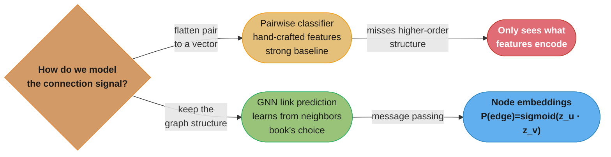
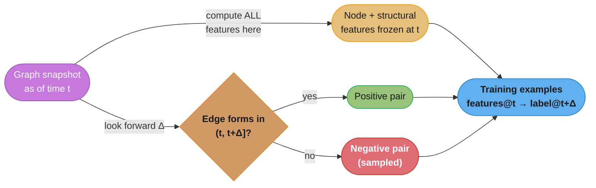
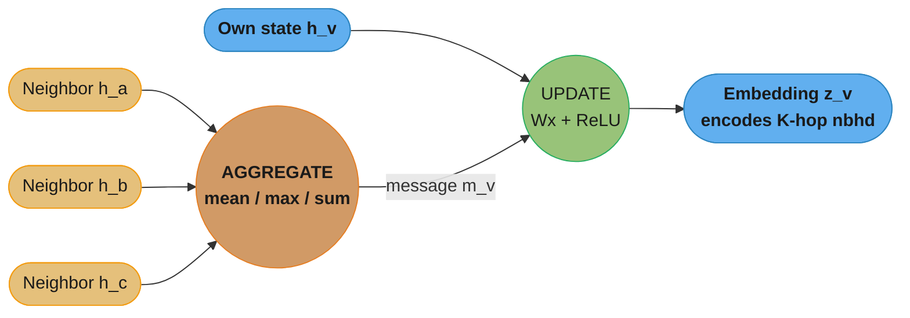
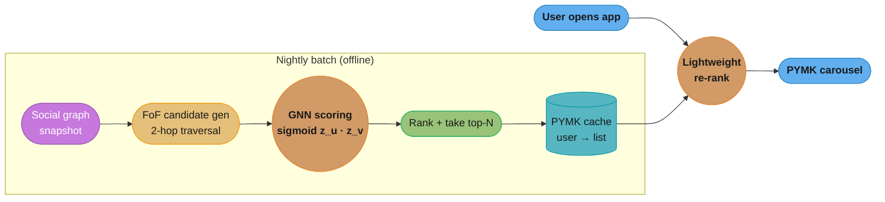
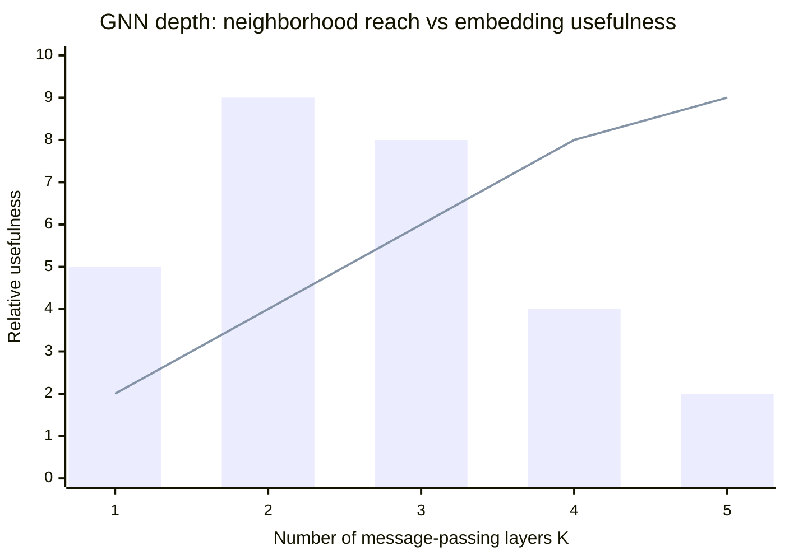
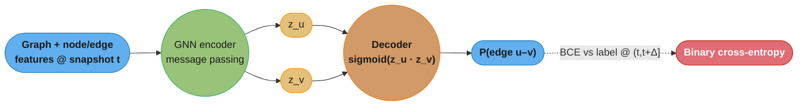
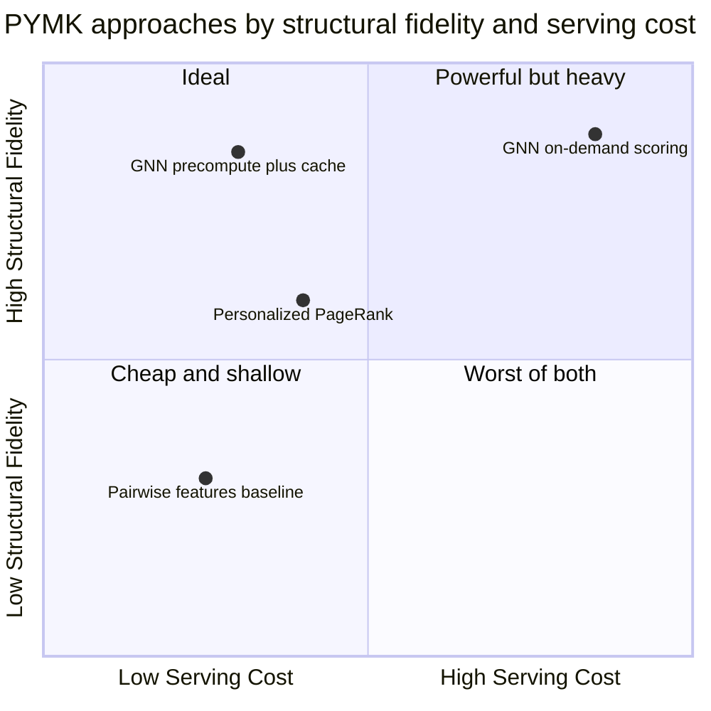

# Chapter 11: People You May Know

> Ch 11 of 11 · ML System Design Interview (Aminian & Xu) · closes the book — link prediction on a billion-user social graph with GNNs, scoped by friends-of-friends

## Chapter Map

The book's final chapter designs LinkedIn/Facebook-style **People You May Know (PYMK)** —
suggesting new connections to a user. Every earlier chapter treated the data as flat rows
(images, videos, posts, `<user, item>` pairs). PYMK is different: the signal that matters
lives in the **graph itself** — who is connected to whom — so the chapter is the book's one
serious treatment of **link prediction** and **graph neural networks (GNNs)**. It also closes
the loop on serving strategy: recommendations here are **batch-precomputed**, not scored at
request time, because the candidate space and the model are both too heavy for a synchronous
call.

**TL;DR:**
- Frame PYMK as **link prediction on a social graph**, not pairwise classification over
  hand-crafted features — a GNN learns node embeddings by **message passing** so the model
  sees graph structure directly, and `P(edge) = sigmoid(dot(z_u, z_v))`.
- Build the training set from **graph snapshots**: features from the graph as of time `t`,
  labels = edges that actually form in the window `(t, t+Δ]`. Getting the snapshot boundary
  right is the whole game — read a feature computed *after* an edge forms and you leak the
  label.
- Scale it by scoping candidates to **friends-of-friends (FoF)**, which collapses ~10^9
  possible partners per user to ~10^5–10^6 — because almost every real new connection is
  someone you share a mutual friend with.
- **Precompute** each user's PYMK list in a nightly batch job, cache it, and do only a
  lightweight re-rank at request time; on-demand GNN scoring of a billion users is infeasible.

## The Big Question

> "The best predictor of whether two people will connect is not what's on their profiles —
> it's the *shape of the graph around them*: who they already know in common. How do I turn
> 'you two share 40 mutual connections and both worked at Acme' into a model, at a billion
> users, cheaply enough to refresh every day?"

Analogy: recommending a movie only needs the movie's features and your history. Recommending a
*person* is recommending a **new edge in a graph you are already a node in** — and the edges
already present are the strongest evidence for the edges that will appear next. A classical
recommender throws that structure away by flattening each candidate pair into a feature vector;
a GNN keeps it by letting each node's representation be built from its neighbors' representations.
The chapter is about (1) encoding graph structure into the model, and (2) making that tractable
on a graph with roughly a trillion edges.

---

## 11.1 Clarifying Requirements

The interviewer sketches "design People You May Know." Questions to pin down before designing:

- **Business objective.** Grow the number of *meaningful* connections — not just any connection.
  A connection is valuable only if the recipient accepts it and the two subsequently interact.
  This distinction (sent vs accepted vs engaged) drives the online metrics later.
- **What is a connection?** On LinkedIn/Facebook a friendship/connection is **symmetric and
  undirected** — if A connects to B, B connects to A. (Twitter-style *follows* are directed;
  the book scopes to the symmetric case, which makes the graph an undirected graph.) The *invite*
  itself is directional (an inviter and an invitee), but the resulting edge is not.
- **Inputs available.** Users with profile attributes (industry, company, school, skills,
  location, activity level); the existing connection graph; and interaction logs (profile views,
  connection requests sent and their accept/ignore outcome).
- **Scale.** On the order of **~1 billion users**, each with on average a few hundred to
  ~1,000 connections, and a heavy-tailed degree distribution — a small number of hubs
  (influencers, recruiters) have hundreds of thousands of connections while most users have
  tens to hundreds. So the graph has on the order of `10^9 × 10^3 / 2 ≈ 5×10^11` edges (roughly a
  trillion directed half-edges).
- **Freshness / latency.** Does PYMK have to be real-time? No. Suggestions can be **precomputed
  in batch** and refreshed periodically (e.g. daily); a connection graph does not change so fast
  that yesterday's candidate list is stale. This is the key requirement that unlocks the serving
  design — we do **not** need sub-200 ms online GNN inference.
- **Output.** For each user, a **ranked list of suggested people** to connect with (the PYMK
  card carousel), each ideally with a reason ("5 mutual connections", "you both worked at Acme").

Establishing "batch precompute is acceptable" and "friendships are symmetric" early is what lets
the rest of the design be a graph-batch pipeline rather than a low-latency online service.

**In plain terms.** "Count one endpoint-slot for every user's every connection, then halve it,
because each friendship was counted from both ends." The framing matters because almost every
scale claim later in the chapter — why full-batch message passing is impossible, why negatives
dwarf positives, why FoF scoping is the linchpin — is this one number carried forward.

| Symbol | What it is |
|---|---|
| `N` | number of users (nodes) — about 10^9 |
| `d` | average degree: connections per user — a few hundred to ~1,000 |
| `N × d` | total directed half-edges (one per user-endpoint of every connection) |
| `/ 2` | the correction for double counting, since the connection is symmetric |
| `C(N,2)` | all possible user pairs — the space FoF scoping has to escape |

**Walk one example.** The book's stated figures pushed through.

```
  half-edges   = 10^9 users x 10^3 connections     = 1,000,000,000,000  = 1e12
  edges        = 1e12 / 2                          =   500,000,000,000  = 5e11

  all pairs    = C(10^9, 2) = 10^9 x (10^9 - 1)/2  = 499,999,999,500,000,000
                                                   ~ 5e17

  density      = 5e11 edges / 5e17 pairs           = 1.0e-6

  So one pair in a million is a real edge; 999,999 in a million are not.
```

The density line is the whole reason negative sampling exists (§11.3) and the reason ROC-AUC
needs a companion metric: with a 10^-6 positive rate, a model can be wrong about essentially every
prediction and still post a flattering false-positive rate. Note the `/ 2`: drop it and you report
1e12 "edges" — the half-edge count — which is where the "roughly a trillion edges" phrasing comes
from and why the same graph gets quoted as both 5e11 and 10^12 depending on which is meant.

---

## 11.2 Frame the Problem as an ML Task

### ML objective

Translate the business goal ("grow meaningful connections") into an ML objective:
**predict which pairs of users will form a connection.** Concretely, for a pair `(u, v)` that is
*not yet connected*, estimate `P(u and v connect)` and rank each user's non-connected candidates
by that probability.

### Two framings — and why the book picks the graph one

**Framing A — pointwise binary classification over user pairs (the non-graph baseline).**
Treat each candidate pair `(u, v)` as an independent example, hand-engineer a feature vector
(number of mutual connections, same company, same school, profile similarity, etc.), and train a
binary classifier `P(connect | features)`. This is exactly the learning-to-rank/pointwise setup
from Chapters 7 and 8. It works and is a strong baseline — but it only sees the graph through the
narrow window of the features an engineer thought to compute. Structural signal beyond those
hand-crafted features (a triangle-closing pattern, a community boundary, the *second-order*
neighborhood) is invisible.

**Framing B — graph link prediction with a GNN (the book's choice).** Model the social network
*as a graph* and predict missing/future edges directly. A graph neural network consumes node
features **and the adjacency structure**, learns a node embedding for every user by aggregating
information from its neighbors, and scores a candidate edge from the two endpoints' embeddings.
The model learns which structural patterns predict a link instead of relying only on features you
pre-specified. Because "who you'll connect to" is fundamentally about graph structure, framing the
problem *as* a graph problem is the natural fit.



Caption: the pairwise classifier is a legitimate strong baseline, but it only sees the graph
through features an engineer chose; the GNN keeps the graph and learns structural signal by
aggregating each node's neighborhood, so it can capture patterns the baseline is blind to.

### Graph construction

Define the graph the model operates on:

- **Nodes = users.** Node features: demographics (age bucket, location/region), professional
  attributes (industry, current company, past companies, schools, skills), and activity signals
  (how active, account age).
- **Edges = existing connections** (undirected). Edge features (optional): interaction frequency
  between the two users, age of the connection, number of mutual profile visits.

Link prediction then asks: given this graph, which currently-absent edges are most likely to
appear? That is precisely PYMK.

---

## 11.3 Data Preparation

### Data available

- **Users** — one row per user with profile attributes (the node feature source).
- **Connections** — the edge list, each edge carrying a **timestamp** of when the connection
  formed (critical for snapshotting).
- **Interactions** — profile views, connection *requests sent*, and each request's outcome
  (accepted / ignored / withdrawn), with timestamps.

### Building the training dataset from graph snapshots

This is the chapter's leakage-critical idea. We need `<pair, label>` examples where the label is
"did these two connect?" — but we must never let a feature "see the future."

**The snapshot construction:**

1. Pick a reference time `t`. Take the graph **as it existed at `t`** — every node feature and
   every structural feature (mutual-connection counts, embeddings) is computed **from that
   snapshot only**.
2. Look forward a window `Δ` (e.g. a few weeks). Any edge that **forms in `(t, t+Δ]`** between two
   users who were *not* connected at `t` is a **positive** example.
3. Pairs that were not connected at `t` and did **not** connect within the window are **negatives**
   (subject to sampling — see below).



Caption: features come from the frozen graph at `t`; labels come strictly from the *future*
window `(t, t+Δ]`. The snapshot boundary is what prevents the model from reading a feature that
only exists because the edge it is trying to predict already formed.

**Why the snapshot avoids leakage.** If you instead computed features from the *current* graph and
labeled edges that already exist, the feature "number of mutual connections" would be inflated by
the very edge you are trying to predict (or by edges that formed as a consequence of it). The
model would learn a trivially circular rule and score >0.99 AUC offline, then collapse in
production — the textbook **data-leakage** failure. The snapshot enforces **point-in-time
correctness**: every feature value is exactly what a serving system could have known at `t`, and
the label is the genuinely unknown future.

**Multiple snapshots.** Using several reference times (`t1, t2, …`) multiplies the training data
and captures how connection behavior varies over time, at the cost of storing/reconstructing the
graph at each time.

### Negative sampling on the graph

Positives (edges that actually form) are astronomically rare relative to all non-connected pairs:
with 10^9 users there are ~10^18 possible pairs and only ~10^12 real edges, so a naive negative
set is ~99.9999% of everything and hopelessly imbalanced. We **sample negatives**. Two flavors,
both used:

- **Random negatives** — pick random non-connected pairs. Cheap, but usually *too easy*: two
  random users are typically in totally different communities (different city, industry, no mutual
  friends), so the model learns almost nothing from them.
- **Hard negatives** — pairs that are plausible but did *not* connect: same company, same city,
  or that share mutual connections yet never formed an edge in the window. These force the model to
  learn the finer boundary between "would connect" and "merely similar." Mixing in hard negatives is
  what makes the classifier useful, since at serving time every candidate is already a
  friend-of-friend (i.e. every real candidate is "hard").

---

## 11.4 Feature Engineering

Even with a GNN, features feed the node/edge inputs, and the hand-crafted **pairwise** features
define the strong non-GNN baseline. The chapter groups them:

### Pairwise (edge-candidate) features — the classical link-prediction signals

- **Number of mutual connections (friends-of-friends count).** The single strongest signal: the
  more friends `u` and `v` share, the likelier they connect (triadic closure — friends of friends
  become friends). Often refined by weighting shared neighbors by *their* degree (a mutual friend
  who is a mega-hub is weaker evidence than a mutual friend with only 30 connections — this is the
  **Adamic–Adar** intuition: weight each common neighbor by `1/log(degree)`).
- **Education overlap** — same school, overlapping years.
- **Workplace overlap** — same current or past company.
- **Industry / field** — same industry.
- **Location** — same city/region.
- **Profile similarity** — cosine similarity of profile-attribute or text embeddings (skills,
  headline).
- **Interaction signals** — did `u` view `v`'s profile? Did either send an invite? Recent profile
  views are a very strong short-horizon predictor.

### Node features (for the GNN)

Per-user attributes that initialize each node's representation: demographics, industry, company,
school, skills, activity level, account age. Sparse high-cardinality categoricals (company, school,
skill IDs) are encoded as **learned embeddings**; numeric features are scaled/bucketized.

### Edge features (for the GNN)

Per existing connection: interaction frequency, connection age, number of mutual profile views.
These let message passing weight a strong tie (frequent interaction) more than a dormant one.

The pairwise features double as a sanity baseline: a logistic-regression or GBDT model over
"mutual count + same company + same school + …" is a genuinely competitive PYMK model, and any GNN
must beat it to justify its cost.

---

## 11.5 Model Development — Graph Neural Networks

### The idea: message passing / neighborhood aggregation

A GNN learns an embedding `z_v` for every node by **iteratively aggregating information from its
neighbors**. One "layer" = one round of message passing:

```
for each layer k = 1..K:
    for each node v:
        m_v      = AGGREGATE({ h_u^(k-1) : u in neighbors(v) })   # gather neighbor states
        h_v^(k)  = UPDATE( h_v^(k-1), m_v )                         # combine with own state
z_v = h_v^(K)                                                       # final embedding
```

- After **1 layer**, `z_v` encodes `v` and its *direct* neighbors.
- After **2 layers**, it encodes `v`'s neighbors *and their neighbors* — the 2-hop
  (friends-of-friends) neighborhood, which is exactly the PYMK signal.
- `K` is usually **2–3**; more layers reach farther but cause **over-smoothing** (every node's
  embedding converges to the graph average and becomes uninformative).

`AGGREGATE` must be **permutation-invariant** (neighbors have no order) — mean, sum, or max pool.
`UPDATE` is a small neural net (a linear layer + nonlinearity).

**What it means.** "Each round, every node replaces its own state with a blend of its previous
state and whatever its neighbors were holding — so after `K` rounds, information has travelled
exactly `K` hops." The framing matters because the depth knob `K` is not an accuracy dial; it is
literally the radius of the subgraph each embedding summarizes, and both the PYMK signal and the
compute blow-up are consequences of that radius.

| Symbol | What it is |
|---|---|
| `h_v^(k)` | node `v`'s hidden state after `k` rounds; `h_v^(0)` is its raw feature vector |
| `neighbors(v)` | the set of nodes directly connected to `v` — size `d` on average |
| `m_v` | the single vector summarizing all of `v`'s neighbors this round |
| `AGGREGATE` | permutation-invariant pool (mean/sum/max) — must not depend on neighbor order |
| `UPDATE` | small learned net mixing `v`'s own state with `m_v` |
| `K` | number of rounds = hop radius = how far structural signal travels |
| `z_v` | the final embedding, `h_v^(K)`, fed to the edge decoder |

**Walk one example.** Neighborhood size at each `K`, with the chapter's `d ≈ 1,000`.

```
  K   nodes reachable = d^K      what the embedding encodes
  1        1,000                 v's direct connections
  2    1,000,000                 friends-of-friends -- the PYMK signal
  3    1,000,000,000            ~the entire 1e9-user population
  4    1,000,000,000,000         1000x the population; pure re-visiting

  Full-batch cost per node at K=3 is ~1e9 neighbor states -- one node's
  forward pass would touch the whole graph.
```

The result means `K=2` is not a hyperparameter that happened to win a sweep — it is the smallest
radius that reaches the friends-of-friends structure and the largest that stays below population
scale. At `K=3` the receptive field already covers every user, so every node is aggregating over
essentially the same set: that is over-smoothing stated as arithmetic, and it is also why compute
explodes at exactly the depth where the signal stops being distinctive.



Caption: one message-passing layer gathers neighbor states with a permutation-invariant aggregator
and combines them with the node's own state; stacking `K=2–3` layers makes each node's embedding
encode its `K`-hop neighborhood — 2 hops is exactly the friends-of-friends structure PYMK cares
about.

### GNN variants the book names

| Variant | Aggregation | Key property |
|---------|-------------|--------------|
| **GCN** (Graph Convolutional Network) | degree-normalized mean of neighbors | simple, spectral-motivated; **transductive** (needs the whole graph at train time; can't embed unseen nodes) |
| **GraphSAGE** | sample a fixed number of neighbors, then mean/pool/LSTM aggregate | **inductive** — learns an aggregator function, so it can embed *new* nodes without retraining; the practical choice at billion scale |
| **GAT** (Graph Attention Network) | attention-weighted neighbor sum | learns *how much* each neighbor matters instead of weighting them equally |

The book leans on **GraphSAGE** for scale: it is **inductive** (crucial when users and edges are
added constantly — you can embed a brand-new user from its features and sampled neighbors without
retraining the whole model) and it uses **neighborhood sampling** so a node with 200,000 neighbors
doesn't blow up the compute.

### From node embeddings to an edge probability

The GNN outputs a node embedding per user. The probability that `u` and `v` connect is the
**similarity of their embeddings**, squashed to `[0,1]`:

```
P(edge u–v) = sigmoid( z_u · z_v )
```

The dot product is the scoring function (cosine or a small MLP over `[z_u ; z_v]` are alternatives).
This is a **decoder** on top of the GNN **encoder** — the encoder learns embeddings, the decoder
turns a pair of embeddings into an edge score.

### Training

- **Loss:** binary cross-entropy over the snapshot pairs — positives (edges that formed) pushed
  toward 1, sampled negatives toward 0.
- **Negative sampling on the graph:** for each positive edge, draw one or more negative pairs
  (random + hard, per 11.3) so BCE has a balanced signal.
- **Billion-edge scalability — the real engineering.** You cannot fit a trillion-edge graph and
  do full-batch message passing on one machine. GraphSAGE's answer is **minibatch training with
  neighborhood sampling**: for a minibatch of target nodes, sample a bounded fan-out (e.g. 25
  neighbors at hop 1, 10 at hop 2) to build a small computation subgraph, run message passing on
  just that, and update. This bounds per-example compute regardless of hub degree and lets training
  distribute across many workers.

**What the formula is telling you.** "Instead of visiting all `d` neighbors at each hop, visit a
fixed `s_k` of them, so the subgraph you actually compute on has size `s_1 × s_2 × … × s_K` no
matter how the real graph is shaped." The framing matters because it converts a quantity that
depends on the *data* (degree, which is heavy-tailed and unbounded) into a quantity that depends
only on a *config* — which is what makes the cost predictable enough to schedule at billion scale.

| Symbol | What it is |
|---|---|
| `s_1` | neighbors sampled at hop 1 (the book's example: 25) |
| `s_2` | neighbors sampled per hop-1 node at hop 2 (the book's example: 10) |
| `s_1 + s_1·s_2` | total nodes in the sampled computation subgraph for one target node |
| `d^K` | the unsampled alternative — the full `K`-hop neighborhood |
| Hub degree | the worst case sampling removes: a recruiter with 300,000 connections |

**Walk one example.** One target node, fan-out (25, 10), against the full 2-hop neighborhood.

```
  sampled subgraph
    hop 1 nodes = 25
    hop 2 nodes = 25 x 10                       = 250
    total                                       = 275 nodes

  full 2-hop neighborhood at d = 1,000
    hop 1 nodes = 1,000
    hop 2 nodes = 1,000 x 1,000                 = 1,000,000
    total                                     ~ 1,001,000 nodes

  ratio  1,000,000 / 275                       ~ 3,636x less work

  hub case: a node with 300,000 connections
    sampled  -> still 275 nodes
    unsampled-> 300,000 at hop 1 alone (1,091x the whole sampled subgraph)
```

The result means per-example cost is a constant 275 node-states whether the target is a brand-new
user with 4 connections or a recruiter with 300,000 — the sampling is what makes minibatches
uniform enough to shard across workers. The term exists because without it a single hub in a
minibatch determines that batch's memory footprint, so batch size would have to be set for the
worst node in the graph rather than the average one, and training would stall or OOM
unpredictably whenever a mega-connector was drawn.

### Broken → fix: leaking structure through the message-passing graph

**Broken.** A team builds the training pairs correctly (features frozen at `t`) but runs message
passing over the **current** adjacency — including the edge `(u, v)` they are trying to predict.
Now `z_u` was literally computed using `v` as a neighbor (and vice versa). Offline ROC-AUC is
0.99; production acceptance rate barely moves. The label leaked in through the *graph used for
aggregation*, not the tabular features.

**Fix.** Message passing for a training pair `(u, v)` must run over the graph **as of `t`**, with
the target edge (and any `(t, t+Δ]` edges) **removed** from the adjacency. The GNN must predict
the edge from the *rest* of the structure — never from the edge itself. This is the graph
analogue of point-in-time correctness: the snapshot must be enforced on **both** the feature
computation and the aggregation adjacency.

---

## 11.6 Evaluation

### Offline metrics

The task is binary (connect / not) but consumed as a **ranking** (top-N suggestions per user), so
both framings' metrics appear:

- **ROC-AUC** — probability the model ranks a true future edge above a random non-edge. Robust to
  the extreme class imbalance and the book's primary offline classification metric. But AUC can
  look great while the *top of the list* is mediocre.
- **mAP / precision@k / recall@k** — evaluate the actual ranked PYMK list against the edges that
  formed. Since relevance is binary (an edge either formed or not), **mAP** fits cleanly (nDCG
  needs graded relevance we don't have; MRR over-weights the single first hit).

Evaluate on a **held-out future window** — snapshots whose `(t, t+Δ]` edges the model never saw —
so the offline number reflects genuine forecasting, not memorization.

**Put simply.** "ROC-AUC is the probability that, if you pick one edge that really formed and one
pair that did not, the model scored the real one higher." The framing matters because that
pairwise question is nearly free to answer well when non-edges outnumber edges a million to one —
almost any random non-edge is obviously wrong — so a high AUC certifies almost nothing about the
handful of names actually printed on the PYMK card.

| Symbol | What it is |
|---|---|
| Positive | a pair that did connect in `(t, t+Δ]` |
| Negative | a candidate pair that did not connect in the window |
| ROC-AUC | `P(score(positive) > score(random negative))`; 0.5 is random, 1.0 is perfect |
| Rank of a positive | where a true future edge landed in the scored candidate list |
| precision@k | of the top `k` suggestions shown, the fraction that became real edges |

**Walk one example.** One user, 1,000,000 FoF candidates, 5 edges that actually formed.

```
  true edge landed at rank   negatives it beat   / 999,995 negatives
        3                          999,993             0.999998
       40                          999,957             0.999962
      900                          999,098             0.999103
   12,000                          987,999             0.988004
  250,000                          750,000             0.750004
                                                     ----------
  ROC-AUC = mean                                       0.947414

  but the card shows the top 10:   precision@10  = 1/10   = 0.10
                                   precision@100 = 2/100  = 0.02
                                   recall@100    = 2/5    = 0.40
```

The result means a respectable 0.947 AUC coexists with 9 of the 10 suggestions the user actually
sees being wrong — the AUC is carried by the 750,000 negatives the worst positive still beat,
none of which are anywhere near the visible list. That is why the book pairs AUC with mAP and
precision@k, which are computed only over the part of the ranking a user ever looks at.

Now run the same arithmetic on the leaked model from §11.5, where message passing saw the target
edge: the five positives land at ranks 1–5, every one of them beats all 999,995 negatives, and
ROC-AUC comes out at exactly **1.0**. An offline AUC in the 0.99+ range is therefore not a
triumph, it is the signature of leakage — a genuine forecaster of human behavior cannot separate
future friends from plausible non-friends that cleanly, so the number itself is the alarm.

### Online metrics

Offline AUC does not tell you whether people *accept* suggestions, so the real judges are online:

- **Connection requests sent per PYMK impression** — do users act on suggestions?
- **Acceptance rate within X days** — of the requests sent, how many are accepted? This is the
  quality signal; a model that surfaces spammy or irrelevant people gets requests sent but not
  accepted (or gets *ignored/reported*).
- **Downstream engagement / retention of the new connections** — do the new edges lead to real
  interaction (messages, feed engagement) and to the recommended user staying active? This is the
  closest proxy for "meaningful connection," the actual business objective.

Run these through an **A/B test** with a proper traffic split and significance testing before
shipping a new model.

---

## 11.7 Serving

### Scope candidates with friends-of-friends (the scaling move)

Scoring one user against all ~10^9 others is `O(N)` per user and `O(N^2) ≈ 10^18` overall — a
non-starter. The observation that saves the design: **almost every real new connection is a
friend-of-friend (FoF)** — you connect to people you share a mutual connection with. So restrict
each user's candidate set to its **2-hop neighborhood**.

**The FoF math.** With average degree `d ≈ 1,000`, a user's raw 2-hop reach is about
`d × d = 10^6` (each of your ~1,000 friends has ~1,000 friends). After removing already-connected
people and de-duplicating the heavy overlap (your friends share many friends), the *distinct*
candidate set lands around **10^5–10^6 per user** — five to ten *thousand* times smaller than the
1B population, and computable by a graph traversal. FoF is both a huge efficiency win and a
quality prior (it encodes triadic closure for free).

```
Candidate space per user

  All users (score everyone)      : ~1,000,000,000   O(N)   infeasible
  Friends-of-friends (2-hop)      : ~   100,000–1,000,000   graph traversal
  After heavy re-rank keeps top-N : ~       hundreds        cached PYMK list

  reduction: ~10^9  ->  ~10^5–10^6   (roughly 1,000–10,000x fewer candidates)
```

Caption: FoF exploits triadic closure to cut the candidate set by three-to-four orders of
magnitude, turning an `O(N^2)` all-pairs problem into a bounded per-user traversal. Hubs are
capped (sample their FoF) so a mega-connector doesn't explode the fan-out.

**Read it like this.** "Walk two hops out, count who you land on, throw away the duplicates and
the people you already know — whatever survives is everyone worth scoring." The framing matters
because the saving is not an approximation the design tolerates; triadic closure means the
discarded 99.9% contains almost no true future edges, so the cheap set is also the *right* set.

| Symbol | What it is |
|---|---|
| `N` | total users to score against if you did not scope at all — 10^9 |
| `d` | average connections per user — ~1,000 |
| `d × d` | raw 2-hop reach before dedup: each of your `d` friends has `d` friends |
| Dedup / already-connected | the shrink: your friends share many friends, and some 2-hop hits are already your connections |
| Distinct FoF set | what survives — the book's 10^5–10^6 per user |
| `O(N^2)` | the unscoped all-pairs cost the whole move exists to avoid |

**Walk one example.** The chapter's own figures, checked.

```
  unscoped, per user      = 1e9 candidates
  unscoped, all users     = 1e9 x 1e9 = 1e18 pair evaluations

  raw 2-hop reach         = d x d = 1,000 x 1,000 = 1,000,000 = 1e6 hits
    (hits, not distinct -- your friends' friend lists overlap heavily)

  after dedup + removing existing connections
    optimistic (dense, overlapping community)  ~ 1e5 distinct
    pessimistic (sparse, little overlap)       ~ 1e6 distinct

  reduction vs 1e9
    1e9 / 1e6 =  1,000x        keeps 0.1%   of the population
    1e9 / 1e5 = 10,000x        keeps 0.01%  of the population
```

The result means the scoped set is 1,000x to 10,000x smaller — exactly the "three-to-four orders
of magnitude" the caption claims, and it lines up with the `1,000–10,000x` figure stated in the
ASCII block above. Note the raw reach `d × d = 1e6` is an *upper* bound on hits, not on distinct
people: in a tightly clustered community your 1,000 friends may collectively know only ~100,000
distinct people, which is why the surviving set can be a full order of magnitude below the raw
product. The dedup step is therefore doing real work, not bookkeeping.

### Precompute vs on-demand

The candidate set is still ~10^5–10^6 per user, and GNN scoring plus re-ranking over that at
request time, for a billion users, is far too heavy for a synchronous call. Two options:

| Strategy | How | Pros | Cons |
|----------|-----|------|------|
| **On-demand scoring** | compute FoF candidates and score with the GNN at request time | always fresh | huge per-request compute; unacceptable latency at 10^5–10^6 candidates × 1B users |
| **Batch precompute** (book's choice) | a nightly/periodic job computes each user's FoF candidates, scores them with the GNN, ranks, and **caches the top-N PYMK list** | cheap, fast reads; scores are reused across all of a user's sessions that day | staleness — brand-new edges/profile changes aren't reflected until the next refresh |

The book chooses **precompute + cache with periodic refresh**, plus a **lightweight re-rank at
request time** to fold in the freshest signals (a connection made an hour ago, current context,
already-dismissed suggestions) without re-running the GNN. This is the mirror image of Chapters 6
and 8's low-latency online serving — PYMK's "batch is acceptable" requirement is precisely what
lets it precompute.



Caption: the heavy work — FoF candidate generation and GNN scoring — runs offline in a batch job
and lands each user's top-N list in a cache; the online path only does a cheap re-rank (drop
dismissed suggestions, fold in same-day edges, apply business rules) before rendering the carousel.

### Training / refresh pipeline

Retrain (or fine-tune) embeddings periodically on fresh snapshots; recompute FoF lists and rescore
in the batch job on the same cadence. Because the graph changes incrementally, **incremental
recomputation** (only re-score users whose neighborhoods changed) is far cheaper than a full
nightly rescore of all 1B users.

---

## 11.8 Other Talking Points

- **Personalized random walk / PageRank as a strong non-GNN baseline.** Before (or instead of) a
  GNN, a **personalized PageRank / random-walk-with-restart** rooted at the user ranks candidates
  by how often a random walk from `u` lands on them — a purely structural score that captures
  multi-hop proximity, needs no training, and is a genuinely competitive PYMK baseline
  (this is essentially how "friends-of-friends, weighted" generalizes).
- **Frequent graph updates & incremental recompute.** The graph gains millions of edges a day;
  recompute only affected neighborhoods rather than the whole graph each cycle.
- **Rich-get-richer bias and fairness for new users.** Ranking by mutual-connection count means
  well-connected users get suggested more (and gain even more connections), while **new users with
  few connections** get poor suggestions and are rarely suggested — a cold-start + fairness problem.
  Mitigate with content/feature-based fallbacks (industry, school, company) and deliberate
  exploration for low-degree users.
- **Privacy of interaction signals.** Profile-view signals are powerful predictors but sensitive —
  suggesting someone *because they viewed your profile* can feel invasive (and can reveal that the
  view happened). Use such signals carefully and within policy.
- **Inviter / invitee asymmetry.** Though the resulting edge is symmetric, the *act* is directional:
  the value and acceptance likelihood differ depending on who initiates. Modeling send-vs-accept
  separately can improve the *accepted* connection rate rather than just requests sent.
- **Edge decay.** Old, dormant connections should carry less weight than fresh, actively-interacting
  ones; decaying edge weight by recency keeps the signal current.

---

## Visual Intuition

### Triadic closure — why friends-of-friends works

```
Before (t):                          After (t+Δ):

     A ─────── B                          A ─────── B
     │         │                          │ ╲     ╱ │
     │         │        two mutual        │   ╲ ╱   │
     C ─────── D        friends (A,B)     C ──╳──── D
                        pull C and D      │   ╱ ╲   │
     C,D share A and B  together          (C ─── D edge forms)
     as mutual friends
```

Caption: C and D each already connect to both A and B, so they sit inside the same tight cluster;
triadic closure — the tendency for two people with mutual friends to become friends — is why the
mutual-connection count is PYMK's strongest single feature and why FoF candidate scoping loses
almost no real edges.

### How many layers? Reach vs over-smoothing



Caption: the bar is embedding usefulness, peaking at `K=2–3` where the model sees the
friends-of-friends neighborhood; the line is raw hop-reach, which keeps growing but drives
**over-smoothing** — beyond ~3 layers every node's embedding collapses toward the graph average
and stops discriminating, so PYMK GNNs stay shallow.

### The two-part encoder-decoder for link prediction



Caption: link prediction is an encoder-decoder — the GNN encoder turns the graph into per-node
embeddings, the decoder turns any pair of embeddings into an edge probability, and BCE against the
future-window label trains both end-to-end.

---

## Key Concepts Glossary

- **People You May Know (PYMK)** — connection-recommendation system suggesting new edges to a user.
- **Link prediction** — predicting which currently-absent edges of a graph will (or should) appear.
- **Social graph** — nodes = users, edges = connections; here undirected/symmetric.
- **Symmetric / undirected connection** — A–B connection implies B–A (vs a directed follow).
- **Triadic closure** — two users sharing mutual friends tend to become friends; the basis of FoF.
- **Friends-of-friends (FoF)** — a user's 2-hop neighborhood; the PYMK candidate set.
- **Graph snapshot** — the graph frozen at time `t`; features computed from it, labels from the future.
- **Point-in-time correctness** — every feature reflects only what was knowable at `t` (anti-leakage).
- **Data leakage (graph)** — features (or the aggregation adjacency) that already encode the edge
  being predicted, inflating offline metrics and collapsing online.
- **Negative sampling** — drawing non-edge pairs as negatives because true non-edges dwarf edges.
- **Hard negatives** — plausible-but-non-connecting pairs (same company/city, shared friends) that
  sharpen the decision boundary.
- **Graph neural network (GNN)** — model that computes node embeddings by aggregating neighbor info.
- **Message passing / neighborhood aggregation** — one GNN layer: gather neighbor states, update self.
- **AGGREGATE (permutation-invariant)** — mean/sum/max over neighbors (order-independent).
- **GCN** — Graph Convolutional Network; degree-normalized mean; transductive.
- **GraphSAGE** — inductive GNN with neighbor sampling; embeds unseen nodes; scales to billions.
- **GAT** — Graph Attention Network; attention-weighted neighbor aggregation.
- **Transductive vs inductive** — needs the whole graph at train time vs can embed new nodes.
- **Over-smoothing** — too many GNN layers make all node embeddings converge and lose information.
- **Node / edge embedding** — learned vector for a user / connection.
- **Edge-scoring decoder** — `P(edge) = sigmoid(z_u · z_v)` mapping an embedding pair to a probability.
- **Neighborhood sampling / minibatching** — bound per-node fan-out so message passing scales.
- **Adamic–Adar** — mutual-friend score weighting each common neighbor by `1/log(degree)`.
- **Personalized PageRank / random walk with restart** — structural, training-free PYMK baseline.
- **Rich-get-richer bias** — high-degree users get suggested more, worsening new-user cold start.
- **Batch precompute + cache** — compute PYMK lists offline, cache them, re-rank lightly online.
- **Incremental recompute** — re-score only users whose neighborhood changed since last cycle.

---

## Tradeoffs & Decision Tables

**Framing.**

| Framing | Sees graph structure? | Handles new nodes | Cost | Verdict |
|---------|:--:|:--:|:--:|---------|
| Pairwise classifier + hand-crafted features | only via features | trivial | low | strong baseline |
| GNN link prediction | yes, natively | GraphSAGE: yes | high | book's choice |

**GNN variant.**

| Variant | Aggregation | Inductive? | Best when |
|---------|-------------|:--:|-----------|
| GCN | normalized mean | no | small/static graphs |
| GraphSAGE | sampled neighbors + pool | yes | billion-scale, growing graph |
| GAT | attention-weighted | yes | neighbor importance varies a lot |

**Serving.**

| Strategy | Freshness | Per-request cost | Fits PYMK? |
|----------|:--:|:--:|:--:|
| On-demand GNN scoring | high | very high | no (too heavy) |
| Batch precompute + cache + light re-rank | daily-ish | very low | yes |



Caption: precomputing the GNN's scores moves it from the expensive "powerful but heavy" quadrant
into the ideal one — high structural fidelity at low serving cost — which is exactly why the
"batch is acceptable" requirement is the design's linchpin.

---

## Common Pitfalls / War Stories

- **Leaking the label through the graph, not just the features.** The subtlest PYMK bug: features
  are frozen at `t` correctly, but message passing runs over the *current* adjacency, so the GNN
  aggregates across the very edge it predicts. Offline AUC ~0.99, online lift ~0. Fix: remove the
  target edge (and all `(t, t+Δ]` edges) from the aggregation graph — enforce the snapshot on the
  adjacency, not only the tabular features.
- **Random negatives only → a useless production model.** Trained on random non-edges (different
  city, no mutual friends), the model aces offline metrics by separating obviously-unrelated
  people, then fails at serving where *every* FoF candidate is "hard." Always mix in hard negatives
  drawn from the same distribution as serving candidates.
- **Stacking too many GNN layers.** Chasing more "reach" with 5–6 layers causes over-smoothing —
  embeddings converge to the graph mean, discrimination collapses, and the top-N list turns generic.
  Keep `K=2–3`.
- **Mega-hubs blowing up compute and dominating suggestions.** A recruiter with 300k connections
  makes 2-hop fan-out explode and appears in everyone's FoF. Cap/sample high-degree neighbors in
  both training (neighborhood sampling) and candidate generation, and down-weight hub mutuals
  (Adamic–Adar).
- **Optimizing requests sent instead of accepted.** A model can inflate "requests sent per
  impression" by surfacing familiar-looking but unwanted people; recipients ignore or report them.
  Optimize and A/B on **acceptance within X days** and downstream engagement — the meaningful-
  connection objective — not raw send rate.
- **New-user cold start / rich-get-richer.** Mutual-count ranking starves users with few
  connections (few FoF, weak embeddings) and over-serves hubs. Add feature-based fallbacks (school,
  company, location) and exploration for low-degree users, or they never get good suggestions.

---

## Real-World Systems Referenced

LinkedIn and Facebook (People You May Know / connection recommendations); GNN architectures **GCN**,
**GraphSAGE** (Hamilton, Ying, Leskovec — inductive representation learning on large graphs, and
the Pinterest **PinSage** web-scale application), and **GAT** (Veličković et al.); classical
link-prediction heuristics (common neighbors, **Adamic–Adar**, Jaccard); **personalized PageRank /
random walk with restart** as a structural baseline. Graph-learning libraries such as PyTorch
Geometric and DGL, and distributed graph-processing / ANN infrastructure for batch precompute.

---

## Summary

People You May Know is **link prediction on a social graph**: predict which not-yet-connected user
pairs will form a connection, and surface each user's top candidates. The book frames it as a
**graph** problem rather than flat pairwise classification, because the strongest signal — who you
already know in common — *is* graph structure. A **graph neural network** (GraphSAGE for scale)
learns a node embedding per user by **message passing** — aggregating each node's neighborhood over
`K=2–3` layers — and scores a candidate edge as `sigmoid(z_u · z_v)`, trained with binary
cross-entropy and negative sampling.

The training set is built from **graph snapshots**: compute every feature from the graph frozen at
`t`, and label pairs by whether they connect in the future window `(t, t+Δ]` — enforcing
point-in-time correctness on *both* the features and the aggregation adjacency so the model never
reads the edge it's predicting. Evaluation uses **ROC-AUC / mAP** offline over held-out future
edges, and **requests sent, acceptance rate, and downstream engagement** online.

Serving hinges on two moves: **friends-of-friends candidate scoping**, which exploits triadic
closure to cut ~10^9 possible partners to ~10^5–10^6 per user, and **batch precompute + cache**,
which runs the heavy FoF-generation-plus-GNN-scoring offline and leaves the request path only a
lightweight re-rank. That "batch is acceptable" requirement, established in the very first
clarifying step, is what makes an otherwise infeasible billion-user GNN system tractable — a fitting
close to a book whose entire thesis is that the *framing and the serving strategy*, not just the
model, are the system design.

---

## Interview Questions

**Q: Why frame People You May Know as graph link prediction instead of pairwise classification over hand-crafted features?**
Because the strongest connection signal — shared mutual friends and higher-order graph structure — lives in the graph itself, which a flattened feature vector throws away. A pairwise classifier only sees the graph through features an engineer thought to compute, so structural patterns like triangle-closing or community boundaries are invisible. A GNN consumes the adjacency directly and learns node embeddings from each user's neighborhood, capturing structure the baseline can't. The pairwise model is still a strong baseline the GNN must beat to justify its cost.

**Q: How do you build the PYMK training set without leaking the label?**
Use graph snapshots: compute every feature from the graph frozen at time t, and label a pair positive only if that edge forms in the future window (t, t+Δ]. Features reflect only what was knowable at t (point-in-time correctness), and labels come strictly from the future, so no feature can be inflated by the edge it's trying to predict. Pairs that don't connect in the window are negatives, subject to sampling. Multiple snapshots at different times multiply the data.

**Q: What is the subtle graph-specific leakage that survives even correct feature snapshotting?**
Running message passing over the current adjacency, which includes the very edge being predicted. Even if tabular features are frozen at t, if the GNN aggregates z_u using v as a neighbor (and vice versa) the target edge leaks into the embeddings, giving ~0.99 offline AUC and near-zero online lift. The fix is to remove the target edge and all (t, t+Δ] edges from the aggregation graph, so the model predicts the edge from the rest of the structure — point-in-time correctness on the adjacency, not just the features.

**Q: Why must you use hard negatives, not just random negatives, when training PYMK?**
Because random non-connected pairs are almost always in completely different communities (different city, industry, no mutual friends), so the model learns to separate obviously-unrelated people and does nothing useful. At serving time every candidate is a friend-of-friend — i.e. already "hard" — so a model trained only on easy negatives collapses in production. Hard negatives are plausible-but-non-connecting pairs (same company/city, shared friends) that force the model to learn the finer boundary. Mixing random and hard negatives matches training to the serving distribution.

**Q: What does friends-of-friends candidate scoping do to the search space, with numbers?**
It cuts ~10^9 possible partners per user to roughly 10^5–10^6 by restricting candidates to the 2-hop neighborhood. With average degree ~1,000, raw 2-hop reach is about 1,000 × 1,000 = 10^6, and after removing existing connections and de-duplicating overlap it lands around 10^5–10^6 distinct candidates. That's a 1,000–10,000x reduction, turning an O(N^2) ≈ 10^18 all-pairs problem into a bounded per-user graph traversal. FoF works because almost every real new connection shares a mutual friend (triadic closure).

**Q: Why does PYMK precompute recommendations in batch instead of scoring at request time?**
Because each user has ~10^5–10^6 FoF candidates and there are ~10^9 users, so GNN scoring plus re-ranking synchronously is far too heavy for a low-latency request. A connection graph changes slowly, so a daily-refreshed candidate list isn't meaningfully stale — the clarifying step established that batch is acceptable. So a nightly job generates FoF candidates, scores them with the GNN, ranks, and caches each user's top-N; the request path only does a lightweight re-rank. The tradeoff is staleness until the next refresh.

**Q: What is message passing in a GNN and how does layer count relate to what an embedding captures?**
Message passing is one GNN layer: each node aggregates its neighbors' states with a permutation-invariant function (mean/sum/max), then updates its own state by combining that message with its previous state. After 1 layer a node's embedding encodes its direct neighbors; after 2 layers it encodes the 2-hop (friends-of-friends) neighborhood — exactly the PYMK signal. K is usually 2–3; more layers reach farther but cause over-smoothing where embeddings converge to the graph average and lose information.

**Q: How does a GNN turn node embeddings into an edge probability?**
It scores the similarity of the two endpoints' embeddings and squashes it to [0,1]: P(edge u–v) = sigmoid(z_u · z_v). The GNN is an encoder producing per-node embeddings, and this dot-product-plus-sigmoid is the decoder mapping any embedding pair to a connection probability. Cosine similarity or a small MLP over the concatenated embeddings are alternatives. The encoder and decoder are trained together with binary cross-entropy against the snapshot labels.

**Q: Why is GraphSAGE preferred over GCN for a billion-user graph?**
Because GraphSAGE is inductive and uses neighborhood sampling. Inductive means it learns an aggregator function, so it can embed brand-new users (added constantly) from their features and sampled neighbors without retraining the whole model — GCN is transductive and needs the full graph at train time. Neighborhood sampling bounds per-node fan-out (e.g. 25 neighbors at hop 1, 10 at hop 2), so a hub with 200k connections doesn't blow up compute, and minibatches distribute across workers. That combination is what makes billion-edge training tractable.

**Q: What is over-smoothing and why does it cap GNN depth?**
Over-smoothing is when stacking too many message-passing layers makes every node's embedding converge toward the graph average, so nodes become indistinguishable and the embeddings stop being useful. Each layer mixes in a wider neighborhood, and past ~3 layers the mixing dominates the node's own signal. That's why PYMK GNNs stay shallow at K=2–3 — deep enough to reach the friends-of-friends structure, shallow enough to avoid collapse. It's a fundamental limit, not a tuning quirk.

**Q: Which offline metrics fit PYMK and why not nDCG?**
ROC-AUC as the primary classification metric because it's robust to the extreme class imbalance (true edges are ~10^-6 of all pairs) and measures ranking a true future edge above a random non-edge, plus mAP / precision@k / recall@k for the ranked top-N list. nDCG needs graded relevance, but PYMK relevance is binary (an edge either formed or not), so mAP fits more cleanly, and MRR over-weights just the single first hit. All are evaluated on a held-out future window so the number reflects forecasting, not memorization.

**Q: Which online metrics actually judge a PYMK model, and what's the trap?**
Connection requests sent per impression, acceptance rate within X days, and downstream engagement/retention of the new connections. The trap is optimizing requests sent, which a model can inflate by surfacing familiar-looking but unwanted people who then get ignored or reported. Acceptance rate and downstream interaction are the quality signals that map to the real objective — meaningful connections — so those are what you A/B test and optimize, not raw send volume.

**Q: Why does ranking by mutual-connection count create a fairness / cold-start problem?**
Because it produces rich-get-richer bias: well-connected users have many friends-of-friends and strong embeddings, so they get suggested more and gain even more connections, while new users with few connections have tiny FoF sets and weak embeddings, get poor suggestions, and are rarely suggested to others. This starves exactly the users who most need recommendations. Mitigations include content/feature-based fallbacks (school, company, location) and deliberate exploration for low-degree users.

**Q: How do you handle mega-hubs (users with hundreds of thousands of connections)?**
Cap and sample their neighbors in both training and candidate generation, and down-weight hub mutuals. A hub explodes 2-hop fan-out (making FoF generation and message passing expensive) and appears in almost everyone's candidate set, so it dominates suggestions without being informative. Neighborhood sampling bounds the fan-out during message passing, and weighting common neighbors by 1/log(degree) — the Adamic–Adar idea — makes a shared hub count for much less than a shared low-degree friend, which is the correct signal.

**Q: What is triadic closure and why is it the foundation of PYMK candidate scoping?**
Triadic closure is the tendency for two people who share mutual friends to become friends themselves, closing the triangle. It means the number of mutual connections is the single strongest predictor of a new edge, and — crucially — that almost every real new connection is a friend-of-friend. That's what justifies restricting candidates to the 2-hop neighborhood: FoF scoping discards ~99.99% of the population while losing almost no true future edges, because true edges overwhelmingly fall inside the FoF set.

**Q: What is a strong non-GNN baseline for PYMK besides a feature-based classifier?**
Personalized PageRank, i.e. random walk with restart rooted at the user. It ranks candidates by how often a random walk starting from the user lands on them, capturing multi-hop structural proximity with no training required, and is genuinely competitive because it generalizes weighted friends-of-friends. It's a useful baseline to justify the GNN's added cost and a good fallback for users where the GNN struggles. Classical heuristics like common neighbors, Jaccard, and Adamic–Adar are the even simpler structural baselines.

**Q: Why are connections modeled as undirected while the invite is directional, and does it matter?**
A LinkedIn/Facebook connection is symmetric — A connected to B means B connected to A — so the graph is undirected and the model predicts an unordered pair. But the invite act has an inviter and an invitee, and acceptance likelihood depends on who initiates. It matters for optimization: modeling send-vs-accept asymmetry separately can raise the accepted-connection rate rather than just the requests-sent rate, aligning the model with the meaningful-connection objective instead of surfacing people who get invited but never accept.

**Q: How do you keep a PYMK system fresh when the graph gains millions of edges a day?**
Retrain or fine-tune embeddings on fresh snapshots periodically and use incremental recomputation — only re-score users whose neighborhoods actually changed since the last cycle, rather than rescoring all billion users nightly. Because the graph changes incrementally, most users' candidate lists are unaffected on any given day, so bounding recompute to affected 2-hop neighborhoods is far cheaper. The online lightweight re-rank also folds in same-day edges and dismissed suggestions between full refreshes.

**Q: Why is negative sampling necessary at all for graph link prediction?**
Because true non-edges vastly outnumber edges — with ~10^9 users there are ~10^18 possible pairs but only ~10^12 real edges, so non-edges are ~99.9999% of everything. Training on all of them is both computationally impossible and hopelessly imbalanced. Sampling a manageable set of negatives per positive edge makes binary cross-entropy tractable and balanced, and choosing those negatives well (random plus hard) is what determines whether the model learns a useful decision boundary or a trivial one.

---

## Cross-links in this repo

- For the repo's own production-depth treatment of GNNs and graph learning, see
  [ml/graph_neural_networks/README.md](../../../ml/graph_neural_networks/README.md) — this chapter
  summarizes the book's PYMK framing; do not read it as a substitute for that module's depth.
- [ml/recommender_systems/collaborative_filtering.md](../../../ml/recommender_systems/collaborative_filtering.md) — the pairwise/embedding-similarity view that the GNN generalizes.
- [ml/case_studies/design_recommendation_engine.md](../../../ml/case_studies/design_recommendation_engine.md) — candidate-generation → ranking → re-ranking staging, mirrored here in the batch pipeline.
- [ml/case_studies/design_marketplace_matching.md](../../../ml/case_studies/design_marketplace_matching.md) — two-sided matching, a close cousin of pair scoring on a bipartite graph.
- [ml/imbalanced_data_and_leakage_traps/README.md](../../../ml/imbalanced_data_and_leakage_traps/README.md) — the snapshot/point-in-time-correctness leakage trap central to this chapter.
- [ml/fairness_and_responsible_ai/README.md](../../../ml/fairness_and_responsible_ai/README.md) — rich-get-richer bias and new-user cold-start fairness.
- Sibling chapter: [Ch 1 — Introduction and Overview](../01_introduction_and_overview/README.md) — the 7-step framework this chapter instantiates one last time.

## Further Reading

- Aminian & Xu, *Machine Learning System Design Interview*, Ch 11 — original text and references.
- Hamilton, Ying & Leskovec, "Inductive Representation Learning on Large Graphs" (GraphSAGE), 2017.
- Ying et al., "Graph Convolutional Neural Networks for Web-Scale Recommender Systems" (PinSage), 2018.
- Kipf & Welling, "Semi-Supervised Classification with Graph Convolutional Networks" (GCN), 2017.
- Veličković et al., "Graph Attention Networks" (GAT), 2018.
- Liben-Nowell & Kleinberg, "The Link Prediction Problem for Social Networks," 2003.
- Adamic & Adar, "Friends and Neighbors on the Web," 2003 — the degree-weighted mutual-friend score.
