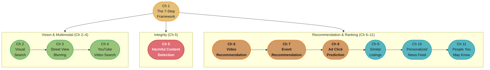
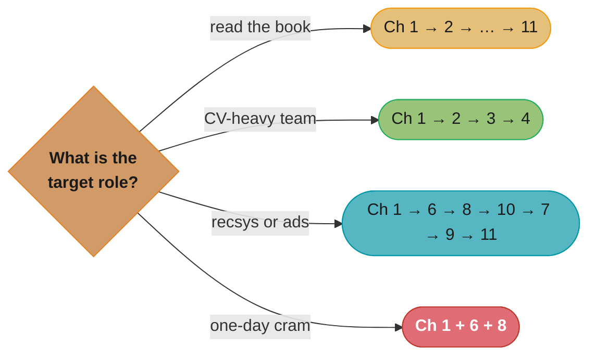

# Machine Learning System Design Interview (MLSDI)

> Ali Aminian & Alex Xu · ByteByteGo · Ten worked ML system designs plus the framework
> chapter — read this folder in order and you have read the book.

---

## The Book's Thesis

Every ML system design interview is the same seven-step conversation: clarify
requirements → frame the business goal as an ML task → prepare the data → engineer the
features → develop the model → evaluate it offline and online → serve and monitor it.
Chapter 1 defines that framework; the ten systems that follow are ten instantiations of
it, each teaching one reusable modeling idea. Three themes recur across every chapter:

- **Frame before you model.** Translating "increase engagement" into a learnable,
  measurable objective (and choosing what the model's input/output actually is) decides
  more than the architecture does.
- **Two-stage retrieval + ranking is the universal serving shape.** Candidate generation
  cheap and wide, ranking expensive and narrow, re-ranking for business logic — it
  appears in search, recommendations, ads, and feeds alike.
- **Offline metrics get you to launch; online metrics decide the launch.** Every chapter
  pairs its offline metric choice (MRR vs mAP vs nDCG vs calibration) with the online
  experiment that actually judges the system.

---

## The Book Map

*Gold = the framework every chapter reuses; green = the vision arc (embedding search →
object detection → multimodal retrieval); red = integrity (multimodal fusion +
multi-task); orange/teal = the recommendation ramp (two-tower → learning-to-rank →
CTR feature crossing → session embeddings → multi-task feed → GNN link prediction).*

---

## Chapter Index

| # | Chapter | Folder | One-line summary | Repo deep-dive |
|---|---------|--------|------------------|----------------|
| 1 | Introduction and Overview | [01_introduction_and_overview/](01_introduction_and_overview/README.md) | The 7-step ML system design framework; metric tables; deployment/monitoring basics | [ml/ml_system_design/](../../ml/ml_system_design/README.md) |
| 2 | Visual Search System | [02_visual_search_system/](02_visual_search_system/README.md) | Representation learning, contrastive training, ANN search (trees/LSH/IVF) | [ml/self_supervised_and_contrastive_learning/](../../ml/self_supervised_and_contrastive_learning/README.md) |
| 3 | Google Street View Blurring System | [03_google_street_view_blurring_system/](03_google_street_view_blurring_system/README.md) | Two-stage object detection, IoU/AP/mAP, NMS, batch serving | [ml/computer_vision/](../../ml/computer_vision/README.md) |
| 4 | YouTube Video Search | [04_youtube_video_search/](04_youtube_video_search/README.md) | Video–text multimodal retrieval (CLIP-style) fused with inverted-index text search | [ml/case_studies/design_search_ranking.md](../../ml/case_studies/design_search_ranking.md) |
| 5 | Harmful Content Detection | [05_harmful_content_detection/](05_harmful_content_detection/README.md) | Early vs late multimodal fusion; multi-task heads; prevalence/proactive-rate metrics | [ml/case_studies/design_harmful_content_detection.md](../../ml/case_studies/design_harmful_content_detection.md) |
| 6 | Video Recommendation System | [06_video_recommendation_system/](06_video_recommendation_system/README.md) | Matrix factorization vs two-tower candidate generation + ranking; cold start | [ml/case_studies/design_video_recommendation.md](../../ml/case_studies/design_video_recommendation.md) |
| 7 | Event Recommendation System | [07_event_recommendation_system/](07_event_recommendation_system/README.md) | Learning-to-rank taxonomy; the heaviest feature-engineering chapter; ephemeral items | [ml/case_studies/design_recommendation_engine.md](../../ml/case_studies/design_recommendation_engine.md) |
| 8 | Ad Click Prediction on Social Platforms | [08_ad_click_prediction_on_social_platforms/](08_ad_click_prediction_on_social_platforms/README.md) | CTR lineage (LR → GBDT+LR → DCN/DeepFM), calibration, continual learning | [ml/case_studies/design_ads_click_prediction.md](../../ml/case_studies/design_ads_click_prediction.md) |
| 9 | Similar Listings on Vacation Rental Platforms | [09_similar_listings_on_vacation_rental_platforms/](09_similar_listings_on_vacation_rental_platforms/README.md) | Airbnb-style session-based skip-gram listing embeddings; cold start by composition | [ml/case_studies/design_real_time_personalization.md](../../ml/case_studies/design_real_time_personalization.md) |
| 10 | Personalized News Feed | [10_personalized_news_feed/](10_personalized_news_feed/README.md) | Multi-task engagement ranking; weighted engagement score; dwell/skip heads | [ml/case_studies/design_content_feed_ranking.md](../../ml/case_studies/design_content_feed_ranking.md) |
| 11 | People You May Know | [11_people_you_may_know/](11_people_you_may_know/README.md) | Link prediction on the social graph with GNNs; friends-of-friends candidate scoping | [ml/graph_neural_networks/](../../ml/graph_neural_networks/README.md) |

---

## How to Read This (Reading Paths)

- **Cover to cover (recommended):** Ch 1 first — every later chapter assumes the
  framework — then Ch 2–11 as a difficulty ramp.
- **Vision/CV track:** Ch 1 → 2 → 3 → 4 (embedding search → detection → multimodal).
- **Recsys/ranking track (the interview-frequency king):** Ch 1 → 6 → 8 → 10 → 7 → 9 → 11.
- **Integrity / trust-and-safety track:** Ch 1 → 5 → 8 → 10.
- **One-day cram:** Ch 1 + Ch 6 + Ch 8 — the framework, the two-stage recsys, and CTR
  prediction cover the three most-asked ML design questions.

*Four entry points — the recsys track (teal) mirrors the frequency with which these
questions are actually asked; the cram path (red) is the minimum viable interview kit.*

---

## Build Manifest

Per-file build status for this book. Update the row to `done` the moment a chapter file is
completed and diagram-linted.

| # | File | Status |
|---|------|--------|
| 1 | `01_introduction_and_overview/README.md` | done |
| 2 | `02_visual_search_system/README.md` | done |
| 3 | `03_google_street_view_blurring_system/README.md` | done |
| 4 | `04_youtube_video_search/README.md` | done |
| 5 | `05_harmful_content_detection/README.md` | done |
| 6 | `06_video_recommendation_system/README.md` | done |
| 7 | `07_event_recommendation_system/README.md` | done |
| 8 | `08_ad_click_prediction_on_social_platforms/README.md` | done |
| 9 | `09_similar_listings_on_vacation_rental_platforms/README.md` | done |
| 10 | `10_personalized_news_feed/README.md` | done |
| 11 | `11_people_you_may_know/README.md` | done |

---

## Cross-Reference Map (MLSDI → repo deep dives)

| MLSDI concept | Primary deep-dive module |
|---------------|--------------------------|
| Representation / contrastive learning | [ml/self_supervised_and_contrastive_learning/](../../ml/self_supervised_and_contrastive_learning/README.md) |
| ANN / vector search | [ml/information_retrieval_and_search/](../../ml/information_retrieval_and_search/README.md) |
| Object detection | [ml/computer_vision/](../../ml/computer_vision/README.md) |
| Retrieval + ranking recsys | [ml/recommender_systems/](../../ml/recommender_systems/README.md) |
| Multi-task learning | [ml/multi_task_and_multi_objective_learning/](../../ml/multi_task_and_multi_objective_learning/README.md) |
| Feature engineering & stores | [ml/feature_engineering/](../../ml/feature_engineering/README.md) |
| Offline/online evaluation & A/B | [ml/model_evaluation_and_selection/](../../ml/model_evaluation_and_selection/README.md) |
| Graph neural networks | [ml/graph_neural_networks/](../../ml/graph_neural_networks/README.md) |
| Class imbalance & leakage | [ml/imbalanced_data_and_leakage_traps/](../../ml/imbalanced_data_and_leakage_traps/README.md) |
| The production-lifecycle companion book | [book/designing_machine_learning_systems/](../designing_machine_learning_systems/README.md) |
| The repo's own production-depth case studies | [ml/case_studies/](../../ml/case_studies/README.md) |
