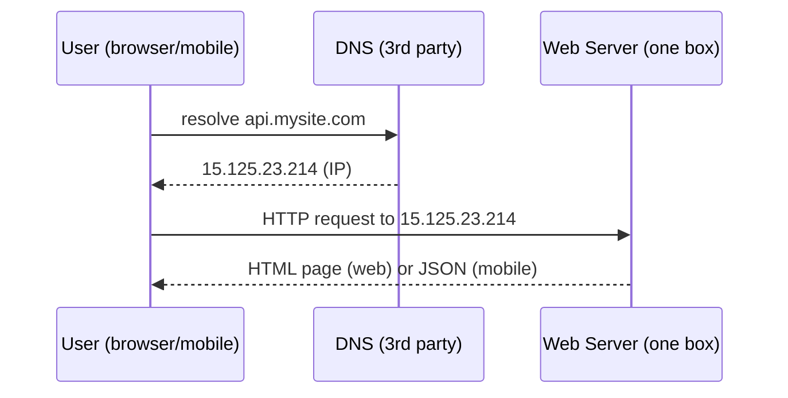
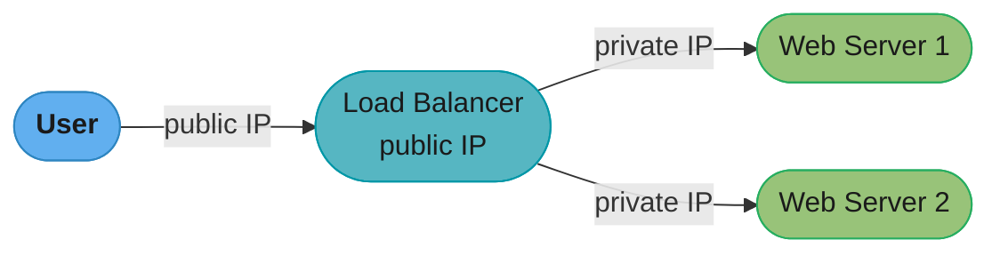
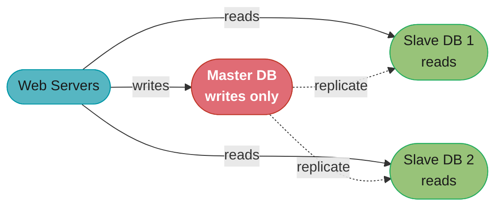
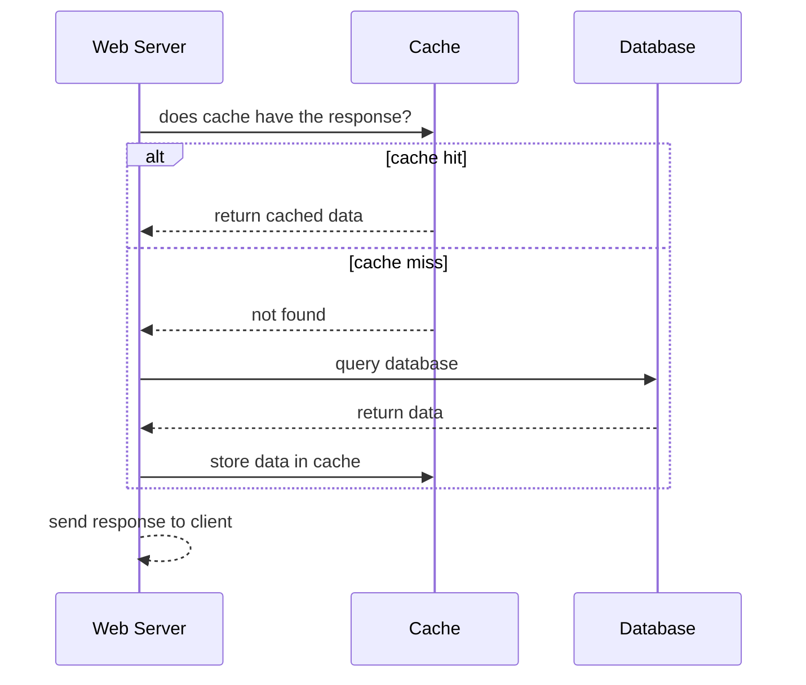
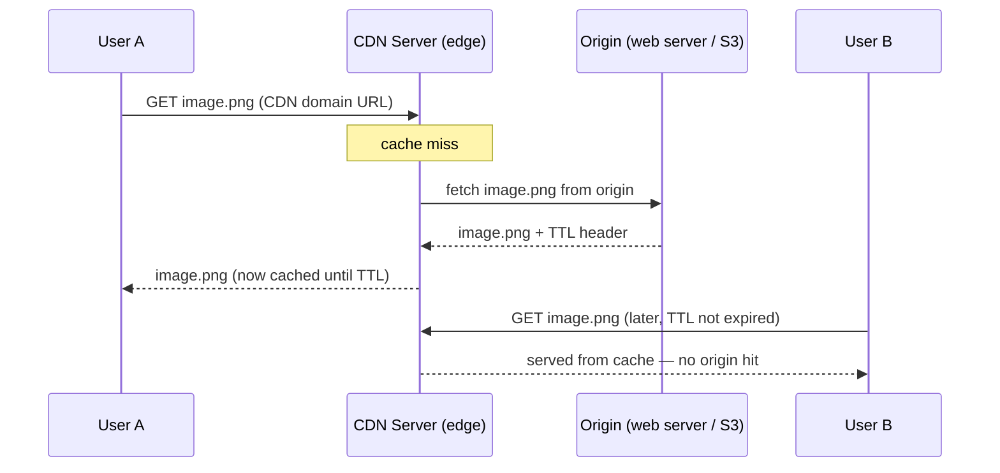
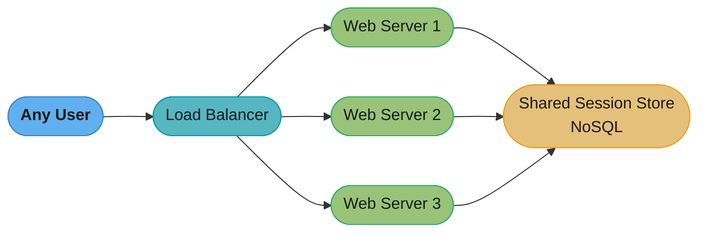
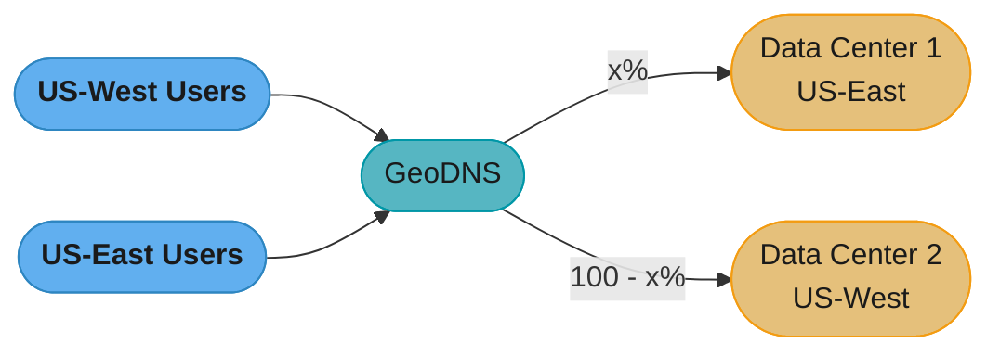
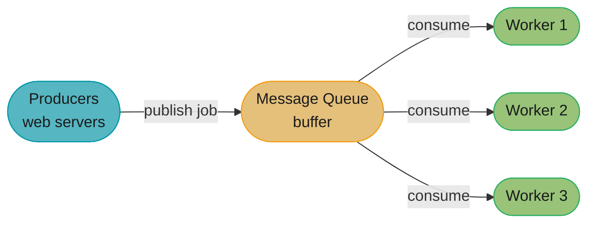
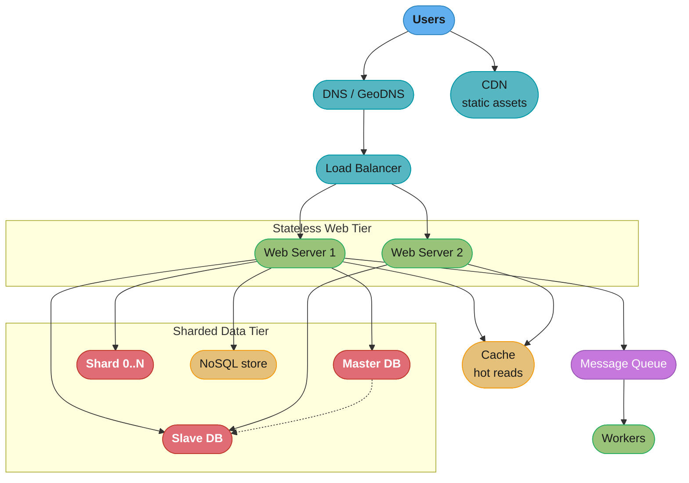
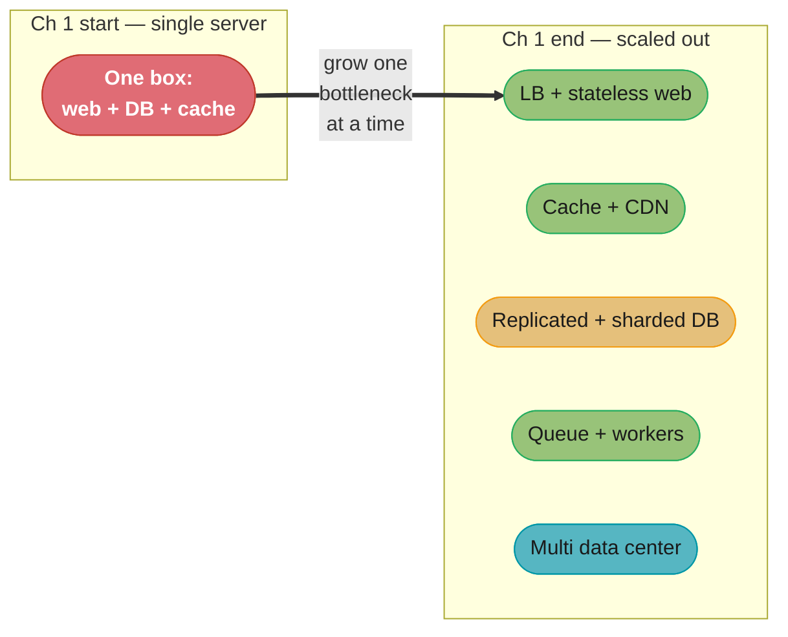

# Chapter 1: Scale From Zero To Millions Of Users

> Ch 1 of 16 · System Design Interview Vol 1 (Xu) · the scaling toolbox every later chapter assumes, leads to Ch 2 (estimation) and Ch 3 (framework)

## Chapter Map

Designing a system that supports millions of users is a journey, not a single leap. This chapter
takes one application from a **single server** that runs everything, and grows it — one bottleneck
at a time — into a redundant, multi-data-center, sharded architecture that can serve millions.
Each step is prompted by a concrete limit hit at the previous step, and each introduces exactly one
primitive: separate data tier, load balancer, replication, cache, CDN, stateless web tier, multiple
data centers, message queue, observability, and finally database sharding. It is the vocabulary the
rest of the book (and every later design chapter) quietly assumes you already own.

**TL;DR:**
- **Scale out, not up.** Vertical scaling (a bigger box) is simple but has a hard ceiling and no
  failover; horizontal scaling (more boxes behind a load balancer) is what actually reaches millions.
- **Make the web tier stateless.** Push session/state into a shared store so any server can handle
  any request — that is the single prerequisite that unlocks load balancing, autoscaling, and
  multi-data-center.
- **Push reads outward and writes down a queue.** Replicas absorb read load, a cache absorbs hot
  reads, a CDN absorbs static assets at the edge, and a message queue decouples slow work — then
  **shard** the write database only when a single primary can no longer hold the data.

## The Big Question

> "I have one server running my whole app. Users are arriving faster than a single box can serve
> them. At every point, what is the *one* bottleneck I'm hitting, and what is the *smallest* change
> that removes it without breaking everything else?"

The mental model: an application is a stack of tiers (client → DNS → web → data), and scaling is
the discipline of **finding the tier that is saturated, splitting it out so it can grow on its own,
and adding redundancy so no single failure takes the whole thing down.** The book never adds a
component for its own sake — every figure in the chapter is the fix for a specific pain the previous
figure caused.

---

## 1.1 Single Server Setup

Everything starts on one server: the web app, the database, the cache — all of it runs on a single
machine. To understand the setup, follow one request end to end.

### The request flow



Caption: DNS is a paid third-party service (not hosted on your server) that maps the domain name to
an IP; the browser then talks HTTP directly to that IP and the same one box returns HTML for web
clients or JSON for mobile clients.

Step by step:

1. Users access the website through a **domain name** (e.g., `api.mysite.com`). **DNS** is usually
   a paid service provided by a third party and is **not hosted by your own server**.
2. The **IP address** (e.g., `15.125.23.214`) is returned to the browser or mobile app.
3. Once the IP is obtained, **HTTP requests** are sent directly to your web server.
4. The web server returns **HTML pages** or a **JSON response** used for rendering.

### Traffic sources — web vs mobile

The web server receives traffic from two kinds of clients, and the response format differs:

- **Web application** — it uses a combination of **server-side languages** (Java, Python, ...) to
  handle business logic and storage, and **client-side languages** (HTML and JavaScript) for
  presentation.
- **Mobile application** — the **HTTP protocol** is the communication protocol between the mobile app
  and the web server. **JSON** (JavaScript Object Notation) is the common API response format because
  of its simplicity. An example API response:

```json
{
  "id": 12,
  "firstName": "John",
  "lastName": "Smith",
  "address": { "streetAddress": "21 2nd Street", "city": "New York" }
}
```

At this stage there is exactly one point of failure and one thing to scale — the single box. Every
following section splits one responsibility off it.

---

## 1.2 Database

As the user base grows, one server is not enough: you need **separate servers** — one (the *web/mobile
tier*) for web/mobile traffic, and one (the *data tier*) for the database. Separating them lets the
two tiers be **scaled independently** — you can add web servers without touching the database and
vice versa.

### Which database to use — relational vs non-relational

You can pick a traditional relational database or a non-relational (NoSQL) one.

- **Relational databases (RDBMS / SQL databases)** — the most common choice; they have been around
  for over 40 years and historically work well. Examples: **MySQL, Oracle database, PostgreSQL.**
  They represent and store data in **tables and rows**, and you can perform **join** operations across
  different tables using SQL.
- **Non-relational databases (NoSQL databases)** — examples: **CouchDB, Neo4j, Cassandra, HBase,
  Amazon DynamoDB.** They are grouped into **four categories**: **key-value stores, graph stores,
  column stores, and document stores.** Join operations are generally **not supported** in
  non-relational databases.

### When NoSQL is the right choice

For most developers relational databases are the best option because they have stood the test of
time. But NoSQL might be the right fit if your application needs any of these:

- It requires **super-low latency**.
- Your data is **unstructured**, or you do not have any relational data.
- You only need to **serialize and deserialize** data (JSON, XML, YAML, etc.).
- You need to store a **massive amount of data**.

The default remains relational; reach for NoSQL only when one of the criteria above genuinely holds.

---

## 1.3 Vertical Scaling vs Horizontal Scaling

Once you accept you need "more capacity," there are two directions to grow.

- **Vertical scaling (scale up)** — add more **power (CPU, RAM, ...)** to a single server. It is a
  **great option when traffic is low** because of its **simplicity**.
- **Horizontal scaling (scale out)** — add **more servers** to your pool of resources. It is more
  desirable for **large-scale applications**.

### The limits of scaling up — why vertical alone fails

Vertical scaling has serious limitations:

- **Hard ceiling.** Vertical scaling has a hard limit: it is **impossible to add unlimited CPU and
  memory** to a single server.
- **No failover / no redundancy.** Vertical scaling does not have **failover and redundancy** — if
  one server goes down, the website or app **goes down with it completely.**

Because of these limitations, **horizontal scaling is more desirable for large-scale applications.**
But horizontal scaling raises an immediate question: users currently connect directly to a web
server, so if that server is offline, or if too many users connect to it at the same time
simultaneously, users experience slower response or fail to connect. A **load balancer** is the best
technique to address these problems.

---

## 1.4 Load Balancer

A **load balancer** evenly distributes incoming traffic among the web servers that are defined in a
**load-balanced set.**



Caption: clients only ever reach the load balancer's **public IP**; the LB then fans requests out to
web servers over **private IPs**, so no web server is directly reachable from the internet.

### How the addressing works — public vs private IPs

- Users connect to the **public IP** of the load balancer directly.
- After adding a load balancer, web servers are **no longer reachable directly** by clients.
- For **better security**, **private IPs** are used for communication between servers. A **private
  IP** is an address reachable only between servers **in the same network**; it is unreachable over
  the internet. The load balancer communicates with the web servers through these private IPs.

### Failover behavior and adding capacity

With a load balancer plus a second web server, two problems are solved at once:

- **No more failover problem.** If **server 1 goes offline**, all the traffic is routed to
  **server 2**, which prevents the website from going offline. A fresh, healthy web server can be
  added to the pool to balance the load.
- **Traffic spikes are absorbed by adding servers.** As the website's traffic grows rapidly and two
  servers are not enough to handle the traffic, the load balancer handles this gracefully: you only
  need to **add more servers to the web server pool**, and the load balancer automatically starts to
  send requests to them.

The web tier now looks healthy. But there is still **only one database — no failover, no
redundancy** for the data tier. **Database replication** is a common technique to address these
problems.

---

## 1.5 Database Replication

Database replication is usually described with a **master/slave** relationship between the original
(master) and the copies (slaves).

- A **master** database generally only supports **write** operations (insert, delete, update).
- A **slave** database gets copies of the data from the master and only supports **read** operations.
- Most applications require a **much higher ratio of reads to writes**; thus, the number of **slave
  databases in a system is usually larger than the number of master databases.**



Caption: all writes go to the single master, which asynchronously replicates to the read-only slaves;
because real workloads are read-heavy, you provision many more slaves than masters and let them
absorb the read traffic.

### Advantages of replication

- **Better performance.** In the master-slave model, all writes and updates happen in master nodes,
  whereas read operations are distributed across slave nodes. This model improves performance because
  it allows **more queries to be processed in parallel.**
- **Reliability.** If one of your database servers is destroyed in a **natural disaster**, data is
  still preserved because it is **replicated across multiple locations.**
- **High availability.** By replicating data across different locations, your website remains in
  operation even if a database is **offline** — you can access data stored in another database server.

**What the formula is telling you.** "If reads outnumber writes `k` to one and you spread them over
`R` slaves, each slave carries `k / R` units of work for every one unit the master carries."

That single ratio is why the book says the slave count is "usually larger than the number of master
databases" — the slave fleet is sized by the *read* side of the ratio, and the master only ever sees
the `1`. The chapter states the ratio qualitatively; the arithmetic below makes the sizing rule
explicit.

| Symbol | What it is |
|--------|------------|
| `k` | Reads per write — the read:write ratio the chapter calls "much higher" |
| `R` | Number of slave (replica) databases in the pool |
| `k / R` | Read units each slave absorbs per one write unit hitting the master |
| `(k/R) / (k+1)` | Each slave's share of *total* database traffic (reads + writes) |
| `k + 1` | Total query units per write, i.e. the whole workload in one unit |

**Walk one example.** A 9:1 read:write workload against the chapter's figure (1 master, 2 slaves):

```
  k = 9 reads per 1 write        R = 2 slaves (the figure's Slave DB 1 and 2)

  total query units       :  k + 1        = 9 + 1  = 10 units
  master takes            :  1 unit       =  1 / 10 = 10.0% of all traffic
  slaves take together    :  9 units      =  9 / 10 = 90.0% of all traffic
  per slave               :  k / R        = 9 / 2  = 4.5 read units
  per slave, as a share   :  4.5 / 10     = 45.0% of all traffic

  Add a 3rd slave: k / R = 9 / 3 = 3.0 read units  -> 3.0 / 10 = 30.0% each.

  Meaning: adding replicas divides ONLY the 90% read half. The 10% write half is
  stuck on one master forever -- which is exactly why sharding (1.12) exists.
```

Notice what the term `R` cannot do: it never appears on the write side. Replication is a read-scaling
tool only. Drop `R` to zero (no slaves) and the whole `k + 1` lands on the master; raise `R` to a
hundred and the master still absorbs its full `1`. When writes are the bottleneck, more slaves buy
nothing — that is the wall Section 1.12 walks into.

### Failure scenarios — what happens when a database goes down

**If a slave goes offline:**

- If **only one slave** is available and it goes offline, read operations are directed to the
  **master** temporarily. As soon as the problem is found, a **new slave** database replaces the old
  one.
- If **multiple slaves** are available, read operations are redirected to the other **healthy slave**
  databases, and a new database server replaces the old one.

**If the master goes offline:**

- A **slave database is promoted to be the new master.** All database operations are temporarily
  executed on the new master, and a new slave database replaces the old one for data replication
  immediately.
- **The complication (production reality):** promoting a slave is **not trivial.** The data in a
  slave might not be up to date because the master could have failed before the latest writes
  finished replicating. The **missing data needs to be updated by running data recovery scripts.**
  Other replication methods (such as **multi-masters** and **circular replication**) exist and can
  help, but they are more complicated and are out of scope here.

The system now serves reads faster and survives a database failure. The next lever is **response
time** — which a cache and a CDN improve.

---

## 1.6 Cache

A **cache** is a temporary storage area that stores the result of expensive responses or
frequently accessed data in **memory**, so that subsequent requests are served **more quickly.**
The problem it solves: every time a web page loads, one or more database calls are made to fetch
data, and repeatedly calling the database hurts application performance. The cache mitigates this.

### The cache tier

The **cache tier** is a temporary data store layer, **much faster than the database.** Its benefits:

- **Better system performance.**
- **Ability to reduce database workloads.**
- **The ability to scale the cache tier independently.**

### Read-through cache — the flow

The book uses a **read-through cache** strategy:



Caption: on a request the web server first checks the cache; a hit returns immediately, a miss falls
through to the database and then **writes the result back into the cache** so the next identical
request is a hit.

In words: after receiving a request, a web server first checks if the cache has the available
response. If it does, it sends the data back to the client. If not, it queries the database, stores
the response in the cache, and sends it back to the client.

Interacting with cache servers is simple because most provide APIs for common programming
languages. The following snippet shows typical Memcached APIs:

```
SECONDS = 1
cache.set('myKey', 'hi there', 3600 * SECONDS)
cache.get('myKey')
```

**In plain terms.** "The database no longer sees your read traffic — it sees only the fraction the
cache *missed*, so database load is `(1 - h) x reads`, not `reads`."

The chapter states the benefit qualitatively ("ability to reduce database workloads"); the one-line
formula behind it is worth making explicit because the payoff is **non-linear**. What you care about
is not the hit ratio `h` but the miss ratio `1 - h`, and the miss ratio is what shrinks by factors,
not by percentage points.

| Symbol | What it is |
|--------|------------|
| `h` | Cache hit ratio — fraction of reads answered from memory without touching the DB |
| `1 - h` | Miss ratio — the only fraction of reads that reaches the database |
| `reads` | Total read requests arriving at the web tier per second |
| `(1 - h) x reads` | Read queries the database actually has to serve per second |
| `1 / (1 - h)` | Load-reduction factor — how many times lighter the DB got |

**Walk one example.** 100,000 reads/second arriving at the web tier, at four hit ratios:

```
  h = 0%    ->  (1 - 0.00) x 100,000 = 100,000 DB reads/s   factor 1 / 1.00 =  1x
  h = 50%   ->  (1 - 0.50) x 100,000 =  50,000 DB reads/s   factor 1 / 0.50 =  2x
  h = 90%   ->  (1 - 0.90) x 100,000 =  10,000 DB reads/s   factor 1 / 0.10 = 10x
  h = 99%   ->  (1 - 0.99) x 100,000 =   1,000 DB reads/s   factor 1 / 0.01 = 100x

  The trap: 90% -> 99% is "9 percentage points" but the DB load ratio is
      (1 - 0.90) / (1 - 0.99) = 0.10 / 0.01 = 10.0
  i.e. a 10x cut in database work, not a 10% one. Going 50% -> 90% is only 5x
      (1 - 0.50) / (1 - 0.90) = 0.50 / 0.10 = 5.0

  Meaning: every "nine" you add to the hit ratio removes an ORDER OF MAGNITUDE
  of database load. The last few percent of hit ratio are worth more than the
  first ninety.
```

This is also why the chapter's expiration advice cuts both ways. A TTL that is too short does not
just "reload data more frequently" — it drives `h` down, and because the database sees `1 - h`,
dropping the hit ratio from 99% to 90% multiplies the database's read load by 10x. Read the tuning
advice in the next list as *hit-ratio* management, not staleness management alone.

### Considerations for using a cache

1. **Decide when to use cache.** Consider using a cache when data is **read frequently but modified
   infrequently.** Because cached data is stored in **volatile memory**, a cache server is **not ideal
   for persisting data** — if it restarts, all the data in memory is lost. Thus, important data should
   be saved in **persistent data stores.**
2. **Expiration policy.** It is a good practice to implement an expiration policy. Once cached data
   expires, it is removed from the cache. When there is no expiration policy, cached data is stored in
   memory permanently. It is advisable **not to make the expiration date too short**, as this causes
   the system to reload data from the database too frequently. Meanwhile, it is advisable **not to
   make the expiration date too long**, as the data can become stale.
3. **Consistency.** This involves keeping the data store and the cache in sync. Inconsistency can
   happen because **data-modifying operations on the data store and cache are not in a single
   transaction.** When scaling across multiple regions, maintaining consistency between the data store
   and cache is challenging (referenced: "Scaling Memcache at Facebook").
4. **Mitigating failures.** A **single cache server** represents a potential **single point of failure
   (SPOF)** — if it goes down it can cause a catastrophic outage. As a result, **multiple cache servers
   across different data centers** are recommended to avoid the SPOF. Another recommended approach is to
   **overprovision the required memory by certain percentages**, providing a buffer as memory usage
   increases.
5. **Eviction policies.** Once the cache is full, any request to add items to the cache might cause
   existing items to be removed — this is called **cache eviction.** **Least Recently Used (LRU)** is
   the most popular cache eviction policy. Other eviction policies, such as **Least Frequently Used
   (LFU)** or **First In First Out (FIFO)**, can be adopted to satisfy different use cases.

---

## 1.7 Content Delivery Network (CDN)

A **CDN** is a network of **geographically dispersed servers** used to deliver **static content**.
CDN servers cache static content like **images, videos, CSS, JavaScript files, etc.**

The mechanic that matters: when a user visits a website, a CDN server **closest to the user** will
deliver static content. Intuitively, the **farther** users are from CDN servers, the **slower** the
website loads.

### The static-asset flow — how a CDN works



Caption: the first request misses and pulls from origin with a **TTL** header; every later request
for the same asset — like User B's — is served straight from the edge cache until the TTL expires,
which is exactly where the latency win comes from.

Step by step:

1. **User A** tries to get `image.png` using an image URL. The URL's **domain is provided by the CDN
   provider** — for example `https://mysite.cloudfront.net/logo.jpg` (Amazon CloudFront) or
   `https://mysite.akamai.com/image-manager/img/logo.jpg` (Akamai).
2. If the CDN server does **not** have `image.png` in the cache, it requests the file from the
   **origin** (a web server or online storage like Amazon S3).
3. The origin returns `image.png` to the CDN server, which includes an optional HTTP header
   **Time-to-Live (TTL)** that describes how long the image is cached.
4. The CDN caches the image and returns it to User A. The image remains cached until the TTL expires.
5. **User B** sends a request to get the same image. As long as the TTL has not expired, the image is
   served from the cache — no origin hit.

### CDN considerations

1. **Cost.** CDNs are run by third-party providers, and you are **charged for data transfers in and
   out** of the CDN. **Caching infrequently used assets** provides no significant benefits, so you
   should consider **moving them out of the CDN.**
2. **Setting an appropriate cache expiry.** For time-sensitive content, setting a cache expiry time is
   important: it should be **neither too long nor too short.** If it is too long, the content might no
   longer be **fresh**; if it is too short, it can cause **repeat reloading** of content from origin
   servers to the CDN.
3. **CDN fallback.** You should consider how your website or application copes with **CDN failure.** If
   there is a temporary CDN outage, clients should be able to **detect the problem and request
   resources from the origin.**
4. **Invalidating files.** You can remove a file from the CDN before it expires by either: (a)
   **invalidating the CDN object** using APIs provided by CDN vendors, or (b) using **object
   versioning** to serve a different version of the object — add a parameter such as a version number
   to the URL (e.g., `image.png?v=2`).

With static assets served from the edge (CDN) and hot dynamic data served from cache, the web servers
are lighter. Now the design must let the web tier itself **scale out cleanly** — which requires
removing state from it.

---

## 1.8 Stateless Web Tier

To scale the web tier **horizontally**, you must move **state (for instance, user session data)
out of the web tier.** A good practice is to store session data in a **persistent data store** such as
a relational database or NoSQL. Each web server in the cluster can then access state data from the
shared store. This is called a **stateless web tier.**

### Stateful vs stateless — the sticky-session problem

A **stateful server** remembers client data (state) from one request to the next. A **stateless
server** keeps no state information.

The failure mode of a stateful architecture:

- Say server A stores Alice's session data and profile image. For Alice to be authenticated, every
  one of her HTTP requests **must be routed to server A.** If a request is sent to another server
  (say server B), authentication **fails** because server B does not have Alice's session data.
- Similarly, all of Bob's traffic must be routed to server B and all of Charlie's to server C.
- The issue: **every request from the same client must be routed to the same server.** This is done
  with **sticky sessions** in most load balancers, but sticky sessions add overhead. Adding or
  removing servers becomes **much more difficult** with this approach, and it is challenging to handle
  server failures.



Caption: with session data in a **shared store**, an HTTP request can be routed to **any** web server,
which fetches the state it needs — this is what makes sticky sessions unnecessary and the tier
trivially scalable.

### The stateless design and autoscaling

In the stateless architecture, HTTP requests from users **can be sent to any web server**, which
fetches state data from a **shared data store.** State data is stored in the shared data store and
kept **out of web servers.** A stateless system is **simpler, more robust, and scalable.**

The shared store can be a relational database, Memcached/Redis, or NoSQL. **NoSQL** is chosen in the
book's design because it is **easy to scale.**

Once state is removed from web servers, **autoscaling** becomes straightforward: automatically
adding or removing web servers based on the traffic load is easy because any server is
interchangeable.

---

## 1.9 Data Centers

To improve availability and provide a better user experience across wider geographical areas,
supporting **multiple data centers** is crucial.

### GeoDNS routing

In normal operation, users are **geoDNS-routed** (also known as geo-routed) to the closest data
center, with traffic split — for example **x% in US-East** and **(100 – x)% in US-West.**
**GeoDNS** is a DNS service that allows domain names to be resolved to IP addresses **based on the
location of a user.**



Caption: GeoDNS resolves each user to the nearest data center; on an outage the same DNS layer simply
stops handing out the dead data center's addresses and sends **all** traffic to a healthy one.

### Failover

In the event of any significant data center **outage**, all traffic is directed to a **healthy data
center.** The dead data center is taken out of rotation and the remaining one absorbs 100% of the load.

**Read it like this.** "In steady state a data center serves its geoDNS slice; on the day its twin
dies it must serve *everything*, so its surge factor is `100 / x` — and you have to have bought that
capacity in advance."

The chapter writes the split as `x%` and `(100 - x)%` without pinning `x`, and that is the point:
the failover sentence above ("all traffic is directed to a healthy data center") is a **capacity
requirement**, not just a routing rule. The steady-state split tells you nothing about how big to
build each site.

| Symbol | What it is |
|--------|------------|
| `x` | Percent of users geoDNS sends to data center 1 (US-East in the figure) |
| `100 - x` | Percent geoDNS sends to data center 2 (US-West) |
| `100 / x` | Surge multiplier DC1 absorbs when DC2 dies and it takes all traffic |
| `100 / (100 - x)` | Surge multiplier DC2 absorbs when DC1 dies |

**Walk one example.** An uneven split, `x = 60` (60% US-East, 40% US-West):

```
  steady state        :  DC1 = 60% of peak traffic     DC2 = 40% of peak traffic

  DC2 dies, DC1 takes 100%
      surge factor    :  100 / x       = 100 / 60  = 1.67x more than it was serving
  DC1 dies, DC2 takes 100%
      surge factor    :  100 / (100-x) = 100 / 40  = 2.50x more than it was serving

  So BOTH sites must be built for 100% of peak, never for their own slice:
      provisioned capacity :  100% + 100%  = 200% of peak
      steady-state usage   :  100 / 200    = 50.0% average utilisation

  Meaning: two-data-center failover costs you a 2x capacity bill and a permanent
  50% idle fleet. That is the real price of the availability the section promises.
```

The term that is easy to drop is the surge factor itself. Size DC2 for its own 40% slice and the
failover sentence becomes a lie: on a DC1 outage it is handed 2.5x its build, browns out, and the
"healthy data center" fails too. Geographic redundancy without the `100 / x` headroom is a plan to
fail both sites in sequence rather than one at a time.

### Technical challenges of multi-data-center

Achieving a multi-data-center setup requires solving several problems:

1. **Traffic redirection.** Effective tools are needed to direct traffic to the correct data center.
   **GeoDNS** can be used to direct traffic to the nearest data center depending on where a user is
   located.
2. **Data synchronization.** Users from different regions could use different local databases or
   caches. In failover cases, traffic might be routed to a data center where data is **unavailable.**
   A common strategy is to **replicate data across multiple data centers.** (The book references
   Netflix's approach to asynchronous multi-data-center replication.)
3. **Test and deployment.** With a multi-data-center setup, it is important to **test your website/
   application at different locations.** **Automated deployment tools** are vital to keep services
   consistent across all data centers.

The architecture is now geographically redundant. The next problem is different: some operations
(like image processing) are slow and shouldn't block a request — which a **message queue** solves.

---

## 1.10 Message Queue

A **message queue** is a **durable component, stored in memory, that supports asynchronous
communication.** It serves as a **buffer** and distributes asynchronous requests.

### Producer/consumer decoupling

The basic architecture of a message queue is simple:

- **Input services**, called **producers/publishers**, create messages and publish them to a message
  queue.
- Other services or servers, called **consumers/subscribers**, connect to the queue and perform
  actions defined by the messages.



Caption: the queue sits between producers and consumers so neither has to be online at the same
moment — and the pool of workers can be resized independently of the producers based on queue depth.

**Decoupling** is the key property: the producer can post a message to the queue when the consumer
is **unavailable to process it**, and the consumer can read messages from the queue even when the
producer is **unavailable.**

### The photo-processing example

Consider a **photo customization** feature — cropping, sharpening, blurring, and so on — which is
**time-consuming.** The design:

- **Web servers publish photo processing jobs to the message queue.**
- **Photo processing workers pick up jobs from the message queue and asynchronously perform the
  photo customization tasks.**

### Independent scaling

The producer and consumer can be **scaled independently.** When the **size of the queue becomes
large, more workers are added** to reduce the processing time. Conversely, if the **queue is empty
most of the time, the number of workers can be reduced.** This elasticity is the whole point: slow
work is absorbed by a resizable worker pool instead of blocking the request path.

---

## 1.11 Logging, Metrics, Automation

When working with a small website that runs on a few servers, logging, metrics, and automation are
good-to-have practices. But once a site grows to serve a large business, investing in these tools is
**essential.**

- **Logging.** Monitoring **error logs** is important because it helps to identify errors and
  problems in the system. You can monitor error logs **at the per-server level**, or use tools to
  **aggregate them to a centralized service** for easy search and viewing.
- **Metrics.** Collecting different types of metrics helps to gain **business insights** and to
  understand the **health status** of the system. Some of the most useful metrics:
  - **Host-level metrics** — CPU, memory, disk I/O, etc.
  - **Aggregated-level metrics** — for example, the performance of the **entire database tier** or
    the **cache tier.**
  - **Key business metrics** — daily active users, retention, revenue, etc.
- **Automation.** When a system gets big and complex, you need to build or use automation tools to
  improve productivity. **Continuous integration (CI)** is a good practice, in which each code
  check-in is verified through an **automated build**, allowing teams to detect problems early.
  Besides, **automating the build, test, and deploy process** can improve developer productivity
  significantly.

These are the observability and delivery foundations that make everything above operable at scale.

---

## 1.12 Database Scaling

There are two broad approaches to scaling the database: **vertical scaling** and **horizontal
scaling.**

### Vertical scaling of the database — and its limits

**Vertical scaling (scaling up)** means adding more power (**CPU, RAM, DISK, ...**) to an existing
machine. There are some powerful database servers — for example, **Amazon RDS** offers a database
server with **24 TB of RAM.** A powerful single database server can store and handle a lot of data;
for instance, in 2013 **Stack Overflow** had over **10 million monthly unique visitors** but had only
**1 master database.** However, vertical scaling comes with serious drawbacks:

- You can add more CPU, RAM, etc. to a database server, but there are **hardware limits.** With a
  large user base, a single server is not enough.
- **Greater risk of single point of failure.**
- The overall cost is **high.** Powerful servers are **much more expensive.**

**Put simply.** "The Stack Overflow anecdote is a *rate* argument in disguise — 10 million monthly
uniques is only a few visitors per second, which is why one master survived it."

The chapter drops "10 million monthly unique visitors on 1 master database" as evidence that a big
box goes a long way. Converting that headline number into a per-second rate is what makes it usable
as a calibration point rather than an impressive-sounding statistic.

| Symbol | What it is |
|--------|------------|
| `U` | Monthly unique visitors (the book's 10 million for Stack Overflow, 2013) |
| `30 x 86,400` | Seconds in a 30-day month (86,400 s/day, the constant used throughout the book) |
| `U / (30 x 86,400)` | Average unique visitors arriving per second |
| `p` | Page views per visitor per month — the multiplier that turns visitors into queries |

**Walk one example.** The chapter's Stack Overflow figure, converted to a rate:

```
  U = 10,000,000 monthly uniques

  seconds per month     :  30 x 86,400        = 2,592,000 s
  visitors per second   :  10,000,000 / 2,592,000  = 3.86 visitors/s
  at p = 30 page views  :  3.86 x 30              = 115.7 page views/s

  Compare against the ceiling the same section names:
      Amazon RDS max     :  24 TB of RAM in ONE box

  Meaning: ~116 page views/s is a rate a single well-tuned master genuinely
  serves. The anecdote is not "one master scales forever" -- it is "10M monthly
  uniques is a SMALL number once you divide by 2,592,000 seconds."
```

The missing term in most readings of this anecdote is the denominator. Quote the monthly figure and
one master sounds heroic; divide by 2,592,000 seconds and it is under four visitors per second, well
inside one machine. Always convert a headline user count into a per-second rate before deciding
whether a tier needs to scale out — that conversion is the whole habit Chapter 2 teaches.

### Horizontal scaling of the database — sharding

**Horizontal scaling, also known as sharding,** is the practice of adding more servers. It
**separates large databases into smaller, more easily managed parts called shards.** Each shard
**shares the same schema, though the actual data on each shard is unique to the shard.**

Example: user data is allocated to a database server based on **user IDs.** Every time you access
data, a **hash function** is used to find the corresponding shard. The book uses `user_id % 4` as
the hash function; if the result equals 0, shard 0 is used to store and fetch data; if it equals 1,
shard 1 is used; and so on.

```
        hash function:  shard_id = user_id % 4   (4 shards)

   user_id  |  user_id % 4  |  goes to
   ---------+---------------+----------
      0     |      0        |  Shard 0
      1     |      1        |  Shard 1
      2     |      2        |  Shard 2
      3     |      3        |  Shard 3
      4     |      0        |  Shard 0
      5     |      1        |  Shard 1
      ...   |     ...       |   ...
```

Caption: the sharding key `user_id` is hashed with `% 4` to pick one of four shards; every shard has
the identical schema but holds a disjoint slice of the users, so read/write load spreads across four
machines instead of one.

**What this actually says.** "Divide the user id by the shard count and throw away the quotient —
the remainder that is left over *is* the machine number, so routing costs one arithmetic operation
and zero lookups."

That is the whole appeal of `%`: no directory, no metadata service, no round trip. Any client that
knows `user_id` and `N` computes the destination locally. The price of that free routing is paid
later, in the resharding block below.

| Symbol | What it is |
|--------|------------|
| `user_id` | The sharding key — the value being hashed (the chapter's choice) |
| `N` | Number of shards (`4` in the chapter's example) |
| `%` | Modulo — the remainder after integer division; always lands in `0 .. N-1` |
| `shard_id` | Which of the `N` machines stores and serves that user's row |
| `total / N` | Data each shard holds when the key distributes evenly |

**Walk one example.** The chapter's `user_id % 4`, plus the capacity that follows from it:

```
  N = 4 shards

  user_id 1001  ->  1001 % 4 = 1   -> Shard 1
  user_id   42  ->    42 % 4 = 2   -> Shard 2
  user_id    7  ->     7 % 4 = 3   -> Shard 3
  user_id    4  ->     4 % 4 = 0   -> Shard 0   (wraps back to the start)

  Capacity, for an 800 GB user table:
      one box        :  800 / 1  = 800 GB   <- the single-master case
      4 shards       :  800 / 4  = 200 GB per shard
      8 shards       :  800 / 8  = 100 GB per shard

  Meaning: N divides BOTH the data volume and the query load, which is the one
  thing replication (above) could not do for writes.
```

### The sharding key (partition key)

The **most important factor to consider** when implementing a sharding strategy is the choice of the
**sharding key (also called the partition key).** A sharding key consists of **one or more columns
that determine how data is distributed** — in the example above it is `user_id`. A sharding key
allows you to retrieve and modify data efficiently by routing database queries to the correct shard.
When choosing a sharding key, one of the most important criteria is to choose a key that can **evenly
distribute data.**

### The challenges sharding introduces

Sharding is a great technique for scaling the database, but it is far from a perfect solution. It
introduces complexities and new challenges:

1. **Resharding data.** Resharding data is needed when: (a) **a single shard could no longer hold
   more data** due to rapid growth, or (b) **certain shards might experience shard exhaustion faster
   than others** due to uneven data distribution. When shard exhaustion happens, it requires
   **updating the sharding function and moving data around.** **Consistent hashing** is a commonly
   used technique to solve this problem. (Consistent hashing is the entire subject of Ch 5.)
2. **Celebrity problem (also called the hotspot key problem).** **Excessive access to a specific
   shard could cause server overload.** Imagine data for celebrities — Katy Perry, Justin Bieber,
   Lady Gaga — all end up on the **same shard.** For social applications, that shard is overwhelmed
   with read operations. To solve this, you **may need to allocate a shard for each celebrity**, and
   each shard might even require **further partition.**
3. **Join and de-normalization.** Once a database has been sharded across multiple servers, it is
   **hard to perform join operations across database shards.** A common workaround is to
   **de-normalize** the database so that queries can be performed in a **single table.** (In the
   book's evolving figure, some non-relational functionality is moved to a **NoSQL data store** to
   reduce the load on the relational database as well.)

**The idea behind it.** "Adding one shard to a modulo scheme does not move one shard's worth of data
— it changes the answer for almost every key at once, so nearly the whole dataset relocates."

This is the number that justifies the chapter's pointer to **consistent hashing**. "Updating the
sharding function and moving data around" sounds like a proportional chore; it is not, and the gap
between what you *should* have to move and what modulo *makes* you move is the entire motivation for
Chapter 5.

| Symbol | What it is |
|--------|------------|
| `N` | Shard count before resharding (`4` in the chapter) |
| `N + 1` | Shard count after adding one machine (`5`) |
| `user_id % N != user_id % (N+1)` | Test for "this key must physically move to a different box" |
| `1 / (N+1)` | The *ideal* fraction to move — just enough to fill the new shard |

**Walk one example.** Resharding the chapter's 4-shard layout to 5, measured over 100,000 user ids:

```
  before :  shard_id = user_id % 4      after :  shard_id = user_id % 5

  user_id 4   ->  4 % 4 = 0  becomes  4 % 5 = 4   MOVES
  user_id 6   ->  6 % 4 = 2  becomes  6 % 5 = 1   MOVES
  user_id 20  -> 20 % 4 = 0  becomes 20 % 5 = 0   stays

  keys where the two disagree, over ids 0..99,999 :  80,000 / 100,000 = 80.0%

  ideal movement (just enough to populate the new shard) :  1 / 5 = 20.0%
  modulo's actual movement                               :          80.0%
  waste factor                                           :  80 / 20 = 4x

  Meaning: 4x more data crosses the network than the job requires, and every
  moved key is a cache miss and a stale read while it is in flight. On the
  800 GB table above that is 640 GB moved instead of 160 GB.
```

Consistent hashing exists precisely to delete that `4x`. It replaces "recompute every key against a
new `N`" with "only the keys in the new node's arc move," pulling the moved fraction back down
toward the ideal `1 / (N+1)`. The celebrity problem in the next bullet is the *other* failure of a
plain remainder: `%` distributes ids evenly, but it knows nothing about how much traffic each id
attracts, so an even split of keys can still be a wildly uneven split of load.

---

## 1.13 Millions of Users and Beyond

Scaling a system is an **iterative process.** Iterating on what this chapter covered gets you far, but
more fine-tuning and new strategies are needed to scale beyond millions of users. The chapter closes
with the recap checklist — the full toolbox in one list:

- **Keep web tier stateless.**
- **Build redundancy at every tier.**
- **Cache data as much as you can.**
- **Support multiple data centers.**
- **Host static assets in CDN.**
- **Scale your data tier by sharding.**
- **Split tiers into individual services.**
- **Monitor your system and use automation tools.**

Every item on this list is a section you just walked through — it is the compressed summary of the
whole scaling journey.

---

## Visual Intuition

### The final architecture — everything assembled



Caption: this is where the chapter ends up — a stateless web tier behind a load balancer, static
assets at the CDN edge, hot reads in the cache, slow work fanned out through the message queue, and a
replicated, sharded data tier — the reference architecture every later chapter assumes.

### Early vs final — what one server became



Caption: the entire chapter is the arrow in the middle — the single box (one point of failure) is
decomposed, one saturated tier at a time, into the redundant scaled-out architecture on the right.

---

## Key Concepts Glossary

- **DNS (Domain Name System)** — third-party service that resolves a domain name to an IP address.
- **GeoDNS** — DNS that resolves a domain to an IP based on the user's geographic location.
- **Web/mobile tier** — the servers that handle HTTP requests and return HTML (web) or JSON (mobile).
- **Data tier** — the database servers, separated from the web tier so each scales independently.
- **Relational database (RDBMS / SQL)** — stores data in tables/rows and supports joins (MySQL,
  PostgreSQL, Oracle).
- **NoSQL (non-relational) database** — key-value, graph, column, or document store; generally no
  joins (Cassandra, DynamoDB, CouchDB, Neo4j, HBase).
- **Vertical scaling (scale up)** — add more CPU/RAM to one server; simple, but has a hard ceiling and
  no failover.
- **Horizontal scaling (scale out)** — add more servers; the path to large scale.
- **Load balancer** — distributes incoming traffic across servers in a load-balanced set.
- **Public IP** — internet-reachable address (of the load balancer).
- **Private IP** — address reachable only within the same network; used between LB and web servers.
- **Load-balanced set** — the pool of web servers a load balancer distributes traffic across.
- **Database replication** — master/slave copies; master handles writes, slaves handle reads.
- **Master (primary)** — the database that accepts writes and replicates to slaves.
- **Slave (replica)** — read-only copy of the master.
- **Failover** — redirecting traffic to a healthy server/replica/data center when one fails.
- **Slave promotion** — turning a slave into the new master when the master fails.
- **Cache** — in-memory store of expensive/frequent results to speed up subsequent requests.
- **Cache tier** — a temporary data-store layer much faster than the database.
- **Read-through cache** — check cache first; on miss, read DB then populate the cache.
- **Cache expiration (TTL) policy** — how long cached data lives before it is removed.
- **Cache consistency** — keeping the cache and data store in sync (not in one transaction).
- **Single point of failure (SPOF)** — a component whose failure takes down the whole system.
- **Overprovisioning** — allocating extra cache memory as a buffer against growth.
- **Cache eviction** — removing items when the cache is full.
- **LRU / LFU / FIFO** — Least Recently Used / Least Frequently Used / First In First Out eviction.
- **CDN (Content Delivery Network)** — geographically dispersed servers caching static content.
- **Static content** — images, videos, CSS, JavaScript files served by the CDN.
- **Origin** — the source server (web server or S3) a CDN pulls uncached assets from.
- **Time-to-Live (TTL, CDN)** — HTTP header defining how long the CDN caches an asset.
- **CDN fallback** — clients requesting from origin when the CDN is unavailable.
- **CDN invalidation** — removing/versioning an asset in the CDN before its TTL expires.
- **Object versioning** — appending a version parameter (`?v=2`) to force a fresh asset.
- **Stateful server** — remembers a client's session/state between requests.
- **Stateless server** — keeps no client state; any server can serve any request.
- **Session data** — per-user state (auth, profile) that must be shared to be stateless.
- **Sticky session** — LB feature that pins a client to one server (needed only for stateful tiers).
- **Autoscaling** — automatically adding/removing servers based on traffic load.
- **Data center** — a physical facility hosting servers; multiple ones give geographic redundancy.
- **Data synchronization (multi-DC)** — replicating data across data centers for failover.
- **Message queue** — durable in-memory buffer enabling asynchronous producer/consumer communication.
- **Producer / publisher** — service that creates and publishes messages to a queue.
- **Consumer / subscriber (worker)** — service that reads messages and performs the work.
- **Decoupling** — producer and consumer not needing to be available at the same time.
- **Logging** — recording error logs, per-server or aggregated to a central service.
- **Host-level metrics** — CPU, memory, disk I/O of a machine.
- **Aggregated-level metrics** — performance of an entire tier (DB tier, cache tier).
- **Key business metrics** — daily active users, retention, revenue.
- **Continuous integration (CI)** — automated build/test on every code check-in.
- **Sharding (horizontal DB scaling)** — splitting a database into shards with the same schema.
- **Shard** — one partition holding a unique subset of the data.
- **Sharding key (partition key)** — column(s) that determine which shard data lands on.
- **Resharding** — updating the sharding function and moving data when shards fill/skew.
- **Consistent hashing** — technique to minimize data movement during resharding.
- **Celebrity (hotspot) problem** — a shard overloaded by excessive access to popular keys.
- **De-normalization** — duplicating data into one table to avoid cross-shard joins.

---

## Tradeoffs & Decision Tables

**Vertical vs horizontal scaling**

| Dimension | Vertical (scale up) | Horizontal (scale out) |
|-----------|--------------------|------------------------|
| How | Bigger CPU/RAM on one box | More boxes behind a load balancer |
| Simplicity | Simple | More moving parts |
| Ceiling | Hard hardware limit | Effectively unlimited |
| Failover / redundancy | None — box dies, app dies | Built in — LB routes around a dead server |
| Cost curve | Powerful servers get very expensive | Commodity servers |
| Best for | Low traffic | Large-scale applications |

**Relational vs NoSQL**

| | Relational (SQL) | NoSQL |
|---|---|---|
| Model | Tables and rows | Key-value / graph / column / document |
| Joins | Yes | Generally not supported |
| Use when | Structured, relational data; the default | Super-low latency; unstructured data; only serialize/deserialize; massive data volume |
| Examples | MySQL, PostgreSQL, Oracle | Cassandra, DynamoDB, CouchDB, Neo4j, HBase |

**Cache eviction policies**

| Policy | Evicts | Typical use |
|--------|--------|-------------|
| LRU | Least recently used item | The most popular default |
| LFU | Least frequently used item | Access-frequency-skewed workloads |
| FIFO | Oldest inserted item | Simple, order-based use cases |

**Where each layer removes load**

| Layer | Removes load from | Key risk it adds |
|-------|-------------------|------------------|
| Load balancer | Any single web server (failover) | LB itself must be redundant |
| Replication (slaves) | Master DB reads | Replication lag; complex master promotion |
| Cache | DB reads (hot data) | Staleness; SPOF; eviction tuning |
| CDN | Web servers (static assets) | Cost; stale TTL; fallback handling |
| Message queue | Request path (slow work) | Extra component; consumer lag |
| Sharding | A single DB's capacity | Resharding, celebrity hotspots, no cross-shard joins |

---

## Common Pitfalls / War Stories

- **Scaling up until you hit the wall.** Vertical scaling feels easy — buy a bigger box — until you
  reach the hardware ceiling with a single point of failure and nowhere to go. Amazon RDS can offer
  24 TB of RAM, but "one giant master" (as Stack Overflow ran in 2013) is a risk profile, not a plan.
  Design for horizontal scale before you are forced into it.
- **A single cache or single database as a hidden SPOF.** One cache server or one master looks fine
  until it restarts or dies and takes the site with it. Spread cache servers across data centers,
  overprovision memory as a buffer, and replicate the database so a failure is a failover, not an
  outage.
- **Stateful web servers that fight autoscaling.** Storing session data on the web server forces
  sticky sessions, which make adding/removing servers hard and server failures painful. Move session
  data to a shared store (NoSQL/Redis) so any server serves any request — this is the prerequisite for
  clean autoscaling.
- **Trusting a slave's data on promotion.** When the master dies and you promote a slave, the slave
  may be missing the master's most recent writes (replication had not caught up). You must run data
  recovery scripts to reconcile — promotion is not a trivial "flip a switch" operation in production.
- **Cache expiry set carelessly.** Too short and you hammer the database reloading data; too long and
  users see stale data. The same tension applies to CDN TTLs: too long serves stale assets, too short
  defeats the edge cache. Tune deliberately, and use object versioning (`?v=2`) to invalidate when you
  must push a change immediately.
- **The celebrity shard meltdown.** Hash-sharding by user ID evenly spreads *most* users but can pile
  several celebrities onto one shard, which then buckles under read traffic. You may need a dedicated
  shard per celebrity (and even to sub-partition it) — a hotspot is a data-distribution problem, not a
  capacity problem you can add RAM to.
- **Forgetting joins die after sharding.** Once data lives on multiple shards, cross-shard joins are
  hard/expensive. Teams that sharded without denormalizing find their multi-table queries no longer
  work; the fix is to denormalize so hot queries hit a single table (and offload some data to NoSQL).

---

## Real-World Systems Referenced

- **Databases (relational):** MySQL, Oracle, PostgreSQL.
- **Databases (NoSQL):** CouchDB, Neo4j, Cassandra, HBase, Amazon DynamoDB.
- **Cache:** Memcached (APIs); "Scaling Memcache at Facebook" for cross-region consistency.
- **CDN providers:** Amazon CloudFront, Akamai; origin storage Amazon S3.
- **Managed DB / scale examples:** Amazon RDS (24 TB RAM); Stack Overflow (2013, ~10M monthly uniques
  on 1 master database).
- **Multi-data-center replication:** Netflix's asynchronous cross-DC replication approach.

---

## Summary

This chapter builds the scaling toolbox by growing one application from a single server to millions
of users, one bottleneck at a time. You start with **one box** serving everything, then **separate
the web and data tiers** so they scale independently. Choosing a database, the default is
**relational**; go **NoSQL** only for super-low latency, unstructured data, pure serialize/deserialize
needs, or massive volume. Because **vertical scaling** hits a hard ceiling and has no failover, you
**scale out** by putting web servers behind a **load balancer** (public IP out front, private IPs
inside), which also gives failover and easy capacity addition. **Database replication** (one master
for writes, many slaves for the read-heavy majority) adds performance, reliability, and availability —
at the cost of complex master promotion. A **cache** (read-through, with sane expiration, consistency
awareness, SPOF mitigation, and LRU/LFU/FIFO eviction) and a **CDN** (static assets at the edge with
TTLs, fallback, and versioned invalidation) cut latency and offload the origin. To scale the web tier
freely you make it **stateless** — pushing session data into a shared store, which kills sticky
sessions and unlocks **autoscaling.** **Multiple data centers** with **geoDNS** give geographic
redundancy and failover, demanding cross-DC data synchronization. A **message queue** decouples slow
work (photo processing) so producers and consumers scale independently. **Logging, metrics, and
automation (CI)** keep the growing system operable. Finally, when a single database can no longer hold
the data, you **shard** it — choosing a good sharding key, and confronting resharding, the celebrity
hotspot problem, and the loss of cross-shard joins (fixed by denormalization and offloading to NoSQL).
The closing checklist — stateless web tier, redundancy everywhere, cache aggressively, multiple data
centers, CDN for static assets, shard the data tier, split into services, monitor and automate — is
the whole chapter in one breath.

---

## Interview Questions

**Q: Why is vertical scaling (scaling up) insufficient for large-scale applications?**
Vertical scaling has a hard hardware ceiling and provides no failover or redundancy. You cannot add unlimited CPU and memory to a single machine, and if that one server goes down the entire application goes down with it. That is why horizontal scaling — adding more servers behind a load balancer — is the approach used to reach millions of users, even though it is more complex.

**Q: Why must the web tier be stateless before you can autoscale it?**
Because a stateful server pins each user to the one server that holds their session, forcing sticky sessions. If requests could hit any server, authentication would fail on servers lacking that user's session data, so the load balancer must always route a client to the same box. That makes adding or removing servers and handling failures hard. Moving session data to a shared store lets any server serve any request, which is exactly what makes autoscaling clean.

**Q: What is the celebrity (hotspot) problem in sharding, and how do you fix it?**
It is when excessive access to one shard overloads that server, typically because several very popular keys (celebrities) hash to the same shard. Even hashing on user ID spreads most users evenly but can concentrate a few hot accounts. The fix is to allocate a dedicated shard for each celebrity, and each such shard might even need further partitioning — because it is a data-distribution problem, not something more hardware solves.

**Q: Why can't you perform joins after sharding, and what is the workaround?**
Once data is split across multiple shards on different servers, join operations spanning shards are hard and expensive to execute. The common workaround is to de-normalize the database so that queries can be answered from a single table without a join. The book also moves some functionality to a NoSQL data store to further reduce the relational database's load.

**Q: Why is promoting a slave to master not a trivial operation?**
Because the promoted slave's data might not be up to date — the master could have failed before its latest writes finished replicating. That missing data has to be reconciled by running data recovery scripts before the new master is fully correct. So master failover involves potential data-loss handling, not just repointing writes at a replica.

**Q: When should you choose a NoSQL database over a relational one?**
Choose NoSQL when your application needs super-low latency, your data is unstructured or non-relational, you only need to serialize and deserialize data (JSON, XML, YAML), or you must store a massive amount of data. For most applications the relational database is still the better default because it has stood the test of time and supports joins. NoSQL categories include key-value, graph, column, and document stores.

**Q: In a master-slave setup, why do you typically have more slaves than masters?**
Because most applications have a much higher ratio of reads to writes, and slaves serve reads while the master serves writes. Provisioning many read replicas lets read queries be processed in parallel across them, improving performance, while a single (or few) master absorbs the comparatively small write volume. It also adds reliability and availability since data exists in multiple copies.

**Q: What is a read-through cache and what happens on a cache miss?**
A read-through cache is checked first on every request; on a hit it returns the cached data immediately. On a miss, the web server queries the database, stores the returned result in the cache, and then sends it to the client, so the next identical request becomes a hit. This offloads repeated expensive database reads to fast in-memory lookups.

**Q: Why is a single cache server a problem, and how do you mitigate it?**
A single cache server is a single point of failure whose loss can cause a catastrophic outage, and being in-memory it loses all data on restart. Mitigate by running multiple cache servers across different data centers to remove the SPOF, and overprovision the required memory by a certain percentage to give a buffer as usage grows. Important data should also live in a persistent store, not only the cache.

**Q: What is the role of private IPs when you introduce a load balancer?**
Private IPs let the load balancer and web servers communicate securely within the same network while keeping web servers unreachable from the internet. Clients only ever hit the load balancer's public IP; the LB forwards traffic to web servers over private IPs, which are reachable only between servers in the same network. This improves security by hiding the web servers from direct external access.

**Q: How does a message queue decouple producers from consumers?**
It sits between them as a durable in-memory buffer, so a producer can publish a message even when no consumer is available, and a consumer can read messages even when the producer is unavailable. Producers publish jobs (e.g., photo-processing tasks) and workers consume them asynchronously. This lets producers and consumers be scaled independently based on load.

**Q: How does making the web tier stateless change how you scale it?**
It lets any HTTP request go to any web server, because each server fetches state from a shared data store instead of holding it locally. This removes the need for sticky sessions, makes the system simpler and more robust, and makes autoscaling — adding or removing servers with traffic — straightforward. State is kept in a shared store (often NoSQL for easy scaling), out of the web servers.

**Q: What is resharding, when is it needed, and what technique helps?**
Resharding is updating the sharding function and moving data across shards when the current layout no longer works. It is needed when a single shard can no longer hold more data, or when some shards fill up faster than others due to uneven distribution (shard exhaustion). Consistent hashing is the commonly used technique to minimize data movement during resharding.

**Q: What is a sharding key and what makes a good one?**
A sharding key (partition key) is one or more columns that determine how data is distributed across shards, such as user_id with a hash like user_id % 4. It lets you route queries to the correct shard efficiently. The most important criterion for choosing it is that it must distribute data evenly, so no single shard becomes a hotspot.

**Q: How does a CDN speed up content delivery, and what does TTL do?**
A CDN caches static content (images, video, CSS, JS) on geographically dispersed edge servers, so the server closest to the user delivers the asset, and the closer the user is the faster it loads. On the first request the CDN fetches from origin and caches it with a Time-to-Live (TTL) header that defines how long the asset stays cached; subsequent requests are served from the edge until the TTL expires. This offloads static traffic from origin servers.

**Q: How can you remove or update a file on a CDN before its TTL expires?**
You either invalidate the CDN object using the APIs the CDN vendor provides, or you use object versioning to serve a different version. Object versioning means adding a parameter such as a version number to the URL, for example image.png?v=2, so clients fetch the new object immediately. This avoids waiting for the TTL to lapse when you must push a change.

**Q: What is the difference between a dirty read risk and cache inconsistency here — why does cache inconsistency happen?**
Cache inconsistency happens because the data-modifying operations on the data store and on the cache are not performed within a single transaction. When the store is updated but the cache is not (or vice versa), the two drift out of sync, and scaling across multiple regions makes maintaining consistency even harder. This is why cache invalidation and expiration policies matter.

**Q: What are the technical challenges of running multiple data centers?**
The three main challenges are traffic redirection, data synchronization, and test/deployment. Traffic redirection needs geoDNS to route users to the nearest data center; data synchronization requires replicating data across data centers so failover doesn't route users to a center missing their data; and test/deployment needs automated tooling to keep services consistent and verified across all locations.

**Q: What metrics should you collect to understand a large system, and into what categories do they fall?**
Collect host-level metrics, aggregated-level metrics, and key business metrics. Host-level metrics are CPU, memory, and disk I/O; aggregated-level metrics capture the performance of an entire tier such as the database or cache tier; and key business metrics include daily active users, retention, and revenue. Together they reveal both system health and business insight.

**Q: What is the difference between LRU, LFU, and FIFO cache eviction?**
LRU (Least Recently Used) evicts the item accessed least recently and is the most popular default; LFU (Least Frequently Used) evicts the item accessed the fewest times; and FIFO (First In First Out) evicts the oldest inserted item regardless of access. You pick the policy that matches your access pattern when the cache fills and must remove something to admit a new item.

**Q: What is the final recap checklist for scaling to millions of users?**
Keep the web tier stateless, build redundancy at every tier, cache data as much as you can, support multiple data centers, host static assets in a CDN, scale the data tier by sharding, split tiers into individual services, and monitor the system with automation tools. Each item corresponds to one technique introduced in the chapter, and together they form the incremental scaling playbook.

---

## Cross-links in this repo

- [hld/scalability/ — vertical vs horizontal scaling, the scaling ladder in depth](../../../hld/scalability/README.md)
- [hld/load_balancing/ — LB algorithms, L4 vs L7, health checks, sticky sessions](../../../hld/load_balancing/README.md)
- [hld/caching/ — cache strategies (cache-aside/read-through/write-through), eviction, invalidation](../../../hld/caching/README.md)
- [hld/cdn/ — edge caching, TTL, origin pull vs push, invalidation](../../../hld/cdn/README.md)
- [hld/database_sharding/ — shard keys, resharding, hotspots, cross-shard joins](../../../hld/database_sharding/README.md)
- [hld/message_queues/ — producer/consumer, buffering, async decoupling, delivery semantics](../../../hld/message_queues/README.md)
- [database/replication_and_high_availability/ — master/slave, failover, promotion, replication lag](../../../database/replication_and_high_availability/README.md)
- [DDIA Ch 5 — Replication (single-leader/master-slave internals, replication lag)](../../designing_data_intensive_applications/05_replication/README.md)
- [DDIA Ch 6 — Partitioning (sharding by key, rebalancing, hotspots, consistent hashing)](../../designing_data_intensive_applications/06_partitioning/README.md)

This chapter is the toolbox; **Ch 2 (Back-of-the-Envelope Estimation)** teaches you to size these
tiers with numbers, and **Ch 3 (A Framework for System Design Interviews)** gives the 4-step method
that structures every later design chapter. The **celebrity/hotspot and fan-out** themes here return
in depth in **Ch 5 (Consistent Hashing)** and **Ch 11 (News Feed System)**.

---

## Further Reading

- Alex Xu, *System Design Interview — An Insider's Guide, Vol 1*, Chapter 1 (original text and figures).
- Nishtala et al., "Scaling Memcache at Facebook," NSDI 2013 — cross-region cache consistency at scale.
- DeCandia et al., "Dynamo: Amazon's Highly Available Key-Value Store," SOSP 2007 — leaderless NoSQL,
  the lineage behind DynamoDB and Cassandra.
- Karger et al., "Consistent Hashing and Random Trees," STOC 1997 — the resharding technique named in
  the sharding section.
- Amazon Web Services documentation — RDS, CloudFront, S3, Elastic Load Balancing (the concrete
  managed services the chapter names).
