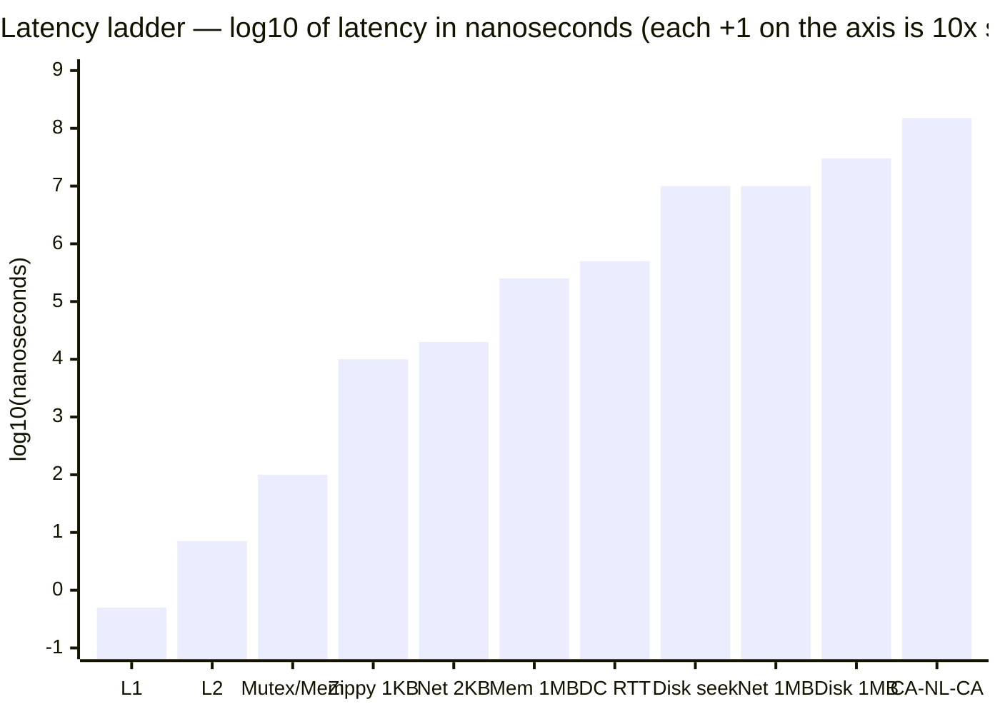
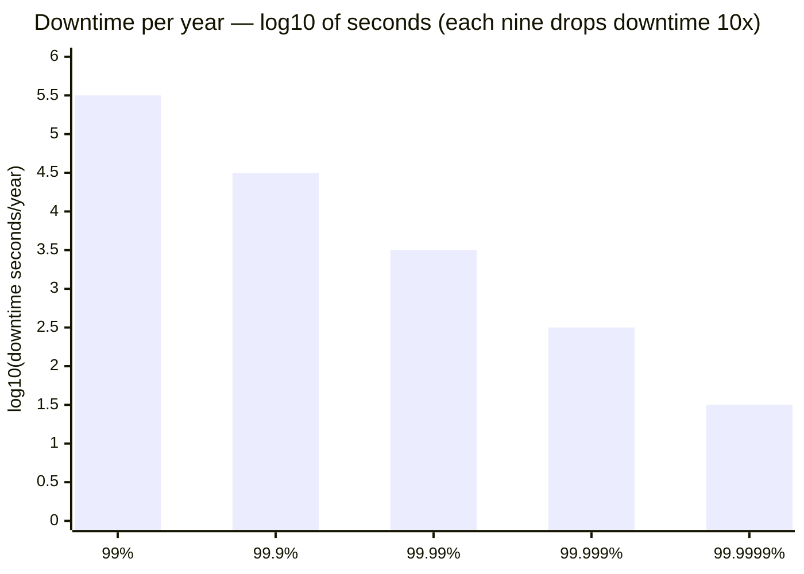
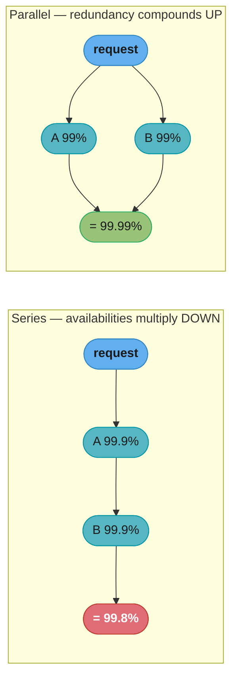
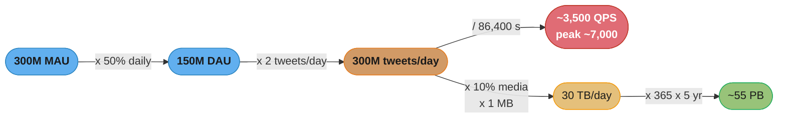
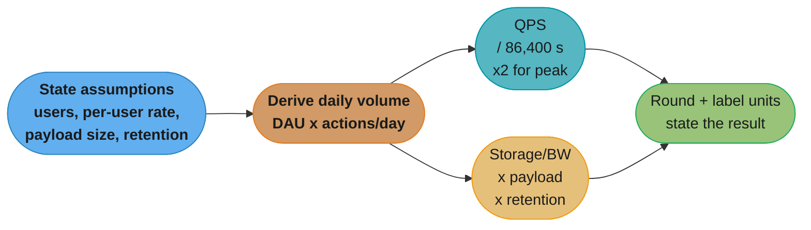
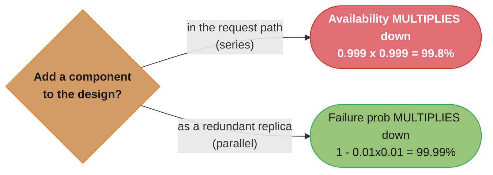

# Chapter 2: Back-of-the-Envelope Estimation

> Ch 2 of 16 · System Design Interview Vol 1 (Xu) · builds on Ch 1, leads to Ch 3 — the estimation habit every design chapter's Step 1 uses

## Chapter Map

A back-of-the-envelope estimate is a rough calculation you do with a set of thought
experiments and simplifying assumptions to figure out whether a design is even in the right
ballpark — will it need one server or a thousand, one disk or a fleet, one datacenter or many.
Jeff Dean (Google Senior Fellow) framed it as knowing how to estimate a system's capacity
"using a combination of thought experiments and common performance numbers." This chapter hands
you the three lookup tables every estimate leans on — **powers of two** (to turn "billions of
records × 100 bytes" into "terabytes"), **latency numbers every programmer should know** (to
know which operations are 1000× slower than others), and **availability numbers** (to translate
"four nines" into actual minutes of downtime) — then walks a full Twitter QPS-and-storage
estimate end to end, and closes with the interview technique that makes the whole thing land.

**TL;DR:**
- Memorize three tables: **powers of two** (2^10 KB … 2^50 PB), the **latency ladder**
  (L1 0.5 ns → memory 100 ns → same-DC round trip 500 µs → disk seek 10 ms → cross-continent
  150 ms), and the **availability ladder** (each extra "nine" cuts allowed downtime 10×).
- The estimate that matters in interviews is usually **QPS, peak QPS, storage, cache size, and
  number of servers** — practice deriving those five quickly.
- The **result is not the point — the process is.** Interviewers grade whether you round
  sanely, write units, and state assumptions out loud, not whether you hit the exact figure.
- Getting the **units and the seconds-in-a-day (86,400)** right matters more than arithmetic
  precision — most wrong answers come from a unit slip or a missing peak factor, not bad
  multiplication.

## The Big Question

> "Before I sketch a single box, is this system's scale closer to a laptop or to a datacenter?
> Do I need caching, sharding, and a CDN — or is one database plenty? I have 60 seconds and a
> whiteboard, not a spreadsheet."

Analogy: a structural engineer does not run a finite-element simulation to decide whether a
footbridge needs one support or three — they multiply span × load in their head and add a safety
factor. Back-of-the-envelope estimation is that same reflex for systems: a few memorized
constants and one line of arithmetic tell you the *order of magnitude*, and order of magnitude
is exactly what decides architecture. A design that assumes 3,000 QPS and one that assumes
3,000,000 QPS are different systems; the estimate is how you find out which one you are building
before you commit to a picture.

---

## 2.1 Power of Two

Data volume is counted in bytes, and bytes come in powers of two. One byte is a sequence of
**8 bits**; a single ASCII character fits in **1 byte**. Every larger unit is the next power of
two, grouped by tens because 2^10 = 1,024 is *almost* one thousand — close enough that engineers
say "kilo" and mean 1,024.

| Power | Exact value | Approximate value | Full name | Short name |
|-------|-------------|-------------------|-----------|-----------|
| 2^10  | 1,024 | 1 thousand | 1 Kilobyte | 1 KB |
| 2^20  | 1,048,576 | 1 million | 1 Megabyte | 1 MB |
| 2^30  | 1,073,741,824 | 1 billion | 1 Gigabyte | 1 GB |
| 2^40  | 1,099,511,627,776 | 1 trillion | 1 Terabyte | 1 TB |
| 2^50  | 1,125,899,906,842,624 | 1 quadrillion | 1 Petabyte | 1 PB |

**Why powers of two, and why it barely matters for estimation.** Storage and memory are
addressed in binary, so the *true* units are binary (1 KB = 1,024 bytes, formally a "kibibyte").
But for a back-of-the-envelope estimate you deliberately pretend 2^10 ≈ 10^3 — that is,
1 KB ≈ 1,000 bytes, 1 MB ≈ 1,000,000 bytes, 1 GB ≈ 10^9 bytes. The error is only ~2.4% per
step and it makes the multiplication doable in your head. The table's real job is the ladder of
*names*: when your arithmetic lands on "3.65 × 10^16 bytes," you slide up the ladder — thousand,
million, billion, trillion, quadrillion — and read off "≈ 55 PB." That translation, not
bit-exact accuracy, is what the table buys you.

**What this actually says.** "Every storage unit is the same jump — ten more bits of address — so
KB, MB, GB, TB and PB are not five separate facts, they are five rungs of one ladder, each 1,024×
the last."

Naming the rungs is the whole point of the table. Once "one rung per ×1,000" is reflexive, any raw
byte count collapses into a unit you can reason about — and that translation step is the one place
an estimate most often goes wrong.

| Symbol | What it is |
|--------|------------|
| `bit` | One binary digit, 0 or 1 — the smallest unit of information |
| `byte` | 8 bits; holds one ASCII character. Every storage estimate is counted in bytes |
| `2^10` | 1,024 — one rung of the ladder. Ten more bits of address buys 1,024× more space |
| the step of 10 in the exponent | Why the table lists 2^10, 2^20, 2^30, 2^40, 2^50 and never 2^15 |
| `≈ 10^3` | The estimation shortcut: pretend 1,024 is 1,000 so the multiplication is mental |
| KB / MB / GB / TB / PB | The five names for 2^10, 2^20, 2^30, 2^40, 2^50 bytes |

**Walk one example.** Take the chapter's own Twitter answer, 54,750 TB, and climb the ladder:

```
  54,750 TB          x 10^12 bytes/TB      = 54,750,000,000,000,000 bytes
                                           = 5.475 x 10^16 bytes

  climb the ladder:    10^3   thousand      KB
                       10^6   million       MB
                       10^9   billion       GB
                       10^12  trillion      TB
                       10^15  quadrillion   PB   <- divide by this one

  5.475 x 10^16 / 10^15                    = 54.75          ~ 55 PB

  what the shortcut cost you:
    true binary size  = 5.475 x 10^16 / 2^50 = 48.63 PiB
    decimal answer                           = 54.75 "PB"
    overstatement     = 54.75 / 48.63        = 1.126        -> 12.6% high
```

The decimal answer runs 12.6% above the true binary size because the 2.4%-per-rung error compounds
five times (`1.024^5 = 1.1259`). For an order-of-magnitude estimate that is invisible — you were
rounding 3,472 to 3,500 anyway. On a procurement spreadsheet it is a real 6 PB, which is exactly
why the two unit systems (PB vs PiB) exist at all.

```
byte ladder (each rung ×1000 for estimation, exactly ×1024 in truth)
  bit  ─┐
   8 bits = 1 byte
        │  ×1000
  1 KB ─┤  10^3   thousand   (text of a short tweet ~ 0.14 KB)
        │  ×1000
  1 MB ─┤  10^6   million    (one photo ~ 1 MB)
        │  ×1000
  1 GB ─┤  10^9   billion    (a movie ~ few GB)
        │  ×1000
  1 TB ─┤  10^12  trillion   (a big commodity disk ~ 1-20 TB)
        │  ×1000
  1 PB ─┘  10^15  quadrillion (a large service's media store)
```

Caption: the five rungs are the only conversions most estimates need — walk up one rung per
factor of 1,000 and the raw byte count turns into a human-readable size.

---

## 2.2 Latency Numbers Every Programmer Should Know

This is the famous table popularized by Jeff Dean (and Peter Norvig) — the relative cost of
common operations, from a CPU cache hit to a packet crossing an ocean. The absolute numbers
drift as hardware improves; the **ratios** between them are what you memorize, and they barely
change.

| Operation | Latency | In seconds |
|-----------|---------|-----------|
| L1 cache reference | 0.5 ns | 0.0000005 ms |
| Branch mispredict | 5 ns | 0.000005 ms |
| L2 cache reference | 7 ns | 0.000007 ms |
| Mutex lock/unlock | 100 ns | 0.0001 ms |
| Main memory reference | 100 ns | 0.0001 ms |
| Compress 1 KB with Zippy | 10,000 ns = 10 µs | 0.01 ms |
| Send 2 KB over 1 Gbps network | 20,000 ns = 20 µs | 0.02 ms |
| Read 1 MB sequentially from memory | 250,000 ns = 250 µs | 0.25 ms |
| Round trip within same datacenter | 500,000 ns = 500 µs | 0.5 ms |
| Disk seek | 10,000,000 ns = 10 ms | 10 ms |
| Read 1 MB sequentially from network | 10,000,000 ns = 10 ms | 10 ms |
| Read 1 MB sequentially from disk | 30,000,000 ns = 30 ms | 30 ms |
| Send packet CA → Netherlands → CA | 150,000,000 ns = 150 ms | 150 ms |

Units recap so you never fumble the conversions: **1 ns = 10^-9 s**, **1 µs = 10^-6 s = 1,000 ns**,
**1 ms = 10^-3 s = 1,000 µs = 1,000,000 ns**.

**Read it like this.** "No entry in this table is 'fast' or 'slow' on its own — every number only
means something next to another number, and what you are memorizing is the two hundred-fold cliffs
between the plateaus."

The reason the table refuses to stick in memory is that human beings have no intuition for a
nanosecond. Stretch the whole ladder by one constant factor until its smallest rung is something
you can feel, and the ratios become impossible to forget.

| Symbol | What it is |
|--------|------------|
| `ns` | Nanosecond, 10^-9 s — the CPU's own unit. One clock tick on a 3 GHz core is ~0.33 ns |
| `µs` | Microsecond, 10^-6 s = 1,000 ns — the unit of local I/O and memory copies |
| `ms` | Millisecond, 10^-3 s = 1,000,000 ns — the unit of disks and networks |
| "sequentially" | Reading contiguous bytes, no seeking. The fast case; random access is far worse |
| "round trip" | Out and back — a request plus its response, not one direction |
| "seek" | Physically repositioning a disk head before any data flows. Pure overhead |
| the ratio between two rows | The only durable content of the table; absolute values drift yearly |

**Walk one example.** Stretch one L1 cache hit (0.5 ns) into 1 second — a factor of 2 × 10^9 — and
read the whole table on a human clock:

```
  scale factor = 1 s / 0.5 ns = 2,000,000,000x   (apply to every row)

  operation                        real       x 2x10^9        feels like
  L1 cache reference               0.5 ns     1 s             one heartbeat
  L2 cache reference               7 ns       14 s            a slow breath
  main memory reference            100 ns     200 s           3.3 minutes
  compress 1 KB with Zippy         10 us      20,000 s        5.6 hours
  send 2 KB over 1 Gbps            20 us      40,000 s        11.1 hours
  read 1 MB from memory            250 us     500,000 s       5.8 days
  round trip within same DC        500 us     1,000,000 s     11.6 days
  disk seek                        10 ms      20,000,000 s    7.6 months
  read 1 MB from disk              30 ms      60,000,000 s    1.9 years
  send packet CA -> NL -> CA       150 ms     300,000,000 s   9.5 years

  the ratios you actually keep:
    1 MB from disk vs from memory    30 ms / 250 us   = 120x
    disk seek vs 1 MB from memory    10 ms / 250 us   = 40x
    cross-continent vs same-DC RTT   150 ms / 500 us  = 300x
    cross-continent vs Zippy 1 KB    150 ms / 10 us   = 15,000x
```

That is the table's real lesson: if a memory reference is a heartbeat, a cross-continent round trip
is most of a decade. You would never make a decade-long call in a loop, and the scaled column is
what makes "do not chat across regions" feel obvious rather than merely true.

Because these numbers span nine orders of magnitude (0.5 ns to 150,000,000 ns), a linear chart is
useless — one bar would be 300-million times taller than another. Plotting the **base-10
logarithm** of each latency makes the ladder legible: each unit up the y-axis is a 10× jump.



Caption: the bars climb in three plateaus — CPU/cache (sub-nanosecond to ~100 ns), local I/O and
memory-copy (10 µs to 500 µs), and durable/remote I/O (10 ms to 150 ms) — and the jump from the
memory plateau to the disk plateau is roughly 100×, which is the single most important ratio in
the table.

### The conclusions the table forces on you

The point of the numbers is not to recite them but to internalize five design rules that fall
straight out of the ratios:

1. **Memory is fast; disk is slow.** Reading 1 MB from memory is 250 µs; from disk it is 30 ms —
   about **120× slower**. Anything you can serve from RAM instead of disk is two orders of
   magnitude cheaper. This is *the* reason caches exist.
2. **Avoid disk seeks whenever possible.** A single seek is 10 ms — as long as reading a full
   megabyte sequentially from memory forty times over. Random disk access is punishing; batch and
   sequentialize I/O so you pay for throughput, not seeks.
3. **Simple compression is cheap.** Compressing 1 KB with a fast algorithm (Zippy/Snappy) is
   ~10 µs — trivially fast compared to a network round trip.
4. **Compress before sending over the network.** Since compression costs ~10 µs and a
   cross-continent round trip costs 150 ms (15,000× more), spending CPU to shrink a payload almost
   always pays for itself in reduced transfer time.
5. **Datacenters are usually far apart, and inter-region traffic is expensive.** A packet from
   California to the Netherlands and back is 150 ms — 300× a same-datacenter round trip (500 µs).
   Keep chatty traffic within a region; treat cross-region hops as a scarce resource.

```
magnitude ladder (walk up: each step is roughly ~100x)
  ~1 ns      CPU cache / branch          L1 0.5ns  L2 7ns
  ~100 ns    memory ref / mutex          local, fast
  ~10 us     compress 1KB, send 2KB      cheap local work
  ~500 us    same-datacenter round trip  network within a region
  ~30 ms     read 1MB from disk / seek   durable storage is slow
  ~150 ms    cross-continent round trip  another datacenter, far
```

Caption: five plateaus, each about two orders of magnitude apart — the gaps (memory→disk,
DC→cross-region) are exactly where caching and geo-placement decisions live.

---

## 2.3 Availability Numbers

**High availability** is the ability of a system to be continuously operational for a long time.
It is measured as a **percentage of uptime**: 100% means never down; 99% means down 1% of the
time. A **Service Level Agreement (SLA)** is the formal contract between a service provider
(commonly a cloud vendor) and its customers that defines the uptime the service promises — for
example, Amazon, Google, and Microsoft publish SLAs of 99.9% or higher for their infrastructure
services. Uptime is conventionally stated in **"nines"**: 99.9% is "three nines," 99.99% is "four
nines," and so on.

The critical, counter-intuitive fact: **each additional nine reduces the allowed downtime by
exactly 10×.** Going from 99% to 99.9% is not a small polish — it turns 3.65 *days* of yearly
downtime into 8.77 *hours*.

| Availability % | Downtime per day | Downtime per year |
|----------------|------------------|-------------------|
| 99%       | 14.40 minutes | 3.65 days |
| 99.9%     | 1.44 minutes | 8.77 hours |
| 99.99%    | 8.64 seconds | 52.60 minutes |
| 99.999%   | 864 milliseconds | 5.26 minutes |
| 99.9999%  | 86.4 milliseconds | 31.56 seconds |

How to derive any row yourself (no memorization needed): a year has 365 × 24 × 60 × 60 =
**31,536,000 seconds**. Multiply that by the *downtime fraction* (100% minus the availability).
For 99.99%, the downtime fraction is 0.01% = 0.0001, so 31,536,000 × 0.0001 = **3,153.6 s ≈ 52.6
minutes**. For 99% it is 31,536,000 × 0.01 = 315,360 s = 87.6 hours = **3.65 days**. Plotting the
downtime on a log axis shows the ladder cleanly: each nine drops the bar by exactly one decade.



Caption: a perfectly regular staircase — every additional nine is a full order of magnitude less
downtime, which is why "just add a nine" is an expensive engineering ask, not a rounding change.

**In plain terms.** "An availability percentage is a promise about time, and the only honest way to
hear it is to subtract it from 100% and cash the remainder out in seconds of a year."

```
downtime_per_year = (1 - A) x 31,536,000 s
```

Stating the rule this way means you never memorize the table — you regenerate any row of it in one
multiplication, including rows the book does not list (99.95%, 99.995%) that vendors quote all the
time.

| Symbol | What it is |
|--------|------------|
| `A` | Availability as a fraction, not a percentage — 99.99% enters the formula as 0.9999 |
| `1 - A` | The downtime fraction. This is the number that actually matters; A itself is decoration |
| `31,536,000` | Seconds in a (non-leap) year: 365 × 24 × 60 × 60. The one constant to memorize |
| "a nine" | One more 9 in the percentage, i.e. dividing `1 - A` by 10 — always exactly 10× less downtime |
| SLA | The contract that names A. Cloud vendors typically promise 99.9% or better |

**Walk one example.** Derive two adjacent rows and watch the decade appear:

```
  seconds in a year   = 365 x 24 x 60 x 60             = 31,536,000 s

  A = 99.99%
    availability fraction                              = 0.9999
    downtime fraction (1 - A)                          = 0.0001
    31,536,000 s x 0.0001                              = 3,153.6 s/year
    3,153.6 s / 60                                     = 52.56 minutes/year

  A = 99.999%   (one more nine)
    downtime fraction (1 - A)                          = 0.00001
    31,536,000 s x 0.00001                             = 315.36 s/year
    315.36 s / 60                                      = 5.26 minutes/year

  ratio of the two   3,153.6 / 315.36                  = exactly 10.0

  meaning: the extra nine bought back 47 minutes a year. Whether that is worth a
           second region is the actual decision the number exists to inform.
```

A note on the table's rounding: computed exactly, 99.9% allows 8.76 hours (31,536.0 s), 99.99%
allows 52.56 minutes, and 99.9999% allows 31.54 seconds — the widely reproduced table above quotes
8.77 hours, 52.60 minutes, and 31.56 seconds. The difference is not an error: those figures come
from a **365.25-day** year (31,557,600 s, averaging in leap days), which gives 8.766 h, 52.596 min,
and 31.558 s. Both conventions are defensible and the 0.07% gap changes no decision — which is
itself the chapter's point about precision.

### Serial vs parallel availability composition

A real system is many components, and how you wire them decides whether their availabilities
*multiply down* or *compound up*.

- **In series (dependency chain):** if a request must pass through component A *and* B *and* C,
  the system is up only when all are up, so availabilities **multiply**:
  `A_total = A1 × A2 × … × An`. Two 99.9% services in series give
  0.999 × 0.999 = 0.998 = **99.8%** — worse than either alone. Adding dependencies *lowers*
  availability, which is why long synchronous call chains are fragile.
- **In parallel (redundancy):** if any one of several redundant replicas can serve the request,
  the system is down only when *all* fail, so the *failure* probabilities multiply:
  `A_total = 1 − (1 − A1)(1 − A2) … (1 − An)`. Two 99% services in parallel give
  1 − (0.01 × 0.01) = 1 − 0.0001 = **99.99%** — two nines better than either alone. Redundancy is
  how you *buy* nines.

**The idea behind it.** "Both formulas are the same act of multiplying probabilities together — in
series you multiply the good news and it shrinks, in parallel you multiply the bad news and *that*
shrinks. The operation is identical; only which column you feed it changes the sign of the result."

That symmetry is why availability engineering has exactly one lever. You cannot make a component
better than it is, so every real gain comes from moving something out of the series path and into a
parallel one.

| Symbol | What it is |
|--------|------------|
| `A_i` | The availability of component i, as a fraction (99.9% → 0.999) |
| `A_total` | The availability a user actually experiences, after composition |
| `1 - A_i` | Component i's failure probability — the term parallel redundancy multiplies |
| `n` | How many components are composed: hops in the chain, or replicas in the pool |
| `A1 × A2 × … × An` | Series: everything must work, so multiply the successes |
| `1 − (1−A1)(1−A2)…` | Parallel: everything must fail to take you down, so multiply the failures |

**Walk one example.** Push the same components through both wirings and read the downtime:

```
  SERIES -- all must be up:  A_total = A1 x A2 x ... x An

    2 hops @ 99.9%    0.999^2 = 0.998001    -> 99.80%     downtime 63,040 s = 17.51 h/year
    5 hops @ 99.9%    0.999^5 = 0.995010    -> 99.50%     downtime 157,365 s = 43.71 h/year

    each hop you append costs another 0.1% -- five "three nines" services in a row
    do not deliver three nines, they deliver two and a half

  PARALLEL -- any one suffices:  A_total = 1 - (1-A1)(1-A2)...(1-An)

    2 replicas @ 99%  1 - (0.01 x 0.01) = 0.9999      -> 99.9900%  downtime 3,153.6 s = 52.6 min/yr
    3 replicas @ 99%  1 - (0.01 x 0.01 x 0.01)
                                        = 0.999999    -> 99.9999%  downtime 31.5 s/year

    each replica you append multiplies the failure probability by 0.01 -- one more
    replica is one more decade of downtime removed, the same 10x as one more nine

  the punchline: three cheap 99% boxes in parallel (99.9999%) beat five careful
                 99.9% services in series (99.50%) by four orders of magnitude
```

**Why the `1 −` wrapper exists at all.** In parallel you cannot multiply availabilities directly —
0.99 × 0.99 = 0.9801 would say two replicas are *worse* than one, which is nonsense. The event you
have to multiply is the one that requires *all* participants to cooperate, and in a redundant pool
that event is total failure, not success. Flipping into failure space (`1 − A`), multiplying there,
and flipping back is the whole trick, and forgetting the flip is the single most common error when
people first do this arithmetic on a whiteboard.



Caption: the same 99% component is a liability in a long series chain and an asset behind a
redundant pair — series multiplies availabilities down, parallel drives failure probability down,
so redundancy is the only lever that *adds* nines.

---

## 2.4 Example: Estimate Twitter QPS and Storage Requirements

This is the chapter's worked example. Numbers are invented for the exercise — the point is the
*method*: state assumptions, compute QPS, compute storage, round hard, label units.

**Assumptions (write these down first):**
- 300 million monthly active users (MAU).
- 50% of users use Twitter daily → 150 million daily active users (DAU).
- Users post **2 tweets per day** on average.
- **10%** of tweets contain media (image/video).
- Data is stored for **5 years**.

**Tweet size assumptions:**
- `tweet_id` — 64 bytes
- `text` — 140 bytes
- `media` — 1 MB (average, when present)

### Step 1 — QPS (queries per second)

```
DAU               = 300 million MAU x 50%              = 150 million
Tweets per day    = 150 million DAU x 2 tweets         = 300 million tweets/day
Seconds per day   = 24 x 3600                          = 86,400 s
Tweets QPS        = 300,000,000 / 86,400               ~ 3,472  ~ 3,500 QPS
Peak QPS          = 2 x QPS                             ~ 7,000 QPS
```

The 86,400 in the denominator is the number every QPS estimate divides by — memorize
"**~86,400 s/day, round to ~100,000 for a quick pass**." Peak traffic is not uniform across the
day, so a standard rule of thumb multiplies average QPS by **2** to size for the busy hour.

**Stated plainly.** "Queries per second is not a measurement, it is a chain of stated assumptions
multiplied together and then divided by 86,400 — and every disagreement about the answer is really
a disagreement about one of the multipliers."

```
QPS      = (users x active_fraction x actions_per_user_per_day) / 86,400
peak QPS = QPS x peak_factor
```

Writing it as one expression is what lets an interviewer push back surgically — "make it 3 tweets
a day, not 2" — and lets you re-derive in one step instead of starting over.

| Symbol | What it is |
|--------|------------|
| `users` | The headline population, usually quoted as monthly actives (MAU) |
| `active_fraction` | Share of those who show up on a given day. Turns MAU into DAU; here 50% |
| `actions_per_user_per_day` | How busy an active user is. Here 2 tweets — the softest number in the chain |
| `86,400` | Seconds in a day, 24 × 3,600. The denominator of every QPS estimate ever |
| `peak_factor` | Busy-hour multiplier over the 24-hour average. Default ~2; higher for spiky loads |
| `QPS` | Average request rate. What the system sees on a boring Tuesday afternoon |
| `peak QPS` | The rate you must actually provision for. Capacity is sized here, never at the average |

**Walk one example.** The chapter's own chain, with the unit carried on every single line:

```
  users              300,000,000 MAU
  x active_fraction  x 0.50                          = 150,000,000 DAU
  x actions/user/day x 2 tweets/DAU/day              = 300,000,000 tweets/day

  / seconds per day  / 86,400 s/day                  = 3,472.2 tweets/s
  round                                              ~ 3,500 QPS

  x peak_factor      x 2                             = 6,944.4 tweets/s
  round                                              ~ 7,000 peak QPS

  sanity check against the population:
    3,500 QPS across 150,000,000 DAU means each user acts once every
    150,000,000 / 3,500 = 42,857 s = 11.9 hours -- about twice a day. Consistent
    with the stated assumption, so the arithmetic did not slip a unit.
```

**Why the peak factor is not optional.** Drop it and you provision 3,500 QPS of capacity for a
system that will see 7,000 during its busy hour — you have not under-provisioned by a rounding
error, you have under-provisioned by 100%, and the failure arrives precisely when the most people
are watching. The peak factor is also the cheapest number to defend out loud, because a rough
diurnal argument ("traffic is not flat; the busy hour is roughly double the mean") is one sentence
and the interviewer will nod. The sanity check at the bottom of the block is worth the same ten
seconds: dividing back through the population catches the `/24` blunder instantly, because it would
have implied every user tweeting every twelve seconds.

### Step 2 — Storage

Only media dominates storage (text and IDs are tiny by comparison), so estimate media:

```
Tweets/day with media = 300 million tweets/day x 10%        = 30 million/day
Media bytes/day       = 30 million x 1 MB                   = 30 million MB = 30 TB/day
5-year media storage  = 30 TB/day x 365 days x 5 years
                      = 30 x 1,825                          = 54,750 TB
                      ~ 55 PB
```

Sanity check on the text/ID part to prove it is negligible: each tweet's non-media data is
64 + 140 = 204 bytes; 300 million tweets/day × 204 bytes ≈ 61 GB/day ≈ 0.06 TB/day — about
**0.2%** of the 30 TB/day media figure. That is why the estimate ignores it: on a back-of-the-
envelope pass you drop terms that are 500× smaller than the dominant one.

**What the formula is telling you.** "Total storage is just daily volume times the fraction of it
that is actually big, times how big that thing is, times how long you promised to keep it — and one
of those four factors always dominates so completely that the other three barely matter."

```
storage = events_per_day x heavy_fraction x bytes_per_heavy_event x 365 x years
```

Naming `heavy_fraction` as its own factor is what makes the "ignore the text" move defensible
rather than lazy: you are not forgetting the text, you are showing it is 0.2% and dropping it on
purpose.

| Symbol | What it is |
|--------|------------|
| `events_per_day` | Daily volume carried over from the QPS chain — here 300M tweets/day |
| `heavy_fraction` | Share of events carrying the payload that dominates. Here 10% have media |
| `bytes_per_heavy_event` | Average size of that payload. Here 1 MB per media item |
| `365 x years` | Retention. A product-policy number, not a technical one — always ask for it |
| "the dominant term" | The factor whose removal changes the answer. Estimate it; drop the rest |

**Walk one example.** The media chain, then the test that lets you throw the text away:

```
  events_per_day             300,000,000 tweets/day
  x heavy_fraction           x 0.10                        = 30,000,000 media/day
  x bytes_per_heavy_event    x 1 MB/media                  = 30,000,000 MB/day
  convert                    / 10^6 MB per TB              = 30 TB/day

  x retention                x 365 days/yr x 5 yr = 1,825 days
                             30 TB/day x 1,825 days        = 54,750 TB
  climb one rung             / 1,000 TB per PB             = 54.75 PB   ~ 55 PB

  now the dropped term, to prove it was safe to drop:
    bytes per tweet (non-media)  64 B id + 140 B text      = 204 B/tweet
    300,000,000 tweets/day x 204 B/tweet                   = 61,200,000,000 B/day
                                                           = 61.2 GB/day = 0.0612 TB/day
    share of the total           0.0612 / 30               = 0.204%

  meaning: carrying the text through the whole calculation would have moved
           54.75 PB to 54.86 PB -- both round to 55 PB, and the gap is far smaller
           than the error already baked into the "1 MB average media" guess.
```

**Why retention is the factor to interrogate first.** The other three multipliers are guesses about
user behaviour and move the answer by tens of percent; retention is a policy decision that moves it
by *whole multiples*. Cut the promise from five years to one and 55 PB becomes 11 PB — an 80%
reduction bought with a product conversation rather than an engineering one. This is why "how long
do we keep it?" is the most valuable clarifying question in any storage estimate, and why an
estimate quoted without its retention window is not an estimate at all.



Caption: one assumption chain (MAU → DAU → tweets/day) forks into the two headline numbers —
divide by seconds-per-day for QPS, multiply by media-fraction and retention for storage — which
is the exact shape every estimation answer takes.

### Estimation summary table (the deliverable)

An interviewer wants the numbers laid out like this at the end — assumptions and results,
labeled and rounded:

| Quantity | Result |
|----------|--------|
| DAU | 150 million |
| Average tweet QPS | ~3,500 |
| Peak tweet QPS | ~7,000 |
| Average tweet size (non-media) | ~204 bytes |
| Media generated per day | ~30 TB |
| 5-year storage | ~55 PB |

---

## 2.5 Tips — Back-of-the-Envelope Estimation Is About the Process

Xu is blunt about what interviewers actually grade: **the right process is far more important
than the final number.** Nobody expects a precise answer; they expect you to reason cleanly under
uncertainty. The techniques:

- **Rounding and approximation.** Do not attempt precise arithmetic on a whiteboard — you have no
  time and it earns no points. Simplify: to divide 99,987 by 9.1, round to **100,000 / 10 =
  10,000**. Getting the magnitude right beats getting the digits right.
- **Write down your assumptions.** State every assumption explicitly ("assume 50% of users are
  daily active," "assume 1 MB average image") so both you and the interviewer can follow, and so
  they can push back on one number without your whole estimate collapsing.
- **Label your units.** Always write **5 MB**, never a bare **5** — otherwise you (and the
  interviewer) lose track of whether a figure is bytes, KB, or QPS. Unit slips, not multiplication
  errors, cause most wrong estimates.
- **Know which estimates you will be asked for.** Practice deriving the common ones fast:
  **QPS, peak QPS, storage, cache, and number of servers.** You can rehearse these; do it before
  the interview so the arithmetic is reflexive.

The overarching message: an estimate is a *conversation tool*. It exists so you and the
interviewer agree on the system's scale — one server or a fleet, one region or many — before you
argue about the architecture. Speed, clarity, and stated assumptions win; a spuriously precise
figure that took three minutes to compute loses.

---

## Practice Drills (applying the chapter's method)

The book teaches the method through the Twitter example; these three drills apply the *same
recipe* — assumptions → QPS → storage/bandwidth → round — to other classic interview systems.
They are illustrative practice, not from the book's Chapter 2 text.

### Drill A — Storage for a URL shortener (a read-heavy write-once system)

**Assumptions:** 100 million new URLs written per day; each stored record ~100 bytes
(short code + long URL + metadata); retain **10 years**; read:write ratio **10:1**.

```
Write QPS      = 100,000,000 / 86,400                    ~ 1,160 writes/s
Read QPS       = 1,160 x 10                              ~ 11,600 reads/s
Records (10 y) = 100,000,000/day x 365 x 10              = 365,000,000,000  (365 billion)
Storage        = 365 billion x 100 bytes                 = 36,500,000,000,000 bytes
               = 36.5 x 10^12 bytes                      ~ 36.5 TB
```

Takeaway: even 365 *billion* records fit in tens of terabytes because each row is tiny — a URL
shortener is bounded by **read QPS and cache**, not by storage. Compare to Twitter, which is
bounded by media *storage* (55 PB): the dominant term flips entirely with the payload size.

### Drill B — Egress bandwidth for a video streaming service

**Assumptions:** 5 million concurrent viewers at peak; average stream **5 Mbps** (roughly 1080p).

```
Peak egress = 5,000,000 viewers x 5 Mbps
            = 25,000,000 Mbps
            = 25,000 Gbps
            = 25 Tbps
```

Takeaway: 25 **terabits per second** of egress is far beyond what any single origin or region can
serve — this one number is the entire justification for a **CDN**. Video systems are bandwidth-
bound; the estimate makes "we must push bytes from edge caches, not the origin" undeniable in one
line. (Chapter 14, Design YouTube, builds on exactly this.)

### Drill C — Cache sizing (the 20% hot-data rule)

**Assumptions:** reuse the URL shortener's ~11,600 read QPS; cache the **20%** hottest entries
(the "80/20" rule — 20% of keys serve ~80% of reads); each cache entry ~100 bytes.

```
Reads/day       = 11,600 x 86,400                        ~ 1,000,000,000  (~1 billion/day)
Distinct hot    = 20% of daily reads (upper bound)       ~ 200,000,000 entries
Cache memory    = 200,000,000 x 100 bytes                = 20,000,000,000 bytes
                                                         ~ 20 GB
```

Takeaway: ~20 GB fits comfortably in a small Redis/Memcached cluster (a couple of nodes with
headroom), so caching the hot set is cheap and obviously worth it — the estimate turns "should we
cache?" into a settled "yes, for 20 GB of RAM." This is the *cache* estimate from the "five to
memorize" list.

---

## Broken → Fix: the two estimation mistakes interviewers watch for

**Broken (unit/denominator slip):** a candidate estimates Twitter's QPS by dividing daily tweets
by *hours* instead of *seconds*:

```
WRONG: 300,000,000 tweets / 24 hours = 12,500,000 "QPS"
```

12.5 million QPS is absurd for a 150M-DAU service — it is off by the 3,600 seconds-per-hour
factor. The tell is that the number *feels* wrong (millions of QPS from a few hundred million
users). **Fix:** always divide daily volume by **86,400 seconds/day**, and sanity-check the
magnitude against the user count:

```
RIGHT: 300,000,000 tweets / 86,400 s = ~3,472 ~ 3,500 QPS   (peak ~7,000)
```

**Broken (nines misread as small):** a candidate reads "99.99% availability" as "basically always
up, a few hours of downtime a year is fine." **Fix:** convert nines to time on the spot —
99.99% = 0.01% × 31,536,000 s ≈ **52.6 minutes/year**, not hours. Reading a nine as "close
enough" hides a 10× error; each nine is a decade of downtime, and the difference between three
and four nines (8.77 h vs 52.6 min) is often the difference between one datacenter and
multi-region redundancy.

---

## Visual Intuition

### The estimation recipe — one shape for every answer



Caption: every estimate is the same pipeline — assumptions → daily volume → fork into QPS
(divide by seconds) and storage/bandwidth (multiply by payload and retention) → round and label —
so once you drill the shape, any new system is just new numbers in the same slots.

### Why redundancy is the only way to add a nine



Caption: adding a dependency in series can only *lower* availability, while adding a redundant
replica in parallel *raises* it — the whole discipline of high-availability design is moving
components from the series path into parallel redundancy.

---

## Key Concepts Glossary

- **Back-of-the-envelope estimation** — a rough capacity calculation from thought experiments and
  memorized performance constants, to check whether a design is in the right ballpark.
- **Byte / bit** — a byte is 8 bits; an ASCII character is 1 byte; storage is counted in bytes.
- **Power of two / KB, MB, GB, TB, PB** — units where each step up is ×1,024 (≈×1,000 for
  estimation): 2^10 KB, 2^20 MB, 2^30 GB, 2^40 TB, 2^50 PB.
- **Latency numbers (Jeff Dean's table)** — canonical relative costs of common operations, from
  L1 cache (0.5 ns) to a cross-continent round trip (150 ms).
- **QPS (queries per second)** — request/operation rate; daily volume ÷ 86,400 s.
- **Peak QPS** — busy-hour rate; commonly estimated as ~2× average QPS.
- **86,400** — seconds in a day (24 × 3,600), the denominator for turning daily counts into QPS.
- **Read:write ratio** — how many reads occur per write; sizes read-path QPS and caching.
- **Availability** — percentage of time a system is operational (uptime).
- **SLA (Service Level Agreement)** — contract defining the availability/performance a provider
  promises (cloud vendors typically ≥99.9%).
- **Nines** — shorthand for availability: three nines = 99.9%, four nines = 99.99%; each extra
  nine cuts allowed downtime 10×.
- **Downtime** — time a system is unavailable; derive as (1 − availability) × 31,536,000 s/year.
- **Series composition** — dependencies in a chain; availabilities multiply (lowers total).
- **Parallel composition (redundancy)** — replicas where any one suffices; failure probabilities
  multiply (raises total).
- **Rounding / approximation** — deliberately trading precision for speed (99,987/9.1 ≈ 10,000).
- **Estimation deliverables to memorize** — QPS, peak QPS, storage, cache size, number of servers.

---

## Tradeoffs & Decision Tables

| Table | What it converts | Key constant to memorize |
|-------|------------------|--------------------------|
| Powers of two | byte counts → human units | 2^10 ≈ 10^3; climb one rung per ×1,000 |
| Latency numbers | operation → relative cost | memory 100 ns vs disk seek 10 ms (~100,000×) |
| Availability | nines → downtime | each nine = 10× less downtime; year = 31,536,000 s |

| Composition | Formula | Two-component example | Effect |
|-------------|---------|-----------------------|--------|
| Series (all must be up) | A1 × A2 × … | 99.9% × 99.9% = 99.8% | availability drops |
| Parallel (any suffices) | 1 − Π(1 − Ai) | 1 − 0.01² = 99.99% | availability rises |

| System (drill) | Dominant term | Bound by | Headline number |
|----------------|---------------|----------|-----------------|
| Twitter | media storage | storage | ~55 PB over 5 years |
| URL shortener | read traffic | read QPS / cache | ~11,600 read QPS, ~36.5 TB |
| Video streaming | egress | bandwidth | ~25 Tbps peak → needs CDN |

---

## Common Pitfalls / War Stories

- **Dividing by hours (or minutes) instead of seconds.** The classic QPS blunder: `daily / 24`
  inflates the answer 3,600×, producing millions of QPS from a modest user base. Always divide by
  **86,400 s/day**, and sanity-check the magnitude against user count before you say it aloud.
- **Forgetting the peak factor.** Sizing capacity to *average* QPS guarantees the system falls
  over during the busy hour. Multiply by ~2 (or a workload-specific spike factor) for peak, and
  mention that you did.
- **Dropping or mislabeling units.** Writing a bare "5" instead of "5 MB" leads to mixing bytes,
  KB, and QPS mid-calculation. Label every number; unit slips cause more wrong estimates than
  arithmetic ever does.
- **Reading nines as "close enough."** Treating 99.99% as "basically always up" hides that it
  still allows 52.6 minutes of downtime a year — and that four nines vs three nines is a 10×
  difference that usually forces multi-region redundancy. Convert nines to minutes on the spot.
- **Chaining dependencies without counting the availability cost.** Every synchronous service you
  add to the request path multiplies availability *down*. A design with a long series of 99.9%
  hops can quietly fall below 99% — move critical dependencies behind redundant, parallel replicas
  instead.
- **Chasing false precision.** Spending three minutes to compute 99,987 / 9.1 exactly earns
  nothing and burns your interview clock. Round to 100,000 / 10 = 10,000 and move on; the
  interviewer is grading the reasoning, not the last digit.
- **Ignoring the dominant term (or including negligible ones).** In the Twitter estimate, text and
  IDs are ~0.2% of media storage — carrying them adds noise, not accuracy. Identify the term that
  dominates and estimate that; drop anything 100×+ smaller.

---

## Real-World Systems Referenced

- **Jeff Dean / Peter Norvig** — the "Latency Numbers Every Programmer Should Know" table
  originates with Dean's talks and Norvig's "Teach Yourself Programming in Ten Years."
- **Zippy / Snappy** — Google's fast compression library, the "compress 1 KB in ~10 µs" reference.
- **Amazon, Google, Microsoft** — cited as cloud providers publishing SLAs of 99.9%+ for their
  services (the availability-numbers discussion).
- **Twitter** — the worked QPS-and-storage example (with invented but plausible numbers).
- **1 Gbps network** — the "send 2 KB in 20 µs" line item's assumed link speed.

---

## Summary

Back-of-the-envelope estimation is the reflex of turning a vague system into an order-of-magnitude
picture with a few memorized constants and one line of arithmetic. Three tables carry almost every
estimate: **powers of two** convert raw byte counts into KB/MB/GB/TB/PB (each rung ×1,024, ≈×1,000
for speed); the **latency numbers** encode the ratios that justify caching and geo-placement —
memory is ~100× faster than disk, a disk seek is 10 ms, compression is nearly free, and a
cross-continent round trip is 150 ms; and the **availability numbers** translate "nines" into real
downtime, where each additional nine cuts allowed downtime 10× (99% = 3.65 days/yr, 99.99% = 52.6
min/yr), and series composition lowers availability while parallel redundancy raises it. The
chapter's Twitter example threads the whole method: state assumptions (300M MAU, 50% daily, 2
tweets/day, 10% media, 5-year retention), derive QPS (150M DAU × 2 / 86,400 ≈ 3,500, peak ~7,000),
and derive storage (30 TB/day of media → ~55 PB over five years). The same recipe — assumptions →
daily volume → fork into QPS and storage/bandwidth → round and label — sizes a URL shortener
(read-QPS-bound, ~36.5 TB) or a video service (bandwidth-bound, ~25 Tbps → CDN). Above all, the
**process beats the number**: round aggressively, write your assumptions, label your units, and
rehearse the five estimates you will actually be asked for — QPS, peak QPS, storage, cache, and
server count.

---

## Interview Questions

**Q: What is the single most common arithmetic mistake when computing QPS from a daily volume?**
Dividing by hours (24) instead of seconds (86,400), which inflates the answer 3,600×. A service with 300 million actions a day is ~3,500 QPS (300M / 86,400), not 12.5 million — so if your QPS comes out in the millions for a few-hundred-million-user service, you divided by the wrong unit. Always divide daily volume by 86,400 seconds and sanity-check the magnitude against the user count.

**Q: How much downtime per year does each additional "nine" of availability actually allow?**
Each additional nine cuts allowed downtime by exactly 10×. 99% allows 3.65 days/year, 99.9% allows 8.77 hours, 99.99% allows 52.6 minutes, and 99.999% allows 5.26 minutes. So "just add a nine" is a 10× engineering ask, and the jump from three to four nines (8.77 h to 52.6 min) often forces multi-region redundancy.

**Q: How much slower is reading 1 MB from disk than from memory, according to the latency table?**
About 120× slower — 30 ms from disk versus 250 µs from memory. This ratio is the core justification for caching: anything served from RAM instead of disk is roughly two orders of magnitude cheaper. It is why "memory fast, disk slow, avoid disk seeks" is the table's headline lesson.

**Q: Order these fastest to slowest — disk seek, main memory reference, same-datacenter round trip, L1 cache reference.**
L1 cache (0.5 ns) < main memory (100 ns) < same-DC round trip (500 µs) < disk seek (10 ms). The four span about seven orders of magnitude, clustering into CPU/cache, local network, and durable-storage plateaus. Interviewers use ordering questions to check you know the *ratios*, since the absolute numbers drift with hardware.

**Q: Why is peak QPS commonly estimated as 2× the average QPS?**
Because traffic is not uniform across the day, so you must size capacity for the busy hour, not the average. A ~2× factor is a standard rule of thumb; systems with sharper spikes (flash sales, live events) use larger multipliers. Sizing to average QPS guarantees the system falls over at peak.

**Q: Two 99.9% services are wired in series (a request must pass through both) — what is the combined availability?**
About 99.8%, because availabilities multiply in series: 0.999 × 0.999 = 0.998. Adding a dependency to the request path can only lower total availability, so long synchronous call chains are fragile. This is why you push critical dependencies into redundant parallel replicas instead of stacking them in series.

**Q: Two 99% services are placed in parallel as redundant replicas — what is the combined availability?**
About 99.99%, because in parallel the failure probabilities multiply: 1 − (0.01 × 0.01) = 0.9999. Redundancy is the only lever that *adds* nines — two two-nines components become a four-nines pair. This is the mathematical reason high availability is built from redundancy, not from making single components more reliable.

**Q: Estimate Twitter's average tweet QPS given 300M MAU, 50% daily active, and 2 tweets per user per day.**
About 3,500 QPS, with peak around 7,000. DAU = 300M × 50% = 150M; tweets/day = 150M × 2 = 300M; QPS = 300M / 86,400 ≈ 3,472 ≈ 3,500; peak ≈ 2× ≈ 7,000. The whole answer is one assumption chain divided by seconds-per-day, then doubled for peak.

**Q: Estimate Twitter's 5-year media storage given 300M tweets/day, 10% with media, 1 MB each.**
About 55 PB. Media tweets/day = 300M × 10% = 30M; bytes/day = 30M × 1 MB = 30 TB/day; over 5 years = 30 TB × 365 × 5 = 54,750 TB ≈ 55 PB. Text and IDs (~204 bytes/tweet) are ~0.2% of this and are dropped as negligible.

**Q: Why do you compress data before sending it over the network?**
Because compression is nearly free compared to transfer time — compressing 1 KB with a fast algorithm is ~10 µs, while a cross-continent round trip is ~150 ms (about 15,000× more). Spending a little CPU to shrink the payload almost always pays for itself in reduced transfer time. This is a direct conclusion from the latency-numbers table.

**Q: In power-of-two terms, how many bytes is 1 PB, and why do estimates treat 2^10 as ~1,000?**
1 PB is 2^50 bytes ≈ 10^15 (a quadrillion) bytes. Estimates pretend 2^10 (1,024) ≈ 10^3 because the ~2.4%-per-step error is negligible for order-of-magnitude work and it makes mental arithmetic possible. The powers-of-two table's real value is the *ladder of names* — thousand, million, billion, trillion, quadrillion → KB, MB, GB, TB, PB.

**Q: What is an SLA, and what availability do cloud providers typically promise?**
A Service Level Agreement is the formal contract defining the uptime (and performance) a provider guarantees to customers. Major cloud vendors like Amazon, Google, and Microsoft typically publish SLAs of 99.9% or higher for their services. Availability in an SLA is usually stated in "nines," and each nine corresponds to a specific, memorizable amount of allowed yearly downtime.

**Q: Why does the book insist the process matters more than the final number in estimation?**
Because interviewers grade whether you reason cleanly under uncertainty — round sanely, state assumptions, label units — not whether you hit an exact figure nobody expects you to compute precisely. An estimate is a conversation tool to agree on scale (one server or a fleet) before debating architecture. A spuriously precise number that took three minutes to derive loses to a quick, well-reasoned order of magnitude.

**Q: Which five estimates should you rehearse being able to derive quickly?**
QPS, peak QPS, storage, cache size, and number of servers. These are the quantities interviewers actually ask for, and each follows a repeatable recipe you can drill until the arithmetic is reflexive. Rehearsing them beforehand means you spend interview time on architecture, not on remembering how to convert daily volume to QPS.

**Q: Estimate the peak egress bandwidth for a video service with 5 million concurrent viewers streaming 1080p at ~5 Mbps.**
About 25 Tbps: 5,000,000 viewers × 5 Mbps = 25,000,000 Mbps = 25 Tbps. That is far beyond any single origin or region, which is exactly why video systems require a CDN to serve bytes from edge caches. The estimate turns "do we need a CDN?" into an undeniable yes in one line.

**Q: For a URL shortener with 100M new URLs/day, ~100 bytes each, kept 10 years, what is the storage estimate?**
About 36.5 TB. Records = 100M × 365 × 10 = 365 billion; storage = 365 billion × 100 bytes ≈ 36.5 TB. Despite 365 billion rows, tiny records keep total storage small — a URL shortener is bounded by read QPS and cache, not storage, the opposite of Twitter.

**Q: How should you handle messy arithmetic like 99,987 ÷ 9.1 on a whiteboard?**
Round aggressively before dividing: 100,000 / 10 = 10,000. Precise arithmetic wastes interview time and earns no points, so simplify numbers to clean powers of ten and accept an order-of-magnitude answer. Getting the magnitude right is the entire goal of a back-of-the-envelope estimate.

**Q: Why does the Twitter storage estimate ignore tweet text and IDs entirely?**
Because they are negligible next to media: 64 B (id) + 140 B (text) ≈ 204 bytes/tweet, so ~61 GB/day versus 30 TB/day of media — about 0.2%. On a back-of-the-envelope pass you estimate the dominant term and drop anything 100×+ smaller, since carrying it adds noise, not accuracy. Identifying the dominant term is a core estimation skill.

**Q: How do you derive the yearly downtime for any availability percentage without memorizing the table?**
Multiply the seconds in a year (365 × 24 × 3,600 = 31,536,000) by the downtime fraction (1 − availability). For 99.99%, the fraction is 0.0001, so 31,536,000 × 0.0001 = 3,153.6 s ≈ 52.6 minutes. This lets you reconstruct any row on the spot instead of memorizing all of them.

**Q: What does the 150 ms California-to-Netherlands round trip tell you about system design?**
That datacenters are far apart and cross-region traffic is expensive — 150 ms is about 300× a same-datacenter round trip (500 µs). The lesson is to keep chatty traffic within a region and treat inter-region hops as a scarce resource, replicating data closer to users rather than making synchronous cross-continent calls. It is the geographic conclusion of the latency table.

**Q: Why is a single disk seek (10 ms) something to design around?**
Because it costs as much as reading 1 MB sequentially from memory forty times over, so random disk access is punishingly slow compared to sequential access. The design response is to batch and sequentialize I/O — pay for throughput, not seeks — which is why log-structured storage, sequential writes, and large sequential reads dominate high-performance storage engines. "Avoid disk seeks" is a direct reading of the latency table.

---

## Cross-links in this repo

- [book/system_design_interview_vol_1/01 — Scale From Zero to Millions of Users (the toolbox this chapter sizes)](../01_scale_from_zero_to_millions_of_users/README.md)
- [hld/scalability/ — QPS, throughput, horizontal vs vertical scaling in depth](../../../hld/scalability/README.md)
- [cs_fundamentals/computer_architecture_and_memory_hierarchy/ — the cache/memory/disk latency ladder from the hardware side](../../../cs_fundamentals/computer_architecture_and_memory_hierarchy/README.md)
- [cs_fundamentals/number_systems_and_bit_manipulation/ — bits, bytes, and powers of two](../../../cs_fundamentals/number_systems_and_bit_manipulation/README.md)
- [book/designing_data_intensive_applications/01 — reliability, scalability, maintainability (where these estimates feed a design)](../../designing_data_intensive_applications/01_reliable_scalable_maintainable/README.md)

## Further Reading

- Xu, Alex — *System Design Interview, Volume 1*, Chapter 2 — the original text and tables.
- Dean, Jeff — "Numbers Everyone Should Know" (from his talks on building large-scale systems) — the source of the latency table.
- Norvig, Peter — "Teach Yourself Programming in Ten Years" — the widely cited version of the latency-numbers list.
- "Latency Numbers Every Programmer Should Know" — interactive version showing how the numbers evolve year by year (Colin Scott's visualization).
