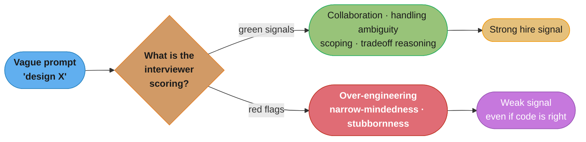
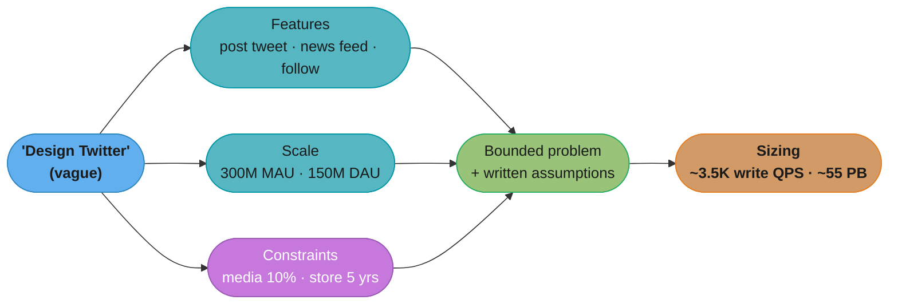
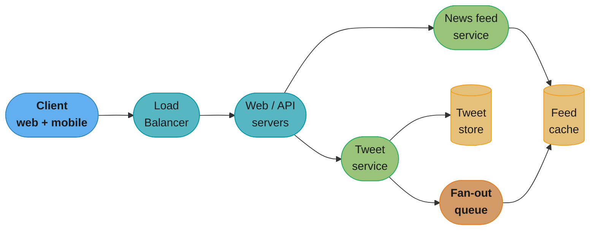
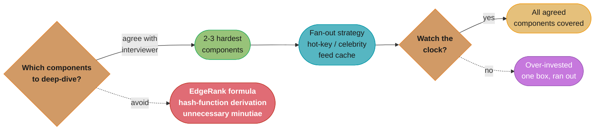
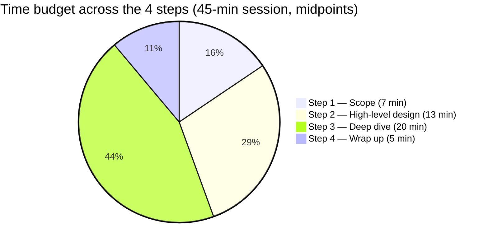
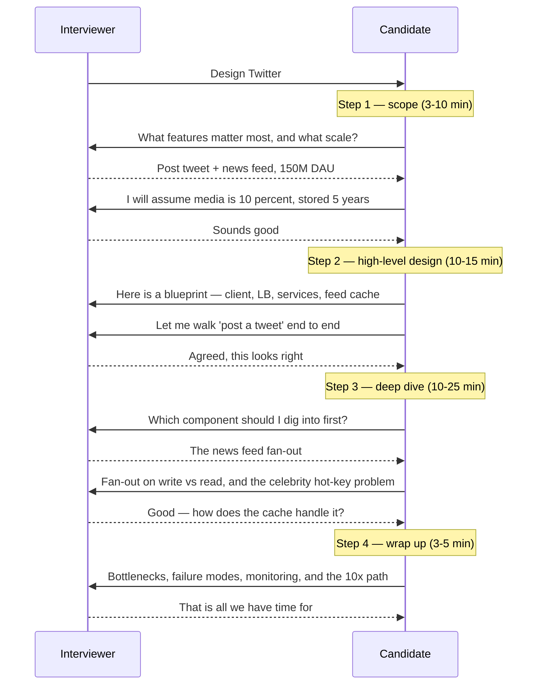
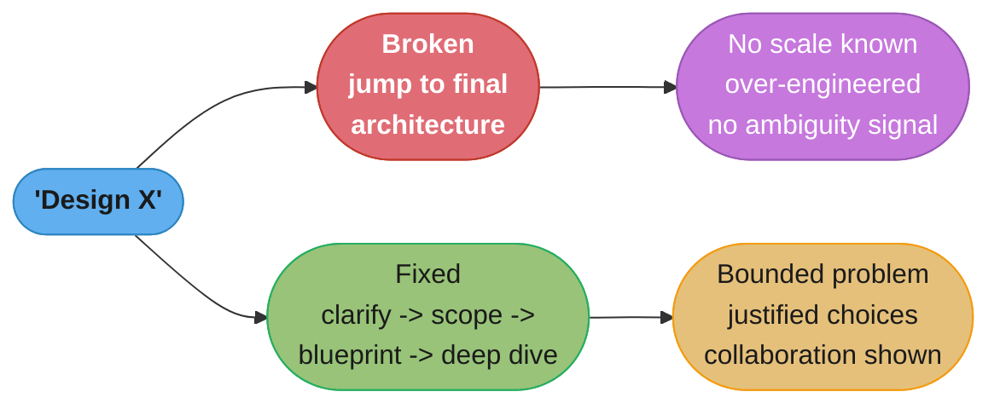

# Chapter 3: A Framework For System Design Interviews

> Ch 3 of 16 · System Design Interview Vol 1 (Xu) · builds on Ch 1–2, the 4-step spine every design chapter (Ch 4–15) follows

## Chapter Map

Chapters 1 and 2 gave you the *materials* — a toolbox of scaling building blocks (load
balancers, replication, caching, CDNs, sharding) and the arithmetic to size any of them on
the back of an envelope. This chapter gives you the *method*: a repeatable, four-step
conversation you run in every system design interview, turning a deliberately vague prompt
("design Twitter") into a defensible design in 45 minutes. The single most important idea is
that the interview is **not a quiz with a right answer** — it is a simulation of real,
ambiguous engineering work, and you are being scored on *how you think and collaborate*, not
on whether you happen to reproduce the "textbook" architecture.

**TL;DR:**
- A system design interview is an **open-ended, collaborative conversation** that simulates
  real-world problem solving; there is no single right answer, and the process reveals more
  signal than the final diagram.
- The **4-step framework** is: (1) understand the problem and establish scope, (2) propose a
  high-level design and get buy-in, (3) deep-dive on the 2–3 hardest components, (4) wrap up
  with bottlenecks, failure modes, and next steps.
- The **cardinal sin** is jumping straight to a solution before clarifying requirements —
  over-engineering, narrow-mindedness, and stubbornness are the red flags that fail
  candidates who otherwise know the material.
- On a **45-minute** clock the budget is roughly Step 1: 3–10 min · Step 2: 10–15 min ·
  Step 3: 10–25 min · Step 4: 3–5 min — Step 3 is where the interview is won or lost.

## The Big Question

> "You are handed a deliberately vague, open-ended problem ('design a news feed') with no
> single correct answer and 45 minutes on the clock. What repeatable *process* turns that
> ambiguity into a defensible design — and what is the interviewer actually watching while
> you do it?"

Analogy: the interview is a **mock design review with a senior teammate**, not an exam. If a
colleague dropped by your desk and said "we need to build rate limiting," you would not
silently draw the final architecture on the whiteboard and walk away. You would ask what
we're protecting, at what scale, with what constraints — then sketch a blueprint, argue the
tradeoffs together, and dig into the one or two parts that are genuinely hard. The framework
in this chapter is nothing more than that instinct, made explicit and time-boxed so you never
freeze on the blank-whiteboard moment.

---

## 3.1 What Is the System Design Interview Really Testing?

The chapter opens by dismantling the biggest misconception: that a system design interview
is a knowledge test where you recall the "correct" architecture for a famous system. It is
not. It is an **open-ended conversation** with no single right answer, engineered to look
like the ambiguous problems engineers solve every day. The interviewer expects you to *drive*
that conversation.

### What good signals look like

The interviewer is evaluating a small set of behaviours far more than the specific boxes you
draw:

- **Collaboration** — you treat the interviewer as a teammate, thinking aloud, bouncing ideas
  off them, and inviting feedback rather than performing a monologue.
- **Working under ambiguity** — you are comfortable with an under-specified problem and make
  the vagueness *productive* by asking targeted questions instead of freezing or guessing.
- **Resolving vagueness** — you convert "design Twitter" into a concrete, bounded problem
  with an explicit feature list, scale numbers, and stated assumptions before designing.
- **Tradeoff articulation** — for every non-trivial choice you can name the alternative and
  explain *why* you picked one over the other for *this* set of requirements. A design tuned
  for a young startup is legitimately different from one for a company with millions of users;
  demonstrating that you know the difference is the point.

### Red flags that fail otherwise-strong candidates

The book is blunt that plenty of technically capable engineers fail on process, not
knowledge. The three named red flags:

- **Over-engineering** — reaching for exotic, "cool" technology the requirements do not
  justify, gold-plating components, and ignoring cost/complexity. Engineers who love to
  over-engineer are unaware of the cost, and companies pay for it in system complexity.
- **Narrow-mindedness** — stubbornly defending one favourite approach, refusing to consider
  alternatives, and closing off the design space instead of exploring it.
- **Stubbornness** — arguing with the interviewer, refusing to adjust when given a hint or a
  new constraint, and being unable to take feedback. A good candidate updates; a poor one
  digs in.



Caption: the same technical answer can read as a strong or weak signal depending on the
*behaviours* around it — the interviewer is watching how you handle ambiguity and feedback at
least as closely as the architecture you produce.

---

## 3.2 Step 1 — Understand the Problem and Establish Design Scope

**Budget: ~3–10 minutes.** The book's most-repeated warning lives here: **do not jump
straight to an answer.** Answering a design question the way you would answer a trivia
question is a fast track to failure. Giving a fast, un-clarified answer is punished, not
rewarded — it signals you design without understanding requirements.

### Think before you speak; ask before you design

When the interviewer says "design a news feed system," your job is *not* to start drawing.
It is to slow down, think critically, and ask questions to nail down exactly what you are
building. Engineers tend to want to jump to the solution to show competence; resist it. The
right first move is a burst of **clarifying questions**.

There is no such thing as a dumb clarifying question here — asking is exactly the behaviour
being rewarded. The questions cluster into a few categories:

- **Features / scope** — What specific features are we building? What is the single most
  important feature? What is explicitly *out* of scope?
- **Scale / users** — How many users? How many daily active users (DAU)? What is the read vs
  write ratio? How much data, and how fast is it growing?
- **Speed of growth** — What will the scale look like in 3 months, 6 months, a year? Are we
  designing for today's load or the projected load?
- **Tech stack / constraints** — What is the existing technology stack? Are there services
  (a message queue, a cache cluster) we can reuse to simplify the design? Any hard latency,
  cost, or compliance constraints?

### Write down your assumptions

You will not get an answer to every question, and some answers are "you decide." When the
interviewer leaves something open, **make a reasonable assumption and write it down** on the
whiteboard. Stating assumptions explicitly does two things: it keeps you and the interviewer
aligned on what problem you are actually solving, and it gives the interviewer a chance to
correct a wrong assumption *before* you build ten minutes of design on top of it.

### The book's Twitter scoping example

The chapter walks a concrete dialogue for "design Twitter" to show what good clarification
sounds like. Reproduced here as a candidate–interviewer exchange:

> **Candidate:** Can you tell me what features are important?
> **Interviewer:** Ability to post a tweet and see the news feed (timeline).
>
> **Candidate:** Is the system a mobile app, a web app, or both?
> **Interviewer:** Both.
>
> **Candidate:** What is the most important set of use cases?
> **Interviewer:** Posting a tweet and viewing the news feed.
>
> **Candidate:** Do we need to support the follow feature (following other users)?
> **Interviewer:** Yes.
>
> **Candidate:** How many daily active users does the product have?
> **Interviewer:** 300 million monthly active users (MAU), and 50% of them use Twitter daily.
>
> **Candidate:** How many tweets does an average user post per day?
> **Interviewer:** 2 tweets per day on average.
>
> **Candidate:** Do we support media (photos, video) in a tweet?
> **Interviewer:** Yes — let's say 10% of tweets contain media.
>
> **Candidate:** Do we need to store the data, and for how long?
> **Interviewer:** Assume data is stored for 5 years.

From that dialogue the candidate has a bounded problem and enough numbers to size it with the
back-of-the-envelope habit from Chapter 2. Working the arithmetic out loud is exactly what the
interviewer wants to see:

- **DAU** = 300M MAU × 50% = **150 million DAU**.
- **Tweet write QPS** = 150M DAU × 2 tweets/day ÷ 86,400 s/day ≈ **3,500 tweets/second**.
- **Peak write QPS** ≈ 2× average ≈ **7,000 tweets/second**.
- **Media storage** — assume an average tweet is ~1 KB of text, and 10% of tweets carry
  ~1 MB of media. Media per day ≈ 150M × 2 × 10% × 1 MB ≈ **30 TB/day**; over 5 years that is
  30 TB × 365 × 5 ≈ **~55 PB** of media storage.

The exact numbers matter less than the *habit*: you converted "design Twitter" into a
handful of concrete magnitudes, and every downstream design decision (do we need a CDN? how
many database shards? fan-out on write or read?) now has a number behind it.



Caption: Step 1 is a funnel — a burst of clarifying questions plus written assumptions turns
an unbounded prompt into a bounded problem with concrete numbers that every later decision can
lean on.

---

## 3.3 Step 2 — Propose High-Level Design and Get Buy-In

**Budget: ~10–15 minutes.** Now you sketch a **blueprint** — a simple, end-to-end design at
the box-and-arrow level — and, crucially, you get the interviewer's agreement on it before
going deeper. The keyword is **buy-in**: you are not presenting a finished plan, you are
co-designing.

### Treat the interviewer as a teammate

The book stresses collaboration here. A good interviewer works *with* you like a teammate: as
you draw boxes, you talk through them, invite reactions, and adjust. Ask for their thoughts;
a subtle nod or a raised eyebrow is signal. This is where narrow-mindedness and stubbornness
get exposed or avoided — proposing multiple approaches and reasoning about which fits is the
collaborative move; defending one pet design against feedback is the failing one.

### Draw the blueprint: boxes and arrows first

Start with a small number of high-level components and the data flow between them: clients,
load balancer, web/API servers, the services, the databases and caches, and any queues. Keep
it deliberately coarse. The goal is a design you can walk end-to-end in a couple of minutes,
covering the important use cases you agreed on in Step 1.

### Do the back-of-the-envelope math — but only if it helps

The book says to do back-of-the-envelope estimation **only when it helps you shape the design**
— for example, to decide whether the read path needs a cache or a CDN, or whether the write
path needs sharding. Do not compute numbers for their own sake. Communicate with the
interviewer about whether the estimation is warranted; some interviewers care about it and
some do not, so ask.

### Walk through concrete use cases

With the boxes drawn, trace a couple of **concrete use cases** end-to-end through the
diagram. For Twitter that means literally following "user posts a tweet" and "user opens the
news feed" through each box. This grounds the abstract diagram, surfaces missing components
(where does fan-out happen? where is the timeline cached?), and lets the interviewer confirm
your mental model matches the requirements. Doing this often reveals edge cases you and the
interviewer then fold into the design.

### Should you include API endpoints and the data schema now?

The chapter's guidance is: **it depends, and it is a judgement call you should discuss.**
Sketching the key **API contracts** (e.g. `postTweet(userId, content)`,
`getNewsFeed(userId)`) and a rough **data schema** at this stage can make the high-level design
concrete and is often worth it. But going deep on every field and endpoint here risks burning
your time budget before the deep dive. The right move is to propose the level of detail and
let the interviewer steer: some want the API/schema early, others prefer to save it for
Step 3.



Caption: a Step-2 blueprint stays at the box-and-arrow level — enough to walk "post a tweet"
and "read the feed" end-to-end and get buy-in, without yet committing to the internals of any
single box.

---

## 3.4 Step 3 — Design Deep Dive

**Budget: ~10–25 minutes.** This is the longest and most important step. With a blueprint the
interviewer has bought into, you now **agree on priorities** and dig deep into the 2–3
components where the real difficulty lives.

### Agree on what to deep-dive — with the interviewer

Do not unilaterally decide what to zoom into. Ask the interviewer where they want depth, or
propose the components you think are most critical and confirm. The chapter is explicit that
the interviewer may have specific areas they want to probe, and steering *with* them is part
of the collaboration signal from 3.1. Typical deep-dive targets are the parts that are unique
or hard about *this* system — for Twitter, that is the news feed fan-out (fan-out on write vs
fan-out on read, the celebrity/hot-key problem, and the feed cache).

### Manage your time; don't drown in one component

Time management is a first-class skill here. It is easy to over-invest in one favourite
component and run out of clock before covering the others you agreed were important. Keep an
eye on the budget, cover the agreed set, and go deep enough to show tradeoff reasoning without
gold-plating.

### Don't get lost in unnecessary minutiae — the book's warning

The chapter's memorable example: if the interview is about **news feed system architecture**,
the interviewer is interested in how the feed is generated, stored, fanned out, and served —
they are **not** interested in you deriving the details of the **EdgeRank** ranking algorithm
(the feature-weighting formula that scores which posts appear). Spending your deep-dive time
re-deriving a ranking algorithm is exactly the "unnecessary minutiae" trap: it burns the
clock on a sub-problem that is not what the question is testing. Similarly, for a URL
shortener the hash-collision handling is worth a minute, but re-deriving a hash function from
scratch is not.

The rule: **go deep on the components that carry the system's hard tradeoffs, and stay
shallow on the ones that are standard or tangential.** Depth is a tool to demonstrate
tradeoff reasoning, not a chance to show off every algorithm you know.



Caption: the deep dive is a prioritisation exercise — pick the 2–3 components that carry the
hard tradeoffs, agree them with the interviewer, and consciously *skip* the tempting minutiae
(EdgeRank, hash-function derivations) that burn the clock without earning signal.

---

## 3.5 Step 4 — Wrap Up

**Budget: ~3–5 minutes.** You are **not done when you finish the design** — you are done when
the interviewer says you are done. The wrap-up is your chance to demonstrate the senior
instincts that separate a good design from a complete one. The book lists several things worth
doing, time permitting:

- **Identify bottlenecks and propose improvements.** Point at the parts of your own design
  that would break first under more load, and sketch how you would evolve them. Being able to
  critique your own design is a strong signal; there is always more to refine and no design is
  perfect.
- **Recap the design.** Briefly summarise the whole thing end-to-end. After a long deep dive
  this is genuinely useful — it refreshes the interviewer's memory and reasserts that you
  understand how the pieces fit.
- **Discuss error cases and failure modes.** What happens when a server dies, the network
  partitions, or a downstream service is slow? Naming failure handling shows production
  awareness.
- **Cover operational concerns.** How do you **monitor** the system — what metrics and error
  logs matter, and how do you **roll out** a change safely (canary, staged rollout)?
  Operations is where real systems live and it is easy to forget under interview pressure.
- **Propose the next scale-up.** How does the design evolve at the next order of magnitude
  (10× users)? Sketching the "what would you change at 10×" path shows you designed with
  growth in mind rather than for a single fixed point.

The wrap-up is short but high-leverage: it is where you convert "I drew a working design" into
"I think like an engineer who has operated systems in production."

---

## 3.6 Dos and Don'ts

The chapter closes with two explicit checklists. Reproduced in full.

### Dos

- **Always ask for clarification.** Do not assume your assumption is correct.
- **Understand the requirements** of the problem before designing.
- Remember there is **neither a single right answer nor a best answer.** A solution for a
  young startup differs from one for an established company with millions of users; make sure
  you understand the requirements.
- **Let the interviewer know what you are thinking.** Communicate — think out loud.
- **Suggest multiple approaches** if possible.
- Once you agree on the blueprint, **go into the details of each component, designing the most
  critical components first.**
- **Bounce ideas off the interviewer.** A good interviewer works with you as a teammate.
- **Never give up.**

### Don'ts

- **Don't be unprepared** for typical interview questions.
- **Don't jump into a solution** without clarifying the requirements and assumptions.
- **Don't go into too much detail on a single component at the beginning.** Give the
  high-level design first, then drill down.
- If you get stuck, **don't hesitate to ask for hints.**
- Again, **communicate — don't think in silence.**
- **Don't think the interview is done once you give the design.** You are not done until the
  interviewer says so. Ask for feedback early and often.

---

## 3.7 Time Allocation on Each Step

There is no rigid rule, but for a typical **45-minute** session the chapter offers a rough
budget. The point is proportion, not a stopwatch: Step 3 (the deep dive) should dominate, and
Step 1 must never sprawl at the expense of it.

| Step | Activity | Time (of 45 min) |
|------|----------|:---:|
| 1 | Understand the problem & establish design scope | ~3–10 min |
| 2 | Propose high-level design & get buy-in | ~10–15 min |
| 3 | Design deep dive | ~10–25 min |
| 4 | Wrap up | ~3–5 min |



Caption: using the midpoint of each range, the deep dive (Step 3) is the single largest slice
— roughly as much time as Steps 1 and 4 combined — which is why over-running Step 1 or a
single Step-3 component is the most common way to run out of clock.

---

## Visual Intuition

### The 4-step conversation, as an interviewer↔candidate exchange



Caption: the framework is fundamentally a *dialogue* — every step includes a hand-off back to
the interviewer (clarify, get buy-in, agree priorities, invite the final questions), which is
where the collaboration signal from 3.1 is earned turn by turn.

### Broken → fixed: the transcript that fails vs the one that passes

The single most common failure pattern is **jumping straight to a final architecture** in the
first thirty seconds. Contrast the two openings for the same prompt, "design a URL shortener":

**✗ Broken (dives straight to a solution):**

```
Interviewer: Design a URL shortener.
Candidate:   Sure. We'll use a base-62 encoding of an auto-increment ID,
             store it in a MySQL table, put Redis in front for reads, and
             front the whole thing with a CDN. Here's the schema...
             [starts drawing tables and indexes immediately]
```

Why it fails: no clarifying questions, so the candidate never learns the read/write ratio,
the scale, whether custom aliases or analytics are required, or the retention policy. They
have committed to specific technology (over-engineering: a CDN before knowing the read volume)
and closed the design space (narrow-mindedness), and they will defend it if challenged
(stubbornness). The interviewer has no way to see how the candidate handles ambiguity, because
the candidate erased the ambiguity by assumption.

**✓ Fixed (runs the framework):**

```
Interviewer: Design a URL shortener.
Candidate:   Before I design, let me clarify scope. What's the main use case —
             just shortening and redirecting, or also custom aliases and click
             analytics?
Interviewer: Shorten and redirect. Analytics is a nice-to-have.
Candidate:   What scale? Roughly how many new URLs per day, and what's the
             read-to-write ratio?
Interviewer: About 100 million new URLs/day, and reads dominate — call it 100:1.
Candidate:   And how long do links live — forever, or do they expire?
Interviewer: Assume 10 years.
Candidate:   Great. So this is a read-heavy system, ~1,160 writes/sec and
             ~116K reads/sec at 100:1. That tells me the read path needs heavy
             caching and the ID scheme needs to cover 100M/day x 365 x 10 -
             about 3.65 x 10^11 URLs, so a 7-character base-62 key (62^7 ~ 3.5
             x 10^12) is plenty. Let me sketch the blueprint and get your buy-in,
             then deep-dive the encoding and the cache.
```

Why it passes: the candidate resolved the vagueness (features, scale, retention), stated an
assumption and got it confirmed, used a back-of-the-envelope number to *justify* a design
choice (7-char key, cache-first read path), and explicitly signalled the next steps —
blueprint, buy-in, then deep dive. Same knowledge, completely different signal.



Caption: the difference between the failing and passing transcript is not knowledge — both
candidates know base-62 and caching — it is whether the first move is a *question* or an
*answer*.

---

## Key Concepts Glossary

- **System design interview** — an open-ended, collaborative conversation simulating real
  ambiguous engineering work; no single right answer.
- **4-step framework** — Understand & scope → High-level design & buy-in → Deep dive → Wrap
  up; the spine of every design chapter in the book.
- **Clarifying questions** — targeted questions (features, scale, growth, constraints) asked
  before designing to convert a vague prompt into a bounded problem.
- **Design scope** — the explicit, agreed boundary of what you are and are not building.
- **Assumptions** — reasonable stated guesses for anything the interviewer leaves open;
  written down so they can be corrected early.
- **DAU (daily active users)** — the daily-active subset of MAU; the base number most scale
  estimates start from.
- **Back-of-the-envelope estimation** — quick order-of-magnitude sizing (QPS, storage); used
  in Step 2 only when it shapes a design decision.
- **High-level design / blueprint** — a coarse box-and-arrow, end-to-end diagram of the main
  components and data flow.
- **Buy-in** — the interviewer's agreement on the blueprint before you go deeper;
  co-designing rather than presenting.
- **Concrete use case walk-through** — tracing a real request (e.g. "post a tweet") end-to-end
  through the diagram to validate it.
- **API contract / data schema** — endpoint signatures and table/field layout; sketch at
  Step 2 or 3 depending on the interviewer's preference.
- **Design deep dive** — the longest step; digging into the 2–3 components carrying the hard
  tradeoffs, chosen with the interviewer.
- **Priorities agreement** — jointly deciding which components deserve depth before diving in.
- **Unnecessary minutiae** — tangential detail (e.g. deriving EdgeRank, or a hash function)
  that burns time without testing what the question asks.
- **Wrap up** — the closing step: bottlenecks, recap, error cases, operations (monitoring,
  rollout), and the scale-up path.
- **Bottleneck** — the part of your own design that fails first under more load; naming it is
  a strong signal.
- **Operational concerns** — monitoring, metrics/logging, and safe rollout (canary/staged).
- **Over-engineering (red flag)** — reaching for exotic tech the requirements do not justify,
  unaware of the cost.
- **Narrow-mindedness (red flag)** — defending one approach and refusing to explore
  alternatives.
- **Stubbornness (red flag)** — arguing with the interviewer and not updating on feedback or
  hints.
- **Time budget** — the rough 45-minute allocation across the four steps; Step 3 dominates.

---

## Tradeoffs & Decision Tables

### The four steps at a glance

| Step | Goal | Key behaviour | Failure mode |
|------|------|---------------|--------------|
| 1 · Scope | Bound the problem | Ask clarifying questions, write assumptions | Jumping to a solution unclarified |
| 2 · High-level design | Agreed blueprint | Boxes/arrows, walk use cases, get buy-in | Deep-diving one box too early |
| 3 · Deep dive | Hard tradeoffs | Agree priorities, dig into 2–3 components | Drowning in minutiae, poor time mgmt |
| 4 · Wrap up | Show senior instincts | Bottlenecks, ops, scale-up, recap | Stopping when the design "looks done" |

### Signal vs red flag — same knowledge, opposite outcome

| Behaviour | Strong signal | Red flag |
|-----------|---------------|----------|
| First move | Ask clarifying questions | Draw the final architecture |
| Technology choice | Justified by a requirement/number | Exotic tech "because it's cool" (over-engineering) |
| Alternatives | Suggests multiple, compares | Defends one (narrow-mindedness) |
| Feedback / hints | Updates the design, asks for hints | Argues, refuses to adjust (stubbornness) |
| Communication | Thinks out loud, treats interviewer as teammate | Silent monologue |
| Ending | Bottlenecks, ops, next steps | "I'm done" after the diagram |

### When to include API/schema in Step 2 vs Step 3

| Situation | Put API/schema in… | Why |
|-----------|--------------------|-----|
| Interviewer asks for it early | Step 2 | Grounds the blueprint concretely |
| Data model *is* the hard part (e.g. a KV store) | Step 3 deep dive | Depth belongs where the difficulty is |
| Tight on time | Defer / keep minimal | Don't burn the budget before the deep dive |

---

## Common Pitfalls / War Stories

- **Jumping straight to a solution.** The signature failure: answering "design Twitter" like a
  trivia question by immediately drawing an architecture. Skips scope, hides your handling of
  ambiguity, and usually bakes in wrong assumptions. Fix: your first move is always a
  clarifying question.
- **Over-engineering to look impressive.** Reaching for Kafka, a CDN, a graph database, or
  sharding before any number justifies them. Interviewers read this as a candidate who does
  not weigh cost and complexity. Fix: introduce each component only when a requirement or an
  estimate calls for it.
- **Drowning in one component.** Spending fifteen of your deep-dive minutes on your favourite
  sub-problem (or re-deriving EdgeRank / a hash function) and never reaching the other agreed
  components. Fix: agree the 2–3 targets up front and watch the clock.
- **Designing in silence.** Thinking through the hard part without narrating leaves the
  interviewer with nothing to score and no chance to redirect you. Fix: think out loud
  constantly; a wrong idea spoken is better than a right idea kept silent.
- **Treating the diagram as the finish line.** Stopping the moment the boxes connect, skipping
  bottlenecks, failure modes, monitoring, and the scale-up path. Fix: budget 3–5 minutes for a
  real wrap-up; you are done when the interviewer says so.
- **Refusing hints or arguing.** When you are stuck, not asking for a hint (or worse, arguing
  against a correction) reads as stubbornness. Fix: ask for hints freely and update the design
  when given new information — adaptability is a scored behaviour.
- **One-size-fits-all designs.** Presenting the same "big company" architecture regardless of
  the stated scale. A startup-scale answer and a millions-of-users answer are both legitimate;
  matching the design to the *stated* requirements is the point.

---

## Real-World Systems Referenced

The chapter is a method chapter, so it references systems mainly as *example prompts* rather
than architectures to memorise: **Twitter** (the worked scoping dialogue in Step 1),
**news feed systems** and the **EdgeRank** ranking algorithm (the Step-3 "don't derive the
minutiae" example), and **URL shorteners** (a common warm-up prompt). Behind the scenes it
assumes the Chapter 1 toolbox — load balancers, database replication and sharding, caches,
CDNs, and message queues — as the vocabulary you draw the Step-2 blueprint from.

---

## Summary

A system design interview is an **open-ended, collaborative conversation** that simulates the
ambiguous, no-single-right-answer work engineers do daily. It is scored on process signals —
collaboration, comfort with ambiguity, scoping, and tradeoff reasoning — far more than on
which boxes you draw, and it is failed by three red flags: over-engineering,
narrow-mindedness, and stubbornness. The chapter's answer to the ambiguity is a repeatable
**4-step framework**. **Step 1 (Understand & scope, ~3–10 min):** resist jumping to a
solution; ask clarifying questions about features, scale, growth, and constraints, and write
down your assumptions — the Twitter dialogue turns "design Twitter" into 150M DAU, ~3,500
write QPS, and a 5-year retention target. **Step 2 (High-level design & buy-in, ~10–15 min):**
draw a coarse box-and-arrow blueprint, walk concrete use cases through it, do
back-of-the-envelope math only when it shapes a decision, and get the interviewer's agreement
before going deeper. **Step 3 (Deep dive, ~10–25 min):** agree priorities with the
interviewer, dig into the 2–3 components carrying the hard tradeoffs, manage your time, and
avoid unnecessary minutiae (don't derive EdgeRank when feed architecture is the question).
**Step 4 (Wrap up, ~3–5 min):** identify bottlenecks, recap, discuss error cases and
operational concerns (monitoring, rollout), and sketch the next scale-up. The **Dos and
Don'ts** distil it: always clarify, communicate constantly, suggest multiple approaches, and
never assume the interview is over until the interviewer says so. On a 45-minute clock the
**deep dive dominates the budget**, so the two ways candidates most often run out of time are
letting Step 1 sprawl or drowning in one Step-3 component.

---

## Interview Questions

**Q: What is the single biggest mistake candidates make in a system design interview?**
Jumping straight to a solution without clarifying the requirements first. The prompt ("design Twitter") is deliberately vague, and answering it like a trivia question skips scoping, hides how you handle ambiguity, and usually bakes in wrong assumptions. Your first move should always be a burst of clarifying questions about features, scale, growth, and constraints — asking is the behaviour being rewarded, not a sign of weakness.

**Q: What is a system design interview actually testing, if not the "right" architecture?**
It tests process signals — collaboration, comfort with ambiguity, scoping ability, and tradeoff articulation — because there is no single right answer. The interviewer watches how you convert a vague prompt into a bounded problem, whether you reason about alternatives, and whether you treat them as a teammate. The final diagram matters far less than the thinking and communication that produced it.

**Q: What are the three red flags that fail otherwise-capable candidates?**
Over-engineering, narrow-mindedness, and stubbornness. Over-engineering is reaching for exotic technology the requirements do not justify, unaware of the cost. Narrow-mindedness is defending one favourite approach and refusing to explore alternatives. Stubbornness is arguing with the interviewer and failing to update the design when given a hint or new constraint. All three are behavioural, not technical, and they sink candidates who know the material.

**Q: What are the four steps of the framework, in order?**
Step 1: understand the problem and establish design scope. Step 2: propose a high-level design and get buy-in. Step 3: design deep dive. Step 4: wrap up. Steps 1 and 2 bound and blueprint the problem, Step 3 is the longest and covers the hard tradeoffs, and Step 4 shows senior instincts like bottlenecks and operations. Every design chapter in the book (Ch 4–15) follows this same spine.

**Q: Why is "get buy-in" a distinct goal of Step 2 rather than just drawing a design?**
Because system design is collaborative, and agreeing on the blueprint before deep-diving prevents you from building ten minutes of detail on a design the interviewer would have redirected. You draw a coarse box-and-arrow diagram, walk concrete use cases through it, and explicitly ask for the interviewer's reaction. Treating them as a teammate and co-designing is itself a scored signal; presenting a finished plan is not.

**Q: How should you handle a question the interviewer won't give you a firm answer to?**
Make a reasonable assumption, state it out loud, and write it on the whiteboard. This keeps you and the interviewer aligned on what problem you are actually solving and gives them a chance to correct a wrong assumption before you build on it. Explicit assumptions are a strength; silent ones are a trap because the whole design may rest on a premise the interviewer never agreed to.

**Q: In Step 3, the book warns against "unnecessary minutiae" — what's the example?**
Don't derive the EdgeRank ranking algorithm when the question is about news feed architecture. The interviewer wants to see how the feed is generated, stored, fanned out, and served — not the feature-weighting formula that ranks posts. Spending deep-dive time re-deriving a ranking algorithm (or a hash function for a URL shortener) burns the clock on a sub-problem the question is not testing.

**Q: How do you decide which components to deep-dive in Step 3?**
Agree the priorities with the interviewer rather than deciding unilaterally — either ask where they want depth or propose the 2–3 most critical components and confirm. The right targets are the parts that carry the system's hard tradeoffs (for Twitter, the news feed fan-out and the celebrity hot-key problem), not the standard or tangential ones. Steering with the interviewer is part of the collaboration signal.

**Q: Why is the wrap-up (Step 4) important when the design already works?**
Because you are not done when the design works — you are done when the interviewer says so, and the wrap-up is where you show senior instincts. You identify bottlenecks in your own design, recap it end-to-end, discuss error cases, cover operational concerns like monitoring and safe rollout, and sketch how it evolves at 10× scale. Being able to critique your own design and think operationally is a strong differentiator.

**Q: How should time be allocated across the four steps in a 45-minute interview?**
Roughly Step 1: 3–10 min, Step 2: 10–15 min, Step 3: 10–25 min, Step 4: 3–5 min. The deep dive should dominate the budget, so the two most common ways to run out of time are letting Step 1 sprawl or over-investing in a single Step-3 component. The numbers are proportions, not a stopwatch — the point is that Step 3 is where the interview is won or lost.

**Q: When should you include API endpoints and the data schema — Step 2 or Step 3?**
It depends, and you should propose a level and let the interviewer steer. Sketching key API contracts and a rough schema in Step 2 can make the blueprint concrete, but going deep on every field risks burning your budget before the deep dive. If the data model is itself the hard part (e.g. a key-value store), it belongs in the Step-3 deep dive; if you're tight on time, keep it minimal.

**Q: When should you do back-of-the-envelope estimation during the interview?**
Only when it helps shape a design decision, and after checking whether the interviewer cares about it. Use it to justify choices — whether the read path needs a cache/CDN, whether the write path needs sharding, or how many characters a key needs — not to compute numbers for their own sake. Some interviewers weight estimation heavily and some do not, so ask rather than assume.

**Q: Why does the book say there is "neither a right answer nor a best answer"?**
Because the correct design depends entirely on the requirements, and a solution for a young startup legitimately differs from one for a company with millions of users. Presenting a single "big company" architecture regardless of the stated scale is a mistake; matching the design to the actual requirements is the skill. This is also why clarifying scope in Step 1 is non-negotiable — without it you cannot know which answer is right for this problem.

**Q: Walk through the Twitter scoping numbers the chapter derives.**
From 300M monthly active users with 50% daily use you get 150M DAU; at 2 tweets per user per day that's ~3,500 tweet writes/second on average and ~7,000/second at peak. Assuming ~1 KB text and 10% of tweets carrying ~1 MB media gives ~30 TB of media per day, or roughly 55 PB over the 5-year retention window. The exact figures matter less than the habit of turning a vague prompt into concrete magnitudes every later decision can lean on.

**Q: What should you do when you get stuck during the interview?**
Ask for a hint — the book explicitly says don't hesitate to do so — and keep communicating out loud rather than thinking in silence. Getting stuck is normal; refusing help or going quiet is what reads badly. Continuing to talk through your reasoning lets the interviewer redirect you, and treating a hint as useful information to update on (rather than something to argue against) is the opposite of the stubbornness red flag.

**Q: What does "treat the interviewer as a teammate" mean in practice?**
It means thinking out loud, bouncing ideas off them, inviting reactions to your blueprint, and adjusting based on their feedback — co-designing rather than performing a monologue. A good interviewer works with you like a colleague at a design review, so a subtle nod or a follow-up question is signal to use. This collaborative behaviour is scored directly and is the antidote to the narrow-mindedness and stubbornness red flags.

**Q: List the book's "Dos" for a system design interview.**
Always ask for clarification and don't assume your assumption is correct; understand the requirements; remember there's no single right or best answer; let the interviewer know what you're thinking; suggest multiple approaches; after agreeing on the blueprint, detail the most critical components first; bounce ideas off the interviewer as a teammate; and never give up. The through-line is clarify, communicate, and collaborate.

**Q: List the book's "Don'ts" for a system design interview.**
Don't be unprepared for typical questions; don't jump into a solution without clarifying requirements; don't go into too much detail on a single component early; don't hesitate to ask for hints when stuck; don't think in silence; and don't assume the interview is done once you give the design — you're not done until the interviewer says so. Most reduce to the same failure: designing before scoping, or communicating too little.

**Q: Why should you walk through concrete use cases in Step 2?**
Because tracing a real request (like "post a tweet" or "open the news feed") end-to-end through your box-and-arrow diagram grounds the abstract design and surfaces missing components — where fan-out happens, where the timeline is cached. It also lets the interviewer confirm your mental model matches the requirements and often reveals edge cases you then fold in. It's the cheapest way to validate a blueprint before committing deep-dive time to it.

**Q: How is over-engineering different from a genuinely ambitious design?**
Over-engineering introduces complexity the requirements don't justify — a CDN before you know the read volume, sharding before any number demands it — and signals a candidate unaware of cost and complexity. An ambitious-but-appropriate design introduces each component only when a stated requirement or an estimate calls for it. The tell is justification: every piece of a strong design traces back to a requirement or a number, whereas over-engineering adds pieces "because they're impressive."

**Q: Why is designing in silence a problem even if your final design is correct?**
Because the interview scores your reasoning and communication, not just the end diagram, and silence leaves the interviewer nothing to evaluate and no opening to redirect you. A wrong idea spoken aloud is more useful than a right idea kept internal, because the interviewer can course-correct the former. Communication is repeated in the Dos, the Don'ts, and the red flags precisely because it is the highest-leverage habit in the whole framework.

---

## Cross-links in this repo

- [hld/ — the system design concepts index (load balancing, caching, sharding, CAP) this framework draws its building blocks from](../../../hld/README.md)
- [Ch 4 · Design a Rate Limiter — the first chapter that applies this 4-step framework end-to-end](../04_design_a_rate_limiter/README.md)
- [Ch 2 · Back-of-the-Envelope Estimation — the sizing habit Step 1 and Step 2 lean on](../02_back_of_the_envelope_estimation/README.md)
- [Ch 1 · Scale From Zero to Millions — the toolbox you draw the Step-2 blueprint from](../01_scale_from_zero_to_millions_of_users/README.md)
- [ml/ml_interview_patterns/ — the ML-system-design counterpart to this framework](../../../ml/ml_interview_patterns/README.md)
- [cs_fundamentals/dsa_patterns/ — the coding-round counterpart: a pattern-recognition framework for the algorithm interview](../../../cs_fundamentals/dsa_patterns/README.md)

## Further Reading

- Xu, *System Design Interview — An Insider's Guide, Vol. 1*, Ch 3 — original text, the Dos/Don'ts lists, and the Twitter scoping dialogue.
- Xu, Ch 1 (Scale From Zero to Millions) and Ch 2 (Back-of-the-Envelope Estimation) — the toolbox and estimation habit this framework assumes.
- Grokking the System Design Interview (educative.io) — an alternative step-by-step framing of the same interview process.
- "The System Design Interview" — common industry write-ups on interviewer scoring rubrics and red flags, consistent with the collaboration/ambiguity signals in this chapter.
