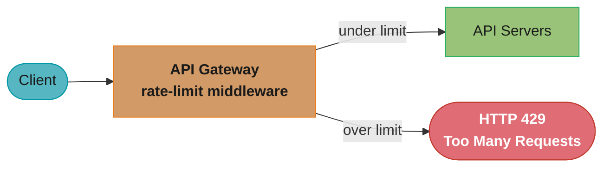
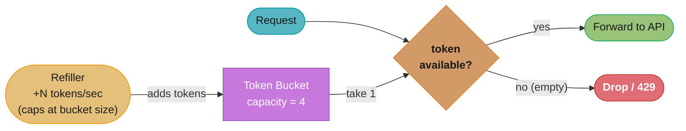
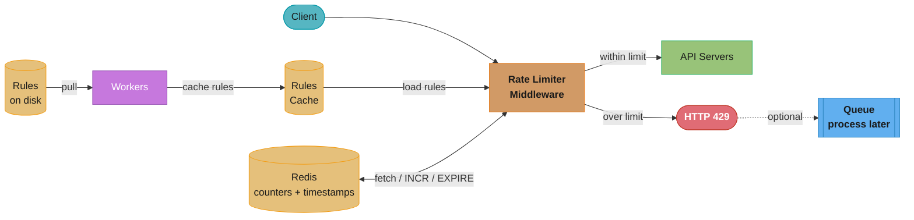
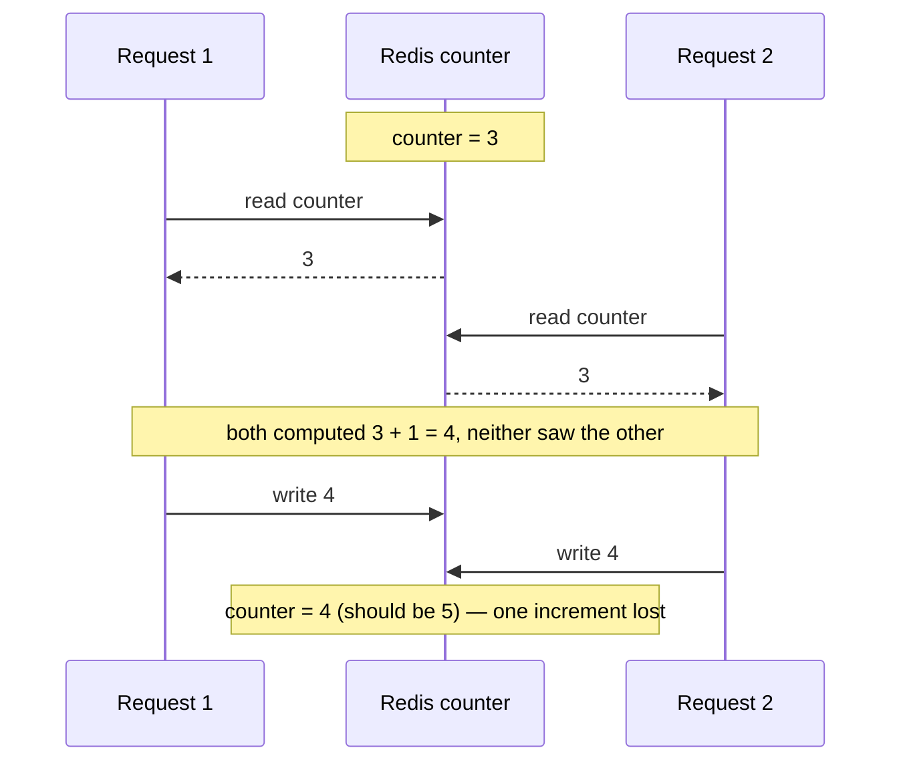
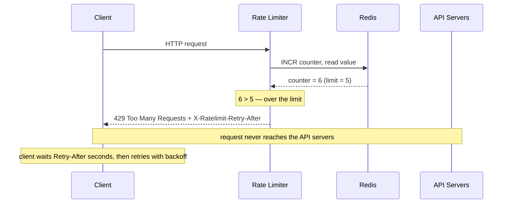
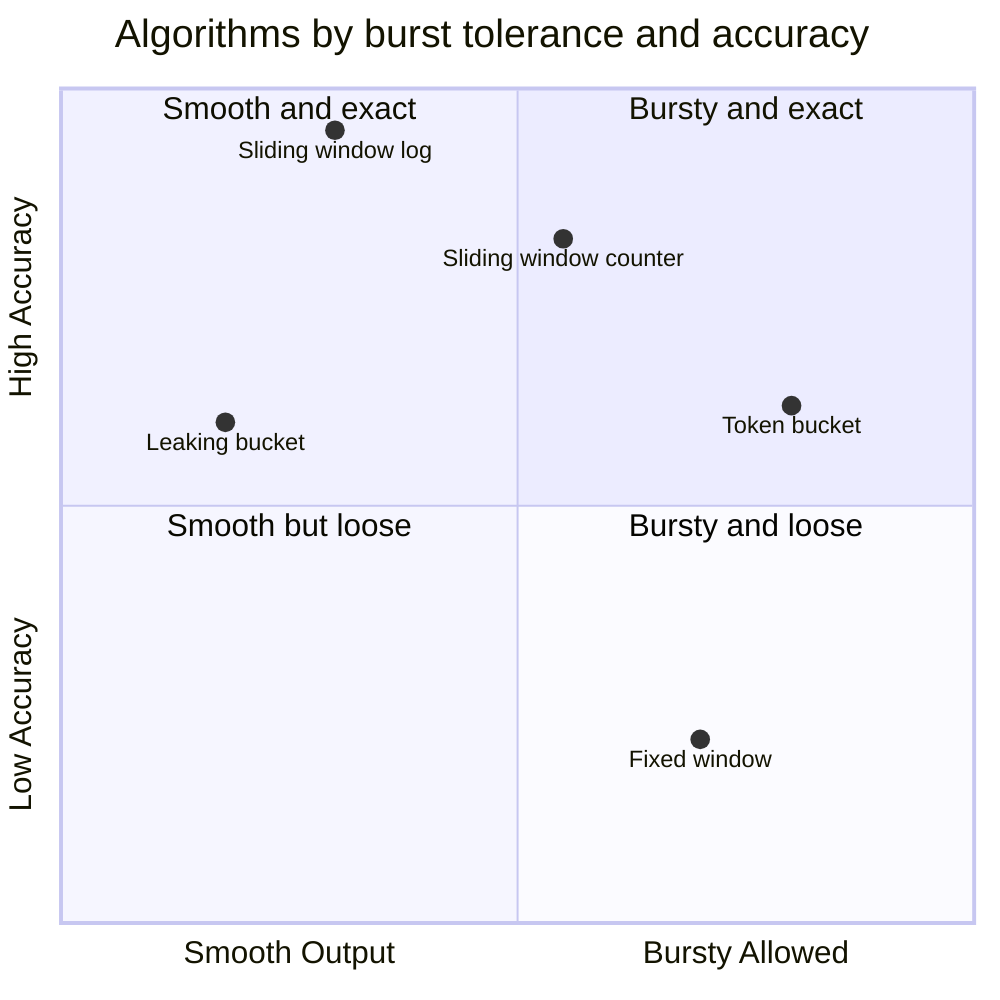

# Chapter 4: Design A Rate Limiter

> Ch 4 of 16 · System Design Interview Vol 1 (Xu) · builds on Ch 3, the first worked design; its algorithms reappear in Ch 10–11

## Chapter Map

This is the book's **first full worked design**, and Xu deliberately picks a small, self-contained
problem to rehearse the 4-step framework from Chapter 3 before the harder chapters. A rate limiter
controls the rate of traffic a client (or IP, or user) may send to a service — for example "no more
than 2 requests per second" — and rejects everything above the quota, typically with HTTP `429 Too
Many Requests`. The chapter's real payload is the **five throttling algorithms** and the
**distributed-counter problems** (race conditions and synchronization) that recur in almost every
later design that meters traffic: the notification fan-out of Chapter 10 and the news-feed
pull/push of Chapter 11 both assume you can meter and shed load.

**TL;DR:**
- **Where** it lives matters: client-side is forgeable and useless; put it **server-side** or, in a
  microservice stack, **inside the API gateway** as middleware.
- **Five algorithms**, each a burst-vs-smoothness / accuracy-vs-memory tradeoff: **token bucket**
  (allows bursts; Amazon, Stripe), **leaking bucket** (constant outflow via a FIFO queue; Shopify),
  **fixed window counter** (simple but leaks **2× the limit** at window edges), **sliding window
  log** (exact but memory-heavy; Redis sorted sets), and **sliding window counter** (a weighted
  hybrid; Cloudflare measured only **0.003%** error).
- **Counters live in Redis** (`INCR` + `EXPIRE`), never a disk database — but concurrency creates a
  **race condition** on the counter (fix with a Lua script or a sorted set, not slow locks) and a
  **synchronization** problem across many limiter servers (fix with a centralized Redis, not sticky
  sessions).
- **Wrap-up extras** interviewers love: **hard vs soft** limiting, rate limiting at **other OSI
  layers** (L7 app vs L3 `iptables`), and **client best practices** (cache, understand limits,
  catch exceptions, back off on retry).

## The Big Question

> "A single misbehaving client — a runaway script, a scraper, a denial-of-service bot, or just a
> retry storm — can consume all of a service's capacity and starve every legitimate user. How do I
> put a governor on incoming traffic that is accurate, cheap in memory, adds no latency, works
> across a fleet of servers, and tells the caller clearly when it has been throttled?"

Analogy: a rate limiter is the **turnstile at a subway station**. It lets people through at a
controlled pace, and when the platform is full it holds the rest back rather than letting the
crowd crush onto the tracks. The whole chapter is about *which* turnstile mechanism to use — one
that allows a quick burst when the platform is empty (token bucket), one that admits people at a
strictly even pace (leaking bucket), or one that counts heads per minute (window counters) — and
how to make many turnstiles agree on a single shared count.

---

## 4.1 Step 1 — Understand the Problem and Establish Design Scope

Rate limiting means many different things, so the first job is to narrow scope through the
candidate–interviewer dialogue the book scripts out.

**The clarifying dialogue (paraphrased from the book):**

| Candidate asks | Interviewer answers |
|----------------|---------------------|
| Client-side or server-side rate limiter? | **Server-side** API rate limiter. |
| Throttle by IP, user ID, or other properties? | It should be **flexible** to support different sets of throttle rules. |
| Scale of the system? | Must handle a **large number of requests**. |
| Will it work in a distributed environment? | **Yes.** |
| A separate service or implemented in application code? | **Your design decision.** |
| Do we inform throttled users? | **Yes.** |

From that dialogue the requirements crystallize:

- **Accurately limit excessive requests** — the core function.
- **Low latency** — the rate limiter sits on the request path and must not slow down HTTP response
  time.
- **Use as little memory as possible.**
- **Distributed rate limiting** — one shared limit across multiple servers and processes.
- **Exception handling** — show a clear exception to the user when a request is throttled.
- **High fault tolerance** — if the rate limiter goes down (e.g. a cache server dies), it must not
  take the whole system down with it.

### Benefits of rate limiting — why bother

The book gives three concrete reasons a public API needs a rate limiter, and an interviewer expects
you to name all three:

- **Prevent resource starvation caused by a Denial-of-Service (DoS) attack.** Blocking the excess
  calls — whether from an intentional attack or an accidental retry storm — keeps a single caller
  from consuming all capacity. Big APIs advertise their limits: **Twitter** caps ~300 tweets per
  3 hours; **Google Docs** APIs cap ~300 read requests per user per 60 seconds per operation. Many
  DoS incidents are prevented by rate limiting alone.
- **Reduce cost.** Fewer wasted requests means fewer servers, and it lets you allocate more capacity
  to high-priority APIs. This matters enormously when your service calls **paid third-party APIs**
  billed per call — checking a credit score, making a payment, retrieving health records — where
  every excess call is real money.
- **Prevent servers from being overloaded.** A rate limiter filters out excess requests caused by
  bots or misbehaving users so real load stays within capacity.

---

## 4.2 Step 2 — Propose High-Level Design and Get Buy-In

Keep the first design simple: a basic client–server model with the limiter as a piece of
middleware. Before choosing an algorithm, decide *where* the limiter goes.

### Where to put the rate limiter — client vs server vs middleware

Three placements, with the book's guidance:

- **Client-side** — a bad idea in general. Client requests can be **forged by malicious actors**,
  and you often have **no control over the client implementation**, so a client-side limit is
  trivial to bypass. Not enforceable.
- **Server-side** — a rate limiter component runs on the API server itself. Reliable and fully
  under your control.
- **Middleware** — a separate rate-limiter middleware that throttles requests *before* they reach
  your API servers. In practice this is usually the **API gateway**: a fully managed service that
  supports rate limiting along with SSL termination, authentication, IP whitelisting, and serving
  static content. Example: with a limit of 2 requests/second, the 3rd request in that second is
  throttled with HTTP `429`.

**How to choose — the book's guidelines** (there is no single correct answer; it depends on your
tech stack, engineering resources, and priorities):

- **Evaluate your current tech stack** — programming language, cache service. Make sure your
  current language is efficient enough to implement rate limiting on the server side.
- **Identify a rate-limiting algorithm that fits your needs.** Implementing it yourself server-side
  gives you **full control** of the algorithm; using a third-party gateway usually gives you
  **limited choices**.
- **If you already run a microservice architecture with an API gateway** doing authentication and
  IP whitelisting, adding the rate limiter to that gateway is natural.
- **Building your own rate-limiting service takes time.** If you lack the engineering resources, a
  **commercial API gateway** is a faster option.



Caption: the middleware / API-gateway placement — the limiter is a checkpoint in front of the API
servers, forwarding requests under the limit and rejecting the rest with `429` before they ever
reach application code.

Now the heart of the chapter: the algorithm running inside that checkpoint. Five are covered.

### Token bucket

A **token bucket** is a container of pre-defined capacity. Tokens are refilled into it at a preset
rate; once the bucket is full, extra tokens **overflow** and are discarded. Each request consumes
one token: when a request arrives, if the bucket has at least one token, take one out and let the
request through; if the bucket is empty, **drop** the request.

**Two parameters:**
- **Bucket size** — the maximum number of tokens allowed in the bucket.
- **Refill rate** — number of tokens added to the bucket per second.

**How many buckets?** It depends on the rate-limiting rules:
- It is common to have **different buckets for different API endpoints.** If a user may make 1 post
  per second, add 150 friends per day, and like 5 posts per second, that's **3 buckets per user**.
- To throttle by **IP address**, each IP needs its own bucket.
- If the system allows 10,000 requests/second globally, a single **global bucket** shared by all
  requests makes sense.

**Pros:** easy to implement; **memory efficient**; **allows a burst** of traffic for short periods —
a request goes through as long as tokens remain, so a client that has been quiet can spend its
accumulated tokens quickly.
**Cons:** the two parameters (bucket size and refill rate) can be **challenging to tune** correctly.

**Who uses it:** **Amazon** and **Stripe** use token bucket to throttle their API requests.



Caption: each request removes one token; when the bucket empties the request is dropped — but a
client that saved up tokens can burst through several at once, which is exactly the "allows bursts"
property that makes token bucket the default for public APIs.

### Leaking bucket

The **leaking bucket** is similar to the token bucket except requests are processed at a **fixed
rate**. It is usually implemented with a **FIFO queue**. When a request arrives, check whether the
queue is full: if not full, add the request to the queue; if full, **drop** the request. Requests
are then pulled from the queue and processed at regular intervals.

**Two parameters:**
- **Bucket size** — the queue size; equals the number of requests it can hold.
- **Outflow rate** — how many requests are processed at a fixed rate, usually per second.

**Pros:** **memory efficient** given the limited queue size; requests are processed at a **stable,
constant outflow rate**, which suits use cases that need a steady output (e.g. a downstream system
that can only handle a fixed throughput).
**Cons:** a burst of traffic **fills the queue with old requests**, and if they are not processed
in time, **recent requests get rate limited**. The two parameters are also **not easy to tune**.

**Who uses it:** **Shopify** uses leaking bucket for rate limiting.

The contrast with token bucket is the exam-favorite: **token bucket smooths nothing and lets bursts
through** (tokens accumulate), whereas **leaking bucket enforces a smooth constant output** (the
queue drains at a fixed rate no matter how bursty the arrivals).

### Fixed window counter

The **fixed window counter** divides the timeline into fixed-size windows and assigns a **counter**
to each window. Each request increments the counter by one; once the counter reaches the threshold,
new requests in that window are **dropped** until the next window begins.

**The edge-burst problem — show the arithmetic.** The major flaw is that a spike at the **edges of
two adjacent windows** can let through up to **twice the allowed quota**. Take a limit of **5
requests per minute**, with quotas resetting at round minute boundaries:

- In the window `2:00:00 – 2:01:00`, five requests all arrive in the *second half*, between
  `2:00:30` and `2:01:00`. All 5 are allowed — the window's quota is exactly filled.
- At `2:01:00` the counter **resets**. In the window `2:01:00 – 2:02:00`, five more requests arrive
  in the *first half*, between `2:01:00` and `2:01:30`. All 5 are allowed.
- Now slide a 60-second window from `2:00:30` to `2:01:30`: it contains **all 10 requests** — `2×`
  the limit of 5 — even though neither fixed window individually exceeded its quota.

**Pros:** memory efficient; easy to understand; resetting the quota at the end of each unit window
fits some use cases.
**Cons:** the spike of traffic at window edges can let through **more requests than the quota**, as
the arithmetic above shows.

### Sliding window log

The **sliding window log** fixes the edge-burst problem by tracking **request timestamps** rather
than a bucketed count. Timestamps are usually kept in a cache — for example **Redis sorted sets**.
The algorithm on each new request:

1. **Remove outdated timestamps** — every timestamp older than the start of the current window
   (`now − window`) is evicted.
2. **Add** the new request's timestamp to the log.
3. **Compare** the log size against the allowed count: if the log size is **≤ the allowed count**,
   accept; otherwise, **reject** — but the timestamp is still added to the log.

**Worked example (limit = 2 requests/minute):**

| Time | Action | Log after | Decision |
|------|--------|-----------|----------|
| `1:00:01` | log empty → insert | `[1:00:01]` | **allow** (size 1 ≤ 2) |
| `1:00:30` | insert | `[1:00:01, 1:00:30]` | **allow** (size 2 ≤ 2) |
| `1:00:50` | insert | `[1:00:01, 1:00:30, 1:00:50]` | **reject** (size 3 > 2; timestamp stays) |
| `1:01:40` | evict < `1:00:40` (drops `1:00:01`, `1:00:30`), insert | `[1:00:50, 1:01:40]` | **allow** (size 2 ≤ 2) |

**Pros:** **very accurate** — in any rolling window, the number of requests never exceeds the rate
limit.
**Cons:** consumes **a lot of memory**, because even a **rejected** request's timestamp is stored
in the log (until it ages out).

### Sliding window counter

The **sliding window counter** is a **hybrid** of the fixed window counter and the sliding window
log: it smooths the fixed window's edge burst without the log's memory cost, by *weighting* the
previous window's count by how much of it still overlaps the rolling window.

**The formula:**

```
requests in rolling window
  = requests in current window
  + requests in previous window × (overlap % of previous window with the rolling window)
```

**Worked example.** Limit = **5 requests per minute**. The previous minute saw **5** requests, the
current minute so far has **3**, and a new request arrives **30% of the way into** the current
minute (so the rolling 60-second window overlaps the previous window by `1 − 0.30 = 70%`):

```
estimate = 3 + 5 × 0.70 = 3 + 3.5 = 6.5 requests
6.5 > 5  →  REJECT the new request
```

Because `6.5` exceeds the limit of 5, this request is **rejected**. (Depending on the use case you
round the estimate up or down; here even the raw `6.5` is over the limit.)

**How good is the approximation?** It assumes requests in the previous window are **evenly
distributed**, which isn't strictly true — so it is an estimate, not an exact count. But
**Cloudflare** ran the experiment on ~**400 million requests** and found only **0.003%** were
wrongly allowed or wrongly rejected. In practice the approximation is excellent.

**Pros:** **smooths out spikes** because the rate is based on the average of the previous window;
**memory efficient**.
**Cons:** only works for a **not-too-strict look-back window**, since it is an approximation of the
actual rate — but as Cloudflare's `0.003%` shows, the error is negligible.

### High-level architecture — counters in Redis

The core of any counter-based limiter is, unsurprisingly, a **counter**: track how many requests
come from the same user / IP / key, and if the counter exceeds the limit, disallow the request.

**Where do the counters live?** Not a disk database — disk access is **too slow**. The choice is an
**in-memory cache**, because it is fast and supports a **time-based expiration** strategy. **Redis**
is the popular option, using two commands:

- **`INCR`** — increments the stored counter by 1.
- **`EXPIRE`** — sets a timeout on the counter; when it expires, the counter is automatically
  deleted.

**Workflow:**
1. The client sends a request to the **rate-limiting middleware**.
2. The middleware fetches the counter from the corresponding **bucket key** in Redis and checks
   whether the limit is reached.
3. If the limit **is** reached, the request is **rejected**.
4. If the limit is **not** reached, the request is forwarded to the API servers, and meanwhile the
   middleware **increments** the counter (`INCR`) and stores it back in Redis.

---

## 4.3 Step 3 — Design Deep Dive

The high-level design leaves two questions unanswered, and this is where an interviewer probes:
**How are the rate-limiting rules created, and where are they stored? How do we handle requests
that get rate limited?**

### Rate limiting rules

Rules are generally written in **configuration files and saved on disk**. The book uses **Lyft's
open-source rate-limiting component** for the config format. A rule capping marketing messages:

```yaml
domain: messaging
descriptors:
  - key: message_type
    value: marketing
    rate_limit:
      unit: day
      requests_per_unit: 5
```

This configures the system to allow a **maximum of 5 marketing messages per day**. Another example
caps login attempts to fight credential-stuffing:

```yaml
domain: auth
descriptors:
  - key: auth_type
    value: login
    rate_limit:
      unit: minute
      requests_per_unit: 5
```

That is **no more than 5 login attempts per minute**.

### Handling exceeded requests — 429 and rate-limiter headers

When a request is throttled, the API returns HTTP status **`429 Too Many Requests`** to the client.
Depending on the use case you may instead **enqueue** the rate-limited requests to be processed
later — for example, if some orders are throttled because the system is overloaded, you might keep
those orders in a queue and process them once capacity frees up (rather than losing them).

**How does the client know it is being throttled, and how much headroom it has left?** Through HTTP
**rate-limiter response headers:**

| Header | Meaning |
|--------|---------|
| `X-Ratelimit-Remaining` | The remaining number of allowed requests within the current window. |
| `X-Ratelimit-Limit` | How many calls the client may make per time window. |
| `X-Ratelimit-Retry-After` | The number of seconds to wait before making a request again without being throttled. |

When a user has sent too many requests, the server returns **`429 Too Many Requests`** together
with the **`X-Ratelimit-Retry-After`** header so the client knows how long to back off.

### Detailed design

Putting the pieces together:

- **Rules are stored on disk.** **Workers** frequently pull the rules from disk and cache them.
- When a client sends a request, it goes to the **rate-limiter middleware** first.
- The middleware **loads the rules from the cache**, and **fetches the counter and last-request
  timestamp from Redis.** Based on the response it decides:
  - If the request is **not** rate limited → forward it to the **API servers**.
  - If the request **is** rate limited → return **`429`** to the client; meanwhile the request is
    either **dropped** or forwarded to a **queue** for later processing.



Caption: the end-to-end design — rules flow disk → workers → cache → middleware, while counters live
in Redis; the middleware is the single decision point that either forwards to the API servers or
returns `429` (optionally parking the request in a queue). This is the picture to draw on the
whiteboard.

### Rate limiter in a distributed environment

Scaling the limiter to millions of users raises **two hard problems**: a **race condition** on the
counter and **synchronization** across many limiter servers.

#### Race condition — the broken sequence, then the fixes

The counter logic is read → check → increment:

1. Read the counter value from Redis.
2. Check whether `counter + 1` exceeds the threshold.
3. If not, increment the counter by 1 in Redis and write it back.

In a **highly concurrent** environment this **read-modify-write is not atomic**. Suppose the counter
in Redis is `3`. If **two requests concurrently read** the counter (both see `3`) *before* either
writes back, each increments its own local copy to `4` and writes `4` back — so the stored counter
ends at **4 when it should be 5**. One request was silently under-counted, and the limit can be
exceeded.



Caption: the lost-update race — because two requests read `3` before either writes, both write `4`
and one increment vanishes, so the limiter under-counts and lets excess traffic through.

**Fixes.** **Locks** are the obvious solution but **significantly slow down the system**, so they
are avoided. The two strategies commonly used instead:

- **Lua script** — run the read-check-increment as a single **atomic** script inside Redis, so no
  other command can interleave between the read and the write.
- **Sorted-set data structure in Redis** — the same structure used by the sliding window log;
  atomic `ZADD` / `ZREMRANGEBYSCORE` / `ZCARD` operations count and prune timestamps without a
  separate read-then-write gap.

#### Synchronization issue — sticky sessions vs centralized store

To serve millions of users, **one rate-limiter server is not enough**, and multiple servers need
to **synchronize** state. Because the web tier is **stateless**, a client's requests can be routed
to **different limiter servers** over time. If limiter 1 has never seen client 2's traffic, it holds
**no counter** for client 2 and cannot enforce the limit — each limiter would let the client spend
its full quota independently.

- **Sticky sessions** — pin each client to the *same* limiter so its counter stays in one place.
  The book advises **against** this: it is **neither scalable nor flexible** (it breaks even load
  balancing and complicates failover).
- **Centralized data store (Redis)** — the recommended approach. All limiter servers read and write
  the **same shared counters** in a centralized Redis, so it doesn't matter which limiter handles a
  request; they all agree on the count.

### Performance optimization

Two improvements:

- **Multi-data-center / edge setup.** Latency is high for users far from the data center, so a
  rate limiter benefits from **edge servers** distributed worldwide. The book notes that (as of
  5/20/2020) **Cloudflare had 194 geographically distributed edge servers**; traffic is
  automatically routed to the **closest edge** to reduce latency.
- **Synchronize with an eventual-consistency model.** Across data centers, rate-limit state is
  synchronized using **eventual consistency** rather than strong consistency (see the "Consistency"
  discussion in Chapter 6 — the key-value store chapter).

### Monitoring

After deploying the limiter, gather **analytics** to confirm it is effective on two fronts:

- **The rate-limiting algorithm is effective.**
- **The rate-limiting rules are effective.**

Examples: if the rules are **too strict**, many valid requests are dropped — relax them. If the
limiter becomes **ineffective during a sudden traffic surge** (e.g. a flash sale), the algorithm may
need to change to one that **absorbs bursts** — **token bucket** is a good fit there.

---

## 4.4 Step 4 — Wrap Up

If time remains, the book lists follow-up points that make a strong close.

### Hard vs soft rate limiting

- **Hard rate limiting** — the number of requests **cannot exceed** the threshold. Above the limit,
  everything is rejected, full stop.
- **Soft rate limiting** — requests **can exceed** the threshold for a **short period**. Useful when
  you want to tolerate brief bursts without punishing legitimate spikes.

### Rate limiting at other layers

This chapter covered rate limiting only at the **application level — HTTP, OSI Layer 7**. It is
possible at other layers. For example, you can rate limit by **IP address using `iptables` — the
network layer, OSI Layer 3**. The **OSI model** has 7 layers: L1 Physical, L2 Data link, **L3
Network**, L4 Transport, L5 Session, L6 Presentation, **L7 Application** — so an L3 filter blocks by
IP before the packet ever becomes an HTTP request, while an L7 limiter can key on user, endpoint, or
API token.

### Client best practices — avoid being rate limited

Design the *client* so it rarely trips the limiter:

- **Use a client cache** to avoid making frequent API calls for data that hasn't changed.
- **Understand the limit** and do not send too many requests in a short time frame.
- **Catch exceptions or errors** in client code so it can **gracefully recover** from being
  throttled (a `429` should not crash the client).
- **Add sufficient back-off time to retry logic** — ideally exponential backoff — so a throttled
  client doesn't immediately hammer the server again and make things worse.

---

## Visual Intuition

The two hardest mechanics are the fixed-window edge burst and the sliding-window weighting — both
are arithmetic on a timeline, so character-aligned ASCII carries the meaning better than a box
diagram.

**Fixed window counter — the 2× edge burst.** Limit = 5 requests/minute. Five requests hug the end
of window A and five hug the start of window B; a 60-second window straddling the `2:01:00` reset
sees all 10.

```
limit = 5 req / minute        counter RESETS here
                                    v
     window A [2:00:00-2:01:00] | window B [2:01:00-2:02:00]
                                |
 . . . . . . . . . . [# # # # #]|[# # # # #] . . . . . . . . . .
 idle                 5 reqs    | 5 reqs               idle
                (2:00:30-2:01:00)|(2:01:00-2:01:30)
                                |
      rolling 60s window:  2:00:30 <------ 60s ------> 2:01:30
                           \________ 10 requests = 2x limit ________/
```

Caption: neither fixed window individually breaks its quota of 5, but the reset at the boundary lets
a 60-second sliding view collect `5 + 5 = 10` requests — twice the intended rate — which is exactly
the flaw the sliding-window algorithms remove.

**Sliding window counter — the weighted estimate.** Limit = 5. Previous window had 5 requests,
current window has 3, and we are 30% into the current window (so 70% of the previous window still
overlaps the rolling 60-second view).

```
   previous window (5 req)        current window (3 req so far)
  [============ 5 ============]   [==== 3 ====]. . . . . . . .
                                  ^ now = 30% into current window
                     rolling 60s window ends at "now"
              |<-------------------- 60s -------------------->|
              |     70% of previous     |    100% of current  |
              |        5 x 0.70         |          3           |
                                                estimate
  estimate = 3 + 5 x 0.70 = 3 + 3.5 = 6.5   ->   6.5 > 5   ->   REJECT
```

Caption: instead of storing every timestamp (the log's cost), the counter approximates the rolling
rate by weighting the previous window's count by its remaining overlap — `6.5` here, over the limit
of 5, so the request is rejected; Cloudflare measured this approximation wrong only 0.003% of the
time.

**A throttled request, end to end.** The sequence when a caller has exhausted its quota:



Caption: the throttled path — the limiter increments and checks the Redis counter, and on `6 > 5`
returns `429` plus `X-Ratelimit-Retry-After` without ever forwarding to the API servers, which is
the signal the client uses to back off.

---

## Key Concepts Glossary

- **Rate limiter** — a component that controls the rate of traffic a client/IP/user may send,
  rejecting excess requests.
- **Throttling** — rejecting or delaying requests that exceed the allowed rate.
- **DoS (Denial-of-Service) attack** — flooding a service to exhaust its capacity; rate limiting is
  a first line of defense.
- **Token bucket** — bucket of tokens refilled at a fixed rate; each request spends a token; allows
  bursts (Amazon, Stripe).
- **Bucket size** — max tokens the bucket holds (token bucket) / queue capacity (leaking bucket).
- **Refill rate** — tokens added per second in the token-bucket algorithm.
- **Leaking bucket** — FIFO queue drained at a fixed outflow rate; enforces smooth constant output
  (Shopify).
- **Outflow rate** — requests processed per second in the leaking-bucket algorithm.
- **Fixed window counter** — one counter per fixed time window; simple but allows a 2× edge burst.
- **Edge burst (boundary problem)** — a spike across two adjacent fixed windows admitting up to
  twice the quota.
- **Sliding window log** — stores request timestamps (Redis sorted set); exact but memory-heavy.
- **Sliding window counter** — hybrid that weights the previous window's count by overlap; cheap and
  ~exact (Cloudflare 0.003% error).
- **Rate-limiting rule** — a config (e.g. Lyft YAML) mapping a domain/descriptor to a limit per unit
  of time.
- **`429 Too Many Requests`** — HTTP status returned to a throttled client.
- **`X-Ratelimit-Remaining` / `-Limit` / `-Retry-After`** — headers telling the client its
  remaining quota, total limit, and seconds to wait.
- **`INCR` / `EXPIRE`** — Redis commands to increment a counter and auto-delete it after a timeout.
- **Race condition** — concurrent read-modify-write on the counter losing an increment.
- **Lua script** — atomic server-side Redis script fixing the counter race.
- **Sorted set** — Redis structure used both for the timestamp log and for atomic counting.
- **Synchronization** — keeping the same counter consistent across many limiter servers.
- **Sticky session** — pinning a client to one limiter server (discouraged: not scalable/flexible).
- **Centralized data store** — a shared Redis all limiters read/write (the recommended sync fix).
- **Hard vs soft rate limiting** — cannot exceed the limit vs may briefly exceed it.
- **OSI Layer 7 vs Layer 3** — application-level (HTTP) rate limiting vs network-level (IP,
  `iptables`).
- **Eventual consistency** — the cross-data-center sync model for rate-limit state.

---

## Tradeoffs & Decision Tables

| Algorithm | Allows bursts? | Accuracy | Memory | Two params | Who uses it |
|-----------|:--:|----------|--------|:----------:|-------------|
| **Token bucket** | Yes (saved tokens) | Good | Low | bucket size, refill rate | Amazon, Stripe |
| **Leaking bucket** | No (smooth outflow) | Good | Low | queue size, outflow rate | Shopify |
| **Fixed window counter** | Yes, up to **2× at edges** | Poor at edges | Low | window size, limit | — |
| **Sliding window log** | No | **Exact** | **High** (stores all timestamps) | window size, limit | — |
| **Sliding window counter** | Smoothed | ~Exact (**0.003%** err) | Low | window size, limit | Cloudflare |

| Placement | Reliability | Control | Notes |
|-----------|-------------|---------|-------|
| Client-side | Low (forgeable) | None | Do not rely on it |
| Server-side | High | Full algorithm control | Needs an efficient language/stack |
| Middleware / API gateway | High | Limited (gateway's algorithms) | Natural if you already run a gateway |

| Distributed problem | Bad fix | Good fix |
|---------------------|---------|----------|
| Race condition on counter | Locks (too slow) | **Lua script** or **Redis sorted set** (atomic) |
| Synchronization across limiters | Sticky sessions (not scalable) | **Centralized Redis** shared by all limiters |



Caption: the sliding window log buys exactness with memory (top), the fixed window is the cheap but
loose option (bottom-right), and token/leaking bucket split on burst tolerance — token bucket
allows bursts while leaking bucket enforces a smooth output.

---

## Common Pitfalls / War Stories

- **Trusting a client-side limit.** Client requests are forgeable and you may not control the
  client, so a client-side rate limiter is trivially bypassed by an attacker or a modified client.
  Enforce on the server or gateway; treat any client-side check as a courtesy only.
- **Shipping a fixed window counter and getting hit at the boundaries.** With a 5/min limit an
  attacker times 5 requests just before the reset and 5 just after, pushing 10 through a 60-second
  window — `2×` the intended rate. If exactness matters, use a sliding window algorithm.
- **The Redis counter race under load.** Read-check-increment is not atomic, so two concurrent
  requests read the same value and one increment is lost, letting traffic exceed the limit. Fix it
  with a Lua script or a sorted set; do **not** reach for a lock — locks throttle throughput far
  more than the traffic you're limiting.
- **Sticky sessions to "solve" synchronization.** Pinning a client to one limiter keeps its counter
  in one place but breaks load balancing and failover, and it doesn't scale. Use a centralized Redis
  so every limiter agrees on the count.
- **Storing counters in a disk database.** Disk access is too slow for a component on the hot request
  path; use an in-memory cache (Redis) with `INCR`/`EXPIRE` so the counter self-expires and reads
  cost microseconds, not milliseconds.
- **A limiter with no fault tolerance.** If the limiter (or its Redis) is a hard dependency and it
  dies, it can take the whole API down — the opposite of protecting it. Design so a limiter outage
  fails open (or degrades gracefully) rather than blocking all traffic.
- **Rules too strict during a legitimate surge.** A flash sale generates real spikes; a tight fixed
  limit drops paying customers. Monitor drop rates, and for burst-friendly workloads switch to a
  token bucket, which lets accumulated tokens absorb the spike.

---

## Real-World Systems Referenced

- **Amazon**, **Stripe** — token bucket for API rate limiting.
- **Shopify** — leaking bucket.
- **Cloudflare** — sliding window counter; measured 0.003% error over ~400M requests; 194 edge
  server locations (as of 5/20/2020) for low-latency edge rate limiting.
- **Twitter** (~300 tweets / 3 hours), **Google Docs** APIs (~300 reads / user / 60s / operation) —
  published public API limits.
- **Lyft** — open-source rate-limiting component and its YAML rule-config format.
- **Redis** — in-memory counter store (`INCR`, `EXPIRE`), sorted sets, Lua scripting.
- **`iptables`** — OSI Layer 3 (IP) rate limiting.

---

## Summary

A rate limiter meters incoming traffic and rejects excess requests — protecting a service from DoS
attacks, controlling cost (especially when calling paid third-party APIs), and preventing overload.
Put it **server-side or in the API gateway**, never client-side, and pick an algorithm by tradeoff:
**token bucket** allows bursts and is the default for public APIs (Amazon, Stripe); **leaking
bucket** enforces a smooth constant outflow via a FIFO queue (Shopify); **fixed window counter** is
simple but leaks up to **2× the limit** at window edges; **sliding window log** is exact but stores
every timestamp and burns memory; and **sliding window counter** is the practical winner — a
weighted hybrid that Cloudflare measured wrong only **0.003%** of the time.

Counters belong in an **in-memory cache** (Redis `INCR` + `EXPIRE`), not a disk database. At scale
two distributed problems appear: a **race condition** on the counter — fixed with an atomic **Lua
script** or **sorted set**, not slow locks — and a **synchronization** problem across many limiter
servers — fixed with a **centralized Redis**, not sticky sessions. Throttled requests return
**`429 Too Many Requests`** with `X-Ratelimit-*` headers so clients know their remaining quota and
retry-after time. Rules live in config files (Lyft's YAML format), workers cache them, and the
middleware is the single decision point. Finishing touches: **hard vs soft** limiting, rate limiting
at **other OSI layers** (L7 app vs L3 `iptables`), performance via **edge servers** and **eventual
consistency**, **monitoring** for effectiveness, and **client best practices** — cache, understand
the limit, catch exceptions, and back off on retry.

---

## Interview Questions

**Q: Why does a fixed window counter allow up to 2x the limit at window edges?**
Because the counter resets at the window boundary, so a burst timed across two adjacent windows is counted twice as two separate windows but arrives within one rolling window. With a limit of 5/minute, 5 requests just before the reset and 5 just after both pass their own window checks, yet a 60-second window straddling the boundary contains all 10 — double the intended rate. Sliding-window algorithms fix this by considering the actual rolling interval.

**Q: What is the difference between token bucket and leaking bucket?**
Token bucket allows short bursts while leaking bucket enforces a smooth, constant output rate. Token bucket refills tokens at a fixed rate and lets a request through whenever a token is available, so a quiet client can spend accumulated tokens in a burst; leaking bucket puts requests in a FIFO queue drained at a fixed outflow rate, so output is steady regardless of how bursty the input is. Choose token bucket when bursts are acceptable, leaking bucket when a downstream needs stable throughput.

**Q: How do you fix the race condition on a Redis rate-limit counter?**
Use an atomic Lua script or a Redis sorted set, not locks. The read-check-increment sequence is not atomic, so two concurrent requests can both read the same counter value and each write back the same incremented value, losing one increment and letting traffic exceed the limit. A Lua script runs the whole read-modify-write atomically inside Redis; a sorted set counts and prunes timestamps with atomic operations. Locks would work but significantly slow the system.

**Q: Why are locks a poor solution to the rate limiter race condition?**
Because locks significantly slow down the system, serializing access to a component that sits on the hot request path. A rate limiter must add near-zero latency, so blocking every request on a mutex around the counter defeats the purpose and can throttle throughput more than the traffic you are trying to limit. The book instead recommends atomic Redis mechanisms — a Lua script or a sorted set — which get atomicity without the lock's wait time.

**Q: Where should a rate limiter be placed — client, server, or gateway?**
Server-side or in an API gateway (middleware), never client-side. Client-side limits are unreliable because requests can be forged by malicious actors and you often do not control the client implementation. Server-side gives full control of the algorithm; an API gateway is natural if you already run a microservice architecture with a gateway doing auth and IP whitelisting. The choice depends on your tech stack and engineering resources.

**Q: Walk through the sliding window counter formula with numbers.**
The estimate is current-window count plus previous-window count weighted by the overlap percentage, e.g. 3 + 5 x 0.70 = 6.5. With a limit of 5, a previous window of 5 requests, a current window of 3, and a request arriving 30% into the current window, the rolling window overlaps 70% of the previous window; the estimate 6.5 exceeds 5, so the request is rejected. Cloudflare measured this approximation wrong only 0.003% of the time over ~400M requests.

**Q: Why is the sliding window log accurate but memory-heavy?**
It is exact because it stores every request's timestamp and counts only those inside the current rolling window, so no boundary burst slips through — but that same per-request timestamp storage costs a lot of memory. Worse, even rejected requests have their timestamps stored until they age out, so a flood of rejected requests still consumes memory. Timestamps are usually held in a Redis sorted set.

**Q: Why store rate-limit counters in Redis instead of a database?**
Because disk access in a database is too slow for a component on the request hot path, whereas Redis is in-memory and supports time-based expiration. Redis offers INCR to increment the counter and EXPIRE to auto-delete it when the window ends, which is exactly the counter-with-timeout pattern a rate limiter needs. This keeps per-request overhead in microseconds rather than the milliseconds a disk read would add.

**Q: What HTTP status and headers does a throttled request return?**
It returns HTTP 429 Too Many Requests, along with rate-limiter headers telling the client its quota state. X-Ratelimit-Remaining gives remaining allowed requests in the window, X-Ratelimit-Limit gives the total calls allowed per window, and X-Ratelimit-Retry-After gives the seconds to wait before retrying without being throttled. The client uses Retry-After to back off before its next attempt.

**Q: How do you synchronize rate-limit state across multiple limiter servers?**
Use a centralized data store like Redis that all limiter servers read from and write to. Because the web tier is stateless, a client's requests can hit different limiter servers, and without shared state each server holds only a partial count and the limit isn't enforced. Sticky sessions could pin a client to one server but are discouraged because they are neither scalable nor flexible; a shared Redis lets every limiter agree on the same counter.

**Q: What are the two parameters of the token bucket, and how many buckets do you need?**
The two parameters are bucket size (max tokens) and refill rate (tokens added per second). The number of buckets depends on the rules: typically one bucket per API endpoint per user (e.g. separate buckets for posting, adding friends, and liking), one bucket per IP when throttling by IP, or a single global bucket when limiting total system throughput. More granular rules mean more buckets.

**Q: What are the benefits of rate limiting?**
It prevents resource starvation from DoS attacks, reduces cost, and prevents server overload. Blocking excess calls stops one caller from exhausting capacity (Twitter caps ~300 tweets/3h); fewer wasted requests mean fewer servers and lower spend, which matters most when calling paid third-party APIs billed per call; and filtering bot or misbehaving traffic keeps real load within capacity. An interviewer expects all three named.

**Q: What is the difference between hard and soft rate limiting?**
Hard rate limiting means requests cannot exceed the threshold at all, while soft rate limiting allows requests to exceed the threshold for a short period. Hard limiting rejects everything over the cap immediately; soft limiting tolerates brief bursts, which is useful when you don't want to penalize legitimate short spikes. The choice depends on how strictly the downstream must be protected.

**Q: At what OSI layer does application rate limiting operate, and what is an example at a lower layer?**
Application-level rate limiting operates at OSI Layer 7 (HTTP), while a lower-layer example is limiting by IP address with iptables at Layer 3 (network). An L7 limiter can key on user, endpoint, or API token because it sees the HTTP request; an L3 filter blocks by IP before the packet becomes an HTTP request. Both are valid and often layered together.

**Q: Why is client-side rate limiting unreliable?**
Because client requests can be forged by malicious actors and you often have no control over the client implementation. Anyone can modify or bypass a limit that lives in code they control, so a client-side check enforces nothing against a determined attacker. Rate limiting must be enforced server-side or in the gateway; a client-side limit is at best a courtesy to reduce accidental over-calling.

**Q: What does Cloudflare's 0.003% statistic tell us about the sliding window counter?**
It shows the sliding window counter's approximation is highly accurate in practice despite assuming even distribution in the previous window. Cloudflare tested ~400 million requests and found only 0.003% were wrongly allowed or wrongly rate limited, so the small theoretical inaccuracy of weighting the previous window is negligible for real traffic. That accuracy plus low memory makes it the practical default over the exact-but-heavy sliding window log.

**Q: How does the leaking bucket handle a burst, and what is its downside?**
It queues incoming requests and drains them at a fixed outflow rate, so a burst fills the FIFO queue rather than passing through at once. The downside is that a burst fills the queue with old requests, and if they aren't processed in time, more recent requests get rate limited even though they arrived within the current window. Its two parameters, queue size and outflow rate, are also not easy to tune.

**Q: Why enqueue rate-limited requests instead of dropping them?**
Because some workloads can process the request later rather than losing it, e.g. orders throttled during a system overload can be queued and fulfilled once capacity frees up. Dropping is the default response with a 429, but for use cases where the request has lasting value, forwarding it to a queue avoids discarding real work. The detailed design shows the middleware either dropping or queuing over-limit requests.

**Q: How are rate-limiting rules defined and stored in the detailed design?**
Rules are written in configuration files (e.g. Lyft's YAML format) and stored on disk, then workers frequently pull them into a cache the middleware reads. A rule maps a domain and descriptor to a limit per unit of time, such as 5 marketing messages per day or 5 login attempts per minute. Keeping rules in config files makes them easy to change without redeploying the limiter logic.

**Q: What client best practices reduce the chance of being rate limited?**
Cache responses to avoid frequent API calls, understand the limit and stay under it, catch exceptions so the client recovers gracefully from a 429, and add sufficient back-off time to retry logic. Using a client cache avoids redundant calls entirely; exponential backoff on retries prevents a throttled client from immediately hammering the server and worsening the overload. These are the four best practices the book lists.

**Q: How does a multi-data-center setup and eventual consistency optimize a distributed rate limiter?**
Edge servers close to users cut latency, and rate-limit state across data centers is synchronized with an eventual-consistency model rather than strong consistency. Routing traffic to the nearest edge (Cloudflare had 194 edge locations as of 5/20/2020) avoids the high latency of a distant data center, and eventual consistency avoids the coordination cost of keeping every region's counter perfectly in sync. The small staleness this allows is an acceptable tradeoff for performance.

**Q: What should monitoring of a rate limiter reveal?**
It should reveal whether both the rate-limiting algorithm and the rules are effective. If rules are too strict, many valid requests are dropped and should be relaxed; if the limiter becomes ineffective during a sudden surge like a flash sale, the algorithm may need to change to one that absorbs bursts, such as a token bucket. Gathering this analytics data after deployment is how you tune the limiter over time.

---

## Cross-links in this repo

- [hld/rate_limiting/ — the standalone rate-limiting deep dive (algorithms, distributed counters, Redis)](../../../hld/rate_limiting/README.md)
- [hld/caching/ — Redis as an in-memory counter store, expiration, and cache patterns](../../../hld/caching/README.md)
- [backend/ — API gateway, middleware placement, resilience, and 429 handling](../../../backend/CLAUDE.md)
- [Ch 5 — Design Consistent Hashing (the next building-block chapter; sharding limiter state)](../05_design_consistent_hashing/README.md)
- [DDIA Ch 5 — Replication (why cross-DC limiter state is eventually consistent)](../../designing_data_intensive_applications/05_replication/README.md)

## Further Reading

- Xu, "System Design Interview — An Insider's Guide, Vol 1," Ch 4 — original text and figures.
- Lyft, "ratelimit" — the open-source rate-limiting component and YAML rule-config format the chapter uses.
- Cloudflare Engineering Blog, "How we built rate limiting capable of scaling to millions of domains" — source of the sliding-window-counter 0.003% accuracy result.
- Stripe Engineering Blog, "Scaling your API with rate limiters" — token-bucket rate limiting in production.
- IETF, "RateLimit header fields for HTTP" (draft) — standardization of the `X-Ratelimit-*` response headers.
