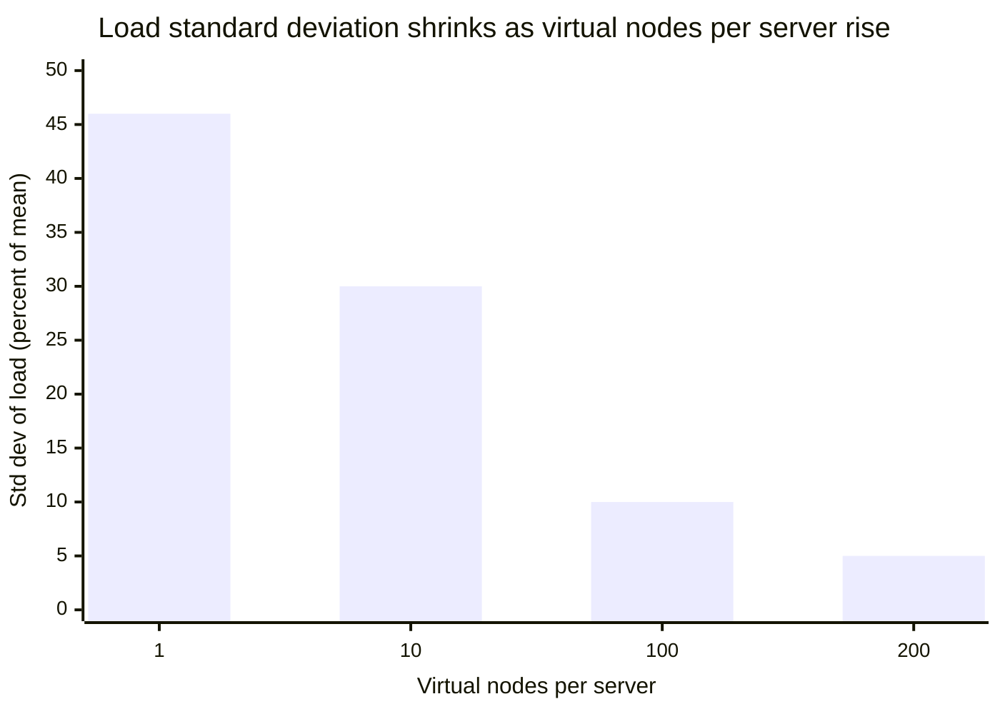
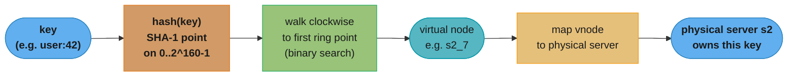
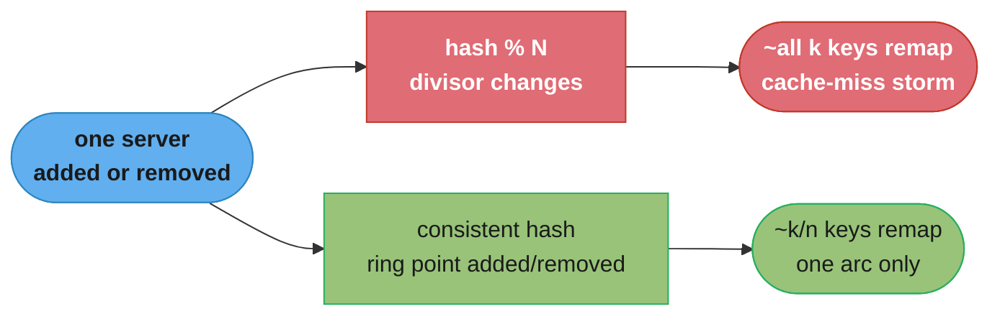

# Chapter 5: Design Consistent Hashing

> Ch 5 of 16 · System Design Interview Vol 1 (Xu) · builds on Ch 4, the primitive that Ch 6 (KV store), Ch 8, and Ch 13 all reuse

## Chapter Map

To scale horizontally you must spread requests and data **evenly** across a fleet of servers,
and — this is the hard part — you must keep that spread stable when servers join or leave. The
naive answer, `serverIndex = hash(key) % N`, distributes evenly while `N` is fixed but detonates
the moment `N` changes: nearly every key gets a new home at once, and every cache lookup misses.
**Consistent hashing** is the technique that fixes this. It is not a full system-design problem
(no requirements-gathering or capacity math); it is a single reusable *primitive*, so this
chapter is a mechanics walkthrough rather than the book's 4-step interview framework.

**TL;DR:**
- `hash % N` fails on rebalance: change `N` and on the order of **all** keys move, not the `1/N`
  you would hope for — a cache-miss storm that can stampede the origin.
- **Consistent hashing** places both servers and keys on a fixed hash **ring** (0 to 2^160−1 for
  SHA-1) and assigns each key to the first server found walking **clockwise**. Add or remove one
  server and only `k/n` keys move on average (`k` keys, `n` servers) — one contiguous arc, not
  the whole keyspace.
- The basic ring has two flaws: partition sizes cannot be kept uniform as membership changes, and
  even uniform partitions get non-uniform key loads. **Virtual nodes** — each physical server
  placed at many ring points — fix both, driving load standard deviation from large down to ~10%
  at 100 vnodes and ~5% at 200, at the cost of more metadata.
- Used in production by **Amazon Dynamo** and **Cassandra** (partitioning), **Discord**,
  **Akamai** (CDN), and **Google Maglev** (load balancing).

---

## The Big Question

> "I have a wall of cache servers and a river of keys flowing at them. I can split the river
> evenly today. But the instant one server dies — or I add one on Black Friday — how do I avoid
> re-shuffling *everything* and melting my database with a cache-miss stampede?"

Analogy: imagine assigning house numbers to postal depots by `houseNumber % depotCount`. It works
until a depot closes. Change the count and suddenly *almost every house* is reassigned to a
different depot — every route redrawn, every delivery relearned. Consistent hashing is the
insight that if you instead lay all depots and all houses around a **circular road** and send each
house to the *next depot clockwise*, then closing one depot only re-routes the houses on that one
stretch of road. Everyone else's assignment is untouched.

---

## 5.1 The Rehashing Problem

The standard way to spread `k` keys across `n` cache servers is the **modulo hash**:

```
serverIndex = hash(key) % N        // N = number of servers
```

While `N` is fixed this is excellent: a good hash function scatters keys uniformly, so each of the
`N` servers gets roughly `k/N` keys, and lookup is one hash plus one modulo — O(1), no state.

**In plain terms.** The formula reads as a lookup, but what it really encodes is a *dependency*:
> "A key's home is decided by the remainder it leaves when divided by the current server count — so
> the server count is baked into every single key's address."

Reading it that way makes the failure obvious before you see any example. Nothing about the key
changed when a server died; the *divisor* changed, and the divisor is half the address.

| Symbol | What it is |
|--------|------------|
| `hash(key)` | A large integer derived from the key alone; stable forever, independent of the fleet |
| `N` | The number of live servers — the one term that moves when membership changes |
| `%` | Remainder after division; folds the huge hash down into `0 .. N-1` |
| `serverIndex` | The resulting server slot, valid only for this exact value of `N` |

**Walk one example.** Push two of the chapter's own key hashes through both divisors:

```
key0:  hash = 18,358,617
       18,358,617 % 4 = 1        (4 servers  -> server 1)
       18,358,617 % 3 = 0        (3 servers  -> server 0)      MOVED

key1:  hash = 26,143,584
       26,143,584 % 4 = 0        (4 servers  -> server 0)
       26,143,584 % 3 = 0        (3 servers  -> server 0)      stayed, by coincidence

the hash never changed -- only the divisor did, and the divisor is what picks the server
```

The `% N` is doing two jobs at once: it distributes, and it *names*. Distribution is the job you
wanted; naming is the job that ruins you. Consistent hashing keeps the distribution and takes away
the naming, by deciding ownership from ring geometry instead of from `N`.

### The worked example (4 servers, 8 keys)

Take 4 servers (indices 0–3) and 8 keys (`key0`–`key7`). Hash each key, take `hash % 4`, and you
get the server that stores it. (The hash values below are illustrative but the arithmetic is
exact — you can check every `% 4` and `% 3` by hand.)

| Key | hash | `hash % 4` → server | `hash % 3` → server (after server 1 dies) |
|-----|------|:--:|:--:|
| key0 | 18358617 | **1** | 0 |
| key1 | 26143584 | **0** | 0 |
| key2 | 18131146 | **2** | 1 |
| key3 | 35863496 | **0** | 2 |
| key4 | 34085861 | **1** | 2 |
| key5 | 38139898 | **2** | 1 |
| key6 | 27540426 | **2** | 0 |
| key7 | 15347811 | **3** | 0 |

The `% 4` column is a clean, even spread: server 0 holds {key1, key3}, server 1 {key0, key4},
server 2 {key2, key5, key6}, server 3 {key7}. So far, so good.

### The disaster when server 1 dies

Server 1 fails. Now there are 3 live servers, so the code recomputes `hash % 3`. Compare each
key's *old* home (`% 4`) with its *new* home (`% 3`):

```
key   old(%4)   new(%3)   moved?
----  -------   -------   ------
key0     1    ->   0       MOVED
key1     0    ->   0       stayed
key2     2    ->   1       MOVED
key3     0    ->   2       MOVED
key4     1    ->   2       MOVED
key5     2    ->   1       MOVED
key6     2    ->   0       MOVED
key7     3    ->   0       MOVED
```

**Seven of the eight keys move.** Only `key1` — by luck, `hash % 4 == hash % 3 == 0` — keeps its
home. This is the catastrophe: losing *one* server did not just orphan the keys that lived on that
server (key0 and key4). It changed the divisor from 4 to 3, which re-maps almost *every* key on
*every* server, because `hash % 4` and `hash % 3` are unrelated functions.

Why is this fatal in a cache? Right after the rehash, a client asks the (new) server for a key,
but the key was cached on a *different* server before, so it is not there — a **cache miss**. Every
one of those 7 keys misses. Multiply by millions of keys and you get a **cache-miss storm**: all
that traffic falls through to the origin database at once, which was never provisioned for the
full read load, and it can topple. The same thing happens in reverse when you *add* a server (`N`
goes from 4 to 5, divisor changes, everything re-maps).

**What this actually says.** "Almost every key moves" has an exact closed form, and it gets *worse*
as your fleet grows:
> "When the divisor goes from `N` to `N+1`, a key keeps its home only if its two remainders happen to
> coincide — about 1 chance in `N+1` — so the fraction that moves is `N / (N+1)`."

The counter-intuitive part is the direction: the bigger your cluster, the closer that fraction gets to
100%. Scaling out does not soften the rehash storm, it sharpens it.

| Symbol | What it is |
|--------|------------|
| `N` | Server count before the change (the old divisor) |
| `N+1` | Server count after adding one server (the new divisor) |
| `1/(N+1)` | Fraction of keys whose old and new remainders coincide, so they stay put |
| `N/(N+1)` | Fraction of the whole keyspace that is re-homed — the blast radius |

**Walk one example.** Evaluate the fraction at several fleet sizes, then check it against a
million-key simulation:

```
fraction that KEEPS its server, N -> N+1  =  1 / (N+1)
fraction that MOVES                       =  N / (N+1)

N =   3   ->  moves   3/4   = 75.00%     (the chapter's case: 4 servers down to 3)
N =  10   ->  moves  10/11  = 90.91%
N =  20   ->  moves  20/21  = 95.24%     (matches the pitfall's "20 -> 21, ~95% remap")
N = 100   ->  moves 100/101 = 99.01%

measured on 1,000,000 SHA-1 hashed keys:
  4 <-> 3 servers    749,919 moved  = 74.99%   (theory 75.00%)
  20 -> 21 servers   952,360 moved  = 95.24%   (theory 95.24%)

for contrast, consistent hashing on the same 20 -> 21 change moves 1/(n+1) = 4.76%
  measured with 200 vnodes per server:  48,613 of 1,000,000 = 4.86%
  95.24% / 4.76% = 20.0x fewer keys disturbed
```

A note on the chapter's own table: its 8-key sample shows 7 of 8 keys moving, which is `7/8 = 87.5%`,
while the expectation for 4 servers down to 3 is `75.00%`. That gap is small-sample noise, not an
error in the argument — with a million keys the measured figure lands at `74.99%`. Either number
carries the same point: losing one server out of four should have orphaned the 2 keys that lived on
it, and instead it re-homed most of the keyspace.

> **Broken → fix.** Broken: `serverIndex = hash(key) % N` — correct and even while `N` is fixed,
> but any change in `N` re-maps ~all keys and triggers a miss storm. Fix: make the mapping depend
> on where servers and keys land on a fixed ring, *not* on the count `N`, so that changing
> membership only disturbs a local arc. That fix is consistent hashing (§5.2).

---

## 5.2 Consistent Hashing

Quoting the definition (Karger et al., MIT, 1997): consistent hashing is a special kind of hashing
such that when a hash table is resized, **on average only `k/n` keys need to be remapped**, where
`k` is the number of keys and `n` is the number of slots (servers). Contrast with modulo hashing,
where changing the slot count re-maps *nearly all* keys because it rehashes everything.

**Read it like this.** `k/n` looks like a ratio but it is really a count, and reading it as a count is
what makes the guarantee land:
> "One membership change re-homes about one server's worth of keys — the arc that server owns — and
> leaves every other server's keys exactly where they were."

Under modulo hashing the number of keys you must move scales with the *whole keyspace*; under
consistent hashing it scales with one server's *share* of it. That is the entire theorem.

| Symbol | What it is |
|--------|------------|
| `k` | Total number of keys stored across the fleet |
| `n` | Number of slots (servers, or ring positions) |
| `k/n` | Keys living on one average server — and the keys a single membership change disturbs |
| "on average" | Exact only in expectation; actual arcs vary, which is why virtual nodes exist |

**Walk one example.** One million keys on a 20-server fleet, adding a 21st server both ways:

```
k = 1,000,000 keys        n = 20 servers

hash % N, adding one server (20 -> 21):
  keys remapped = k x N/(N+1) = 1,000,000 x 20/21 = 952,381 keys

consistent hashing, adding one server (20 -> 21):
  keys remapped = k / (n+1)   = 1,000,000 / 21    =  47,619 keys
  measured, 200 vnodes per server                 =  48,613 keys

keys spared    = 952,381 - 47,619 = 904,762 keys never re-fetched from the origin
reduction      = 952,381 / 47,619 = 20.0x

the 20.0x is not a coincidence: it is exactly n, the fleet size
```

That last line is the property worth carrying into an interview: the *advantage* of consistent
hashing over modulo hashing grows linearly with your fleet size. At 20 servers it saves you 20x the
re-fetch work; at 100 servers, 100x. The technique matters most precisely where the naive scheme
hurts most.

### Hash space and hash ring

Start with the **hash space**: the full range of outputs of the hash function. Using **SHA-1**,
the output is 160 bits, so the space runs from `0` to `2^160 − 1` — about 1.46 × 10^48 values.
Lay that range out and then **join the two ends** so `0` and `2^160 − 1` are adjacent. That circle
is the **hash ring**. Every point on the ring is one possible hash value; the join point is where
the value wraps from the maximum back to `0`.

**Put simply.** The 160 bits are not there for cryptographic reasons; they buy *resolution*:
> "The ring has about 1.46 x 10^48 addressable positions, which is so many more than the few thousand
> points you will ever place on it that the circle behaves like a continuous line."

That is what lets you slice the ring as finely as you like with virtual nodes without ever worrying
that two points collide or that the spacing quantizes.

| Symbol | What it is |
|--------|------------|
| 160 bits | SHA-1's output width; every hash is one of `2^160` values |
| `2^160 − 1` | The largest ring position; the next step past it wraps to `0` |
| hash space | The full set of positions `0 .. 2^160 − 1` |
| ring | That same space with its two ends joined, so the walk never runs out of servers |

**Walk one example.** Compare the ring's capacity against the number of points you actually occupy:

```
SHA-1 output width = 160 bits
ring positions     = 2^160
                   ~ 1.46 x 10^48 distinct points

for scale, a 32-bit ring (what some implementations use):
  2^32          = 4,294,967,296 points
  2^160 / 2^32  = 2^128 ~ 3.40 x 10^38 times larger

a realistic fleet: 20 servers x 200 virtual nodes = 4,000 ring points occupied
  average gap between neighbouring points = 2^160 / 4,000
                                          ~ 3.65 x 10^44 positions

occupancy = 4,000 / 1.46 x 10^48 ~ 2.7 x 10^-45 of the ring
```

The **join** is the term people forget. Without it the space is a line segment, and any key hashing
above the highest server point has no server clockwise of it — the lookup returns nothing. Joining
`2^160 − 1` to `0` is what guarantees the clockwise walk always terminates, which is why the
implementations later in this chapter all end with a `% len(points)` or a `firstEntry()` fallback.

```
                        hash = 0   (= 2^160, the wrap point)
                                 v
                     s3 ────────────────── s0
                    /                        \
                   /                          \
              key4 *                           * key1
                  |                             |
                  |            RING             |
                  |     (clockwise = higher     |
              key3 *          hash value)       * key2
                   \                          /
                    \                        /
                     s2 ────────────────── s1
                                 ^
                        hash = 2^160 / 2
```

The ring is a fixed coordinate system: 0 at top, values increasing clockwise, wrapping back to 0.
Servers and keys are both *points* on this same circle — this shared coordinate space is the whole
trick. The `s0..s3` positions here are illustrative; in reality each is `hash(serverName)`.

### Hash servers onto the ring

Hash each **server** — by IP or name — with the same function and place it at that point on the
ring. In the diagram above, servers `s0, s1, s2, s3` land at four positions around the circle.
Crucially, the server's position depends only on `hash(serverName)`, not on how many servers exist,
so adding or removing a server does not move any *other* server's point.

### Hash keys onto the ring — no modulo

Now hash each **key** with the same hash function and place it on the same ring. Note what is
*absent*: there is **no modulo operation**. In §5.1 the key's server came from `hash(key) % N`, and
the `% N` is exactly what made the mapping depend on the server count. Here the key is simply a
point on the circle; its server is decided by geometry, not arithmetic on `N`.

### Server lookup — walk clockwise

To find which server stores a key, start at the key's point and **walk clockwise** (toward higher
hash values) until you hit the first server. That server owns the key. If you reach the top wrap
point (2^160 → 0) without finding a server, keep going past 0 and take the first server after the
wrap — this is why the ring is a *circle*, so there is always a server ahead.

Laid out linearly (the ring "unrolled", with the wrap shown at both ends):

```
hash 0 |---- s0 --[key1]-- s1 --[key2]-- s2 --[key3][key4]-- s3 --[key0]--| 2^160 (wraps to 0)
                    |             |               |    |               |
        served by:  s1            s2              s3   s3          s0 (wraps past end to s0)
```

Reading it off: `key1` sits between `s0` and `s1`, so walking clockwise the first server is `s1`.
`key2` → `s2`. `key3` and `key4` → `s3`. `key0` sits *past* the last server `s3`, so walking
clockwise it wraps around the end of the ring back to `0` and lands on `s0`. Each server owns the
arc **ending at its own point**, i.e. everything from the previous server (exclusive) up to
itself (inclusive).

To make the geometry unambiguous, put concrete positions on it — expressed as fractions of the ring
so you can see the arcs (real positions are the 160-bit `hash(...)` values, but fractions read
easier):

| Point | Ring position (fraction of 2^160) | Owned by (clockwise-first server) |
|-------|:--:|:--:|
| s0 | 0.10 | — (a server) |
| key1 | 0.20 | s1 (next server clockwise, at 0.30) |
| s1 | 0.30 | — |
| key2 | 0.40 | s2 (next server clockwise, at 0.55) |
| s2 | 0.55 | — |
| key3 | 0.60 | s3 |
| key4 | 0.65 | s3 (next server clockwise, at 0.80) |
| s3 | 0.80 | — |
| key0 | 0.90 | s0 (wraps past 1.0 → 0.10) |

These same numbers drive the add/remove examples below: inserting `s4` at 0.45 or deleting `s1` at
0.30 changes only the keys whose clockwise-first server flips, and nothing else.

**What it means.** A server's load is not decided by anything about the server — it is decided by the
gap in front of it:
> "Each server owns the stretch of ring running from the previous server up to itself, so its expected
> share of keys is just that arc's length as a fraction of the whole circle."

Once ownership is arc length, load balancing becomes a geometry problem, and the basic ring's flaw
becomes visible as arithmetic rather than as a vague warning.

| Symbol | What it is |
|--------|------------|
| ring position | A point in `0 .. 2^160 − 1`, written here as a fraction of the full circle |
| arc / partition | `(previous server, this server]` — the range this server owns |
| arc length | Position difference; the server's expected share of the keyspace |
| ideal share | `1/n` — what every arc would be if the hashes landed perfectly evenly |

**Walk one example.** Take the four positions in the table above and total each server's arc:

```
server points (as fractions of the 2^160 ring):  s0 0.10, s1 0.30, s2 0.55, s3 0.80
arc owned = from the previous server (exclusive) up to this server (inclusive)

  s1 owns (0.10, 0.30]              0.30 - 0.10        = 0.20  = 20.0% of the ring
  s2 owns (0.30, 0.55]              0.55 - 0.30        = 0.25  = 25.0%
  s3 owns (0.55, 0.80]              0.80 - 0.55        = 0.25  = 25.0%
  s0 owns (0.80, 1.00] + [0, 0.10]  (1.00 - 0.80) + 0.10 = 0.30 = 30.0%   (wraps the join)
                                                   total = 1.00 = 100.0%

ideal share with n = 4 servers = 1/4 = 0.25 = 25.0%
largest / smallest = 0.30 / 0.20 = 1.50x   -- s0 carries 50% more load than s1

now remove s1: its arc merges into its clockwise successor s2
  s2 owns 0.20 + 0.25 = 0.45 = 45.0% of the ring
  ideal share with n = 3 is 1/3 = 33.3%
  0.45 / 0.333 = 1.35x the fair share -- the imbalance got worse, not better
```

That last step is issue 1 of §5.3 in numbers: membership changes do not re-randomize the arcs, they
*merge* them, so imbalance ratchets upward over a server's lifetime. Nothing in the basic ring pushes
it back toward `1/n`, which is exactly the job virtual nodes take on.

### Add a server — only one segment of keys moves

Add server `s4`, hashed to a point between `s1` and `s2`:

```
before:  ... s1 --[key2]-------------------- s2 ...     key2 served by s2
after:   ... s1 --[key2]---- s4 ------------ s2 ...     key2 served by s4  (s4 stole this arc)
                             ^new
```

`s4` lands between `key2`'s position and `s2`. Now walking clockwise from `key2`, the first server
is `s4`, not `s2`. So `key2` moves from `s2` to `s4`. **That is the only change.** Every key not in
the arc `(s1, s4]` keeps its exact server, because no other server point moved and no other key's
clockwise-first server changed. Only the keys in the newly-inserted arc — the ones `s4` "steals"
from its clockwise successor `s2` — are remapped.

### Remove a server — its arc migrates to the next clockwise server

Remove `s1`:

```
before:  ... s0 --[key1]-- s1 -- ...     key1 served by s1
after:   ... s0 --[key1]------- s2 ...   key1 served by s2  (s1's arc inherited by s2)
```

With `s1` gone, walking clockwise from `key1` skips past where `s1` was and reaches `s2`. So
`key1` (and any other key that used to land on `s1`) moves to `s2`, the next server clockwise.
Again, **only the keys that lived on the removed server move**, and they all migrate to a single
successor. Keys on `s0`, `s2`, `s3` are untouched.

This is the payoff versus §5.1: removing a server touches ~`k/n` keys (one server's arc) instead
of ~all `k` keys, so the cache-miss blast radius shrinks from the entire keyspace to a single
slice.

---

## 5.3 Two Issues in the Basic Approach

The basic ring — one point per server — has two problems that the Karger paper and Xu both call
out. Both stem from the same root: with only `n` points on a huge circle, the arcs between
consecutive servers are not equal.

### Issue 1 — impossible to keep partition sizes uniform

A **partition** is the arc (hash range) a server owns. When servers join and leave, their points
are wherever their hashes fall, so the arcs between neighbors are of wildly different lengths. One
server can end up owning a huge arc while its neighbor owns a sliver.

```
positions:  s0 ------------------------- s1 -- s2 --------- s3
arc owned:      (s3,s0] tiny        (s0,s1] HUGE   (s1,s2]  (s2,s3]
                                      one server owns a giant slice
```

Worse, when `s1` is removed, its whole (already-large) arc merges into `s2`, so `s2` now owns an
even bigger partition. Membership changes make the imbalance *drift*, and you cannot pin the arcs
to equal sizes because you do not control where a server's hash lands.

### Issue 2 — non-uniform key distribution even with uniform partitions

Even if you *could* make all arcs equal length, keys are not spread perfectly uniformly along the
ring. Real key hashes cluster. So one arc may catch a dense clump of keys while another catches
almost none — the servers own equal *ranges* but unequal *loads*. A server whose arc happens to
sit under a hot cluster becomes a **hotspot**, defeating the point of load balancing.

Both issues have the same fix: put *many* points per server on the ring so that, by the law of
large numbers, each server's total share of arc length (and of keys) evens out. That is virtual
nodes.

---

## 5.4 Virtual Nodes

A **virtual node** (vnode, or *replica* in some papers — not to be confused with data replicas) is
an additional ring position that maps back to the same physical server. Instead of hashing each
server once, hash it `k` times with distinct suffixes and place all `k` points on the ring. Each
physical server is now represented by a *cloud* of points scattered around the circle.

```
physical s0  ->  vnodes  s0_0, s0_1, s0_2      (3 points on the ring, spread out)
physical s1  ->  vnodes  s1_0, s1_1, s1_2
```

```
ring:  --[s0_1]--[s1_2]--[s0_0]--[s1_0]--[s0_2]--[s1_1]--  (points interleave)
       arcs owned by s0 and s1 are now many small slices, summing to ~equal totals
```

Because each server owns *many small arcs* interleaved with everyone else's, its total arc length
(and therefore its expected key load) converges to `1/n` of the ring. The interleaving also means
that when a server dies, its many small arcs are inherited by *many different* neighbors rather
than dumped on a single successor — so the redistributed load spreads out too.

### How lookup changes

Barely at all. To find a key's server you still walk clockwise to the first ring point — but that
point is now a *virtual* node, so you take one extra step: map the vnode back to its physical
server (`s0_2` → `s0`). Lookup stays O(log n·k) with a sorted structure; only the number of points
on the ring grows.

### The load / metadata tradeoff

More virtual nodes → tighter load balance, because the average of more random arcs deviates less
from the mean. The book gives concrete figures: the **standard deviation of load** is around
**10%** of the mean at **100 virtual nodes per server**, and about **5%** at **200 virtual nodes
per server** (smaller standard deviation = more even distribution). But every vnode is a ring
entry you must store and search, so more vnodes cost more **metadata** (memory for the ring map,
slightly slower lookups, more to gossip when membership changes). The practical answer: tune the
vnode count to your tolerance for imbalance against the metadata budget — often a few hundred per
server.



Caption: the two right-hand bars (10% at 100 vnodes, 5% at 200) are the book's stated figures; the
left bars sketch the trend that very few points per server leave load badly skewed. Doubling
vnodes from 100 to 200 roughly halves the imbalance — diminishing returns bought with more
metadata.

**What the formula is telling you.** "Standard deviation of load" is the averaging law from
statistics applied to ring arcs:
> "A server's load is the sum of its `k` random arcs, and averaging `k` random quantities shrinks
> their relative spread by a factor of `sqrt(k)` — so the imbalance falls as `1 / sqrt(k)`."

That is why the book's numbers are what they are, and it also tells you where the curve stops paying:
each halving of imbalance costs a *quadrupling* of vnodes.

| Symbol | What it is |
|--------|------------|
| `k` | Virtual nodes per physical server — how many arcs each server's load averages over |
| `n` | Physical servers; each server's fair share is `1/n` of the ring |
| std dev of load | Spread of per-server key counts around the mean, as a percent of the mean |
| `1/sqrt(k)` | The rate at which that spread shrinks as you add virtual nodes |

**Walk one example.** Three servers, 300,000 SHA-1 hashed keys, ideal share 100,000 keys (33.3%)
each — first with one ring point per server, then with 100:

```
3 servers, 300,000 keys, ideal share = 300,000 / 3 = 100,000 keys = 33.3% each

  1 virtual node per server:
    s0    46,379 keys   15.5%
    s1    27,559 keys    9.2%
    s2   226,062 keys   75.4%   <- one server holds three quarters of the load
    spread (max / min) = 226,062 / 27,559 = 8.20x

  100 virtual nodes per server:
    s0    96,488 keys   32.2%
    s1    96,319 keys   32.1%
    s2   107,193 keys   35.7%
    spread (max / min) = 107,193 / 96,319 = 1.11x

imbalance falls 8.20x -> 1.11x with no data moved and no server added --
only 297 extra ring points (3 servers x 99 more points each)

the 1/sqrt(k) law behind it:
  k =   1  ->  1 / sqrt(1)   = 100.00%
  k =  10  ->  1 / sqrt(10)  =  31.62%
  k = 100  ->  1 / sqrt(100) =  10.00%   <- matches the book's 10% at 100 vnodes
  k = 200  ->  1 / sqrt(200) =   7.07%
```

One figure to flag: the square-root law puts 200 vnodes at `7.07%`, while the book states about
**5%**. The book's number is the more optimistic of the two; treat `5-7%` as the practical band at
200 vnodes rather than a single exact value. The shape of the claim is unaffected — going from 100 to
200 vnodes buys a meaningful but clearly diminishing improvement, and getting to `2.5%` would take
roughly 1,600 vnodes per server under the square-root law.

**Stated plainly.** The cost side of that tradeoff is a single multiplication:
> "Every router holds `n x k` ring points, so the vnode count you pick multiplies your ring metadata,
> your gossip traffic on membership changes, and (logarithmically) your lookup cost."

Worth sizing before you assume it is expensive — for realistic fleets the metadata is trivially small,
and the real constraint is propagation, not memory.

| Symbol | What it is |
|--------|------------|
| `n x k` | Total ring points a router must store, sort, and search |
| bytes per entry | Storage per point: the 8-byte position plus a reference to the physical server |
| `O(log(n x k))` | Lookup cost — the binary search over the sorted ring points |
| gossip volume | Ring state that must be disseminated when membership changes |

**Walk one example.** Size the ring for a 20-server fleet at three vnode settings:

```
ring points = n servers x k virtual nodes per server

  20 servers x   1 vnode  =     20 points     load std dev ~ 99%    (basic ring)
  20 servers x 100 vnodes =  2,000 points     load std dev ~ 10%    (book)
  20 servers x 200 vnodes =  4,000 points     load std dev ~ 5-7%

metadata at ~16 bytes per entry (8-byte ring position + server reference):
  4,000 points x 16 bytes = 64,000 bytes = 64 KB of ring state per router

lookup cost = O(log2(n x k)):
  log2(20)    =  4.3 comparisons     (basic ring)
  log2(4,000) = 12.0 comparisons     (200 vnodes/server)
  cost grew 2.8x while imbalance fell from ~99% to ~5-7%
```

64 KB is nothing, which is why "metadata cost" rarely means memory in practice. What it does mean is
**agreement**: all 4,000 points must be identical across every router, so a membership change has to
propagate 200 point insertions or deletions to the whole fleet, and any router still on the old view
routes a shared key to a different server. That is the split-brain failure in the pitfalls below, and
it is the real reason vnode counts stay in the hundreds rather than the millions.

---

## 5.5 Find Affected Keys

When membership changes you must know **exactly which keys to move** (re-fetch, re-replicate, or
invalidate) — no more, no less. Moving too many recreates the §5.1 storm; missing some leaves stale
or lost data. The rule is a direction rule, and its direction is the classic trap.

### The rule

- **Adding a server `s`:** the affected keys are those in the arc running **from `s` counter-clockwise (anticlockwise) back to the previous node** on the ring. Those keys previously belonged to `s`'s clockwise successor and now belong to `s`.
- **Removing a server `s`:** the affected keys are those in the arc **from `s` counter-clockwise back to the previous node** — i.e. the keys `s` owned. They now migrate to `s`'s clockwise successor.

The mnemonic: **scan anticlockwise from the changed node to the previous node.** The affected range
is always "the changed node's own arc," which ends *at* the changed node and starts *just after*
the previous node.

### Worked example — adding a node

Ring order (clockwise): `s0, s1, s4(new), s2, s3`. We insert `s4` between `s1` and `s2`.

```
                previous node                new node
                     s1 ------[range]------> s4 -------------- s2
                     |                        |
        affected =   (s1, s4]  <-- scan anticlockwise from s4 back to s1
        these keys were served by s2 (clockwise from them) and now go to s4
```

Concretely, if `key2` sits in `(s1, s4]`, then before the insert `key2` walked clockwise past
`s4`'s empty spot to `s2`; after the insert it stops at `s4`. So `key2` moves `s2 → s4`. Keys in
`(s4, s2]` still land on `s2`; keys elsewhere are untouched. You re-home exactly the arc `(s1, s4]`.

### Worked example — removing a node

Remove `s1`; ring order was `s0, s1, s2, s3`.

```
        previous node          removed
             s0 ------[range]--> s1        s2
             |                    |
   affected = (s0, s1]  <-- scan anticlockwise from s1 back to s0
   these keys were served by s1 and now go to s2 (s1's clockwise successor)
```

The keys in `(s0, s1]` were `s1`'s. With `s1` gone they walk clockwise to `s2`. You move exactly
`(s0, s1]` to `s2`; nothing else changes.

### The direction trap

The most common mistake is scanning the *wrong way* — computing the range **clockwise** from the
changed node instead of anticlockwise. Clockwise from the changed node is its *successor's* arc,
which is not affected at all; moving those keys would corrupt data that was correctly placed. Always
anchor on: *the affected arc ends at the changed node and reaches back (anticlockwise) to the
previous node.* (With virtual nodes the same rule applies per vnode, so a single physical change
produces several small affected arcs scattered around the ring — one per moved vnode.)

---

## 5.6 Wrap Up

### Benefits

- **Minimal key movement.** Adding or removing a server remaps only ~`k/n` keys (one arc, or with
  vnodes several small arcs) instead of ~all `k`. This is the whole reason the technique exists.
- **Horizontal scaling made easy.** Because rebalancing is local, you can add servers to grow
  capacity (or remove them to shrink) without a global reshuffle or a downtime window — data
  spreads out more evenly as the fleet grows.
- **Hotspot / adaptive load mitigation.** Uniform ring placement (via virtual nodes) keeps any one
  server from owning a disproportionate slice, so a popular key range does not stampede a single
  node. Non-uniformly-sized nodes can even be modeled by giving beefier servers *more* vnodes.

### Real-world systems

- **Amazon DynamoDB / Dynamo** — partitioning: the original Dynamo paper (2007) uses consistent
  hashing with virtual nodes to spread partitions across nodes.
- **Apache Cassandra** — partitioning: the token ring is consistent hashing; each node owns token
  ranges (vnodes), and adding a node claims a share of ranges from existing nodes.
- **Discord** — uses consistent hashing to route which service instance handles which guild/channel.
- **Akamai** — CDN: consistent hashing decides which edge cache serves which content object.
- **Maglev** (Google's network load balancer) — uses a consistent-hashing scheme so that adding or
  draining a backend disturbs as few flows as possible.

---

## Visual Intuition

### End-to-end lookup: key → ring → physical server



Caption: lookup is `hash → clockwise-first ring point → resolve vnode to physical server`. The only
step virtual nodes add over the basic ring is the final vnode→server resolution; everything else is
one hash and one binary search.

### Rebalance blast radius: modulo vs consistent hashing



Caption: the same membership change re-maps the entire keyspace under `hash % N` (red path) but only
a single `k/n` arc under consistent hashing (green path) — that gap is the difference between a
database-melting stampede and a routine scale event.

### Reference implementation (the mechanics made concrete)

The ring is just a **sorted list of hash points** plus a **binary search**; the clockwise walk is
`bisect`, and the wraparound is a modulo on the *list length* (not on `N` — that modulo is harmless
because the list is the ring itself).

```python
import hashlib
from bisect import bisect, insort

class ConsistentHashRing:
    def __init__(self, vnodes=200):
        self.vnodes = vnodes
        self._ring = {}        # ring point (int) -> physical server name
        self._points = []      # sorted list of ring points (the ring, unrolled)

    def _hash(self, s):        # SHA-1 -> 160-bit int point on the ring
        return int(hashlib.sha1(s.encode()).hexdigest(), 16)

    def add_server(self, server):
        for i in range(self.vnodes):          # place k virtual nodes for this server
            p = self._hash(f"{server}#{i}")
            self._ring[p] = server
            insort(self._points, p)           # keep the ring sorted

    def remove_server(self, server):
        for i in range(self.vnodes):
            p = self._hash(f"{server}#{i}")
            del self._ring[p]
            self._points.remove(p)

    def get_server(self, key):
        if not self._points:
            return None
        p = self._hash(key)
        idx = bisect(self._points, p) % len(self._points)  # clockwise walk + wraparound
        return self._ring[self._points[idx]]               # resolve vnode -> physical server
```

Caption: `bisect` finds the first ring point clockwise-greater than the key's hash; `% len(points)`
wraps a key past the last point back to the first, which is exactly the ring's circular join.
`add_server`/`remove_server` touch only this server's `vnodes` points, leaving every other server's
points — and therefore almost every key's assignment — untouched.

On the JVM (the form Cassandra-style systems use) the ring is a `TreeMap`, and the clockwise walk
is `ceilingEntry` with an explicit wrap to `firstEntry` — the same two ideas, different API:

```java
import java.util.TreeMap;
import java.util.Map;

public class ConsistentHashRing {
    private final int vnodes;
    private final TreeMap<Long, String> ring = new TreeMap<>();   // ring point -> server

    public ConsistentHashRing(int vnodes) { this.vnodes = vnodes; }

    private long hash(String s) {                     // 64-bit ring point (illustrative)
        return Math.abs(s.hashCode()) * 0x9E3779B97F4A7C15L;   // use SHA-1/Murmur in prod
    }

    public void addServer(String server) {            // place vnodes points for this server
        for (int i = 0; i < vnodes; i++) ring.put(hash(server + "#" + i), server);
    }

    public void removeServer(String server) {
        for (int i = 0; i < vnodes; i++) ring.remove(hash(server + "#" + i));
    }

    public String getServer(String key) {
        if (ring.isEmpty()) return null;
        Map.Entry<Long, String> e = ring.ceilingEntry(hash(key));   // first point clockwise
        if (e == null) e = ring.firstEntry();                       // wraparound past the top
        return e.getValue();                                        // vnode -> physical server
    }
}
```

Caption: `ceilingEntry` is the clockwise walk (first ring point ≥ the key's hash); the `firstEntry`
fallback is the wraparound past 2^160 back to 0. Both implementations share the identical
mechanic — a sorted structure plus "next point clockwise, wrapping at the join."

---

## Key Concepts Glossary

- **Modulo hashing** — `serverIndex = hash(key) % N`; even while `N` is fixed, catastrophic on
  rebalance because changing `N` re-maps ~all keys.
- **Rehashing problem** — the cache-miss storm caused when `N` changes and nearly every key gets a
  new server at once.
- **Cache-miss storm (stampede)** — the flood of origin/database reads when many keys simultaneously
  miss the cache after a remap.
- **Consistent hashing** — hashing scheme where resizing the table remaps only ~`k/n` keys on
  average (`k` keys, `n` slots), instead of nearly all.
- **Hash space** — the full range of the hash function's outputs (0 to 2^160−1 for SHA-1).
- **Hash ring** — the hash space with its two ends joined into a circle; the join is the wrap point.
- **Wraparound** — walking clockwise past the maximum value returns to 0, so a key past the last
  server maps to the first server.
- **Server point** — a server's position on the ring, at `hash(serverName)`.
- **Key point** — a key's position on the ring, at `hash(key)`; note there is no `% N`.
- **Clockwise walk (server lookup)** — from a key's point, move toward higher hash values to the
  first server encountered; that server owns the key.
- **Partition (arc)** — the hash range a server owns: from the previous server (exclusive) to itself
  (inclusive).
- **Virtual node (vnode / replica)** — an extra ring point mapping back to the same physical server;
  each server is placed at many points.
- **Physical node** — the actual server behind one or more virtual nodes.
- **Standard deviation of load** — spread of per-server load around the mean; ~10% at 100 vnodes,
  ~5% at 200 (smaller = more even).
- **Affected keys / affected range** — the arc of keys that must move on a membership change: from
  the changed node *anticlockwise* to the previous node.
- **Hotspot** — a single server overloaded because its arc caught a dense cluster of (hot) keys.
- **`k/n` remap guarantee** — the core property: one membership change moves on the order of `k/n`
  keys, not `k`.

---

## Tradeoffs & Decision Tables

| Property | `hash(key) % N` (modulo) | Consistent hashing (basic) | Consistent hashing + vnodes |
|----------|:--:|:--:|:--:|
| Keys moved when `N` changes | ~all `k` | ~`k/n` (one arc) | ~`k/n` (many small arcs) |
| Even load while stable | very even | uneven (arcs unequal) | even (~5–10% std dev) |
| Even load after churn | resets evenly but storms | drifts more uneven | stays even |
| Lookup cost | O(1) | O(log n) | O(log(n·k)) |
| Metadata to store | none (just `N`) | `n` points | `n·k` points |
| Weighted / heterogeneous nodes | no | awkward | yes (more vnodes = more share) |

| Vnodes per server | Load std dev | Metadata cost | When to pick |
|-------------------|:--:|:--:|--------------|
| ~1 (basic ring) | large / skewed | minimal | almost never — issues §5.3 bite |
| ~100 | ~10% | moderate | good default for many caches |
| ~200 | ~5% | higher | when tight balance matters and RAM/gossip budget allows |

| Symptom | Diagnosis | Fix |
|---------|-----------|-----|
| Adding/removing a node melts the DB | `hash % N` rehash storm | consistent hashing |
| One node hot despite equal ring arcs | non-uniform key distribution (§5.3 issue 2) | more virtual nodes |
| One node owns a giant arc | non-uniform partition sizes (§5.3 issue 1) | more virtual nodes |
| Wrong keys migrated on a change | scanned clockwise, not anticlockwise | affected range = changed node → *previous* node |

---

## Common Pitfalls / War Stories

- **Rehash storm on a "routine" scale-up.** A team adds one cache node during peak with a plain
  `hash % N` router. `N` goes 20 → 21, ~95% of keys remap, the entire cache effectively cold-starts,
  and the read flood takes the origin database down for minutes. The fix is structural
  (consistent hashing), not "add capacity faster."
- **Basic ring with too few points → a fat node.** Deploying consistent hashing but with only one
  point per server leaves arcs wildly unequal; one unlucky server owns a huge arc and runs hot while
  others idle. The signature is uneven CPU/memory across an "identical" fleet — the fix is virtual
  nodes, typically 100–200 per server.
- **Uniform partitions, still a hotspot.** Even with equal-length arcs, a burst of hot keys (a viral
  item, a celebrity user) can hash into one arc and hammer that node. Virtual nodes spread the arcs
  so hot keys statistically land on different servers; if a *single* key is the hotspot, consistent
  hashing alone won't save you (you also need replication/request-level load balancing).
- **Scanning the affected range the wrong way.** On a membership change, computing the moved-keys
  arc *clockwise* from the changed node moves the successor's keys — data that was placed correctly —
  causing spurious misses and, in a stateful store, misrouted writes. Always scan *anticlockwise* to
  the previous node.
- **Forgetting the wraparound.** An implementation that binary-searches the ring but does not wrap
  (`% len(points)`) throws or returns null for any key whose hash exceeds the largest server point.
  The ring is a *circle*: past the last point you must loop to the first.
- **Coordinating the ring across clients.** All routers must agree on the same ring (same servers,
  same vnode positions). If nodes disagree during a membership change, different clients route the
  same key to different servers — split-brain caching. Real systems propagate ring membership via
  gossip/coordination and accept brief inconsistency, which is why more vnodes also means more
  membership state to disseminate.

---

## Real-World Systems Referenced

Amazon Dynamo / DynamoDB (partitioning with virtual nodes, 2007 paper); Apache Cassandra (token
ring partitioning, vnodes); Discord (routing state by consistent hashing); Akamai (CDN edge-cache
selection); Google Maglev (network load balancing with minimal flow disruption); memcached client
libraries (ketama consistent hashing). The technique originates from Karger et al., MIT (1997),
motivated by distributing web-cache load.

---

## Summary

The naive `serverIndex = hash(key) % N` distributes keys evenly across a fixed fleet but is
catastrophic on rebalance: change `N` — one server dies, or one is added — and the divisor changes,
so on the order of *all* keys get a new home at once, every cache lookup misses, and the origin
database is stampeded. **Consistent hashing** removes the dependence on `N` by placing servers and
keys as points on a fixed **hash ring** (0 to 2^160−1, ends joined) and assigning each key to the
first server found walking **clockwise**, wrapping past the top back to 0. Now adding or removing a
server only re-homes the keys in a single arc — on average `k/n` of them (`k` keys, `n` servers) —
so the blast radius is a slice, not the whole keyspace. The basic ring has two flaws: partition
(arc) sizes cannot be kept uniform as membership drifts, and even equal arcs catch unequal numbers
of keys. **Virtual nodes** — representing each physical server by many interleaved ring points —
fix both by averaging many small arcs toward `1/n` each, bringing load standard deviation to ~10% at
100 vnodes and ~5% at 200, traded against more ring metadata. To rebalance correctly you move
exactly the **affected range**: the arc from the added/removed node *anticlockwise* back to the
previous node. The result — minimal key movement, easy horizontal scaling, and hotspot mitigation —
is why consistent hashing underpins Dynamo, Cassandra, Discord, Akamai, and Maglev.

---

## Interview Questions

**Q: Why does `serverIndex = hash(key) % N` remap almost every key when N changes?**
Because changing `N` changes the divisor, and `hash % 4` versus `hash % 3` are effectively unrelated functions that scatter keys differently. So it is not just the failed server's keys that move — nearly every key on every server gets a new index at once. In the book's 4-server, 8-key example, losing one server moves 7 of the 8 keys. That mass remap is what makes a cache stampede the origin database.

**Q: What fraction of keys move when a server is added or removed under consistent hashing?**
On average `k/n`, where `k` is the number of keys and `n` the number of servers. Only the keys in the single arc owned by (or newly stolen by) the changed server are re-homed; every other key keeps its exact server because no other ring point moved. This is the defining property from the Karger paper and the entire reason the technique exists.

**Q: When you add a node to the ring, which keys move and in which direction do you scan for them?**
The affected keys are the arc from the new node scanning counter-clockwise (anticlockwise) back to the previous node. Those keys previously walked clockwise to the new node's successor; now they stop at the new node instead. Scanning clockwise is the classic trap — that direction is the successor's arc, which is not affected at all.

**Q: Why do virtual nodes exist — what two problems do they solve?**
They solve the basic ring's two flaws: unequal partition sizes and non-uniform key distribution. With one point per server the arcs between servers are wildly unequal, and even equal arcs catch different numbers of keys, so some server runs hot. Representing each server by many interleaved points averages many small arcs toward `1/n` of the ring, evening out both arc length and key load.

**Q: How does the clockwise lookup handle a key whose hash lands past the last server on the ring?**
It wraps around: walking clockwise past the maximum value returns to 0 and continues to the first server after the join. The ring is a circle precisely so there is always a server ahead of any key. In code this is the `bisect(...) % len(points)` — the modulo on the list length loops the search index back to the first point.

**Q: What are the two problems with basic consistent hashing that virtual nodes fix?**
First, it is impossible to keep partition sizes uniform as servers join and leave, so one server can own a giant arc while a neighbor owns a sliver. Second, keys are not perfectly uniformly distributed, so even equal-length arcs catch unequal key counts, creating hotspots. Virtual nodes place each server at many points, so the law of large numbers evens out both effects.

**Q: How many virtual nodes should you use, and what is the tradeoff?**
Enough to hit your load-balance target: the standard deviation of load is about 10% at 100 virtual nodes per server and about 5% at 200. More vnodes means tighter balance but more metadata — ring entries to store, search, and gossip on membership changes. The practical choice is a few hundred per server, tuned against your memory and coordination budget.

**Q: When a server is removed, where do its keys go?**
To its clockwise successor — the next server encountered walking clockwise from the removed server's position. The removed server's entire arc is inherited by that one neighbor (with vnodes, the many small arcs go to several different neighbors). Keys on all other servers are completely untouched.

**Q: Does consistent hashing eliminate the cache-miss storm entirely?**
No, it shrinks the blast radius from ~all keys to ~`k/n` keys. A membership change still forces the keys in one arc to miss and re-fetch, but that is a fraction of the fleet's load rather than the entire keyspace hitting the origin at once. The storm becomes a survivable ripple instead of a stampede.

**Q: The hash ring gives even key distribution — true or false?**
False for the basic ring, and only approximately true with virtual nodes. Real key hashes cluster, and with few ring points per server the arcs are unequal, so load is skewed. Only by adding many virtual nodes per server does per-server load converge toward `1/n` with a small standard deviation (~5–10%).

**Q: What data structure makes the ring lookup efficient, and what is its complexity?**
A sorted collection of ring points (e.g. a sorted array plus binary search, or a TreeMap / red-black tree). The clockwise walk becomes a `bisect`/`ceilingKey` in O(log m) where m is the number of points (n·k with vnodes). Adding or removing a server inserts or deletes just that server's points, leaving the rest of the structure — and almost all key assignments — unchanged.

**Q: Why use SHA-1 (a 160-bit hash) for the ring, and does the exact function matter?**
The hash just needs to spread points uniformly over a large space; SHA-1 gives a 0 to 2^160−1 range, huge enough that collisions and clustering are negligible. The size means points are effectively continuous around the circle, so arcs can be finely divided by virtual nodes. Any good uniform hash works — MD5 (ketama) and Murmur are also common; the ring mechanics are identical.

**Q: What is the difference between a physical node and a virtual node on the ring?**
A physical node is the actual server; a virtual node is one of the many ring points that map back to it. Each physical server is hashed several times with distinct suffixes to produce its virtual nodes, which interleave with other servers' points. Lookup lands on a virtual node, then resolves it to the physical server that owns it.

**Q: On a membership change, do you scan the affected range clockwise or counter-clockwise, and to which boundary?**
Counter-clockwise, from the added or removed node back to the previous node. The affected arc is always the changed node's own partition — it ends at the changed node and starts just after the previous node. Scanning clockwise instead would select the successor's keys, which must not move.

**Q: How does consistent hashing enable easy horizontal scaling and hotspot mitigation?**
Because rebalancing is local, you can add servers to grow capacity or remove them to shrink without a global reshuffle or downtime, and data spreads more evenly as the fleet grows. Virtual nodes keep any one server from owning a disproportionate arc, so popular key ranges do not stampede a single node — and heavier servers can be given more vnodes to take a larger, proportional share.

**Q: Does adding virtual nodes change the big-O of a key lookup?**
Only mildly: lookup goes from O(log n) to O(log(n·k)) because there are more points to binary-search, where k is vnodes per server. It stays logarithmic and fast; the real cost of more vnodes is metadata — memory for the ring map and more state to propagate on membership changes — not lookup latency.

**Q: If two servers hash to nearly the same point on the ring, what happens?**
The server just clockwise of the other owns a near-empty arc between them, so it holds almost no keys while its neighbor holds a normal share — a partition-size imbalance. This is exactly issue 1 of the basic ring, and it is why you use many virtual nodes: with hundreds of points per server, one unlucky near-collision is diluted across the rest.

**Q: Why can't you avoid the storm by re-sharding with modulo during a low-traffic window?**
Because a modulo reshard still remaps nearly every key, so even at low traffic the cache goes effectively cold and warms back up slowly — and it does nothing for *unplanned* failures, which do not wait for a quiet window. Consistent hashing avoids the storm by construction for both planned and unplanned membership changes, which is why it is preferred over scheduling around the problem.

**Q: Which real systems use consistent hashing, and for what?**
Amazon Dynamo and DynamoDB and Apache Cassandra use it for data partitioning (with virtual nodes / a token ring); Discord uses it to route which instance owns which entity; Akamai uses it to pick which CDN edge cache serves an object; and Google's Maglev uses it for network load balancing with minimal flow disruption. All exploit the same property: membership changes disturb only a small, local slice.

**Q: How do virtual nodes let you support heterogeneous (unequal-capacity) servers?**
Give a more powerful server proportionally more virtual nodes. Since a server's expected load is proportional to its total arc length, and arc length grows with the number of points it owns, doubling a server's vnode count roughly doubles its share of keys. This weights the ring by capacity without changing the lookup algorithm at all.

---

## Cross-links in this repo

- [hld/consistent_hashing/ — the same primitive as an HLD concept module, with more ring internals](../../../hld/consistent_hashing/README.md)
- [database/sharding_and_partitioning/ — consistent hashing as a data-partitioning strategy vs range/hash sharding](../../../database/sharding_and_partitioning/README.md)
- [SDI Vol 1 Ch 6 — Design a Key-Value Store — reuses consistent hashing for partitioning and quorum replication](../06_design_a_key_value_store/README.md)
- [DDIA Ch 6 — Partitioning — hash vs range partitioning, rebalancing, and why fixed-`N` mod hashing is avoided](../../designing_data_intensive_applications/06_partitioning/README.md)

## Further Reading

- Karger, Lehman, Leighton, Panigrahy, Levine & Lewin, "Consistent Hashing and Random Trees:
  Distributed Caching Protocols for Relieving Hot Spots on the World Wide Web," STOC 1997 — the
  original paper.
- DeCandia et al., "Dynamo: Amazon's Highly Available Key-value Store," SOSP 2007 — consistent
  hashing with virtual nodes in production.
- Eisenbud et al., "Maglev: A Fast and Reliable Software Network Load Balancer," NSDI 2016 —
  consistent hashing for load balancing with minimal disruption.
- "Ketama: Consistent Hashing" (last.fm) — the widely-used memcached client implementation.
