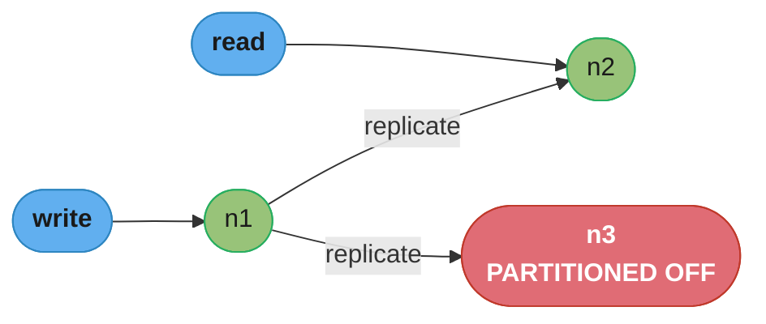
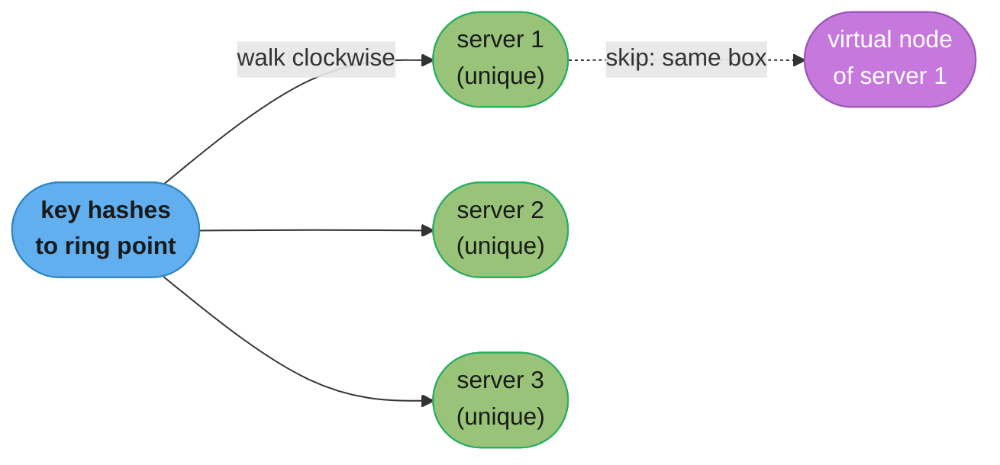
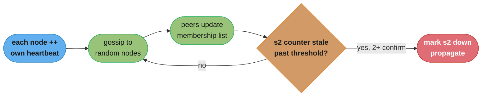
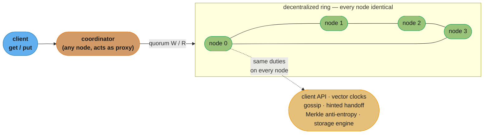
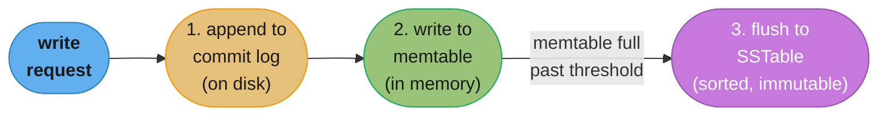
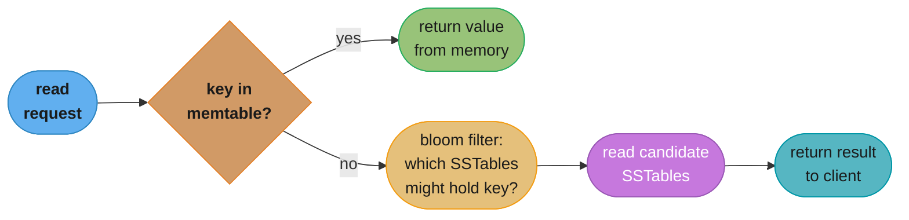
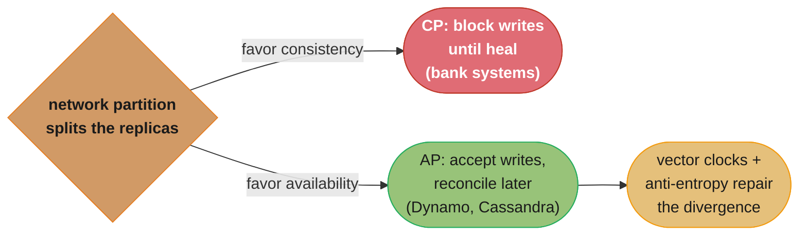

# Chapter 6: Design A Key-Value Store

> Ch 6 of 16 · System Design Interview Vol 1 (Xu) · builds on Ch 5, a mini-Dynamo: the book's deepest chapter and the repo's bridge to DDIA Ch 5–9

## Chapter Map

A key-value store is a non-relational database that keeps a `<key, value>` pair as its unit of
storage — `get(key)` and `put(key, value)` are the entire public API. This chapter builds one
from nothing: it starts with a single in-memory hash table, proves that a single server cannot
scale, and then re-derives — component by component — the exact architecture of Amazon **Dynamo**
and Apache **Cassandra**. Every hard sub-problem of distributed data gets its own tool: consistent
hashing (partitioning), replica walking (replication), quorum `N/W/R` (tunable consistency),
**vector clocks** (conflict detection), **gossip** (failure detection), **sloppy quorum + hinted
handoff** (temporary failures), **anti-entropy with Merkle trees** (permanent failures), and an
LSM **commit-log → memtable → SSTable** storage engine (read/write paths). It is the densest
chapter in the book and the single best bridge into DDIA chapters 5–9.

**TL;DR:**
- The whole design is a set of independent decisions, each answering one goal: *big data* →
  consistent hashing; *high-availability reads* → replication across N nodes and data centers;
  *high-availability writes* → accept conflicting writes and reconcile later with vector clocks;
  *tunable consistency* → the quorum knobs `N`, `W`, `R`.
- **CAP forces a choice.** Network partitions are not optional, so partition tolerance is
  mandatory; a real distributed store is therefore either **CP** (block writes to stay consistent)
  or **AP** (accept writes and reconcile later). Dynamo/Cassandra choose **AP** with eventual
  consistency.
- **Everything is decentralized.** Every node runs the same responsibilities — client API, vector
  clocks, gossip, hinted handoff, Merkle-tree anti-entropy, storage engine — so there is no single
  point of failure and adding/removing nodes is automatic.
- The storage engine is **LSM-tree**: writes go to a commit log then an in-memory memtable, which
  is flushed to immutable sorted **SSTables**; reads consult the memtable, then a **bloom filter**
  to skip SSTables that cannot hold the key.

## The Big Question

> "I need a store that holds far more data than one machine can, never stops answering, keeps
> answering while machines and whole data centers die, and never loses a write — and I want to
> dial the consistency-vs-latency tradeoff myself. What does each of those promises actually cost,
> and how do I build every one of them?"

Analogy: think of the store as a **library with many identical branches** and no head librarian.
A book (value) is filed by its call number (key), and consistent hashing decides *which* branches
hold each book. Every book is copied to the next few branches down the street (replication) so a
branch fire never loses it. When you return an edited copy, you do not wait for every branch to
file it — you accept that two branches might briefly hold different editions and reconcile them the
next time someone checks the book out (eventual consistency, vector clocks). Branches whisper to
each other about who is still open (gossip); if one is closed, a neighbor holds its returns until
it reopens (hinted handoff); and once a week the branches compare catalog checksums to repair any
drift (Merkle-tree anti-entropy). Nobody is in charge, so nobody is a single point of failure.

---

## 6.1 Understand the Problem and Establish Design Scope

A key-value store (also called a key-value database) is a **non-relational** database. Each unique
identifier is stored as a **key** with an associated **value** — the `<key, value>` pair. The key
must be unique, and the value is retrieved through the key. Keys can be plain text (`"last_logged_in_at"`)
or hashed values (`253DDEC4`). For performance, **short keys work better**.

There is no perfect design; every choice trades a specific balance of read/write/memory. What makes
this problem interesting is agreeing on the target properties *before* designing. The chapter fixes
these characteristics:

| Requirement | What it means for the design |
|-------------|------------------------------|
| **Small pairs** | The size of a key-value pair is small — **less than 10 KB**. This lets us treat a value as an opaque blob and keep many in memory. |
| **Store big data** | Must hold far more than one machine can — the reason a single server fails and we go distributed. |
| **High availability** | The system responds quickly, even during failures (node down, data-center outage). |
| **High scalability** | Scales to support large data sets by adding servers. |
| **Automatic scaling** | Servers are added/removed automatically based on traffic, with minimal operator work. |
| **Tunable consistency** | The caller can choose how strong consistency is (the `N/W/R` knobs). |
| **Low latency** | Reads and writes return quickly. |

These seven properties map almost one-to-one onto the components built in §6.4 — the summary table
in §6.5 makes that mapping explicit. Keep the 10 KB value ceiling in mind: it is what makes an
**in-memory hash table** a plausible starting point, and it is why the storage engine can afford to
keep a memtable of recent writes in RAM.

---

## 6.2 Single Server Key-Value Store

Developing a key-value store that lives on a **single server** is easy. The intuitive approach is to
store key-value pairs in a **hash table**, which keeps everything in memory. Memory access is fast,
but fitting *everything* in memory is often impossible due to space constraints. Two optimizations
buy headroom on one machine:

1. **Data compression.** Compress values before storing them, trading CPU for RAM. With ≤10 KB
   values this can multiply effective capacity several-fold.
2. **Hot data in memory, cold data on disk.** Store only frequently used data in memory and put the
   rest on disk — an in-memory cache in front of a disk-backed store. The working set stays fast;
   the long tail is still reachable.

```
                 single-server key-value store

   client --get/put--> [ in-memory hash table ]   fast, but bounded by RAM
                              |  spill
                              v
                       [ hot set in RAM ]  +  [ cold set on disk ]
                       compression applied to both

   Problem: traffic and data grow; one box hits its ceiling. No amount of
   compression or tiering changes that a single server is a hard capacity wall
   and a single point of failure.
```

*Caption: the single-server design is the baseline the rest of the chapter dismantles — compression
and hot/cold tiering delay the ceiling but never remove it, and one server is also one failure
domain.*

Even with both optimizations, a single server reaches capacity quickly, and it is a single point of
failure. To support **big data** and **high availability**, we must distribute the data across many
servers — a **distributed key-value store**.

---

## 6.3 Distributed Key-Value Store

A distributed key-value store — also called a **distributed hash table** — spreads key-value pairs
across many servers. The first thing to understand before designing one is the **CAP theorem**,
because it dictates which promises we can and cannot keep at the same time.

### The CAP theorem

CAP theorem states that it is **impossible for a distributed system to simultaneously provide more
than two of these three guarantees**: **C**onsistency, **A**vailability, and **P**artition
tolerance.

- **Consistency** — all clients see the same data at the same time, no matter which node they connect
  to.
- **Availability** — any client that requests data gets a response, even if some nodes are down.
- **Partition tolerance** — a *partition* is a communication break between two nodes. Partition
  tolerance means the system continues to operate despite network partitions.

Because you can keep at most two of the three, distributed key-value stores are classified by the two
they keep:

- **CP (consistency + partition tolerance)**, sacrificing availability.
- **AP (availability + partition tolerance)**, sacrificing consistency.
- **CA (consistency + availability)**, sacrificing partition tolerance.

### Why partition tolerance is mandatory (CA cannot exist)

In real-world distributed systems, **network failures are unavoidable** — cables are cut, switches
fail, packets drop. When a partition occurs, the system *must* tolerate it. A "CA" system that gives
up partition tolerance is a fiction: the moment a partition happens (and it will), a CA system has no
defined behavior. Therefore **partition tolerance is a must**, and the real design choice is only
between **CP** and **AP**. Every practical distributed store picks a side of that line.

### The n1/n2/n3 partition example — CP vs AP

Consider three replicas `n1`, `n2`, `n3` holding copies of the same data.

**Ideal situation (no partition).** Data written to `n1` is automatically replicated to `n2` and
`n3`. Reads can be served from any node, and the system enjoys both consistency and availability.



*Caption: with no partition, a write to n1 propagates to n2 and n3 and any node can serve a read;
the diagram also shows the failure case — when n3 is cut off, the choice below is forced.*

**Partition situation.** Suppose `n3` goes down and can no longer communicate with `n1` and `n2`. A
client that writes to `n1` or `n2` cannot have the data propagate to `n3`; likewise, data written to
`n3` cannot reach `n1` and `n2`. The designer must now choose:

- **CP system — favor consistency, block writes.** To keep all replicas consistent, we must **block
  all write operations to `n1` and `n2`** until the partition heals, otherwise `n3` would fall
  behind and clients reading `n3` would see stale data. For applications where consistency is
  non-negotiable — **bank systems** are the classic example; a customer must never see an incorrect
  balance — this is the right choice, and the store is **unavailable** for writes during the
  partition.
- **AP system — favor availability, reconcile later.** The system **keeps accepting reads** even
  though they may return stale data, and **keeps accepting writes** on `n1` and `n2`. When the
  partition is resolved, the new writes are **synchronized to `n3`**. The store stays available the
  whole time at the cost of temporarily inconsistent replicas.

Dynamo and Cassandra choose **AP** — availability and partition tolerance — accepting writes during
partitions and reconciling afterwards. That single decision is why the rest of §6.4 needs vector
clocks, sloppy quorum, hinted handoff, and anti-entropy: they are all machinery for living with the
temporary inconsistency that AP deliberately allows.

---

## 6.4 System Components

Building the distributed store means solving a list of sub-problems, each with its own well-known
technique. This section takes them one at a time. Much of the content is derived from the **Dynamo**
and **Cassandra** papers.

### Data partition

For a large application it is infeasible to fit the whole data set on a single server. The simplest
approach is to **split the data into smaller partitions** and store them across multiple servers. Two
challenges arise when partitioning:

1. **Distribute data evenly** across servers so no server is a hotspot.
2. **Minimize data movement** when nodes are added or removed.

**Consistent hashing** (Chapter 5) solves both. Servers are placed on a hash ring; a key is hashed
onto the ring and assigned to the first server found by walking **clockwise** from the key's position.
Only a small fraction of keys move when a server joins or leaves — the keys between the new/removed
server and its predecessor — rather than a full reshuffle.

Consistent hashing gives the partition layer two properties that map directly onto the requirements:

- **Automatic scaling (incremental scalability).** Servers can be **added and removed automatically**
  depending on load, and only the neighboring keys rebalance.
- **Heterogeneity.** The **number of virtual nodes** for a server is **proportional to its capacity**.
  A more powerful server is assigned more virtual nodes, so it naturally receives a larger share of
  the keys. This lets a cluster mix machine sizes without hotspots.

```
consistent-hashing ring (clockwise assignment)

           s0
        .        .
     s3            s1        key k hashes to a point on the ring;
       .          .          walk clockwise -> first server owns k
          s2 --k-->          (virtual nodes per server ~ capacity)

adding s4 between s1 and s2 moves ONLY the keys in that arc -> minimal reshuffle
```

*Caption: consistent hashing is the load-spreading primitive; virtual-node counts scaled to capacity
give heterogeneity, and only the arc around a new node reshuffles on scale-out.*

### Data replication

To achieve **high availability and reliability**, data must be replicated asynchronously over **N**
servers, where `N` is a configurable parameter. The placement rule reuses the ring:

> After a key is mapped to a position on the hash ring, **walk clockwise from that position and
> choose the first N servers** on the ring to store data copies.

There is one subtlety introduced by virtual nodes: with virtual nodes, the first N *positions*
walking clockwise may map to **fewer than N distinct physical servers** (several virtual nodes can
belong to the same machine). To get true redundancy, **choose only unique servers** while walking
clockwise — skip virtual nodes whose physical server is already selected.

**Cross-data-center placement.** Nodes in the same data center often fail together — power outages,
network failures, natural disasters, or a fire hit the whole facility. For genuine reliability,
replicas are placed in **distinct data centers** connected over high-speed networks. This is what
lets the store survive a full data-center outage (see "Handling failures" below).



*Caption: N=3 replication walks clockwise and picks the first three UNIQUE physical servers, skipping
virtual nodes that resolve to an already-chosen machine; spreading those three across data centers is
what survives a facility outage.*

### Consistency

Since data is replicated at multiple nodes, it must be **synchronized across replicas**. **Quorum
consensus** guarantees consistency for both reads and writes. Define:

- **N** — the number of replicas.
- **W** — the **write quorum** size. A write is considered successful only when it is acknowledged
  from **W replicas**.
- **R** — the **read quorum** size. A read is considered successful only after it collects responses
  from at least **R replicas**.

A **coordinator** acts as a **proxy** between the client and the nodes. For a `put`, the coordinator
sends the write to all N replicas and waits for `W` acknowledgments before declaring success; for a
`get`, it queries replicas and waits for `R` responses before returning.

**Worked example, N = 3.** If `W = 1`, the coordinator must receive **one** acknowledgment before
the write is considered successful. This does **not** mean the data is written to only one node — it
is still sent to all three replicas — it means the coordinator only *waits* for one ack before
returning to the client. A larger `W` means the coordinator waits for more (and therefore slower)
replicas.

The configuration of `W`, `R`, and `N` is a tradeoff between **latency and consistency**:

| Configuration | Effect |
|---------------|--------|
| `W = 1` or `R = 1` | Fast — the coordinator only waits for **one** node before returning. |
| `W > 1` or `R > 1` | Better consistency, but slower — the query waits for the **slowest** of the required replicas. |
| `W + R > N` | **Strong consistency guaranteed** — the read set and write set always overlap in at least one node that holds the latest data. |
| `R = 1, W = N` | Optimized for **fast reads** (read one node, but every write must reach all N). |
| `W = 1, R = N` | Optimized for **fast writes** (ack after one node, but reads must check all N). |
| `W + R ≤ N` | Strong consistency is **not** guaranteed (read and write sets may not overlap). |

There is no single best choice; you pick `N/W/R` to hit the latency-vs-consistency point your
application needs. This is exactly the **tunable consistency** requirement from §6.1.

**Consistency models.** The quorum knobs sit inside a spectrum of consistency models:

- **Strong consistency** — any read returns the value of the most recent write; a client never sees
  stale data.
- **Weak consistency** — subsequent reads may not see the most recently written value.
- **Eventual consistency** — a specific form of weak consistency: given enough time, all updates
  propagate and **all replicas become consistent**.

Strong consistency is usually achieved by forcing a replica to reject reads/writes until every
replica agrees on the current write — which is unappealing for a **highly available** system.
**Dynamo and Cassandra adopt eventual consistency**, our recommended model for this key-value store.
Eventual consistency allows inconsistent values to enter the system and **pushes reconciliation onto
the client**: on concurrent writes, values may diverge, and the client must read the divergent
versions and reconcile them. That reconciliation mechanism is **versioning with vector clocks**.

### Inconsistency resolution: versioning (vector clocks)

Replication gives high availability but introduces **inconsistencies among replicas**. **Versioning**
and **vector clocks** are used to resolve them. Versioning means treating each modification as a new,
immutable version of the data.

**The conflict.** Suppose two replicas hold the same value `name = "john"`. Server 1 changes the name
to `"johnSanFrancisco"` and, at the same time, server 2 changes it to `"johnNewYork"`. These two
changes happen concurrently, producing two versions — call them `v1` and `v2`. The old value can be
ignored because the changes are based on it, but there is **no clear way to automatically resolve the
conflict** between the two new versions. We need a versioning system that can detect and reconcile
conflicts — a **vector clock**.

**Definition.** A vector clock is a **`[server, version]` pair** associated with a data item. It tells
whether one version **precedes**, **succeeds**, or is in **conflict** with another. A vector clock is
written `D([S1, v1], [S2, v2], …, [Sn, vn])`, where `D` is the data item, `Si` is a server, and `vi`
is a version counter for that server.

**Update rule.** If a data item `D` is written to server `Si`:
- if `[Si, vi]` already exists in `D`'s clock, **increment `vi`**;
- otherwise, **create a new entry `[Si, 1]`**.

**The full worked example.** Follow one item through concurrent edits:

```
vector-clock evolution (one item, edited concurrently on Sx, Sy, Sz)

  D1 = D([Sx,1])                write handled by Sx
        |
        v  (update handled by Sx: increment Sx)
  D2 = D([Sx,2])                D2 descends from D1  (no conflict)
        |
        +------------------------------+
        | update handled by Sy         | update handled by Sz
        v                              v
  D3 = D([Sx,2],[Sy,1])          D4 = D([Sx,2],[Sz,1])
        \                              /
         \___ CONFLICT: D3 and D4 are siblings ___/
              (both descend from D2, diverged on different servers)

  client reads D3 and D4, reconciles, writes back (handled by Sx):
  D5 = D([Sx,3],[Sy,1],[Sz,1])   conflict resolved, supersedes D3 and D4
```

*Caption: the counters record which server advanced each version; D3 and D4 both carry `[Sx,2]` but
one has `[Sy,1]` and the other `[Sz,1]` with neither dominating — that is the signature of a conflict,
and reconciliation merges both into D5.*

**Detecting conflict vs ancestor.** Version `X` is an **ancestor** of version `Y` (so `Y` supersedes
`X`, and there is **no conflict** — just discard `X`) **iff for every counter in `X`'s clock, that
counter is less than or equal to the corresponding counter in `Y`'s clock.** If neither is an ancestor
of the other — some counter is larger in `X` and some is larger in `Y` — the versions are **siblings /
in conflict** and must be reconciled (here `D3` has `[Sy,1]` but no `Sz`, while `D4` has `[Sz,1]` but
no `Sy`, so neither dominates).

**Downsides of vector clocks.** Two:

1. **Client complexity.** Vector clocks add complexity to the client, because the **client must
   implement the conflict-resolution logic** to merge siblings.
2. **Unbounded growth → truncation.** The `[server, version]` pairs in the vector clock **grow
   rapidly** as more servers touch an item. The fix is to set a **threshold** on the length and
   **remove the oldest pairs** when it is exceeded. This can cause **inefficiency in reconciliation**
   because the descendant relationship can no longer be determined accurately once old entries are
   dropped. However, according to the **Dynamo paper, Amazon never encountered this problem in
   production**, so it is likely acceptable for most companies.

### Handling failures

Failures are the norm at scale. Handling them has three parts — detecting failures, riding out
temporary ones, and repairing permanent ones — plus a data-center-scale case.

#### Failure detection — gossip protocol

In a distributed system, it is **not enough to believe a server is down just because one other server
says so**. Usually **at least two independent sources** must confirm a node is down before marking it
down.

The naive approach is **all-to-all multicast**: every node heartbeats to every other node. It is
straightforward but **inefficient when there are many servers** — it costs on the order of `N²`
messages per round.

A better solution is the **gossip protocol**, a decentralized failure detector:

1. Each node maintains a **node membership list** — the set of member IDs, each with a **heartbeat
   counter**.
2. Each node **periodically increments its own heartbeat counter**.
3. Each node **periodically sends heartbeats to a set of random nodes**, which in turn **propagate**
   the information to another set of nodes.
4. When a node receives heartbeats, it **updates its membership list** to the latest information.
5. If a member's heartbeat counter has **not increased for more than a predefined period**, that
   member is considered **offline**.

**Worked flow.** Node `s0` keeps a membership list. It notices that `s2`'s heartbeat counter (say
`58`) has not increased for a long time. `s0` sends heartbeats that include `s2`'s stale information
to a set of random nodes. Once other nodes confirm that `s2`'s counter has indeed not been updated,
`s2` is **marked as down**, and this information is **propagated** to the rest of the cluster via
gossip.



*Caption: gossip replaces O(N²) all-to-all heartbeats with random propagation; a node is declared
down only after its heartbeat counter goes stale past a threshold and multiple peers confirm it —
avoiding a single node's false accusation.*

#### Temporary failures — sloppy quorum + hinted handoff

After failures are detected through gossip, the system needs a way to **stay available**. A **strict
quorum** approach would **block reads and writes** whenever it cannot assemble `R`/`W` of the *exact*
replica set — bad for availability.

**Sloppy quorum** relaxes this. Instead of enforcing the strict quorum on the exact replica set, the
system chooses the **first W healthy servers for writes** and the **first R healthy servers for
reads** on the hash ring, **ignoring the down servers**. Down nodes are simply skipped over as the
coordinator walks the ring.

**Hinted handoff** repairs what sloppy quorum papered over. If a server is down, **another server
temporarily processes requests** on its behalf. That stand-in keeps a **hint** recording who the data
actually belongs to. When the down server comes **back up**, the changes are **pushed back** to it to
achieve data consistency, and the hint is discarded.

```
sloppy quorum + hinted handoff  (N=3, replicas for key k = {s1, s2, s3})

  s2 is DOWN. Coordinator still needs W acks, so it walks the ring and
  picks the next HEALTHY server (s4) as a temporary stand-in:

    write k -> s1 (ok)
             -> s2 (down) -> s4 holds k WITH a hint: "belongs to s2"
             -> s3 (ok)

  s2 recovers -> s4 replays the hinted writes to s2 -> deletes the hint
  Availability preserved during the outage; consistency restored after.
```

*Caption: sloppy quorum keeps writes flowing by borrowing the next healthy node, and the hint is the
bookkeeping that lets the borrowed data flow back to the rightful owner on recovery.*

#### Permanent failures — anti-entropy with Merkle trees

Hinted handoff handles brief outages, but if a replica is **permanently lost** (disk dies, node
replaced), its data must be rebuilt from the surviving replicas. The **anti-entropy protocol** keeps
replicas in sync by **comparing each piece of data on the replicas and updating to the newest
version**. A **Merkle tree** is used to detect inconsistencies and **minimize the amount of data
transferred**.

**Definition.** A Merkle tree (hash tree) is a tree in which **every non-leaf node is labeled with
the hash of the labels or values of its child nodes**. It allows efficient and secure verification of
the contents of a large data structure.

**Building a Merkle tree** (example: key space `1..12`, where some keys have diverged on one replica):

1. **Divide the key space into buckets** — here, 4 buckets. Buckets keep the tree's depth limited.
2. **Hash each key** within a bucket using a uniform hashing method.
3. **Create one hash node per bucket** by hashing the keys in that bucket together.
4. **Build the tree upward to the root** by hashing children into parents until a single root hash
   remains.

```
Merkle tree over key space 1..12, 4 buckets (1000 keys/bucket in production)

   bucket 1      bucket 2       bucket 3      bucket 4
   keys 1..3     keys 4..6      keys 7..9     keys 10..12
   ------------  ------------   ------------  ------------
 A:  h=A1          h=A2           h=A3          h=A4        replica A leaf hashes
 B:  h=A1          h=B2 (diff)    h=A3          h=A4        replica B: only bucket 2 differs
                          ^ divergent key lands in bucket 2

 level-1:   h(A1,A2)            h(A3,A4)
 A:         L = h(A1,A2)        R = h(A3,A4)
 B:         L'= h(A1,B2)  DIFF  R = h(A3,A4)  SAME

 root:      A: h(L, R)     vs    B: h(L', R)     -> roots DIFFER -> descend
```

*Caption: only bucket 2 diverges, so only the left subtree's hashes differ; comparing top-down means A
and B sync **just bucket 2**, never the identical buckets 1, 3, and 4.*

**Comparing two Merkle trees.** Start by comparing the **root hashes**. If the root hashes **match**,
the two servers have identical data — done, nothing to transfer. If the roots **disagree**, compare
the **left child hashes**, then the **right child hashes**, recursing down only the branches that
differ, until the specific **buckets that are out of sync** are found. Then **synchronize only those
buckets**.

The payoff: with Merkle trees, the amount of data that must be synchronized is **proportional to the
differences between the two replicas, not to the total amount of data they hold**. In real-world
systems the bucket size is large — one possible configuration is **one million buckets per one billion
keys**, i.e. **1,000 keys per bucket**. If only a handful of keys differ, only their buckets (a few
thousand keys) move, instead of a billion.

#### Handling data center outage

A data-center outage can happen due to power outage, network outage, or natural disaster. To survive
it, **replicate data across multiple data centers** (as introduced under "Data replication"). Even if
one data center is completely offline, users can still access their data through the other data
centers.

### System architecture diagram

Putting the components together yields the architecture below. Its main features:

- Clients communicate with the key-value store through simple APIs: **`get(key)`** and
  **`put(key, value)`**.
- A **coordinator** is a node that acts as a **proxy** between the client and the key-value store.
- **Nodes are distributed on a ring** using consistent hashing.
- The system is **completely decentralized**, so adding and removing nodes can be automatic.
- **Data is replicated at multiple nodes.**
- There is **no single point of failure**, because **every node has the same set of
  responsibilities**.



*Caption: the coordinator is not a special master — it is just whichever node received the request;
every node on the ring carries the identical duty set, which is precisely why there is no single point
of failure.*

Because the design is decentralized, **each node performs many tasks** (based on the Dynamo paper):

| Responsibility | Purpose |
|----------------|---------|
| **Client API** | Serve `get(key)` / `put(key, value)`. |
| **Inconsistency resolution** | Reconcile divergent versions using **vector clocks**. |
| **Failure detection** | Detect down nodes via **gossip**. |
| **Failure repair (temporary)** | **Hinted handoff** for down-node writes. |
| **Anti-entropy (permanent)** | Keep replicas in sync using **Merkle trees**. |
| **Storage engine** | Persist and retrieve the actual `<key, value>` data. |

### Write path

The write path is based on the architecture of **Cassandra**. A write request flows through three
stages:

1. The write request is **persisted to a commit log** file on disk (durability — survives a crash
   before the flush).
2. The data is **saved in the memory cache**, called a **memtable**.
3. When the memtable is **full** (reaches a predefined threshold), the data is **flushed to an
   SSTable** on disk. An **SSTable (Sorted-String Table)** is a **sorted list of `<key, value>`
   pairs**; once written it is **immutable**.



*Caption: the commit log makes the write durable before it is anywhere else, the memtable keeps it
fast in RAM, and the threshold-triggered flush turns a batch of memtable writes into one sequential,
immutable SSTable — the LSM-tree write path.*

### Read path

After a read request arrives at a node, the system first checks whether the data is in the
**memtable**. If it is, the value is **returned directly**. If not, the read has to look on disk, and
it uses a **bloom filter** to avoid touching SSTables that cannot possibly hold the key.

The read path when the data is **not** in memory:

1. The system first checks if the data is **in memory (memtable)**. If not, go to step 2.
2. Consult the **bloom filter**.
3. The bloom filter is used to figure out **which SSTables might contain the key** (it can say
   "definitely not here" or "maybe here", never a false negative).
4. The candidate **SSTables return the data set** for the key.
5. The result is **returned to the client**.



*Caption: the bloom filter is the read path's efficiency trick — instead of scanning every SSTable on
a memtable miss, it prunes to the few SSTables that might contain the key, turning a potential
many-file scan into one or two disk lookups.*

---

## 6.5 Summary

The chapter's closing table maps each **goal / problem** to the **technique** that solves it — a
compact index of everything built above.

| Goal / Problem | Technique |
|----------------|-----------|
| Ability to store big data | **Consistent hashing** to spread the load across servers |
| High availability for reads | **Data replication** + **multi-data-center** setup |
| Highly available writes | **Versioning and conflict resolution** with **vector clocks** |
| Dataset partition | **Consistent hashing** |
| Incremental scalability | **Consistent hashing** |
| Heterogeneity | **Consistent hashing** (virtual-node count ∝ capacity) |
| Tunable consistency | **Quorum consensus** (`N`, `W`, `R`) |
| Handling temporary failures | **Sloppy quorum** and **hinted handoff** |
| Handling permanent failures | **Merkle tree** (anti-entropy) |
| Handling data-center outage | **Cross-data-center replication** |

**Lineage.** The design is a synthesis of three landmark systems:

- **Amazon Dynamo** — the AP, eventually-consistent, decentralized architecture: consistent hashing,
  quorum `N/W/R`, vector clocks, sloppy quorum + hinted handoff, gossip, and Merkle-tree anti-entropy
  all come from the Dynamo paper.
- **Apache Cassandra** — the concrete storage engine: the commit-log → memtable → SSTable write path
  and the bloom-filter read path modeled in §6.4 follow Cassandra.
- **Google BigTable** — the original LSM-tree storage design (SSTables, memtable, bloom filters) that
  Cassandra's storage layer descends from.

Put together, this is a **mini-Dynamo**: a decentralized, highly available, eventually-consistent,
horizontally-scalable key-value store where every node is identical and the consistency-vs-latency
tradeoff is a dial the caller controls.

---

## Visual Intuition

The two mechanics worth seeing side by side are the **quorum overlap** that makes `W + R > N` strong,
and the **CP-vs-AP fork** the whole distributed design hinges on.

```
quorum overlap: why W + R > N is strong consistency (N=3)

  replicas:   [ r1 ] [ r2 ] [ r3 ]

  W=2 write  ->  r1  r2          (two acked, newest value on r1,r2)
  R=2 read   ->        r2  r3    (two read; r2 is in BOTH sets)
                         ^ overlap: the read is guaranteed to see r2's
                           latest value  => W+R (=4) > N (=3)

  W=1, R=1:  write r1, read r3  -> NO overlap possible -> may read stale
             W+R (=2) <= N (=3) -> strong consistency NOT guaranteed
```

*Caption: strong consistency is not magic — it is pigeonhole arithmetic: if the write set and read set
each exceed half the replicas, they must share at least one node, and that shared node carries the
latest write.*



*Caption: partitions are unavoidable, so the only real choice is which promise to break — CP breaks
availability by blocking writes, AP breaks consistency and pays for it later with vector-clock
reconciliation and Merkle-tree repair.*

---

## Key Concepts Glossary

- **Key-value store** — a non-relational database keyed by a unique key; API is `get`/`put`.
- **`get(key)` / `put(key, value)`** — the only two public operations.
- **Single-server hash table** — the in-memory baseline design; bounded by RAM.
- **Data compression** — shrink values to fit more in memory (single-server optimization).
- **Hot/cold tiering** — keep frequently used data in memory, the rest on disk.
- **Distributed hash table** — key-value pairs spread across many servers.
- **CAP theorem** — a distributed system can guarantee at most two of Consistency, Availability,
  Partition tolerance.
- **Consistency (CAP)** — all clients see the same data at the same time.
- **Availability (CAP)** — every request gets a response even if some nodes are down.
- **Partition tolerance** — the system keeps operating despite a network partition.
- **CP system** — consistency + partition tolerance; blocks writes during a partition (e.g. banks).
- **AP system** — availability + partition tolerance; accepts writes during a partition, reconciles
  later (Dynamo, Cassandra).
- **CA system** — consistency + availability; impossible in practice because partitions are
  unavoidable.
- **Consistent hashing** — ring-based partitioning; minimal key movement on membership change.
- **Virtual nodes** — multiple ring positions per server; count ∝ capacity gives heterogeneity.
- **Data replication (N)** — store a key's value on the next N unique servers clockwise on the ring.
- **Coordinator** — the node acting as a proxy between client and replicas for a request.
- **Quorum consensus** — require `W` acks for a write and `R` responses for a read.
- **N / W / R** — replica count / write quorum / read quorum.
- **`W + R > N`** — the condition guaranteeing strong consistency (read and write sets overlap).
- **Strong consistency** — a read always returns the most recent write.
- **Weak consistency** — a later read may not see the most recent write.
- **Eventual consistency** — given enough time, all replicas converge (Dynamo/Cassandra default).
- **Versioning** — treating each modification as a new immutable version.
- **Vector clock** — a set of `[server, version]` pairs used to detect conflicts vs ancestry.
- **Sibling / conflict** — two versions where neither's clock dominates the other.
- **Ancestor** — a version whose clock is ≤ another's on every counter (safe to discard).
- **Clock truncation** — dropping oldest `[server, version]` pairs to bound clock size.
- **Gossip protocol** — decentralized failure detection via random heartbeat propagation.
- **Heartbeat counter** — a per-node counter incremented each round; staleness ⇒ node down.
- **All-to-all multicast** — naive O(N²) failure detection that gossip replaces.
- **Strict quorum** — enforce `W`/`R` on the exact replica set (may block on failures).
- **Sloppy quorum** — use the first `W`/`R` **healthy** servers on the ring, skipping down ones.
- **Hinted handoff** — a stand-in server temporarily holds a down node's writes, with a hint, and
  replays them on recovery.
- **Anti-entropy** — background process comparing replicas and syncing to the newest version.
- **Merkle tree** — hash tree where each non-leaf node hashes its children; enables comparing
  replicas with data transfer proportional to the differences.
- **Bucket (Merkle)** — a slice of the key space that becomes a leaf-level hash node (~1000 keys).
- **Storage engine** — the component persisting/retrieving data (LSM-tree here).
- **Commit log** — durable append-only log a write hits first.
- **Memtable** — in-memory write buffer.
- **SSTable (Sorted-String Table)** — an immutable, sorted on-disk list of `<key, value>` pairs.
- **Bloom filter** — probabilistic set membership test used to skip SSTables that cannot hold a key.

---

## Tradeoffs & Decision Tables

**CAP choice for a distributed store:**

| System type | Keeps | Sacrifices | Behavior on partition | Example |
|-------------|-------|------------|-----------------------|---------|
| CP | Consistency, Partition tolerance | Availability | Blocks writes until healed | Bank / ledger systems |
| AP | Availability, Partition tolerance | Consistency | Accepts writes, reconciles later | Dynamo, Cassandra |
| CA | Consistency, Availability | Partition tolerance | Undefined — cannot exist in practice | (none) |

**Quorum tuning (`N`, `W`, `R`):**

| Setting | Optimized for | Consistency | Note |
|---------|---------------|-------------|------|
| `W = 1, R = 1` | Lowest latency both ways | Weakest | Wait for one node each |
| `R = 1, W = N` | Fast reads | Strong reads | Every write hits all N (slow writes) |
| `W = 1, R = N` | Fast writes | Strong reads only if `1 + N > N` (yes) | Reads check all N (slow reads) |
| `W + R > N` | Balanced | **Strong** | Read/write sets overlap |
| `W + R ≤ N` | Availability/latency | Not guaranteed | Sets may not overlap |

**Failure handling, by failure lifetime:**

| Failure kind | Detection | Repair technique | What it buys |
|--------------|-----------|------------------|--------------|
| Node slow/gone (suspected) | Gossip heartbeats | (marks down after threshold + 2nd confirmation) | Cheap O(N)-ish detection |
| Temporary node outage | Gossip | Sloppy quorum + hinted handoff | Writes keep succeeding; replayed on recovery |
| Permanent replica loss | Gossip | Anti-entropy + Merkle tree | Sync only the differing buckets |
| Data-center outage | (ops/monitoring) | Cross-data-center replication | Survive a whole facility going dark |

**Conflict resolution options:**

| Approach | How it decides | Weakness |
|----------|----------------|----------|
| Last-write-wins (LWW) | Pick the highest timestamp | Silently drops a concurrent write; needs synced clocks |
| Vector clocks | Detect ancestry vs sibling precisely | Client must merge siblings; clock grows (truncation) |

---

## Common Pitfalls / War Stories

- **Believing you can have CA.** Interviewers push candidates who say "I'll build a CA system." A
  partition *will* happen; the honest answer is CP or AP, and you must name which promise you drop.
  Saying "CA" signals you have not internalized that partition tolerance is non-negotiable.
- **Thinking `W = 1` means the write goes to only one node.** It does not — the write is sent to all N
  replicas; `W` is only how many acks the coordinator *waits for*. Confusing "acks waited for" with
  "copies written" is the classic quorum misread.
- **Assuming quorum with `W + R > N` gives strong consistency in an AP store.** The overlap guarantee
  holds under a **strict** quorum. With **sloppy** quorum (used for availability), writes may land on
  stand-in nodes, so a `W + R > N` read can still miss the latest value until hinted handoff completes
  — availability was bought with a consistency asterisk.
- **Resolving conflicts with last-write-wins by default.** LWW is easy but **silently discards** one
  of two genuinely concurrent writes and depends on synchronized wall clocks (which drift). Vector
  clocks detect the conflict so the application can merge (e.g. Dynamo's shopping cart merges both
  carts rather than dropping one). Choose LWW only when losing a concurrent write is acceptable.
- **Ignoring vector-clock growth.** The `[server, version]` list grows with every server that touches
  an item; without a truncation threshold it bloats. Truncation risks incorrect ancestry decisions —
  though Amazon reported never hitting this in production, so a threshold is a safe, pragmatic default.
- **All-to-all heartbeats "for simplicity".** It looks simple but is O(N²) messages per round and melts
  the network as the cluster grows. Gossip is the standard for a reason; reach for it from the start.
- **Trusting a single node's "X is down" verdict.** A momentary network blip between two nodes is not
  a node failure. Require **2+ independent confirmations** (via gossip) before marking a node down, or
  you will evict healthy nodes and trigger needless rebalancing.
- **Not co-designing replica placement with data centers.** Putting all N replicas in one data center
  makes the "high availability" claim hollow — a facility power loss takes down every copy. Spread
  replicas across data centers even though it costs cross-DC latency.
- **Forgetting the commit log.** If writes go straight to the memtable and the node crashes before the
  flush, the data is gone. The commit-log append **before** the memtable write is what makes the write
  durable; skipping it trades durability for a tiny latency win.

---

## Real-World Systems Referenced

- **Amazon Dynamo** — the paper this whole design is derived from: consistent hashing, quorum `N/W/R`,
  vector clocks, sloppy quorum + hinted handoff, gossip failure detection, Merkle-tree anti-entropy,
  and the fully decentralized ring; also the source of the "clock truncation never bit us in
  production" observation.
- **Apache Cassandra** — the write path (commit log → memtable → SSTable) and read path (memtable →
  bloom filter → SSTable) are modeled on Cassandra; also a real AP, tunable-consistency store.
- **Google BigTable** — the original LSM-tree storage engine (SSTable, memtable, bloom filter) that
  Cassandra's storage layer descends from.
- **Bank / ledger systems** — the book's example of a domain that must be **CP** (consistency over
  availability).

---

## Summary

We designed a distributed key-value store from first principles and, component by component, arrived
at the architecture of Dynamo and Cassandra. A **single-server** hash table — even with compression
and hot/cold tiering — hits a hard capacity wall and is a single point of failure, forcing a
**distributed** design. The **CAP theorem** says partition tolerance is mandatory, so the real choice
is **CP** (block writes to stay consistent, as banks do) versus **AP** (accept writes and reconcile
later, as Dynamo/Cassandra do). Choosing AP with **eventual consistency**, we assembled the machinery:
**consistent hashing** partitions data and gives automatic scaling and heterogeneity; **replication**
across the next N unique servers (and across data centers) delivers availability; **quorum `N/W/R`**
makes consistency a tunable dial where `W + R > N` is strong; **vector clocks** detect write conflicts
so clients can reconcile; **gossip** detects failures cheaply; **sloppy quorum + hinted handoff** ride
out temporary outages; **Merkle-tree anti-entropy** repairs permanent loss by syncing only the
differing buckets; and **cross-data-center replication** survives a facility outage. Underneath, an
**LSM-tree** storage engine writes through a commit log to a memtable and flushes immutable SSTables,
reading via a bloom filter — every node identical, no single point of failure, and the whole
consistency-vs-latency tradeoff under the caller's control.

---

## Interview Questions

**Q: In the CAP theorem, why can't a real distributed system be CA (consistency + availability)?**
Because network partitions are unavoidable, so partition tolerance is mandatory, leaving only CP or AP as real choices. Cables cut, switches fail, and packets drop in any real deployment; a "CA" system has no defined behavior the moment a partition occurs, and one always eventually does. The honest design decision is therefore whether to sacrifice availability (CP) or consistency (AP) when a partition hits — never to claim you kept all three.

**Q: When a partition splits the replicas, what does a CP system do versus an AP system?**
A CP system blocks writes to keep every replica consistent, while an AP system keeps accepting writes and reconciles the divergence after the partition heals. In the CP case, nodes on the reachable side refuse writes so no replica falls behind — good for bank systems where a wrong balance is unacceptable, at the cost of unavailability. In the AP case (Dynamo, Cassandra), writes continue on the reachable nodes and are synchronized to the isolated node once it rejoins, trading temporary inconsistency for continuous availability.

**Q: In quorum consensus, does W=1 mean the write is sent to only one replica?**
No — the write is still sent to all N replicas; W=1 only means the coordinator waits for one acknowledgment before calling the write successful. W is the number of acks the coordinator blocks on, not the number of copies made. This is the most common quorum misread: raising W increases how many (and thus how slow) the replicas it waits for, improving consistency at the cost of latency, but the data always propagates to all N.

**Q: What does the condition W + R > N guarantee, and why?**
It guarantees strong consistency because the write set of W replicas and the read set of R replicas must overlap in at least one node holding the latest value. It is pigeonhole arithmetic: if W + R exceeds N, the two subsets cannot be disjoint, so any read touches at least one replica that received the most recent write. For example with N=3, W=2, R=2 (sum 4 > 3) the sets always share a node; with W=1, R=1 (sum 2 ≤ 3) they can miss each other and the read may be stale.

**Q: What is the difference between a lost-update conflict and a vector-clock sibling conflict, and when does last-write-wins fail?**
A vector-clock sibling conflict is two genuinely concurrent versions where neither clock dominates the other, and last-write-wins fails because it silently discards one of them. LWW picks the higher timestamp, which drops a real concurrent update and depends on synchronized wall clocks that drift. Vector clocks instead detect that neither version is an ancestor of the other so the client can merge both (as Dynamo merges two shopping carts) rather than losing a write.

**Q: What is a vector clock and how does it distinguish a conflict from an ancestor?**
A vector clock is a set of [server, version] pairs attached to a data item; version X is an ancestor of Y if every counter in X is ≤ the matching counter in Y, otherwise they conflict. If X is an ancestor, Y supersedes it and X can be discarded with no conflict. If some counter is larger in X and some larger in Y — neither dominates — the two are siblings that must be reconciled, which is exactly the D3([Sx,2],[Sy,1]) versus D4([Sx,2],[Sz,1]) case.

**Q: Walk through the vector-clock worked example from D1 to the reconciled D5.**
A single item starts as D1([Sx,1]), is updated on Sx to D2([Sx,2]), then diverges into D3([Sx,2],[Sy,1]) on Sy and D4([Sx,2],[Sz,1]) on Sz, which conflict and are merged into D5([Sx,3],[Sy,1],[Sz,1]). D3 and D4 both descend from D2 but each carries a counter the other lacks (Sy versus Sz), so neither is an ancestor. A client reads both siblings, reconciles them, and writes back on Sx, producing D5 whose clock dominates both and resolves the conflict.

**Q: What is the difference between a strict quorum and a sloppy quorum, and why use sloppy?**
A strict quorum requires W/R acks from the exact replica set for a key, whereas a sloppy quorum uses the first W (or R) healthy servers on the ring, skipping down ones. Sloppy quorum is used to improve availability: rather than blocking a write because a designated replica is down, the coordinator borrows the next healthy node so the write still succeeds. The borrowed data is later returned to the rightful replica through hinted handoff once it recovers.

**Q: How does hinted handoff work, and what problem does it solve?**
When a replica is down, another server temporarily processes its requests and keeps a hint recording who the data belongs to, then pushes the data back when the down node recovers. It solves temporary failures: paired with sloppy quorum, it keeps writes succeeding during a brief outage without permanently misplacing the data. The stand-in stores the writes plus a hint of the intended owner, replays them on recovery, and then deletes the hint, restoring consistency.

**Q: Why is gossip preferred over all-to-all multicast for failure detection?**
Gossip is preferred because all-to-all multicast costs on the order of N² messages per round and does not scale, while gossip spreads heartbeats to random peers in roughly linear cost. Each node increments its own heartbeat counter and periodically sends its membership list to a few random nodes, which propagate it further. A node whose counter stops increasing past a threshold is marked down and that fact gossips out — achieving cluster-wide detection without every node pinging every other node.

**Q: Why shouldn't one node's report be enough to mark another node as down?**
Because a momentary network blip between two nodes is not a real node failure, so at least two independent sources should confirm before marking a node down. A single node seeing a missed heartbeat may just have a transient link problem, and evicting a healthy node triggers needless rebalancing and data movement. Gossip naturally provides multiple confirmations: several peers observe the stale heartbeat counter before the node is declared offline and the verdict is propagated.

**Q: How does a Merkle tree minimize the data transferred during anti-entropy repair?**
It lets two replicas compare root hashes and recurse only into subtrees whose hashes differ, so the data synced is proportional to the differences, not the total data. If the roots match, the replicas are identical and nothing transfers; if they differ, the comparison walks down only the divergent branches to find the specific out-of-sync buckets. With, say, one million buckets over one billion keys (1,000 keys per bucket), a few differing keys move only their buckets instead of the whole billion.

**Q: Build the 4-bucket Merkle-tree comparison — how are only the divergent buckets found?**
The key space is split into buckets (4 here), each key hashed, one hash node made per bucket, and the tree built up to a root; comparing top-down isolates the differing bucket. If replica B diverges only in bucket 2, then bucket 2's leaf hash differs, which makes the left-subtree hash differ, which makes the root differ. Comparing root, then children, then leaves walks only the left branch and pinpoints bucket 2, so replicas A and B sync just that bucket and leave buckets 1, 3, and 4 untouched.

**Q: Trace the write path in the storage engine.**
A write is first appended to the commit log on disk, then written to the in-memory memtable, and when the memtable fills past a threshold it is flushed to an immutable SSTable. The commit log gives durability so the write survives a crash before the flush; the memtable keeps recent writes fast in RAM; and the flush turns a batch of memtable entries into one sequential, sorted, immutable SSTable. This is the LSM-tree write path, modeled on Cassandra.

**Q: Trace the read path and explain the bloom filter's role.**
The read checks the memtable first and returns immediately on a hit; on a miss it consults a bloom filter to find which SSTables might contain the key, reads those, and returns the result. The bloom filter is a probabilistic membership test that can say "definitely not here" or "maybe here" but never gives a false negative, so it safely prunes SSTables that cannot hold the key. Without it, a memtable miss would require scanning every SSTable on disk; with it, the read touches only the few candidate files.

**Q: Why does replication walk clockwise to the next N unique servers rather than the next N ring positions?**
Because with virtual nodes the next N ring positions can map to fewer than N distinct physical servers, so choosing unique servers is what guarantees N real copies. Several virtual nodes may belong to the same machine, and if two replicas of a key landed on the same box, a single machine failure would lose two copies at once. Walking clockwise while skipping positions whose physical server is already chosen ensures the N replicas sit on N different machines, ideally in different data centers.

**Q: What are the three consistency models, and which one do Dynamo and Cassandra choose?**
Strong consistency returns the most recent write on every read, weak consistency may return a stale value, and eventual consistency is a weak form where replicas converge given enough time — the model Dynamo and Cassandra choose. Strong consistency requires blocking replicas until they agree, which hurts availability, so a highly available store instead accepts temporary divergence. Eventual consistency lets inconsistent values enter and pushes reconciliation to the client, which is why vector clocks and anti-entropy are part of the design.

**Q: How does consistent hashing provide heterogeneity across differently-sized servers?**
By assigning each server a number of virtual nodes proportional to its capacity, so a more powerful machine owns more ring positions and receives a larger share of keys. A server twice as capable gets roughly twice the virtual nodes and therefore twice the key range, without any manual sharding. This lets a cluster mix machine sizes while keeping load balanced, and it is the same mechanism that gives automatic incremental scaling when nodes join or leave.

**Q: Why does the single-server key-value store fail to scale even with compression and hot/cold tiering?**
Because both optimizations only delay a fixed capacity ceiling and leave the server as a single point of failure. Compression trades CPU for RAM and hot/cold tiering keeps the working set in memory with the tail on disk, but data and traffic keep growing past what one machine can hold or serve. The only way to store big data with high availability is to distribute it across many servers, which is what motivates the entire distributed design.

**Q: What are the two downsides of vector clocks, and how serious is the second in practice?**
Vector clocks add client-side conflict-resolution complexity and their [server, version] list grows unbounded, requiring truncation that can blur ancestry — but Amazon reported never hitting the truncation problem in production. Clients must implement the merge logic for siblings, and every server that touches an item adds a pair, so a threshold drops the oldest pairs when the clock grows too long. Dropping pairs can make descendant relationships inaccurate, yet the Dynamo paper notes this never caused issues in practice, so a truncation threshold is a safe default.

**Q: Why must data replicas be placed across multiple data centers rather than within one?**
Because nodes in the same data center tend to fail together from power outages, network failures, or natural disasters, so co-locating all N replicas makes the high-availability promise hollow. If every copy sits in one facility, a single power loss or fire takes down all of them at once. Spreading replicas across data centers connected by high-speed networks means users still reach their data through another data center when one goes completely offline, at the cost of some cross-DC latency.

**Q: What responsibilities does every node carry in this decentralized design, and why does that matter?**
Every node runs the client API, vector-clock reconciliation, gossip failure detection, hinted handoff, Merkle-tree anti-entropy, and the storage engine — identical duties everywhere, so there is no single point of failure. Because the system is fully decentralized, any node can act as the coordinator/proxy for a request, and adding or removing nodes can be automatic. Uniform responsibilities are exactly what removes the master bottleneck and lets the cluster tolerate the loss of any individual node.

---

## Cross-links in this repo

- [hld/case_studies/design_key_value_store.md — the same design as an interview walkthrough](../../../hld/case_studies/design_key_value_store.md)
- [hld/cap_theorem/ — CAP definitions, PACELC, CP/AP deep dive](../../../hld/cap_theorem/README.md)
- [database/consistency_models_and_consensus/ — quorums, vector clocks, gossip, consensus](../../../database/consistency_models_and_consensus/README.md)
- [database/storage_engines_internals/ — LSM-tree, commit log, memtable, SSTable, bloom filters](../../../database/storage_engines_internals/README.md)
- [book/DDIA Ch 5 — Replication (leaderless, quorums, read repair, vector clocks in depth)](../../designing_data_intensive_applications/05_replication/README.md)
- [book/DDIA Ch 3 — Storage and Retrieval (LSM-trees vs B-trees, SSTables, bloom filters)](../../designing_data_intensive_applications/03_storage_and_retrieval/README.md)
- [SDI-1 Ch 5 — Design Consistent Hashing (the ring, virtual nodes, rebalancing this chapter reuses)](../05_design_consistent_hashing/README.md)

## Further Reading

- Alex Xu, *System Design Interview — An Insider's Guide, Vol 1*, Chapter 6 — original text.
- DeCandia et al., "Dynamo: Amazon's Highly Available Key-value Store," SOSP 2007 — the paper the
  entire design derives from (consistent hashing, quorum, vector clocks, sloppy quorum + hinted
  handoff, gossip, Merkle-tree anti-entropy).
- Lakshman & Malik, "Cassandra: A Decentralized Structured Storage System," 2010 — the commit-log →
  memtable → SSTable storage engine and bloom-filter read path.
- Chang et al., "Bigtable: A Distributed Storage System for Structured Data," OSDI 2006 — the original
  LSM-tree storage design.
- Merkle, "A Digital Signature Based on a Conventional Encryption Function," 1987 — the Merkle (hash)
  tree.
- Gilbert & Lynch, "Brewer's Conjecture and the Feasibility of Consistent, Available, Partition-tolerant
  Web Services," 2002 — the formal proof of the CAP theorem.
