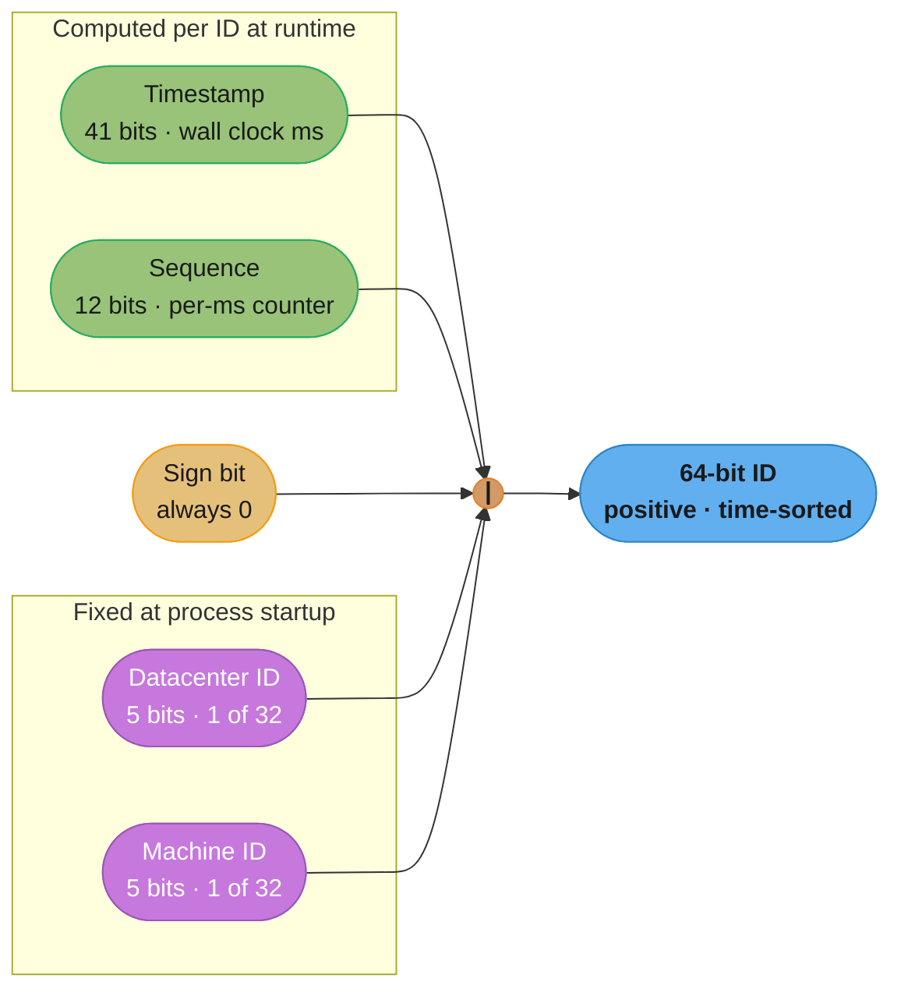
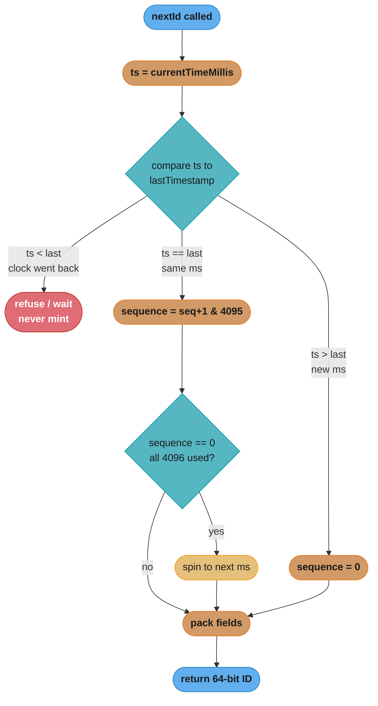
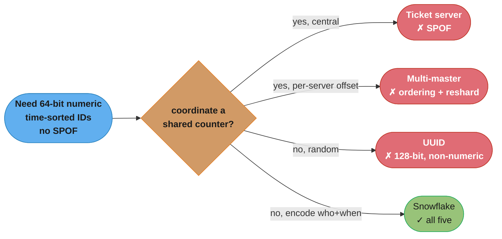
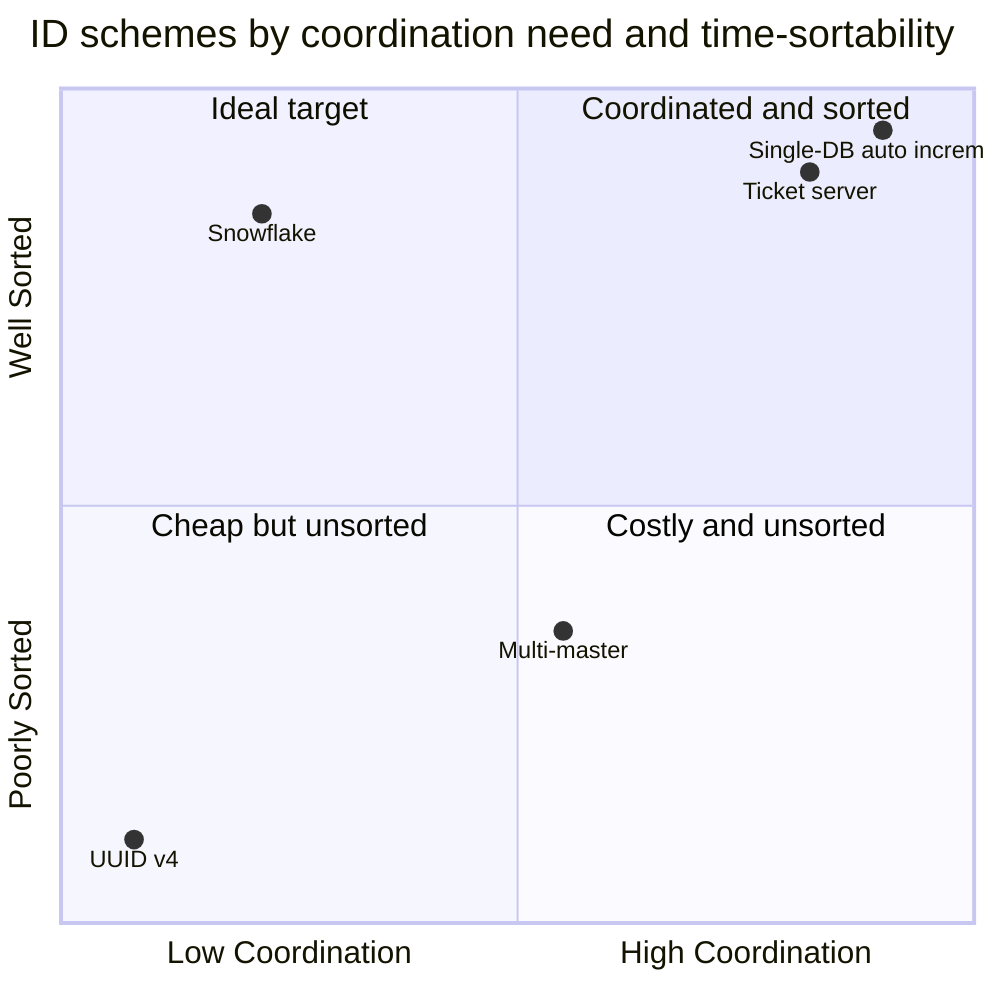

# Chapter 7: Design A Unique ID Generator In Distributed Systems

> Ch 7 of 16 · System Design Interview Vol 1 (Xu) · builds on Ch 6, the ID primitive reused by Ch 8 (URL keys) and Ch 12 (message ordering)

## Chapter Map

A unique ID generator is the smallest, sharpest distributed-systems interview: it looks like a
one-liner (`AUTO_INCREMENT`) but the moment you replace one database with a thousand stateless
nodes, the single counter becomes a single point of contention, a single point of failure, and a
scaling wall all at once. The chapter walks the four-step SDI interview method over exactly this
problem, surveys four candidate designs (multi-master replication, UUID, ticket server, Twitter
Snowflake), and lands on Snowflake — an approach that stops coordinating a shared counter entirely
and instead **bit-packs "when" and "who" directly into a 64-bit integer** so uniqueness falls out
of arithmetic rather than a network round trip.

**TL;DR:**
- A single-database `AUTO_INCREMENT` cannot meet the scale requirement (10,000+ IDs/sec, no SPOF),
  so the shared counter must be abandoned.
- The four candidates trade differently: **multi-master** breaks time-ordering and resists
  resharding; **UUID** needs no coordination but is 128-bit, non-numeric, and non-sortable;
  **ticket server** is numeric and simple but a SPOF; **Snowflake** wins the whole scorecard.
- **Snowflake's 64-bit layout** = 1 sign bit + 41 timestamp bits (ms, ~69 years) + 5 datacenter +
  5 machine + 12 sequence (4096 IDs/ms/node), giving numeric, roughly time-sorted, coordination-free
  IDs.
- The hard part is not throughput — it's the **clock**: NTP steps, VM live-migration jumps, and
  leap seconds can move `currentTimeMillis()` backward, and the generator must detect that or it
  silently mints duplicate/out-of-order IDs.

## The Big Question

> "I need a brand-new unique number for every row I write, on any of a thousand machines, in under
> a millisecond, forever — without ever asking a central authority 'what number comes next?'
> How do I get uniqueness without coordination?"

Analogy: a shared `AUTO_INCREMENT` counter is a single deli ticket dispenser — everyone must walk
to the one machine and pull the next number. It guarantees order and no duplicates, but the queue
to the machine *is* the bottleneck, and if the machine breaks, the whole deli stops. Snowflake's
insight is to hand every clerk their own pre-numbered pad (a machine ID) and a synchronized clock,
so each clerk stamps `timestamp + clerk-id + sequence` locally — no queue, no shared machine, and
the tickets still sort roughly by time because everyone reads the same wall clock.

---

## 7.1 Step 1 — Understand the Problem and Establish Design Scope

Interview convention: never start designing until you have pinned the requirements with the
interviewer. Xu scripts the dialogue as a set of candidate/interviewer exchanges that converge on
five concrete requirements.

### The requirements dialogue

| Candidate asks | Interviewer answers | Requirement locked |
|----------------|---------------------|--------------------|
| What are the characteristics of the IDs? | They must be **unique and sortable**. | Unique + time-orderable |
| For each new record, does the ID increment by 1? | The ID **increments by time** but not necessarily by 1; IDs created later in an evening are larger than ones created earlier the same day. | Ordered by date/time, not strictly +1 |
| Do IDs only contain numerical values? | **Yes**, that is the assumption. | Numeric only |
| What is the ID length requirement? | IDs should **fit into 64 bits**. | ≤ 64-bit |
| What is the scale? | The system should be able to generate **10,000 IDs per second**. | ≥ 10,000 IDs/sec |

Distilled, the five requirements are:

1. **IDs must be unique** — no two records ever share one.
2. **IDs are numerical values only** — no hex, no dashes, no base-62 strings.
3. **IDs fit into 64 bits** — one signed `long` / SQL `BIGINT`. This immediately puts pressure on
   any 128-bit scheme.
4. **IDs are ordered by date** — sortable so that a later record's ID is (almost always) numerically
   greater; this lets the ID double as a rough creation-time index.
5. **The system generates 10,000+ IDs per second** — the aggregate throughput floor.

Note the subtlety in requirement 4: "ordered by date," **not** "strictly incrementing by 1." This
weaker promise is exactly what makes a distributed, coordination-free design possible. Guaranteeing
gap-free +1 ordering across machines would require a global lock; guaranteeing only *roughly time-
sorted* ordering only requires a shared clock.

### Why auto-increment on one database fails at scale

The obvious first answer — a single relational database with an `AUTO_INCREMENT` primary key — is
the very thing the requirements rule out. Walk the failure modes explicitly:

- **Single point of failure.** Every write in the system funnels through one database to fetch the
  next ID. If that database is down, *nobody* can create a record anywhere. The design has zero
  fault tolerance.
- **Throughput ceiling.** A single node cannot scale horizontally for ID generation. 10,000 IDs/sec
  might be survivable on one box, but the requirement is a *floor*, not a cap — the fleet is
  supposed to grow, and one counter cannot.
- **Latency and contention.** Every ID requires a network round trip to the database plus a lock on
  the counter row. Under load, the lock serializes all writers; ID generation, which should be
  microseconds of local arithmetic, becomes a millisecond-plus queued database call on the critical
  path of every insert.
- **It cannot span datacenters.** A globally shared counter across two datacenters means a
  cross-DC round trip (tens of milliseconds) for every ID, or an active-passive setup that
  reintroduces the SPOF.

The conclusion that frames the rest of the chapter: **the shared counter must go.** Every candidate
below is an attempt to get uniqueness without a single, coordinated, always-consulted counter.

---

## 7.2 Step 2 — Propose High-Level Design and Get Buy-In

Xu presents four candidate approaches, compares them, and picks one. The pedagogical point is not
that three are "wrong" — each is used in production somewhere — but that only one satisfies *all
five* requirements simultaneously.

### Option 1 — Multi-master replication

Use the databases' own `auto_increment` feature, but instead of stepping by 1, step by **k**, where
**k** is the number of database servers in use. Server *i* generates IDs `i, i+k, i+2k, …`. With two
servers, server 1 emits `1, 3, 5, 7, …` and server 2 emits `2, 4, 6, 8, …`; the two streams never
collide.

```
k = 2 (two masters)
 master A (offset 1):  1     3     5     7     9   ...   (step by k)
 master B (offset 2):     2     4     6     8    10 ...  (step by k)
 merged timeline:      1  2  3  4  5  6  7  8  9 10      (no collisions)
```

Caption: each master owns a residue class modulo k, so the streams are disjoint by construction —
but "merged timeline" is a fiction; there is no global clock forcing A's `3` to be issued before
B's `4`.

**Pros:** reuses a battle-tested database feature; scales aggregate write throughput with the number
of masters; no new component to build.

**Cons — and why it loses:**
- **IDs do not go up with time across servers.** Server A's `1000001` and server B's `1000002` say
  nothing about which record was created first — the numeric order no longer tracks time (violates
  requirement 4). Ordering only holds *within* one server's stream.
- **Hard to scale up or down.** `k` is baked into every server's step size. Adding or removing a
  server changes `k`, which risks collisions with already-issued IDs and forces a painful
  reconfiguration; you cannot elastically add a master the way you add a stateless app node.
- **Does not scale well across multiple datacenters.** Coordinating the offset assignment and step
  size across DCs reintroduces exactly the cross-datacenter coordination the design was trying to
  avoid.

### Option 2 — UUID

A **UUID** (Universally Unique Identifier) is a 128-bit value you generate locally with no
coordination whatsoever — each node just produces one and the probability of collision is
astronomically small. A UUID v4 is essentially 122 random bits (6 bits are version/variant markers).

**The collision math** — why "no coordination" is safe: with 122 random bits the space is enormous.
Xu's framing: the probability of a duplicate is negligible even at absurd rates — *you would have to
generate ~1 billion UUIDs per second for about 100 years before the probability of a single
collision reached even 1 in a billion.* In practice UUID collisions are not a risk you design
against.

```
UUID v4 example:   09c93e62-50b4-468d-bf8a-c07e1040bfb2
                   |----------------- 128 bits total -----------------|
                   ~122 random bits · generated locally · zero coordination
```

Caption: the 128-bit width is the whole problem — it buys coordination-free uniqueness but blows
straight past the 64-bit requirement.

**Pros:**
- **Generating a UUID is trivial and fully decentralized.** No coordination between servers, so no
  synchronization bottleneck at all.
- **Easy to scale.** Each web server that needs an ID is responsible for generating its own; there
  is no shared component, so scaling is linear and there is no SPOF.

**Cons — and why it loses:**
- **128 bits, not 64.** UUIDs are twice the required width. This alone disqualifies it against the
  stated requirement, and the size compounds: the ID is stored in every row, every foreign key, and
  every index entry, so doubling it materially inflates storage.
- **IDs are not time-ordered (sortable) by default.** A random v4 UUID has no monotonic relationship
  to creation time, violating requirement 4 and, worse, scattering inserts randomly across a B-tree
  index (poor write locality — a real, measurable performance cost).
- **IDs can be non-numeric.** UUIDs are usually rendered as hex strings with dashes
  (`09c93e62-50b4-…`), which contain letters — violating the "numerical values only" requirement.

### Option 3 — Ticket server

Flickr's real-world design: a **centralized `auto_increment` feature in a single dedicated database
server** (the "ticket server"). Any node that needs an ID makes a call to the ticket server, which
atomically bumps its counter and returns the next number.

```
 app node 1 --\
 app node 2 ---->  [ Ticket Server ]  --> REPLACE INTO Tickets ...; SELECT LAST_INSERT_ID();
 app node 3 --/     single auto_increment
                    counter of record
```

Caption: one central counter hands out globally ordered numeric IDs — simple and correct, but every
ID is a round trip to the one box that owns the counter.

**Pros:**
- **Numeric IDs.** Satisfies the "numerical only" requirement directly.
- **Easy to implement.** It works for small-to-medium scale and is genuinely simple — Flickr shipped
  it. (Flickr's trick to soften the SPOF was running *two* ticket servers, one issuing odd numbers
  and one even — a two-master variant.)

**Cons — and why it loses:**
- **Single point of failure.** One ticket server means one thing that, when it dies, stops all ID
  generation. High availability requires more ticket servers.
- **Multiple ticket servers reintroduce the synchronization problem.** The moment you run more than
  one to remove the SPOF, you have to coordinate them so they never issue the same number — which is
  the multi-master offset/step problem all over again, with the same ordering and scaling headaches.

### Option 4 — Twitter Snowflake (the chosen approach)

Twitter's **Snowflake** is the design the chapter adopts. Instead of coordinating a shared counter,
it uses **divide-and-conquer**: partition a 64-bit integer into sections, and let each section be
filled independently — some fixed at deploy time (which machine), some derived at runtime (the
clock and a per-millisecond counter). Because the machine identity is baked in, no two machines can
ever produce the same ID even though they never talk to each other; because the high bits are a
timestamp, the IDs come out roughly time-sorted.

Snowflake satisfies **all five requirements at once**: unique (machine + timestamp + sequence never
collide), numeric (it is one 64-bit integer), 64-bit (by construction), ordered by time (timestamp
is in the high bits), and easily past 10,000 IDs/sec (a single node can do millions). This is why
Step 3 dives into it exclusively.

| Candidate | Unique | Numeric | ≤ 64-bit | Time-ordered | No SPOF | Verdict |
|-----------|:--:|:--:|:--:|:--:|:--:|---------|
| Multi-master replication | ✓ | ✓ | ✓ | ✗ (only within a server) | ✓ | Loses on ordering + resharding |
| UUID | ✓ | ✗ (hex) | ✗ (128-bit) | ✗ | ✓ | Loses on width, numeric, ordering |
| Ticket server | ✓ | ✓ | ✓ | ✓ | ✗ (central) | Loses on SPOF |
| **Twitter Snowflake** | ✓ | ✓ | ✓ | ✓ | ✓ | **Chosen** |

---

## 7.3 Step 3 — Design Deep Dive

### The 64-bit layout

Snowflake divides a signed 64-bit integer into five contiguous fields. The exact division:

```
 field:   sign      timestamp (41 bits)          datacenter  machine   sequence
          1 bit                                   5 bits      5 bits    12 bits
        +------+-----------------------------+----------+----------+----------------+
 bits:  |  63  |         62 ........ 22       |  21..17  |  16..12  |    11 ..... 0  |
        +------+-----------------------------+----------+----------+----------------+
 value: |  0   |  ms since a custom epoch    | 2^5 = 32 | 2^5 = 32 | 2^12 = 4096/ms |
        +------+-----------------------------+----------+----------+----------------+
 role:  always  ~69 years of headroom          32 DCs     32 nodes   per-ms counter
        zero    (keeps the number positive)               per DC     that resets/ms
```

Caption: 1 + 41 + 5 + 5 + 12 = 64 bits exactly; putting the timestamp in the highest value bits is
what makes the whole integer sort by time, and the sign bit is pinned to 0 so every ID stays a
positive `long`.

- **Sign bit (1 bit):** always `0`. It exists only to keep the ID a **positive** number in
  languages with signed 64-bit integers (Java `long`, SQL `BIGINT`). Reserved for future use.
- **Timestamp (41 bits):** milliseconds since a **custom epoch** (not the Unix epoch).
- **Datacenter ID (5 bits):** which datacenter — `2^5 = 32` possible datacenters.
- **Machine ID (5 bits):** which machine within the datacenter — `2^5 = 32` machines per datacenter.
- **Sequence number (12 bits):** a per-machine, per-millisecond counter — `2^12 = 4096` values,
  reset to 0 every millisecond.

### Field-by-field mechanics

**Timestamp — the reason IDs sort by time, and the 69-year number.** The timestamp occupies the
highest-value bits (just under the sign bit), so when you compare two IDs numerically, you are
comparing their timestamps first — that is *why* the IDs are time-sortable. It is measured against a
**custom epoch** chosen by the operator; Twitter's Snowflake used `1288834974657` ms, which is
**Nov 04, 2010, 01:42:54 UTC**. Using a recent custom epoch instead of 1970 maximizes the usable
lifetime of the 41-bit field.

The 41-bit lifetime, worked step by step:

```
 max ms value      = 2^41            = 2,199,023,255,552 ms
 -> seconds        = / 1000          = 2,199,023,255.552 s
 -> days           = / 86,400        =        25,451.66  days
 -> years          = / 365           =            69.73  years
```

So the field lasts **~69 years** from the custom epoch. With Twitter's 2010 epoch, it overflows
around **2079**; with an epoch set at your own system's launch, you push the overflow date decades
into the future. This is the number to state in an interview: `41 bits of ms ≈ 69 years`.

**Datacenter ID + Machine ID — fixed at startup, never touched on the hot path.** Together the 10
bits give `2^5 × 2^5 = 32 × 32 = 1024` distinct machine identities. These two fields are **chosen
when the generator process starts up** and do not change while it runs. In practice they are handed
out by a coordination service (ZooKeeper/etcd) or configuration so that no two live processes ever
share the same (datacenter, machine) pair — that assignment is the *entire* coordination cost of
Snowflake, and it happens once per process, not once per ID.

**Sequence — the per-millisecond counter that resets, and the throughput number.** 12 bits give
`2^12 = 4096` distinct sequence values. The rule: within a single millisecond, the sequence
increments for each ID generated on that machine; when the clock ticks to a new millisecond, the
sequence **resets to 0**. This yields a hard per-node ceiling:

```
 4096 IDs / ms  ×  1000 ms / s  =  4,096,000 IDs / sec  per machine
```

Comfortably above the 10,000 IDs/sec *fleet* requirement — a single node exceeds it 400×. The only
question the sequence raises is: what happens when a single machine needs to generate a **4097th** ID
in the same millisecond? That is the rollover case, handled by the algorithm below.

### Which parts are fixed vs. runtime



Caption: only the timestamp and sequence are recomputed for each ID; datacenter and machine IDs are
frozen at startup, which is exactly why generating an ID needs no network call — it is a few shifts
and ORs over local state.

### The ID-generation algorithm (with sequence rollover)

The generator holds two pieces of mutable state — `lastTimestamp` (the ms of the previous ID) and
`sequence` — and packs the four fields with bit shifts. The critical logic is the three-way branch
on how "now" compares to `lastTimestamp`.

```
EPOCH        = 1288834974657          # custom epoch (ms)
SEQ_BITS     = 12                      # sequence field width
MACHINE_BITS = 5
DC_BITS      = 5
MAX_SEQ      = (1 << SEQ_BITS) - 1     # 4095, the 12-bit mask 0xFFF

# bit positions (left shift amounts)
MACHINE_SHIFT   = SEQ_BITS                                   # 12
DC_SHIFT        = SEQ_BITS + MACHINE_BITS                    # 17
TIMESTAMP_SHIFT = SEQ_BITS + MACHINE_BITS + DC_BITS          # 22

state: lastTimestamp = -1
state: sequence      = 0

function nextId():
    ts = currentTimeMillis()

    if ts < lastTimestamp:                 # (1) CLOCK MOVED BACKWARD
        raise ClockMovedBackwardsException  #     refuse to mint an ID

    if ts == lastTimestamp:                # (2) SAME MILLISECOND
        sequence = (sequence + 1) & MAX_SEQ   # increment, wrapping at 4096
        if sequence == 0:                     # exhausted all 4096 slots this ms
            ts = waitUntilNextMillis(lastTimestamp)   # spin until clock advances
    else:                                  # (3) NEW MILLISECOND
        sequence = 0                          # reset the counter

    lastTimestamp = ts
    return ((ts - EPOCH) << TIMESTAMP_SHIFT)
         | (datacenterId  << DC_SHIFT)
         | (machineId     << MACHINE_SHIFT)
         | sequence

function waitUntilNextMillis(lastTs):
    ts = currentTimeMillis()
    while ts <= lastTs:                     # busy-wait; usually < 1 ms
        ts = currentTimeMillis()
    return ts
```

The three branches, spelled out:

1. **Clock moved backward (`ts < lastTimestamp`).** The wall clock is now *earlier* than an ID we
   already issued. Continuing would risk producing an ID that sorts before, or exactly duplicates,
   an existing one. The safe response is to **refuse** — throw an exception (or, in tolerant
   variants, wait for the clock to catch back up). This is the single most important correctness
   branch and the subject of Step 4's clock discussion.
2. **Same millisecond (`ts == lastTimestamp`).** Increment `sequence`. The `& MAX_SEQ` masks it to
   12 bits, so the 4096th increment wraps it back to `0`. When it wraps to 0, all 4096 slots for
   this millisecond are used, so we **busy-wait for the next millisecond** (`waitUntilNextMillis`)
   and continue there — this is the graceful handling of the "more than 4096 IDs in one ms" case.
3. **New millisecond (`ts > lastTimestamp`).** Reset `sequence` to 0 and proceed.

The final `return` packs the fields: subtract the epoch, then shift each field into its slot and OR
them together. Note the sequence is **not** shifted — it occupies the lowest 12 bits.



Caption: the three-way branch on `ts` vs `lastTimestamp` is the whole algorithm — the red "refuse"
path (clock went back) is the correctness-critical one interviewers probe, and the rollover spin is
what makes exceeding 4096 IDs/ms a graceful stall rather than a duplicate.

---

## 7.4 Step 4 — Wrap Up

Once the core design is agreed, the interviewer wants to see you reason about the operational and
edge concerns. Xu lists several.

### Clock synchronization

The design assumed every ID-generation server holds the *same* clock. That assumption breaks in
reality:

- **Multiple machines drift.** Different physical servers can have slightly different clocks; the
  standard remedy is **NTP (Network Time Protocol)**, which continuously nudges each machine's clock
  toward a reference time.
- **What "clock going backward" means for ordering.** NTP corrections, virtual-machine live
  migrations, and leap-second smears can all step a machine's clock *backward*. When that happens,
  Snowflake's contract is violated: a new ID could get a timestamp lower than an already-issued one,
  breaking the "ordered by date" promise and, if the sequence collides in that reused millisecond,
  producing a **duplicate**. This is the deep reason the algorithm's branch (1) refuses to generate
  when `ts < lastTimestamp`. This ties directly to DDIA Ch 8's treatment of unreliable clocks —
  wall-clock time in distributed systems is not monotonic and cannot be trusted for ordering without
  care; a monotonic clock or explicit backward-step detection is required.

### Section length tuning

The 41/5/5/12 split is a **default, not a law**. The bit widths are a budget you reallocate to fit
the workload, as long as they sum to 63 (plus the sign bit):

- **Low-concurrency, long-lived application:** fewer IDs are needed per millisecond, so you can
  **shrink the sequence field and grow the timestamp field**, buying more years of lifetime before
  overflow at the cost of a lower per-ms ceiling.
- **Fewer datacenters/machines than 32×32:** reclaim those bits for the timestamp or sequence.
- **More machines than 1024:** widen the datacenter/machine fields, spending timestamp or sequence
  bits.

The general principle: the layout encodes the operator's estimate of *how many machines, how many
IDs per ms, and how many years* — tune it to your reality.

### High availability

ID generation is on the critical path of every write, so the generator must be highly available. The
Snowflake approach is inherently favorable here: because each node generates IDs locally with no
shared counter, **there is no single point of failure** — losing one node does not stop the others,
and a node can keep minting IDs even while temporarily partitioned from the coordination service
(as long as it already holds its machine ID). This is the structural advantage that the ticket
server lacked.

### Additional talking points

Xu closes with prompts an interviewer might raise if time allows:

- **Clock synchronization** — discussed above; the assumption that all servers share a clock is the
  design's most fragile point.
- **Section length tuning** — reallocating bits, as above; e.g., fewer sequence bits and more
  timestamp bits for a low-concurrency, long-lived system.
- **High availability** — since ID generation is mission-critical, the generator(s) must be highly
  available, which the decentralized design supports naturally.

---

## Beyond the book — where Snowflake lives today

*(Enrichment, not in Xu's chapter — kept deliberately short.)*

Snowflake was open-sourced in 2010 and spawned a family of descendants and sortable-ID formats:

- **Instagram's shard-prefixed IDs.** Instagram bakes the *logical shard* into the high bits of a
  64-bit ID (41-bit timestamp + 13-bit shard ID + 10-bit per-shard auto-increment sequence),
  generated inside PostgreSQL with a stored procedure. Encoding the shard in the ID means the
  routing layer can find a row's shard directly from its ID — Snowflake's "who" section repurposed
  as "which partition."
- **Sonyflake.** Sony's variant retunes the fields for longevity over throughput: it uses a
  **10-ms** time unit (not 1 ms) for a 39-bit time field (~174 years of life), an 8-bit
  per-10-ms sequence, and a 16-bit machine ID — trading peak IDs/ms for a much longer lifespan and
  more machine identities.
- **ULID / KSUID — sortable non-numeric alternates.** When the "numeric only, 64-bit" constraint is
  relaxed, **ULID** (128-bit: 48-bit millisecond timestamp + 80 random bits, Crockford base-32) and
  **KSUID** (160-bit: 32-bit second timestamp + 128 random bits) give you UUID-style
  coordination-free generation *plus* lexicographic time-sortability — the sortability Snowflake has
  but plain UUIDs lack, without needing to assign machine IDs. They are the right answer when you do
  not have (or want) a machine-ID allocation step but still want K-sortable keys.

The through-line: every one of these keeps Snowflake's core move — **encode time in the high bits so
the ID sorts by creation order** — and varies only in how they handle the "who" (machine ID vs.
shard vs. pure randomness) and the width budget.

---

## Visual Intuition

**Why the timestamp must occupy the highest value bits (K-sortability).** Numeric comparison of two
integers compares their most significant differing bit first. Put time up top and the whole ID sorts
by time; put it anywhere else and sort order is scrambled.

```
 correct layout (timestamp high):        broken layout (sequence high):
 [ ts=100 | node=7 | seq=3 ]  = 100_7_3   [ seq=3 | node=7 | ts=100 ] = 3_7_100
 [ ts=101 | node=2 | seq=0 ]  = 101_2_0   [ seq=0 | node=2 | ts=101 ] = 0_2_101
   ts 100 < 101  =>  ID(100..) < ID(101..)  sorts by seq first  =>  0_2_101 < 3_7_100
   numeric order == time order  ✓           later record sorts FIRST  ✗
```

Caption: the field *order* inside the integer — not just its presence — is what delivers requirement
4; the timestamp earns the top slot because the high bits dominate numeric comparison.

**The four-approach decision, at a glance.**



Caption: three candidates each fail one hard requirement; only Snowflake's "encode who and when into
the bits" avoids both the shared counter (SPOF/ordering) and the 128-bit random detour.

**Sequence rollover in one millisecond.** Within a millisecond the sequence climbs 0…4095; the
4096th ID would wrap it to 0, so the generator stalls to the next millisecond instead of colliding.

```
 ms = T:   seq 0, 1, 2, ... , 4094, 4095   (4096 IDs issued this ms)
                                       |
              4096th request in ms T --+--> sequence wraps to 0
                                       |
                                       +--> BUSY-WAIT until clock == T+1
 ms = T+1: seq 0, 1, 2, ...            (counter reset, resume)
```

Caption: 4096 IDs/ms/node is a hard per-millisecond wall; exceeding it costs a sub-millisecond stall,
never a duplicate — the price of guaranteeing uniqueness without coordination.

---

## Key Concepts Glossary

- **Unique ID generator** — a service/library that mints identifiers guaranteed distinct across a
  distributed fleet.
- **`AUTO_INCREMENT` / auto-increment** — a database feature that assigns the next integer to each
  new row; a single shared counter.
- **Multi-master replication** — running several database masters, each stepping its
  `auto_increment` by k (the server count) at a distinct offset, so streams never collide.
- **k (step size)** — the increment interval in multi-master replication, equal to the number of
  masters.
- **UUID (Universally Unique Identifier)** — a 128-bit locally generated value; v4 is ~122 random
  bits, collision probability negligible.
- **Ticket server** — Flickr's design: one dedicated database whose `auto_increment` hands out IDs to
  all callers.
- **Twitter Snowflake** — the chosen design: a 64-bit ID bit-packed from timestamp, datacenter,
  machine, and sequence fields.
- **Sign bit** — the top bit, pinned to 0 to keep the ID a positive signed integer; reserved for
  future use.
- **Timestamp field (41 bits)** — milliseconds since a custom epoch; occupies the high bits so IDs
  sort by time; lasts ~69 years.
- **Custom epoch** — the operator-chosen zero point for the timestamp (Twitter used Nov 04, 2010),
  maximizing usable lifetime vs. the 1970 Unix epoch.
- **Datacenter ID (5 bits)** — which of up to 32 datacenters; fixed at startup.
- **Machine ID (5 bits)** — which of up to 32 machines per datacenter; fixed at startup.
- **Sequence number (12 bits)** — per-machine, per-millisecond counter (0–4095), reset each ms.
- **Sequence rollover** — when >4096 IDs are needed in one ms, the counter wraps and the generator
  waits for the next ms.
- **K-sortable / roughly time-ordered** — later-created IDs are (almost always) numerically greater;
  the ID doubles as a creation-time index.
- **Clock skew / clock going backward** — wall clock moving backward (NTP correction, VM migration,
  leap second), which can produce duplicate or out-of-order IDs.
- **NTP (Network Time Protocol)** — the protocol that synchronizes machine clocks toward a reference.
- **Section length tuning** — reallocating the bit budget among the fields (e.g., fewer sequence
  bits, more timestamp bits) to match a workload.
- **Instagram shard-prefixed IDs** — a Snowflake descendant encoding the logical shard in the ID.
- **Sonyflake** — a Snowflake variant using a 10-ms time unit for a longer lifespan.
- **ULID / KSUID** — sortable, coordination-free non-numeric ID formats (128/160-bit).

---

## Tradeoffs & Decision Tables

| Approach | Coordination cost | Width | Ordering | SPOF | Best when |
|----------|-------------------|-------|----------|------|-----------|
| Single DB `AUTO_INCREMENT` | Every ID → central DB | 64-bit | Perfect | Yes | Single small app, no scale need |
| Multi-master replication | Offset/step config | 64-bit | Only within a server | No | Legacy multi-DB reuse |
| UUID | None | 128-bit | None (v4) | No | No machine-ID step, size irrelevant |
| Ticket server (Flickr) | Every ID → ticket server | 64-bit | Perfect | Yes | Medium scale, simplicity valued |
| **Twitter Snowflake** | Machine-ID assignment at startup | 64-bit | Roughly time-sorted | No | **High scale, numeric sortable PKs** |

| Snowflake field | Bits | Capacity | Fixed or runtime | Tuning lever |
|-----------------|------|----------|------------------|--------------|
| Sign | 1 | — | Fixed (0) | Never touched |
| Timestamp | 41 | ~69 years of ms | Runtime | Grow for longevity |
| Datacenter | 5 | 32 DCs | Startup | Shrink if fewer DCs |
| Machine | 5 | 32/DC (1024 total) | Startup | Grow if >1024 nodes |
| Sequence | 12 | 4096 IDs/ms/node | Runtime | Shrink if low concurrency |



Caption: Snowflake sits in the ideal upper-left — well-sorted like a central counter but with the
low coordination of UUID — because its only coordination is a once-per-process machine-ID
assignment, not a per-ID round trip.

---

## Common Pitfalls / War Stories

- **Trusting the wall clock blindly.** The most dangerous Snowflake bug is a generator that packs
  `currentTimeMillis()` without checking it against `lastTimestamp`. When NTP steps the clock back or
  a VM live-migrates to a host with an earlier clock, the node reissues a millisecond it already used
  and mints **duplicate IDs**. Always keep `lastTimestamp` and refuse (or wait) on backward motion.
- **Choosing 1970 as the epoch.** Using the Unix epoch instead of a recent custom epoch wastes
  ~40 years of the 41-bit field — the timestamp starts closer to overflow for no benefit. Pick an
  epoch near the system's launch date and write it down; it is unrecoverable once IDs are in
  production.
- **Two processes with the same machine ID.** If the machine-ID assignment is sloppy (hard-coded
  config copy-pasted, a container reusing an ID after a crash), two live nodes share an identity and
  can emit identical IDs in the same millisecond. The machine ID is the *only* thing guaranteeing
  cross-node uniqueness — allocate it from a coordination service, not a config file.
- **Assuming the sequence can never exhaust.** A hot node bursting past 4096 IDs in a single
  millisecond will busy-wait; if that path is missing, the sequence silently wraps and collides.
  Implement `waitUntilNextMillis`, and if a node genuinely needs >4M IDs/sec, retune the bit budget
  or shard the generator.
- **Expecting strictly monotonic, gap-free IDs.** Snowflake is *roughly* time-sorted, not a perfect
  sequence: across machines, two IDs generated in the same millisecond order by machine ID, not by
  true creation instant, and there are gaps. Code and interviewers that assume "+1, no gaps, perfect
  order" are relying on a guarantee Snowflake never made.
- **Ignoring the write-hotspot side effect.** Because IDs increase with time, all new rows land at
  the rightmost edge of a B-tree index and on whichever shard owns the newest range — great for range
  scans, but a write hotspot. This is the flip side of time-sortability, not a bug to design away.

---

## Real-World Systems Referenced

- **Twitter Snowflake** — the canonical 64-bit divide-and-conquer design the chapter adopts
  (open-sourced 2010).
- **Flickr** — the ticket-server design (centralized `auto_increment`, two servers for odd/even
  numbers).
- **UUID standard** — 128-bit universally unique identifiers.
- **NTP (Network Time Protocol)** — clock synchronization across machines.
- **ZooKeeper / etcd** *(beyond the book)* — coordination services used in practice to assign
  machine IDs.
- **Instagram, Sonyflake, ULID, KSUID** *(beyond the book)* — Snowflake descendants and sortable-ID
  formats.

---

## Summary

Designing a distributed unique ID generator is the exercise of removing a single shared counter
without losing what the counter gave you: uniqueness, numeric compactness, and time ordering. A
single-database `AUTO_INCREMENT` fails the requirements immediately — it is a SPOF, a throughput
ceiling, and a per-ID network round trip. Of the four candidates, **multi-master replication**
recovers throughput but loses cross-server ordering and resists resharding; **UUID** is
coordination-free but 128-bit, non-numeric, and unsorted; the **ticket server** is numeric and
simple but a SPOF (and multiple ticket servers just recreate the sync problem). **Twitter
Snowflake** wins the whole scorecard by encoding identity into the ID itself: a 64-bit integer split
into 1 sign + 41 timestamp (~69 years of ms) + 5 datacenter + 5 machine (1024 identities) + 12
sequence (4096 IDs/ms/node). The datacenter and machine IDs are fixed at startup — the only
coordination Snowflake needs — while the timestamp and a per-millisecond sequence are computed
locally with a few shifts, so an ID needs no network call and the fleet has no single point of
failure. The hard part is operational, not architectural: the design assumes a shared, forward-moving
clock, and NTP corrections or VM migrations can move it backward, so the generator must detect
`ts < lastTimestamp` and refuse rather than mint duplicates. Finally, the 41/5/5/12 split is a tunable
budget — shift bits from sequence to timestamp for a low-concurrency, long-lived system — and the
same core idea (time in the high bits for sortability) reappears in Instagram's shard-prefixed IDs,
Sonyflake, and the ULID/KSUID sortable-ID formats.

---

## Interview Questions

**Q: Why not just use a UUID when the requirement is a 64-bit numeric ID?**
Because a UUID is 128 bits, usually rendered with hex letters, and not time-sortable — it violates three of the five requirements at once. It is coordination-free and collision-safe, but its width doubles storage across every row, foreign key, and index, its hex string is non-numeric, and a v4 UUID has no monotonic relationship to creation time so it scatters inserts randomly across a B-tree. Snowflake keeps the coordination-free property while fitting 64 bits, staying numeric, and sorting by time.

**Q: What happens if a Snowflake node's clock moves backward, and how do you handle it?**
It can mint duplicate or out-of-order IDs, so the generator must detect it and refuse (or wait) rather than continue. The node keeps the last-used timestamp, and if `currentTimeMillis()` is less than it — caused by an NTP correction, a VM live-migration, or a leap second — the safe response is to throw an exception or block until the clock catches back up, because reissuing an already-used millisecond risks a sequence collision. This is why wall clocks alone cannot be trusted for ordering in distributed systems.

**Q: What is the exact 64-bit Snowflake layout and what does each field do?**
1 sign bit + 41 timestamp bits + 5 datacenter bits + 5 machine bits + 12 sequence bits, summing to 64. The sign bit stays 0 to keep the ID positive; the 41-bit timestamp (ms since a custom epoch) sits in the high bits so IDs sort by time and lasts ~69 years; the 5+5 bits give 32 datacenters × 32 machines = 1024 identities, fixed at startup; the 12-bit sequence is a per-machine, per-millisecond counter (0–4095) reset every millisecond.

**Q: Why does the timestamp go in the high bits rather than the low bits?**
Because numeric comparison is dominated by the most significant bits, so putting time on top makes the whole integer sort by creation time. If the sequence or machine ID occupied the high bits instead, IDs would sort by counter or node first and a later record could sort before an earlier one, breaking the "ordered by date" requirement. Field order inside the integer, not just field presence, is what delivers K-sortability.

**Q: What happens when a single machine needs more than 4096 IDs in one millisecond?**
The 12-bit sequence wraps to 0 and the generator busy-waits until the clock advances to the next millisecond, then resumes. 12 bits give 4096 values per millisecond per node (about 4.096 million IDs/sec), so exceeding it costs a sub-millisecond stall rather than a duplicate. If a node genuinely needs sustained throughput above that ceiling, you retune the bit budget or shard the generator.

**Q: Why does a single-database auto-increment fail to meet the requirements?**
It is a single point of failure, a throughput bottleneck, and it puts a network round trip plus a row lock on every ID. If that one database is down, no node anywhere can create a record; it cannot scale horizontally; and under load the counter lock serializes all writers, turning microseconds of arithmetic into a queued millisecond-plus call on every insert. The whole chapter is about removing this shared counter.

**Q: How does Snowflake achieve uniqueness without any coordination on the hot path?**
It bakes a unique machine identity into every ID at startup, so no two live nodes can produce the same value even though they never communicate. Uniqueness comes from the combination of (datacenter + machine) being distinct per node, plus (timestamp + sequence) being distinct per node over time — all local state. The only coordination is assigning each process a unique machine ID once at startup, not once per ID.

**Q: What does "roughly time-ordered" or K-sortable mean, and why not strictly incrementing?**
It means a later-created ID is almost always numerically greater, but IDs are not a gap-free +1 sequence. Guaranteeing strict, gap-free +1 ordering across machines would require a global lock — exactly the bottleneck being avoided — whereas roughly-sorted only needs a shared clock. Within the same millisecond, IDs from different machines order by machine ID rather than true instant, and there are gaps, which is an acceptable trade for coordination-free generation.

**Q: How does multi-master replication generate IDs, and why is it rejected?**
Each of k database masters uses `auto_increment` but steps by k at a distinct offset, so server i emits i, i+k, i+2k and streams never collide. It is rejected because IDs no longer track time across servers (server A's larger number may be older than server B's smaller one), and because k is baked into every server's step size, adding or removing a master risks collisions and forces a painful reconfiguration — it does not scale elastically or across datacenters.

**Q: What is the ticket server approach and its main weakness?**
It is Flickr's design: one dedicated database whose central `auto_increment` counter hands out IDs to every caller. It gives numeric, perfectly-ordered IDs and is simple to build, but it is a single point of failure — if the ticket server dies, all ID generation stops. Running multiple ticket servers to remove the SPOF reintroduces the multi-master synchronization problem of keeping their counters from colliding.

**Q: Why is a custom epoch used instead of the 1970 Unix epoch?**
To maximize the usable lifetime of the 41-bit timestamp field. The field holds ms since the epoch and overflows after ~69 years, so starting the count at a recent date (Twitter used Nov 04, 2010) pushes overflow decades further out than starting at 1970, which would already have consumed ~40 years. The epoch must be chosen once and never changed, since it is encoded implicitly in every ID.

**Q: How many machines and how many years does the default layout support, and how do you compute them?**
1024 machines and about 69 years. The 5-bit datacenter and 5-bit machine fields give 2^5 × 2^5 = 32 × 32 = 1024 identities; the 41-bit millisecond timestamp gives 2^41 ms ≈ 2.199 × 10^12 ms, which is ≈ 2.199 × 10^9 seconds ÷ 86,400 ÷ 365 ≈ 69.7 years. These are the two capacity numbers to state in an interview.

**Q: How would you tune the bit layout for a low-concurrency but long-lived application?**
Shrink the sequence field and grow the timestamp field. A low-concurrency app does not need 4096 IDs per millisecond, so spending fewer bits on the sequence frees bits for the timestamp, extending the years-until-overflow. The fields are a budget that must sum to 63 (plus the sign bit); you reallocate among timestamp, datacenter, machine, and sequence to match how many machines, how many IDs/ms, and how many years you actually need.

**Q: Why does Snowflake have no single point of failure while the ticket server does?**
Because each Snowflake node generates IDs entirely from local state with no shared counter, so losing one node never stops the others. A ticket server routes every ID through one central counter, making that box a SPOF; Snowflake's only shared step is machine-ID assignment at startup, and a node that already holds its ID can keep generating even while partitioned from the coordination service.

**Q: What are the five requirements the ID generator must satisfy?**
IDs must be unique, numeric only, fit in 64 bits, ordered by date, and the system must generate at least 10,000 IDs per second. These five, pinned during the requirements dialogue, are the scorecard against which each candidate is judged, and only Snowflake satisfies all five simultaneously. The "ordered by date, not strictly +1" nuance is what makes a coordination-free design possible.

**Q: How is a Snowflake ID actually assembled from its fields in code?**
By subtracting the epoch from the timestamp and OR-ing each field shifted into its bit position. Concretely: `((ts - EPOCH) << 22) | (datacenterId << 17) | (machineId << 12) | sequence` — the timestamp shifts left 22 (past the 5+5+12 low fields), datacenter 17, machine 12, and the sequence occupies the lowest 12 bits unshifted. It is a handful of shifts and bitwise ORs over local state, which is why it takes microseconds and no network call.

**Q: Why do time-ordered IDs create a database write hotspot, and is that a bug?**
Because monotonically increasing IDs make every new row land at the rightmost edge of a B-tree index and on whichever shard owns the newest key range, concentrating all writes there. It is not a bug but the flip side of time-sortability — the same property that gives great range-scan locality also concentrates inserts. It is the central tension of the design: you can have time-sorted keys or perfectly even write distribution, but not both for free.

**Q: What are ULID and KSUID, and when would you choose them over Snowflake?**
They are sortable, coordination-free ID formats (ULID is 128-bit, KSUID is 160-bit) combining a timestamp prefix with random bits. Choose them when you do not want a machine-ID allocation step but still need lexicographically time-sortable IDs — they give UUID-style decentralized generation plus the sortability plain UUIDs lack. The trade is that they exceed 64 bits and are non-numeric, so they fail this chapter's specific constraints but fit systems without them.

**Q: What coordination does Snowflake actually require, and how often?**
Only the assignment of a unique (datacenter, machine) ID to each process, done once at startup, not per ID. In production this is typically handed out by a coordination service like ZooKeeper or etcd so no two live processes share an identity; the cost is a few operations per process lifecycle. Everything else — reading the clock, incrementing the sequence, packing the bits — is local, which is why the hot path needs no network round trip.

---

## Cross-links in this repo

- [hld/case_studies/design_distributed_unique_id.md — the fleet-operations deep dive (worker-ID allocation via ZooKeeper/etcd, clock-skew runbooks, capacity planning)](../../../hld/case_studies/design_distributed_unique_id.md)
- [book/DDIA Ch 8 — The Trouble with Distributed Systems (unreliable clocks, why wall-clock time can't order events)](../../designing_data_intensive_applications/08_trouble_with_distributed_systems/README.md)
- [book/SDI Ch 6 — Design a Key-Value Store (the storage layer these IDs become primary keys in)](../06_design_a_key_value_store/README.md)
- [book/SDI Ch 8 — Design a URL Shortener (reuses this ID primitive to mint short-URL keys)](../08_design_a_url_shortener/README.md)

## Further Reading

- Alex Xu, *System Design Interview — An Insider's Guide, Vol. 1*, Ch 7 — the original chapter.
- Twitter Engineering, "Announcing Snowflake" (2010) — the original design and open-source release.
- Flickr Code, "Ticketing IDs at Flickr" (2010) — the two-ticket-server odd/even design.
- Instagram Engineering, "Sharding & IDs at Instagram" — shard-prefixed 64-bit IDs generated in PostgreSQL.
- The ULID and KSUID specifications — sortable, coordination-free identifier formats.
