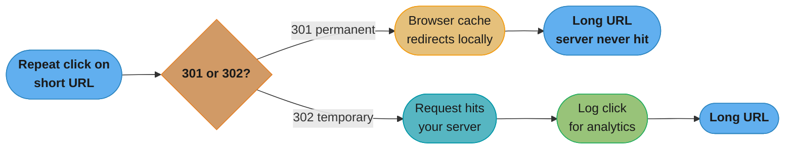
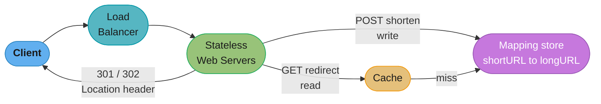
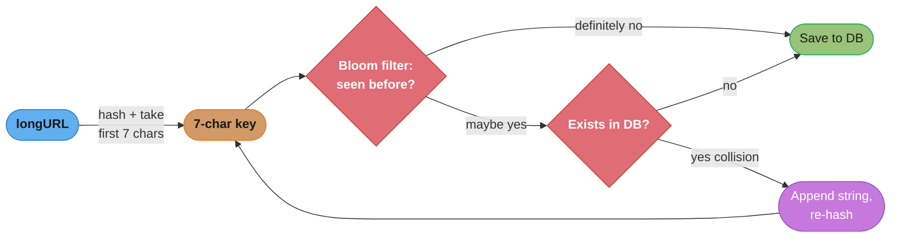
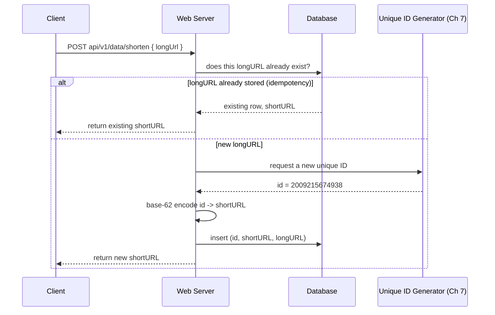
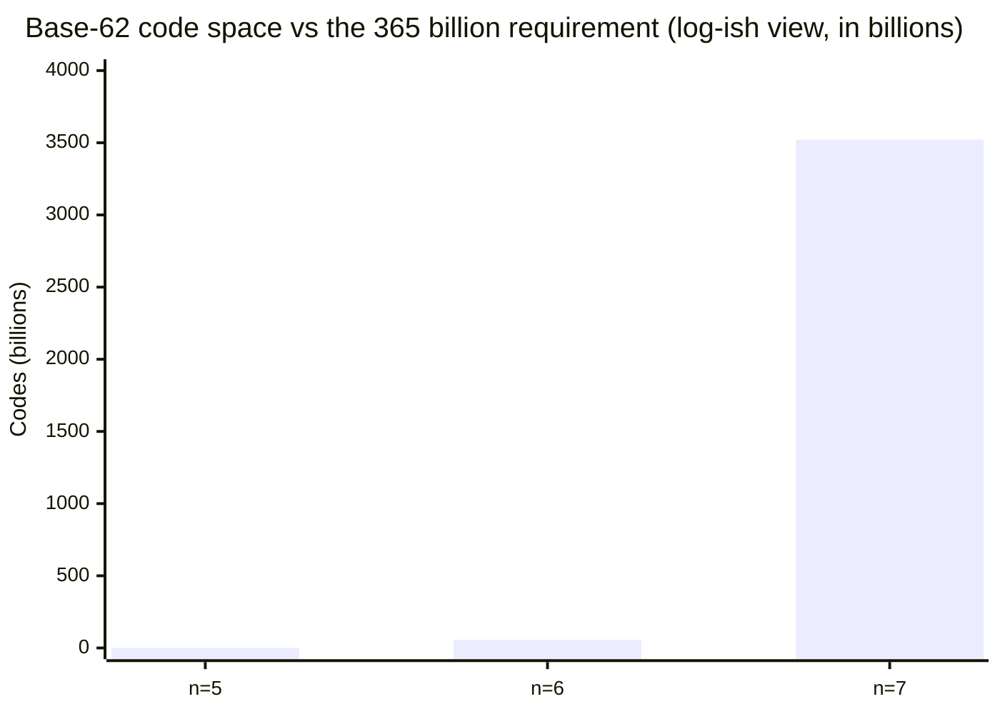
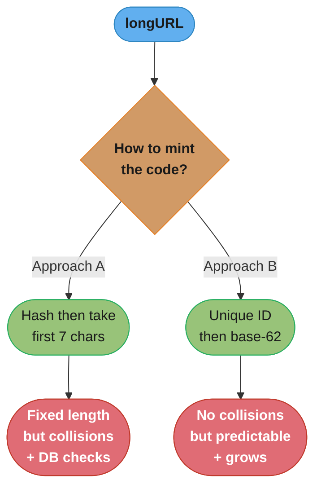

# Chapter 8: Design A URL Shortener

> Ch 8 of 16 · System Design Interview Vol 1 (Xu) · builds on Ch 7 (IDs feed base-62), the canonical read-heavy design

## Chapter Map

A URL shortener turns a long URL (`https://www.systeminterview.com/q=chatsystem&c=loggedin&v=1&l=long`) into a short alias (`https://tinyurl.com/y7keocwj`) and redirects any visit to the alias back to the original. It is the canonical "warm-up" system design problem: the surface is trivial (store a mapping, look it up), but underneath it exercises every core skill an interviewer wants to see — back-of-the-envelope estimation, API contract design, the 301-vs-302 redirect gotcha, choosing a hash function, sizing a short code with base-62 arithmetic, and building a **read-heavy** system where a cache in front of the database carries the load.

**TL;DR:**
- Two operations only: **shorten** (a write) and **redirect** (a read). Reads dominate writes roughly **10:1**, so the redirect path is the hot path you optimize.
- The short code is produced one of two ways: **hash the long URL and truncate** (fixed length, needs collision handling) or **base-62-encode a unique numeric ID** (no collisions, but IDs are enumerable and the code grows over time). Base-62 leans on the Ch 7 unique-ID generator.
- **301 (permanent)** lets the browser cache the redirect and skip your server on repeat visits — great for load, terrible for analytics. **302 (temporary)** routes every click through your server — great for analytics, more load.
- Solve `62^n ≥ 365 billion` → **n = 7** (`62^7 ≈ 3.5 trillion` codes), enough for a decade of URLs.

## The Big Question

> "I have a long, ugly URL and I want a tiny one that redirects to it — forever, instantly, at billions of clicks a day. How do I generate a unique short code that never collides, look it up in single-digit milliseconds under a 10:1 read-to-write load, and still leave room for analytics?"

Analogy: a URL shortener is a **coat check for the web**. You hand over a bulky coat (the long URL) and get back a tiny numbered ticket (the short code). The ticket must be unique (no two coats share a number), compact (fits in your pocket), and instantly redeemable (the attendant finds your coat in one lookup). The whole design is about how you *mint* those ticket numbers and how *fast* you can redeem them when a crowd shows up all at once.

---

## 8.1 Step 1 — Understand the Problem and Establish Design Scope

A system design question is deliberately open-ended. The first move is always to nail down the requirements through a dialogue with the interviewer, because "design a URL shortener" hides a dozen decisions.

### The requirements dialogue

The canonical exchange the book walks through:

| You ask | Interviewer answers |
|---------|--------------------|
| Can you give a concrete example of how it works? | `https://www.systeminterview.com/q=chatsystem...` (long) → `https://tinyurl.com/y7keocwj` (short); visiting the short one redirects to the long one. |
| What is the traffic volume? | **100 million** URLs generated per day. |
| How short should the shortened URL be? | As short as possible. |
| What characters are allowed in the shortened URL? | Numbers (`0-9`) and letters (`a-z`, `A-Z`) — i.e. alphanumeric. |
| Can shortened URLs be deleted or updated? | For simplicity, assume **no** — shortened URLs are immutable and never removed. |

**Functional requirements** distilled from that dialogue:
1. **URL shortening** — given a long URL, return a much shorter alias.
2. **URL redirecting** — given a short URL, redirect to the original long URL.
3. **High availability, scalability, and fault tolerance** as the non-functional backbone.

Fixing "no update, no delete" up front is not a throwaway simplification — it means the mapping table is **append-only**, which later justifies aggressive caching (a cached entry never goes stale) and simplifies replication.

### Back-of-the-envelope estimation

The book reproduces this arithmetic step by step; internalize the chain because interviewers grade the *method*, not the final digit.

**Write traffic — new URLs per second:**
```
100,000,000 URLs / day
÷ 24 hours × 3600 sec  =  86,400 sec / day
= 100,000,000 / 86,400
≈ 1,160 URLs written per second
```

**Read traffic — redirections per second.** Assume a read-to-write ratio of **10:1** (redirects vastly outnumber creations):
```
write QPS  ≈ 1,160 / sec
read QPS   = 10 × 1,160
           ≈ 11,600 redirections per second
```

**Record count over the system's lifetime.** Assume the service runs for **10 years**:
```
100,000,000 URLs / day
× 365 days × 10 years
= 365,000,000,000  ≈  365 billion records
```

**Storage.** Assume the average URL length is **100 bytes**:
```
365 billion records × 100 bytes
= 36,500,000,000,000 bytes
= 36.5 TB  over 10 years
```

**Read it like this.** The four estimates are one chain, not four independent facts: *"take one daily volume, divide by seconds to get a rate, multiply by the read ratio to get the hot-path rate, multiply by the retention window to get rows, then multiply by row size to get bytes."* Every later decision in the chapter cites one link of that chain, so the units matter more than the digits.

| Symbol | What it is |
|--------|------------|
| `100,000,000 URLs/day` | The traffic volume the interviewer supplies in Step 1. |
| `86,400 sec/day` | 24 h/day x 3600 s/h — the constant that turns a daily volume into a rate. |
| `10:1` | Assumed read-to-write ratio: each created short URL is clicked about ten times. |
| `10 years` | Assumed service lifetime — the retention window rows accumulate over. |
| `365 days/year` | Days per year, ignoring leap days. |
| `100 bytes/record` | Assumed average stored row size, dominated by the long URL text. |
| `write QPS` | New mappings inserted per second (the write path). |
| `read QPS` | Redirect lookups per second (the hot path). |

**Walk one example.** The whole chain, with units carried on every line:

```
step 1  seconds per day     24 h/day x 3600 s/h              = 86,400 s/day
step 2  write rate          100,000,000 URLs/day
                            / 86,400 s/day                   = 1,157.4 writes/s  (~1,160/s)
step 3  read rate           1,157.4 writes/s
                            x 10 reads/write                 = 11,574.1 reads/s  (~11,600/s)
step 4  rows over lifetime  100,000,000 URLs/day
                            x 365 days/year x 10 years       = 365,000,000,000 rows
step 5  bytes               365,000,000,000 rows
                            x 100 bytes/row                  = 36,500,000,000,000 bytes
step 6  in terabytes        36,500,000,000,000 bytes
                            / 1,000,000,000,000 bytes/TB     = 36.5 TB
Meaning: ~1,160 writes/s is trivial for a single node, but 365 billion rows is what
forces a 7-character code, and 36.5 TB is what forces sharding.
```

Each multiplier is load-bearing. Drop the `10:1` read ratio and you size the cache for 1,160 QPS instead of 11,600 — a 10x under-provision on the one path that must feel instant. Drop the 10-year retention window and you size the code space against a single day's 100,000,000 URLs, where `62^5 = 916,132,832` codes looks like 9x headroom; at 100,000,000 URLs/day that supply is exhausted in 9.16 days.

Sanity check on the shape of the problem: `1,160` writes/sec and `11,600` reads/sec are **modest** numbers — a single well-tuned database node can handle thousands of QPS. The interesting engineering is not raw throughput but the **read-heavy skew** (which drives caching), the **365-billion-row key space** (which drives short-code length), and **latency** (a redirect must feel instant). Write these four numbers down and refer back to them; every later decision cites one of them.

| Estimate | Value | Drives the decision about… |
|----------|-------|----------------------------|
| Write QPS | ~1,160 /sec | Write path / ID generation rate |
| Read QPS | ~11,600 /sec | Caching, read replicas |
| Records (10 yr) | ~365 billion | Short-code length (`62^7`) |
| Storage (10 yr) | ~36.5 TB | Sharding, storage engine choice |

---

## 8.2 Step 2 — Propose High-Level Design and Get Buy-In

### API endpoints

A URL shortener needs only **two** REST endpoints. The book uses a versioned, resource-style path.

**1. URL shortening (a write):**
```
POST  api/v1/data/shorten
Request body:  { "longUrl": "https://www.systeminterview.com/q=..." }
Returns:       shortURL   (the created short alias)
```

**2. URL redirecting (a read):**
```
GET  api/v1/shortUrl
Returns:  HTTP 301 or 302 redirect, with the long URL in the Location header
```

That is the entire external contract. Everything else — hashing, storage, caching — is an internal detail hidden behind these two calls.

### URL redirecting — 301 vs 302, the load-vs-analytics gotcha

When a user clicks a short URL, the server responds with an HTTP redirect. **Which** redirect status you return is the single most-asked gotcha of this chapter, because the two choices trade off against each other in a non-obvious way.

The response carries the original long URL in the **`Location`** header:
```
HTTP/1.1 301 Moved Permanently
Location: https://www.systeminterview.com/q=chatsystem&c=loggedin&v=1&l=long
```
The browser reads `Location` and issues a fresh request to the long URL — that is the redirect.

**301 Moved Permanently.** The short URL is permanently assigned to the long URL. Because it is "permanent," the **browser caches the response**. Every subsequent time the user visits that short URL, the browser goes **straight to the long URL without contacting your server at all**.
- ✓ **Reduces server load** — repeat clicks never touch your infrastructure.
- ✗ **Hides analytics** — you cannot count clicks, geography, or referrers, because most clicks never reach you.

**302 Found (temporary).** The short URL is only temporarily assigned. The browser does **not** cache it, so **every click makes a fresh request to your server** before being redirected.
- ✓ **Enables analytics** — every click flows through your server, so you can track click count, click source, device, and geography.
- ✗ **Higher server load** — you handle every single click.

**The rule of thumb from the book:**
- Choose **301** if reducing server load is the priority and you don't need per-click analytics.
- Choose **302** if tracking click analytics is important (click rate, sources) — analytics is often a headline feature of a commercial shortener, so 302 is a common production choice despite the extra load.



Caption: the fork is entirely about *where the repeat click lands* — 301 sends it to the browser cache (saving load, losing the click event), 302 sends it back through your server (costing load, capturing the click). This is the load-vs-analytics tension you revisit in Step 4.

### URL shortening — shortening as a hash function

Conceptually, shortening is a function `hashValue = hashFn(longURL)` that maps a long URL onto a short **hash value**. The book states the requirements this function must satisfy for *each* data point:

- Each `longURL` must be mapped to **one** `hashValue`.
- Each `hashValue` must be mappable **back** to the `longURL` (so a redirect can recover the original).

So the design has two halves: (1) the **hash function** that produces the short code, and (2) the **stored mapping** that lets a short code recover its long URL. Steps 3's deep dive picks concrete implementations of both.


Caption: the whole system is this one bidirectional arrow — a `hashFn` that shrinks the long URL to a short code, plus a stored mapping that reverses it. The two Step-3 approaches differ only in how the `hashFn` box is implemented.

### The high-level design to get buy-in

Before diving in, sketch the whole system so the interviewer can "buy in" to the shape. Both operations share the same fleet of stateless web servers behind a load balancer, differing only in what they do afterward: shortening writes a new mapping, redirecting reads an existing one (cache-first). At this stage the mapping is drawn as a simple hash table `<shortURL → longURL>`; Step 3 replaces it with a real database and adds the cache and ID generator.



Caption: the shorten path is a write into the mapping store and the redirect path is a cache-first read out of it — the same web tier serves both, which is why the tier is kept stateless and horizontally scalable.

---

## 8.3 Step 3 — Design Deep Dive

The deep dive settles four things in order: the **data model**, the **short-code length**, the **hashing approach** (two competing designs), and the concrete **shortening** and **redirecting** flows.

### Data model

In the high-level design everything sits in a hash table mapping `<shortURL → longURL>` in memory. That is fine for a whiteboard but not for production, because **memory is limited, expensive, and volatile** — 36.5 TB of mappings will not fit in RAM on one machine and would vanish on restart.

Instead, store the mapping in a **relational database table**. The minimal schema:

| Column | Type | Notes |
|--------|------|-------|
| `id` | bigint (PK) | Unique numeric ID; the base-62 approach encodes this. |
| `shortURL` | varchar | The 7-character short code; indexed for redirect lookups. |
| `longURL` | varchar | The original URL. |

The redirect path does `SELECT longURL FROM url WHERE shortURL = ?`, and the shorten path inserts a new row. Why not a pure in-memory hash table?
- **Capacity** — 365 billion rows × ~100+ bytes far exceeds a single machine's memory; the database can page to disk and shard.
- **Durability** — an in-memory table is lost on crash; "shortened URLs must not be lost" is a hard requirement.
- **Sharing across servers** — a stateless fleet of web servers must all see the same mapping; a shared database provides that, an in-process hash table does not.

### Hash value length — sizing the short code

The short code uses the **base-62** alphabet, since the requirement allows `0-9`, `a-z`, `A-Z`:
```
'0'..'9'  → 10 characters   (digits)
'a'..'z'  → 26 characters   (lowercase)
'A'..'Z'  → 26 characters   (uppercase)
                 -------------
                 62 characters total  →  base 62
```
(Base-62 is chosen over base-64 precisely to stay URL-safe: base-64 adds `+` and `/`, which have special meaning in URLs.)

**The idea behind it.** The alphabet size is a *radix*: *"every character you add multiplies the number of distinct codes by however many symbols the alphabet contains."* Picking 62 rather than 10 or 16 is not cosmetic — it changes the growth rate of the entire code space, which is what buys the short code its lifetime.

| Symbol | What it is |
|--------|------------|
| `10` | Count of digits `0-9`. |
| `26` (lower) | Count of lowercase letters `a-z`. |
| `26` (upper) | Count of uppercase letters `A-Z`. |
| `62` | `10 + 26 + 26` — the radix (base) of the short code. |
| `n` | Number of characters in the short code. |
| `62^n` | Total distinct codes a length-`n` code can express. |

**Walk one example.** Same 7 characters, three different alphabets:

```
base 10 (digits only)     10^7  =            10,000,000 codes
base 16 (hex)             16^7  =           268,435,456 codes
base 62 (0-9 a-z A-Z)     62^7  =     3,521,614,606,208 codes

62^7 / 10^7 = 352,161x more codes than decimal at the same length
62^7 / 16^7 =  13,119x more codes than hex at the same length

At 100,000,000 URLs/day the same 7 characters last:
  base 10   10,000,000 / 100,000,000 per day        = 0.10 days   (2.4 hours)
  base 16   268,435,456 / 100,000,000 per day       = 2.68 days
  base 62   3,521,614,606,208 / 100,000,000 per day = 35,216 days (96.5 years)
Meaning: the alphabet, not the length, is what turns a 2-hour code into a
career-length one -- so widen the alphabet before you lengthen the code.
```

Base-64 would go slightly further — `64^7 = 4,398,046,511,104`, only **1.25x** more codes than base-62 — which is a tiny gain for the price of `+` and `/` needing percent-encoding inside a URL. That is why the chapter stops at 62: the last two symbols buy almost nothing and cost URL-safety.

**How long must the code be?** With `n` characters and 62 possibilities each, the code space is `62^n`. We need it to comfortably exceed the 365 billion records from Step 1:

```
Solve:  62^n  ≥  365,000,000,000  (365 billion)
```

Walk the powers of 62:

```
 n     62^n                        enough for 365 B?
 1                 62               no
 2              3,844               no
 3            238,328               no
 4         14,776,336               no
 5        916,132,832               no
 6     56,800,235,584   (~56.8 B)   no   (< 365 B)
 7  3,521,614,606,208   (~3.5 T)    YES  (>> 365 B)
```

`62^6 ≈ 56.8 billion` is **less** than 365 billion, so 6 characters run out of codes before 10 years are up. `62^7 ≈ 3.5 trillion` is roughly **10×** the records we will ever create, so **n = 7** is the answer: a 7-character short code. This is exactly the length of the `y7keocwj`-style codes real shorteners use.

**What the formula is telling you.** `62^n >= 365,000,000,000` is a *lifetime* question wearing a capacity question's clothes: *"how many characters do I need so the service never runs out of codes before it is retired?"* Restating each `62^n` as "years of runway at 100,000,000 URLs/day" makes the n=6 versus n=7 cliff impossible to miss.

| Symbol | What it is |
|--------|------------|
| `n` | Short-code length, in characters. |
| `62^n` | Distinct short URLs available at that length. |
| `365,000,000,000` | Records accumulated over the assumed 10-year lifetime. |
| `100,000,000 URLs/day` | Consumption rate — codes burned per day. |
| `62^n / 100,000,000 / 365` | Years of runway that code length buys. |

**Walk one example.** Every length from 1 to 8, with the runway each one buys:

```
 n    62^n                          distinct short URLs supported   runway at 100 M/day
 1                        62        62                              0.05 seconds
 2                     3,844        3.8 thousand                    3.3 seconds
 3                   238,328        238 thousand                    3.4 minutes
 4                14,776,336        14.8 million                    3.5 hours
 5               916,132,832        916 million                     9.16 days
 6            56,800,235,584        56.8 billion                    1.56 years   <- too few
 7         3,521,614,606,208        3.52 trillion                   96.5 years   <- chosen
 8       218,340,105,584,896        218 trillion                    5,982 years  <- overkill

Requirement check against the 365,000,000,000 lifetime records:
  62^6 / 365,000,000,000 = 0.16x   -- covers only 16 percent of them
  62^7 / 365,000,000,000 = 9.65x   -- roughly 10x headroom
Meaning: n=6 exhausts the code space in year 2 of a 10-year service, while n=7
survives the full decade nine times over -- hence the 7-character code.
```

The runway column is the reason the answer is not "pick the smallest `n` that exceeds today's traffic." Each step of `n` multiplies runway by 62, so the interesting region is narrow: n=6 is short by more than 6x and n=8 wastes a character. There is exactly one right answer, and reading `62^n` as a date rather than a count is what makes it obvious.

### Approach A — hash + collision resolution

**Idea:** feed the long URL into a well-known hash function (CRC32, MD5, or SHA-1) and take the **first 7 characters** of the result as the short code.

The problem is length. A hash's natural output is far longer than 7 characters:

| Hash function | Output length | Example (hash of a long URL) |
|---------------|--------------|------------------------------|
| CRC32 | 32-bit → ~8 hex chars | `5cb54054` |
| MD5 | 128-bit → 32 hex chars | `c3b0c44298fc1c149afbf4c8996fb924...` |
| SHA-1 | 160-bit → 40 hex chars | `2ef7bde608ce5404e97d5f042f95f89f1c...` |

None of these is 7 characters, so you **truncate to the first 7 characters** of the hash. Truncation, however, throws away most of the hash's bits and **reintroduces collisions** — two different long URLs can share the same 7-character prefix.

**Put simply.** Truncating a hash is discarding bits: *"whatever the hash's advertised width, the only thing that decides collisions is how many bits survive into the characters you keep."* A 128-bit MD5 and a 32-bit CRC32 become the same thing the moment you keep only 7 characters of either.

| Symbol | What it is |
|--------|------------|
| `128 bits` | Full MD5 output width (32 hex characters). |
| `160 bits` | Full SHA-1 output width (40 hex characters). |
| `32 bits` | Full CRC32 output width (about 8 hex characters). |
| `7` | Number of characters kept after truncation. |
| `log2(62^7)` | Bits of entropy surviving in a 7-character base-62 code. |
| `16^7` | Codes available if you kept 7 *hex* characters instead of 7 base-62 ones. |

**Walk one example.** How much of MD5 actually reaches the short code:

```
full MD5 width            128 bits    -> 3.4028 x 10^38 distinct values
keep 7 base-62 chars      62^7        =       3,521,614,606,208 values
bits that survive         log2(3,521,614,606,208)              = 41.68 bits
bits thrown away          128 - 41.68                          = 86.32 bits
                          i.e. 67 percent of the hash is discarded

If you truncated the hex string instead of re-encoding in base 62:
  keep 7 hex chars        16^7 = 268,435,456 values             = 28.00 bits
  penalty                 3,521,614,606,208 / 268,435,456       = 13,119x fewer codes
Meaning: truncation collapses a collision-free 128-bit space into a ~42-bit one,
which is why Approach A must carry a collision loop that full-length MD5 would not need.
```

The `~42 bits` figure is the whole argument for Approach A's existence check. CRC32 is even starker: its *entire* output is 32 bits — `4,294,967,296` values — so it cannot fill a 42-bit code space at all, and by the birthday bound a 50 percent chance of some collision arrives after only about **77,162** URLs. Choosing MD5 or SHA-1 over CRC32 buys nothing at the *truncated* length; it only means the 7 characters you keep are drawn from a well-mixed source rather than a checksum.

**Collision resolution.** When a newly-generated 7-char code already exists in the database, resolve it by **appending a predefined string to the long URL and re-hashing**, repeating until the truncated hash is unused:

```
function shorten(longURL):
    key = firstSevenChars( hash(longURL) )
    while key already exists in DB:                 # collision
        longURL = longURL + PREDEFINED_STRING       # perturb the input
        key = firstSevenChars( hash(longURL) )      # re-hash and re-truncate
    save (key, longURL) to DB
    return key
```

**The cost — a database query per attempt.** The `while` condition asks "does this key exist?", which is a database lookup on **every** iteration. Under load that is expensive and, in the worst case, **recursive/repeated** until a free slot is found.

**Optimization — a Bloom filter.** Put a **Bloom filter** in front of the existence check. A Bloom filter is a space-efficient probabilistic structure that answers "is this key *definitely not* present?" from memory. On most inserts it says "not present," letting you skip the database query entirely; only on a possible hit do you fall through to a real database check. This slashes the number of round-trips the collision loop makes.



Caption: the Bloom filter is the cheap in-memory gate that lets almost every insert skip the database existence query; only a Bloom "maybe" pays for a real lookup, and only a true collision loops back to re-hash — this is what makes Approach A's collision loop affordable at scale.

**Downside summary for Approach A:** collisions are inherent to truncation, resolution requires DB queries (mitigated but not eliminated by the Bloom filter), and the retry loop is effectively recursive. The upside is a **fixed 7-character length** and codes that are not sequentially guessable.

### Approach B — base-62 conversion of a unique ID

**Idea:** generate a **globally unique numeric ID** for each long URL (using the distributed unique-ID generator from **Chapter 7** — a Snowflake-style 64-bit ID), then **convert that ID to base-62** to get the short code. Because each ID is unique by construction, **there are no collisions** — no existence check, no retry loop.

**Worked base-62 conversion — `11157 → "2TX"`.** Base-62 conversion is just repeated division by 62, reading remainders from least-significant to most-significant, then mapping each remainder to a character with `0-9 → 0-9`, `10-35 → a-z`, `36-61 → A-Z`:

```
11157 ÷ 62 = 179  remainder 59      59 → 'X'   (36..61 → A..Z, 59 = 'A'+23)
  179 ÷ 62 =   2  remainder 55      55 → 'T'   (55 = 'A'+19)
    2 ÷ 62 =   0  remainder  2       2 → '2'   (0..9 → digits)

Read remainders bottom-to-top:  2, 55, 59  →  "2TX"
```

So the numeric ID `11157` shortens to the code `2TX`, and the redirect simply reverses the process (base-62 decode `2TX` → `11157`, then look up the row). The mapping table stores `<id=11157, shortURL="2TX", longURL=...>`.

**In plain terms.** Base-62 conversion is long division that keeps its leftovers: *"divide by 62 repeatedly, and the remainders, read bottom-to-top, are the digits of that number written in base 62."* Encoding and decoding are exact inverses, which is why Approach B never needs a lookup to get from an ID to its code — the code *is* the ID in another notation.

| Symbol | What it is |
|--------|------------|
| `id` | The unique numeric ID minted by the Chapter 7 generator. |
| `id / 62` | Integer quotient — the part still left to encode. |
| `id % 62` | Remainder in `0..61` — exactly one base-62 digit. |
| `0..9` | Remainders 0 through 9 map to the characters `'0'..'9'`. |
| `10..35` | Remainder 10 is `'a'`, 35 is `'z'`. |
| `36..61` | Remainder 36 is `'A'`, 61 is `'Z'`. |

**Walk one example.** The larger ID from the shortening sequence diagram, `2,009,215,674,938`:

```
ENCODE -- repeated divmod 62, remainders read bottom-to-top
      value                 / 62 = quotient          rem   char
      2,009,215,674,938              32,406,704,434    30   'u'   (10+20 -> 'a'+20)
         32,406,704,434                 522,688,781    12   'c'
            522,688,781                   8,430,464    13   'd'
              8,430,464                     135,975    14   'e'
                135,975                       2,193     9   '9'
                  2,193                          35    23   'n'
                     35                           0    35   'z'
      remainders bottom-to-top: 35, 23, 9, 14, 13, 12, 30  ->  "zn9edcu"

DECODE -- multiply-and-add, digits read top-to-bottom
      'z' = 35                                        ->                35
      35 x 62 + 23 ('n')                              ->             2,193
      2,193 x 62 + 9 ('9')                            ->           135,975
      135,975 x 62 + 14 ('e')                         ->         8,430,464
      8,430,464 x 62 + 13 ('d')                       ->       522,688,781
      522,688,781 x 62 + 12 ('c')                     ->    32,406,704,434
      32,406,704,434 x 62 + 30 ('u')                  -> 2,009,215,674,938   (original ID)
Meaning: the round trip is lossless, so a redirect can decode "zn9edcu" back to the
row's primary key without any extra index.
```

This also pins down exactly when Approach B's codes change length. Seven characters covers IDs in the band `62^6 = 56,800,235,584` up to `62^7 - 1 = 3,521,614,606,207`; the example ID `2,009,215,674,938` sits inside that band, so it encodes to 7 characters. Anything below 56.8 billion encodes to 6 characters or fewer, and the first ID past 3.52 trillion spills to 8 — which is precisely the "length grows over time" tradeoff in the comparison table.

**How A and B compare** — the book's decision table:

| Dimension | Approach A: hash + collision | Approach B: base-62 of unique ID |
|-----------|------------------------------|----------------------------------|
| Short-URL length | **Fixed** (always 7 chars) | **Variable** — grows as the ID grows |
| Collisions | Possible; needs resolution loop | **None** — IDs are unique by construction |
| Existence check on write | Required (Bloom filter + DB) | **Not required** |
| Predictability / security | Codes not easily guessable | ✗ **IDs are sequential → next code is guessable / enumerable** |
| Dependency | Just a hash function | ✗ **Requires a unique-ID generator (Ch 7)** |
| Recursion / retries | Yes, on collision | No |

**The core trade:** Approach B is simpler and collision-free, but its short URLs are **predictable** — an attacker can enumerate `...2TW`, `2TX`, `2TY` to scrape every link — and their **length grows** over time as IDs get larger, and it introduces a **hard dependency on a separate unique-ID service**. Approach A keeps a constant length and unguessable codes at the price of collision handling.

### URL shortening deep dive (end-to-end, with the ID generator)

Putting Approach B together, the shortening flow is:



Caption: the shortening path first checks whether the long URL is already stored — the idempotency step — and only mints a new ID and base-62 code when the URL is genuinely new, so shortening the same URL twice returns the same short code instead of a duplicate row.

Step by step:
1. `longURL` arrives via `POST api/v1/data/shorten`.
2. **Idempotency check** — the server queries the database for an existing row with this `longURL`. If one exists, it returns the stored `shortURL` instead of creating a duplicate. (Whether to dedup is a product choice; deduping saves storage and gives stable codes but requires the extra lookup and an index on `longURL`.)
3. If the URL is new, the server obtains a fresh **unique ID** from the Chapter 7 ID generator.
4. It **base-62 encodes** that ID to produce the 7-character `shortURL`.
5. It **inserts** a new `<id, shortURL, longURL>` row.
6. It returns `shortURL` to the client.

### Broken design → fix: the missing existence check

A tempting simplification of Approach A is to skip the collision check entirely — "hash functions are collision-resistant, so just hash and store." Here is the broken version and why it corrupts data:

```
# BROKEN — no existence check
function shorten(longURL):
    key = firstSevenChars( md5(longURL) )   # truncated to 7 chars
    save (key, longURL) to DB               # blindly overwrites any existing row!
    return key
```

The bug: truncating a 128-bit MD5 to 7 base-62 characters keeps only ~42 bits, so with 365 billion keys collisions are not rare — they are expected. A blind `save` on a colliding `key` **overwrites** the existing mapping, so an old short URL now silently redirects to the *wrong* long URL. Users of the clobbered link land on a stranger's page.

**What this actually says.** "Collisions are not rare, they are expected" is a birthday-problem claim: *"duplicates start appearing once the number of keys you insert approaches the square root of the code space, and 365 billion keys is far past that line for a 42-bit space."* Framing it as occupancy rather than luck is what turns the existence check from a paranoid extra into the load-bearing part of Approach A.

| Symbol | What it is |
|--------|------------|
| `m` | Size of the code space, `62^7 = 3,521,614,606,208`. |
| `N` | Codes inserted over the service lifetime, `365,000,000,000`. |
| `sqrt(m)` | Roughly the insert count at which the first collision becomes likely. |
| `N^2 / (2m)` | Expected number of colliding pairs (birthday approximation). |
| `N / m` | Chance the *next* generated code lands on an already-used one. |

**Walk one example.** Collisions in the 7-character space over the 10-year run:

```
m = 62^7                                            = 3,521,614,606,208 codes
sqrt(m)                                             =         1,876,596 codes
   -> a first collision is likely after ~1.88 million inserts, which at
      1,157.4 writes/s arrives in about 27 minutes of operation

N = 365,000,000,000 codes inserted over 10 years
expected colliding pairs   N^2 / (2 x m)
   = 365,000,000,000^2 / (2 x 3,521,614,606,208)    =    18,915,329,316 pairs
occupancy at end of life   N / m
   = 365,000,000,000 / 3,521,614,606,208            =              10.4 percent
Meaning: by year 10 roughly one in ten freshly generated codes lands on an occupied
slot, so the broken version above would mis-map billions of links, not a handful.
```

The occupancy number is also why the Bloom filter is the right optimization and not merely a nice one. Early in the service life occupancy is near zero, so the filter answers "definitely not present" on essentially every insert and the database is never touched; only as the table fills does the fraction of inserts that must fall through to a real `existsInDB` lookup climb toward that 10.4 percent. The filter converts a per-insert database query into a per-*collision* database query.

```
# FIXED — check existence, resolve on collision (Bloom-filtered)
function shorten(longURL):
    key = firstSevenChars( md5(longURL) )
    while bloom.mightContain(key) and existsInDB(key):   # real collision
        longURL = longURL + PREDEFINED_STRING            # perturb input
        key = firstSevenChars( md5(longURL) )            # re-hash
    save (key, longURL) to DB
    bloom.add(key)
    return key
```

The fix reintroduces the existence check but gates it behind a **Bloom filter** so the common (no-collision) case pays no database query — only a Bloom "maybe" triggers a real `existsInDB` lookup, and only a confirmed collision loops. Approach B sidesteps this class of bug entirely, since a unique ID can never collide.

### URL redirecting deep dive (cache in front of the database)

The redirect is the **hot path** (11,600 QPS, 10× the writes), so it is fronted by a **cache**. Because the mapping is immutable (no updates/deletes), a cached `<shortURL → longURL>` entry never goes stale — a perfect fit for cache-aside.

Full request flow: **user → load balancer → web server → cache → database.**


Caption: the redirect walks user → load balancer → web server → cache → database; because reads are 10:1 over writes and mappings never change, the cache absorbs the vast majority of the 11,600 QPS and the database only sees cold-key misses.

Step by step:
1. A user clicks a short URL; the request hits the **load balancer**.
2. The load balancer forwards it to a **web server**.
3. The web server checks the **cache** (e.g. Redis) for the `shortURL`. On a **hit**, it returns the long URL immediately.
4. On a **miss**, it reads the `longURL` from the **database**, then **populates the cache** for next time.
5. It responds with a **301 or 302** redirect carrying the `longURL` in the **`Location`** header, and the browser navigates there.

---

## 8.4 Step 4 — Wrap Up

With the core design settled, the wrap-up sketches the operational and scaling concerns you would mention if time allows.

### Rate limiter (Chapter 4 callback)

A URL shortener is a juicy target for abuse — a script could hammer `POST /shorten` to exhaust IDs, fill storage, or spam. Put a **rate limiter** (from **Chapter 4**) in front, filtering out excess requests, for example by **IP address** or API key using a token-bucket or sliding-window algorithm. This protects the write path and the ID generator from floods.

### Web server scaling — the stateless tier

The **web tier is stateless**: it holds no per-user session state, so any request can go to any server. That makes horizontal scaling trivial — **add or remove web servers behind the load balancer** freely, and **autoscale** on traffic. All shared state lives in the database and cache, not in the web servers, which is the standard "scale the stateless tier" move.

### Database scaling — replication and sharding

At 365 billion rows and 36.5 TB, one database node is not enough:
- **Replication** — add read replicas to absorb the read-heavy redirect load and to provide failover if the primary dies. Because the redirect QPS (~11,600/sec) is 10× the write QPS, most reads that miss the cache can be served from replicas while the primary handles the ~1,160 writes/sec.
- **Sharding** — partition the mapping table across multiple database servers by a shard key (e.g. a hash of the short code), so no single node holds all 36.5 TB or all the QPS. A hash-of-`shortURL` shard key spreads keys evenly and routes a redirect lookup directly to the one shard that owns the code. The short code is already effectively random (hash-derived in Approach A, or a well-distributed ID in Approach B), so hot-shard skew is minimal.

### Analytics — the click-tracking vs 301-caching tension

Analytics (how many people clicked, from where, on what device) is a common and valuable feature. But it is in **direct tension with 301 caching**: a **301** lets the browser cache the redirect so repeat clicks never reach your server, meaning **those clicks are invisible to analytics**. To capture full click data you must use **302**, which routes every click through your server so it can be logged — at the cost of higher server load. This is the same load-vs-analytics fork from Step 2, now stated as an explicit product decision: *do you want cheaper serving (301) or complete analytics (302)?*

### Availability, consistency, and reliability (cross-cutting recap)

The non-functional backbone the whole design serves:
- **Availability** — redirects must almost never fail; a dead short link is a broken promise. Achieved via the stateless multi-server web tier, load balancing, cache, and database replication/failover.
- **Consistency** — because the mapping is append-only (no updates/deletes), there is little consistency pressure: a written mapping is immutable, so replicas and caches can serve it freely without staleness. This is why "no update/delete" in Step 1 pays off here.
- **Reliability / durability** — once a short URL is created it must not be lost, guaranteed by durable database storage plus replication, not by volatile in-memory structures.

---

## Visual Intuition

**The code-length cliff — why 7 and not 6.** The key sizing insight is that base-62 grows the code space by a factor of 62 with each added character, so the jump from `n=6` to `n=7` leaps *past* the 365-billion requirement.



Caption: `n=5` (~0.9 B) and `n=6` (~56.8 B) both fall short of the 365 B records the system will accumulate; only `n=7` (~3521 B = 3.5 T) clears it with roughly 10× headroom — the "cliff" is why the short code is exactly 7 characters.

**The two minting strategies side by side.** The whole Step-3 decision is one fork: hash-and-truncate (deal with collisions) vs base-62-of-an-ID (deal with predictability).



Caption: there is no free lunch — Approach A buys a constant, unguessable length by paying for collision resolution, while Approach B buys collision-freedom by paying with enumerable, ever-lengthening codes and a dependency on the Ch 7 ID generator.

---

## Key Concepts Glossary

- **URL shortening** — turning a long URL into a short alias (`https://tinyurl.com/y7keocwj`).
- **URL redirecting** — resolving a short alias back to its long URL and sending the browser there.
- **Read-to-write ratio** — here ~10:1; redirects vastly outnumber creations, making reads the hot path.
- **QPS (queries per second)** — ~1,160 writes/sec and ~11,600 reads/sec in this design.
- **301 Moved Permanently** — permanent redirect; browser caches it, so repeat clicks skip your server (saves load, loses analytics).
- **302 Found** — temporary redirect; not cached, so every click hits your server (enables analytics, more load).
- **`Location` header** — the HTTP response header carrying the long URL the browser redirects to.
- **Hash function `hashFn(longURL)`** — maps a long URL to a short hash value; must be reversible via the stored mapping.
- **Base-62** — the 62-character alphabet `0-9 a-z A-Z`; URL-safe, unlike base-64's `+`/`/`.
- **Short-code length (n)** — chosen by solving `62^n ≥ 365 billion` → n = 7 (`62^7 ≈ 3.5 trillion`).
- **Approach A (hash + collision resolution)** — hash the URL, truncate to 7 chars, resolve collisions by appending a string and re-hashing.
- **Truncation collision** — two URLs sharing the first 7 characters of their hash.
- **Bloom filter** — space-efficient probabilistic set used to skip most database existence checks on insert.
- **Approach B (base-62 of a unique ID)** — encode a globally unique numeric ID in base-62; collision-free but predictable.
- **Unique ID generator** — the Chapter 7 distributed ID service (Snowflake-style) that feeds Approach B.
- **Idempotency (shortening)** — returning the existing short code when the same long URL is submitted again.
- **Cache-aside** — check cache, on miss read DB and populate cache; ideal here because mappings are immutable.
- **Stateless web tier** — web servers hold no session state, so they scale horizontally by add/remove.
- **Replication / sharding** — copies for read scale/failover; partitioning to spread 36.5 TB across nodes.
- **Rate limiter** — the Chapter 4 component that throttles abusive shorten requests (e.g. per IP).

---

## Tradeoffs & Decision Tables

**301 vs 302:**

| | 301 Moved Permanently | 302 Found (temporary) |
|--|----------------------|------------------------|
| Browser caches redirect | Yes | No |
| Repeat clicks hit your server | No | Yes |
| Server load | Lower ✓ | Higher ✗ |
| Click analytics | Not captured ✗ | Fully captured ✓ |
| Use when | Load reduction is priority | Analytics is priority |

**Approach A vs Approach B:**

| | A: hash + collision | B: base-62 of ID |
|--|--------------------|-------------------|
| Length | Fixed (7) | Variable, grows |
| Collisions | Yes (needs loop) | None |
| Write-time DB check | Yes (Bloom-filtered) | No |
| Predictable codes | No ✓ | Yes ✗ |
| External dependency | Hash only | Ch 7 ID generator |

**Short-code length:**

| n | 62^n | Enough for 365 B? |
|--|------|-------------------|
| 6 | ~56.8 billion | No |
| 7 | ~3.5 trillion | Yes (~10× headroom) |
| 8 | ~218 trillion | Overkill (longer code) |

---

## Common Pitfalls / War Stories

- **Defaulting to 301 and then wondering why analytics is empty.** The browser caches 301s, so most repeat clicks never reach your server and your click counts flatline. If analytics is a feature, you must serve **302** (and eat the extra load) — this catches teams who optimized for load first and bolted analytics on later.
- **Truncating a hash and forgetting collisions exist.** MD5/SHA-1 are collision-resistant *at full length*; the moment you keep only the first 7 characters you throw away almost all the bits and collisions become common. Skipping the existence check silently overwrites or mis-maps URLs.
- **Doing a database existence query on every insert.** The naive collision loop hits the DB once per attempt; at 1,160 writes/sec that is a lot of round-trips. A **Bloom filter** in front turns most checks into in-memory "definitely not present" answers.
- **Shipping Approach B without realizing the codes are enumerable.** Sequential IDs base-62-encode to sequential codes; anyone can walk `2TW, 2TX, 2TY` and scrape every link, leaking private URLs. If unguessability matters, salt/permute the ID space or use Approach A.
- **Storing the mapping in an in-memory hash table.** It looks clean on the whiteboard but cannot hold 36.5 TB, isn't shared across the stateless web fleet, and is lost on restart — violating the "must not be lost" requirement. Use a durable, shardable database.
- **Sizing the code from today's traffic, not the lifetime.** `62^6 ≈ 56.8 B` looks huge, but 365 billion 10-year records blow past it. Always size the key space against the **cumulative** record count over the service's lifetime, not the daily rate.
- **Forgetting the rate limiter.** Without throttling, a script can exhaust IDs and storage and hammer the ID generator. A per-IP rate limiter (Ch 4) is cheap insurance on the write path.

---

## Real-World Systems Referenced

- **TinyURL, bit.ly** — the archetypal commercial URL shorteners the chapter models (`https://tinyurl.com/y7keocwj`).
- **CRC32, MD5, SHA-1** — the hash functions considered for Approach A (truncated to 7 chars).
- **Bloom filter** — the probabilistic structure recommended to reduce database existence checks.
- **Redis / Memcached (implied)** — the cache fronting the database on the redirect path.
- **Snowflake-style unique-ID generators** — the Chapter 7 mechanism that feeds Approach B's base-62 encoder.
- **Relational database with replication + sharding** — the durable store for the `<id, shortURL, longURL>` mapping.

---

## Summary

A URL shortener has exactly two operations — **shorten** (`POST api/v1/data/shorten`, a write) and **redirect** (`GET api/v1/shortUrl`, a read) — and a back-of-the-envelope pass fixes the scale: **100 M URLs/day ⇒ ~1,160 writes/sec**, a **10:1** read ratio ⇒ **~11,600 reads/sec**, **365 billion records** over 10 years, and **~36.5 TB** of storage. Reads dominate, so the redirect is the hot path.

The redirect returns an HTTP **301 or 302** with the long URL in the **`Location`** header: 301 is cached by the browser (lower load, no analytics), 302 is not (full analytics, higher load) — the chapter's signature gotcha. The mapping lives in a **durable, shardable relational database**, never a volatile in-memory hash table. Short codes use **base-62** (`0-9 a-z A-Z`), sized by solving `62^n ≥ 365 B` to **n = 7** (`62^7 ≈ 3.5 trillion`).

Two ways to mint the code: **Approach A** hashes the long URL (CRC32/MD5/SHA-1) and truncates to 7 chars — fixed length and unguessable, but truncation causes collisions, resolved by appending a string and re-hashing, with a **Bloom filter** to avoid a DB query per attempt. **Approach B** base-62-encodes a **unique numeric ID** from the Chapter 7 generator (e.g. `11157 → 2TX`) — collision-free and simple, but the codes are **predictable/enumerable** and grow in length, and it depends on the ID service. Shortening dedups repeated long URLs (**idempotency**); redirecting fronts the database with a **cache** because immutable mappings never go stale. Wrap-up: a **rate limiter** (Ch 4) guards the write path, the **stateless web tier** scales horizontally, the database scales via **replication and sharding**, and **analytics vs 301-caching** is the standing tension — all in service of high **availability**, easy **consistency** (append-only data), and durable **reliability**.

---

## Interview Questions

**Q: Should a URL shortener return HTTP 301 or 302, and what is the tradeoff?**
It depends on whether you value server-load reduction (301) or click analytics (302). A 301 "Moved Permanently" is cached by the browser, so repeat clicks go straight to the long URL and never touch your server — lower load but no analytics. A 302 "Found" is not cached, so every click flows through your server, enabling click tracking at the cost of higher load. Commercial shorteners that sell analytics typically choose 302.

**Q: Why does a 301 redirect hide click analytics?**
Because the browser caches the 301 and future visits go straight to the long URL without hitting your server. Once cached, the redirect happens entirely client-side, so your server never sees the repeat click and cannot log its count, source, or geography. If you need per-click analytics you must serve a 302, which is not cached and therefore routes every click through your server.

**Q: How do you compute the required short-code length for 365 billion URLs with a base-62 alphabet?**
Solve 62^n ≥ 365 billion, which gives n = 7. Base-62 has 62 possibilities per character, so n characters yield 62^n codes; 62^6 ≈ 56.8 billion is less than 365 billion (too few), while 62^7 ≈ 3.5 trillion clears it with about 10× headroom. So the short code is 7 characters long.

**Q: What characters make up the base-62 alphabet and why 62?**
0-9, a-z, and A-Z — that is 10 + 26 + 26 = 62 URL-safe characters. Base-62 is preferred over base-64 because base-64 adds `+` and `/`, which have special meaning inside URLs and would need escaping. Using only alphanumerics keeps the short code clean and copy-paste-safe.

**Q: Convert the ID 11157 to its base-62 short code.**
It becomes "2TX". Repeatedly divide by 62 and read remainders: 11157 ÷ 62 = 179 r 59, 179 ÷ 62 = 2 r 55, 2 ÷ 62 = 0 r 2; reading bottom-to-top gives 2, 55, 59. Mapping 0-9→digits, 10-35→a-z, 36-61→A-Z makes 2→'2', 55→'T', 59→'X', so the code is 2TX.

**Q: In the hash-plus-collision approach, how do you shorten a 32-character MD5 to 7 characters, and what problem does that create?**
You truncate the hash to its first 7 characters, which reintroduces collisions. A full MD5 is 128 bits (32 hex chars) and collision-resistant, but keeping only the first 7 characters discards almost all the bits, so two different long URLs can produce the same 7-char prefix. You then need collision resolution to detect and fix those clashes.

**Q: How does the hash-and-collision approach resolve a collision?**
It appends a predefined string to the long URL and re-hashes until the truncated value is unused. Each attempt checks the database (or a Bloom filter) for existence; on a hit it perturbs the input by concatenating the fixed string and hashes again, looping until it finds a free 7-character code. The loop is effectively recursive in the worst case.

**Q: Why not use the full MD5 or SHA-1 hash as the short code?**
Because a full MD5 is 32 hex characters and SHA-1 is 40 — far too long for a "short" URL. The requirement is a code as short as possible (7 characters), so you must truncate, and the moment you truncate you lose the hash's collision resistance and have to handle collisions explicitly. The full hash avoids collisions but defeats the entire purpose of shortening.

**Q: How does a Bloom filter speed up the hash-collision approach?**
It answers "has this short code been used?" from memory, letting most inserts skip the database lookup. A Bloom filter is a compact probabilistic set that gives a definitive "not present" or a "maybe present"; on a "not present" you insert immediately with no DB query, and only a "maybe" falls through to a real database check. This removes most of the per-attempt round-trips the collision loop would otherwise make.

**Q: What is the security downside of the base-62-of-a-sequential-ID approach?**
The short codes are sequential and therefore guessable and enumerable. Because each code base-62-encodes a monotonically increasing ID, an attacker can walk consecutive codes (2TW, 2TX, 2TY) and scrape every link in the system, exposing URLs meant to be private. Approach A's hash-derived codes avoid this because they are not sequential.

**Q: Why store the URL mapping in a database instead of an in-memory hash table?**
Because 365 billion entries won't fit in one machine's memory and memory isn't durable. An in-memory hash table is limited by RAM, is lost on restart (violating "URLs must not be lost"), and isn't shared across a stateless web-server fleet. A durable, shardable relational database holds the 36.5 TB, survives crashes, and is visible to every web server.

**Q: What are the two approaches to generating the short code, and how do they differ?**
Hashing the long URL and truncating versus base-62-encoding a unique numeric ID. Approach A gives a fixed 7-char, unguessable code but must resolve truncation collisions with DB checks; Approach B is collision-free and simple but produces predictable, enumerable codes that grow in length and depends on a separate unique-ID generator. The choice is a trade between collision-handling cost and predictability/dependency.

**Q: What do the write and read QPS come out to for 100M URLs/day at a 10:1 read ratio?**
About 1,160 writes/sec and 11,600 reads/sec. 100 million URLs divided by 86,400 seconds per day is roughly 1,160 writes/sec, and a 10:1 read-to-write ratio makes redirects about 11,600/sec. These are modest numbers, so the design challenge is the read skew and the 365-billion-row key space, not raw throughput.

**Q: How does the system handle the same long URL being submitted twice?**
It checks the database first, and if the long URL already exists it returns the existing short URL (idempotency). This avoids creating duplicate rows and gives stable codes for the same input, at the cost of an extra lookup and an index on the long-URL column. Whether to dedup is a product decision, but it saves storage and yields consistent short links.

**Q: Why is the redirect path the one you optimize with a cache?**
Because reads outnumber writes about 10:1, so redirects dominate traffic. At ~11,600 reads/sec versus ~1,160 writes/sec, most work is looking up mappings, and since the mapping is immutable (no updates or deletes) a cached entry never goes stale. A cache-aside layer (e.g. Redis) turns most redirects into fast in-memory hits and shields the database.

**Q: What is the full request flow for a redirect?**
User → load balancer → web server → cache → database, returning a 301/302 with the long URL in the Location header. The web server checks the cache first; on a hit it responds immediately, and on a miss it reads the database, populates the cache, then responds. The browser reads the Location header and navigates to the long URL.

**Q: What does the Location header do in a redirect response?**
It tells the browser the long URL to navigate to. When the server returns a 301 or 302, it includes `Location: <longURL>`; the browser reads that header and issues a fresh request to the long URL, completing the redirect. Without the Location header the browser would have no destination.

**Q: How do you scale the web tier of a URL shortener?**
Keep it stateless so you can add or remove servers behind the load balancer and autoscale. Because web servers hold no per-user session state, any request can go to any server, and all shared state lives in the database and cache. This makes horizontal scaling trivial and is the standard "scale the stateless tier" pattern.

**Q: Why does the base-62 approach's short-code length grow over time?**
Because it encodes a monotonically increasing ID, so larger IDs need more base-62 digits. Early IDs fit in a few characters, but as the ID counter climbs past 62^7 the codes lengthen, unlike the hash-and-truncate approach which is always exactly 7 characters. This variable length is one of the tradeoffs of Approach B.

**Q: How does Approach B depend on Chapter 7?**
It needs the distributed unique-ID generator from Chapter 7 to feed the base-62 encoder. Approach B works by minting a globally unique numeric ID per URL and then base-62-encoding it; the uniqueness of that ID is what guarantees no collisions, and producing unique IDs at scale across servers is exactly the Snowflake-style problem Chapter 7 solves.

**Q: What role does a rate limiter play, and where does it come from?**
It throttles abusive shorten requests to protect the write path, and it comes from Chapter 4. Without it, a script could flood POST /shorten to exhaust the ID space, fill storage, and overload the ID generator. A per-IP (or per-API-key) token-bucket or sliding-window limiter filters out excess requests before they reach the application.

**Q: How does the append-only (no update, no delete) requirement simplify the design?**
It removes almost all consistency and cache-staleness pressure. Since a mapping is immutable once created, a cached `<shortURL → longURL>` entry never becomes wrong, so the cache can serve it indefinitely and replicas never disagree. This is why fixing "no update/delete" in Step 1 pays off as easy caching and consistency in Step 4.

---

## Cross-links in this repo

- [hld/case_studies/design_url_shortener.md — the production-depth 11-section case study (analytics pipeline, custom aliases, expiry)](../../../hld/case_studies/design_url_shortener.md)
- [hld/caching/ — cache-aside, TTL, eviction, Redis vs Memcached for the redirect hot path](../../../hld/caching/README.md)
- [hld/rate_limiting/ — token bucket / sliding window backing the Step-4 rate limiter](../../../hld/rate_limiting/README.md)
- [book Ch 7 — Design A Unique ID Generator (feeds Approach B's base-62 encoder)](../07_design_a_unique_id_generator/README.md)
- [book Ch 4 — Design A Rate Limiter (guards the shorten write path)](../04_design_a_rate_limiter/README.md)

## Further Reading

- Alex Xu, *System Design Interview — An Insider's Guide, Vol 1*, Ch 8 "Design A URL Shortener" — the source chapter and its references.
- Bloom, "Space/Time Trade-offs in Hash Coding with Allowable Errors," 1970 — the original Bloom filter paper behind the collision-check optimization.
- RFC 7231 §6.4 (HTTP/1.1 Semantics) — the precise definitions of 301 Moved Permanently and 302 Found and their caching behavior.
