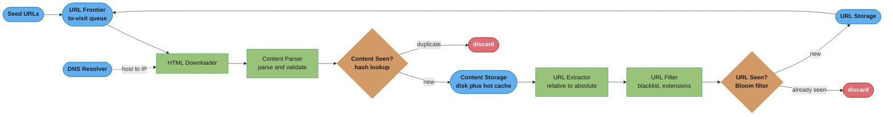
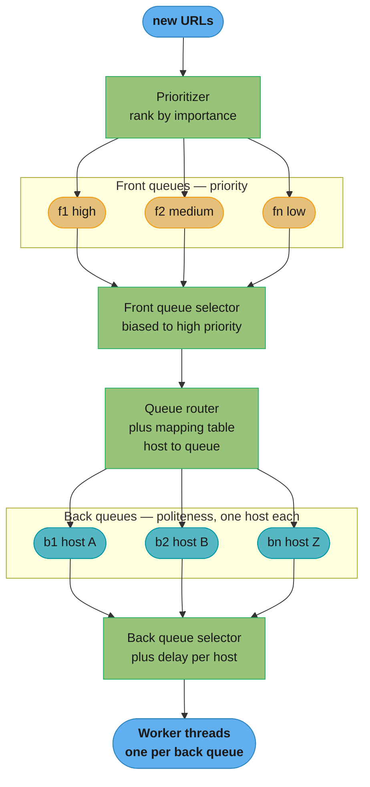
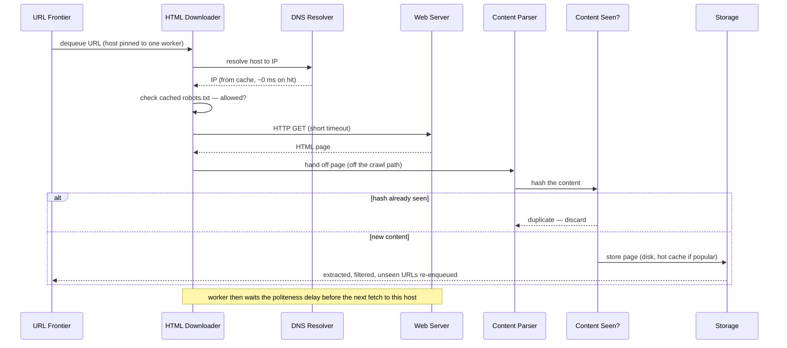

# Chapter 9: Design A Web Crawler

> Ch 9 of 16 · System Design Interview Vol 1 (Xu) · builds on Ch 1–3, the BFS-at-scale design; its dedup and storage tricks reappear in Ch 13–15

## Chapter Map

A **web crawler** (also called a robot or spider) is a program that systematically
discovers and downloads web content, starting from a set of **seed URLs** and following
the hyperlinks it finds. Chapter 9 turns that one-sentence idea into a design that must
fetch **one billion pages a month** politely, without downloading the same page twice,
without getting trapped, and while keeping years of data. The chapter's real lesson is
that a crawler is a **graph traversal at planetary scale** — a BFS whose queue is a
distributed, disk-backed structure that also has to be polite to every host it touches.

**TL;DR:**
- A crawler is a **BFS over the web graph**: the "to-visit" queue is the **URL Frontier**,
  and the whole design is about making that queue scalable, polite, and prioritized.
- The two hardest sub-problems are **politeness** (never hammer one host — one worker per
  host with a delay) and **dedup** (never re-download the same content or re-enqueue the
  same URL — hashes and Bloom filters, not full-document comparisons).
- Everything else — DNS as the hidden bottleneck, spider traps, redundant content, JS
  rendering, checkpointing — is a robustness or efficiency patch on top of that core loop.

## The Big Question

> "The web is a near-infinite graph of a trillion-plus pages with no central index. How do
> I walk it — downloading a billion pages a month — without re-fetching pages I've already
> seen, without being blocked as an abuser, without falling into infinite loops, and without
> losing all my progress when a machine dies mid-crawl?"

Analogy: crawling the web is like exploring a colossal, cyclic subway map where every
station lists the stations it connects to, but there is no master map. You must remember
every station you have already visited (or you loop forever), you must not overwhelm any
single station's turnstiles (politeness), and because the map has hundreds of billions of
stations you cannot hold the whole "to-visit" list in your head — it has to spill to disk.
The chapter's arc is: sketch the loop (Step 2), then armor it against scale, rudeness, and
traps (Step 3).

---

## 9.1 Step 1 — Understand the Problem and Establish Design Scope

The basic algorithm is deceptively short:

1. Given a set of **seed URLs**, download all the web pages they address.
2. **Extract** the URLs (hyperlinks) from those pages.
3. Add the new URLs to the list of URLs to download; repeat from step 1.

But "download the web" hides a dozen constraints. The point of Step 1 is to pin down which
ones matter, because a crawler tuned for a search engine looks nothing like one tuned for
copyright monitoring.

### Use cases — why crawl at all

A crawler is not one product; the same skeleton serves several purposes, and the purpose
drives the requirements:

| Use case | What the crawler feeds | Consequence for design |
|----------|------------------------|------------------------|
| **Search engine indexing** | Builds a local index so a search engine (Googlebot, Bingbot) can answer queries | Must cover breadth of the whole web; freshness matters |
| **Web archiving** | Preserves snapshots for the future (US Library of Congress, EU web archive) | Must store full page content for years; completeness over freshness |
| **Web mining** | Discovers knowledge — e.g. a financial firm crawling shareholder-meeting minutes and annual reports | Targeted domains; parse structured data |
| **Web monitoring** | Watches for intellectual-property, brand, or copyright violations | Continuous re-crawl of specific sites; change detection |

### The requirements dialogue

The chapter models the interview as a back-and-forth that fixes scope. The numbers that
come out of it are the ones every later decision leans on:

- **Q: What is the main purpose?** → Search engine indexing.
- **Q: How many pages per month?** → **1 billion pages/month.**
- **Q: What content types?** → **HTML only** (no images, PDFs, video — for now).
- **Q: New and edited pages?** → Yes — must handle **newly added and edited** web pages.
- **Q: Store the crawled pages?** → Yes, **up to 5 years.**
- **Q: Duplicate content?** → **Ignore duplicates** — pages with duplicate content should be
  discarded, not stored or indexed twice.

These six answers are load-bearing. "HTML only" lets us skip a media pipeline; "1 billion/
month" fixes throughput; "5 years" fixes storage; "ignore duplicates" makes the **Content
Seen?** and **URL Seen?** components mandatory rather than optional.

### Characteristics of a good crawler

Beyond the functional list, a production crawler must have four non-functional properties.
These are the yardstick every Step-3 deep dive is measured against:

- **Scalability** — the web has billions of pages, so crawling must be highly efficient and
  parallel. A single-threaded crawler could not finish in a human lifetime.
- **Robustness** — the web is full of traps: bad HTML, unresponsive servers, crashes,
  malicious links. The crawler must handle all of these gracefully and keep going.
- **Politeness** — the crawler must not make too many requests to one website in a short
  interval; a rude crawler looks like a denial-of-service attack and gets blocked.
- **Extensibility** — the system should absorb new content types (images, PDFs) with minimal
  change — ideally by plugging in a new module, not rewriting the core.

### Back-of-the-envelope estimation

The chapter reproduces the arithmetic explicitly; do the same in an interview.

**Throughput (QPS):**

```
1,000,000,000 pages / month
÷ 30 days  ÷ 24 hours  ÷ 3600 seconds
= 1,000,000,000 / 2,592,000 seconds
≈ 400 pages per second   (average QPS)
```

Traffic is not flat, so assume a **2× peak factor**:

```
Peak QPS = 2 × 400 = 800 pages per second
```

**Read it like this.** The throughput estimate is a unit conversion followed by a safety margin: *"turn a monthly page budget into a per-second rate, then multiply by a peak factor because traffic is never flat."* The peak number, not the average, is what every downloader-sizing decision downstream is measured against.

| Symbol | What it is |
|--------|------------|
| `1,000,000,000 pages/month` | The crawl budget fixed in the requirements dialogue. |
| `30 days/month` | Assumed month length (the chapter's simplification). |
| `2,592,000 sec/month` | `30 days x 24 h/day x 3600 s/h` — the conversion constant. |
| `average QPS` | Pages fetched per second if traffic were perfectly flat. |
| `2x` | Assumed peak factor covering diurnal and burst variation. |
| `peak QPS` | The rate the downloader fleet must actually be able to sustain. |

**Walk one example.** The conversion with units carried on every line:

```
step 1  seconds per month  30 days/month x 24 h/day x 3600 s/h  = 2,592,000 s/month
step 2  average rate       1,000,000,000 pages/month
                           / 2,592,000 s/month                  = 385.8 pages/s
step 3  peak rate          385.8 pages/s x 2                    = 771.6 pages/s
step 4  chapter's rounding 385.8 -> ~400 pages/s
                           771.6 -> ~800 pages/s
Meaning: the fleet must sustain roughly 800 fetches per second, and every politeness,
DNS, and timeout decision in Step 3 is sized against that 800, not against the 385.8.
```

The exact arithmetic is `385.8` average and `771.6` peak; the chapter rounds both up to `400` and `800`, which is the right instinct in an interview — the rounded `400 pages/s` implies `1,036,800,000 pages/month`, a 3.7 percent cushion over the requirement rather than a shortfall. Drop the `2x` peak factor entirely and you build a fleet that is exactly saturated at the daily average, meaning every evening peak silently falls behind and the Frontier grows without bound.

**Storage:**

```
Average HTML page size ≈ 500 KB   (assumption stated in the chapter)

Per month   = 1,000,000,000 pages × 500 KB
            = 500,000,000,000 KB
            = 500 TB / month

Over 5 years = 500 TB × 12 months × 5 years
             = 30,000 TB
             = 30 PB
```

**What the formula is telling you.** Storage is the throughput number multiplied twice: *"pages per month times bytes per page gives bytes per month, and bytes per month times the retention window gives the total you must actually buy."* Both multipliers are assumptions, so both are places the estimate can be off by an order of magnitude.

| Symbol | What it is |
|--------|------------|
| `1,000,000,000 pages/month` | Crawl volume from the requirements dialogue. |
| `500 KB/page` | Assumed average HTML page size (stated by the chapter). |
| `12 months/year` | Months per year. |
| `5 years` | The retention window fixed in Step 1 ("store up to 5 years"). |
| `60 months` | `12 months/year x 5 years` — the full retention multiplier. |
| `1 TB` | `1,000,000,000 KB` in the decimal convention the chapter uses. |
| `1 PB` | `1,000 TB`. |

**Walk one example.** The storage chain with units carried on every line:

```
step 1  bytes per month    1,000,000,000 pages/month x 500 KB/page
                                                       = 500,000,000,000 KB/month
step 2  in terabytes       500,000,000,000 KB/month
                           / 1,000,000,000 KB/TB       = 500 TB/month
step 3  retention window   12 months/year x 5 years    = 60 months
step 4  total at rest      500 TB/month x 60 months    = 30,000 TB
step 5  in petabytes       30,000 TB / 1,000 TB/PB     = 30 PB
Meaning: 30 PB is roughly 3 x 10^16 bytes -- far past any single machine's RAM, which
is exactly what forces the disk-primary, memory-cache-for-popular-pages split.
```

The `500 KB/page` multiplier is the fragile one: it is an assumption about the *average* HTML document, and it is what lets the "HTML only" scope hold. Admit images or PDFs into the crawl and the per-page figure moves by an order of magnitude, taking the 30 PB with it — which is why "what content types?" is asked in Step 1 and not discovered in Step 3. Drop the `60 months` retention multiplier and you size storage for a single month's 500 TB, under-provisioning by 60x on a system whose whole point is keeping five years of snapshots.

So the storage subsystem must plan for **30 PB of HTML** to hold five years of crawl — the
number that later justifies "most content lives on disk, only popular content in memory."

---

## 9.2 Step 2 — Propose High-Level Design and Get Buy-In

The high-level design is a **loop of specialized components** wired around the URL Frontier.
Download → parse → dedup content → extract links → filter → dedup URLs → back into the
Frontier. Each box below is its own `###` because each becomes a deep-dive candidate.



Caption: the whole crawler is one feedback loop — URLs flow out of the Frontier, get
downloaded and dedup'd, their extracted links get filtered and dedup'd, and the survivors
flow back into the Frontier. The two diamond gates (Content Seen?, URL Seen?) are what stop
the loop from doing redundant work.

### Seed URLs

A crawler needs a starting point — the **seed URLs** — from which it discovers everything
else by following links. Choosing seeds well matters because a good seed set reaches the
most pages with the least wasted crawling.

- **A single site (e.g. a university)** — the obvious seed is that school's homepage; every
  page on the domain is reachable from it.
- **The whole web** — there is no single obvious seed. A useful strategy is to **partition
  the URL space** and pick seeds so the crawl fans out efficiently:
  - **By locality / country** — different countries have different popular sites; seed with
    each region's top sites.
  - **By topic** — partition into categories (shopping, sports, health, …) and seed each with
    a representative site.

There is no one-size-fits-all seed strategy; the chapter's guidance is that seed selection
is an open-ended problem and the interviewer just wants to see you reason about coverage.

### URL Frontier

The **URL Frontier** stores the URLs **to be downloaded** — the "to-visit" set. Conceptually
it is a **First-In-First-Out (FIFO) queue**, which is exactly what makes the traversal a
breadth-first search. It is introduced here as a simple queue; Step 3 expands it into the
most sophisticated component in the whole design (front queues + back queues for politeness
and priority). For now: URLs go in, the HTML Downloader pulls them out.

### HTML Downloader

The **HTML Downloader** fetches web pages from the internet. It reads URLs from the URL
Frontier, resolves each host to an IP (via the DNS Resolver), and downloads the raw HTML.
It is the component that actually talks to remote web servers over HTTP, so it is where
politeness, robots.txt, and performance optimizations (Step 3) live.

### DNS Resolver

Before the Downloader can fetch `https://www.example.com/page`, it must translate the
hostname `www.example.com` into an IP address — that is DNS resolution. This tiny step is a
**surprising bottleneck**:

- DNS resolution is **synchronous** by nature — the request blocks until the lookup returns.
- A single lookup can take **10 ms to 200 ms**. At 800 pages/second, if every fetch waited on
  a fresh DNS lookup, DNS alone would serialize the crawl.
- **Fix: cache DNS results.** Keep a local **DNS cache** mapping hostname → IP, refreshed
  periodically by a background job. Because a crawler hits the same host thousands of times
  (most links on a page point back to the same domain), the cache hit rate is very high and
  DNS stops being the bottleneck.

**In plain terms.** "DNS is a bottleneck" is a concurrency statement, not a latency one: *"if each lookup blocks for a fixed time, the lookups you can finish per second is your thread count divided by that time."* Written that way, the cache stops looking like an optimization and starts looking like the only affordable option.

| Symbol | What it is |
|--------|------------|
| `L` | Latency of one synchronous DNS lookup, 10 ms to 200 ms. |
| `1 / L` | Lookups per second a single blocked thread can complete. |
| `800 pages/s` | The peak fetch rate the crawler must sustain. |
| `800 x L` | Threads needed if every fetch pays a full lookup. |
| `h` | DNS cache hit rate — fraction of fetches that skip the lookup entirely. |
| `800 x (1 - h)` | Lookups per second that actually reach a resolver. |

**Walk one example.** Take the midpoint latency, `L = 100 ms`:

```
WITHOUT a cache
  per-thread capacity   1 / 0.100 s per lookup           = 10 lookups/s/thread
  threads required      800 lookups/s / 10 lookups/s     = 80 threads blocked on DNS
                        at the 200 ms worst case: 800 / 5 = 160 threads

WITH a cache at 99 percent hit rate
  lookups that escape   800 pages/s x (1 - 0.99)         = 8 lookups/s
  threads required      8 lookups/s / 10 lookups/s       = 0.8 threads
  reduction             80 threads -> 0.8 threads        = 100x fewer
Meaning: uncached DNS demands a pool of ~80 threads doing nothing but waiting; the
cache shrinks that below one, which is why it is mandatory rather than optional.
```

The hit rate is high for a structural reason, not a lucky one: most links on a page point back to the same host, and the back-queue design deliberately funnels every URL for one host to one worker. The same hostname is therefore resolved once and reused across thousands of fetches — the crawler's access pattern and its politeness mechanism are what make the DNS cache effective.

### Content Parser

After a page is downloaded, it must be **parsed and validated**, because malformed HTML
wastes storage and can corrupt downstream processing. The Content Parser does this. The key
design note: **keep parsing off the crawl path.** Parsing/validation is comparatively slow,
so making it a **separate component** rather than inlining it into the crawl loop prevents
it from slowing down the download process. Downloaders hand pages to parsers and move on.

### Content Seen?

Studies show that up to **~29% of web pages are duplicated content** — the same page reachable
under different URLs. Storing or indexing the same content twice wastes storage and compute.
The **Content Seen?** component detects this. The efficient way to compare is **not** to
compare documents byte-by-byte (too slow for billions of pages) but to compare **hashes** of
the two documents: hash each page, keep the hashes in a set, and if a new page's hash is
already present, it is a duplicate and is discarded.

### Content Storage

The **Content Storage** holds HTML content. Because there is **30 PB** of it, the storage
strategy is **hybrid**:

- **Most content lives on disk** — the dataset is far too large for memory.
- **Popular content is cached in memory** — a hot subset that is accessed frequently is kept
  in RAM to reduce latency. Choosing what to store on disk vs. in memory is driven by data
  size, access frequency, and latitude.

### URL Extractor

The **URL Extractor** parses the HTML and pulls out the hyperlinks. A crucial detail is
**converting relative URLs to absolute URLs**, because links inside a page are often
relative to the current page. Example: a page at `https://en.wikipedia.org/wiki/Web_crawler`
contains a link `/wiki/Robot`. That relative link must be resolved against the page's base
URL into the absolute URL `https://en.wikipedia.org/wiki/Robot` before it can be crawled.

### URL Filter

The **URL Filter** excludes URLs that should not be crawled. It filters out:

- **Blacklisted** content types and sites (e.g. adult content, known-bad domains).
- **Error links** — URLs that lead to error pages.
- **Certain file extensions** — file types the crawler does not want (e.g. `.jpg`, `.png`,
  `.mp4`, `.pdf` when the scope is HTML only).

### URL Seen?

The **URL Seen?** component tracks which URLs have **already been visited or are already in
the Frontier**, so the crawler never downloads the same URL twice and never enters an
infinite loop. It is typically implemented with a **Bloom filter** or a **hash table**. A
Bloom filter is the standard choice at web scale because it answers "have I seen this URL?"
in constant time using a tiny fraction of the memory a full hash set would need — at the cost
of a small false-positive rate.

### URL Storage

The **URL Storage** persists the URLs that have already been visited. Together with URL Seen?
it forms the crawler's long-term memory of the web graph it has already explored.

### The full workflow — the book's numbered 11-step flow

Putting the components together, one lap of the crawl is:

1. **Add seed URLs to the URL Frontier.**
2. The **HTML Downloader fetches a list of URLs** from the URL Frontier.
3. The **HTML Downloader gets the IP addresses** of those URLs from the **DNS Resolver** and
   starts **downloading**.
4. The **Content Parser parses** the downloaded HTML pages and **checks whether pages are
   malformed**.
5. After content is parsed and validated, it is passed to the **Content Seen?** component.
6. **Content Seen?** checks whether the HTML page is already in storage:
   - If it **is** already there → the page is a **duplicate**, so **discard** it.
   - If it is **not** there → pass it on to the **URL Extractor**.
7. The **URL Extractor extracts links** from the HTML page.
8. The extracted links are passed to the **URL Filter**.
9. After filtering, the surviving links are passed to the **URL Seen?** component.
10. **URL Seen?** checks whether a URL is already in storage; if it is, it has been processed
    before and is **discarded**.
11. If a URL has **not** been processed before, it is **added to the URL Frontier** — closing
    the loop back to step 2.

---

## 9.3 Step 3 — Design Deep Dive

Step 2 gives a working crawler on paper. Step 3 is where it becomes production-grade:
choosing BFS over DFS, making the Frontier polite and prioritized, making the Downloader
well-behaved and fast, and hardening the whole thing against crashes, new content types, and
adversarial pages.

### DFS vs BFS

The web is a **directed graph** — pages are nodes, hyperlinks are edges. Crawling is graph
traversal, and the two candidate traversals are DFS and BFS.

- **DFS (depth-first) is usually a bad choice** because the **depth can be extremely — even
  unboundedly — deep.** Following one link, then a link on that page, then a link on *that*
  page, and so on, can descend very far down one branch before ever coming back up. You cannot
  bound how deep a DFS goes, so it is unsuitable for a general web crawl.
- **BFS (breadth-first) is the standard**, and it falls out naturally: the URL Frontier is a
  **FIFO queue** — dequeue a URL, download it, enqueue all the links it contains — which is
  exactly BFS.

But **plain BFS has two serious problems**:

1. **It is impolite.** Most links on a page point to **pages on the same host** (internal
   links dominate). A naive FIFO Frontier therefore dequeues many URLs for the same host in a
   burst and downloads them nearly simultaneously — which floods that one server with
   requests and looks like a DoS attack. Example: crawling `wikipedia.org` yields a page full
   of `wikipedia.org` links, so the next many fetches all hammer Wikipedia.
2. **It is priority-blind.** Standard FIFO BFS treats every URL as equally important. In
   reality, pages differ enormously in usefulness (PageRank, traffic, update frequency), and a
   crawler should spend its limited throughput on the pages that matter most.

Both problems are solved by making the URL Frontier smarter — which is the next deep dive.

### URL Frontier — the full internals

The URL Frontier is far more than a FIFO queue. It juggles **politeness**, **priority**, and
**freshness**, and it must do so while holding **hundreds of millions of URLs**. The canonical
design uses a **two-tier queue architecture**: **front queues** manage priority, **back
queues** manage politeness.



Caption: front queues sort by priority (the front-queue selector pulls preferentially from
high-priority queues); back queues enforce politeness (the router's mapping table pins each
host to exactly one back queue, and a single worker drains each back queue with a delay). A
URL flows top-to-bottom: prioritized in, politely out.

#### Politeness — the front/back queue mechanism

Politeness means **never overwhelming a single host**. The rule of thumb: send **one request
at a time to a given host**, with a **delay between consecutive downloads** to the same host.
The mechanism that guarantees this is the **back-queue tier**:

- **Queue router** — ensures that all URLs for a given **host** end up in the **same back
  queue**. It consults a **mapping table** that maps `host → back-queue ID`.
- **Mapping table** — the `host → queue` map. Example rows: `wikipedia.com → b1`,
  `apple.com → b2`, `nike.com → bn`. Every URL for `wikipedia.com` therefore always lands in
  back queue `b1`, no matter when it was discovered.
- **Back queues** — each back queue `b1…bn` contains URLs for **exactly one host**.
- **Back queue selector** — maps each **worker thread** to a back queue. Each worker downloads
  from a single back queue, one URL at a time.
- **Delay** — between two downloads from the same host, the worker waits a configured delay.
  Because one back queue = one host = one worker, a host is never fetched by two workers at
  once, and the delay spaces out consecutive fetches. That is politeness, structurally
  guaranteed.

**What this actually says.** The politeness rule is a hard rate cap: *"one connection per host with a delay of d seconds between fetches means that host can never be crawled faster than 1/d pages per second, no matter how large your fleet is."* Total throughput therefore comes from the *number of hosts in flight*, not from adding threads — which is the single most counter-intuitive consequence of the back-queue design.

| Symbol | What it is |
|--------|------------|
| `d` | Politeness delay between consecutive fetches to the same host, in seconds. |
| `1 / d` | Maximum pages per second obtainable from one host. |
| `M` | Number of distinct hosts currently pinned to back queues. |
| `N` | Number of worker threads (one per back queue, so `N = M`). |
| `N x (1 / d)` | Aggregate crawl throughput in pages per second. |
| `800 pages/s` | The peak rate the whole crawler must reach. |

**Walk one example.** How many back queues 800 pages/s actually requires:

```
per-host ceiling      d = 1 s   -> 1 / 1  = 1.0 pages/s/host
                      d = 2 s   -> 1 / 2  = 0.5 pages/s/host
                      d = 5 s   -> 1 / 5  = 0.2 pages/s/host
                      d = 10 s  -> 1 / 10 = 0.1 pages/s/host

back queues (= workers = distinct hosts) needed for 800 pages/s:
  d = 1 s    800 pages/s / 1.0 pages/s/host   =   800 hosts in flight
  d = 2 s    800 pages/s / 0.5 pages/s/host   = 1,600 hosts in flight
  d = 5 s    800 pages/s / 0.2 pages/s/host   = 4,000 hosts in flight
  d = 10 s   800 pages/s / 0.1 pages/s/host   = 8,000 hosts in flight

At d = 1 s and 100 worker threads per crawl server:
  800 workers / 100 threads/server            = 8 downloader servers
Meaning: throughput scales with HOSTS, not threads. Adding a second worker to a
back queue would double that host's rate and break politeness, so the only legal
way to go faster is to hold more hosts open at once.
```

This is why the two tiers cannot be collapsed. If you doubled the politeness delay to be safer, you would need twice as many back queues — and therefore twice as broad a host mix in the Frontier — to hold the same 800 pages/s. A crawl that discovers deep, narrow sites (few hosts, many pages each) is throughput-starved by politeness no matter how much hardware you throw at it; a crawl seeded broadly across many domains is not. That is the quantitative case for the "partition the URL space by locality or topic" seed strategy from Step 2.

This is exactly the fix for plain BFS's impoliteness: no matter how many `wikipedia.org` links
BFS discovers in a burst, they all funnel into `b1` and get drained slowly by one worker.

#### Priority — the front queue mechanism

Not all pages deserve equal crawl budget. Prioritization decides crawl order by **usefulness**,
measured by signals such as **PageRank, website traffic, and update frequency**. The
front-queue tier implements it:

- **Prioritizer** — takes a URL and computes its priority from those signals.
- **Front queues `f1…fn`** — one queue per **priority level** (`f1` = highest priority, `fn` =
  lowest).
- **Front queue selector** — chooses which front queue to pull the next URL from, **biased
  toward higher-priority queues** (it randomly picks a queue but weights the choice so
  high-priority queues are chosen more often). This ensures important pages are crawled sooner
  without starving low-priority pages entirely.

The front tier feeds the back tier: the front-queue selector picks a prioritized URL, the
queue router places it in the correct host's back queue. Priority and politeness compose.

#### Freshness — recrawling

Web pages are **constantly added, edited, and deleted**, so a crawler must **recrawl** to keep
its copy fresh. Recrawling everything constantly is wasteful, so the strategies are:

- **Recrawl based on update history** — pages that change often are recrawled more often; a
  news homepage might be recrawled hourly, a static "about" page monthly.
- **Prioritize important pages** — recrawl important pages (high PageRank/traffic) more
  frequently and earlier, so the most-visited pages are the freshest.

**Put simply.** Recrawl frequency is a budget division, not a policy preference: *"the interval between visits to any page is the size of the corpus divided by the crawl rate you are willing to spend on revisits."* The moment you write that ratio down, uniform recrawling is visibly impossible and selective recrawling becomes forced.

| Symbol | What it is |
|--------|------------|
| `C` | Corpus size — pages already crawled and being kept fresh. |
| `R` | Crawl rate spent on recrawling, in pages per month. |
| `C / R` | Sweep interval — months to revisit every page once. |
| `1,000,000,000 pages/month` | The total crawl budget, shared between discovery and recrawl. |
| `f` | Fraction of the budget allocated to recrawl rather than new pages. |
| `f x 1,000,000,000` | Recrawl throughput available per month. |

**Walk one example.** Sweep interval for a five-year corpus of `60,000,000,000` pages:

```
corpus after 5 years   1,000,000,000 pages/month x 60 months  = 60,000,000,000 pages

spend the ENTIRE budget on recrawl (f = 1.0, discover nothing new):
  60,000,000,000 pages / 1,000,000,000 pages/month            = 60 months per sweep
  at 400 pages/s: 60,000,000,000 / 400 pages/s               = 4.76 years per sweep

split the budget instead:
  f = 0.5   recrawl at 500,000,000 pages/month  -> sweep every 120 months
  f = 0.3   recrawl at 300,000,000 pages/month  -> sweep every 200 months
  f = 0.1   recrawl at 100,000,000 pages/month  -> sweep every 600 months
Meaning: even spending 100 percent of a billion pages/month on revisits gives every
page a 5-year refresh -- useless for a news homepage. Uniform recrawl is arithmetically
dead, so the budget must be aimed at the pages that actually change.
```

That is the entire justification for "recrawl based on update history" and "prioritize important pages." A news homepage recrawled hourly costs `720 fetches/month`; giving that treatment to all 60 billion pages would need `43,200,000,000,000` fetches per month — exactly 43,200 times the crawler's whole budget. The recrawl policy is not tuning — it is what makes freshness fit inside the same 800 pages/s the discovery crawl is already saturating.

#### Storage for the URL Frontier

The Frontier can hold **hundreds of millions of URLs** — far too many to keep entirely in
memory, yet too latency-sensitive to keep entirely on disk. The solution is a **hybrid**:

- **The majority of URLs live on disk** (buffered queues persisted to disk), so the Frontier
  survives restarts and fits the volume.
- **Memory buffers** hold the enqueue and dequeue ends: incoming URLs are buffered in memory
  and periodically flushed to disk; outgoing URLs are prefetched into a memory buffer so
  workers do not block on disk reads.

This keeps the throughput of an in-memory queue while getting the capacity and durability of
disk.

### HTML Downloader — robots.txt and performance

The HTML Downloader downloads pages using HTTP, guided by the Frontier. Two big topics live
here: obeying the robots exclusion protocol, and going fast.

#### Robots Exclusion Protocol (robots.txt)

**`robots.txt`** is the standard a website uses to tell crawlers **which pages they are
allowed to download**. A well-behaved crawler **checks `robots.txt` and follows its rules
before crawling** a site. The file lives at the site root, e.g.
`https://www.amazon.com/robots.txt`. Example (Amazon):

```
User-agent: Googlebot
Disallow: /creatorhub/*
Disallow: /rss/people/*/reviews
Disallow: /gp/pdp/rss/*/reviews
Disallow: /gp/cdp/member-reviews/
```

This tells the crawler identified as `Googlebot` that directories like `/creatorhub/` are
off-limits. **Caching `robots.txt`** matters: to avoid re-downloading the file for every page
of a site (which would itself be impolite and slow), the crawler downloads `robots.txt`
periodically and **caches** it, reusing the cached rules across the many pages of that host.

#### Performance optimizations

The Downloader is the throughput-critical path; the chapter lists four optimizations:

1. **Distributed crawl** — spread the crawl across **many servers**, each running multiple
   threads. The **URL space is partitioned** so each downloader server is responsible for a
   subset of URLs; this is how the crawl reaches 800 pages/second.
2. **Cache DNS resolver** — as covered above, DNS is synchronous and slow (10–200 ms), so a
   **local DNS cache** (refreshed by a background thread) removes DNS from the hot path.
3. **Locality (geographic)** — place crawl servers **geographically close to the sites they
   crawl**. A server in Europe crawling European sites has lower latency than one crossing an
   ocean; this applies to crawl servers, cache, storage, and queues.
4. **Short timeout** — some web servers respond slowly or not at all. To avoid one slow host
   stalling a worker, set a **maximal wait time (short timeout)**; if a host does not respond
   within it, the crawler abandons that request and moves on.

### Robustness

A planetary crawl runs for weeks and touches hostile, buggy servers, so it must survive
failures without losing progress:

- **Consistent hashing over downloaders** — distribute load among downloader servers using
  **consistent hashing**, so a server can be added or removed with minimal remapping of which
  host each server handles. (This is the same primitive as the dedicated consistent-hashing
  chapter.)
- **Save crawl state and data (checkpoints)** — periodically **checkpoint** the crawl state
  (the Frontier contents, seen sets) to persistent storage. If the crawler crashes, it
  **resumes from the last checkpoint** instead of starting over from the seeds.
- **Exception handling** — the system must handle errors gracefully and **not crash** when it
  hits a malformed page, a timeout, or a network failure; it logs and continues.
- **Data validation** — validate data (e.g. the parsed HTML) to guard against system errors
  and to keep bad data out of storage.

### Extensibility

The system should absorb **new content types** by **plugging in modules** rather than
rewriting the core loop. The chapter's examples:

- **PNG Downloader module** — a plug-in that downloads and handles PNG images (or any image
  type), added without touching the HTML path.
- **Web Monitor module** — a plug-in that watches the web for copyright and trademark
  infringements, reusing the same crawl infrastructure for a monitoring product.

Extensibility is why the components are separated (parser separate from downloader, etc.): each
seam is a place a new module can attach.

### Detect and avoid problematic content

The last robustness topic is the adversarial and low-value content the web is full of:

- **Redundant content** — as noted, **~30% of web pages are duplicates**. Detect and skip them
  using **hashes or checksums** of the content (the Content Seen? mechanism) rather than
  comparing full documents.
- **Spider traps** — pages designed (accidentally or maliciously) to keep a crawler stuck in
  an **infinite loop**, e.g. a deep, endlessly nested directory structure like
  `www.spidertrapexample.com/foo/bar/foo/bar/foo/bar/…`. Defenses: set a **maximum URL length**
  so absurdly long generated URLs are rejected, and maintain a **manual blacklist** of hosts
  known to be traps. There is no perfect automated detector; traps are hard because they can be
  algorithmically generated, so a human-curated blacklist is the practical backstop.
- **Data noise** — some content has little or no value: **advertisements, spam URLs, and code
  snippets**. These should be **excluded** when they are not useful to the crawl's purpose.

---

## 9.4 Step 4 — Wrap Up

If time remains, the interview should touch the topics that make the crawler production-ready
beyond the core loop:

- **Server-side rendering (dynamic rendering)** — many sites use JavaScript, AJAX, and
  frameworks to generate links **on the client**. If the crawler just fetches the raw HTML, it
  sees an empty shell and **misses the dynamically generated links**. The fix is **server-side
  rendering** (dynamic rendering): **render the page** (execute its JavaScript) **before
  parsing** it, so the crawler extracts the same links a real browser would.
- **Filter out unwanted pages** — with finite storage and crawl budget, add an **anti-spam /
  low-quality filter** to avoid crawling and storing spammy or low-quality pages.
- **Database replication and sharding** — improve the data layer's availability, scalability,
  and reliability by **replicating** (copies for availability and read scaling) and
  **sharding** (partitioning data across nodes for capacity) the storage.
- **Horizontal scaling** — scale out to hundreds or thousands of servers. The key enabler is
  **statelessness**: keep the crawl servers **stateless** (state lives in the Frontier, seen
  sets, and storage), so you can add servers freely to increase throughput.
- **Availability, consistency, and reliability** — these are core to any large system; the
  crawler must stay available, keep its data consistent enough, and reliably recover from the
  inevitable failures (via the checkpoints and replication above).
- **Analytics** — collect and analyze data from the crawl. Measurements and metrics (fetch
  rates, error rates, duplicate rates, coverage) are a core part of fine-tuning a crawler over
  time.

---

## Visual Intuition

### One crawl cycle, as a sequence



Caption: one lap through the loop — resolve (cached DNS), check cached robots.txt, fetch with
a short timeout, parse off the hot path, dedup by hash, store, and re-enqueue only new URLs.
The trailing note is the politeness guarantee: one host, one worker, a delay between fetches.

### Why plain BFS is impolite — before vs after the back queues

```
PLAIN FIFO BFS (impolite):
  Frontier dequeue order (most links are same-host):
    wiki/A  wiki/B  wiki/C  wiki/D  wiki/E   -> all fired at wikipedia.org at once
  wikipedia.org  |####### 5 concurrent hits #######|   <- looks like a DoS

WITH host->back-queue mapping (polite):
  Router pins every wikipedia.org URL to back queue b1; one worker drains b1:
    wiki/A --[delay]--> wiki/B --[delay]--> wiki/C --[delay]--> wiki/D
  wikipedia.org  |#..#..#..#|  spaced by the politeness delay          <- well-behaved
  Meanwhile b2 (apple.com), b3 (nike.com) crawl in parallel on other workers.
```

Caption: the back-queue tier converts a burst of same-host links (which naive BFS fires
simultaneously) into a single, delay-spaced stream per host, while different hosts still
crawl fully in parallel — politeness without losing throughput.

### Bloom filter — how URL Seen? fits a billion URLs in a few gigabytes

```
URL "https://x.com/p"  ->  h1=3  h2=7  h3=12     (k=3 hash functions -> bit positions)

bit array (m bits):   0 0 0 1 0 0 0 1 0 0 0 0 1 0 ...
                              ^         ^         ^
                             h1        h2        h3   (set on insert)

Lookup a URL: hash it, check those k bits.
  - ANY bit 0  -> DEFINITELY NOT seen  (no false negatives)
  - ALL bits 1 -> PROBABLY seen        (small false-positive rate)

False positive => a genuinely-new URL is wrongly skipped (lost coverage),
                  but a seen URL is never re-crawled. Tune m and k to trade
                  memory vs. false-positive rate; a hash table is exact but far larger.
```

Caption: a Bloom filter answers "have I seen this URL?" in O(k) time using a bit array far
smaller than storing the URLs themselves; the price is a tunable false-positive rate, where a
false positive silently drops a new URL but never causes a re-crawl.

**Stated plainly.** The false-positive formula `(1 - e^(-k n / m))^k` reads as a two-step story: *"after inserting n URLs, each bit has some chance of already being 1; a false positive happens when all k of a new URL's bits are 1 by coincidence."* The whole tuning exercise is a straight trade of bits per URL against how much crawl coverage you are willing to lose.

| Symbol | What it is |
|--------|------------|
| `n` | Number of URLs inserted into the filter. |
| `m` | Size of the bit array, in bits. |
| `m / n` | Bits of memory spent per URL — the knob you actually turn. |
| `k` | Number of hash functions per URL (the `h1, h2, h3` above). |
| `e^(-k n / m)` | Probability a given bit is still 0 after all insertions. |
| `(1 - e^(-k n / m))^k` | False-positive rate: all `k` bits happen to be 1. |
| `(m/n) x ln 2` | The `k` that minimizes the false-positive rate for a given `m/n`. |

**Walk one example.** The chapter's billion URLs, at 10 bits per URL:

```
n = 1,000,000,000 URLs
m = 1,000,000,000 x 10 bits             = 10,000,000,000 bits
memory                                  = 10,000,000,000 / 8 = 1,250,000,000 bytes
                                        = 1.25 GB
optimal k       10 x ln 2 = 6.93        -> k = 7 hash functions
false positive  (1 - e^(-7 x 1e9 / 1e10))^7
                = (1 - e^(-0.7))^7      = 0.00819  = 0.82 percent
coverage lost   1,000,000,000 x 0.00819 = 8,193,722 URLs silently skipped

Bits-per-URL sweep (n = 1 billion, k chosen optimally each time):
  8 bits/URL    m = 1.00 GB   k = 6    false positive = 2.16 percent
 10 bits/URL    m = 1.25 GB   k = 7    false positive = 0.82 percent
 12 bits/URL    m = 1.50 GB   k = 8    false positive = 0.31 percent
 16 bits/URL    m = 2.00 GB   k = 11   false positive = 0.046 percent

Exact hash set for comparison, storing the URLs themselves at ~100 bytes each:
  1,000,000,000 URLs x 100 bytes        = 100,000,000,000 bytes = 100 GB
  ratio  100 GB / 1.25 GB               = 80x more memory
Meaning: the Bloom filter fits a billion-URL seen-set in 1.25 GB instead of 100 GB --
80x less -- and the bill is 8.2 million pages the crawler will never discover.
```

That last line is the cost the pitfalls section warns about, made concrete. Because a false positive means "I think I have seen this URL," a *genuinely new* page is dropped and never enters the Frontier — and since the filter has no false negatives, nothing ever re-discovers it. Doubling from 8 to 16 bits per URL costs 1 GB of RAM and cuts the loss from about 21.6 million pages to about 459 thousand, which is why the memory knob is worth turning even when the filter "already works."

---

## Key Concepts Glossary

- **Web crawler (robot / spider / bot)** — program that discovers and downloads web content by
  following links from seed URLs.
- **Seed URLs** — the starting URLs from which the crawl discovers the rest of the web graph.
- **URL Frontier** — the store of URLs still to be downloaded; a FIFO queue at heart (⇒ BFS).
- **BFS (breadth-first search)** — the crawl traversal that a FIFO Frontier produces.
- **DFS (depth-first search)** — rejected traversal; its depth can be unboundedly deep.
- **HTML Downloader** — component that fetches pages over HTTP from web servers.
- **DNS Resolver** — translates hostname → IP; synchronous, 10–200 ms per lookup, so cached.
- **DNS cache** — local hostname→IP cache that removes DNS from the hot path.
- **Content Parser** — parses and validates downloaded HTML; kept off the crawl path.
- **Content Seen?** — dedup by comparing content **hashes**, not full documents (~29% dupes).
- **Content Storage** — hybrid disk (most content) + memory cache (popular content); ~30 PB.
- **URL Extractor** — extracts links, converting relative URLs to absolute URLs.
- **URL Filter** — excludes blacklisted sites, error links, and unwanted file extensions.
- **URL Seen?** — tracks already-visited/enqueued URLs; Bloom filter or hash table.
- **URL Storage** — persists visited URLs (the crawl's long-term memory).
- **Politeness** — never overwhelming a host: one request at a time per host, with a delay.
- **Front queues** — priority tier of the Frontier (one queue per priority level).
- **Back queues** — politeness tier: one queue per host, drained by one worker.
- **Queue router + mapping table** — pins each host to a single back queue (host→queue map).
- **Prioritizer** — ranks a URL by PageRank, traffic, and update frequency.
- **Front / back queue selector** — pull URLs biased to priority (front) / with delay (back).
- **Freshness / recrawl** — re-fetching pages based on update history and importance.
- **robots.txt (Robots Exclusion Protocol)** — a site's rules for what crawlers may fetch.
- **Distributed crawl** — many servers, partitioned URL space, for throughput.
- **Consistent hashing** — distributes hosts across downloader servers with minimal remap.
- **Checkpointing** — periodically saving crawl state to resume after a crash.
- **Spider trap** — page(s) causing an infinite crawl loop (e.g. infinitely deep directories).
- **Data noise** — low-value content (ads, spam, code snippets) to exclude.
- **Server-side rendering (dynamic rendering)** — render JS before parsing to see dynamic links.
- **Statelessness** — keeping crawl servers stateless so they scale horizontally.

---

## Tradeoffs & Decision Tables

| Decision | Option A | Option B | Chapter's choice & why |
|----------|----------|----------|------------------------|
| Traversal | DFS | BFS | **BFS** — DFS depth is unbounded; FIFO Frontier gives BFS for free |
| URL Seen? | Hash table (exact) | Bloom filter (probabilistic) | **Bloom filter** at scale — tiny memory; accepts small false-positive rate |
| Content dedup | Compare full documents | Compare hashes | **Hashes** — comparing billions of full documents is infeasible |
| Frontier storage | All memory | All disk | **Hybrid** — disk for capacity/durability, memory buffers for throughput |
| Content storage | All memory | Disk + hot cache | **Disk for most, memory for popular** — 30 PB can't fit in RAM |
| DNS | Resolve every fetch | Cache + background refresh | **Cache** — 10–200 ms synchronous lookups would serialize the crawl |
| Politeness | Naive FIFO | Host→back-queue + delay | **Back queues** — naive FIFO bursts same-host links like a DoS |
| Slow servers | Wait indefinitely | Short timeout | **Short timeout** — one slow host must not stall a worker |
| Trap defense | Auto-detect only | URL-length limit + manual blacklist | **Both** — traps are algorithmic; a human blacklist is the backstop |

| Politeness vs. priority | Front queues | Back queues |
|-------------------------|--------------|-------------|
| Concern handled | Priority (crawl-order importance) | Politeness (per-host rate) |
| One queue per… | Priority level | Host |
| Selector behavior | Biased toward high-priority queues | One worker per queue, delay between fetches |
| Fed by / feeds | Prioritizer / feeds the router | Router (host mapping) / feeds workers |

---

## Common Pitfalls / War Stories

- **Naive BFS becomes an accidental DoS.** Because most links on a page are same-host, a plain
  FIFO Frontier dequeues a burst of one host's URLs and fetches them simultaneously —
  overwhelming that server and getting the crawler IP-banned. The fix is the host→back-queue
  mapping with one worker and a delay per host; politeness must be *structural*, not a hope.
- **DNS is the silent throughput ceiling.** Teams optimize the downloader and parser, then
  discover the crawl is pinned at a fraction of target QPS because every fetch does a synchronous
  10–200 ms DNS lookup. A local DNS cache with background refresh is mandatory, not optional.
- **Comparing documents instead of hashes.** Trying to dedup ~29% duplicate pages by comparing
  full document bodies does not scale to a billion pages; hash each page and compare fixed-size
  hashes. Same lesson for URL Seen?: store hashes/bits, not the URLs themselves.
- **Forgetting Bloom-filter false positives cost coverage.** A Bloom filter never re-crawls a
  seen URL (good) but can false-positive a *new* URL as "seen" and silently skip it — losing
  coverage. Size `m` and pick `k` to keep the false-positive rate acceptable for the crawl's
  completeness goals; if exactness is required, pay for a hash table.
- **Spider traps eat the crawl.** An infinitely deep, generated directory
  (`/foo/bar/foo/bar/…`) makes the crawler loop forever on one site, starving the rest of the
  web. Cap URL length and maintain a manual blacklist; there is no perfect automatic detector
  because traps can be algorithmically generated.
- **No checkpoints means restart from seeds.** A crawler that does not checkpoint its Frontier
  and seen-sets loses weeks of progress on a single crash and re-does all that work (and re-hits
  every server — impolite twice over). Checkpoint state so you resume, not restart.
- **Missing JS-generated links.** Fetching raw HTML from a modern SPA yields an empty shell and
  the crawler silently misses most of the site's links. Render the page (execute JS) before
  parsing when the target relies on client-side rendering.
- **Not caching robots.txt.** Re-downloading `robots.txt` for every page of a host is slow and
  itself impolite; cache it per host and refresh periodically.

---

## Real-World Systems Referenced

Googlebot and Bingbot (search-engine indexing crawlers); the US Library of Congress and EU web
archives (web archiving use case); the Robots Exclusion Protocol / `robots.txt` standard (with
Amazon's `robots.txt` as the worked example); PageRank (as a URL-priority signal); Bloom filters
and consistent hashing (as the scaling primitives the chapter leans on).

---

## Summary

A web crawler is a **breadth-first traversal of the web graph** whose to-visit queue — the
**URL Frontier** — must be scalable, polite, and prioritized. Step 1 fixes the scope with
concrete numbers: **1 billion HTML pages/month ⇒ ~400 average / ~800 peak pages per second**,
**500 KB/page ⇒ 500 TB/month ⇒ 30 PB over 5 years**, dedup required, five-year retention. Step 2
lays out the loop: **seed URLs → Frontier → Downloader (via a cached DNS Resolver) → Parser →
Content Seen? (hash dedup) → Storage → URL Extractor → URL Filter → URL Seen? (Bloom filter) →
back to the Frontier**, walked through as an 11-step flow. Step 3 hardens it: choose **BFS**
because DFS depth is unbounded; make the Frontier polite with **back queues** (one host per
queue, one worker, a delay) and prioritized with **front queues** (biased to importance);
recrawl for freshness; make the Downloader obey **cached robots.txt** and go fast via
**distributed crawl, DNS cache, geographic locality, and short timeouts**; ensure robustness
with **consistent hashing, checkpoints, exception handling, and validation**; stay extensible
via **plug-in modules**; and defend against **redundant content (hashes), spider traps (URL
length + blacklist), and data noise**. Step 4 rounds it out with **server-side rendering** for
JS links, spam filtering, **replication and sharding**, **stateless horizontal scaling**, and
**analytics**. The two ideas that recur throughout — dedup by hash/Bloom filter and politeness
by structural queueing — are the crawler's defining tricks.

---

## Interview Questions

**Q: Why is a naive BFS crawler impolite, and how does the URL Frontier fix it?**
Because most links on a page point to the same host, so a plain FIFO Frontier dequeues a burst of same-host URLs and downloads them simultaneously, hammering one server like a DoS attack. The fix is the back-queue tier: a queue router uses a host→queue mapping table so every URL for a host lands in one back queue, and a single worker drains each back queue with a delay between fetches. That structurally guarantees one request at a time per host while different hosts still crawl in parallel.

**Q: Why choose BFS over DFS for web crawling?**
Because DFS's depth can be unboundedly deep, descending one branch of links almost forever before backtracking, which is unsuitable for a general crawl. BFS explores level by level and falls out naturally from a FIFO URL Frontier — dequeue a URL, enqueue its links. The chapter notes that even BFS needs help, since plain FIFO BFS is both impolite and priority-blind, which the front/back queue design corrects.

**Q: How does the Content Seen? component detect duplicates efficiently?**
It compares the hashes of two web pages rather than comparing the full documents. Hashing each page to a fixed-size value lets the crawler check a hash set in constant time, which is essential because roughly 29% of web pages are duplicate content and comparing billions of full documents byte-by-byte would be infeasible. If a new page's hash is already present, the page is discarded as a duplicate.

**Q: Why is a Bloom filter used for URL Seen?, and what is the risk?**
A Bloom filter answers "have I seen this URL?" in constant time using a bit array far smaller than storing all the URLs, which is why it is chosen for billions of URLs. The risk is false positives: it can wrongly report a genuinely new URL as already seen and silently skip it, costing crawl coverage, though it never re-crawls a seen URL and never has false negatives. You tune the bit-array size and number of hash functions to keep the false-positive rate acceptable, or use an exact hash table if you can afford the memory.

**Q: Why is DNS resolution a bottleneck, and how is it mitigated?**
Because DNS resolution is synchronous and a single lookup takes 10 to 200 ms, so at hundreds of pages per second, doing a fresh lookup per fetch would serialize the whole crawl. The mitigation is a local DNS cache — mapping hostnames to IPs and refreshing it with a background job — which has a very high hit rate because a crawler repeatedly hits the same hosts. This removes DNS from the hot path so the downloader is not blocked on lookups.

**Q: How does the front/back queue architecture separate priority from politeness?**
Front queues handle priority and back queues handle politeness, and they compose. The prioritizer scores each URL by signals like PageRank, traffic, and update frequency and places it in a front queue by priority level; the front-queue selector pulls from higher-priority queues more often. The selected URL is then routed by host into a back queue, where one worker per queue drains it with a delay — so important pages get crawled sooner without ever fetching a single host too aggressively.

**Q: What is a spider trap and how do you defend against it?**
A spider trap is a page or set of pages that causes the crawler to loop infinitely, such as an infinitely deep, dynamically generated directory structure like /foo/bar/foo/bar/… The defenses are setting a maximum URL length so absurdly long generated URLs are rejected, and maintaining a manual blacklist of hosts known to be traps. There is no perfect automatic detector because traps can be algorithmically generated, so a human-curated blacklist is the practical backstop.

**Q: How does the crawler handle freshness, given pages change constantly?**
It recrawls pages, but selectively rather than uniformly. It recrawls based on each page's update history — pages that change frequently are recrawled more often — and it prioritizes important pages (high PageRank or traffic) for more frequent recrawling. This keeps the most valuable and most volatile pages fresh without wasting throughput recrawling static pages needlessly.

**Q: What is robots.txt and why must the crawler cache it?**
robots.txt is the Robots Exclusion Protocol file at a site's root that tells crawlers which pages they are allowed to download, and a well-behaved crawler must check it before crawling. It must be cached because a host has many pages, and re-downloading robots.txt for each page would be slow and itself impolite; the crawler downloads it periodically and reuses the cached rules across that host's pages.

**Q: Run the back-of-the-envelope estimate for 1 billion pages per month.**
Average QPS is 1,000,000,000 pages divided by roughly 2.6 million seconds in a month, which is about 400 pages per second, and with a 2x peak factor the peak is about 800 pages per second. For storage, at an assumed 500 KB per page, one month is 500 TB, and five years is 500 TB times 60 months, which is about 30 PB. Those numbers drive the distributed-crawl throughput target and the disk-plus-cache storage design.

**Q: Why is the Content Parser kept as a separate component off the crawl path?**
Because parsing and validating HTML is comparatively slow, and inlining it into the download loop would slow the crawl. Making it a separate component lets downloaders hand pages off and immediately fetch the next URL, so parsing runs asynchronously without throttling throughput. It also creates a clean seam where malformed pages are detected and rejected before they reach storage.

**Q: Why convert relative URLs to absolute URLs in the URL Extractor?**
Because links inside a page are frequently written relative to the current page and cannot be fetched as-is. For example, a link /wiki/Robot on the page https://en.wikipedia.org/wiki/Web_crawler must be resolved against that base URL into the absolute URL https://en.wikipedia.org/wiki/Robot before the crawler can enqueue and download it. Without this conversion the extracted links would be meaningless to the downloader.

**Q: What does the URL Filter exclude?**
It excludes URLs the crawler should not fetch: blacklisted sites and content types, links that lead to error pages, and URLs with unwanted file extensions. For a scope of HTML only, that means filtering out extensions like .jpg, .png, .mp4, and .pdf, plus any blacklisted or error-prone links. Filtering here keeps junk out of the Frontier before the URL Seen? check.

**Q: How does the crawler stay robust against crashes and bad servers?**
It uses consistent hashing to distribute hosts across downloader servers so servers can be added or removed with minimal remapping, and it checkpoints crawl state periodically so it resumes from the last checkpoint rather than restarting from seeds after a crash. It also handles exceptions gracefully so a malformed page or timeout does not crash the system, and validates data to keep bad content out of storage. Together these let a weeks-long crawl survive the inevitable failures.

**Q: Why store most content on disk but keep some in memory?**
Because five years of crawl is about 30 PB, which is far too large to hold in RAM, so the bulk of content must live on disk. A hot subset of popular, frequently accessed content is cached in memory to reduce access latency. This hybrid balances the enormous capacity requirement against the need for fast access to the most-used pages.

**Q: Why does the URL Frontier use hybrid disk-plus-memory storage?**
Because the Frontier can hold hundreds of millions of URLs — too many for pure memory — yet it is on the throughput-critical path and cannot tolerate a disk read per dequeue. The majority of URLs are persisted to disk for capacity and durability, while memory buffers hold the enqueue and dequeue ends so workers are not blocked on disk I/O. This gives in-memory throughput with disk-scale capacity and restart survival.

**Q: How does the crawler handle JavaScript-generated links?**
It uses server-side rendering, also called dynamic rendering, to execute the page's JavaScript and generate its links before parsing. Modern sites build links on the client with AJAX and frameworks, so fetching the raw HTML yields an empty shell and the crawler would miss most links. Rendering first lets the URL Extractor see the same links a real browser would.

**Q: What makes a crawler horizontally scalable?**
Statelessness of the crawl servers, so more servers can be added freely to increase throughput. State lives in the shared Frontier, seen-sets, and storage rather than on the crawl workers, and the URL space is partitioned across a distributed set of downloader servers. Combined with database replication and sharding for the data layer, this lets the crawl scale to 800 pages per second and beyond.

**Q: What are the four characteristics of a good crawler?**
Scalability, robustness, politeness, and extensibility. Scalability means crawling billions of pages efficiently in parallel; robustness means handling bad HTML, unresponsive servers, and crashes without stopping; politeness means not overwhelming any single host; and extensibility means absorbing new content types by plugging in modules rather than rewriting the core. Every Step-3 deep dive maps back to one of these four.

**Q: What performance optimizations does the HTML Downloader use?**
Distributed crawling across many servers with a partitioned URL space, a cached DNS resolver to remove synchronous lookups from the hot path, geographic locality to place crawl servers near the sites they crawl, and short timeouts so one slow or unresponsive host cannot stall a worker. Together these push the crawl to its 800-pages-per-second peak target while keeping latency bounded.

**Q: How does extensibility manifest concretely in the design?**
Through plug-in modules that attach at the seams between components without changing the core loop, such as a PNG Downloader module to handle image content or a Web Monitor module to detect copyright and trademark infringement. Because the crawler is built from separated components — downloader, parser, extractor, filter — each seam is a natural place to add a new module. This is why the design keeps parsing separate from downloading rather than fusing them.

**Q: What is data noise and how is it handled?**
Data noise is low-value content such as advertisements, spam URLs, and code snippets that add little to the crawl's purpose. It is handled by excluding it — filtering out spammy and low-quality pages so crawl budget and storage are not wasted on them. This complements duplicate detection (hashes) and spider-trap defenses (URL-length limits and blacklists) as part of avoiding problematic content.

---

## Cross-links in this repo

- [hld/case_studies/design_web_crawler.md — the HLD deep dive on this exact system](../../../hld/case_studies/design_web_crawler.md)
- [hld/message_queues/README.md — queueing primitives behind the URL Frontier](../../../hld/message_queues/README.md)
- [05_design_consistent_hashing/README.md — the sibling chapter on consistent hashing (distributing hosts across downloaders)](../05_design_consistent_hashing/README.md)
- [hld/consistent_hashing/README.md — consistent hashing internals (ring, virtual nodes, rebalancing)](../../../hld/consistent_hashing/README.md)
- [designing_data_intensive_applications/03_storage_and_retrieval/README.md — hashing, Bloom filters, and storage engines behind Content/URL storage](../../designing_data_intensive_applications/03_storage_and_retrieval/README.md)

## Further Reading

- Xu, System Design Interview Vol. 1, Ch. 9 — original text and figures.
- Manning, Raghavan & Schütze, "Introduction to Information Retrieval," Ch. 20 (Web crawling and indexes) — the classic front-queue/back-queue Mercator-style Frontier design.
- Olston & Najork, "Web Crawling" (Foundations and Trends in Information Retrieval, 2010) — survey of crawl politeness, freshness, and coverage.
- Burton H. Bloom, "Space/Time Trade-offs in Hash Coding with Allowable Errors," 1970 — the original Bloom filter paper behind URL Seen?.
- Google Robots Exclusion Protocol specification (`robots.txt`) — the standard the HTML Downloader obeys.
