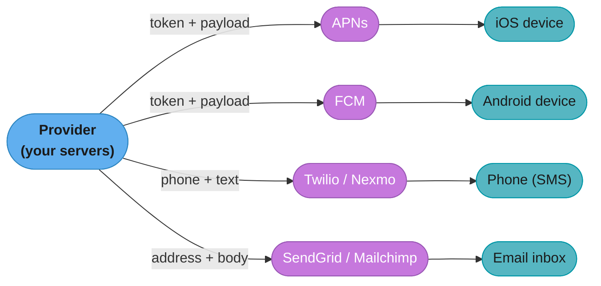
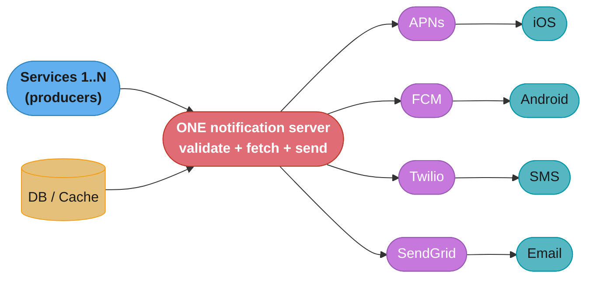
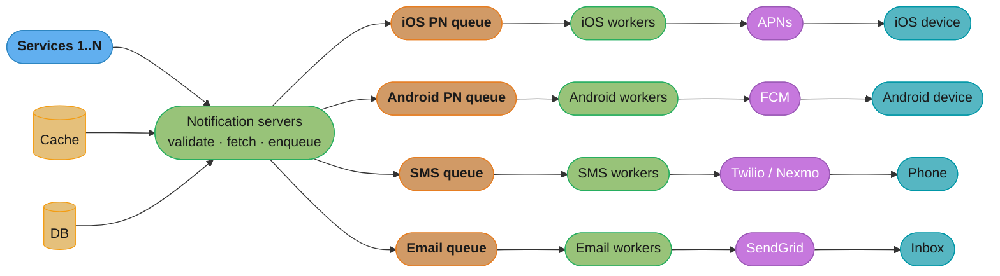
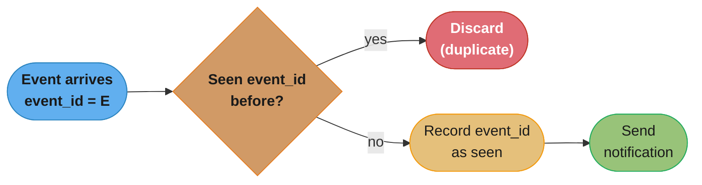
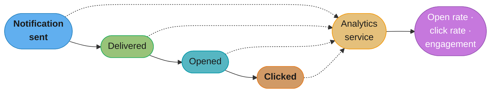
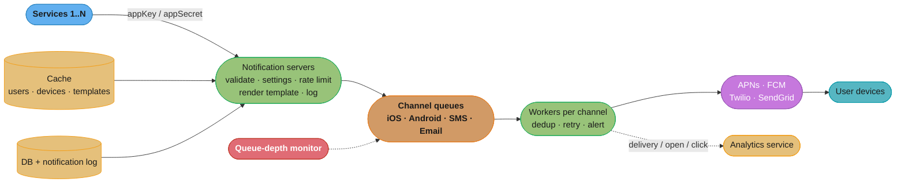
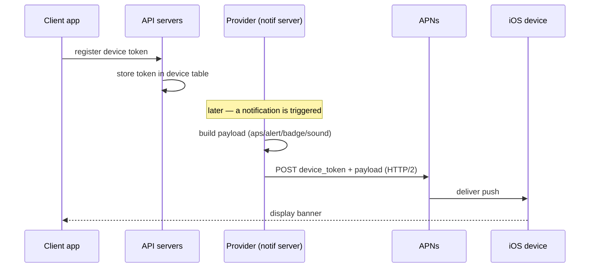
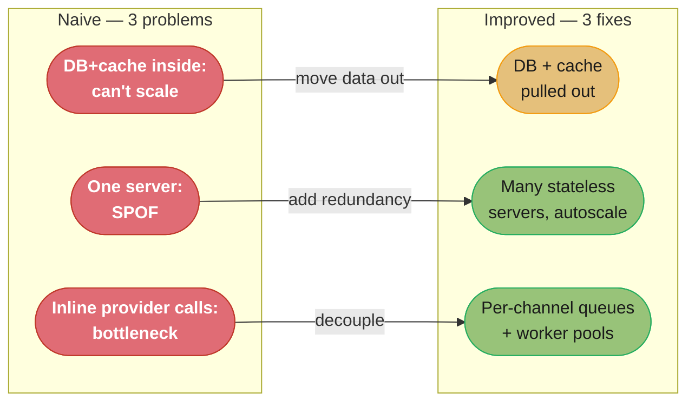

# Chapter 10: Design A Notification System

> Ch 10 of 16 · System Design Interview Vol 1 (Xu) · builds on Ch 1 (queues) and Ch 4 (rate limiting), the fan-out plumbing Ch 11–12 reuse

## Chapter Map

A notification system is the company's shared megaphone: dozens of internal services (Order,
Chat, Marketing, Fraud) each want to tell a user "something happened," and this system turns
every such event into the *right* message on the *right* channel — **push, SMS, or email** —
without any one slow provider blocking the others. The chapter is a masterclass in the recurring
system-design move: start with a single-server "naive" design, name its three failure modes
(single point of failure, hard to scale, performance bottleneck), then dissolve all three with
the same medicine — pull the data stores out of the app tier, add horizontally-scaled stateless
servers, and interpose **message queues per channel** so producers and the third-party providers
are fully decoupled.

**TL;DR:**
- The three delivery channels each ride a **third party you don't control**: iOS push via
  **APNs**, Android push via **FCM**, SMS via **Twilio/Nexmo**, email via **SendGrid/Mailchimp**.
  Your job is routing and metering, not building an SMTP server or a carrier gateway.
- The naive "everybody calls one notification server" design has three problems — **SPOF, no
  horizontal scale, and a performance bottleneck** — all fixed by moving DB/cache out, adding
  stateless notification servers, and inserting **one message queue per channel** with dedicated
  worker pools.
- **Reliability = no data loss + at-least-once with dedup.** Persist every notification to a log
  and retry on failure; accept that **exactly-once is impractical** in a distributed system, so
  deduplicate on an event ID instead.
- The production-grade version layers on **templates, per-channel opt-in settings, rate limiting
  (Ch 4), a retry mechanism, appKey/appSecret security, queue-depth monitoring, and event
  tracking** (open/click rates) — the five pillars that separate a toy from a real system.

## The Big Question

> "Twenty different services each want to fire a message at a user across three channels, each
> channel gated by a third party with its own rate limits and failure modes. How do I take that
> flood of `something happened` events and turn each one into a delivered notification — soft
> real-time, respecting the user's opt-outs, at least once but not annoyingly many times — while
> a Twilio outage doesn't take push down with it?"

Analogy: the notification system is a **mailroom**. Every department drops off outgoing items
(events); the mailroom sorts them by carrier (push / SMS / email), stamps each with the right
address (device token / phone / email), hands each to the appropriate courier (APNs / Twilio /
SendGrid), and keeps a logbook so nothing is lost and nothing is sent twice. Crucially, the
mailroom clerks (notification servers) never *carry* the mail themselves — they drop it into
per-carrier outboxes (queues) that couriers (workers) drain at their own pace. That one
indirection is what lets a jammed SMS courier pile up in its own outbox without stopping the
push couriers next to it.

---

## 10.1 Step 1 — Understand the Problem and Establish Design Scope

A notification is any message pushed to a user that isn't an in-app request/response: a breaking-
news alert, a product update, an OTP, a shipping notice, a "someone commented on your photo." The
interviewer will not hand you the requirements — you extract them. The book pins down scope with a
short interrogation.

### Functional requirements — the three channels

- **Push notification** — a message delivered to a mobile device or desktop by the OS-level push
  service even when your app is closed (an iOS banner, an Android heads-up notification, a browser
  web push).
- **SMS** — a text message to a phone number, sent through a third-party SMS aggregator.
- **Email** — an email to an address, sent through a commercial email provider or an in-house
  SMTP setup.

These three are the entire delivery surface for this design. In-app notifications (a red badge
inside the running app) are out of scope here — they belong to the feed/chat systems of Ch 11–12.

### Non-functional requirements and constraints

- **Soft real-time.** Notifications should arrive as soon as possible, but a small delay under
  high load is acceptable. This is the single most important constraint: it means we can buffer
  in queues and absorb bursts instead of building a hard-real-time path. "Soft" is what makes the
  message-queue design legitimate rather than a latency violation.
- **Device support** — the system must reach **iOS devices, Android devices, and laptops/
  desktops.** Three device families, at least two push ecosystems (APNs, FCM) plus web push.
- **Two trigger sources** — notifications are triggered **(1) by client applications** (e.g. the
  app schedules a reminder) **and (2) by server-side business logic** (e.g. a batch job fires a
  marketing campaign, or the Order service emits "your package shipped"). The design must accept
  both an interactive API call and a scheduled/batch producer.
- **Opt-out** — a user who has opted out **must stop receiving** that class of notification. This
  is a hard requirement, not a nicety: sending to an opted-out user is both a product failure and,
  for email/SMS, often a legal one (CAN-SPAM, TCPA).

### Back-of-the-envelope scale

The book fixes daily volumes so we can size the system. These are the numbers to reproduce:

| Channel | Notifications / day |
|---------|--------------------:|
| Push (iOS + Android) | 10,000,000 |
| SMS | 1,000,000 |
| Email | 5,000,000 |
| **Total** | **16,000,000 / day** |

That total is modest — **16M/day ≈ 185 notifications/sec on average** (16,000,000 ÷ 86,400). The
takeaway the book wants you to internalize is *not* that this number is scary — it isn't — but
that the design must scale each channel **independently**, because the channels have wildly
different downstream limits (a Twilio long code does ~1 SMS/sec; APNs does thousands/sec per
HTTP/2 connection). Average QPS is small; the real constraint is per-provider throughput, which is
why every channel gets its own queue and worker pool rather than a shared pipeline.

> Interview tell: when volumes are given per-day, always convert to per-second and *also* state the
> peak-to-average ratio you're assuming. The book's 16M/day is average; a breaking-news broadcast
> can spike the push channel 100× for a few minutes, and that spike is exactly what the queues
> absorb.

**What the formula is telling you.** "Pick a user population, decide how often each user hears from
you on each channel, and the daily totals — plus every QPS number under them — fall out
mechanically."

Every capacity number in this chapter is one multiplication chain: users × notifications per user
per day, split per channel, divided by 86,400 s/day, then multiplied by a peak factor. Naming the
assumption behind each multiplier is what makes the chain defensible in an interview.

| Symbol | What it is |
|--------|------------|
| `DAU` | Daily active users the system may notify |
| `n_c` | Notifications per user per day on channel `c` (push / SMS / email) |
| `opt_c` | Fraction of users opted in to channel `c` — the assumption behind each split |
| `dev` | Average push-capable devices per user; one user has many device tokens |
| `86,400` | Seconds in a day — the divisor that turns per-day into per-second |
| `P` | Peak-to-average factor; the burst the queues must absorb |

**Walk one example.** Assumptions chosen so the chain reproduces the book's published totals:

```
DAU                              = 10,000,000 users
push : opt = 1.00, n = 1.0 /day  = 10,000,000 x 1.00 x 1.0 = 10,000,000 push/day
sms  : opt = 0.10, n = 1.0 /day  = 10,000,000 x 0.10 x 1.0 =  1,000,000 sms/day
email: opt = 0.50, n = 1.0 /day  = 10,000,000 x 0.50 x 1.0 =  5,000,000 email/day
                                                             ----------
total                                                        16,000,000 notif/day

average QPS = 16,000,000 notif/day / 86,400 s/day = 185.19 notif/s   (the book's ~185/sec)
push QPS    = 10,000,000 push/day  / 86,400 s/day = 115.74 push/s

device fan-out (dev = 1.4 devices/user):
  10,000,000 push/day x 1.4 devices/user = 14,000,000 device sends/day
  14,000,000 sends/day / 86,400 s/day    =    162.04 device sends/s

steady peak P = 2x   : 185.19 notif/s x   2 =    370.37 notif/s
news spike  P = 100x : 115.74 push/s  x 100 = 11,574.07 push/s   (push channel only)
```

Meaning: the average load is trivial (185/s), but the push channel must survive an 11,574/s burst
lasting minutes — that gap between average and peak is the whole reason for the queues.

**Why the device ratio and the peak factor both matter.** Drop `dev` and you under-provision APNs
and FCM by 40 percent, because a "notification" is one logical message but N physical sends, one
per device token. Drop `P` and you size the worker pools for 185/s, so the first broadcast fills
the queues far faster than the workers drain them; a queue only absorbs a burst if somebody sized
the drain rate against the burst rather than the average.

---

## 10.2 Step 2 — Propose High-Level Design and Get Buy-In

This step has three parts: (1) understand the plumbing of each of the three notification types,
(2) figure out how we get a user's contact info in the first place, and (3) design the actual
sending/receiving flow — first the naive version, then the improved one.

### The three notification types and their infrastructure

Every channel bottoms out at a **third party** you integrate with as a black box. You do not build
push infrastructure, an SMS gateway, or (usually) a mail server. You format a message, address it,
and hand it off.

**iOS push notification.** Three players: your **provider** (a program running on your servers
that builds and sends push requests), **APNs** (Apple Push Notification service — Apple's remote
service that relays pushes to iOS devices), and the **iOS device** (the end user's phone that
displays the notification). The provider needs two inputs to send a push:

- **Device token** — a unique, opaque identifier the OS issues to *your app on this specific
  device*, used to address the push. Tokens are per-app-per-device and can change; the app
  registers its token with your API servers.
- **Payload** — a JSON dictionary describing the notification's content. The canonical APNs
  payload wraps everything under the reserved `aps` key:

```json
{
  "aps": {
    "alert": {
      "title": "Game Request",
      "body": "Bob wants to play chess"
    },
    "badge": 5,
    "sound": "default"
  }
}
```

- `alert` — the visible text (`title` + `body`).
- `badge` — the number to show on the app icon.
- `sound` — the sound to play when the device receives the notification.

The provider POSTs this payload plus the device token to APNs over an HTTP/2 connection; APNs
delivers it to the device.

**Android push notification.** Structurally identical, but the remote service is **FCM (Firebase
Cloud Messaging)** instead of APNs. Provider → FCM → Android device, again keyed on a device
registration token and a payload. Swapping APNs for FCM is the *only* difference at the
architecture level — which is why the design treats "push" as one concept with two backends.

**SMS.** Sent through a **third-party SMS service** — the book names **Twilio** and **Nexmo**
(now Vonage). You call the provider's API with the destination phone number and the message text;
they handle the carrier interconnect. Building your own SMS gateway means negotiating with
carriers and is never worth it for a design interview or, usually, in reality.

**Email.** Two options, and the book comes down firmly on one:

- **Commercial email providers** — **SendGrid**, **Mailchimp**, Amazon SES, etc. You call their
  API; they handle the sending.
- **In-house SMTP servers** — you run your own mail servers.

The book's argument for commercial providers is **deliverability**: commercial services offer a
**better delivery rate and improved data analytics.** Getting email into the inbox (not the spam
folder) depends on sender reputation, IP warming, SPF/DKIM/DMARC alignment, feedback-loop
handling, and bounce/complaint management — an enormous amount of unglamorous work that commercial
providers have already solved and continuously maintain. Rolling your own SMTP means owning all of
that plus a fleet of IPs whose reputation you must nurse. For all but the largest senders, the
commercial provider wins on the metric that actually matters: does the email arrive.



Caption: all four channels share the same shape — your provider hands an addressed message to a
third party (purple, outside your control) that delivers to the end device (teal). The only
per-channel differences are the addressing key (device token vs phone vs email) and the payload
format, which is why the improved design fans out into one queue per channel rather than one
pipeline for all.

### Contact info gathering flow

Before you can send anything, you need each user's contact info: their device tokens (for push),
phone number (for SMS), and email (for email). This is collected at **signup / app install**.

The flow: a user installs the app or signs up → the request hits the **API servers** → the API
servers write the user's info into the **database**. Two tables carry the contact data, and the
key modeling insight is the **one-to-many relationship between users and devices**: one user can
have many devices (an iPhone, an iPad, a laptop), and a push must go to *all* of them.

`user` table:

| Column | Type | Notes |
|--------|------|-------|
| `user_id` | bigint (PK) | |
| `email` | varchar | for the email channel |
| `phone_number` | varchar | for the SMS channel |
| `country_code` | varchar | for formatting/routing SMS |

`device` table (one user → many rows):

| Column | Type | Notes |
|--------|------|-------|
| `id` | bigint (PK) | |
| `user_id` | bigint (FK → user) | which user owns this device |
| `device_token` | varchar | the APNs/FCM token to push to |
| `last_logged_in_at` | timestamp | for pruning stale devices |

Because `device` holds many rows per `user_id`, "send a push to Alice" expands to "look up all of
Alice's device tokens and send to each." Stale tokens (uninstalled app, logged-out device) must be
pruned, or you waste sends and pollute your delivery metrics — see the reliability section.

### Notification sending/receiving flow — the naive design (and why it fails)

Start simple, on purpose. In the naive design, every service that wants to send a notification
(**services 1..N** — Order, Chat, Fraud, a cron job) calls **a single notification server**
directly. That one server does everything: it receives the request, gathers the user's contact
info from the DB/cache, and calls the third-party services (APNs, FCM, Twilio, SendGrid) itself,
which deliver to the devices.



Caption: the single red server is the whole design's weakness — it is simultaneously the only
entry point, the only place the data is fetched, and the only thing calling every provider inline;
the three problems below all trace back to that one overloaded box.

This design has **three problems**, and naming all three is the point of the step:

1. **Single point of failure (SPOF).** One notification server means one thing to crash. If it
   goes down, *all* notifications on *all* channels stop. There is no redundancy.
2. **Hard to scale.** Everything — the database, the cache, and all notification processing — lives
   in one server. You cannot scale the pieces independently; you can only make the one box bigger
   (vertical scaling), which has a hard ceiling.
3. **Performance bottleneck.** Handling everything in one process — data fetching, template
   rendering, *and* synchronously calling slow third-party services — means the whole system moves
   at the speed of its slowest dependency. A slow APNs response holds a thread that could have been
   sending email. Under load, this box becomes the choke point and notifications back up or drop.

### Notification sending/receiving flow — the improved high-level design

Fix all three problems with three changes: **(1) move the database and cache out** of the
notification server, **(2) add more notification servers** with automatic horizontal scaling, and
**(3) introduce message queues** to decouple the components. The improved architecture, left to
right:

- **Services 1..N (producers)** — the internal services and scheduled jobs that trigger
  notifications. They call the notification servers' API.
- **Notification servers (multiple, stateless, auto-scaled)** — the front door. Each server:
  - **Provides APIs** for services to send notifications (must be internally accessible, with
    authentication — see security below).
  - **Carries out basic validations** — verifies emails, phone numbers, and required fields to
    reject malformed requests early.
  - **Queries the database/cache** to fetch the data needed to render a notification (device
    tokens, notification settings, user info).
  - **Puts the notification into a message queue** for the appropriate channel. Because they hold
    no per-request state and own no data, you can run as many notification servers as you need
    behind a load balancer.
- **Cache** — hot data: user info, device info, and notification templates, so the servers don't
  hammer the DB on every send.
- **Database (DB)** — the durable store: user data, notification data, and settings.
- **Message queues — one per notification type.** This is the load-bearing decision. There is an
  **iOS PN queue, an Android PN queue, an SMS queue, and an Email queue.** Queues **remove
  dependencies between components**: if one third-party service (say APNs) is down, the iOS pushes
  simply pile up in the iOS queue while the other three channels keep flowing. Queues also serve as
  **buffers** that absorb bursts, which is exactly what "soft real-time" permits.
- **Workers (one pool per queue)** — a worker is a server that **pulls notification events from a
  message queue** and **sends them to the corresponding third-party service.** The iOS workers
  drain the iOS queue and call APNs; the SMS workers drain the SMS queue and call Twilio; and so
  on. Each pool scales independently — if the SMS queue is backing up, add SMS workers.
- **Third-party services** — APNs, FCM, Twilio/Nexmo, SendGrid/Mailchimp — deliver to the devices.
- **iOS / Android / SMS / Email devices** — the final recipients.



Caption: the fix for all three naive-design problems in one picture — stateless servers behind
data stores they no longer own (kills SPOF and the scaling ceiling), and a queue-plus-worker-pool
per channel (orange queues) so a jammed provider backs up only its own lane, never the others.

**End-to-end flow:** a service calls a notification server's API → the server validates the
request and fetches the user's device tokens / settings / template from the cache (falling back to
the DB) → the server renders the notification and pushes an event onto the correct channel queue →
a worker for that channel pulls the event and calls the third-party provider → the provider
delivers to the device. Every hop is decoupled: producers don't wait on providers, and each stage
scales on its own metric.

---

## 10.3 Step 3 — Design Deep Dive

The high-level design works but is not production-grade. The deep dive adds the pieces that make it
reliable, respectful of user preferences, secure, observable, and measurable: **reliability
(no data loss + dedup), templates, settings, rate limiting, retry, security, monitoring, and
event tracking** — then reassembles everything into the final design.

### Reliability — preventing data loss and handling duplicates

Two questions dominate reliability for a notification system: **how do we make sure we never lose a
notification, and how do we make sure we don't send too many?**

**Preventing data loss.** The rule: *a notification can be delayed or re-ordered, but it must
never be lost.* The mechanism is **persistence** — every notification is saved to a **notification
log database** when it enters the system. If a worker crashes mid-send, the record is still in the
log, and a **retry** re-processes it. The log is also the audit trail: it answers "was this
notification ever sent, and what happened to it." The design point is that durability comes from
writing to a persistent store *before* attempting delivery, not from hoping the in-flight message
survives a crash.

**Will recipients get a notification exactly once? No.** Distributed systems make **exactly-once
delivery impractical.** Because the send-and-acknowledge path can fail at many points (the worker
sends to APNs, APNs delivers, but the ack back to the worker is lost — so the worker retries and
the user gets a duplicate), the system operates at **at-least-once** semantics: every notification
is delivered *one or more* times. In most cases a notification is sent exactly once, but the
distributed nature guarantees only "at least once."

**Deduplication.** Since we accept at-least-once, we suppress duplicates with a **dedup key on the
event ID.** When a notification event arrives, we **check whether it has been seen before** (by its
event ID); **if yes, it is discarded; if no, we send it** (and record the ID as seen). This
collapses "at least once" into "effectively once" for the common duplicate case without pretending
to achieve true exactly-once.



Caption: the dedup gate is what turns unavoidable at-least-once delivery into "effectively once" —
the event ID is the idempotency key, so a retried or re-queued event is recognized and dropped
rather than delivered twice.

**Put simply.** "The dedup gate is just a set of event IDs you have already sent, so its cost is
IDs-per-day × bytes-per-ID × how long you keep them."

Sizing it matters because "check whether this event ID was seen before" sounds expensive until you
compute it — at this volume the whole dedup set is a single cache node, not a database.

| Symbol | What it is |
|--------|------------|
| `E` | Events entering the system per day |
| `b_id` | Bytes to store one event ID — 16 B for a UUID |
| `b_ovh` | Per-key overhead of the store — roughly 50 B for a Redis key plus its TTL |
| `W` | Dedup window in days: how far back a duplicate is still recognized |
| `E x (b_id + b_ovh) x W` | Total memory the dedup set occupies |

**Walk one example.**

```
E     = 16,000,000 events/day          (the chapter's total volume)
entry = 16 B (event_id) + 50 B (store overhead) = 66 B/entry
W     = 1 day

memory = 16,000,000 entries x 66 B/entry = 1,056,000,000 B = 1.06 GB
```

Meaning: one commodity cache node holds a full day of dedup keys, so "effectively once" costs
about a gigabyte of RAM — cheap enough that skipping dedup is never a capacity argument.

**Why the window `W` exists.** If `W` is shorter than the longest retry chain, the original event
ID has already expired by the time the retry arrives, the gate sees a "new" event, and the user
gets the duplicate the gate existed to stop. Size `W` well above the worst-case retry span
(31 s for five attempts — see the retry block below); a day of margin costs about a gigabyte.

### Additional components and considerations

**Notification template.** A large system sends millions of near-identical notifications that share
a common format. A **template** is a preformatted notification body with **parameters (placeholders)
filled in per send** — you author the structure once and inject the specifics. Benefits: a
consistent format, fewer errors, and less time to build each message. Example:

```
BODY:
You dreamed of it. We dared it. [ITEM NAME] is back — only until [DATE].

CTA:
Order Now. Or, [ITEM NAME] will be gone until next year.
```

Here `[ITEM NAME]` and `[DATE]` are the parameters. The template lives in the cache/DB, and the
notification server (or worker) substitutes the parameters at render time. One template, millions
of personalized sends.

**Notification setting (opt-in / opt-out).** Users are flooded with notifications, so they must be
able to control what they receive **per channel.** Before sending anything, the system checks the
user's settings. A `notification_setting` table:

| Column | Type | Notes |
|--------|------|-------|
| `user_id` | bigint | which user |
| `channel` | varchar | the channel — push / SMS / email |
| `opt_in` | boolean | `true` = wants this channel, `false` = opted out |

Before a notification is sent, the server checks the relevant row; **if `opt_in` is false for that
channel, the notification is not sent** on that channel. This is the enforcement point for the
opt-out requirement from Step 1. (Some categories — OTPs, fraud alerts — may bypass opt-out as
account-safety messages, but the default is: respect the setting.)

**Stated plainly.** "One row per user per channel, so the settings table is users × channels × a
handful of bytes — small enough to keep entirely in cache and check on every single send."

This sizing is what licenses the design decision above. A settings check on the hot path is only
acceptable if the settings never touch disk.

| Symbol | What it is |
|--------|------------|
| `U` | Users who have notification settings |
| `C` | Channels per user — push, SMS, email |
| `b_row` | Bytes per row: 8 B `user_id` + 1 B `channel` + 1 B `opt_in` |
| `U x C x b_row` | Raw size of the whole `notification_setting` table |

**Walk one example.**

```
U     = 10,000,000 users
C     =          3 channels/user
rows  = 10,000,000 users x 3 channels/user = 30,000,000 rows
bytes = 30,000,000 rows x 10 B/row = 300,000,000 B = 300 MB
```

Meaning: the entire opt-in state of the user base is 300 MB, so it lives in the same cache as
device tokens and templates and the opt-out check adds a cache lookup, not a database round trip.

**Rate limiting.** To avoid overwhelming users, we **limit the number of notifications a user can
receive** in a given window. This matters because a user who gets bombarded will **turn
notifications off entirely** — over-sending is self-defeating. The mechanism is the token-bucket /
sliding-window limiter from **Chapter 4**, applied per user per channel: once the user hits the
cap, further notifications in the window are dropped or deferred. This is a *product* rate limit
(protect the user) layered on top of the *provider* rate limits (stay under Twilio/APNs/SES
quotas); both exist for different reasons.

**Read it like this.** "Your required send rate divided by what one provider unit is allowed to do
gives the number of phone numbers, connections, or workers you must run in parallel."

The provider limit — not your own CPU — is what sets per-channel parallelism, and the two limits
differ by three orders of magnitude across channels.

| Symbol | What it is |
|--------|------------|
| `R` | Your required send rate on a channel, in sends/s |
| `r_p` | Throughput one provider unit sustains: 1 SMS/s per long code, ~1000/s per APNs socket |
| `P` | Peak factor applied to `R` before dividing |
| `ceil(R x P / r_p)` | Parallel units (numbers / connections / workers) required |

**Walk one example.**

```
SMS channel:
  R     = 1,000,000 sms/day / 86,400 s/day = 11.57 sms/s
  r_p   = 1 sms/s per long code
  units = ceil(11.57 / 1)                  = 12 long codes    (at average load)
  units = ceil(11.57 x 2 / 1)              = 24 long codes    (at P = 2x)

Push channel:
  R     = 14,000,000 device sends/day / 86,400 s/day = 162.04 sends/s
  r_p   = 1,000 sends/s per HTTP/2 connection
  units = ceil(162.04 / 1,000)                       =  1 connection    (at average load)
  units = ceil(162.04 x 100 / 1,000)                 = 17 connections   (at P = 100x)
```

Meaning: push carries 14x the SMS volume yet needs 17 sockets, while SMS needs 24 leased phone
numbers — the same design cannot serve both, which is exactly why every channel gets its own queue
and its own independently-sized worker pool.

**What breaks without the per-provider divisor.** Size the SMS pool by your own throughput and the
workers will happily push 100 sends/s at a long code rated for 1/s; the provider throttles or drops
the excess, the workers see failures, and the retry loop re-sends the same traffic into the same
wall. The provider limit must be enforced on your side, at the worker, before the call goes out.

**Retry mechanism.** When a third-party service **fails to send** a notification, the failed
notification is **added back to the message queue for retry.** Workers re-attempt delivery. If the
same notification **keeps failing** after repeated retries, the system **alerts the developers** —
persistent failure is an operational signal (a bad token, a provider outage, a misconfiguration),
not something to retry forever silently. The retry loop plus the persisted log is what makes
"never lose a notification" true even when providers are flaky.

**In plain terms.** "Each retry waits twice as long as the one before it, so `n` attempts spread
across a total wait of `b x (2^n - 1)` seconds — and when only a small fraction fails, all those
retries add almost nothing to your send volume."

Both halves matter in an interview: the first tells you how long a notification can be delayed
before you give up, the second tells you how much extra provider load retries actually cost.

| Symbol | What it is |
|--------|------------|
| `b` | Base delay before the first retry, in seconds |
| `n` | Number of retry attempts before giving up and alerting |
| `b x 2^i` | Delay before retry `i`, counting `i` from 0 |
| `b x (2^n - 1)` | Total wall-clock wait across all `n` retries |
| `p` | Per-attempt failure probability |
| `p + p^2 + ... + p^n` | Extra sends per original notification caused by retrying |

**Walk one example.**

```
Backoff, b = 1 s:
  retry 1 waits  1 s     running total  1 s
  retry 2 waits  2 s     running total  3 s
  retry 3 waits  4 s     running total  7 s
  retry 4 waits  8 s     running total 15 s
  retry 5 waits 16 s     running total 31 s   = 1 s x (2^5 - 1) = 31 s

Amplification, p = 0.01 (1% of sends fail) with n = 3 retries:
  extra   = 0.01 + 0.0001 + 0.000001 = 0.010101  ->  1.0101% extra sends
  total   = 1.010101 x original volume
  on 16,000,000 notif/day -> 161,616 extra sends/day
  still failing after all 4 attempts: p^4 = 1e-8 -> 0.16 notif/day
```

Meaning: a 1 percent failure rate costs only about 1 percent extra provider calls, so retries are
nearly free insurance — and the roughly 0.16 notifications per day that survive four failures are
few enough that alerting a developer on each one is reasonable rather than noisy.

**Why `n` is capped at all.** Without a ceiling, a permanently-bad device token or a
misconfigured API key retries forever, and each doomed notification occupies queue slots and worker
time indefinitely. Capping `n` converts an infinite retry loop into a bounded 31-second delay plus
one alert — which is precisely why the book pairs "keep failing" with "alert the developers."

**Security in push notifications.** The notification-sending APIs must not be open to the world —
otherwise anyone could spam your users. The book's mechanism: **appKey and appSecret.** Only
**authenticated / verified clients** are allowed to send push notifications through the APIs; a
client must present valid credentials (its appKey/appSecret pair). This keeps the send API
internal-only in effect — the same idea as an API key, scoped so that only your own services (and
approved partners) can produce notifications.

**Monitor queued notifications.** The **key metric to monitor is the number of notifications in
the queue** (queue depth). If this number is **large, the workers are not processing events fast
enough** — the producers are outrunning the consumers. **The fix is to add more workers.** Queue
depth is thus the primary scaling signal: it tells you *exactly* which channel is falling behind
(a long iOS queue vs a long SMS queue) and that the remedy is more workers on that channel. A
steadily growing queue that you don't react to means growing delivery latency and, eventually,
dropped notifications.

**The idea behind it.** "Queue depth divided by the worker pool's combined drain rate is the
delivery delay you have already signed up for."

This is why depth alone is a bad alarm threshold: the same 700,000-event backlog is either an
11-minute delay or a 1-minute delay depending entirely on how many workers are draining it.

| Symbol | What it is |
|--------|------------|
| `D` | Events currently waiting in one channel's queue — the queue depth |
| `W` | Number of workers assigned to that channel |
| `s` | Sends per second one worker sustains against its provider |
| `W x s` | Combined drain rate of the pool |
| `D / (W x s)` | Seconds to clear the backlog once the inflow burst stops |

**Walk one example.** The breaking-news spike from the scale section, hitting the push channel:

```
inflow = 11,574 push/s sustained for 60 s
D      = 11,574 push/s x 60 s = 694,440 events queued

W =  20 workers x 50 sends/s =  1,000 sends/s -> 694,440 /  1,000 = 694.44 s = 11.6 min
W = 200 workers x 50 sends/s = 10,000 sends/s -> 694,440 / 10,000 =  69.44 s =  1.2 min
```

Meaning: the identical backlog is an 11.6-minute delivery delay at 20 workers and a 69-second
delay at 200 — so "add more workers" is not a vague remedy, it is a direct, linear division of the
delay, and the alert should fire on `D / (W x s)` rather than on `D`.

**Events tracking.** Beyond delivering, the business wants to know how notifications *perform*:
**open rate, click rate, and engagement** are core to understanding user behavior and measuring
whether a notification campaign worked. The notification system **integrates with an analytics
service** — delivery, open, and click events are emitted to analytics, which computes the metrics.
This closes the loop from "we sent it" to "did it work," and feeds back into what to send next.



Caption: every stage of a notification's life emits an event to the analytics service (dotted =
side-channel), which rolls them up into the open/click/engagement rates that decide whether the
campaign was worth sending — delivery is necessary but "opened" and "clicked" are what the business
actually measures.

### The final updated design — all components together

Reassembling every deep-dive addition onto the improved high-level design gives the production
architecture:

1. **Services (1..N)** trigger a notification via the notification servers' authenticated API
   (**appKey/appSecret** security).
2. **Notification servers** validate the request, then apply the gates: **notification-setting
   check** (skip channels the user opted out of) and **rate limiting** (per user per channel). They
   fetch device tokens and the **template** from the **cache** (backed by the **DB**), render the
   message, and **persist it to the notification log** (durability). Then they enqueue the event
   onto the correct channel queue.
3. **Message queues** — one per channel (iOS / Android / SMS / Email) — buffer and decouple.
4. **Workers** (one pool per channel) pull events, apply **dedup** on the event ID, and call the
   **third-party service.** On failure they **re-enqueue for retry**; on persistent failure they
   **alert developers.**
5. **Third-party services** (APNs / FCM / Twilio / SendGrid) deliver to the devices.
6. Throughout, **queue depth is monitored** (add workers when a queue grows) and **delivery/open/
   click events are tracked** into the **analytics service.**



Caption: the production design is the improved architecture plus six guardrails — auth at the door,
settings + rate limiting before enqueue, the notification log for durability, dedup + retry + dev
alerts in the workers, and the queue-depth monitor and analytics side-channels that make the system
observable and measurable.

---

## 10.4 Step 4 — Wrap Up

The system is built on **five pillars** — these are what a production notification system needs
beyond a naive "call the provider" loop, and they are the summary the interviewer wants:

1. **Reliability** — never lose a notification. Persist every notification to a **log**, and
   **retry** on failure. Accept **at-least-once** delivery (exactly-once is impractical in a
   distributed system) and **deduplicate on the event ID** so at-least-once behaves as
   effectively-once.
2. **Security** — only **authenticated/verified clients** may send, enforced with **appKey/
   appSecret**, so the send API can't be abused to spam users.
3. **Tracking and monitoring** — watch **queue depth** as the scaling signal (grow → add workers)
   and **track delivery/open/click events** into an **analytics service** to measure engagement.
4. **Respecting user settings** — check per-channel **opt-in/opt-out** before every send; a user
   who opted out must not be contacted on that channel.
5. **Rate limiting** — cap how many notifications a user receives so they aren't overwhelmed (and
   don't disable notifications entirely), reusing the **Chapter 4** limiter, and stay under each
   **third-party provider's** own rate limits.

The unifying idea across all four steps: a notification system is a **fan-out and routing problem**
solved by **decoupling with per-channel queues.** Every hard requirement — soft real-time,
independent channel scaling, provider-outage isolation, no data loss — is satisfied by the same
move of putting a durable, monitored queue between the producers and the third parties, with
stateless servers in front and channel-specific worker pools behind.

---

## Visual Intuition

### iOS push, step by step



Caption: the two halves of the push lifecycle — first the app registers its device token with your
API servers (so you can address it later), then when a notification fires, the provider builds the
`aps` payload and hands token + payload to APNs, which does the actual last-mile delivery. FCM is
the identical shape with FCM in place of APNs.

### Naive vs improved — the same three fixes



Caption: each naive-design problem maps one-to-one to a fix — the single point of failure to a pool
of stateless servers, the un-scalable embedded data stores to externalized DB/cache, and the
inline provider calls (the bottleneck) to per-channel queues and workers.

---

## Key Concepts Glossary

- **Push notification** — an OS-delivered message shown on a device even when the app is closed.
- **APNs (Apple Push Notification service)** — Apple's remote service relaying pushes to iOS.
- **FCM (Firebase Cloud Messaging)** — Google's equivalent for Android push.
- **Provider** — your own program that builds and sends push requests to APNs/FCM.
- **Device token** — an opaque per-app-per-device identifier used to address a push.
- **Payload** — the JSON body of a push; APNs wraps it under the `aps` key (`alert`/`badge`/`sound`).
- **SMS aggregator** — a third party (Twilio, Nexmo/Vonage) that sends texts via carriers.
- **Commercial email provider** — SendGrid, Mailchimp, SES; chosen over in-house SMTP for
  deliverability.
- **Deliverability** — the rate at which email lands in the inbox rather than spam; the reason to
  use a commercial provider.
- **user table / device table** — contact-info schema; one user has many devices (one-to-many).
- **Naive design** — the single-notification-server architecture with SPOF, no scale, and a
  performance bottleneck.
- **Notification server** — stateless front-door service: validates, fetches data, enqueues.
- **Message queue (per channel)** — buffer that decouples servers from providers; one per
  iOS/Android/SMS/Email.
- **Worker** — server that pulls events from one channel's queue and calls that channel's provider.
- **Notification log** — durable store of every notification, for data-loss prevention and audit.
- **At-least-once delivery** — every notification delivered one or more times (exactly-once is
  impractical).
- **Deduplication (dedup key)** — dropping duplicates by checking a previously-seen event ID.
- **Notification template** — a parametrized message body reused across many personalized sends.
- **Notification setting (opt-in/opt-out)** — per-user, per-channel preference checked before
  sending.
- **Rate limiting** — capping notifications per user (and staying under provider quotas).
- **Retry mechanism** — re-enqueueing failed sends; alerting developers on persistent failure.
- **appKey / appSecret** — credentials that restrict the send API to authenticated clients.
- **Queue depth** — number of events waiting in a queue; the key scaling signal (grow → add
  workers).
- **Events tracking** — emitting delivery/open/click events to an analytics service for engagement
  metrics.

---

## Tradeoffs & Decision Tables

| Concern | Naive design | Improved / final design |
|---------|--------------|-------------------------|
| Availability | SPOF — one server down = all notifications down | Stateless server pool + queues; a provider outage isolates to one channel |
| Scalability | Vertical only; DB/cache embedded | Horizontal; servers and per-channel workers scale independently |
| Performance | Inline provider calls block the request path | Queues decouple; producers never wait on providers |
| Data loss | In-flight events lost on crash | Persisted to notification log + retry |
| Duplicates | Unaddressed | Dedup on event ID (at-least-once → effectively once) |

| Email option | Pro | Con | Book's verdict |
|--------------|-----|-----|----------------|
| Commercial (SendGrid/Mailchimp) | Better delivery rate + analytics; reputation managed for you | Vendor cost + dependency | **Preferred** |
| In-house SMTP | Full control, no per-email vendor fee | You own IP reputation, SPF/DKIM/DMARC, bounces, spam-folder fights | Rarely worth it |

| Delivery semantic | Meaning | Feasible here? |
|-------------------|---------|----------------|
| At-most-once | 0 or 1 delivery, may lose | No — violates "never lose" |
| **At-least-once + dedup** | 1+ delivery, duplicates suppressed by event ID | **Yes — the design's choice** |
| Exactly-once | precisely 1 delivery | Impractical in a distributed system |

| Rate-limit type | Protects against | Where enforced |
|-----------------|------------------|----------------|
| Per-user (product) | Annoying the user into disabling notifications | Notification server, per user per channel (Ch 4 limiter) |
| Per-provider | Exceeding APNs/Twilio/SES quotas → throttling/drops | Worker → provider call |

---

## Common Pitfalls / War Stories

- **The single notification server (naive SPOF).** Shipping the one-box design means one crash
  kills all channels, and one slow provider (APNs latency spike) stalls email and SMS too. The fix
  is not "a bigger box" — it's stateless servers plus per-channel queues so failures and slowness
  stay in their lane.
- **Assuming exactly-once, so skipping dedup.** Teams that believe their pipeline delivers exactly
  once ship no dedup and users get the same push two or three times after a retry or a re-queue.
  Accept at-least-once and dedup on the event ID; the duplicate is *when*, not *if*.
- **Not persisting before sending.** If a worker calls the provider and only *then* would have
  recorded the notification, a crash between "sent" and "recorded" loses the audit record — or
  worse, a crash before "sent" loses the notification entirely. Persist to the log on ingest, then
  send, then retry from the log on failure.
- **Stale device tokens.** Users uninstall apps and log out; their tokens go dead. Pushing to dead
  tokens wastes sends, and APNs/FCM feedback marking a token invalid must prune the `device` row —
  otherwise your delivery metrics rot and you keep paying to send into the void.
- **Ignoring queue depth until latency explodes.** Queue depth is the early-warning signal; a queue
  that grows monotonically means producers are outrunning workers and delivery latency is climbing.
  Alert on depth and auto-scale the workers for *that* channel — don't wait for users to complain
  that notifications arrive an hour late.
- **Over-notifying.** Without a per-user rate limit, a buggy loop or an over-eager marketing job
  buries the user, who responds by turning notifications off system-wide — a permanent loss of the
  channel. Cap per user per channel; over-sending is worse than under-sending.
- **An open send API.** Forgetting appKey/appSecret (or equivalent auth) on the notification API
  lets any internal — or external — caller push arbitrary messages to your users. The send API must
  be authenticated, always.
- **One shared queue for all channels.** Collapsing iOS/Android/SMS/Email into one queue re-couples
  the channels: a Twilio outage backs up the shared queue and now push is blocked too. The whole
  point of per-channel queues is that a jam is contained.

---

## Real-World Systems Referenced

APNs (Apple Push Notification service) and FCM (Firebase Cloud Messaging) for push; Twilio and
Nexmo (Vonage) for SMS; SendGrid and Mailchimp (and, by extension, Amazon SES) for email; message-
queue systems (e.g. Kafka / RabbitMQ / a managed queue) for the per-channel buffers; an analytics
service for open/click/engagement tracking.

---

## Summary

A notification system takes a flood of "something happened" events from many internal producers and
delivers each as a **push, SMS, or email** — soft real-time, respecting opt-outs, at least once but
not annoyingly often. **Step 1** fixes scope: three channels, iOS/Android/desktop support, triggers
from both client apps and server-side jobs, mandatory opt-out, and volumes of 10M push + 1M SMS +
5M email per day (~185/sec average, but each channel scales independently because provider limits
differ wildly). **Step 2** establishes that every channel bottoms out at a third party — APNs, FCM,
Twilio/Nexmo, SendGrid/Mailchimp (chosen for deliverability) — collects contact info into a
one-to-many `user`/`device` schema at signup, and then evolves the sending flow from a **naive
single server** (which suffers SPOF, no horizontal scale, and a performance bottleneck) to an
**improved design** that pulls DB/cache out, adds stateless auto-scaled notification servers, and
inserts **one message queue per channel** with dedicated worker pools. **Step 3** hardens it:
reliability via a **notification log + retry** and **at-least-once delivery with event-ID dedup**
(since exactly-once is impractical); **templates** for parametrized bodies; per-channel **opt-in
settings**; per-user **rate limiting** (Chapter 4); a **retry mechanism** that alerts developers on
persistent failure; **appKey/appSecret security**; **queue-depth monitoring** as the scaling
signal; and **event tracking** (open/click/engagement) to an analytics service. **Step 4** names
the five pillars — reliability, security, tracking/monitoring, respecting user settings, and rate
limiting. The through-line: it's a fan-out and routing problem, and per-channel queues are the
decoupling that makes every requirement achievable at once.

---

## Interview Questions

**Q: Why is exactly-once delivery impractical, and what does a notification system do instead?**
Exactly-once is impractical because in a distributed system the send-and-acknowledge path can fail after delivery but before the ack, forcing a retry that duplicates the message. The system instead targets at-least-once delivery — every notification arrives one or more times — and then deduplicates on the event ID: when an event arrives it checks whether that ID was seen before, discarding it if so and sending it if not. This collapses at-least-once into effectively-once for the common duplicate case without pretending true exactly-once is achievable.

**Q: What are the three problems with the naive single-notification-server design?**
Single point of failure, an inability to scale, and a performance bottleneck. One server means one crash stops all notifications on all channels (SPOF); embedding the database, cache, and all processing in that one server means you can only scale vertically (hard to scale); and doing data fetching, rendering, and synchronous third-party calls in one process makes the system move at the speed of its slowest dependency (bottleneck). The fixes are, respectively, a stateless server pool, externalized DB/cache, and per-channel message queues.

**Q: Why does the design use one message queue per notification type instead of a single shared queue?**
Because per-channel queues isolate failures and let each channel scale independently. If APNs goes down, iOS pushes pile up in the iOS queue while Android, SMS, and email keep flowing; a single shared queue would let one provider's outage back up and block every channel. Separate queues also mean you can add workers to just the channel that's falling behind, and each channel has very different throughput limits (a Twilio long code does ~1 SMS/sec versus thousands/sec for push).

**Q: How does the system prevent data loss?**
It persists every notification to a notification log database on ingest and retries on failure. Because the record is durably stored before delivery is attempted, a worker crash mid-send doesn't lose the notification — the log still has it and a retry re-processes it. The log doubles as an audit trail answering whether a given notification was ever sent and what happened to it.

**Q: How are duplicate notifications suppressed?**
By deduplicating on the event ID. Each notification carries an event ID; when an event arrives, the system checks whether that ID has been seen before, discards it if it has, and otherwise sends it and records the ID as seen. This is the mechanism that makes at-least-once delivery behave as effectively-once, since retries and re-queues reuse the same event ID.

**Q: How do you handle a device token that has become invalid?**
Prune the stale device row so you stop sending to it. Tokens die when users uninstall the app or log out; APNs and FCM report invalid tokens via feedback, and that signal must delete or mark the corresponding `device` table row. Otherwise you keep paying to push into the void and your delivery metrics get polluted by sends that can never arrive.

**Q: What does the improved design change relative to the naive one, and why?**
It moves the database and cache out of the notification server, adds multiple auto-scaled stateless notification servers, and introduces message queues. Externalizing the data stores removes the scaling ceiling; a pool of stateless servers behind a load balancer removes the single point of failure; and per-channel queues decouple the servers from the slow third-party providers so producers never block on delivery. Together they resolve all three naive-design problems.

**Q: Why does the book prefer commercial email providers over in-house SMTP?**
For deliverability — commercial providers offer a better delivery rate and better analytics. Getting email into the inbox rather than the spam folder depends on sender reputation, IP warming, SPF/DKIM/DMARC, and bounce/complaint handling, all of which commercial services like SendGrid or Mailchimp have already solved and continuously maintain. Running your own SMTP means owning all of that plus a fleet of IPs whose reputation you must nurse, rarely worth it except at the largest scale.

**Q: What are the two inputs a provider needs to send an iOS push, and what's in the payload?**
A device token and a payload. The device token is the opaque per-app-per-device identifier that addresses the push; the payload is a JSON dictionary wrapped under the reserved `aps` key containing `alert` (the visible title and body), `badge` (the app-icon number), and `sound` (the sound to play). The provider POSTs the token plus payload to APNs over HTTP/2, and APNs delivers to the device.

**Q: What is queue depth and why is it the key monitoring metric?**
Queue depth is the number of notifications waiting in a queue, and it's the primary scaling signal because a large or growing depth means workers aren't consuming events as fast as producers create them. The remedy is to add more workers to that specific channel. Watching depth per channel tells you exactly which channel is falling behind and gives early warning of rising delivery latency before users notice.

**Q: How does the design model the relationship between users and their devices?**
As one-to-many: a `user` table holds one row per user (email, phone, country code) and a separate `device` table holds many rows per user, each with a device token. Because a user can have several devices (phone, tablet, laptop), "send a push to Alice" expands to looking up all of Alice's device tokens and sending to each. Splitting devices into their own table is what makes multi-device push natural.

**Q: How are user opt-outs enforced?**
Via a per-user, per-channel notification-setting table checked before every send. Each row holds a `user_id`, a `channel` (push/SMS/email), and an `opt_in` boolean; if `opt_in` is false for the relevant channel, the notification is not sent on that channel. Some account-safety categories like OTPs or fraud alerts may bypass opt-out, but the default is to respect the setting.

**Q: What is a notification template and why use one?**
A notification template is a preformatted message body with parameters filled in per send, so you author the structure once and inject the specifics like an item name or date. It gives a consistent format across millions of sends, reduces errors, and cuts the time to build each message. The template lives in the cache or DB and the server substitutes the parameters at render time.

**Q: How does the retry mechanism work, and when does it stop?**
When a third-party service fails to send, the failed notification is added back to the message queue and a worker re-attempts delivery. If the same notification keeps failing after repeated retries, the system alerts the developers rather than retrying forever, because persistent failure signals a real problem — a bad token, a provider outage, or a misconfiguration. Combined with the persisted log, retry is what makes "never lose a notification" hold even when providers are flaky.

**Q: How is the notification-sending API secured?**
With appKey and appSecret credentials that restrict sending to authenticated, verified clients. A client must present a valid appKey/appSecret pair to use the send API, which keeps it effectively internal-only so that arbitrary or external callers can't spam your users. An open send API is a classic vulnerability — the notification path must always be authenticated.

**Q: Why does rate limiting matter for a notification system, and at what levels does it apply?**
Rate limiting matters because a user bombarded with notifications will turn them off entirely, permanently losing the channel, so over-sending is self-defeating. It applies at two levels: a per-user product limit (cap how many notifications a user receives per window, reusing the Chapter 4 limiter) and a per-provider limit (stay under APNs, FCM, Twilio, and SES quotas to avoid throttling and drops). The two exist for different reasons and both are needed.

**Q: What does "soft real-time" mean here and why does it matter architecturally?**
Soft real-time means notifications should arrive as soon as possible but a small delay under high load is acceptable. This is what legitimizes the message-queue design: because occasional delay is tolerable, the system can buffer events in queues and absorb bursts instead of building a hard-real-time path. A breaking-news spike can pile up briefly in a queue and drain a moment later without violating the requirement.

**Q: What are the two ways notifications get triggered, and how does that affect the design?**
By client applications and by server-side business logic. A client app might schedule a reminder, while a server-side batch job fires a marketing campaign or the Order service emits "your package shipped." The notification servers therefore must accept both an interactive API call and scheduled/batch producers, which is why the front door is a general authenticated API rather than a single caller-specific interface.

**Q: What role does event tracking play, and what does it measure?**
Event tracking measures how notifications perform — open rate, click rate, and engagement — by emitting delivery, open, and click events to an analytics service. Delivery alone tells you the message left the building; opened and clicked tell you whether it worked, which is what the business actually cares about and what feeds back into deciding what to send next. It closes the loop from "we sent it" to "did it matter."

**Q: What are the five pillars a production notification system needs beyond a naive provider call?**
Reliability (log plus retry, at-least-once with dedup), security (appKey/appSecret so only authenticated clients send), tracking and monitoring (queue depth as the scaling signal plus open/click analytics), respecting user settings (per-channel opt-in/opt-out checked before sending), and rate limiting (cap per user to avoid overwhelming them and stay under provider quotas). These are the checklist that turns the high-level fan-out design into something shippable.

**Q: Why is a stateless notification server important to the improved design?**
Because statelessness is what lets you run many notification servers behind a load balancer and scale horizontally. Each server holds no per-request state and owns no data — it validates, fetches from the shared cache/DB, and enqueues — so any server can handle any request and adding servers directly adds capacity while removing the single point of failure. Statefulness would re-introduce the naive design's scaling ceiling.

---

## Cross-links in this repo

- [hld/case_studies/design_notification_system.md — the same problem at 500M-DAU scale, with per-provider token buckets, quiet hours, and priority partitions](../../../hld/case_studies/design_notification_system.md)
- [hld/message_queues/README.md — the queue primitive that decouples producers from providers and absorbs bursts](../../../hld/message_queues/README.md)
- [hld/rate_limiting/README.md — token-bucket and sliding-window limiters used per user and per provider](../../../hld/rate_limiting/README.md)
- [hld/resilience_patterns/README.md — retry, backoff, and circuit breakers for flaky third-party providers](../../../hld/resilience_patterns/README.md)
- [Ch 4 — Design A Rate Limiter — the limiter reused here for per-user and per-provider caps](../04_design_a_rate_limiter/README.md)

## Further Reading

- Alex Xu, *System Design Interview — An Insider's Guide, Vol 1*, Ch 10 — original text and figures.
- Apple, *Setting Up a Remote Notification Server* / *UserNotifications* documentation — APNs
  provider API, device tokens, and the `aps` payload dictionary.
- Firebase Cloud Messaging documentation — Android/cross-platform push, registration tokens, and
  batch send.
- Twilio and Vonage (Nexmo) API documentation — programmatic SMS and per-number throughput limits.
- SendGrid and Mailchimp documentation — transactional email APIs, deliverability, and
  event/analytics webhooks.
