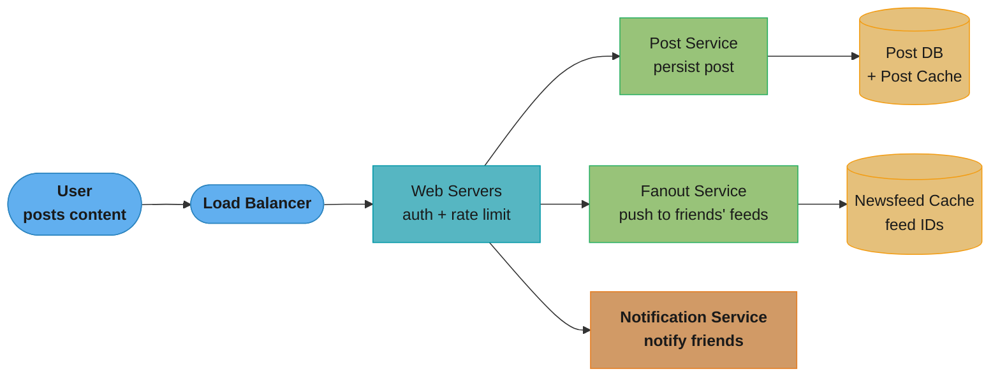
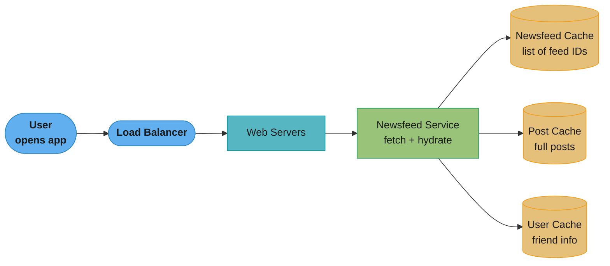
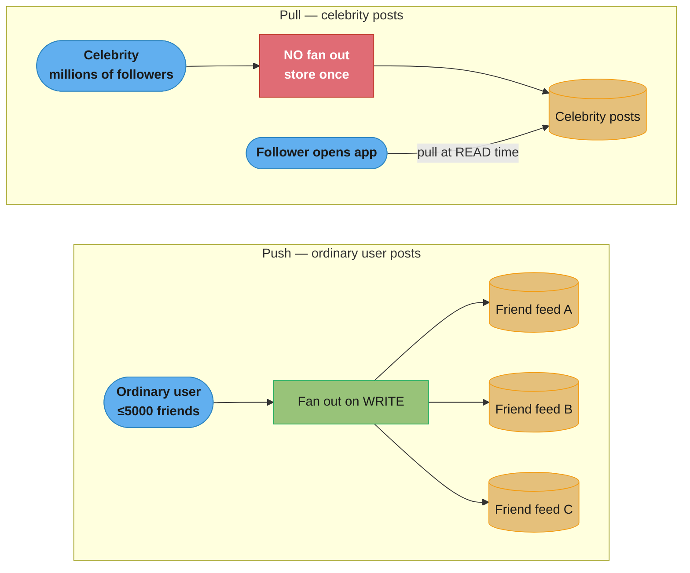
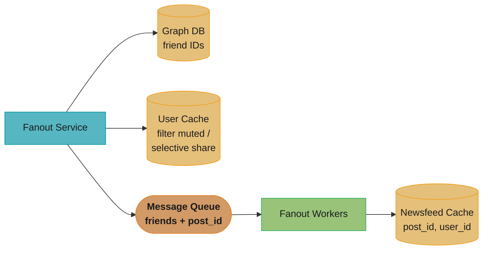
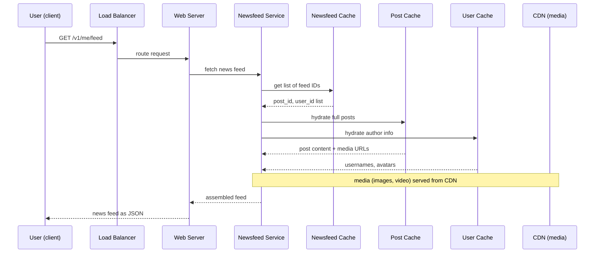
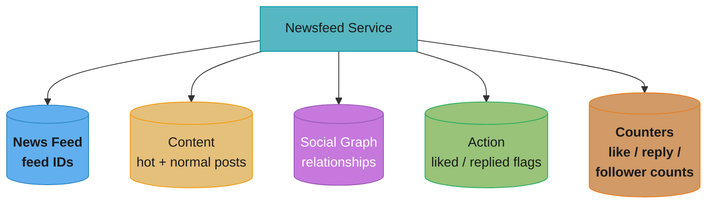
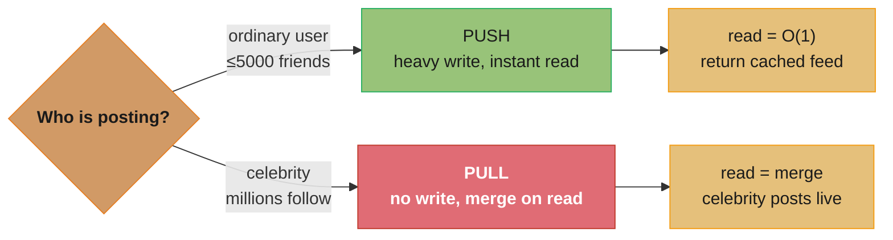

# Chapter 11: Design A News Feed System

> Ch 11 of 16 · System Design Interview Vol 1 (Xu) · builds on Ch 10's fan-out plumbing; the fan-out-on-write vs read tradeoff is the book's most-quoted lesson

## Chapter Map

A news feed is the "constantly updating list of stories in the middle of your home page" — status
updates, photos, videos, links, likes — from the people, pages, and groups you follow, shown
newest-first. This chapter designs the two halves of that experience: **feed publishing** (a user
posts, and the post must reach all of their friends' feeds) and **feed building** (a user opens the
app, and their aggregated feed must be assembled and returned fast). The whole chapter turns on one
architectural fork — do you push a new post into every friend's feed *at write time* (fan-out on
write) or gather friends' posts *at read time* (fan-out on read)? — and lands on the **hybrid**
answer that production systems actually use.

**TL;DR:**
- **Fan-out on write (push)** pre-computes each user's feed when a post is created — feed reads are
  instant, but a celebrity with millions of followers triggers a "hotkey" write storm and you waste
  work fanning out to inactive users.
- **Fan-out on read (pull)** builds the feed on demand at request time — cheap writes and no wasted
  work, but reads are slow because they must gather and merge posts from all friends live.
- **The hybrid** pushes for ordinary users and pulls for celebrities, getting fast reads for the
  common case while dodging the celebrity write storm.
- The **news feed cache stores feed *IDs*, not full post objects** — a compact list of `(post_id,
  user_id)` mappings that is hydrated into full content at read time from separate content/user
  caches, so the same post is stored once and never duplicated across millions of feeds.

## The Big Question

> "When someone I follow posts, that post has to show up in my feed — and so does everyone else's,
> merged and sorted newest-first. Do I do that work when the post is *written* (so my feed is always
> ready) or when I *open the app* (so I don't pre-compute feeds nobody reads)? And what happens when
> the person posting has 100 million followers?"

Analogy: a news feed is a personalized newspaper printed fresh for every reader. You can print each
reader's copy the moment any story breaks (push — the paper is waiting on their doorstep, but you
run the presses for readers who are on vacation and a breaking celebrity story means printing 100M
copies at once), or you can assemble each reader's copy only when they ask for it (pull — no wasted
printing, but the reader waits at the counter while you gather every story). The chapter's arc is
that neither pure strategy survives contact with a celebrity, so you print the common case ahead of
time and assemble the celebrity stories on demand.

---

## 11.1 Step 1 — Understand the Problem and Establish Design Scope

The first move in any design interview is a requirements dialogue with the interviewer to nail down
scope before drawing a single box. For a news feed, the clarifying questions and their answers are:

- **Is this a mobile app, a web app, or both?** Both. The design must serve mobile clients and web
  browsers through the same backend APIs.
- **What are the important features?** A user can **publish a post**, and a user can **see their
  friends' posts** on the news feed page. Those two flows — publishing and building — are the entire
  functional surface, and the design deliberately keeps them separate.
- **In what order are feed posts sorted?** **Reverse chronological order** (newest first). The book
  explicitly does *not* build a ranking/relevance model here — that would be a much larger problem;
  the sort key is simply the post's creation time. (Real systems layer ML ranking on top, but that
  is out of scope.)
- **How many friends can a user have?** A maximum of **5000** friends. This cap matters: it bounds
  the fan-out work per post for an ordinary user and is what makes push tractable for the common
  case.
- **What is the traffic volume?** **10 million daily active users (DAU)**. This is the number every
  later capacity estimate is anchored to.
- **Can the feed contain media?** Yes — a feed can contain **images and videos**, not just text. So
  the design must account for media storage and delivery (blob storage plus a CDN), not just small
  text rows.

### Functional vs non-functional summary

| Requirement | Decision |
|-------------|----------|
| Platforms | Mobile app + web app (shared APIs) |
| Feature: publish | `POST` a post to your own feed; it must reach all friends |
| Feature: build | `GET` your aggregated friends' feed |
| Sort order | Reverse chronological (creation time), no relevance ranking |
| Friend cap | 5000 friends per user |
| Scale | 10M DAU |
| Media | Text + images + videos supported |

Non-functional expectations that fall out of the above: the feed must load **fast** (users abandon a
slow feed), the system must be **highly available** (feeds are the home screen), and near-real-time
delivery is desirable (a friend should see a new post within a reasonable window, not hours later).

**What the formula is telling you.** "Ten million users posting a couple of times a day is a
trickle of posts — but multiply every post by the poster's follower count and the write load
explodes by two orders of magnitude."

This chain is the reason the whole chapter is about fan-out. Post QPS is a number any single
database can serve; feed-write QPS is not.

| Symbol | What it is |
|--------|------------|
| `DAU` | Daily active users — 10,000,000, the anchor for every later estimate |
| `P` | Posts published per user per day |
| `F_avg` | Average friends per user; the 5000 figure is the cap, not the average |
| `86,400` | Seconds in a day |
| `k` | Peak-to-average factor |
| `DAU x P x F_avg` | Total feed writes per day — the bill fan-out actually pays |

**Walk one example.**

```
DAU                 = 10,000,000 users
posts per user      =          2 posts/user/day
posts               = 10,000,000 users x 2 posts/user/day = 20,000,000 posts/day
post QPS            = 20,000,000 posts/day / 86,400 s/day =     231.48 posts/s
peak post QPS (k=2) = 231.48 posts/s x 2                  =     462.96 posts/s

average friends     = 300 friends/user            (cap is 5,000; the average is far lower)
feed writes         = 20,000,000 posts/day x 300 friends = 6,000,000,000 writes/day
feed-write QPS      = 6,000,000,000 writes/day / 86,400 s/day =  69,444.44 writes/s
peak feed-write QPS = 69,444.44 writes/s x 2                  = 138,888.89 writes/s
```

Meaning: 463 posts/s is nothing, but the 138,889 cache-writes/s it fans out into is the entire
engineering problem — every later decision (async queue, worker pool, hybrid fan-out, id-only
cache entries) exists to avoid paying that 300x multiplier synchronously.

**Why `F_avg` rather than the 5000 cap.** Estimating with the cap treats every user as maximally
connected and overstates the write load by 5,000 / 300 = 16.7x, which would size the fan-out fleet
almost seventeen times too large. The cap bounds the *worst case per post*; the average bounds the
*fleet*. An interview answer needs both numbers and must say which one it is using.

---

## 11.2 Step 2 — Propose High-Level Design and Get Buy-In

The design splits cleanly into the **feed publishing flow** and the **newsfeed building flow**. The
book presents an API layer first, then a high-level diagram for each flow. Keeping the two flows
architecturally separate is the central structural decision — they scale differently and have
different hot paths.

### Newsfeed APIs

The client talks to the server over HTTP, and there are exactly two APIs — one to publish, one to
retrieve.

**Feed publishing API** — creates a post and stores it in the database/cache; the post will
propagate to friends' feeds.

```
POST /v1/me/feed

Params:
  content     : the text/media of the post
  auth_token  : used to authenticate the request (identifies the calling user)
```

The `auth_token` is how the server knows *who* is posting — authentication is a required part of
every write, not an afterthought.

**Newsfeed retrieval API** — returns the caller's news feed.

```
GET /v1/me/feed

Params:
  auth_token  : used to authenticate the request (identifies the calling user)
```

No body is needed to read — the `auth_token` identifies the user whose feed to assemble. Both
endpoints use `/me`, meaning "the authenticated user," rather than a user id in the path, so a user
can only publish to and read their own feed.

### Feed publishing high-level design

When a user publishes a post, the request flows through a load balancer to a pool of web servers,
which fan the work out to three downstream services:



Caption: publishing separates persistence (post service) from propagation (fanout service) and
alerting (notification service), so a slow fan-out never blocks the user's post from being saved.

The components:

- **User** — publishes a post from mobile or web.
- **Load balancer** — spreads traffic across the web-server pool.
- **Web servers** — the entry point. They **authenticate** the request (via `auth_token`) and
  **rate-limit** it (a user may post only a bounded number of times per period, to stop spam and
  abuse), then dispatch to the services below.
- **Post service** — persists the post in the **post database** and **post cache** (the durable
  record of the post's content).
- **Fanout service** — the workhorse: it **pushes the new post to the news feed caches of the
  poster's friends** so their feeds are pre-computed. This is the component the entire Step 3 deep
  dive is about.
- **Notification service** — informs friends that new content is available and pushes out
  notifications (this is where Chapter 10's notification plumbing plugs in).

### Newsfeed building high-level design

When a user opens the app, their feed must be assembled from the news feed cache and returned:



Caption: the newsfeed service reads a compact list of feed IDs from the news feed cache, then
hydrates each into a full post — the cache holds IDs, not objects, so a post lives in exactly one
place.

The components:

- **User** — requests their news feed.
- **Load balancer** — routes the read to a web server.
- **Web servers** — route the request to the newsfeed service.
- **Newsfeed service** — fetches the news feed **from the news feed cache**, then assembles the
  final response.
- **News feed cache** — stores the news feed as a **list of feed IDs** (post ids), not the posts
  themselves. This is the design's most-tested subtlety and is examined in the deep dive.

---

## 11.3 Step 3 — Design Deep Dive

The deep dive goes back through the publishing and retrieval flows in detail, examines the web
servers, dissects the fanout service (the heart of the chapter), walks the read path, and lays out
the multi-layer cache architecture.

### Web servers

The web tier is not just a dumb router — it enforces two cross-cutting concerns that guard the whole
system, both of which connect directly to Chapter 4 (Design a Rate Limiter):

- **Authentication.** Every request carries an `auth_token`. Only signed-in users may publish and
  retrieve, and the token identifies which user's feed is being written or read. Authentication
  happens at the edge, before any downstream service is invoked, so unauthenticated traffic never
  reaches the post or fanout services.
- **Rate limiting.** A user may post only a limited number of times within a period. This stops
  spammers and bot floods from overwhelming the fanout service — remember that a single post from a
  well-connected user triggers up to 5000 (and for celebrities, millions of) downstream cache
  writes, so an unlimited post rate is an amplified denial-of-service vector. Rate limiting at the
  web tier is the cheap place to shed that load, using the token-bucket / sliding-window techniques
  from Chapter 4.

Because these responsibilities are stateless (the token carries the identity, the rate-limit counter
lives in a shared store like Redis), the web tier itself holds no session state and can be scaled
horizontally behind the load balancer — a property Step 4 leans on.

### Fanout service

**Fanout** is the process of delivering a post to all the people who should see it — the poster's
friends/followers. There are two strategies, and picking between them is the chapter's central
lesson.

#### Fanout on write (push model)

The news feed is **pre-computed at write time**. The moment a user publishes, the new post is pushed
into the news feed cache of every one of their friends. Reading the feed is then trivial — the feed
is already sitting in the cache.

**Pros:**
- The news feed is generated in **real time** and pushed to friends immediately.
- **Fetching the feed is fast**, because the feed is pre-computed during write time — the read is
  just "return this user's cached feed list."

**Cons:**
- **Hotkey / celebrity problem.** If a user has many friends/followers (a celebrity or a hugely
  popular account), gathering the friend list and pushing the post to *all* of them is slow and
  time-consuming — a single post detonates into millions of cache writes. This "hotkey" write storm
  is the fatal flaw of pure push.
- **Wasted computing resources for inactive users.** Pushing a post to the feeds of users who rarely
  or never log in wastes work — you pre-computed a feed nobody will read. For a service where many
  registered users are inactive, this is a large fraction of the fan-out effort thrown away.

**What this actually says.** "One post becomes exactly as many feed writes as the poster has
followers, so the write-amplification factor *is* the follower count."

That identity is the whole argument. Fan-out on write does not degrade gradually as an account
grows popular — it degrades in direct proportion, and the follower distribution has a very long
tail.

| Symbol | What it is |
|--------|------------|
| `F` | Followers/friends of the poster |
| `P` | Posts published per day by that user |
| `F x P` | Feed writes per day generated by that one user |
| `A = F` | Write-amplification factor — cache writes per single post |
| `w` | Fan-out throughput of the worker pool, in writes/s |
| `F / w` | Seconds to finish fanning out one post |

**Walk one example.** The same fan-out worker pool (`w` = 100,000 writes/s) for three posters:

```
ordinary user   F =         300 friends,  P = 2 posts/day
                writes  = 300 x 2                        =         600 writes/day
                A       =                                          300x per post
                fan-out = 300 / 100,000 writes/s         =       0.003 s

capped user     F =       5,000 friends,  P = 2 posts/day     (the design's 5000 cap)
                writes  = 5,000 x 2                      =      10,000 writes/day
                A       =                                        5,000x per post
                fan-out = 5,000 / 100,000 writes/s       =        0.05 s

celebrity       F = 100,000,000 followers, P = 1 post
                writes for ONE post                      = 100,000,000 writes
                A       =                                  100,000,000x per post
                fan-out = 100,000,000 / 100,000 writes/s =       1,000 s = 16.7 minutes
```

Meaning: push finishes the worst *ordinary* user in 0.05 s and needs 16.7 minutes for a single
celebrity post — roughly 333,333x more work for the same one post. That is a cliff, not a slope,
and it is exactly where fan-out on write breaks: no amount of extra workers makes a 100,000,000-
write burst behave like a 5,000-write one, because the burst arrives all at once and blocks the
queue behind it. The hybrid exists to remove that single case from the write path entirely.

#### Fanout on read (pull model)

The news feed is **generated at read time**. Nothing is pushed on publish; instead, when a user opens
the app, the system gathers the recent posts of all the people they follow, merges them, and returns
the feed on demand (an "on-demand" model).

**Pros:**
- **No wasted work for inactive users.** Because the feed is built only when requested, you never
  spend resources pre-computing feeds for users who don't log in.
- **Data is not pushed to friends**, so there is **no hotkey problem** — a celebrity's post does not
  trigger any fan-out writes at all; it just sits in their own posts, to be pulled when a follower
  reads.

**Cons:**
- **Fetching the news feed is slow**, because the feed is **not pre-computed** — every read must
  gather and merge posts from everyone the user follows, live, which is expensive on the read path
  (the busiest path).

#### The hybrid approach

Neither pure model wins. Push gives fast reads but dies on celebrities and wastes work on inactive
users; pull avoids those but makes the common read path slow. **The production answer is a hybrid:**

- Use **push (fanout on write) for the majority of users** — ordinary users with a bounded friend
  count (≤5000) get their feeds pre-computed, so the common read is instant.
- Use **pull (fanout on read) for celebrities** — for users with a huge follower count, do *not* fan
  out their posts on write. Instead, followers **pull** the celebrity's posts at read time and merge
  them into their pushed feed.

This dodges the hotkey write storm (celebrities never fan out) while keeping reads fast for the vast
majority (whose feeds are pre-computed). The side-by-side below makes the split concrete:



Caption: the same post is handled two different ways — pushed into friends' feeds for an ordinary
poster (fast reads), but stored once and pulled on demand for a celebrity (no write storm). A
follower's final feed merges pushed posts with pulled celebrity posts.

#### The fanout workflow (push path, in detail)

When an ordinary user posts and the fanout service runs the push, the sequence is:

1. **Fetch friend IDs from the graph database.** Friend relationships are stored in a **graph
   database**, which is well suited to managing the friend/follower graph and its recommendation-type
   queries. The fanout service asks the graph DB, "who are this user's friends?"
2. **Get friends' info from the user cache, and filter.** With the friend IDs in hand, the service
   reads friend information from the **user cache**, and **filters the recipient list** according to
   user settings — for example, skipping friends who have **muted** the poster, or honoring
   **selective sharing** (the poster chose to share this post with only some friends, e.g. "close
   friends" or excluding certain people). Not every friend necessarily receives every post.
3. **Send friends list + post ID to a message queue.** The (filtered) list of recipient friend IDs
   and the new post ID are placed onto a **message queue** — this decouples the (potentially slow)
   fan-out from the user's publish request, so the poster gets an immediate acknowledgement while the
   fan-out happens asynchronously.
4. **Fanout workers pull from the queue and write the news feed cache.** A pool of **fanout workers**
   consumes the queue and, for each recipient, stores the news feed data in the **news feed cache**.
   The cache is a mapping of **`<post_id, user_id>`** entries — for every friend, the worker appends
   the new post id (and the poster's user id) to that friend's feed list.



Caption: the graph DB answers "who are the friends," the user cache filters them by preferences, and
a message queue plus worker pool absorbs the fan-out spike so the poster's request returns
immediately.

#### The memory-size discussion (why storing IDs is affordable)

Storing every friend's feed in cache raises an obvious worry: does the news feed cache blow up in
memory? The book's answer is that the news feed cache holds only **IDs** (`<post_id, user_id>`
pairs), which are tiny, and — crucially — the stored feed list is **length-limited by configuration**.
Most users **do not scroll thousands of posts deep**; they look at the top of their feed. So the
system keeps only a bounded number of recent feed IDs per user in cache (a configurable limit) and
fetches older content from the database on the rare occasion a user scrolls far. This keeps the cache
memory footprint small and predictable regardless of how many total posts exist.

**Put simply.** "Cache RAM is entries-per-user × bytes-per-entry × users — and capping the
entries is what converts an unbounded number into a fixed one."

The book's claim that ids are "affordable" is only half the story; ids are small *and* the list is
truncated. Either half alone still grows without limit.

| Symbol | What it is |
|--------|------------|
| `N` | Feed IDs cached per user — the configurable length limit |
| `b` | Bytes per entry: `<post_id, user_id>` = 8 B + 8 B |
| `U` | Users holding a cached feed |
| `N x b x U` | Total news-feed-cache RAM |

**Walk one example.**

```
b = 8 B (post_id) + 8 B (user_id)           =            16 B/entry
N =   500 feed IDs/user
U = 10,000,000 users

per user = 500 entries/user x 16 B/entry    =         8,000 B/user = 7.81 KB/user
total    = 8,000 B/user x 10,000,000 users  = 80,000,000,000 B     = 80 GB

uncapped, for contrast:
  6,000,000,000 writes/day / 10,000,000 users =   600 entries/user/day
  600 entries/user/day x 16 B/entry           = 9,600 B/user/day
  6,000,000,000 writes/day x 16 B/entry       =    96 GB/day of growth, forever
```

Meaning: capping at 500 ids pins the feed cache at a flat 80 GB that a modest cache cluster holds
comfortably; without the cap, the same cache grows by 96 GB every single day and never stops.

**Why you cache only the first N items.** Feed reads are overwhelmingly shallow — users read the
top of the feed and leave — so entries beyond the first page or two are paid for and almost never
read. Truncating at `N` spends RAM only on the entries that get served, and the rare deep-scroll
falls through to the database, trading a slow read for a user who is already an outlier against an
unbounded, ever-growing memory bill for everyone.

### Newsfeed retrieval deep dive

Building the feed on read is a **hydration** process: the news feed cache gives you a list of ids,
and you turn those ids into full posts and user objects to render. Media is served separately — images
and videos are **stored in a CDN for fast delivery** rather than streamed through the application
servers.

The read path is a **six-step flow**:

1. A **user sends a request** to retrieve their news feed: `GET /v1/me/feed`.
2. The **load balancer** distributes the request to one of the **web servers**.
3. Web servers call the **newsfeed service** to fetch the news feed.
4. The **newsfeed service gets the list of feed IDs** (post ids) from the **news feed cache**.
5. The user's news feed is more than just a list of ids — it needs usernames, profile pictures, post
   content, media, and so on. So the newsfeed service **hydrates** those ids: it fetches the **full
   post objects from the post cache** and the **user objects (author name, avatar, etc.) from the
   user cache**. Media objects (images/video) come from the **CDN**.
6. The **fully hydrated news feed is returned as JSON** to the client, which renders it.



Caption: the read is a fan-in hydration — a compact id list from the news feed cache is expanded into
full posts and user objects from separate caches, with heavy media offloaded to the CDN, and returned
as JSON.

**Read it like this.** "Feed opens per day over 86,400 gives read QPS; multiply by the posts
rendered per open to get hydration lookups; and the cache hit rate decides how few of those ever
reach the database."

Step 5 above hides an amplification of its own: one feed request is not one lookup, it is one
lookup per rendered post. That is the number the content cache has to absorb.

| Symbol | What it is |
|--------|------------|
| `o` | Feed opens per user per day |
| `DAU x o / 86,400` | Feed-fetch QPS |
| `m` | Posts hydrated per feed response — the first page |
| `h` | Content-cache hit rate |
| `(1 - h)` | Fraction of hydration lookups that fall through to the post database |

**Walk one example.**

```
opens      = 10,000,000 users x 5 opens/user/day    = 50,000,000 opens/day
feed QPS   = 50,000,000 opens/day / 86,400 s/day    =     578.70 feed fetches/s
peak (2x)  = 578.70 fetches/s x 2                   =   1,157.41 feed fetches/s

hydration  = 578.70 fetches/s x 20 posts/fetch      =  11,574.07 post lookups/s
h = 0.99   -> served from content cache             =  11,458.33 lookups/s
(1 - h)    -> 11,574.07 x 0.01                      =     115.74 post reads/s hit the DB
```

Meaning: a 99 percent content-cache hit rate turns 11,574 post lookups/s into 116 database reads/s
— a 100x reduction, and the concrete justification for the five-layer cache below. Note also that
the read path is roughly 579 fetches/s against a fan-out write path of 69,444 writes/s: this system
writes about 120x more than it reads, which is the inversion that makes fan-out on write worth
questioning in the first place.

### Cache architecture

Caching is critical to a news feed system — it is what makes both the write path (fan-out into feed
caches) and the read path (hydration) fast. The book breaks the cache into **five layers**, each with
a distinct job:

| Cache layer | What it stores | Why it exists |
|-------------|----------------|---------------|
| **News feed** | The IDs of news feeds (the per-user feed list of `<post_id, user_id>`) | The pre-computed feed; read first on every feed load |
| **Content** | Every post's data. Very popular content stored in a **hot cache** (separate from normal) | Hydrate feed IDs into full posts; hot cache absorbs viral-post read spikes |
| **Social graph** | User relationship data (who follows/friends whom) | Answer "who are this user's friends" fast on the fan-out path |
| **Action** | Whether a user **liked** a post, **replied**, or took other actions on a post | Render the feed's interaction state without hitting the primary DB |
| **Counters** | Counters for **likes, replies, followers, following**, etc. | Show aggregate numbers (like/reply/follower counts) without expensive `COUNT` queries |



Caption: the five cache layers each answer one question fast — feed IDs, post content (with a hot
tier for viral posts), the friend graph, per-user actions, and aggregate counters — so a feed load
touches cache, not the primary database.

---

## 11.4 Step 4 — Wrap Up

Having built the core, the wrap-up covers how the system scales and stays healthy. The interviewer
typically probes scaling; the book enumerates the standard levers.

### Scaling the database

When the data outgrows a single machine, there is a menu of choices to discuss:

- **Vertical vs horizontal scaling.** Vertical scaling ("scaling up") buys a bigger machine — simple
  but capped by hardware limits and a single point of failure. Horizontal scaling ("scaling out" /
  **sharding**) spreads data across many machines and is what large systems ultimately need.
- **SQL vs NoSQL.** Choose the store that fits the access pattern; NoSQL stores often fit the
  high-write, key-lookup shape of feed/post data, while relational stores fit the transactional,
  relational parts.
- **Master–slave replication (replication).** Replicate data across nodes so reads can be served from
  replicas and the system survives a node loss — improving read throughput and availability.
- **Sharding.** Partition the data across shards to distribute both storage and load horizontally
  (the same idea as consistent hashing in Chapter 5, applied to feed/post/user data).

### Other scaling and resilience levers

- **Keep the web tier stateless.** Because the web servers hold no session state (identity rides in
  the `auth_token`, counters live in shared caches), you can add or remove web servers freely and
  route any request to any server — the tier scales horizontally behind the load balancer.
- **Cache data as much as possible.** Push more of the working set into the multi-layer cache to keep
  the database off the hot path.
- **Support multiple data centers.** Serve users from geographically distributed data centers to cut
  latency and survive a regional outage.
- **Lose-couple components with message queues.** Decouple services with message queues (as the
  fanout path already does) so a slow or failing downstream service applies back-pressure through the
  queue instead of cascading failures upstream.
- **Monitor key metrics.** Watch **QPS during peak hours** (to know when to add capacity) and **feed
  retrieval latency** (the user-facing speed of opening the app), plus fan-out lag and cache hit
  rates, so you can catch regressions before users do.

### Recap

The news feed design cleaves the interview candidate with a clean mental model: **two separated
flows** — a publish flow (load balancer → web servers → post + fanout + notification services) and a
build flow (load balancer → web servers → newsfeed service → news feed cache) — connected by a
**fanout strategy** that is neither pure push nor pure pull but a **hybrid** (push for the many, pull
for celebrities). The **news feed cache stores IDs, not objects**, so posts are stored once and
hydrated on read from a **five-layer cache** (news feed, content with a hot tier, social graph,
action, counters). The wrap-up scales the whole thing with a stateless web tier, database
replication and sharding, aggressive caching, multiple data centers, message-queue decoupling, and
monitoring of QPS and retrieval latency.

---

## Visual Intuition

### Why the cache stores IDs, not objects

```
STORE IDs (compact)                      STORE full posts (bloated)
-------------------                      --------------------------
Alice feed: [p9, p7, p4, ...]            Alice feed: [ {p9:"text+img"}, {p7:"..."} ]
Bob   feed: [p9, p8, p4, ...]            Bob   feed: [ {p9:"text+img"}, ... ]   <- p9 copied
Carol feed: [p9, p6, p2, ...]            Carol feed: [ {p9:"text+img"}, ... ]   <- p9 copied

p9 lives ONCE in the content cache;      The SAME post is duplicated into every feed.
every feed just references its id.       An edit/delete must touch all copies.

A viral post reaching 1,000,000 feeds    The same post is copied 1,000,000 times ->
costs 1 content-cache entry +            1,000,000 duplicate byte-blobs, and editing
1,000,000 tiny id references.            it means touching 1,000,000 places.
```

Caption: storing feed IDs (not objects) keeps each post in exactly one place (the content cache) and
makes every user's feed a cheap list of references — the reason a viral post does not multiply its
storage by its audience, and why an edit or delete touches one record instead of millions.

**In plain terms.** "Storing a reference costs bytes; storing a copy costs kilobytes — so a viral
post's storage bill is decided entirely by which of the two you put in each feed."

The diagram above states the shape; the arithmetic states the size. Both matter, because "store
ids" only sounds obvious once you see the ratio.

| Symbol | What it is |
|--------|------------|
| `V` | Feeds the viral post reaches |
| `b_id` | Bytes for one `<post_id, user_id>` reference = 8 B + 8 B = 16 B |
| `b_obj` | Bytes for one full post object (text plus metadata), taken as 1 KB |
| `V x b_id` | Storage bill for the id-only design |
| `V x b_obj` | Storage bill for the copy-into-every-feed design |

**Walk one example.** Using the diagram's own 1,000,000-feed viral post:

```
V = 1,000,000 feeds

store IDs     : 1,000,000 x    16 B =    16,000,000 B =   16 MB  + 1 content-cache copy
store objects : 1,000,000 x 1,024 B = 1,024,000,000 B = 1.02 GB  (the same post, 1M times)

ratio         = 1,024 B / 16 B      = 64x more storage for the copy-everywhere design
edit / delete = 1 record to touch (ids)  vs  1,000,000 records to touch (objects)
```

Meaning: the id-only feed is 64x smaller *and* turns an edit or a delete from a million-row
rewrite into a single-row update — one arithmetic choice buying both a storage win and a
correctness win.

### Push vs pull cost, at a glance



Caption: the hybrid decision is a single branch — the poster's audience size — sending ordinary posts
down the cheap-read push path and celebrity posts down the no-write-storm pull path.

---

## Key Concepts Glossary

- **News feed** — the constantly updating, newest-first list of stories from people/pages/groups a
  user follows, shown on the home page.
- **Feed publishing** — the write flow: a user creates a post that must reach all of their friends'
  feeds.
- **Feed building (retrieval)** — the read flow: aggregating and returning a user's friends' posts.
- **Feed publishing API** — `POST /v1/me/feed` with `content` and `auth_token`; creates a post.
- **Newsfeed retrieval API** — `GET /v1/me/feed` with `auth_token`; returns the caller's feed.
- **Post service** — persists a post to the post database and post cache.
- **Fanout service** — delivers a new post to the feeds of the poster's friends.
- **Notification service** — informs friends that new content is available.
- **Newsfeed service** — assembles a user's feed by reading feed IDs and hydrating them.
- **News feed cache** — per-user list of feed IDs (`<post_id, user_id>`), not full posts.
- **Fanout on write (push)** — pre-compute each friend's feed at post time; fast reads, celebrity
  write storm, wasted work for inactive users.
- **Fanout on read (pull)** — build the feed at read time; cheap writes, no hotkey problem, slow
  reads.
- **Hybrid fanout** — push for ordinary users, pull for celebrities.
- **Hotkey / celebrity problem** — a single high-follower post triggering a massive fan-out write
  storm.
- **Graph database** — stores the friend/follower relationship graph; queried for friend IDs.
- **User cache** — friend info used to filter recipients (muted users, selective sharing).
- **Selective sharing** — a poster choosing which friends can see a given post.
- **Message queue** — decouples fan-out from the publish request; fanout workers consume it.
- **Fanout workers** — consumers that write feed IDs into recipients' news feed caches.
- **Feed size limit** — a configurable cap on how many feed IDs are cached per user (most users don't
  scroll deep).
- **Hydration** — turning feed IDs into full post + user objects at read time.
- **Hot cache** — a separate cache tier for very popular content to absorb read spikes.
- **CDN** — content delivery network serving media (images/video) for fast delivery.
- **Five cache layers** — news feed, content (hot + normal), social graph, action, counters.
- **Action cache** — stores whether a user liked/replied to a post.
- **Counters cache** — stores like/reply/follower/following counts.
- **Stateless web tier** — web servers hold no session state, so they scale horizontally.

---

## Tradeoffs & Decision Tables

### Push vs pull vs hybrid

| Dimension | Fanout on write (push) | Fanout on read (pull) | Hybrid |
|-----------|:----------------------:|:---------------------:|:------:|
| Feed read speed | Fast (pre-computed) | Slow (built on demand) | Fast for most; merge for celeb posts |
| Write cost | High (one write per friend) | Low (store once) | Bounded (push only ≤5000-friend users) |
| Celebrity/hotkey problem | Severe write storm | None | Avoided (celebrities use pull) |
| Wasted work for inactive users | Yes (pre-computes unread feeds) | No | Reduced |
| Complexity | Simple | Simple | Higher (two paths + merge) |

### What each cache layer buys you

| Layer | Replaces | Failure if absent |
|-------|----------|-------------------|
| News feed | Rebuilding the feed from scratch each read | Every feed load re-does fan-out (pull cost) |
| Content (hot + normal) | Reading each post from the post DB | Viral post hammers the DB (thundering herd) |
| Social graph | Graph DB query per fan-out | Fan-out latency spikes |
| Action | DB lookup for like/reply state | Feed can't cheaply show interaction state |
| Counters | `COUNT(*)` on the DB | Expensive aggregate queries on every render |

### API design choices

| Choice | Rationale |
|--------|-----------|
| `POST /v1/me/feed` for publish | `/me` scopes writes to the authenticated user; body carries `content` |
| `GET /v1/me/feed` for retrieval | Read needs no body; `auth_token` identifies whose feed |
| `auth_token` on every call | Authentication at the edge, before any downstream service |

---

## Common Pitfalls / War Stories

- **Pure push with no celebrity carve-out.** Fanning out every post to every follower means one
  celebrity post becomes millions of synchronous cache writes — a hotkey write storm that stalls
  publishing for everyone. The fix is the hybrid: never fan out celebrity posts; let followers pull
  them on read.
- **Storing full posts in every feed.** Copying the post object into each friend's feed multiplies
  storage by the audience and makes an edit or delete a million-row update. Store feed **IDs** and
  hydrate on read so a post lives once in the content cache.
- **Unbounded feed cache growth.** Caching every post id a user has ever been able to see explodes
  memory. Cap the cached feed at a configurable length — most users never scroll thousands deep — and
  fetch older content from the database on demand.
- **No rate limiting on publish.** Because a single post amplifies into up to thousands of fan-out
  writes, an unrate-limited post endpoint is an amplified DoS vector. Rate-limit at the web tier
  (Chapter 4 techniques) before the fanout service is ever invoked.
- **Fanning out synchronously in the request path.** Doing the fan-out inline makes the user wait for
  thousands of cache writes before their post is acknowledged. Put the friend-list + post id on a
  message queue and let fanout workers drain it asynchronously, so publish returns immediately.
- **Ignoring recipient filtering.** Fanning out to every friend regardless of mute/selective-sharing
  settings pushes posts to people who muted the author or were excluded from a "close friends" post.
  Filter the recipient list against the user cache before enqueueing.
- **Serving media through app servers.** Streaming images and video through the application tier
  saturates its bandwidth. Store media in blob storage and serve it from a **CDN**; the feed carries
  only media URLs.
- **Stateful web servers.** Pinning sessions to a specific web server breaks horizontal scaling and
  fails when that server dies. Keep the web tier stateless (identity in the token, counters in shared
  caches) so any server can handle any request.

---

## Real-World Systems Referenced

Facebook News Feed and Twitter/X timelines are the canonical systems this design abstracts (the
push/pull/hybrid fan-out debate is famously Twitter's timeline problem). Supporting technologies the
chapter invokes: a **graph database** (e.g. Neo4j-style stores) for the friend/follower graph;
**Redis/Memcached-style** in-memory caches for the five cache layers and per-user feed lists; a
**message queue** (e.g. Kafka-style) to decouple fan-out; **CDN** for media delivery; and standard
relational/NoSQL stores plus replication and sharding for durable post/user/graph data.

---

## Summary

A news feed system splits into a **publishing flow** and a **feed-building flow**, exposed through two
APIs — `POST /v1/me/feed` to publish and `GET /v1/me/feed` to retrieve, both authenticated by
`auth_token`. On publish, a load balancer routes to stateless web servers that authenticate and
rate-limit, then dispatch to a **post service** (persist), a **fanout service** (propagate), and a
**notification service** (alert). The fanout service is the heart of the design and forces the
chapter's key decision: **fanout on write (push)** pre-computes feeds for instant reads but suffers
the **celebrity hotkey write storm** and wastes work on inactive users; **fanout on read (pull)** has
cheap writes and no hotkey problem but slow reads; the winning **hybrid** pushes for ordinary users
(≤5000 friends) and pulls for celebrities. The push path pulls friend IDs from a **graph database**,
filters recipients via the **user cache** (mute / selective sharing), enqueues the friend list + post
id on a **message queue**, and lets **fanout workers** write `<post_id, user_id>` entries into each
friend's **news feed cache** — which stores **IDs, not objects**, with a configurable length limit
because most users don't scroll deep. Reading the feed is a **six-step hydration**: fetch feed IDs
from the news feed cache, expand them into full posts and user info from the content and user caches
(media from the **CDN**), and return JSON. Caching is layered five ways — **news feed, content (with
a hot tier), social graph, action, counters** — and the system scales via a **stateless web tier**,
database **replication and sharding**, aggressive caching, **multiple data centers**, **message-queue
decoupling**, and monitoring of **peak QPS** and **feed retrieval latency**.

---

## Interview Questions

**Q: What is the celebrity (hotkey) problem in a news feed, and how does the design solve it?**
It is when a user with millions of followers posts and fan-out-on-write must push that single post into millions of feeds at once, creating a write storm that stalls publishing. Pure push cannot handle it because gathering the huge follower list and writing to every feed is slow. The fix is the hybrid model: never fan out celebrity posts on write; instead followers pull the celebrity's posts at read time and merge them into their pushed feed, so a celebrity post triggers zero fan-out writes.

**Q: When would you choose fanout on write (push) over fanout on read (pull)?**
Choose push when reads must be fast and the poster has a bounded follower count, because push pre-computes each friend's feed so reads are instant. Push's downsides are the celebrity write storm and wasted work pre-computing feeds for inactive users. Pull is better for celebrities and read-rarely accounts since it stores the post once and builds feeds on demand, at the cost of slow reads. Production systems combine them: push for ordinary users, pull for celebrities.

**Q: Why does the news feed cache store feed IDs instead of full post objects?**
Because a post should live in exactly one place, so the cache stores compact `<post_id, user_id>` references and hydrates them into full posts on read. If it stored full objects, a viral post reaching a million feeds would be copied a million times, exploding storage and making a single edit or delete a million-row update. Storing IDs keeps each post once in the content cache, makes every user's feed a cheap list of references, and is why fan-out to millions of feeds costs only tiny id writes.

**Q: What role does the graph database play in the fanout workflow?**
It stores the friend/follower relationship graph and is queried to get the poster's friend IDs before fan-out. Graph databases are well suited to managing this relationship data and recommendation-style queries. In the push workflow, the fanout service first asks the graph DB "who are this user's friends," then uses those IDs to read friend info from the user cache and filter recipients before enqueueing the fan-out work.

**Q: Why is the recipient list filtered before fan-out, and what filters apply?**
Because not every friend should receive every post, so the fanout service filters recipients using friend info from the user cache. Filters include skipping friends who have muted the poster and honoring selective sharing, where the poster chose to share a post with only some friends (for example a close-friends list). Filtering before enqueueing means fan-out workers never write the post into feeds of users who shouldn't see it.

**Q: How do the publish and retrieve APIs look, and what identifies the user?**
Publishing is `POST /v1/me/feed` with `content` and an `auth_token`, and retrieval is `GET /v1/me/feed` with an `auth_token`. The `/me` path segment scopes both operations to the authenticated user, and the `auth_token` authenticates the request and identifies whose feed is being written or read. The read needs no request body because the token alone determines which user's feed to assemble.

**Q: Walk through the six-step news feed retrieval flow.**
A user sends `GET /v1/me/feed`, the load balancer routes it to a web server, and the web server calls the newsfeed service. The newsfeed service fetches the list of feed IDs from the news feed cache, then hydrates each id by fetching full posts from the content/post cache and author info from the user cache, with media served from the CDN. Finally the fully assembled feed is returned to the client as JSON. It is a fan-in hydration that expands a compact id list into rich objects.

**Q: Why is a message queue placed between the fanout service and the fanout workers?**
To decouple the potentially slow fan-out from the user's publish request so publishing returns immediately. The fanout service puts the filtered friend list plus the post id on the queue, and a pool of fanout workers consumes it asynchronously, writing feed IDs into each recipient's news feed cache. This absorbs the fan-out spike and applies back-pressure through the queue instead of making the poster wait for thousands of cache writes.

**Q: What are the five cache layers in a news feed system and what does each store?**
News feed stores the IDs of feeds (the per-user feed list); content stores post data, with very popular posts in a separate hot cache; social graph stores user relationship data; action stores whether a user liked or replied to a post; and counters store like, reply, follower, and following counts. Each layer answers one question fast so a feed load hits cache rather than the primary database, and the hot content tier absorbs viral-post read spikes.

**Q: How does the design keep the news feed cache from growing without bound?**
It caches only a configurable, length-limited number of recent feed IDs per user rather than every post the user could ever see. This works because most users do not scroll thousands of posts deep; they read the top of the feed. When a user does scroll past the cached window, older content is fetched from the database, keeping the in-memory footprint small and predictable regardless of total post volume.

**Q: What two responsibilities does the web-server tier enforce, and why there?**
Authentication and rate limiting, enforced at the edge before any downstream service runs. Authentication uses the `auth_token` so only signed-in users can publish or retrieve, and it identifies whose feed is affected. Rate limiting caps how many times a user can post per period, which matters because one post amplifies into thousands of fan-out writes, making an unrate-limited endpoint an amplified DoS vector; the web tier is the cheap place to shed that load using Chapter 4 techniques.

**Q: How are images and videos in the feed delivered efficiently?**
Media is stored in and served from a CDN rather than streamed through the application servers, so heavy assets are delivered from edge locations close to the user. The feed itself carries only media URLs, and during read-time hydration those URLs point at the CDN. Serving media through the app tier instead would saturate its bandwidth, so offloading to a CDN keeps the application servers focused on assembling feed metadata.

**Q: Why keep the web tier stateless, and how does that help scaling?**
Because a stateless web tier can be scaled horizontally by adding or removing servers freely, with any request routable to any server. Identity rides in the `auth_token` and rate-limit counters live in a shared store like Redis, so no session state is pinned to a specific server. This means a server can die without dropping sessions and the load balancer can spread traffic evenly, which is the foundation for the horizontal scaling discussed in the wrap-up.

**Q: What are the three downstream services in the publish flow and what does each do?**
The post service persists the post to the post database and post cache; the fanout service pushes the new post into the news feed caches of the poster's friends; and the notification service informs friends that new content is available. Separating persistence from propagation from alerting means a slow fan-out never blocks the post from being saved, and each service can scale and fail independently.

**Q: What is the concrete tradeoff that makes pure fanout-on-read (pull) undesirable as the only strategy?**
Its fatal weakness is slow reads, because the feed is not pre-computed and every read must gather and merge the recent posts of everyone the user follows, live. Reads are the busiest path in a feed system, so paying that cost on every open is expensive. Pull's advantages — no wasted work for inactive users and no hotkey problem — are real, which is why it is kept for celebrities, but for the common ordinary-user read it is too slow, so push handles that case.

**Q: What does a fanout worker actually write into the cache, and in what form?**
Each fanout worker consumes the friend list and post id from the message queue and, for every recipient friend, appends a feed entry to that friend's news feed cache as a `<post_id, user_id>` mapping. It writes the id of the post plus the poster's user id, not the post content itself. This keeps the write tiny and lets the read path later hydrate the id into a full post and author object from the content and user caches.

**Q: Which scaling and resilience levers does the wrap-up recommend?**
Scale the database with vertical vs horizontal scaling, SQL vs NoSQL choices, replication, and sharding; keep the web tier stateless; cache as much as possible; support multiple data centers; loosely couple components with message queues; and monitor key metrics. The two metrics called out are QPS during peak hours, to know when to add capacity, and feed retrieval latency, the user-facing speed of opening the app.

**Q: Why sort the feed reverse-chronologically rather than by relevance, in this design?**
Because relevance ranking is deliberately out of scope; the design fixes the sort key as post creation time, newest first. Building an ML relevance model would be a much larger, separate problem. Reverse-chronological order keeps the feed-assembly logic simple, an ordered merge by timestamp, which is enough to demonstrate the publishing, fan-out, and hydration architecture that the chapter is really about; real systems layer ranking on top afterward.

**Q: In the hybrid model, how is a follower's final feed assembled from both paths?**
The follower's pushed feed (posts fanned out on write by ordinary friends) is merged at read time with the pulled posts of the celebrities they follow. The push path already left ordinary friends' post IDs in the news feed cache, and the pull step fetches recent celebrity posts on demand; the newsfeed service combines them and sorts newest-first before hydrating. This gives fast reads for the bulk of the feed while avoiding any fan-out write storm from the celebrities.

---

## Cross-links in this repo

- [hld/case_studies/design_twitter.md — the timeline fan-out problem in full case-study depth](../../../hld/case_studies/design_twitter.md)
- [hld/caching/ — cache strategies, hot keys, cache-aside, and eviction behind the five cache layers](../../../hld/caching/README.md)
- [hld/message_queues/ — decoupling the fanout path with a queue and worker pool](../../../hld/message_queues/README.md)
- [Ch 10 — Design a Notification System (the notification service that alerts friends)](../10_design_a_notification_system/README.md)
- [Ch 12 — Design a Chat System (the sibling real-time delivery problem)](../12_design_a_chat_system/README.md)

## Further Reading

- Xu, System Design Interview Vol 1, Ch 11 — the original chapter text and diagrams.
- Facebook Engineering, "News Feed" architecture write-ups — the canonical push/pull hybrid in
  production.
- Twitter Engineering, "The Infrastructure Behind Twitter: Timelines / Fanout" — the celebrity
  fan-out problem and hybrid solution at scale.
- Redis and Memcached documentation — the in-memory stores behind the per-user feed lists and the
  five cache layers.
