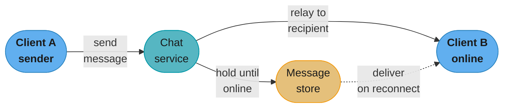
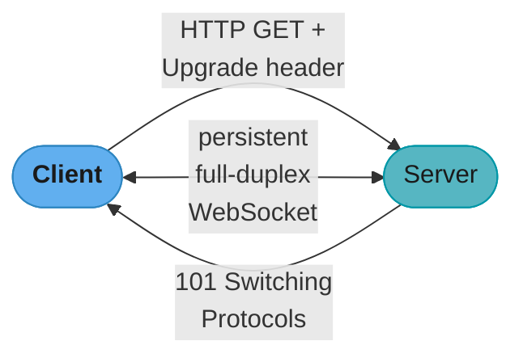
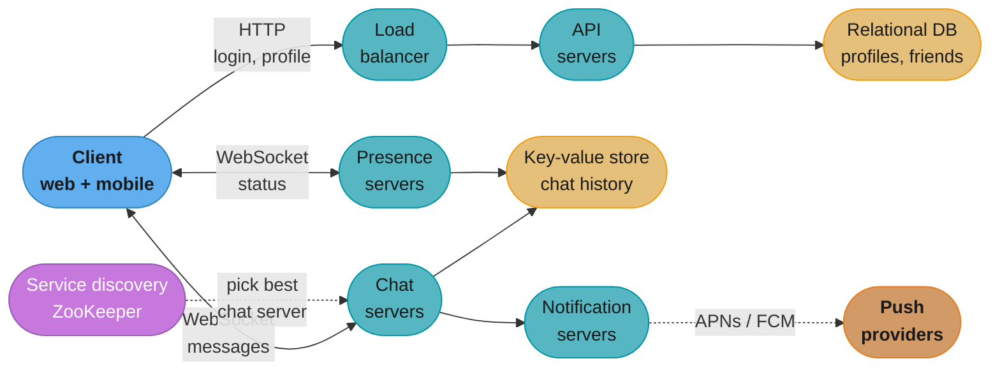
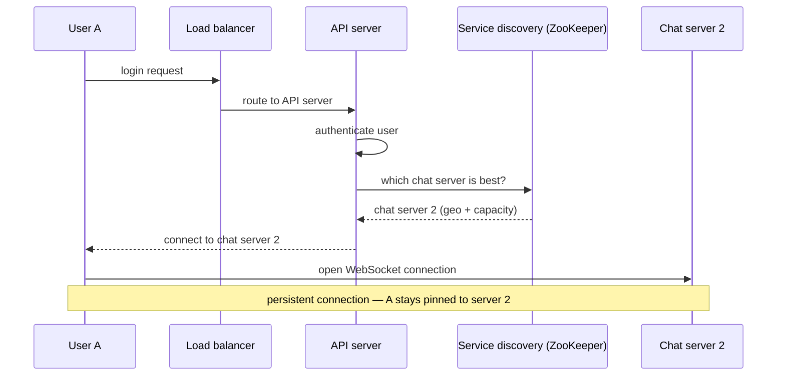
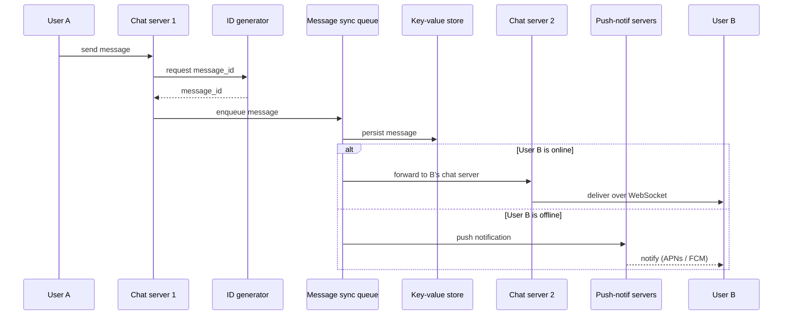
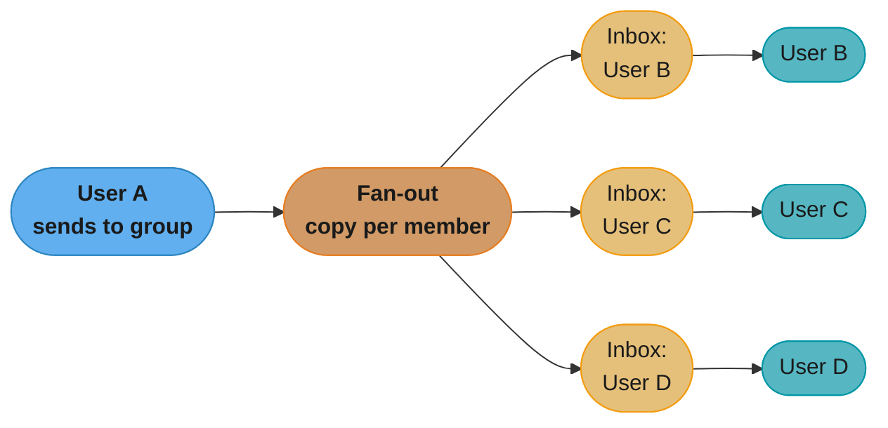
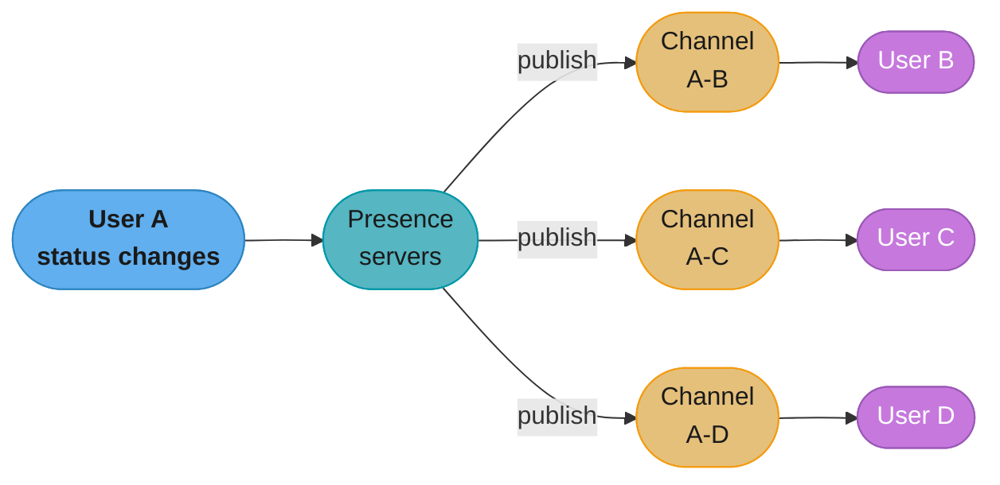
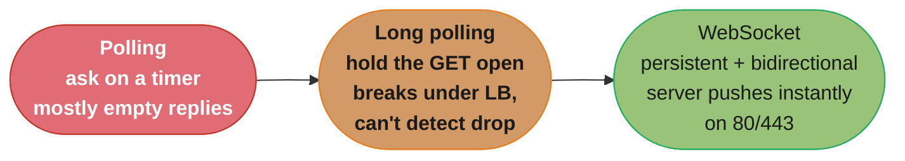
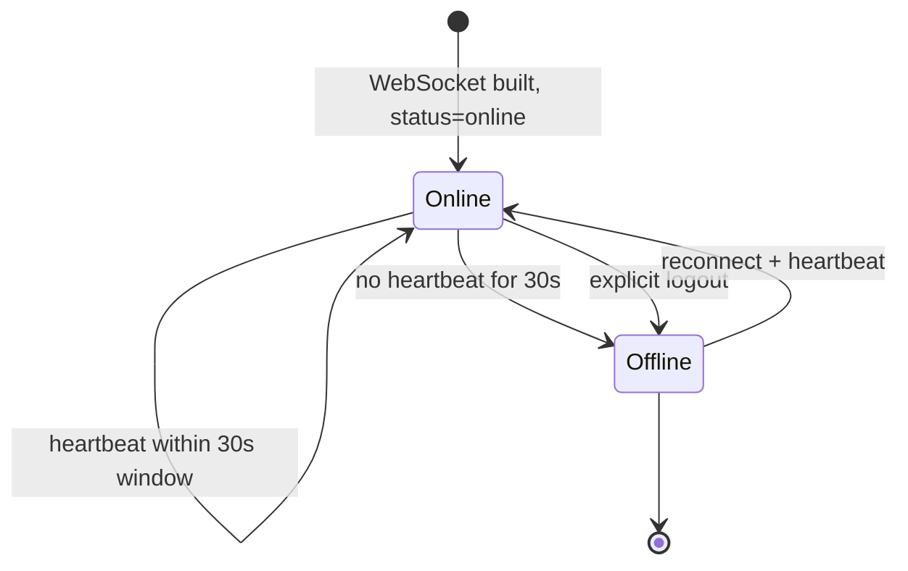

# Chapter 12: Design A Chat System

> Ch 12 of 16 · System Design Interview Vol 1 (Xu) · builds on Ch 6 (KV storage) and Ch 7 (message IDs); the stateful-service chapter

## Chapter Map

This is the chapter where the SDI methodology finally meets a **stateful, real-time**
service. Everything before it (URL shortener, web crawler, notification system) is
request/response — the server answers when asked and forgets you. A chat system is
different: the server must **push** a message to a recipient the instant it arrives, which
means the server has to *hold a live connection* to every online user and *remember* which
server holds which user. That single fact — statefulness — drives every design decision in
the chapter: WebSocket instead of HTTP polling, service discovery to pin a user to a chat
server, a message sync queue (inbox) per recipient, and a heartbeat to decide who is
actually online on a flaky network.

**TL;DR:**
- **WebSocket** is the spine: one persistent, bidirectional connection per client, used for
  *both* sending and receiving. HTTP with keep-alive is fine for the sender but cannot push
  to the receiver; polling wastes requests and long polling breaks in a load-balanced world.
- Split services by their nature: **stateless** (login/signup/profile behind a LB),
  **stateful** (chat servers, one persistent connection per client), and **third-party**
  (push notifications for offline users). Add **presence servers**, **API servers**, and a
  **key-value store** for history.
- Chat history is **enormous** (~60 billion messages/day at WhatsApp scale) with a
  recent-first access pattern — a **key-value store (HBase/Cassandra)** scales horizontally
  where a relational index would choke on random access.
- Deep dives: **service discovery** (ZooKeeper picks the best chat server), the **1-on-1
  and small-group message flows** (fan-out into a per-recipient inbox), and **online
  presence** with a **heartbeat** so a subway signal drop doesn't flicker you offline.

## The Big Question

> "A message is only useful the moment it arrives. How do I build a server that can *push* a
> new message to millions of people the instant someone sends it — when the web was built on
> the client always asking first — and still know, on a network that drops constantly, who is
> actually online?"

Analogy: request/response is **mail-order** — you send a letter and wait for a reply, and the
warehouse never contacts you unprompted. Chat is a **phone line left off the hook** — the line
stays open in both directions, either side can speak at any moment, and someone has to notice
when the line goes dead. The whole chapter is about keeping millions of phone lines open
cheaply (WebSocket + connection management), routing calls to the right exchange (service
discovery), leaving voicemail when nobody picks up (push notifications + the KV store), and
telling a hung-up line from a bad-signal pause (the heartbeat).

---

## 12.1 Step 1 — Understand the Problem and Establish Design Scope

Chat means very different things — Messenger/WhatsApp (1-on-1 focus), Slack/Discord (group
focus), gaming voice chat (low latency). Nail down the exact system before designing.

### The requirements dialogue

The clarifying Q&A that pins the scope:

| Question to the interviewer | Agreed answer |
|-----------------------------|---------------|
| 1-on-1, group, or both? | **Both** — 1-on-1 chat and group chat |
| Mobile app, web, or both? | Both |
| How big is the scale? | **50 million daily active users (DAU)** |
| Group-size limit? | **Max 100 people** per group |
| Which features matter? | 1-on-1, group chat, **online presence indicator**, **multiple-device sync**, **push notifications** |
| Media (images/video/files)? | **Text only** to start |
| Message size limit? | **100,000 characters** max |
| End-to-end encryption? | **Not required initially** (a nice-to-have if time permits) |
| How long is chat history kept? | **1 year** of history |

The resulting feature list to design for:

1. **1-on-1 chat** with low delivery latency.
2. **Small group chat** (≤ 100 members).
3. **Online presence** (an online/offline indicator per user).
4. **Multiple-device support** — the same account logged in on several devices at once, all
   staying in sync.
5. **Push notifications** — when a message arrives and the recipient is offline.

### Non-functional requirements

- **Scale:** 50 million DAU.
- **Low latency:** messages must be delivered in near-real-time (the reason WebSocket, not
  polling, is the answer).
- **Reliability:** no message loss; a message must survive until the recipient reads it, even
  if the recipient is offline for hours.
- **High availability:** tolerate server failures without dropping the whole service (which is
  why the single-server design later gets rejected).

### Back-of-the-envelope: how heavy is a chat server, really?

The chapter's key sizing intuition is about **concurrent connections**, not QPS, because a
stateful server pays memory for every live connection whether or not it is actively chatting:

```
Concurrent connections (thought experiment)  : 1,000,000
Memory per WebSocket connection (buffers etc.): ~10 KB
Total connection memory                       : 1e6 × 10 KB = 10,000,000 KB ≈ 10 GB
```

10 GB of connection state fits comfortably in one modern server's RAM — which is exactly the
trap the next step walks into and then rejects. Message *volume* is the other axis: at
WhatsApp/Messenger scale the system ingests on the order of **60 billion messages per day**,
which is why storage (not connection memory) becomes the hard scaling problem.

---

## 12.2 Step 2 — Propose High-Level Design and Get Buy-In

Clients do **not** talk to each other directly. Every client connects to a **chat service**
that (1) receives messages from senders, (2) finds the right recipients and relays each
message, and (3) holds messages for offline recipients until they come online.



Caption: clients never peer directly — the chat service is the hub that relays live and
buffers for the offline, which is why the server must be stateful (it holds a live connection
per client) rather than a stateless request/response API.

### How clients and servers communicate

Splitting the send path from the receive path is the single most important insight of the
whole design.

- **Sender side is easy.** When a client *sends* a message, it is the initiator — classic
  request/response over **HTTP with keep-alive** works perfectly. Keep-alive holds the TCP
  connection open across requests, so the sender avoids paying the TCP (and TLS) handshake
  on every message. HTTP was the original workhorse for the sender half and is a fine choice.
- **Receiver side is the hard part.** HTTP is **client-initiated** — the server cannot open a
  connection and push a message to a client whenever it wants. Delivering a message *to* a
  recipient the instant it arrives requires a technique that lets the server originate the
  data. Three techniques were tried over the years.

### Three receiver-side techniques

#### Polling

The client **periodically asks** the server "any new messages?" at a fixed interval.

- Cost is set by the polling frequency. Poll often → low latency but most requests come back
  empty ("no new messages"), burning server CPU, bandwidth, and battery for nothing. Poll
  rarely → cheap but messages arrive late.
- The fundamental waste: **most polls answer "nothing new."** For a system where users are
  idle most of the time, polling spends nearly all its budget on empty answers.

#### Long polling (the hanging GET)

The client sends a request and the **server holds it open** until either a new message is
available (returns immediately) or a timeout fires; then the client immediately re-issues the
request. This is the "hanging GET." It cuts empty responses, but has real downsides:

- **The sender's server and the receiver's long-poll connection may be different servers.**
  HTTP servers are usually stateless with a round-robin load balancer, so the server that
  *receives* User A's message is often not the one holding User B's hanging GET — it has no
  direct way to hand the message off.
- **A server can't easily tell a disconnected client.** If the client silently drops, the
  server keeps holding a connection for a client that will never read the response.
- **Still inefficient for inactive users.** Even if a user rarely chats, long polling keeps
  re-establishing a connection after every timeout — periodic work for a mostly-idle user.

#### WebSocket (the answer)

**WebSocket** is the most common solution for sending asynchronous updates from server to
client. Its properties fix everything above:

- **Persistent and bidirectional.** One connection stays open and either side can send at any
  time — so it serves **both** the send path *and* the receive path with a single connection.
- **Starts life as HTTP, then upgrades.** The connection begins as a normal HTTP request
  carrying an `Upgrade` header; the server responds `101 Switching Protocols` and the same TCP
  socket becomes a full-duplex WebSocket. No second port, no separate connection.
- **Firewall-friendly.** Because it rides ports **80/443**, it passes through firewalls and
  proxies that would block an exotic protocol on a custom port.

The cost: because the connection is persistent, the server is now **stateful** and connection
management becomes a first-class engineering problem (how many connections per box, how to
fail one over, how to know a client vanished). That trade — statefulness for real-time push —
is what the rest of the chapter manages.



Caption: WebSocket is not a separate protocol handshake on a new port — it is an in-place
upgrade of an ordinary HTTP connection, so one socket on 80/443 carries send and receive in
both directions for the life of the session.

### Service categories: stateless, stateful, third-party

Everything else on the client talks plain HTTP; WebSocket is reserved for the chat path. That
lets the design split into three cleanly-separated categories:

- **Stateless services.** The traditional public-facing request/response features — **login,
  signup, user profile, settings, friends list**. They sit behind a **load balancer** that
  routes each request to a healthy API server; any server can serve any request because they
  hold no per-user connection state. Many are off-the-shelf. The interesting design point here
  is **service discovery** — telling a client *which chat server* to connect to.
- **Stateful service.** The **chat service** is stateful because each client keeps a
  **persistent WebSocket** to *one specific* chat server, and normally stays pinned to that
  server for the whole session (it doesn't hop servers as long as its server is alive). This is
  what makes the chat tier fundamentally different from the stateless API tier, and it is why
  service discovery must coordinate with the chat tier to avoid overloading any one server.
- **Third-party integration.** **Push notifications** (Chapter 10). When a message arrives and
  the recipient is *not* online, the system must notify them via APNs/FCM — an external,
  best-effort callback path rather than an in-app WebSocket delivery.

### Scalability — the single-server thought experiment

At a *small* scale, everything above could technically live on **one server**. Walk the
numbers to show why, then reject it:

- 1,000,000 concurrent connections × ~10 KB each ≈ **10 GB** of connection memory — which fits
  on one modern box. On paper, "fine."
- **But one server is a single point of failure.** If it dies, *every* connected user drops at
  once and the whole product is down. Proposing a single-server design in an interview is a
  red flag — the correct move is to acknowledge the memory *would* fit, then split the tiers so
  there is no SPOF and each tier scales independently.

The adjusted design breaks the monolith into role-specific tiers:

- **Chat servers** — send/receive messages over WebSocket (the stateful tier).
- **Presence servers** — track online/offline status.
- **API servers** — everything else: login, signup, profile changes.
- **Notification servers** — send push notifications.
- **Key-value store** — chat history, so an offline user who reconnects can load previous
  messages.

### Adjusted high-level design



Caption: the monolith splits into role-specific tiers so there is no single point of failure —
stateful chat/presence tiers speak WebSocket, stateless API tiers sit behind a load balancer,
and service discovery pins each client to a chat server while the KV store buffers history.

### Storage — why messages need a key-value store

There are two very different kinds of data, and they want different stores:

- **Generic data** — user profiles, settings, friends lists. Modest volume, needs strong
  relationships. Put it in a **robust relational database** with replication and sharding for
  availability and scale.
- **Chat history data** — a completely different beast:
  - **Enormous volume.** WhatsApp and Facebook Messenger process on the order of **60 billion
    messages a day**.
  - **Recent-first access pattern.** Only recent chats are read frequently; old messages are
    rarely touched — but they still must be *retrievable*.
  - **But random-access features are needed too.** Users **search**, view **@mentions**, and
    **jump to a specific message** in history — so the store can't be write-only; it must
    support targeted lookups by key.

The chapter chooses a **key-value store** for chat history, for four reasons:

1. **Easy horizontal scaling** — KV stores scale out by adding nodes, which is exactly what
   60 billion messages/day demands.
2. **Very low latency** — data access is fast.
3. **Relational databases handle the long tail poorly** — when the index over a gigantic table
   grows, random access becomes expensive; the long tail of old messages drags performance down.
4. **Proven in production** — Facebook Messenger uses **HBase**; Discord uses **Cassandra** —
   both key-value/wide-column stores chosen for exactly this workload.

### Data models & message ID generation

#### Message table for 1-on-1 chat

The primary key is **`message_id`**, and it — not the timestamp — determines message order.

| Column | Type | Note |
|--------|------|------|
| `message_id` | bigint | **Primary key**; decides message sequence |
| `message_from` | bigint | sender user id |
| `message_to` | bigint | recipient user id |
| `content` | text | the message body (≤ 100,000 chars) |
| `created_at` | timestamp | creation time |

**Why `created_at` cannot order messages:** two messages can be created in the *same*
millisecond, so the timestamp is not guaranteed unique or strictly increasing. Ordering must
come from a value that is both unique *and* monotonic — that is the job of `message_id`.

#### Message table for group chat

Group chat uses the **composite primary key `(channel_id, message_id)`**, where `channel_id`
is the partition key.

| Column | Type | Note |
|--------|------|------|
| `channel_id` | bigint | **partition key** (every group query is scoped to a channel) |
| `message_id` | bigint | part of the composite primary key |
| `user_id` | bigint | who sent the message |
| `content` | text | message body |
| `created_at` | timestamp | creation time |

`channel_id` as the partition key is natural: all reads/writes for a group operate within its
channel, so partitioning by channel keeps a group's messages co-located and cheap to scan in
order.

#### Message ID generation

`message_id` must satisfy two requirements:

1. **Unique** — no two messages share an id.
2. **Sortable by time** — a newer message must have a larger id than an older one (so ordering
   by id equals ordering by time).

Three ways to produce such ids:

- **`auto_increment` in MySQL.** Trivial and monotonic — but most **NoSQL databases do not
  provide auto-increment**, and the message store here is a KV/NoSQL store, so this is out.
- **A global 64-bit sequence-number generator, e.g. Snowflake (Chapter 7).** Produces globally
  unique, roughly time-sortable 64-bit ids across many machines. Works, but it's a whole
  distributed component to build and operate.
- **A local sequence-number generator (per channel).** Ids are unique only *within* one 1-on-1
  conversation or one group channel — and that is **sufficient**, because ordering only ever
  matters within a single conversation. Maintaining per-channel sequence is **much easier** to
  implement than a global generator, so it's the pragmatic default: global uniqueness is
  overkill when correctness only needs per-channel ordering.

---

## 12.3 Step 3 — Design Deep Dive

Three areas deserve a deep dive: **service discovery**, the **message flows** (1-on-1,
multi-device sync, and small-group fan-out), and **online presence**.

### Service discovery

The core job: **recommend the best chat server for a client**, based on criteria such as
**geographical location** (nearest region = lowest latency) and **server capacity** (don't
route to an overloaded box). **Apache ZooKeeper** is the popular open-source choice — it keeps
a registry of all available chat servers and picks the best one per the predefined criteria.

The login flow, step by step:

1. **User A tries to log in** to the app.
2. The **load balancer sends the login request to an API server.**
3. After the backend **authenticates** the user, **service discovery (ZooKeeper) finds the
   best chat server** for User A — say **chat server 2** — and returns that server's info to
   the client.
4. **User A connects to chat server 2 via WebSocket.**



Caption: login is stateless HTTP up to authentication, then service discovery hands back the
single best chat server so the client can open its one long-lived WebSocket — the moment the
connection is stateful, a specific server owns the user.

### Message flows

#### 1-on-1 chat flow

The end-to-end path from User A pressing send to User B seeing the message:

1. **User A sends a message** to **chat server 1** (over the WebSocket A already holds).
2. Chat server 1 **obtains a `message_id`** from the ID generator.
3. Chat server 1 **sends the message to the message sync queue.**
4. The message is **stored in the key-value store.**
5. Delivery branches on B's status:
   - **5a. If User B is online**, the message is forwarded to **chat server 2**, where B holds
     a WebSocket.
   - **5b. If User B is offline**, a **push notification** is sent via the push-notification
     (PN) servers.
6. **Chat server 2 forwards the message to User B** over their persistent WebSocket.



Caption: the id is assigned before persistence so ordering is fixed at ingest, the message is
always durably stored before delivery so nothing is lost if B is offline, and the online/offline
branch is the only place the flow diverges — live WebSocket push versus a push-notification
callback.

#### Message synchronization across multiple devices

A single account is logged in on several devices at once (phone, tablet, laptop), and each must
end up with every message. The mechanism:

- **Each device holds its own WebSocket** to a chat server, and each device stores a variable
  **`cur_max_message_id`** — the largest message id that device has already received.
- A message counts as **new for a device** when **both** conditions hold:
  1. Its **recipient id equals the currently logged-in user's id**, and
  2. Its **`message_id` in the KV store is greater than that device's `cur_max_message_id`.**

Because each device tracks its *own* `cur_max_message_id`, every device can independently pull
exactly the messages it is missing from the KV store — a phone that was off all morning and a
laptop that was online converge to the same history without a central "which device saw what"
ledger. The `message_id` being monotonic per channel is what makes "everything greater than my
high-water mark" a correct, cheap sync query.

```
Device        cur_max_message_id     new messages to pull (id > high-water mark)
------        ------------------     -------------------------------------------
Phone                 998            999, 1000, 1001
Tablet               1001            (none — already current)
Laptop                995            996, 997, 998, 999, 1000, 1001
```

Caption: each device's high-water mark makes multi-device sync a simple range query — pull
every message for me whose id exceeds what I last saw — so devices that were offline for
different spans all reconcile to identical history independently.

#### Small group chat flow

Group chat uses a **fan-out into per-recipient inboxes** (the message sync queue). When User A
sends a message to a group, the message is **copied into each group member's message sync
queue** — think of the sync queue as an **inbox** for that recipient.



Caption: on send, the message is copied once into every member's inbox (message sync queue), so
each recipient only ever reads its own queue — the write cost is one copy per member, which is
why this fan-out-on-write model fits small groups and not large ones.

**Why this inbox model is good for small groups:**

- It **simplifies the sync flow** — each client just checks its own inbox to get new messages;
  no client needs to know about senders or other members.
- When the group is small, **storing one copy per recipient is cheap.** **WeChat uses this
  approach and caps group size at 500.**

**Why it does NOT scale to large groups:** storing a message copy for *every* member becomes
unacceptable when membership is huge — a 100,000-member group would fan one message into
100,000 inbox writes. (That is when systems switch to fan-out-on-read: store once, let readers
pull.) For this design's ≤ 100-member groups, fan-out-on-write is the right call.

**The recipient side:** a recipient can receive messages from *many* senders, so each
recipient's inbox (message sync queue) **aggregates messages from different senders** into one
ordered stream that the client reads.

### Online presence

**Presence servers** manage online status and talk to clients over WebSocket. Four situations
to handle: login, logout, disconnection, and status fan-out to friends.

#### Login and logout

- **Login.** After the WebSocket between client and the real-time (presence) service is built,
  User A's **status is set to `online`** and **`last_active_at`** is saved in the **KV store**.
  The presence indicator shows the user as online.
- **Logout.** On an explicit logout, the **status is changed to `offline`** in the KV store and
  the indicator flips to offline.

#### User disconnection and the heartbeat mechanism

The hard case is an *un-clean* disconnect — the network drops, so the persistent connection is
lost without a logout.

**The naive (broken) approach:** mark the user offline the instant the connection drops, and
online again when it re-establishes. On a **flaky network this produces terrible UX** — a user
on a subway or in a spotty-coverage area disconnects and reconnects repeatedly within seconds,
so the presence indicator **flaps** online/offline over and over. Nobody is actually leaving;
the indicator is just noise.

**The fix — a heartbeat mechanism.** An online client sends a periodic **heartbeat** event to
the presence servers. If a heartbeat arrives within a grace window, the user stays online;
only after the window elapses with *no* heartbeat is the user marked offline. Concretely:

- The client sends a heartbeat **every 5 seconds.**
- If the presence server receives **no heartbeat within 30 seconds** of the last one, the user
  is set to **offline.**

A brief blip (one or two missed heartbeats) is absorbed by the 30-second window, so the
indicator stays stable through a momentary signal drop and only flips offline on a genuine,
sustained disconnection.

```
t=0s   heartbeat  -> online
t=5s   heartbeat  -> online
t=10s  heartbeat  -> online
t=15s  (blip: missed)      still online (within 30s window)
t=20s  heartbeat  -> online     (recovered — no flap!)
...
t=45s  heartbeat  -> online
       [signal lost — no more heartbeats]
t=50s  (missed)            still online
t=55s  (missed)            still online
...
t=75s  30s elapsed since t=45s -> OFFLINE
```

Caption: the 30-second window is what separates a bad-signal pause from a real disconnect — a
single missed heartbeat at t=15s never flips the indicator, but a full 30-second silence after
t=45s does, so users stop flickering offline on the subway.

#### Online status fan-out

How do a user's friends learn about a status change? Presence servers use a
**publish-subscribe model** where **each friend pair owns a channel.** When User A's status
changes, A publishes the event to one channel per friend — **A-B, A-C, A-D** — and each
friend's client is subscribed to the corresponding channel, so each friend receives the update
over their real-time WebSocket connection.



Caption: a per-friend-pair channel lets a status change fan out only to the people who care —
this pub-sub model works cleanly for small friend lists, but the per-pair channel count
explodes for very large groups.

**The scaling limit and its workaround.** This per-pair-channel model **works well for a small
user group** (WeChat uses a similar approach and caps groups at 500). For **large groups**,
informing every member of every status change is **expensive and slow** — the number of
channels grows with the group. The practical workarounds: **fetch online status only when a
user enters a group**, or let the user **manually refresh** status — trading real-time presence
for a cheap on-demand read at large scale.

---

## 12.4 Step 4 — Wrap Up

The delivered design supports 1-on-1 and group chat, WebSocket for real-time bidirectional
messaging, and role-split tiers (chat / presence / API / notification servers + a KV store).
With more time, the strong follow-up talking points:

- **Support media files.** Photos and videos are far bigger than text. Worth discussing:
  **compression** to shrink transfers, **cloud storage** for the blobs (store the file in
  object storage, put a reference in the message), and **thumbnails** so a chat list renders
  small previews without downloading full media.
- **End-to-end encryption.** Only the sender and recipient can read messages — the server
  relays ciphertext it cannot decrypt. **WhatsApp** is the canonical example. (Deferred from
  the initial scope, but the obvious next feature.)
- **Client-side caching.** Cache already-delivered messages on the client to **reduce data
  transfer** — the client doesn't re-fetch history it already has.
- **Better load time.** **Slack** built a **geographically distributed network** that caches a
  user's data, channels, and history near them, cutting load time on connect.
- **Error handling.**
  - **Chat-server failover.** A chat server can go offline. Because **ZooKeeper holds the list
    of available chat servers**, a client whose server dies can be handed a new, healthy chat
    server to connect to — connection targets are re-elected rather than hard-wired.
  - **Message resend.** **Retry and queueing** are the standard techniques: if a message fails
    to send, it is queued and retried until it goes through, so a transient failure doesn't lose
    the message.

---

## Visual Intuition

The two mechanics most worth picturing are (1) why the receive path forced the move from
polling to WebSocket, and (2) how the heartbeat turns a noisy connect/disconnect stream into a
stable online/offline state.

### Receiver-side techniques compared



Caption: each technique fixes the prior one's worst flaw — long polling kills polling's empty
replies but still can't route a message to the right server, and WebSocket's persistent
bidirectional socket removes both, at the cost of making the server stateful.

### Heartbeat state machine



Caption: the only edge that flips a connected user offline is "no heartbeat for 30 seconds" —
a momentary blip loops back to Online via the self-transition, which is exactly what stops the
presence indicator from flapping on a flaky network. (State diagrams take no classDef palette.)

---

## Key Concepts Glossary

- **Chat service** — the hub every client connects to; relays live messages and buffers for
  offline recipients. Clients never peer directly.
- **Stateless service** — request/response feature (login, signup, profile) behind a load
  balancer; holds no per-user connection state, so any server can serve any request.
- **Stateful service** — the chat/presence tier; each client keeps a persistent WebSocket to
  one specific server and stays pinned to it for the session.
- **HTTP with keep-alive** — reuses one TCP connection across requests; fine for the sender
  side, avoids per-message handshakes.
- **Polling** — client asks the server for new messages on a fixed timer; wasteful because most
  answers are "nothing new."
- **Long polling (hanging GET)** — server holds the request open until a message or timeout;
  breaks when sender's server ≠ receiver's server, can't detect a dropped client, still
  inefficient for idle users.
- **WebSocket** — persistent, bidirectional connection begun as an HTTP `Upgrade` and run over
  80/443; used for both send and receive; makes the server stateful.
- **Service discovery** — recommends the best chat server for a client by geo and capacity
  (Apache ZooKeeper).
- **Chat server** — stateful server that sends/receives messages over WebSocket.
- **Presence server** — tracks online/offline status; communicates over WebSocket.
- **API server** — stateless server for login, signup, profile changes.
- **Notification server** — sends push notifications to offline recipients.
- **Key-value store** — the chat-history store (HBase/Cassandra); scales horizontally with low
  latency where relational indexes choke on random access.
- **`message_id`** — unique, time-sortable id that determines message order (not `created_at`,
  which can collide).
- **Local (per-channel) sequence number** — message ids unique within one channel; sufficient
  for ordering and easier than a global generator.
- **Global 64-bit generator (Snowflake)** — globally unique, roughly time-sortable ids across
  machines (Chapter 7).
- **Message sync queue (inbox)** — a per-recipient queue that aggregates messages from all
  senders; the small-group fan-out target.
- **Fan-out on write** — copy a group message into every member's inbox on send; cheap for
  small groups, unacceptable for huge ones.
- **`cur_max_message_id`** — per-device high-water mark of the largest message id received;
  drives multi-device sync as a range query.
- **Multiple-device sync** — each device has its own WebSocket and `cur_max_message_id`, pulling
  only messages with a greater id.
- **Online presence indicator** — the online/offline dot per user.
- **Heartbeat mechanism** — client sends a heartbeat every 5s; no heartbeat for 30s → offline;
  prevents flapping on flaky networks.
- **Presence flapping** — the bad UX of an indicator toggling online/offline as a weak network
  drops and reconnects; solved by the heartbeat window.
- **Online status fan-out** — pub-sub where each friend pair owns a channel; a status change is
  published to each friend's channel.
- **Push notification** — external APNs/FCM callback for a message to an offline recipient
  (Chapter 10).

---

## Tradeoffs & Decision Tables

### Receiver-side communication techniques

| Technique | Latency | Efficiency | Fatal flaw |
|-----------|---------|-----------|------------|
| Polling | high (interval-bound) | poor — most replies empty | wastes requests/battery on "nothing new" |
| Long polling | lower | medium | sender's server ≠ receiver's server; can't detect dropped client; idle users still reconnect |
| **WebSocket** | **near-real-time** | **high** | makes the server **stateful** (connection management cost) |

### Storage: relational vs key-value for chat history

| Aspect | Relational DB | Key-value store (chosen) |
|--------|---------------|--------------------------|
| Horizontal scaling | harder | easy — add nodes |
| Latency at scale | degrades on huge indexes | very low |
| Long tail of old data | random access gets expensive | handled well |
| Access pattern fit | rich queries/joins | recent-first + keyed lookup (search/mentions/jump) |
| Production proof | — | HBase (Messenger), Cassandra (Discord) |

Use relational DBs for **generic data** (profiles, friends, settings); use a **KV store** for
**chat history**.

### Message ID generation

| Option | Unique? | Time-sortable? | Works in NoSQL? | Cost |
|--------|--------|----------------|-----------------|------|
| MySQL `auto_increment` | yes | yes | **no** (NoSQL lacks it) | trivial |
| Global 64-bit (Snowflake) | globally | yes | yes | build/operate a service |
| **Local per-channel sequence** | within a channel | within a channel | yes | **easiest — and sufficient** |

### Group fan-out models

| Model | Write cost | Read cost | Good for |
|-------|-----------|-----------|----------|
| Fan-out on write (inbox per member) | one copy per member | trivial (read own inbox) | **small groups** (WeChat caps 500; here ≤ 100) |
| Fan-out on read (store once, pull) | one write | reader assembles | very large groups |

---

## Common Pitfalls / War Stories

- **Ordering by `created_at`.** Two messages can share a millisecond, so a timestamp is neither
  unique nor strictly increasing — ordering on it silently scrambles same-instant messages. Use
  a unique, monotonic `message_id` for sequence and keep `created_at` only for display.
- **Proposing a single server because the memory fits.** 1M connections × 10 KB ≈ 10 GB *does*
  fit on one box, and that is the trap — a single server is a SPOF that takes the whole product
  down when it dies. Acknowledge the memory, then split into tiers with no single point of
  failure.
- **Choosing long polling for a chat receive path.** It looks close to real-time, but in a
  load-balanced fleet the server that receives a message usually isn't the one holding the
  recipient's hanging GET, and the server can't tell a silently-dropped client — both are why
  WebSocket won.
- **Presence flapping from naive online/offline.** Flipping status the instant a connection
  drops turns a subway ride into an indicator strobing online/offline every few seconds. The
  30-second heartbeat window is the fix — absorb blips, flip offline only on sustained silence.
- **Fan-out on write for large groups.** Copying every message into every member's inbox is
  cheap at 100 members and catastrophic at 100,000 (one message → 100,000 writes). Match the
  fan-out model to group size; switch to fan-out-on-read past the small-group regime.
- **Forgetting the offline path.** If delivery only pushes to online recipients, an offline user
  loses messages. Always persist to the KV store *before* delivery and send a push notification
  when the recipient is offline, so nothing is lost.
- **Hard-wiring chat-server targets.** If clients pin to a dead server with no re-selection,
  a server failure orphans everyone on it. Keep the available-server list in ZooKeeper so a
  client can be handed a healthy chat server on failover.

---

## Real-World Systems Referenced

- **Facebook Messenger / WhatsApp** — the ~60 billion messages/day scale motivating a KV store;
  Messenger uses **HBase**; WhatsApp is the end-to-end-encryption example.
- **Discord** — chat history on **Cassandra**.
- **WeChat** — fan-out-into-inbox model and the **500-member** group cap; similar per-pair
  presence fan-out.
- **Slack** — geographically distributed caching network for faster load times.
- **Apache ZooKeeper** — service discovery / available-server registry for chat-server selection
  and failover.
- **Snowflake (Chapter 7)** — global 64-bit unique, time-sortable ID generation.
- **APNs / FCM** — push-notification providers for offline delivery (Chapter 10).

---

## Summary

A chat system is the SDI curriculum's first **stateful, real-time** service, and statefulness
drives every choice. Sending is easy — request/response over HTTP with keep-alive — but
*receiving* requires the server to push, which HTTP can't do; polling wastes requests, long
polling breaks in a load-balanced fleet and can't detect dropped clients, and **WebSocket** — a
persistent, bidirectional connection upgraded from HTTP over 80/443 — becomes the spine for
both directions. The design splits into **stateless** services (login/signup/profile behind a
load balancer), the **stateful** chat/presence tier (one pinned WebSocket per client), and
**third-party** push for offline users, rejecting a single-server design that *would* fit
1M × 10 KB ≈ 10 GB of connections because it is a single point of failure. Chat history —
~60 billion messages/day, recent-first but searchable — lives in a **key-value store**
(HBase/Cassandra) that scales out where relational indexes choke; ordering uses a unique,
time-sortable **`message_id`** (a **local per-channel sequence** is sufficient and easier than
global Snowflake ids). The deep dives: **ZooKeeper service discovery** picks the best chat
server per geo and capacity in a four-step login flow; the **1-on-1 flow** assigns an id,
persists, then delivers live or via push; **multi-device sync** gives each device a
`cur_max_message_id` high-water mark; **small-group chat** fans a message out into each
member's **inbox** (cheap at ≤ 100, WeChat caps 500); and **online presence** uses a **5-second
heartbeat with a 30-second window** to stop flapping, plus per-friend-pair pub-sub channels for
status fan-out. Extensions: media (compression, cloud storage, thumbnails), end-to-end
encryption, client-side caching, Slack-style geo caching, and ZooKeeper-driven chat-server
failover with retry/queue message resend.

---

## Interview Questions

**Q: Why is WebSocket preferred over long polling for a chat system's receive path?**
Because WebSocket is a persistent, bidirectional connection that lets the server push a message the instant it arrives, while long polling can't reliably route messages in a load-balanced fleet. With long polling the server that receives a sender's message is usually not the stateless server holding the recipient's hanging GET, the server can't tell when a client has silently disconnected, and idle users still keep re-establishing connections after each timeout. WebSocket fixes all three by keeping one live connection per client over ports 80/443, at the cost of making the server stateful.

**Q: Why does HTTP work for the sender side but not the receiver side of chat?**
HTTP is client-initiated, so it works for sending (the client is the one starting the request) but the server cannot originate a push to deliver an incoming message to a recipient. Sending a message is a normal request/response, and HTTP with keep-alive even reuses the TCP connection to avoid per-message handshakes. Receiving in real time requires the server to initiate data transfer, which plain HTTP cannot do — hence polling, long polling, or WebSocket.

**Q: Why can't created_at be used to order chat messages?**
Because two messages can be created in the same millisecond, so a timestamp is neither guaranteed unique nor strictly increasing. Ordering must come from a value that is both unique and monotonic, which is the job of message_id. created_at is kept for display, but sequence is determined by message_id.

**Q: Why is a key-value store chosen for chat history instead of a relational database?**
Because a KV store scales horizontally and gives very low latency, while a relational database handles the long tail of old messages poorly — random access over a gigantic index becomes expensive. Chat history is enormous (roughly 60 billion messages a day at WhatsApp scale) and mostly recent-access, but still needs keyed lookups for search, mentions, and jump-to-message. Proven examples are HBase at Facebook Messenger and Cassandra at Discord.

**Q: What is presence flapping, and how does the heartbeat mechanism prevent it?**
Presence flapping is the bad UX where a user's online/offline indicator toggles rapidly as a flaky network (like a subway) drops and reconnects the connection every few seconds. The naive approach of marking offline the instant a connection drops causes it. The heartbeat fix has the client send a heartbeat every 5 seconds and only marks the user offline after 30 seconds with no heartbeat, so brief blips are absorbed by the window and the indicator flips offline only on a sustained disconnect.

**Q: Why prefer a local per-channel message-ID generator over a global one like Snowflake?**
Because ordering only ever matters within a single conversation, so ids unique within a channel are sufficient — and a per-channel sequence is much easier to build and operate than a global 64-bit generator. Snowflake produces globally unique, time-sortable ids across machines but is a whole distributed component; MySQL auto_increment is trivial but unavailable in the NoSQL store used for messages. The local sequence gives correct per-channel ordering with the least effort.

**Q: How does the message sync queue (inbox) model work for small group chat?**
When a user sends a group message, the message is copied into each member's message sync queue, which acts as that recipient's inbox. This simplifies the client — each client only reads its own inbox to get new messages — and storing one copy per recipient is cheap when the group is small (WeChat uses this and caps groups at 500). On the receive side, a recipient's inbox aggregates messages from many different senders into one ordered stream.

**Q: Why does fan-out-on-write fail for very large groups?**
Because copying a message into every member's inbox means the write cost grows with membership, so a single message in a 100,000-member group triggers 100,000 inbox writes. That is cheap for a 100-member group but unacceptable at massive scale. Large groups switch to fan-out-on-read — store the message once and let readers pull it — trading read work for far less write amplification.

**Q: Walk through the end-to-end 1-on-1 message flow.**
User A sends the message to chat server 1, which obtains a message_id from the ID generator, pushes the message to the message sync queue, and persists it in the key-value store. Then delivery branches on the recipient's status: if User B is online the message is forwarded to chat server 2 (where B holds a WebSocket) and delivered, and if B is offline a push notification is sent from the PN servers. Persisting before delivery is what guarantees no message is lost when the recipient is offline.

**Q: How does the single-server thought experiment justify splitting into tiers?**
It shows that 1 million concurrent connections at about 10 KB each is roughly 10 GB of memory, which technically fits on one modern server — but a single server is a single point of failure that takes the entire product down if it dies. So the design acknowledges the memory would fit, then rejects the monolith and splits into chat, presence, API, and notification servers plus a KV store, each scaling independently with no SPOF.

**Q: How does multi-device synchronization keep every device in sync?**
Each device maintains its own WebSocket connection and a cur_max_message_id, the largest message id it has already received. A message is new for a device when its recipient id equals the logged-in user and its message_id in the KV store exceeds that device's cur_max_message_id. Because message_id is monotonic per channel, each device independently pulls exactly the messages above its high-water mark, so devices offline for different spans all reconcile to the same history.

**Q: What is the role of service discovery, and which tool implements it?**
Service discovery recommends the best chat server for a client based on criteria like geographical location and server capacity, and Apache ZooKeeper is the common implementation. ZooKeeper keeps a registry of all available chat servers and picks the best one for a connecting user. It is also what enables chat-server failover — the available-server list lets a client be handed a healthy server when its current one dies.

**Q: Describe the four-step login flow.**
First the user tries to log in and the load balancer routes the request to an API server; second the API server authenticates the user; third service discovery (ZooKeeper) finds the best chat server, say server 2, and returns its info; fourth the user opens a WebSocket connection directly to chat server 2. From that point the user is pinned to that stateful chat server for the session.

**Q: Why is the chat service stateful while login and profile services are stateless?**
Because each client keeps a persistent WebSocket to one specific chat server and normally stays pinned to it for the whole session, so that server holds per-user connection state. Login, signup, and profile are request/response features that hold no per-user connection state, so any API server behind the load balancer can serve any request. Statefulness is what forces service discovery and connection management on the chat tier.

**Q: How do a user's friends learn about their online-status changes?**
Presence servers use a publish-subscribe model where each friend pair owns a channel, so when a user's status changes it publishes the event to one channel per friend (A-B, A-C, A-D). Each friend's client subscribes to the corresponding channel and receives the update over its real-time WebSocket. This works well for small friend lists but the per-pair channel count explodes for large groups.

**Q: How is online status handled for very large groups where per-pair channels don't scale?**
Instead of pushing every status change to every member, the system fetches online status only when a user enters the group, or lets the user manually refresh it. Maintaining a channel per friend pair is expensive and slow when a group is huge, so real-time presence is traded for a cheap on-demand read. This keeps large-group presence affordable at the cost of instant updates.

**Q: What data goes in a relational database versus the key-value store?**
Generic data — user profiles, settings, and friends lists — goes in a robust relational database with replication and sharding, because it is modest in volume and relationship-rich. Chat history goes in a key-value store because it is enormous, recent-access-heavy, and needs horizontal scaling with low latency. Matching each data type to the store that fits its access pattern is the core storage decision.

**Q: How does the design handle chat-server failure and message resend?**
For chat-server failure, ZooKeeper holds the list of available chat servers, so a client whose server goes offline can be handed a new healthy server to connect to rather than being orphaned. For message delivery failures, retry and queueing are used — a message that fails to send is queued and retried until it goes through. Together they keep both connections and messages recoverable through transient failures.

**Q: What is the WebSocket upgrade, and why does running on ports 80/443 matter?**
A WebSocket connection starts as an ordinary HTTP request carrying an Upgrade header; the server replies 101 Switching Protocols and the same TCP socket becomes a full-duplex WebSocket, so no separate port or connection is needed. Running over ports 80 and 443 matters because those are the standard web ports, so the connection passes through firewalls and proxies that would block an exotic protocol on a custom port. This is a big part of why WebSocket became the universal real-time transport.

**Q: What are the main follow-up extensions to discuss if time remains?**
Supporting media files (with compression, cloud storage for blobs, and thumbnails), end-to-end encryption (WhatsApp-style, where the server relays ciphertext it can't read), client-side caching to cut data transfer, faster load times via Slack-style geographically distributed caching, and error handling with ZooKeeper-driven chat-server failover plus retry/queue message resend. These show breadth beyond the core design. Media and encryption are the two most common deep-dive requests.

---

## Cross-links in this repo

- [hld/case_studies/design_whatsapp.md — the full WhatsApp/chat case study (connection servers, E2E encryption, presence at scale)](../../../hld/case_studies/design_whatsapp.md)
- [Ch 6 — Design a Key-Value Store (the store behind chat history: HBase/Cassandra, horizontal scaling)](../06_design_a_key_value_store/README.md)
- [Ch 7 — Design a Unique ID Generator (Snowflake, the global 64-bit alternative to per-channel ids)](../07_design_a_unique_id_generator/README.md)
- [Ch 10 — Design a Notification System (the push-notification path for offline recipients)](../10_design_a_notification_system/README.md)
- [backend/ — networking, WebSocket, connection management, and resilience deep dives](../../../backend/CLAUDE.md)

## Further Reading

- Alex Xu, *System Design Interview — An Insider's Guide*, Chapter 12 — original text and references.
- Erlang and WhatsApp — engineering talks on holding millions of concurrent connections per box.
- Discord Engineering, "How Discord Stores Billions of Messages" — the Cassandra data model for chat history.
- Facebook Engineering — Messenger on HBase for message storage.
- RFC 6455 — The WebSocket Protocol (the HTTP upgrade handshake and framing).
- Apache ZooKeeper documentation — service discovery and coordination primitives.
