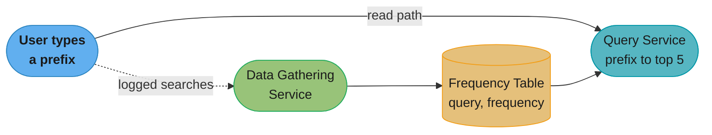
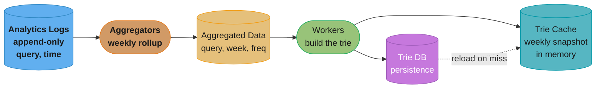
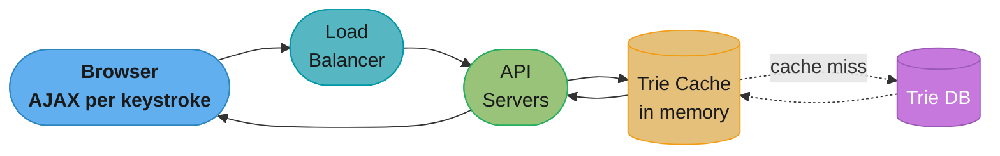
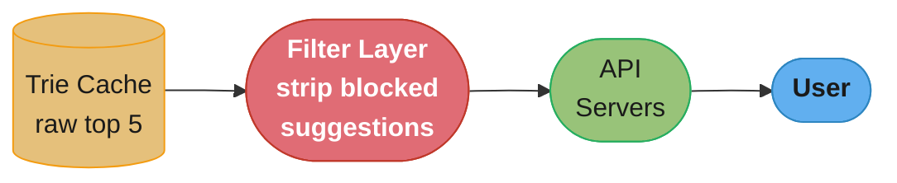
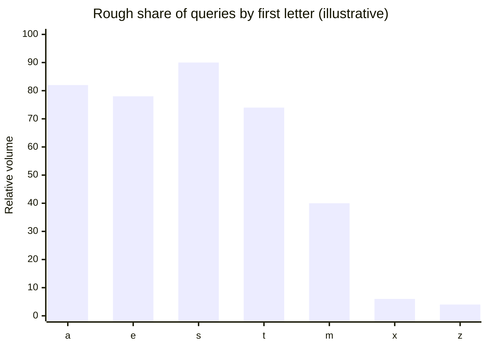
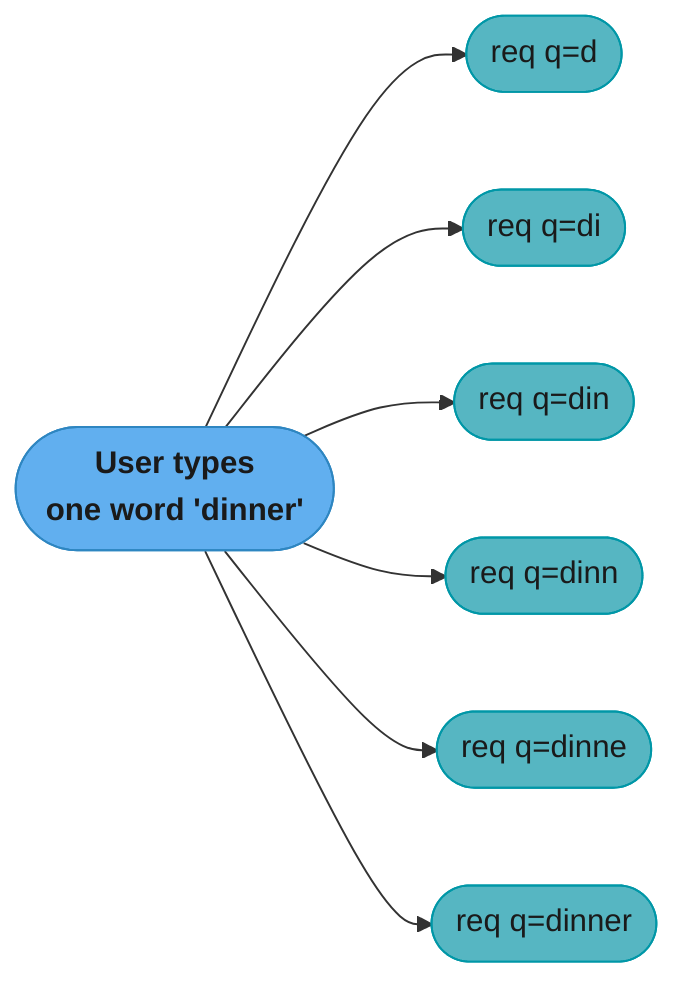
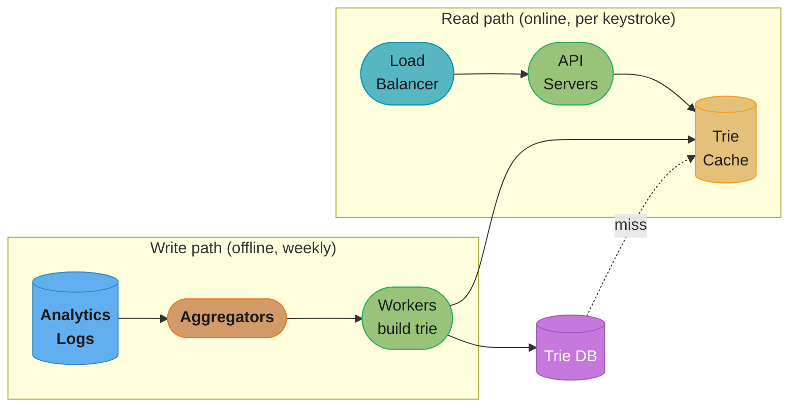

# Chapter 13: Design A Search Autocomplete System

> Ch 13 of 16 · System Design Interview Vol 1 (Xu) · builds on Ch 6 (storage) and Ch 9 (analytics pipelines); the trie chapter

## Chapter Map

Search autocomplete — Google's "search as you type", the dropdown of the top few completions that appears the moment you touch the keyboard — is a read-latency problem hiding inside a data-structures problem. Every keystroke is a network request, so at 10M DAU the query path must answer in well under 100 ms while a completely separate offline pipeline chews through billions of raw search logs to decide *which* completions are worth showing. The chapter's whole arc is: pick the right data structure (a **trie**), then make it fast enough by pre-computing answers (**cache the top-k at every node**), then feed it from an **asynchronous batch pipeline** rather than trying to update it live.

**TL;DR:**
- The naive `WHERE query LIKE 'prefix%' ORDER BY frequency LIMIT 5` works on a laptop and dies at scale — a prefix scan over billions of rows can't hit a sub-100 ms budget. A **trie** turns "find everything under a prefix" into a short walk down the tree.
- A raw trie is still too slow in the worst case (a 1-character prefix means traversing and sorting the *entire* subtree), so the two moves that matter are: **limit the max prefix length** (prefix lookup becomes O(1)) and **cache the top 5 queries at every node** (the whole query becomes two O(1) lookups). You trade a lot of memory for near-constant reads.
- Do **not** update the trie on every keystroke — there are billions of queries a day and the top suggestions barely move. Build the trie **weekly** (or in tighter windows for Twitter-like freshness) with an offline pipeline: analytics logs → aggregators → workers → trie cache + trie DB.
- **Sharding by first character is a trap** — far more queries start with `a`/`e` than `x`/`z`, so a naive 26-way split is badly lopsided. A **shard-map manager** built from historical distribution balances the load.

## The Big Question

> "Every letter the user types is a request, and they expect the dropdown to feel instant. How do I return the 5 most-popular completions of a prefix in under 100 ms, at tens of thousands of requests per second, when the corpus is billions of historical queries — and keep that corpus reasonably fresh without melting the write path?"

Analogy: autocomplete is a **card catalog that reorders itself by popularity**. You don't scan every book (the SQL `LIKE` scan) each time someone walks up to the drawer labeled "tr"; instead the drawer already has an index card pinned to the front listing the five most-checked-out titles starting with "tr" (the cached top-k). Refilling those pinned cards is a slow, back-office job done once a week (the batch pipeline), not something you redo every time a patron opens the drawer.

The tension the whole chapter navigates: **reads must be near-instant and constant-time, but the data behind them is huge and changes constantly.** The resolution is to split the system cleanly into a fast read path (trie + cache) and a slow write path (offline aggregation), and never let the two contend.

---

## 13.1 Step 1 — Understand the Problem and Establish Design Scope

Autocomplete looks trivial ("just show suggestions") and hides a lot of scope. The first job in the interview is to pin down exactly which behavior we are building, because each clarification removes a large chunk of work.

### Functional requirements (the clarifying dialogue)

The book resolves the ambiguity with a short back-and-forth. The agreed scope:

- **Match only at the *beginning* of the query.** If the user types `dinner`, we suggest `dinner party`, `dinner recipes` — completions that *start with* `dinner`. We do **not** do middle-of-string matching (`happy dinner` is not a candidate for the prefix `dinner`). This is the single most scope-shrinking decision: it makes a **prefix tree (trie)** the natural fit.
- **Return exactly 5 suggestions.** The number is a product decision; the design must return the *top* 5.
- **Rank by popularity** — specifically by the **historical frequency** with which each query has been searched. The most-searched matching queries come first.
- **No spell check / autocorrect.** The system assumes correctly-spelled input; we do not fix typos or offer "did you mean".
- **English only** to start (the design notes multi-language as an extension in Step 4).
- **Lowercase, a–z only.** Every query is lowercase Latin letters. This means each trie node has at most 26 children — a clean, bounded fan-out. (Uppercase, digits, and Unicode are deferred.)

### Non-functional requirements

- **Low latency.** The dropdown must feel instant. The book cites a study of Facebook's typeahead system putting the budget at roughly **100 ms** end-to-end; slower than that and the suggestions arrive after the user has already typed the next character, which is useless.
- **Relevant** — suggestions must actually match the prefix and be genuinely popular.
- **Sorted** — results ordered by frequency (popularity), highest first.
- **Scalable** — handle the traffic volume computed below.
- **Highly available** — the search box is the front door; if autocomplete is down the whole product feels broken.

### Back-of-the-envelope estimation

The scale numbers drive every later decision, so walk the arithmetic explicitly.

**Assumptions:**
- **10 million DAU.**
- Each user performs **~10 searches per day.**
- **~20 bytes of data per query string.** Justification: assume UTF-8/ASCII at 1 byte per character; assume an average query is 4 words of ~5 characters each → `4 × 5 = 20` characters → **20 bytes**.

**The keystroke multiplier (the number everyone forgets):** autocomplete sends **a request for every character typed**, not one request per finished query. Typing `dinner` fires six requests as the prefix grows:

```
search?q=d
search?q=di
search?q=din
search?q=dinn
search?q=dinne
search?q=dinner
```

So a 20-character query generates roughly **20 requests**, not 1. This 20× amplification is the whole reason autocomplete is a high-QPS system.

**Average QPS:**

```
requests/day = DAU × searches/day × chars/query (= requests/query)
             = 10,000,000 × 10 × 20
             = 2,000,000,000  requests/day  (2 billion)

QPS = 2,000,000,000 / (24 × 3600)
    = 2,000,000,000 / 86,400
    ≈ 23,148
    ≈ 24,000 QPS
```

**Peak QPS** — assume peak is about **2×** the average:

```
peak QPS ≈ 2 × 24,000 = 48,000 QPS
```

**In plain terms.**

> "Autocomplete is not a search system with a dropdown bolted on — it is a system that receives
> one request per *character*, so it runs at roughly the length of an average query times the
> traffic of the search box it decorates."

That single multiplier is the chapter's signature number and the reason autocomplete is harder
to serve than search itself: the same users, the same intent, twenty times the requests.

| Symbol | What it is |
|--------|------------|
| DAU | daily active users — 10,000,000 |
| `s` | searches per user per day — 10 |
| `Q` | finished searches per day = DAU x `s` |
| `L` | average query length in characters — 4 words x 5 chars = 20 |
| `A` | keystroke amplification: requests per finished search = `L` |
| `QPS` | average autocomplete requests/second = `Q` x `A` / 86,400 |
| `P` | peak factor — the chapter assumes 2x |

**Walk one example.**

```
Step 1  finished searches per day
        DAU                             = 10,000,000 users
        s                               = 10 searches/user/day
        Q   = 10,000,000 x 10           = 100,000,000 searches/day

Step 2  what search alone would cost
        100,000,000 / 86,400            = 1,157 searches/second
        (this is the number you get if you FORGET the keystroke multiplier)

Step 3  the keystroke amplification
        L                               = 20 characters/query
        A   = one request per character = 20 requests/search
        typing "dinner" (6 chars)       = 6 requests: d, di, din, dinn, dinne, dinner

Step 4  autocomplete request volume
        100,000,000 x 20                = 2,000,000,000 requests/day

Step 5  average autocomplete QPS
        seconds/day = 24 x 3600         = 86,400 s/day
        2,000,000,000 / 86,400          = 23,148 requests/second
        the chapter rounds this to      = 24,000 QPS

Step 6  peak
        P                               = 2x
        2 x 24,000 (chapter's rounding) = 48,000 requests/second
        2 x 23,148 (unrounded)          = 46,296 requests/second

Meaning: search QPS is 1,157/s and autocomplete QPS is 23,148/s off the SAME user
behaviour -- exactly 20x. Size the read tier from the 1,157 and you under-provision
by a factor of twenty, which is a launch-day outage rather than a slow dropdown.
```

`A` is the term that has no analogue in an ordinary search system, and it is the one people
drop. Without it the whole design looks over-engineered: 1,157 QPS against a frequency table is
a workload a single indexed relational database handles comfortably, and there is no reason to
build a trie, cache a top-k on every node, or shard anything. Put `A` back and the same
workload is 23,148 QPS with a 100 ms budget — which is precisely the pressure that forces every
optimization in the deep dive.

**New-data / storage growth:** assume **20% of daily queries are new** (never seen before, so they add to the corpus):

```
new data/day = queries/day × bytes/query × new-query rate
             = (10,000,000 × 10) × 20 bytes × 20%
             = 100,000,000 × 20 × 0.20
             = 400,000,000 bytes
             ≈ 0.4 GB/day  of new query data
```

So roughly **24k QPS average, 48k QPS peak, and ~0.4 GB of new query text added to storage every day.** These three numbers justify (a) needing a data structure faster than a SQL prefix scan, (b) needing a cache in front of it, and (c) needing an offline pipeline and eventual sharding as the corpus grows.

**What it means.**

> "The corpus does not grow with traffic — it grows with *novelty*, so the only queries that
> cost storage are the 20 percent nobody has ever typed before."

Notice which multiplier is deliberately absent: the storage chain uses **searches**
(100,000,000/day), not **requests** (2,000,000,000/day). Keystroke prefixes are traffic, not
data; only the finished, submitted query is ever recorded.

| Symbol | What it is |
|--------|------------|
| `Q` | finished searches per day — 100,000,000 (NOT the 2 billion requests) |
| `z` | bytes per query string — 20 (4 words x 5 chars, 1 byte/char in ASCII) |
| `n` | new-query rate: the share never seen before — 20 percent |
| `G_day` | new query bytes added per day = `Q` x `z` x `n` |

**Walk one example.**

```
Step 1  the right input                            (searches, not requests)
        Q   = 10,000,000 DAU x 10       = 100,000,000 searches/day

Step 2  bytes per query
        4 words x 5 characters          = 20 characters/query
        at 1 byte/character (ASCII)     = 20 bytes/query

Step 3  raw text volume if we stored everything
        100,000,000 x 20 bytes          = 2,000,000,000 bytes/day = 2 GB/day

Step 4  only the NEW queries add to the corpus
        n                               = 0.20
        G_day = 2,000,000,000 x 0.20    = 400,000,000 bytes/day
                                        = 0.4 GB/day

Step 5  the corpus over a year
        0.4 GB/day x 365 days           = 146 GB/year of new query text
                                        = 0.146 TB/year

Meaning: 0.4 GB/day is a rounding error next to 23,148 QPS -- the corpus is tiny
and the read rate is enormous. That asymmetry is the entire argument for spending
memory freely (cached top-k on every node) to buy read latency.
```

The `n` = 20 percent term is what keeps this number small, and it is a statement about language
rather than about the system: query distributions are heavily head-weighted, so four out of five
searches are repeats of something already in the frequency table and cost an increment, not a
row. If `n` were 100 percent the corpus would grow at 2 GB/day — five times faster — and the
weekly rebuild would be chasing a corpus that keeps changing shape.

---

## 13.2 Step 2 — Propose High-Level Design and Get Buy-In

At a high level the system splits into **two services that barely talk to each other** — one writes, one reads. This separation is the backbone of the whole design.



Caption: the read path (Query Service) and the write path (Data Gathering Service) are decoupled by the frequency table — the fast side never waits on the slow side. This split is what lets reads stay near-constant while the corpus is rebuilt behind the scenes.

### Data gathering service

The data gathering service **collects user queries and aggregates them into a frequency table** that records, for each query string, how many times it has been searched. Conceptually it is a two-column table:

| query | frequency |
|-------|-----------|
| twitch | 1 |
| twitter | 2 |
| twillo | 1 |

**Worked example — building the table as users type.** Suppose the search queries arrive in this order: `twitch`, `twitter`, `twitter`, `twillo`. The frequency table is updated incrementally:

```
1. query "twitch"  arrives  ->  twitch = 1
2. query "twitter" arrives  ->  twitch = 1, twitter = 1
3. query "twitter" arrives  ->  twitch = 1, twitter = 2   (increment existing)
4. query "twillo"  arrives  ->  twitch = 1, twitter = 2, twillo = 1
```

The final table has `twitch:1, twitter:2, twillo:1`. Over the full corpus these counts grow large — this is the popularity signal the ranking uses.

### Query service

Given the frequency table above (imagine it now holds real counts), the query service must return the **top 5 most-frequently-searched queries** that start with a given prefix. Suppose the table is:

| query | frequency |
|-------|-----------|
| twitter | 35 |
| twitch | 29 |
| twillo | 10 |
| twist | 4 |
| twitterican | 2 |

For the prefix `tw`, the top 5 in frequency order are `twitter (35), twitch (29), twillo (10), twist (4), twitterican (2)`.

**The naive SQL approach** — with a relational database this is one query:

```sql
SELECT query, frequency
FROM   frequency_table
WHERE  query LIKE 'tw%'
ORDER  BY frequency DESC
LIMIT  5;
```

This is correct and perfectly fine for a small dataset. **It does not scale.** The problem:

- `LIKE 'tw%'` is a **prefix scan**. It can use an index on `query`, but for a short/common prefix it still matches an enormous number of rows.
- `ORDER BY frequency DESC` then has to **sort all those matches** to find the top 5.
- With billions of rows and 48,000 peak QPS, each of which pays this scan-and-sort, the database becomes the bottleneck and blows the 100 ms budget wide open.

The high-level design is agreed, but the query service clearly needs a better data structure than a SQL table. That is the whole subject of the deep dive.

---

## 13.3 Step 3 — Design Deep Dive

The deep dive replaces the SQL table with a **trie**, makes the trie fast with two optimizations, then builds the offline pipeline that fills it, the online path that serves it, the operations that maintain it, and the sharding that scales it.

### Trie data structure

A **trie** (pronounced "try", from re**trie**val; also called a prefix tree) is a tree specialized for string prefix lookups.

- The **root represents the empty string.**
- **Each node stores one character** and has up to 26 children (one per letter a–z, given our lowercase constraint).
- A **path from the root to a node spells a prefix**; a path from the root to a node marked as the *end of a word* spells a complete stored query.
- To support ranking, we **store the frequency at each word/terminal node** — so the leaf (or word-ending) node for `true` also holds `true`'s search count.

**Worked trie** — the book's example stores six queries with these frequencies: `tree: 10`, `true: 35`, `try: 29`, `toy: 14`, `wish: 25`, `win: 50`. As a character-aligned tree (an ASCII use Mermaid cannot draw well — the alignment *is* the information):

```
(root)                              <- empty string
├─ t
│  ├─ r
│  │  ├─ e ── e      "tree"   freq = 10
│  │  ├─ u ── e      "true"   freq = 35
│  │  └─ y           "try"    freq = 29
│  └─ o ── y         "toy"    freq = 14
└─ w
   └─ i
      ├─ s ── h      "wish"   freq = 25
      └─ n           "win"    freq = 50
```

Caption: the path root→t→r→e→e spells `tree`; the frequency lives on the terminal node. Sharing the prefix `t`, `tr` collapses common letters into shared nodes — that shared structure is exactly why prefix lookups are cheap.

**The naive top-k algorithm.** To return the top `k` completions of a prefix `p`:

1. **Find the prefix node** — walk down the trie following each character of `p`. Cost **O(p)** where `p` is the prefix length. (For `tr` on the tree above: root → t → r, landing on the `r` node.)
2. **Traverse the subtree** rooted at the prefix node to collect every complete query beneath it. Cost **O(c)** where `c` is the number of nodes in that subtree. (Under `tr`: `tree 10`, `true 35`, `try 29`.)
3. **Sort the collected queries by frequency** and take the top `k`. Cost **O(c log c)**.

Total: **O(p) + O(c) + O(c log c)**.

**Why that's too slow.** The killer is the worst case on `c`. If the user types a **single character** (say `t`), or the prefix is otherwise very common, the subtree under it can be almost the *entire trie*. Now step 2 traverses a huge subtree and step 3 sorts it — every keystroke. At 48,000 QPS that is hopeless. We need to make both `p` and the per-query work effectively constant.

### The two optimizations

The book applies two optimizations that together collapse the query to near O(1).

**Optimization 1 — Limit the maximum length of a prefix.** Users almost never type a very long prefix before selecting a suggestion; a cap of ~50 characters covers essentially all real usage. Because the prefix length is now bounded by a **small constant**, step 1 ("find the prefix node") drops from **O(p) to O(1)** — walking at most a fixed number of levels is constant work.

**Optimization 2 — Cache the top-k queries at every node.** Instead of computing the top-k by traversing and sorting on each request, **pre-compute and store the top `k` (e.g. top 5) completions directly on every trie node.** Then a query is just: walk to the prefix node (O(1) by optimization 1), and **read its cached top-5 list (O(1))**. The expensive traverse-and-sort is gone from the read path entirely.

With both optimizations the get-top-k cost becomes:

```
Step 1  find the prefix node          O(1)   (prefix length capped)
Step 2  read cached top-5 at the node  O(1)   (list is pre-stored)
------------------------------------------------
Total                                  O(1)
```

The ASCII layout of a single node carrying its cached list (again, alignment carries the meaning):

```
Prefix node reached by walking  t -> r      (represents prefix "tr")
+------------------------------------------------+
| char       : 'r'                               |
| is_word    : false                             |
| children   : { e, u, y }                       |
| top_5 cache: [ true 35, try 29, tree 10 ]      |  <- pre-computed, sorted
+------------------------------------------------+

Query "tr"  ->  walk t,r  (O(1), length capped)  ->  return top_5  (O(1))
```

Caption: every node stores its own answer, so the request never traverses the subtree at read time — it just reads the pinned list.

**Worked cached top-k for the example trie.** Take the six-query trie above (`tree:10, true:35, try:29, toy:14, wish:25, win:50`). After the workers build it, the cached list at each *prefix* node is the top completions of that prefix, sorted by frequency:

| prefix node | reachable queries | cached top-k (sorted by freq) |
|-------------|-------------------|-------------------------------|
| `t` | tree 10, true 35, try 29, toy 14 | `true 35, try 29, toy 14, tree 10` |
| `tr` | tree 10, true 35, try 29 | `true 35, try 29, tree 10` |
| `tre` | tree 10 | `tree 10` |
| `to` | toy 14 | `toy 14` |
| `w` | wish 25, win 50 | `win 50, wish 25` |
| `wi` | wish 25, win 50 | `win 50, wish 25` |

Now a request for prefix `t` returns `[true, try, toy, tree]` by reading the `t` node's list directly — no traversal of the four descendants, no sort. Notice the cache at `t` is *not* in trie order; it is popularity order, which is exactly the ranking the product wants and exactly what a live traversal would otherwise have to recompute every keystroke.

**The tradeoff — space.** Caching the top 5 at *every* node multiplies storage: each node now carries up to 5 query strings (plus frequencies) in addition to its character and child pointers. This is the classic **space-for-time trade**: we accept a much larger trie in memory to buy constant-time reads. For an autocomplete system — read-dominated, latency-critical, and only rebuilt weekly — that trade is exactly right.

**What the formula is telling you.**

> "A trie's size is unique queries times their average length, discounted by how much prefix
> the queries share — and the top-k cache then multiplies whatever that comes to."

Working the two halves separately is the point: the base trie is small enough to be
uninteresting, and the cache is what actually decides whether the structure fits in RAM.

| Symbol | What it is |
|--------|------------|
| `U` | unique query strings in the corpus |
| `L` | average query length — 20 characters |
| `sigma` | prefix-sharing factor: fraction of `U` x `L` that survives as distinct nodes |
| `V` | trie nodes = `U` x `L` x `sigma` |
| `bpn` | bytes per bare node: the character, the word flag, and the child map |
| `k` | cached completions per node — 5 |
| `c` | bytes of cache per node = `k` x (query string + frequency) |

**Walk one example.**

```
Step 1  upper bound on nodes                       (U and sigma are assumptions)
        U                               = 100,000,000 unique queries
        L                               = 20 characters/query
        U x L = 100,000,000 x 20        = 2,000,000,000 nodes if NOTHING is shared

Step 2  discount for shared prefixes
        sigma (every prefix is reused)  = 0.30
        V = 2,000,000,000 x 0.30        = 600,000,000 actual trie nodes

Step 3  the bare trie
        bpn: 1 B char + 1 B word flag + ~38 B child map/pointers
                                        = 40 bytes/node
        600,000,000 x 40 bytes          = 24,000,000,000 bytes = 24 GB

Step 4  the top-k cache on top of it
        per cached entry: 20 B string + 4 B frequency
                                        = 24 bytes/entry
        c = 5 entries x 24 bytes        = 120 bytes/node
        600,000,000 x 120 bytes         = 72,000,000,000 bytes = 72 GB

Step 5  the total, and what the cache cost
        24 GB + 72 GB                   = 96 GB of trie
        overhead factor = 160 / 40      = 4x the bare trie

Meaning: caching the top 5 everywhere makes the structure FOUR TIMES larger --
24 GB becomes 96 GB -- and buys, in exchange, the removal of an O(c log c) sort
from a path executed 23,148 times per second. At 96 GB the trie no longer fits
one commodity box, which is exactly how the space-for-time trade leads directly
into the sharding section.
```

Two things are worth noticing about where the memory actually goes. First, `sigma` is doing real
work: without prefix sharing the trie would be 2 billion nodes and 320 GB, and sharing is the
only reason a trie beats storing every query independently. Second, the cache is **3x the bare
structure**, not a rounding on top of it — 72 GB versus 24 GB — because a 24-byte cache entry
dwarfs a 1-byte character. That is why the top-k is capped at 5 and not 50: `k` scales the
dominant term linearly, so `k` = 50 would mean 1,200 bytes/node and roughly 744 GB.

### Data gathering service (deep dive)

The naive idea is to **update the trie in real time on every search.** It is wrong for two reasons:

1. **Volume.** There are **billions of queries per day.** Updating the shared trie on every keystroke would create a colossal write load and lock contention on a structure that is being read at 48,000 QPS.
2. **It's unnecessary.** Once the trie is built, **the top suggestions rarely change** — the most popular queries for `tw` today are almost certainly the most popular tomorrow. Recomputing them constantly buys nothing.

So the trie is built **asynchronously and periodically** (weekly for most cases; tighter windows for real-time-ish products like Twitter search). The pipeline:



Caption: raw logs are aggregated weekly, workers rebuild the trie from the aggregate, and the finished trie lands in both the persistent Trie DB and the in-memory Trie Cache — the entire write path runs offline, never on the request hot path.

Component by component:

- **Analytics logs.** Raw, **append-only** record of every search: `(query, timestamp)` rows. Unindexed and unaggregated — just the firehose. Example rows: `tree, 2019-10-01 22:01:01` / `try, 2019-10-01 22:01:05` / `tree, 2019-10-02 …`. Append-only means writes are cheap and the log is the source of truth for the pipeline.
- **Aggregators.** The raw log is huge and not query-ready, so aggregators **roll it up on a schedule.** For most cases the window is **weekly**; for products that need fresher suggestions the window shrinks (real-time-ish aggregation). This is where the frequency counts are actually computed.
- **Aggregated data table.** The aggregator output: `(query, time/week, frequency)`. Example: `twitch, 2019-week01, 100` / `twitter, 2019-week01, 300`. This compact table — not the raw log — is what the workers consume.
- **Workers.** A set of servers that run the **asynchronous build job at regular intervals.** They read the aggregated data, **build the trie** (assigning each node its frequency and its cached top-5), and write the result to the Trie DB and Trie Cache.
- **Trie cache.** A **distributed in-memory cache** holding the current trie for fast reads. It is a **weekly snapshot** — refreshed from the Trie DB each build. This is what the query service actually reads.
- **Trie DB.** The **persistent** home of the trie, so it survives cache eviction/restart. Two ways to store it:
  1. **Document store.** Since a fresh trie is built weekly, periodically **serialize the whole trie** into a blob and store it as a document (e.g. in MongoDB). Simple: one serialized artifact per build.
  2. **Key-value store.** Represent the trie as a **hash map from prefix → top-k list.** Every prefix in the trie becomes a key; its value is the pre-computed top-k. For example:

     ```
     key: "tr"    value: [ "true", "try", "tree" ]
     key: "tri"   value: [ "trie", "tried", "triangle" ]
     key: "be"    value: [ "best", "bet", "bee", "beer", "bear" ]
     key: "bee"   value: [ "beer", "beef", "been", "bees", "beet" ]
     ```

     Reads become a single key lookup — a natural fit for a key-value store (see [Ch 6 — Design A Key-Value Store](../06_design_a_key_value_store/README.md)).

### Query service (deep dive)

The improved read path replaces the SQL query with a cache-fronted trie lookup:



Caption: the request hits the load balancer, an API server reads the cached trie for the prefix's top-5, and only a cache miss ever touches the durable Trie DB — the common path is entirely in-memory.

The flow:

1. A search request (a prefix) goes to the **load balancer**.
2. The LB routes it to an **API server**.
3. The API server gets the prefix's **top-k from the Trie Cache** and builds the suggestion list.
4. On a **cache miss**, the API server reloads from the **Trie DB** into the cache, then serves.

**End-to-end walkthrough of one keystroke** (user types the `r` in `tr`, budget ~100 ms):

```
1. Browser fires AJAX  GET /search?q=tr   (page does not reload)
2. Browser cache check: is "tr" cached and < 1h old?
      hit  -> return locally, 0 network cost, done
      miss -> continue
3. Request reaches the Load Balancer, routed to an API server
4. API server asks the Trie Cache for prefix "tr"
      hit  -> cache returns cached top_5  [true, try, tree]   (O(1), in-memory)
      miss -> API server reads Trie DB, repopulates the cache, then returns
5. Filter layer strips any blocked suggestions from the list
6. API server returns JSON  ["true","try","tree"]  to the browser
7. Browser renders the dropdown and caches the response (max-age 3600)
```

Caption: on the common path the request never leaves memory — browser cache, then Trie Cache — which is how the design holds the sub-100 ms budget at 48k peak QPS; only a cold cache miss ever touches durable storage.

**Optimizations to shave the last milliseconds:**

- **AJAX requests.** The browser fires suggestion requests **asynchronously**, so the page never reloads and the input box stays responsive while results stream in.
- **Browser caching.** Because suggestions change slowly, the **browser itself caches them.** Google's search returns a response header like:

  ```
  cache-control: private, max-age=3600
  ```

  - `private` — only the **user's browser** may cache this, not a shared proxy/CDN (results can be personalized).
  - `max-age=3600` — the cached suggestions are valid for **3600 seconds = 1 hour**, so repeated prefixes within the hour are answered locally with **zero network cost**.
- **Data sampling.** Logging *every* one of the 2 billion daily requests is wasteful in CPU and storage. Instead, **log only 1 out of every N requests** (sampling). The popularity ranking is statistical, so a representative sample is enough and the analytics-log volume drops by a factor of N.

**Read it like this.**

> "Ranking is a question about *proportions*, and proportions survive sampling intact — so
> keeping 1 row in `N` costs you nothing you were going to use and saves you a factor of `N`."

The framing matters because sampling feels like data loss until you notice what the trie
actually consumes: an ordering, not a count. A query that is twice as popular as another is
still twice as popular in a 1-in-1000 sample.

| Symbol | What it is |
|--------|------------|
| `R_day` | raw autocomplete requests per day — 2,000,000,000 |
| `N` | sampling denominator: keep 1 request in every `N` |
| `r` | bytes per analytics-log row — `(query, timestamp)`, ~30 B |
| `L_day` | logged rows per day = `R_day` / `N` |
| `B_day` | analytics-log bytes per day = `L_day` x `r` |

**Walk one example.**

```
Step 1  the unsampled firehose
        R_day                           = 2,000,000,000 requests/day
        r: 20 B query + ~10 B timestamp = 30 bytes/row
        B_day = 2,000,000,000 x 30      = 60,000,000,000 bytes/day = 60 GB/day

Step 2  sample 1 in 10
        L_day = 2,000,000,000 / 10      = 200,000,000 rows/day
        B_day = 200,000,000 x 30        = 6,000,000,000 bytes/day = 6 GB/day

Step 3  sample 1 in 100
        L_day = 2,000,000,000 / 100     = 20,000,000 rows/day
        B_day                           = 600,000,000 bytes/day = 0.6 GB/day

Step 4  sample 1 in 1000
        L_day = 2,000,000,000 / 1,000   = 2,000,000 rows/day
        B_day                           = 60,000,000 bytes/day = 0.06 GB/day

Step 5  the yearly bill, unsampled versus 1-in-1000
        60 GB/day x 365                 = 21,900 GB/year = 21.9 TB/year
        0.06 GB/day x 365               = 21.9 GB/year
        saved                           = 999/1000 of the volume

Meaning: 1-in-1000 sampling turns a 21.9 TB/year analytics log into a 21.9 GB one
-- small enough that the weekly aggregation job reads it in minutes -- while the
head queries, which are searched millions of times, still land thousands of rows
each and rank in exactly the same order.
```

Where sampling does bite is the **tail**, and it is worth being precise about the failure mode.
A query searched 1,000 times a day contributes 1 row at `N` = 1000 — enough to know it exists,
not enough to rank it stably; a query searched twice a day almost certainly contributes zero and
vanishes from the corpus entirely. That is acceptable here because the product only ever shows
the **top 5**, which are drawn from the head by construction — but it is exactly why the same
trick would be wrong for a system that has to report exact search counts.

### Trie operations — create, update, delete

**Create.** The trie is **created by the workers** from the aggregated data (Analytics Logs → aggregated table → worker build). Nothing builds it on the request path.

**Update.** Two options:

1. **Rebuild the whole trie weekly (preferred).** Build a brand-new trie from the latest aggregated data and **swap it in** to replace the old one. Simple, and because it is offline it never disturbs reads.
2. **Update individual nodes in place (avoid).** Directly editing a node is deceptively expensive because of the cached top-k: changing one word's frequency can change the top-5 of **every ancestor on the path back to the root**, so you must **walk up the ancestor chain updating each node's cached list.**

   ```
   Update: "beer" frequency 10 -> 30      (path root -> b -> e -> e -> r)
   Must re-evaluate cached top_5 at every ancestor node:

     node "beer" : recompute top_5   (the word node itself)
     node "bee"  : maybe reorder top_5   (beer may now rank higher)
     node "be"   : maybe reorder top_5
     node "b"    : maybe reorder top_5
     node root   : maybe reorder top_5

   One word change  ->  O(depth) ancestor updates, each a top_5 re-sort.
   ```

   Multiply that by millions of frequency changes per rebuild window and in-place updates are far more expensive than just rebuilding. Hence: **rebuild, don't patch.**

**Delete.** Some suggestions are **hateful, dangerous, sexually explicit, or otherwise policy-violating** and must not surface even if they are popular. Removing them from the DB is asynchronous and slow, so we don't rely on it for the request path. Instead, insert a **filter layer between the Trie Cache and the API servers**: the cache returns the raw top-k, the filter strips any blocked entries, and the API server returns the cleaned list. This gives **immediate** removal from user-facing results while the **physical deletion from the Trie DB happens asynchronously** in the background.



Caption: the filter layer sits between cache and API so blocked suggestions are removed from results instantly, decoupled from the slow asynchronous cleanup of the underlying Trie DB.

### Scale the storage (sharding)

As the corpus grows past one machine, the trie must be **sharded**.

**Naive approach — shard by first character.** Put all queries starting with `a` on shard 1, `b` on shard 2, …, `z` on shard 26. At most 26 shards.

**Why it fails — lopsided load.** The first-letter distribution of English is **wildly uneven.** Far more queries start with `a`, `e`, `s`, `t` than with `x`, `q`, `z`. A single-character split leaves the `s` shard buried while the `x` shard is nearly idle:



Caption: a naive 26-way first-letter shard would give the `s` shard more than ten times the load of the `x` shard — the imbalance is the whole reason a smarter mapping is needed.

**Smart sharding — a shard-map manager.** Introduce a **shard-map manager**: a lookup service (backed by its own small database) that records **which prefixes live on which shard**, sized from the **historical query distribution**. Because `s` alone might carry as many queries as `u, v, w, x, y, z` combined, the map can give **`s` its own dedicated shard** while **grouping `u`–`z` onto a single shard** — balancing bytes and QPS across machines instead of across letters. New shards and rebalancing are just updates to this map.

```
First-letter volume (historical)  ->  shard assignment via shard-map manager

  's'                 ~= 'u'+'v'+'w'+'x'+'y'+'z'      (roughly equal totals)
  -----------------------------------------------------------------
  shard 1: 'a'        shard 2: 'e'        shard 3: 's'   (hot letters solo)
  shard 4: 'u'..'z'   (six cold letters share one shard)   ...
```

Caption: the map assigns hot single letters their own shards and folds many cold letters together, so every shard carries a comparable slice of the total — the balance a first-letter hash can never achieve.

**Put simply.**

> "Shard count is not a design preference — it is the trie's size divided by what one box can
> hold, cross-checked against peak QPS divided by what one box can serve, and you take whichever
> number is larger."

Computing both bounds separately is the habit that matters: a memory-bound trie and a
QPS-bound trie want different shard counts, and sizing on only one of them silently
under-provisions the other.

| Symbol | What it is |
|--------|------------|
| `T` | total trie size — 96 GB from the top-k arithmetic above |
| `mem_box` | usable trie memory per shard server, after OS and process overhead |
| `S_mem` | memory-bound shard count = ceil(`T` / `mem_box`) |
| `peak` | peak autocomplete QPS — 48,000 |
| `qps_box` | requests/second one shard can serve within the 100 ms budget |
| `S_qps` | throughput-bound shard count = ceil(`peak` / `qps_box`) |
| `S` | shards actually provisioned = max(`S_mem`, `S_qps`) |

**Walk one example.**

```
Step 1  the memory bound
        T                               = 96 GB of trie (24 GB base + 72 GB cache)
        mem_box                         = 16 GB usable/shard
        S_mem = ceil(96 / 16)           = 6 shards
        cross-check: 32 GB boxes        -> ceil(96/32) = 3 shards
                     64 GB boxes        -> ceil(96/64) = 2 shards

Step 2  the throughput bound
        peak                            = 48,000 requests/second
        qps_box (in-memory top-k read)  = 10,000 requests/second/shard
        S_qps = ceil(48,000 / 10,000)   = 5 shards
        if a shard only holds 5,000/s   -> ceil(48,000/5,000) = 10 shards

Step 3  take the larger
        S = max(S_mem = 6, S_qps = 5)   = 6 shards       (memory-bound here)

Step 4  what each shard then carries
        nodes: 600,000,000 / 6          = 100,000,000 trie nodes/shard
        bytes: 96 GB / 6                = 16 GB/shard
        load:  48,000 / 6               = 8,000 requests/second/shard

Step 5  what naive first-letter sharding would do to that
        target per shard (even split)   = 16 GB and 8,000 requests/second
        the 's' shard, at ~15x the 'x' shard's share, takes multiples of its
        target while the 'x' shard idles -- the fleet is sized for the hottest
        shard, so the other five are bought and not used

Meaning: six balanced shards is a 16 GB, 8,000 QPS machine each -- ordinary
hardware. Six LETTER-based shards is one machine on fire and five asleep, and
you still have to buy the whole fleet. The shard-map manager is what converts
the first arithmetic into the second's cost.
```

The `max()` in step 3 is the term people skip. Size on memory alone and a 2-shard 64 GB layout
looks efficient right up until 48,000 QPS lands on two boxes rated for 10,000 each. Size on QPS
alone and 5 shards fits the traffic but not the 96 GB of trie, so every shard starts spilling to
the Trie DB and the cache-miss path — the one the design works hardest to avoid — becomes the
common path.

---

## 13.4 Step 4 — Wrap Up

Additional talking points the interviewer may raise once the core design is agreed:

### Multi-language support

To handle non-English queries, **store Unicode characters in the trie nodes** instead of restricting to a–z. A node's children are then keyed by Unicode code points rather than 26 fixed slots. The trie structure and the top-k caching are unchanged; only the alphabet grows.

### Country-specific top queries

Top queries **differ by country/market** — the popular completions of `foot` in the US are not those in the UK. Solution: **build a separate trie per country** from that country's own logs, and **serve tries from CDNs** (edge locations close to each market) to cut network latency. Each region's users hit a nearby CDN holding their region's trie.

### Real-time / trending suggestions

The current design is **explicitly not real-time.** The book is candid that a weekly (or even hourly) batch pipeline **cannot surface a query that is spiking right now** — trending topics, breaking news, a sudden viral term. Real-time autocomplete is a hard, largely separate problem; the chapter sketches directions rather than a full solution:

- **Reduce the working set** with sharding so the hot, recent data is small enough to update quickly.
- **Change the ranking model** to weight **recency** — give recent searches more influence than old ones so trending terms rise fast.
- **Process data as streams.** Real-time data arrives as a stream, so the batch tools give way to stream-processing infrastructure: **Apache Hadoop MapReduce**, **Apache Spark Streaming**, **Apache Storm**, **Apache Kafka**, and stores like **Apache Cassandra** for the fast-moving state.

These are name-drops, not a design — the honest interview answer is "here is why the batch design can't do it, and here are the levers I'd pull to build a separate real-time path."

---

## Visual Intuition

The keystroke amplification — why autocomplete is a *high-QPS* system and not a low-traffic feature — visualized as the request fan-out of a single typed word:



Caption: one 20-character query becomes ~20 separate requests, so 10M users × 10 searches/day balloons to ~2 billion requests/day (~24k QPS, ~48k peak) — the amplification is the reason the read path must be O(1).

The end-to-end split of read vs write paths — the two halves that never contend — as a single picture:



Caption: the slow offline write path (left) rebuilds the trie weekly and hands it to the cache; the fast online read path (right) only ever reads that cache — decoupling is what keeps reads at O(1) while the corpus churns.

---

## Key Concepts Glossary

- **Autocomplete / typeahead / search-as-you-type** — showing the top completions of a prefix as the user types.
- **Prefix matching** — matching only at the *start* of the query (`dinner` → `dinner party`), not the middle.
- **Trie (prefix tree)** — tree where the root is the empty string, each node is a character, and a root-to-word path spells a stored query.
- **Terminal / word node** — a trie node marking the end of a complete query; stores that query's frequency.
- **Frequency (popularity) ranking** — ordering suggestions by how often each query has historically been searched.
- **Frequency table** — two-column `(query, frequency)` aggregate the data-gathering service maintains.
- **Cached top-k** — the pre-computed top `k` completions stored on *every* trie node so reads are O(1).
- **Max prefix length limit** — capping prefix length (~50) so finding the prefix node is O(1).
- **Keystroke amplification** — one N-character query producing ~N requests (one per character).
- **Analytics logs** — append-only raw `(query, timestamp)` record; source of truth for the pipeline.
- **Aggregators** — jobs that roll raw logs into `(query, week, frequency)` counts (weekly, or tighter).
- **Aggregated data table** — the compact `(query, time, frequency)` output aggregators feed to workers.
- **Workers** — servers that asynchronously build the trie from aggregated data at intervals.
- **Trie cache** — distributed in-memory copy of the current trie (weekly snapshot); what queries read.
- **Trie DB** — persistent trie storage: document store (serialized trie) or key-value store (prefix → top-k).
- **Filter layer** — component between cache and API that strips blocked/hateful suggestions instantly.
- **Data sampling** — logging only 1 in N requests to cut analytics volume while preserving ranking signal.
- **`cache-control: private, max-age=3600`** — browser-only cache of suggestions for 1 hour.
- **Shard-map manager** — service mapping prefixes to shards based on historical distribution, for balance.
- **Naive first-letter sharding** — splitting by first character (a–z); lopsided because letter frequencies differ.
- **Unicode trie** — trie whose nodes hold Unicode code points, for multi-language support.

---

## Tradeoffs & Decision Tables

| Query approach | Read latency | Scales to billions? | Notes |
|----------------|--------------|---------------------|-------|
| SQL `LIKE 'p%' ORDER BY freq LIMIT 5` | Slow (prefix scan + sort) | ✗ | Fine on a laptop; dies at 48k QPS |
| Raw trie (traverse + sort per query) | O(p)+O(c)+O(c log c) | ✗ | Worst case (1-char prefix) traverses whole subtree |
| Trie + capped prefix + cached top-k | O(1) | ✓ | The chosen design; costs memory |

| Trie DB storage option | Representation | Read shape | Best when |
|------------------------|----------------|------------|-----------|
| Document store | Serialized whole-trie blob per weekly build | Load & deserialize snapshot | Simple weekly rebuild-and-swap |
| Key-value store | Hash map `prefix → top-k` | Single key lookup | Want direct per-prefix reads (see Ch 6) |

| Update strategy | Cost | Verdict |
|-----------------|------|---------|
| Weekly full rebuild + swap | Offline, off the hot path | ✓ Preferred |
| In-place node update | O(depth) ancestor top-k re-sorts per change | ✗ Avoid — too expensive at scale |

| Sharding strategy | Balance | Verdict |
|-------------------|---------|---------|
| By first character (a–z) | Lopsided (`s`,`e` ≫ `x`,`z`) | ✗ |
| Shard-map manager (historical distribution) | Even bytes/QPS per shard | ✓ |

| Freshness need | Aggregation window | Feasible with this design? |
|----------------|--------------------|-----------------------------|
| Typical search | Weekly batch | ✓ |
| Twitter-like | Tighter windows | ✓ (with cost) |
| Trending / breaking-now | Real-time stream | ✗ core design; needs a separate streaming path |

---

## Common Pitfalls / War Stories

- **Forgetting the keystroke multiplier in capacity math.** Estimating "10M users × 10 searches = 100M requests/day" **undercounts by ~20×** — every character is a request, so the real figure is ~2 billion/day and ~48k peak QPS. Under-provisioning the read tier by 20× is a launch-day outage.
- **Shipping the SQL `LIKE` query to production.** It benchmarks fine on a small table and then collapses under a common short prefix that matches millions of rows, blowing the 100 ms budget. The trie + cached top-k exists precisely to replace it.
- **Updating the trie on every search.** Billions of writes/day against a structure being read at 48k QPS creates lock contention and cache churn for **no benefit** — the top suggestions barely move hour to hour. Rebuild weekly instead.
- **Patching trie nodes in place.** Changing one word's frequency forces a top-k re-sort at every ancestor up to the root; done for millions of changes it dwarfs the cost of a clean rebuild-and-swap. Always rebuild.
- **Sharding by first letter.** The `s`/`e`/`t` shards melt while `x`/`z` sit idle. Use a shard-map manager keyed on the historical distribution so hot letters get dedicated shards and cold letters share one.
- **Relying on DB deletion to hide toxic suggestions.** Physical deletes are asynchronous and slow; a policy-violating query stays visible for hours. Put a **filter layer** between cache and API so it disappears from results immediately.
- **Logging every request.** At 2 billion/day, full logging burns storage and CPU for a ranking that only needs a representative sample — use 1-in-N data sampling.
- **Promising real-time trending on a batch design.** The pipeline fundamentally can't surface a term spiking right now; claiming otherwise is the classic overreach. State the limitation and describe a separate streaming path (recency-weighted ranking, Kafka/Spark Streaming).

---

## Real-World Systems Referenced

- **Google Search** autocomplete — the `cache-control: private, max-age=3600` browser-caching example and AJAX-per-keystroke behavior.
- **Facebook typeahead** — the ~100 ms response-time budget cited in the requirements.
- **MongoDB** — example document store for the serialized-trie storage option.
- **Apache Hadoop (MapReduce), Apache Spark Streaming, Apache Storm, Apache Kafka, Apache Cassandra** — the stream-processing / storage stack named for a real-time trending extension.
- **CDNs** — serving country-specific tries from edge locations near each market.

---

## Summary

Search autocomplete is a **read-latency system built on top of a data-structure choice.** Because every keystroke is a request, 10M DAU generates ~2 billion requests/day (~24k QPS average, ~48k peak) and every one must answer in well under 100 ms. A relational `WHERE query LIKE 'prefix%' ORDER BY frequency LIMIT 5` is correct but scans and sorts too much to scale, so the query service is built on a **trie**: root = empty string, each node a character, **frequency stored at word nodes**. A raw trie is still O(p)+O(c)+O(c log c) with a brutal worst case when the prefix is short, so two optimizations make it O(1): **cap the max prefix length** (prefix lookup → O(1)) and **cache the top-k on every node** (read → O(1)), trading memory for speed. The trie is filled by an **offline pipeline** — analytics logs → aggregators (weekly) → aggregated table → workers → Trie Cache + Trie DB — never updated per keystroke, because volume is enormous and top suggestions barely change. The **query path** is LB → API servers → Trie Cache (→ Trie DB on miss), sped further by AJAX, an hour-long browser cache, and 1-in-N data sampling. **Updates** are done by full weekly rebuild (in-place node edits cascade top-k re-sorts up every ancestor), **deletes** by a filter layer between cache and API (with async DB cleanup), and **storage scales** via a shard-map manager keyed on historical letter distribution rather than a lopsided first-letter split. Extensions — Unicode tries for multi-language, per-country tries on CDNs, and a recency-weighted streaming path for trending — round out the design, with the honest caveat that real-time trending is a separate problem the batch pipeline cannot solve.

---

## Interview Questions

**Q: Why cache the top-k queries at every trie node instead of computing them on each request?**
Because it turns the query from a subtree traversal-and-sort into a single O(1) read. Without the cache, answering a prefix means walking every descendant node and sorting them by frequency (O(c) + O(c log c)), which explodes when the prefix is short and its subtree is huge. Storing the pre-computed top 5 on every node means a request just walks to the prefix node and returns its list. The cost is memory — every node now carries up to five query strings — but for a read-dominated, latency-critical system rebuilt only weekly, that space-for-time trade is exactly right.

**Q: Why is the naive `SELECT ... WHERE query LIKE 'prefix%' ORDER BY frequency LIMIT 5` too slow at scale?**
Because `LIKE 'prefix%'` is a prefix scan that matches a huge number of rows for a common short prefix, and `ORDER BY frequency` then sorts all of them to find the top 5. On a small table it is instant, but over billions of rows at ~48,000 peak QPS the scan-and-sort blows past the ~100 ms latency budget and the database becomes the bottleneck. A trie replaces the scan with a short walk and (with cached top-k) removes the sort entirely.

**Q: Why rebuild the trie weekly instead of updating it in real time on every search?**
Because there are billions of queries per day and the top suggestions barely change from hour to hour, so live updates add enormous write load for essentially no benefit. Updating a shared trie on every keystroke would create lock contention against a structure being read at 48k QPS. The pipeline instead aggregates logs weekly and has workers build a fresh trie offline, then swaps it in — keeping the write load entirely off the read hot path. Products needing more freshness simply shrink the aggregation window.

**Q: Why does sharding the trie by first character fail, and what fixes it?**
It fails because first-letter frequencies are wildly uneven — far more queries start with `a`, `e`, `s`, `t` than `x`, `q`, `z` — so the popular-letter shards are overloaded while others sit idle. The fix is a shard-map manager: a lookup service that assigns prefixes to shards based on the historical query distribution, giving hot letters like `s` their own shard and folding several cold letters (`u`–`z`) onto one. It balances bytes and QPS per shard instead of per letter.

**Q: How do you get ~24,000 QPS from 10M DAU, and what number do people forget?**
You multiply DAU × searches/day × characters/query because every keystroke is a request: 10M × 10 × 20 = 2 billion requests/day, divided by 86,400 seconds ≈ 24,000 QPS. The forgotten factor is the ~20× keystroke amplification — typing a 20-character query fires ~20 requests (`q=d`, `q=di`, `q=din`, …), not one. Omitting it undercounts traffic by 20× and massively under-provisions the read tier. Peak is about double, ~48,000 QPS.

**Q: Why is updating a single trie node in place so expensive?**
Because the cached top-k means changing one word's frequency can change the top-5 of every ancestor node on the path back to the root, forcing a re-sort at each. Bumping `beer` from 10 to 30 may reorder the cached lists at `bee`, `be`, `b`, and the root. One change is O(depth) ancestor updates, and a rebuild window has millions of such changes — far more work than just building a new trie from scratch and swapping it in.

**Q: What is the time complexity of the naive top-k trie algorithm and where is the worst case?**
It is O(p) + O(c) + O(c log c): O(p) to walk the prefix, O(c) to traverse the c-node subtree collecting completions, and O(c log c) to sort them by frequency. The worst case is a very short prefix (say one character) whose subtree is nearly the whole trie, so c is enormous and every keystroke traverses and sorts a huge structure. This is precisely why the design caps prefix length and caches the top-k, collapsing the whole query to O(1).

**Q: What are the two optimizations that make trie lookups fast, and what does each buy?**
Limiting the maximum prefix length and caching the top-k at every node. Capping prefix length (~50 chars) bounds the walk to a small constant, dropping "find the prefix node" from O(p) to O(1). Caching the pre-computed top 5 on every node removes the traverse-and-sort, dropping the answer step to O(1). Together the whole get-top-k operation becomes O(1), at the cost of extra memory for the cached lists on every node.

**Q: How do you remove hateful or policy-violating suggestions quickly?**
Insert a filter layer between the Trie Cache and the API servers that strips blocked entries from the top-k before it is returned. Physically deleting a query from the Trie DB is asynchronous and slow, so relying on it would leave toxic suggestions visible for hours. The filter removes them from user-facing results immediately, while the durable cleanup in the Trie DB happens in the background on its own schedule.

**Q: What are the two ways to store the trie in the Trie DB?**
A document store or a key-value store. In a document store you serialize the entire weekly-built trie into one blob and save it as a document (e.g. MongoDB), which suits the rebuild-and-swap model. In a key-value store you flatten the trie into a hash map from prefix to its top-k list (`"be" → [best, bet, bee, beer, bear]`), so a read is a single key lookup. Both persist the trie so it survives cache eviction or restart.

**Q: Why use AJAX and browser caching, and what does `cache-control: private, max-age=3600` mean?**
AJAX lets the browser fetch suggestions asynchronously so the page never reloads and the input stays responsive per keystroke. Browser caching exploits the fact that suggestions change slowly: `private` means only the user's own browser may cache the response (not a shared proxy/CDN, since results may be personalized), and `max-age=3600` means it stays valid for 3600 seconds — one hour — so repeated prefixes within that hour are answered locally with zero network cost.

**Q: What is data sampling in this system and why is it needed?**
Data sampling means logging only 1 out of every N search requests rather than all of them. At ~2 billion requests/day, logging everything wastes enormous storage and processing power, and the popularity ranking is statistical, so a representative sample yields the same ordering. Sampling cuts analytics-log volume by a factor of N while preserving the frequency signal the trie is built from.

**Q: How would you support multiple languages?**
Store Unicode characters in the trie nodes instead of restricting children to a–z. Each node's children are then keyed by Unicode code points, so any script — Latin, Cyrillic, CJK, and so on — fits the same structure. The trie mechanics, top-k caching, and pipeline are all unchanged; only the alphabet (and thus the fan-out per node) grows beyond 26.

**Q: How do you serve different top queries per country?**
Build a separate trie per country from that country's own search logs, since popular completions differ by market, and serve each region's trie from CDNs at edge locations near its users. Users in a given country hit a nearby CDN holding their country's trie, which both returns locally-relevant suggestions and cuts network latency compared to reaching a central data center.

**Q: Why can't this design handle real-time trending suggestions, and how would you approach it?**
Because the trie is built by a weekly (or at best tighter) batch pipeline that fundamentally cannot surface a query spiking right now, like breaking news or a viral term. To approach it you would build a separate streaming path: reduce the working set with sharding so hot recent data is small, change the ranking to weight recency so new searches rise fast, and process searches as a stream using tools like Kafka, Spark Streaming, Storm, or Cassandra. The honest interview answer states the batch limitation rather than pretending the design covers it.

**Q: What is the frequency table and how is it built?**
It is a two-column `(query, frequency)` aggregate recording how many times each query has been searched, and it is built by the data gathering service incrementally as searches arrive. If `twitch`, `twitter`, `twitter`, `twillo` come in, the table ends up `twitch:1, twitter:2, twillo:1` — each new query is inserted or its count incremented. These counts are the popularity signal that determines suggestion ranking and the frequencies stored at trie word nodes.

**Q: Why limit the maximum prefix length, and is anything lost?**
Because real users almost never type a very long prefix before selecting a suggestion, so capping length at ~50 characters covers essentially all usage while bounding the prefix walk to a small constant — making "find the prefix node" O(1) instead of O(p). Practically nothing is lost: queries longer than the cap are vanishingly rare, and the payoff is a constant-time prefix lookup that keeps the read path within budget at peak QPS.

**Q: What is the space cost of caching the top-k at every node, and why is it acceptable?**
Every trie node stores up to k (e.g. 5) query strings plus their frequencies in addition to its character and child pointers, which multiplies the trie's memory footprint substantially. It is acceptable because autocomplete is read-dominated and latency-critical while being rebuilt only weekly, so trading memory for O(1) reads is the right call. Memory is comparatively cheap, and the alternative — traversing and sorting subtrees at 48k QPS — is simply infeasible.

**Q: What is the role of the Trie Cache versus the Trie DB?**
The Trie Cache is a distributed in-memory copy of the current trie (a weekly snapshot) that the query service reads for O(1), near-instant lookups; the Trie DB is the persistent store that survives cache eviction and restarts. Requests normally hit only the cache; on a cache miss the API server reloads the trie from the Trie DB into the cache and then serves. Workers write each freshly built trie to both.

**Q: How are the data-gathering write path and the query read path decoupled, and why does it matter?**
They are decoupled through the trie artifact: workers build the trie offline from aggregated logs and publish it to the cache/DB, while the query path only ever reads that published trie. This matters because the write path is slow and heavy (aggregating billions of logs) and the read path must be fast and constant-time at 48k QPS — letting the two contend on a shared live structure would sacrifice read latency. The separation is the backbone that keeps reads O(1) while the corpus is continuously rebuilt.

---

## Cross-links in this repo

- [hld/case_studies/design_search_autocomplete.md — the HLD deep-dive of this exact problem](../../../hld/case_studies/design_search_autocomplete.md)
- [Ch 6 — Design A Key-Value Store (the prefix → top-k KV storage option)](../06_design_a_key_value_store/README.md)
- [cs_fundamentals/dsa_patterns/trie_patterns.md — trie construction, prefix search, autocomplete patterns](../../../cs_fundamentals/dsa_patterns/trie_patterns.md)
- [cs_fundamentals/dsa_patterns/ — the pattern-recognition engine (trie among 25 patterns)](../../../cs_fundamentals/dsa_patterns/README.md)
- [DDIA Ch 10 — Batch Processing (the offline aggregation model behind the weekly pipeline)](../../designing_data_intensive_applications/10_batch_processing/README.md)

## Further Reading

- Xu, Alex — *System Design Interview, Volume 1*, Chapter 13 ("Design A Search Autocomplete System") — the source chapter.
- Facebook Engineering — "The Life of a Typeahead Query" — the typeahead latency study cited for the ~100 ms budget.
- Google — search autocomplete / "predictions" behavior and browser cache-control usage.
- Apache Kafka, Apache Spark Streaming, Apache Storm, Apache Cassandra — official docs, for the real-time trending extension.
