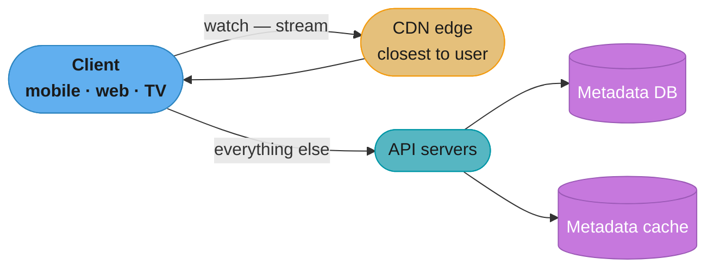
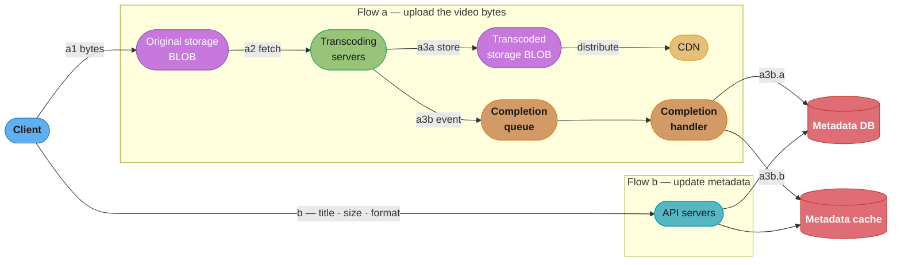
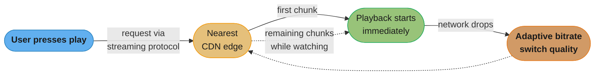
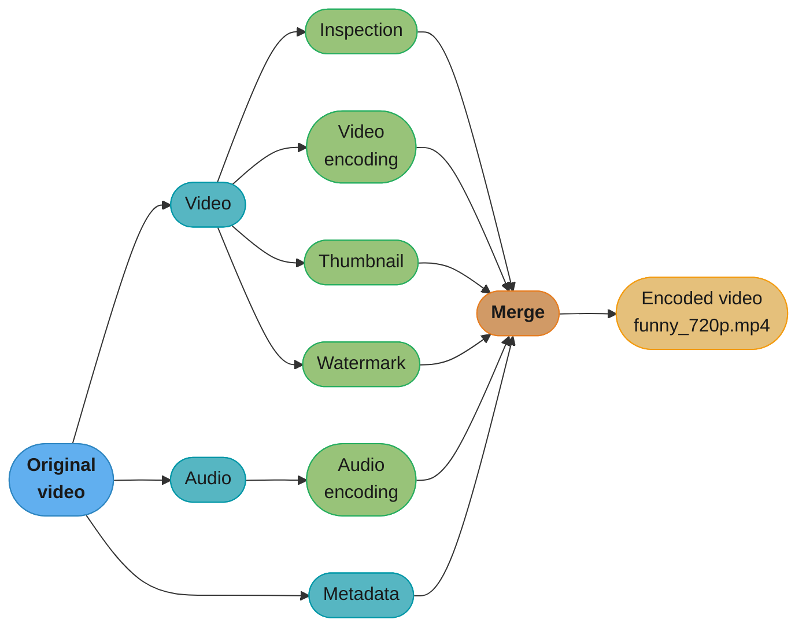
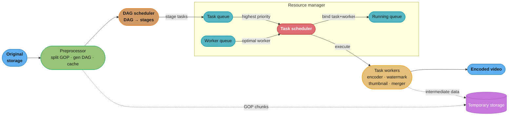
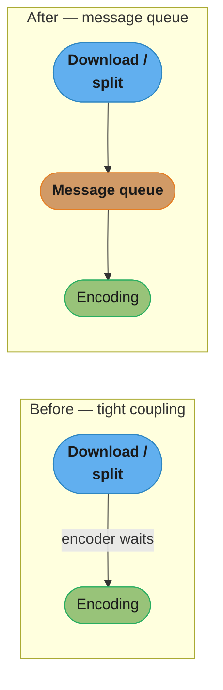
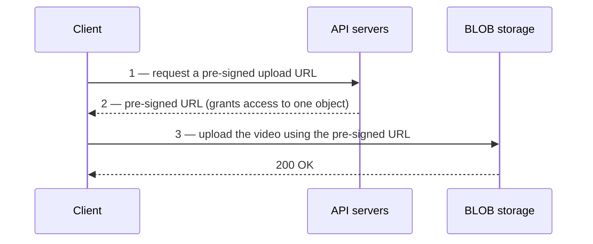
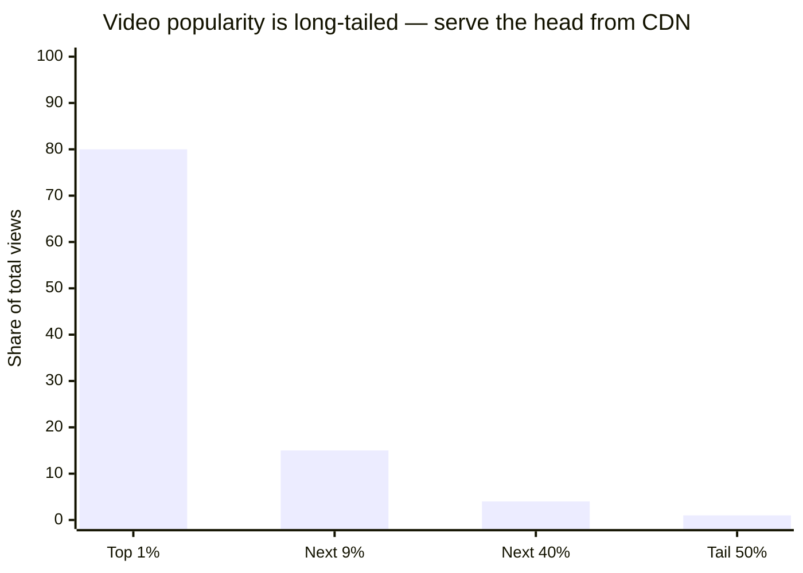

# Chapter 14: Design YouTube

> Ch 14 of 16 · System Design Interview Vol 1 (Xu) · builds on Ch 1 (CDN, blob storage) and Ch 10 (queues); the DAG-pipeline chapter

## Chapter Map

Designing YouTube looks intimidating — 2 billion monthly users, 5 billion videos watched a day, petabytes of storage — but the interview version collapses into two flows the rest of the system hangs off: **uploading a video** and **watching a video**. The whole design is built out of primitives you already have from earlier chapters — a **CDN** and **blob storage** (Ch 1), **message queues** (Ch 10) — plus one genuinely new idea: turning video **transcoding** into a **directed acyclic graph (DAG)** of tasks scheduled across a worker fleet. The chapter's spine is the book's standard four-step interview method.

**TL;DR:**
- **Reuse cloud building blocks.** The interviewer explicitly puts *building blob storage / CDN from scratch* out of scope — you *use* Amazon/Google/Microsoft cloud primitives, not reinvent them. The design work is the pipeline *between* them.
- **Upload = two parallel flows.** (a) the video bytes go original storage → transcoding → transcoded storage → CDN; (b) the metadata (title, size, format) is updated in the DB/cache *while the bytes are still in flight*.
- **Transcoding is a DAG, not a pipeline.** Inspection, multi-resolution encoding, thumbnails, and watermark run as parallel tasks with dependencies; a DAG scheduler + resource manager + task-worker fleet execute them, decoupled by message queues.
- **CDN cost is the design's biggest lever.** Serving everything from CDN costs ~\$150K/day at this scale; because popularity is long-tailed, you serve only the *popular* head from CDN and the tail from cheaper origin storage on demand.

## The Big Question

> "How do I take a 1 GB file a user uploads once and turn it into something that plays back instantly, smoothly, and at the right quality on a phone on 3G, a laptop on fiber, and a smart TV on the other side of the planet — without going bankrupt on bandwidth?"

Analogy: a video-sharing service is a **printing press with global distribution**. Uploading is bringing the manuscript to the press (one copy, once). Transcoding is printing every format and size the world's readers might need (many copies, many machines, in parallel). Streaming is the distribution network putting a copy on a shelf *near each reader* (the CDN edge). The three hard problems map cleanly: make the press *fast and parallel* (DAG + workers), make distribution *cheap* (don't ship unpopular titles everywhere), and make the whole line *fault-tolerant* (retry, replicate, degrade).

---

## 14.1 Step 1 — Understand the Problem and Establish Design Scope

YouTube does far more than upload and watch — comments, recommendations, subscriptions, monetization. You cannot design all of it in 45 minutes, so the first job is to **narrow scope with the interviewer** through a clarifying dialogue.

### Functional requirements

The clarifying Q&A settles on:

| Question asked | Answer taken as requirement |
|----------------|-----------------------------|
| What features are important? | **Ability to upload a video** and **watch a video** — nothing else. |
| What clients must we support? | **Mobile apps, web browsers, and smart TVs.** |
| How many daily active users? | **5 million DAU.** |
| Average daily time on the product? | **30 minutes.** |
| International users? | **Yes** — a large percentage are international. |
| Supported video resolutions? | Accept **most** resolutions and formats. |
| Is encryption required? | **Yes.** |
| File-size limit on uploads? | **1 GB max** for a video (free-tier users). |
| Can we use existing cloud infrastructure? | **Yes** — leverage Amazon/Google/Microsoft clouds; **building blob storage from scratch is explicitly out of scope.** |

So the scope is: **fast upload, smooth streaming, adjustable video quality, low infrastructure cost, high availability / scalability / reliability, and support for mobile / web / TV clients.**

### Non-functional requirements

- **High availability** — the service stays up despite component failures.
- **Scalability** — handle 5M DAU and grow.
- **Reliability** — data and metadata are not lost or corrupted.
- **Low cost** — this is called out as a first-class requirement, not an afterthought, because CDN bandwidth dominates the bill.

### Back-of-the-envelope estimation

The book works two numbers that anchor every later decision: **daily new storage** and **CDN cost**.

**Assumptions (stated in the book):**
- 5 million DAU.
- Users watch **5 videos per day**.
- **10%** of users upload **1 video per day**.
- Average video size = **300 MB**.

**Daily new storage:**

```
daily storage = DAU × upload_ratio × videos_per_uploader × avg_video_size
              = 5,000,000 × 0.10 × 1 × 300 MB
              = 500,000 × 300 MB
              = 150,000,000 MB
              = 150 TB per day
```

**150 TB of new video every single day** — and that is *before* transcoding produces multiple resolutions/codecs, which multiplies the stored bytes further.

**In plain terms.** "Only one user in ten uploads anything, but each of those drops a 300 MB file, and half a million of those a day is 150 TB you have to keep forever."

The framing that matters: this is a *flow*, not a total. Nothing is ever deleted, so the daily figure accumulates — the yearly number, not the daily one, is what actually sizes the storage bill.

| Symbol | What it is |
|--------|------------|
| `DAU` | Daily active users — 5,000,000, the anchor every other estimate hangs off |
| `upload_ratio` | Fraction of DAU who upload at all — 0.10, so 4 users in 5 add no storage |
| `videos_per_uploader` | Videos each uploader posts per day — 1 |
| `avg_video_size` | 300 MB, the *source* file as uploaded, before any transcoding |
| `daily storage` | New bytes added per day — a rate, not a stock |

**Walk one example.** Units on every line, one multiplier at a time:

```
  DAU                            5,000,000   users
  x  upload_ratio                     0.10   fraction of users who upload
  =  uploaders                     500,000   users/day
  x  videos_per_uploader                 1   videos/user/day
  =  new videos                    500,000   videos/day
  x  avg_video_size                    300   MB/video
  =  daily storage             150,000,000   MB/day
  /  1,000,000 MB per TB       ->      150   TB/day

  Accumulate it
  150 TB/day  x  365 days/year  ->  54,750  TB/year  =  54.75 PB/year

  Meaning: one year of uploads alone needs ~55 PB of source video, and that is
  the floor -- not one transcoded rendition is counted yet.
```

**Why the 10% upload ratio is load-bearing.** Drop it and you implicitly assume every active user uploads: 5,000,000 x 300 MB = 1,500,000,000 MB/day = 1,500 TB/day, a 10x overestimate that would size the whole storage tier wrong. Consumer video platforms are overwhelmingly read-heavy — the ratio is what encodes that asymmetry, and an interviewer will ask you to justify it.

**CDN cost (the decisive number):**

CDN bandwidth is billed per GB served. Using Amazon CloudFront's US pricing of **\$0.02 per GB** as the model:

```
daily CDN cost = DAU × videos_watched_per_day × avg_video_size_GB × price_per_GB
              = 5,000,000 × 5 × 0.30 GB × $0.02
              = 5,000,000 × 5 × $0.006
              = 25,000,000 × $0.006
              = $150,000 per day
```

**~\$150,000 per day — roughly \$54 million a year — just to serve video from the CDN.** That single number is what forces the cost-optimization section later: *you cannot afford to serve everything from the CDN.* The conclusion the arithmetic forces is **"serve only popular videos from the CDN"** and everything else from cheaper origin storage on demand. Hold onto this — it reappears as the central tradeoff in Step 3.

**What this actually says.** "Every view costs you six-tenths of a cent, and you serve twenty-five million views a day."

CDN billing has no notion of videos, users, or sessions — it counts **bytes leaving the edge**. Reducing the bill therefore has exactly two levers: ship fewer bytes per view (better codecs, lower default rung) or serve fewer views from the CDN at all (the long-tail play).

| Symbol | What it is |
|--------|------------|
| `videos_watched_per_day` | Views per DAU — 5, from the requirements dialogue |
| `avg_video_size_GB` | 0.30 GB — the same 300 MB, restated in the billing unit |
| `price_per_GB` | \$0.02, Amazon CloudFront's US egress rate |
| `daily CDN cost` | Views/day x GB/view x price/GB — a pure egress bill |
| `egress volume` | The same product without the price, i.e. bytes shipped per day |

**Walk one example.** Push it through in the billing unit, then annualize:

```
  cost per view    0.30 GB/view  x  $0.02/GB     =  $0.006      per view
  views per day   5,000,000 DAU  x  5 views/day  =  25,000,000  views/day
  daily CDN cost  25,000,000     x  $0.006       =  $150,000    per day
  annual cost     $150,000/day   x  365 days     =  $54,750,000 per year

  Same product, without the price
  egress volume   25,000,000 views x 0.30 GB/view = 7,500,000 GB/day
                                                  = 7.5 PB/day leaving the edge

  Meaning: you ship 50x more bytes out to viewers each day (7.5 PB) than you
  take in from uploaders (150 TB) -- the read side is where the money goes.
```

The chapter rounds the annual figure to "roughly \$54 million"; the exact product of \$150,000 x 365 is **\$54,750,000**. Note also that daily egress (7.5 PB) is exactly 50x daily ingest (0.15 PB), which is the numeric statement of "video platforms are read-heavy."

**Read it like this.** "Seven and a half petabytes a day is about seven hundred gigabits a second — sustained, around the clock, forever."

Dollars are the interviewer's headline, but the *engineering* constraint is a bitrate. Converting the daily egress into a steady bits-per-second rate is what tells you how much edge capacity you are actually buying, and it lets you sanity-check the whole assumption set against a real per-stream bitrate.

| Symbol | What it is |
|--------|------------|
| `daily egress` | 7,500,000 GB/day, carried over from the cost calculation |
| `x 8` | Bytes to bits — storage is billed in bytes, links are rated in bits |
| `/ 86,400` | Seconds in a day, converting a per-day volume into a per-second rate |
| `concurrent viewers` | DAU x watch-minutes/day / minutes-in-a-day — the average number streaming at once |
| `peak factor` | 2x, the book's standard multiplier for the busy hour versus the daily average |

**Walk one example.** Mbps to Gbps to Tbps, explicitly:

```
  daily egress                    7,500,000  GB/day
  x  8 bits per byte    ->       60,000,000  Gb/day  (= 60,000 Tb/day = 60 Pb/day)
  /  86,400 s/day       ->            694.4  Gbps    average sustained egress
                        =              0.69  Tbps

  x  2 peak factor      ->          1,388.9  Gbps  =  1.39 Tbps at the busy hour

  Cross-check against watch time
  5,000,000 DAU x 30 min/day   =  150,000,000  viewer-minutes/day
  / 1,440 min/day              =      104,167  average concurrent viewers
  694.4 Gbps / 104,167 viewers =         6.67  Mbps per stream

  Meaning: 6.67 Mbps is a believable 1080p bitrate, so the 5 views, 300 MB, and
  30-minutes-a-day assumptions are mutually consistent -- the estimate hangs together.
```

That last line is the point of doing the conversion at all. If the implied per-stream bitrate had come out at 0.5 Mbps or 60 Mbps, one of the stated assumptions would have to be wrong, and an interviewer would expect you to catch it.

---

## 14.2 Step 2 — Propose High-Level Design and Get Buy-In

Because the interviewer allows using existing cloud services, the high-level design is deliberately built on three things and the plumbing between them:

- **Client** — the app the user watches/uploads from (mobile, web, smart TV).
- **CDN** — videos are stored in and served from a CDN. When you press play, the video is streamed from the **closest CDN edge server**.
- **API servers** — everything *except* video streaming goes through the API servers: feed recommendation, generating the upload URL, updating metadata (DB + cache), user signup, and so on.



Caption: streaming traffic bypasses the API servers entirely and comes straight from the nearest CDN edge; the API servers handle only control-plane work (upload URLs, metadata, recommendations), which is what lets each tier scale independently.

### Video uploading flow

Uploading is **two processes running in parallel**: (a) uploading the actual video bytes, and (b) updating the video's metadata. They are independent so the metadata form can be filled in while the (potentially 1 GB) file is still transferring.



Caption: the two flows share nothing except the metadata store — the heavy video bytes travel a→transcode→CDN while the lightweight metadata form is written in parallel, so the user can title a video before the file has finished uploading.

**Flow (a) — upload the actual video, step by step:**

1. **Videos are uploaded to original storage** (a BLOB store).
2. **Transcoding servers fetch** the raw videos from original storage and begin transcoding.
3. Once transcoding completes, **two things happen in parallel**:
   - **(a) Transcoded videos are sent to transcoded storage** (another BLOB store) → then **distributed to the CDN** for serving.
   - **(b) A transcoding-completion event is queued** in the **completion queue**. Workers in the **completion handler** pull these events and **update the metadata database and cache** to mark the video as ready.
4. **The API servers inform the client** that the video is successfully uploaded and is ready for streaming.

**Flow (b) — update the metadata, in parallel with (a):**

While the file is still uploading, the client sends a separate request to the API servers to **update the video metadata** — file name, size, format, and so on. The API servers update the **metadata cache and database**. This runs concurrently with the byte upload so the two never block each other.

### Video streaming flow

**Downloading vs streaming.** A naive design would download the whole video before playing it — unacceptable for a 300 MB (or 1 GB) file. Instead the client **streams**: it loads a small portion of the video, starts playback immediately, and continuously downloads the rest *while you watch*. Video is streamed from the **CDN edge server closest to the user**, so latency is low.



Caption: streaming decouples "start watching" from "finish downloading" — the first chunk plays instantly from the nearest edge, later chunks arrive in the background, and adaptive bitrate quietly drops quality when the network degrades rather than stalling.

**Streaming protocols.** A streaming protocol standardizes how video data is transferred for streaming. Different protocols support different video encodings and playback players — **the protocol choice depends on which the client supports.** The main options named in the book:

| Protocol | Full name | Origin |
|----------|-----------|--------|
| **MPEG-DASH** | Dynamic Adaptive Streaming over HTTP | MPEG (Moving Picture Experts Group) |
| **Apple HLS** | HTTP Live Streaming | Apple |
| **Microsoft Smooth Streaming** | Smooth Streaming | Microsoft |
| **Adobe HDS** | HTTP Dynamic Streaming | Adobe |

You do not need to memorize protocol internals — the interview point is that each supports a different set of encodings and players, so you pick the one your target clients support (e.g. HLS for Apple devices).

---

## 14.3 Step 3 — Design Deep Dive

The deep dive is where the real engineering lives: how transcoding works, why it is modeled as a DAG, the transcoding *architecture*, then optimizations along three axes (speed, safety, cost) and error handling.

### Video transcoding

**Why transcode at all?** Three reasons:

1. **Raw video is enormous.** Uncompressed / high-bitrate source consumes huge storage — a 1-hour high-def raw video can be hundreds of GB. It must be compressed for storage and delivery.
2. **Device / browser compatibility.** Different devices and browsers support different video formats. To play everywhere, you must produce the formats each target supports.
3. **Adaptive bitrate / smooth playback under varying conditions.** To keep playback smooth on a weak or fluctuating network, you deliver multiple **resolutions and bitrates** and let the client switch. Splitting a video into different resolutions with different encodings is what enables adaptive-bitrate streaming.

**What it means.** "One uploaded file is not one stored file — it is one stored file for every (resolution, codec) pair you choose to publish, plus the original."

This is the hidden multiplier on the 150 TB/day figure from Step 1. The chapter flags it ("multiplies the stored bytes further") but deliberately never fixes the number, because the number is a *design choice* — and choosing it per-video is precisely the cost lever the chapter reaches for later.

| Symbol | What it is |
|--------|------------|
| `R` | Resolution rungs in the ladder — e.g. 240p, 480p, 720p, 1080p, 4K |
| `C` | Codecs published per rung — the chapter names H.264, VP9, HEVC (H.265) |
| `N = R x C` | Renditions produced per source video, the DAG's encoding fan-out width |
| `k` | Total rendition bytes expressed as a multiple of the source video's size |
| `1 + k` | Storage amplification factor — the `1` is the original, kept for re-encoding |

**Walk one example.** Fan-out width first, then the storage it implies:

```
  Ladder shape    R = 5 resolutions  x  C = 3 codecs  =  15 renditions per video
                  (this is also the width of the DAG's encoding stage)

  Stored bytes    = source + all renditions
                  = 150 TB/day  x  (1 + k)

     k = 0   no transcoding at all      150 TB/day        54.75 PB/year
     k = 1   renditions total = source  300 TB/day       109.50 PB/year
     k = 2                              450 TB/day       164.25 PB/year
     k = 4                              750 TB/day       273.75 PB/year

  Meaning: the 150 TB/day headline is a floor, not an estimate. A modest k = 2
  already triples storage to 164 PB/year of encoded video.
```

**Why the amplification factor is the thing to name in an interview.** The three cost mitigations later in the chapter are all attacks on `k`, not on the source: *don't pre-encode every version of unpopular content* lowers `k` for the cold tail, *encode short/unpopular videos on demand* drives `k` toward 0 until someone actually watches, and *region-aware distribution* limits how many *copies* of each rendition are pushed out. Without naming `k` you cannot explain why those three levers belong together.

**Container vs codec** — the single most confused pair in this chapter:

- **Container** — the "basket" that holds the video stream, audio stream, and metadata together. It is identified by the **file extension**: `.avi`, `.mov`, `.mp4`. The container says *how the pieces are packaged*, not how they are compressed.
- **Codec** — the **compression/decompression algorithm** that shrinks the raw video while preserving as much quality as possible. Examples: **H.264**, **VP9**, **HEVC (H.265)**. The codec says *how the bytes are squeezed*.

The mental model: a **container is the box; a codec is how you vacuum-pack what goes inside it.** The same `.mp4` container can hold H.264 or HEVC; the same H.264 codec can sit in different containers. Interviewers love asking you to distinguish these because getting it wrong signals you have never actually shipped video.

### Directed acyclic graph (DAG) model

**Why a DAG and not a linear pipeline?** Transcoding is computationally expensive and time-consuming, and **different content creators need different processing** — some want a watermark, some need thumbnails, some want 4K, some only 720p. Hard-coding one fixed sequence for everyone is inflexible and serializes work that could run in parallel. Instead, add **a layer of abstraction that lets client programmers define processing tasks and their dependencies**. Facebook's streaming-video engine uses exactly this — a **DAG programming model** where tasks are defined in stages, executed sequentially or in parallel according to their dependencies.

The book's DAG splits the **original video** into its **video, audio, and metadata** parts, then applies parallel tasks:

- **Inspection** — verify the video has good quality and is not malformed.
- **Video encoding** — convert into the various resolutions, codecs, and bitrates.
- **Thumbnail** — either uploaded by the user or auto-generated.
- **Watermark** — an image overlay on top of the video carrying identifying info.



Caption: the arrows are dependencies, not a fixed order — inspection, encoding, thumbnail, and watermark have no dependency on each other so they run in parallel, and only the final *merge* waits for all of them; a linear pipeline would run these one after another and waste the parallelism a DAG scheduler exploits.

**Why a DAG beats a linear pipeline (the interview answer):** a DAG expresses which tasks *can* run concurrently (no edge between them) and which *must* wait (an edge). A scheduler can then fan the independent tasks out across many workers simultaneously, cutting wall-clock time, and different creators can supply different DAGs (add a watermark node, drop the 4K encoding node) without changing the engine. A hard-coded pipeline gives you neither the parallelism nor the per-creator flexibility.

**Put simply.** "A pipeline takes as long as the sum of its stages; a DAG takes as long as its longest chain."

Naming the *critical path* is what turns "DAGs are more parallel" from a slogan into an argument — and it immediately tells you where the remaining win is hiding, which the chapter then goes and exploits with GOP chunking.

| Symbol | What it is |
|--------|------------|
| `t_i` | Wall-clock cost of leaf task `i` — inspection, encoding, thumbnail, watermark, audio |
| `serial` | Sum of all `t_i` — what a hard-coded pipeline costs |
| `critical path` | The longest dependency chain; here `max(t_i)` since the leaves are independent |
| `speedup` | `serial / critical path` — how much the DAG scheduler actually buys |
| `merge` | The single node that *does* have edges from everything, so it always waits |

**Walk one example.** The chapter's own five leaf tasks, first assuming equal cost, then realistically:

```
  Equal-cost leaves (each t)
    serial pipeline   t + t + t + t + t   =  5t   then merge
    DAG, 5 workers    max(t,t,t,t,t)      =   t   then merge
    speedup           5t / t              =  5x

  Realistic costs -- encoding dominates everything else
    inspection 1t   encoding 6t   thumbnail 1t   watermark 1t   audio 1t
    serial            1+6+1+1+1            = 10t
    DAG, 5 workers    max(1,6,1,1,1)       =  6t
    speedup           10t / 6t             =  1.67x

  Meaning: the DAG's payoff is capped by its slowest node. Going from 5x to 1.67x
  is why the next optimization must split the encoding node itself -- which is
  exactly what GOP chunking does.
```

This is the honest version of the interview answer. Claiming a flat "5x from parallelism" invites the follow-up *"what if one task takes ten times as long as the others?"* — and the answer, that you must then subdivide the dominant task, is the bridge to the GOP-splitting section.

### Video transcoding architecture

The transcoding system has **six components**: preprocessor, DAG scheduler, resource manager, task workers, temporary storage, and the encoded-video output.



Caption: the resource manager is the heart — its task scheduler pulls the highest-priority *task* from one queue and the optimal *worker* from another, binds the pair into the running queue, and only removes it when the job completes; temporary storage caches GOP chunks and intermediate data so a failed task can retry from a checkpoint instead of from scratch.

**1. Preprocessor** — four responsibilities:

- **Video splitting.** The video is split into smaller chunks aligned to **Group of Pictures (GOP)** boundaries. A GOP is a group/chunk of frames arranged in a specific order; each chunk is independently playable and is typically a few seconds long. Splitting by GOP alignment is what lets chunks be transcoded (and later uploaded) in parallel.
- **Handling old clients.** Some older mobile devices and browsers cannot split video on the client side; for those, **the preprocessor does the splitting** on the server.
- **DAG generation.** The preprocessor builds the DAG from the **configuration files** that client programmers write (e.g. two config files describing two tasks and one dependency produce a DAG with 2 nodes and 1 edge).
- **Cache data.** The preprocessor acts as a cache for the segmented video, storing GOP chunks and metadata in **temporary storage** for reliability — if encoding fails, the system reuses the persisted data to retry.

**2. DAG scheduler** — splits the DAG graph into **stages of tasks** and puts those tasks into the task queue in the resource manager. For example, stage 1 splits the video into video/audio/metadata; stage 2 runs video encoding and thumbnail; audio encoding runs in its own stage. Each stage's tasks become queue entries.

**3. Resource manager** — manages efficient resource allocation. It holds **three queues plus a task scheduler**:

- **Task queue** — a priority queue of tasks to be executed.
- **Worker queue** — a priority queue holding worker-utilization info.
- **Running queue** — info about the tasks and workers currently running.
- **Task scheduler** — picks the optimal task/worker pairing and dispatches the job.

The task scheduler's loop:
1. Get the **highest-priority task** from the task queue.
2. Get the **optimal task worker** to run it from the worker queue.
3. **Instruct** the chosen worker to run the task.
4. **Bind** the task/worker info and put it into the **running queue**.
5. **Remove** the job from the running queue once it is done.

**4. Task workers** — run the tasks defined in the DAG. Different workers run different task types: **watermark, encoder, thumbnail, merger,** and so on. A worker fleet lets independent tasks execute concurrently.

**5. Temporary storage** — multiple storage systems, chosen by data type, size, access frequency, and lifespan. **Metadata** (small, frequently accessed by workers) is cached in **memory**; **video/audio chunks** go to **BLOB storage**. Data in temporary storage is **freed once the video processing completes**.

**6. Encoded video** — the final output of the pipeline, e.g. `funny_720p.mp4`.

### System optimizations

Optimizations along three axes: **speed**, **safety**, and **cost**.

**Speed optimization — parallelize everywhere.**

- **Parallelize video uploading.** Split the video into chunks by **GOP alignment on the client**, then upload chunks in parallel. This makes uploads faster and lets a failed upload resume from the last successful chunk rather than restarting.
- **Place upload centers close to users.** Set up **multiple regional upload centers** around the globe (CDNs can double as upload centers) so users upload to a nearby center instead of a distant one.
- **Parallelism everywhere via message queues.** Build a **loosely coupled** system by decoupling every arrow with message queues. *Before:* the encoding module must wait for the download/split module to finish (tight coupling, serial). *After introducing a message queue:* the encoding module consumes independent jobs from the queue and processes them in parallel — it no longer waits on the previous module. The message queue decouples the stages so each scales and runs independently.



Caption: inserting a message queue between the split and encoding stages breaks the wait dependency — the encoding workers pull independent jobs and run in parallel instead of stalling on the previous stage, the same decoupling pattern from the queues chapter.

**Safety optimization — authorize uploads and protect content.**

- **Pre-signed upload URL.** To ensure only **authorized** users upload — and only to the **right location** — the client does not get blanket write access to storage. Instead:



Caption: the API server, not the client, holds storage credentials — it mints a short-lived pre-signed URL scoped to a single object, so the client can upload exactly one video to exactly one location and nothing else (AWS S3 calls this an "upload URL").

  The three steps: (1) the client requests a pre-signed URL from the API servers; (2) the API servers return a pre-signed URL that grants access to the object named in it; (3) the client uploads the video directly to storage using that URL. This limits uploads to authorized users and specific object locations.

- **Protect your videos** — three copyright-protection options:
  - **Digital Rights Management (DRM)** systems — **Apple FairPlay, Google Widevine, Microsoft PlayReady.**
  - **AES encryption** — encrypt the video and attach an authorization policy; the video is decrypted only on playback, so only authorized users can watch it.
  - **Visual watermarking** — an image overlay carrying identifying info (a company logo or name) burned onto the video.

**Cost-saving optimization — the long-tail play.**

CDN bandwidth is the \$150K/day line item, so the whole cost strategy rests on one empirical fact: **video popularity follows a long-tail distribution** — a small fraction of videos accounts for the overwhelming majority of views. Levers:

- **Serve only popular videos from the CDN**; serve the rest from **high-availability origin storage servers on demand.**
- **Don't pre-encode every version of unpopular content** — for videos with low view counts, generate fewer encoded versions, and **encode short/unpopular videos on demand** when someone actually requests them.
- **Be region-aware** — some videos are popular only in certain regions; there is no need to distribute them to CDNs in other regions.
- **Build your own CDN** and partner with ISPs (like **Netflix's Open Connect**) — a large undertaking, but at massive streaming scale it can pay off versus renting third-party CDN bandwidth.



Caption: a tiny head of videos draws almost all the views, so caching just that head on the expensive CDN captures most of the traffic while the cold tail — the bulk of the catalog — is served cheaply from origin storage on demand.

**The idea behind it.** "Evicting the cold half of the catalog from the CDN removes half your distribution footprint but only one percent of your egress bill — the two savings are not the same thing, and confusing them is the classic error here."

Because the CDN bill is *per byte served*, and the tail serves almost no bytes, pushing the tail to origin barely dents the \$150,000/day egress line. What it does slash is the **replication and storage footprint** — how many copies of how many videos you push to how many edges — plus the transcoding compute for renditions nobody requests. Both matter; they are just different budgets.

| Symbol | What it is |
|--------|------------|
| `head` | The fraction of the *catalog* kept resident on the CDN |
| `view share` | The fraction of total *views* that head accounts for (the bar chart) |
| `egress bill` | \$150,000/day x view share served from the CDN |
| `egress saved` | \$150,000/day x (1 - view share) — the views now served from origin |
| `catalog offloaded` | `1 - head` — the share of videos no longer replicated to every edge |

**Walk one example.** Three cache-depth policies against the chapter's own popularity split:

```
  Baseline: everything on the CDN     $150,000/day    $54.75M/year

  CDN keeps    view    egress bill   egress saved   saved/year   catalog offloaded
  ----------------------------------------------------------------------------------
  top  1%       80%    $120,000/day    $30,000/day    $10.95M          99%
  top 10%       95%    $142,500/day     $7,500/day     $2.74M          90%
  top 50%       99%    $148,500/day     $1,500/day     $0.55M          50%

  Meaning: going from "top 50%" to "top 1%" cached saves 20x more egress money
  ($30,000 vs $1,500 a day) -- but every step down also pushes more real viewers
  onto slower origin fetches. The bar chart is what tells you the trade is worth it.
```

**Why the long-tail assumption has to be stated out loud.** All of the above collapses if popularity were uniform: with 100 videos each drawing 1% of views, caching the top 1% would capture 1% of traffic and save 99% of the bill — but 99% of your viewers would now wait on origin. The entire strategy is licensed by the *shape* of the distribution, not by the caching mechanism, which is why the chapter leads with the long-tail claim before proposing the fix.

### Error handling

Errors fall into **two categories**:

- **Recoverable errors** — e.g. a single video segment fails to transcode. **Retry** a few times; if it still fails and it is beyond recovery, return a **proper error code** to the client.
- **Non-recoverable errors** — e.g. a malformed video. **Stop** the tasks associated with that video and return a proper error code.

Per-component strategy (the book's error table):

| Failure | Handling strategy |
|---------|-------------------|
| **Upload error** | Retry a few times. |
| **Split video error** | If an older client can't split by GOP, pass the whole video to the server and let the **server do the splitting**. |
| **Transcoding error** | Retry. |
| **Preprocessor error** | Regenerate the DAG. |
| **DAG scheduler error** | Reschedule the task. |
| **Resource manager queue down** | Use a **replica** of the queue. |
| **Task worker down** | Retry the task on a **new worker**. |
| **API server down** | API servers are **stateless**, so route the request to a **different API server**. |
| **Metadata cache server down** | Data is replicated across nodes — read from another node; bring up a new cache server to replace the failed one. |
| **Metadata DB — master down** | **Promote a slave** to be the new master. |
| **Metadata DB — slave down** | Use **another slave** for reads; bring up a replacement DB server. |

The common thread: **stateless services reroute, stateful services replicate**, and transcoding stages **retry from cached intermediate data** (which is exactly why the preprocessor persists GOP chunks in temporary storage).

---

## 14.4 Step 4 — Wrap Up

If time remains, discuss how to scale and what changes for adjacent problems.

- **Scale the API tier.** API servers are **stateless**, so you scale them **horizontally** — add servers behind the load balancer; any request can hit any server.
- **Scale the database.** Use **database replication** (read scaling, availability) and **sharding** (partition metadata across nodes to scale writes and storage).
- **Live streaming — what changes.** Live streaming shares the upload/transcode/serve shape but has crucial differences: it has a **higher latency requirement** (viewers expect near-real-time), so it needs **real-time transcoding** and there is **no full file uploaded upfront** — the pipeline works on segments as they arrive. This leaves **less room for the offline parallelism** the on-demand design relies on, and error handling must be fast because you cannot rebuild the whole video after the fact.
- **Video takedowns.** Videos that violate copyright, contain pornography, or are otherwise illegal must be removable. Some are caught **during upload** (e.g. by ML content classifiers), others are found later via **user reports/flagging**.

---

## Visual Intuition

The two mechanics worth seeing as pictures are the **DAG's parallelism** (why it beats a pipeline) and the **GOP-aligned split** (the unit that makes both parallel upload and parallel transcode possible). The DAG and architecture flowcharts are inline in 14.3 above; the GOP layout is a character-aligned strip, so it stays ASCII:

```
Original video timeline (frames)
|--------------------------------------------------------------|
 [   GOP 0   ][   GOP 1   ][   GOP 2   ][   GOP 3   ][  GOP 4  ]
   ~few sec      ~few sec     ~few sec     ~few sec    ~few sec
       |            |            |            |           |
       v            v            v            v           v
   worker A     worker B     worker C     worker A     worker B    <- transcode ||
       |            |            |            |           |
   uploaded     uploaded     uploaded     uploaded    uploaded     <- upload ||, resume per-GOP
```

Caption: each GOP is an independently playable chunk of a few seconds, so the timeline can be cut at GOP boundaries and both *uploaded* and *transcoded* by different workers at once — and a failure only costs the one chunk, not the whole 1 GB file.

**Stated plainly.** "Cutting at GOP boundaries turns one long serial job into N short independent ones, so you buy near-linear speedup and you make a dropped connection cost one chunk instead of the whole file."

GOP splitting is the answer to the critical-path problem the DAG left behind: the encoding node dominated total time, and the only way past that is to subdivide the encoding node itself. It is also, for free, the resume mechanism.

| Symbol | What it is |
|--------|------------|
| `video length` | Duration of the source upload, in seconds |
| `GOP length` | Seconds per Group of Pictures — "typically a few seconds", per the chapter |
| `chunks` | `video length / GOP length` — independently decodable units, the unit of work |
| `waves` | `ceil(chunks / workers)` — how many rounds the fleet needs to finish the job |
| `resume cost` | Bytes re-sent after a failure — one chunk, not the whole file |

**Walk one example.** A 10-minute upload with 4-second GOPs:

```
  video length                     600  s
  /  GOP length                      4  s/GOP
  =  chunks                        150  independently transcodable chunks

  Transcode waves = ceil(chunks / workers)
       1 worker    ->  150 waves   ->     1x  speedup   (this is the serial case)
      10 workers   ->   15 waves   ->    10x  speedup
      50 workers   ->    3 waves   ->    50x  speedup
     150 workers   ->    1 wave    ->   150x  speedup

  Failure cost on a 1 GB upload
     whole-file retry                 1,000  MB re-sent
     one-GOP retry     1,000 / 150  =  6.67  MB re-sent  =  0.67% of the file

  Meaning: GOP splitting buys speedup linear in the worker count until workers
  outnumber chunks, and cuts the cost of a dropped connection by ~150x here.
```

**Why "align to GOP" and not just "split every 4 MB".** A GOP starts with a keyframe and is self-contained, so any chunk can be decoded without its neighbours. Cut at an arbitrary byte offset instead and the pieces reference frames that live in a different chunk — no worker can transcode one alone, and a resumed upload cannot be validated independently. The alignment requirement is what makes both the parallelism and the resume correct rather than merely fast.

---

## Key Concepts Glossary

- **DAU (Daily Active Users)** — the 5M figure that drives every estimate here.
- **BLOB storage** — Binary Large Object store for raw and transcoded video files (original storage, transcoded storage).
- **CDN (Content Delivery Network)** — edge servers that cache and serve video close to users; the dominant cost.
- **CDN edge server** — the nearest CDN node that actually streams video to a given user.
- **Original storage** — BLOB store holding the raw uploaded video before transcoding.
- **Transcoded storage** — BLOB store holding the encoded output before CDN distribution.
- **Transcoding** — converting raw video into compressed, multi-resolution, multi-codec formats.
- **Container** — the package/basket for video+audio+metadata, identified by extension (.avi, .mov, .mp4).
- **Codec** — the compression/decompression algorithm (H.264, VP9, HEVC).
- **Adaptive bitrate streaming** — serving multiple resolutions/bitrates so the client can switch to match the network.
- **Streaming vs downloading** — playing while progressively fetching vs fetching the whole file first.
- **Streaming protocol** — standardizes streaming data transfer: MPEG-DASH, Apple HLS, Microsoft Smooth Streaming, Adobe HDS.
- **DAG (Directed Acyclic Graph) model** — expressing transcoding tasks and their dependencies so independent tasks run in parallel.
- **GOP (Group of Pictures)** — a chunk of frames, a few seconds long, independently playable; the unit of splitting.
- **Preprocessor** — splits video by GOP, generates the DAG from config, and caches segments in temporary storage.
- **DAG scheduler** — splits the DAG into stages and enqueues tasks into the resource manager.
- **Resource manager** — allocates work via a task queue, worker queue, running queue, and task scheduler.
- **Task scheduler** — picks the optimal task/worker pair and moves jobs through the running queue.
- **Task worker** — a process that runs one task type (encoder, watermark, thumbnail, merger).
- **Temporary storage** — memory for metadata, BLOB for chunks; freed after processing completes.
- **Completion queue / completion handler** — queue of transcoding-done events and the workers that update metadata from them.
- **Metadata DB / metadata cache** — store video attributes (title, size, format, ready-state).
- **Pre-signed upload URL** — a scoped, short-lived URL the API server mints so a client can upload one object to one location.
- **DRM (Digital Rights Management)** — content protection via FairPlay / Widevine / PlayReady.
- **AES encryption** — encrypting video with an authorization policy; decrypted only on playback.
- **Visual watermark** — identifying image overlay burned onto the video.
- **Long-tail distribution** — a few popular videos take most views; the basis for the CDN cost strategy.
- **Open Connect** — Netflix's own CDN, cited as the "build your own CDN" example.

---

## Tradeoffs & Decision Tables

| Decision | Option A | Option B | Book's choice / guidance |
|----------|----------|----------|--------------------------|
| Deliver video | Download whole file | **Stream progressively** | Stream — play the first chunk immediately, download the rest while watching. |
| Transcoding orchestration | Linear pipeline | **DAG of tasks** | DAG — expresses parallelism + per-creator flexibility. |
| Where to serve from | **Everything from CDN** | Popular from CDN, tail from origin on demand | Popular-only from CDN — the ~\$150K/day cost forces it. |
| Split point | Server-side always | **Client-side by GOP** (server fallback) | Client by GOP for parallel upload; server splits for old clients. |
| Upload authorization | Client holds storage creds | **Pre-signed URL** | Pre-signed URL — scoped, authorized, single-object. |
| Content protection | None | **DRM / AES / watermark** | Layered — DRM + encryption + visual watermark. |
| Encode all versions upfront | Yes | On demand for unpopular/short | On demand for the cold tail to save storage/compute. |

| Component | Stateful? | Failure response |
|-----------|-----------|------------------|
| API server | Stateless | Reroute to another server; scale horizontally. |
| Task worker | Stateless (per job) | Retry the task on a new worker. |
| Resource manager queue | Stateful | Fail over to a replica. |
| Metadata cache | Stateful (replicated) | Read another replica; replace the node. |
| Metadata DB master | Stateful | Promote a slave to master. |
| Metadata DB slave | Stateful | Read from another slave; add a replacement. |

---

## Common Pitfalls / War Stories

- **Serving everything from the CDN.** The naive design caches every video at every edge. At 5M DAU × 5 views × 300 MB × \$0.02/GB that is **~\$150K/day (~\$54M/yr)**. The fix is to exploit the long tail: CDN only for popular videos, origin-on-demand for the rest, region-aware distribution.
- **Blocking the user on the upload.** Coupling metadata entry to the byte transfer forces the user to wait for a 1 GB upload before they can title the video. The two-flow design updates metadata *in parallel* with the byte upload.
- **A linear transcoding pipeline.** Running inspection → encode → thumbnail → watermark serially wastes the parallelism and hard-codes one workflow for all creators. The DAG runs independent tasks concurrently and lets each creator supply a different graph.
- **Non-GOP-aligned splitting.** Cutting the video at arbitrary byte boundaries produces chunks that aren't independently decodable, breaking both parallel transcode and clean resume. Split on **GOP boundaries** so each chunk stands alone; fall back to server-side splitting for old clients.
- **Confusing container and codec.** Treating `.mp4` as "the format" ignores that the codec inside (H.264 vs HEVC vs VP9) determines compatibility and size — a classic tell that a candidate has never shipped video.
- **Giving clients direct storage credentials.** Letting the client write straight to the bucket is an authorization hole. Mint a **pre-signed URL** per upload so access is scoped to one object and expires.
- **No retry checkpointing.** If a transcoding worker dies and the pipeline restarts from the raw 1 GB file, you burn compute re-doing finished chunks. The preprocessor persists GOP chunks in temporary storage so a failed task retries from the last good segment.
- **Treating live streaming like VOD.** Assuming you can upload-then-transcode-then-serve fails for live: there is no full file, latency budgets are tight, and transcoding must be real-time — a different design, not a config tweak.

---

## Real-World Systems Referenced

- **Amazon / Google / Microsoft clouds** — the existing blob storage and CDN the design is built on (building them is out of scope).
- **Amazon CloudFront** — the CDN whose \$0.02/GB US pricing anchors the cost estimate.
- **Facebook streaming video engine** — the cited real-world user of the DAG programming model for transcoding.
- **H.264, VP9, HEVC (H.265)** — the video codecs named.
- **MPEG-DASH, Apple HLS, Microsoft Smooth Streaming, Adobe HDS** — the streaming protocols named.
- **Apple FairPlay, Google Widevine, Microsoft PlayReady** — the DRM systems named.
- **Netflix Open Connect** — the "build your own CDN and partner with ISPs" example.

---

## Summary

Designing YouTube reduces to two flows built on reused cloud primitives. **Uploading** runs two parallel processes: the video bytes travel original storage → transcoding servers → transcoded storage → CDN (with a completion queue + handler updating metadata when done), while the **metadata** (title, size, format) is written to the DB and cache *concurrently* with the byte transfer. **Watching** is progressive **streaming** from the nearest **CDN edge**, standardized by a **streaming protocol** (MPEG-DASH, HLS, Smooth, HDS) chosen for client support. The one genuinely new mechanism is **transcoding modeled as a DAG**: the original video is split (by **GOP**) into video/audio/metadata, and parallel tasks — inspection, multi-resolution encoding, thumbnail, watermark — run across a worker fleet coordinated by a **preprocessor**, a **DAG scheduler**, and a **resource manager** (task/worker/running queues + task scheduler), with **message queues decoupling every stage**. Optimizations run on three axes: **speed** (parallel GOP uploads, regional upload centers, queue-decoupled parallelism), **safety** (**pre-signed upload URLs**, plus DRM/AES/watermark protection), and **cost** — the decisive one, because serving everything from the CDN costs **~\$150K/day**, so the long-tail distribution justifies serving only popular videos from the CDN and the cold tail from origin on demand. Error handling follows one rule — stateless services reroute, stateful services replicate, transcoding retries from cached chunks — and the wrap-up scales the stateless API tier horizontally, the DB via replication/sharding, and notes that **live streaming** (real-time, no full upfront file, tight latency) and **video takedowns** (ML at upload + user reports) are the natural extensions.

---

## Interview Questions

**Q: Why can't YouTube just serve every video from the CDN, and what does the arithmetic show?**
Because serving everything from the CDN costs roughly \$150,000 per day at this scale, which is unaffordable. The estimate is 5M DAU × 5 videos watched × 0.3 GB × \$0.02/GB (CloudFront) = \$150K/day, about \$54M/year. Since video popularity is long-tailed, the fix is to serve only the popular head from the CDN and the cold tail from cheaper origin storage on demand, with region-aware distribution so videos aren't pushed to CDNs where nobody watches them.

**Q: What is the difference between a container and a codec?**
A container is the basket that packages the video stream, audio stream, and metadata together, identified by the file extension like .avi, .mov, or .mp4. A codec is the compression/decompression algorithm that shrinks the raw video while preserving quality, such as H.264, VP9, or HEVC. The same .mp4 container can hold different codecs, and the same codec can sit in different containers, so they are independent choices.

**Q: Why model transcoding as a DAG instead of a linear pipeline?**
Because a DAG expresses which tasks are independent (run in parallel) and which have dependencies (must wait), while letting each creator supply a different graph. Inspection, encoding, thumbnail, and watermark have no dependency on each other, so a DAG scheduler fans them out across workers concurrently, cutting wall-clock time. A linear pipeline would serialize them and hard-code one workflow for everyone; Facebook's streaming video engine uses the DAG model for exactly this flexibility and parallelism.

**Q: What is a pre-signed upload URL and why use one?**
A pre-signed URL is a short-lived, scoped URL the API server mints so a client can upload one specific object to one specific storage location. The client requests it from the API servers, receives it, then uploads the video directly to storage using it. This means the client never holds blanket storage credentials, so only authorized users upload and only to the right location; AWS S3 calls it an upload URL.

**Q: Why split video on GOP boundaries specifically?**
Because a GOP (Group of Pictures) is a chunk of frames that is independently playable and decodable, usually a few seconds long. Splitting on GOP boundaries lets each chunk be transcoded and uploaded in parallel by different workers, and lets a failed upload or transcode resume from the last good chunk instead of restarting the whole 1 GB file. Cutting at arbitrary byte offsets would produce chunks that can't be decoded on their own.

**Q: How do the two parallel processes in the upload flow work?**
One process uploads the actual video bytes (original storage, then transcoding servers, then transcoded storage and CDN), while the other updates the video metadata (title, size, format) in the DB and cache at the same time. They run in parallel so the user can fill in the metadata form while the potentially 1 GB file is still transferring, and neither flow blocks the other. They meet only at the shared metadata store.

**Q: What is the difference between streaming and downloading a video, and why does it matter?**
Downloading fetches the entire file before playback can begin, while streaming loads a small portion, starts playback immediately, and keeps downloading the rest while you watch. Streaming matters because videos are 300 MB to 1 GB, so waiting for a full download would be unacceptable. Videos are streamed from the nearest CDN edge server, and adaptive bitrate lets the client drop quality on a weak network rather than stalling.

**Q: What are the components of the resource manager and how does the task scheduler work?**
The resource manager has a task queue, a worker queue, a running queue, and a task scheduler. The task scheduler pulls the highest-priority task from the task queue, picks the optimal worker from the worker queue, instructs that worker to run the task, binds the task/worker pair into the running queue, and removes it once the job finishes. This pairing of the best task with the best available worker is what keeps the transcoding fleet efficiently utilized.

**Q: How do message queues improve transcoding throughput?**
Message queues decouple the pipeline stages so a downstream stage no longer waits on the upstream one. Before a queue, the encoding module had to wait for the download/split module to finish; after inserting a queue between them, encoding workers pull independent jobs and process them in parallel. This loose coupling lets each stage scale and run independently, which is the core parallelism-everywhere optimization.

**Q: What does the preprocessor do?**
The preprocessor splits the video into GOP-aligned chunks, generates the DAG from client configuration files, caches segmented data in temporary storage, and handles splitting for old clients that can't split themselves. Caching the GOP chunks and metadata gives reliability: if encoding fails, the system retries from the persisted data instead of from the raw file. It sits at the front of the transcoding architecture, feeding the DAG scheduler.

**Q: How does the system protect uploaded videos from piracy?**
Through three layers: DRM systems (Apple FairPlay, Google Widevine, Microsoft PlayReady), AES encryption with an authorization policy so the video is decrypted only on authorized playback, and visual watermarking that burns an identifying overlay onto the video. These are combined rather than chosen exclusively, so content is protected both cryptographically and visibly. Encryption plus DRM controls who can watch; the watermark deters redistribution.

**Q: How is temporary storage organized during transcoding?**
Temporary storage uses different systems by data type, size, access frequency, and lifespan: small, frequently accessed metadata is cached in memory, while large video/audio chunks go to BLOB storage. All temporary data is freed once the video's processing completes. This split keeps hot metadata fast for the workers while cheaply holding the bulky chunk data that only needs to survive until the pipeline finishes.

**Q: How does the system handle an API server failure versus a metadata DB master failure?**
API servers are stateless, so a failed one is simply bypassed and the request is routed to another server; the tier scales horizontally the same way. A metadata DB master failure is handled by promoting a slave to become the new master, since the DB is stateful and its data must be preserved. The general rule is that stateless services reroute while stateful services replicate and fail over.

**Q: How does the system decide when to retry versus abort on error?**
It classifies errors as recoverable or non-recoverable: a recoverable error, like a segment failing to transcode, is retried a few times and only returns an error code if it still fails, while a non-recoverable error, like a malformed video, stops the associated tasks immediately and returns an error code. This avoids wasting compute retrying something that can never succeed while still absorbing transient failures. Retries are cheap because the preprocessor cached the chunks.

**Q: What are the streaming protocols mentioned, and how do you choose one?**
The protocols are MPEG-DASH (Dynamic Adaptive Streaming over HTTP), Apple HLS (HTTP Live Streaming), Microsoft Smooth Streaming, and Adobe HDS (HTTP Dynamic Streaming). Each supports a different set of video encodings and playback players, so the choice depends on which the target client supports. For example, you would use HLS for Apple devices; there is no single universal protocol, so the client's capabilities drive the selection.

**Q: Why is transcoding necessary at all?**
Because raw video is enormous and must be compressed for storage and delivery, different devices and browsers support different formats, and adaptive-bitrate playback needs multiple resolutions and bitrates. Transcoding converts one raw upload into many compressed, device-compatible versions so the video plays smoothly everywhere and adjusts quality to the viewer's network. Without it you would store huge files that many clients couldn't play and couldn't adapt to slow connections.

**Q: How would you scale the API tier and the database as the service grows?**
Scale the API tier horizontally because the API servers are stateless, so you just add servers behind the load balancer and any request can hit any of them. Scale the database with replication for read scaling and availability and with sharding to partition metadata across nodes for write and storage scaling. The stateless-versus-stateful distinction is what makes the API tier trivial to scale and the database the harder problem.

**Q: What changes when designing live streaming instead of on-demand video?**
Live streaming has a much higher latency requirement, needs real-time transcoding, and has no full file uploaded upfront since it works on segments as they arrive. That leaves far less room for the offline parallelism the on-demand pipeline relies on, and error handling must be fast because you can't rebuild the whole video after the fact. The upload/transcode/serve shape is similar, but the tight real-time constraints make it a distinct design rather than a tweak.

**Q: How are inappropriate or copyright-violating videos taken down?**
Videos that violate copyright, contain pornography, or are otherwise illegal are removed either at upload time or after the fact. Some are caught during upload by ML content classifiers, while others are discovered later through user reports and flagging. Combining automated detection at ingest with human reporting afterward covers both the content that models can catch immediately and the cases that only surface once people watch it.

**Q: Roughly how much new storage does YouTube add per day in this design, and how is it estimated?**
About 150 TB of new video per day, before transcoding multiplies it into multiple resolutions. The estimate is 5M DAU × 10% who upload × 1 video × 300 MB average = 150 TB/day. Transcoding into several resolutions and codecs multiplies the stored bytes further, which is part of why the cost-saving section limits how many encoded versions are generated for unpopular videos.

---

## Cross-links in this repo

- [hld/case_studies/design_netflix.md — the sibling video-streaming case study (Open Connect, adaptive bitrate, encoding pipeline)](../../../hld/case_studies/design_netflix.md)
- [hld/cdn/README.md — CDN internals: edge caching, origin pull, the cost model behind the \$150K/day estimate](../../../hld/cdn/README.md)
- [hld/message_queues/README.md — the queue-decoupling pattern used to parallelize every transcoding stage](../../../hld/message_queues/README.md)
- [Ch 1 — Scale From Zero to Millions of Users (CDN + blob storage building blocks)](../01_scale_from_zero_to_millions_of_users/README.md)
- [Ch 10 — Design a Notification System (queue + worker fan-out, same shape as the completion queue/handler)](../10_design_a_notification_system/README.md)
- [Ch 15 — Design Google Drive (the sibling large-file upload + blob storage chapter)](../15_design_google_drive/README.md)

## Further Reading

- Alex Xu, *System Design Interview – An Insider's Guide, Vol 1*, Ch 14 — the source chapter and its references.
- Facebook Engineering, "SVE: Distributed Video Processing at Facebook Scale" — the DAG-based streaming-video engine cited as the transcoding model.
- Amazon CloudFront pricing documentation — the \$0.02/GB figure behind the CDN cost estimate.
- Netflix Technology Blog, "Open Connect" — Netflix's own CDN, the "build your own CDN" reference.
- Apple HLS and MPEG-DASH specifications — the adaptive-bitrate streaming protocols named in the chapter.
