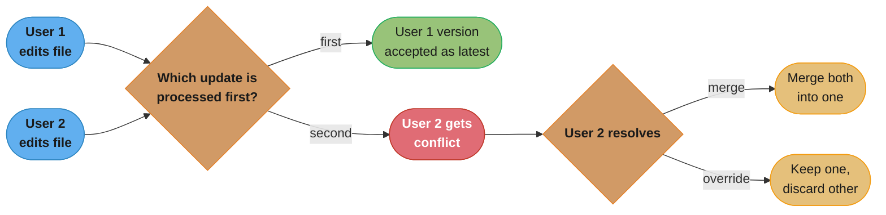
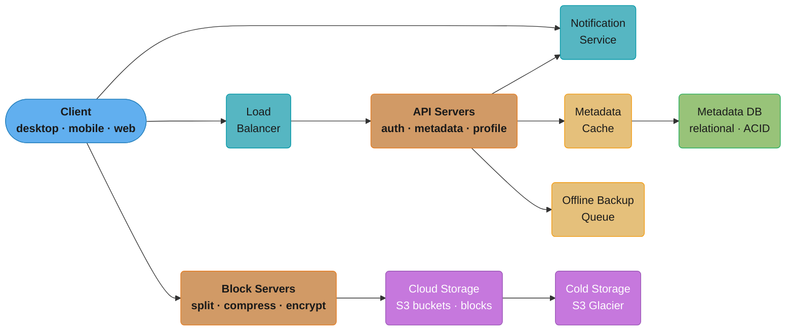
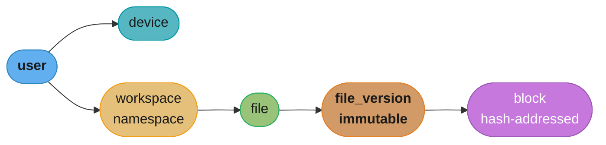
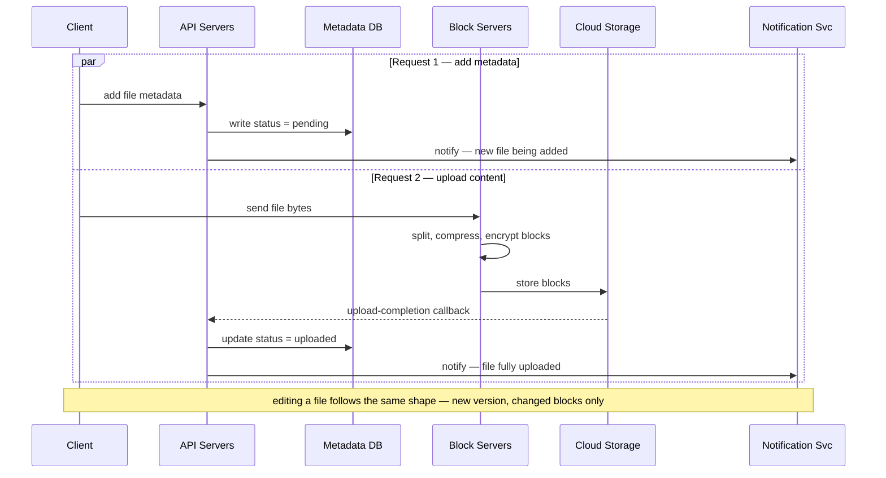
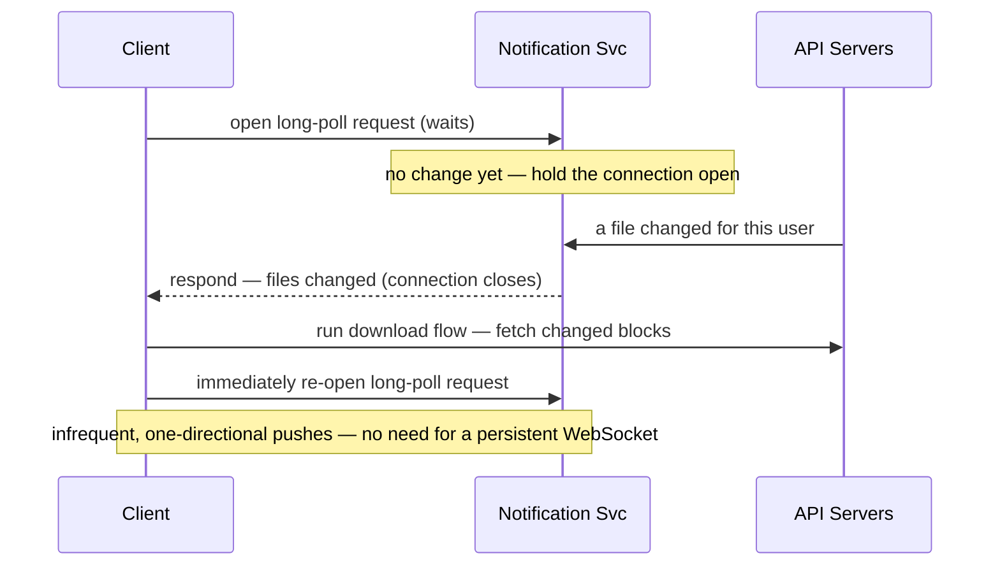
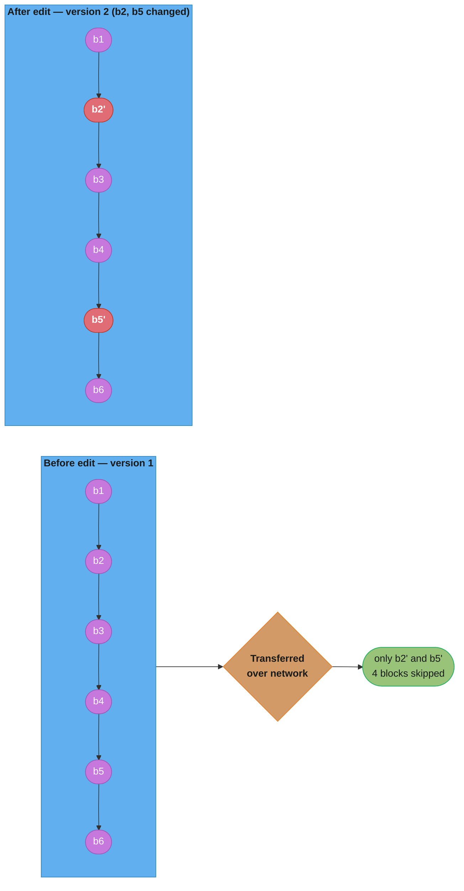
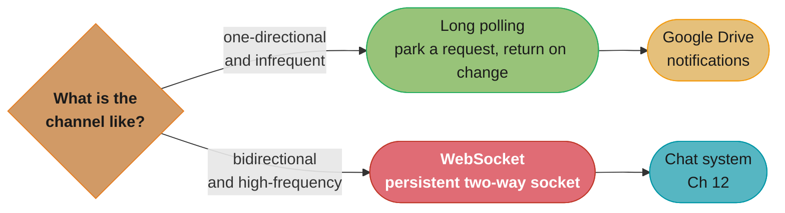

# Chapter 15: Design Google Drive

> Ch 15 of 16 · System Design Interview Vol 1 (Xu) · builds on Ch 12 (long polling vs WebSocket) and Ch 14 (blob storage); the sync chapter and the book's design finale

## Chapter Map

Google Drive is a file-hosting service that stores documents, photos, videos, and any
other file type in the cloud, then keeps that storage **in sync** across a user's phone,
laptop, and browser. This is the book's final worked design, and it deliberately braids
together primitives introduced earlier: **blob storage and resumable uploads** from the
YouTube chapter (Ch 14), the **long-polling-versus-WebSocket** decision from the chat
chapter (Ch 12), plus new machinery — **block-level delta sync**, **cross-account
deduplication**, **cold storage**, and a **notification service** — that makes the "edit
one paragraph, re-upload only a few KB" experience possible.

**TL;DR:**
- Start with a single server (Apache + MySQL + a local `drive/` directory namespaced per
  user) to expose the three core APIs, then hit the storage wall and scale out to **Amazon
  S3** for files, a **separate metadata database**, load-balanced web/API servers, and a
  **notification service**.
- Files are split into **blocks** (Dropbox's reference: 4 MB max per block), each an
  independent hash-addressed object; **delta sync re-uploads only the changed blocks**, and
  identical blocks are **deduplicated** across accounts.
- Metadata needs **strong consistency** (the same file must look identical on every device),
  which drives the choice of a **relational database** (ACID) plus a disciplined
  cache-invalidation rule.
- The notification service uses **long polling, not WebSocket** — the channel is
  one-directional and infrequent, so a persistent bidirectional socket is overkill.

## The Big Question

> "How do I let a user edit a 50 MB file on their laptop and have that change appear on
> their phone within seconds — without re-uploading the whole file, storing the same bytes
> twice, or ever silently losing an edit when two devices change the file at once?"

Analogy: Drive is a **shipping company with a smart manifest**. The warehouse (cloud
storage) holds sealed, interchangeable crates (blocks) addressed only by a fingerprint of
their contents; if you already shipped an identical crate, the company just notes "you own
crate #A7F3 too" instead of shipping it again (dedup). When you change one item in a
shipment, only the affected crate is re-sent (delta sync), and a dispatcher (notification
service) wires every one of your devices the instant the manifest changes so they can pull
the new crates. The whole chapter is about designing that manifest and that dispatcher.

---

## 15.1 Step 1 — Understand the Problem and Establish Design Scope

Google Drive is a huge product; the interviewer expects you to **narrow scope through
dialogue** rather than design "all of it." The book's clarifying conversation converges on
this feature set.

### The requirements dialogue

The candidate asks and the interviewer confirms:

- **What are the most important features?** Upload and download files, sync files across
  devices, and see file update notifications.
- **Is this a mobile app, a web app, or both?** Both.
- **What file formats are supported?** Any file type.
- **Do files need to be encrypted?** Yes — files in storage must be encrypted.
- **Is there a file-size limit?** Yes — files must be **10 GB or smaller**.
- **How many users?** **10 million DAU** (daily active users).

The agreed **functional requirements**:

| Requirement | What it means |
|---|---|
| Add / upload files | Drag a file in (web) or save into the synced folder (desktop/mobile). |
| Download files | Retrieve a file's bytes to any device. |
| Sync files across devices | A change on one device propagates to the user's other devices. |
| See file revisions | Version history — list and restore past versions. |
| Share / see updates | Notifications when a file is edited, deleted, or shared. |
| Any file type | Store arbitrary bytes, not just documents. |
| Encrypted storage | Files are encrypted at rest. |
| 10 GB per-file limit | Reject uploads larger than 10 GB. |

The agreed **non-functional requirements**:

- **Reliability** — data loss is unacceptable; storage must be highly durable.
- **Fast sync speed** — slow sync frustrates users and drives them away.
- **Bandwidth usage** — minimize network traffic, especially on mobile data plans (this is
  the single reason delta sync exists, §15.3).
- **Scalability** — handle high volumes of traffic.
- **High availability** — usable even when some servers are offline / slow / partitioned.

### Back-of-the-envelope estimation

The book carries the following assumptions and arithmetic — reproduce it step by step in an
interview:

- **50 million** signed-up users and **10 million DAU**.
- Every user is allocated **10 GB** of free space.
- Users upload **2 files per day** on average, with an **average file size of 500 KB**.
- **1:1 read-to-write** ratio (as many downloads as uploads).

Worked calculations:

```
Total storage (nominal)
  = 50,000,000 users x 10 GB/user
  = 500,000,000 GB
  = 500 PB

Upload QPS (average)
  = 10,000,000 DAU x 2 uploads/day
  = 20,000,000 uploads/day
  = 20,000,000 / (24 x 3600) seconds
  ~= 240 uploads/sec

Peak upload QPS
  = average QPS x 2
  ~= 480 uploads/sec
```

Two numbers dominate the design conversation: **500 PB of nominal storage** (which is why
the local disk of a single server is hopeless and why S3 + dedup + cold storage matter) and
a **modest ~240 QPS average / ~480 QPS peak** for uploads (which is why the *storage* — not
the request rate — is the bottleneck, unlike the read-heavy YouTube design in Ch 14).

**In plain terms.** "Five hundred petabytes is what you *promised*, not what you will *store* — the promise is 50 million users times their 10 GB quota, and almost nobody fills it."

That distinction is the single most useful thing in this estimate. Quota is a liability you must be able to honour; actual bytes are what you provision this year. Confusing them makes you buy 500 PB on day one, which is why the chapter says "nominal."

| Symbol | What it is |
|--------|------------|
| `signed-up users` | 50,000,000 — the whole registered base, not the active one |
| `quota` | 10 GB allocated free space per user; an upper bound, not a measurement |
| `DAU` | 10,000,000 — the fifth of the base that actually shows up on a given day |
| `files/day` | 2 uploads per active user per day |
| `avg file size` | 500 KB — small, because most synced files are documents and photos |

**Walk one example.** The promise and the reality, with units on every line:

```
  Nominal (allocated) storage
    signed-up users            50,000,000   users
    x  quota                           10   GB/user
    =  nominal storage        500,000,000   GB
    /  1,000,000 GB per PB    ->      500   PB allocated

  Actual new storage per day
    DAU                        10,000,000   users
    x  files per day                    2   uploads/user/day
    =  uploads                 20,000,000   uploads/day
    x  avg file size                  500   KB/upload
    =  new bytes           10,000,000,000   KB/day
    /  1,000,000,000 KB per TB  ->     10   TB/day

  Accumulate it
    10 TB/day  x  365 days  =  3,650 TB/year  =  3.65 PB/year

  Meaning: real growth is 3.65 PB/year against a 500 PB allocation -- at this
  rate the promised space would take ~137 years to fill.
```

**Why "nominal" is doing so much work.** The 500 PB figure justifies the *architecture* (S3 instead of local disks, dedup, cold storage tiering) because you must be able to grow into it. The 3.65 PB/year figure justifies the *purchase order*. An interviewer who hears you quote 500 PB without distinguishing the two will ask which one you would actually provision — and the answer is neither in isolation: you provision for measured growth plus headroom, and you architect for the ceiling.

**What this actually says.** "Twenty million uploads a day sounds enormous, but spread across 86,400 seconds it is only a couple of hundred requests a second — a single well-tuned server's worth."

This is the inversion that makes Drive interesting. YouTube's arithmetic produced a terrifying bandwidth number; Drive's produces a trivial one, and the difficulty migrates entirely to storage and sync correctness.

| Symbol | What it is |
|--------|------------|
| `uploads/day` | DAU x files per day = 20,000,000 |
| `24 x 3600` | 86,400 seconds in a day — converts a daily count into a rate |
| `average QPS` | Uploads per second averaged flat across the whole day |
| `peak factor` | 2x — traffic is never flat; the busy hour runs roughly double the mean |
| `peak QPS` | What you must actually provision the API tier for |

**Walk one example.** The QPS chain, then the peak:

```
  DAU                         10,000,000   users
  x  files per day                     2   uploads/user/day
  =  uploads                  20,000,000   uploads/day
  /  86,400 s/day             ->   231.5   uploads/sec  average

  x  2 peak factor            ->   463.0   uploads/sec  peak
  +  1:1 read-to-write ratio  ->   463.0   downloads/sec peak
  =  total peak request rate  ->   925.9   requests/sec

  Meaning: under 1,000 req/s at peak. The load balancer plus a handful of
  stateless API servers absorb this -- the request rate is never the problem.
```

The chapter rounds these to **~240 and ~480 QPS**; the exact quotients are **231.5** and **463.0**. Rounding up is the right instinct for a capacity number, but say so rather than presenting the rounded figure as the computed one.

**Why the peak factor cannot be dropped.** Provision for the 231.5 QPS average and the service browns out every evening, because uploads cluster in waking hours and in the minutes after people finish working on a document. The 2x multiplier is a crude stand-in for that diurnal shape, and it is the cheapest possible insurance — doubling a number this small costs almost nothing, whereas being wrong about it is a visible outage.

---

## 15.2 Step 2 — Propose High-Level Design and Get Buy-In

The book's method: **start with something that fits on one box**, expose the APIs, then let
the design's own limits push you toward each scaling decision.

### Start simple — a single server

The first cut runs entirely on one machine:

- A **web server** (the book uses Apache) to handle upload and download requests.
- A **MySQL database** to store file metadata (user info, login info, file names, etc.).
- A **local storage directory** — a `drive/` folder on disk — that keeps uploaded files.
  Inside `drive/`, each user gets their own **namespace** (subdirectory), so
  `drive/username1/`, `drive/username2/`, etc., isolate users' files from one another.

```
drive/
  |- user_alice/
  |    |- recipes/soup/best_soup.txt
  |    |- photos/trip.jpg
  |- user_bob/
       |- taxes/2025.pdf
```

Caption: the single-server prototype — one namespace directory per user under a local
`drive/` folder — is enough to expose the three APIs before any of the scale problems bite.

#### API 1 — Upload a file (simple and resumable)

Drive supports **two upload types**:

- **Simple upload** — used when the file is small. The bytes go up in one request.
- **Resumable upload** — used when the file is large and the connection is at risk of
  interruption (which matters at a 10 GB limit). A resumable upload is requested with a
  query parameter:

```
https://api.example.com/files/upload?uploadType=resumable
```

The resumable flow is **three steps**:

1. Send an **initial request** to retrieve the resumable URL.
2. **Upload the data** and monitor the upload state.
3. If the upload is **disrupted**, resume the upload from where it was lost (not from the
   beginning).

Resumability is what makes uploading a multi-gigabyte file over a flaky mobile link
tolerable — a dropped connection costs you the last chunk, not the whole transfer (the same
motivation as YouTube's resumable pre-signed uploads, Ch 14).

#### API 2 — Download a file

```
https://api.example.com/files/download
```

Parameter: `path` — the download file path. Example request body:

```json
{
  "path": "/recipes/soup/best_soup.txt"
}
```

#### API 3 — Get file revisions

```
https://api.example.com/files/list_revisions
```

Parameters: `path` (the file to list revisions for) and `limit` (the maximum number of
revisions to return). Example request body:

```json
{
  "path": "/recipes/soup/best_soup.txt",
  "limit": 20
}
```

All three APIs require **user authentication** and use **HTTPS**.

### Hitting the wall — storage fills up

As more files are uploaded, the single server's local disk fills. The first instinct is to
**shard files by `user_id`** across multiple storage servers so each holds a slice of the
data. This works, but it introduces a scary failure mode: **if a shard server dies, its
users lose data** — unacceptable given the "data loss is unacceptable" NFR.

### Scale out — Amazon S3 for file storage

The fix is to stop storing files on servers you operate and move them to **Amazon S3**, an
object-storage service (this is the blob-storage primitive from Ch 14):

- **Durability and redundancy** — S3 replicates data automatically.
- **Same-region replication** — copies within one geographic region guard against a single
  data center failing.
- **Cross-region replication** — copies in different regions guard against a whole region
  failing (and reduce latency by serving from a nearer region).

Data is stored in S3 **buckets**, and replication across regions is what lets the design
survive a regional outage without data loss.

### Decouple the rest — LB, web servers, and a separate metadata DB

Beyond storage, the book applies the standard scaling toolbox from Ch 1:

- **Load balancer** — distributes requests and reroutes around failed web servers; also lets
  you scale web servers horizontally.
- **More web servers** — because the tier is stateless, you can add or remove web servers
  freely behind the load balancer to handle traffic growth.
- **Separate metadata database** — move the database off the individual server so it is no
  longer a single point of failure tied to one box, and can be **replicated and sharded**
  independently for availability and scale.

### Sync conflicts — first-writer-wins plus a conflicted copy

At scale, two users (or one user's two devices) can edit the same file **at the same time**.
The book's resolution policy: **the first version that gets processed wins; the version
processed later gets a conflict**.

Walk the book's example:

1. **User 1** and **User 2** both try to update the *same file* at the *same moment*.
2. The system processes **User 1's** update first — so User 1's version becomes the file's
   accepted latest version.
3. **User 2's** update, processed second, is flagged as a **conflict**.
4. User 2 is then presented with **two versions**: their own local copy and the latest
   version now on the server. User 2 can either **merge both files** into one or **override**
   one with the other.



Caption: first-writer-wins gives a deterministic accepted version, and the loser is never
silently overwritten — it is surfaced to the user as a conflict to merge or override, so no
edit disappears without the user's knowledge.

### The full high-level design

Putting it together, the high-level architecture has these components:

- **User (client)** — desktop app, mobile app, or browser; watches a local synced folder.
- **Block servers** — split files into blocks, compress and encrypt them, and upload blocks
  to cloud storage (the upload workhorse; §15.3).
- **Cloud storage** — S3; files are stored as blocks.
- **Cold storage** — a cheaper store (e.g. S3 Glacier) for inactive data.
- **Load balancer** — evenly distributes requests across API servers.
- **API servers** — handle almost everything *except* the upload block flow: authentication,
  user-profile management, updating file metadata, database access, and notifications.
- **Metadata database** — stores metadata for users, files, versions, and blocks.
- **Metadata cache** — caches hot metadata for fast reads (kept strongly consistent, §15.3).
- **Notification service** — a publish/subscribe system that tells clients when a file is
  added, edited, or deleted so they can pull the latest (long polling, §15.3).
- **Offline backup queue** — if a client is offline and cannot receive file changes, the
  changes are recorded here so they can be synced when the client comes back online.



Caption: two write paths leave the client — metadata through the load balancer and API
servers, file bytes straight into the block servers — so the hot, latency-sensitive metadata
path is fully decoupled from the heavy, durable block-upload path.

---

## 15.3 Step 3 — Design Deep Dive

### Block servers

Uploading a whole file on every change is wasteful, especially for large files edited
frequently. **Block servers** solve this by doing the real work before bytes reach cloud
storage: they **split a file into blocks**, and each block is handled independently.

- A file is divided into blocks; each block is at most a fixed size. **Dropbox's reference
  value is a maximum block size of 4 MB.**
- Each block is given a **unique hash value** (stored in the metadata database). Each block
  is treated as an **independent object** in cloud storage, addressed by that hash.
- To reconstruct a file, its blocks are **joined back together in the correct order**.

```
File "report.docx" = 4 blocks (each <= 4 MB, hash-addressed)

  +---------+---------+---------+---------+
  | block 1 | block 2 | block 3 | block 4 |
  |  #91af  |  #b3c0  |  #77de  |  #04a2  |   <- hash addresses
  +---------+---------+---------+---------+
      |         |         |         |
      v         v         v         v
              cloud storage (blocks stored independently)
```

Caption: a file is nothing more than an ordered list of hash-addressed blocks; storage does
not know or care what a "file" is, which is what makes per-block dedup and delta sync
possible.

**Read it like this.** "Divide the file size by the block size, round up, and that is both how many objects land in S3 and how many rows land in the `block` table."

Every block is simultaneously a storage object and a metadata row, so the block size is a dial that trades metadata volume against sync granularity. That double role is what makes 4 MB a considered choice rather than an arbitrary one.

| Symbol | What it is |
|--------|------------|
| `S` | File size |
| `b` | Maximum block size — 4 MB, Dropbox's reference value |
| `ceil(S / b)` | Number of blocks; rounded *up* because the last block is a partial remainder |
| `block rows` | One `block` table row per block per file version, each carrying a hash |
| `10 GB` | The chapter's per-file upload limit — the worst case for block count |

**Walk one example.** Three file sizes against the 4 MB block:

```
  File size                blocks = ceil(S / 4 MB)      note
  -------------------------------------------------------------------------------
     500 KB  (avg upload)  ceil(0.488 / 4)  =     1     smaller than one block
      50 MB  (a document)  ceil(50 / 4)     =    13     12 full + one 2 MB remainder
   10 GB = 10,240 MB       ceil(10240 / 4)  = 2,560     the per-file worst case

  Metadata volume implied by the average case
    20,000,000 uploads/day  x  1 block each  =  20,000,000 block rows/day
    x  365 days                              =   7.3 billion block rows/year

  Meaning: the average 500 KB upload is a single block, so at typical sizes the
  block table grows one row per upload -- but a single 10 GB file alone adds 2,560.
```

**Why the block size is a real tradeoff, not a detail.** Halve it to 2 MB and delta sync gets finer — an edit re-sends 2 MB instead of 4 MB — but every file doubles its row count and its S3 object count, so metadata storage, lookup cost, and per-object request overhead all double. Double it to 8 MB and metadata halves while every small edit costs twice the bandwidth. 4 MB sits where a typical edit is still cheap and the row count stays manageable; this is exactly the question to raise when an interviewer asks what you would tune.

#### Delta sync — only changed blocks are transferred

When a file is modified, **only the modified blocks are synced** to cloud storage — the rest
are already there and are left untouched. This is **delta sync**, and it is the entire reason
block servers exist: it satisfies the "minimize bandwidth" NFR.

Walk the book's example. Suppose a file is made of blocks, and an edit touches **block 2 and
block 5**:

```
Version 1 (original):   [ b1 ][ b2 ][ b3 ][ b4 ][ b5 ][ b6 ]

edit changes block 2 and block 5 only
                             v                 v
Version 2 (modified):   [ b1 ][b2'][ b3 ][ b4 ][b5'][ b6 ]

Transferred over the network:   b2'   and   b5'   ONLY
Left untouched in cloud:        b1, b3, b4, b6
```

Caption: only `b2'` and `b5'` cross the network; the four unchanged blocks are already
stored, so editing one paragraph of a large file costs a few KB of upload instead of the
whole file — exactly the bandwidth win the design targets.

**What it means.** "You pay for the edit, not for the file — the reduction factor is simply the file size divided by the bytes you actually changed, rounded to whole blocks."

The rounding is the catch. Delta sync cannot bill you for the 40 bytes you typed; it bills you for every block those 40 bytes landed in. That quantization is why the block size and the saving are the same conversation.

| Symbol | What it is |
|--------|------------|
| `S` | Full file size — what a naive sync would re-upload on every save |
| `b` | Block size, 4 MB — the granularity at which change is detected |
| `c` | Number of blocks the edit actually touched |
| `c x b` | Bytes transferred under delta sync |
| `S / (c x b)` | Reduction factor — how many times cheaper the sync got |

**Walk one example.** The book's 6-block figure first, then a realistic large document:

```
  The chapter's own example -- 6 blocks, b2 and b5 changed
    transferred     2 of 6 blocks   =  33.3%  of the file
    reduction factor      6 / 2     =   3.0x
    bandwidth saved                 =  66.7%

  A 50 MB document, one block edited
    blocks          ceil(50 / 4)    =    13   blocks
    transferred          1 x 4 MB   =     4   MB
    instead of                            50   MB
    reduction factor      50 / 4    =  12.5x
    bandwidth saved   1 - (4/50)    =  92.0%

  Across the whole user base, if every daily write were such an edit
    full-file sync   20,000,000 writes x 50 MB  =  1,000  TB/day
    delta sync       20,000,000 writes x  4 MB  =     80  TB/day
    saved                                       =    920  TB/day  =  0.92 PB/day

  Meaning: the same 20 million daily writes cost either 1 PB or 80 TB of upload
  bandwidth, decided entirely by whether sync is block-aware.
```

**Where delta sync stops helping — worth saying out loud.** The chapter's own average file is 500 KB, which is **12.2% of a single 4 MB block**. Any edit to it re-sends the whole block, so delta sync saves *nothing* on typical uploads; its entire value shows up on files larger than one block. That is not a flaw in the estimate — it is why the feature is justified by the 10 GB file-size limit rather than by the 500 KB average, and it is a sharp thing to notice in an interview.

#### Compression

Before upload, block servers **compress** each block. The compression algorithm is chosen
**by file type** — for example, `gzip` and `bzip2` for text-based content, and different
algorithms for images or videos where those general-purpose text compressors would help
little. Compression further shrinks the bytes that actually reach cloud storage.

Putting the block-server responsibilities in order, when a new file is added the block
server pipeline is: **split into blocks → compress each block → encrypt each block → upload
to cloud storage.**

### High consistency requirement

Drive demands **strong consistency**. A file must not appear different on different clients
at the same time — if your laptop shows version 5 while your phone still shows version 4, the
product feels broken. So the **metadata cache and metadata database must be strongly
consistent** with each other.

The tension: in-memory caches like Memcached/Redis default to **eventual consistency** across
replicas. To force strong consistency, the design applies two rules:

1. **Keep the data in the cache and the data in the master database identical.**
2. **Invalidate (or update) the cache on every write to the database**, so a stale cached
   value can never be served after the underlying row changes.

The database choice follows from this. A **relational database is chosen for metadata**
because relational databases natively support **ACID** properties — atomicity, consistency,
isolation, durability — which make it far easier to guarantee the strong consistency the
metadata layer needs. Using a **NoSQL** store is possible, but achieving ACID-grade guarantees
on top of one is **harder**, so the relational option is the safer default here.

### Metadata database schema

The book presents a schema of six tables. Keep them in mind as a **map**:

| Table | Purpose | Key columns |
|---|---|---|
| `user` | Account records | `user_id` (PK), username, email, profile |
| `device` | A user's registered devices | `device_id` (PK), `push_id` (for notifications), `user_id` (FK), last-seen |
| `workspace` / `namespace` | A user's root folder / storage namespace | `namespace_id` (PK), `owner_id` (FK) |
| `file` | One logical file | `file_id` (PK), `file_name`, path, `namespace_id` (FK) |
| `file_version` | Version history of a file | `(file_id, version)` (PK), `is_latest`, `updated_at` |
| `block` | The blocks composing one file version | `block_id` (PK), `file_version_id` (FK), size, `hash` |

Relationships:

- A **user** owns one or more **devices** and a **workspace/namespace**.
- A **namespace** contains many **files**.
- Each **file** has many **file_versions** (its history), with `is_latest` marking the
  current one.
- Each **file_version** is composed of an ordered set of **blocks**, each identified by its
  `hash`.

A crucial property: **file versions are immutable**. A new edit does not mutate an existing
`file_version` row — it appends a *new* version row and a new set of block references. This is
what makes revision history and restore cheap (like Ch 14's append-only manifests): you never
overwrite the past, you point the "latest" flag at a new row.



Caption: the schema is a spine — user to device and namespace, namespace to files, files to
immutable versions, versions to hash-addressed blocks — so a "restore" or "new edit" only
ever adds rows at the version and block level, never rewrites history.

### Upload flow

When a client uploads a file, **two requests are sent in parallel** (both originate from the
same client):

- **Request 1 — add file metadata.** The client asks the **API servers** to add metadata for
  the new file. The API server records the metadata and sets the upload status to
  **`pending`**, then tells the **notification service** that a new file is being added; the
  notification service in turn notifies the relevant (other) clients that an upload is in
  progress.
- **Request 2 — upload the file content to cloud storage.** The client sends the file bytes to
  the **block servers**, which split, compress, and encrypt the blocks and store them in
  **cloud storage**. When the upload is complete, cloud storage triggers an **upload-completion
  callback** to the API servers. The API servers then change the file's status in the metadata
  database from `pending` to **`uploaded`**, and again notify the notification service, which
  informs the relevant clients that a file has been **fully uploaded**.



Caption: the metadata write and the byte upload proceed in parallel, and the file is only
"done" once the callback flips the status from pending to uploaded — the metadata write is the
real commit point, not the byte transfer.

### Download flow

A download is triggered when a file is **added or edited elsewhere** — the local client must
pull the change. The first question is *how does a client even learn a file changed on another
device?* Two cases:

- **Client is online.** The **notification service** informs it that a file was changed
  somewhere else, so it needs to fetch the latest.
- **Client is offline.** The client cannot be told in real time, so the changes are **saved in
  a cache** (the offline backup queue). When the offline client comes back **online**, it pulls
  the latest changes at that point.

Once a client knows a file has changed, the numbered download flow is:

1. The notification service tells **Client 2** that a file was changed elsewhere (or, if
   Client 2 was offline, it reads the queued change on reconnect).
2. Client 2 requests the **metadata** for the changed file from the **API servers**.
3. The API servers return the metadata (which blocks, in which order, make up the new version).
4. Client 2 **downloads the changed blocks** from the **block servers** (which read them from
   cloud storage).
5. Client 2 **reconstructs the file** locally from its blocks.

Just like upload, download is block-aware: the client only pulls the blocks that actually
changed, not the whole file.

### Notification service

To keep every device in sync, the system must **notify clients the moment a file changes** so
they can pull the latest. Two communication options exist: **long polling** and **WebSocket**.

The book chooses **long polling**, and the reasoning is the interview trap (contrast Ch 12,
where chat *does* pick WebSocket):

- **Communication is not bidirectional.** The server needs to tell the client "a file
  changed," but the client does not stream continuous messages back to the server over this
  channel. WebSocket's value is a persistent *two-way* pipe — wasted here.
- **Notifications are sent infrequently, with no burst of data.** WebSocket shines for
  real-time, high-frequency, bidirectional traffic (like a chat conversation). Drive's change
  notifications are occasional and small, so the always-on socket overhead is not justified.

How long polling works here:

1. Each client opens a **long-poll connection** to the notification service and waits.
2. If a change to a file is detected, the notification service **closes the connection** —
   which is how the waiting client's request *returns a response*, carrying "your files
   changed."
3. Because the connection is now closed, the client immediately **sends another request** to
   the notification service to re-establish the long-poll connection, so it is ready to be
   notified of the next change.
4. On receiving the "changed" response, the client runs the **download flow** above to fetch
   the actual updates.



Caption: the open connection is a parked request that the server *completes* only when there
is news, then the client reconnects at once — a lightweight fit for infrequent, server-to-client
notifications, which is exactly why long polling beats WebSocket here.

### Save storage space

At 500 PB nominal and with full version history, storage cost is a first-class concern. Three
techniques keep it in check:

1. **De-duplicate data blocks.** Eliminate redundant blocks at the account level. Two blocks
   are identical **if and only if they have the same hash**; identical blocks are stored
   **once** and referenced by every file/version that uses them. This is what turns "many users
   uploaded the same installer/PDF/logo" into a single stored copy plus reference counts.
2. **Adopt an intelligent backup (versioning) strategy.** Rather than keeping every version
   forever, (a) **set a limit on the number of versions** stored per file — older versions are
   removed once the limit is exceeded — and (b) **keep only valuable versions**: some files are
   edited very frequently, so weight **recent versions** more heavily and prune the noise.
3. **Move infrequently used data to cold storage.** Data not accessed for a long time (e.g.
   months) is moved to **cold storage** such as **Amazon S3 Glacier**, which costs a fraction of
   standard storage. Retrieval is slower, but for genuinely inactive files that trade is right.

**Put simply.** "If a fraction `d` of your blocks are byte-identical copies of blocks you already hold, you store `1 - d` of what users uploaded — and the hash is what lets you find out which ones without comparing any bytes."

Dedup is the only one of the three techniques that is *free of user-visible tradeoffs*: capping versions loses history and cold storage slows retrieval, but storing one copy of an identical block costs the user nothing at all. That is why it is listed first.

| Symbol | What it is |
|--------|------------|
| `d` | Fraction of uploaded blocks that duplicate a block already stored |
| `1 - d` | Fraction actually written to cloud storage — the dedup retention rate |
| `hash` | The block's content fingerprint; equal hashes mean identical blocks, by definition |
| `reference count` | How many file versions point at one stored block; dedup replaces copies with references |
| `3.65 PB/year` | The real growth rate from the estimation section — what `d` is applied to |

**Walk one example.** Apply the retention rate to actual growth, not to the 500 PB nominal:

```
  Growth before dedup                        3.65  PB/year

    d = 0.10   keep 90%   ->   3.285 PB/year    saved  0.365 PB/year
    d = 0.25   keep 75%   ->   2.737 PB/year    saved  0.912 PB/year
    d = 0.50   keep 50%   ->   1.825 PB/year    saved  1.825 PB/year

  Meaning: dedup is a straight multiplier on the growth rate. At d = 0.5 you buy
  storage half as fast forever -- the saving compounds every year, it is not one-off.
```

**Why hashing is what makes this affordable.** The naive way to find duplicates is to compare every incoming block against everything stored — impossible at this scale. Hashing turns the question into a single index lookup: compute the block's hash, check whether that hash already exists in the `block` table, and if it does, write a reference instead of the bytes. The cost of dedup is therefore one hash computation plus one index probe per block, which is why it can run inline on the upload path rather than as a nightly batch job.

### Failure handling

The book closes the deep dive with a per-component failure table — this is high-value
interview material because it demonstrates operational thinking.

| Component | Failure handling |
|---|---|
| **Load balancer** | If the primary LB fails, the **secondary** becomes active and takes over traffic. LBs monitor each other with a **heartbeat**; the secondary promotes itself when the primary stops responding. |
| **Block server** | If a block server fails, **other block servers pick up its unfinished / pending jobs** so uploads still complete. |
| **Cloud storage** | S3 buckets are **replicated across regions**; if one region is down, files are fetched from **another region**. |
| **API server** | API servers are **stateless**, so if one fails the **load balancer simply routes traffic to the others** — no session state is lost. |
| **Metadata cache** | Cache servers are **replicated**; if one node is down, the client reads from **another node**, and a **new cache node** is brought up to replace the failed one. |
| **Metadata database (master down)** | **Promote a slave to become the new master**, and bring up a new slave node. |
| **Metadata database (slave down)** | Use **another slave for reads** while a **replacement slave** is provisioned. |
| **Notification service** | Every online client holds a long-poll connection; a single notification server can hold **over 1 million connections** (Dropbox's real figure). If a server dies, all its connections are lost; clients **reconnect** — but reconnecting *all* of them is slow, even though any single client reconnects quickly. |
| **Offline backup queue** | Queues are **replicated**; if one queue is down, consumers **resubscribe to the backup queue** so pending changes are not lost. |

The notification-server row is the one to remember: at ~1M+ persistent connections per server,
losing a server is not a lost message but a **reconnection storm** — each client re-establishes
its long-poll connection, which is fast per client but slow in aggregate.

**The idea behind it.** "Divide your online users by the connections one server can hold and you get a startlingly small fleet — which is exactly why losing one box hurts so much."

Long polling means the notification tier is sized by *concurrent connections held*, not by requests per second. That is a different capacity currency from every other tier in this design, and it is why a failure there behaves unlike a failure anywhere else.

| Symbol | What it is |
|--------|------------|
| `DAU` | 10,000,000 — the ceiling on how many clients could be connected at once |
| `connections/server` | Over 1,000,000 — Dropbox's real figure, cited in the failure table |
| `servers` | `DAU / connections per server` — the fleet size, if every active user is online |
| `blast radius` | Connections lost when one server dies — one server's entire share |
| `drain time` | `blast radius / reconnect throughput` — how long the storm takes to clear |

**Walk one example.** Fleet size, then what one failure costs:

```
  DAU                          10,000,000   clients
  /  connections per server     1,000,000   connections/server
  =  notification servers              10   servers

  One server fails
    connections dropped         1,000,000   clients must re-open a long poll
    share of the fleet             1 / 10   =  10% of all online users at once

  Drain time = dropped connections / reconnect throughput
    at  10,000 reconnects/sec   ->   100  seconds to fully recover
    at  50,000 reconnects/sec   ->    20  seconds to fully recover

  Meaning: no messages are lost, but 1 in 10 users is unsynced for tens of
  seconds -- and the reconnect burst runs 43x to 216x the normal 231.5 QPS baseline.
```

**Why this is a capacity-planning problem and not a correctness one.** Every client reconnects on its own and resumes the download flow, so no change is dropped — the offline backup queue covers anything that happened while the client was disconnected. What you must plan for is the *burst*: a fleet sized for a steady trickle of reconnections will refuse the thundering herd that follows a single server loss. The standard mitigations are randomized reconnect backoff on the client (so the million clients spread themselves over a window instead of arriving together) and spare connection headroom on the surviving nine servers.

---

## 15.4 Step 4 — Wrap Up

The book ends by weighing **where to put the chunking/encryption/hashing intelligence** and
how to organize presence.

### Alternative: upload directly to cloud storage

A tempting simplification is to have the **client upload files directly to cloud storage**
instead of routing bytes through the block servers.

- **Pro — it is faster.** The file goes straight to storage without the extra block-server
  hop, cutting latency and offloading the block-server tier.
- **Con — the block logic must be duplicated on every platform.** Chunking (splitting into
  blocks), compression, and encryption would have to be re-implemented on **iOS, Android, and
  the web** separately — a lot of duplicated, drift-prone code across platforms.
- **Con — security exposure.** Pushing encryption and hashing into the client means that
  logic runs on a device that can be inspected or tampered with; doing encryption on a client
  that could be hacked is a real security concern. Centralizing it in the block servers keeps
  a single, trusted implementation.

The book's verdict: keeping the block servers is the better default despite the extra hop,
because one trusted server-side implementation beats N client implementations you cannot fully
trust.

### Alternative: move online/offline presence into its own service

The notification service currently also carries the logic for whether a client is **online or
offline**. Pulling that **presence logic out into a separate service** would let **other
services reuse it** (not just notifications) and keep each service focused on one
responsibility — a clean separation-of-concerns follow-up if the interviewer asks how the
design evolves.

These two threads share a theme the whole chapter builds toward: **decide deliberately how
much intelligence to centralize on the server versus push to the client**, trading a little
speed for a lot of security, consistency, and maintainability.

---

## Visual Intuition

The hardest ideas in this chapter are **why delta sync is cheap** and **why long polling
beats WebSocket here**. Two grouped diagrams isolate them.



Caption: the before/after block rows make the delta-sync win physical — two red blocks change,
so only two blocks (red) traverse the network while the four grey blocks are reused untouched.



Caption: the same decision node routes Drive to long polling and chat to WebSocket — match the
transport to the channel's *shape* (one-way and rare versus two-way and constant), not to a
default preference.

---

## Key Concepts Glossary

- **Block** — a fixed-max-size piece of a file (Dropbox reference: 4 MB max), stored
  independently in cloud storage and addressed by its hash.
- **Block server** — the tier that splits files into blocks, compresses, encrypts, and uploads
  them; also serves blocks on download.
- **Delta sync** — transferring only the blocks that changed between two versions of a file,
  not the whole file.
- **Deduplication** — storing byte-identical blocks (same hash) once and referencing them from
  every file/version that uses them.
- **Simple upload** — a small-file upload sent in a single request.
- **Resumable upload** — a large-file upload that can restart from where it was interrupted,
  requested with `uploadType=resumable`; three steps (get URL, upload + monitor, resume).
- **Metadata database** — the relational store of users, devices, namespaces, files, versions,
  and blocks.
- **Metadata cache** — an in-memory cache of hot metadata, kept strongly consistent with the DB.
- **Strong consistency** — every client sees the same file state at the same time; required for
  metadata.
- **Namespace / workspace** — a user's root storage space; on the single-server prototype, a
  per-user subdirectory under `drive/`.
- **file_version** — an immutable record of one version of a file; a new edit appends a new
  version rather than mutating an existing one.
- **Notification service** — the pub/sub component that tells clients when a file changed, using
  long polling.
- **Long polling** — the client parks an open request; the server completes it only when there
  is news, then the client immediately re-opens.
- **WebSocket** — a persistent bidirectional connection; the right tool for chat (Ch 12), the
  wrong tool for Drive's infrequent one-way notifications.
- **Offline backup queue** — where file changes are recorded for a client that is offline, so it
  can sync on reconnect.
- **Cold storage** — cheap storage (e.g. S3 Glacier) for data not accessed for a long time.
- **Sync conflict** — two devices edit the same file concurrently; resolved by first-writer-wins
  plus a conflicted copy for the loser.
- **Cross-region replication** — S3 copies data across regions to survive a whole-region outage.
- **Upload-completion callback** — the signal from cloud storage back to the API servers that
  flips a file's status from `pending` to `uploaded`.

---

## Tradeoffs & Decision Tables

| Decision | Option A | Option B | Book's choice & why |
|---|---|---|---|
| File storage | Shard files by `user_id` across own servers | Amazon S3 | **S3** — durable, replicated, cross-region; sharded own servers risk data loss when a shard dies. |
| Upload path | Client → block servers → cloud | Client → cloud storage directly | **Via block servers** — one trusted implementation of chunk/compress/encrypt; direct is faster but duplicates logic per platform and exposes encryption on a hackable client. |
| Notification transport | Long polling | WebSocket | **Long polling** — channel is one-directional and infrequent; WebSocket's persistent bidirectional pipe is overkill (contrast Ch 12 chat). |
| Metadata store | Relational (ACID) | NoSQL | **Relational** — ACID makes strong consistency straightforward; NoSQL can do it but ACID is harder to achieve. |
| Sync conflict | First-writer-wins + conflicted copy | Last-writer-wins overwrite | **First-writer-wins + conflicted copy** — deterministic winner and the loser's edits are surfaced, never silently lost. |
| Version retention | Keep every version forever | Cap count + weight recent | **Cap + weight recent** — bounds storage growth while keeping the versions users actually need. |

| Upload type | When used | Behavior on interruption |
|---|---|---|
| Simple upload | Small files | Retry the whole upload |
| Resumable upload (`uploadType=resumable`) | Large files (up to 10 GB) | Resume from the lost portion, not the start |

---

## Common Pitfalls / War Stories

- **Re-uploading the whole file on every edit.** Without block-level delta sync, changing one
  paragraph of a 50 MB document re-sends all 50 MB — burning mobile bandwidth and battery. Delta
  sync re-sends only the changed blocks (the `b2'`/`b5'` example), which is the whole point of
  the block-server tier.
- **Reaching for WebSocket by reflex.** Drive's notification channel is server-to-client and
  infrequent, so a persistent bidirectional WebSocket wastes resources; long polling fits. The
  tell is the channel's shape — one-way and rare (Drive) versus two-way and constant (chat, Ch
  12). Interviewers set this trap precisely because Ch 12 chose the opposite.
- **Serving stale metadata from cache.** If the cache is not invalidated on every DB write, one
  device shows version 5 while another shows version 4 — the product looks broken. Strong
  consistency requires the cache and master DB to stay identical and the cache to be invalidated
  on writes.
- **Last-writer-wins silently losing edits.** Simply letting the second writer overwrite the
  first destroys the first user's work with no notification. First-writer-wins plus a conflicted
  copy surfaces the loser's version so nothing vanishes unnoticed.
- **Treating file bytes and metadata as one write.** They are two parallel requests; the upload
  is only "done" when the cloud-storage callback flips the status from `pending` to `uploaded`.
  Conflating them makes the pending/uploaded state machine — and its notifications — impossible.
- **Underestimating the notification reconnection storm.** A single notification server holds
  1M+ long-poll connections; when it dies, every client must reconnect. Any one client reconnects
  fast, but reconnecting a million of them at once is slow — capacity-plan for it.
- **Keeping every version forever.** Unbounded version history explodes storage at 500 PB scale;
  cap the version count, weight recent versions, and push inactive data to cold storage (Glacier).

---

## Real-World Systems Referenced

- **Dropbox** — the reference block-sync design: files split into blocks with a 4 MB maximum
  block size, delta sync of changed blocks, and notification servers holding ~1M+ connections
  each via long polling.
- **Amazon S3** — cloud object storage for file blocks; same-region and cross-region replication.
- **Amazon S3 Glacier** — cold storage for infrequently accessed data at a fraction of standard
  cost.
- **Apache HTTP Server** — the web server in the single-server prototype.
- **MySQL** — the relational metadata database in the single-server prototype and beyond.
- **gzip / bzip2** — compression algorithms applied per file type by the block servers.

---

## Summary

Google Drive is a sync-first file host. The design starts as one box — Apache, MySQL, and a
`drive/` directory with a per-user namespace — exposing three APIs: a file upload API (simple
plus a three-step resumable flow via `uploadType=resumable`), a download API, and a
`list_revisions` API. Back-of-the-envelope sizing (50M users, 10M DAU, 10 GB each, 2 uploads/day
of 500 KB) yields ~500 PB nominal storage and only ~240 QPS average / ~480 peak uploads, so
**storage, not request rate, is the bottleneck**. The design scales out to **Amazon S3** (with
same- and cross-region replication), a separate replicated/sharded **metadata database**, a load
balancer, stateless API servers, **block servers**, a **metadata cache**, a **notification
service**, and an **offline backup queue**. Concurrent edits are resolved **first-writer-wins**,
with the loser handed a conflicted copy to merge or override. The deep dive centers on **block
servers** — files split into hash-addressed 4 MB-max blocks, **delta sync** re-uploading only
changed blocks (the `b2'`/`b5'` example), and per-file-type compression — plus **strong
consistency** for metadata (relational/ACID store, cache invalidated on every write), a six-table
schema (user, device, workspace, file, file_version, block) with **immutable versions**, an
**upload flow** of two parallel requests with a `pending → uploaded` state machine, a
**download flow** driven by notifications, a **notification service** built on **long polling**
(chosen over WebSocket because the channel is one-directional and infrequent), storage savings
via **block dedup, capped versioning, and cold storage**, and a full **failure-handling** table
(LB heartbeat failover, block-server job takeover, cross-region storage, stateless API servers,
replicated cache, master/slave DB promotion, notification reconnection at 1M+ connections,
replicated backup queues). The wrap-up weighs uploading **directly to cloud storage** (faster but
duplicates chunk/encrypt logic across platforms and exposes encryption on a hackable client) and
splitting **online/offline presence** into its own reusable service — both instances of the
chapter's recurring question: how much intelligence to centralize on the server versus push to
the client.

---

## Interview Questions

**Q: What is delta sync and why does it matter for a file-sync product?**
Delta sync transfers only the blocks of a file that actually changed, not the whole file. Because a file is split into hash-addressed blocks, editing one paragraph of a 50 MB document changes only one or two blocks — so only those blocks cross the network while the rest, already in cloud storage, are left untouched. In the book's example a file with blocks 1 through 6 is edited in block 2 and block 5, so only `b2'` and `b5'` are uploaded. This is the entire reason block servers exist: it satisfies the bandwidth-efficiency requirement, which matters most on metered mobile connections.

**Q: Why does Google Drive's notification service use long polling instead of WebSocket?**
Because the channel is one-directional and notifications are infrequent, so a persistent bidirectional socket is overkill. The server needs to tell clients "a file changed," but the client does not stream continuous data back over this channel, and the updates are occasional with no bursts. WebSocket earns its keep in real-time bidirectional workloads like chat (Ch 12); Drive's rare server-to-client pushes are a better fit for long polling, where the client parks a request and the server completes it only when there is news.

**Q: How does block-level deduplication save storage, and at what granularity?**
Identical blocks are stored once and referenced by every file or version that uses them, deduplicated at the account level. Two blocks are considered identical if and only if they have the same hash, so when many users upload the same installer, PDF, or logo, the bytes are physically stored a single time. This is one of three storage-saving techniques, alongside capping version counts (weighting recent versions) and moving inactive data to cold storage.

**Q: Why does the metadata layer need strong consistency, and how is it achieved?**
Because a file must not appear different on different devices at the same time — if your laptop shows version 5 while your phone shows version 4, the product feels broken. Strong consistency is achieved by keeping the metadata cache and master database identical and invalidating (or updating) the cache on every database write, so a stale cached value is never served after the row changes. In-memory caches default to eventual consistency, so this discipline is what upgrades them to strong consistency.

**Q: How does Drive resolve a sync conflict when two people edit the same file at once?**
The first version processed wins and becomes the file's latest version; the version processed later is flagged as a conflict. The losing user is then shown two versions — their own local copy and the latest server version — and can either merge both files or override one with the other. This first-writer-wins-plus-conflicted-copy policy is deterministic and, crucially, never silently discards an edit the way a plain last-writer-wins overwrite would.

**Q: Why upload through block servers instead of letting the client upload directly to cloud storage?**
Because the block servers give you one trusted, centralized implementation of chunking, compression, and encryption. Uploading directly to cloud storage is faster (no extra hop), but it forces you to re-implement that block logic separately on iOS, Android, and web, and it runs encryption on a client that can be hacked or tampered with — a security exposure. The book keeps the block servers despite the extra hop for exactly these maintainability and security reasons.

**Q: Why choose a relational database over NoSQL for metadata?**
Because relational databases natively support ACID properties, which make the strong consistency the metadata layer requires far easier to guarantee. NoSQL stores can be used, but achieving ACID-grade guarantees on top of them is harder, so the relational option is the safer default. The metadata — users, devices, namespaces, files, versions, blocks — is exactly the kind of structured, relationship-heavy data relational engines handle well.

**Q: What is the difference between simple upload and resumable upload?**
Simple upload sends a small file in a single request, while resumable upload is used for large files and can restart from where it was interrupted rather than from the beginning. Resumable upload is requested with `uploadType=resumable` and runs in three steps: send an initial request to get the resumable URL, upload the data while monitoring state, and resume from the lost portion if the transfer is disrupted. With a 10 GB per-file limit, resumability is what makes large uploads over flaky connections tolerable.

**Q: How does a client learn that a file changed on another device, online versus offline?**
If the client is online, the notification service tells it that a file changed elsewhere so it can pull the latest; if the client is offline, the changes are saved in a cache and the client pulls them when it comes back online. Once notified, the client requests the file's metadata from the API servers, downloads the changed blocks from the block servers, and reconstructs the file locally. There is one download algorithm regardless of how the client was told to run it.

**Q: Walk through the upload flow and its two parallel requests.**
The client sends two requests in parallel: one to add file metadata and one to upload the file content. The metadata request goes to the API servers, which set the file status to `pending` and notify the notification service that a new file is being added. The content request goes to the block servers, which split, compress, and encrypt the blocks and store them in cloud storage; cloud storage then fires an upload-completion callback to the API servers, which flip the status to `uploaded` and notify clients that the file is fully uploaded. The metadata write is the true commit point.

**Q: Why split files into blocks, and what is the reference block size?**
Splitting a file into blocks lets each block be stored, deduplicated, transferred, and downloaded independently, which is what enables delta sync and dedup. Each block is given a unique hash (recorded in metadata), stored as an independent object, and the file is reconstructed by joining its blocks in order. Dropbox's reference maximum block size is 4 MB.

**Q: What are the three techniques for saving storage space?**
Deduplicate identical blocks (same hash means stored once), adopt an intelligent versioning strategy (cap the number of versions and weight recent ones), and move infrequently used data to cold storage. Cold storage such as Amazon S3 Glacier costs a fraction of standard storage, so files untouched for months are relocated there. Together these keep costs bounded at 500 PB nominal scale while still serving version history.

**Q: What does the metadata database schema look like?**
It has six tables: user, device, workspace/namespace, file, file_version, and block. A user owns devices and a namespace, a namespace contains files, each file has many immutable file_versions with an `is_latest` flag, and each version is composed of hash-addressed blocks. Keeping versions immutable — appending a new version rather than mutating an old one — is what makes revision history and restore cheap.

**Q: Why are file versions immutable, and how does that help restore?**
Immutable versions mean an edit appends a new file_version row and new block references instead of overwriting the current one, so past versions are never destroyed. Restoring a previous version just points the latest flag at that version's block list — no bytes are re-uploaded because the old blocks are still in cloud storage. This append-only design gives you version history almost for free.

**Q: Reproduce the back-of-the-envelope estimation for Google Drive.**
With 50 million signed-up users each allocated 10 GB, nominal storage is 50M x 10 GB = 500 PB. With 10 million DAU uploading 2 files per day, upload volume is 20 million uploads/day, which is 20,000,000 / (24 x 3600) ~= 240 QPS average, and peak QPS is roughly 2x that, about 480. The takeaway is that storage (500 PB), not request rate (~240 QPS), is the binding constraint, unlike a read-heavy design such as YouTube.

**Q: Why move file storage from your own sharded servers to Amazon S3?**
Because sharding files by user_id across your own servers risks losing a shard's data if that server dies, which violates the "data loss is unacceptable" requirement. Amazon S3 provides durable, automatically replicated object storage with same-region replication (survives a data-center failure) and cross-region replication (survives a whole-region outage). Offloading to S3 also removes the storage-capacity ceiling of individual servers.

**Q: What happens to the notification service when a server holding many connections fails?**
Every online client keeps a long-poll connection, and a single notification server can hold over 1 million connections, so when it fails all those connections are lost and every affected client must reconnect. Reconnecting any one client is fast, but reconnecting a million clients at once is slow, so it is a reconnection storm rather than lost data. You capacity-plan the notification tier for this re-establishment cost.

**Q: How is a metadata database failure handled for master versus slave nodes?**
If the master goes down, a slave is promoted to become the new master and a replacement slave node is brought up; if a slave goes down, another slave serves reads while a replacement slave is provisioned. This master/slave replication keeps the metadata layer available through single-node failures. API servers, being stateless, simply have traffic rerouted by the load balancer when one fails.

**Q: How does compression fit into the block-server pipeline?**
Block servers compress each block before upload, choosing the algorithm by file type — for example gzip and bzip2 for text, and different algorithms for images or videos where text compressors add little. The full block-server pipeline when adding a file is split into blocks, compress, encrypt, then upload to cloud storage. Compression further reduces the bytes that actually reach cloud storage on top of the delta-sync savings.

**Q: How does long polling actually deliver a change notification?**
Each client opens a long-poll request to the notification service and waits; when a file change is detected, the service closes the connection, which is how the parked request returns a response carrying "your files changed." Because the connection is now closed, the client immediately sends a new request to re-open the long poll so it is ready for the next change, and meanwhile runs the download flow to fetch the actual updates. The open connection is a parked request completed only when there is news.

**Q: What follow-up improvements does the chapter propose in its wrap-up?**
Two: uploading files directly to cloud storage instead of through block servers, and splitting online/offline presence into its own service. Direct upload is faster but duplicates chunk/compress/encrypt logic across iOS, Android, and web and exposes encryption on a hackable client, so the book keeps block servers. Extracting presence logic from the notification service lets other services reuse it and keeps responsibilities cleanly separated.

---

## Cross-links in this repo

- [hld/case_studies/design_google_drive.md — the production-depth Drive case study (content-defined chunking, closure tables, ACL inheritance)](../../../hld/case_studies/design_google_drive.md)
- [book Ch 12 — Design a Chat System (long polling vs WebSocket, the opposite choice)](../12_design_a_chat_system/README.md)
- [book Ch 14 — Design YouTube (blob storage, resumable uploads, pre-signed URLs)](../14_design_youtube/README.md)
- [database/consistency_models_and_consensus/ — strong vs eventual consistency, ACID, cache-DB consistency](../../../database/consistency_models_and_consensus/README.md)

## Further Reading

- Alex Xu, *System Design Interview — An Insider's Guide, Vol 1*, Ch 15 — the original text.
- Dropbox Engineering, "Streaming File Synchronization" and "Rewriting the heart of our sync
  engine" — the block-server, delta-sync, and long-polling design this chapter models.
- Amazon S3 and S3 Glacier documentation — object storage, cross-region replication, and cold
  storage tiers.
- rsync algorithm (Tridgell & Mackerras) — the rolling-hash delta-transfer idea underneath
  block-level sync.
