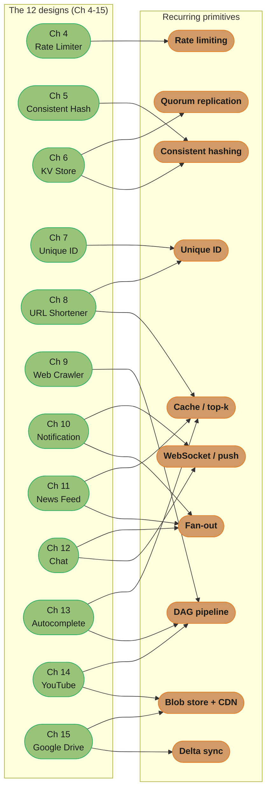

# Chapter 16: The Learning Continues

> Ch 16 of 16 · System Design Interview Vol 1 (Xu) · closes the book — how to keep learning from real-world engineering writing after the twelve designs

## Chapter Map

The book ends not with a thirteenth design but with a **map for self-study**: a curated
reading list of real-world system write-ups and a directory of company engineering blogs.
Xu's argument is that the twelve designs (Ch 4–15) taught you a *vocabulary* of primitives —
rate limiting, consistent hashing, quorum replication, unique IDs, fan-out, WebSockets,
tries, blob storage, delta sync — and that every real production system is a *recombination*
of that same small vocabulary at a specific scale. Once you can name the primitives, a
company engineering blog stops being a wall of unfamiliar jargon and becomes a case study you
can decode.

**TL;DR:**
- This chapter is **curation + synthesis**, not a new design — its value is teaching you to
  *read* real architectures, which is where learning continues after the book.
- The **real-world systems list** pairs each famous write-up (Facebook Memcache, Twitter
  Snowflake, Netflix Open Connect, Dropbox sync, Amazon Dynamo…) with the exact SDI-1 chapter
  it extends — so each article is "the production sequel" to a design you already studied.
- The **method** is a pattern-recognition loop: read a blog post, ask "which of the ~10
  recurring primitives is this?", and map it back onto the chapter that introduced it.

## The Big Question

> "I finished twelve designs. How do I keep getting better *without* an interview book —
> from the raw engineering writing that real companies publish about the systems they
> actually run?"

Analogy: the twelve designs are **scales and chords**; real-world engineering blogs are
**recorded performances**. You do not learn jazz by memorizing more chord charts — you learn
it by listening to performances and hearing *which* chords the player reached for and *why*.
This chapter hands you the listening list and teaches you to hear the primitives inside the
music.

---

## 16.1 A Reference of Real-World Systems

Xu closes with a list of the write-ups that most repay careful reading, because each is the
**production-scale sequel** to a chapter's toy design. The table below reproduces that list,
grouped by the engineering concern it teaches, and adds the column the book implies but does
not print: **which SDI-1 chapter each article extends**. Article names are plain text (they
move and get re-hosted); the stable canonical blog *domains* are listed in §16.2.

### Feeds, timelines, and the social graph

| System / article | Company | The one lesson it teaches | Extends |
|------------------|---------|---------------------------|---------|
| Facebook Timeline: Brought to You by the Power of Denormalization | Facebook | Denormalize aggressively so a feed read is one lookup, not a join | Ch 11 News Feed |
| Scaling Memcache at Facebook | Facebook | Look-aside cache tier at scale — leases, thundering-herd, regional pools | Ch 1 / Ch 8 caching |
| TAO: Facebook's Distributed Data Store for the Social Graph | Facebook | A read-optimized graph API layered over MySQL + memcache | Ch 11 News Feed |
| The Architecture Twitter Uses for 150M Users, 300K QPS Timelines | Twitter | Hybrid fan-out: precompute most timelines, pull for celebrities | Ch 11 News Feed |
| Timelines at Scale | Twitter | Fan-out-on-write into per-user timeline caches, with a pull fallback | Ch 11 News Feed |

### Unique IDs, key-value stores, and data infrastructure

| System / article | Company | The one lesson it teaches | Extends |
|------------------|---------|---------------------------|---------|
| Announcing Snowflake | Twitter | 64-bit, time-sorted, coordination-free distributed IDs | Ch 7 Unique ID |
| Sharding & IDs at Instagram | Instagram | Generate globally-unique, time-ordered IDs inside Postgres shards | Ch 7 Unique ID |
| Manhattan: Twitter's Real-Time, Multi-Tenant Distributed Database | Twitter | A self-serve KV store with tunable consistency per keyspace | Ch 6 Key-Value Store |
| Amazon's Dynamo (paper) | Amazon | Leaderless quorums, vector clocks, consistent hashing, hinted handoff | Ch 6 Key-Value Store |
| Bigtable: A Distributed Storage System for Structured Data | Google | Wide-column store over SSTables (LSM) and a distributed file system | Ch 6 Key-Value Store |
| Spanner: Google's Globally-Distributed Database | Google | TrueTime bounds turn clock uncertainty into external consistency | Ch 6 Key-Value Store |

### Messaging, presence, and real-time

| System / article | Company | The one lesson it teaches | Extends |
|------------------|---------|---------------------------|---------|
| Facebook Chat | Facebook | Separate channel (delivery) servers from presence servers | Ch 12 Chat |
| The WhatsApp Architecture | WhatsApp | Millions of long-lived connections per box on tuned Erlang/FreeBSD | Ch 12 Chat |
| How Facebook Live Streams to 800,000 Simultaneous Viewers | Facebook | Request coalescing at the edge collapses a thundering herd | Ch 14 YouTube |

### Streaming, video, and CDN economics

| System / article | Company | The one lesson it teaches | Extends |
|------------------|---------|---------------------------|---------|
| Netflix: What Happens When You Press Play? | Netflix | Split the control plane (AWS) from the data plane (CDN) | Ch 14 YouTube |
| Open Connect (Netflix CDN) | Netflix | Push the long tail to ISP-embedded appliances — bandwidth economics | Ch 14 YouTube |
| A 360-Degree View of the Entire Netflix Stack | Netflix | A mature microservice topology, edge-to-storage | Ch 1 Scaling |

### Marketplace, geospatial, and dispatch

| System / article | Company | The one lesson it teaches | Extends |
|------------------|---------|---------------------------|---------|
| How Uber Scales Their Real-Time Market Platform | Uber | Dispatch as consistent-hashed, sharded, in-memory state (ringpop) | Ch 5 Consistent Hashing |
| H3: Uber's Hexagonal Hierarchical Spatial Index | Uber | A hex grid makes "who is near me" a cheap cell lookup | Ch 1 sharding / geo |

### Photos, files, and sync

| System / article | Company | The one lesson it teaches | Extends |
|------------------|---------|---------------------------|---------|
| Finishing the Job of Scaling Instagram | Instagram | Scale a small stack (Django, pgbouncer, memcache) a long way | Ch 1 Scaling |
| How We've Scaled Dropbox | Dropbox | Split metadata store from the block/blob store | Ch 15 Google Drive |
| Rearchitecting the Dropbox Sync Engine (Nucleus) | Dropbox | Block-level delta sync with a correct, testable state model | Ch 15 Google Drive |
| The Google File System (paper) | Google | Chunked, replicated blob storage for huge files | Ch 14 / Ch 15 |

### Batch pipelines and analytics

| System / article | Company | The one lesson it teaches | Extends |
|------------------|---------|---------------------------|---------|
| MapReduce: Simplified Data Processing on Large Clusters | Google | Express batch work as a two-stage (map → reduce) DAG | Ch 9 / Ch 13 |
| Scaling Pinterest | Pinterest | Shard MySQL by ID and keep the topology boringly simple | Ch 7 / Ch 1 |

Reading tactic: open each article *after* re-reading its "Extends" chapter. You will
recognize the primitive immediately, and the article shows you what the primitive costs and
breaks at 1000× the book's scale.

---

## 16.2 Company Engineering Blogs

The second half of the chapter is a directory of the engineering blogs worth subscribing to.
The value of a blog is not breadth but a **signature theme** — the problem that company
writes about better than anyone. Track the theme, not every post. Domains are the stable
canonical ones (individual post URLs churn).

| Company | Canonical blog | Famous for writing about | One must-read theme |
|---------|----------------|--------------------------|---------------------|
| Airbnb | medium.com/airbnb-engineering | Data infrastructure, service migration | Monolith → SOA migration playbooks |
| Amazon / AWS | aws.amazon.com/builders-library | Operating distributed systems reliably | Timeouts, retries, and jitter (the Builders' Library) |
| Cloudflare | blog.cloudflare.com | Edge networking and DDoS at global scale | Anycast, edge compute, mitigating attacks |
| Discord | discord.com/blog | Real-time chat and voice at scale | Trillions of messages on Cassandra/ScyllaDB |
| Dropbox | dropbox.tech | File sync and storage | Rearchitecting the sync engine; Magic Pocket storage |
| eBay | innovation.ebayinc.com | Search and large-scale commerce | Query understanding and relevance |
| Facebook / Meta | engineering.fb.com | Caching, storage, and the social graph | Memcache, TAO, Haystack photo storage |
| GitHub | github.blog/engineering | Availability of a developer platform | MySQL failover, git at scale, incident writeups |
| Google | research.google | Foundational distributed-systems papers | Bigtable, Spanner, MapReduce, Chubby |
| Instagram | instagram-engineering.com | Sharding a fast-growing product | IDs and schema-based sharding in Postgres |
| LinkedIn | engineering.linkedin.com | Streaming and the log abstraction | Kafka and the "log as source of truth" |
| Netflix | netflixtechblog.com | Resilience and streaming delivery | Chaos engineering, microservices, Open Connect |
| Pinterest | medium.com/pinterest-engineering | Pragmatic sharding and feeds | Scaling MySQL and the home feed |
| Quora | quoraengineering.quora.com | ML-driven ranking and caching | Feed ranking, cache consistency |
| Reddit | reddit.com/r/RedditEng | Comment trees, voting, and feeds | Ranking hot content; comment-tree storage |
| Shopify | shopify.engineering | Bursty commerce traffic (flash sales) | Sharding, resiliency, and load shedding |
| Slack | slack.engineering | Real-time messaging and presence | Flannel edge cache; scaling WebSockets |
| Spotify | engineering.atspotify.com | Event delivery and org structure | Event pipelines; the "Squad" model |
| Stripe | stripe.com/blog/engineering | Correctness and idempotency in payments | Idempotency keys; API design and reliability |
| Twitter / X | blog.x.com/engineering | Timelines and unique IDs | Snowflake, hybrid fan-out, Manhattan |
| Uber | uber.com/blog/engineering | Real-time marketplace and geo | Dispatch, ringpop, the H3 spatial index |
| Yelp | engineeringblog.yelp.com | Data pipelines and search | Real-time streaming (Data Pipeline / MySQLStreamer) |

Also worth bookmarking: the community-maintained **System Design Primer** (github.com/donnemartin/system-design-primer)
and the **High Scalability** blog, both of which aggregate and re-explain these same articles.

---

## 16.3 How to Study Real-World Architectures

This is the synthesis the book is really selling. Every one of the twelve designs introduced
a reusable primitive; almost every product design then *reused* primitives from earlier
chapters. Internalize the recurrence and you can decode any new system by asking which
primitives it is made of.

### The recurring building blocks → chapter matrix

| Primitive | What problem it solves | SDI-1 chapters that use it |
|-----------|------------------------|----------------------------|
| **Rate limiting** | Protect a service from too many requests; fair sharing | Ch 4 (introduces); implicit in Ch 9 crawler politeness, any public API |
| **Consistent hashing** | Add/remove nodes while moving minimal keys; avoid hotspots | Ch 5 (introduces); Ch 6 KV store, Ch 8 cache/DB sharding, Ch 13 trie shards |
| **Quorum replication** | Tunable consistency + availability with N/W/R | Ch 6 (introduces); the durability story behind Ch 8/11/15 stores |
| **Unique ID generation** | Coordination-free, often time-sortable identifiers | Ch 7 (introduces); Ch 8 short URLs, Ch 11 feed ordering, Ch 12 message IDs |
| **Fan-out** | Deliver one event to many recipients (write vs read) | Ch 10 notification, Ch 11 news feed, Ch 12 chat groups |
| **WebSocket vs polling** | Server-initiated push vs client pull for real-time | Ch 10 (push via APNs/FCM), Ch 12 (WebSocket) — opposite choices |
| **Trie + top-k** | Prefix lookup with ranked suggestions | Ch 13 autocomplete (introduces) |
| **Blob storage + CDN** | Store and serve large immutable objects near users | Ch 8 (assets), Ch 14 video, Ch 15 files |
| **DAG pipelines** | Multi-stage batch/stream processing | Ch 9 crawler stages, Ch 13 analytics aggregation, Ch 14 transcoding |
| **Delta sync** | Transfer only changed blocks, not whole files | Ch 15 Google Drive (introduces) |
| **CDN long-tail economics** | Cache popular objects at the edge, pay origin only for the tail | Ch 14 YouTube, Ch 15 Drive |

Notice the shape: the four "infrastructure" chapters (4–7) are pure primitives, and the
eight product chapters (8–15) are *assembled from them*. Consistent hashing alone reappears
in four designs; fan-out anchors three; blob storage + CDN anchors three.

### The mapping method — decode any blog post in three questions

When you read a new company write-up, run this loop. It converts unfamiliar prose into
primitives you already own.

1. **What is the dominant read/write shape?** Read-heavy and cacheable (URL shortener,
   autocomplete) points at caching + CDN. Write-heavy with many recipients points at
   fan-out. This one question usually names the primitive.
2. **How does it stay consistent and available when a node dies?** The answer is almost
   always one of: consistent hashing (rebalancing), quorum replication (durability), or a
   leader/consensus service. Map it to Ch 5–6.
3. **How is real-time / uniqueness / large-object handled?** Push vs pull → Ch 10/12.
   Global IDs → Ch 7. Big files → blob storage + CDN → Ch 14/15. Multi-stage processing →
   DAG pipeline → Ch 9/13/14.

Worked example — reading "Scaling Memcache at Facebook": Q1 says massively read-heavy →
caching. The article's leases and regional pools are the *production* answer to the
thundering-herd and cache-consistency problems Ch 1 and Ch 8 only gestured at. You did not
need new theory — you needed the caching primitive at 1000× scale.

---

## Visual Intuition

Caption: the twelve designs (green) fan into ten primitives (orange), and the primitives with
many incoming edges — consistent hashing (Ch 5, 6, 8, 13), fan-out (Ch 10, 11, 12), blob+CDN
(Ch 8, 14, 15), DAG pipelines (Ch 9, 13, 14) — are exactly the ones worth mastering because
they recur across the most systems.

---

## Key Concepts Glossary

- **Real-world systems reference** — the book's curated list of production write-ups, each the scaled sequel to a chapter's design.
- **Company engineering blog** — a company's technical publication; valued for its signature theme, not breadth.
- **Signature theme** — the one problem a company writes about better than anyone (Netflix: resilience; Stripe: idempotency).
- **Primitive / building block** — a reusable design element (rate limiting, consistent hashing, fan-out…) that recurs across systems.
- **Pattern recognition** — decoding a new system by naming which known primitives compose it.
- **Fan-out** — delivering one event to many recipients; on-write (precompute) vs on-read (assemble on request).
- **Long-tail economics (CDN)** — caching popular objects at the edge so origin only serves the rare tail.
- **Delta / block-level sync** — transferring only changed blocks of a file instead of the whole file.
- **DAG pipeline** — a multi-stage processing graph (map→reduce, upload→transcode→package).
- **Control plane vs data plane** — separating the system that *decides* (metadata, routing) from the one that *moves bytes* (CDN, blob store).
- **Denormalization** — pre-joining/duplicating data so a read is one lookup, trading write cost and storage for read speed.
- **Request coalescing** — collapsing many identical concurrent requests into one upstream fetch (thundering-herd fix).

---

## Tradeoffs & Decision Tables

| If a blog post is about… | The primitive is almost certainly… | Re-read chapter |
|--------------------------|-------------------------------------|-----------------|
| A cache tier, leases, thundering herd | Caching + request coalescing | Ch 1 / Ch 8 |
| Adding/removing shards with minimal data movement | Consistent hashing | Ch 5 |
| Vector clocks, quorums, hinted handoff | Quorum replication | Ch 6 |
| Time-sortable 64-bit IDs across machines | Unique ID generation | Ch 7 |
| Delivering a post/message to many followers | Fan-out (write vs read) | Ch 11 / Ch 10 |
| Millions of persistent connections, presence | WebSocket + push | Ch 12 |
| ISP appliances, edge cache hit ratio, egress cost | Blob storage + CDN | Ch 14 |
| Syncing files with minimal bandwidth | Block-level delta sync | Ch 15 |
| Map/reduce, transcode stages, crawl stages | DAG pipeline | Ch 9 / Ch 13 / Ch 14 |

| Learning approach | Strength | Weakness |
|-------------------|----------|----------|
| Memorize more designs | Broad coverage of question types | Brittle; misses *why* a choice was made |
| Read blogs without a framework | Real, current detail | Overwhelming; no transfer between systems |
| Map blogs onto SDI-1 primitives (this chapter) | Transfer: each article reinforces a primitive | Requires knowing the twelve designs first |

---

## Common Pitfalls / War Stories

- **Reading blogs as trivia, not primitives.** Collecting "Netflix uses X, Uber uses Y" facts
  without asking *which primitive and why* gives you memorized answers that shatter the moment
  an interviewer changes the constraints. Always reduce the post to its building block.
- **Cargo-culting a FAANG solution at the wrong scale.** "Facebook built TAO, so I need a
  custom graph store" — no. TAO exists because memcache + MySQL alone could not serve the
  social graph at Facebook's read volume. At 1% of that scale, the earlier, simpler design in
  the chapter is correct. Copy the *reasoning*, not the artifact.
- **Ignoring the "why we changed it" posts.** The most instructive articles are the
  re-architecture ones (Dropbox's Nucleus rewrite, Twitter's move off Ruby timelines) — they
  document the exact failure mode of the naive design the chapter taught, which is the highest-
  value knowledge and the rarest.
- **Chasing breadth over signature themes.** Subscribing to forty blogs and reading none
  deeply beats nothing but loses to reading Stripe on idempotency, Netflix on resilience, and
  Cloudflare on the edge — three signature themes — end to end.
- **Skipping the estimation step when reading.** A blog post's numbers (QPS, storage, egress
  cost) are the whole point; skimming past them wastes the article. Re-derive them with the
  Ch 2 back-of-the-envelope habit and the design choices suddenly make sense.

---

## Real-World Systems Referenced

Facebook/Meta (Timeline denormalization, Scaling Memcache, TAO, Haystack, Facebook Live,
Facebook Chat); Twitter/X (Snowflake, Timelines at Scale, the 300K-QPS architecture,
Manhattan); Netflix (What Happens When You Press Play, Open Connect, the 360-degree stack);
Uber (real-time market platform, ringpop, H3); Instagram (Sharding & IDs, scaling the stack);
Dropbox (How We've Scaled Dropbox, the Nucleus sync-engine rewrite); Google (Bigtable, GFS,
Spanner, Chubby, MapReduce, Dremel); Amazon (Dynamo); Pinterest (Scaling Pinterest);
WhatsApp (the Erlang architecture); Yelp (real-time data pipeline). Plus the engineering blogs
of Airbnb, Cloudflare, Discord, eBay, GitHub, LinkedIn, Quora, Reddit, Shopify, Slack,
Spotify, and Stripe (see §16.2), and the community-maintained System Design Primer and High
Scalability aggregators.

---

## Summary

The final chapter is deliberately not a design — it is the **on-ramp to lifelong study**. The
twelve designs (Ch 4–15) gave you a compact vocabulary of primitives; Xu's closing move is to
show that every famous production system is a recombination of that vocabulary, and to hand
you the reading list and blog directory to see it for yourself. The **real-world systems
reference** pairs each write-up with the chapter it extends, so Twitter Snowflake is "Ch 7 at
scale," Netflix Open Connect is "Ch 14's CDN economics made real," and Dropbox Nucleus is "Ch
15's delta sync, rebuilt correctly." The **engineering-blog directory** tells you whose
signature theme is worth tracking. And the **synthesis** — the pattern→chapter matrix plus the
three-question mapping method — is the transferable skill: read any architecture, ask its
read/write shape, its failure/consistency story, and its real-time/uniqueness/large-object
handling, and you will name the primitives it is built from. That is the point of the book:
not twelve answers, but the ability to decode the thirteenth system you have never seen.

---

## Interview Questions

**Q: Which SDI-1 designs use fan-out, and how do their strategies differ?**
Three designs use fan-out: notification (Ch 10), news feed (Ch 11), and chat (Ch 12). Notification fans one event out to device tokens across APNs/FCM/SMS/email via queues; news feed chooses between fan-out-on-write (precompute each follower's timeline) and fan-out-on-read (assemble at request time), using a hybrid because celebrities make write fan-out explode; chat fans a group message out to each member's per-device message queue. The shared idea is one-to-many delivery; the difference is whether delivery is precomputed, pulled, or pushed over a live connection.

**Q: When would you pick long polling or push over WebSocket, and which two chapters take opposite sides?**
Pick push/polling when the client is often offline or delivery is bursty and third-party-mediated, and WebSocket when you need a low-latency bidirectional live channel. Chapters 10 and 12 take opposite sides: the notification system (Ch 10) uses server push through APNs/FCM because phones sleep and you cannot hold a socket open to every device, while the chat system (Ch 12) holds a persistent WebSocket per active client for instant two-way messaging. The deciding factor is connection lifetime and who initiates delivery.

**Q: In how many of the twelve designs does consistent hashing appear, and for what job each time?**
Consistent hashing appears in roughly four designs: it is introduced in Ch 5, then reused to place keys in the Ch 6 key-value store, to shard the cache and database in Ch 8's URL shortener, and to shard trie storage in Ch 13's autocomplete. Each time the job is the same — add or remove nodes while moving the minimum number of keys and avoiding hotspots — which is exactly why it is worth mastering as a primitive rather than a one-off.

**Q: Which chapters reuse the Snowflake-style unique ID generator, and why?**
Unique ID generation is introduced in Ch 7 and reused wherever the system needs coordination-free, often time-sortable identifiers: Ch 8 derives short URLs from unique IDs via base-62, Ch 11 orders feed entries by time-sortable IDs, and Ch 12 assigns message IDs that also establish per-conversation ordering. The recurring need is a globally unique key generated without a central coordinator, with the high bits holding a timestamp so IDs sort chronologically.

**Q: How do you map a company blog post onto SDI-1 primitives when you have never seen the system?**
Ask three questions: what is the dominant read/write shape, how does it stay consistent when a node dies, and how does it handle real-time, uniqueness, or large objects. Read-heavy and cacheable points at caching plus CDN; write-heavy to many recipients points at fan-out; node-death recovery points at consistent hashing or quorum replication; push vs pull points at Ch 10 or 12; big files point at blob storage plus CDN. Those questions reduce almost any architecture to the primitives you already studied.

**Q: Why is Chapter 16 valuable even though it introduces no new system design?**
Its value is teaching pattern recognition — the ability to read real architectures and decode them into primitives you already know. The twelve designs gave you a vocabulary; this chapter shows every production system is a recombination of that vocabulary and hands you the reading list to practice on. Skipping it leaves you with twelve memorized answers instead of a transferable decoding skill, which is what actually distinguishes a strong candidate.

**Q: What is the difference between fan-out-on-write and fan-out-on-read, and which design forces a hybrid?**
Fan-out-on-write precomputes and pushes each new item into every recipient's timeline at post time, making reads cheap but writes expensive; fan-out-on-read assembles the timeline on demand at read time, making writes cheap but reads expensive. The news feed (Ch 11) forces a hybrid: pure write fan-out explodes for a celebrity with tens of millions of followers, so you precompute for normal users and pull-merge posts from celebrities at read time. The chapter's celebrity problem is the canonical reason no single strategy wins.

**Q: Which SDI-1 designs are dominated by CDN long-tail economics, and what does that mean?**
YouTube (Ch 14) and Google Drive (Ch 15) are dominated by CDN economics because both serve large immutable objects to geographically spread users. Long-tail economics means a small set of popular objects gets most requests and belongs in edge caches, while the rare tail is served from origin — so you optimize edge hit ratio and only pay expensive origin egress for infrequent objects. Netflix's Open Connect, embedding cache appliances inside ISPs, is the production expression of this idea.

**Q: What single primitive underpins the hot-key or celebrity problem across news feed, chat, and key-value stores?**
Uneven load distribution — a few keys or users receiving vastly more traffic than the average — is the shared cause. In the news feed it is the celebrity with millions of followers; in a group chat it is a huge channel; in a key-value store it is a hot partition. The mitigations rhyme: special-case the hot entity (pull instead of push for celebrities), replicate or split the hot key, or add caching in front of it. Recognizing it as one primitive lets you reuse the same three fixes.

**Q: Which designs use DAG-style pipelines, and what stages does each run?**
Three designs use multi-stage pipelines: the web crawler (Ch 9) runs fetch → parse → dedup → store; the search autocomplete system (Ch 13) runs a sampled analytics pipeline that aggregates query logs into trie updates; and YouTube (Ch 14) runs upload → transcode into multiple formats → package → distribute. Google's MapReduce paper is the canonical batch-DAG reference. In every case the win is decoupling stages so each scales and retries independently.

**Q: How does the "Scaling Memcache at Facebook" article extend a specific SDI-1 chapter?**
It extends the caching material in Ch 1 and Ch 8 by showing the look-aside cache at extreme read scale. The chapters teach the basic cache-aside pattern; the article adds the production problems that only appear at scale — leases to prevent thundering-herd and stale sets, regional cache pools, and cross-region consistency. The primitive is unchanged; the article shows what it costs and how it breaks at Facebook's read volume.

**Q: What recurring problem does consistent hashing solve that naive hash-mod-N does not?**
Consistent hashing minimizes key remapping when the number of nodes changes, whereas hash-mod-N remaps almost every key. With modulo, adding or removing one server changes N and forces nearly all keys to new nodes, causing a cache-stampede or massive data movement; consistent hashing places nodes on a ring so adding or removing one node only moves the keys in its immediate arc. Virtual nodes then even out the load so no single node becomes a hotspot.

**Q: Which SDI-1 design is the canonical read-heavy system, and which are write- or fan-out-heavy?**
The URL shortener (Ch 8) is the canonical read-heavy, highly cacheable system — reads dominate writes by orders of magnitude, so caching and a read-optimized store carry the design. The write- and fan-out-heavy systems are the notification service (Ch 10), news feed (Ch 11), and chat (Ch 12), where a single action must be delivered to many recipients. Contrasting Ch 8 against Ch 10–12 is the sharpest read-vs-write tradeoff in the book.

**Q: Why should you read a company's re-architecture ("why we changed it") posts before its greenfield ones?**
Because re-architecture posts document the exact failure mode of the naive design, which is the highest-value and rarest knowledge. A greenfield post tells you what they built; a rewrite post — Dropbox's Nucleus sync engine, Twitter moving timelines off Ruby — tells you why the obvious first design broke and what constraint forced the change. Interviews reward knowing the failure modes, and those live in the rewrite stories.

**Q: What is the danger of cargo-culting a FAANG architecture in an interview?**
Copying a big-company artifact without its scale justification signals you do not understand why it exists. Facebook built TAO because memcache plus MySQL could not serve the social graph at its read volume; proposing a custom graph store for a system at 1% of that scale is over-engineering. The right move is to copy the *reasoning* — identify the constraint that would force the complex solution — and only reach for it when your estimated scale actually crosses that line.

**Q: What is a company engineering blog's "signature theme," and why track it instead of reading broadly?**
A signature theme is the one problem a company writes about better than anyone — Netflix on resilience and chaos engineering, Stripe on idempotency and payment correctness, Cloudflare on edge networking. Tracking a few signature themes end to end builds deep, transferable understanding of specific primitives, whereas skimming forty blogs yields shallow trivia. Depth on the theme beats breadth because the primitive, not the company, is what transfers to new problems.

**Q: How does Netflix's control-plane/data-plane split map onto an SDI-1 design?**
It maps onto YouTube (Ch 14): the control plane (running in AWS) handles metadata, user requests, and orchestration, while the data plane (Open Connect CDN appliances) moves the actual video bytes near users. The SDI-1 chapter teaches serving video from a CDN rather than origin; Netflix's write-up is the production form, separating the system that *decides* from the system that *ships bytes* so each scales on its own axis.

**Q: What does delta (block-level) sync solve, and which design introduces it?**
Delta sync transfers only the changed blocks of a file instead of re-uploading the whole file, saving bandwidth and time; Google Drive (Ch 15) introduces it. A large document edited by one character should cost one block, not the whole file, so the client hashes fixed-size blocks, compares against the server, and sends only the differing blocks. Dropbox's sync-engine write-ups are the production reference for getting this correct under concurrent edits and conflicts.

**Q: Why does Snowflake put the timestamp in the high bits of the 64-bit ID?**
Putting the timestamp in the high bits makes IDs sort chronologically, so ordering by ID is ordering by creation time. The layout is roughly a sign bit, ~41 timestamp bits, ~10 machine bits, and ~12 per-millisecond sequence bits; because the most significant bits are time, a plain numeric sort yields time order, which is exactly what feeds and message logs (Ch 11, Ch 12) need without a separate timestamp column or index.

**Q: What three questions turn an unfamiliar engineering blog post into a known primitive?**
Ask the read/write shape, the node-failure consistency story, and the real-time/uniqueness/large-object handling. The read/write shape reveals caching vs fan-out; the failure story reveals consistent hashing vs quorum replication vs a consensus service; the third reveals push vs pull, ID generation, or blob-plus-CDN. Running this loop on every article converts prose you have never seen into the same ten primitives the twelve designs already taught you.

---

## Cross-links in this repo

The natural next step after this book is the repo's own catalog of worked designs, which take
several of these primitives to principal-engineer depth:

- [hld/ — the full high-level-design module index (caching, sharding, consistent hashing, message queues, CAP)](../../../hld/README.md)
- [hld/case_studies/ — the repo's worked designs (Twitter, WhatsApp, URL shortener, web crawler, notifications, autocomplete, Netflix, Google Drive)](../../../hld/case_studies/README.md)

Sibling SDI-1 chapters whose primitives this chapter synthesizes:

- [Ch 1 — Scale From Zero to Millions (the toolbox every design reuses)](../01_scale_from_zero_to_millions_of_users/README.md)
- [Ch 5 — Consistent Hashing (the most-reused primitive)](../05_design_consistent_hashing/README.md)
- [Ch 8 — URL Shortener (canonical read-heavy design)](../08_design_a_url_shortener/README.md)
- [Ch 9 — Web Crawler (DAG-pipeline design)](../09_design_a_web_crawler/README.md)
- [Ch 10 — Notification System (fan-out + push)](../10_design_a_notification_system/README.md)
- [Ch 12 — Chat System (WebSocket + fan-out)](../12_design_a_chat_system/README.md)

## Further Reading

- Xu, System Design Interview Vol 1, Ch 16 — the original reading list and blog directory.
- DeCandia et al., "Dynamo: Amazon's Highly Available Key-Value Store," 2007 — quorums, vector clocks, consistent hashing.
- Chang et al., "Bigtable: A Distributed Storage System for Structured Data," 2006.
- Corbett et al., "Spanner: Google's Globally-Distributed Database," 2012 — TrueTime.
- Ghemawat, Gobioff & Leung, "The Google File System," 2003.
- Dean & Ghemawat, "MapReduce: Simplified Data Processing on Large Clusters," 2004.
- Nishtala et al., "Scaling Memcache at Facebook," 2013.
- "Announcing Snowflake" — Twitter Engineering, 2010.
- The System Design Primer (github.com/donnemartin/system-design-primer) and the High Scalability blog — community aggregators of the above.
