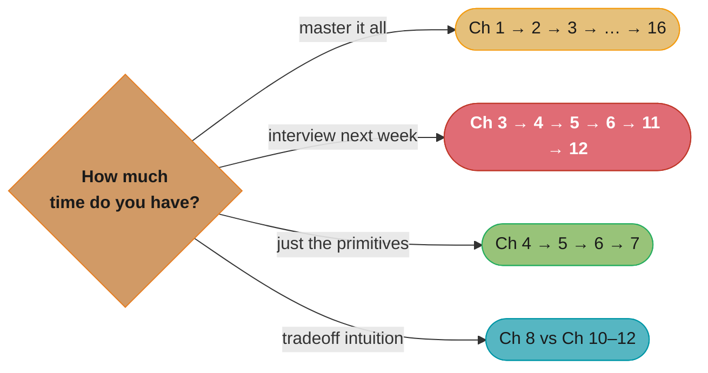

# System Design Interview — An Insider's Guide, Volume 1 (SDI-1)

> Alex Xu · ByteByteGo · "A step-by-step framework plus twelve worked designs." A
> chapter-by-chapter, in-depth summary — read this folder in order and you have read the
> book.

---

## The Book's Thesis

System design interviews are not a trivia quiz — they simulate the real, ambiguous,
open-ended work of building systems at scale, compressed into 45–60 minutes. The book's
claim is that this can be **trained**: first internalize a small toolbox of scaling
building blocks (Ch 1), learn to size any system on the back of an envelope (Ch 2), and
adopt a repeatable 4-step conversation framework (Ch 3). Then drill that method through
twelve classic designs (Ch 4–15), each one introducing a reusable primitive — rate
limiting, consistent hashing, quorum replication, unique ID generation, fan-out,
WebSockets, tries, blob storage, delta sync — that recombines into almost every other
interview question. Chapter 16 points at where to keep learning.

Every design chapter follows the same 4-step spine, and so do the summaries in this
folder:

1. **Understand the problem and establish design scope** — ask questions, pin down
   functional + non-functional requirements, estimate scale.
2. **Propose high-level design and get buy-in** — a simple end-to-end blueprint first.
3. **Design deep dive** — the 2–3 components where the hard tradeoffs live.
4. **Wrap up** — bottlenecks, failure modes, follow-up improvements.

---

## The Book Map

```mermaid
flowchart TD
    classDef io      fill:#61afef,stroke:#2e86c1,color:#1a1a1a,font-weight:bold
    classDef frozen  fill:#c678dd,stroke:#9b59b6,color:#fff
    classDef train   fill:#98c379,stroke:#27ae60,color:#1a1a1a
    classDef mathOp  fill:#d19a66,stroke:#e67e22,color:#1a1a1a,font-weight:bold
    classDef lossN   fill:#e06c75,stroke:#c0392b,color:#fff,font-weight:bold
    classDef req     fill:#56b6c2,stroke:#0097a7,color:#1a1a1a
    classDef base    fill:#e5c07b,stroke:#f39c12,color:#1a1a1a

    root(["SDI Volume 1"]) --> M
    root --> B
    root --> P
    root --> N

    subgraph M["The Method (Ch 1–3)"]
        C1(["Ch 1<br/>Scale from Zero<br/>to Millions"]) --> C2(["Ch 2<br/>Back-of-the-Envelope<br/>Estimation"]) --> C3(["Ch 3<br/>The 4-Step<br/>Framework"])
    end

    subgraph B["Building Blocks (Ch 4–7)"]
        C4(["Ch 4<br/>Rate Limiter"]) --> C5(["Ch 5<br/>Consistent<br/>Hashing"]) --> C6(["Ch 6<br/>Key-Value<br/>Store"]) --> C7(["Ch 7<br/>Unique ID<br/>Generator"])
    end

    subgraph P["Product Systems (Ch 8–15)"]
        C8(["Ch 8<br/>URL<br/>Shortener"]) --> C9(["Ch 9<br/>Web<br/>Crawler"]) --> C10(["Ch 10<br/>Notification<br/>System"]) --> C11(["Ch 11<br/>News Feed"])
        C12(["Ch 12<br/>Chat<br/>System"]) --> C13(["Ch 13<br/>Search<br/>Autocomplete"]) --> C14(["Ch 14<br/>YouTube"]) --> C15(["Ch 15<br/>Google<br/>Drive"])
        C11 --> C12
    end

    N(["Ch 16<br/>The Learning<br/>Continues"])

    class root io
    class C1,C2,C3 base
    class C4,C5,C6,C7 mathOp
    class C8,C9,C10,C11 train
    class C12,C13,C14,C15 req
    class N frozen
```

*Gold = the method every chapter reuses; orange = infrastructure primitives that later
chapters assume (consistent hashing reappears in Ch 6, 8, 13; the KV store underpins
Ch 8's cache and Ch 13's trie storage); green/teal = the eight product designs; purple =
further study.*

---

## Chapter Index

| # | Chapter | Folder | One-line summary | Repo deep-dive |
|---|---------|--------|------------------|----------------|
| 1 | Scale From Zero To Millions Of Users | [01_scale_from_zero_to_millions_of_users/](01_scale_from_zero_to_millions_of_users/README.md) | The full scaling toolbox: LB, replication, cache, CDN, stateless web tier, sharding | [hld/scalability/](../../hld/scalability/README.md) |
| 2 | Back-of-the-Envelope Estimation | [02_back_of_the_envelope_estimation/](02_back_of_the_envelope_estimation/README.md) | Powers of two, latency numbers, availability math, QPS/storage estimates | [hld/scalability/](../../hld/scalability/README.md) |
| 3 | A Framework For System Design Interviews | [03_a_framework_for_system_design_interviews/](03_a_framework_for_system_design_interviews/README.md) | The 4-step interview framework, time budget, dos and don'ts | [hld/](../../hld/README.md) |
| 4 | Design A Rate Limiter | [04_design_a_rate_limiter/](04_design_a_rate_limiter/README.md) | Token bucket vs leaky bucket vs windows; distributed counters; HTTP 429 | [hld/rate_limiting/](../../hld/rate_limiting/README.md) |
| 5 | Design Consistent Hashing | [05_design_consistent_hashing/](05_design_consistent_hashing/README.md) | Hash ring, virtual nodes, hotspot and rebalancing math | [hld/consistent_hashing/](../../hld/consistent_hashing/README.md) |
| 6 | Design A Key-Value Store | [06_design_a_key_value_store/](06_design_a_key_value_store/README.md) | CAP, quorum replication, vector clocks, gossip, Merkle trees, LSM storage | [hld/case_studies/design_key_value_store.md](../../hld/case_studies/design_key_value_store.md) |
| 7 | Design A Unique ID Generator | [07_design_a_unique_id_generator/](07_design_a_unique_id_generator/README.md) | Snowflake 64-bit layout, ticket servers, UUID tradeoffs, clock drift | [hld/case_studies/design_distributed_unique_id.md](../../hld/case_studies/design_distributed_unique_id.md) |
| 8 | Design A URL Shortener | [08_design_a_url_shortener/](08_design_a_url_shortener/README.md) | Base-62 encoding, 301 vs 302, read-heavy caching | [hld/case_studies/design_url_shortener.md](../../hld/case_studies/design_url_shortener.md) |
| 9 | Design A Web Crawler | [09_design_a_web_crawler/](09_design_a_web_crawler/README.md) | URL frontier, politeness, dedup, trap avoidance, freshness | [hld/case_studies/design_web_crawler.md](../../hld/case_studies/design_web_crawler.md) |
| 10 | Design A Notification System | [10_design_a_notification_system/](10_design_a_notification_system/README.md) | APNs/FCM/SMS/email fan-out, queues, retries, idempotent delivery | [hld/case_studies/design_notification_system.md](../../hld/case_studies/design_notification_system.md) |
| 11 | Design A News Feed System | [11_design_a_news_feed_system/](11_design_a_news_feed_system/README.md) | Fan-out on write vs read, celebrity problem, feed cache layers | [hld/case_studies/design_twitter.md](../../hld/case_studies/design_twitter.md) |
| 12 | Design A Chat System | [12_design_a_chat_system/](12_design_a_chat_system/README.md) | WebSockets, message sync queues, online presence, multi-device | [hld/case_studies/design_whatsapp.md](../../hld/case_studies/design_whatsapp.md) |
| 13 | Design A Search Autocomplete System | [13_design_a_search_autocomplete_system/](13_design_a_search_autocomplete_system/README.md) | Trie + top-k caching, sampled analytics pipeline, sharding | [hld/case_studies/design_search_autocomplete.md](../../hld/case_studies/design_search_autocomplete.md) |
| 14 | Design YouTube | [14_design_youtube/](14_design_youtube/README.md) | Upload pipeline, DAG transcoding, CDN vs origin serving, pre-signed URLs | [hld/case_studies/design_netflix.md](../../hld/case_studies/design_netflix.md) |
| 15 | Design Google Drive | [15_design_google_drive/](15_design_google_drive/README.md) | Block-level delta sync, upload/notification services, conflict resolution | [hld/case_studies/design_google_drive.md](../../hld/case_studies/design_google_drive.md) |
| 16 | The Learning Continues | [16_the_learning_continues/](16_the_learning_continues/README.md) | How real companies write about their systems; a curated map of engineering blogs and papers | [hld/](../../hld/README.md) |

---

## How to Read This (Reading Paths)

- **Cover to cover (recommended):** Ch 1 → 2 → 3 first — every later chapter silently
  assumes the toolbox, the estimation habit, and the 4-step framing.
- **Interview is next week:** Ch 3 → 4 → 5 → 6 → 11 → 12. The framework plus the five
  designs whose primitives recur most often in other questions.
- **Infrastructure primitives only:** Ch 4 → 5 → 6 → 7. These four are the "vocabulary"
  chapters; each product design cites at least one of them.
- **Read-heavy vs write-heavy contrast:** Ch 8 (read-heavy, cacheable) then Ch 10–12
  (write/fan-out heavy) — the sharpest tradeoff contrast in the book.

*Four time budgets, four subsets — the "next week" path (red) covers the framework plus
the five designs whose building blocks reappear in nearly every other question.*

---

## Build Manifest

Per-file build status for this book. Update the row to `done` the moment a chapter file is
completed and diagram-linted.

| # | File | Status |
|---|------|--------|
| 1 | `01_scale_from_zero_to_millions_of_users/README.md` | done |
| 2 | `02_back_of_the_envelope_estimation/README.md` | done |
| 3 | `03_a_framework_for_system_design_interviews/README.md` | done |
| 4 | `04_design_a_rate_limiter/README.md` | done |
| 5 | `05_design_consistent_hashing/README.md` | done |
| 6 | `06_design_a_key_value_store/README.md` | done |
| 7 | `07_design_a_unique_id_generator/README.md` | done |
| 8 | `08_design_a_url_shortener/README.md` | done |
| 9 | `09_design_a_web_crawler/README.md` | done |
| 10 | `10_design_a_notification_system/README.md` | done |
| 11 | `11_design_a_news_feed_system/README.md` | done |
| 12 | `12_design_a_chat_system/README.md` | done |
| 13 | `13_design_a_search_autocomplete_system/README.md` | done |
| 14 | `14_design_youtube/README.md` | done |
| 15 | `15_design_google_drive/README.md` | done |
| 16 | `16_the_learning_continues/README.md` | done |

---

## Cross-Reference Map (SDI-1 → repo deep dives)

| SDI-1 concept | Primary deep-dive module |
|---------------|--------------------------|
| Load balancing, stateless web tier | [hld/load_balancing/](../../hld/load_balancing/README.md) |
| Caching layers, CDN | [hld/caching/](../../hld/caching/README.md), [hld/cdn/](../../hld/cdn/README.md) |
| Database replication & sharding | [hld/database_sharding/](../../hld/database_sharding/README.md), [database/replication_and_high_availability/](../../database/replication_and_high_availability/README.md) |
| Rate-limiting algorithms | [hld/rate_limiting/](../../hld/rate_limiting/README.md) |
| Consistent hashing internals | [hld/consistent_hashing/](../../hld/consistent_hashing/README.md) |
| Quorums, vector clocks, gossip | [database/consistency_models_and_consensus/](../../database/consistency_models_and_consensus/README.md) |
| Message queues & fan-out | [hld/message_queues/](../../hld/message_queues/README.md) |
| WebSockets & real-time messaging | [backend/](../../backend/CLAUDE.md) |
| CAP & consistency tradeoffs | [hld/cap_theorem/](../../hld/cap_theorem/README.md) |
