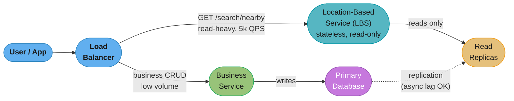
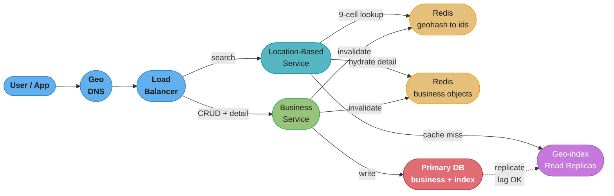
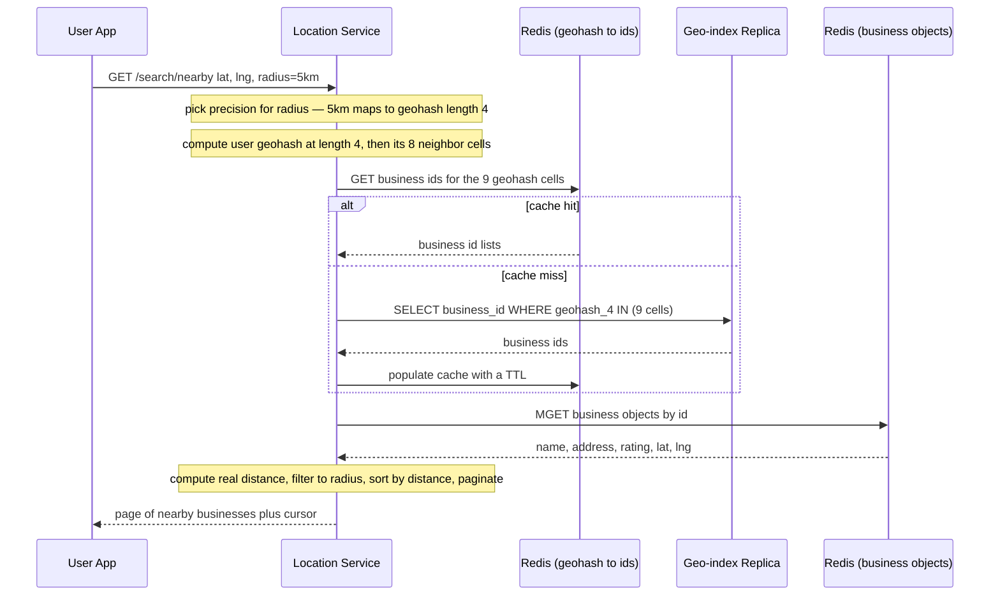
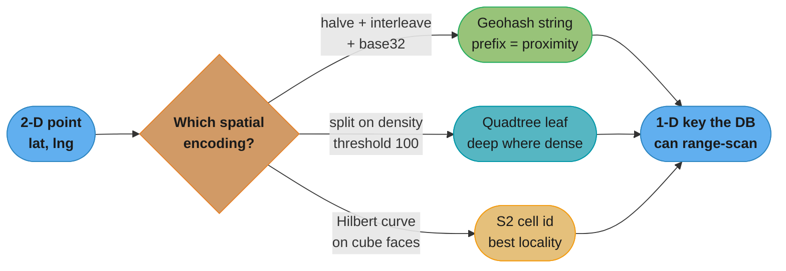
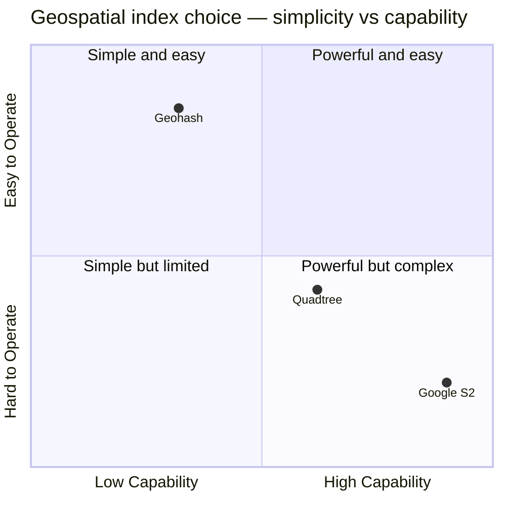

# Chapter 1: Proximity Service

> Ch 1 of 13 · System Design Interview Vol 2 (Xu & Lam) · opens the geo trilogy — its geohash/quadtree toolbox powers Ch 2 (Nearby Friends) and Ch 3 (Google Maps)

## Chapter Map

A proximity service finds nearby places — the "restaurants within 5 km of me" query behind
Yelp, Google Maps, and every food-delivery app. The chapter is a full design walkthrough of a
**Yelp-style nearby-business search** and, underneath the interview scaffolding, it is really a
guided tour of the **geospatial index** — the one data-structure decision that makes or breaks a
proximity service. The naive answer (two B-tree indexes, one on latitude and one on longitude)
collapses under load; the chapter climbs from that failure through evenly-divided grids, **geohash**,
**quadtree**, and **Google S2**, then picks the simplest tool that fits.

**TL;DR:**
- The hard part is not the API or the services — those are a stateless read path and a small write
  path. The hard part is the **2-D range search**: intersecting a latitude index with a longitude
  index is slow because each index alone returns a huge dataset.
- **Geohash** (recursively halve the world, interleave longitude/latitude bits, base32-encode) turns
  a 2-D proximity query into a **1-D string-prefix query** the SQL layer can serve — at the cost of
  a nasty **boundary problem** you fix by also querying the 8 neighbor cells.
- **Quadtree** adapts to uneven business density (a dense downtown splits deeper than empty desert)
  but lives **in memory** and is painful to rebuild and update. **S2** is mathematically superior
  (Hilbert curve, arbitrary-region cover, geofencing) but operationally complex.
- The book picks **geohash** for simplicity, keeps the geospatial index **small enough to fit one
  table** (~1.7 GB), and scales reads with **read replicas** rather than the boundary-query
  nightmare of sharding a spatial index.

---

## The Big Question

> "A user is standing at a point on Earth and wants every business within *r* kilometers, at 5,000
> queries per second, over 200 million businesses. A database index is a sorted list in *one*
> dimension. How do I answer a *two*-dimensional 'who is near me' question fast — when 'near' spans
> latitude *and* longitude at once?"

Analogy: finding people near you at a stadium. If you have one list sorted by seat-row and another
sorted by seat-column, "who is within 3 seats of me" forces you to grab everyone in my row (thousands)
*and* everyone in my column (thousands) and intersect — enormous intermediate sets for a tiny answer.
The whole chapter is the search for an index that sorts the 2-D world into **one** ordering where
"near in space" means "near in the list."

---

## 1.1 Step 1 — Understand the Problem and Establish Design Scope

### Functional requirements

The interviewer and candidate settle on a deliberately small feature set — a Yelp-like search, not
all of Yelp:

- **Return businesses near the user's location**, given the user's latitude/longitude and a search
  radius.
- **A configurable radius**, chosen from a fixed set of options (not a free slider). The book uses
  **five selectable radii: 0.5 km, 1 km, 2 km, 5 km, 20 km**. If there are not enough businesses in
  the chosen radius, the system may widen the search.
- **Business owners can add / delete / update** a business (CRUD), but these changes **do not need to
  be reflected in real time**. It is acceptable for an edit to appear in search results only the
  **next day** — this relaxation is doing heavy lifting later (it lets us cache aggressively and lean
  on read replicas with replication lag).
- **Customers view business detail** (open a business's page).

Explicitly **out of scope** for this chapter: ranking beyond distance, filtering by business type or
open-hours, and moving objects (that is the Uber/Nearby-Friends problem in Ch 2 and Ch 3).

### Non-functional requirements

- **Low latency** — users must get nearby results fast.
- **Data privacy** — location is sensitive; regulations like GDPR/CCPA constrain where data lives
  (this motivates multi-region later).
- **High availability and scalability** — survive traffic spikes in dense areas at peak hours.

### Back-of-the-envelope estimation

The book fixes the scale with one clean calculation. Given:

- **100 million daily active users (DAU)**
- **200 million businesses**
- Each user performs **~5 searches per day** on average

The search QPS is:

```
search QPS = DAU × searches per user per day / seconds per day

           = 100,000,000 × 5
             ---------------------
                    10^5              (≈ 86,400 s/day, rounded to 10^5)

           = 500,000,000 / 100,000

           ≈ 5,000 search QPS
```

So the target is roughly **5,000 searches per second** against **200 million businesses**. Peak is
some multiple of that (say 2–3×), so design for ~10,000–15,000 QPS headroom. Writes (owners editing
listings) are **negligible** by comparison — a business is edited maybe a few times ever, so the
workload is overwhelmingly **read-heavy**, and that single fact steers almost every later decision
(caching, read replicas, "not real-time" tolerance).

---

## 1.2 Step 2 — Propose High-Level Design and Get Buy-In

### API design

Two families of endpoints: **search** (the hot read path) and **business CRUD** (the cold write path).

**Search — the one that matters:**

| API | Detail |
|-----|--------|
| `GET /v1/search/nearby` | Returns businesses near a location, paginated |

Query parameters:

| Field | Description | Type |
|-------|-------------|------|
| `latitude` | Latitude of a given location | decimal |
| `longitude` | Longitude of a given location | decimal |
| `radius` | Optional; one of the five allowed values (default 5 km) | number |

The response returns only the fields needed to render a results list (id, name, address, distance,
rating) — **not** the full business object — plus a pagination cursor. Search is called constantly, so
the payload is kept lean; the full record is fetched lazily when the user taps a specific business.

```json
{
  "total": 10,
  "businesses": [
    { "id": 1, "name": "...", "distance_km": 0.4, "rating": 4.5 }
  ],
  "next_cursor": "..."
}
```

**Pagination note.** Search can match many businesses in a dense radius, so results are paged. The
API returns a page plus a cursor; even though the response says "return 10 businesses," internally the
service may compute the full candidate set for the radius and then page over it. Because the candidate
set for a geohash query is bounded (a handful of cells), cursor-based pagination over the in-memory
candidate list is cheap.

**Business APIs — standard CRUD, owned by owners:**

| API | Detail |
|-----|--------|
| `GET /v1/businesses/{id}` | Return the full detail of a business |
| `POST /v1/businesses` | Add a business (owner) |
| `PUT /v1/businesses/{id}` | Update a business (owner) |
| `DELETE /v1/businesses/{id}` | Delete a business (owner) |

`GET business` is a customer-facing read (viewing a page); the POST/PUT/DELETE trio is the low-volume
owner write path.

### Data model

**Read/write pattern is the whole argument.** Reads are enormous (5,000 QPS of search, plus business
detail views); writes are tiny (rare owner edits). This read-heavy skew means:

- A **relational database (e.g. MySQL)** is a fine primary — its main weakness (write scaling) barely
  matters here.
- We can serve reads from **read replicas** and heavy **caching** without fighting write-consistency
  battles, because "next-day visibility" tolerates replication lag and stale caches.

**Business table** — the source of truth for a business's attributes:

| Column | Notes |
|--------|-------|
| `business_id` | Primary key |
| `name` | |
| `address`, `city`, `state`, `country`, `zip` | |
| `latitude` | The business's location |
| `longitude` | |
| `type`, `hours`, `phone`, ... | Display attributes |

**Geospatial index table** — the structure that answers "which businesses are near this point?" *The
exact schema of this table is the entire Step-3 deep dive* and is deliberately deferred here. All we
commit to in Step 2 is that there **is** a separate index table (or in-memory structure), keyed by
some spatial encoding of `(latitude, longitude)` → `business_id`, because the plain business table
cannot answer a proximity query efficiently.

### High-level design

Two services, scaling **independently**, in front of a database layer:



Caption: two services split by workload — the LBS is a stateless, read-only, QPS-hungry search path
that only ever touches read replicas, while the business service owns the rare writes to the primary;
async replication lag is acceptable because edits need only appear next-day.

- **Load balancer** — routes by URL path: `/search/nearby` to the LBS, `/businesses/*` to the business
  service.
- **Location-based service (LBS)** — the read-heavy core. It is **read-only, stateless, and
  QPS-hungry**: no writes, so it scales horizontally just by adding replicas behind the LB, and
  because it holds no session state any replica can serve any request. This is where the geospatial
  index lookup happens.
- **Business service** — handles the two distinct jobs: **owner writes** (add/update/delete, to the
  primary DB) and **customer reads** of a single business's detail. Because writes are rare, this
  service is small.
- **Database cluster** — a **primary** that takes the few writes, replicating asynchronously to a
  fleet of **read replicas** that absorb the read flood. Replication lag is fine here (next-day
  visibility).

The key architectural insight of Step 2: because the two services have wildly different scaling
profiles (5,000 QPS of stateless reads vs. a trickle of writes), **splitting them lets each scale on
its own axis** — you add LBS replicas for search traffic without touching the write path, and vice
versa.

---

## 1.3 Step 3 — Design Deep Dive

Everything so far was scaffolding. The heart of the chapter is one question: **how do we build the
geospatial index** so `GET /search/nearby` is fast over 200 M businesses? The book surveys the options
from worst to best.

### Two-dimensional search — the naive approach

The obvious first attempt: store latitude and longitude as columns and query a bounding box.

```sql
SELECT business_id, latitude, longitude
FROM   business
WHERE  latitude  BETWEEN {my_lat} - radius AND {my_lat} + radius
  AND  longitude BETWEEN {my_lng} - radius AND {my_lng} + radius;
```

This **works but does not scale**. The problem is that a database index is a **1-D sorted structure**.
You can put an index on `latitude` and an index on `longitude`, but each index only narrows **one**
dimension. Consider the two result sets:

```
Index on latitude alone            Index on longitude alone
(everything in the lat band):      (everything in the lng band):

     lat band                              lng band
  +===============+                    +==+           +==+
  |  . . . . . .  |  <- millions       |. |  wanted   |. |  <- millions of
  |  . . [X] . .  |     of rows        |. |  +-----+  |. |     rows in the
  |  . . . . . .  |     across the     |. |  | X X |  |. |     narrow vertical
  |  . . . . . .  |     whole strip    |. |  +-----+  |. |     column of Earth
  +===============+                    +==+           +==+

           The answer is the INTERSECTION (the tiny [X] box),
           but each index alone returns a huge dataset.
```

Caption: each 1-D index returns a long, thin dataset — a horizontal strip of the whole latitude band
or a vertical strip of the whole longitude band — and the database must fetch *both* enormous sets and
intersect them to find the small square you actually want. The intersection is cheap; producing the
two inputs is not.

The database can use **at most one** of the two indexes efficiently and then must scan/filter the rest
by the second condition. Over 200 M businesses the intermediate result from "everything in this
latitude band" is millions of rows. **We need an index that captures both dimensions at once** — a way
to turn 2-D proximity into a single sortable key.

### Evenly divided grid

Next idea: chop the map into a **fixed grid** of equal-size cells. Assign each business to the cell it
falls in; to search, look at the user's cell and its 8 neighbors.

Why it **fails: uneven data density.** Businesses are not spread evenly across the Earth. A single grid
cell over **downtown Manhattan** contains tens of thousands of businesses; the same-size cell over a
**desert or ocean** contains zero. A fixed grid gives you either:

- Cells too **coarse** → the dense cells (Manhattan) hold so many businesses that you are back to
  scanning a huge list, or
- Cells too **fine** → the empty cells (desert) waste memory and a query near a sparse area must fan
  out across many empty cells to find enough results.

```
Fixed grid over the world — the density problem:

   +-------+-------+-------+-------+
   | 0     | 0     | 40000 | 3     |   <- one cell = downtown (40k businesses)
   +-------+-------+-------+-------+
   | 0     | 2     | 8000  | 1     |
   +-------+-------+-------+-------+
   | 0     | 0     | 0     | 0     |   <- desert cells: empty, wasted
   +-------+-------+-------+-------+

   No single cell size is right for both the 40,000-business cell
   and the 0-business cells at the same time.
```

Caption: a uniform grid cannot serve a world where density spans four orders of magnitude between a
downtown cell and a desert cell — the fix is a grid that **adapts** its resolution to local density,
which is exactly what geohash (fixed levels but chosen per query) and quadtree (variable depth) do.

### Geohash

**Geohash** is the book's recommended index. The idea: recursively **halve the world** and record, at
each halving, which side the point is on — producing a bit string where **a shared prefix means
spatial proximity**. Then base32-encode it into a short string.

**Step 1 — recursive halving (bit interleaving).** Start with the whole world:
longitude ∈ [-180, 180], latitude ∈ [-90, 90]. Repeatedly bisect:

- For **longitude**: is the point in the left half or right half? Left → bit `0`, right → bit `1`.
  Recurse into that half.
- For **latitude**: is the point in the bottom half or top half? Bottom → `0`, top → `1`. Recurse.

Interleave the two bit streams — **even bit positions carry longitude, odd positions carry latitude**:

```
Encoding a point:  lng = -122.42 (San Francisco), lat = 37.77

  longitude bits (halving [-180,180]):  1  0  1  1  0 ...
  latitude  bits (halving [-90, 90] ):  1  0  0  1  0 ...

  interleave  (lng, lat, lng, lat, ...):
     position:  0  1  2  3  4  5  6  7  8  9
     source  : lng lat lng lat lng lat lng lat lng lat
     bit     :  1   1  0   0  1   0  1   1  0   0

  group into 5-bit chunks:   11001   01100 ...
                              |       |
                              v       v
  base32 alphabet lookup:     '9'     'q'   ...  ->  geohash "9q8yy..."
```

Caption: geohash interleaves longitude and latitude bits so that each additional character narrows the
cell by a factor of ~32 — and crucially, two points with the **same prefix** fell on the same side at
every early halving, so they are spatially close. The 2-D proximity question has become a **1-D string
prefix** question.

**Step 2 — base32 encoding and precision.** Every 5 bits become one base32 character (alphabet
`0123456789bcdefghjkmnpqrstuvwxyz` — note it drops `a`, `i`, `l`, `o` to avoid confusion). More
characters = more halvings = smaller, more precise cells. The precision table:

| Geohash length | Cell width × height (approx) | Rough scale |
|:--:|---|---|
| 1 | 5,009 km × 4,992 km | continent |
| 2 | 1,252 km × 625 km | large country |
| 3 | 156 km × 156 km | region |
| **4** | **39.1 km × 19.5 km** | **~20 km — a large city** |
| **5** | **4.9 km × 4.9 km** | **~5 km — a district** |
| **6** | **1.2 km × 0.6 km** | **~1 km — a neighborhood** |
| 7 | 152.9 m × 152.4 m | a street block |
| 8 | 38.2 m × 19.1 m | a building |
| ... | ... | down to length 12 ≈ a few cm |

The book uses only lengths **4, 5, 6** because those bracket the five allowed radii. The radius →
precision mapping the book gives:

| Search radius | Geohash length to use |
|:--:|:--:|
| 0.5 km | 6 |
| 1 km | 5 |
| 2 km | 5 |
| 5 km | 4 |
| 20 km | 4 |

So each of the five radius options is served by a precomputed geohash column (`geohash_4`,
`geohash_5`, `geohash_6`); the LBS picks the right precision for the requested radius, computes the
user's geohash at that length, and does a **prefix / exact-column query**:

```sql
-- exact-column form (fast, uses an index on the precomputed column):
SELECT business_id FROM geohash_index
WHERE  geohash_6 = '9q8yyk';

-- or prefix form (one column stores the full geohash):
SELECT business_id FROM geohash_index
WHERE  geohash LIKE '9q8yy%';
```

**Boundary issue (a): two close points across a cell edge share no prefix.** Geohash's magic — shared
prefix = proximity — has a sharp failure at cell boundaries. Two businesses can be **50 meters apart**
but sit on opposite sides of a cell edge, so their geohashes diverge early and **share little or no
prefix**. A query on just the user's own cell would miss the business right across the street.

```
The user's geohash cell and its 8 neighbors (3x3 = 9 cells queried):

     +----------+----------+----------+
     |  NW      |   N      |   NE     |
     | 9q8yyj   | 9q8yym   | 9q8yyq   |
     +----------+----------+----------+
     |  W       |  CENTER  |   E      |
     | 9q8yyh   | 9q8yyk * | 9q8yys   |   * = user is here
     +----------+----------+----------+
     |  SW      |   S      |   SE     |
     | 9q8yy5   | 9q8yy7   | 9q8yye   |
     +----------+----------+----------+

   A business a few meters north of the user sits in cell "9q8yym", NOT
   "9q8yyk" -- querying only the center cell would miss it. Fix: query the
   center plus all 8 neighbors (9 cells) and union the results.
```

Caption: the fix for the boundary problem is to compute the **8 neighboring geohashes** of the user's
cell and query all **9 cells** together — a business just across any edge lands in exactly one of the
neighbors, so unioning the nine result sets recovers every truly-nearby business regardless of which
side of a boundary it fell on.

**Boundary issue (b): prefix ≠ proximity near the equator/prime-meridian.** The neighbor trick handles
ordinary edges, but geohash has a deeper wrinkle: near the **equator** or the **prime meridian** (the
top-level halving lines), two physically adjacent points can fall into cells whose geohashes differ in
the *very first* character and thus share **nothing**. The 9-cell neighbor computation still finds
them (the neighbor algorithm accounts for these wraps), but it is why "shared prefix ⇒ close" is only
approximately true — proximity in geohash-string space is not a perfect proxy for proximity in
physical space at the fold lines.

**Not enough results?** If the 9 cells return too few businesses (sparse area), **remove the last
character of the geohash** to jump up one precision level (a ~32× larger area) and query again,
repeating until enough businesses are found or the max radius is reached. This is the same mechanism
that satisfies the "widen the radius if too few results" requirement from Step 1.

### Quadtree

A **quadtree** is an in-memory tree that **adapts its depth to local density** — the direct answer to
the even-grid failure. Start with one node covering the whole map. **If a node holds more than a
threshold (the book uses 100 businesses), split it into 4 equal quadrants** (NW, NE, SW, SE) and
distribute the businesses among the children. Recurse until every **leaf holds ≤ 100 businesses**.

```
Quadtree: recursively split any cell holding > 100 businesses into 4.

  Whole map                     Dense downtown splits deep;
  (200M > 100, split)           empty desert stays one shallow leaf.

  +---------------+             +-------+-------+---------------+
  |               |             | 40  | 60|               |
  |               |    split    +-----+---+   |   desert      |
  |               |   ------->  | 100 | 30|   |   (0 biz,     |
  |               |             +-----+---+---+   1 leaf)     |
  |               |             |   downtown    |             |
  +---------------+             +-------+-------+---------------+
                                   ^ split 3 levels deep         ^ never split
```

```
As a tree:                Root (200M)
                    /        |        |        \
                  NW        NE       SW        SE
                 (0)      (dense)   (0)      (sparse)
              [leaf]      /  |  \  [leaf]    [leaf]
                       ... splits until every leaf <= 100 ...
```

Caption: unlike the fixed grid, a quadtree pours resolution *only where it is needed* — the Manhattan
subtree recurses many levels to keep each leaf under 100 businesses, while a desert quadrant stays a
single shallow leaf — so leaf cells everywhere hold roughly the same small number of businesses.

**Searching a quadtree:** descend from the root to the leaf containing the user's location, then walk
that leaf plus neighboring leaves outward until the search radius is covered and enough businesses are
collected.

**Build math — how big is the tree?** The book estimates memory for **200 M businesses** with a leaf
capacity of ~100:

```
Leaf nodes (bottom level holds the businesses):

  number of leaf nodes  ≈  200,000,000 businesses / 100 per leaf
                        ≈  2,000,000 leaf nodes

  business-id storage   ≈  200,000,000 × 8 bytes (business_id)
                        ≈  1.6 GB               <- dominates the total

Internal nodes (a quadtree's internal nodes ≈ 1/3 of the leaves):

  internal nodes        ≈  2,000,000 / 3  ≈  ~0.67 M
  total nodes           ≈  2.0 M + 0.67 M ≈  ~2.67 M nodes
  per-node overhead     ≈  4 child pointers × 8 B + bookkeeping ≈ ~40 B
  node overhead total   ≈  2.67 M × 40 B  ≈  ~0.1 GB

Total memory  ≈  1.6 GB (business ids) + ~0.1 GB (nodes)  ≈  ~1.71 GB
```

So the entire quadtree index for 200 M businesses fits in **~1.71 GB of RAM** — small enough to hold on
a single server. This is a crucial number: the geospatial index is *tiny* compared to the business
table, which recurs in the sharding-vs-replication debate below.

**Operational pain — this is why the book hesitates on quadtree:**

- **Build time.** Constructing the whole tree over 200 M businesses takes **a few minutes**. That is
  fine occasionally but means a freshly started server is not immediately ready.
- **Rebuild on server start.** Because the tree lives in memory, every LBS instance must **rebuild the
  quadtree at startup** (or load a serialized copy) before it can serve traffic. During a deploy or a
  scale-up, new nodes are cold for minutes.
- **Blue/green cache warming.** To avoid serving from a half-built tree, you bring up new instances,
  let them **fully build the quadtree**, health-check them, and only then shift traffic — a
  blue/green style warm-up. Rolling a fleet takes real coordination.
- **Incremental update complexity.** Adding/removing a business ideally updates the tree in place, but
  a delete that drops a leaf below threshold may need to **merge** siblings, and an add that pushes a
  leaf over 100 needs a **split** — concurrent updates to a live tree are fiddly. In practice many
  systems tolerate a slightly stale tree and rebuild periodically (the "next-day" tolerance again
  buys us this).

### Google S2

**S2** is Google's geometry library and the most sophisticated option. Its core idea: project the
sphere of the Earth onto the six faces of a cube, then lay a **Hilbert space-filling curve** over each
face to map the 2-D sphere onto a **1-D line** — while **preserving locality** far better than
geohash (the Hilbert curve keeps nearby points on the sphere close on the line, with fewer of
geohash's boundary discontinuities).

- **Sphere → Hilbert curve → 1-D cell id.** Every point on Earth gets a 64-bit **cell id** along the
  Hilbert curve; nearby points get numerically nearby ids, so a spatial range becomes a set of 1-D id
  ranges.
- **Locality preservation.** The Hilbert curve's defining property is that it visits nearby 2-D points
  consecutively, so it has fewer of the "adjacent points, wildly different key" folds that plague
  geohash at the equator/meridian.
- **Region cover for arbitrary shapes.** S2's **`RegionCoverer`** approximates *any* shape (a circle,
  a polygon, a driving isochrone) with a small set of variable-level cells — you are not limited to
  the axis-aligned rectangles geohash gives you.
- **Geofencing.** Because S2 can represent arbitrary regions as cell-id ranges cheaply, it excels at
  **geofencing** — "alert me when a user enters this neighborhood / campus / delivery zone" — which is
  awkward with rectangular geohash cells. This is why S2 shows up in Google Maps and apps like Tinder.

**Why not always use S2?** It is **mathematically superior but operationally complex**: a steep
learning curve, a heavier library, and more moving parts than "compute a geohash string and do a SQL
prefix query." For a simple Yelp-style radius search, that complexity is not worth it.

### Recommendation and comparison

The book's verdict: **use geohash** for this problem. It is easy to understand, needs no in-memory tree
to maintain, and maps naturally onto a plain SQL index. Quadtree is the right call when density varies
extremely and you can pay the in-memory/rebuild cost; S2 is the right call when you need geofencing or
arbitrary-region cover.

| Dimension | Geohash | Quadtree | Google S2 |
|-----------|---------|----------|-----------|
| Precision model | **Fixed levels** (choose length per query) | **Dynamic** (splits with density) | Variable-level cells on Hilbert curve |
| Storage | SQL columns / string prefix | **In-memory tree** | 64-bit cell ids (in DB or memory) |
| Density adaptation | No (mitigate by dropping a char) | **Yes** (deep where dense) | Yes |
| SQL-friendly | **Yes** (prefix / exact column) | No (custom structure) | Partially (id ranges) |
| Ease of use | **Easiest** | Moderate (rebuilds, updates) | **Hardest** (steep curve) |
| Boundary behavior | Edge/equator gaps → query 9 cells | Neighbor-leaf walk | **Best** (Hilbert locality) |
| Killer feature | Simplicity | Density adaptation | **Geofencing / region cover** |
| Used by | Redis GEO, many apps | Many spatial DBs | Google Maps, Tinder |

Caption: geohash wins on **simplicity and SQL-friendliness** (the book's priorities), quadtree wins on
**density adaptation**, and S2 wins on **geometric power** — pick geohash unless you specifically need
one of the other two's superpowers.

### Scaling the database

Two tables, two very different scaling stories.

**Business table — shard by `business_id`.** The business table is large (200 M rows of full detail)
and its access pattern is a simple key lookup by `business_id`. That shards cleanly: hash the
`business_id` and spread rows across shards. There are no cross-shard "range" queries against this
table, so sharding is straightforward. (See the consistent-hashing chapter for how to distribute
shards without mass reshuffling on resize.)

**Geospatial index table — the sharding-vs-replication debate.** The tempting move is to shard the
index too. **Don't.** Sharding a *spatial* index is genuinely hard:

- A radius search near a shard boundary would have to **scatter-gather across multiple shards** (the 9
  neighbor cells can live on different shards), turning one lookup into a fan-out.
- Choosing a shard key that keeps nearby cells together while balancing load is exactly the density
  problem all over again.

The book's escape hatch: **you don't need to shard the geospatial index at all, because it is small.**
The index only stores, per business, its `business_id` plus a few geohash columns
(`geohash_4/5/6`) — not the full detail:

```
Geospatial index size:

  per row  ≈  business_id (8 B) + geohash_4/5/6 (~few bytes each)
  total    ≈  200,000,000 rows × (small per-row) ≈ ~1.7 GB × small factor
           ≈  a few GB  ->  fits comfortably in ONE database table / server
```

Since the whole index fits on a single machine, the read-scaling answer is **read replicas**, not
sharding: keep the index in one logical table on the primary, replicate it to N read replicas, and let
the (stateless) LBS fan reads across the replicas. This sidesteps every boundary-query headache that
sharding a spatial index would create. **Replication lag is acceptable** because of the next-day
visibility requirement — an added business showing up on replicas a bit late is fine.

> **Broken → fix.** *Broken:* "Scale the geospatial index the same way as the business table — shard it
> by geohash so it spreads across 16 nodes." A radius query near a cell boundary now hits the 9
> neighbor cells, which hash to several different shards, so every search becomes a scatter-gather
> across most of the cluster, and rebalancing shards reshuffles spatial locality. *Fix:* recognize the
> index is only **~a few GB** — keep it on **one primary and replicate to read replicas**. One replica
> answers the whole 9-cell query locally with no cross-node fan-out; add replicas to scale the 5,000
> QPS of reads. Shard only the large business-detail table, which keys cleanly on `business_id`.

### Caching

Because reads dominate and edits are rare + next-day-tolerant, caching is a huge win. **Redis** sits in
front of the read path with two cache families:

- **Geohash → business-id list.** Cache **key = geohash cell**, **value = the list of `business_id`s in
  that cell**, one set of keys **per precision** (`geohash_4:...`, `geohash_5:...`, `geohash_6:...`).
  A search computes the 9 relevant geohashes and does 9 Redis lookups — nearly all served from cache.
- **`business_id` → business object.** Cache the full business detail by id, so rendering a results
  page (which needs each business's name/address/rating) and opening a business page both hit Redis
  rather than the DB.

Sizing and cluster: even caching all 200 M business objects is on the order of the dataset size and
fits a **Redis cluster**; the geohash→id lists are small. **Invalidation** happens on a business edit —
when the business service writes an add/update/delete, it invalidates (or lets a **TTL** expire) the
affected `business_id` object key and the geohash-cell keys the business belongs to. Because visibility
is allowed to be next-day, a **generous TTL** is perfectly acceptable and simplifies invalidation
enormously (you can often just let entries expire rather than surgically evict).

### Region and availability

Businesses are strongly local, and location data is regulated, so the service is deployed across
**multiple regions**. Each region holds the businesses (and index) relevant to it, and **DNS-based
geo-routing** sends a user to the nearest region. Benefits:

- **Lower latency** — users hit a nearby data center.
- **Data privacy / compliance** — data can be pinned to a region to satisfy GDPR-style residency laws.
- **Fault isolation** — a regional outage doesn't take down the world.

The stateless LBS makes this easy: spin up the read path in each region, point it at that region's
replicas, and let geoDNS do the routing.

### Final design and end-to-end flows



Caption: the complete design — geoDNS routes to a region, the LB splits search from CRUD, the LBS
serves the 9-cell geohash lookup mostly from Redis (falling back to geo-index read replicas), hydrates
business detail from a second cache, and the business service handles the rare writes to the primary
and invalidates both caches.

**Read (search) flow — walk it end to end:**



Caption: the search path never writes — it maps the radius to a geohash precision, expands to 9 cells,
unions their business ids (mostly from Redis), hydrates detail from a second cache, then does the final
exact-distance filter/sort/paginate in memory before returning a page.

Concretely, the LBS:
1. Maps the requested **radius → geohash length** (5 km → length 4).
2. Computes the user's **geohash** at that length and its **8 neighbors** (9 cells total).
3. Looks up **business ids** for all 9 cells (Redis, falling back to a read replica on miss).
4. **Hydrates** each business's detail from the business-object cache.
5. Computes the **exact distance** for each candidate, **filters** out those beyond the radius, **sorts
   by distance**, **paginates**, and returns the page. (Geohash cells are a coarse candidate filter;
   the precise distance check is the final refinement.)

**Write (business update) flow:**
1. An owner calls `PUT /v1/businesses/{id}` → **business service** writes to the **primary DB** (both
   the business table and the geospatial index columns).
2. The change **replicates asynchronously** to the read replicas.
3. The business service **invalidates** (or relies on TTL expiry of) the affected `business_id` object
   cache entry and the geohash-cell cache entries.
4. Search results reflect the edit once replicas catch up and caches refresh — **by the next day at
   the latest**, which the requirements explicitly allow.

---

## 1.4 Step 4 — Wrap Up

The book closes by noting the design deliberately kept the geospatial index simple (geohash) and by
listing the **follow-up directions** an interviewer might push on:

- **Filtering by business type and time.** Real Yelp filters "open now," "pizza only," price tier,
  etc. The geohash lookup gives the spatial candidate set; additional filters are applied on top (in
  the DB query or in the LBS after hydration).
- **Ranking beyond distance.** Sort by a blend of **distance, rating, popularity, sponsorship** — not
  distance alone. This layers a ranking service on the candidate set.
- **Moving objects / real-time.** This design assumes businesses are **static**. Users, drivers, and
  friends *move*, which invalidates the "build the index once" assumption and needs frequent location
  updates — that is the subject of the **Nearby Friends** design (Ch 2) and **Google Maps** (Ch 3),
  which reuse this same geohash/quadtree toolbox but add a high-write location-update pipeline.
- **Denser data structures / other indexes.** Where extreme density or geofencing matters, revisit
  **quadtree** or **S2**.

The chapter's enduring lesson: proximity search is a **2-D → 1-D** problem, and the art is choosing the
spatial encoding (geohash / quadtree / S2) whose tradeoffs match your read/write mix, density, and
geofencing needs — then letting a read-heavy, cache-friendly, replica-scaled architecture do the rest.

---

## Visual Intuition

**The 2-D → 1-D reduction, the one idea behind every option.** Every index here answers the same
challenge: sort a 2-D world into a single ordering where "near in space" ≈ "near in the key."



Caption: geohash, quadtree, and S2 are three different machines for the same job — collapse a 2-D
coordinate into a 1-D key so that spatial nearness becomes key-nearness the database can exploit.

**The geohash boundary problem, made physical.** This is the single most-tested gotcha: two nearby
businesses on opposite sides of a cell edge share no prefix, so you must query the center cell **plus
its 8 neighbors**.

```
        cell edge  (business B is 30 m from A, but across the boundary)
                |
   cell 9q8yyk  |  cell 9q8yym
   ------------ | ------------
        A *     |    * B          A.geohash = 9q8yyk...
        (user)  |                 B.geohash = 9q8yym...   <- shares only "9q8yy"
                |                 A query on "9q8yyk" alone MISSES B.
                |
     Fix: query center (9q8yyk) + 8 neighbors -> B's cell (9q8yym) is included.
```

Caption: proximity in *string* space is only an approximation of proximity in *physical* space —
querying the 8 neighbor cells is the standard patch that closes the gap at every cell boundary.

**Algorithm choice as a tradeoff space.** Simplicity vs. capability:



Caption: geohash sits in the easy-to-operate corner with enough capability for radius search (the
book's pick), quadtree buys density adaptation at real operational cost, and S2 buys maximum
geometric capability (geofencing, region cover) at the highest complexity.

---

## Key Concepts Glossary

- **Proximity service** — a system that returns entities near a given location within a radius.
- **Location-based service (LBS)** — the stateless, read-only, QPS-hungry service that runs the
  geospatial lookup.
- **Business service** — handles owner CRUD writes and single-business detail reads.
- **Search QPS** — here ~5,000, from 100 M DAU × 5 searches/day ÷ ~10^5 s/day.
- **Geospatial index** — the data structure mapping location → business ids for proximity queries.
- **2-D range search** — querying by latitude *and* longitude at once; slow with two 1-D indexes.
- **Evenly divided grid** — fixed-size map cells; fails on uneven business density.
- **Geohash** — recursive world-halving + longitude/latitude bit interleaving + base32 encoding into a
  string where shared prefix ≈ proximity.
- **Bit interleaving** — alternating longitude and latitude bits (even = lng, odd = lat) before base32.
- **Base32 (geohash alphabet)** — 32-symbol encoding, 5 bits per character; drops `a i l o`.
- **Geohash precision / length** — number of characters; each adds ~32× resolution (length 4 ≈ 20 km,
  5 ≈ 5 km, 6 ≈ 1 km).
- **Neighbor cells (8 neighbors / 9-cell query)** — querying the user's cell plus its 8 surroundings to
  fix the boundary problem.
- **Boundary problem** — nearby points across a cell edge share little/no geohash prefix.
- **Equator/prime-meridian discontinuity** — top-level halving lines where adjacent points differ in
  the first geohash character.
- **Quadtree** — in-memory tree that splits any node holding > threshold (100) businesses into 4
  quadrants, recursing until leaves are small.
- **Leaf capacity** — the per-leaf business threshold (100) that triggers a split.
- **Quadtree rebuild** — reconstructing the in-memory tree at server start (takes minutes at 200 M).
- **Google S2** — library mapping the sphere to a Hilbert space-filling curve of 64-bit cell ids, with
  strong locality and arbitrary-region cover.
- **Hilbert curve** — a space-filling curve that keeps nearby 2-D points close in 1-D order.
- **Region cover (`RegionCoverer`)** — approximating an arbitrary shape with a set of S2 cells.
- **Geofencing** — alerting when an entity enters/leaves a defined region; S2's strength.
- **Read replica** — a read-only DB copy fed by async replication, used to scale reads.
- **Sharding by business_id** — hash-partitioning the large business-detail table on its key.
- **Replication lag** — delay before a write reaches replicas; acceptable given next-day visibility.
- **Cache invalidation / TTL** — dropping or expiring cached geohash-cell and business-object entries
  after an edit.
- **Geo DNS** — DNS-based routing of a user to the nearest region.

---

## Tradeoffs & Decision Tables

**Radius → geohash precision (the book's mapping):**

| Search radius | Geohash length | Approx cell size |
|:--:|:--:|:--:|
| 0.5 km | 6 | 1.2 km × 0.6 km |
| 1 km | 5 | 4.9 km × 4.9 km |
| 2 km | 5 | 4.9 km × 4.9 km |
| 5 km | 4 | 39 km × 20 km |
| 20 km | 4 | 39 km × 20 km |

**Index algorithm summary:**

| | Geohash | Quadtree | S2 |
|--|--|--|--|
| Where it lives | SQL columns | In-memory tree | Cell ids (DB/memory) |
| Density adaptation | No | **Yes** | Yes |
| Ease of build/operate | **Easiest** | Rebuild + update pain | Steepest curve |
| Geofencing | Weak | Weak | **Strong** |
| Book's pick | **✓** | when density extreme | when geofencing needed |

**Scale the two tables differently:**

| Table | Size | Access pattern | Scaling choice | Why |
|-------|------|----------------|----------------|-----|
| Business detail | Large (200 M full rows) | Key lookup by `business_id` | **Shard by business_id** | Clean key, no range queries |
| Geospatial index | Small (~a few GB) | 9-cell radius query | **Read replicas, no sharding** | Boundary queries scatter across shards; index fits one node |

---

## Common Pitfalls / War Stories

- **Querying only the user's own geohash cell.** The boundary problem means a business 30 m away
  across a cell edge shares no prefix and is silently missed. Always compute the **8 neighbors** and
  union the 9 cells; forgetting this yields "the restaurant across the street doesn't show up" bugs.
- **Sharding the geospatial index.** Tempting, disastrous: a radius query near a cell boundary hits
  the 9 neighbor cells, which hash to different shards, turning every search into a cluster-wide
  scatter-gather, and rebalancing destroys spatial locality. The index is only ~a few GB — **replicate,
  don't shard**.
- **Using a fixed even grid.** It cannot serve a downtown cell (40 k businesses) and a desert cell
  (0 businesses) with one cell size; you get either scans in dense cells or fan-out over empty cells.
  Use geohash (per-query precision) or quadtree (per-region depth) instead.
- **Skipping the final exact-distance filter.** Geohash cells are *rectangular* and only a coarse
  candidate filter — the 9-cell union includes corners farther than the radius. If you return the raw
  cell contents you show businesses outside the circle; always compute real distance, filter, and sort
  before paginating.
- **Serving a quadtree before it finishes building.** The tree takes minutes to build over 200 M
  businesses; an LBS instance that starts answering from a half-built tree returns wrong results. Warm
  up (blue/green), health-check, *then* shift traffic.
- **Trusting geohash prefixes near the equator/prime meridian.** At the top-level halving lines,
  physically adjacent points can differ in the *first* geohash character. Rely on the neighbor
  algorithm (which handles the wrap), not on naive prefix comparison.
- **Assuming edits appear instantly.** The design leans on async replication and generous cache TTLs,
  so an owner's update is *supposed* to be next-day. Building UI that promises instant reflection
  fights the architecture; the relaxed requirement is what makes the cheap read path possible.

---

## Real-World Systems Referenced

- **Yelp** — the archetypal nearby-business search the chapter models.
- **Google Maps / Tinder** — real users of **S2** for spatial indexing and geofencing.
- **Redis (GEO commands)** — production geospatial index using geohash under the hood; the caching
  layer in the design.
- **MySQL / PostgreSQL** — relational primary + read replicas for the business and index tables.
- **Google S2 geometry library** — the sphere/Hilbert-curve cell system.
- Quadtree — used broadly in spatial databases and graphics for density-adaptive spatial indexing.

---

## Summary

A proximity service turns a two-dimensional "who is near me" question into something a database can
answer quickly. With **100 M DAU × 5 searches/day ≈ 5,000 QPS** over **200 M businesses** and a
strongly **read-heavy, next-day-tolerant** workload, the architecture is a **load balancer** splitting
a **stateless read-only location service** (scaled by replicas) from a small **business CRUD service**,
over a **primary + read replicas** database with heavy **Redis caching**. The design's core is the
**geospatial index**: the naive two-1-D-index approach fails because each index alone returns a huge
dataset; a **fixed even grid** fails on uneven density; **geohash** (recursive halving + bit
interleaving + base32) succeeds by collapsing 2-D proximity into a **1-D prefix query**, at the cost of
a **boundary problem** fixed by querying the **8 neighbor cells** and a radius→precision mapping over
lengths **4/5/6**. **Quadtree** adapts to density but pays in-memory rebuild/update costs (~**1.71 GB**,
minutes to build); **S2** offers the best locality and **geofencing** via a Hilbert curve but is
operationally complex. The book picks **geohash** for simplicity, keeps the index **small enough to fit
one table** and therefore scales it with **read replicas rather than sharding** (sharding a spatial
index scatters boundary queries), **shards only the large business table by `business_id`**, caches
geohash→ids and business objects in Redis, and deploys **multi-region behind geoDNS**. The open threads
— filtering, richer ranking, and **moving objects** — lead directly into the Nearby Friends and Google
Maps chapters that reuse this same toolbox.

---

## Interview Questions

**Q: Why is putting a B-tree index on latitude and another on longitude too slow for proximity search?**
Because a database index is one-dimensional, so each index narrows only one axis and returns a huge dataset that must then be intersected. The latitude index returns every business in a wide horizontal band and the longitude index returns every business in a tall vertical band; over 200 M businesses each is millions of rows, and the database can efficiently use only one index before filtering the rest. You need an index that captures both dimensions in a single sortable key, which is exactly what geohash, quadtree, and S2 do.

**Q: What is the geohash boundary problem, and how do you fix it?**
Two businesses can be meters apart but on opposite sides of a cell edge, so their geohashes share little or no prefix and a query on the user's own cell misses one of them. The fix is to compute the user's geohash cell plus its 8 neighboring cells and query all 9, then union the results. A business just across any edge lands in exactly one neighbor cell, so the 9-cell union recovers every truly-nearby business regardless of which side of a boundary it fell on.

**Q: Why not shard the geospatial index the way you shard the business table?**
Because a radius query near a cell boundary touches the 9 neighbor cells, which would hash to different shards, turning every search into a cluster-wide scatter-gather, and rebalancing shards destroys spatial locality. The escape is that the geospatial index is tiny — only business_id plus a few geohash columns, roughly a few GB — so it fits on one machine. Therefore you replicate the single index table to read replicas to scale the read QPS instead of sharding it.

**Q: How do you choose the geohash precision for a given search radius?**
You pick the geohash length whose cell size roughly covers the requested radius, using a fixed mapping. In the book, 0.5 km maps to length 6 (~1 km cells), 1 km and 2 km map to length 5 (~5 km cells), and 5 km and 20 km map to length 4 (~20-40 km cells). The location service computes the user's geohash at the chosen length and does an exact-column or prefix query, so each of the five allowed radii is served by a precomputed geohash column.

**Q: How does geohash actually encode a latitude/longitude point?**
It recursively halves the world and interleaves the resulting longitude and latitude bits, then base32-encodes them. At each step it asks whether the point is in the left/right half for longitude (0 or 1) and the bottom/top half for latitude, recursing into the chosen half; even bit positions hold longitude, odd positions hold latitude. Every 5 interleaved bits become one base32 character, so a shared prefix means the points fell on the same side at every early halving and are therefore spatially close.

**Q: Reproduce the quadtree memory estimate for 200 million businesses.**
It comes out to roughly 1.71 GB, small enough to hold in memory on one server. With a leaf capacity of ~100 businesses, 200 M businesses need about 2 M leaf nodes, and storing 200 M business ids at 8 bytes each dominates at ~1.6 GB. Internal nodes number about a third of the leaves (~0.67 M), so ~2.67 M total nodes at ~40 bytes of pointers each add ~0.1 GB, for a total near 1.71 GB.

**Q: Why does the book prefer read replicas over sharding for the geospatial index?**
Because the index is small enough to fit on a single node, so replication scales the read-heavy workload without the boundary-query pain of sharding. Sharding would scatter a single 9-cell radius query across multiple shards and complicate rebalancing, whereas one read replica answers the whole query locally. You just add replicas to absorb the ~5,000 search QPS, and async replication lag is fine because edits only need to appear by the next day.

**Q: Why does an evenly divided fixed grid fail as a geospatial index?**
Because business density varies by orders of magnitude, so no single cell size works everywhere. A downtown Manhattan cell might hold tens of thousands of businesses (too many to scan) while a desert or ocean cell holds zero (wasted, and forces sparse-area queries to fan out over many empty cells). The fix is an index that adapts resolution to density — geohash chooses precision per query, and quadtree splits deeper only where businesses are dense.

**Q: Walk through the end-to-end search request flow.**
The location service maps the radius to a geohash precision, computes the user's geohash plus its 8 neighbors, looks up business ids for the 9 cells, hydrates details, then filters by exact distance, sorts, and paginates. It first checks Redis (geohash→id lists) and falls back to a read replica on a cache miss; it hydrates each candidate's name/address/rating from a business-object cache. The geohash cells are only a coarse candidate filter, so the final exact-distance filter and distance sort are essential before returning a page plus cursor.

**Q: Why is the geohash 9-cell result only a candidate set that needs a final distance filter?**
Because geohash cells are rectangles, so the union of 9 cells forms a square region whose corners extend beyond the circular search radius. Returning the raw cell contents would include businesses outside the requested circle. The location service must compute the real great-circle distance for each candidate, drop those beyond the radius, and sort by distance before paginating, using the cells only to cheaply narrow 200 M businesses down to a small candidate set.

**Q: How do you handle a search that returns too few businesses (a sparse area)?**
You widen the search by removing the last character of the geohash, which jumps up one precision level and covers a ~32× larger area, then query again and repeat until enough businesses are found. This directly satisfies the requirement that the system may broaden the radius when there are not enough nearby results. The same coarser-precision fallback works whether the sparseness is because the area is rural or because the initial radius was small.

**Q: What operational problems make a quadtree harder to run than geohash?**
The tree lives in memory, so every server must rebuild it at startup — a few minutes over 200 M businesses — and cannot serve correct results until it finishes. Deploys and scale-ups need a blue/green warm-up where new instances build the full tree and pass health checks before taking traffic. Incremental updates are fiddly too, since a delete can drop a leaf below threshold (needing a merge) and an add can push it over 100 (needing a split), so many systems just rebuild periodically.

**Q: What is Google S2 and when is it the right choice?**
S2 maps the sphere onto a Hilbert space-filling curve of 64-bit cell ids, preserving locality better than geohash and supporting arbitrary-region cover. Its region coverer can approximate any shape — a circle, polygon, or delivery zone — with a small set of cells, which makes it excellent for geofencing (alerting when an entity enters or leaves a region), so Google Maps and Tinder use it. It is mathematically superior but has a steep learning curve and heavier operations, so you reach for it when you need geofencing or arbitrary shapes, not for a simple radius search.

**Q: Why is the proximity service designed as read-heavy, and what does that unlock?**
Because there are far more searches than business edits — 5,000 search QPS versus rare owner updates — so the whole architecture optimizes reads. This lets you use a relational primary (whose weak write-scaling barely matters), serve searches from read replicas, cache aggressively in Redis, and tolerate replication lag. The next-day-visibility requirement is what makes the stale-but-cheap read path acceptable.

**Q: Why does geohash's prefix-equals-proximity rule break near the equator and prime meridian?**
Because those are the top-level halving lines, so two physically adjacent points on opposite sides fall into cells whose geohashes differ in the very first character and share nothing. Ordinary cell edges are handled by the 8-neighbor query, and the neighbor algorithm also accounts for these wrap-arounds, but it means proximity in geohash-string space is only an approximation of physical proximity. You should rely on the neighbor computation rather than a naive string-prefix comparison.

**Q: Why split the system into a separate location service and business service?**
Because their workloads scale on completely different axes — the location service is stateless, read-only, and handles ~5,000 QPS of search, while the business service handles a trickle of owner writes plus single-business reads. Splitting them lets you add location-service replicas for search traffic without touching the write path, and scale the write path independently. The load balancer routes by URL path, search to one service and CRUD to the other.

**Q: How are the two database tables scaled differently, and why?**
The large business-detail table is sharded by business_id, while the small geospatial index is replicated, not sharded. The business table is 200 M full rows accessed by simple key lookup, which shards cleanly on business_id with no cross-shard range queries. The index is only a few GB and its 9-cell radius queries would scatter across shards, so it stays in one logical table replicated to read replicas.

**Q: How is caching structured, and why is invalidation easy here?**
Redis holds two families: geohash-cell → business-id lists (keyed per precision 4/5/6) and business_id → full business object, so a search resolves the 9 cells and hydrates details mostly from cache. Invalidation is easy because next-day visibility is acceptable, so a generous TTL suffices — the business service drops or lets expire the affected cell keys and object key on an edit rather than doing surgical eviction. This makes the read path fast without a hard consistency requirement.

**Q: How back-of-the-envelope is the 5,000 QPS figure derived?**
It is 100 M DAU times 5 searches per user per day divided by ~10^5 seconds per day, which equals 500 M searches over ~100,000 seconds, or about 5,000 searches per second. The ~10^5 is 86,400 seconds per day rounded. You then design for a peak multiple of that (roughly 2-3×) as headroom, while treating writes as negligible since businesses are edited rarely.

**Q: What follow-up extensions does the chapter flag, and where do they lead?**
The main ones are filtering by business type or open-hours, ranking by more than distance (rating, popularity, sponsorship), and supporting moving objects in real time. Filtering and ranking layer additional logic on the geohash candidate set, applied in the query or after hydration. Moving objects break the build-once index assumption and require a high-write location-update pipeline, which is the subject of the Nearby Friends (Ch 2) and Google Maps (Ch 3) chapters that reuse this same geohash/quadtree toolbox.

---

## Cross-links in this repo

- [hld/case_studies/design_proximity_service.md — the HLD deep-dive version of this same design](../../../hld/case_studies/design_proximity_service.md)
- [book Vol 2 Ch 2 — Nearby Friends (moving objects, high-write location updates)](../02_nearby_friends/README.md)
- [book Vol 2 Ch 3 — Google Maps (routing + the same geospatial toolbox at scale)](../03_google_maps/README.md)
- [hld/caching/README.md — Redis caching, TTL, invalidation strategies used on the read path](../../../hld/caching/README.md)
- [book Vol 1 Ch 5 — Design Consistent Hashing (how to shard the business table without mass reshuffle)](../../system_design_interview_vol_1/05_design_consistent_hashing/README.md)

## Further Reading

- Xu & Lam, *System Design Interview Vol 2*, Ch 1 — Proximity Service (original text and figures).
- Niemeyer, "Geohash" — the original geohash encoding scheme and base32 alphabet.
- Google S2 Geometry Library — official documentation on the Hilbert-curve cell hierarchy and
  `RegionCoverer` (s2geometry.io).
- Redis documentation — GEO commands (`GEOADD`, `GEOSEARCH`), which implement geohash-based indexing.
- Finkel & Bentley, "Quad Trees: A Data Structure for Retrieval on Composite Keys," 1974 — the original
  quadtree paper.
