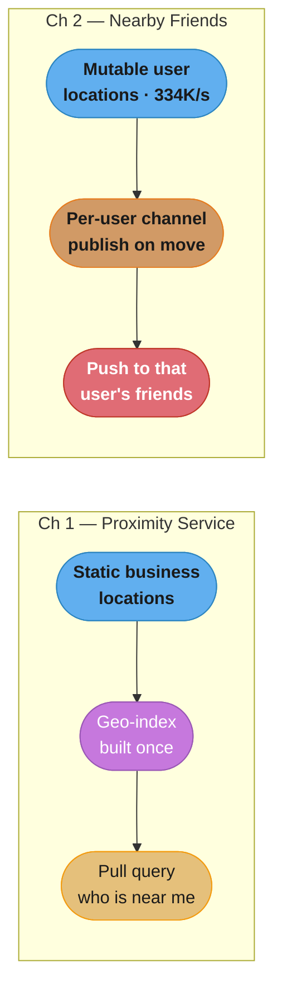
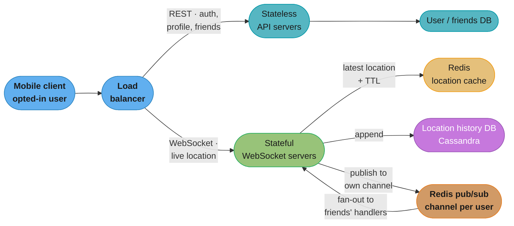
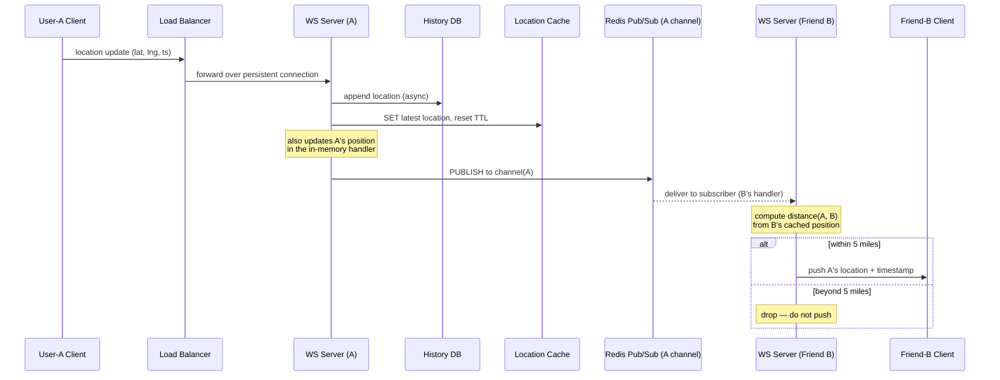
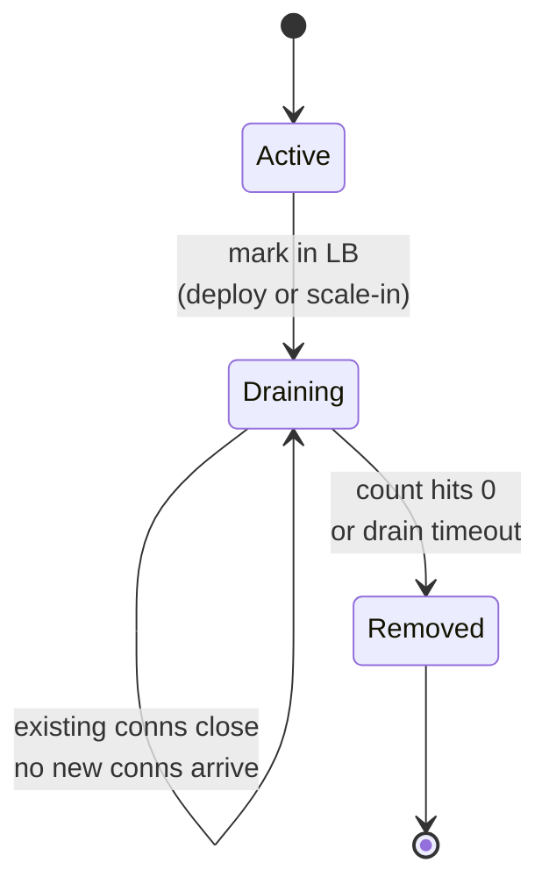
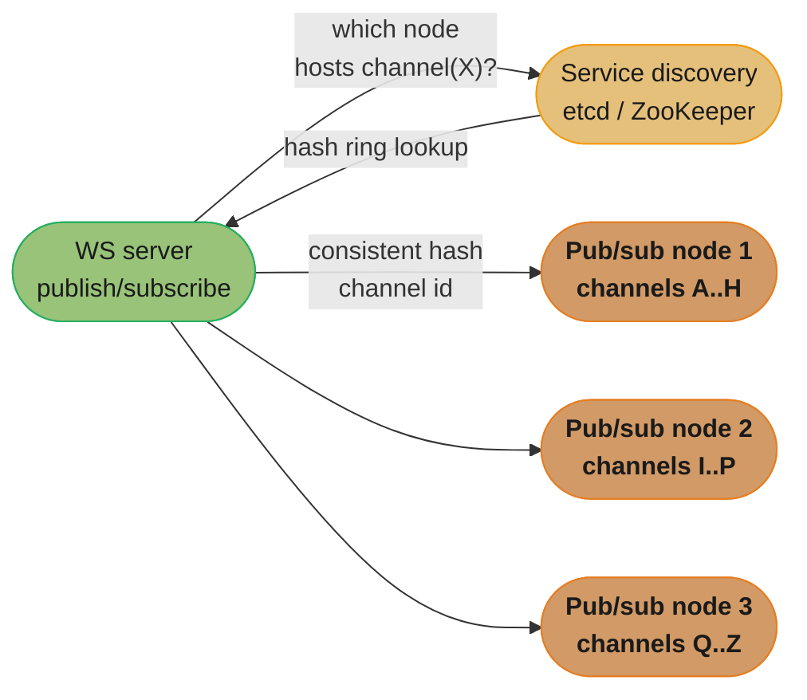
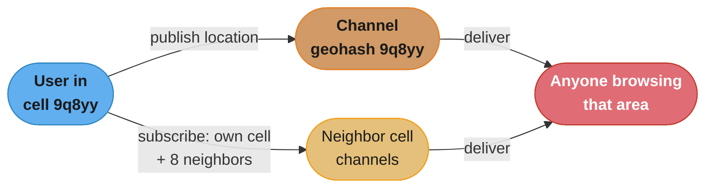
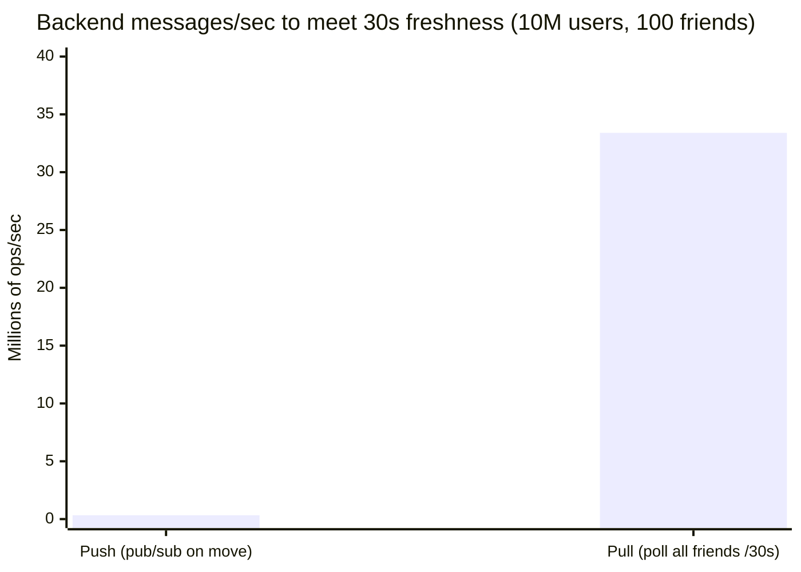
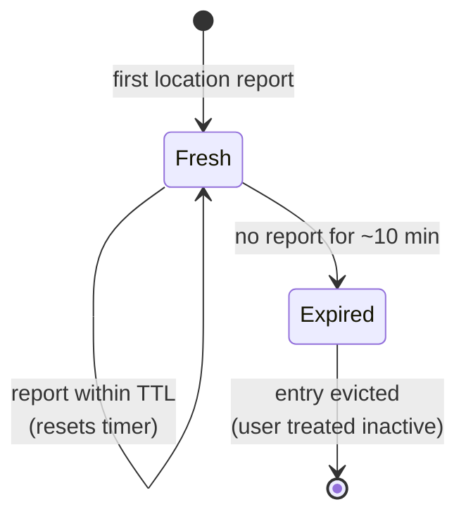

# Chapter 2: Nearby Friends

> Ch 2 of 13 · System Design Interview Vol 2 (Xu & Lam) · builds on Ch 1 — proximity goes LIVE: mutable user locations over WebSockets and pub/sub

## Chapter Map

Chapter 1 answered "what businesses are near me?" — a search over a *static* dataset that
almost never changes, so you build a geospatial index once and query it millions of times.
Chapter 2 flips every one of those assumptions. Now the things being located are your
**friends**, their positions change **every few seconds**, and the answer must be **pushed**
to you the instant a friend crosses into range. The dataset is mutable, the query is
per-viewer, and freshness — not throughput of a shared index — is the hard constraint. The
chapter's whole design is a study in *live fan-out*: a persistent connection per active user
(**WebSocket**), a fast expiring store of each user's latest position (**Redis with TTL**),
and a lightweight message bus that routes each location update only to the friends who care
(**Redis pub/sub**, one channel per user).

**TL;DR:**
- The static geo-index of Ch 1 does not fit: friend locations are mutable and push-based, and
  each update is relevant only to *that user's* friends, not to whoever searches an area.
- The backbone is **stateful WebSocket servers** (one persistent connection per active user)
  plus a **Redis pub/sub channel per user**; a location update is published to your own
  channel and fanned out to your friends' connections, which compute distance and push if
  you are within 5 miles.
- The scaling pain is all in the **stateful** pieces: WebSocket servers need **connection
  draining** to deploy/scale-in, and the pub/sub tier is **memory- and CPU-heavy** (~200 GB
  of subscriptions, tens of millions of message deliveries per second) so it must be
  **sharded by channel id** with **service discovery** to route.
- Mutual friendship caps fan-out (no celebrity problem); a "nearby random person" variant
  swaps the per-user channel for a **per-geohash-cell** channel.

## The Big Question

> "The map already knows where the restaurants are — they never move. But my friends move
> every few seconds, and I only want to hear about *mine*. How do I keep tens of millions of
> live positions flowing to exactly the right people, within seconds, without melting the
> backend?"

Analogy: Chapter 1 is a **phone book** — printed once, looked up on demand. Chapter 2 is a
**walkie-talkie party line** — everyone is talking continuously, and the system's job is to
make sure your handset only crackles when one of *your* friends says something and they are
close enough to matter. The engineering is entirely about who holds the open channel, where
the newest position lives, and how a single "I moved" message reaches only the right ears
fast — and how none of that falls over at 334K updates per second.

---

## 2.1 Step 1 — Understand the Problem and Establish Design Scope

Before drawing boxes, pin down what "nearby friends" means precisely, because the answer
decides the entire architecture. The interviewer and candidate settle the following.

### Functional requirements

- **Users see friends who are geographically nearby, and who have opted in.** Opt-in is
  mandatory — location is sensitive; a user who has not enabled the feature is neither
  tracked nor shown. Only *mutual* friends who both opted in appear.
- **Proximity is 5 miles.** A friend farther than 5 miles is not shown.
- **Each nearby-friend entry shows a distance and a "last updated" timestamp.** The
  timestamp lets the UI show staleness ("2.3 mi · updated 4s ago") and lets the client fade
  or drop a friend whose data has gone stale.
- **The nearby-friends list refreshes roughly every few seconds** (the chapter targets an
  update cadence on the order of every 30 seconds per user, fast enough to feel live).
- **Auxiliary flows** — add/remove a friend, update profile, and opt in/out — are ordinary
  request/response operations, not part of the real-time path.

### Non-functional requirements

- **Low latency.** A friend's movement should reach you with only a few seconds of delay.
- **Reliability, but not perfection.** The system should be reliable overall, yet the
  occasional dropped location update is acceptable — the next update (≤30 s later) corrects
  it. This tolerance is what lets us use a lossy, in-memory pub/sub bus instead of a durable
  queue.
- **Eventual consistency.** The location store does not need strong consistency. A few
  seconds of lag between a friend moving and you seeing it is fine. This single relaxation
  unlocks caching, best-effort fan-out, and cheap horizontal scaling.

### Scope-defining simplifications

- **Straight-line (great-circle) distance, not road/driving distance.** We compute the
  as-the-crow-flies distance between two lat/lng pairs. Real routing distance (Ch 3, Google
  Maps) is out of scope and would need a road graph — overkill for a "friends near me" dot on
  a map.
- **Friends only, not strangers** (the "nearby random person" feature is an explicit
  extension handled in the deep dive, not the core).

### Scale assumptions

| Quantity | Value | Note |
|----------|-------|------|
| DAU | 100 million | Daily active users of the app |
| Concurrent users of *this* feature | 10% → **10 million** | Have the nearby-friends screen live |
| Location report cadence | every **30 seconds** per active user | Freshness knob |
| Friends per user (avg) | ~100 | Drives fan-out |
| Proximity radius | 5 miles | |
| Friend cap | ~5,000 (Facebook-style; even a 10,000 cap is bounded) | Bounds worst-case fan-out |

### Back-of-the-envelope estimation

**Location-update QPS.** Every one of the 10 million concurrent users reports its location
once every 30 seconds:

```
location-update QPS = concurrent users / report interval
                    = 10,000,000 / 30 s
                    ≈ 333,333 updates/second
                    ≈ 334K QPS of writes
```

**In plain terms.** "Ten million phones are each on a 30-second alarm clock, and the alarms are
scattered evenly across the interval — so at any instant one thirtieth of them are firing."

The `/ 30` is the freshness knob, and it is the only knob in this formula. Nothing else in the
system's write load is adjustable: user count is a business outcome, but the report interval is a
product decision that trades battery and backend cost directly against how live the screen feels.

| Symbol | What it is |
|--------|------------|
| `concurrent users` | 10,000,000 — the 10% of 100 M DAU with the nearby-friends screen open |
| `report interval` | 30 seconds between one client's location reports |
| `location-update QPS` | Writes per second arriving at the WebSocket tier, before any fan-out |

**Walk one example.** The base figure, then what moving the freshness knob costs:

```
  10,000,000 users / 30 s  =  333,333 updates/s   (the book's ~334K)

  over a full day:  333,333 x 86,400 s  =  28,800,000,000 location writes/day

  turning the freshness knob:
    report every 10 s  ->  10,000,000 / 10  = 1,000,000 updates/s     (3.0x)
    report every 30 s  ->  10,000,000 / 30  =   333,333 updates/s     (baseline)
    report every 60 s  ->  10,000,000 / 60  =   166,667 updates/s     (0.5x)
```

The relationship is inverse-linear, which is why the chapter's wrap-up suggests "only send updates
when the location actually changes." A stationary user reporting the same coordinate 2,880 times a
day is pure waste, and suppressing those reports cuts the 334K figure without touching freshness for
anyone who is actually moving.

That is 334K writes per second *before* any fan-out — every one of them hits a WebSocket
server, the location cache, the history DB, and a pub/sub publish. It is a **write-heavy**
system, which will steer the storage choices (Redis for the hot path, Cassandra for
history).

**Fan-out volume (previews the pub/sub bottleneck).** Each published update is delivered to
that user's online friends. With ~100 friends per user subscribing to the channel:

```
pub/sub message deliveries ≈ publish QPS × subscribers per channel
                           ≈ 334K/s × ~100
                           ≈ 33.4 million message deliveries/second
```

**What this actually says.** "Publishing is not the expensive part — *delivering* is. Every message
you accept at the door has to be handed to a hundred people before it is done."

The multiplication by ~100 is the single most important number in the chapter, because it is the one
place where the system's cost is not proportional to its users. Double the average friend count and
the write load does not move at all, but the pub/sub tier doubles.

| Symbol | What it is |
|--------|------------|
| `publish QPS` | 334K/s — one publish per location report, from the estimate above |
| `subscribers per channel` | ~100 — the average friend count, since each friend subscribes to your channel |
| `message deliveries` | Individual hand-offs Redis must perform per second, the pub/sub tier's real workload |

**Walk one example.** Separate the two costs and watch them diverge:

```
                              publishes/s      deliveries/s      ratio
  friends per user =   0        333,333                0          0x
  friends per user =  10        333,333        3,333,333         10x
  friends per user = 100        333,333       33,333,333        100x   <- the book's case
  friends per user = 500        333,333      166,666,667        500x

  the publish column NEVER changes -- only the delivery column grows.
```

This is why the WebSocket tier and the pub/sub tier scale on completely different curves and must be
provisioned separately. The WebSocket servers see 334K messages/s no matter how social the user base
is; the pub/sub fleet sees 100x that today and would see 500x under the Facebook friend cap. The
chapter's later claim that pub/sub is "CPU-bound on fan-out" is exactly this column: 33.3 million
deliveries per second is roughly 33 deliveries every microsecond across the fleet.

Tens of millions of deliveries per second is far past a single machine — this number is why
the pub/sub tier must be sharded (deep dive §2.3).

Caption for the numbers: the two figures — 334K publishes/s and ~33M deliveries/s — are the
whole reason the design is push-based and sharded; a pull design would multiply the first
number by 100 friends *per poll* instead of once per move.

---

## 2.2 Step 2 — Propose High-Level Design and Get Buy-In

### Why Chapter 1's approach does not work here

The tempting first instinct is to reuse the proximity service from Chapter 1: throw every
user's location into a geospatial index (geohash / quadtree / S2), and for each user run a
"who is within 5 miles of me?" range query, then intersect the result with the friend list.
This fails on three counts:

- **The data is mutable, not static.** Chapter 1's businesses change address maybe once a
  year, so the index is built once and read forever. Here, 10 million users each move the
  index every 30 seconds — 334K index mutations per second against a structure that is
  optimized for *reads*, not a firehose of writes. You would spend all your time rebuilding
  the index.
- **The relationship is per-viewer, not global.** A restaurant search returns the same answer
  for everyone standing on the same corner. A nearby-friends answer is *different for every
  user* — it is filtered by that user's private friend graph. A shared geo-index gives you
  strangers you must then throw away, wasting the vast majority of the query.
- **The delivery model is push, not pull.** Chapter 1 answers a query the user initiated.
  Here the interesting event is a *friend* moving — the user did nothing, yet must be
  notified. A search index has no notion of "tell viewer X when object Y changes."



Caption: the same word — proximity — hides two opposite problems. Static + shared + pull (Ch
1) versus mutable + per-viewer + push (Ch 2); the second is what forces WebSockets and
pub/sub instead of a geo-index.

There is also a **peer-to-peer** temptation — have each client stream its location directly
to each friend's client. It is rejected quickly: a mobile client cannot hold ~100 persistent
connections, NAT/firewalls block inbound connections, and a friend on a flaky link drags down
everyone. The design is a **shared backend**.

### High-level design

The backend splits into a **stateless** control plane (ordinary REST) and a **stateful**
real-time plane (persistent connections + a message bus).



Caption: the load balancer is the fork — cheap REST goes to stateless API servers, live
location goes to stateful WebSocket servers; every location update fans through the cache
(latest), history (durable), and pub/sub (route to friends).

Component roles:

- **Load balancer.** Sits in front of both server pools. Routes REST calls to API servers and
  WebSocket upgrade requests to WebSocket servers. Must support connection draining for the
  stateful pool (deep dive).
- **RESTful API servers (stateless).** Handle everything that is *not* the live location
  stream: authentication, profile, add/remove friend, opt-in/opt-out. Being stateless, they
  autoscale trivially. This is the ordinary web tier from Volume 1.
- **WebSocket servers (stateful).** The heart of the system. Each active user holds one
  persistent WebSocket connection to one of these servers. The connection is used *both* to
  receive the user's own location updates and to push friends' updates back down. Each
  connection handler keeps the user's latest position in memory for fast distance math.
  Statefulness is what makes these hard to deploy and scale (connection draining).
- **Redis location cache.** Stores the **most recent** location per active user, keyed by
  user id, with a **TTL**. Refreshed on every update. When a user stops reporting, the TTL
  expires and the entry disappears — which is exactly how the system knows a user went
  inactive. It is a cache, deliberately *not* the durable source of truth (data model below).
- **Location history database (Cassandra).** Durably appends every location report for
  offline/analytics use (ML, "where was I", debugging). It is off the critical path of the
  nearby-friends screen.
- **Redis pub/sub.** A lightweight, in-memory message bus. **One channel per user.** A user's
  location update is *published* to the user's own channel; that user's friends have
  *subscribed* to the channel, so their WebSocket connection handlers receive the update and
  decide whether to push it to their clients. Pub/sub is what decouples "I moved" from "who
  needs to know."

### The periodic location update flow

This is the core loop. Every 30 seconds each active client fires one location update, and the
book walks the path it takes through the backend as a numbered sequence:

1. The client sends a location update (lat, lng, timestamp) over its WebSocket connection to
   the load balancer.
2. The load balancer forwards it along the existing persistent connection to the correct
   **WebSocket server** (the one holding that user's connection).
3. The WebSocket server **appends the update to the location history database** (async, off
   the hot path).
4. The WebSocket server **updates the Redis location cache** with the new position and resets
   the TTL, and updates the position stored in that user's WebSocket connection handler
   variable (for later distance calculations).
5. The WebSocket server **publishes** the new location to the **user's own channel** in the
   Redis pub/sub server.
6. Redis pub/sub **broadcasts** the message to every subscriber of that channel — the
   subscribers are the WebSocket connection handlers of the user's online friends (possibly
   living on other WebSocket servers).
7. For each subscriber, the receiving WebSocket handler **computes the straight-line
   distance** between the publisher and that friend (using the friend's own last-known
   position it holds in memory). If the distance is within 5 miles, it **pushes** the new
   location plus timestamp down the friend's WebSocket connection to the friend's client;
   otherwise it drops the message.
8. The friend's client renders the updated distance and "updated Ns ago" timestamp.



Caption: one move fans out once per online friend; the distance check happens at the
*subscriber* side (step 7) so each friend applies its own position, and out-of-range messages
die at the WebSocket server without ever touching the friend's phone.

### API design

The design uses **two protocols**: WebSocket for the live location stream (bidirectional, low
overhead), and plain HTTP/REST for everything else.

**WebSocket routines** (the real-time channel):

| Routine | Direction | Payload | Purpose |
|---------|-----------|---------|---------|
| Periodic location update | client → server | `{lat, lng, timestamp}` | User reports its own position every ~30 s |
| Client receives location update | server → client | `{friend_id, lat, lng, timestamp}` | Push a friend's new position (already within range) |
| WebSocket initialization | client → server | initial `{lat, lng}` | Establish the connection, seed position, subscribe to friends' channels |
| Subscribe to a new friend | server → client | `{friend_id}` | A friend came online / was added — start showing them |
| Unsubscribe a friend | server → client | `{friend_id}` | A friend went offline, was removed, or opted out — stop showing them |

**HTTP API** (stateless, via the API servers) — everything not on the live path:

| Endpoint | Method | Purpose |
|----------|--------|---------|
| `/user/friends` | POST / DELETE | Add or remove a friend |
| `/user/profile` | PUT | Update profile |
| `/user/nearby-settings` | PUT | Opt in / opt out of the feature |
| `/auth` | POST | Login / token refresh |

The split matters: **WebSocket carries only the high-frequency, latency-critical location
traffic**; the low-frequency control operations stay on cheap, stateless REST so they never
interfere with (or complicate the scaling of) the persistent-connection tier.

### Data model

Two very different stores, chosen for two very different access patterns.

**Location cache (Redis)** — the hot, current-position store.

| Field | Value |
|-------|-------|
| Key | `user_id` |
| Value | `{ latitude, longitude, timestamp }` |
| TTL | ~10 minutes |

Why a **cache and not a database** is the source of truth for current location:

- You only ever need the **single most recent** position — no history, no queries beyond a
  point lookup by user id.
- It must be **very fast** to read and write at 334K writes/second; an in-memory store is the
  natural fit.
- **Durability is not required.** If the cache is lost, every active client re-reports within
  30 seconds and the state rebuilds itself. Paying for disk durability here would be wasted.
- The **TTL models "active."** If a user's phone dies or they close the app, they stop
  reporting; ~10 minutes later the TTL expires and the entry vanishes — the system needs no
  separate "user went offline" signal for the cache. (The TTL is comfortably longer than the
  30 s report interval so a couple of missed updates do not evict an active user.)

**The idea behind it.** "The TTL is not a memory-reclamation setting — it is a liveness detector, and
its length is a bet on how many reports in a row a real user is allowed to miss before you declare
them gone."

Both numbers in that bet are already on the page; the ratio between them is what nobody states.

| Symbol | What it is |
|--------|------------|
| `TTL` | ~10 minutes (600 s) before an unrefreshed cache entry vanishes |
| `report interval` | 30 s — how often an active client refreshes the entry |
| `TTL / interval` | Consecutive reports a user may miss and still be considered active |

**Walk one example.** Convert the two stated numbers into the tolerance they actually encode:

```
  TTL / report interval  =  600 s / 30 s  =  20 reports

  so an active user may miss 20 CONSECUTIVE location reports -- a full 10 minutes
  in a subway tunnel or with a dead radio -- and still hold their cache entry.

  the cost of that generosity, at the other end:
    a user who closes the app is shown as "nearby" for up to 10 more minutes
    (their last position is stale but not yet expired)

  tightening the TTL to 2 min  ->  120 / 30 =  4 missed reports tolerated
  loosening it   to 30 min     ->  1800 / 30 = 60 missed reports tolerated
```

Twenty is a deliberately generous margin, and it is the right direction to err. A false eviction is
visible and annoying — a friend flickers off your screen because a tunnel ate three updates — while
a false *retention* is merely stale, and the UI already shows an "updated Ns ago" timestamp that lets
the user judge staleness themselves. The timestamp requirement from Step 1 is what makes the generous
TTL safe: the system does not have to be precise about liveness because the client can display
exactly how old the data is.

The durable copy lives in the history DB instead — so "source of truth for the *current*
position" is intentionally the ephemeral cache, and "source of truth for the *record*" is the
history table.

**Location history database (Cassandra)** — the durable, write-heavy append log.

```
Table: location_history
  user_id     partition key
  timestamp   clustering key (descending)
  latitude
  longitude
```

Why Cassandra: the workload is **overwhelmingly writes** (334K appends/second, reads rare and
offline), each write is an independent append keyed by `user_id`, and there are no
cross-partition transactions. That is exactly the write-optimized, horizontally partitioned,
LSM-tree profile Cassandra is built for. Partitioning by `user_id` spreads the write load
evenly and keeps each user's trail co-located and time-ordered.

---

## 2.3 Step 3 — Design Deep Dive

The high-level design works on paper; the deep dive is about making each tier survive its
scale. The stateless tiers are easy; every hard problem lives in the **stateful** ones
(WebSocket servers and pub/sub).

### Scaling the API servers

Nothing special: the API servers are **stateless**, so they scale with the standard Volume 1
playbook — put them behind the load balancer, autoscale the fleet up and down on CPU/QPS, and
add or remove nodes freely since no session state lives on any one of them. This tier is a
solved problem and gets a single paragraph precisely because it is *not* where the difficulty
is.

### Scaling the WebSocket servers (connection draining)

WebSocket servers are **stateful**: each holds thousands of long-lived connections, and the
current in-memory position for each connected user. Scaling *out* is easy — spin up new nodes,
and the load balancer routes new connections to them. The hard part is **scaling in and
deploying new releases**, because you cannot just kill a node that has thousands of live
connections without dropping all those users.

**Put simply.** "One active user is one open socket that never closes, so the fleet is sized by how
many sockets a box can hold — not by how many requests per second arrive."

This is the mental switch that trips people coming from stateless web tiers. A REST fleet is sized by
QPS; a WebSocket fleet is sized by *concurrency*. Here the two numbers are wildly different: 10
million simultaneous connections carrying only 334K messages/second between them, which works out to
one message per connection every 30 seconds. Each socket is almost always idle, and yet each one
still costs a file descriptor, kernel socket buffers, TLS session state, and the handler's in-memory
position — none of which the message rate tells you anything about.

| Symbol | What it is |
|--------|------------|
| `concurrent connections` | 10,000,000 — one per active user, from the 10%-of-100M-DAU assumption |
| `connections per server` | How many open sockets one node sustains; the sizing lever |
| `servers needed` | `concurrent connections / connections per server` |
| `per-connection memory` | Socket buffers + TLS state + handler position; the chapter does not state a figure |

**Walk one example.** The connection count is fixed by the requirements; the fleet size is not:

```
  concurrent connections = 100,000,000 DAU x 10%  =  10,000,000 sockets
  message rate per socket = 1 update / 30 s       =  0.033 msg/s  (near-idle)

  fleet size at various per-node connection ceilings:

    10,000 conns/node   ->  10,000,000 /  10,000  =  1,000 nodes
    50,000 conns/node   ->  10,000,000 /  50,000  =    200 nodes
   100,000 conns/node   ->  10,000,000 / 100,000  =    100 nodes
   500,000 conns/node   ->  10,000,000 / 500,000  =     20 nodes

  at 200 nodes, each carries  333,333 / 200  =  1,667 messages/s
```

Note that the connection ceilings above are illustrative, not the book's — the chapter gives the
10 M connection count but never states a per-node capacity or a per-connection byte cost. The shape
is what matters: the fleet spans a **50x range** purely on how many sockets you can pack per box,
while the per-node *message* rate stays trivial (1,667/s is nothing for one server). That asymmetry
is why the tuning work on a WebSocket tier is all file-descriptor limits, socket buffer sizing, and
TLS session memory rather than request throughput.

It also explains why draining is slow. At 50,000 connections a node, you are waiting for 50,000
independent users to close an app you do not control. Nothing about the message rate helps; the
connections simply have to age out.

The solution is **connection draining**:

1. **Mark the node "draining"** in the load balancer so it receives **no new** connections.
2. **Wait** for the existing connections to close naturally — users close the app, lose
   signal, or their connection is migrated. Over time the node's connection count bleeds down
   toward zero.
3. **Remove the node** once its connections have drained (or after a maximum timeout, at which
   point the remaining clients reconnect and are routed to a healthy node — a brief blip the
   app tolerates because reconnect + re-init is cheap).

This makes **release management** a first-class concern: every deploy of new WebSocket-server
code is a drain-and-replace, not an in-place restart, because in-place restart would sever
every connection at once. Because draining takes time, you roll out gradually. The load
balancer *must* support draining and health-based routing for the stateful pool — this is a
concrete requirement, not an afterthought.



Caption: a WebSocket server never dies while serving — it first stops accepting new
connections and lets the old ones bleed off, so a deploy or scale-in costs at most a brief
reconnect for the last stragglers.

### Scaling the location cache

The Redis location cache scales the easy way: **shard by `user_id`**. The data is perfectly
partitionable because each user's current location is **independent** — there is never a query
that spans users (no "give me everyone in this box" against the cache; that intersection
happens per-connection in the WebSocket handlers, not in Redis). So a simple consistent-hash
or Redis-Cluster sharding by user id spreads both the 334K writes/second and the storage
evenly, with no cross-shard coordination.

The dominant load on this tier is not query complexity but **TTL churn**: a constant stream of
writes that each reset a TTL, plus continuous background expiration of entries for users who
went inactive. Provision for the write rate and the expiry sweep, add shards to scale
horizontally, and replicate each shard for availability.

### Redis pub/sub deep dive

This is the tier that decides whether the whole design holds up.

**Why pub/sub at all.** The publisher (a user reporting a move) must not need to know *who* is
listening. Pub/sub gives **loose coupling**: the WebSocket server publishes one message to the
user's channel and is done; the set of subscribers (that user's online friends' handlers) can
change moment to moment — friends coming online, going offline, being added or removed —
without the publisher ever knowing. That decoupling is exactly what a fast-changing social
fan-out needs.

**Memory math — how big does the pub/sub tier get?** Reproduce the book's estimate:

- **Channels are nearly free until subscribed.** There is one channel per user — up to ~100
  million channels if you count every user — but an empty channel (no subscribers) costs
  essentially nothing. The cost is in the **subscriptions**.
- **Count the live subscriptions at peak.** ~10 million users are online (10% of 100M DAU).
  Each online user subscribes to the channels of its ~100 friends:

```
live subscriptions ≈ online users × friends per user
                   ≈ 10,000,000 × 100
                   ≈ 1,000,000,000 subscriptions   (1 billion)
```

- **Multiply by per-subscription overhead.** Redis stores each subscription with bookkeeping
  (pointers, hash-table entries) on the order of ~200 bytes:

```
pub/sub memory ≈ 1,000,000,000 × 200 bytes
              ≈ 200,000,000,000 bytes
              ≈ 200 GB
```

**Read it like this.** "You are not paying for users and you are not paying for channels — you are
paying for *edges*. Every friendship between two online people is a row Redis has to keep."

The trap this defuses is the instinct to count channels. There are ~100 million channels (one per
user) and they contribute essentially nothing; the bill comes from the ~1 billion subscription edges
laid over them. Channels are names, subscriptions are state.

| Symbol | What it is |
|--------|------------|
| `online users` | 10,000,000 — the 10% concurrent figure again |
| `friends per user` | ~100, and each friendship means one subscription |
| `live subscriptions` | `online users x friends per user` — the edge count Redis actually stores |
| `~200 bytes` | Per-subscription bookkeeping: hash-table entry, client pointer, list node |
| `~100 GB` | Usable memory on a large Redis box, the divisor for node count |

**Walk one example.** Reproduce the 200 GB, then find what it costs per user:

```
  live subscriptions = 10,000,000 users x 100 friends  = 1,000,000,000 edges

  memory   = 1,000,000,000 x 200 B  = 200,000,000,000 B
           = 200 GB (decimal)  =  186 GiB (binary)

  nodes needed = 200 GB / 100 GB usable per box  =  2 nodes for MEMORY alone

  per-user cost = 100 friends x 200 B  =  20,000 B  =  20 KB per online user
```

Twenty kilobytes per online user is the number worth carrying out of this section, because it scales
the estimate to any user base without redoing the arithmetic. It also shows how thin the memory
headroom is: 2 nodes is the *floor*, and nobody runs a 2-node tier at 100% memory utilisation.

**Why memory is the wrong constraint to size on anyway.** The 200 GB says you need 2 nodes. The 33.3
million deliveries/second from the fan-out estimate says you need far more, because delivery is CPU
work and 33 M/s across 2 boxes is ~16.7 M deliveries/second each — nowhere near achievable. Size the
tier on the delivery rate and the memory takes care of itself; size it on memory and you will
provision a tier that fits but cannot keep up. This is precisely the asymmetry the book means when it
says the tier is "both memory- and CPU-bound" but that CPU is the tighter of the two.

- **Conclusion:** ~200 GB of subscription state does not fit on one machine (a large Redis
  box is on the order of 100 GB usable), so you need **multiple pub/sub servers** just for
  memory. And memory is not even the tightest constraint — the **CPU** cost of delivering
  ~33 million messages/second (334K publishes × ~100 subscribers) is what really forces
  distribution across many nodes. Pub/sub here is **both** memory- and CPU-bound.

**Sharding the pub/sub servers.** Distribute channels across a fleet of pub/sub nodes by
hashing the **channel id (user id)** — **consistent hashing** so that adding/removing a node
moves only a fraction of channels. Now a WebSocket server that wants to publish to (or
subscribe to) a given user's channel must know *which* pub/sub node hosts it. That mapping
lives in a **service-discovery** component — **etcd** or **ZooKeeper** — holding the hash ring
/ node membership. Every WebSocket server consults service discovery to resolve a channel id
to its pub/sub node, then connects there.



Caption: the hash ring in service discovery is the routing table — a WebSocket server resolves
a channel id to its owning pub/sub node before publishing or subscribing, so channels spread
across the fleet without any central broker.

**The resubscribe-on-scaling problem.** Consistent hashing minimizes movement, but adding a
pub/sub node still **remaps some channels** to the new node. Every WebSocket server that had
subscriptions on a moved channel must **tear down and re-establish** those subscriptions on
the new node — and because thousands of WebSocket servers may each hold many of the moved
channels, a resize triggers a **thundering herd of resubscriptions** all at once. Mitigations:
perform pub/sub scaling **during off-peak hours** (fewer live subscriptions to move),
**over-provision** so you resize rarely, and roll changes in gradually rather than adding many
nodes at once. This is the operational tax of a stateful, subscription-heavy tier.

### Adding and removing friends

The subscription set must track the friend graph in real time. When user A **adds** friend B,
A's WebSocket connection handler **subscribes** to B's channel (and, because friendship is
mutual, B's handler subscribes to A's). When a friend is **removed**, one **opts out**, or a
friend **goes offline**, the handler **unsubscribes** from that channel and the client is told
to drop the friend from the display (the "unsubscribe a friend" WebSocket routine). The book
wires this as **callbacks**: an add-friend action triggers a subscribe callback; a
remove/offline action triggers an unsubscribe callback — so the live view always mirrors the
current friend list without a full refresh.

### Users with many friends

A worry: does a user with a huge number of friends blow up fan-out? The answer is **no**,
because of two facts:

- **Friendship is capped.** Real platforms cap friends (Facebook's limit is 5,000; even a
  10,000 cap is a hard bound). So a single user's channel has at most a few thousand
  subscribers — **bounded fan-out**.
- **Friendship is mutual, so there is no celebrity/"Justin Bieber" problem.** The fan-out
  explosion in feed/follow systems comes from *asymmetric* relationships — one account with
  tens of millions of *followers*. Here the relationship is symmetric and capped: you cannot
  have a million-friend account, so no single channel ever has a runaway subscriber count. The
  worst case is bounded by the friend cap, which the sharded pub/sub tier handles comfortably.

**Stated plainly.** "The cap turns fan-out from an unbounded risk into a number you can multiply —
the worst channel in the system is only fifty times the average one, and fifty is survivable."

Bounded is doing more work in that sentence than *small*. Fifty times the average is not a small
multiplier; the point is that it is a *finite, known* multiplier, which is what lets you provision.
An asymmetric follow graph offers no such number — the ceiling is however many followers the largest
account happens to have acquired, and it grows without warning.

| Symbol | What it is |
|--------|------------|
| `~100` | Average friends per user — the number the 33.3 M/s fan-out estimate is built on |
| `5,000` | Facebook-style hard cap on friends; the worst-case subscriber count for one channel |
| `10,000` | The looser cap the chapter also mentions; still a hard bound |
| `cap / average` | How much worse the worst channel is than a typical one |

**Walk one example.** Price the worst channel in the system against a typical one:

```
  typical channel:      100 subscribers  ->    100 deliveries per publish
  worst channel  :    5,000 subscribers  ->  5,000 deliveries per publish
  looser cap     :   10,000 subscribers  -> 10,000 deliveries per publish

  worst / typical  =  5,000 / 100  =    50x
                   = 10,000 / 100  =   100x

  a max-cap user moving every 30 s costs:
      5,000 deliveries / 30 s  =  167 deliveries/s  from that one user

  compare the ENTIRE system:  33,333,333 deliveries/s
      one worst-case user is  167 / 33,333,333  =  0.0005% of total load
```

That last line is the whole argument. Even the most-connected possible user generates five ten-
thousandths of one percent of the delivery load — they are a rounding error, not a hot spot. Contrast
a follow graph where one account with 50 million followers publishing once would generate 50 million
deliveries, or **1.5x the entire steady-state load of this system**, from a single event. Symmetry
plus a cap is what removes that failure mode, which is why the chapter can shard pub/sub by a plain
hash of the channel id with no hot-key special-casing at all.

### Nearby random person (opt-in extension)

A separate feature: show *strangers* who are nearby, not just friends. The social-graph
channel key does not apply (strangers share no friendship), so the design **swaps the channel
key from user id to geohash cell**:

- Divide the world into **geohash grid cells**. Each cell gets its own pub/sub channel.
- When a user opts in, they **publish** their location to the channel of the **geohash cell
  they are currently in**.
- They **subscribe** to the channels of **their own cell plus the 8 neighboring cells** (so
  people right across a cell boundary are still visible), and see anyone browsing that area.
- As a user moves across a cell boundary, they **unsubscribe** from the cells they left and
  **subscribe** to the new ones.

The key idea: for strangers, **geographic proximity is the grouping key** instead of the
friend graph — the same pub/sub machinery, keyed on geohash cells rather than user ids.



Caption: swap the channel key from user id to geohash cell and the exact same pub/sub design
serves strangers — you publish to the cell you stand in and subscribe to your cell plus its
neighbors so nobody at a boundary is missed.

### Alternative to Redis pub/sub — Erlang/OTP

The book closes with an aside: the whole "one lightweight process per user, route messages
between them" shape maps almost perfectly onto **Erlang/OTP**. Erlang gives you **millions of
extremely cheap processes** (each a few hundred bytes), a native **message-passing** model,
and a VM (**BEAM**) that **clusters nodes and distributes processes transparently** — you
could model each user as a process and let the runtime handle fan-out and distribution instead
of Redis pub/sub + service discovery. This is essentially how **WhatsApp** scaled to hundreds
of millions of connections on a small team. **Why most teams should not:** Erlang is a niche
language with a **small talent pool**, harder to hire for and to operate, whereas the Redis +
etcd/ZooKeeper stack is built from **commodity, well-understood components** most teams already
run. Reach for Erlang only if you have deep in-house expertise; otherwise the mainstream stack
is the safer default.

---

## 2.4 Step 4 — Wrap Up

The final design in one breath: a **load balancer** forks traffic into **stateless API
servers** (control operations) and **stateful WebSocket servers** (the live location stream,
one persistent connection per active user). Each location update is written to the **Redis
location cache** (latest position, TTL = active), appended to a **Cassandra** history table
(durable, write-heavy), and **published to the user's Redis pub/sub channel**; the user's
friends' WebSocket handlers **subscribe** to that channel, **compute straight-line distance**,
and **push** the update to friends within 5 miles. The stateful tiers carry all the
difficulty — WebSocket servers need **connection draining** to deploy/scale, and the pub/sub
tier is **memory- and CPU-heavy** (~200 GB of subscriptions, ~33M deliveries/second), so it is
**sharded by channel id with service discovery** to route.

If time remains, the chapter flags extensions to discuss:

- **Only send updates when the location actually changes** (or slow the cadence for stationary
  users) to save battery and backend load — a stationary user re-reporting the same coordinate
  every 30 seconds is pure waste.
- **Where to compute distance** — server-side (as designed) keeps friends' raw coordinates on
  the backend; a client-side variant could reduce server CPU but leaks coordinates to more
  clients.
- **Replace Redis pub/sub with an Erlang/OTP mesh** for teams with the expertise.
- **The nearby-random-person feature** via geohash-keyed channels.
- **Handling clients on flaky mobile networks** — reconnect, re-initialize, and re-subscribe
  cleanly; occasional dropped updates are acceptable by the requirements.

---

## Visual Intuition

**The geohash neighbor grid (why you subscribe to 9 cells, not 1).** A user standing near the
edge of their own cell would miss a stranger a few feet away across the boundary if they only
subscribed to their own cell — so you subscribe to your cell plus all 8 neighbors. This is a
constraint grid Mermaid cannot draw, so it stays ASCII:

```
          col-1        col        col+1
        +----------+----------+----------+
  row-1 |  9q8yv   |  9q8yy   |  9q8zn   |   <- 3 cells to the north
        +----------+----------+----------+
  row   |  9q8yt   | [9q8yw]  |  9q8yx   |   <- YOU are in the center cell
        +----------+----------+----------+
  row+1 |  9q8ym   |  9q8yq   |  9q8yr   |   <- 3 cells to the south
        +----------+----------+----------+

  subscribe = center + 8 neighbors = 9 channels
  a stranger 10 ft away but across the north boundary lives in 9q8yy,
  not 9q8yw -- you would miss them if you subscribed to your cell alone.
```

Caption: subscribing to the 3x3 block of geohash cells around you closes the boundary blind
spot — proximity does not respect grid lines, so you must listen to every cell you could be
"near," not just the one you stand in.

**Pull vs push cost (why 30-second freshness kills polling).** A push design sends one message
per *move*; a pull design that meets the same freshness must have every client poll for all
~100 friends every interval, multiplying the request rate by the friend count.



Caption: to hit the same 30-second freshness, polling every friend forces ~33M reads/second
(334K polls × 100 friends) versus 334K publishes/second for push — a ~100x gap, and the whole
reason the design is push-based.

**MVCC-free freshness via TTL.** The cache entry is a self-expiring truth: refreshed on every
report, gone ~10 minutes after the last one.



Caption: the TTL turns "is this user active?" into a storage property — no separate offline
signal is needed, because an active user keeps resetting the timer and an inactive one lets it
lapse.

---

## Key Concepts Glossary

- **Nearby friends** — showing opted-in friends within a radius (5 miles), each with a distance
  and last-updated timestamp, refreshed live.
- **Opt-in** — a user is only tracked/shown if they explicitly enable the feature; location is
  sensitive.
- **Straight-line (great-circle) distance** — as-the-crow-flies distance between two lat/lng
  points; the chapter's simplification versus road/driving distance.
- **WebSocket server (stateful)** — holds one persistent bidirectional connection per active
  user; receives the user's location and pushes friends' updates back.
- **RESTful API server (stateless)** — handles non-realtime operations (auth, profile,
  add/remove friend, opt-in); autoscales trivially.
- **Location cache (Redis)** — most-recent position per user, keyed by user id, with a TTL;
  the source of truth for *current* location.
- **TTL (time-to-live)** — expiry on a cache entry; models "active" — it lapses when a user
  stops reporting (~10 min), auto-evicting inactive users.
- **Location history DB (Cassandra)** — durable, write-heavy append log of every location
  report; `(user_id, timestamp) -> (lat, lng)`.
- **Redis pub/sub** — lightweight in-memory message bus; one channel per user; publish on move,
  subscribers are friends' handlers.
- **Channel** — a named pub/sub topic; here, one per user (or per geohash cell in the random
  variant); cheap until it has subscribers.
- **Publish / subscribe** — publish sends a message to a channel; subscribers on that channel
  receive it; decouples sender from receivers.
- **Fan-out** — delivering one published message to all subscribers of a channel.
- **Connection draining** — marking a stateful server so it takes no new connections, letting
  existing ones close, then removing it; needed to deploy/scale WebSocket servers.
- **Service discovery (etcd/ZooKeeper)** — holds the hash ring / node membership so WebSocket
  servers can resolve a channel id to its owning pub/sub node.
- **Consistent hashing** — maps channels to pub/sub nodes so adding/removing a node moves only
  a fraction of channels.
- **Resubscribe-on-scaling** — a burst of subscription churn when a pub/sub resize remaps
  channels to a new node; mitigate by scaling off-peak and over-provisioning.
- **Friend cap** — a hard limit on friends (Facebook 5,000; even 10,000 bounds fan-out);
  combined with mutual friendship, eliminates the celebrity fan-out problem.
- **Nearby random person** — opt-in feature for strangers; channels keyed by geohash cell
  instead of user id; subscribe to your cell plus 8 neighbors.
- **Geohash cell** — a grid square of the world used as the channel key for the random-person
  feature.
- **Erlang/OTP / BEAM** — an actor-model runtime with cheap processes and transparent node
  distribution; an alternative to Redis pub/sub (WhatsApp-style); niche talent pool.
- **Eventual consistency** — a few seconds of lag between a friend moving and you seeing it is
  acceptable; the relaxation that unlocks caching and best-effort fan-out.

---

## Tradeoffs & Decision Tables

| Dimension | Chapter 1 (Proximity Service) | Chapter 2 (Nearby Friends) |
|-----------|-------------------------------|-----------------------------|
| Data | Static business locations | Mutable user locations (334K writes/s) |
| Query relationship | Global (same for everyone) | Per-viewer (filtered by friend graph) |
| Delivery model | Pull (user searches) | Push (friend moves → you are notified) |
| Core structure | Geospatial index (geohash/quadtree/S2) | WebSocket + Redis pub/sub |
| Freshness need | Seconds-to-minutes stale is fine | ~Few seconds live |

| Transport choice | Latency | Server cost | Fit here |
|------------------|---------|-------------|----------|
| HTTP short-polling | Bounded by poll interval | ~33M reads/s at 30 s freshness | Poor — huge read amplification |
| HTTP long-polling | Better | Still per-poll fan-out | Mediocre |
| **WebSocket push** | **Few seconds** | **One publish per move** | **Chosen** — sends only on change, only to friends |

| Store | Purpose | Why this store |
|-------|---------|----------------|
| Redis location cache | Current position, TTL | Fast, point-lookup, disposable, TTL = active |
| Cassandra history | Durable trail | Write-heavy appends, partition by user_id |
| Redis pub/sub | Route updates to friends | Loose coupling, cheap channels, in-memory speed |

| Serializability of the fan-out fabric | Pros | Cons |
|---------------------------------------|------|------|
| Redis pub/sub + service discovery | Commodity, well-understood, easy hiring | Sharding + resubscribe churn; memory/CPU heavy |
| Erlang/OTP mesh | Cheap processes, transparent distribution (WhatsApp) | Niche talent pool; harder to hire/operate |

---

## Common Pitfalls / War Stories

- **Reusing a geo-index for mutable, per-viewer data.** Feeding 334K position updates/second
  into a read-optimized geospatial index (Ch 1's design) turns it into a write firehose and
  still returns strangers you must filter out. The tell that you need pub/sub instead of an
  index: the data is mutable *and* the answer differs per viewer *and* delivery is push.
- **Killing a WebSocket server in place on deploy.** Restarting a stateful node severs
  thousands of live connections at once, producing a reconnect storm. Always **drain**: stop
  new connections at the load balancer, let existing ones bleed off, then remove. Forgetting
  this makes every release a mini-outage.
- **Treating the pub/sub tier as free.** "It's just Redis pub/sub" hides ~200 GB of
  subscription state and ~33M message deliveries/second. Under-provision it and you get
  dropped messages or an OOM. Size it for both **memory** (subscriptions) and **CPU**
  (fan-out), and shard by channel id from day one.
- **Scaling pub/sub at peak.** Adding a pub/sub node during peak triggers a thundering herd of
  resubscriptions as channels remap, momentarily degrading live updates. Resize during
  **off-peak** hours and **over-provision** so resizes are rare.
- **Making the cache durable (or making the DB the current-position source).** Paying for
  durable writes on the hot 334K/s current-position path is wasted money — clients re-report
  within 30 s, so a lost cache self-heals. Keep the *current* position in the disposable cache
  and the *record* in Cassandra; do not invert them.
- **Assuming a Justin Bieber fan-out problem exists here.** It does not — friendship is mutual
  and capped, so no channel ever has millions of subscribers. Applying celebrity-fan-out
  hedges (like the feed world's fan-out-on-read fallback) is solving a problem you do not have.
- **Polling to hit freshness.** Meeting 30-second freshness with polling forces every client
  to fetch all ~100 friends every 30 s — ~33M reads/second, ~100x the push cost — and still
  caps detection latency at the poll interval. Push on change is the only affordable option.

---

## Real-World Systems Referenced

Redis (location cache with TTL; pub/sub message bus), Cassandra (write-heavy location history),
etcd / ZooKeeper (service discovery / hash-ring membership for pub/sub sharding), WebSocket (the
persistent-connection transport), Facebook (the 5,000-friend cap that bounds fan-out), geohash
(cell keys for the nearby-random-person feature), Erlang/OTP and the BEAM VM (the actor-model
alternative to Redis pub/sub, as used by WhatsApp for massive persistent-connection scale).

---

## Summary

Nearby Friends is Chapter 1's proximity problem turned **live**: the located objects are your
friends, they move every ~30 seconds, and each move must be **pushed** to exactly the friends
within 5 miles. Because the data is **mutable**, the relationship is **per-viewer**, and
delivery is **push**, a static geospatial index does not fit; the design is instead a fabric of
**stateful WebSocket servers** (one persistent connection per active user) fed by a **Redis
pub/sub channel per user**. A location update is cached (Redis, TTL = "active"), appended to a
write-heavy **Cassandra** history table, and **published to the user's channel**; the user's
friends' handlers **subscribe**, **compute straight-line distance**, and push if within range.
Back-of-envelope: **334K location updates/second** and, with ~100 friends each, **~33 million
pub/sub deliveries/second** — a scale that makes push mandatory (polling would be ~100x
costlier). The deep dive is dominated by the **stateful tiers**: API servers autoscale trivially,
but WebSocket servers need **connection draining** to deploy/scale-in, the location cache shards
cleanly by **user id** (data is independent, TTL churn is the load), and the pub/sub tier — about
**200 GB** of subscriptions and CPU-bound on fan-out — must be **sharded by channel id via
consistent hashing** with **etcd/ZooKeeper service discovery** to route, paying a
**resubscribe-on-scaling** tax best absorbed off-peak. Mutual, capped friendship means there is
**no celebrity fan-out problem**. Two extensions round it out: **nearby random person** (channels
keyed by **geohash cell** instead of user id — publish to your cell, subscribe to your cell plus
8 neighbors) and an **Erlang/OTP** alternative to Redis pub/sub for teams with the expertise.

---

## Interview Questions

**Q: Why can't you reuse Chapter 1's geospatial-index approach for nearby friends?**
Because the data is mutable, the query is per-viewer, and delivery is push — none of which a static geo-index handles. Chapter 1's businesses are static, so an index is built once and read millions of times, and the answer is the same for everyone. Nearby-friends locations change every 30 seconds (334K index writes/second against a read-optimized structure), each user's answer is filtered by *their private friend graph* (a shared index just returns strangers you throw away), and the triggering event is a *friend* moving (a search index has no "notify viewer X when object Y changes"). Those three mismatches force WebSockets plus pub/sub instead.

**Q: Why is the Redis cache — not the database — the source of truth for a user's current location?**
Because current location only needs to be the single most recent point, read/written extremely fast, and it is cheap to reconstruct, so durability is not worth paying for. You never query the cache across users, only point-lookup by user id, and if the cache is lost every active client re-reports within 30 seconds and the state rebuilds itself. Paying for durable disk writes on the hot 334K-writes/second path would be wasted; the durable record lives in the Cassandra history table instead, so the ephemeral cache is deliberately the source of truth for *current* position.

**Q: Why does a pull/polling design fail to meet the 30-second freshness requirement at this scale?**
Because to stay fresh, every client must poll for all ~100 friends every interval, multiplying the request rate by the friend count to ~33 million reads/second — roughly 100x the push cost. Push sends one message per *move* (334K publishes/second) and only to relevant friends, whereas polling every 30 seconds forces 334K polls × 100 friends of read amplification and still caps how quickly a friend entering range is detected at the poll interval. Push over WebSocket is the only affordable way to hit few-second freshness.

**Q: What is connection draining and why do stateful WebSocket servers need it?**
Connection draining is marking a server so it accepts no new connections, waiting for existing connections to close, then removing it — needed because a WebSocket server holds thousands of live persistent connections that you cannot sever all at once. To deploy new code or scale in, you drain: the load balancer stops routing new connections to the node, its connection count bleeds down as users disconnect naturally (with a max-timeout fallback where stragglers reconnect elsewhere), and only then is it removed. In-place restart would drop every connection at once and cause a reconnect storm, so every release becomes a drain-and-replace.

**Q: Why use WebSocket here instead of HTTP long-polling or short-polling?**
Because WebSocket is a persistent bidirectional connection that sends one message per move and only to relevant friends, giving few-second latency at ~334K publishes/second. Short-polling to meet the same freshness forces every client to fetch all ~100 friends every 30 seconds (~33M reads/second of amplification) and bounds detection latency by the poll interval; long-polling helps latency but still pays per-poll fan-out. WebSocket's server-push model lets a friend's movement reach you immediately with a single delivery rather than being discovered on the next poll.

**Q: Walk through the pub/sub memory math — how did the book reach ~200 GB and multiple servers?**
Roughly 10 million online users each subscribe to ~100 friends' channels, giving ~1 billion live subscriptions, and at ~200 bytes of Redis bookkeeping each that is ~200 GB. Empty channels are nearly free — the cost is subscriptions, not the ~100M channels themselves. Since ~200 GB exceeds a single large Redis box (~100 GB usable), you need multiple pub/sub servers just for memory — and CPU (the ~33M deliveries/second of fan-out) pushes you further, so the tier is sharded across many nodes.

**Q: Is the pub/sub tier bounded by memory or by CPU?**
Both, but CPU (message fan-out) is usually the tighter constraint. Memory is ~200 GB of subscription state, which already needs multiple servers, but the ~33 million message deliveries per second (334K publishes × ~100 subscribers) is what really forces distribution across many nodes. You must size and shard the tier for message-delivery throughput, not just for the subscription memory footprint.

**Q: Why is Redis pub/sub a good fit — what does it decouple?**
It gives loose coupling between the location updater (publisher) and the friends' handlers (subscribers), so the publisher never needs to know who is listening. A user reporting a move just publishes one message to its own channel; the set of subscribers — friends coming online, going offline, being added or removed — changes constantly without the publisher knowing or caring. That decoupling is exactly what a fast-changing social fan-out needs, and pub/sub's in-memory speed keeps latency low.

**Q: How do you shard the pub/sub tier, and how do WebSocket servers find the right node?**
Shard by hashing the channel id (user id) with consistent hashing, and use a service-discovery component like etcd or ZooKeeper holding the hash ring so WebSocket servers resolve a channel to its owning node. A WebSocket server that wants to publish to or subscribe to a channel first looks up the hash ring in service discovery to find which pub/sub node hosts that channel, then connects there. Consistent hashing keeps channel movement small when nodes are added or removed.

**Q: What is the resubscribe-on-scaling problem and how do you mitigate it?**
When you add a pub/sub node, consistent hashing remaps some channels to it, and every WebSocket server subscribed to a moved channel must tear down and re-establish that subscription — a thundering herd of resubscriptions. Because thousands of WebSocket servers may each hold many moved channels, a single resize can trigger a burst of subscription churn that briefly degrades live updates. Mitigate by scaling during off-peak hours (fewer live subscriptions to move), over-provisioning so resizes are rare, and rolling changes gradually.

**Q: Why is there no celebrity ("Justin Bieber") fan-out problem in nearby friends?**
Because friendship is mutual and capped, so no channel ever has millions of subscribers. The feed-world fan-out explosion comes from asymmetric relationships — one account with tens of millions of followers — but here you cannot have a million-friend account; platforms cap friends (Facebook at 5,000, and even a 10,000 cap is a hard bound). The worst-case fan-out per channel is a few thousand subscribers, which the sharded pub/sub tier handles comfortably, so celebrity-fan-out hedges are unnecessary.

**Q: How does adding or removing a friend change the subscriptions?**
Adding a friend triggers a subscribe callback (your handler subscribes to their channel, and theirs to yours since friendship is mutual); removing, opting out, or going offline triggers an unsubscribe callback and a "drop this friend" push to the client. The subscription set is kept in sync with the friend graph in real time so the live view always mirrors the current friend list without a full refresh. This callback wiring is what lets friends appear and disappear from the nearby list instantly.

**Q: How does the "nearby random person" feature change the channel key?**
It keys channels by geohash cell instead of by user id, since strangers share no friendship to route on. When a user opts in they publish their location to the channel of the geohash cell they are currently in and subscribe to their own cell plus the 8 neighboring cells (so people just across a boundary are still visible), unsubscribing and resubscribing as they cross cell boundaries. The same pub/sub machinery is reused with geographic proximity, rather than the social graph, as the grouping key.

**Q: How is the TTL used on the location cache, and what does it model?**
The TTL (~10 minutes) is reset on every location report and models whether a user is "active." An active user keeps reporting and keeps resetting the timer, so their entry stays; a user whose phone dies or who closes the app stops reporting, and ~10 minutes later the TTL lapses and the entry is auto-evicted — no separate "user went offline" signal is needed. The TTL is set comfortably longer than the 30-second report interval so a couple of missed updates never evict a genuinely active user.

**Q: Why is sharding the location cache trivial?**
Because each user's current location is independent — there is never a query that spans users against the cache — so you can shard by user id with no cross-shard coordination. The "who is in this box" intersection happens per-connection inside the WebSocket handlers, not in Redis, so the cache only ever serves point lookups and writes keyed by user id. That makes consistent-hash or Redis-Cluster sharding by user id spread both the 334K writes/second and the storage evenly; the main load to provision for is TTL churn (constant writes plus background expiry).

**Q: Where is the distance actually computed, and why there?**
Distance is computed at the *subscriber* side — the receiving friend's WebSocket handler — after a location update is delivered through pub/sub. The handler holds that friend's own last-known position in memory, computes the straight-line distance between publisher and subscriber, and pushes the update to the friend's client only if it is within 5 miles, dropping it otherwise. Doing it at the subscriber means each friend applies its own position, and out-of-range updates die at the WebSocket server without ever reaching the friend's phone.

**Q: What data model does the location history database use, and why Cassandra?**
It stores `(user_id, timestamp) -> (latitude, longitude)` with `user_id` as the partition key and `timestamp` as a descending clustering key, on Cassandra because the workload is overwhelmingly write-heavy independent appends. At 334K appends/second with reads rare and offline and no cross-partition transactions, Cassandra's write-optimized LSM-tree, horizontal partitioning, and even load distribution by partition key are an ideal fit. Partitioning by user id keeps each user's trail co-located and time-ordered for later analytics or ML.

**Q: Estimate the location-update QPS for this system.**
About 334K writes per second: 10 million concurrent users each reporting once every 30 seconds is 10,000,000 / 30 ≈ 333,333 updates/second. This is before any fan-out, and every update hits a WebSocket server, the location cache, the history DB, and a pub/sub publish — which is why the system is characterized as write-heavy and steers the storage choices (Redis hot path, Cassandra history). Fanning each publish out to ~100 friends yields the ~33 million pub/sub deliveries/second figure.

**Q: Why consider Erlang/OTP as an alternative to Redis pub/sub, and why do most teams avoid it?**
Erlang/OTP fits the "one cheap process per user, route messages between them" shape natively — millions of lightweight processes, message-passing, and a BEAM VM that clusters nodes and distributes processes transparently, as WhatsApp used to scale to hundreds of millions of connections. Most teams avoid it because it is a niche language with a small talent pool, harder to hire for and operate, whereas Redis pub/sub plus etcd/ZooKeeper is built from commodity, well-understood components. Reach for Erlang only with deep in-house expertise; otherwise the mainstream stack is the safer default.

**Q: What happens to your nearby-friends view when a friend goes offline?**
Their WebSocket handler unsubscribes from the friend graph, and the server sends an "unsubscribe a friend" message so your client drops them from the display. Because a friend who goes offline stops reporting, their location cache entry also lapses after the TTL, and no further updates flow through their channel. The design keeps the live view in sync with who is actually online rather than showing a stale position indefinitely.

**Q: Why is eventual consistency acceptable for location data here, and what does it buy you?**
Because a few seconds of lag between a friend moving and you seeing it is fine, and an occasional dropped update is corrected by the next report within 30 seconds. This tolerance is what lets the design use a fast in-memory cache without durability, a best-effort (lossy) pub/sub bus instead of a durable queue, and cheap horizontal scaling — no strong-consistency coordination is needed anywhere on the hot path. Relaxing consistency is the single assumption that makes the whole live fan-out affordable.

---

## Cross-links in this repo

- [SDI-2 Ch 1 — Proximity Service (geohash/quadtree/S2; the static-search sibling this chapter builds on)](../01_proximity_service/README.md)
- [SDI-1 Ch 12 — Design a Chat System (WebSocket connections, presence heartbeats, online/offline signaling)](../../system_design_interview_vol_1/12_design_a_chat_system/README.md)
- [hld/case_studies — Design a Proximity Service (deep dive on geospatial indexing)](../../../hld/case_studies/design_proximity_service.md)
- [hld/message_queues — pub/sub, log-based queues, delivery semantics](../../../hld/message_queues/README.md)

## Further Reading

- Alex Xu & Sahn Lam, *System Design Interview — An Insider's Guide, Volume 2*, Chapter 2 ("Nearby Friends") — original text and diagrams.
- Redis documentation — Pub/Sub, key expiration (TTL), and Redis Cluster sharding.
- Apache Cassandra documentation — data modeling for write-heavy time-series (partition + clustering keys).
- "WhatsApp Architecture" engineering write-ups — Erlang/OTP at scale for massive persistent-connection fan-out.
- The WebSocket Protocol, RFC 6455 — the persistent bidirectional transport underlying the live location stream.
