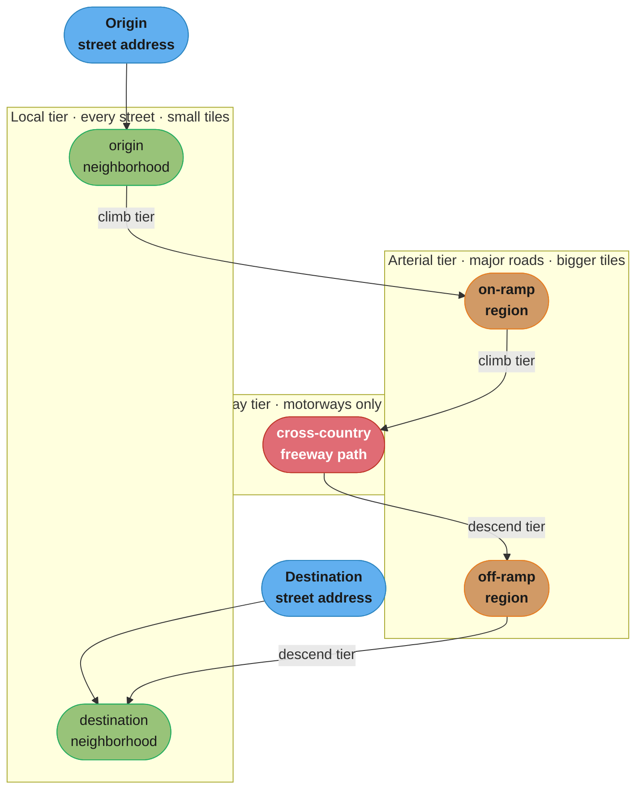
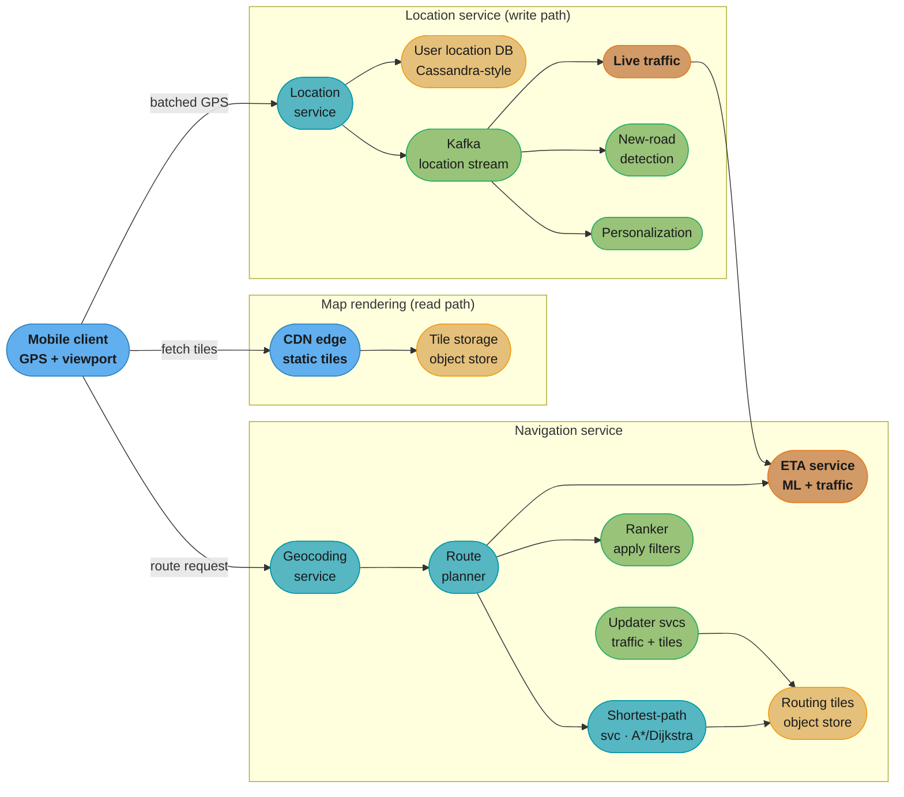
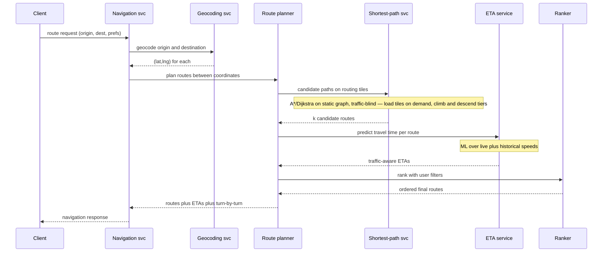

# Chapter 3: Google Maps

> Ch 3 of 13 · System Design Interview Vol 2 (Xu & Lam) · the geo trilogy's finale — tiles, routing graphs, and ETA at 1B-user scale

## Chapter Map

Google Maps is the geo trilogy's boss level. Ch 1 (Proximity Service) taught you to answer
"what businesses are near this point?" with a geohash/quadtree index; Ch 2 (Nearby Friends)
taught you to stream live locations to a fan-out of subscribers over WebSockets. This chapter
fuses both and adds three genuinely hard subsystems on top: **precomputed map tiles** served
from a CDN, a **routing graph** big enough that it cannot fit in one machine's memory, and an
**ETA model** that must fold live traffic into travel-time predictions and re-issue them as the
road ahead changes. The book front-loads a "Map 101" primer — GPS, map projections, geocoding,
tiling, and the graph model of roads — because you cannot design the system without the domain.

**TL;DR:**
- **Three product features drive everything:** location updates (write-heavy telemetry),
  navigation + ETA (a graph search plus an ML travel-time model), and map rendering (static
  tiles from a CDN). Each maps to a different storage engine and scaling story.
- **The map is precomputed image/vector tiles**, one set per zoom level; zoom level `k` holds
  `4^k` 256×256 tiles, and a client fetches only the handful under its viewport — so serving is
  a CDN problem, not a compute problem.
- **The road network is a graph** (intersections = nodes, roads = edges) too large for memory,
  so it is partitioned into **routing tiles** that reference their neighbors and are layered into
  **hierarchical tiers** (local / arterial / highway) — long routes ride the coarse tiers.
- **Shortest-path and ETA are separated on purpose:** the shortest-path service runs
  A*/Dijkstra on the *static* graph (ignores traffic); a separate ETA service predicts
  *travel time* from live + historical speeds; a ranker then applies user filters. Adaptive
  ETA re-computes as traffic shifts and pushes updates back to active navigators.

## The Big Question

> "The road network of the entire planet is a graph with hundreds of millions of nodes, the map
> imagery is petabytes, and a billion people want turn-by-turn directions that stay correct as
> traffic changes second by second. How do I make *any* of this fit in memory, on a screen, and
> under a latency budget?"

Analogy: designing Google Maps is like running three utilities off one bill. **Rendering** is a
water main — a fixed, precomputed resource (tiles) you pipe cheaply to everyone from the nearest
tap (CDN edge). **Navigation** is an air-traffic-control tower — a live graph search that has to
know the current state of every runway (road segment). **Location updates** are the sensor
telemetry feeding the tower — a firehose of GPS points you must ingest write-first and worry
about reading later. The art is refusing to solve all three with one hammer: static data goes to
a CDN, the graph gets partitioned into tiles, and the telemetry goes to a write-optimized store.

---

## 3.1 Step 1 — Understand the Problem and Establish Design Scope

Google Maps does an enormous amount. In an interview you scope hard to three pillars and confirm
the rest is out of bounds.

### Functional requirements

The three features the design must support end to end:

1. **Location update.** Clients continuously report their GPS position to the backend. This
   telemetry is the raw material for live traffic, detecting new/closed roads, and personalizing
   results — not just for showing the blue dot.
2. **Navigation service (including ETA).** Given an origin and destination, return a small set of
   good routes with turn-by-turn directions and an estimated time of arrival that reflects
   current traffic. Reroute and re-estimate as conditions change.
3. **Map rendering.** Draw the map at any location and zoom level on the client, fast, over a
   mobile connection.

Explicitly **out of scope** (confirm with the interviewer): street view, indoor maps, business
listings/reviews (that is Ch 1's proximity service), lane-level AR guidance, and building the
map data itself. We assume the **road/map data is already available** — Google licenses and/or
collects it (satellite imagery, government road data, its own Street View fleet, and user
contributions). Designing the data-collection pipeline is a separate, massive problem; here it
is an input.

### Non-functional requirements

| Requirement | Target / note |
|-------------|---------------|
| **Scale** | ~**1 billion DAU**. Planet-scale coverage. |
| **Accuracy** | Positions and ETAs must be accurate; users route real trips on them. |
| **Smooth rendering** | No stutter panning/zooming even on a spotty mobile link. |
| **Data & battery efficiency** | Mobile-first: minimize bytes over the air and GPS/radio battery drain. This is why location updates are **batched** and rendering prefers **vector tiles**. |
| **Availability & scalability** | Standard high-availability; the write path (location) and read path (tiles) scale independently. |

**The accuracy-vs-freshness tradeoff** is the recurring theme. More frequent GPS sampling and
location uploads give fresher traffic and tighter ETAs but burn battery and bandwidth and flood
the write path. Fresher tiles mean re-rendering and re-distributing petabytes. The design
repeatedly picks a "fresh enough" point: **batch location every ~15 s**, re-render tiles on a
slow cadence, and recompute ETA only for road segments whose traffic actually moved.

### Back-of-the-envelope estimation

Two numbers dominate: how much storage the world map takes, and how heavy the location-update
write path is.

**Storage — map tiles.** The map is served as precomputed image tiles, one set per zoom level.
Tiling doubles resolution in each dimension per level, so **zoom level `z` has `4^z` tiles**.
There are roughly **21 zoom levels**. At the deepest level:

```
tiles at zoom 21   = 4^21  ≈ 4.4 trillion tiles
bytes per tile     ≈ 100 KB (256x256 rendered image)
top-level bytes    ≈ 4.4e12 tiles x 1e5 B  ≈ 4.4e17 B  ≈ 440 PB   (this level alone)

all levels (geometric sum, top level dominates):
   sum_{z=0..21} 4^z  =  (4^22 - 1) / 3  ≈  4/3 x 4^21  ≈  5.9 trillion tiles
   naive total        ≈  5.9e12 x 100 KB  ≈  ~590 PB
```

**What this actually says.** "Every zoom level costs four times the level above it, so the
deepest level you choose to keep *is* the storage bill — the entire rest of the pyramid rounds to
a third of it on top." That framing tells you exactly where to cut: shaving one level off the deep
end removes about three quarters of the footprint, while dropping shallow levels saves nothing at
all.

| Symbol | What it is |
|--------|------------|
| `z` | Zoom level. 0 = the whole world in one tile; each level splits every tile into four |
| `4^z` | Tiles at level `z` — a `2^z x 2^z` grid, Web Mercator's power-of-two quadtree |
| `21` | The deepest zoom level kept (street-level detail) |
| `100 KB` | Bytes per rendered 256x256 raster tile |
| `(4^(z+1) - 1) / 3` | Closed form of `sum_{k=0..z} 4^k` — every tile in the pyramid up to `z` |
| `PB` | Petabyte, 1e15 bytes |

**Walk one example.** Pricing the pyramid level by level:

```
  level z        tiles = 4^z         bytes = tiles x 100 KB        as PB
  -------        -----------         ----------------------      --------
     0                        1              1.0e5 B               0.0000
    10                1,048,576              1.0e11 B              0.0001
    15            1,073,741,824              1.1e14 B              0.1074
    18           68,719,476,736              6.9e15 B              6.8719
    21        4,398,046,511,104              4.4e17 B            439.8047   <- one level
  ------------------------------------------------------------------------
  sum 0..21   (4^22 - 1) / 3
            = 5,864,062,014,805              5.9e17 B            586.4062   <- whole pyramid

  whole pyramid / deepest level  =  586.4062 / 439.8047  =  1.3333  =  4/3
  share of the bill from z=21    =  439.8047 / 586.4062  =  75.0%
```

The `4/3` is the geometric series `1 + 1/4 + 1/16 + ...` read backwards: levels 0-20 combined add
only a third again on top of level 21. So "how deep do I render, and where?" is the only storage
question that matters — which is precisely why the next move is to stop rendering level 21 over
open ocean.

That naive ~590 PB is not what Google actually stores, and the two corrections are the point of
the estimate:

- **~90% of the earth is ocean, ice, or empty land.** Those tiles are near-uniform (all blue,
  all white) and compress to almost nothing; they also do not need the deepest zoom levels
  (nobody street-navigates the mid-Pacific). Dropping/compressing them collapses the footprint
  by roughly an order of magnitude.
- **You only store the deep zoom levels for populated regions**, where detail actually matters.

After compression and only serving a useful subset, the book lands the practical stored map on
the order of **~50 PB**, and roughly **~100 PB** once you keep multiple rendered *styles*
(satellite, terrain, roadmap), versions, and CDN-replicated copies. The headline lesson: the
raw arithmetic says petabytes, but *emptiness compresses* — so the real constraint is
distribution (CDN), not raw disk.

**Location-update QPS.** Naively, if all 1B users streamed a GPS fix every second you would face
1B writes/second — absurd. Batching is the lever:

```
DAU                         = 1e9
avg active time/user/day    ~ 35 min = 35/1440 of the day
avg concurrent users        ≈ 1e9 x 35/1440  ≈ 24 million concurrent
batch cadence               = 1 upload / 15 s  (client buffers GPS points, sends every 15 s)

steady-state write QPS      ≈ 24e6 / 15  ≈ 1.6 million writes/sec
peak (say 2x)               ≈ 3+ million writes/sec
```

**Put simply.** "Concurrency, not headcount, sets the write path — and the batch window divides
that concurrency straight down." A billion registered users is not a billion writers; only the
slice with the app live right now writes, and the client's buffer then cuts even that by the
length of the window.

| Symbol | What it is |
|--------|------------|
| DAU | Daily active users, 1e9 |
| 35 min / 1440 min | Duty cycle — the fraction of a day an average user has the app live |
| concurrent | DAU x duty cycle; how many clients are streaming at any given instant |
| 15 s | Client batch window — buffer GPS points locally, flush one request every 15 s |
| write QPS | concurrent / batch window; requests per second arriving at the location service |

**Walk one example.** Pushing the chapter's own numbers through:

```
  duty cycle       =  35 min / 1440 min per day       =  0.024306
  concurrent       =  1e9 x 0.024306                  =  24,305,556 clients
  unbatched QPS    =  24,305,556 / 1 s                =  24.3 M writes/sec
  batched QPS      =  24,305,556 / 15 s               =   1.62 M writes/sec
  peak (2x)        =  2 x 1.62 M                      =   3.24 M writes/sec

  writes removed   =  24.3 M - 1.62 M                 =  22.7 M writes/sec
  reduction factor =  24.3 M / 1.62 M                 =  15x  (exactly the window length)
```

The reduction factor is *identically* the window length: 15 seconds of client-side buffering buys
15x fewer requests, and nothing else in the design comes close to that lever. The duty-cycle term
is what keeps the estimate honest — drop it and you would size the write path for 1e9 concurrent
writers, over-provisioning by roughly 41x.

Even after batching, the location path is **millions of writes per second** — overwhelmingly
write-heavy, append-only, rarely read back per-user. That profile screams a **wide-column,
write-optimized store (Cassandra-style)**, not a relational database. Contrast the read path:
tile serving is billions of reads/day of *static, identical-for-everyone* content — a textbook
**CDN** workload.

---

## 3.2 Step 2 — Propose High-Level Design and Get Buy-In

The book teaches the domain before the boxes-and-arrows. This "Map 101" primer is load-bearing:
every later decision (why tiles, why routing tiles, why separate ETA) follows from it.

### Map 101: Positioning system

A device figures out *where it is* by combining several signals, trading accuracy against
availability and battery:

- **GPS (GNSS).** The phone receives timing signals from ≥4 satellites and trilaterates its
  latitude/longitude. Accurate (meters) outdoors, but slow to acquire a first fix ("cold start"),
  weak indoors and in urban canyons, and power-hungry.
- **Cell-tower triangulation.** Signal strength/time from nearby cell towers gives a coarse
  position (hundreds of meters to km) instantly and cheaply — a good fallback and a warm-start
  hint for GPS.
- **Wi-Fi positioning.** Databases mapping Wi-Fi BSSIDs to known locations give surprisingly good
  indoor/urban fixes where GPS fails.
- **Sensor fusion / dead reckoning.** The accelerometer, gyroscope, and compass let the device
  interpolate motion between GPS fixes (and through tunnels), smoothing the blue dot.

The takeaway for the design: the client owns positioning and produces a stream of `(lat, lng,
timestamp)` fixes of varying accuracy; the backend consumes that stream.

### Map 101: Going from 3D to 2D (map projections)

The earth is a sphere (roughly), but screens and tiles are flat. A **map projection** flattens
the globe onto a plane, and *every* projection distorts something — you cannot preserve area,
shape, and distance simultaneously.

- **Mercator projection** preserves *angles/shape locally* (great for navigation — a straight
  compass bearing is a straight line) but badly distorts *area* near the poles: Greenland looks
  the size of Africa though Africa is ~14× larger.
- **Web Mercator** is the industry-standard variant used by Google Maps, OpenStreetMap, Bing, and
  essentially every web map. It treats the earth as a sphere for speed and maps the world into a
  clean square that tiles perfectly: at zoom 0 the whole world is one 256×256 tile, and each zoom
  level quarters each tile into four. Web Mercator's square, power-of-two tiling is *why* the
  `4^z`-tiles-per-level arithmetic works so cleanly. It clips the poles (beyond ~±85°) — an
  acceptable loss since almost nobody navigates there.

### Map 101: Geocoding and reverse geocoding

Users type addresses, not coordinates; the graph and tiles speak coordinates. Two conversions
bridge them:

- **Geocoding** — address → `(lat, lng)`. "1600 Amphitheatre Parkway" becomes a coordinate.
  Backed by a geocoding database. Where an exact match is missing, **interpolation** estimates
  the point along a street segment: if a block runs from house #1 to #100 over a known length,
  #50 is placed ~halfway along it.
- **Reverse geocoding** — `(lat, lng)` → nearest address / place. Used to label the blue dot's
  street, name a dropped pin, and describe a destination.

Geocoding is a **read-heavy, latency-sensitive lookup** — a natural fit for a key-value store
fronted by a cache (see the data-model deep dive).

### Map 101: Geohashing

Geohashing encodes a `(lat, lng)` into a short string by recursively bisecting the lat/lng ranges;
each added character refines the cell, and shared prefixes mean spatial proximity. It is the index
that answers "what's near here?" and range/neighbor queries. **This chapter does not re-teach it** —
it is the core of Ch 1 (Proximity Service). Here it matters as the mechanism behind proximity
lookups and as one option for keying spatial data. See
[Ch 1 — Proximity Service](../01_proximity_service/README.md) for geohash vs quadtree vs S2 in depth.

### Map 101: Map rendering (tiling)

The naive idea — send the client raw map data and let it draw everything — is far too slow and
heavy over mobile. Instead the world is **pre-rendered into tiles**:

- The map at each zoom level is chopped into a grid of **256×256-pixel tiles**.
- **Zoom level `k` has `4^k` tiles** (zoom 0 = 1 tile for the whole world; each level quarters
  each tile). This is exactly the Web Mercator quadtree.
- Every tile has a stable address `(zoom, x, y)`, so a tile is a static, cacheable resource that
  is *identical for every user*.
- The client computes which tiles cover its **viewport** at the current zoom and fetches **only
  those** — a phone screen needs only a dozen or so tiles at a time, plus a ring of prefetch
  tiles for smooth panning. It never downloads the planet.

```
zoom 0:   1 tile           the whole world
zoom 1:   4 tiles          2 x 2
zoom 2:   16 tiles         4 x 4
...
zoom k:   4^k tiles        2^k x 2^k grid

viewport (client actually fetches, at any moment):
  +----+----+----+----+          only the tiles under the screen,
  |    |    |    |    |          e.g. ~3x4 = 12 tiles + a prefetch ring
  +----+----+----+----+          -> a few hundred KB, not petabytes
  |    | [] | [] |    |
  +----+----+----+----+
  |    | [] | [] |    |
  +----+----+----+----+
```

Caption: the tile pyramid quarters the world at each zoom level (`4^k` tiles at level `k`), but a
client only ever pulls the handful of tiles under its viewport — turning "serve the planet" into
"serve a dozen static files from the nearest CDN edge."

**Read it like this.** "A client's download is set by the size of its screen, not by the size of
the world: bytes = (viewport tiles + prefetch ring) x bytes per tile." The planet's tile count
never appears in the client's cost function, which is why the same design serves a phone and a
wall-sized display without changing.

| Symbol | What it is |
|--------|------------|
| viewport tiles | Tiles whose 256x256 pixel area intersects the visible screen |
| prefetch ring | One extra band of tiles around the viewport so panning does not stall |
| bytes/tile | ~100 KB for a rendered raster tile; substantially less for a vector tile |

**Walk one example.** A phone whose screen covers a 3x4 block of tiles, with a one-tile ring:

```
  visible grid              3 x 4                      =    12 tiles
  grid with 1-tile ring     5 x 6                      =    30 tiles  (12 visible + 18 ring)

  raster @ 100 KB/tile      12 x 100 KB                =  1,200 KB  =  1.2 MB
                            30 x 100 KB                =  3,000 KB  =  3.0 MB
  vector @  25 KB/tile      12 x  25 KB                =    300 KB
                            30 x  25 KB                =    750 KB

  whole planet at zoom 21                              =  439.8 PB  =  4.398e17 B
  planet / one raster screenful  =  4.398e17 / 1.2e6   =  3.7e11 x
```

The ring is where the prefetch term earns its place: without it the client fetches only the 12
visible tiles and every pan stalls on a network round-trip; with it the client carries 30 tiles so
the next tile is already local. Note the two payload columns against the "a few hundred KB per
screenful" figure used elsewhere in this chapter — that figure lines up with the vector-tile
column (300 KB for the visible grid), while the 100 KB raster tile of the storage estimate puts
the same screenful at 1.2 MB. It is one more reason the chapter lands on vector tiles.

### Map 101: Road data for navigation algorithms (routing tiles)

Navigation is a **graph problem**. Model the road network as a graph:

- **Nodes = intersections** (and other decision points).
- **Edges = road segments** between intersections, weighted by length, speed limit, one-way
  direction, turn restrictions, etc.

Finding a route = finding a shortest/lowest-cost path in this graph (Dijkstra, or A* with a
geographic heuristic). The problem: **the planet's road graph — hundreds of millions of nodes —
does not fit in one machine's memory**, and you cannot load the whole thing to plan a 3-km trip.

The fix is **routing tiles**: partition the graph *geographically* into tiles, each holding the
nodes/edges in a small region as a serialized **adjacency list**. A tile stores references to its
**neighbor tiles** at the roads that cross its boundary, so a path search can start in one tile
and **expand across tile boundaries** by loading adjacent tiles **on demand** — you only ever hold
the tiles the search actually touches.

**In plain terms.** "The graph's memory bill is nodes x bytes-per-node plus edges x
bytes-per-edge — and because every intersection carries a couple of road segments, the edges are
the bill." Once you see that, partitioning stops being a nicety and becomes the only way to bound
the working set of a single search.

| Symbol | What it is |
|--------|------------|
| `V` | Nodes — intersections and decision points; the chapter's "hundreds of millions" |
| `E` | Directed edges — road segments; `E = V x average out-degree` |
| average out-degree | Road segments leaving an intersection, counting both directions; ~2.5 |
| bytes/node | Node id + latitude + longitude, packed = 24 B |
| bytes/edge | Target node id + weight + flags + geometry pointer = 24 B |
| bytes/tile | Total adjacency bytes / number of routing tiles |

**Walk one example.** Size the planet first, then one routing tile:

```
  V   =  300,000,000 nodes
  E   =  300,000,000 x 2.5                     =  750,000,000 directed edges

  node store   =  3.0e8 x 24 B                 =    7.2 GB
  edge store   =  7.5e8 x 24 B                 =   18.0 GB
  adjacency total                              =   25.2 GB   <- one big machine, barely
  + polyline geometry @ 100 B/edge             =  +75.0 GB
  full graph with geometry                     =  100.2 GB   <- one machine, no

  partition at 2,000 nodes per routing tile:
    tile count      =  3.0e8 / 2,000           =  150,000 tiles
    bytes per tile  =  25.2 GB / 150,000       =  168 KB per tile
    search touching 50 tiles  =  50 x 168 KB   =  8.4 MB resident
```

That last line is the entire argument for routing tiles: a search holds 8.4 MB of working set
instead of 25-100 GB, so a commodity broker-sized machine can plan routes and you scale by adding
machines rather than by buying RAM. Drop the out-degree term and you would size the graph at 7.2
GB and conclude it fits comfortably in memory — the edges are 71% of the adjacency bytes and they
are what breaks the single-machine assumption.

Even that is too slow for cross-country routes (a New York → Los Angeles search would load
thousands of local tiles). So routing tiles are layered into **hierarchical tiers**:

- **Local / low-level tiles** — every residential street; small area per tile.
- **Arterial / mid tiers** — only major roads; larger area per tile.
- **Highway / high-level tiers** — only motorways; very large area per tile.

A long route uses **coarse tiers for the middle** and drops to local tiers only near the origin
and destination — exactly how a human plans: local streets to the freeway, freeway across the
country, local streets at the far end. This is the single most important idea in the chapter and
the most common deep-dive question.



Caption: a long route climbs from small local tiles up to a few huge highway tiles for the
middle, then descends back to local tiles near the destination — so a coast-to-coast search
touches a handful of coarse tiles instead of thousands of neighborhood ones.

### High-level design: the three services

The system splits along the three functional requirements. Each has its own storage and scaling
profile.



Caption: three independent subsystems — static tiles served from a CDN (read path), a
write-optimized location firehose that also fans out to traffic/new-road/personalization via
Kafka, and a navigation service that composes geocoding, a traffic-blind shortest-path search
over routing tiles, a traffic-aware ETA model, and a ranker.

**Location service.** Clients batch-send GPS points every ~15 s to a stateless location service,
which writes them to a write-optimized **user location database (Cassandra-style)**. Crucially,
the location stream is also published to **Kafka**, from which multiple consumers feed:

- **Live traffic** — aggregate speeds per road segment from the crowd of GPS traces.
- **New-road / road-change detection** — traces on unmapped paths reveal new or closed roads.
- **Personalization** — a user's history informs their results.

So the write path is not just "store the blue dot" — it is the sensor network that keeps the
whole map and traffic model current.

**Navigation service.** Given origin + destination, it composes several sub-services:

- **Geocoding service** — turns the typed addresses into coordinates.
- **Route planner** — the orchestrator. It calls:
  - **Shortest-path service** — runs A*/Dijkstra variants on the **routing tiles**. It uses the
    *static* graph only and **ignores live traffic** — it produces candidate paths by distance /
    road cost. Keeping it traffic-blind makes it cacheable and stable (the road graph rarely
    changes).
  - **ETA service** — predicts *travel time* for candidate routes using **ML models over live +
    historical traffic**. This is where "now" enters the picture.
  - **Ranker** — applies user filters (avoid tolls, avoid highways, shortest vs fastest) and
    ranks the candidate routes into the final ordered list.
- **Updater services** — background jobs that refresh the **live traffic** data and regenerate
  **routing tiles** as roads change.

The separation of shortest-path (static graph) from ETA (traffic) is deliberate and heavily
tested — see the deep dive.

**Map rendering.** Tiles are static, so they come from a **CDN**. The client **computes the tile
URL itself** from `(lat, lng, zoom)`: it converts the coordinate + zoom into a tile `(x, y)` index
and requests `.../tile/{zoom}/{x}/{y}.png` (or a vector-tile equivalent). Because the URL is a
pure function of position and zoom — identical for all users — the CDN edge caches it and origin
sees almost no traffic. Serving billions of tile requests/day (1B DAU × a handful of tiles per
session ≈ **billions of tile fetches per day**) directly from origin object storage would cost a
fortune in egress and latency; the CDN turns it into cheap edge reads, and the client-side
URL-hashing means no server round-trip is even needed to *find* a tile.

---

## 3.3 Step 3 — Design Deep Dive

### Data model

Four distinct datasets, four different stores — matched to their access pattern:

| Dataset | Store | Access pattern | Why |
|---------|-------|----------------|-----|
| **Routing tiles** | Object storage (S3) + cache | Read-heavy, loaded on demand by shortest-path | Serialized adjacency lists; huge but static between regenerations |
| **User location data** | Cassandra-style wide-column | Write-heavy (millions/sec), rarely read per-user | Append-only telemetry; needs linear write scaling |
| **Geocoding DB** | Key-value + Redis cache | Read-heavy, latency-sensitive | Address ↔ coordinate lookups; small values, hot keys |
| **Precomputed map tiles** | Object storage + CDN | Read-heavy, static, identical per user | Classic static-asset distribution |

**Routing tiles.** Each tile is an **adjacency list** — nodes (intersections) and their outgoing
edges (road segments with weights) — plus references to neighbor tiles at boundary-crossing roads,
**serialized** and stored as a blob in **object storage (S3)**, cached in the shortest-path
service's memory as it works. A separate **tile-generation pipeline** consumes the raw road data
(licensed + collected) and produces these tiles per tier (local / arterial / highway); the updater
service reruns it when the road network changes. The shortest-path service never sees raw road
data — only serialized tiles.

**User location data.** A schema like:

```
user_locations (
  user_id      text,        -- partition key
  timestamp    timestamp,   -- clustering key (descending)
  lat          double,
  lng          double,
  accuracy     float,
  speed        float
)  PRIMARY KEY (user_id, timestamp)
```

Partitioned by `user_id`, clustered by time — append-only writes at millions/sec, which is
exactly the Cassandra sweet spot (LSM-tree writes, no read-before-write, linear horizontal
scaling). The data is consumed downstream in aggregate (traffic, new-road detection), not read
back point-by-point for most users.

**Geocoding DB.** A **key-value** store (address → coordinate and the reverse index), **read-heavy**
and latency-critical, fronted by **Redis** to absorb the hot lookups. Small values, high hit rate.

**Precomputed map tiles.** Rendered offline into `(zoom, x, y)`-addressed blobs in **object
storage**, pushed to the **CDN**. Regeneration is a slow, batched, offline job.

### Location service deep dive

The location service is a thin, **stateless, horizontally-scaled** write endpoint. Clients
**batch** GPS points client-side and flush every ~15 s, which is the single biggest lever on the
write path (a 15× reduction versus per-second uploads, and far less radio wake-up = better
battery). A batched request:

```
POST /v1/locations
{
  "user_id": "u_1234",
  "locations": [
    { "lat": 37.4220, "lng": -122.0841, "t": 1699999985, "acc": 5 },
    { "lat": 37.4222, "lng": -122.0839, "t": 1699999990, "acc": 6 },
    { "lat": 37.4225, "lng": -122.0836, "t": 1699999995, "acc": 5 }
  ]
}
```

The service appends these to the location DB and publishes them to **Kafka**. The Kafka fan-out is
what makes the location stream valuable **beyond navigation**: the live-traffic aggregator turns
thousands of overlapping traces into per-segment speed estimates; the new-road detector spots
consistent traces where no road is mapped; personalization builds user history. **Broken → fix:**
a naive design writes each GPS point synchronously to a relational DB and blocks the client on the
insert — at 1.6M+ writes/sec the DB melts and battery suffers from constant radio use. The fix is
the two moves above: **batch on the client** (fewer, larger requests) and **write to a
write-optimized store + async Kafka** (decouple ingestion from all the consumers).

### Rendering deep dive: vector tiles vs raster tiles

Two ways to ship a tile:

- **Raster tiles** — pre-rendered **PNG/JPEG images** (~100 KB each, the basis of the storage
  estimate). Simple: the client just paints the image. But the style is baked in (want dark mode
  or a different label language? re-render everything), zoom is discrete/blocky between levels,
  and images are heavy on bandwidth.
- **Vector tiles** — the tile ships **geometry + attributes** (roads as line strings, water as
  polygons, POIs as points) and the **client renders it with GPU styling**. The book notes vector
  is the **modern choice** for three reasons: **less bandwidth** (geometry compresses far better
  than pixels), **client-side styling** (dark mode, traffic overlay, label language, 3D — all
  without new tiles), and **smooth continuous zoom and rotation** (the client interpolates
  geometry instead of swapping blocky images). The tradeoff is more client CPU/GPU work and a more
  complex renderer.

| Aspect | Raster tiles | Vector tiles |
|--------|-------------|--------------|
| Payload | Pre-rendered image (~100 KB) | Geometry + attributes (smaller) |
| Styling | Baked in; re-render to change | Client-side, instant restyle |
| Zoom/rotate | Discrete, blocky | Smooth, continuous |
| Bandwidth | Higher | Lower |
| Client cost | Trivial (paint image) | GPU rendering required |

### Navigation deep dive

The end-to-end navigation flow chains the sub-services:



Caption: navigation composes a geocoder, a traffic-blind shortest-path search over routing tiles,
a traffic-aware ETA model, and a ranker — the shortest-path stage never touches traffic, which is
what keeps its results stable and cacheable while ETA absorbs the volatility.

**Geocoding → route planner.** The planner first turns the typed origin/destination into
coordinates (geocoding), then finds the routing-tile that contains each, and hands the coordinate
pair to the shortest-path service.

**Shortest-path on routing tiles.** The search (A* with a geographic distance heuristic, or
bidirectional Dijkstra) starts in the origin's local tile, **loads tiles on demand** as the
frontier expands, and **expands across tile boundaries** by following the neighbor references.
When the frontier gets far from origin and destination, it **jumps to a coarser tier** (arterial,
then highway), traverses the long middle cheaply, and **descends** back to local tiles near the
destination. Because this runs on the **static** graph and ignores traffic, its output — the set
of candidate paths — is stable and cacheable; the same origin/destination yields the same
candidates until the *road network itself* changes.

**The idea behind it.** "Search cost is nodes settled x time per node, and hierarchy is a trick
for shrinking the first factor by four orders of magnitude." Both factors are visible and only one
is compressible — you cannot make a heap operation much faster, so the only lever is settling
dramatically fewer nodes.

| Symbol | What it is |
|--------|------------|
| nodes settled | Nodes the search pops off the frontier and finalizes (never revisits) |
| time per node | Decode the node, relax its edges, do the heap work; ~1 microsecond |
| Dijkstra, no heuristic | Expands in all directions; worst case it settles the reachable graph |
| A* + tiers | Aims at the destination and crosses the long middle on the highway tier |

**Walk one example.** One coast-to-coast route, three search strategies:

```
  strategy                       nodes settled    x 1 us/node    =  wall time
  --------                       -------------    -----------       ---------
  Dijkstra over whole planet       300,000,000      3.0e8 us          300 s
  A* on local tiles only             2,000,000      2.0e6 us          2.0 s
  A* with hierarchical tiers            30,000      3.0e4 us          0.030 s  =  30 ms

  tiers vs planet-wide Dijkstra  =  3.0e8 / 3.0e4  =  10,000x fewer nodes settled
  tiles resident (at 168 KB ea)  =  50 tiles       =  8.4 MB, not 100 GB
```

The cost model is linear in nodes settled, so the only way to make a cross-country route
interactive is to settle fewer of them — which is exactly what climbing to the arterial and then
highway tier does. Remove the tier term and the same query settles two million nodes and takes two
seconds, well past the point where a user waits.

**ETA service.** For each candidate route, the ETA service predicts **travel time** by folding in
traffic: **live speeds** (from the location/Kafka traffic aggregator) for congestion right now,
and **historical patterns** (this segment is always slow at 5 pm on weekdays) via **ML models**.
This is why shortest-path and ETA are split: the *shape* of good routes changes slowly (graph),
but the *time* to drive them changes minute to minute (traffic) — mixing them would force a
graph re-search on every traffic tick.

**What the formula is telling you.** "ETA cost is candidate routes x segments per route x cost per
segment prediction — and the adaptive version replaces 'recompute for every navigator' with
'recompute for the navigators indexed to the segment that actually moved'." The first product is
why a single ETA call is cheap; the second is why the *continuous* version is tractable at all.

| Symbol | What it is |
|--------|------------|
| `k` | Candidate routes the shortest-path service handed over |
| segments per route | Route length / average road-segment length |
| cost per segment | One model inference over live + historical speed features; ~2 us batched |
| segments changed | Road segments whose measured traffic moved on this tick |
| navigators per segment | Active navigators indexed as "on or approaching" that segment |

**Walk one example.** First a single route request, then a single traffic tick:

```
  one route request:
    route length                    500 km
    average segment length          0.2 km
    segments per route              500 / 0.2                =      2,500 segments
    candidate routes                k = 3
    segment predictions             3 x 2,500                =      7,500
    cost @ 2 us each                7,500 x 2 us             =  15,000 us  =  15 ms

  one traffic tick (adaptive ETA):
    active navigators               2,000,000
    segments each is on/approaching 50
    index entries                   2.0e6 x 50               =  100,000,000
    total road segments             750,000,000
    mean navigators per segment     1.0e8 / 7.5e8            =  0.133
    segments changed this tick      50,000
    navigators to recompute         50,000 x 0.133           =  6,667
    naive "recompute everyone"                               =  2,000,000
    saving                          2.0e6 / 6,667            =  300x
```

The segment-to-navigator index is the term that makes adaptive ETA possible. Without it, every
traffic tick costs 2,000,000 route recomputations — at 15 ms each that is 30,000 CPU-seconds per
tick, which no fleet absorbs. With it, the tick costs 6,667 recomputations, because a changed
segment on average has a fraction of a navigator on it and the vast majority of drivers are
nowhere near it. This is also why the chapter flags maintaining that index as the hard part: it
is 1.0e8 entries churning as every navigator moves.

**Ranker.** Applies user preferences (avoid tolls, avoid highways, wheelchair-accessible, fastest
vs shortest) as filters and orders the candidate routes by the chosen objective (usually predicted
arrival time). Returns the final ordered list with turn-by-turn instructions.

**Adaptive ETA and rerouting.** During active navigation, conditions change — an accident ahead,
a jam clearing. The system must **update the ETA and possibly reroute** live. The mechanism: keep
a mapping of **which active navigators are on which road segments**, so when a segment's traffic
changes, the system recomputes ETA (and checks for a better route) **only for the affected users**
rather than re-planning everyone. The **scalability problem** the book highlights: maintaining and
querying that user→segment mapping at scale is hard — millions of active navigators, each on many
segments, with segment traffic updating constantly. You cannot recompute all routes on every
traffic tick; you index by segment so a traffic change on segment X fans out only to the drivers
currently on or approaching X.

**Delivery protocols for updates.** Pushing live ETA/reroute updates to phones is constrained:

- **Mobile push notifications** are rate-limited, higher-latency, and not meant for a steady
  stream of small updates — wrong tool for second-by-second navigation.
- A **persistent connection (WebSocket / long-lived keep-alive)** is the right fit: the client
  holds an open channel while navigating and the server streams ETA/reroute updates down it. This
  is the same live-fan-out pattern as Ch 2 (Nearby Friends).
- **Battery** is the constraint that shapes cadence: an always-open socket plus frequent GPS plus
  screen-on already drains the battery, so updates are coalesced and sent only when something
  materially changed (ETA moved past a threshold, a reroute is warranted), not on every tick.

---

## 3.4 Step 4 — Wrap Up

Google Maps decomposes into three subsystems whose only shared trait is a `(lat, lng)`:

- **Rendering** is a distribution problem, not a compute problem — precompute tiles, serve them
  static from a CDN with client-computed URLs, and prefer vector tiles for bandwidth, styling, and
  smooth zoom.
- **Navigation** is a graph problem that does not fit in memory — partition the road graph into
  **routing tiles** with neighbor references and **hierarchical tiers**, run a traffic-blind
  shortest-path search that loads tiles on demand, and layer a separate traffic-aware **ETA**
  model on top. Adaptive ETA re-computes only for the users a given segment's traffic change
  actually affects, streamed over a persistent connection.
- **Location** is a write-firehose problem — batch on the client, write to a Cassandra-style store,
  and fan the stream out through Kafka to power traffic, road detection, and personalization.

If asked to go further: sharding the routing-tile search across machines for very long routes,
contraction-hierarchies / customizable route planning (CRP) as faster preprocessing than plain
tiers, privacy of location traces (differential privacy on aggregated traffic), offline maps
(download a region's tiles + routing tiles), and multi-modal routing (transit, walking, cycling)
each layer new graphs and constraints onto the same skeleton.

---

## Visual Intuition

**Routing-tile partition map — geographic tiling of the graph.** The road graph is chopped into
square tiles; each tile references its neighbors at boundary-crossing roads, and a path search
loads only the tiles its frontier touches:

```
world road graph, partitioned into routing tiles (one adjacency list per tile)

   +--------+--------+--------+--------+
   | tile A | tile B | tile C | tile D |     - each tile = nodes + edges in
   |  .__.  |__.   . |   .__. |  .   . |       its region, serialized to S3
   +---||---+--||----+---||---+--------+     - '||' = a road crossing a tile
   | tile E | tile F | tile G | tile H |       boundary -> stored as a neighbor
   |  .  .__|__.  .__|__.  .  |  .__.  |       reference between the two tiles
   +--------+---||---+--------+--------+
   | tile I | tile J | tile K | tile L |     search starting in F expands into
   |  .__.  |  .__.__|__.  .  |  .  .  |       B, E, G, J on demand — never
   +--------+--------+--------+--------+       loads A, C, D, H, I, K, L
                 ^
        frontier of an A* search seeded in tile F: only neighbors get loaded
```

Caption: because each tile carries references to its neighbors, a shortest-path search behaves
like flood-fill across a grid — it pulls in adjacent tiles as the frontier reaches their borders
and never has to hold the whole planet's graph in memory.

**Anomaly map — why shortest-path and ETA must stay separate.** Same road graph, two very
different rates of change:

```
      shortest-path (static graph)        ETA (live traffic)
      -----------------------------       ------------------------------
      changes when: a road opens/closes   changes when: any car slows down
      timescale:    weeks / months        timescale:    seconds
      cacheable?    yes, heavily           cacheable?    no, volatile
      -> re-search graph almost never      -> re-predict time constantly
```

Caption: folding traffic into the graph search would force a full graph re-search on every traffic
tick; separating them lets the expensive graph search be cached while the cheap ETA model absorbs
all the volatility.

---

## Key Concepts Glossary

- **Location update** — client telemetry of `(lat, lng, timestamp)` GPS fixes sent to the backend.
- **Batching (location)** — buffering GPS points on the client and uploading every ~15 s to cut
  write QPS and save battery.
- **Positioning system** — combining GPS, cell towers, Wi-Fi, and inertial sensors to locate a
  device.
- **GPS / GNSS** — satellite trilateration; accurate outdoors, weak indoors, power-hungry.
- **Map projection** — flattening the 3D globe onto a 2D plane; always distorts area, shape, or
  distance.
- **Mercator projection** — preserves local angles/shape, distorts area toward the poles.
- **Web Mercator** — the industry-standard square, power-of-two-tiling variant used by web maps.
- **Geocoding** — address → coordinate.
- **Reverse geocoding** — coordinate → nearest address/place.
- **Interpolation (geocoding)** — estimating a point's location along a street segment by house
  number.
- **Geohashing** — encoding a coordinate into a prefix-shareable string for proximity queries
  (Ch 1).
- **Map tile** — a 256×256 pre-rendered piece of the map, addressed by `(zoom, x, y)`.
- **Zoom level** — resolution level; level `k` has `4^k` tiles.
- **Raster tile** — a pre-rendered image tile; style baked in.
- **Vector tile** — a tile of geometry + attributes rendered on the client; smaller, restylable,
  smooth zoom.
- **Viewport** — the region currently on screen; the client fetches only the tiles covering it.
- **Road graph** — intersections as nodes, road segments as weighted edges.
- **Routing tile** — a geographic partition of the road graph (serialized adjacency list) with
  references to neighbor tiles.
- **Hierarchical tiers** — local / arterial / highway layers of routing tiles; long routes use
  coarse tiers.
- **Shortest-path service** — A*/Dijkstra on the static routing-tile graph; traffic-blind.
- **ETA service** — ML model predicting travel time from live + historical traffic.
- **Ranker** — applies user filters (avoid tolls/highways) and orders candidate routes.
- **Updater services** — background jobs refreshing live traffic and regenerating routing tiles.
- **Adaptive ETA / rerouting** — recomputing ETA and routes only for navigators on affected road
  segments as traffic changes.
- **User→segment mapping** — index of which active navigators are on which segments; the crux of
  scalable adaptive ETA.
- **Location service** — stateless write endpoint feeding the location DB and Kafka stream.

---

## Tradeoffs & Decision Tables

| Decision | Option A | Option B | Chapter's call |
|----------|----------|----------|----------------|
| Map delivery | Send raw map data, render fully on client | Precomputed tiles + CDN | Tiles — client fetches only viewport tiles, static + cacheable |
| Tile format | Raster (images) | Vector (geometry) | Vector — less bandwidth, client styling, smooth zoom |
| Road graph storage | One giant in-memory graph | Routing tiles loaded on demand | Routing tiles — planet graph doesn't fit in memory |
| Long-route search | All local tiles | Hierarchical tiers | Tiers — coast-to-coast touches a few coarse tiles |
| Route cost vs time | One search over traffic-weighted graph | Split: static shortest-path + separate ETA | Split — graph is stable/cacheable, traffic is volatile |
| Location writes | Sync insert to relational DB | Batch + Cassandra + Kafka | Batch + write-optimized store — millions of writes/sec |
| Update delivery | Push notifications | Persistent WebSocket | WebSocket — streaming, low-latency; coalesce for battery |

| Storage estimate step | Value |
|-----------------------|-------|
| Zoom levels | ~21 |
| Tiles at zoom `z` | `4^z` |
| Tiles at zoom 21 | ~4.4 trillion |
| Bytes/tile | ~100 KB |
| Naive top-level total | ~440 PB |
| Naive all-levels total | ~590 PB |
| After compression + subset (~90% empty) | ~50 PB |
| With multiple styles/versions/CDN copies | ~100 PB |

---

## Common Pitfalls / War Stories

- **Trying to hold the whole road graph in memory.** The planet's graph (hundreds of millions of
  nodes) does not fit and cannot be loaded to plan a short trip. Partition into **routing tiles**
  loaded on demand; use **hierarchical tiers** so long routes don't drag in thousands of local
  tiles.
- **Folding traffic into the shortest-path search.** If the graph edges are traffic-weighted, every
  traffic update invalidates cached searches and forces a full re-search. Keep shortest-path
  **traffic-blind** on the static graph and put all volatility in a **separate ETA model**.
- **Serving tiles from origin instead of a CDN.** Billions of static, identical tile requests/day
  from object storage is ruinous egress and latency. Tiles are the canonical CDN workload; let the
  **client compute the tile URL** so no server round-trip is needed to locate a tile.
- **Synchronous per-point location writes to a relational DB.** At millions of writes/sec this
  melts the DB and drains battery from constant radio wake-ups. **Batch on the client (~15 s)** and
  write to a **Cassandra-style store + Kafka**.
- **Recomputing every route on every traffic tick (adaptive ETA).** Re-planning all active
  navigators whenever any segment changes is quadratic and impossible at scale. Maintain a
  **segment→active-navigator index** and recompute only for the users a changed segment touches.
- **Using push notifications for live navigation updates.** They are rate-limited and high-latency —
  wrong for streaming ETA/reroute updates. Use a **persistent WebSocket**, and **coalesce** updates
  (only when ETA moves materially) to protect the battery.
- **Ignoring the accuracy-vs-freshness/battery tradeoff.** Maximally fresh (per-second GPS,
  instant re-render) destroys battery, bandwidth, and the write path. Every knob (15 s batching,
  slow tile re-render, segment-scoped ETA recompute) is a deliberate "fresh enough" choice.

---

## Real-World Systems Referenced

- **Google Maps, OpenStreetMap, Bing Maps** — Web Mercator tiling; raster and vector tiles.
- **Cassandra (and wide-column stores)** — the write-optimized user-location database profile.
- **Apache Kafka** — the location-stream backbone fanning out to traffic, road detection, and
  personalization.
- **CDN (Akamai/Cloudflare/Google's edge)** — static map-tile distribution.
- **Redis** — cache in front of the read-heavy geocoding key-value store.
- **Object storage (S3-style)** — serialized routing tiles and precomputed map tiles.
- **Dijkstra / A\*** — the shortest-path algorithms run over routing tiles (with tier/contraction
  optimizations in production, e.g. contraction hierarchies / CRP).

---

## Summary

Google Maps at 1B DAU is three loosely-coupled systems that share only a coordinate. **Map
rendering** is a distribution problem: the world is precomputed into `4^z`-per-level 256×256
tiles, served static from a **CDN** with client-computed URLs; vector tiles beat raster on
bandwidth, styling, and smooth zoom. The storage arithmetic is a lesson in itself — `4^21` ≈ 4.4
trillion tiles × 100 KB is ~440 PB for the top level and ~590 PB naively across all levels, but
~90% of the earth is empty and compresses away, landing the practical footprint near ~50 PB
(~100 PB with styles/versions). **Navigation** is a graph problem too big for memory: the road
network becomes **routing tiles** (serialized adjacency lists with neighbor references) layered
into **hierarchical tiers**, over which a **traffic-blind shortest-path** search loads tiles on
demand and climbs to coarse tiers for long hauls; a **separate ETA service** predicts travel time
from live + historical traffic, a **ranker** applies user filters, and **adaptive ETA** recomputes
only for the navigators a changed segment affects, streamed over a **WebSocket**. **Location** is a
write-firehose: clients **batch GPS every ~15 s** (≈ 1.6M+ writes/sec after batching), written to a
**Cassandra-style store** and published to **Kafka** so the same telemetry powers live traffic, new
-road detection, and personalization. The unifying discipline: match each dataset to the store its
access pattern demands, and never solve a static-data problem with a live-compute hammer.

---

## Interview Questions

**Q: Why is the road network stored as routing tiles instead of one in-memory graph?**
Because the planet's road graph — hundreds of millions of nodes — is far too large to fit in one machine's memory or to load just to plan a short trip. Routing tiles partition the graph geographically into small regions, each a serialized adjacency list in object storage with references to its neighbor tiles. A path search loads only the tiles its frontier actually touches, expanding across boundaries on demand, so you hold a handful of tiles instead of the whole world.

**Q: Why are the shortest-path service and the ETA service kept separate?**
Because the road graph changes on a timescale of weeks (roads open/close) while traffic changes second by second, so mixing them would force a full graph re-search on every traffic tick. The shortest-path service runs A*/Dijkstra on the static, traffic-blind graph, producing stable, cacheable candidate routes. The ETA service then predicts travel time for those candidates from live and historical traffic. Separation lets the expensive search be cached while the cheap ETA model absorbs all the volatility.

**Q: How many tiles are at zoom level k, and why does that matter for storage?**
Zoom level `k` has `4^k` tiles, because each level quarters every tile into four (Web Mercator's power-of-two quadtree). At zoom 21 that is roughly 4.4 trillion tiles; at ~100 KB each, the top level alone is ~440 PB and all levels naively sum to ~590 PB. It matters because it shows raw storage is petabyte-scale, forcing the compression and served-subset reasoning that brings it down to ~50 PB.

**Q: Why does the naive ~590 PB map estimate collapse to roughly 50 PB in practice?**
Because about 90% of the earth's surface is ocean, ice, or empty land, whose tiles are near-uniform and compress to almost nothing, and those regions do not need the deepest zoom levels. Storing full detail only for populated areas and compressing the empty tiles cuts the footprint by roughly an order of magnitude. Keeping multiple rendered styles, versions, and CDN copies brings it back up toward ~100 PB.

**Q: Why are map tiles served from a CDN, and how does the client find a tile?**
Because tiles are static and identical for every user, and serving billions of requests/day from origin object storage would be ruinous in egress cost and latency. The client computes the tile URL itself as a pure function of `(lat, lng, zoom)` — converting the coordinate and zoom into a tile `(x, y)` index — and requests that URL, which the CDN edge caches. Because the URL is deterministic and user-independent, no server round-trip is needed to locate a tile and origin sees almost no traffic.

**Q: What are hierarchical tiers of routing tiles and why are they needed?**
They are layers of routing tiles — local (every street), arterial (major roads), and highway (motorways only) — where each coarser tier covers a larger area with fewer roads. They are needed because a cross-country search over only local tiles would load thousands of tiles and be far too slow. A long route uses local tiles near the origin and destination but jumps to coarse tiers for the long middle, exactly as a human drives local streets to the freeway, the freeway across the country, then local streets at the end.

**Q: Vector tiles vs raster tiles — which does the book prefer and why?**
Vector tiles are the modern preferred choice. Raster tiles are pre-rendered images (~100 KB) with the style baked in and blocky discrete zoom. Vector tiles ship geometry plus attributes and are rendered on the client, giving three wins: less bandwidth (geometry compresses better than pixels), client-side styling (dark mode, traffic overlay, label language without new tiles), and smooth continuous zoom and rotation. The cost is more client GPU/CPU work and a more complex renderer.

**Q: Why are location updates batched, and what QPS does that produce?**
Batching (buffering GPS points on the client and uploading every ~15 s) is the biggest lever on the write path, cutting per-second uploads by ~15× and reducing radio wake-ups to save battery. With ~1B DAU and roughly 24M concurrent users, per-second uploads would be an impossible ~24M writes/sec, but batching every 15 s brings steady-state writes to ~1.6M/sec (a few million at peak). Even batched, it is an overwhelmingly write-heavy, append-only workload.

**Q: What database fits the user-location write path and why?**
A wide-column, write-optimized store like Cassandra, partitioned by `user_id` and clustered by timestamp. The workload is millions of append-only writes per second, rarely read back per user, which is exactly Cassandra's sweet spot: LSM-tree writes with no read-before-write and linear horizontal scaling. A relational database with synchronous per-point inserts would melt under the write volume.

**Q: Beyond showing the blue dot, what is the location stream used for?**
The location stream is published to Kafka and fans out to several consumers: live traffic (aggregating overlapping GPS traces into per-segment speeds), new-road and road-change detection (consistent traces where no road is mapped), and personalization (a user's history informs results). So the telemetry is the sensor network that keeps the map and traffic model current, not just the source of one user's position.

**Q: How does adaptive ETA / rerouting avoid recomputing every user's route on every traffic change?**
It maintains an index of which active navigators are on which road segments, so a traffic change on a segment fans out only to the drivers currently on or approaching that segment. When a segment's speed changes, the system recomputes ETA (and checks for a better route) only for those affected users, not for everyone. Recomputing all routes on every tick would be quadratic and impossible; the segment→navigator index is what makes it scalable, and maintaining that mapping at millions-of-navigators scale is the hard part.

**Q: What delivery protocol streams live ETA/reroute updates to phones, and why not push notifications?**
A persistent connection such as a WebSocket, held open while the user navigates so the server can stream updates down it. Push notifications are rate-limited and higher-latency, unsuited to a steady stream of small navigation updates. The battery constraint shapes cadence: updates are coalesced and sent only when something material changed (ETA past a threshold, a warranted reroute), not on every tick.

**Q: What is Web Mercator and why is it the standard for web maps?**
Web Mercator is the industry-standard map projection variant used by Google Maps, OpenStreetMap, and Bing. It treats the earth as a sphere for speed and maps the world into a clean square that tiles perfectly — the whole world is one tile at zoom 0 and each level quarters each tile — which is why the `4^z`-tiles-per-level math is so clean. Like all Mercator variants it preserves local angles (good for navigation bearings) but distorts area toward the poles, and it clips the extreme poles as an acceptable loss.

**Q: What is geocoding, reverse geocoding, and interpolation?**
Geocoding converts an address to a coordinate ("1600 Amphitheatre Parkway" → lat/lng); reverse geocoding converts a coordinate back to the nearest address or place. Interpolation handles addresses with no exact match by estimating the point along a street segment — if a block runs from house #1 to #100 over a known length, #50 is placed about halfway. Geocoding is a read-heavy, latency-sensitive key-value lookup, fronted by a cache like Redis.

**Q: What positioning signals does a device combine, and what does each trade off?**
GPS/GNSS trilaterates from satellites for meter-level accuracy outdoors but is slow to acquire, weak indoors, and power-hungry; cell-tower triangulation gives an instant, cheap, coarse fix and a warm-start hint for GPS; Wi-Fi positioning gives good indoor/urban fixes where GPS fails; and inertial sensors (accelerometer, gyroscope, compass) do dead reckoning to smooth the position between fixes and through tunnels. The client fuses these into a stream of `(lat, lng, timestamp)` fixes for the backend.

**Q: What does a client actually fetch to render the map, versus downloading everything?**
The client computes which tiles cover its current viewport at the current zoom and fetches only those — a phone screen needs only about a dozen tiles at a time plus a small prefetch ring for smooth panning — totaling a few hundred KB, not the petabyte-scale world. Each tile is addressed by `(zoom, x, y)` and is a static, cacheable resource identical for all users, so it comes from the CDN edge.

**Q: What is the accuracy-vs-freshness tradeoff, and where does the design make that call?**
It is the tension between fresher data (more frequent GPS, faster tile re-render) and the cost in battery, bandwidth, and write load. The design repeatedly picks "fresh enough": location is batched every ~15 s, tiles are re-rendered on a slow offline cadence, and adaptive ETA recomputes only for segments whose traffic actually moved. Maximal freshness everywhere would destroy battery life and overwhelm the write path.

**Q: How does the shortest-path search expand across routing tiles and jump tiers?**
The search (A* with a geographic heuristic or bidirectional Dijkstra) starts in the origin's local tile, loads neighbor tiles on demand as the frontier reaches their borders via each tile's stored neighbor references, and never loads tiles the frontier does not touch. When the frontier moves far from origin and destination, it climbs to a coarser tier (arterial, then highway) to cross the long middle cheaply, then descends back to local tiles near the destination. This flood-fill-across-a-grid behavior keeps memory bounded to the tiles actually used.

**Q: What do the updater services do in the navigation system?**
They are background jobs that keep the navigation data current: one refreshes the live traffic data (per-segment speeds derived from the location/Kafka stream) that the ETA service consumes, and another regenerates the routing tiles from raw road data when the road network changes. The shortest-path service itself only ever reads serialized routing tiles, never raw road data, so tile regeneration is how new and closed roads eventually reach routing.

---

## Cross-links in this repo

- [hld/case_studies/design_google_maps.md — the repo's deep-dive design of Google Maps](../../../hld/case_studies/design_google_maps.md)
- [book · Ch 1 — Proximity Service (geohash/quadtree/S2, "near me" queries)](../01_proximity_service/README.md)
- [book · Ch 2 — Nearby Friends (live location fan-out over WebSockets)](../02_nearby_friends/README.md)
- [hld/cdn/README.md — CDN mechanics behind static tile distribution](../../../hld/cdn/README.md)
- [ml/case_studies/design_eta_prediction.md — ETA as an ML travel-time prediction system](../../../ml/case_studies/design_eta_prediction.md)
- [ml/README.md — ML section overview (models behind the ETA service)](../../../ml/README.md)
- [DDIA Ch 5 — Replication (how the location/tile stores stay durable and available)](../../designing_data_intensive_applications/05_replication/README.md)

## Further Reading

- Xu & Lam, *System Design Interview Vol 2*, Ch 3 — original text.
- Dijkstra, "A Note on Two Problems in Connexion with Graphs," 1959 — the shortest-path algorithm.
- Hart, Nilsson & Raphael, "A Formal Basis for the Heuristic Determination of Minimum Cost Paths,"
  1968 — the A* algorithm.
- Geisberger et al., "Contraction Hierarchies," 2008 — fast route-planning preprocessing behind
  production routing.
- OpenStreetMap / Mapbox Vector Tile specification — the vector-tile format and Web Mercator tiling.
