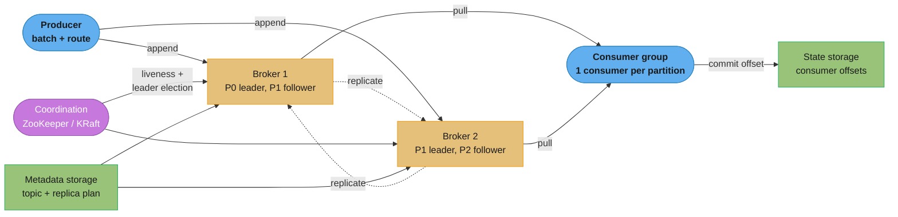
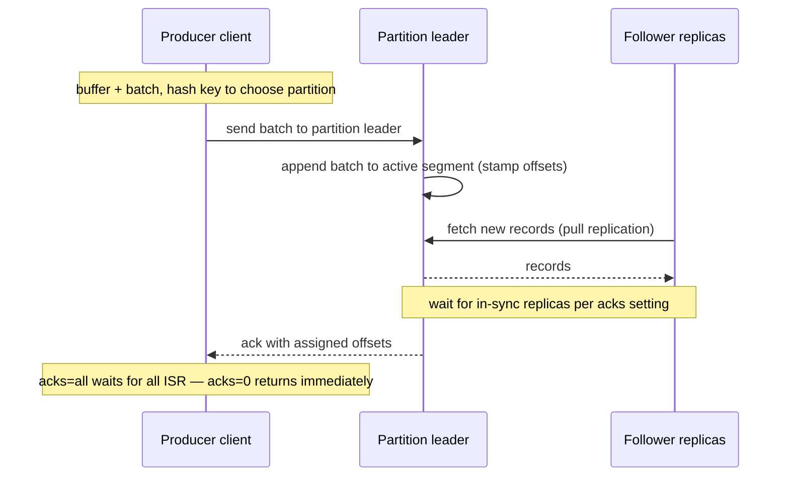
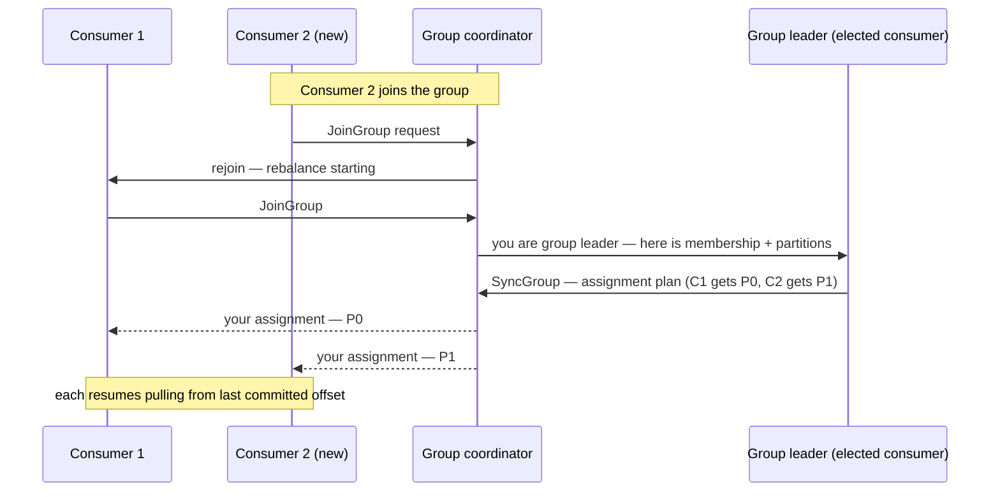
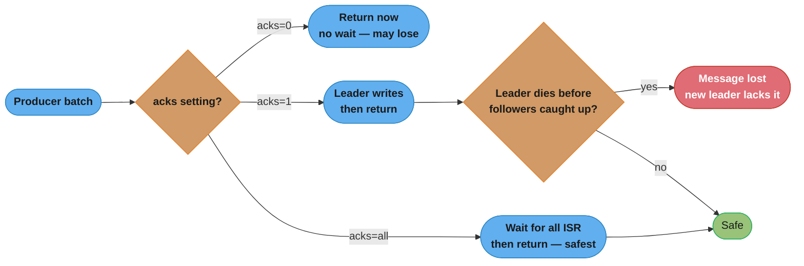

# Chapter 4: Distributed Message Queue

> Ch 4 of 13 · System Design Interview Vol 2 (Xu & Lam) · a mini-Kafka: the log-storage and delivery-semantics chapter that Ch 5–6 build on

## Chapter Map

This chapter designs a **distributed message queue** — but the moment you add
"repeatable consumption" (consumers can re-read old messages), "in-order delivery
within a partition," and "two-week retention," the design stops looking like a
traditional broker (RabbitMQ, ActiveMQ) and converges on a **Kafka-style
append-only log**. So the chapter is really a guided construction of a mini-Kafka:
producers append to partitioned commit logs, brokers store those logs as segment
files on disk, and consumers pull at their own pace while a coordination service
tracks who owns what.

**TL;DR:**
- A message queue decouples producers from consumers, buffering messages so the
  two sides can run at independent rates and scale independently.
- **Point-to-point** (each message consumed once) and **publish-subscribe** (each
  message fanned out to all subscribers) are both expressible with **topics +
  partitions + consumer groups** — the same primitive gives you both models.
- Storage is the whole game: an **append-only write-ahead log split into segment
  files** exploits sequential disk I/O and the OS page cache, so even rotational
  disks sustain high throughput; retention is just "delete old segments."
- Delivery is a **dial, not a fixed guarantee**: at-most-once, at-least-once, and
  exactly-once each fall out of *when you commit the offset* and *which ack setting
  the producer uses* — and exactly-once is expensive enough that you reserve it for
  money-adjacent flows.

## The Big Question

> "How do I let one set of services produce events and another set consume them —
> at different speeds, with no data loss, in order, and with the ability to replay
> the last two weeks — without the two sides ever having to be online at the same
> time or know about each other?"

Analogy: a message queue is a **conveyor belt with a memory**. A traditional queue
is a belt where each item is picked off exactly once and then gone. The design this
chapter reaches for is a belt that also **keeps a photographic log of everything
that ever passed** for two weeks, so a consumer can rewind and re-read. That single
requirement — repeatable consumption — is what turns "a queue" into "a log," and a
log is what Kafka, Pulsar, and Kinesis all are underneath.

The chapter's arc: pin down scope (traditional queue vs event-streaming platform),
propose a high-level design around topics/partitions/consumer-groups, then spend the
deep dive on the two hard parts — **how to store the log on disk cheaply and safely**
(segments, replication, ISR) and **how to deliver it with the semantics the caller
asked for** (push vs pull, rebalancing, at-least/at-most/exactly-once).

---

## 4.1 Step 1 — Understand the Problem and Establish Design Scope

A message queue sits between producers and consumers as a **buffer and a
decoupler**. Without it, service A calls service B synchronously: if B is slow or
down, A blocks or fails, and scaling B means A must know about every B instance.
With a queue in between, A writes messages and moves on; B reads when it can; each
side scales independently and tolerates the other being offline.

### Functional requirements

The interviewer and candidate settle on this feature set (each one shapes the design):

| Requirement | What it forces into the design |
|-------------|-------------------------------|
| **Producers send messages to a queue** | A write/append API and a routing decision (which partition). |
| **Consumers consume messages from a queue** | A read API; consumers pull ranges of messages. |
| **Messages can be consumed repeatedly** (re-read old messages) | Messages are **not deleted on read** — this is the requirement that forces a durable log, not a transient queue. |
| **Consumers acknowledge / commit** what they've processed | Per-consumer, per-partition **offset** tracking, stored server-side so a consumer can resume after a crash. |
| **In-order delivery within a partition** | Messages in one partition are strictly ordered by offset; there is **no total order across partitions**. |
| **Configurable delivery semantics** — at-least-once, at-most-once, exactly-once | Delivery is a per-use-case dial, not a fixed guarantee. |
| **Message size ~KB** | Small messages; batching many of them is cheap and effective. |
| **Both high-throughput AND low-latency use cases** | The same system must serve log-aggregation (throughput-first, batch big) and near-real-time (latency-first, flush small) — so batching must be a tunable knob. |
| **Data retention ~2 weeks** | Messages persist on disk for a configured window regardless of consumption; retention is by time (or size). |
| **No message loss** (durability) | Replication across brokers; a message acknowledged to the producer must survive a broker crash. |

### Non-functional requirements

- **High throughput** — sustain a large volume of messages/sec (think log
  aggregation from thousands of servers).
- **Low latency** where configured — near-real-time delivery for latency-sensitive
  consumers.
- **Scalable** — horizontally scalable by adding brokers/partitions.
- **Persistent and durable** — data on disk, replicated; no loss on single-node
  failure.

### The scoping note: message queue vs event streaming platform

The chapter is explicit that "message queue" is an overloaded term:

- **Traditional message queues** (RabbitMQ, ActiveMQ, classic JMS brokers) move a
  message to a consumer and, once acknowledged, typically **delete it**. They excel
  at routing, per-message acknowledgement, and complex delivery topologies, but a
  message is gone after it's consumed — no replay.
- **Event streaming platforms** (Apache Kafka, Apache Pulsar, Amazon Kinesis) keep
  messages in an **ordered, durable, replayable log** with a retention window; many
  consumers read the same stream independently and can rewind.

Because the requirements include **repeatable consumption** and **2-week
retention**, the design **converges on the event-streaming/log model** — a
Kafka-like architecture — even though the problem is phrased as "design a message
queue." The book keeps calling it a message queue while building something that is,
structurally, a log. Keep that in mind: everything below (partitions, offsets,
segments, ISR) is log machinery.

---

## 4.2 Step 2 — Propose High-Level Design and Get Buy-In

### Messaging models: point-to-point vs publish-subscribe

Two classic models describe how a message flows from producers to consumers.

**Point-to-point (P2P) — work queue.** A message is placed on a queue and consumed
by **exactly one** consumer. Multiple consumers may attach to the queue to share
the load, but any given message goes to only one of them. Once consumed and
acknowledged, the message is removed (in the traditional model). This is the
"distribute work items across a worker pool" pattern: an order-processing queue
where each order must be handled once.

```
Point-to-point (competing consumers)

   Producer ---> [ m1 m2 m3 m4 m5 ] ---> Consumer A  (gets m1, m3, m5)
                     one queue     \----> Consumer B  (gets m2, m4)

   Each message delivered to exactly ONE consumer. Load is shared.
```

**Publish-subscribe (pub/sub) — fan-out.** A message is published to a **topic** and
delivered to **every** subscriber of that topic. Each subscriber gets its own copy.
This is the "broadcast an event to all interested parties" pattern: a
`user.signed_up` event that the email service, the analytics service, and the
fraud service each want independently.

```
Publish-subscribe (fan-out)

                         /--> Subscriber X (full copy)
   Producer --> topic ---+--> Subscriber Y (full copy)
                         \--> Subscriber Z (full copy)

   Each subscriber receives EVERY message. Independent streams.
```

**The unification — consumer groups give you both.** The design does not pick one
model; it implements a topic-and-partition log and layers **consumer groups** on
top:

- Within a **single consumer group**, each partition is consumed by exactly one
  consumer, so the group as a whole behaves like **point-to-point** — the work is
  divided among the group's members.
- Across **multiple consumer groups**, every group independently reads the whole
  topic from its own offset, so the topic behaves like **publish-subscribe** — each
  group gets the full stream.

So P2P is "one consumer group," pub/sub is "many consumer groups," and the storage
model (an ordered, retained log) is identical for both. This is why the log model
subsumes both traditional patterns.

### Topics, partitions, and consumer groups

**Topic.** A named category of messages — the logical stream (e.g. `orders`,
`clicks`, `payments`). Producers write to a topic; consumers subscribe to a topic.

**Partition.** A topic is split into **partitions**, and *the partition is the unit
of parallelism, ordering, and storage*. Each partition is an independent
append-only sequence of messages, each message assigned a monotonically increasing
**offset** (0, 1, 2, …) by the broker on append. Key facts:

- **Ordering is per-partition, not per-topic.** Messages within one partition are
  strictly ordered by offset; there is **no global order across partitions**. If you
  need all events for a given key (e.g. one user) in order, they must land on the
  **same partition**.
- **Keys route to partitions.** A producer may attach a **partition key**; the
  system hashes it — `partition = hash(key) mod num_partitions` — so all messages
  with the same key go to the same partition and stay ordered relative to each
  other. No key → round-robin / random across partitions for even load.
- **Partitions distribute load across brokers.** Different partitions of the same
  topic live on different brokers, so a topic's throughput scales with its partition
  count.

**Consumer group.** A named set of consumers that cooperate to consume a topic. The
governing rule:

> Within a consumer group, **each partition is assigned to exactly ONE consumer**.
> A consumer may own several partitions, but a partition is never split across two
> consumers of the same group.

Consequences of that rule:

- **Parallelism is capped by partition count.** If a topic has 4 partitions and a
  group has 4 consumers, each consumer owns 1 partition — perfect balance. Add a 5th
  consumer and it sits **idle** (no partition left to give it). *More consumers than
  partitions = wasted, idle consumers.* So you provision partitions for your target
  parallelism up front.
- **Adding consumers up to the partition count scales throughput linearly**; beyond
  it, you must add partitions.
- **Ordering per group is preserved** because each partition's single owner reads it
  in offset order.

```
Topic "orders" with 4 partitions, one consumer group of 3 consumers

   P0 --------\
   P1 ---------> Consumer A   (owns P0, P1)
   P2 ----------> Consumer B  (owns P2)
   P3 -----------> Consumer C (owns P3)

   Balanced-ish. Add a 4th consumer -> each owns 1. Add a 5th -> it is IDLE.
```

### High-level architecture

The system is a set of **brokers** (servers holding partitions) plus supporting
stores and a coordination service. The client library on both producer and consumer
sides hides most of the complexity.

The core components:

| Component | Role |
|-----------|------|
| **Producer** | Client that publishes messages to a topic; batches and routes them to the correct partition's leader broker. |
| **Consumer** | Client that subscribes (as part of a group) and **pulls** messages from partitions, committing offsets as it goes. |
| **Broker** | A server that **holds partitions** and serves reads/writes. Each partition has a **leader** broker and **follower** replicas on other brokers. |
| **Data storage** | The **log itself** — the on-disk, append-only partition data (segment files) on each broker. This is the bulk of the system's storage. |
| **State storage** | **Consumer offsets** — per group, per partition, the last committed position. Lets a consumer resume after a crash. (In Kafka this is an internal topic, `__consumer_offsets`.) |
| **Metadata storage** | **Topic and partition configuration** — number of partitions, replication factor, the replica-distribution plan (which broker holds which partition replica), retention settings. |
| **Coordination service** | Cluster membership, **broker liveness detection**, and **leader election** for partition leaders. Historically **ZooKeeper**; newer designs use a **built-in Raft-based** controller (Kafka's **KRaft**), removing the external dependency. |



Caption: producers append to partition **leaders**; followers replicate; consumers
**pull** and commit offsets to state storage; the coordination service (ZooKeeper or
the newer built-in KRaft/Raft controller) tracks broker liveness and elects
partition leaders, while metadata storage holds the topic and replica-distribution
plan.

**Coordination service — ZooKeeper vs KRaft.** For years, Kafka stored cluster
metadata and ran leader election through **ZooKeeper**, an external consensus
service. The pain: two systems to operate, and metadata changes bottleneck on
ZooKeeper's write path, limiting how many partitions a cluster can hold. The newer
approach folds consensus **into the brokers themselves** via a Raft-based metadata
quorum (**KRaft**): a small set of controller brokers run Raft to agree on
metadata and elect partition leaders, so there is **one system to operate** and
metadata scales to millions of partitions. Either way, the coordination service's
jobs are the same: **detect dead brokers** (liveness/heartbeat) and **elect a new
leader** for each partition whose leader died.

---

## 4.3 Step 3 — Design Deep Dive

The deep dive is where the interesting engineering lives: how to store the log
cheaply and durably, and how to deliver it with the right semantics.

### Data storage design

**The problem.** We must store a very high volume of messages, persist them for two
weeks, and support two access patterns at once: a **write-heavy** append stream
(producers constantly appending) and a **read-heavy** stream (many consumer groups
sequentially scanning). Storage is the design's dominant cost and risk.

**Option 1 — a general-purpose database (rejected).** Put messages in a relational
DB or a document store. Rejected because you **cannot optimize a general DB for both
access patterns at once**: a DB's B-tree indexes are built for random point
reads/writes and small updates, not for a firehose of sequential appends followed by
long sequential scans. The write amplification and index maintenance of a general DB
throttle append throughput, and scaling a DB to this write volume is expensive.
Message queues have a *much narrower* access pattern than a DB, and that narrowness
is an opportunity to specialize.

**Option 2 — a write-ahead log on disk (chosen).** Store each partition as an
**append-only, write-ahead log (WAL)** — a file (really a series of files) that you
**only ever append to**, never update in place, and read **sequentially**. New
messages go to the end; each gets the next offset. This is exactly what a database's
own WAL is, repurposed as the primary store.

The chapter's **key argument** for why a plain append-only file on disk is fast
enough — even surprisingly fast on cheap rotational disks:

1. **Sequential disk access is fast; random access is slow.** A rotational hard
   disk is terrible at random seeks (each seek costs a head movement, ~milliseconds)
   but excellent at **sequential** reads/writes (no seeking — the head streams along
   the track). Sequential HDD throughput can rival or exceed random SSD access.
   Appending to the end of a log and scanning it are both **purely sequential**, so
   the log plays to the disk's strength and sidesteps its weakness.
2. **The OS page cache does the heavy lifting.** Recently written and read data sits
   in the operating system's page cache (RAM). Because producers append at the tail
   and consumers typically read data that was recently written (they're near the
   tail), reads are frequently **served straight from RAM** without touching disk at
   all. The broker can also hand data to the network using **zero-copy** (the kernel
   sends page-cache bytes directly to the socket, skipping a userspace copy). The
   broker deliberately **leans on the OS** for caching instead of maintaining its own
   in-process cache — simpler and it uses all available RAM.

**Segment files.** A single unbounded file is unwieldy (you can't delete the front
of a file, and huge files are hard to manage), so each partition's log is split into
**segments** — fixed-size (or time-bounded) chunks:

- The newest segment is the **active segment**; all appends go there.
- When the active segment reaches a size/time threshold, it is **rotated closed**
  and a new active segment is opened. Closed segments are immutable.
- Each segment has an index mapping offset → byte position, so a consumer requesting
  offset N can seek directly to the right segment and byte.

**Retention = delete old segments.** Two-week retention is trivially implemented:
periodically **delete whole segment files** older than the retention window (by the
timestamp of their newest message) or once total size exceeds a cap. You never
delete individual messages — you drop entire segments. This is why retention is
cheap: it's an `unlink()` of a file, not a scan-and-delete. (Kafka also supports
**log compaction** as an alternative, keeping only the latest value per key, but the
default is time/size retention.)

```
Partition = ordered segment files. Appends hit the active (newest) segment only.

  segment_0000  segment_1000  segment_2000  segment_3000  <- ACTIVE
  offs 0..999   offs 1000..   offs 2000..   offs 3000..now
  [ immutable ] [ immutable ] [ immutable ] [ appending ]
       |             |
       +-- older than 2 weeks? whole file unlink()ed (retention)

  Reads seek via per-segment offset->byte index, then stream sequentially.
```

Caption: each partition is a chain of immutable segment files plus one active
segment; appends are always sequential to the tail, retention deletes whole old
segments, and the per-segment index turns "read from offset N" into a direct seek.

### Message data structure

A message on disk is a compact record. The fields the chapter lists (and why each
exists):

| Field | Purpose |
|-------|---------|
| **key** | Optional partition/ordering key. Its hash chooses the partition; also used by log compaction. Not necessarily unique. |
| **value** | The payload — the actual message body (~KB). Opaque bytes to the broker. |
| **topic** | The topic this message belongs to. |
| **partition** | The partition number within the topic. |
| **offset** | The message's position in the partition — a monotonically increasing integer **assigned by the broker on append**. |
| **timestamp** | When the message was created/appended; used for time-based retention and time-indexed lookups. |
| **size** | Length of the message, so the reader knows where this record ends and the next begins in the byte stream. |
| **CRC** (checksum) | A cyclic redundancy check over the record's bytes, used to **detect corruption** (bit rot on disk, truncated writes, network mangling). |

**Why the broker assigns the offset (not the producer).** The offset must be a
**single, gapless, monotonically increasing sequence per partition**, and only the
partition's **leader broker** — the single writer for that partition — can
guarantee that. If producers picked offsets, two producers could collide or leave
gaps, breaking ordering and the offset→byte index. So the producer sends a message
*without* an offset; the leader stamps the next offset as it appends. This is the
same reason a partition has exactly one leader: a single sequencer.

**Why CRC guards corruption.** Disks suffer silent bit rot, and a crash mid-write
can truncate a record. On read, the broker (and optionally the consumer)
**recomputes the CRC** over the stored bytes and compares it to the stored CRC; a
mismatch means the record is corrupt and is rejected rather than silently served as
valid data. The CRC turns "silent corruption" into a **detectable error**, which is
essential for a "no message loss" guarantee — losing data loudly is recoverable
(refetch from a replica); serving corrupt data silently is not.

### Batching

**Batching is the throughput-vs-latency knob**, and the chapter stresses it cuts
both ways.

On the **producer side**, instead of sending one message per network request, the
client **buffers messages and sends them as a batch** — one request carrying many
messages. This raises throughput dramatically:

- **Fewer network round-trips and syscalls** — one request for N messages instead of
  N requests, amortizing per-request overhead (TCP, headers, broker request
  handling) across the batch.
- **Larger sequential disk writes** — the broker writes the whole batch to the
  active segment in **one big sequential append** instead of N tiny ones, which the
  disk and page cache love.
- **Better compression** — a batch of similar messages compresses far better than
  each message alone.

**The tradeoff, both ways:**

- **Bigger batches / longer linger → higher throughput but higher latency.** A
  message may sit in the producer's buffer waiting for the batch to fill (or for a
  linger timer to expire) before it's sent, adding delay.
- **Smaller batches / immediate flush → lower latency but lower throughput.** You pay
  more per-message overhead.

This is exactly why the requirements demanded **both** high-throughput and
low-latency use cases be **configurable**: log-aggregation pipelines set a large
batch size and a linger of tens of milliseconds (throughput-first); near-real-time
pipelines flush small or immediately (latency-first). The batch settings expose the
dial. Batching also relates directly to segment writes — a batch becomes one
contiguous run of bytes in the active segment.

### Producer flow

How a message gets from `producer.send()` to durably stored:

1. **Buffer and batch in the producer client.** The producer library groups
   messages, typically **partitioning them client-side** (hash the key → partition),
   and accumulates a batch per destination partition.
2. **Route to the partition leader.** The producer looks up (from metadata) **which
   broker is the current leader** of the target partition and sends the batch there.
   Only the leader accepts writes for a partition.
3. **Leader appends to its log.** The leader writes the batch to the active segment
   of that partition, stamping offsets.
4. **Followers replicate.** The follower replicas **fetch** the new data from the
   leader (pull-based replication) and append it to their own logs.
5. **Acknowledge per the ack setting.** Once the required replicas have the data
   (depending on the `acks` config — see Replication below), the leader returns an
   acknowledgement to the producer with the assigned offset(s).



Caption: the producer batches and routes to the **leader** only; the leader appends
and stamps offsets, followers **pull** the new records, and the ack is returned once
the configured number of in-sync replicas have caught up.

**Why a separate routing tier was merged into the producer client.** An early design
might put a **routing layer** (a proxy that receives all messages and forwards them
to the right partition leader) between producers and brokers. The chapter argues for
**folding routing into the producer client** instead:

- **Fewer network hops.** A standalone router adds an extra hop (producer → router →
  broker); doing the partition lookup in the client sends the batch **straight to the
  leader**, halving the network path.
- **Batching works better client-side.** The client can batch **per destination
  partition** before sending; a central router would receive already-serialized
  single messages and lose that opportunity, or have to re-batch.
- **No shared bottleneck.** A central router is a scaling and failure bottleneck for
  all producers; a smart client distributes that work.

So the "routing layer" isn't a separate service — it's logic inside the producer
library that reads metadata (partition→leader map) and dispatches directly.

### Consumer flow

**Push vs pull — the book's full argument for PULL.** A broker could **push**
messages to consumers as they arrive, or consumers could **pull** (poll) messages
when ready. The design chooses **pull**, and the reasoning is worth memorizing:

| Aspect | Push (broker-driven) | Pull (consumer-driven) — chosen |
|--------|---------------------|--------------------------------|
| **Rate control** | Broker decides the rate; a slow consumer can be **overwhelmed** (the broker floods it faster than it can process). | The **consumer controls its own rate**, fetching only when it has capacity — it can never be overwhelmed. |
| **Batching** | Broker must guess how much to send; hard to batch optimally per consumer. | Consumer **asks for a batch of its chosen size**, so batching is natural and efficient. |
| **Slow/diverse consumers** | One slow consumer forces the broker into per-consumer flow control. | Fast and slow consumers coexist trivially — each pulls at its pace. |
| **Idle behavior** | Broker holds nothing; naturally quiet when no data. | Naive polling **busy-waits** on an empty topic, wasting CPU/network — solved by long polling (below). |
| **Replay / re-read** | Awkward — broker tracks per-consumer position. | Consumer just asks for any offset; **replay is trivial**. |

The decisive point: **pull lets the consumer control the flow so it is never
overwhelmed, and makes batching and replay natural.** The one downside of pull —
busy-waiting when there's no data — is solved by **long polling**: when a consumer
requests messages and none are available, the broker **holds the request open** for
up to a configured timeout, returning as soon as data arrives (or when the timeout
expires empty). This gives near-real-time delivery without a tight busy-loop.

**The 4-step consume flow:**

1. **Find the coordinator / leader.** The consumer determines (via metadata) which
   broker leads each partition it owns, and which broker is its **group
   coordinator**.
2. **Pull a batch from an offset.** The consumer sends a fetch request: "give me
   messages from partition P starting at offset N" (using long polling to wait if
   empty). The broker seeks to offset N in the right segment and streams a batch.
3. **Process the messages.** The consumer application handles the batch.
4. **Commit the offset.** The consumer commits the new offset (the position after the
   last processed message) to **state storage**, so if it crashes it resumes from
   there — not from the beginning, and not skipping unprocessed messages. *When* this
   commit happens (before vs after processing) is what decides at-least-once vs
   at-most-once — see Data delivery semantics.

### Consumer rebalancing

Membership of a consumer group changes over time (autoscaling, deploys, crashes),
and partition ownership must be **reassigned** to keep the "one consumer per
partition per group" invariant. That reassignment is **rebalancing**, run by the
**group coordinator** (a broker) together with a **group leader** (one elected
consumer in the group).

**Heartbeats and membership.** Each consumer periodically sends a **heartbeat** to
the coordinator to prove it's alive. The coordinator considers a consumer dead if it
**misses heartbeats** beyond a session timeout. Any membership change — a consumer
joins, leaves, or is declared dead — triggers a rebalance.

**How a rebalance runs:**

1. The coordinator detects a membership change and tells all group members to
   **rejoin** the group (a rebalance is starting).
2. Members send a **JoinGroup** request; the coordinator picks one member as the
   **group leader** and sends it the full membership list and the topic's partition
   list.
3. The **group leader computes the partition-assignment plan** (which consumer owns
   which partitions) using an assignment strategy (range, round-robin, sticky) and
   sends it back to the coordinator via **SyncGroup**.
4. The coordinator distributes each member its assignment; consumers **resume**
   pulling their assigned partitions from their last committed offsets.

The three walkthroughs the chapter diagrams:

- **A new consumer joins.** It sends JoinGroup; the coordinator triggers a rebalance;
  partitions are redistributed so the newcomer gets a share (as long as
  consumers ≤ partitions). Throughput rises.
- **A consumer leaves gracefully.** On shutdown it sends a **LeaveGroup**; the
  coordinator immediately rebalances and reassigns that consumer's partitions to the
  survivors — fast, no timeout wait.
- **A consumer crashes.** It sends no LeaveGroup; the coordinator only notices when
  it **misses heartbeats** past the session timeout, *then* rebalances. This is why
  crash detection is slower than graceful departure — you wait out the heartbeat
  timeout before its partitions are reassigned.



Caption: the **coordinator** manages membership via heartbeats and orchestrates the
rebalance, but the **group leader** (an elected consumer) computes the actual
partition-assignment plan; a crash is detected only via missed heartbeats, so it
rebalances slower than a graceful LeaveGroup.

**Rebalancing is disruptive** (the "stop-the-world" cost): during a rebalance,
consumers typically **stop processing** while ownership is recomputed. Frequent
rebalances (flapping consumers, too-short session timeouts) hurt throughput —
hence sticky-assignment strategies that minimize how many partitions change hands.

### State storage

**State storage holds consumer offsets** — the durable record of *how far each
consumer group has consumed each partition*. The mapping is:

```
(consumer_group, topic, partition)  ->  committed_offset
```

Key properties:

- **Per group, per partition.** Each group tracks its own progress independently, so
  the pub/sub fan-out works: group A can be at offset 5,000 while group B is at
  offset 200 on the same partition.
- **Server-side and durable.** Offsets are stored on the brokers (in Kafka, an
  internal compacted topic `__consumer_offsets`), so a consumer that crashes and
  restarts — or a partition that moves to a new consumer during rebalance — resumes
  from the committed offset, not from zero and not skipping ahead.
- **Read-heavy on commit, small in size.** It's a tiny amount of data (a few numbers
  per group/partition) updated frequently; keeping it as a compacted log means only
  the **latest** offset per (group, partition) is retained.

Because offsets are stored separately from the message log, a consumer can also
**rewind** (commit an older offset) to replay, or **skip ahead** — the log is
immutable and the offset is just a pointer into it.

### Metadata storage

**Metadata storage holds the cluster's configuration**, separate from message data:

- **Topic configuration** — for each topic: number of partitions, replication
  factor, retention policy (time/size), and other settings.
- **Partition configuration and the replica-distribution plan** — for each
  partition: which broker is the **leader** and which brokers hold **follower
  replicas** (the "replica distribution plan" — see Replication). This is the map the
  producer client reads to route directly to leaders.

Metadata is **read constantly** (every producer and consumer needs the
partition→leader map) but **written rarely** (only on topic creation, partition/
replica changes, or leader elections). It's stored in the coordination service
(ZooKeeper) or the built-in metadata quorum (KRaft), and cached by clients, which
refresh it when they get a "not leader for this partition" error after a leadership
change.

### Replication

Replication is how the design meets **"no message loss"** despite broker failures.

**Replica-distribution plan.** Each partition is stored as **N replicas** (the
replication factor, e.g. 3) on N different brokers. One replica is the **leader**
(handles all reads and writes); the others are **followers** that replicate the
leader's log. The system computes a **replica-distribution plan** that spreads
partition leaders and followers evenly across brokers (and, ideally, across racks/
availability zones) so no single broker or rack failure loses a partition's only
copy or overloads one machine.

**In-sync replicas (ISR).** Not every follower is always caught up. The **ISR** is
the set of replicas (including the leader) that are **fully caught up with the
leader's log**, within a configured lag. A follower is *in-sync* if it has fetched
all messages up to the leader's latest, within a tolerance (`replica.lag.time.max`
— it must have made a fetch request recently enough / be within the allowed lag). A
follower that falls too far behind (slow disk, network, GC pause) is **removed from
the ISR** until it catches up, so a lagging replica doesn't hold up the whole
partition. The ISR is the crucial set because **durability is defined relative to
the ISR**, not to all replicas.

**ACK settings — the durability/latency dial.** The producer's `acks` config
controls **how many replicas must have the message before the producer considers it
sent**:

| `acks` | Producer waits for | Durability | Latency | On leader failure |
|--------|--------------------|-----------|---------|-------------------|
| **acks=all (-1)** | **All in-sync replicas** to have the message | **Highest** — safe as long as ≥1 ISR survives | **Highest** — slowest, waits for the slowest ISR | New leader (an ISR member) already has the message → **no loss**. |
| **acks=1** | **Leader only** to have written it | Medium — lost if the leader dies **before** any follower replicated it | Medium | If leader dies before followers caught up, the message can be **lost** (new leader never got it). |
| **acks=0** | **Nothing** — fire-and-forget, don't wait for any ack | **Lowest** — message may be lost even if the leader is momentarily unavailable | **Lowest** — fastest, no wait | Producer never knew if it landed; **loss is possible and undetected**. |



Caption: the `acks` dial trades latency for durability — `acks=all` waits for every
in-sync replica so any surviving ISR member can become leader without loss, while
`acks=1` risks loss exactly when the leader dies before a follower has replicated
the write, and `acks=0` risks undetected loss always.

**What happens on leader failure.** When the coordination service detects the leader
is dead (missed heartbeats), it **elects a new leader from the ISR**. Because ISR
members are (by definition) caught up, the new leader has all messages that were
acknowledged under `acks=all`. This is the whole point of tying durability to the
ISR: *a message acknowledged with `acks=all` is on every ISR member, so it survives
any single (or up-to-ISR-1) broker failure.* If you allow election of an
out-of-sync replica (**unclean leader election**) to restore availability faster,
you trade it for possible **data loss** — that replica may be missing recently
acknowledged messages. Keeping `acks=all` **and** disabling unclean leader election
is the "no message loss" configuration; the cost is that a partition becomes
unavailable for writes if all its ISR members are down.

### Scalability

**Adding / removing brokers.** When you add a broker to grow capacity (or remove one
for maintenance), the **replica-distribution plan is recomputed** and some partition
replicas **migrate** to balance load. The goal is **minimal data movement** — move
only as many replicas as needed to rebalance, since moving a replica means copying
its entire log across the network. A good rebalancing algorithm minimizes the number
of partitions that change brokers. Removing a broker similarly reassigns its
partitions' leadership and replicas to survivors before it's taken down.

**Adding partitions.** You can increase a topic's partition count to raise its
maximum parallelism, but it has a **subtle ordering consequence**: partition routing
is `hash(key) mod num_partitions`. Change `num_partitions` and the same key now
hashes to a **different partition** than before. So messages for a given key that
were on partition 2 may start landing on partition 5 — meaning **ordering for that
key is no longer guaranteed across the change** (old messages sit in the old
partition, new ones in the new one, and a consumer of the new partition won't see
the earlier ones in sequence). The practical guidance: **provision enough partitions
up front** if per-key ordering matters, because adding partitions mid-flight breaks
the key→partition mapping.

**Decreasing partitions.** You generally **cannot immediately delete** a partition
because it still holds retained, unconsumed data. Instead the partition is
**retired**: it's marked so producers stop writing to it, but it stays alive and
readable until its data **ages out of the retention window** (the "retirement
window" — e.g. two weeks) and consumers have drained it, after which it can be
removed. You can't just drop it and lose two weeks of messages.

### Data delivery semantics

The single most-tested part of the chapter: **the three delivery guarantees are a
configuration, not a property of the system**, and each falls out of *when you commit
the offset* and *which ack setting you use*.

**At-most-once.** Every message is delivered **zero or one** times — never
duplicated, but **may be lost**. Achieved by:
- Producer uses **`acks=0` / `acks=1`** (don't wait hard for durability), and
- The consumer **commits the offset BEFORE processing** the message.

If the consumer commits offset then crashes before processing, that message is
**skipped** on restart (offset already advanced) — lost but never redelivered. Use
when occasional loss is acceptable and duplicates are not (e.g. high-volume metrics
where a dropped sample doesn't matter).

**At-least-once.** Every message is delivered **one or more** times — **never lost,
but may be duplicated**. Achieved by:
- Producer uses **`acks=all`** (durable write, no loss on broker failure), and
- The consumer **commits the offset AFTER processing** the message.

If the consumer processes a message then crashes **before committing**, on restart it
re-reads from the old offset and **processes that message again** — a duplicate. This
is the **most common default** because "no loss" is usually the priority and
consumers can be made **idempotent** (dedup by message id) to tolerate the
duplicates. Use for most pipelines.

**Exactly-once.** Every message takes effect **exactly one** time — no loss, no
duplicates. The chapter is **honest that this is the hard, expensive one**:

- **Idempotent producer** — the producer attaches a **producer id + sequence
  number** so the broker can **deduplicate retries**: if a producer resends a batch
  because it didn't get an ack (but the write actually succeeded), the broker sees
  the same sequence number and **discards the duplicate**, so retries don't create
  duplicate messages in the log.
- **Transactional commit of offset + output together.** On the consumer side, true
  exactly-once (in a consume→process→produce pipeline) requires the **offset commit
  and the output write to happen in one atomic transaction**: either both the
  processed output *and* the advanced offset are committed, or neither is. This ties
  the "did I process it" bookkeeping to the "did I emit the result" effect, so a
  crash can never leave them inconsistent (processed-but-not-committed = duplicate;
  committed-but-not-processed = loss).

Why it's expensive: transactional coordination adds **latency and throughput
overhead** (extra round-trips, buffering output until commit, two-phase-commit-like
protocols across the offset store and output topics), and **only works when every
side participates** — an external side effect (charging a card, sending an email)
can't be rolled back by the broker's transaction. So the guidance: **use
exactly-once only for money-adjacent / correctness-critical flows** (payments,
billing, ledgers) where the overhead is justified; use at-least-once with
idempotent consumers everywhere else.

```
Delivery semantics = ack setting  +  when you commit the offset

  at-most-once   : acks 0/1  + commit BEFORE process   -> may lose, no dup
  at-least-once  : acks=all  + commit AFTER  process   -> no loss, may dup   (default)
  exactly-once   : idempotent producer + txn(offset+output) -> no loss, no dup (costly)
```

Caption: the whole delivery-guarantee taxonomy collapses to two orthogonal choices —
how durably the producer waits (`acks`) and whether the consumer commits before or
after processing — with exactly-once adding an atomic offset+output transaction on
top.

### Advanced features

**Message filtering (by tag).** Consumers often want only a subset of a topic's
messages (e.g. only `region=EU` events). Two placements:

- **Consumer-side filtering** — the broker sends everything and the consumer
  **discards** what it doesn't want. Simple, no broker change, but wastes network and
  broker read bandwidth on messages that get thrown away.
- **Broker-side filtering** — the broker evaluates a **tag/filter** and sends only
  matching messages. Saves bandwidth but pushes CPU work and complexity into the
  broker, and can break the zero-copy fast path (the broker must inspect payloads).

The tradeoff is bandwidth vs broker CPU; systems often support **tag-based**
metadata filtering (cheap, on the tag not the payload) as a middle ground.

**Delayed messages.** Deliver a message only after a delay (e.g. "cancel this order
if unpaid in 30 minutes"). Implementation:

- Route delayed messages to a **temporary/internal delay topic** keyed by their fire
  time, and use a **timing wheel** (a circular buffer of time-slot buckets, the same
  data structure Netty and Kafka use for efficient timers) to efficiently track and
  release each message when its delay expires, at which point it's moved to the real
  destination topic. A timing wheel gives O(1) insert and expiry versus a per-message
  timer's overhead at scale.

**Dead letter queue (DLQ).** When a consumer **repeatedly fails** to process a
message (poison message — malformed, or triggers a bug), retrying forever blocks the
partition. After a **retry limit**, the message is moved to a **dead letter queue**
— a separate topic for failed messages — so the main stream keeps flowing and the
failures can be **inspected, fixed, and replayed** later. The DLQ turns "one bad
message stalls everything" into "one bad message is quarantined."

---

## 4.4 Step 4 — Wrap Up

The design delivers a **distributed, persistent, replayable message queue** — which,
once you require repeatable consumption and multi-week retention, is structurally a
**Kafka-style commit log**:

- **Topics → partitions** are the unit of parallelism, ordering, and storage;
  **consumer groups** give you both point-to-point and publish-subscribe from one
  primitive; parallelism is capped by partition count.
- **Storage is an append-only WAL split into segment files**, exploiting sequential
  disk I/O and the OS page cache; **retention is deleting old segments**, and each
  message carries key/value/topic/partition/**offset**/timestamp/size/**CRC**.
- **Producers batch and route directly to partition leaders** (routing folded into
  the client); **consumers pull** (never overwhelmed, with long polling for
  near-real-time) and commit offsets to **state storage**.
- **Replication with ISR + the `acks` dial** provides "no message loss": `acks=all`
  keeps every acknowledged message on all in-sync replicas so a new leader (elected
  from the ISR) never loses data.
- **Delivery semantics are a configuration** — at-most-once, at-least-once (the
  default, with idempotent consumers), and the costly exactly-once (idempotent
  producer + transactional offset/output commit), reserved for money-adjacent flows.

Talking points if time remains: **protocol/format** (a compact binary wire format,
Avro/Protobuf schemas with a schema registry for evolution); **backpressure and
flow control**; **tiered storage** (offload old segments to object storage to extend
retention cheaply); **geo-replication** (mirroring across regions);
**observability** (consumer **lag** as the key health metric).

---

## Visual Intuition

The partition/consumer-group cardinality rule is the single most misunderstood part
of the design, so make it visible:

```
Consumers vs partitions — parallelism is capped by partition count

  4 partitions, group grows from 1 -> 5 consumers:

  1 consumer :  C1 owns P0 P1 P2 P3          (no parallelism, 1 owner)
  2 consumers:  C1 owns P0 P1 | C2 owns P2 P3
  4 consumers:  C1=P0 C2=P1 C3=P2 C4=P3      (perfect balance, max useful)
  5 consumers:  C1=P0 C2=P1 C3=P2 C4=P3 | C5 = IDLE  <-- no partition left

  Rule: a partition has exactly ONE owner per group; extra consumers idle.
```

Caption: adding consumers scales throughput only up to the partition count; the 5th
consumer in a 4-partition topic owns nothing and burns resources idle — provision
partitions for your target parallelism.

The offset is a *pointer into an immutable log*, which is what makes both resume and
replay trivial:

```
One partition's log is append-only; each group's offset is just a cursor.

  offsets:  0    1    2    3    4    5    6    7    8   (tail, next append = 9)
  log:    [m0] [m1] [m2] [m3] [m4] [m5] [m6] [m7] [m8]
                     ^                        ^
             group B offset=2          group A offset=7
             (replaying / behind)      (near real-time)

  Same immutable data; A and B read independently. Rewind = move cursor left.
```

Caption: because the log is immutable and each consumer group stores only a cursor
(offset), fan-out to many groups, resume-after-crash, and rewind-to-replay are all
the same cheap operation — moving an integer.

---

## Key Concepts Glossary

- **Message queue** — a buffer that decouples producers from consumers so they run at
  independent rates and tolerate each other being offline.
- **Event streaming platform** — a durable, ordered, replayable log of messages with
  a retention window (Kafka/Pulsar/Kinesis); the model this design converges on.
- **Point-to-point (P2P)** — each message consumed by exactly one consumer (work
  queue); modeled as a single consumer group.
- **Publish-subscribe (pub/sub)** — each message delivered to every subscriber
  (fan-out); modeled as multiple consumer groups.
- **Topic** — a named logical stream of messages.
- **Partition** — an ordered, append-only sub-log of a topic; the unit of
  parallelism, ordering, and storage.
- **Offset** — a message's monotonically increasing position within a partition,
  assigned by the leader broker on append.
- **Partition key** — a key hashed to choose a partition (`hash(key) mod N`), keeping
  same-key messages ordered on one partition.
- **Consumer group** — a set of consumers cooperating to consume a topic; each
  partition has exactly one owner per group.
- **Broker** — a server holding partition replicas and serving reads/writes.
- **Leader / follower** — the single write-accepting replica of a partition
  (leader) vs the replicating copies (followers).
- **Data storage** — the on-disk append-only partition log (segment files).
- **State storage** — per-group, per-partition committed **offsets**.
- **Metadata storage** — topic/partition config and the replica-distribution plan.
- **Coordination service** — cluster membership, broker liveness, leader election
  (ZooKeeper, or built-in KRaft/Raft).
- **KRaft** — Kafka's built-in Raft-based metadata quorum replacing ZooKeeper.
- **Write-ahead log (WAL) / commit log** — the append-only, sequentially-read file
  that is the primary store.
- **Segment file** — a bounded chunk of a partition's log; the active segment takes
  appends, closed segments are immutable.
- **Retention** — keeping messages for a time/size window by deleting whole old
  segments (or log compaction).
- **Log compaction** — retaining only the latest message per key instead of by time.
- **Page cache** — OS RAM cache the broker leans on for reads; enables zero-copy
  sends.
- **CRC (checksum)** — per-message redundancy check to detect corruption.
- **Batching** — buffering many messages into one request/write; the
  throughput-vs-latency knob.
- **Long polling** — broker holds an empty fetch request open until data arrives,
  giving low latency without busy-waiting.
- **Push vs pull** — broker-driven vs consumer-driven delivery; the design chooses
  pull so consumers control their rate.
- **Group coordinator** — a broker that manages a consumer group's membership and
  rebalances.
- **Group leader** — an elected consumer that computes the partition-assignment plan.
- **Rebalancing** — reassigning partitions among a group's consumers on membership
  change.
- **Heartbeat / session timeout** — liveness signal from consumer to coordinator; a
  crash is detected by missed heartbeats.
- **Replica-distribution plan** — the mapping of partition replicas to brokers.
- **In-sync replica (ISR)** — the set of replicas caught up with the leader within
  the allowed lag; durability is defined relative to the ISR.
- **replica.lag** — how far behind a follower may be and still count as in-sync.
- **acks (0 / 1 / all)** — how many replicas the producer waits for; the
  durability-vs-latency dial.
- **Unclean leader election** — electing an out-of-sync replica for availability, at
  the risk of data loss.
- **At-most-once** — deliver 0–1 times (may lose, no dup): commit before process.
- **At-least-once** — deliver ≥1 times (no loss, may dup): `acks=all` + commit after
  process; the default.
- **Exactly-once** — deliver effectively once (no loss, no dup): idempotent producer
  + transactional offset+output commit.
- **Idempotent producer** — producer id + sequence number so the broker dedups
  retried batches.
- **Consumer lag** — how far a consumer group is behind the tail; the key health
  metric.
- **Message filtering (tag)** — selecting a subset of messages, broker-side or
  consumer-side.
- **Delayed message** — a message released only after a delay, via a delay topic +
  timing wheel.
- **Timing wheel** — a circular time-bucket structure for O(1) timer insert/expiry.
- **Dead letter queue (DLQ)** — a topic for messages that fail processing after a
  retry limit.

---

## Tradeoffs & Decision Tables

**Messaging models**

| | Point-to-point | Publish-subscribe |
|--|--|--|
| Delivery | Each message to one consumer | Each message to every subscriber |
| Pattern | Work sharing | Fan-out / broadcast |
| Modeled as | One consumer group | Many consumer groups |
| Ordering | Per partition, one owner | Per partition, per group |

**Storage choice**

| Option | Verdict | Reason |
|--------|---------|--------|
| General-purpose DB | Rejected | Can't optimize for both write-heavy append and read-heavy scan at once; index overhead throttles append throughput. |
| Append-only WAL / segment files | Chosen | Sequential I/O plays to disk strength; OS page cache + zero-copy serve reads from RAM; retention = delete segments. |

**Push vs pull**

| | Push | Pull (chosen) |
|--|--|--|
| Rate control | Broker; can overwhelm slow consumer | Consumer; never overwhelmed |
| Batching | Broker guesses | Consumer requests its size |
| Replay | Awkward | Trivial (ask for any offset) |
| Idle cost | Quiet | Busy-wait — fixed by long polling |

**ACK settings**

| acks | Waits for | Durability | Latency | Loss window |
|------|-----------|-----------|---------|-------------|
| all | All ISR | Highest | Highest | None (if ≥1 ISR survives, no unclean election) |
| 1 | Leader only | Medium | Medium | Leader dies before followers replicate |
| 0 | Nothing | Lowest | Lowest | Any time; undetected |

**Delivery semantics**

| Semantic | acks | Offset commit | Guarantee | Use when |
|----------|------|--------------|-----------|----------|
| At-most-once | 0/1 | Before processing | May lose, no dup | Loss tolerable, dup not (metrics) |
| At-least-once | all | After processing | No loss, may dup | Default; make consumer idempotent |
| Exactly-once | all + idempotent producer | Transactional (offset+output) | No loss, no dup | Money-adjacent flows only (costly) |

---

## Common Pitfalls / War Stories

- **More consumers than partitions.** Teams scale out consumers expecting more
  throughput and see it plateau — the extra consumers are **idle** because a
  partition has exactly one owner per group. Fix: increase **partitions**, not just
  consumers, and provision partitions for peak parallelism up front.
- **Expecting global ordering across a topic.** Ordering is guaranteed only **within
  a partition**. Code that assumes topic-wide order breaks the moment there is >1
  partition. If you need per-entity order, route by a **partition key** so that
  entity's messages share a partition — and accept that this caps that entity's
  throughput to one partition.
- **`acks=1` sold as "no data loss."** With `acks=1`, a producer gets an ack as soon
  as the **leader** writes; if the leader crashes before any follower replicated,
  the message is **gone** and the producer thinks it succeeded. "No message loss"
  requires **`acks=all` AND disabling unclean leader election** — otherwise an
  out-of-sync replica can be elected and silently drop acknowledged messages.
- **Committing the offset before processing (accidental at-most-once).** A consumer
  that advances the offset first and processes after will **skip** any message it was
  mid-processing when it crashed. If you didn't intend at-most-once, commit **after**
  processing (at-least-once) and dedup.
- **Assuming at-least-once means no duplicates.** At-least-once **will** redeliver on
  consumer crash-before-commit. Consumers must be **idempotent** (dedup by message
  id / use upserts) or you'll double-charge, double-send, double-count.
- **Chasing exactly-once everywhere.** Turning on transactional exactly-once for the
  whole pipeline adds latency and throughput cost, and it **still can't undo external
  side effects** (a sent email, a charged card). Reserve it for correctness-critical
  flows; use at-least-once + idempotency elsewhere.
- **Rebalance storms.** Too-short session timeouts, frequent deploys, or long GC
  pauses cause consumers to miss heartbeats and be declared dead, triggering
  **stop-the-world rebalances** that halt processing repeatedly. Fix: tune session/
  heartbeat timeouts, use **sticky** assignment to minimize partition movement, and
  keep processing loops from blocking the heartbeat thread.
- **Adding partitions to a keyed topic in production.** Increasing `num_partitions`
  changes `hash(key) mod N`, so a key's messages start landing on a different
  partition — **breaking per-key ordering** across the change and possibly splitting a
  key's history. Provision partitions ahead of time if ordering matters.
- **Poison messages blocking a partition.** One malformed message that always throws
  will be retried forever, **stalling the whole partition** behind it. Add a **retry
  limit and a dead letter queue** so the bad message is quarantined and the stream
  keeps moving.
- **Ignoring consumer lag.** Without watching **lag** (tail offset minus committed
  offset), a slowly-falling-behind consumer group silently drifts until it's hours
  behind or hits the retention edge and **loses unconsumed data**. Alert on lag.

---

## Real-World Systems Referenced

Apache Kafka (the archetype: partitions, offsets, segment logs, ISR, consumer
groups, ZooKeeper→KRaft); Apache Pulsar and Amazon Kinesis (event-streaming
platforms with the same log model); RabbitMQ and ActiveMQ (traditional
message/JMS brokers with delete-on-ack and rich routing); Apache ZooKeeper
(external coordination/consensus); Kafka KRaft (built-in Raft metadata quorum);
Netty (timing-wheel timer implementation, mirrored in Kafka's delayed-operation
purgatory).

---

## Summary

A distributed message queue decouples producers from consumers, letting each side
scale and fail independently. Once the requirements include **repeatable
consumption** and **multi-week retention**, the design necessarily becomes a
**Kafka-style commit log**: a topic is split into **partitions** (the unit of
parallelism, ordering, and storage), each an **append-only write-ahead log stored as
segment files** that exploits **sequential disk I/O and the OS page cache** —
retention is just deleting old segments. **Consumer groups** deliver both
point-to-point (one group) and publish-subscribe (many groups) from a single
primitive, with the hard rule that **each partition has exactly one consumer per
group**, so parallelism is capped by partition count. **Producers batch and route
directly to partition leaders** (routing folded into the client); **consumers pull**
so they control their own rate and can never be overwhelmed, using **long polling**
for low latency, and **commit offsets** to state storage to resume after a crash.
Durability comes from **replication with in-sync replicas** and the **`acks` dial**:
`acks=all` keeps every acknowledged message on all ISR members so a newly elected
leader loses nothing. Finally, **delivery semantics are a configuration** — at-most-
once (commit before processing), at-least-once (the default: `acks=all` + commit
after, with idempotent consumers), and exactly-once (idempotent producer +
transactional offset/output commit), the last reserved for money-adjacent flows
because of its cost. Advanced features — message filtering, delayed messages via a
timing wheel, and dead letter queues — round out a production-grade design.

---

## Interview Questions

**Q: Why does the design choose pull over push for consumers?**
Because pull lets each consumer control its own consumption rate, so a slow consumer can never be overwhelmed by the broker. With push, the broker decides the rate and can flood a slow consumer; with pull, the consumer fetches only when it has capacity and asks for a batch of its chosen size, which also makes batching and message replay natural. The one downside of pull — busy-waiting on an empty topic — is solved with long polling, where the broker holds the fetch request open until data arrives, giving near-real-time latency without a tight loop.

**Q: What is the maximum useful number of consumers in a consumer group, and why?**
It equals the number of partitions, because each partition is assigned to exactly one consumer within a group. If a topic has 4 partitions and you add a 5th consumer to the group, that consumer owns no partition and sits idle, wasting resources. So parallelism is capped by partition count, and you must provision enough partitions up front for your target throughput rather than just adding consumers.

**Q: With acks=1, how can a message be lost even though the producer got an acknowledgment?**
Because acks=1 acknowledges as soon as the leader writes the message, before any follower has replicated it. If the leader crashes in that window, a new leader is elected from the in-sync replicas — none of which received the message — so the message is silently lost even though the producer believed it succeeded. Guaranteed no-loss requires acks=all (all ISR must have the message) plus disabling unclean leader election.

**Q: What are in-sync replicas (ISR) and why does durability depend on them?**
The ISR is the set of replicas, including the leader, that are fully caught up with the leader's log within a configured lag tolerance. Durability is defined relative to the ISR because acks=all waits for every ISR member to have the message, so any of them can be elected leader after a failure without losing acknowledged data. A follower that falls too far behind is removed from the ISR so it doesn't hold up writes, and it can rejoin once it catches up.

**Q: How do at-most-once, at-least-once, and exactly-once each fall out of the design?**
They are configurations, not fixed properties: at-most-once uses a weak ack (0 or 1) and commits the offset before processing, so a crash skips a message (may lose, never duplicates); at-least-once uses acks=all and commits after processing, so a crash before commit reprocesses the message (no loss, may duplicate); exactly-once adds an idempotent producer plus a transaction that commits the offset and the output together atomically (no loss, no duplicate). At-least-once is the common default because loss is usually the bigger concern and consumers can be made idempotent.

**Q: Why is offset commit timing what decides at-least-once vs at-most-once?**
Because the offset records how far the consumer has progressed, and whether you commit before or after processing determines what happens on a crash. Commit before processing and a crash leaves the offset advanced past an unprocessed message, so it is skipped (at-most-once, may lose). Commit after processing and a crash leaves the offset unchanged, so the message is read and processed again on restart (at-least-once, may duplicate). The ack setting controls producer-side loss; the commit timing controls consumer-side loss vs duplication.

**Q: Why does the ordering guarantee hold only within a partition, not across a topic?**
Because each partition is an independent append-only log with its own monotonically increasing offsets, and there is no coordination of order across partitions, which live on different brokers. Messages within one partition are strictly ordered, but two messages on different partitions have no defined relative order. To keep related messages ordered, you route them to the same partition via a partition key so they share one ordered log.

**Q: Why did the design reject a general-purpose database for storage in favor of an append-only log?**
Because a message queue's access pattern is a firehose of sequential appends plus long sequential scans, and a general database cannot be optimized for both write-heavy and read-heavy patterns at once — its B-tree indexes and in-place updates add write amplification that throttles append throughput. An append-only write-ahead log split into segment files instead exploits fast sequential disk I/O and the OS page cache, and makes retention as cheap as deleting whole old segment files.

**Q: Why is appending to a log on disk fast even on a rotational hard drive?**
Because appending and scanning are purely sequential access, which is what disks are good at — a rotational disk is slow only at random seeks (head movement), while sequential streaming throughput is high, sometimes rivaling random SSD access. On top of that, the OS page cache keeps recently written data in RAM, and since consumers usually read near the tail (just-written data), many reads are served from memory without touching disk, and the broker can send those bytes with zero-copy.

**Q: Why is the message offset assigned by the broker instead of by the producer?**
Because the offset must be a single gapless monotonically increasing sequence per partition, and only the partition's one leader broker — the sole writer — can guarantee that. If producers chose offsets, two producers could collide or leave gaps, breaking ordering and the offset-to-byte index. So the producer sends a message without an offset and the leader stamps the next offset as it appends, which is also why each partition has exactly one leader acting as sequencer.

**Q: Walk through what happens when a consumer crashes versus leaves gracefully.**
A graceful leave sends a LeaveGroup message, so the coordinator immediately rebalances and reassigns that consumer's partitions to the survivors. A crash sends nothing, so the coordinator only notices when the consumer misses heartbeats past the session timeout, and only then rebalances. This is why crash recovery is slower than graceful departure — you must wait out the heartbeat/session timeout before the crashed consumer's partitions are reassigned and processing resumes.

**Q: Who computes the partition assignment during a rebalance — the coordinator or a consumer?**
The group leader, which is an elected consumer, computes the partition-assignment plan, while the group coordinator (a broker) only orchestrates the protocol. On a membership change the coordinator tells members to rejoin, picks one as group leader and sends it the membership and partition lists; the leader runs the assignment strategy (range, round-robin, or sticky) and returns the plan via SyncGroup; the coordinator then distributes each member its assignment. Splitting it this way keeps assignment logic on the client side.

**Q: Why does adding partitions to a topic risk breaking per-key ordering?**
Because partition routing is hash(key) mod num_partitions, so changing the partition count changes which partition a given key maps to. A key that landed on partition 2 may start landing on partition 5, splitting its history across two partitions and destroying the guarantee that its messages are read in order. The practical rule is to provision enough partitions up front when per-key ordering matters, since you cannot safely repartition a keyed topic in flight.

**Q: How does the idempotent producer prevent duplicates from producer retries?**
The producer attaches a producer id and a per-partition sequence number to each batch, and the broker tracks the last sequence number it accepted. If a producer resends a batch because it never received an ack even though the write actually succeeded, the broker sees a sequence number it has already stored and discards the duplicate. This deduplicates retries at the log level, so producer-side retries no longer create duplicate messages, which is one half of achieving exactly-once.

**Q: What role does the coordination service play, and why is KRaft replacing ZooKeeper?**
The coordination service handles cluster membership, broker liveness detection, and leader election for partitions, plus storing cluster metadata. Historically this was ZooKeeper, an external system, which meant two systems to operate and a metadata bottleneck that limited how many partitions a cluster could hold. KRaft folds a Raft-based metadata quorum into the brokers themselves, so there is one system to operate and metadata scales to millions of partitions, while doing the same jobs of detecting dead brokers and electing new partition leaders.

**Q: Why is batching described as a knob that cuts both ways?**
Because larger batches raise throughput but also raise latency, while smaller batches lower latency but lower throughput. Buffering many messages into one request amortizes network and disk overhead and compresses better, but a message may wait in the producer buffer until the batch fills or a linger timer fires, adding delay. This is exactly why the requirements asked for both high-throughput and low-latency use cases to be configurable — the batch size and linger settings expose the dial.

**Q: How is two-week retention implemented so cheaply?**
By deleting whole segment files rather than individual messages. Each partition's log is split into bounded, immutable segment files, and retention just periodically unlinks segments whose newest message is older than the retention window (or once total size exceeds a cap). Because it is a file delete rather than a scan-and-delete of records, retention costs almost nothing, and you never modify existing data — you only append and drop old segments.

**Q: Why does a smart producer client route directly to partition leaders instead of using a routing tier?**
Because folding routing into the producer client removes a network hop, enables better batching, and avoids a shared bottleneck. A standalone router adds an extra hop (producer to router to broker), whereas a client that reads the partition-to-leader metadata sends the batch straight to the leader. The client can also batch per destination partition before sending, which a central router receiving pre-serialized messages could not do as well, and there is no single router to become a scaling or failure choke point.

**Q: How are delayed messages implemented efficiently at scale?**
By routing delayed messages to a temporary delay topic and using a timing wheel to track when each should fire. A timing wheel is a circular buffer of time-slot buckets that gives O(1) insertion and expiry, far cheaper than a per-message timer when there are millions of pending delays. When a message's delay expires, it is moved from the delay structure into its real destination topic for normal consumption.

**Q: What is a dead letter queue and why is it needed?**
A dead letter queue is a separate topic where messages that repeatedly fail processing are moved after a retry limit, so the main stream keeps flowing. Without it, a poison message that always throws would be retried forever and stall the whole partition behind it. Quarantining the bad message in a DLQ lets the rest of the partition proceed and lets engineers inspect, fix, and replay the failed messages later.

**Q: What happens during partition leader failure, and how does acks=all guarantee no loss across it?**
When the coordination service detects the leader is dead via missed heartbeats, it elects a new leader from the in-sync replicas. Because ISR members are by definition caught up with everything acknowledged under acks=all, the new leader already has every acknowledged message, so no data is lost. The exception is unclean leader election, where an out-of-sync replica is promoted for faster availability — that can drop acknowledged messages, so the no-loss configuration keeps unclean election disabled.

**Q: Why can't you immediately decrease a topic's partition count, and what happens instead?**
Because a partition still holds retained, possibly unconsumed messages that must not be lost. Instead of deleting it, the partition is retired: producers stop writing to it, but it stays readable until its data ages out of the retention window and consumers finish draining it, after which it can be removed. This retirement window (e.g. two weeks) is the price of not throwing away buffered data.

---

## Cross-links in this repo

- [hld/case_studies/design_distributed_message_queue.md — the HLD deep dive on this exact problem](../../../hld/case_studies/design_distributed_message_queue.md)
- [hld/message_queues/README.md — message-queue concepts (P2P vs pub/sub, delivery semantics, backpressure)](../../../hld/message_queues/README.md)
- [backend/kafka_deep_dive/README.md — Kafka internals: partitions, ISR, log segments, consumer groups](../../../backend/kafka_deep_dive/README.md)
- [book/DDIA Ch 11 — Stream Processing: logs as the stream substrate, log-based message brokers](../../designing_data_intensive_applications/11_stream_processing/README.md)
- [book/SDI Vol 2 Ch 6 — Ad Click Event Aggregation: a downstream consumer of exactly this queue](../06_ad_click_event_aggregation/README.md)

## Further Reading

- Xu & Lam, System Design Interview Vol 2, Ch 4 — original text and references.
- Kreps, Narkhede & Rao, "Kafka: a Distributed Messaging System for Log Processing," 2011 — the original Kafka design.
- Jay Kreps, "The Log: What every software engineer should know about real-time data's unifying abstraction," 2013 — the log-as-primitive essay behind this design.
- Apache Kafka documentation — replication/ISR, consumer groups, KRaft, exactly-once semantics.
- Kleppmann, DDIA Ch 11 — log-based message brokers and stream processing.
